cola Report for Consensus Partitioning
==================

**Date**: 2019-12-03 04:58:52 CET, **cola version**: 1.3.2

----------------------------------------------------------------

<style type='text/css'>

body, td, th {
   font-family: Arial,Helvetica,sans-serif;
   background-color: white;
   font-size: 13px;
  max-width: 800px;
  margin: auto;
  margin-left:210px;
  padding: 0px 10px 0px 10px;
  border-left: 1px solid #EEEEEE;
  line-height: 150%;
}

tt, code, pre {
   font-family: 'DejaVu Sans Mono', 'Droid Sans Mono', 'Lucida Console', Consolas, Monaco, 

monospace;
}

h1 {
   font-size:2.2em;
}

h2 {
   font-size:1.8em;
}

h3 {
   font-size:1.4em;
}

h4 {
   font-size:1.0em;
}

h5 {
   font-size:0.9em;
}

h6 {
   font-size:0.8em;
}

a {
  text-decoration: none;
  color: #0366d6;
}

a:hover {
  text-decoration: underline;
}

a:visited {
   color: #0366d6;
}

pre, img {
  max-width: 100%;
}
pre {
  overflow-x: auto;
}
pre code {
   display: block; padding: 0.5em;
}

code {
  font-size: 92%;
  border: 1px solid #ccc;
}

code[class] {
  background-color: #F8F8F8;
}

table, td, th {
  border: 1px solid #ccc;
}

blockquote {
   color:#666666;
   margin:0;
   padding-left: 1em;
   border-left: 0.5em #EEE solid;
}

hr {
   height: 0px;
   border-bottom: none;
   border-top-width: thin;
   border-top-style: dotted;
   border-top-color: #999999;
}

@media print {
   * {
      background: transparent !important;
      color: black !important;
      filter:none !important;
      -ms-filter: none !important;
   }

   body {
      font-size:12pt;
      max-width:100%;
   }

   a, a:visited {
      text-decoration: underline;
   }

   hr {
      visibility: hidden;
      page-break-before: always;
   }

   pre, blockquote {
      padding-right: 1em;
      page-break-inside: avoid;
   }

   tr, img {
      page-break-inside: avoid;
   }

   img {
      max-width: 100% !important;
   }

   @page :left {
      margin: 15mm 20mm 15mm 10mm;
   }

   @page :right {
      margin: 15mm 10mm 15mm 20mm;
   }

   p, h2, h3 {
      orphans: 3; widows: 3;
   }

   h2, h3 {
      page-break-after: avoid;
   }
}
</style>


## Summary


All available functions which can be applied to this `res_list` object:


```r
res_list
```

```
#> A 'ConsensusPartitionList' object with 24 methods.
#>   On a matrix with 22686 rows and 167 columns.
#>   Top rows are extracted by 'SD, CV, MAD, ATC' methods.
#>   Subgroups are detected by 'hclust, kmeans, skmeans, pam, mclust, NMF' method.
#>   Number of partitions are tried for k = 2, 3, 4, 5, 6.
#>   Performed in total 30000 partitions by row resampling.
#> 
#> Following methods can be applied to this 'ConsensusPartitionList' object:
#>  [1] "cola_report"           "collect_classes"       "collect_plots"         "collect_stats"        
#>  [5] "colnames"              "functional_enrichment" "get_anno_col"          "get_anno"             
#>  [9] "get_classes"           "get_matrix"            "get_membership"        "get_stats"            
#> [13] "is_best_k"             "is_stable_k"           "ncol"                  "nrow"                 
#> [17] "rownames"              "show"                  "suggest_best_k"        "test_to_known_factors"
#> [21] "top_rows_heatmap"      "top_rows_overlap"     
#> 
#> You can get result for a single method by, e.g. object["SD", "hclust"] or object["SD:hclust"]
#> or a subset of methods by object[c("SD", "CV")], c("hclust", "kmeans")]
```

The call of `run_all_consensus_partition_methods()` was:


```
#> run_all_consensus_partition_methods(data = mat, mc.cores = 4, anno = anno)
```

Dimension of the input matrix:


```r
mat = get_matrix(res_list)
dim(mat)
```

```
#> [1] 22686   167
```

### Density distribution

The density distribution for each sample is visualized as in one column in the
following heatmap. The clustering is based on the distance which is the
Kolmogorov-Smirnov statistic between two distributions.


```r
library(ComplexHeatmap)
densityHeatmap(mat, top_annotation = HeatmapAnnotation(df = get_anno(res_list), 
    col = get_anno_col(res_list)), ylab = "value", cluster_columns = TRUE, show_column_names = FALSE,
    mc.cores = 4)
```

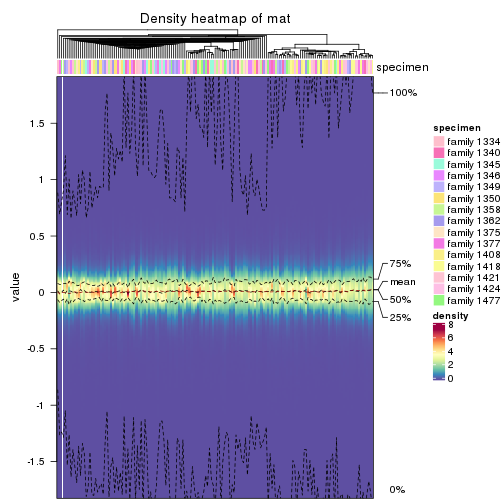


### Suggest the best k


Folowing table shows the best `k` (number of partitions) for each combination
of top-value methods and partition methods. Clicking on the method name in
the table goes to the section for a single combination of methods.

[The cola vignette](http://bioconductor.org/packages/devel/bioc/vignettes/cola/inst/doc/cola.html#toc_13)
explains the definition of the metrics used for determining the best
number of partitions.


```r
suggest_best_k(res_list)
```


|                            | The best k| 1-PAC| Mean silhouette| Concordance|   |Optional k |
|:---------------------------|----------:|-----:|---------------:|-----------:|:--|:----------|
|[ATC:skmeans](#ATC-skmeans) |          2| 1.000|           0.993|       0.997|** |           |
|[ATC:pam](#ATC-pam)         |          2| 1.000|           0.967|       0.987|** |           |
|[CV:skmeans](#CV-skmeans)   |          2| 0.950|           0.936|       0.975|*  |           |
|[ATC:kmeans](#ATC-kmeans)   |          4| 0.947|           0.911|       0.963|*  |2,3        |
|[CV:kmeans](#CV-kmeans)     |          2| 0.890|           0.929|       0.971|   |           |
|[ATC:mclust](#ATC-mclust)   |          2| 0.796|           0.899|       0.921|   |           |
|[ATC:NMF](#ATC-NMF)         |          2| 0.666|           0.832|       0.926|   |           |
|[MAD:mclust](#MAD-mclust)   |          6| 0.653|           0.673|       0.782|   |           |
|[ATC:hclust](#ATC-hclust)   |          2| 0.611|           0.916|       0.939|   |           |
|[SD:skmeans](#SD-skmeans)   |          3| 0.598|           0.771|       0.860|   |           |
|[MAD:skmeans](#MAD-skmeans) |          3| 0.592|           0.784|       0.851|   |           |
|[CV:pam](#CV-pam)           |          2| 0.518|           0.773|       0.901|   |           |
|[MAD:kmeans](#MAD-kmeans)   |          2| 0.491|           0.612|       0.788|   |           |
|[SD:kmeans](#SD-kmeans)     |          2| 0.475|           0.717|       0.829|   |           |
|[MAD:pam](#MAD-pam)         |          2| 0.463|           0.708|       0.878|   |           |
|[CV:mclust](#CV-mclust)     |          5| 0.458|           0.534|       0.726|   |           |
|[SD:NMF](#SD-NMF)           |          2| 0.454|           0.733|       0.869|   |           |
|[SD:pam](#SD-pam)           |          2| 0.453|           0.779|       0.899|   |           |
|[MAD:NMF](#MAD-NMF)         |          2| 0.410|           0.633|       0.844|   |           |
|[SD:mclust](#SD-mclust)     |          2| 0.243|           0.790|       0.838|   |           |
|[CV:hclust](#CV-hclust)     |          2| 0.234|           0.752|       0.839|   |           |
|[SD:hclust](#SD-hclust)     |          3| 0.159|           0.580|       0.735|   |           |
|[CV:NMF](#CV-NMF)           |          2| 0.156|           0.554|       0.754|   |           |
|[MAD:hclust](#MAD-hclust)   |          2| 0.142|           0.294|       0.701|   |           |

\*\*: 1-PAC > 0.95, \*: 1-PAC > 0.9


### CDF of consensus matrices

Cumulative distribution function curves of consensus matrix for all methods.


```r
collect_plots(res_list, fun = plot_ecdf)
```


### Consensus heatmap

Consensus heatmaps for all methods. ([What is a consensus heatmap?](http://bioconductor.org/packages/devel/bioc/vignettes/cola/inst/doc/cola.html#toc_9))


<style type='text/css'>


.ui-helper-hidden {
	display: none;
}
.ui-helper-hidden-accessible {
	border: 0;
	clip: rect(0 0 0 0);
	height: 1px;
	margin: -1px;
	overflow: hidden;
	padding: 0;
	position: absolute;
	width: 1px;
}
.ui-helper-reset {
	margin: 0;
	padding: 0;
	border: 0;
	outline: 0;
	line-height: 1.3;
	text-decoration: none;
	font-size: 100%;
	list-style: none;
}
.ui-helper-clearfix:before,
.ui-helper-clearfix:after {
	content: "";
	display: table;
	border-collapse: collapse;
}
.ui-helper-clearfix:after {
	clear: both;
}
.ui-helper-zfix {
	width: 100%;
	height: 100%;
	top: 0;
	left: 0;
	position: absolute;
	opacity: 0;
	filter:Alpha(Opacity=0); 
}

.ui-front {
	z-index: 100;
}


.ui-state-disabled {
	cursor: default !important;
	pointer-events: none;
}


.ui-icon {
	display: inline-block;
	vertical-align: middle;
	margin-top: -.25em;
	position: relative;
	text-indent: -99999px;
	overflow: hidden;
	background-repeat: no-repeat;
}

.ui-widget-icon-block {
	left: 50%;
	margin-left: -8px;
	display: block;
}


.ui-widget-overlay {
	position: fixed;
	top: 0;
	left: 0;
	width: 100%;
	height: 100%;
}
.ui-accordion .ui-accordion-header {
	display: block;
	cursor: pointer;
	position: relative;
	margin: 2px 0 0 0;
	padding: .5em .5em .5em .7em;
	font-size: 100%;
}
.ui-accordion .ui-accordion-content {
	padding: 1em 2.2em;
	border-top: 0;
	overflow: auto;
}
.ui-autocomplete {
	position: absolute;
	top: 0;
	left: 0;
	cursor: default;
}
.ui-menu {
	list-style: none;
	padding: 0;
	margin: 0;
	display: block;
	outline: 0;
}
.ui-menu .ui-menu {
	position: absolute;
}
.ui-menu .ui-menu-item {
	margin: 0;
	cursor: pointer;
	
	list-style-image: url("data:image/gif;base64,R0lGODlhAQABAIAAAAAAAP///yH5BAEAAAAALAAAAAABAAEAAAIBRAA7");
}
.ui-menu .ui-menu-item-wrapper {
	position: relative;
	padding: 3px 1em 3px .4em;
}
.ui-menu .ui-menu-divider {
	margin: 5px 0;
	height: 0;
	font-size: 0;
	line-height: 0;
	border-width: 1px 0 0 0;
}
.ui-menu .ui-state-focus,
.ui-menu .ui-state-active {
	margin: -1px;
}


.ui-menu-icons {
	position: relative;
}
.ui-menu-icons .ui-menu-item-wrapper {
	padding-left: 2em;
}


.ui-menu .ui-icon {
	position: absolute;
	top: 0;
	bottom: 0;
	left: .2em;
	margin: auto 0;
}


.ui-menu .ui-menu-icon {
	left: auto;
	right: 0;
}
.ui-button {
	padding: .4em 1em;
	display: inline-block;
	position: relative;
	line-height: normal;
	margin-right: .1em;
	cursor: pointer;
	vertical-align: middle;
	text-align: center;
	-webkit-user-select: none;
	-moz-user-select: none;
	-ms-user-select: none;
	user-select: none;

	
	overflow: visible;
}

.ui-button,
.ui-button:link,
.ui-button:visited,
.ui-button:hover,
.ui-button:active {
	text-decoration: none;
}


.ui-button-icon-only {
	width: 2em;
	box-sizing: border-box;
	text-indent: -9999px;
	white-space: nowrap;
}


input.ui-button.ui-button-icon-only {
	text-indent: 0;
}


.ui-button-icon-only .ui-icon {
	position: absolute;
	top: 50%;
	left: 50%;
	margin-top: -8px;
	margin-left: -8px;
}

.ui-button.ui-icon-notext .ui-icon {
	padding: 0;
	width: 2.1em;
	height: 2.1em;
	text-indent: -9999px;
	white-space: nowrap;

}

input.ui-button.ui-icon-notext .ui-icon {
	width: auto;
	height: auto;
	text-indent: 0;
	white-space: normal;
	padding: .4em 1em;
}


input.ui-button::-moz-focus-inner,
button.ui-button::-moz-focus-inner {
	border: 0;
	padding: 0;
}
.ui-controlgroup {
	vertical-align: middle;
	display: inline-block;
}
.ui-controlgroup > .ui-controlgroup-item {
	float: left;
	margin-left: 0;
	margin-right: 0;
}
.ui-controlgroup > .ui-controlgroup-item:focus,
.ui-controlgroup > .ui-controlgroup-item.ui-visual-focus {
	z-index: 9999;
}
.ui-controlgroup-vertical > .ui-controlgroup-item {
	display: block;
	float: none;
	width: 100%;
	margin-top: 0;
	margin-bottom: 0;
	text-align: left;
}
.ui-controlgroup-vertical .ui-controlgroup-item {
	box-sizing: border-box;
}
.ui-controlgroup .ui-controlgroup-label {
	padding: .4em 1em;
}
.ui-controlgroup .ui-controlgroup-label span {
	font-size: 80%;
}
.ui-controlgroup-horizontal .ui-controlgroup-label + .ui-controlgroup-item {
	border-left: none;
}
.ui-controlgroup-vertical .ui-controlgroup-label + .ui-controlgroup-item {
	border-top: none;
}
.ui-controlgroup-horizontal .ui-controlgroup-label.ui-widget-content {
	border-right: none;
}
.ui-controlgroup-vertical .ui-controlgroup-label.ui-widget-content {
	border-bottom: none;
}


.ui-controlgroup-vertical .ui-spinner-input {

	
	width: 75%;
	width: calc( 100% - 2.4em );
}
.ui-controlgroup-vertical .ui-spinner .ui-spinner-up {
	border-top-style: solid;
}

.ui-checkboxradio-label .ui-icon-background {
	box-shadow: inset 1px 1px 1px #ccc;
	border-radius: .12em;
	border: none;
}
.ui-checkboxradio-radio-label .ui-icon-background {
	width: 16px;
	height: 16px;
	border-radius: 1em;
	overflow: visible;
	border: none;
}
.ui-checkboxradio-radio-label.ui-checkboxradio-checked .ui-icon,
.ui-checkboxradio-radio-label.ui-checkboxradio-checked:hover .ui-icon {
	background-image: none;
	width: 8px;
	height: 8px;
	border-width: 4px;
	border-style: solid;
}
.ui-checkboxradio-disabled {
	pointer-events: none;
}
.ui-datepicker {
	width: 17em;
	padding: .2em .2em 0;
	display: none;
}
.ui-datepicker .ui-datepicker-header {
	position: relative;
	padding: .2em 0;
}
.ui-datepicker .ui-datepicker-prev,
.ui-datepicker .ui-datepicker-next {
	position: absolute;
	top: 2px;
	width: 1.8em;
	height: 1.8em;
}
.ui-datepicker .ui-datepicker-prev-hover,
.ui-datepicker .ui-datepicker-next-hover {
	top: 1px;
}
.ui-datepicker .ui-datepicker-prev {
	left: 2px;
}
.ui-datepicker .ui-datepicker-next {
	right: 2px;
}
.ui-datepicker .ui-datepicker-prev-hover {
	left: 1px;
}
.ui-datepicker .ui-datepicker-next-hover {
	right: 1px;
}
.ui-datepicker .ui-datepicker-prev span,
.ui-datepicker .ui-datepicker-next span {
	display: block;
	position: absolute;
	left: 50%;
	margin-left: -8px;
	top: 50%;
	margin-top: -8px;
}
.ui-datepicker .ui-datepicker-title {
	margin: 0 2.3em;
	line-height: 1.8em;
	text-align: center;
}
.ui-datepicker .ui-datepicker-title select {
	font-size: 1em;
	margin: 1px 0;
}
.ui-datepicker select.ui-datepicker-month,
.ui-datepicker select.ui-datepicker-year {
	width: 45%;
}
.ui-datepicker table {
	width: 100%;
	font-size: .9em;
	border-collapse: collapse;
	margin: 0 0 .4em;
}
.ui-datepicker th {
	padding: .7em .3em;
	text-align: center;
	font-weight: bold;
	border: 0;
}
.ui-datepicker td {
	border: 0;
	padding: 1px;
}
.ui-datepicker td span,
.ui-datepicker td a {
	display: block;
	padding: .2em;
	text-align: right;
	text-decoration: none;
}
.ui-datepicker .ui-datepicker-buttonpane {
	background-image: none;
	margin: .7em 0 0 0;
	padding: 0 .2em;
	border-left: 0;
	border-right: 0;
	border-bottom: 0;
}
.ui-datepicker .ui-datepicker-buttonpane button {
	float: right;
	margin: .5em .2em .4em;
	cursor: pointer;
	padding: .2em .6em .3em .6em;
	width: auto;
	overflow: visible;
}
.ui-datepicker .ui-datepicker-buttonpane button.ui-datepicker-current {
	float: left;
}


.ui-datepicker.ui-datepicker-multi {
	width: auto;
}
.ui-datepicker-multi .ui-datepicker-group {
	float: left;
}
.ui-datepicker-multi .ui-datepicker-group table {
	width: 95%;
	margin: 0 auto .4em;
}
.ui-datepicker-multi-2 .ui-datepicker-group {
	width: 50%;
}
.ui-datepicker-multi-3 .ui-datepicker-group {
	width: 33.3%;
}
.ui-datepicker-multi-4 .ui-datepicker-group {
	width: 25%;
}
.ui-datepicker-multi .ui-datepicker-group-last .ui-datepicker-header,
.ui-datepicker-multi .ui-datepicker-group-middle .ui-datepicker-header {
	border-left-width: 0;
}
.ui-datepicker-multi .ui-datepicker-buttonpane {
	clear: left;
}
.ui-datepicker-row-break {
	clear: both;
	width: 100%;
	font-size: 0;
}


.ui-datepicker-rtl {
	direction: rtl;
}
.ui-datepicker-rtl .ui-datepicker-prev {
	right: 2px;
	left: auto;
}
.ui-datepicker-rtl .ui-datepicker-next {
	left: 2px;
	right: auto;
}
.ui-datepicker-rtl .ui-datepicker-prev:hover {
	right: 1px;
	left: auto;
}
.ui-datepicker-rtl .ui-datepicker-next:hover {
	left: 1px;
	right: auto;
}
.ui-datepicker-rtl .ui-datepicker-buttonpane {
	clear: right;
}
.ui-datepicker-rtl .ui-datepicker-buttonpane button {
	float: left;
}
.ui-datepicker-rtl .ui-datepicker-buttonpane button.ui-datepicker-current,
.ui-datepicker-rtl .ui-datepicker-group {
	float: right;
}
.ui-datepicker-rtl .ui-datepicker-group-last .ui-datepicker-header,
.ui-datepicker-rtl .ui-datepicker-group-middle .ui-datepicker-header {
	border-right-width: 0;
	border-left-width: 1px;
}


.ui-datepicker .ui-icon {
	display: block;
	text-indent: -99999px;
	overflow: hidden;
	background-repeat: no-repeat;
	left: .5em;
	top: .3em;
}
.ui-dialog {
	position: absolute;
	top: 0;
	left: 0;
	padding: .2em;
	outline: 0;
}
.ui-dialog .ui-dialog-titlebar {
	padding: .4em 1em;
	position: relative;
}
.ui-dialog .ui-dialog-title {
	float: left;
	margin: .1em 0;
	white-space: nowrap;
	width: 90%;
	overflow: hidden;
	text-overflow: ellipsis;
}
.ui-dialog .ui-dialog-titlebar-close {
	position: absolute;
	right: .3em;
	top: 50%;
	width: 20px;
	margin: -10px 0 0 0;
	padding: 1px;
	height: 20px;
}
.ui-dialog .ui-dialog-content {
	position: relative;
	border: 0;
	padding: .5em 1em;
	background: none;
	overflow: auto;
}
.ui-dialog .ui-dialog-buttonpane {
	text-align: left;
	border-width: 1px 0 0 0;
	background-image: none;
	margin-top: .5em;
	padding: .3em 1em .5em .4em;
}
.ui-dialog .ui-dialog-buttonpane .ui-dialog-buttonset {
	float: right;
}
.ui-dialog .ui-dialog-buttonpane button {
	margin: .5em .4em .5em 0;
	cursor: pointer;
}
.ui-dialog .ui-resizable-n {
	height: 2px;
	top: 0;
}
.ui-dialog .ui-resizable-e {
	width: 2px;
	right: 0;
}
.ui-dialog .ui-resizable-s {
	height: 2px;
	bottom: 0;
}
.ui-dialog .ui-resizable-w {
	width: 2px;
	left: 0;
}
.ui-dialog .ui-resizable-se,
.ui-dialog .ui-resizable-sw,
.ui-dialog .ui-resizable-ne,
.ui-dialog .ui-resizable-nw {
	width: 7px;
	height: 7px;
}
.ui-dialog .ui-resizable-se {
	right: 0;
	bottom: 0;
}
.ui-dialog .ui-resizable-sw {
	left: 0;
	bottom: 0;
}
.ui-dialog .ui-resizable-ne {
	right: 0;
	top: 0;
}
.ui-dialog .ui-resizable-nw {
	left: 0;
	top: 0;
}
.ui-draggable .ui-dialog-titlebar {
	cursor: move;
}
.ui-draggable-handle {
	-ms-touch-action: none;
	touch-action: none;
}
.ui-resizable {
	position: relative;
}
.ui-resizable-handle {
	position: absolute;
	font-size: 0.1px;
	display: block;
	-ms-touch-action: none;
	touch-action: none;
}
.ui-resizable-disabled .ui-resizable-handle,
.ui-resizable-autohide .ui-resizable-handle {
	display: none;
}
.ui-resizable-n {
	cursor: n-resize;
	height: 7px;
	width: 100%;
	top: -5px;
	left: 0;
}
.ui-resizable-s {
	cursor: s-resize;
	height: 7px;
	width: 100%;
	bottom: -5px;
	left: 0;
}
.ui-resizable-e {
	cursor: e-resize;
	width: 7px;
	right: -5px;
	top: 0;
	height: 100%;
}
.ui-resizable-w {
	cursor: w-resize;
	width: 7px;
	left: -5px;
	top: 0;
	height: 100%;
}
.ui-resizable-se {
	cursor: se-resize;
	width: 12px;
	height: 12px;
	right: 1px;
	bottom: 1px;
}
.ui-resizable-sw {
	cursor: sw-resize;
	width: 9px;
	height: 9px;
	left: -5px;
	bottom: -5px;
}
.ui-resizable-nw {
	cursor: nw-resize;
	width: 9px;
	height: 9px;
	left: -5px;
	top: -5px;
}
.ui-resizable-ne {
	cursor: ne-resize;
	width: 9px;
	height: 9px;
	right: -5px;
	top: -5px;
}
.ui-progressbar {
	height: 2em;
	text-align: left;
	overflow: hidden;
}
.ui-progressbar .ui-progressbar-value {
	margin: -1px;
	height: 100%;
}
.ui-progressbar .ui-progressbar-overlay {
	background: url("data:image/gif;base64,R0lGODlhKAAoAIABAAAAAP///yH/C05FVFNDQVBFMi4wAwEAAAAh+QQJAQABACwAAAAAKAAoAAACkYwNqXrdC52DS06a7MFZI+4FHBCKoDeWKXqymPqGqxvJrXZbMx7Ttc+w9XgU2FB3lOyQRWET2IFGiU9m1frDVpxZZc6bfHwv4c1YXP6k1Vdy292Fb6UkuvFtXpvWSzA+HycXJHUXiGYIiMg2R6W459gnWGfHNdjIqDWVqemH2ekpObkpOlppWUqZiqr6edqqWQAAIfkECQEAAQAsAAAAACgAKAAAApSMgZnGfaqcg1E2uuzDmmHUBR8Qil95hiPKqWn3aqtLsS18y7G1SzNeowWBENtQd+T1JktP05nzPTdJZlR6vUxNWWjV+vUWhWNkWFwxl9VpZRedYcflIOLafaa28XdsH/ynlcc1uPVDZxQIR0K25+cICCmoqCe5mGhZOfeYSUh5yJcJyrkZWWpaR8doJ2o4NYq62lAAACH5BAkBAAEALAAAAAAoACgAAAKVDI4Yy22ZnINRNqosw0Bv7i1gyHUkFj7oSaWlu3ovC8GxNso5fluz3qLVhBVeT/Lz7ZTHyxL5dDalQWPVOsQWtRnuwXaFTj9jVVh8pma9JjZ4zYSj5ZOyma7uuolffh+IR5aW97cHuBUXKGKXlKjn+DiHWMcYJah4N0lYCMlJOXipGRr5qdgoSTrqWSq6WFl2ypoaUAAAIfkECQEAAQAsAAAAACgAKAAAApaEb6HLgd/iO7FNWtcFWe+ufODGjRfoiJ2akShbueb0wtI50zm02pbvwfWEMWBQ1zKGlLIhskiEPm9R6vRXxV4ZzWT2yHOGpWMyorblKlNp8HmHEb/lCXjcW7bmtXP8Xt229OVWR1fod2eWqNfHuMjXCPkIGNileOiImVmCOEmoSfn3yXlJWmoHGhqp6ilYuWYpmTqKUgAAIfkECQEAAQAsAAAAACgAKAAAApiEH6kb58biQ3FNWtMFWW3eNVcojuFGfqnZqSebuS06w5V80/X02pKe8zFwP6EFWOT1lDFk8rGERh1TTNOocQ61Hm4Xm2VexUHpzjymViHrFbiELsefVrn6XKfnt2Q9G/+Xdie499XHd2g4h7ioOGhXGJboGAnXSBnoBwKYyfioubZJ2Hn0RuRZaflZOil56Zp6iioKSXpUAAAh+QQJAQABACwAAAAAKAAoAAACkoQRqRvnxuI7kU1a1UU5bd5tnSeOZXhmn5lWK3qNTWvRdQxP8qvaC+/yaYQzXO7BMvaUEmJRd3TsiMAgswmNYrSgZdYrTX6tSHGZO73ezuAw2uxuQ+BbeZfMxsexY35+/Qe4J1inV0g4x3WHuMhIl2jXOKT2Q+VU5fgoSUI52VfZyfkJGkha6jmY+aaYdirq+lQAACH5BAkBAAEALAAAAAAoACgAAAKWBIKpYe0L3YNKToqswUlvznigd4wiR4KhZrKt9Upqip61i9E3vMvxRdHlbEFiEXfk9YARYxOZZD6VQ2pUunBmtRXo1Lf8hMVVcNl8JafV38aM2/Fu5V16Bn63r6xt97j09+MXSFi4BniGFae3hzbH9+hYBzkpuUh5aZmHuanZOZgIuvbGiNeomCnaxxap2upaCZsq+1kAACH5BAkBAAEALAAAAAAoACgAAAKXjI8By5zf4kOxTVrXNVlv1X0d8IGZGKLnNpYtm8Lr9cqVeuOSvfOW79D9aDHizNhDJidFZhNydEahOaDH6nomtJjp1tutKoNWkvA6JqfRVLHU/QUfau9l2x7G54d1fl995xcIGAdXqMfBNadoYrhH+Mg2KBlpVpbluCiXmMnZ2Sh4GBqJ+ckIOqqJ6LmKSllZmsoq6wpQAAAh+QQJAQABACwAAAAAKAAoAAAClYx/oLvoxuJDkU1a1YUZbJ59nSd2ZXhWqbRa2/gF8Gu2DY3iqs7yrq+xBYEkYvFSM8aSSObE+ZgRl1BHFZNr7pRCavZ5BW2142hY3AN/zWtsmf12p9XxxFl2lpLn1rseztfXZjdIWIf2s5dItwjYKBgo9yg5pHgzJXTEeGlZuenpyPmpGQoKOWkYmSpaSnqKileI2FAAACH5BAkBAAEALAAAAAAoACgAAAKVjB+gu+jG4kORTVrVhRlsnn2dJ3ZleFaptFrb+CXmO9OozeL5VfP99HvAWhpiUdcwkpBH3825AwYdU8xTqlLGhtCosArKMpvfa1mMRae9VvWZfeB2XfPkeLmm18lUcBj+p5dnN8jXZ3YIGEhYuOUn45aoCDkp16hl5IjYJvjWKcnoGQpqyPlpOhr3aElaqrq56Bq7VAAAOw==");
	height: 100%;
	filter: alpha(opacity=25); 
	opacity: 0.25;
}
.ui-progressbar-indeterminate .ui-progressbar-value {
	background-image: none;
}
.ui-selectable {
	-ms-touch-action: none;
	touch-action: none;
}
.ui-selectable-helper {
	position: absolute;
	z-index: 100;
	border: 1px dotted black;
}
.ui-selectmenu-menu {
	padding: 0;
	margin: 0;
	position: absolute;
	top: 0;
	left: 0;
	display: none;
}
.ui-selectmenu-menu .ui-menu {
	overflow: auto;
	overflow-x: hidden;
	padding-bottom: 1px;
}
.ui-selectmenu-menu .ui-menu .ui-selectmenu-optgroup {
	font-size: 1em;
	font-weight: bold;
	line-height: 1.5;
	padding: 2px 0.4em;
	margin: 0.5em 0 0 0;
	height: auto;
	border: 0;
}
.ui-selectmenu-open {
	display: block;
}
.ui-selectmenu-text {
	display: block;
	margin-right: 20px;
	overflow: hidden;
	text-overflow: ellipsis;
}
.ui-selectmenu-button.ui-button {
	text-align: left;
	white-space: nowrap;
	width: 14em;
}
.ui-selectmenu-icon.ui-icon {
	float: right;
	margin-top: 0;
}
.ui-slider {
	position: relative;
	text-align: left;
}
.ui-slider .ui-slider-handle {
	position: absolute;
	z-index: 2;
	width: 1.2em;
	height: 1.2em;
	cursor: default;
	-ms-touch-action: none;
	touch-action: none;
}
.ui-slider .ui-slider-range {
	position: absolute;
	z-index: 1;
	font-size: .7em;
	display: block;
	border: 0;
	background-position: 0 0;
}


.ui-slider.ui-state-disabled .ui-slider-handle,
.ui-slider.ui-state-disabled .ui-slider-range {
	filter: inherit;
}

.ui-slider-horizontal {
	height: .8em;
}
.ui-slider-horizontal .ui-slider-handle {
	top: -.3em;
	margin-left: -.6em;
}
.ui-slider-horizontal .ui-slider-range {
	top: 0;
	height: 100%;
}
.ui-slider-horizontal .ui-slider-range-min {
	left: 0;
}
.ui-slider-horizontal .ui-slider-range-max {
	right: 0;
}

.ui-slider-vertical {
	width: .8em;
	height: 100px;
}
.ui-slider-vertical .ui-slider-handle {
	left: -.3em;
	margin-left: 0;
	margin-bottom: -.6em;
}
.ui-slider-vertical .ui-slider-range {
	left: 0;
	width: 100%;
}
.ui-slider-vertical .ui-slider-range-min {
	bottom: 0;
}
.ui-slider-vertical .ui-slider-range-max {
	top: 0;
}
.ui-sortable-handle {
	-ms-touch-action: none;
	touch-action: none;
}
.ui-spinner {
	position: relative;
	display: inline-block;
	overflow: hidden;
	padding: 0;
	vertical-align: middle;
}
.ui-spinner-input {
	border: none;
	background: none;
	color: inherit;
	padding: .222em 0;
	margin: .2em 0;
	vertical-align: middle;
	margin-left: .4em;
	margin-right: 2em;
}
.ui-spinner-button {
	width: 1.6em;
	height: 50%;
	font-size: .5em;
	padding: 0;
	margin: 0;
	text-align: center;
	position: absolute;
	cursor: default;
	display: block;
	overflow: hidden;
	right: 0;
}

.ui-spinner a.ui-spinner-button {
	border-top-style: none;
	border-bottom-style: none;
	border-right-style: none;
}
.ui-spinner-up {
	top: 0;
}
.ui-spinner-down {
	bottom: 0;
}
.ui-tabs {
	position: relative;
	padding: .2em;
}
.ui-tabs .ui-tabs-nav {
	margin: 0;
	padding: .2em .2em 0;
}
.ui-tabs .ui-tabs-nav li {
	list-style: none;
	float: left;
	position: relative;
	top: 0;
	margin: 1px .2em 0 0;
	border-bottom-width: 0;
	padding: 0;
	white-space: nowrap;
}
.ui-tabs .ui-tabs-nav .ui-tabs-anchor {
	float: left;
	padding: .5em 1em;
	text-decoration: none;
}
.ui-tabs .ui-tabs-nav li.ui-tabs-active {
	margin-bottom: -1px;
	padding-bottom: 1px;
}
.ui-tabs .ui-tabs-nav li.ui-tabs-active .ui-tabs-anchor,
.ui-tabs .ui-tabs-nav li.ui-state-disabled .ui-tabs-anchor,
.ui-tabs .ui-tabs-nav li.ui-tabs-loading .ui-tabs-anchor {
	cursor: text;
}
.ui-tabs-collapsible .ui-tabs-nav li.ui-tabs-active .ui-tabs-anchor {
	cursor: pointer;
}
.ui-tabs .ui-tabs-panel {
	display: block;
	border-width: 0;
	padding: 1em 1.4em;
	background: none;
}
.ui-tooltip {
	padding: 8px;
	position: absolute;
	z-index: 9999;
	max-width: 300px;
}
body .ui-tooltip {
	border-width: 2px;
}

.ui-widget {
	font-family: Arial,Helvetica,sans-serif;
	font-size: 1em;
}
.ui-widget .ui-widget {
	font-size: 1em;
}
.ui-widget input,
.ui-widget select,
.ui-widget textarea,
.ui-widget button {
	font-family: Arial,Helvetica,sans-serif;
	font-size: 1em;
}
.ui-widget.ui-widget-content {
	border: 1px solid #c5c5c5;
}
.ui-widget-content {
	border: 1px solid #dddddd;
	background: #ffffff;
	color: #333333;
}
.ui-widget-content a {
	color: #333333;
}
.ui-widget-header {
	border: 1px solid #dddddd;
	background: #e9e9e9;
	color: #333333;
	font-weight: bold;
}
.ui-widget-header a {
	color: #333333;
}


.ui-state-default,
.ui-widget-content .ui-state-default,
.ui-widget-header .ui-state-default,
.ui-button,


html .ui-button.ui-state-disabled:hover,
html .ui-button.ui-state-disabled:active {
	border: 1px solid #c5c5c5;
	background: #f6f6f6;
	font-weight: normal;
	color: #454545;
}
.ui-state-default a,
.ui-state-default a:link,
.ui-state-default a:visited,
a.ui-button,
a:link.ui-button,
a:visited.ui-button,
.ui-button {
	color: #454545;
	text-decoration: none;
}
.ui-state-hover,
.ui-widget-content .ui-state-hover,
.ui-widget-header .ui-state-hover,
.ui-state-focus,
.ui-widget-content .ui-state-focus,
.ui-widget-header .ui-state-focus,
.ui-button:hover,
.ui-button:focus {
	border: 1px solid #cccccc;
	background: #ededed;
	font-weight: normal;
	color: #2b2b2b;
}
.ui-state-hover a,
.ui-state-hover a:hover,
.ui-state-hover a:link,
.ui-state-hover a:visited,
.ui-state-focus a,
.ui-state-focus a:hover,
.ui-state-focus a:link,
.ui-state-focus a:visited,
a.ui-button:hover,
a.ui-button:focus {
	color: #2b2b2b;
	text-decoration: none;
}

.ui-visual-focus {
	box-shadow: 0 0 3px 1px rgb(94, 158, 214);
}
.ui-state-active,
.ui-widget-content .ui-state-active,
.ui-widget-header .ui-state-active,
a.ui-button:active,
.ui-button:active,
.ui-button.ui-state-active:hover {
	border: 1px solid #003eff;
	background: #007fff;
	font-weight: normal;
	color: #ffffff;
}
.ui-icon-background,
.ui-state-active .ui-icon-background {
	border: #003eff;
	background-color: #ffffff;
}
.ui-state-active a,
.ui-state-active a:link,
.ui-state-active a:visited {
	color: #ffffff;
	text-decoration: none;
}


.ui-state-highlight,
.ui-widget-content .ui-state-highlight,
.ui-widget-header .ui-state-highlight {
	border: 1px solid #dad55e;
	background: #fffa90;
	color: #777620;
}
.ui-state-checked {
	border: 1px solid #dad55e;
	background: #fffa90;
}
.ui-state-highlight a,
.ui-widget-content .ui-state-highlight a,
.ui-widget-header .ui-state-highlight a {
	color: #777620;
}
.ui-state-error,
.ui-widget-content .ui-state-error,
.ui-widget-header .ui-state-error {
	border: 1px solid #f1a899;
	background: #fddfdf;
	color: #5f3f3f;
}
.ui-state-error a,
.ui-widget-content .ui-state-error a,
.ui-widget-header .ui-state-error a {
	color: #5f3f3f;
}
.ui-state-error-text,
.ui-widget-content .ui-state-error-text,
.ui-widget-header .ui-state-error-text {
	color: #5f3f3f;
}
.ui-priority-primary,
.ui-widget-content .ui-priority-primary,
.ui-widget-header .ui-priority-primary {
	font-weight: bold;
}
.ui-priority-secondary,
.ui-widget-content .ui-priority-secondary,
.ui-widget-header .ui-priority-secondary {
	opacity: .7;
	filter:Alpha(Opacity=70); 
	font-weight: normal;
}
.ui-state-disabled,
.ui-widget-content .ui-state-disabled,
.ui-widget-header .ui-state-disabled {
	opacity: .35;
	filter:Alpha(Opacity=35); 
	background-image: none;
}
.ui-state-disabled .ui-icon {
	filter:Alpha(Opacity=35); 
}


.ui-icon {
	width: 16px;
	height: 16px;
}
.ui-icon,
.ui-widget-content .ui-icon {
	background-image: url("images/ui-icons_444444_256x240.png");
}
.ui-widget-header .ui-icon {
	background-image: url("images/ui-icons_444444_256x240.png");
}
.ui-state-hover .ui-icon,
.ui-state-focus .ui-icon,
.ui-button:hover .ui-icon,
.ui-button:focus .ui-icon {
	background-image: url("images/ui-icons_555555_256x240.png");
}
.ui-state-active .ui-icon,
.ui-button:active .ui-icon {
	background-image: url("images/ui-icons_ffffff_256x240.png");
}
.ui-state-highlight .ui-icon,
.ui-button .ui-state-highlight.ui-icon {
	background-image: url("images/ui-icons_777620_256x240.png");
}
.ui-state-error .ui-icon,
.ui-state-error-text .ui-icon {
	background-image: url("images/ui-icons_cc0000_256x240.png");
}
.ui-button .ui-icon {
	background-image: url("images/ui-icons_777777_256x240.png");
}


.ui-icon-blank { background-position: 16px 16px; }
.ui-icon-caret-1-n { background-position: 0 0; }
.ui-icon-caret-1-ne { background-position: -16px 0; }
.ui-icon-caret-1-e { background-position: -32px 0; }
.ui-icon-caret-1-se { background-position: -48px 0; }
.ui-icon-caret-1-s { background-position: -65px 0; }
.ui-icon-caret-1-sw { background-position: -80px 0; }
.ui-icon-caret-1-w { background-position: -96px 0; }
.ui-icon-caret-1-nw { background-position: -112px 0; }
.ui-icon-caret-2-n-s { background-position: -128px 0; }
.ui-icon-caret-2-e-w { background-position: -144px 0; }
.ui-icon-triangle-1-n { background-position: 0 -16px; }
.ui-icon-triangle-1-ne { background-position: -16px -16px; }
.ui-icon-triangle-1-e { background-position: -32px -16px; }
.ui-icon-triangle-1-se { background-position: -48px -16px; }
.ui-icon-triangle-1-s { background-position: -65px -16px; }
.ui-icon-triangle-1-sw { background-position: -80px -16px; }
.ui-icon-triangle-1-w { background-position: -96px -16px; }
.ui-icon-triangle-1-nw { background-position: -112px -16px; }
.ui-icon-triangle-2-n-s { background-position: -128px -16px; }
.ui-icon-triangle-2-e-w { background-position: -144px -16px; }
.ui-icon-arrow-1-n { background-position: 0 -32px; }
.ui-icon-arrow-1-ne { background-position: -16px -32px; }
.ui-icon-arrow-1-e { background-position: -32px -32px; }
.ui-icon-arrow-1-se { background-position: -48px -32px; }
.ui-icon-arrow-1-s { background-position: -65px -32px; }
.ui-icon-arrow-1-sw { background-position: -80px -32px; }
.ui-icon-arrow-1-w { background-position: -96px -32px; }
.ui-icon-arrow-1-nw { background-position: -112px -32px; }
.ui-icon-arrow-2-n-s { background-position: -128px -32px; }
.ui-icon-arrow-2-ne-sw { background-position: -144px -32px; }
.ui-icon-arrow-2-e-w { background-position: -160px -32px; }
.ui-icon-arrow-2-se-nw { background-position: -176px -32px; }
.ui-icon-arrowstop-1-n { background-position: -192px -32px; }
.ui-icon-arrowstop-1-e { background-position: -208px -32px; }
.ui-icon-arrowstop-1-s { background-position: -224px -32px; }
.ui-icon-arrowstop-1-w { background-position: -240px -32px; }
.ui-icon-arrowthick-1-n { background-position: 1px -48px; }
.ui-icon-arrowthick-1-ne { background-position: -16px -48px; }
.ui-icon-arrowthick-1-e { background-position: -32px -48px; }
.ui-icon-arrowthick-1-se { background-position: -48px -48px; }
.ui-icon-arrowthick-1-s { background-position: -64px -48px; }
.ui-icon-arrowthick-1-sw { background-position: -80px -48px; }
.ui-icon-arrowthick-1-w { background-position: -96px -48px; }
.ui-icon-arrowthick-1-nw { background-position: -112px -48px; }
.ui-icon-arrowthick-2-n-s { background-position: -128px -48px; }
.ui-icon-arrowthick-2-ne-sw { background-position: -144px -48px; }
.ui-icon-arrowthick-2-e-w { background-position: -160px -48px; }
.ui-icon-arrowthick-2-se-nw { background-position: -176px -48px; }
.ui-icon-arrowthickstop-1-n { background-position: -192px -48px; }
.ui-icon-arrowthickstop-1-e { background-position: -208px -48px; }
.ui-icon-arrowthickstop-1-s { background-position: -224px -48px; }
.ui-icon-arrowthickstop-1-w { background-position: -240px -48px; }
.ui-icon-arrowreturnthick-1-w { background-position: 0 -64px; }
.ui-icon-arrowreturnthick-1-n { background-position: -16px -64px; }
.ui-icon-arrowreturnthick-1-e { background-position: -32px -64px; }
.ui-icon-arrowreturnthick-1-s { background-position: -48px -64px; }
.ui-icon-arrowreturn-1-w { background-position: -64px -64px; }
.ui-icon-arrowreturn-1-n { background-position: -80px -64px; }
.ui-icon-arrowreturn-1-e { background-position: -96px -64px; }
.ui-icon-arrowreturn-1-s { background-position: -112px -64px; }
.ui-icon-arrowrefresh-1-w { background-position: -128px -64px; }
.ui-icon-arrowrefresh-1-n { background-position: -144px -64px; }
.ui-icon-arrowrefresh-1-e { background-position: -160px -64px; }
.ui-icon-arrowrefresh-1-s { background-position: -176px -64px; }
.ui-icon-arrow-4 { background-position: 0 -80px; }
.ui-icon-arrow-4-diag { background-position: -16px -80px; }
.ui-icon-extlink { background-position: -32px -80px; }
.ui-icon-newwin { background-position: -48px -80px; }
.ui-icon-refresh { background-position: -64px -80px; }
.ui-icon-shuffle { background-position: -80px -80px; }
.ui-icon-transfer-e-w { background-position: -96px -80px; }
.ui-icon-transferthick-e-w { background-position: -112px -80px; }
.ui-icon-folder-collapsed { background-position: 0 -96px; }
.ui-icon-folder-open { background-position: -16px -96px; }
.ui-icon-document { background-position: -32px -96px; }
.ui-icon-document-b { background-position: -48px -96px; }
.ui-icon-note { background-position: -64px -96px; }
.ui-icon-mail-closed { background-position: -80px -96px; }
.ui-icon-mail-open { background-position: -96px -96px; }
.ui-icon-suitcase { background-position: -112px -96px; }
.ui-icon-comment { background-position: -128px -96px; }
.ui-icon-person { background-position: -144px -96px; }
.ui-icon-print { background-position: -160px -96px; }
.ui-icon-trash { background-position: -176px -96px; }
.ui-icon-locked { background-position: -192px -96px; }
.ui-icon-unlocked { background-position: -208px -96px; }
.ui-icon-bookmark { background-position: -224px -96px; }
.ui-icon-tag { background-position: -240px -96px; }
.ui-icon-home { background-position: 0 -112px; }
.ui-icon-flag { background-position: -16px -112px; }
.ui-icon-calendar { background-position: -32px -112px; }
.ui-icon-cart { background-position: -48px -112px; }
.ui-icon-pencil { background-position: -64px -112px; }
.ui-icon-clock { background-position: -80px -112px; }
.ui-icon-disk { background-position: -96px -112px; }
.ui-icon-calculator { background-position: -112px -112px; }
.ui-icon-zoomin { background-position: -128px -112px; }
.ui-icon-zoomout { background-position: -144px -112px; }
.ui-icon-search { background-position: -160px -112px; }
.ui-icon-wrench { background-position: -176px -112px; }
.ui-icon-gear { background-position: -192px -112px; }
.ui-icon-heart { background-position: -208px -112px; }
.ui-icon-star { background-position: -224px -112px; }
.ui-icon-link { background-position: -240px -112px; }
.ui-icon-cancel { background-position: 0 -128px; }
.ui-icon-plus { background-position: -16px -128px; }
.ui-icon-plusthick { background-position: -32px -128px; }
.ui-icon-minus { background-position: -48px -128px; }
.ui-icon-minusthick { background-position: -64px -128px; }
.ui-icon-close { background-position: -80px -128px; }
.ui-icon-closethick { background-position: -96px -128px; }
.ui-icon-key { background-position: -112px -128px; }
.ui-icon-lightbulb { background-position: -128px -128px; }
.ui-icon-scissors { background-position: -144px -128px; }
.ui-icon-clipboard { background-position: -160px -128px; }
.ui-icon-copy { background-position: -176px -128px; }
.ui-icon-contact { background-position: -192px -128px; }
.ui-icon-image { background-position: -208px -128px; }
.ui-icon-video { background-position: -224px -128px; }
.ui-icon-script { background-position: -240px -128px; }
.ui-icon-alert { background-position: 0 -144px; }
.ui-icon-info { background-position: -16px -144px; }
.ui-icon-notice { background-position: -32px -144px; }
.ui-icon-help { background-position: -48px -144px; }
.ui-icon-check { background-position: -64px -144px; }
.ui-icon-bullet { background-position: -80px -144px; }
.ui-icon-radio-on { background-position: -96px -144px; }
.ui-icon-radio-off { background-position: -112px -144px; }
.ui-icon-pin-w { background-position: -128px -144px; }
.ui-icon-pin-s { background-position: -144px -144px; }
.ui-icon-play { background-position: 0 -160px; }
.ui-icon-pause { background-position: -16px -160px; }
.ui-icon-seek-next { background-position: -32px -160px; }
.ui-icon-seek-prev { background-position: -48px -160px; }
.ui-icon-seek-end { background-position: -64px -160px; }
.ui-icon-seek-start { background-position: -80px -160px; }

.ui-icon-seek-first { background-position: -80px -160px; }
.ui-icon-stop { background-position: -96px -160px; }
.ui-icon-eject { background-position: -112px -160px; }
.ui-icon-volume-off { background-position: -128px -160px; }
.ui-icon-volume-on { background-position: -144px -160px; }
.ui-icon-power { background-position: 0 -176px; }
.ui-icon-signal-diag { background-position: -16px -176px; }
.ui-icon-signal { background-position: -32px -176px; }
.ui-icon-battery-0 { background-position: -48px -176px; }
.ui-icon-battery-1 { background-position: -64px -176px; }
.ui-icon-battery-2 { background-position: -80px -176px; }
.ui-icon-battery-3 { background-position: -96px -176px; }
.ui-icon-circle-plus { background-position: 0 -192px; }
.ui-icon-circle-minus { background-position: -16px -192px; }
.ui-icon-circle-close { background-position: -32px -192px; }
.ui-icon-circle-triangle-e { background-position: -48px -192px; }
.ui-icon-circle-triangle-s { background-position: -64px -192px; }
.ui-icon-circle-triangle-w { background-position: -80px -192px; }
.ui-icon-circle-triangle-n { background-position: -96px -192px; }
.ui-icon-circle-arrow-e { background-position: -112px -192px; }
.ui-icon-circle-arrow-s { background-position: -128px -192px; }
.ui-icon-circle-arrow-w { background-position: -144px -192px; }
.ui-icon-circle-arrow-n { background-position: -160px -192px; }
.ui-icon-circle-zoomin { background-position: -176px -192px; }
.ui-icon-circle-zoomout { background-position: -192px -192px; }
.ui-icon-circle-check { background-position: -208px -192px; }
.ui-icon-circlesmall-plus { background-position: 0 -208px; }
.ui-icon-circlesmall-minus { background-position: -16px -208px; }
.ui-icon-circlesmall-close { background-position: -32px -208px; }
.ui-icon-squaresmall-plus { background-position: -48px -208px; }
.ui-icon-squaresmall-minus { background-position: -64px -208px; }
.ui-icon-squaresmall-close { background-position: -80px -208px; }
.ui-icon-grip-dotted-vertical { background-position: 0 -224px; }
.ui-icon-grip-dotted-horizontal { background-position: -16px -224px; }
.ui-icon-grip-solid-vertical { background-position: -32px -224px; }
.ui-icon-grip-solid-horizontal { background-position: -48px -224px; }
.ui-icon-gripsmall-diagonal-se { background-position: -64px -224px; }
.ui-icon-grip-diagonal-se { background-position: -80px -224px; }


.ui-corner-all,
.ui-corner-top,
.ui-corner-left,
.ui-corner-tl {
	border-top-left-radius: 3px;
}
.ui-corner-all,
.ui-corner-top,
.ui-corner-right,
.ui-corner-tr {
	border-top-right-radius: 3px;
}
.ui-corner-all,
.ui-corner-bottom,
.ui-corner-left,
.ui-corner-bl {
	border-bottom-left-radius: 3px;
}
.ui-corner-all,
.ui-corner-bottom,
.ui-corner-right,
.ui-corner-br {
	border-bottom-right-radius: 3px;
}


.ui-widget-overlay {
	background: #aaaaaa;
	opacity: .3;
	filter: Alpha(Opacity=30); 
}
.ui-widget-shadow {
	-webkit-box-shadow: 0px 0px 5px #666666;
	box-shadow: 0px 0px 5px #666666;
} 
</style>
<script src='js/jquery-1.12.4.js'></script>
<script src='js/jquery-ui.js'></script>

<script>
$( function() {
	$( '#tabs-collect-consensus-heatmap' ).tabs();
} );
</script>
<div id='tabs-collect-consensus-heatmap'>
<ul>
<li><a href='#tab-collect-consensus-heatmap-1'>k = 2</a></li>
<li><a href='#tab-collect-consensus-heatmap-2'>k = 3</a></li>
<li><a href='#tab-collect-consensus-heatmap-3'>k = 4</a></li>
<li><a href='#tab-collect-consensus-heatmap-4'>k = 5</a></li>
<li><a href='#tab-collect-consensus-heatmap-5'>k = 6</a></li>
</ul>
<div id='tab-collect-consensus-heatmap-1'>
<pre><code class="r">collect_plots(res_list, k = 2, fun = consensus_heatmap, mc.cores = 4)
</code></pre>

<p></p>

</div>
<div id='tab-collect-consensus-heatmap-2'>
<pre><code class="r">collect_plots(res_list, k = 3, fun = consensus_heatmap, mc.cores = 4)
</code></pre>

<p></p>

</div>
<div id='tab-collect-consensus-heatmap-3'>
<pre><code class="r">collect_plots(res_list, k = 4, fun = consensus_heatmap, mc.cores = 4)
</code></pre>

<p>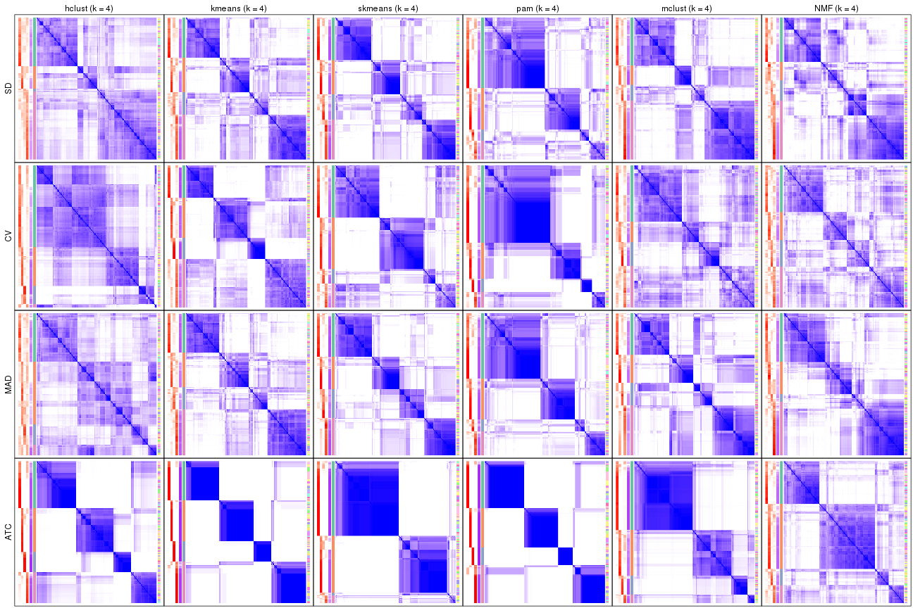</p>

</div>
<div id='tab-collect-consensus-heatmap-4'>
<pre><code class="r">collect_plots(res_list, k = 5, fun = consensus_heatmap, mc.cores = 4)
</code></pre>

<p></p>

</div>
<div id='tab-collect-consensus-heatmap-5'>
<pre><code class="r">collect_plots(res_list, k = 6, fun = consensus_heatmap, mc.cores = 4)
</code></pre>

<p></p>

</div>
</div>


### Membership heatmap

Membership heatmaps for all methods. ([What is a membership heatmap?](http://bioconductor.org/packages/devel/bioc/vignettes/cola/inst/doc/cola.html#toc_12))


<script>
$( function() {
	$( '#tabs-collect-membership-heatmap' ).tabs();
} );
</script>
<div id='tabs-collect-membership-heatmap'>
<ul>
<li><a href='#tab-collect-membership-heatmap-1'>k = 2</a></li>
<li><a href='#tab-collect-membership-heatmap-2'>k = 3</a></li>
<li><a href='#tab-collect-membership-heatmap-3'>k = 4</a></li>
<li><a href='#tab-collect-membership-heatmap-4'>k = 5</a></li>
<li><a href='#tab-collect-membership-heatmap-5'>k = 6</a></li>
</ul>
<div id='tab-collect-membership-heatmap-1'>
<pre><code class="r">collect_plots(res_list, k = 2, fun = membership_heatmap, mc.cores = 4)
</code></pre>

<p></p>

</div>
<div id='tab-collect-membership-heatmap-2'>
<pre><code class="r">collect_plots(res_list, k = 3, fun = membership_heatmap, mc.cores = 4)
</code></pre>

<p></p>

</div>
<div id='tab-collect-membership-heatmap-3'>
<pre><code class="r">collect_plots(res_list, k = 4, fun = membership_heatmap, mc.cores = 4)
</code></pre>

<p></p>

</div>
<div id='tab-collect-membership-heatmap-4'>
<pre><code class="r">collect_plots(res_list, k = 5, fun = membership_heatmap, mc.cores = 4)
</code></pre>

<p></p>

</div>
<div id='tab-collect-membership-heatmap-5'>
<pre><code class="r">collect_plots(res_list, k = 6, fun = membership_heatmap, mc.cores = 4)
</code></pre>

<p></p>

</div>
</div>


### Signature heatmap

Signature heatmaps for all methods. ([What is a signature heatmap?](http://bioconductor.org/packages/devel/bioc/vignettes/cola/inst/doc/cola.html#toc_22))


Note in following heatmaps, rows are scaled.


<script>
$( function() {
	$( '#tabs-collect-get-signatures' ).tabs();
} );
</script>
<div id='tabs-collect-get-signatures'>
<ul>
<li><a href='#tab-collect-get-signatures-1'>k = 2</a></li>
<li><a href='#tab-collect-get-signatures-2'>k = 3</a></li>
<li><a href='#tab-collect-get-signatures-3'>k = 4</a></li>
<li><a href='#tab-collect-get-signatures-4'>k = 5</a></li>
<li><a href='#tab-collect-get-signatures-5'>k = 6</a></li>
</ul>
<div id='tab-collect-get-signatures-1'>
<pre><code class="r">collect_plots(res_list, k = 2, fun = get_signatures, mc.cores = 4)
</code></pre>

<p></p>

</div>
<div id='tab-collect-get-signatures-2'>
<pre><code class="r">collect_plots(res_list, k = 3, fun = get_signatures, mc.cores = 4)
</code></pre>

<p></p>

</div>
<div id='tab-collect-get-signatures-3'>
<pre><code class="r">collect_plots(res_list, k = 4, fun = get_signatures, mc.cores = 4)
</code></pre>

<p></p>

</div>
<div id='tab-collect-get-signatures-4'>
<pre><code class="r">collect_plots(res_list, k = 5, fun = get_signatures, mc.cores = 4)
</code></pre>

<p></p>

</div>
<div id='tab-collect-get-signatures-5'>
<pre><code class="r">collect_plots(res_list, k = 6, fun = get_signatures, mc.cores = 4)
</code></pre>

<p></p>

</div>
</div>


### Statistics table

The statistics used for measuring the stability of consensus partitioning.
([How are they
defined?](http://bioconductor.org/packages/devel/bioc/vignettes/cola/inst/doc/cola.html#toc_13))


<script>
$( function() {
	$( '#tabs-get-stats-from-consensus-partition-list' ).tabs();
} );
</script>
<div id='tabs-get-stats-from-consensus-partition-list'>
<ul>
<li><a href='#tab-get-stats-from-consensus-partition-list-1'>k = 2</a></li>
<li><a href='#tab-get-stats-from-consensus-partition-list-2'>k = 3</a></li>
<li><a href='#tab-get-stats-from-consensus-partition-list-3'>k = 4</a></li>
<li><a href='#tab-get-stats-from-consensus-partition-list-4'>k = 5</a></li>
<li><a href='#tab-get-stats-from-consensus-partition-list-5'>k = 6</a></li>
</ul>
<div id='tab-get-stats-from-consensus-partition-list-1'>
<pre><code class="r">get_stats(res_list, k = 2)
</code></pre>

<pre><code>#&gt;             k 1-PAC mean_silhouette concordance area_increased  Rand Jaccard
#&gt; SD:NMF      2 0.454           0.733       0.869          0.492 0.498   0.498
#&gt; CV:NMF      2 0.156           0.554       0.754          0.461 0.556   0.556
#&gt; MAD:NMF     2 0.410           0.633       0.844          0.491 0.497   0.497
#&gt; ATC:NMF     2 0.666           0.832       0.926          0.460 0.519   0.519
#&gt; SD:skmeans  2 0.493           0.712       0.837          0.501 0.498   0.498
#&gt; CV:skmeans  2 0.950           0.936       0.975          0.499 0.503   0.503
#&gt; MAD:skmeans 2 0.504           0.709       0.835          0.500 0.498   0.498
#&gt; ATC:skmeans 2 1.000           0.993       0.997          0.499 0.501   0.501
#&gt; SD:mclust   2 0.243           0.790       0.838          0.479 0.497   0.497
#&gt; CV:mclust   2 0.108           0.251       0.709          0.387 0.826   0.826
#&gt; MAD:mclust  2 0.225           0.680       0.763          0.458 0.497   0.497
#&gt; ATC:mclust  2 0.796           0.899       0.921          0.468 0.500   0.500
#&gt; SD:kmeans   2 0.475           0.717       0.829          0.493 0.498   0.498
#&gt; CV:kmeans   2 0.890           0.929       0.971          0.483 0.514   0.514
#&gt; MAD:kmeans  2 0.491           0.612       0.788          0.491 0.499   0.499
#&gt; ATC:kmeans  2 1.000           0.986       0.994          0.490 0.510   0.510
#&gt; SD:pam      2 0.453           0.779       0.899          0.483 0.517   0.517
#&gt; CV:pam      2 0.518           0.773       0.901          0.394 0.578   0.578
#&gt; MAD:pam     2 0.463           0.708       0.878          0.480 0.519   0.519
#&gt; ATC:pam     2 1.000           0.967       0.987          0.496 0.502   0.502
#&gt; SD:hclust   2 0.151           0.433       0.743          0.416 0.573   0.573
#&gt; CV:hclust   2 0.234           0.752       0.839          0.419 0.522   0.522
#&gt; MAD:hclust  2 0.142           0.294       0.701          0.454 0.615   0.615
#&gt; ATC:hclust  2 0.611           0.916       0.939          0.467 0.501   0.501
</code></pre>

</div>
<div id='tab-get-stats-from-consensus-partition-list-2'>
<pre><code class="r">get_stats(res_list, k = 3)
</code></pre>

<pre><code>#&gt;             k 1-PAC mean_silhouette concordance area_increased  Rand Jaccard
#&gt; SD:NMF      3 0.440           0.442       0.719          0.327 0.845   0.704
#&gt; CV:NMF      3 0.297           0.464       0.730          0.362 0.671   0.476
#&gt; MAD:NMF     3 0.407           0.643       0.769          0.329 0.706   0.481
#&gt; ATC:NMF     3 0.450           0.659       0.787          0.304 0.796   0.640
#&gt; SD:skmeans  3 0.598           0.771       0.860          0.312 0.710   0.481
#&gt; CV:skmeans  3 0.661           0.767       0.872          0.241 0.895   0.793
#&gt; MAD:skmeans 3 0.592           0.784       0.851          0.315 0.697   0.464
#&gt; ATC:skmeans 3 0.872           0.863       0.940          0.122 0.956   0.912
#&gt; SD:mclust   3 0.407           0.568       0.747          0.264 0.845   0.712
#&gt; CV:mclust   3 0.178           0.313       0.660          0.443 0.497   0.435
#&gt; MAD:mclust  3 0.325           0.572       0.747          0.320 0.819   0.669
#&gt; ATC:mclust  3 0.446           0.744       0.780          0.202 0.942   0.890
#&gt; SD:kmeans   3 0.535           0.684       0.750          0.317 0.703   0.474
#&gt; CV:kmeans   3 0.591           0.783       0.895          0.307 0.660   0.440
#&gt; MAD:kmeans  3 0.390           0.608       0.762          0.319 0.719   0.498
#&gt; ATC:kmeans  3 0.948           0.957       0.982          0.242 0.798   0.636
#&gt; SD:pam      3 0.514           0.627       0.805          0.285 0.773   0.598
#&gt; CV:pam      3 0.725           0.773       0.899          0.266 0.814   0.705
#&gt; MAD:pam     3 0.520           0.726       0.857          0.303 0.788   0.613
#&gt; ATC:pam     3 0.654           0.581       0.761          0.272 0.646   0.406
#&gt; SD:hclust   3 0.159           0.580       0.735          0.450 0.602   0.417
#&gt; CV:hclust   3 0.295           0.671       0.805          0.306 0.873   0.765
#&gt; MAD:hclust  3 0.177           0.512       0.664          0.331 0.583   0.419
#&gt; ATC:hclust  3 0.735           0.882       0.937          0.276 0.910   0.820
</code></pre>

</div>
<div id='tab-get-stats-from-consensus-partition-list-3'>
<pre><code class="r">get_stats(res_list, k = 4)
</code></pre>

<pre><code>#&gt;             k 1-PAC mean_silhouette concordance area_increased  Rand Jaccard
#&gt; SD:NMF      4 0.461           0.323       0.657         0.0931 0.835   0.615
#&gt; CV:NMF      4 0.350           0.390       0.630         0.1569 0.752   0.437
#&gt; MAD:NMF     4 0.512           0.538       0.742         0.0879 0.887   0.704
#&gt; ATC:NMF     4 0.428           0.576       0.762         0.1651 0.838   0.639
#&gt; SD:skmeans  4 0.588           0.643       0.807         0.1274 0.865   0.625
#&gt; CV:skmeans  4 0.571           0.563       0.787         0.1488 0.867   0.684
#&gt; MAD:skmeans 4 0.603           0.722       0.815         0.1289 0.848   0.586
#&gt; ATC:skmeans 4 0.794           0.728       0.900         0.0810 0.979   0.953
#&gt; SD:mclust   4 0.517           0.566       0.740         0.1513 0.840   0.641
#&gt; CV:mclust   4 0.300           0.407       0.618         0.1973 0.686   0.404
#&gt; MAD:mclust  4 0.513           0.468       0.731         0.1705 0.782   0.519
#&gt; ATC:mclust  4 0.717           0.736       0.857         0.1578 0.757   0.561
#&gt; SD:kmeans   4 0.497           0.558       0.725         0.1276 0.858   0.614
#&gt; CV:kmeans   4 0.542           0.677       0.777         0.1509 0.749   0.427
#&gt; MAD:kmeans  4 0.520           0.615       0.759         0.1354 0.838   0.575
#&gt; ATC:kmeans  4 0.947           0.911       0.963         0.2115 0.806   0.543
#&gt; SD:pam      4 0.491           0.550       0.789         0.1064 0.919   0.802
#&gt; CV:pam      4 0.567           0.676       0.871         0.2462 0.871   0.744
#&gt; MAD:pam     4 0.599           0.695       0.851         0.0962 0.929   0.813
#&gt; ATC:pam     4 0.893           0.899       0.959         0.1518 0.805   0.513
#&gt; SD:hclust   4 0.288           0.364       0.619         0.1507 0.935   0.844
#&gt; CV:hclust   4 0.259           0.417       0.703         0.1699 0.946   0.881
#&gt; MAD:hclust  4 0.260           0.329       0.557         0.1570 0.897   0.755
#&gt; ATC:hclust  4 0.722           0.787       0.887         0.2223 0.857   0.652
</code></pre>

</div>
<div id='tab-get-stats-from-consensus-partition-list-4'>
<pre><code class="r">get_stats(res_list, k = 5)
</code></pre>

<pre><code>#&gt;             k 1-PAC mean_silhouette concordance area_increased  Rand Jaccard
#&gt; SD:NMF      5 0.538           0.379       0.679         0.0722 0.842   0.569
#&gt; CV:NMF      5 0.451           0.385       0.655         0.0749 0.865   0.558
#&gt; MAD:NMF     5 0.552           0.564       0.751         0.0800 0.866   0.608
#&gt; ATC:NMF     5 0.470           0.445       0.701         0.0869 0.841   0.560
#&gt; SD:skmeans  5 0.622           0.512       0.703         0.0700 0.934   0.756
#&gt; CV:skmeans  5 0.575           0.482       0.733         0.0612 0.942   0.818
#&gt; MAD:skmeans 5 0.612           0.471       0.699         0.0712 0.925   0.723
#&gt; ATC:skmeans 5 0.794           0.730       0.857         0.0634 0.917   0.812
#&gt; SD:mclust   5 0.554           0.384       0.640         0.1003 0.861   0.597
#&gt; CV:mclust   5 0.458           0.534       0.726         0.1088 0.850   0.565
#&gt; MAD:mclust  5 0.584           0.541       0.737         0.0917 0.832   0.498
#&gt; ATC:mclust  5 0.655           0.751       0.845         0.0633 0.900   0.747
#&gt; SD:kmeans   5 0.545           0.490       0.679         0.0755 0.879   0.597
#&gt; CV:kmeans   5 0.566           0.516       0.693         0.0708 0.938   0.777
#&gt; MAD:kmeans  5 0.565           0.426       0.642         0.0707 0.904   0.672
#&gt; ATC:kmeans  5 0.775           0.750       0.840         0.0721 0.845   0.505
#&gt; SD:pam      5 0.548           0.542       0.769         0.0843 0.867   0.643
#&gt; CV:pam      5 0.599           0.575       0.822         0.0974 0.917   0.793
#&gt; MAD:pam     5 0.600           0.611       0.799         0.0964 0.916   0.748
#&gt; ATC:pam     5 0.794           0.758       0.888         0.0472 0.973   0.900
#&gt; SD:hclust   5 0.352           0.269       0.534         0.0708 0.831   0.595
#&gt; CV:hclust   5 0.308           0.480       0.694         0.0820 0.894   0.755
#&gt; MAD:hclust  5 0.337           0.300       0.553         0.0784 0.805   0.501
#&gt; ATC:hclust  5 0.722           0.693       0.829         0.0584 0.944   0.796
</code></pre>

</div>
<div id='tab-get-stats-from-consensus-partition-list-5'>
<pre><code class="r">get_stats(res_list, k = 6)
</code></pre>

<pre><code>#&gt;             k 1-PAC mean_silhouette concordance area_increased  Rand Jaccard
#&gt; SD:NMF      6 0.610           0.517       0.726         0.0526 0.837   0.491
#&gt; CV:NMF      6 0.507           0.341       0.591         0.0410 0.886   0.563
#&gt; MAD:NMF     6 0.615           0.566       0.759         0.0533 0.812   0.402
#&gt; ATC:NMF     6 0.490           0.410       0.666         0.0404 0.942   0.774
#&gt; SD:skmeans  6 0.653           0.494       0.700         0.0447 0.918   0.653
#&gt; CV:skmeans  6 0.593           0.448       0.691         0.0436 0.912   0.712
#&gt; MAD:skmeans 6 0.667           0.589       0.737         0.0440 0.890   0.564
#&gt; ATC:skmeans 6 0.711           0.767       0.872         0.0495 0.964   0.904
#&gt; SD:mclust   6 0.638           0.563       0.728         0.0622 0.816   0.382
#&gt; CV:mclust   6 0.498           0.314       0.617         0.0542 0.812   0.431
#&gt; MAD:mclust  6 0.653           0.673       0.782         0.0519 0.895   0.586
#&gt; ATC:mclust  6 0.615           0.652       0.770         0.0765 0.967   0.903
#&gt; SD:kmeans   6 0.610           0.359       0.619         0.0468 0.861   0.468
#&gt; CV:kmeans   6 0.614           0.554       0.636         0.0431 0.887   0.562
#&gt; MAD:kmeans  6 0.616           0.469       0.643         0.0464 0.847   0.443
#&gt; ATC:kmeans  6 0.787           0.720       0.832         0.0442 0.890   0.549
#&gt; SD:pam      6 0.646           0.650       0.814         0.0531 0.908   0.678
#&gt; CV:pam      6 0.615           0.580       0.813         0.0376 0.935   0.815
#&gt; MAD:pam     6 0.657           0.594       0.797         0.0480 0.893   0.620
#&gt; ATC:pam     6 0.884           0.794       0.921         0.0627 0.902   0.638
#&gt; SD:hclust   6 0.409           0.317       0.548         0.0519 0.792   0.406
#&gt; CV:hclust   6 0.373           0.457       0.663         0.0544 0.916   0.764
#&gt; MAD:hclust  6 0.428           0.390       0.568         0.0513 0.931   0.736
#&gt; ATC:hclust  6 0.699           0.314       0.633         0.0361 0.846   0.461
</code></pre>

</div>
</div>

Following heatmap plots the partition for each combination of methods and the
lightness correspond to the silhouette scores for samples in each method. On
top the consensus subgroup is inferred from all methods by taking the mean
silhouette scores as weight.


<script>
$( function() {
	$( '#tabs-collect-stats-from-consensus-partition-list' ).tabs();
} );
</script>
<div id='tabs-collect-stats-from-consensus-partition-list'>
<ul>
<li><a href='#tab-collect-stats-from-consensus-partition-list-1'>k = 2</a></li>
<li><a href='#tab-collect-stats-from-consensus-partition-list-2'>k = 3</a></li>
<li><a href='#tab-collect-stats-from-consensus-partition-list-3'>k = 4</a></li>
<li><a href='#tab-collect-stats-from-consensus-partition-list-4'>k = 5</a></li>
<li><a href='#tab-collect-stats-from-consensus-partition-list-5'>k = 6</a></li>
</ul>
<div id='tab-collect-stats-from-consensus-partition-list-1'>
<pre><code class="r">collect_stats(res_list, k = 2)
</code></pre>

<p></p>

</div>
<div id='tab-collect-stats-from-consensus-partition-list-2'>
<pre><code class="r">collect_stats(res_list, k = 3)
</code></pre>

<p></p>

</div>
<div id='tab-collect-stats-from-consensus-partition-list-3'>
<pre><code class="r">collect_stats(res_list, k = 4)
</code></pre>

<p></p>

</div>
<div id='tab-collect-stats-from-consensus-partition-list-4'>
<pre><code class="r">collect_stats(res_list, k = 5)
</code></pre>

<p>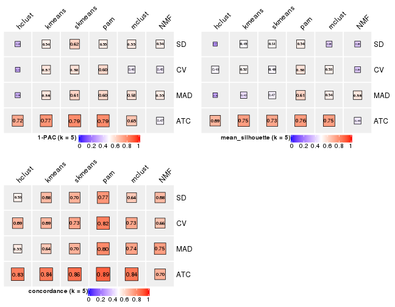</p>

</div>
<div id='tab-collect-stats-from-consensus-partition-list-5'>
<pre><code class="r">collect_stats(res_list, k = 6)
</code></pre>

<p></p>

</div>
</div>

### Partition from all methods


Collect partitions from all methods:


<script>
$( function() {
	$( '#tabs-collect-classes-from-consensus-partition-list' ).tabs();
} );
</script>
<div id='tabs-collect-classes-from-consensus-partition-list'>
<ul>
<li><a href='#tab-collect-classes-from-consensus-partition-list-1'>k = 2</a></li>
<li><a href='#tab-collect-classes-from-consensus-partition-list-2'>k = 3</a></li>
<li><a href='#tab-collect-classes-from-consensus-partition-list-3'>k = 4</a></li>
<li><a href='#tab-collect-classes-from-consensus-partition-list-4'>k = 5</a></li>
<li><a href='#tab-collect-classes-from-consensus-partition-list-5'>k = 6</a></li>
</ul>
<div id='tab-collect-classes-from-consensus-partition-list-1'>
<pre><code class="r">collect_classes(res_list, k = 2)
</code></pre>

<p></p>

</div>
<div id='tab-collect-classes-from-consensus-partition-list-2'>
<pre><code class="r">collect_classes(res_list, k = 3)
</code></pre>

<p></p>

</div>
<div id='tab-collect-classes-from-consensus-partition-list-3'>
<pre><code class="r">collect_classes(res_list, k = 4)
</code></pre>

<p></p>

</div>
<div id='tab-collect-classes-from-consensus-partition-list-4'>
<pre><code class="r">collect_classes(res_list, k = 5)
</code></pre>

<p></p>

</div>
<div id='tab-collect-classes-from-consensus-partition-list-5'>
<pre><code class="r">collect_classes(res_list, k = 6)
</code></pre>

<p></p>

</div>
</div>


### Top rows overlap


Overlap of top rows from different top-row methods:


<script>
$( function() {
	$( '#tabs-top-rows-overlap-by-euler' ).tabs();
} );
</script>
<div id='tabs-top-rows-overlap-by-euler'>
<ul>
<li><a href='#tab-top-rows-overlap-by-euler-1'>top_n = 1000</a></li>
<li><a href='#tab-top-rows-overlap-by-euler-2'>top_n = 2000</a></li>
<li><a href='#tab-top-rows-overlap-by-euler-3'>top_n = 3000</a></li>
<li><a href='#tab-top-rows-overlap-by-euler-4'>top_n = 4000</a></li>
<li><a href='#tab-top-rows-overlap-by-euler-5'>top_n = 5000</a></li>
</ul>
<div id='tab-top-rows-overlap-by-euler-1'>
<pre><code class="r">top_rows_overlap(res_list, top_n = 1000, method = &quot;euler&quot;)
</code></pre>

<p></p>

</div>
<div id='tab-top-rows-overlap-by-euler-2'>
<pre><code class="r">top_rows_overlap(res_list, top_n = 2000, method = &quot;euler&quot;)
</code></pre>

<p></p>

</div>
<div id='tab-top-rows-overlap-by-euler-3'>
<pre><code class="r">top_rows_overlap(res_list, top_n = 3000, method = &quot;euler&quot;)
</code></pre>

<p></p>

</div>
<div id='tab-top-rows-overlap-by-euler-4'>
<pre><code class="r">top_rows_overlap(res_list, top_n = 4000, method = &quot;euler&quot;)
</code></pre>

<p></p>

</div>
<div id='tab-top-rows-overlap-by-euler-5'>
<pre><code class="r">top_rows_overlap(res_list, top_n = 5000, method = &quot;euler&quot;)
</code></pre>

<p></p>

</div>
</div>

Also visualize the correspondance of rankings between different top-row methods:


<script>
$( function() {
	$( '#tabs-top-rows-overlap-by-correspondance' ).tabs();
} );
</script>
<div id='tabs-top-rows-overlap-by-correspondance'>
<ul>
<li><a href='#tab-top-rows-overlap-by-correspondance-1'>top_n = 1000</a></li>
<li><a href='#tab-top-rows-overlap-by-correspondance-2'>top_n = 2000</a></li>
<li><a href='#tab-top-rows-overlap-by-correspondance-3'>top_n = 3000</a></li>
<li><a href='#tab-top-rows-overlap-by-correspondance-4'>top_n = 4000</a></li>
<li><a href='#tab-top-rows-overlap-by-correspondance-5'>top_n = 5000</a></li>
</ul>
<div id='tab-top-rows-overlap-by-correspondance-1'>
<pre><code class="r">top_rows_overlap(res_list, top_n = 1000, method = &quot;correspondance&quot;)
</code></pre>

<p></p>

</div>
<div id='tab-top-rows-overlap-by-correspondance-2'>
<pre><code class="r">top_rows_overlap(res_list, top_n = 2000, method = &quot;correspondance&quot;)
</code></pre>

<p></p>

</div>
<div id='tab-top-rows-overlap-by-correspondance-3'>
<pre><code class="r">top_rows_overlap(res_list, top_n = 3000, method = &quot;correspondance&quot;)
</code></pre>

<p></p>

</div>
<div id='tab-top-rows-overlap-by-correspondance-4'>
<pre><code class="r">top_rows_overlap(res_list, top_n = 4000, method = &quot;correspondance&quot;)
</code></pre>

<p></p>

</div>
<div id='tab-top-rows-overlap-by-correspondance-5'>
<pre><code class="r">top_rows_overlap(res_list, top_n = 5000, method = &quot;correspondance&quot;)
</code></pre>

<p></p>

</div>
</div>


Heatmaps of the top rows:


<script>
$( function() {
	$( '#tabs-top-rows-heatmap' ).tabs();
} );
</script>
<div id='tabs-top-rows-heatmap'>
<ul>
<li><a href='#tab-top-rows-heatmap-1'>top_n = 1000</a></li>
<li><a href='#tab-top-rows-heatmap-2'>top_n = 2000</a></li>
<li><a href='#tab-top-rows-heatmap-3'>top_n = 3000</a></li>
<li><a href='#tab-top-rows-heatmap-4'>top_n = 4000</a></li>
<li><a href='#tab-top-rows-heatmap-5'>top_n = 5000</a></li>
</ul>
<div id='tab-top-rows-heatmap-1'>
<pre><code class="r">top_rows_heatmap(res_list, top_n = 1000)
</code></pre>

<p></p>

</div>
<div id='tab-top-rows-heatmap-2'>
<pre><code class="r">top_rows_heatmap(res_list, top_n = 2000)
</code></pre>

<p></p>

</div>
<div id='tab-top-rows-heatmap-3'>
<pre><code class="r">top_rows_heatmap(res_list, top_n = 3000)
</code></pre>

<p></p>

</div>
<div id='tab-top-rows-heatmap-4'>
<pre><code class="r">top_rows_heatmap(res_list, top_n = 4000)
</code></pre>

<p></p>

</div>
<div id='tab-top-rows-heatmap-5'>
<pre><code class="r">top_rows_heatmap(res_list, top_n = 5000)
</code></pre>

<p></p>

</div>
</div>


### Test to known annotations


Test correlation between subgroups and known annotations. If the known
annotation is numeric, one-way ANOVA test is applied, and if the known
annotation is discrete, chi-squared contingency table test is applied.


<script>
$( function() {
	$( '#tabs-test-to-known-factors-from-consensus-partition-list' ).tabs();
} );
</script>
<div id='tabs-test-to-known-factors-from-consensus-partition-list'>
<ul>
<li><a href='#tab-test-to-known-factors-from-consensus-partition-list-1'>k = 2</a></li>
<li><a href='#tab-test-to-known-factors-from-consensus-partition-list-2'>k = 3</a></li>
<li><a href='#tab-test-to-known-factors-from-consensus-partition-list-3'>k = 4</a></li>
<li><a href='#tab-test-to-known-factors-from-consensus-partition-list-4'>k = 5</a></li>
<li><a href='#tab-test-to-known-factors-from-consensus-partition-list-5'>k = 6</a></li>
</ul>
<div id='tab-test-to-known-factors-from-consensus-partition-list-1'>
<pre><code class="r">test_to_known_factors(res_list, k = 2)
</code></pre>

<pre><code>#&gt;               n specimen(p) k
#&gt; SD:NMF      152    3.51e-03 2
#&gt; CV:NMF      132    6.30e-02 2
#&gt; MAD:NMF     136    2.83e-03 2
#&gt; ATC:NMF     150    1.20e-01 2
#&gt; SD:skmeans  167    3.52e-02 2
#&gt; CV:skmeans  160    5.13e-02 2
#&gt; MAD:skmeans 167    3.52e-02 2
#&gt; ATC:skmeans 166    9.67e-02 2
#&gt; SD:mclust   159    4.93e-02 2
#&gt; CV:mclust    16          NA 2
#&gt; MAD:mclust  155    1.30e-02 2
#&gt; ATC:mclust  160    1.50e-01 2
#&gt; SD:kmeans   161    1.01e-02 2
#&gt; CV:kmeans   162    4.41e-03 2
#&gt; MAD:kmeans  142    5.04e-02 2
#&gt; ATC:kmeans  166    2.68e-01 2
#&gt; SD:pam      149    2.46e-05 2
#&gt; CV:pam      145    1.19e-02 2
#&gt; MAD:pam     140    1.33e-04 2
#&gt; ATC:pam     165    1.20e-01 2
#&gt; SD:hclust    70    3.64e-03 2
#&gt; CV:hclust   156    4.78e-02 2
#&gt; MAD:hclust   11          NA 2
#&gt; ATC:hclust  166    9.87e-02 2
</code></pre>

</div>
<div id='tab-test-to-known-factors-from-consensus-partition-list-2'>
<pre><code class="r">test_to_known_factors(res_list, k = 3)
</code></pre>

<pre><code>#&gt;               n specimen(p) k
#&gt; SD:NMF       99    3.30e-02 3
#&gt; CV:NMF       92    4.37e-08 3
#&gt; MAD:NMF     140    1.49e-01 3
#&gt; ATC:NMF     146    5.99e-02 3
#&gt; SD:skmeans  152    6.78e-02 3
#&gt; CV:skmeans  153    5.37e-03 3
#&gt; MAD:skmeans 159    4.22e-02 3
#&gt; ATC:skmeans 159    4.98e-02 3
#&gt; SD:mclust   131    5.09e-02 3
#&gt; CV:mclust    48          NA 3
#&gt; MAD:mclust  140    6.14e-03 3
#&gt; ATC:mclust  159    8.27e-02 3
#&gt; SD:kmeans   133    4.77e-02 3
#&gt; CV:kmeans   151    3.07e-01 3
#&gt; MAD:kmeans  127    3.60e-02 3
#&gt; ATC:kmeans  167    1.75e-01 3
#&gt; SD:pam      135    8.25e-04 3
#&gt; CV:pam      145    1.04e-01 3
#&gt; MAD:pam     143    7.35e-03 3
#&gt; ATC:pam     126    9.63e-02 3
#&gt; SD:hclust   124    2.32e-02 3
#&gt; CV:hclust   144    1.29e-01 3
#&gt; MAD:hclust   93    7.49e-02 3
#&gt; ATC:hclust  165    1.96e-01 3
</code></pre>

</div>
<div id='tab-test-to-known-factors-from-consensus-partition-list-3'>
<pre><code class="r">test_to_known_factors(res_list, k = 4)
</code></pre>

<pre><code>#&gt;               n specimen(p) k
#&gt; SD:NMF       63    5.83e-01 4
#&gt; CV:NMF       65    1.84e-04 4
#&gt; MAD:NMF     104    9.92e-02 4
#&gt; ATC:NMF     128    1.29e-03 4
#&gt; SD:skmeans  124    1.43e-02 4
#&gt; CV:skmeans  116    1.39e-05 4
#&gt; MAD:skmeans 148    1.18e-02 4
#&gt; ATC:skmeans 134    2.38e-01 4
#&gt; SD:mclust   132    2.39e-02 4
#&gt; CV:mclust    81    3.39e-02 4
#&gt; MAD:mclust  117    7.89e-04 4
#&gt; ATC:mclust  145    6.44e-02 4
#&gt; SD:kmeans   121    2.47e-04 4
#&gt; CV:kmeans   144    1.91e-01 4
#&gt; MAD:kmeans  135    1.69e-02 4
#&gt; ATC:kmeans  162    5.40e-01 4
#&gt; SD:pam      119    1.73e-03 4
#&gt; CV:pam      135    2.06e-01 4
#&gt; MAD:pam     146    1.50e-02 4
#&gt; ATC:pam     154    4.67e-01 4
#&gt; SD:hclust    45    1.75e-01 4
#&gt; CV:hclust    75    5.83e-02 4
#&gt; MAD:hclust   63    1.58e-01 4
#&gt; ATC:hclust  152    3.91e-01 4
</code></pre>

</div>
<div id='tab-test-to-known-factors-from-consensus-partition-list-4'>
<pre><code class="r">test_to_known_factors(res_list, k = 5)
</code></pre>

<pre><code>#&gt;               n specimen(p) k
#&gt; SD:NMF       69    1.13e-01 5
#&gt; CV:NMF       56    5.69e-02 5
#&gt; MAD:NMF     103    8.80e-03 5
#&gt; ATC:NMF      90    2.54e-01 5
#&gt; SD:skmeans  113    9.15e-06 5
#&gt; CV:skmeans   99    8.67e-03 5
#&gt; MAD:skmeans  85    4.77e-01 5
#&gt; ATC:skmeans 133    1.52e-01 5
#&gt; SD:mclust    70    8.15e-02 5
#&gt; CV:mclust   115    4.13e-03 5
#&gt; MAD:mclust  115    5.95e-03 5
#&gt; ATC:mclust  149    3.13e-03 5
#&gt; SD:kmeans    97    1.59e-01 5
#&gt; CV:kmeans   104    4.80e-01 5
#&gt; MAD:kmeans   86    2.67e-01 5
#&gt; ATC:kmeans  154    4.30e-01 5
#&gt; SD:pam      104    2.40e-04 5
#&gt; CV:pam      119    2.04e-04 5
#&gt; MAD:pam     122    6.36e-02 5
#&gt; ATC:pam     150    7.06e-01 5
#&gt; SD:hclust    29    2.90e-01 5
#&gt; CV:hclust   102    1.35e-02 5
#&gt; MAD:hclust   41    1.57e-02 5
#&gt; ATC:hclust  138    2.11e-01 5
</code></pre>

</div>
<div id='tab-test-to-known-factors-from-consensus-partition-list-5'>
<pre><code class="r">test_to_known_factors(res_list, k = 6)
</code></pre>

<pre><code>#&gt;               n specimen(p) k
#&gt; SD:NMF      101    1.86e-03 6
#&gt; CV:NMF       49    2.13e-02 6
#&gt; MAD:NMF     121    3.07e-03 6
#&gt; ATC:NMF      79    3.07e-01 6
#&gt; SD:skmeans  101    4.04e-03 6
#&gt; CV:skmeans   88    1.30e-03 6
#&gt; MAD:skmeans 122    3.99e-04 6
#&gt; ATC:skmeans 149    1.96e-02 6
#&gt; SD:mclust   118    2.17e-02 6
#&gt; CV:mclust    55    1.74e-02 6
#&gt; MAD:mclust  146    7.57e-03 6
#&gt; ATC:mclust  139    5.20e-03 6
#&gt; SD:kmeans    57    4.73e-01 6
#&gt; CV:kmeans   123    1.82e-03 6
#&gt; MAD:kmeans   90    4.60e-01 6
#&gt; ATC:kmeans  143    3.86e-01 6
#&gt; SD:pam      140    1.53e-05 6
#&gt; CV:pam      115    2.86e-03 6
#&gt; MAD:pam     117    2.36e-03 6
#&gt; ATC:pam     150    4.83e-01 6
#&gt; SD:hclust    44    1.15e-01 6
#&gt; CV:hclust    92    4.84e-01 6
#&gt; MAD:hclust   69    5.94e-02 6
#&gt; ATC:hclust   69    7.65e-01 6
</code></pre>

</div>
</div>


 
## Results for each method


---------------------------------------------------


### SD:hclust


The object with results only for a single top-value method and a single partition method 
can be extracted as:

```r
res = res_list["SD", "hclust"]
# you can also extract it by
# res = res_list["SD:hclust"]
```

A summary of `res` and all the functions that can be applied to it:

```r
res
```

```
#> A 'ConsensusPartition' object with k = 2, 3, 4, 5, 6.
#>   On a matrix with 22686 rows and 167 columns.
#>   Top rows (1000, 2000, 3000, 4000, 5000) are extracted by 'SD' method.
#>   Subgroups are detected by 'hclust' method.
#>   Performed in total 1250 partitions by row resampling.
#>   Best k for subgroups seems to be 3.
#> 
#> Following methods can be applied to this 'ConsensusPartition' object:
#>  [1] "cola_report"             "collect_classes"         "collect_plots"          
#>  [4] "collect_stats"           "colnames"                "compare_signatures"     
#>  [7] "consensus_heatmap"       "dimension_reduction"     "functional_enrichment"  
#> [10] "get_anno_col"            "get_anno"                "get_classes"            
#> [13] "get_consensus"           "get_matrix"              "get_membership"         
#> [16] "get_param"               "get_signatures"          "get_stats"              
#> [19] "is_best_k"               "is_stable_k"             "membership_heatmap"     
#> [22] "ncol"                    "nrow"                    "plot_ecdf"              
#> [25] "rownames"                "select_partition_number" "show"                   
#> [28] "suggest_best_k"          "test_to_known_factors"
```

`collect_plots()` function collects all the plots made from `res` for all `k` (number of partitions)
into one single page to provide an easy and fast comparison between different `k`.

```r
collect_plots(res)
```


The plots are:

- The first row: a plot of the ECDF (Empirical cumulative distribution
  function) curves of the consensus matrix for each `k` and the heatmap of
  predicted classes for each `k`.
- The second row: heatmaps of the consensus matrix for each `k`.
- The third row: heatmaps of the membership matrix for each `k`.
- The fouth row: heatmaps of the signatures for each `k`.

All the plots in panels can be made by individual functions and they are
plotted later in this section.

`select_partition_number()` produces several plots showing different
statistics for choosing "optimized" `k`. There are following statistics:

- ECDF curves of the consensus matrix for each `k`;
- 1-PAC. [The PAC
  score](https://en.wikipedia.org/wiki/Consensus_clustering#Over-interpretation_potential_of_consensus_clustering)
  measures the proportion of the ambiguous subgrouping.
- Mean silhouette score.
- Concordance. The mean probability of fiting the consensus class ids in all
  partitions.
- Area increased. Denote $A_k$ as the area under the ECDF curve for current
  `k`, the area increased is defined as $A_k - A_{k-1}$.
- Rand index. The percent of pairs of samples that are both in a same cluster
  or both are not in a same cluster in the partition of k and k-1.
- Jaccard index. The ratio of pairs of samples are both in a same cluster in
  the partition of k and k-1 and the pairs of samples are both in a same
  cluster in the partition k or k-1.

The detailed explanations of these statistics can be found in [the cola
vignette](http://bioconductor.org/packages/devel/bioc/vignettes/cola/inst/doc/cola.html#toc_13).

Generally speaking, lower PAC score, higher mean silhouette score or higher
concordance corresponds to better partition. Rand index and Jaccard index
measure how similar the current partition is compared to partition with `k-1`.
If they are too similar, we won't accept `k` is better than `k-1`.

```r
select_partition_number(res)
```


The numeric values for all these statistics can be obtained by `get_stats()`.

```r
get_stats(res)
```

```
#>   k 1-PAC mean_silhouette concordance area_increased  Rand Jaccard
#> 2 2 0.151           0.433       0.743         0.4162 0.573   0.573
#> 3 3 0.159           0.580       0.735         0.4505 0.602   0.417
#> 4 4 0.288           0.364       0.619         0.1507 0.935   0.844
#> 5 5 0.352           0.269       0.534         0.0708 0.831   0.595
#> 6 6 0.409           0.317       0.548         0.0519 0.792   0.406
```

`suggest_best_k()` suggests the best $k$ based on these statistics. The rules are as follows:

- All $k$ with Jaccard index larger than 0.95 are removed because the increase of
  the partition number does not provides enough extra information. If all $k$ are removed,
  the best $k$ is assigned by `NA`.
- For $k$ with 1-PAC larger than 0.9, the maximal $k$ is taken as the "best k". Other $k$ is called "optional k".
- If it does not fit the second rule. The $k$ with the highest vote of highest
  1-PAC, mean silhouette and concordance is taken as the "best k".

```r
suggest_best_k(res)
```

```
#> [1] 3
```


Following shows the table of the partitions (You need to click the **show/hide
code output** link to see it). The membership matrix (columns with name `p*`)
is inferred by
[`clue::cl_consensus()`](https://www.rdocumentation.org/link/cl_consensus?package=clue)
function with the `SE` method. Basically the value in the membership matrix
represents the probability to belong to a certain group. The finall class
label for an item is determined with the group with highest probability it
belongs to.

In `get_classes()` function, the entropy is calculated from the membership
matrix and the silhouette score is calculated from the consensus matrix.


<script>
$( function() {
	$( '#tabs-SD-hclust-get-classes' ).tabs();
} );
</script>
<div id='tabs-SD-hclust-get-classes'>
<ul>
<li><a href='#tab-SD-hclust-get-classes-1'>k = 2</a></li>
<li><a href='#tab-SD-hclust-get-classes-2'>k = 3</a></li>
<li><a href='#tab-SD-hclust-get-classes-3'>k = 4</a></li>
<li><a href='#tab-SD-hclust-get-classes-4'>k = 5</a></li>
<li><a href='#tab-SD-hclust-get-classes-5'>k = 6</a></li>
</ul>

<div id='tab-SD-hclust-get-classes-1'>
<p><a id='tab-SD-hclust-get-classes-1-a' style='color:#0366d6' href='#'>show/hide code output</a></p>
<pre><code class="r">cbind(get_classes(res, k = 2), get_membership(res, k = 2))
</code></pre>

<pre><code>#&gt;          class entropy silhouette    p1    p2
#&gt; GSM30006     2  0.9635     0.3499 0.388 0.612
#&gt; GSM30007     1  0.2948     0.5976 0.948 0.052
#&gt; GSM30008     1  0.8861     0.5053 0.696 0.304
#&gt; GSM30009     1  0.1184     0.6144 0.984 0.016
#&gt; GSM30010     2  0.9393     0.3763 0.356 0.644
#&gt; GSM30011     2  0.8327     0.4716 0.264 0.736
#&gt; GSM30012     2  0.9087     0.4180 0.324 0.676
#&gt; GSM30013     2  0.9996    -0.1183 0.488 0.512
#&gt; GSM30014     2  0.9710     0.3418 0.400 0.600
#&gt; GSM30015     1  0.2948     0.6273 0.948 0.052
#&gt; GSM30016     2  0.9635     0.3499 0.388 0.612
#&gt; GSM30017     1  0.1184     0.6230 0.984 0.016
#&gt; GSM30018     2  1.0000    -0.1328 0.496 0.504
#&gt; GSM30019     2  0.8267     0.4626 0.260 0.740
#&gt; GSM30020     1  0.3733     0.6174 0.928 0.072
#&gt; GSM30021     1  0.7950     0.3512 0.760 0.240
#&gt; GSM30022     1  0.0938     0.6191 0.988 0.012
#&gt; GSM30023     1  0.4431     0.6202 0.908 0.092
#&gt; GSM30024     2  0.9608     0.3498 0.384 0.616
#&gt; GSM30025     1  0.1633     0.6226 0.976 0.024
#&gt; GSM30026     1  0.3879     0.6226 0.924 0.076
#&gt; GSM30027     1  0.4431     0.6202 0.908 0.092
#&gt; GSM30028     1  0.1633     0.6225 0.976 0.024
#&gt; GSM30029     1  0.4161     0.6209 0.916 0.084
#&gt; GSM30030     1  0.1633     0.6253 0.976 0.024
#&gt; GSM30031     1  0.1184     0.6230 0.984 0.016
#&gt; GSM30032     1  0.6531     0.4768 0.832 0.168
#&gt; GSM30033     1  0.6801     0.4808 0.820 0.180
#&gt; GSM30034     1  0.9580     0.4212 0.620 0.380
#&gt; GSM30035     1  0.5842     0.5321 0.860 0.140
#&gt; GSM30036     2  0.9988    -0.0919 0.480 0.520
#&gt; GSM30037     1  0.0938     0.6165 0.988 0.012
#&gt; GSM30038     1  0.9909     0.2858 0.556 0.444
#&gt; GSM30039     2  0.9044     0.3733 0.320 0.680
#&gt; GSM30040     2  0.8909     0.4222 0.308 0.692
#&gt; GSM30041     2  0.7453     0.5217 0.212 0.788
#&gt; GSM30042     2  0.9460     0.3363 0.364 0.636
#&gt; GSM30043     2  0.9522     0.3613 0.372 0.628
#&gt; GSM30044     1  0.1843     0.6117 0.972 0.028
#&gt; GSM30045     1  0.2043     0.6103 0.968 0.032
#&gt; GSM30046     1  0.9775     0.3812 0.588 0.412
#&gt; GSM30047     1  0.9635     0.4068 0.612 0.388
#&gt; GSM30048     1  0.9775     0.3812 0.588 0.412
#&gt; GSM30049     2  0.6247     0.5161 0.156 0.844
#&gt; GSM30050     2  0.9686     0.1762 0.396 0.604
#&gt; GSM30051     2  0.3879     0.5322 0.076 0.924
#&gt; GSM30052     1  0.0938     0.6143 0.988 0.012
#&gt; GSM30053     2  0.8909     0.3988 0.308 0.692
#&gt; GSM30054     2  0.3431     0.5298 0.064 0.936
#&gt; GSM30055     1  0.9998     0.1532 0.508 0.492
#&gt; GSM30056     2  0.8327     0.5159 0.264 0.736
#&gt; GSM30057     2  0.9393     0.3763 0.356 0.644
#&gt; GSM30058     2  0.8327     0.5159 0.264 0.736
#&gt; GSM30059     1  0.9427     0.4408 0.640 0.360
#&gt; GSM30060     1  0.9044     0.1771 0.680 0.320
#&gt; GSM30061     1  0.9996     0.1790 0.512 0.488
#&gt; GSM30062     1  0.9795     0.3731 0.584 0.416
#&gt; GSM30063     2  0.8955     0.3950 0.312 0.688
#&gt; GSM30064     1  0.8144     0.5323 0.748 0.252
#&gt; GSM30065     2  0.8267     0.4919 0.260 0.740
#&gt; GSM30066     2  0.9608     0.3498 0.384 0.616
#&gt; GSM30067     1  0.2423     0.6267 0.960 0.040
#&gt; GSM30068     2  0.9635     0.3471 0.388 0.612
#&gt; GSM30069     2  0.9608     0.3498 0.384 0.616
#&gt; GSM30070     1  0.9552     0.3627 0.624 0.376
#&gt; GSM30071     1  0.9933     0.2866 0.548 0.452
#&gt; GSM30072     1  0.2236     0.6083 0.964 0.036
#&gt; GSM30073     2  0.9710     0.1648 0.400 0.600
#&gt; GSM30074     1  0.5842     0.5597 0.860 0.140
#&gt; GSM30075     1  0.9970     0.2381 0.532 0.468
#&gt; GSM30076     1  0.9996     0.1873 0.512 0.488
#&gt; GSM30077     1  0.9710     0.3913 0.600 0.400
#&gt; GSM30078     1  0.9608     0.4110 0.616 0.384
#&gt; GSM30079     1  0.0938     0.6191 0.988 0.012
#&gt; GSM30080     1  0.9970     0.2465 0.532 0.468
#&gt; GSM30081     2  0.3114     0.5278 0.056 0.944
#&gt; GSM30086     1  0.9970     0.2465 0.532 0.468
#&gt; GSM30087     1  0.9580     0.4192 0.620 0.380
#&gt; GSM30088     1  0.9427     0.4415 0.640 0.360
#&gt; GSM30089     1  0.2423     0.6075 0.960 0.040
#&gt; GSM30090     2  0.8144     0.5209 0.252 0.748
#&gt; GSM30091     2  0.3584     0.5302 0.068 0.932
#&gt; GSM30092     1  0.9710     0.3913 0.600 0.400
#&gt; GSM30093     2  0.8386     0.4643 0.268 0.732
#&gt; GSM30094     2  0.4431     0.5365 0.092 0.908
#&gt; GSM30095     2  0.9393     0.3749 0.356 0.644
#&gt; GSM30096     1  0.2236     0.6181 0.964 0.036
#&gt; GSM30097     1  0.9522     0.4271 0.628 0.372
#&gt; GSM30098     1  0.0376     0.6189 0.996 0.004
#&gt; GSM30099     1  0.9996     0.0457 0.512 0.488
#&gt; GSM30100     2  0.9608     0.3498 0.384 0.616
#&gt; GSM30101     2  0.4431     0.5365 0.092 0.908
#&gt; GSM30102     2  0.9996     0.0954 0.488 0.512
#&gt; GSM30103     1  0.6148     0.5259 0.848 0.152
#&gt; GSM30104     1  0.9833     0.3566 0.576 0.424
#&gt; GSM30105     1  0.2778     0.6238 0.952 0.048
#&gt; GSM30106     1  0.9881     0.3187 0.564 0.436
#&gt; GSM30107     1  0.9881     0.2908 0.564 0.436
#&gt; GSM30108     1  0.2948     0.5976 0.948 0.052
#&gt; GSM30109     1  0.0376     0.6189 0.996 0.004
#&gt; GSM30110     1  0.8207     0.5327 0.744 0.256
#&gt; GSM30111     1  0.9686     0.3804 0.604 0.396
#&gt; GSM30112     1  0.2043     0.6105 0.968 0.032
#&gt; GSM30113     2  0.9427     0.3719 0.360 0.640
#&gt; GSM30114     2  0.9044     0.3733 0.320 0.680
#&gt; GSM30115     2  0.9909     0.0364 0.444 0.556
#&gt; GSM30116     1  0.8386     0.2896 0.732 0.268
#&gt; GSM30117     1  0.6438     0.4742 0.836 0.164
#&gt; GSM30118     1  0.1184     0.6164 0.984 0.016
#&gt; GSM30119     1  0.9775     0.3320 0.588 0.412
#&gt; GSM30120     1  0.9775     0.3320 0.588 0.412
#&gt; GSM30121     1  0.2423     0.6271 0.960 0.040
#&gt; GSM30122     1  0.3274     0.6126 0.940 0.060
#&gt; GSM30123     2  0.9996    -0.0820 0.488 0.512
#&gt; GSM30177     2  0.8081     0.5073 0.248 0.752
#&gt; GSM30178     2  0.9988    -0.0919 0.480 0.520
#&gt; GSM30179     1  0.4161     0.6230 0.916 0.084
#&gt; GSM30180     1  0.0672     0.6187 0.992 0.008
#&gt; GSM30181     1  0.9970     0.2630 0.532 0.468
#&gt; GSM30182     1  0.9608     0.4077 0.616 0.384
#&gt; GSM30183     1  0.3584     0.6244 0.932 0.068
#&gt; GSM30184     2  0.5629     0.5383 0.132 0.868
#&gt; GSM30185     1  0.5294     0.5313 0.880 0.120
#&gt; GSM30186     1  0.8267     0.4980 0.740 0.260
#&gt; GSM30187     1  0.9661     0.4018 0.608 0.392
#&gt; GSM30188     1  0.9608     0.4077 0.616 0.384
#&gt; GSM30189     1  0.7219     0.5715 0.800 0.200
#&gt; GSM30190     2  0.7376     0.5266 0.208 0.792
#&gt; GSM30191     1  0.9815     0.3585 0.580 0.420
#&gt; GSM30192     1  0.9963     0.2726 0.536 0.464
#&gt; GSM30193     1  0.9963     0.2726 0.536 0.464
#&gt; GSM30194     2  0.7376     0.4718 0.208 0.792
#&gt; GSM30195     1  0.9922     0.2795 0.552 0.448
#&gt; GSM30196     1  0.2043     0.6103 0.968 0.032
#&gt; GSM30197     1  0.9686     0.4057 0.604 0.396
#&gt; GSM30198     1  0.9635     0.4189 0.612 0.388
#&gt; GSM30199     1  0.5294     0.5304 0.880 0.120
#&gt; GSM30200     1  0.9209     0.4734 0.664 0.336
#&gt; GSM30201     1  0.9580     0.4212 0.620 0.380
#&gt; GSM30202     1  0.1184     0.6224 0.984 0.016
#&gt; GSM30203     1  0.9608     0.4110 0.616 0.384
#&gt; GSM30204     1  0.9815     0.3023 0.580 0.420
#&gt; GSM30205     1  0.8386     0.2886 0.732 0.268
#&gt; GSM30206     1  0.9491     0.4300 0.632 0.368
#&gt; GSM30207     1  0.9815     0.3023 0.580 0.420
#&gt; GSM30208     1  0.8955     0.4879 0.688 0.312
#&gt; GSM30209     2  0.9933     0.0876 0.452 0.548
#&gt; GSM30210     1  0.0938     0.6227 0.988 0.012
#&gt; GSM30211     1  0.9686     0.4011 0.604 0.396
#&gt; GSM30212     1  0.0672     0.6187 0.992 0.008
#&gt; GSM30213     1  0.0672     0.6187 0.992 0.008
#&gt; GSM30214     1  0.0938     0.6172 0.988 0.012
#&gt; GSM30215     1  0.3431     0.6262 0.936 0.064
#&gt; GSM30216     1  0.0376     0.6189 0.996 0.004
#&gt; GSM30217     1  0.0672     0.6226 0.992 0.008
#&gt; GSM30218     1  0.9970     0.2091 0.532 0.468
#&gt; GSM30219     1  0.8081     0.3190 0.752 0.248
#&gt; GSM30220     1  0.0938     0.6143 0.988 0.012
#&gt; GSM30221     1  0.9580     0.4212 0.620 0.380
#&gt; GSM30222     1  0.9933     0.2756 0.548 0.452
#&gt; GSM30223     1  0.1633     0.6163 0.976 0.024
#&gt; GSM30224     1  0.9358     0.4507 0.648 0.352
#&gt; GSM30225     1  0.1414     0.6230 0.980 0.020
#&gt; GSM30226     1  0.8016     0.3275 0.756 0.244
#&gt; GSM30227     1  0.1184     0.6224 0.984 0.016
#&gt; GSM30228     2  0.8713     0.4437 0.292 0.708
#&gt; GSM30229     2  0.9922     0.0278 0.448 0.552
</code></pre>

<script>
$('#tab-SD-hclust-get-classes-1-a').parent().next().next().hide();
$('#tab-SD-hclust-get-classes-1-a').click(function(){
  $('#tab-SD-hclust-get-classes-1-a').parent().next().next().toggle();
  return(false);
});
</script>
</div>

<div id='tab-SD-hclust-get-classes-2'>
<p><a id='tab-SD-hclust-get-classes-2-a' style='color:#0366d6' href='#'>show/hide code output</a></p>
<pre><code class="r">cbind(get_classes(res, k = 3), get_membership(res, k = 3))
</code></pre>

<pre><code>#&gt;          class entropy silhouette    p1    p2    p3
#&gt; GSM30006     2   0.809     0.4412 0.100 0.612 0.288
#&gt; GSM30007     1   0.535     0.7407 0.808 0.040 0.152
#&gt; GSM30008     1   0.781     0.2336 0.584 0.352 0.064
#&gt; GSM30009     1   0.212     0.7831 0.948 0.012 0.040
#&gt; GSM30010     3   0.590     0.6687 0.176 0.048 0.776
#&gt; GSM30011     2   0.616     0.4375 0.016 0.696 0.288
#&gt; GSM30012     2   0.550     0.4993 0.008 0.744 0.248
#&gt; GSM30013     2   0.491     0.6682 0.068 0.844 0.088
#&gt; GSM30014     3   0.558     0.6083 0.240 0.012 0.748
#&gt; GSM30015     1   0.693     0.6221 0.688 0.260 0.052
#&gt; GSM30016     2   0.809     0.4412 0.100 0.612 0.288
#&gt; GSM30017     1   0.359     0.7841 0.900 0.052 0.048
#&gt; GSM30018     2   0.492     0.6693 0.072 0.844 0.084
#&gt; GSM30019     2   0.497     0.4765 0.000 0.764 0.236
#&gt; GSM30020     1   0.722     0.7080 0.712 0.112 0.176
#&gt; GSM30021     1   0.867     0.3402 0.508 0.108 0.384
#&gt; GSM30022     1   0.171     0.7813 0.960 0.008 0.032
#&gt; GSM30023     1   0.627     0.7273 0.768 0.156 0.076
#&gt; GSM30024     3   0.527     0.6337 0.200 0.016 0.784
#&gt; GSM30025     1   0.399     0.7846 0.884 0.064 0.052
#&gt; GSM30026     1   0.590     0.7163 0.776 0.176 0.048
#&gt; GSM30027     1   0.576     0.7542 0.800 0.124 0.076
#&gt; GSM30028     1   0.471     0.7807 0.852 0.092 0.056
#&gt; GSM30029     1   0.545     0.7582 0.816 0.116 0.068
#&gt; GSM30030     1   0.477     0.7849 0.848 0.100 0.052
#&gt; GSM30031     1   0.348     0.7839 0.904 0.048 0.048
#&gt; GSM30032     1   0.784     0.6261 0.660 0.120 0.220
#&gt; GSM30033     1   0.759     0.6452 0.688 0.136 0.176
#&gt; GSM30034     2   0.595     0.6837 0.196 0.764 0.040
#&gt; GSM30035     1   0.689     0.7008 0.736 0.112 0.152
#&gt; GSM30036     2   0.658     0.6681 0.136 0.756 0.108
#&gt; GSM30037     1   0.249     0.7856 0.936 0.016 0.048
#&gt; GSM30038     2   0.804     0.5314 0.148 0.652 0.200
#&gt; GSM30039     2   0.470     0.5507 0.008 0.812 0.180
#&gt; GSM30040     3   0.715     0.6359 0.128 0.152 0.720
#&gt; GSM30041     2   0.655     0.2685 0.012 0.616 0.372
#&gt; GSM30042     2   0.601     0.5482 0.032 0.748 0.220
#&gt; GSM30043     3   0.546     0.6598 0.184 0.028 0.788
#&gt; GSM30044     1   0.412     0.7573 0.868 0.024 0.108
#&gt; GSM30045     1   0.380     0.7615 0.884 0.024 0.092
#&gt; GSM30046     2   0.524     0.6897 0.168 0.804 0.028
#&gt; GSM30047     2   0.822     0.5385 0.332 0.576 0.092
#&gt; GSM30048     2   0.509     0.6879 0.176 0.804 0.020
#&gt; GSM30049     3   0.747     0.4374 0.052 0.336 0.612
#&gt; GSM30050     2   0.478     0.6156 0.036 0.840 0.124
#&gt; GSM30051     3   0.617     0.3274 0.000 0.412 0.588
#&gt; GSM30052     1   0.238     0.7750 0.936 0.008 0.056
#&gt; GSM30053     2   0.506     0.5410 0.008 0.784 0.208
#&gt; GSM30054     3   0.617     0.3254 0.000 0.412 0.588
#&gt; GSM30055     2   0.950     0.2427 0.372 0.440 0.188
#&gt; GSM30056     2   0.769     0.1183 0.048 0.536 0.416
#&gt; GSM30057     3   0.590     0.6687 0.176 0.048 0.776
#&gt; GSM30058     2   0.769     0.1183 0.048 0.536 0.416
#&gt; GSM30059     2   0.585     0.6758 0.216 0.756 0.028
#&gt; GSM30060     3   0.813    -0.1302 0.440 0.068 0.492
#&gt; GSM30061     2   0.914     0.3616 0.360 0.488 0.152
#&gt; GSM30062     2   0.535     0.6916 0.176 0.796 0.028
#&gt; GSM30063     2   0.507     0.5532 0.012 0.792 0.196
#&gt; GSM30064     1   0.907     0.4753 0.540 0.176 0.284
#&gt; GSM30065     2   0.650     0.3895 0.020 0.664 0.316
#&gt; GSM30066     3   0.512     0.6476 0.188 0.016 0.796
#&gt; GSM30067     1   0.369     0.7881 0.896 0.056 0.048
#&gt; GSM30068     3   0.532     0.6416 0.204 0.016 0.780
#&gt; GSM30069     3   0.541     0.6416 0.212 0.016 0.772
#&gt; GSM30070     2   0.859     0.4181 0.148 0.592 0.260
#&gt; GSM30071     2   0.699     0.6352 0.180 0.724 0.096
#&gt; GSM30072     1   0.468     0.7566 0.848 0.040 0.112
#&gt; GSM30073     2   0.568     0.6284 0.072 0.804 0.124
#&gt; GSM30074     2   0.940    -0.1431 0.408 0.420 0.172
#&gt; GSM30075     2   0.427     0.6572 0.052 0.872 0.076
#&gt; GSM30076     2   0.425     0.6805 0.080 0.872 0.048
#&gt; GSM30077     2   0.579     0.6875 0.192 0.772 0.036
#&gt; GSM30078     2   0.544     0.6844 0.192 0.784 0.024
#&gt; GSM30079     1   0.171     0.7813 0.960 0.008 0.032
#&gt; GSM30080     2   0.419     0.6633 0.060 0.876 0.064
#&gt; GSM30081     3   0.620     0.3005 0.000 0.424 0.576
#&gt; GSM30086     2   0.419     0.6633 0.060 0.876 0.064
#&gt; GSM30087     2   0.555     0.6760 0.224 0.760 0.016
#&gt; GSM30088     2   0.599     0.6778 0.208 0.756 0.036
#&gt; GSM30089     1   0.466     0.7822 0.856 0.068 0.076
#&gt; GSM30090     2   0.750     0.1356 0.040 0.548 0.412
#&gt; GSM30091     3   0.617     0.3294 0.000 0.412 0.588
#&gt; GSM30092     2   0.579     0.6875 0.192 0.772 0.036
#&gt; GSM30093     2   0.688     0.4384 0.036 0.660 0.304
#&gt; GSM30094     3   0.621     0.2937 0.000 0.428 0.572
#&gt; GSM30095     3   0.536     0.6683 0.168 0.032 0.800
#&gt; GSM30096     1   0.518     0.7766 0.832 0.084 0.084
#&gt; GSM30097     2   0.550     0.6792 0.208 0.772 0.020
#&gt; GSM30098     1   0.255     0.7782 0.932 0.012 0.056
#&gt; GSM30099     2   0.987     0.1767 0.348 0.392 0.260
#&gt; GSM30100     3   0.522     0.6370 0.196 0.016 0.788
#&gt; GSM30101     3   0.622     0.2866 0.000 0.432 0.568
#&gt; GSM30102     2   0.970     0.2941 0.288 0.456 0.256
#&gt; GSM30103     1   0.697     0.6950 0.732 0.120 0.148
#&gt; GSM30104     2   0.629     0.6758 0.216 0.740 0.044
#&gt; GSM30105     1   0.315     0.7917 0.916 0.040 0.044
#&gt; GSM30106     2   0.533     0.6723 0.120 0.820 0.060
#&gt; GSM30107     2   0.697     0.5780 0.080 0.716 0.204
#&gt; GSM30108     1   0.535     0.7407 0.808 0.040 0.152
#&gt; GSM30109     1   0.285     0.7795 0.924 0.020 0.056
#&gt; GSM30110     2   0.828     0.1104 0.460 0.464 0.076
#&gt; GSM30111     2   0.790     0.5582 0.232 0.652 0.116
#&gt; GSM30112     1   0.532     0.7748 0.824 0.072 0.104
#&gt; GSM30113     3   0.574     0.6648 0.188 0.036 0.776
#&gt; GSM30114     2   0.475     0.5490 0.008 0.808 0.184
#&gt; GSM30115     2   0.479     0.6487 0.056 0.848 0.096
#&gt; GSM30116     1   0.848     0.3165 0.500 0.092 0.408
#&gt; GSM30117     1   0.729     0.6553 0.696 0.092 0.212
#&gt; GSM30118     1   0.701     0.6736 0.712 0.208 0.080
#&gt; GSM30119     2   0.738     0.5889 0.164 0.704 0.132
#&gt; GSM30120     2   0.738     0.5889 0.164 0.704 0.132
#&gt; GSM30121     1   0.378     0.7872 0.892 0.064 0.044
#&gt; GSM30122     1   0.529     0.7716 0.824 0.112 0.064
#&gt; GSM30123     2   0.864     0.5656 0.188 0.600 0.212
#&gt; GSM30177     2   0.661     0.3106 0.016 0.628 0.356
#&gt; GSM30178     2   0.658     0.6681 0.136 0.756 0.108
#&gt; GSM30179     1   0.645     0.6196 0.704 0.264 0.032
#&gt; GSM30180     1   0.677     0.6794 0.724 0.208 0.068
#&gt; GSM30181     2   0.397     0.6754 0.088 0.880 0.032
#&gt; GSM30182     2   0.563     0.6841 0.188 0.780 0.032
#&gt; GSM30183     1   0.463     0.7792 0.856 0.088 0.056
#&gt; GSM30184     3   0.667     0.0957 0.008 0.472 0.520
#&gt; GSM30185     1   0.677     0.7014 0.740 0.096 0.164
#&gt; GSM30186     1   0.840     0.5742 0.620 0.220 0.160
#&gt; GSM30187     2   0.506     0.6853 0.184 0.800 0.016
#&gt; GSM30188     2   0.563     0.6841 0.188 0.780 0.032
#&gt; GSM30189     1   0.737     0.4825 0.648 0.292 0.060
#&gt; GSM30190     2   0.654     0.1901 0.008 0.584 0.408
#&gt; GSM30191     2   0.621     0.6879 0.192 0.756 0.052
#&gt; GSM30192     2   0.336     0.6767 0.084 0.900 0.016
#&gt; GSM30193     2   0.336     0.6767 0.084 0.900 0.016
#&gt; GSM30194     3   0.689     0.5833 0.076 0.204 0.720
#&gt; GSM30195     2   0.800     0.5364 0.148 0.656 0.196
#&gt; GSM30196     1   0.404     0.7573 0.872 0.024 0.104
#&gt; GSM30197     2   0.585     0.6880 0.180 0.776 0.044
#&gt; GSM30198     2   0.692     0.6567 0.200 0.720 0.080
#&gt; GSM30199     1   0.649     0.7075 0.756 0.084 0.160
#&gt; GSM30200     2   0.634     0.6508 0.240 0.724 0.036
#&gt; GSM30201     2   0.635     0.6793 0.196 0.748 0.056
#&gt; GSM30202     1   0.698     0.6643 0.708 0.220 0.072
#&gt; GSM30203     2   0.531     0.6828 0.192 0.788 0.020
#&gt; GSM30204     1   0.923    -0.1890 0.424 0.424 0.152
#&gt; GSM30205     1   0.871     0.2636 0.488 0.108 0.404
#&gt; GSM30206     2   0.724     0.3510 0.432 0.540 0.028
#&gt; GSM30207     2   0.923     0.1659 0.424 0.424 0.152
#&gt; GSM30208     1   0.695    -0.1043 0.512 0.472 0.016
#&gt; GSM30209     2   0.962     0.3427 0.216 0.448 0.336
#&gt; GSM30210     1   0.200     0.7823 0.952 0.012 0.036
#&gt; GSM30211     2   0.533     0.6858 0.184 0.792 0.024
#&gt; GSM30212     1   0.188     0.7828 0.956 0.012 0.032
#&gt; GSM30213     1   0.188     0.7828 0.956 0.012 0.032
#&gt; GSM30214     1   0.218     0.7880 0.948 0.020 0.032
#&gt; GSM30215     1   0.480     0.7729 0.836 0.132 0.032
#&gt; GSM30216     1   0.285     0.7795 0.924 0.020 0.056
#&gt; GSM30217     1   0.175     0.7834 0.960 0.012 0.028
#&gt; GSM30218     2   0.922     0.3067 0.376 0.468 0.156
#&gt; GSM30219     1   0.794     0.5161 0.616 0.088 0.296
#&gt; GSM30220     1   0.238     0.7750 0.936 0.008 0.056
#&gt; GSM30221     2   0.595     0.6839 0.196 0.764 0.040
#&gt; GSM30222     2   0.484     0.6630 0.080 0.848 0.072
#&gt; GSM30223     1   0.305     0.7749 0.916 0.020 0.064
#&gt; GSM30224     2   0.612     0.6729 0.220 0.744 0.036
#&gt; GSM30225     1   0.707     0.6525 0.700 0.228 0.072
#&gt; GSM30226     1   0.794     0.5249 0.616 0.088 0.296
#&gt; GSM30227     1   0.547     0.7623 0.816 0.112 0.072
#&gt; GSM30228     2   0.783     0.4455 0.088 0.632 0.280
#&gt; GSM30229     2   0.916     0.4489 0.252 0.540 0.208
</code></pre>

<script>
$('#tab-SD-hclust-get-classes-2-a').parent().next().next().hide();
$('#tab-SD-hclust-get-classes-2-a').click(function(){
  $('#tab-SD-hclust-get-classes-2-a').parent().next().next().toggle();
  return(false);
});
</script>
</div>

<div id='tab-SD-hclust-get-classes-3'>
<p><a id='tab-SD-hclust-get-classes-3-a' style='color:#0366d6' href='#'>show/hide code output</a></p>
<pre><code class="r">cbind(get_classes(res, k = 4), get_membership(res, k = 4))
</code></pre>

<pre><code>#&gt;          class entropy silhouette    p1    p2    p3    p4
#&gt; GSM30006     4   0.835    0.24837 0.032 0.236 0.264 0.468
#&gt; GSM30007     1   0.726    0.40729 0.592 0.156 0.236 0.016
#&gt; GSM30008     1   0.873   -0.04541 0.412 0.080 0.140 0.368
#&gt; GSM30009     1   0.315    0.63074 0.896 0.056 0.032 0.016
#&gt; GSM30010     2   0.290    0.51615 0.044 0.908 0.016 0.032
#&gt; GSM30011     4   0.749    0.35541 0.004 0.220 0.248 0.528
#&gt; GSM30012     4   0.699    0.38243 0.000 0.156 0.280 0.564
#&gt; GSM30013     4   0.546    0.49868 0.028 0.036 0.192 0.744
#&gt; GSM30014     2   0.317    0.50368 0.104 0.876 0.016 0.004
#&gt; GSM30015     1   0.877    0.31159 0.448 0.108 0.116 0.328
#&gt; GSM30016     4   0.835    0.24837 0.032 0.236 0.264 0.468
#&gt; GSM30017     1   0.548    0.60707 0.776 0.064 0.044 0.116
#&gt; GSM30018     4   0.539    0.50064 0.032 0.036 0.176 0.756
#&gt; GSM30019     4   0.714    0.36061 0.000 0.152 0.324 0.524
#&gt; GSM30020     1   0.879    0.41154 0.500 0.240 0.116 0.144
#&gt; GSM30021     2   0.848    0.04077 0.304 0.464 0.184 0.048
#&gt; GSM30022     1   0.242    0.62813 0.928 0.032 0.024 0.016
#&gt; GSM30023     1   0.763    0.49563 0.616 0.104 0.080 0.200
#&gt; GSM30024     2   0.322    0.46073 0.164 0.836 0.000 0.000
#&gt; GSM30025     1   0.584    0.60804 0.760 0.080 0.060 0.100
#&gt; GSM30026     1   0.751    0.47246 0.592 0.092 0.056 0.260
#&gt; GSM30027     1   0.714    0.54387 0.664 0.104 0.072 0.160
#&gt; GSM30028     1   0.640    0.58755 0.720 0.072 0.072 0.136
#&gt; GSM30029     1   0.669    0.54816 0.688 0.096 0.048 0.168
#&gt; GSM30030     1   0.686    0.58826 0.676 0.108 0.048 0.168
#&gt; GSM30031     1   0.543    0.60939 0.780 0.064 0.044 0.112
#&gt; GSM30032     1   0.897    0.29245 0.420 0.296 0.212 0.072
#&gt; GSM30033     1   0.868    0.34930 0.508 0.188 0.216 0.088
#&gt; GSM30034     4   0.392    0.48770 0.092 0.004 0.056 0.848
#&gt; GSM30035     1   0.833    0.41253 0.528 0.188 0.224 0.060
#&gt; GSM30036     4   0.595    0.50014 0.056 0.052 0.152 0.740
#&gt; GSM30037     1   0.350    0.61956 0.876 0.056 0.060 0.008
#&gt; GSM30038     4   0.785   -0.12291 0.060 0.076 0.408 0.456
#&gt; GSM30039     4   0.643    0.42140 0.000 0.108 0.272 0.620
#&gt; GSM30040     2   0.570    0.46184 0.040 0.764 0.100 0.096
#&gt; GSM30041     4   0.766    0.28136 0.000 0.276 0.260 0.464
#&gt; GSM30042     4   0.718    0.38015 0.008 0.160 0.252 0.580
#&gt; GSM30043     2   0.229    0.52077 0.060 0.924 0.012 0.004
#&gt; GSM30044     1   0.634    0.49643 0.692 0.124 0.168 0.016
#&gt; GSM30045     1   0.607    0.51087 0.712 0.100 0.172 0.016
#&gt; GSM30046     4   0.417    0.47531 0.060 0.000 0.116 0.824
#&gt; GSM30047     4   0.730    0.28971 0.236 0.032 0.124 0.608
#&gt; GSM30048     4   0.420    0.47044 0.068 0.000 0.108 0.824
#&gt; GSM30049     2   0.750    0.31176 0.016 0.564 0.180 0.240
#&gt; GSM30050     4   0.578    0.45519 0.008 0.048 0.268 0.676
#&gt; GSM30051     2   0.750    0.19522 0.000 0.488 0.212 0.300
#&gt; GSM30052     1   0.322    0.59974 0.888 0.068 0.036 0.008
#&gt; GSM30053     4   0.666    0.41370 0.000 0.128 0.272 0.600
#&gt; GSM30054     2   0.751    0.21626 0.000 0.492 0.224 0.284
#&gt; GSM30055     4   0.960   -0.12650 0.244 0.140 0.244 0.372
#&gt; GSM30056     4   0.830    0.12893 0.016 0.340 0.260 0.384
#&gt; GSM30057     2   0.290    0.51615 0.044 0.908 0.016 0.032
#&gt; GSM30058     4   0.830    0.12893 0.016 0.340 0.260 0.384
#&gt; GSM30059     4   0.395    0.47553 0.104 0.012 0.036 0.848
#&gt; GSM30060     2   0.688    0.23808 0.216 0.612 0.168 0.004
#&gt; GSM30061     4   0.922   -0.03898 0.224 0.108 0.236 0.432
#&gt; GSM30062     4   0.432    0.48307 0.068 0.000 0.116 0.816
#&gt; GSM30063     4   0.649    0.42644 0.000 0.128 0.244 0.628
#&gt; GSM30064     3   0.856   -0.16927 0.380 0.092 0.424 0.104
#&gt; GSM30065     4   0.770    0.33409 0.004 0.228 0.284 0.484
#&gt; GSM30066     2   0.194    0.51919 0.076 0.924 0.000 0.000
#&gt; GSM30067     1   0.556    0.61513 0.776 0.084 0.048 0.092
#&gt; GSM30068     2   0.265    0.51320 0.108 0.888 0.004 0.000
#&gt; GSM30069     2   0.297    0.50233 0.144 0.856 0.000 0.000
#&gt; GSM30070     3   0.789    0.07476 0.076 0.064 0.468 0.392
#&gt; GSM30071     4   0.740    0.27801 0.088 0.044 0.288 0.580
#&gt; GSM30072     1   0.681    0.44807 0.640 0.124 0.220 0.016
#&gt; GSM30073     4   0.632    0.44326 0.020 0.056 0.276 0.648
#&gt; GSM30074     4   0.992   -0.34160 0.232 0.236 0.216 0.316
#&gt; GSM30075     4   0.549    0.41126 0.016 0.028 0.252 0.704
#&gt; GSM30076     4   0.470    0.50876 0.028 0.024 0.148 0.800
#&gt; GSM30077     4   0.406    0.49647 0.096 0.004 0.060 0.840
#&gt; GSM30078     4   0.336    0.49178 0.084 0.004 0.036 0.876
#&gt; GSM30079     1   0.242    0.62813 0.928 0.032 0.024 0.016
#&gt; GSM30080     4   0.535    0.41391 0.016 0.020 0.260 0.704
#&gt; GSM30081     2   0.753    0.17363 0.000 0.480 0.212 0.308
#&gt; GSM30086     4   0.535    0.41391 0.016 0.020 0.260 0.704
#&gt; GSM30087     4   0.401    0.47529 0.100 0.000 0.064 0.836
#&gt; GSM30088     4   0.383    0.47441 0.096 0.012 0.036 0.856
#&gt; GSM30089     1   0.688    0.51045 0.656 0.084 0.216 0.044
#&gt; GSM30090     4   0.822    0.13901 0.012 0.332 0.268 0.388
#&gt; GSM30091     2   0.750    0.19796 0.000 0.488 0.212 0.300
#&gt; GSM30092     4   0.406    0.49647 0.096 0.004 0.060 0.840
#&gt; GSM30093     4   0.714    0.35411 0.000 0.232 0.208 0.560
#&gt; GSM30094     2   0.752    0.15571 0.000 0.476 0.204 0.320
#&gt; GSM30095     2   0.303    0.51991 0.056 0.900 0.032 0.012
#&gt; GSM30096     1   0.769    0.54891 0.616 0.168 0.072 0.144
#&gt; GSM30097     4   0.343    0.48255 0.100 0.004 0.028 0.868
#&gt; GSM30098     1   0.368    0.61160 0.876 0.048 0.040 0.036
#&gt; GSM30099     4   0.992   -0.18059 0.196 0.244 0.260 0.300
#&gt; GSM30100     2   0.317    0.46271 0.160 0.840 0.000 0.000
#&gt; GSM30101     2   0.757    0.14766 0.000 0.468 0.212 0.320
#&gt; GSM30102     4   0.980   -0.10061 0.200 0.236 0.212 0.352
#&gt; GSM30103     1   0.810    0.39898 0.560 0.156 0.220 0.064
#&gt; GSM30104     4   0.527    0.48161 0.116 0.028 0.072 0.784
#&gt; GSM30105     1   0.424    0.63353 0.848 0.068 0.036 0.048
#&gt; GSM30106     4   0.574    0.36823 0.036 0.008 0.300 0.656
#&gt; GSM30107     4   0.638   -0.06415 0.028 0.020 0.464 0.488
#&gt; GSM30108     1   0.723    0.41107 0.596 0.152 0.236 0.016
#&gt; GSM30109     1   0.403    0.60984 0.860 0.048 0.048 0.044
#&gt; GSM30110     4   0.832    0.03439 0.244 0.052 0.188 0.516
#&gt; GSM30111     4   0.819    0.08136 0.108 0.068 0.324 0.500
#&gt; GSM30112     1   0.803    0.49634 0.568 0.164 0.208 0.060
#&gt; GSM30113     2   0.306    0.52362 0.088 0.888 0.008 0.016
#&gt; GSM30114     4   0.647    0.41803 0.000 0.108 0.280 0.612
#&gt; GSM30115     4   0.567    0.48736 0.024 0.040 0.216 0.720
#&gt; GSM30116     2   0.808    0.11345 0.276 0.492 0.208 0.024
#&gt; GSM30117     1   0.858    0.32640 0.436 0.288 0.236 0.040
#&gt; GSM30118     1   0.908    0.34193 0.444 0.164 0.112 0.280
#&gt; GSM30119     4   0.796    0.17209 0.064 0.100 0.304 0.532
#&gt; GSM30120     4   0.796    0.17209 0.064 0.100 0.304 0.532
#&gt; GSM30121     1   0.561    0.61264 0.772 0.080 0.048 0.100
#&gt; GSM30122     1   0.755    0.53082 0.628 0.116 0.180 0.076
#&gt; GSM30123     4   0.836    0.29043 0.092 0.136 0.228 0.544
#&gt; GSM30177     4   0.759    0.29281 0.000 0.276 0.244 0.480
#&gt; GSM30178     4   0.595    0.50014 0.056 0.052 0.152 0.740
#&gt; GSM30179     1   0.720    0.37161 0.572 0.060 0.048 0.320
#&gt; GSM30180     1   0.903    0.35279 0.452 0.152 0.116 0.280
#&gt; GSM30181     4   0.487    0.44686 0.024 0.000 0.256 0.720
#&gt; GSM30182     4   0.457    0.47514 0.076 0.000 0.124 0.800
#&gt; GSM30183     1   0.612    0.59257 0.740 0.076 0.064 0.120
#&gt; GSM30184     2   0.791    0.03493 0.004 0.416 0.240 0.340
#&gt; GSM30185     1   0.851    0.39443 0.488 0.224 0.236 0.052
#&gt; GSM30186     1   0.941    0.20860 0.416 0.160 0.260 0.164
#&gt; GSM30187     4   0.361    0.49583 0.080 0.008 0.044 0.868
#&gt; GSM30188     4   0.457    0.47514 0.076 0.000 0.124 0.800
#&gt; GSM30189     1   0.823    0.22839 0.480 0.076 0.096 0.348
#&gt; GSM30190     4   0.782    0.17276 0.000 0.312 0.276 0.412
#&gt; GSM30191     4   0.484    0.49923 0.096 0.020 0.076 0.808
#&gt; GSM30192     4   0.454    0.45305 0.020 0.000 0.228 0.752
#&gt; GSM30193     4   0.451    0.45589 0.020 0.000 0.224 0.756
#&gt; GSM30194     2   0.490    0.43579 0.016 0.784 0.040 0.160
#&gt; GSM30195     4   0.780   -0.10889 0.060 0.072 0.408 0.460
#&gt; GSM30196     1   0.633    0.49495 0.692 0.120 0.172 0.016
#&gt; GSM30197     4   0.491    0.46721 0.068 0.008 0.136 0.788
#&gt; GSM30198     4   0.563    0.36574 0.084 0.008 0.176 0.732
#&gt; GSM30199     1   0.780    0.44213 0.568 0.188 0.208 0.036
#&gt; GSM30200     4   0.603    0.39650 0.096 0.040 0.124 0.740
#&gt; GSM30201     4   0.421    0.47117 0.092 0.004 0.072 0.832
#&gt; GSM30202     1   0.906    0.33332 0.440 0.156 0.112 0.292
#&gt; GSM30203     4   0.336    0.48998 0.084 0.004 0.036 0.876
#&gt; GSM30204     4   0.956   -0.12307 0.252 0.132 0.240 0.376
#&gt; GSM30205     2   0.821    0.09834 0.260 0.520 0.172 0.048
#&gt; GSM30206     4   0.638    0.20120 0.312 0.000 0.088 0.600
#&gt; GSM30207     4   0.956   -0.12307 0.252 0.132 0.240 0.376
#&gt; GSM30208     4   0.660    0.05552 0.388 0.008 0.064 0.540
#&gt; GSM30209     3   0.926   -0.00978 0.116 0.172 0.396 0.316
#&gt; GSM30210     1   0.287    0.63010 0.908 0.052 0.020 0.020
#&gt; GSM30211     4   0.444    0.46886 0.072 0.000 0.120 0.808
#&gt; GSM30212     1   0.231    0.62956 0.932 0.032 0.020 0.016
#&gt; GSM30213     1   0.231    0.62956 0.932 0.032 0.020 0.016
#&gt; GSM30214     1   0.391    0.63989 0.860 0.080 0.032 0.028
#&gt; GSM30215     1   0.601    0.58364 0.728 0.068 0.036 0.168
#&gt; GSM30216     1   0.403    0.60984 0.860 0.048 0.048 0.044
#&gt; GSM30217     1   0.352    0.63638 0.880 0.064 0.028 0.028
#&gt; GSM30218     4   0.935   -0.06281 0.244 0.120 0.220 0.416
#&gt; GSM30219     2   0.857   -0.18344 0.356 0.372 0.240 0.032
#&gt; GSM30220     1   0.322    0.59974 0.888 0.068 0.036 0.008
#&gt; GSM30221     4   0.399    0.48664 0.092 0.004 0.060 0.844
#&gt; GSM30222     4   0.596    0.38341 0.032 0.028 0.264 0.676
#&gt; GSM30223     1   0.455    0.60298 0.832 0.068 0.064 0.036
#&gt; GSM30224     4   0.416    0.46422 0.104 0.016 0.040 0.840
#&gt; GSM30225     1   0.924    0.30289 0.420 0.156 0.132 0.292
#&gt; GSM30226     2   0.855   -0.18762 0.348 0.384 0.236 0.032
#&gt; GSM30227     1   0.824    0.50264 0.572 0.156 0.100 0.172
#&gt; GSM30228     4   0.827    0.32709 0.056 0.220 0.192 0.532
#&gt; GSM30229     4   0.911    0.08911 0.140 0.136 0.280 0.444
</code></pre>

<script>
$('#tab-SD-hclust-get-classes-3-a').parent().next().next().hide();
$('#tab-SD-hclust-get-classes-3-a').click(function(){
  $('#tab-SD-hclust-get-classes-3-a').parent().next().next().toggle();
  return(false);
});
</script>
</div>

<div id='tab-SD-hclust-get-classes-4'>
<p><a id='tab-SD-hclust-get-classes-4-a' style='color:#0366d6' href='#'>show/hide code output</a></p>
<pre><code class="r">cbind(get_classes(res, k = 5), get_membership(res, k = 5))
</code></pre>

<pre><code>#&gt;          class entropy silhouette    p1    p2    p3    p4    p5
#&gt; GSM30006     4   0.770    0.35178 0.020 0.120 0.176 0.548 0.136
#&gt; GSM30007     1   0.775    0.21721 0.420 0.348 0.100 0.004 0.128
#&gt; GSM30008     1   0.929   -0.04215 0.336 0.160 0.060 0.204 0.240
#&gt; GSM30009     1   0.325    0.54895 0.864 0.080 0.040 0.000 0.016
#&gt; GSM30010     3   0.313    0.69976 0.036 0.032 0.888 0.020 0.024
#&gt; GSM30011     4   0.589    0.41854 0.004 0.104 0.148 0.692 0.052
#&gt; GSM30012     4   0.386    0.41369 0.000 0.036 0.092 0.832 0.040
#&gt; GSM30013     4   0.459    0.35559 0.024 0.028 0.012 0.772 0.164
#&gt; GSM30014     3   0.309    0.68705 0.076 0.044 0.872 0.004 0.004
#&gt; GSM30015     5   0.947    0.03823 0.260 0.200 0.096 0.128 0.316
#&gt; GSM30016     4   0.770    0.35178 0.020 0.120 0.176 0.548 0.136
#&gt; GSM30017     1   0.640    0.48272 0.664 0.108 0.056 0.016 0.156
#&gt; GSM30018     4   0.491    0.34715 0.024 0.028 0.016 0.744 0.188
#&gt; GSM30019     4   0.502    0.38872 0.000 0.060 0.104 0.760 0.076
#&gt; GSM30020     1   0.887    0.19708 0.404 0.188 0.224 0.044 0.140
#&gt; GSM30021     3   0.796    0.04120 0.216 0.284 0.432 0.032 0.036
#&gt; GSM30022     1   0.179    0.54502 0.936 0.044 0.016 0.000 0.004
#&gt; GSM30023     1   0.809    0.33160 0.528 0.124 0.084 0.064 0.200
#&gt; GSM30024     3   0.340    0.65580 0.144 0.024 0.828 0.004 0.000
#&gt; GSM30025     1   0.634    0.46802 0.664 0.132 0.064 0.008 0.132
#&gt; GSM30026     1   0.830    0.28743 0.500 0.112 0.092 0.072 0.224
#&gt; GSM30027     1   0.746    0.39337 0.592 0.112 0.084 0.044 0.168
#&gt; GSM30028     1   0.711    0.43780 0.604 0.144 0.056 0.028 0.168
#&gt; GSM30029     1   0.727    0.41722 0.608 0.084 0.084 0.048 0.176
#&gt; GSM30030     1   0.720    0.43525 0.616 0.088 0.108 0.036 0.152
#&gt; GSM30031     1   0.630    0.48503 0.668 0.108 0.056 0.012 0.156
#&gt; GSM30032     2   0.853    0.27559 0.308 0.340 0.236 0.020 0.096
#&gt; GSM30033     1   0.837   -0.22190 0.376 0.360 0.132 0.036 0.096
#&gt; GSM30034     4   0.609    0.18633 0.064 0.024 0.004 0.560 0.348
#&gt; GSM30035     2   0.714    0.31439 0.380 0.460 0.112 0.028 0.020
#&gt; GSM30036     4   0.582    0.33986 0.048 0.048 0.032 0.712 0.160
#&gt; GSM30037     1   0.368    0.52612 0.840 0.096 0.032 0.000 0.032
#&gt; GSM30038     4   0.810    0.04040 0.036 0.196 0.040 0.380 0.348
#&gt; GSM30039     4   0.331    0.40956 0.000 0.032 0.052 0.868 0.048
#&gt; GSM30040     3   0.587    0.55636 0.032 0.060 0.708 0.160 0.040
#&gt; GSM30041     4   0.626    0.40819 0.000 0.084 0.204 0.640 0.072
#&gt; GSM30042     4   0.651    0.37906 0.000 0.068 0.124 0.624 0.184
#&gt; GSM30043     3   0.192    0.70618 0.044 0.012 0.932 0.012 0.000
#&gt; GSM30044     1   0.676    0.37780 0.596 0.228 0.076 0.004 0.096
#&gt; GSM30045     1   0.634    0.39042 0.636 0.212 0.056 0.004 0.092
#&gt; GSM30046     5   0.564   -0.07615 0.048 0.012 0.000 0.460 0.480
#&gt; GSM30047     4   0.832    0.01151 0.192 0.068 0.032 0.400 0.308
#&gt; GSM30048     5   0.575   -0.06658 0.056 0.012 0.000 0.452 0.480
#&gt; GSM30049     3   0.662    0.10849 0.012 0.052 0.504 0.384 0.048
#&gt; GSM30050     4   0.298    0.39427 0.000 0.040 0.008 0.876 0.076
#&gt; GSM30051     4   0.602    0.04431 0.000 0.048 0.436 0.484 0.032
#&gt; GSM30052     1   0.305    0.53302 0.868 0.092 0.032 0.000 0.008
#&gt; GSM30053     4   0.436    0.41633 0.000 0.032 0.100 0.800 0.068
#&gt; GSM30054     4   0.638    0.02752 0.000 0.048 0.444 0.452 0.056
#&gt; GSM30055     2   0.952    0.22650 0.164 0.300 0.096 0.280 0.160
#&gt; GSM30056     4   0.704    0.34508 0.008 0.128 0.248 0.560 0.056
#&gt; GSM30057     3   0.313    0.69976 0.036 0.032 0.888 0.020 0.024
#&gt; GSM30058     4   0.704    0.34508 0.008 0.128 0.248 0.560 0.056
#&gt; GSM30059     4   0.637    0.15076 0.072 0.020 0.012 0.528 0.368
#&gt; GSM30060     3   0.614    0.13713 0.144 0.296 0.556 0.000 0.004
#&gt; GSM30061     4   0.924   -0.15941 0.148 0.276 0.060 0.328 0.188
#&gt; GSM30062     5   0.560   -0.08179 0.052 0.008 0.000 0.468 0.472
#&gt; GSM30063     4   0.443    0.41779 0.000 0.024 0.092 0.792 0.092
#&gt; GSM30064     5   0.807   -0.25061 0.252 0.328 0.040 0.024 0.356
#&gt; GSM30065     4   0.559    0.41808 0.004 0.072 0.160 0.712 0.052
#&gt; GSM30066     3   0.157    0.70884 0.060 0.000 0.936 0.004 0.000
#&gt; GSM30067     1   0.629    0.43745 0.688 0.148 0.064 0.036 0.064
#&gt; GSM30068     3   0.246    0.70707 0.092 0.012 0.892 0.004 0.000
#&gt; GSM30069     3   0.265    0.69617 0.124 0.004 0.868 0.004 0.000
#&gt; GSM30070     5   0.782   -0.00238 0.028 0.220 0.028 0.300 0.424
#&gt; GSM30071     4   0.775    0.16974 0.044 0.148 0.036 0.488 0.284
#&gt; GSM30072     1   0.723    0.28724 0.516 0.292 0.076 0.004 0.112
#&gt; GSM30073     4   0.397    0.36019 0.000 0.028 0.008 0.784 0.180
#&gt; GSM30074     4   0.993   -0.19712 0.152 0.184 0.228 0.236 0.200
#&gt; GSM30075     4   0.615    0.25436 0.000 0.084 0.028 0.576 0.312
#&gt; GSM30076     4   0.452    0.32633 0.020 0.020 0.004 0.744 0.212
#&gt; GSM30077     4   0.581    0.18597 0.076 0.012 0.000 0.572 0.340
#&gt; GSM30078     4   0.578    0.18152 0.064 0.016 0.000 0.568 0.352
#&gt; GSM30079     1   0.179    0.54502 0.936 0.044 0.016 0.000 0.004
#&gt; GSM30080     4   0.603    0.23738 0.000 0.080 0.020 0.564 0.336
#&gt; GSM30081     4   0.596    0.07858 0.000 0.044 0.428 0.496 0.032
#&gt; GSM30086     4   0.603    0.23738 0.000 0.080 0.020 0.564 0.336
#&gt; GSM30087     4   0.578    0.09099 0.076 0.004 0.000 0.496 0.424
#&gt; GSM30088     4   0.634    0.13689 0.068 0.024 0.008 0.512 0.388
#&gt; GSM30089     1   0.743    0.33752 0.524 0.272 0.056 0.020 0.128
#&gt; GSM30090     4   0.657    0.34735 0.004 0.128 0.240 0.592 0.036
#&gt; GSM30091     4   0.602    0.05671 0.000 0.048 0.436 0.484 0.032
#&gt; GSM30092     4   0.581    0.18597 0.076 0.012 0.000 0.572 0.340
#&gt; GSM30093     4   0.649    0.40769 0.000 0.108 0.164 0.636 0.092
#&gt; GSM30094     4   0.588    0.11018 0.000 0.044 0.420 0.508 0.028
#&gt; GSM30095     3   0.244    0.70341 0.040 0.020 0.916 0.016 0.008
#&gt; GSM30096     1   0.825    0.23006 0.496 0.208 0.140 0.040 0.116
#&gt; GSM30097     4   0.613    0.15570 0.068 0.020 0.004 0.532 0.376
#&gt; GSM30098     1   0.393    0.51733 0.804 0.152 0.008 0.004 0.032
#&gt; GSM30099     2   0.940    0.24806 0.128 0.316 0.180 0.284 0.092
#&gt; GSM30100     3   0.335    0.65820 0.140 0.024 0.832 0.004 0.000
#&gt; GSM30101     4   0.594    0.12396 0.000 0.040 0.412 0.512 0.036
#&gt; GSM30102     4   0.936    0.00987 0.136 0.224 0.152 0.376 0.112
#&gt; GSM30103     1   0.736   -0.28733 0.432 0.408 0.084 0.040 0.036
#&gt; GSM30104     4   0.706    0.20009 0.080 0.056 0.020 0.540 0.304
#&gt; GSM30105     1   0.467    0.50833 0.796 0.104 0.048 0.024 0.028
#&gt; GSM30106     4   0.625    0.11918 0.000 0.112 0.008 0.460 0.420
#&gt; GSM30107     5   0.645   -0.09712 0.000 0.140 0.008 0.392 0.460
#&gt; GSM30108     1   0.779    0.21334 0.412 0.352 0.104 0.004 0.128
#&gt; GSM30109     1   0.432    0.52620 0.784 0.156 0.008 0.008 0.044
#&gt; GSM30110     5   0.874    0.22332 0.100 0.188 0.044 0.284 0.384
#&gt; GSM30111     4   0.843    0.01077 0.052 0.212 0.048 0.388 0.300
#&gt; GSM30112     1   0.841    0.18005 0.428 0.212 0.168 0.012 0.180
#&gt; GSM30113     3   0.277    0.71323 0.072 0.016 0.892 0.016 0.004
#&gt; GSM30114     4   0.352    0.40610 0.000 0.032 0.056 0.856 0.056
#&gt; GSM30115     4   0.378    0.37801 0.020 0.032 0.004 0.832 0.112
#&gt; GSM30116     3   0.698   -0.13927 0.204 0.360 0.420 0.016 0.000
#&gt; GSM30117     2   0.705    0.40661 0.296 0.480 0.200 0.020 0.004
#&gt; GSM30118     5   0.964    0.00836 0.260 0.220 0.144 0.104 0.272
#&gt; GSM30119     4   0.819    0.13462 0.036 0.152 0.076 0.452 0.284
#&gt; GSM30120     4   0.819    0.13462 0.036 0.152 0.076 0.452 0.284
#&gt; GSM30121     1   0.634    0.43715 0.684 0.148 0.064 0.036 0.068
#&gt; GSM30122     1   0.736   -0.01200 0.472 0.364 0.088 0.036 0.040
#&gt; GSM30123     4   0.847    0.19988 0.032 0.232 0.084 0.416 0.236
#&gt; GSM30177     4   0.607    0.40113 0.000 0.112 0.200 0.648 0.040
#&gt; GSM30178     4   0.582    0.33986 0.048 0.048 0.032 0.712 0.160
#&gt; GSM30179     1   0.854    0.22651 0.472 0.124 0.052 0.152 0.200
#&gt; GSM30180     5   0.961   -0.00659 0.268 0.220 0.136 0.104 0.272
#&gt; GSM30181     4   0.600    0.18532 0.000 0.068 0.020 0.528 0.384
#&gt; GSM30182     4   0.616    0.11699 0.048 0.020 0.016 0.536 0.380
#&gt; GSM30183     1   0.682    0.42059 0.652 0.148 0.060 0.052 0.088
#&gt; GSM30184     4   0.693    0.22503 0.004 0.064 0.356 0.496 0.080
#&gt; GSM30185     2   0.723    0.35695 0.336 0.472 0.152 0.024 0.016
#&gt; GSM30186     2   0.841    0.39826 0.276 0.456 0.084 0.116 0.068
#&gt; GSM30187     4   0.565    0.20292 0.060 0.016 0.000 0.596 0.328
#&gt; GSM30188     4   0.616    0.11699 0.048 0.020 0.016 0.536 0.380
#&gt; GSM30189     1   0.912    0.04195 0.388 0.144 0.064 0.192 0.212
#&gt; GSM30190     4   0.619    0.35575 0.000 0.124 0.232 0.616 0.028
#&gt; GSM30191     4   0.662    0.20722 0.076 0.028 0.020 0.556 0.320
#&gt; GSM30192     4   0.564    0.19095 0.000 0.060 0.008 0.536 0.396
#&gt; GSM30193     4   0.563    0.19689 0.000 0.060 0.008 0.544 0.388
#&gt; GSM30194     3   0.432    0.57224 0.012 0.032 0.780 0.168 0.008
#&gt; GSM30195     4   0.808    0.04499 0.036 0.192 0.040 0.384 0.348
#&gt; GSM30196     1   0.656    0.38188 0.612 0.228 0.064 0.004 0.092
#&gt; GSM30197     4   0.625    0.00386 0.056 0.024 0.008 0.464 0.448
#&gt; GSM30198     5   0.650    0.02505 0.056 0.044 0.008 0.372 0.520
#&gt; GSM30199     2   0.657    0.23909 0.428 0.436 0.120 0.008 0.008
#&gt; GSM30200     5   0.713    0.02094 0.076 0.028 0.040 0.388 0.468
#&gt; GSM30201     4   0.611    0.13807 0.064 0.028 0.000 0.520 0.388
#&gt; GSM30202     5   0.964    0.02042 0.260 0.216 0.140 0.108 0.276
#&gt; GSM30203     4   0.586    0.17952 0.064 0.020 0.000 0.568 0.348
#&gt; GSM30204     2   0.963    0.24598 0.172 0.268 0.088 0.256 0.216
#&gt; GSM30205     3   0.771   -0.11121 0.176 0.292 0.468 0.036 0.028
#&gt; GSM30206     5   0.750    0.10337 0.272 0.036 0.000 0.320 0.372
#&gt; GSM30207     2   0.963    0.24598 0.172 0.268 0.088 0.256 0.216
#&gt; GSM30208     5   0.811    0.17541 0.316 0.068 0.008 0.268 0.340
#&gt; GSM30209     4   0.914   -0.01589 0.076 0.292 0.092 0.324 0.216
#&gt; GSM30210     1   0.356    0.55016 0.844 0.100 0.028 0.000 0.028
#&gt; GSM30211     5   0.560   -0.05214 0.052 0.008 0.000 0.448 0.492
#&gt; GSM30212     1   0.172    0.54078 0.936 0.044 0.020 0.000 0.000
#&gt; GSM30213     1   0.172    0.54078 0.936 0.044 0.020 0.000 0.000
#&gt; GSM30214     1   0.402    0.53640 0.828 0.072 0.072 0.004 0.024
#&gt; GSM30215     1   0.709    0.42919 0.632 0.116 0.056 0.060 0.136
#&gt; GSM30216     1   0.432    0.52674 0.784 0.156 0.008 0.008 0.044
#&gt; GSM30217     1   0.437    0.53154 0.812 0.088 0.056 0.008 0.036
#&gt; GSM30218     4   0.937   -0.20018 0.160 0.268 0.080 0.332 0.160
#&gt; GSM30219     2   0.693    0.43161 0.228 0.472 0.284 0.016 0.000
#&gt; GSM30220     1   0.305    0.53302 0.868 0.092 0.032 0.000 0.008
#&gt; GSM30221     4   0.602    0.18159 0.064 0.020 0.004 0.560 0.352
#&gt; GSM30222     4   0.660    0.21477 0.012 0.092 0.024 0.536 0.336
#&gt; GSM30223     1   0.395    0.53942 0.828 0.108 0.028 0.008 0.028
#&gt; GSM30224     4   0.651    0.12149 0.076 0.028 0.008 0.500 0.388
#&gt; GSM30225     5   0.958    0.05711 0.220 0.236 0.136 0.104 0.304
#&gt; GSM30226     2   0.687    0.42814 0.224 0.464 0.300 0.012 0.000
#&gt; GSM30227     1   0.867    0.20972 0.424 0.212 0.140 0.032 0.192
#&gt; GSM30228     4   0.770    0.38190 0.032 0.108 0.152 0.564 0.144
#&gt; GSM30229     4   0.868    0.16362 0.084 0.240 0.076 0.444 0.156
</code></pre>

<script>
$('#tab-SD-hclust-get-classes-4-a').parent().next().next().hide();
$('#tab-SD-hclust-get-classes-4-a').click(function(){
  $('#tab-SD-hclust-get-classes-4-a').parent().next().next().toggle();
  return(false);
});
</script>
</div>

<div id='tab-SD-hclust-get-classes-5'>
<p><a id='tab-SD-hclust-get-classes-5-a' style='color:#0366d6' href='#'>show/hide code output</a></p>
<pre><code class="r">cbind(get_classes(res, k = 6), get_membership(res, k = 6))
</code></pre>

<pre><code>#&gt;          class entropy silhouette    p1    p2    p3    p4    p5    p6
#&gt; GSM30006     4   0.849   -0.32721 0.000 0.168 0.288 0.312 0.112 0.120
#&gt; GSM30007     1   0.877    0.13909 0.264 0.128 0.232 0.004 0.112 0.260
#&gt; GSM30008     4   0.848   -0.09475 0.268 0.144 0.040 0.324 0.016 0.208
#&gt; GSM30009     1   0.415    0.55264 0.804 0.024 0.008 0.012 0.056 0.096
#&gt; GSM30010     5   0.354    0.70814 0.012 0.012 0.008 0.032 0.836 0.100
#&gt; GSM30011     3   0.730    0.50010 0.000 0.048 0.400 0.376 0.092 0.084
#&gt; GSM30012     3   0.682    0.54538 0.000 0.164 0.464 0.304 0.060 0.008
#&gt; GSM30013     4   0.505    0.21064 0.000 0.084 0.244 0.656 0.004 0.012
#&gt; GSM30014     5   0.367    0.68395 0.044 0.008 0.008 0.004 0.816 0.120
#&gt; GSM30015     4   0.811   -0.29578 0.096 0.044 0.112 0.364 0.032 0.352
#&gt; GSM30016     4   0.849   -0.32721 0.000 0.168 0.288 0.312 0.112 0.120
#&gt; GSM30017     1   0.707    0.44448 0.596 0.060 0.040 0.116 0.040 0.148
#&gt; GSM30018     4   0.508    0.24720 0.000 0.088 0.228 0.664 0.004 0.016
#&gt; GSM30019     3   0.651    0.52839 0.000 0.176 0.536 0.224 0.060 0.004
#&gt; GSM30020     1   0.904    0.13357 0.300 0.120 0.036 0.104 0.160 0.280
#&gt; GSM30021     5   0.799    0.03033 0.116 0.084 0.056 0.020 0.392 0.332
#&gt; GSM30022     1   0.370    0.54929 0.836 0.008 0.036 0.012 0.028 0.080
#&gt; GSM30023     1   0.797    0.28205 0.460 0.064 0.032 0.176 0.048 0.220
#&gt; GSM30024     5   0.242    0.66464 0.096 0.008 0.008 0.000 0.884 0.004
#&gt; GSM30025     1   0.678    0.43484 0.604 0.040 0.032 0.092 0.044 0.188
#&gt; GSM30026     1   0.782    0.18063 0.392 0.036 0.024 0.252 0.040 0.256
#&gt; GSM30027     1   0.730    0.35595 0.532 0.036 0.028 0.140 0.048 0.216
#&gt; GSM30028     1   0.760    0.38874 0.532 0.076 0.040 0.124 0.040 0.188
#&gt; GSM30029     1   0.726    0.37792 0.544 0.036 0.028 0.156 0.048 0.188
#&gt; GSM30030     1   0.729    0.37412 0.520 0.028 0.016 0.168 0.064 0.204
#&gt; GSM30031     1   0.704    0.44732 0.600 0.060 0.040 0.112 0.040 0.148
#&gt; GSM30032     6   0.770    0.22515 0.252 0.032 0.036 0.056 0.152 0.472
#&gt; GSM30033     6   0.789    0.12044 0.308 0.048 0.052 0.068 0.084 0.440
#&gt; GSM30034     4   0.282    0.48429 0.016 0.036 0.060 0.880 0.000 0.008
#&gt; GSM30035     6   0.542    0.32044 0.184 0.004 0.032 0.036 0.052 0.692
#&gt; GSM30036     4   0.469    0.26026 0.012 0.016 0.260 0.684 0.004 0.024
#&gt; GSM30037     1   0.444    0.53915 0.788 0.020 0.056 0.008 0.028 0.100
#&gt; GSM30038     2   0.629    0.58174 0.020 0.632 0.044 0.200 0.032 0.072
#&gt; GSM30039     3   0.633    0.46808 0.000 0.168 0.456 0.344 0.032 0.000
#&gt; GSM30040     5   0.604    0.47710 0.012 0.004 0.208 0.056 0.624 0.096
#&gt; GSM30041     3   0.756    0.61190 0.000 0.068 0.420 0.308 0.148 0.056
#&gt; GSM30042     4   0.768   -0.23752 0.000 0.288 0.252 0.348 0.088 0.024
#&gt; GSM30043     5   0.288    0.71233 0.024 0.000 0.012 0.004 0.864 0.096
#&gt; GSM30044     1   0.763    0.34304 0.496 0.096 0.196 0.000 0.096 0.116
#&gt; GSM30045     1   0.702    0.37025 0.556 0.068 0.188 0.000 0.064 0.124
#&gt; GSM30046     4   0.509    0.23343 0.016 0.244 0.064 0.664 0.000 0.012
#&gt; GSM30047     4   0.723    0.26405 0.152 0.084 0.064 0.576 0.016 0.108
#&gt; GSM30048     4   0.508    0.22634 0.024 0.244 0.052 0.668 0.000 0.012
#&gt; GSM30049     5   0.689   -0.29722 0.000 0.016 0.344 0.152 0.436 0.052
#&gt; GSM30050     4   0.525   -0.27024 0.000 0.064 0.436 0.488 0.000 0.012
#&gt; GSM30051     3   0.572    0.46239 0.000 0.000 0.444 0.164 0.392 0.000
#&gt; GSM30052     1   0.418    0.52915 0.812 0.028 0.044 0.004 0.068 0.044
#&gt; GSM30053     3   0.692    0.49436 0.000 0.188 0.412 0.324 0.076 0.000
#&gt; GSM30054     5   0.652   -0.45840 0.000 0.036 0.376 0.188 0.400 0.000
#&gt; GSM30055     6   0.842    0.08339 0.096 0.064 0.084 0.312 0.060 0.384
#&gt; GSM30056     3   0.774    0.60225 0.000 0.032 0.408 0.268 0.172 0.120
#&gt; GSM30057     5   0.354    0.70814 0.012 0.012 0.008 0.032 0.836 0.100
#&gt; GSM30058     3   0.774    0.60225 0.000 0.032 0.408 0.268 0.172 0.120
#&gt; GSM30059     4   0.197    0.47987 0.016 0.020 0.008 0.932 0.008 0.016
#&gt; GSM30060     5   0.611    0.04591 0.080 0.012 0.020 0.008 0.456 0.424
#&gt; GSM30061     4   0.835   -0.00715 0.080 0.092 0.100 0.360 0.032 0.336
#&gt; GSM30062     4   0.502    0.25970 0.016 0.224 0.068 0.680 0.000 0.012
#&gt; GSM30063     4   0.694   -0.39856 0.000 0.192 0.324 0.408 0.076 0.000
#&gt; GSM30064     2   0.812   -0.17988 0.200 0.448 0.156 0.052 0.016 0.128
#&gt; GSM30065     3   0.749    0.59904 0.000 0.108 0.444 0.296 0.104 0.048
#&gt; GSM30066     5   0.216    0.71499 0.032 0.000 0.000 0.000 0.900 0.068
#&gt; GSM30067     1   0.622    0.34009 0.532 0.008 0.028 0.084 0.016 0.332
#&gt; GSM30068     5   0.255    0.71305 0.048 0.004 0.004 0.000 0.888 0.056
#&gt; GSM30069     5   0.278    0.70465 0.072 0.004 0.004 0.000 0.872 0.048
#&gt; GSM30070     2   0.418    0.50532 0.016 0.804 0.040 0.104 0.012 0.024
#&gt; GSM30071     2   0.708    0.50061 0.024 0.496 0.068 0.304 0.016 0.092
#&gt; GSM30072     1   0.822    0.22120 0.384 0.076 0.228 0.004 0.092 0.216
#&gt; GSM30073     3   0.519    0.23969 0.000 0.088 0.472 0.440 0.000 0.000
#&gt; GSM30074     2   0.825    0.16103 0.084 0.436 0.028 0.064 0.164 0.224
#&gt; GSM30075     2   0.599    0.44728 0.000 0.500 0.108 0.364 0.016 0.012
#&gt; GSM30076     4   0.428    0.32858 0.000 0.068 0.180 0.740 0.000 0.012
#&gt; GSM30077     4   0.260    0.48867 0.020 0.020 0.060 0.892 0.000 0.008
#&gt; GSM30078     4   0.184    0.48596 0.016 0.016 0.032 0.932 0.000 0.004
#&gt; GSM30079     1   0.360    0.54834 0.840 0.008 0.036 0.008 0.028 0.080
#&gt; GSM30080     2   0.581    0.45115 0.000 0.504 0.084 0.384 0.012 0.016
#&gt; GSM30081     3   0.575    0.48610 0.000 0.000 0.444 0.172 0.384 0.000
#&gt; GSM30086     2   0.581    0.45115 0.000 0.504 0.084 0.384 0.012 0.016
#&gt; GSM30087     4   0.351    0.45741 0.032 0.072 0.036 0.844 0.000 0.016
#&gt; GSM30088     4   0.230    0.47481 0.016 0.032 0.020 0.916 0.008 0.008
#&gt; GSM30089     1   0.819    0.32241 0.452 0.140 0.148 0.020 0.056 0.184
#&gt; GSM30090     3   0.759    0.62128 0.000 0.028 0.432 0.260 0.164 0.116
#&gt; GSM30091     3   0.604    0.45958 0.000 0.008 0.416 0.184 0.392 0.000
#&gt; GSM30092     4   0.260    0.48867 0.020 0.020 0.060 0.892 0.000 0.008
#&gt; GSM30093     4   0.708   -0.43711 0.000 0.024 0.352 0.432 0.104 0.088
#&gt; GSM30094     3   0.619    0.51260 0.000 0.004 0.424 0.192 0.372 0.008
#&gt; GSM30095     5   0.390    0.70660 0.024 0.004 0.044 0.012 0.816 0.100
#&gt; GSM30096     6   0.707   -0.07354 0.332 0.004 0.016 0.172 0.048 0.428
#&gt; GSM30097     4   0.163    0.48286 0.016 0.016 0.012 0.944 0.000 0.012
#&gt; GSM30098     1   0.543    0.45557 0.680 0.008 0.032 0.024 0.048 0.208
#&gt; GSM30099     6   0.868    0.05755 0.072 0.032 0.176 0.212 0.120 0.388
#&gt; GSM30100     5   0.237    0.66676 0.092 0.008 0.008 0.000 0.888 0.004
#&gt; GSM30101     3   0.630    0.52187 0.000 0.008 0.424 0.196 0.364 0.008
#&gt; GSM30102     4   0.915   -0.09092 0.072 0.084 0.184 0.288 0.088 0.284
#&gt; GSM30103     6   0.656    0.24810 0.276 0.012 0.040 0.048 0.060 0.564
#&gt; GSM30104     4   0.371    0.47729 0.032 0.024 0.056 0.836 0.000 0.052
#&gt; GSM30105     1   0.546    0.47306 0.684 0.012 0.020 0.044 0.040 0.200
#&gt; GSM30106     2   0.623    0.32125 0.008 0.436 0.116 0.416 0.004 0.020
#&gt; GSM30107     2   0.471    0.48822 0.000 0.672 0.088 0.236 0.000 0.004
#&gt; GSM30108     6   0.880   -0.19209 0.256 0.136 0.232 0.004 0.112 0.260
#&gt; GSM30109     1   0.585    0.47030 0.668 0.020 0.044 0.028 0.048 0.192
#&gt; GSM30110     4   0.662    0.17993 0.008 0.076 0.156 0.544 0.000 0.216
#&gt; GSM30111     2   0.732    0.51579 0.036 0.504 0.056 0.232 0.012 0.160
#&gt; GSM30112     1   0.906    0.07663 0.284 0.040 0.180 0.068 0.160 0.268
#&gt; GSM30113     5   0.286    0.72213 0.032 0.000 0.024 0.008 0.880 0.056
#&gt; GSM30114     3   0.631    0.47267 0.000 0.168 0.468 0.332 0.032 0.000
#&gt; GSM30115     4   0.553   -0.03375 0.012 0.112 0.324 0.552 0.000 0.000
#&gt; GSM30116     6   0.655    0.10999 0.100 0.004 0.048 0.012 0.368 0.468
#&gt; GSM30117     6   0.517    0.37261 0.136 0.004 0.032 0.016 0.092 0.720
#&gt; GSM30118     6   0.812    0.22530 0.076 0.040 0.112 0.324 0.052 0.396
#&gt; GSM30119     2   0.717    0.56769 0.012 0.512 0.052 0.268 0.044 0.112
#&gt; GSM30120     2   0.717    0.56769 0.012 0.512 0.052 0.268 0.044 0.112
#&gt; GSM30121     1   0.621    0.33930 0.528 0.008 0.024 0.088 0.016 0.336
#&gt; GSM30122     6   0.605    0.09839 0.304 0.004 0.028 0.072 0.024 0.568
#&gt; GSM30123     4   0.671    0.23485 0.012 0.024 0.176 0.532 0.020 0.236
#&gt; GSM30177     3   0.730    0.57809 0.000 0.028 0.420 0.336 0.128 0.088
#&gt; GSM30178     4   0.469    0.26026 0.012 0.016 0.260 0.684 0.004 0.024
#&gt; GSM30179     1   0.757    0.14547 0.396 0.032 0.024 0.340 0.036 0.172
#&gt; GSM30180     6   0.804    0.22401 0.080 0.040 0.108 0.324 0.044 0.404
#&gt; GSM30181     2   0.596    0.27541 0.000 0.424 0.152 0.412 0.000 0.012
#&gt; GSM30182     4   0.361    0.42335 0.004 0.040 0.136 0.808 0.000 0.012
#&gt; GSM30183     1   0.665    0.31703 0.512 0.020 0.028 0.108 0.016 0.316
#&gt; GSM30184     3   0.746    0.55529 0.000 0.060 0.352 0.252 0.312 0.024
#&gt; GSM30185     6   0.538    0.34936 0.164 0.004 0.032 0.036 0.060 0.704
#&gt; GSM30186     6   0.619    0.36600 0.132 0.020 0.048 0.136 0.016 0.648
#&gt; GSM30187     4   0.252    0.48790 0.016 0.008 0.080 0.888 0.000 0.008
#&gt; GSM30188     4   0.361    0.42335 0.004 0.040 0.136 0.808 0.000 0.012
#&gt; GSM30189     4   0.749   -0.17804 0.284 0.028 0.032 0.372 0.012 0.272
#&gt; GSM30190     3   0.708    0.64612 0.000 0.016 0.492 0.236 0.168 0.088
#&gt; GSM30191     4   0.338    0.48564 0.020 0.024 0.084 0.848 0.000 0.024
#&gt; GSM30192     4   0.579   -0.31892 0.000 0.420 0.124 0.444 0.000 0.012
#&gt; GSM30193     4   0.578   -0.30338 0.000 0.416 0.124 0.448 0.000 0.012
#&gt; GSM30194     5   0.512    0.53341 0.004 0.000 0.120 0.096 0.716 0.064
#&gt; GSM30195     2   0.632    0.58339 0.020 0.628 0.044 0.204 0.032 0.072
#&gt; GSM30196     1   0.731    0.35814 0.528 0.072 0.192 0.000 0.084 0.124
#&gt; GSM30197     4   0.571    0.21809 0.020 0.252 0.080 0.624 0.004 0.020
#&gt; GSM30198     4   0.582    0.06692 0.024 0.328 0.044 0.572 0.012 0.020
#&gt; GSM30199     6   0.584    0.25770 0.256 0.004 0.024 0.020 0.084 0.612
#&gt; GSM30200     4   0.634    0.14157 0.036 0.252 0.044 0.592 0.008 0.068
#&gt; GSM30201     4   0.300    0.47125 0.016 0.056 0.036 0.876 0.004 0.012
#&gt; GSM30202     6   0.795    0.22648 0.068 0.036 0.104 0.336 0.052 0.404
#&gt; GSM30203     4   0.193    0.48508 0.016 0.020 0.032 0.928 0.000 0.004
#&gt; GSM30204     6   0.827    0.08648 0.100 0.096 0.068 0.328 0.032 0.376
#&gt; GSM30205     6   0.738    0.08151 0.100 0.032 0.036 0.040 0.376 0.416
#&gt; GSM30206     4   0.613    0.27402 0.240 0.028 0.072 0.604 0.000 0.056
#&gt; GSM30207     6   0.827    0.08648 0.100 0.096 0.068 0.328 0.032 0.376
#&gt; GSM30208     4   0.646    0.21078 0.292 0.028 0.044 0.548 0.004 0.084
#&gt; GSM30209     4   0.911   -0.06328 0.056 0.168 0.200 0.268 0.048 0.260
#&gt; GSM30210     1   0.389    0.55193 0.836 0.028 0.036 0.016 0.028 0.056
#&gt; GSM30211     4   0.533    0.24328 0.020 0.216 0.084 0.664 0.000 0.016
#&gt; GSM30212     1   0.317    0.54270 0.856 0.000 0.020 0.008 0.032 0.084
#&gt; GSM30213     1   0.317    0.54270 0.856 0.000 0.020 0.008 0.032 0.084
#&gt; GSM30214     1   0.470    0.53436 0.756 0.020 0.008 0.024 0.048 0.144
#&gt; GSM30215     1   0.693    0.38525 0.560 0.020 0.024 0.176 0.044 0.176
#&gt; GSM30216     1   0.576    0.47745 0.676 0.020 0.040 0.028 0.048 0.188
#&gt; GSM30217     1   0.479    0.53361 0.772 0.020 0.032 0.028 0.040 0.108
#&gt; GSM30218     6   0.848    0.00617 0.092 0.080 0.120 0.328 0.032 0.348
#&gt; GSM30219     6   0.551    0.39031 0.092 0.004 0.048 0.012 0.156 0.688
#&gt; GSM30220     1   0.404    0.52925 0.820 0.024 0.044 0.004 0.068 0.040
#&gt; GSM30221     4   0.294    0.48068 0.016 0.044 0.052 0.876 0.000 0.012
#&gt; GSM30222     2   0.621    0.49941 0.008 0.516 0.084 0.352 0.020 0.020
#&gt; GSM30223     1   0.571    0.52978 0.720 0.048 0.076 0.024 0.052 0.080
#&gt; GSM30224     4   0.257    0.46964 0.020 0.036 0.016 0.904 0.008 0.016
#&gt; GSM30225     6   0.824    0.21950 0.060 0.056 0.124 0.332 0.052 0.376
#&gt; GSM30226     6   0.579    0.38821 0.104 0.004 0.044 0.016 0.172 0.660
#&gt; GSM30227     6   0.821   -0.01954 0.280 0.032 0.060 0.188 0.052 0.388
#&gt; GSM30228     4   0.775   -0.28054 0.020 0.036 0.260 0.464 0.100 0.120
#&gt; GSM30229     4   0.851   -0.02783 0.048 0.088 0.200 0.352 0.036 0.276
</code></pre>

<script>
$('#tab-SD-hclust-get-classes-5-a').parent().next().next().hide();
$('#tab-SD-hclust-get-classes-5-a').click(function(){
  $('#tab-SD-hclust-get-classes-5-a').parent().next().next().toggle();
  return(false);
});
</script>
</div>
</div>

Heatmaps for the consensus matrix. It visualizes the probability of two
samples to be in a same group.


<script>
$( function() {
	$( '#tabs-SD-hclust-consensus-heatmap' ).tabs();
} );
</script>
<div id='tabs-SD-hclust-consensus-heatmap'>
<ul>
<li><a href='#tab-SD-hclust-consensus-heatmap-1'>k = 2</a></li>
<li><a href='#tab-SD-hclust-consensus-heatmap-2'>k = 3</a></li>
<li><a href='#tab-SD-hclust-consensus-heatmap-3'>k = 4</a></li>
<li><a href='#tab-SD-hclust-consensus-heatmap-4'>k = 5</a></li>
<li><a href='#tab-SD-hclust-consensus-heatmap-5'>k = 6</a></li>
</ul>
<div id='tab-SD-hclust-consensus-heatmap-1'>
<pre><code class="r">consensus_heatmap(res, k = 2)
</code></pre>

<p></p>

</div>
<div id='tab-SD-hclust-consensus-heatmap-2'>
<pre><code class="r">consensus_heatmap(res, k = 3)
</code></pre>

<p></p>

</div>
<div id='tab-SD-hclust-consensus-heatmap-3'>
<pre><code class="r">consensus_heatmap(res, k = 4)
</code></pre>

<p></p>

</div>
<div id='tab-SD-hclust-consensus-heatmap-4'>
<pre><code class="r">consensus_heatmap(res, k = 5)
</code></pre>

<p></p>

</div>
<div id='tab-SD-hclust-consensus-heatmap-5'>
<pre><code class="r">consensus_heatmap(res, k = 6)
</code></pre>

<p></p>

</div>
</div>

Heatmaps for the membership of samples in all partitions to see how consistent they are:


<script>
$( function() {
	$( '#tabs-SD-hclust-membership-heatmap' ).tabs();
} );
</script>
<div id='tabs-SD-hclust-membership-heatmap'>
<ul>
<li><a href='#tab-SD-hclust-membership-heatmap-1'>k = 2</a></li>
<li><a href='#tab-SD-hclust-membership-heatmap-2'>k = 3</a></li>
<li><a href='#tab-SD-hclust-membership-heatmap-3'>k = 4</a></li>
<li><a href='#tab-SD-hclust-membership-heatmap-4'>k = 5</a></li>
<li><a href='#tab-SD-hclust-membership-heatmap-5'>k = 6</a></li>
</ul>
<div id='tab-SD-hclust-membership-heatmap-1'>
<pre><code class="r">membership_heatmap(res, k = 2)
</code></pre>

<p></p>

</div>
<div id='tab-SD-hclust-membership-heatmap-2'>
<pre><code class="r">membership_heatmap(res, k = 3)
</code></pre>

<p></p>

</div>
<div id='tab-SD-hclust-membership-heatmap-3'>
<pre><code class="r">membership_heatmap(res, k = 4)
</code></pre>

<p></p>

</div>
<div id='tab-SD-hclust-membership-heatmap-4'>
<pre><code class="r">membership_heatmap(res, k = 5)
</code></pre>

<p></p>

</div>
<div id='tab-SD-hclust-membership-heatmap-5'>
<pre><code class="r">membership_heatmap(res, k = 6)
</code></pre>

<p></p>

</div>
</div>

As soon as we have had the classes for columns, we can look for signatures
which are significantly different between classes which can be candidate marks
for certain classes. Following are the heatmaps for signatures.


Signature heatmaps where rows are scaled:


<script>
$( function() {
	$( '#tabs-SD-hclust-get-signatures' ).tabs();
} );
</script>
<div id='tabs-SD-hclust-get-signatures'>
<ul>
<li><a href='#tab-SD-hclust-get-signatures-1'>k = 2</a></li>
<li><a href='#tab-SD-hclust-get-signatures-2'>k = 3</a></li>
<li><a href='#tab-SD-hclust-get-signatures-3'>k = 4</a></li>
<li><a href='#tab-SD-hclust-get-signatures-4'>k = 5</a></li>
<li><a href='#tab-SD-hclust-get-signatures-5'>k = 6</a></li>
</ul>
<div id='tab-SD-hclust-get-signatures-1'>
<pre><code class="r">get_signatures(res, k = 2)
</code></pre>

<p></p>

</div>
<div id='tab-SD-hclust-get-signatures-2'>
<pre><code class="r">get_signatures(res, k = 3)
</code></pre>

<p></p>

</div>
<div id='tab-SD-hclust-get-signatures-3'>
<pre><code class="r">get_signatures(res, k = 4)
</code></pre>

<p></p>

</div>
<div id='tab-SD-hclust-get-signatures-4'>
<pre><code class="r">get_signatures(res, k = 5)
</code></pre>

<p></p>

</div>
<div id='tab-SD-hclust-get-signatures-5'>
<pre><code class="r">get_signatures(res, k = 6)
</code></pre>

<p></p>

</div>
</div>


Signature heatmaps where rows are not scaled:


<script>
$( function() {
	$( '#tabs-SD-hclust-get-signatures-no-scale' ).tabs();
} );
</script>
<div id='tabs-SD-hclust-get-signatures-no-scale'>
<ul>
<li><a href='#tab-SD-hclust-get-signatures-no-scale-1'>k = 2</a></li>
<li><a href='#tab-SD-hclust-get-signatures-no-scale-2'>k = 3</a></li>
<li><a href='#tab-SD-hclust-get-signatures-no-scale-3'>k = 4</a></li>
<li><a href='#tab-SD-hclust-get-signatures-no-scale-4'>k = 5</a></li>
<li><a href='#tab-SD-hclust-get-signatures-no-scale-5'>k = 6</a></li>
</ul>
<div id='tab-SD-hclust-get-signatures-no-scale-1'>
<pre><code class="r">get_signatures(res, k = 2, scale_rows = FALSE)
</code></pre>

<p>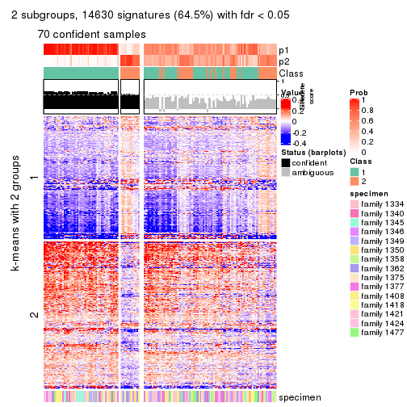</p>

</div>
<div id='tab-SD-hclust-get-signatures-no-scale-2'>
<pre><code class="r">get_signatures(res, k = 3, scale_rows = FALSE)
</code></pre>

<p></p>

</div>
<div id='tab-SD-hclust-get-signatures-no-scale-3'>
<pre><code class="r">get_signatures(res, k = 4, scale_rows = FALSE)
</code></pre>

<p></p>

</div>
<div id='tab-SD-hclust-get-signatures-no-scale-4'>
<pre><code class="r">get_signatures(res, k = 5, scale_rows = FALSE)
</code></pre>

<p></p>

</div>
<div id='tab-SD-hclust-get-signatures-no-scale-5'>
<pre><code class="r">get_signatures(res, k = 6, scale_rows = FALSE)
</code></pre>

<p></p>

</div>
</div>


Compare the overlap of signatures from different k:

```r
compare_signatures(res)
```


`get_signature()` returns a data frame invisibly. TO get the list of signatures, the function
call should be assigned to a variable explicitly. In following code, if `plot` argument is set
to `FALSE`, no heatmap is plotted while only the differential analysis is performed.

```r
# code only for demonstration
tb = get_signature(res, k = ..., plot = FALSE)
```

An example of the output of `tb` is:

```
#>   which_row         fdr    mean_1    mean_2 scaled_mean_1 scaled_mean_2 km
#> 1        38 0.042760348  8.373488  9.131774    -0.5533452     0.5164555  1
#> 2        40 0.018707592  7.106213  8.469186    -0.6173731     0.5762149  1
#> 3        55 0.019134737 10.221463 11.207825    -0.6159697     0.5749050  1
#> 4        59 0.006059896  5.921854  7.869574    -0.6899429     0.6439467  1
#> 5        60 0.018055526  8.928898 10.211722    -0.6204761     0.5791110  1
#> 6        98 0.009384629 15.714769 14.887706     0.6635654    -0.6193277  2
...
```

The columns in `tb` are:

1. `which_row`: row indices corresponding to the input matrix.
2. `fdr`: FDR for the differential test. 
3. `mean_x`: The mean value in group x.
4. `scaled_mean_x`: The mean value in group x after rows are scaled.
5. `km`: Row groups if k-means clustering is applied to rows.


UMAP plot which shows how samples are separated.


<script>
$( function() {
	$( '#tabs-SD-hclust-dimension-reduction' ).tabs();
} );
</script>
<div id='tabs-SD-hclust-dimension-reduction'>
<ul>
<li><a href='#tab-SD-hclust-dimension-reduction-1'>k = 2</a></li>
<li><a href='#tab-SD-hclust-dimension-reduction-2'>k = 3</a></li>
<li><a href='#tab-SD-hclust-dimension-reduction-3'>k = 4</a></li>
<li><a href='#tab-SD-hclust-dimension-reduction-4'>k = 5</a></li>
<li><a href='#tab-SD-hclust-dimension-reduction-5'>k = 6</a></li>
</ul>
<div id='tab-SD-hclust-dimension-reduction-1'>
<pre><code class="r">dimension_reduction(res, k = 2, method = &quot;UMAP&quot;)
</code></pre>

<p></p>

</div>
<div id='tab-SD-hclust-dimension-reduction-2'>
<pre><code class="r">dimension_reduction(res, k = 3, method = &quot;UMAP&quot;)
</code></pre>

<p></p>

</div>
<div id='tab-SD-hclust-dimension-reduction-3'>
<pre><code class="r">dimension_reduction(res, k = 4, method = &quot;UMAP&quot;)
</code></pre>

<p></p>

</div>
<div id='tab-SD-hclust-dimension-reduction-4'>
<pre><code class="r">dimension_reduction(res, k = 5, method = &quot;UMAP&quot;)
</code></pre>

<p></p>

</div>
<div id='tab-SD-hclust-dimension-reduction-5'>
<pre><code class="r">dimension_reduction(res, k = 6, method = &quot;UMAP&quot;)
</code></pre>

<p></p>

</div>
</div>


Following heatmap shows how subgroups are split when increasing `k`:

```r
collect_classes(res)
```


Test correlation between subgroups and known annotations. If the known
annotation is numeric, one-way ANOVA test is applied, and if the known
annotation is discrete, chi-squared contingency table test is applied.

```r
test_to_known_factors(res)
```

```
#>             n specimen(p) k
#> SD:hclust  70     0.00364 2
#> SD:hclust 124     0.02324 3
#> SD:hclust  45     0.17509 4
#> SD:hclust  29     0.28969 5
#> SD:hclust  44     0.11526 6
```


If matrix rows can be associated to genes, consider to use `GO_Enrichment(res,
...)` to perform function enrichment for the signature genes.


 

---------------------------------------------------


### SD:kmeans


The object with results only for a single top-value method and a single partition method 
can be extracted as:

```r
res = res_list["SD", "kmeans"]
# you can also extract it by
# res = res_list["SD:kmeans"]
```

A summary of `res` and all the functions that can be applied to it:

```r
res
```

```
#> A 'ConsensusPartition' object with k = 2, 3, 4, 5, 6.
#>   On a matrix with 22686 rows and 167 columns.
#>   Top rows (1000, 2000, 3000, 4000, 5000) are extracted by 'SD' method.
#>   Subgroups are detected by 'kmeans' method.
#>   Performed in total 1250 partitions by row resampling.
#>   Best k for subgroups seems to be 2.
#> 
#> Following methods can be applied to this 'ConsensusPartition' object:
#>  [1] "cola_report"             "collect_classes"         "collect_plots"          
#>  [4] "collect_stats"           "colnames"                "compare_signatures"     
#>  [7] "consensus_heatmap"       "dimension_reduction"     "functional_enrichment"  
#> [10] "get_anno_col"            "get_anno"                "get_classes"            
#> [13] "get_consensus"           "get_matrix"              "get_membership"         
#> [16] "get_param"               "get_signatures"          "get_stats"              
#> [19] "is_best_k"               "is_stable_k"             "membership_heatmap"     
#> [22] "ncol"                    "nrow"                    "plot_ecdf"              
#> [25] "rownames"                "select_partition_number" "show"                   
#> [28] "suggest_best_k"          "test_to_known_factors"
```

`collect_plots()` function collects all the plots made from `res` for all `k` (number of partitions)
into one single page to provide an easy and fast comparison between different `k`.

```r
collect_plots(res)
```


The plots are:

- The first row: a plot of the ECDF (Empirical cumulative distribution
  function) curves of the consensus matrix for each `k` and the heatmap of
  predicted classes for each `k`.
- The second row: heatmaps of the consensus matrix for each `k`.
- The third row: heatmaps of the membership matrix for each `k`.
- The fouth row: heatmaps of the signatures for each `k`.

All the plots in panels can be made by individual functions and they are
plotted later in this section.

`select_partition_number()` produces several plots showing different
statistics for choosing "optimized" `k`. There are following statistics:

- ECDF curves of the consensus matrix for each `k`;
- 1-PAC. [The PAC
  score](https://en.wikipedia.org/wiki/Consensus_clustering#Over-interpretation_potential_of_consensus_clustering)
  measures the proportion of the ambiguous subgrouping.
- Mean silhouette score.
- Concordance. The mean probability of fiting the consensus class ids in all
  partitions.
- Area increased. Denote $A_k$ as the area under the ECDF curve for current
  `k`, the area increased is defined as $A_k - A_{k-1}$.
- Rand index. The percent of pairs of samples that are both in a same cluster
  or both are not in a same cluster in the partition of k and k-1.
- Jaccard index. The ratio of pairs of samples are both in a same cluster in
  the partition of k and k-1 and the pairs of samples are both in a same
  cluster in the partition k or k-1.

The detailed explanations of these statistics can be found in [the cola
vignette](http://bioconductor.org/packages/devel/bioc/vignettes/cola/inst/doc/cola.html#toc_13).

Generally speaking, lower PAC score, higher mean silhouette score or higher
concordance corresponds to better partition. Rand index and Jaccard index
measure how similar the current partition is compared to partition with `k-1`.
If they are too similar, we won't accept `k` is better than `k-1`.

```r
select_partition_number(res)
```

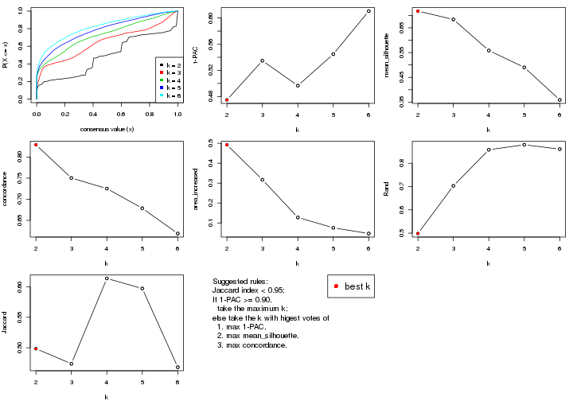

The numeric values for all these statistics can be obtained by `get_stats()`.

```r
get_stats(res)
```

```
#>   k 1-PAC mean_silhouette concordance area_increased  Rand Jaccard
#> 2 2 0.475           0.717       0.829         0.4926 0.498   0.498
#> 3 3 0.535           0.684       0.750         0.3171 0.703   0.474
#> 4 4 0.497           0.558       0.725         0.1276 0.858   0.614
#> 5 5 0.545           0.490       0.679         0.0755 0.879   0.597
#> 6 6 0.610           0.359       0.619         0.0468 0.861   0.468
```

`suggest_best_k()` suggests the best $k$ based on these statistics. The rules are as follows:

- All $k$ with Jaccard index larger than 0.95 are removed because the increase of
  the partition number does not provides enough extra information. If all $k$ are removed,
  the best $k$ is assigned by `NA`.
- For $k$ with 1-PAC larger than 0.9, the maximal $k$ is taken as the "best k". Other $k$ is called "optional k".
- If it does not fit the second rule. The $k$ with the highest vote of highest
  1-PAC, mean silhouette and concordance is taken as the "best k".

```r
suggest_best_k(res)
```

```
#> [1] 2
```


Following shows the table of the partitions (You need to click the **show/hide
code output** link to see it). The membership matrix (columns with name `p*`)
is inferred by
[`clue::cl_consensus()`](https://www.rdocumentation.org/link/cl_consensus?package=clue)
function with the `SE` method. Basically the value in the membership matrix
represents the probability to belong to a certain group. The finall class
label for an item is determined with the group with highest probability it
belongs to.

In `get_classes()` function, the entropy is calculated from the membership
matrix and the silhouette score is calculated from the consensus matrix.


<script>
$( function() {
	$( '#tabs-SD-kmeans-get-classes' ).tabs();
} );
</script>
<div id='tabs-SD-kmeans-get-classes'>
<ul>
<li><a href='#tab-SD-kmeans-get-classes-1'>k = 2</a></li>
<li><a href='#tab-SD-kmeans-get-classes-2'>k = 3</a></li>
<li><a href='#tab-SD-kmeans-get-classes-3'>k = 4</a></li>
<li><a href='#tab-SD-kmeans-get-classes-4'>k = 5</a></li>
<li><a href='#tab-SD-kmeans-get-classes-5'>k = 6</a></li>
</ul>

<div id='tab-SD-kmeans-get-classes-1'>
<p><a id='tab-SD-kmeans-get-classes-1-a' style='color:#0366d6' href='#'>show/hide code output</a></p>
<pre><code class="r">cbind(get_classes(res, k = 2), get_membership(res, k = 2))
</code></pre>

<pre><code>#&gt;          class entropy silhouette    p1    p2
#&gt; GSM30006     2  0.9710      0.720 0.400 0.600
#&gt; GSM30007     1  0.9686      0.824 0.604 0.396
#&gt; GSM30008     1  0.9686      0.824 0.604 0.396
#&gt; GSM30009     1  0.9686      0.824 0.604 0.396
#&gt; GSM30010     1  0.4562      0.416 0.904 0.096
#&gt; GSM30011     2  0.9710      0.720 0.400 0.600
#&gt; GSM30012     2  0.9686      0.721 0.396 0.604
#&gt; GSM30013     2  0.9686      0.721 0.396 0.604
#&gt; GSM30014     1  0.0000      0.555 1.000 0.000
#&gt; GSM30015     1  0.9710      0.821 0.600 0.400
#&gt; GSM30016     1  0.0000      0.555 1.000 0.000
#&gt; GSM30017     1  0.9710      0.821 0.600 0.400
#&gt; GSM30018     2  0.0000      0.683 0.000 1.000
#&gt; GSM30019     2  0.9686      0.721 0.396 0.604
#&gt; GSM30020     1  0.9686      0.824 0.604 0.396
#&gt; GSM30021     1  0.0000      0.555 1.000 0.000
#&gt; GSM30022     1  0.9686      0.824 0.604 0.396
#&gt; GSM30023     2  0.0938      0.693 0.012 0.988
#&gt; GSM30024     1  0.0000      0.555 1.000 0.000
#&gt; GSM30025     1  0.9686      0.824 0.604 0.396
#&gt; GSM30026     1  0.9833      0.795 0.576 0.424
#&gt; GSM30027     1  0.9686      0.824 0.604 0.396
#&gt; GSM30028     1  0.9686      0.824 0.604 0.396
#&gt; GSM30029     1  0.9710      0.821 0.600 0.400
#&gt; GSM30030     1  0.9686      0.824 0.604 0.396
#&gt; GSM30031     1  0.9686      0.824 0.604 0.396
#&gt; GSM30032     1  0.9686      0.824 0.604 0.396
#&gt; GSM30033     1  0.2423      0.586 0.960 0.040
#&gt; GSM30034     2  0.0000      0.683 0.000 1.000
#&gt; GSM30035     1  0.9393      0.800 0.644 0.356
#&gt; GSM30036     2  0.2603      0.715 0.044 0.956
#&gt; GSM30037     1  0.9686      0.824 0.604 0.396
#&gt; GSM30038     1  0.0000      0.555 1.000 0.000
#&gt; GSM30039     2  0.9686      0.721 0.396 0.604
#&gt; GSM30040     1  0.4939      0.392 0.892 0.108
#&gt; GSM30041     2  0.9710      0.720 0.400 0.600
#&gt; GSM30042     2  0.9686      0.721 0.396 0.604
#&gt; GSM30043     1  0.0000      0.555 1.000 0.000
#&gt; GSM30044     1  0.9686      0.824 0.604 0.396
#&gt; GSM30045     1  0.9686      0.824 0.604 0.396
#&gt; GSM30046     2  0.0000      0.683 0.000 1.000
#&gt; GSM30047     2  0.2603      0.715 0.044 0.956
#&gt; GSM30048     2  0.0000      0.683 0.000 1.000
#&gt; GSM30049     2  0.9710      0.720 0.400 0.600
#&gt; GSM30050     2  0.7453      0.725 0.212 0.788
#&gt; GSM30051     2  0.9710      0.720 0.400 0.600
#&gt; GSM30052     1  0.9686      0.824 0.604 0.396
#&gt; GSM30053     2  0.9686      0.721 0.396 0.604
#&gt; GSM30054     2  0.9710      0.720 0.400 0.600
#&gt; GSM30055     2  0.9661      0.720 0.392 0.608
#&gt; GSM30056     2  0.9686      0.721 0.396 0.604
#&gt; GSM30057     1  0.3879      0.452 0.924 0.076
#&gt; GSM30058     2  0.9710      0.720 0.400 0.600
#&gt; GSM30059     2  0.0000      0.683 0.000 1.000
#&gt; GSM30060     1  0.2423      0.586 0.960 0.040
#&gt; GSM30061     2  0.2603      0.715 0.044 0.956
#&gt; GSM30062     2  0.2603      0.715 0.044 0.956
#&gt; GSM30063     2  0.9686      0.721 0.396 0.604
#&gt; GSM30064     1  0.9686      0.824 0.604 0.396
#&gt; GSM30065     2  0.9686      0.721 0.396 0.604
#&gt; GSM30066     1  0.0000      0.555 1.000 0.000
#&gt; GSM30067     1  0.9686      0.824 0.604 0.396
#&gt; GSM30068     1  0.0000      0.555 1.000 0.000
#&gt; GSM30069     1  0.0000      0.555 1.000 0.000
#&gt; GSM30070     2  0.9710      0.720 0.400 0.600
#&gt; GSM30071     2  0.9686      0.721 0.396 0.604
#&gt; GSM30072     1  0.9686      0.824 0.604 0.396
#&gt; GSM30073     2  0.9248      0.723 0.340 0.660
#&gt; GSM30074     1  0.0000      0.555 1.000 0.000
#&gt; GSM30075     2  0.9686      0.721 0.396 0.604
#&gt; GSM30076     2  0.4161      0.721 0.084 0.916
#&gt; GSM30077     2  0.0000      0.683 0.000 1.000
#&gt; GSM30078     2  0.2603      0.715 0.044 0.956
#&gt; GSM30079     1  0.9686      0.824 0.604 0.396
#&gt; GSM30080     2  0.9686      0.721 0.396 0.604
#&gt; GSM30081     2  0.9710      0.720 0.400 0.600
#&gt; GSM30086     2  0.9686      0.721 0.396 0.604
#&gt; GSM30087     2  0.0000      0.683 0.000 1.000
#&gt; GSM30088     2  0.0000      0.683 0.000 1.000
#&gt; GSM30089     1  0.9686      0.824 0.604 0.396
#&gt; GSM30090     2  0.9710      0.720 0.400 0.600
#&gt; GSM30091     2  0.9710      0.720 0.400 0.600
#&gt; GSM30092     2  0.2603      0.715 0.044 0.956
#&gt; GSM30093     2  0.9686      0.721 0.396 0.604
#&gt; GSM30094     2  0.9710      0.720 0.400 0.600
#&gt; GSM30095     1  0.3733      0.458 0.928 0.072
#&gt; GSM30096     1  0.9686      0.824 0.604 0.396
#&gt; GSM30097     2  0.0000      0.683 0.000 1.000
#&gt; GSM30098     1  0.9686      0.824 0.604 0.396
#&gt; GSM30099     2  0.9710      0.720 0.400 0.600
#&gt; GSM30100     1  0.0000      0.555 1.000 0.000
#&gt; GSM30101     2  0.9710      0.720 0.400 0.600
#&gt; GSM30102     2  0.9710      0.720 0.400 0.600
#&gt; GSM30103     1  0.9686      0.824 0.604 0.396
#&gt; GSM30104     2  0.5178      0.724 0.116 0.884
#&gt; GSM30105     1  0.9686      0.824 0.604 0.396
#&gt; GSM30106     2  0.0000      0.683 0.000 1.000
#&gt; GSM30107     2  0.2603      0.715 0.044 0.956
#&gt; GSM30108     1  0.5629      0.647 0.868 0.132
#&gt; GSM30109     1  0.9710      0.821 0.600 0.400
#&gt; GSM30110     2  0.0000      0.683 0.000 1.000
#&gt; GSM30111     1  0.9850      0.791 0.572 0.428
#&gt; GSM30112     1  0.9686      0.824 0.604 0.396
#&gt; GSM30113     1  0.4298      0.431 0.912 0.088
#&gt; GSM30114     2  0.9686      0.721 0.396 0.604
#&gt; GSM30115     2  0.2778      0.716 0.048 0.952
#&gt; GSM30116     1  0.0000      0.555 1.000 0.000
#&gt; GSM30117     1  0.9552      0.811 0.624 0.376
#&gt; GSM30118     1  0.0000      0.555 1.000 0.000
#&gt; GSM30119     2  0.9710      0.720 0.400 0.600
#&gt; GSM30120     2  0.2603      0.715 0.044 0.956
#&gt; GSM30121     1  0.9686      0.824 0.604 0.396
#&gt; GSM30122     1  0.9686      0.824 0.604 0.396
#&gt; GSM30123     2  0.6887      0.725 0.184 0.816
#&gt; GSM30177     2  0.9686      0.721 0.396 0.604
#&gt; GSM30178     2  0.2603      0.715 0.044 0.956
#&gt; GSM30179     1  0.9710      0.821 0.600 0.400
#&gt; GSM30180     1  0.9686      0.824 0.604 0.396
#&gt; GSM30181     2  0.2603      0.715 0.044 0.956
#&gt; GSM30182     2  0.0000      0.683 0.000 1.000
#&gt; GSM30183     1  0.9710      0.821 0.600 0.400
#&gt; GSM30184     2  0.9710      0.720 0.400 0.600
#&gt; GSM30185     1  0.9686      0.824 0.604 0.396
#&gt; GSM30186     1  0.9393      0.342 0.644 0.356
#&gt; GSM30187     2  0.2603      0.715 0.044 0.956
#&gt; GSM30188     2  0.0000      0.683 0.000 1.000
#&gt; GSM30189     2  0.0000      0.683 0.000 1.000
#&gt; GSM30190     2  0.9710      0.720 0.400 0.600
#&gt; GSM30191     2  0.6247      0.726 0.156 0.844
#&gt; GSM30192     2  0.9686      0.721 0.396 0.604
#&gt; GSM30193     2  0.2603      0.715 0.044 0.956
#&gt; GSM30194     2  0.9710      0.720 0.400 0.600
#&gt; GSM30195     1  0.8327      0.599 0.736 0.264
#&gt; GSM30196     1  0.9686      0.824 0.604 0.396
#&gt; GSM30197     2  0.2236      0.710 0.036 0.964
#&gt; GSM30198     2  0.2603      0.620 0.044 0.956
#&gt; GSM30199     1  0.9686      0.824 0.604 0.396
#&gt; GSM30200     2  0.2236      0.633 0.036 0.964
#&gt; GSM30201     2  0.0000      0.683 0.000 1.000
#&gt; GSM30202     1  0.9710      0.821 0.600 0.400
#&gt; GSM30203     2  0.2603      0.715 0.044 0.956
#&gt; GSM30204     2  0.2603      0.620 0.044 0.956
#&gt; GSM30205     1  0.0672      0.562 0.992 0.008
#&gt; GSM30206     2  0.0000      0.683 0.000 1.000
#&gt; GSM30207     2  0.0000      0.683 0.000 1.000
#&gt; GSM30208     2  0.2603      0.620 0.044 0.956
#&gt; GSM30209     2  0.4690      0.722 0.100 0.900
#&gt; GSM30210     1  0.9686      0.824 0.604 0.396
#&gt; GSM30211     2  0.0000      0.683 0.000 1.000
#&gt; GSM30212     1  0.9686      0.824 0.604 0.396
#&gt; GSM30213     1  0.9686      0.824 0.604 0.396
#&gt; GSM30214     1  0.9686      0.824 0.604 0.396
#&gt; GSM30215     1  0.9686      0.824 0.604 0.396
#&gt; GSM30216     1  0.9686      0.824 0.604 0.396
#&gt; GSM30217     1  0.9686      0.824 0.604 0.396
#&gt; GSM30218     2  0.3114      0.716 0.056 0.944
#&gt; GSM30219     1  0.0000      0.555 1.000 0.000
#&gt; GSM30220     1  0.9686      0.824 0.604 0.396
#&gt; GSM30221     2  0.2603      0.715 0.044 0.956
#&gt; GSM30222     2  0.2603      0.715 0.044 0.956
#&gt; GSM30223     1  0.9686      0.824 0.604 0.396
#&gt; GSM30224     2  0.0000      0.683 0.000 1.000
#&gt; GSM30225     1  0.9710      0.821 0.600 0.400
#&gt; GSM30226     1  0.9686      0.824 0.604 0.396
#&gt; GSM30227     1  0.9710      0.821 0.600 0.400
#&gt; GSM30228     2  0.9686      0.721 0.396 0.604
#&gt; GSM30229     2  0.5946      0.726 0.144 0.856
</code></pre>

<script>
$('#tab-SD-kmeans-get-classes-1-a').parent().next().next().hide();
$('#tab-SD-kmeans-get-classes-1-a').click(function(){
  $('#tab-SD-kmeans-get-classes-1-a').parent().next().next().toggle();
  return(false);
});
</script>
</div>

<div id='tab-SD-kmeans-get-classes-2'>
<p><a id='tab-SD-kmeans-get-classes-2-a' style='color:#0366d6' href='#'>show/hide code output</a></p>
<pre><code class="r">cbind(get_classes(res, k = 3), get_membership(res, k = 3))
</code></pre>

<pre><code>#&gt;          class entropy silhouette    p1    p2    p3
#&gt; GSM30006     3  0.5882     0.5837 0.348 0.000 0.652
#&gt; GSM30007     2  0.1031     0.8761 0.000 0.976 0.024
#&gt; GSM30008     2  0.4634     0.8540 0.012 0.824 0.164
#&gt; GSM30009     2  0.1529     0.8743 0.000 0.960 0.040
#&gt; GSM30010     3  0.2860     0.5920 0.004 0.084 0.912
#&gt; GSM30011     3  0.5835     0.5885 0.340 0.000 0.660
#&gt; GSM30012     3  0.6062     0.5347 0.384 0.000 0.616
#&gt; GSM30013     1  0.4235     0.7065 0.824 0.000 0.176
#&gt; GSM30014     3  0.4452     0.5139 0.000 0.192 0.808
#&gt; GSM30015     2  0.9602     0.2097 0.396 0.404 0.200
#&gt; GSM30016     3  0.7156     0.3229 0.028 0.400 0.572
#&gt; GSM30017     1  0.8727     0.3138 0.572 0.280 0.148
#&gt; GSM30018     1  0.1905     0.8479 0.956 0.028 0.016
#&gt; GSM30019     3  0.6140     0.5058 0.404 0.000 0.596
#&gt; GSM30020     2  0.4663     0.8596 0.016 0.828 0.156
#&gt; GSM30021     3  0.5497     0.4108 0.000 0.292 0.708
#&gt; GSM30022     2  0.0892     0.8780 0.000 0.980 0.020
#&gt; GSM30023     1  0.3456     0.8108 0.904 0.036 0.060
#&gt; GSM30024     3  0.6235     0.2887 0.000 0.436 0.564
#&gt; GSM30025     2  0.1753     0.8734 0.000 0.952 0.048
#&gt; GSM30026     1  0.8587     0.4353 0.604 0.220 0.176
#&gt; GSM30027     2  0.4874     0.8509 0.028 0.828 0.144
#&gt; GSM30028     2  0.5435     0.8455 0.048 0.808 0.144
#&gt; GSM30029     2  0.4609     0.8562 0.028 0.844 0.128
#&gt; GSM30030     2  0.1289     0.8844 0.000 0.968 0.032
#&gt; GSM30031     2  0.3983     0.8623 0.004 0.852 0.144
#&gt; GSM30032     2  0.4755     0.8493 0.008 0.808 0.184
#&gt; GSM30033     3  0.7121     0.0432 0.024 0.428 0.548
#&gt; GSM30034     1  0.2681     0.8461 0.932 0.040 0.028
#&gt; GSM30035     2  0.5455     0.8164 0.020 0.776 0.204
#&gt; GSM30036     1  0.3112     0.8252 0.916 0.028 0.056
#&gt; GSM30037     2  0.1031     0.8761 0.000 0.976 0.024
#&gt; GSM30038     3  0.7043     0.3392 0.024 0.400 0.576
#&gt; GSM30039     3  0.6168     0.4918 0.412 0.000 0.588
#&gt; GSM30040     3  0.2866     0.5926 0.008 0.076 0.916
#&gt; GSM30041     3  0.5968     0.5812 0.364 0.000 0.636
#&gt; GSM30042     3  0.6045     0.5695 0.380 0.000 0.620
#&gt; GSM30043     3  0.4002     0.5448 0.000 0.160 0.840
#&gt; GSM30044     2  0.2056     0.8703 0.024 0.952 0.024
#&gt; GSM30045     2  0.2434     0.8667 0.024 0.940 0.036
#&gt; GSM30046     1  0.2297     0.8458 0.944 0.020 0.036
#&gt; GSM30047     1  0.2031     0.8466 0.952 0.032 0.016
#&gt; GSM30048     1  0.1919     0.8457 0.956 0.024 0.020
#&gt; GSM30049     3  0.5397     0.6148 0.280 0.000 0.720
#&gt; GSM30050     1  0.4994     0.7084 0.816 0.024 0.160
#&gt; GSM30051     3  0.5621     0.6042 0.308 0.000 0.692
#&gt; GSM30052     2  0.1163     0.8757 0.000 0.972 0.028
#&gt; GSM30053     3  0.6180     0.4850 0.416 0.000 0.584
#&gt; GSM30054     3  0.5859     0.5885 0.344 0.000 0.656
#&gt; GSM30055     1  0.6641    -0.1396 0.544 0.008 0.448
#&gt; GSM30056     3  0.6483     0.4324 0.452 0.004 0.544
#&gt; GSM30057     3  0.3038     0.5831 0.000 0.104 0.896
#&gt; GSM30058     3  0.5926     0.5837 0.356 0.000 0.644
#&gt; GSM30059     1  0.1989     0.8483 0.948 0.048 0.004
#&gt; GSM30060     3  0.6633    -0.0571 0.008 0.444 0.548
#&gt; GSM30061     1  0.2056     0.8488 0.952 0.024 0.024
#&gt; GSM30062     1  0.1170     0.8506 0.976 0.016 0.008
#&gt; GSM30063     1  0.5529     0.4462 0.704 0.000 0.296
#&gt; GSM30064     2  0.3461     0.8595 0.024 0.900 0.076
#&gt; GSM30065     3  0.6192     0.4859 0.420 0.000 0.580
#&gt; GSM30066     3  0.4931     0.4707 0.000 0.232 0.768
#&gt; GSM30067     2  0.2959     0.8747 0.000 0.900 0.100
#&gt; GSM30068     3  0.5016     0.4704 0.000 0.240 0.760
#&gt; GSM30069     3  0.5835     0.4441 0.000 0.340 0.660
#&gt; GSM30070     3  0.6193     0.5815 0.292 0.016 0.692
#&gt; GSM30071     1  0.6045     0.1466 0.620 0.000 0.380
#&gt; GSM30072     2  0.1525     0.8741 0.004 0.964 0.032
#&gt; GSM30073     1  0.3816     0.7374 0.852 0.000 0.148
#&gt; GSM30074     3  0.6180     0.4088 0.024 0.260 0.716
#&gt; GSM30075     1  0.1163     0.8443 0.972 0.000 0.028
#&gt; GSM30076     1  0.0848     0.8488 0.984 0.008 0.008
#&gt; GSM30077     1  0.1751     0.8509 0.960 0.028 0.012
#&gt; GSM30078     1  0.1620     0.8513 0.964 0.024 0.012
#&gt; GSM30079     2  0.0892     0.8780 0.000 0.980 0.020
#&gt; GSM30080     1  0.0892     0.8444 0.980 0.000 0.020
#&gt; GSM30081     3  0.5835     0.5892 0.340 0.000 0.660
#&gt; GSM30086     1  0.1031     0.8450 0.976 0.000 0.024
#&gt; GSM30087     1  0.2050     0.8504 0.952 0.028 0.020
#&gt; GSM30088     1  0.2414     0.8475 0.940 0.040 0.020
#&gt; GSM30089     2  0.3045     0.8654 0.020 0.916 0.064
#&gt; GSM30090     3  0.5905     0.5858 0.352 0.000 0.648
#&gt; GSM30091     3  0.5706     0.6027 0.320 0.000 0.680
#&gt; GSM30092     1  0.2564     0.8401 0.936 0.028 0.036
#&gt; GSM30093     3  0.6235     0.4553 0.436 0.000 0.564
#&gt; GSM30094     3  0.5859     0.5885 0.344 0.000 0.656
#&gt; GSM30095     3  0.3043     0.5890 0.008 0.084 0.908
#&gt; GSM30096     2  0.4291     0.8378 0.000 0.820 0.180
#&gt; GSM30097     1  0.3148     0.8429 0.916 0.048 0.036
#&gt; GSM30098     2  0.0892     0.8800 0.000 0.980 0.020
#&gt; GSM30099     3  0.6148     0.5811 0.356 0.004 0.640
#&gt; GSM30100     3  0.5926     0.4359 0.000 0.356 0.644
#&gt; GSM30101     3  0.5835     0.5892 0.340 0.000 0.660
#&gt; GSM30102     3  0.6291     0.4279 0.468 0.000 0.532
#&gt; GSM30103     2  0.3272     0.8754 0.004 0.892 0.104
#&gt; GSM30104     1  0.2443     0.8377 0.940 0.028 0.032
#&gt; GSM30105     2  0.1411     0.8740 0.000 0.964 0.036
#&gt; GSM30106     1  0.2564     0.8396 0.936 0.028 0.036
#&gt; GSM30107     1  0.1491     0.8481 0.968 0.016 0.016
#&gt; GSM30108     2  0.4270     0.7996 0.024 0.860 0.116
#&gt; GSM30109     2  0.1453     0.8769 0.024 0.968 0.008
#&gt; GSM30110     1  0.3722     0.8334 0.888 0.024 0.088
#&gt; GSM30111     1  0.8408     0.4385 0.616 0.232 0.152
#&gt; GSM30112     2  0.2550     0.8672 0.024 0.936 0.040
#&gt; GSM30113     3  0.2772     0.5912 0.004 0.080 0.916
#&gt; GSM30114     1  0.6299    -0.1895 0.524 0.000 0.476
#&gt; GSM30115     1  0.2749     0.8316 0.924 0.012 0.064
#&gt; GSM30116     3  0.6445     0.3598 0.020 0.308 0.672
#&gt; GSM30117     2  0.5406     0.8114 0.020 0.780 0.200
#&gt; GSM30118     3  0.5580     0.4254 0.008 0.256 0.736
#&gt; GSM30119     3  0.5397     0.6115 0.280 0.000 0.720
#&gt; GSM30120     1  0.3213     0.8275 0.900 0.008 0.092
#&gt; GSM30121     2  0.3193     0.8749 0.004 0.896 0.100
#&gt; GSM30122     2  0.3686     0.8592 0.000 0.860 0.140
#&gt; GSM30123     1  0.2773     0.8310 0.928 0.024 0.048
#&gt; GSM30177     1  0.6228     0.1958 0.624 0.004 0.372
#&gt; GSM30178     1  0.2564     0.8368 0.936 0.028 0.036
#&gt; GSM30179     2  0.7004     0.7525 0.112 0.728 0.160
#&gt; GSM30180     2  0.4521     0.8396 0.004 0.816 0.180
#&gt; GSM30181     1  0.1585     0.8469 0.964 0.008 0.028
#&gt; GSM30182     1  0.2564     0.8464 0.936 0.028 0.036
#&gt; GSM30183     2  0.3573     0.8683 0.004 0.876 0.120
#&gt; GSM30184     3  0.5968     0.5812 0.364 0.000 0.636
#&gt; GSM30185     2  0.4521     0.8360 0.004 0.816 0.180
#&gt; GSM30186     3  0.7244     0.5355 0.092 0.208 0.700
#&gt; GSM30187     1  0.2689     0.8387 0.932 0.032 0.036
#&gt; GSM30188     1  0.2564     0.8464 0.936 0.028 0.036
#&gt; GSM30189     1  0.3993     0.8347 0.884 0.064 0.052
#&gt; GSM30190     3  0.5926     0.5793 0.356 0.000 0.644
#&gt; GSM30191     1  0.3310     0.8189 0.908 0.028 0.064
#&gt; GSM30192     1  0.0747     0.8460 0.984 0.000 0.016
#&gt; GSM30193     1  0.1170     0.8496 0.976 0.016 0.008
#&gt; GSM30194     3  0.4605     0.6258 0.204 0.000 0.796
#&gt; GSM30195     3  0.9852     0.3168 0.272 0.312 0.416
#&gt; GSM30196     2  0.2056     0.8703 0.024 0.952 0.024
#&gt; GSM30197     1  0.1482     0.8505 0.968 0.020 0.012
#&gt; GSM30198     1  0.4253     0.7827 0.872 0.080 0.048
#&gt; GSM30199     2  0.4682     0.8360 0.004 0.804 0.192
#&gt; GSM30200     1  0.3484     0.8133 0.904 0.048 0.048
#&gt; GSM30201     1  0.1751     0.8478 0.960 0.028 0.012
#&gt; GSM30202     2  0.8925     0.5116 0.256 0.564 0.180
#&gt; GSM30203     1  0.1999     0.8414 0.952 0.012 0.036
#&gt; GSM30204     1  0.5339     0.7298 0.824 0.080 0.096
#&gt; GSM30205     3  0.5692     0.4019 0.008 0.268 0.724
#&gt; GSM30206     1  0.3213     0.8340 0.912 0.060 0.028
#&gt; GSM30207     1  0.5004     0.7700 0.840 0.072 0.088
#&gt; GSM30208     1  0.5667     0.7199 0.800 0.140 0.060
#&gt; GSM30209     1  0.9544    -0.0645 0.440 0.364 0.196
#&gt; GSM30210     2  0.1529     0.8725 0.000 0.960 0.040
#&gt; GSM30211     1  0.2681     0.8366 0.932 0.040 0.028
#&gt; GSM30212     2  0.0424     0.8791 0.000 0.992 0.008
#&gt; GSM30213     2  0.0592     0.8793 0.000 0.988 0.012
#&gt; GSM30214     2  0.3482     0.8687 0.000 0.872 0.128
#&gt; GSM30215     2  0.4002     0.8616 0.000 0.840 0.160
#&gt; GSM30216     2  0.1267     0.8802 0.004 0.972 0.024
#&gt; GSM30217     2  0.3752     0.8640 0.000 0.856 0.144
#&gt; GSM30218     1  0.3530     0.8252 0.900 0.032 0.068
#&gt; GSM30219     3  0.5551     0.4760 0.016 0.224 0.760
#&gt; GSM30220     2  0.1031     0.8761 0.000 0.976 0.024
#&gt; GSM30221     1  0.2318     0.8506 0.944 0.028 0.028
#&gt; GSM30222     1  0.1620     0.8467 0.964 0.012 0.024
#&gt; GSM30223     2  0.2056     0.8703 0.024 0.952 0.024
#&gt; GSM30224     1  0.3112     0.8376 0.916 0.056 0.028
#&gt; GSM30225     1  0.9464    -0.1888 0.416 0.404 0.180
#&gt; GSM30226     2  0.4963     0.8290 0.008 0.792 0.200
#&gt; GSM30227     2  0.8677     0.5128 0.288 0.572 0.140
#&gt; GSM30228     3  0.6244     0.4473 0.440 0.000 0.560
#&gt; GSM30229     1  0.1170     0.8461 0.976 0.008 0.016
</code></pre>

<script>
$('#tab-SD-kmeans-get-classes-2-a').parent().next().next().hide();
$('#tab-SD-kmeans-get-classes-2-a').click(function(){
  $('#tab-SD-kmeans-get-classes-2-a').parent().next().next().toggle();
  return(false);
});
</script>
</div>

<div id='tab-SD-kmeans-get-classes-3'>
<p><a id='tab-SD-kmeans-get-classes-3-a' style='color:#0366d6' href='#'>show/hide code output</a></p>
<pre><code class="r">cbind(get_classes(res, k = 4), get_membership(res, k = 4))
</code></pre>

<pre><code>#&gt;          class entropy silhouette    p1    p2    p3    p4
#&gt; GSM30006     2  0.1118     0.6745 0.000 0.964 0.000 0.036
#&gt; GSM30007     1  0.1489     0.7360 0.952 0.004 0.044 0.000
#&gt; GSM30008     1  0.6697     0.6282 0.628 0.004 0.224 0.144
#&gt; GSM30009     1  0.1543     0.7422 0.956 0.004 0.032 0.008
#&gt; GSM30010     3  0.5364     0.4900 0.028 0.320 0.652 0.000
#&gt; GSM30011     2  0.1118     0.6745 0.000 0.964 0.000 0.036
#&gt; GSM30012     2  0.4944     0.6205 0.000 0.768 0.160 0.072
#&gt; GSM30013     2  0.7003    -0.1502 0.000 0.460 0.116 0.424
#&gt; GSM30014     3  0.5753     0.5573 0.072 0.248 0.680 0.000
#&gt; GSM30015     3  0.7253     0.2024 0.152 0.000 0.484 0.364
#&gt; GSM30016     3  0.7783     0.3415 0.340 0.096 0.516 0.048
#&gt; GSM30017     4  0.6084     0.4236 0.152 0.004 0.148 0.696
#&gt; GSM30018     4  0.2928     0.8038 0.000 0.108 0.012 0.880
#&gt; GSM30019     2  0.4982     0.6367 0.000 0.772 0.136 0.092
#&gt; GSM30020     1  0.6273     0.6498 0.676 0.004 0.184 0.136
#&gt; GSM30021     3  0.5874     0.5740 0.112 0.192 0.696 0.000
#&gt; GSM30022     1  0.1302     0.7444 0.956 0.000 0.044 0.000
#&gt; GSM30023     4  0.3855     0.6599 0.004 0.012 0.164 0.820
#&gt; GSM30024     1  0.7779    -0.3976 0.400 0.244 0.356 0.000
#&gt; GSM30025     1  0.4364     0.7120 0.828 0.008 0.084 0.080
#&gt; GSM30026     4  0.3727     0.6039 0.004 0.008 0.164 0.824
#&gt; GSM30027     1  0.6181     0.6395 0.700 0.012 0.120 0.168
#&gt; GSM30028     1  0.6614     0.5887 0.644 0.004 0.172 0.180
#&gt; GSM30029     1  0.5691     0.6514 0.724 0.004 0.100 0.172
#&gt; GSM30030     1  0.2443     0.7474 0.916 0.000 0.060 0.024
#&gt; GSM30031     1  0.5848     0.6588 0.716 0.004 0.128 0.152
#&gt; GSM30032     1  0.7311     0.5879 0.612 0.036 0.232 0.120
#&gt; GSM30033     2  0.9584    -0.2210 0.264 0.380 0.208 0.148
#&gt; GSM30034     4  0.3900     0.7926 0.000 0.164 0.020 0.816
#&gt; GSM30035     3  0.7776     0.0369 0.340 0.248 0.412 0.000
#&gt; GSM30036     2  0.5500    -0.0550 0.000 0.520 0.016 0.464
#&gt; GSM30037     1  0.0336     0.7446 0.992 0.000 0.008 0.000
#&gt; GSM30038     3  0.6976     0.3166 0.384 0.092 0.516 0.008
#&gt; GSM30039     2  0.5517     0.6108 0.000 0.724 0.184 0.092
#&gt; GSM30040     2  0.6475    -0.2595 0.008 0.516 0.424 0.052
#&gt; GSM30041     2  0.2266     0.6656 0.000 0.912 0.004 0.084
#&gt; GSM30042     2  0.6501     0.3814 0.000 0.588 0.316 0.096
#&gt; GSM30043     3  0.5814     0.5284 0.056 0.300 0.644 0.000
#&gt; GSM30044     1  0.2010     0.7309 0.932 0.004 0.060 0.004
#&gt; GSM30045     1  0.2010     0.7309 0.932 0.004 0.060 0.004
#&gt; GSM30046     4  0.4842     0.7831 0.000 0.192 0.048 0.760
#&gt; GSM30047     4  0.3707     0.7973 0.000 0.132 0.028 0.840
#&gt; GSM30048     4  0.4673     0.7959 0.000 0.132 0.076 0.792
#&gt; GSM30049     2  0.0524     0.6423 0.000 0.988 0.004 0.008
#&gt; GSM30050     2  0.5152     0.4304 0.000 0.664 0.020 0.316
#&gt; GSM30051     2  0.1610     0.6680 0.000 0.952 0.016 0.032
#&gt; GSM30052     1  0.0524     0.7440 0.988 0.004 0.008 0.000
#&gt; GSM30053     2  0.5783     0.6036 0.000 0.704 0.188 0.108
#&gt; GSM30054     2  0.1722     0.6729 0.000 0.944 0.008 0.048
#&gt; GSM30055     4  0.7020    -0.0609 0.016 0.376 0.080 0.528
#&gt; GSM30056     2  0.3790     0.6458 0.000 0.820 0.016 0.164
#&gt; GSM30057     3  0.5453     0.5131 0.036 0.304 0.660 0.000
#&gt; GSM30058     2  0.1305     0.6731 0.000 0.960 0.004 0.036
#&gt; GSM30059     4  0.3836     0.7953 0.000 0.168 0.016 0.816
#&gt; GSM30060     3  0.7206     0.4420 0.244 0.184 0.568 0.004
#&gt; GSM30061     4  0.3325     0.8017 0.000 0.112 0.024 0.864
#&gt; GSM30062     4  0.3636     0.8001 0.000 0.172 0.008 0.820
#&gt; GSM30063     2  0.6477     0.3499 0.000 0.600 0.100 0.300
#&gt; GSM30064     1  0.2839     0.7196 0.884 0.004 0.108 0.004
#&gt; GSM30065     2  0.3919     0.6686 0.000 0.840 0.056 0.104
#&gt; GSM30066     3  0.5910     0.5574 0.084 0.244 0.672 0.000
#&gt; GSM30067     1  0.4382     0.6254 0.704 0.000 0.296 0.000
#&gt; GSM30068     3  0.6084     0.5574 0.096 0.244 0.660 0.000
#&gt; GSM30069     3  0.7480     0.5151 0.248 0.248 0.504 0.000
#&gt; GSM30070     3  0.8449     0.2014 0.060 0.208 0.512 0.220
#&gt; GSM30071     4  0.7242     0.3377 0.000 0.148 0.376 0.476
#&gt; GSM30072     1  0.1661     0.7343 0.944 0.004 0.052 0.000
#&gt; GSM30073     4  0.6659     0.2563 0.000 0.448 0.084 0.468
#&gt; GSM30074     3  0.6949     0.5112 0.100 0.108 0.688 0.104
#&gt; GSM30075     4  0.6449     0.6700 0.000 0.140 0.220 0.640
#&gt; GSM30076     4  0.3529     0.8005 0.000 0.152 0.012 0.836
#&gt; GSM30077     4  0.3356     0.7957 0.000 0.176 0.000 0.824
#&gt; GSM30078     4  0.3311     0.7970 0.000 0.172 0.000 0.828
#&gt; GSM30079     1  0.1022     0.7457 0.968 0.000 0.032 0.000
#&gt; GSM30080     4  0.6672     0.6643 0.000 0.168 0.212 0.620
#&gt; GSM30081     2  0.1798     0.6706 0.000 0.944 0.016 0.040
#&gt; GSM30086     4  0.5432     0.7741 0.000 0.136 0.124 0.740
#&gt; GSM30087     4  0.3498     0.7969 0.000 0.160 0.008 0.832
#&gt; GSM30088     4  0.3232     0.8018 0.004 0.108 0.016 0.872
#&gt; GSM30089     1  0.2520     0.7272 0.904 0.004 0.088 0.004
#&gt; GSM30090     2  0.1118     0.6745 0.000 0.964 0.000 0.036
#&gt; GSM30091     2  0.1706     0.6675 0.000 0.948 0.016 0.036
#&gt; GSM30092     4  0.4353     0.7555 0.000 0.232 0.012 0.756
#&gt; GSM30093     2  0.3681     0.6389 0.000 0.816 0.008 0.176
#&gt; GSM30094     2  0.1118     0.6745 0.000 0.964 0.000 0.036
#&gt; GSM30095     2  0.6899    -0.2687 0.020 0.508 0.412 0.060
#&gt; GSM30096     1  0.4925     0.4888 0.572 0.000 0.428 0.000
#&gt; GSM30097     4  0.4356     0.7759 0.004 0.200 0.016 0.780
#&gt; GSM30098     1  0.2760     0.7193 0.872 0.000 0.128 0.000
#&gt; GSM30099     2  0.4020     0.6255 0.016 0.836 0.020 0.128
#&gt; GSM30100     3  0.7823     0.4572 0.320 0.272 0.408 0.000
#&gt; GSM30101     2  0.1576     0.6721 0.000 0.948 0.004 0.048
#&gt; GSM30102     2  0.4123     0.6201 0.000 0.772 0.008 0.220
#&gt; GSM30103     1  0.4283     0.6486 0.740 0.004 0.256 0.000
#&gt; GSM30104     4  0.5399     0.2209 0.000 0.468 0.012 0.520
#&gt; GSM30105     1  0.1975     0.7495 0.936 0.000 0.048 0.016
#&gt; GSM30106     4  0.4667     0.7784 0.000 0.096 0.108 0.796
#&gt; GSM30107     4  0.5110     0.7849 0.000 0.132 0.104 0.764
#&gt; GSM30108     1  0.5334     0.1699 0.620 0.012 0.364 0.004
#&gt; GSM30109     1  0.2647     0.7286 0.880 0.000 0.120 0.000
#&gt; GSM30110     4  0.6830     0.6754 0.004 0.192 0.184 0.620
#&gt; GSM30111     4  0.4771     0.6072 0.028 0.012 0.184 0.776
#&gt; GSM30112     1  0.2714     0.7227 0.884 0.000 0.112 0.004
#&gt; GSM30113     3  0.6057     0.4936 0.032 0.312 0.636 0.020
#&gt; GSM30114     2  0.7476     0.2741 0.000 0.504 0.236 0.260
#&gt; GSM30115     4  0.5910     0.7351 0.000 0.236 0.088 0.676
#&gt; GSM30116     2  0.7301    -0.3275 0.152 0.452 0.396 0.000
#&gt; GSM30117     3  0.8392     0.1777 0.264 0.288 0.424 0.024
#&gt; GSM30118     3  0.3652     0.5215 0.092 0.052 0.856 0.000
#&gt; GSM30119     2  0.6425     0.2185 0.000 0.508 0.424 0.068
#&gt; GSM30120     3  0.6709    -0.2269 0.004 0.076 0.492 0.428
#&gt; GSM30121     1  0.4431     0.6229 0.696 0.000 0.304 0.000
#&gt; GSM30122     1  0.4920     0.5585 0.628 0.000 0.368 0.004
#&gt; GSM30123     2  0.5560     0.2298 0.000 0.584 0.024 0.392
#&gt; GSM30177     2  0.4420     0.5538 0.000 0.748 0.012 0.240
#&gt; GSM30178     4  0.4364     0.7598 0.000 0.220 0.016 0.764
#&gt; GSM30179     1  0.7105     0.4976 0.568 0.004 0.152 0.276
#&gt; GSM30180     1  0.4916     0.4996 0.576 0.000 0.424 0.000
#&gt; GSM30181     4  0.5167     0.7680 0.000 0.108 0.132 0.760
#&gt; GSM30182     4  0.3933     0.7755 0.000 0.200 0.008 0.792
#&gt; GSM30183     1  0.4837     0.5856 0.648 0.000 0.348 0.004
#&gt; GSM30184     2  0.2530     0.6583 0.000 0.896 0.004 0.100
#&gt; GSM30185     1  0.5080     0.4851 0.576 0.004 0.420 0.000
#&gt; GSM30186     2  0.7630    -0.0931 0.068 0.464 0.416 0.052
#&gt; GSM30187     4  0.4661     0.7201 0.000 0.256 0.016 0.728
#&gt; GSM30188     4  0.3768     0.7850 0.000 0.184 0.008 0.808
#&gt; GSM30189     4  0.5437     0.7568 0.004 0.144 0.104 0.748
#&gt; GSM30190     2  0.1118     0.6745 0.000 0.964 0.000 0.036
#&gt; GSM30191     2  0.5406    -0.1135 0.000 0.508 0.012 0.480
#&gt; GSM30192     4  0.5528     0.7677 0.000 0.144 0.124 0.732
#&gt; GSM30193     4  0.5140     0.7832 0.000 0.144 0.096 0.760
#&gt; GSM30194     2  0.5016     0.1146 0.000 0.600 0.396 0.004
#&gt; GSM30195     3  0.8821     0.3718 0.208 0.080 0.476 0.236
#&gt; GSM30196     1  0.2010     0.7309 0.932 0.004 0.060 0.004
#&gt; GSM30197     4  0.4719     0.7938 0.000 0.180 0.048 0.772
#&gt; GSM30198     4  0.2989     0.6926 0.012 0.004 0.100 0.884
#&gt; GSM30199     1  0.4936     0.5297 0.624 0.004 0.372 0.000
#&gt; GSM30200     4  0.2255     0.7295 0.000 0.012 0.068 0.920
#&gt; GSM30201     4  0.2924     0.8009 0.000 0.100 0.016 0.884
#&gt; GSM30202     3  0.7697     0.0372 0.316 0.000 0.444 0.240
#&gt; GSM30203     4  0.4212     0.7655 0.000 0.216 0.012 0.772
#&gt; GSM30204     4  0.3755     0.6514 0.012 0.008 0.144 0.836
#&gt; GSM30205     3  0.8014     0.4564 0.084 0.264 0.556 0.096
#&gt; GSM30206     4  0.3232     0.8005 0.004 0.108 0.016 0.872
#&gt; GSM30207     4  0.3315     0.6639 0.008 0.016 0.104 0.872
#&gt; GSM30208     4  0.3504     0.6597 0.036 0.008 0.084 0.872
#&gt; GSM30209     2  0.8053     0.2972 0.112 0.488 0.052 0.348
#&gt; GSM30210     1  0.2908     0.7377 0.896 0.000 0.064 0.040
#&gt; GSM30211     4  0.3048     0.8026 0.000 0.108 0.016 0.876
#&gt; GSM30212     1  0.0927     0.7485 0.976 0.000 0.016 0.008
#&gt; GSM30213     1  0.1118     0.7465 0.964 0.000 0.036 0.000
#&gt; GSM30214     1  0.5880     0.6579 0.680 0.000 0.232 0.088
#&gt; GSM30215     1  0.6352     0.6322 0.632 0.000 0.260 0.108
#&gt; GSM30216     1  0.2973     0.7169 0.856 0.000 0.144 0.000
#&gt; GSM30217     1  0.5803     0.6770 0.716 0.004 0.172 0.108
#&gt; GSM30218     4  0.6834     0.4644 0.020 0.340 0.068 0.572
#&gt; GSM30219     3  0.6447     0.2834 0.068 0.448 0.484 0.000
#&gt; GSM30220     1  0.0524     0.7440 0.988 0.004 0.008 0.000
#&gt; GSM30221     4  0.3718     0.7940 0.000 0.168 0.012 0.820
#&gt; GSM30222     4  0.5012     0.7763 0.000 0.112 0.116 0.772
#&gt; GSM30223     1  0.2010     0.7309 0.932 0.004 0.060 0.004
#&gt; GSM30224     4  0.3403     0.8002 0.004 0.112 0.020 0.864
#&gt; GSM30225     3  0.7293     0.2000 0.156 0.000 0.476 0.368
#&gt; GSM30226     1  0.5229     0.4686 0.564 0.008 0.428 0.000
#&gt; GSM30227     3  0.7726     0.1365 0.260 0.000 0.444 0.296
#&gt; GSM30228     2  0.3249     0.6665 0.000 0.852 0.008 0.140
#&gt; GSM30229     4  0.3658     0.8036 0.000 0.144 0.020 0.836
</code></pre>

<script>
$('#tab-SD-kmeans-get-classes-3-a').parent().next().next().hide();
$('#tab-SD-kmeans-get-classes-3-a').click(function(){
  $('#tab-SD-kmeans-get-classes-3-a').parent().next().next().toggle();
  return(false);
});
</script>
</div>

<div id='tab-SD-kmeans-get-classes-4'>
<p><a id='tab-SD-kmeans-get-classes-4-a' style='color:#0366d6' href='#'>show/hide code output</a></p>
<pre><code class="r">cbind(get_classes(res, k = 5), get_membership(res, k = 5))
</code></pre>

<pre><code>#&gt;          class entropy silhouette    p1    p2    p3    p4    p5
#&gt; GSM30006     3  0.1205    0.79788 0.000 0.000 0.956 0.040 0.004
#&gt; GSM30007     1  0.0771    0.66952 0.976 0.004 0.000 0.000 0.020
#&gt; GSM30008     2  0.5361    0.46733 0.284 0.644 0.000 0.060 0.012
#&gt; GSM30009     1  0.2813    0.60413 0.832 0.168 0.000 0.000 0.000
#&gt; GSM30010     5  0.3409    0.50310 0.008 0.008 0.156 0.004 0.824
#&gt; GSM30011     3  0.1251    0.79858 0.000 0.000 0.956 0.036 0.008
#&gt; GSM30012     3  0.5338    0.71059 0.000 0.128 0.732 0.052 0.088
#&gt; GSM30013     3  0.7401    0.42383 0.000 0.164 0.504 0.252 0.080
#&gt; GSM30014     5  0.3070    0.50708 0.016 0.012 0.112 0.000 0.860
#&gt; GSM30015     5  0.8284    0.09073 0.084 0.288 0.012 0.248 0.368
#&gt; GSM30016     5  0.7207    0.17509 0.392 0.136 0.008 0.036 0.428
#&gt; GSM30017     2  0.6546    0.06056 0.112 0.484 0.000 0.380 0.024
#&gt; GSM30018     4  0.1483    0.74087 0.000 0.028 0.012 0.952 0.008
#&gt; GSM30019     3  0.5243    0.72760 0.000 0.112 0.744 0.068 0.076
#&gt; GSM30020     2  0.5664    0.42863 0.384 0.548 0.000 0.056 0.012
#&gt; GSM30021     5  0.3237    0.49725 0.076 0.012 0.048 0.000 0.864
#&gt; GSM30022     1  0.3375    0.66010 0.852 0.096 0.012 0.000 0.040
#&gt; GSM30023     2  0.4982   -0.24874 0.000 0.556 0.000 0.412 0.032
#&gt; GSM30024     5  0.6769    0.30177 0.348 0.064 0.080 0.000 0.508
#&gt; GSM30025     1  0.4294   -0.16250 0.532 0.468 0.000 0.000 0.000
#&gt; GSM30026     4  0.4546    0.19178 0.000 0.460 0.000 0.532 0.008
#&gt; GSM30027     2  0.5942    0.45338 0.360 0.564 0.024 0.044 0.008
#&gt; GSM30028     2  0.6331    0.42297 0.356 0.528 0.000 0.088 0.028
#&gt; GSM30029     2  0.5479    0.34967 0.436 0.508 0.000 0.052 0.004
#&gt; GSM30030     1  0.4232    0.33788 0.676 0.312 0.000 0.000 0.012
#&gt; GSM30031     2  0.5502    0.39421 0.412 0.532 0.000 0.048 0.008
#&gt; GSM30032     2  0.6379    0.44983 0.336 0.556 0.020 0.016 0.072
#&gt; GSM30033     2  0.7523    0.32382 0.112 0.536 0.260 0.036 0.056
#&gt; GSM30034     4  0.2949    0.72908 0.000 0.036 0.072 0.880 0.012
#&gt; GSM30035     5  0.8061    0.13576 0.120 0.336 0.180 0.000 0.364
#&gt; GSM30036     4  0.4940    0.17904 0.000 0.020 0.436 0.540 0.004
#&gt; GSM30037     1  0.2462    0.65107 0.880 0.112 0.008 0.000 0.000
#&gt; GSM30038     5  0.5979    0.17999 0.420 0.072 0.008 0.004 0.496
#&gt; GSM30039     3  0.5671    0.70017 0.000 0.132 0.708 0.064 0.096
#&gt; GSM30040     5  0.5500    0.34984 0.004 0.056 0.348 0.004 0.588
#&gt; GSM30041     3  0.3265    0.74364 0.000 0.016 0.844 0.128 0.012
#&gt; GSM30042     3  0.7228    0.53083 0.000 0.128 0.556 0.120 0.196
#&gt; GSM30043     5  0.3459    0.50484 0.016 0.016 0.136 0.000 0.832
#&gt; GSM30044     1  0.1211    0.66392 0.960 0.016 0.000 0.000 0.024
#&gt; GSM30045     1  0.1106    0.66476 0.964 0.012 0.000 0.000 0.024
#&gt; GSM30046     4  0.4378    0.71652 0.000 0.064 0.120 0.792 0.024
#&gt; GSM30047     4  0.3355    0.72003 0.000 0.084 0.048 0.856 0.012
#&gt; GSM30048     4  0.4660    0.72403 0.000 0.136 0.060 0.772 0.032
#&gt; GSM30049     3  0.2151    0.78258 0.000 0.016 0.924 0.020 0.040
#&gt; GSM30050     3  0.4181    0.65819 0.000 0.020 0.732 0.244 0.004
#&gt; GSM30051     3  0.2006    0.79479 0.000 0.020 0.932 0.024 0.024
#&gt; GSM30052     1  0.1831    0.65930 0.920 0.076 0.000 0.000 0.004
#&gt; GSM30053     3  0.5761    0.69668 0.000 0.136 0.700 0.064 0.100
#&gt; GSM30054     3  0.2395    0.79319 0.000 0.024 0.912 0.048 0.016
#&gt; GSM30055     4  0.7116    0.13008 0.000 0.328 0.252 0.404 0.016
#&gt; GSM30056     3  0.2575    0.78285 0.000 0.012 0.884 0.100 0.004
#&gt; GSM30057     5  0.2957    0.50860 0.012 0.008 0.120 0.000 0.860
#&gt; GSM30058     3  0.1280    0.79823 0.000 0.008 0.960 0.024 0.008
#&gt; GSM30059     4  0.3346    0.73001 0.000 0.036 0.108 0.848 0.008
#&gt; GSM30060     5  0.6810    0.28307 0.112 0.232 0.076 0.000 0.580
#&gt; GSM30061     4  0.2507    0.72930 0.000 0.072 0.012 0.900 0.016
#&gt; GSM30062     4  0.3237    0.74351 0.000 0.048 0.076 0.864 0.012
#&gt; GSM30063     3  0.6282    0.65216 0.000 0.136 0.656 0.132 0.076
#&gt; GSM30064     1  0.1978    0.63497 0.928 0.044 0.000 0.004 0.024
#&gt; GSM30065     3  0.3241    0.79297 0.000 0.036 0.872 0.052 0.040
#&gt; GSM30066     5  0.3483    0.50453 0.052 0.012 0.088 0.000 0.848
#&gt; GSM30067     1  0.6952    0.28176 0.500 0.248 0.024 0.000 0.228
#&gt; GSM30068     5  0.3551    0.50536 0.056 0.012 0.088 0.000 0.844
#&gt; GSM30069     5  0.5455    0.40258 0.272 0.004 0.088 0.000 0.636
#&gt; GSM30070     5  0.8330    0.24366 0.160 0.136 0.020 0.232 0.452
#&gt; GSM30071     4  0.7692    0.47614 0.032 0.220 0.040 0.508 0.200
#&gt; GSM30072     1  0.0992    0.66677 0.968 0.008 0.000 0.000 0.024
#&gt; GSM30073     3  0.7077    0.26952 0.000 0.156 0.492 0.308 0.044
#&gt; GSM30074     5  0.5386    0.33581 0.088 0.240 0.008 0.000 0.664
#&gt; GSM30075     4  0.6808    0.58992 0.000 0.192 0.072 0.592 0.144
#&gt; GSM30076     4  0.2519    0.73860 0.000 0.036 0.060 0.900 0.004
#&gt; GSM30077     4  0.2408    0.73227 0.000 0.004 0.096 0.892 0.008
#&gt; GSM30078     4  0.2170    0.73525 0.000 0.004 0.088 0.904 0.004
#&gt; GSM30079     1  0.3584    0.65630 0.836 0.112 0.012 0.000 0.040
#&gt; GSM30080     4  0.7226    0.55875 0.000 0.180 0.120 0.560 0.140
#&gt; GSM30081     3  0.2273    0.79320 0.000 0.024 0.920 0.032 0.024
#&gt; GSM30086     4  0.6231    0.64228 0.000 0.180 0.076 0.652 0.092
#&gt; GSM30087     4  0.1990    0.73391 0.000 0.008 0.068 0.920 0.004
#&gt; GSM30088     4  0.1996    0.73110 0.000 0.048 0.012 0.928 0.012
#&gt; GSM30089     1  0.2110    0.63860 0.912 0.072 0.000 0.000 0.016
#&gt; GSM30090     3  0.0865    0.79803 0.000 0.004 0.972 0.024 0.000
#&gt; GSM30091     3  0.2006    0.79479 0.000 0.020 0.932 0.024 0.024
#&gt; GSM30092     4  0.4215    0.65135 0.000 0.024 0.220 0.748 0.008
#&gt; GSM30093     3  0.2170    0.78817 0.000 0.004 0.904 0.088 0.004
#&gt; GSM30094     3  0.1331    0.79630 0.000 0.008 0.952 0.040 0.000
#&gt; GSM30095     5  0.6000    0.33843 0.008 0.100 0.344 0.000 0.548
#&gt; GSM30096     2  0.7070    0.07092 0.264 0.392 0.012 0.000 0.332
#&gt; GSM30097     4  0.3712    0.70571 0.000 0.040 0.132 0.820 0.008
#&gt; GSM30098     1  0.5723    0.50063 0.652 0.232 0.020 0.000 0.096
#&gt; GSM30099     3  0.4956    0.66235 0.004 0.116 0.752 0.112 0.016
#&gt; GSM30100     5  0.6036    0.35874 0.312 0.012 0.104 0.000 0.572
#&gt; GSM30101     3  0.2374    0.79289 0.000 0.020 0.912 0.052 0.016
#&gt; GSM30102     3  0.4111    0.71114 0.000 0.016 0.756 0.216 0.012
#&gt; GSM30103     1  0.7285    0.14725 0.432 0.308 0.032 0.000 0.228
#&gt; GSM30104     4  0.4893    0.33464 0.000 0.016 0.396 0.580 0.008
#&gt; GSM30105     1  0.3807    0.61203 0.776 0.204 0.012 0.000 0.008
#&gt; GSM30106     4  0.4441    0.65911 0.000 0.236 0.000 0.720 0.044
#&gt; GSM30107     4  0.5441    0.66727 0.000 0.232 0.040 0.680 0.048
#&gt; GSM30108     1  0.4339    0.22128 0.652 0.012 0.000 0.000 0.336
#&gt; GSM30109     1  0.4230    0.61824 0.780 0.164 0.012 0.000 0.044
#&gt; GSM30110     4  0.7435    0.46954 0.004 0.216 0.144 0.536 0.100
#&gt; GSM30111     4  0.6183    0.58927 0.048 0.268 0.008 0.620 0.056
#&gt; GSM30112     1  0.2951    0.63725 0.860 0.112 0.000 0.000 0.028
#&gt; GSM30113     5  0.3730    0.50174 0.012 0.016 0.156 0.004 0.812
#&gt; GSM30114     3  0.7149    0.57367 0.000 0.160 0.572 0.124 0.144
#&gt; GSM30115     4  0.6982    0.49087 0.000 0.172 0.240 0.540 0.048
#&gt; GSM30116     5  0.7404    0.28504 0.052 0.196 0.296 0.000 0.456
#&gt; GSM30117     5  0.8150    0.17180 0.084 0.316 0.196 0.012 0.392
#&gt; GSM30118     5  0.4011    0.43669 0.040 0.140 0.016 0.000 0.804
#&gt; GSM30119     5  0.7506   -0.14994 0.000 0.104 0.368 0.108 0.420
#&gt; GSM30120     5  0.8427    0.13351 0.056 0.312 0.036 0.244 0.352
#&gt; GSM30121     1  0.6970    0.28078 0.496 0.252 0.024 0.000 0.228
#&gt; GSM30122     2  0.7295   -0.03371 0.312 0.392 0.024 0.000 0.272
#&gt; GSM30123     3  0.5625    0.30840 0.000 0.056 0.564 0.368 0.012
#&gt; GSM30177     3  0.2629    0.77850 0.000 0.012 0.880 0.104 0.004
#&gt; GSM30178     4  0.4001    0.64529 0.000 0.020 0.204 0.768 0.008
#&gt; GSM30179     2  0.6263    0.47193 0.248 0.580 0.000 0.160 0.012
#&gt; GSM30180     5  0.7060   -0.07134 0.344 0.256 0.012 0.000 0.388
#&gt; GSM30181     4  0.4991    0.65120 0.000 0.180 0.008 0.720 0.092
#&gt; GSM30182     4  0.2733    0.71680 0.000 0.012 0.112 0.872 0.004
#&gt; GSM30183     1  0.7551    0.20659 0.444 0.256 0.024 0.016 0.260
#&gt; GSM30184     3  0.3299    0.72198 0.000 0.016 0.828 0.152 0.004
#&gt; GSM30185     5  0.7397   -0.01869 0.252 0.328 0.032 0.000 0.388
#&gt; GSM30186     5  0.7773    0.21545 0.020 0.260 0.324 0.024 0.372
#&gt; GSM30187     4  0.4288    0.60178 0.000 0.016 0.256 0.720 0.008
#&gt; GSM30188     4  0.2615    0.73003 0.000 0.020 0.080 0.892 0.008
#&gt; GSM30189     4  0.4604    0.64125 0.000 0.156 0.040 0.768 0.036
#&gt; GSM30190     3  0.1082    0.79903 0.000 0.008 0.964 0.028 0.000
#&gt; GSM30191     4  0.5042    0.14111 0.000 0.024 0.460 0.512 0.004
#&gt; GSM30192     4  0.5882    0.64251 0.000 0.180 0.052 0.676 0.092
#&gt; GSM30193     4  0.5216    0.67174 0.000 0.184 0.048 0.720 0.048
#&gt; GSM30194     5  0.4950    0.09250 0.000 0.016 0.424 0.008 0.552
#&gt; GSM30195     5  0.8685    0.20456 0.232 0.172 0.012 0.224 0.360
#&gt; GSM30196     1  0.1012    0.66362 0.968 0.012 0.000 0.000 0.020
#&gt; GSM30197     4  0.4901    0.71593 0.000 0.076 0.136 0.756 0.032
#&gt; GSM30198     4  0.4032    0.66802 0.000 0.192 0.004 0.772 0.032
#&gt; GSM30199     5  0.7335   -0.09346 0.300 0.304 0.024 0.000 0.372
#&gt; GSM30200     4  0.3611    0.68950 0.000 0.156 0.004 0.812 0.028
#&gt; GSM30201     4  0.2050    0.72851 0.000 0.064 0.008 0.920 0.008
#&gt; GSM30202     5  0.8287    0.04163 0.212 0.292 0.012 0.096 0.388
#&gt; GSM30203     4  0.3250    0.69122 0.000 0.008 0.168 0.820 0.004
#&gt; GSM30204     4  0.4824    0.27701 0.000 0.468 0.000 0.512 0.020
#&gt; GSM30205     2  0.7063   -0.00285 0.024 0.456 0.168 0.004 0.348
#&gt; GSM30206     4  0.1299    0.73740 0.000 0.020 0.012 0.960 0.008
#&gt; GSM30207     4  0.4675    0.24947 0.000 0.444 0.008 0.544 0.004
#&gt; GSM30208     4  0.4507    0.30598 0.000 0.412 0.004 0.580 0.004
#&gt; GSM30209     4  0.7655   -0.05444 0.032 0.180 0.380 0.388 0.020
#&gt; GSM30210     1  0.4367    0.15146 0.620 0.372 0.008 0.000 0.000
#&gt; GSM30211     4  0.2141    0.73314 0.000 0.064 0.016 0.916 0.004
#&gt; GSM30212     1  0.3365    0.61648 0.808 0.180 0.008 0.000 0.004
#&gt; GSM30213     1  0.3850    0.64338 0.816 0.128 0.012 0.000 0.044
#&gt; GSM30214     2  0.5159    0.24499 0.400 0.556 0.000 0.000 0.044
#&gt; GSM30215     2  0.4938    0.33931 0.324 0.636 0.000 0.004 0.036
#&gt; GSM30216     1  0.5635    0.51231 0.668 0.212 0.020 0.000 0.100
#&gt; GSM30217     2  0.5155    0.33932 0.428 0.536 0.000 0.004 0.032
#&gt; GSM30218     4  0.7037    0.25329 0.000 0.224 0.300 0.456 0.020
#&gt; GSM30219     5  0.6882    0.34236 0.020 0.200 0.288 0.000 0.492
#&gt; GSM30220     1  0.1671    0.65697 0.924 0.076 0.000 0.000 0.000
#&gt; GSM30221     4  0.2590    0.73787 0.000 0.028 0.060 0.900 0.012
#&gt; GSM30222     4  0.5509    0.64977 0.000 0.208 0.020 0.680 0.092
#&gt; GSM30223     1  0.1012    0.66577 0.968 0.012 0.000 0.000 0.020
#&gt; GSM30224     4  0.2026    0.73077 0.000 0.044 0.016 0.928 0.012
#&gt; GSM30225     5  0.8360    0.09182 0.092 0.292 0.012 0.248 0.356
#&gt; GSM30226     5  0.7442   -0.01803 0.256 0.308 0.036 0.000 0.400
#&gt; GSM30227     2  0.8507   -0.02219 0.240 0.328 0.012 0.112 0.308
#&gt; GSM30228     3  0.1928    0.79345 0.000 0.004 0.920 0.072 0.004
#&gt; GSM30229     4  0.3443    0.73579 0.000 0.060 0.076 0.852 0.012
</code></pre>

<script>
$('#tab-SD-kmeans-get-classes-4-a').parent().next().next().hide();
$('#tab-SD-kmeans-get-classes-4-a').click(function(){
  $('#tab-SD-kmeans-get-classes-4-a').parent().next().next().toggle();
  return(false);
});
</script>
</div>

<div id='tab-SD-kmeans-get-classes-5'>
<p><a id='tab-SD-kmeans-get-classes-5-a' style='color:#0366d6' href='#'>show/hide code output</a></p>
<pre><code class="r">cbind(get_classes(res, k = 6), get_membership(res, k = 6))
</code></pre>

<pre><code>#&gt;          class entropy silhouette    p1    p2    p3    p4    p5    p6
#&gt; GSM30006     3  0.1500    0.74364 0.000 0.012 0.936 0.052 0.000 0.000
#&gt; GSM30007     1  0.0862    0.68826 0.972 0.000 0.000 0.016 0.008 0.004
#&gt; GSM30008     6  0.4004    0.42993 0.116 0.032 0.000 0.052 0.004 0.796
#&gt; GSM30009     1  0.3504    0.63680 0.776 0.004 0.000 0.024 0.000 0.196
#&gt; GSM30010     5  0.2255    0.65789 0.004 0.028 0.036 0.020 0.912 0.000
#&gt; GSM30011     3  0.1708    0.74381 0.000 0.024 0.932 0.040 0.004 0.000
#&gt; GSM30012     3  0.4473    0.62585 0.000 0.252 0.696 0.012 0.032 0.008
#&gt; GSM30013     3  0.5154    0.41684 0.000 0.440 0.504 0.028 0.020 0.008
#&gt; GSM30014     5  0.1867    0.65450 0.004 0.016 0.020 0.012 0.936 0.012
#&gt; GSM30015     4  0.8215   -0.24094 0.060 0.132 0.000 0.356 0.256 0.196
#&gt; GSM30016     1  0.6895   -0.21486 0.340 0.296 0.000 0.024 0.328 0.012
#&gt; GSM30017     6  0.6610    0.29274 0.092 0.268 0.000 0.116 0.004 0.520
#&gt; GSM30018     2  0.4314   -0.19068 0.000 0.500 0.012 0.484 0.000 0.004
#&gt; GSM30019     3  0.5114    0.65079 0.000 0.192 0.692 0.076 0.032 0.008
#&gt; GSM30020     6  0.4949    0.38850 0.212 0.056 0.000 0.036 0.004 0.692
#&gt; GSM30021     5  0.2855    0.63956 0.036 0.036 0.000 0.032 0.884 0.012
#&gt; GSM30022     1  0.4481    0.64785 0.736 0.004 0.000 0.100 0.008 0.152
#&gt; GSM30023     6  0.5232    0.11834 0.000 0.428 0.000 0.080 0.004 0.488
#&gt; GSM30024     5  0.5508    0.46307 0.280 0.000 0.032 0.020 0.620 0.048
#&gt; GSM30025     6  0.3163    0.35976 0.232 0.004 0.000 0.000 0.000 0.764
#&gt; GSM30026     6  0.5622    0.04243 0.000 0.132 0.000 0.376 0.004 0.488
#&gt; GSM30027     6  0.4016    0.41710 0.172 0.020 0.008 0.028 0.000 0.772
#&gt; GSM30028     6  0.5868    0.35336 0.216 0.156 0.000 0.028 0.004 0.596
#&gt; GSM30029     6  0.5036    0.28852 0.296 0.036 0.000 0.032 0.004 0.632
#&gt; GSM30030     6  0.4555   -0.03092 0.440 0.000 0.000 0.012 0.016 0.532
#&gt; GSM30031     6  0.4752    0.35691 0.252 0.036 0.000 0.028 0.004 0.680
#&gt; GSM30032     6  0.4154    0.42561 0.140 0.012 0.008 0.024 0.028 0.788
#&gt; GSM30033     6  0.5210    0.36792 0.032 0.008 0.196 0.044 0.020 0.700
#&gt; GSM30034     4  0.4446    0.22056 0.000 0.424 0.016 0.552 0.000 0.008
#&gt; GSM30035     6  0.7906    0.14498 0.032 0.008 0.096 0.288 0.192 0.384
#&gt; GSM30036     4  0.5307    0.22379 0.000 0.108 0.380 0.512 0.000 0.000
#&gt; GSM30037     1  0.3628    0.64367 0.776 0.004 0.000 0.036 0.000 0.184
#&gt; GSM30038     5  0.6042    0.18679 0.408 0.132 0.000 0.016 0.440 0.004
#&gt; GSM30039     3  0.4992    0.62356 0.000 0.252 0.668 0.040 0.032 0.008
#&gt; GSM30040     5  0.5107    0.52089 0.000 0.004 0.260 0.032 0.652 0.052
#&gt; GSM30041     3  0.3508    0.67454 0.000 0.152 0.808 0.020 0.012 0.008
#&gt; GSM30042     3  0.6146    0.42835 0.000 0.376 0.480 0.040 0.100 0.004
#&gt; GSM30043     5  0.1959    0.65261 0.000 0.000 0.032 0.024 0.924 0.020
#&gt; GSM30044     1  0.0976    0.68667 0.968 0.000 0.000 0.016 0.008 0.008
#&gt; GSM30045     1  0.0520    0.68946 0.984 0.000 0.000 0.000 0.008 0.008
#&gt; GSM30046     2  0.5437   -0.08698 0.000 0.480 0.088 0.424 0.004 0.004
#&gt; GSM30047     2  0.5680   -0.12316 0.000 0.464 0.048 0.436 0.000 0.052
#&gt; GSM30048     2  0.5350    0.23843 0.000 0.628 0.056 0.272 0.004 0.040
#&gt; GSM30049     3  0.2296    0.72391 0.000 0.012 0.908 0.020 0.052 0.008
#&gt; GSM30050     3  0.4032    0.55454 0.000 0.012 0.696 0.280 0.008 0.004
#&gt; GSM30051     3  0.1699    0.73231 0.000 0.008 0.936 0.012 0.040 0.004
#&gt; GSM30052     1  0.2320    0.66636 0.864 0.000 0.000 0.000 0.004 0.132
#&gt; GSM30053     3  0.5311    0.61342 0.000 0.248 0.648 0.064 0.032 0.008
#&gt; GSM30054     3  0.2476    0.72556 0.000 0.052 0.900 0.020 0.020 0.008
#&gt; GSM30055     6  0.7317    0.15102 0.000 0.280 0.192 0.116 0.004 0.408
#&gt; GSM30056     3  0.2945    0.72237 0.000 0.048 0.860 0.084 0.004 0.004
#&gt; GSM30057     5  0.1604    0.65505 0.000 0.016 0.024 0.008 0.944 0.008
#&gt; GSM30058     3  0.1590    0.74210 0.000 0.012 0.944 0.028 0.008 0.008
#&gt; GSM30059     4  0.5328    0.18730 0.000 0.420 0.072 0.496 0.000 0.012
#&gt; GSM30060     5  0.6076    0.21114 0.044 0.008 0.036 0.024 0.532 0.356
#&gt; GSM30061     2  0.4816    0.04095 0.000 0.580 0.024 0.372 0.000 0.024
#&gt; GSM30062     2  0.5468   -0.01332 0.000 0.520 0.068 0.388 0.000 0.024
#&gt; GSM30063     3  0.4401    0.61735 0.000 0.280 0.680 0.012 0.020 0.008
#&gt; GSM30064     1  0.1950    0.66369 0.924 0.004 0.000 0.020 0.008 0.044
#&gt; GSM30065     3  0.2937    0.73308 0.000 0.052 0.872 0.056 0.012 0.008
#&gt; GSM30066     5  0.1899    0.65029 0.004 0.000 0.028 0.032 0.928 0.008
#&gt; GSM30067     1  0.7584    0.18102 0.324 0.016 0.000 0.312 0.088 0.260
#&gt; GSM30068     5  0.2433    0.65394 0.012 0.016 0.020 0.040 0.908 0.004
#&gt; GSM30069     5  0.4998    0.52042 0.216 0.020 0.020 0.036 0.700 0.008
#&gt; GSM30070     2  0.6602   -0.24580 0.140 0.420 0.000 0.044 0.388 0.008
#&gt; GSM30071     2  0.3784    0.42513 0.008 0.836 0.032 0.044 0.064 0.016
#&gt; GSM30072     1  0.0748    0.68972 0.976 0.000 0.000 0.004 0.016 0.004
#&gt; GSM30073     3  0.5864    0.34950 0.000 0.388 0.484 0.108 0.012 0.008
#&gt; GSM30074     5  0.5178    0.47174 0.020 0.076 0.000 0.008 0.660 0.236
#&gt; GSM30075     2  0.3023    0.43853 0.000 0.864 0.064 0.036 0.036 0.000
#&gt; GSM30076     2  0.4760   -0.12813 0.000 0.520 0.040 0.436 0.004 0.000
#&gt; GSM30077     4  0.5101    0.20417 0.000 0.424 0.068 0.504 0.000 0.004
#&gt; GSM30078     2  0.5120   -0.19374 0.000 0.472 0.068 0.456 0.000 0.004
#&gt; GSM30079     1  0.4471    0.65109 0.736 0.004 0.000 0.096 0.008 0.156
#&gt; GSM30080     2  0.3222    0.43561 0.000 0.856 0.068 0.036 0.036 0.004
#&gt; GSM30081     3  0.1937    0.73448 0.000 0.004 0.924 0.032 0.036 0.004
#&gt; GSM30086     2  0.2881    0.43965 0.000 0.872 0.064 0.048 0.012 0.004
#&gt; GSM30087     4  0.4743    0.25642 0.000 0.400 0.052 0.548 0.000 0.000
#&gt; GSM30088     2  0.4453   -0.15729 0.000 0.524 0.020 0.452 0.000 0.004
#&gt; GSM30089     1  0.2174    0.65247 0.896 0.000 0.000 0.008 0.008 0.088
#&gt; GSM30090     3  0.1312    0.74160 0.000 0.012 0.956 0.020 0.004 0.008
#&gt; GSM30091     3  0.1948    0.73076 0.000 0.012 0.924 0.008 0.048 0.008
#&gt; GSM30092     4  0.5734    0.29687 0.000 0.276 0.188 0.532 0.000 0.004
#&gt; GSM30093     3  0.1267    0.74121 0.000 0.000 0.940 0.060 0.000 0.000
#&gt; GSM30094     3  0.1887    0.73131 0.000 0.024 0.932 0.016 0.020 0.008
#&gt; GSM30095     5  0.5366    0.51846 0.000 0.000 0.252 0.024 0.624 0.100
#&gt; GSM30096     6  0.6976    0.19377 0.080 0.000 0.000 0.228 0.256 0.436
#&gt; GSM30097     4  0.5141    0.31955 0.000 0.316 0.084 0.592 0.000 0.008
#&gt; GSM30098     1  0.6443    0.45543 0.508 0.008 0.000 0.204 0.028 0.252
#&gt; GSM30099     3  0.5852    0.55510 0.000 0.108 0.656 0.076 0.012 0.148
#&gt; GSM30100     5  0.4688    0.49198 0.268 0.000 0.036 0.020 0.672 0.004
#&gt; GSM30101     3  0.2368    0.72789 0.000 0.036 0.908 0.020 0.028 0.008
#&gt; GSM30102     3  0.4322    0.67394 0.000 0.128 0.748 0.116 0.004 0.004
#&gt; GSM30103     6  0.7686   -0.01325 0.248 0.012 0.008 0.220 0.108 0.404
#&gt; GSM30104     4  0.5834    0.23909 0.000 0.184 0.316 0.496 0.000 0.004
#&gt; GSM30105     1  0.5633    0.56842 0.596 0.012 0.000 0.124 0.008 0.260
#&gt; GSM30106     2  0.2819    0.43381 0.000 0.864 0.016 0.104 0.008 0.008
#&gt; GSM30107     2  0.1860    0.45315 0.000 0.928 0.036 0.028 0.004 0.004
#&gt; GSM30108     1  0.3570    0.44968 0.752 0.000 0.000 0.016 0.228 0.004
#&gt; GSM30109     1  0.5080    0.60846 0.688 0.012 0.000 0.136 0.008 0.156
#&gt; GSM30110     4  0.7133    0.04561 0.012 0.244 0.084 0.528 0.028 0.104
#&gt; GSM30111     2  0.3620    0.40768 0.024 0.836 0.000 0.052 0.016 0.072
#&gt; GSM30112     1  0.3694    0.64079 0.808 0.000 0.000 0.048 0.024 0.120
#&gt; GSM30113     5  0.2516    0.65674 0.004 0.024 0.040 0.012 0.904 0.016
#&gt; GSM30114     3  0.5989    0.43511 0.000 0.372 0.508 0.060 0.052 0.008
#&gt; GSM30115     2  0.6162    0.16036 0.000 0.536 0.236 0.204 0.016 0.008
#&gt; GSM30116     5  0.7458    0.20914 0.008 0.000 0.252 0.136 0.416 0.188
#&gt; GSM30117     6  0.7621    0.09570 0.020 0.000 0.092 0.248 0.272 0.368
#&gt; GSM30118     5  0.5365    0.45131 0.012 0.048 0.000 0.200 0.676 0.064
#&gt; GSM30119     5  0.6805    0.14599 0.000 0.336 0.212 0.036 0.408 0.008
#&gt; GSM30120     2  0.6908    0.01348 0.004 0.496 0.016 0.260 0.176 0.048
#&gt; GSM30121     1  0.7634    0.18629 0.324 0.016 0.000 0.308 0.096 0.256
#&gt; GSM30122     6  0.6743    0.18547 0.088 0.000 0.000 0.308 0.140 0.464
#&gt; GSM30123     3  0.5679    0.26867 0.000 0.088 0.556 0.328 0.004 0.024
#&gt; GSM30177     3  0.1908    0.73412 0.000 0.004 0.900 0.096 0.000 0.000
#&gt; GSM30178     4  0.5383    0.32251 0.000 0.248 0.172 0.580 0.000 0.000
#&gt; GSM30179     6  0.4394    0.44342 0.076 0.036 0.000 0.128 0.000 0.760
#&gt; GSM30180     6  0.7647    0.10959 0.180 0.000 0.000 0.248 0.276 0.296
#&gt; GSM30181     2  0.2610    0.43505 0.000 0.880 0.016 0.088 0.012 0.004
#&gt; GSM30182     4  0.4899    0.26933 0.000 0.404 0.064 0.532 0.000 0.000
#&gt; GSM30183     4  0.7669   -0.42552 0.240 0.020 0.000 0.376 0.104 0.260
#&gt; GSM30184     3  0.3567    0.66729 0.000 0.152 0.804 0.028 0.008 0.008
#&gt; GSM30185     6  0.7274    0.15861 0.068 0.000 0.016 0.228 0.268 0.420
#&gt; GSM30186     3  0.7879   -0.20509 0.000 0.008 0.300 0.260 0.224 0.208
#&gt; GSM30187     4  0.5587    0.32034 0.000 0.272 0.188 0.540 0.000 0.000
#&gt; GSM30188     4  0.4615    0.24604 0.000 0.424 0.040 0.536 0.000 0.000
#&gt; GSM30189     4  0.4223    0.21485 0.000 0.256 0.008 0.704 0.004 0.028
#&gt; GSM30190     3  0.0777    0.74029 0.000 0.000 0.972 0.024 0.004 0.000
#&gt; GSM30191     4  0.5516    0.21081 0.000 0.116 0.388 0.492 0.000 0.004
#&gt; GSM30192     2  0.2831    0.43434 0.000 0.868 0.032 0.084 0.016 0.000
#&gt; GSM30193     2  0.3050    0.41574 0.000 0.832 0.028 0.136 0.004 0.000
#&gt; GSM30194     5  0.4296    0.45930 0.000 0.004 0.300 0.020 0.668 0.008
#&gt; GSM30195     2  0.6532   -0.06792 0.204 0.508 0.000 0.044 0.240 0.004
#&gt; GSM30196     1  0.0665    0.68890 0.980 0.000 0.000 0.004 0.008 0.008
#&gt; GSM30197     2  0.5259    0.16663 0.000 0.600 0.088 0.300 0.004 0.008
#&gt; GSM30198     2  0.4935    0.26002 0.004 0.660 0.000 0.236 0.004 0.096
#&gt; GSM30199     6  0.7492    0.19669 0.104 0.004 0.008 0.224 0.248 0.412
#&gt; GSM30200     2  0.4720    0.21386 0.000 0.628 0.000 0.308 0.004 0.060
#&gt; GSM30201     2  0.4494   -0.16199 0.000 0.512 0.012 0.464 0.000 0.012
#&gt; GSM30202     6  0.7824    0.09565 0.096 0.028 0.000 0.284 0.276 0.316
#&gt; GSM30203     4  0.5538    0.30196 0.000 0.340 0.148 0.512 0.000 0.000
#&gt; GSM30204     6  0.5857    0.10712 0.000 0.308 0.000 0.192 0.004 0.496
#&gt; GSM30205     6  0.6133    0.21797 0.004 0.016 0.124 0.032 0.224 0.600
#&gt; GSM30206     4  0.4533    0.21707 0.000 0.432 0.020 0.540 0.000 0.008
#&gt; GSM30207     6  0.5659    0.08168 0.000 0.164 0.000 0.348 0.000 0.488
#&gt; GSM30208     6  0.5376    0.00701 0.000 0.112 0.000 0.408 0.000 0.480
#&gt; GSM30209     3  0.7528    0.13011 0.000 0.312 0.376 0.124 0.012 0.176
#&gt; GSM30210     1  0.4467    0.15655 0.496 0.004 0.000 0.020 0.000 0.480
#&gt; GSM30211     4  0.4892    0.12185 0.000 0.472 0.032 0.484 0.004 0.008
#&gt; GSM30212     1  0.4677    0.61220 0.692 0.004 0.000 0.084 0.004 0.216
#&gt; GSM30213     1  0.5087    0.61439 0.672 0.008 0.000 0.112 0.008 0.200
#&gt; GSM30214     6  0.4319    0.33480 0.160 0.004 0.000 0.060 0.020 0.756
#&gt; GSM30215     6  0.4036    0.35300 0.136 0.004 0.000 0.068 0.012 0.780
#&gt; GSM30216     1  0.6363    0.48170 0.532 0.008 0.000 0.184 0.032 0.244
#&gt; GSM30217     6  0.3074    0.38615 0.200 0.004 0.000 0.000 0.004 0.792
#&gt; GSM30218     6  0.8087    0.01457 0.000 0.228 0.244 0.188 0.024 0.316
#&gt; GSM30219     5  0.7812    0.15756 0.012 0.000 0.228 0.220 0.360 0.180
#&gt; GSM30220     1  0.2320    0.66368 0.864 0.000 0.000 0.004 0.000 0.132
#&gt; GSM30221     4  0.4600    0.16449 0.000 0.468 0.028 0.500 0.004 0.000
#&gt; GSM30222     2  0.1223    0.45242 0.000 0.960 0.016 0.008 0.012 0.004
#&gt; GSM30223     1  0.0767    0.68831 0.976 0.000 0.000 0.004 0.008 0.012
#&gt; GSM30224     4  0.4649    0.16014 0.000 0.464 0.020 0.504 0.000 0.012
#&gt; GSM30225     4  0.8329   -0.23790 0.072 0.136 0.000 0.344 0.260 0.188
#&gt; GSM30226     6  0.7465    0.13469 0.068 0.000 0.028 0.208 0.300 0.396
#&gt; GSM30227     5  0.8885   -0.06384 0.152 0.180 0.000 0.240 0.248 0.180
#&gt; GSM30228     3  0.1471    0.74371 0.000 0.004 0.932 0.064 0.000 0.000
#&gt; GSM30229     2  0.5143   -0.00748 0.000 0.560 0.064 0.364 0.000 0.012
</code></pre>

<script>
$('#tab-SD-kmeans-get-classes-5-a').parent().next().next().hide();
$('#tab-SD-kmeans-get-classes-5-a').click(function(){
  $('#tab-SD-kmeans-get-classes-5-a').parent().next().next().toggle();
  return(false);
});
</script>
</div>
</div>

Heatmaps for the consensus matrix. It visualizes the probability of two
samples to be in a same group.


<script>
$( function() {
	$( '#tabs-SD-kmeans-consensus-heatmap' ).tabs();
} );
</script>
<div id='tabs-SD-kmeans-consensus-heatmap'>
<ul>
<li><a href='#tab-SD-kmeans-consensus-heatmap-1'>k = 2</a></li>
<li><a href='#tab-SD-kmeans-consensus-heatmap-2'>k = 3</a></li>
<li><a href='#tab-SD-kmeans-consensus-heatmap-3'>k = 4</a></li>
<li><a href='#tab-SD-kmeans-consensus-heatmap-4'>k = 5</a></li>
<li><a href='#tab-SD-kmeans-consensus-heatmap-5'>k = 6</a></li>
</ul>
<div id='tab-SD-kmeans-consensus-heatmap-1'>
<pre><code class="r">consensus_heatmap(res, k = 2)
</code></pre>

<p></p>

</div>
<div id='tab-SD-kmeans-consensus-heatmap-2'>
<pre><code class="r">consensus_heatmap(res, k = 3)
</code></pre>

<p></p>

</div>
<div id='tab-SD-kmeans-consensus-heatmap-3'>
<pre><code class="r">consensus_heatmap(res, k = 4)
</code></pre>

<p></p>

</div>
<div id='tab-SD-kmeans-consensus-heatmap-4'>
<pre><code class="r">consensus_heatmap(res, k = 5)
</code></pre>

<p></p>

</div>
<div id='tab-SD-kmeans-consensus-heatmap-5'>
<pre><code class="r">consensus_heatmap(res, k = 6)
</code></pre>

<p></p>

</div>
</div>

Heatmaps for the membership of samples in all partitions to see how consistent they are:


<script>
$( function() {
	$( '#tabs-SD-kmeans-membership-heatmap' ).tabs();
} );
</script>
<div id='tabs-SD-kmeans-membership-heatmap'>
<ul>
<li><a href='#tab-SD-kmeans-membership-heatmap-1'>k = 2</a></li>
<li><a href='#tab-SD-kmeans-membership-heatmap-2'>k = 3</a></li>
<li><a href='#tab-SD-kmeans-membership-heatmap-3'>k = 4</a></li>
<li><a href='#tab-SD-kmeans-membership-heatmap-4'>k = 5</a></li>
<li><a href='#tab-SD-kmeans-membership-heatmap-5'>k = 6</a></li>
</ul>
<div id='tab-SD-kmeans-membership-heatmap-1'>
<pre><code class="r">membership_heatmap(res, k = 2)
</code></pre>

<p></p>

</div>
<div id='tab-SD-kmeans-membership-heatmap-2'>
<pre><code class="r">membership_heatmap(res, k = 3)
</code></pre>

<p></p>

</div>
<div id='tab-SD-kmeans-membership-heatmap-3'>
<pre><code class="r">membership_heatmap(res, k = 4)
</code></pre>

<p></p>

</div>
<div id='tab-SD-kmeans-membership-heatmap-4'>
<pre><code class="r">membership_heatmap(res, k = 5)
</code></pre>

<p></p>

</div>
<div id='tab-SD-kmeans-membership-heatmap-5'>
<pre><code class="r">membership_heatmap(res, k = 6)
</code></pre>

<p></p>

</div>
</div>

As soon as we have had the classes for columns, we can look for signatures
which are significantly different between classes which can be candidate marks
for certain classes. Following are the heatmaps for signatures.


Signature heatmaps where rows are scaled:


<script>
$( function() {
	$( '#tabs-SD-kmeans-get-signatures' ).tabs();
} );
</script>
<div id='tabs-SD-kmeans-get-signatures'>
<ul>
<li><a href='#tab-SD-kmeans-get-signatures-1'>k = 2</a></li>
<li><a href='#tab-SD-kmeans-get-signatures-2'>k = 3</a></li>
<li><a href='#tab-SD-kmeans-get-signatures-3'>k = 4</a></li>
<li><a href='#tab-SD-kmeans-get-signatures-4'>k = 5</a></li>
<li><a href='#tab-SD-kmeans-get-signatures-5'>k = 6</a></li>
</ul>
<div id='tab-SD-kmeans-get-signatures-1'>
<pre><code class="r">get_signatures(res, k = 2)
</code></pre>

<p></p>

</div>
<div id='tab-SD-kmeans-get-signatures-2'>
<pre><code class="r">get_signatures(res, k = 3)
</code></pre>

<p></p>

</div>
<div id='tab-SD-kmeans-get-signatures-3'>
<pre><code class="r">get_signatures(res, k = 4)
</code></pre>

<p></p>

</div>
<div id='tab-SD-kmeans-get-signatures-4'>
<pre><code class="r">get_signatures(res, k = 5)
</code></pre>

<p></p>

</div>
<div id='tab-SD-kmeans-get-signatures-5'>
<pre><code class="r">get_signatures(res, k = 6)
</code></pre>

<p></p>

</div>
</div>


Signature heatmaps where rows are not scaled:


<script>
$( function() {
	$( '#tabs-SD-kmeans-get-signatures-no-scale' ).tabs();
} );
</script>
<div id='tabs-SD-kmeans-get-signatures-no-scale'>
<ul>
<li><a href='#tab-SD-kmeans-get-signatures-no-scale-1'>k = 2</a></li>
<li><a href='#tab-SD-kmeans-get-signatures-no-scale-2'>k = 3</a></li>
<li><a href='#tab-SD-kmeans-get-signatures-no-scale-3'>k = 4</a></li>
<li><a href='#tab-SD-kmeans-get-signatures-no-scale-4'>k = 5</a></li>
<li><a href='#tab-SD-kmeans-get-signatures-no-scale-5'>k = 6</a></li>
</ul>
<div id='tab-SD-kmeans-get-signatures-no-scale-1'>
<pre><code class="r">get_signatures(res, k = 2, scale_rows = FALSE)
</code></pre>

<p></p>

</div>
<div id='tab-SD-kmeans-get-signatures-no-scale-2'>
<pre><code class="r">get_signatures(res, k = 3, scale_rows = FALSE)
</code></pre>

<p></p>

</div>
<div id='tab-SD-kmeans-get-signatures-no-scale-3'>
<pre><code class="r">get_signatures(res, k = 4, scale_rows = FALSE)
</code></pre>

<p></p>

</div>
<div id='tab-SD-kmeans-get-signatures-no-scale-4'>
<pre><code class="r">get_signatures(res, k = 5, scale_rows = FALSE)
</code></pre>

<p></p>

</div>
<div id='tab-SD-kmeans-get-signatures-no-scale-5'>
<pre><code class="r">get_signatures(res, k = 6, scale_rows = FALSE)
</code></pre>

<p>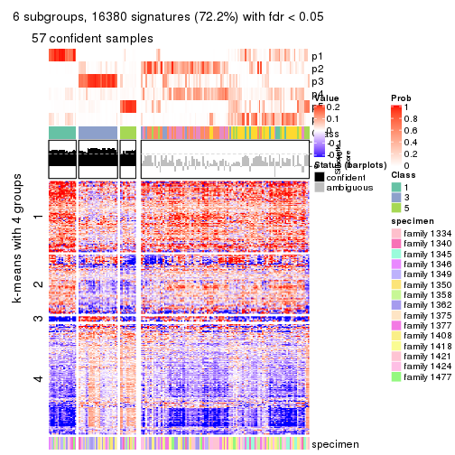</p>

</div>
</div>


Compare the overlap of signatures from different k:

```r
compare_signatures(res)
```


`get_signature()` returns a data frame invisibly. TO get the list of signatures, the function
call should be assigned to a variable explicitly. In following code, if `plot` argument is set
to `FALSE`, no heatmap is plotted while only the differential analysis is performed.

```r
# code only for demonstration
tb = get_signature(res, k = ..., plot = FALSE)
```

An example of the output of `tb` is:

```
#>   which_row         fdr    mean_1    mean_2 scaled_mean_1 scaled_mean_2 km
#> 1        38 0.042760348  8.373488  9.131774    -0.5533452     0.5164555  1
#> 2        40 0.018707592  7.106213  8.469186    -0.6173731     0.5762149  1
#> 3        55 0.019134737 10.221463 11.207825    -0.6159697     0.5749050  1
#> 4        59 0.006059896  5.921854  7.869574    -0.6899429     0.6439467  1
#> 5        60 0.018055526  8.928898 10.211722    -0.6204761     0.5791110  1
#> 6        98 0.009384629 15.714769 14.887706     0.6635654    -0.6193277  2
...
```

The columns in `tb` are:

1. `which_row`: row indices corresponding to the input matrix.
2. `fdr`: FDR for the differential test. 
3. `mean_x`: The mean value in group x.
4. `scaled_mean_x`: The mean value in group x after rows are scaled.
5. `km`: Row groups if k-means clustering is applied to rows.


UMAP plot which shows how samples are separated.


<script>
$( function() {
	$( '#tabs-SD-kmeans-dimension-reduction' ).tabs();
} );
</script>
<div id='tabs-SD-kmeans-dimension-reduction'>
<ul>
<li><a href='#tab-SD-kmeans-dimension-reduction-1'>k = 2</a></li>
<li><a href='#tab-SD-kmeans-dimension-reduction-2'>k = 3</a></li>
<li><a href='#tab-SD-kmeans-dimension-reduction-3'>k = 4</a></li>
<li><a href='#tab-SD-kmeans-dimension-reduction-4'>k = 5</a></li>
<li><a href='#tab-SD-kmeans-dimension-reduction-5'>k = 6</a></li>
</ul>
<div id='tab-SD-kmeans-dimension-reduction-1'>
<pre><code class="r">dimension_reduction(res, k = 2, method = &quot;UMAP&quot;)
</code></pre>

<p></p>

</div>
<div id='tab-SD-kmeans-dimension-reduction-2'>
<pre><code class="r">dimension_reduction(res, k = 3, method = &quot;UMAP&quot;)
</code></pre>

<p>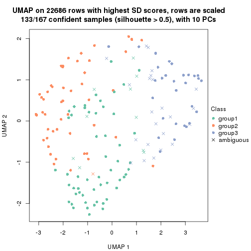</p>

</div>
<div id='tab-SD-kmeans-dimension-reduction-3'>
<pre><code class="r">dimension_reduction(res, k = 4, method = &quot;UMAP&quot;)
</code></pre>

<p></p>

</div>
<div id='tab-SD-kmeans-dimension-reduction-4'>
<pre><code class="r">dimension_reduction(res, k = 5, method = &quot;UMAP&quot;)
</code></pre>

<p></p>

</div>
<div id='tab-SD-kmeans-dimension-reduction-5'>
<pre><code class="r">dimension_reduction(res, k = 6, method = &quot;UMAP&quot;)
</code></pre>

<p></p>

</div>
</div>


Following heatmap shows how subgroups are split when increasing `k`:

```r
collect_classes(res)
```

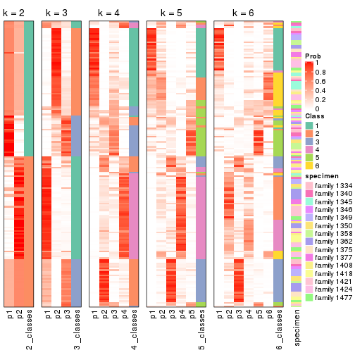


Test correlation between subgroups and known annotations. If the known
annotation is numeric, one-way ANOVA test is applied, and if the known
annotation is discrete, chi-squared contingency table test is applied.

```r
test_to_known_factors(res)
```

```
#>             n specimen(p) k
#> SD:kmeans 161    0.010083 2
#> SD:kmeans 133    0.047719 3
#> SD:kmeans 121    0.000247 4
#> SD:kmeans  97    0.158713 5
#> SD:kmeans  57    0.473189 6
```


If matrix rows can be associated to genes, consider to use `GO_Enrichment(res,
...)` to perform function enrichment for the signature genes.


 

---------------------------------------------------


### SD:skmeans


The object with results only for a single top-value method and a single partition method 
can be extracted as:

```r
res = res_list["SD", "skmeans"]
# you can also extract it by
# res = res_list["SD:skmeans"]
```

A summary of `res` and all the functions that can be applied to it:

```r
res
```

```
#> A 'ConsensusPartition' object with k = 2, 3, 4, 5, 6.
#>   On a matrix with 22686 rows and 167 columns.
#>   Top rows (1000, 2000, 3000, 4000, 5000) are extracted by 'SD' method.
#>   Subgroups are detected by 'skmeans' method.
#>   Performed in total 1250 partitions by row resampling.
#>   Best k for subgroups seems to be 3.
#> 
#> Following methods can be applied to this 'ConsensusPartition' object:
#>  [1] "cola_report"             "collect_classes"         "collect_plots"          
#>  [4] "collect_stats"           "colnames"                "compare_signatures"     
#>  [7] "consensus_heatmap"       "dimension_reduction"     "functional_enrichment"  
#> [10] "get_anno_col"            "get_anno"                "get_classes"            
#> [13] "get_consensus"           "get_matrix"              "get_membership"         
#> [16] "get_param"               "get_signatures"          "get_stats"              
#> [19] "is_best_k"               "is_stable_k"             "membership_heatmap"     
#> [22] "ncol"                    "nrow"                    "plot_ecdf"              
#> [25] "rownames"                "select_partition_number" "show"                   
#> [28] "suggest_best_k"          "test_to_known_factors"
```

`collect_plots()` function collects all the plots made from `res` for all `k` (number of partitions)
into one single page to provide an easy and fast comparison between different `k`.

```r
collect_plots(res)
```


The plots are:

- The first row: a plot of the ECDF (Empirical cumulative distribution
  function) curves of the consensus matrix for each `k` and the heatmap of
  predicted classes for each `k`.
- The second row: heatmaps of the consensus matrix for each `k`.
- The third row: heatmaps of the membership matrix for each `k`.
- The fouth row: heatmaps of the signatures for each `k`.

All the plots in panels can be made by individual functions and they are
plotted later in this section.

`select_partition_number()` produces several plots showing different
statistics for choosing "optimized" `k`. There are following statistics:

- ECDF curves of the consensus matrix for each `k`;
- 1-PAC. [The PAC
  score](https://en.wikipedia.org/wiki/Consensus_clustering#Over-interpretation_potential_of_consensus_clustering)
  measures the proportion of the ambiguous subgrouping.
- Mean silhouette score.
- Concordance. The mean probability of fiting the consensus class ids in all
  partitions.
- Area increased. Denote $A_k$ as the area under the ECDF curve for current
  `k`, the area increased is defined as $A_k - A_{k-1}$.
- Rand index. The percent of pairs of samples that are both in a same cluster
  or both are not in a same cluster in the partition of k and k-1.
- Jaccard index. The ratio of pairs of samples are both in a same cluster in
  the partition of k and k-1 and the pairs of samples are both in a same
  cluster in the partition k or k-1.

The detailed explanations of these statistics can be found in [the cola
vignette](http://bioconductor.org/packages/devel/bioc/vignettes/cola/inst/doc/cola.html#toc_13).

Generally speaking, lower PAC score, higher mean silhouette score or higher
concordance corresponds to better partition. Rand index and Jaccard index
measure how similar the current partition is compared to partition with `k-1`.
If they are too similar, we won't accept `k` is better than `k-1`.

```r
select_partition_number(res)
```


The numeric values for all these statistics can be obtained by `get_stats()`.

```r
get_stats(res)
```

```
#>   k 1-PAC mean_silhouette concordance area_increased  Rand Jaccard
#> 2 2 0.493           0.712       0.837         0.5012 0.498   0.498
#> 3 3 0.598           0.771       0.860         0.3119 0.710   0.481
#> 4 4 0.588           0.643       0.807         0.1274 0.865   0.625
#> 5 5 0.622           0.512       0.703         0.0700 0.934   0.756
#> 6 6 0.653           0.494       0.700         0.0447 0.918   0.653
```

`suggest_best_k()` suggests the best $k$ based on these statistics. The rules are as follows:

- All $k$ with Jaccard index larger than 0.95 are removed because the increase of
  the partition number does not provides enough extra information. If all $k$ are removed,
  the best $k$ is assigned by `NA`.
- For $k$ with 1-PAC larger than 0.9, the maximal $k$ is taken as the "best k". Other $k$ is called "optional k".
- If it does not fit the second rule. The $k$ with the highest vote of highest
  1-PAC, mean silhouette and concordance is taken as the "best k".

```r
suggest_best_k(res)
```

```
#> [1] 3
```


Following shows the table of the partitions (You need to click the **show/hide
code output** link to see it). The membership matrix (columns with name `p*`)
is inferred by
[`clue::cl_consensus()`](https://www.rdocumentation.org/link/cl_consensus?package=clue)
function with the `SE` method. Basically the value in the membership matrix
represents the probability to belong to a certain group. The finall class
label for an item is determined with the group with highest probability it
belongs to.

In `get_classes()` function, the entropy is calculated from the membership
matrix and the silhouette score is calculated from the consensus matrix.


<script>
$( function() {
	$( '#tabs-SD-skmeans-get-classes' ).tabs();
} );
</script>
<div id='tabs-SD-skmeans-get-classes'>
<ul>
<li><a href='#tab-SD-skmeans-get-classes-1'>k = 2</a></li>
<li><a href='#tab-SD-skmeans-get-classes-2'>k = 3</a></li>
<li><a href='#tab-SD-skmeans-get-classes-3'>k = 4</a></li>
<li><a href='#tab-SD-skmeans-get-classes-4'>k = 5</a></li>
<li><a href='#tab-SD-skmeans-get-classes-5'>k = 6</a></li>
</ul>

<div id='tab-SD-skmeans-get-classes-1'>
<p><a id='tab-SD-skmeans-get-classes-1-a' style='color:#0366d6' href='#'>show/hide code output</a></p>
<pre><code class="r">cbind(get_classes(res, k = 2), get_membership(res, k = 2))
</code></pre>

<pre><code>#&gt;          class entropy silhouette    p1    p2
#&gt; GSM30006     2  0.9710      0.748 0.400 0.600
#&gt; GSM30007     1  0.9710      0.795 0.600 0.400
#&gt; GSM30008     1  0.9710      0.795 0.600 0.400
#&gt; GSM30009     1  0.9710      0.795 0.600 0.400
#&gt; GSM30010     1  0.0000      0.590 1.000 0.000
#&gt; GSM30011     2  0.9710      0.748 0.400 0.600
#&gt; GSM30012     2  0.9710      0.748 0.400 0.600
#&gt; GSM30013     2  0.9710      0.748 0.400 0.600
#&gt; GSM30014     1  0.0000      0.590 1.000 0.000
#&gt; GSM30015     1  0.9710      0.795 0.600 0.400
#&gt; GSM30016     1  0.0000      0.590 1.000 0.000
#&gt; GSM30017     1  0.9710      0.795 0.600 0.400
#&gt; GSM30018     2  0.0000      0.648 0.000 1.000
#&gt; GSM30019     2  0.9710      0.748 0.400 0.600
#&gt; GSM30020     1  0.9710      0.795 0.600 0.400
#&gt; GSM30021     1  0.0000      0.590 1.000 0.000
#&gt; GSM30022     1  0.9710      0.795 0.600 0.400
#&gt; GSM30023     2  0.0000      0.648 0.000 1.000
#&gt; GSM30024     1  0.0000      0.590 1.000 0.000
#&gt; GSM30025     1  0.9710      0.795 0.600 0.400
#&gt; GSM30026     1  0.9710      0.795 0.600 0.400
#&gt; GSM30027     1  0.9710      0.795 0.600 0.400
#&gt; GSM30028     1  0.9710      0.795 0.600 0.400
#&gt; GSM30029     1  0.9710      0.795 0.600 0.400
#&gt; GSM30030     1  0.9710      0.795 0.600 0.400
#&gt; GSM30031     1  0.9710      0.795 0.600 0.400
#&gt; GSM30032     1  0.9393      0.775 0.644 0.356
#&gt; GSM30033     1  0.0000      0.590 1.000 0.000
#&gt; GSM30034     2  0.0000      0.648 0.000 1.000
#&gt; GSM30035     1  0.0000      0.590 1.000 0.000
#&gt; GSM30036     2  0.6247      0.689 0.156 0.844
#&gt; GSM30037     1  0.9710      0.795 0.600 0.400
#&gt; GSM30038     1  0.0000      0.590 1.000 0.000
#&gt; GSM30039     2  0.9710      0.748 0.400 0.600
#&gt; GSM30040     1  0.0000      0.590 1.000 0.000
#&gt; GSM30041     2  0.9710      0.748 0.400 0.600
#&gt; GSM30042     2  0.9710      0.748 0.400 0.600
#&gt; GSM30043     1  0.0000      0.590 1.000 0.000
#&gt; GSM30044     1  0.9710      0.795 0.600 0.400
#&gt; GSM30045     1  0.9710      0.795 0.600 0.400
#&gt; GSM30046     2  0.0000      0.648 0.000 1.000
#&gt; GSM30047     2  0.0000      0.648 0.000 1.000
#&gt; GSM30048     2  0.0000      0.648 0.000 1.000
#&gt; GSM30049     2  0.9710      0.748 0.400 0.600
#&gt; GSM30050     2  0.9710      0.748 0.400 0.600
#&gt; GSM30051     2  0.9710      0.748 0.400 0.600
#&gt; GSM30052     1  0.9710      0.795 0.600 0.400
#&gt; GSM30053     2  0.9710      0.748 0.400 0.600
#&gt; GSM30054     2  0.9710      0.748 0.400 0.600
#&gt; GSM30055     2  0.9710      0.748 0.400 0.600
#&gt; GSM30056     2  0.9710      0.748 0.400 0.600
#&gt; GSM30057     1  0.0000      0.590 1.000 0.000
#&gt; GSM30058     2  0.9710      0.748 0.400 0.600
#&gt; GSM30059     2  0.0000      0.648 0.000 1.000
#&gt; GSM30060     1  0.0000      0.590 1.000 0.000
#&gt; GSM30061     2  0.0000      0.648 0.000 1.000
#&gt; GSM30062     2  0.0000      0.648 0.000 1.000
#&gt; GSM30063     2  0.9710      0.748 0.400 0.600
#&gt; GSM30064     1  0.9710      0.795 0.600 0.400
#&gt; GSM30065     2  0.9710      0.748 0.400 0.600
#&gt; GSM30066     1  0.0000      0.590 1.000 0.000
#&gt; GSM30067     1  0.9710      0.795 0.600 0.400
#&gt; GSM30068     1  0.0000      0.590 1.000 0.000
#&gt; GSM30069     1  0.0000      0.590 1.000 0.000
#&gt; GSM30070     2  0.9754      0.741 0.408 0.592
#&gt; GSM30071     2  0.9710      0.748 0.400 0.600
#&gt; GSM30072     1  0.9710      0.795 0.600 0.400
#&gt; GSM30073     2  0.9710      0.748 0.400 0.600
#&gt; GSM30074     1  0.0000      0.590 1.000 0.000
#&gt; GSM30075     2  0.9710      0.748 0.400 0.600
#&gt; GSM30076     2  0.2948      0.664 0.052 0.948
#&gt; GSM30077     2  0.0000      0.648 0.000 1.000
#&gt; GSM30078     2  0.0000      0.648 0.000 1.000
#&gt; GSM30079     1  0.9710      0.795 0.600 0.400
#&gt; GSM30080     2  0.9710      0.748 0.400 0.600
#&gt; GSM30081     2  0.9710      0.748 0.400 0.600
#&gt; GSM30086     2  0.9710      0.748 0.400 0.600
#&gt; GSM30087     2  0.0000      0.648 0.000 1.000
#&gt; GSM30088     2  0.0000      0.648 0.000 1.000
#&gt; GSM30089     1  0.9710      0.795 0.600 0.400
#&gt; GSM30090     2  0.9710      0.748 0.400 0.600
#&gt; GSM30091     2  0.9710      0.748 0.400 0.600
#&gt; GSM30092     2  0.2423      0.660 0.040 0.960
#&gt; GSM30093     2  0.9710      0.748 0.400 0.600
#&gt; GSM30094     2  0.9710      0.748 0.400 0.600
#&gt; GSM30095     1  0.0000      0.590 1.000 0.000
#&gt; GSM30096     1  0.9710      0.795 0.600 0.400
#&gt; GSM30097     2  0.0000      0.648 0.000 1.000
#&gt; GSM30098     1  0.9710      0.795 0.600 0.400
#&gt; GSM30099     2  0.9710      0.748 0.400 0.600
#&gt; GSM30100     1  0.0000      0.590 1.000 0.000
#&gt; GSM30101     2  0.9710      0.748 0.400 0.600
#&gt; GSM30102     2  0.9710      0.748 0.400 0.600
#&gt; GSM30103     1  0.9358      0.774 0.648 0.352
#&gt; GSM30104     2  0.9710      0.748 0.400 0.600
#&gt; GSM30105     1  0.9710      0.795 0.600 0.400
#&gt; GSM30106     2  0.0000      0.648 0.000 1.000
#&gt; GSM30107     2  0.0000      0.648 0.000 1.000
#&gt; GSM30108     1  0.0672      0.594 0.992 0.008
#&gt; GSM30109     1  0.9710      0.795 0.600 0.400
#&gt; GSM30110     2  0.0000      0.648 0.000 1.000
#&gt; GSM30111     1  0.9710      0.795 0.600 0.400
#&gt; GSM30112     1  0.9710      0.795 0.600 0.400
#&gt; GSM30113     1  0.0000      0.590 1.000 0.000
#&gt; GSM30114     2  0.9710      0.748 0.400 0.600
#&gt; GSM30115     2  0.3431      0.667 0.064 0.936
#&gt; GSM30116     1  0.0000      0.590 1.000 0.000
#&gt; GSM30117     1  0.0000      0.590 1.000 0.000
#&gt; GSM30118     1  0.0000      0.590 1.000 0.000
#&gt; GSM30119     2  0.9710      0.748 0.400 0.600
#&gt; GSM30120     2  0.9427      0.728 0.360 0.640
#&gt; GSM30121     1  0.9710      0.795 0.600 0.400
#&gt; GSM30122     1  0.9710      0.795 0.600 0.400
#&gt; GSM30123     2  0.9710      0.748 0.400 0.600
#&gt; GSM30177     2  0.9710      0.748 0.400 0.600
#&gt; GSM30178     2  0.1843      0.657 0.028 0.972
#&gt; GSM30179     1  0.9710      0.795 0.600 0.400
#&gt; GSM30180     1  0.9710      0.795 0.600 0.400
#&gt; GSM30181     2  0.7745      0.706 0.228 0.772
#&gt; GSM30182     2  0.0000      0.648 0.000 1.000
#&gt; GSM30183     1  0.9710      0.795 0.600 0.400
#&gt; GSM30184     2  0.9710      0.748 0.400 0.600
#&gt; GSM30185     1  0.9710      0.795 0.600 0.400
#&gt; GSM30186     1  0.0376      0.585 0.996 0.004
#&gt; GSM30187     2  0.0000      0.648 0.000 1.000
#&gt; GSM30188     2  0.0000      0.648 0.000 1.000
#&gt; GSM30189     2  0.0000      0.648 0.000 1.000
#&gt; GSM30190     2  0.9710      0.748 0.400 0.600
#&gt; GSM30191     2  0.9710      0.748 0.400 0.600
#&gt; GSM30192     2  0.9710      0.748 0.400 0.600
#&gt; GSM30193     2  0.0000      0.648 0.000 1.000
#&gt; GSM30194     2  0.9710      0.748 0.400 0.600
#&gt; GSM30195     1  0.0376      0.585 0.996 0.004
#&gt; GSM30196     1  0.9710      0.795 0.600 0.400
#&gt; GSM30197     2  0.0000      0.648 0.000 1.000
#&gt; GSM30198     2  0.0000      0.648 0.000 1.000
#&gt; GSM30199     1  0.6623      0.680 0.828 0.172
#&gt; GSM30200     2  0.0000      0.648 0.000 1.000
#&gt; GSM30201     2  0.0000      0.648 0.000 1.000
#&gt; GSM30202     1  0.9710      0.795 0.600 0.400
#&gt; GSM30203     2  0.0000      0.648 0.000 1.000
#&gt; GSM30204     2  0.0000      0.648 0.000 1.000
#&gt; GSM30205     1  0.0000      0.590 1.000 0.000
#&gt; GSM30206     2  0.0000      0.648 0.000 1.000
#&gt; GSM30207     2  0.0000      0.648 0.000 1.000
#&gt; GSM30208     2  0.0000      0.648 0.000 1.000
#&gt; GSM30209     2  0.9710      0.748 0.400 0.600
#&gt; GSM30210     1  0.9710      0.795 0.600 0.400
#&gt; GSM30211     2  0.0000      0.648 0.000 1.000
#&gt; GSM30212     1  0.9710      0.795 0.600 0.400
#&gt; GSM30213     1  0.9710      0.795 0.600 0.400
#&gt; GSM30214     1  0.9710      0.795 0.600 0.400
#&gt; GSM30215     1  0.9710      0.795 0.600 0.400
#&gt; GSM30216     1  0.9710      0.795 0.600 0.400
#&gt; GSM30217     1  0.9710      0.795 0.600 0.400
#&gt; GSM30218     2  0.9661      0.747 0.392 0.608
#&gt; GSM30219     1  0.0000      0.590 1.000 0.000
#&gt; GSM30220     1  0.9710      0.795 0.600 0.400
#&gt; GSM30221     2  0.0000      0.648 0.000 1.000
#&gt; GSM30222     2  0.0000      0.648 0.000 1.000
#&gt; GSM30223     1  0.9710      0.795 0.600 0.400
#&gt; GSM30224     2  0.0000      0.648 0.000 1.000
#&gt; GSM30225     1  0.9710      0.795 0.600 0.400
#&gt; GSM30226     1  0.6887      0.687 0.816 0.184
#&gt; GSM30227     1  0.9710      0.795 0.600 0.400
#&gt; GSM30228     2  0.9710      0.748 0.400 0.600
#&gt; GSM30229     2  0.9710      0.748 0.400 0.600
</code></pre>

<script>
$('#tab-SD-skmeans-get-classes-1-a').parent().next().next().hide();
$('#tab-SD-skmeans-get-classes-1-a').click(function(){
  $('#tab-SD-skmeans-get-classes-1-a').parent().next().next().toggle();
  return(false);
});
</script>
</div>

<div id='tab-SD-skmeans-get-classes-2'>
<p><a id='tab-SD-skmeans-get-classes-2-a' style='color:#0366d6' href='#'>show/hide code output</a></p>
<pre><code class="r">cbind(get_classes(res, k = 3), get_membership(res, k = 3))
</code></pre>

<pre><code>#&gt;          class entropy silhouette    p1    p2    p3
#&gt; GSM30006     3  0.4504     0.7775 0.196 0.000 0.804
#&gt; GSM30007     2  0.0000     0.9031 0.000 1.000 0.000
#&gt; GSM30008     2  0.2959     0.8641 0.000 0.900 0.100
#&gt; GSM30009     2  0.0000     0.9031 0.000 1.000 0.000
#&gt; GSM30010     3  0.3038     0.7172 0.000 0.104 0.896
#&gt; GSM30011     3  0.4504     0.7775 0.196 0.000 0.804
#&gt; GSM30012     3  0.4555     0.7751 0.200 0.000 0.800
#&gt; GSM30013     3  0.4931     0.7434 0.232 0.000 0.768
#&gt; GSM30014     3  0.5591     0.5145 0.000 0.304 0.696
#&gt; GSM30015     2  0.7227     0.6653 0.200 0.704 0.096
#&gt; GSM30016     3  0.6308     0.2473 0.000 0.492 0.508
#&gt; GSM30017     1  0.6438     0.6944 0.764 0.136 0.100
#&gt; GSM30018     1  0.0000     0.9146 1.000 0.000 0.000
#&gt; GSM30019     3  0.4605     0.7725 0.204 0.000 0.796
#&gt; GSM30020     2  0.2959     0.8641 0.000 0.900 0.100
#&gt; GSM30021     3  0.6274     0.1581 0.000 0.456 0.544
#&gt; GSM30022     2  0.0000     0.9031 0.000 1.000 0.000
#&gt; GSM30023     1  0.2959     0.8430 0.900 0.000 0.100
#&gt; GSM30024     2  0.6045     0.1858 0.000 0.620 0.380
#&gt; GSM30025     2  0.2959     0.8641 0.000 0.900 0.100
#&gt; GSM30026     1  0.5559     0.7294 0.780 0.028 0.192
#&gt; GSM30027     2  0.3193     0.8617 0.004 0.896 0.100
#&gt; GSM30028     2  0.3193     0.8617 0.004 0.896 0.100
#&gt; GSM30029     2  0.3193     0.8617 0.004 0.896 0.100
#&gt; GSM30030     2  0.0000     0.9031 0.000 1.000 0.000
#&gt; GSM30031     2  0.2959     0.8641 0.000 0.900 0.100
#&gt; GSM30032     2  0.2959     0.8641 0.000 0.900 0.100
#&gt; GSM30033     2  0.6302     0.1243 0.000 0.520 0.480
#&gt; GSM30034     1  0.0237     0.9138 0.996 0.000 0.004
#&gt; GSM30035     2  0.2878     0.8661 0.000 0.904 0.096
#&gt; GSM30036     1  0.4291     0.7539 0.820 0.000 0.180
#&gt; GSM30037     2  0.0000     0.9031 0.000 1.000 0.000
#&gt; GSM30038     3  0.6295     0.3033 0.000 0.472 0.528
#&gt; GSM30039     3  0.4605     0.7725 0.204 0.000 0.796
#&gt; GSM30040     3  0.2796     0.7216 0.000 0.092 0.908
#&gt; GSM30041     3  0.4504     0.7775 0.196 0.000 0.804
#&gt; GSM30042     3  0.4555     0.7762 0.200 0.000 0.800
#&gt; GSM30043     3  0.5431     0.5429 0.000 0.284 0.716
#&gt; GSM30044     2  0.0000     0.9031 0.000 1.000 0.000
#&gt; GSM30045     2  0.0000     0.9031 0.000 1.000 0.000
#&gt; GSM30046     1  0.0237     0.9138 0.996 0.000 0.004
#&gt; GSM30047     1  0.0000     0.9146 1.000 0.000 0.000
#&gt; GSM30048     1  0.0000     0.9146 1.000 0.000 0.000
#&gt; GSM30049     3  0.4504     0.7775 0.196 0.000 0.804
#&gt; GSM30050     1  0.4931     0.6803 0.768 0.000 0.232
#&gt; GSM30051     3  0.4504     0.7775 0.196 0.000 0.804
#&gt; GSM30052     2  0.0000     0.9031 0.000 1.000 0.000
#&gt; GSM30053     3  0.4654     0.7690 0.208 0.000 0.792
#&gt; GSM30054     3  0.4504     0.7775 0.196 0.000 0.804
#&gt; GSM30055     3  0.5845     0.5173 0.308 0.004 0.688
#&gt; GSM30056     3  0.4504     0.7775 0.196 0.000 0.804
#&gt; GSM30057     3  0.3116     0.7151 0.000 0.108 0.892
#&gt; GSM30058     3  0.4504     0.7775 0.196 0.000 0.804
#&gt; GSM30059     1  0.0237     0.9138 0.996 0.000 0.004
#&gt; GSM30060     2  0.5497     0.5623 0.000 0.708 0.292
#&gt; GSM30061     1  0.0000     0.9146 1.000 0.000 0.000
#&gt; GSM30062     1  0.0000     0.9146 1.000 0.000 0.000
#&gt; GSM30063     3  0.5327     0.6889 0.272 0.000 0.728
#&gt; GSM30064     2  0.2448     0.8758 0.000 0.924 0.076
#&gt; GSM30065     3  0.4605     0.7725 0.204 0.000 0.796
#&gt; GSM30066     3  0.5650     0.5021 0.000 0.312 0.688
#&gt; GSM30067     2  0.1031     0.8984 0.000 0.976 0.024
#&gt; GSM30068     3  0.5650     0.5021 0.000 0.312 0.688
#&gt; GSM30069     3  0.6079     0.4585 0.000 0.388 0.612
#&gt; GSM30070     3  0.5764     0.7606 0.124 0.076 0.800
#&gt; GSM30071     3  0.4931     0.7485 0.232 0.000 0.768
#&gt; GSM30072     2  0.0000     0.9031 0.000 1.000 0.000
#&gt; GSM30073     1  0.4750     0.7049 0.784 0.000 0.216
#&gt; GSM30074     3  0.6291     0.0488 0.000 0.468 0.532
#&gt; GSM30075     1  0.2711     0.8409 0.912 0.000 0.088
#&gt; GSM30076     1  0.0000     0.9146 1.000 0.000 0.000
#&gt; GSM30077     1  0.0000     0.9146 1.000 0.000 0.000
#&gt; GSM30078     1  0.0000     0.9146 1.000 0.000 0.000
#&gt; GSM30079     2  0.0000     0.9031 0.000 1.000 0.000
#&gt; GSM30080     1  0.2878     0.8325 0.904 0.000 0.096
#&gt; GSM30081     3  0.4504     0.7775 0.196 0.000 0.804
#&gt; GSM30086     1  0.2711     0.8409 0.912 0.000 0.088
#&gt; GSM30087     1  0.0000     0.9146 1.000 0.000 0.000
#&gt; GSM30088     1  0.0000     0.9146 1.000 0.000 0.000
#&gt; GSM30089     2  0.0000     0.9031 0.000 1.000 0.000
#&gt; GSM30090     3  0.4504     0.7775 0.196 0.000 0.804
#&gt; GSM30091     3  0.4504     0.7775 0.196 0.000 0.804
#&gt; GSM30092     1  0.0237     0.9138 0.996 0.000 0.004
#&gt; GSM30093     3  0.4605     0.7725 0.204 0.000 0.796
#&gt; GSM30094     3  0.4504     0.7775 0.196 0.000 0.804
#&gt; GSM30095     3  0.2711     0.7252 0.000 0.088 0.912
#&gt; GSM30096     2  0.2878     0.8661 0.000 0.904 0.096
#&gt; GSM30097     1  0.0237     0.9138 0.996 0.000 0.004
#&gt; GSM30098     2  0.1031     0.8984 0.000 0.976 0.024
#&gt; GSM30099     3  0.4504     0.7775 0.196 0.000 0.804
#&gt; GSM30100     3  0.6154     0.4483 0.000 0.408 0.592
#&gt; GSM30101     3  0.4504     0.7775 0.196 0.000 0.804
#&gt; GSM30102     3  0.4504     0.7775 0.196 0.000 0.804
#&gt; GSM30103     2  0.1031     0.8984 0.000 0.976 0.024
#&gt; GSM30104     1  0.0237     0.9138 0.996 0.000 0.004
#&gt; GSM30105     2  0.0000     0.9031 0.000 1.000 0.000
#&gt; GSM30106     1  0.0237     0.9126 0.996 0.000 0.004
#&gt; GSM30107     1  0.0000     0.9146 1.000 0.000 0.000
#&gt; GSM30108     2  0.0000     0.9031 0.000 1.000 0.000
#&gt; GSM30109     2  0.0000     0.9031 0.000 1.000 0.000
#&gt; GSM30110     1  0.5431     0.6781 0.716 0.000 0.284
#&gt; GSM30111     2  0.5378     0.6688 0.236 0.756 0.008
#&gt; GSM30112     2  0.0892     0.8992 0.000 0.980 0.020
#&gt; GSM30113     3  0.3116     0.7176 0.000 0.108 0.892
#&gt; GSM30114     3  0.4654     0.7690 0.208 0.000 0.792
#&gt; GSM30115     1  0.4399     0.7437 0.812 0.000 0.188
#&gt; GSM30116     3  0.6308     0.0325 0.000 0.492 0.508
#&gt; GSM30117     2  0.2959     0.8641 0.000 0.900 0.100
#&gt; GSM30118     3  0.6305     0.0619 0.000 0.484 0.516
#&gt; GSM30119     3  0.4504     0.7775 0.196 0.000 0.804
#&gt; GSM30120     1  0.5835     0.5941 0.660 0.000 0.340
#&gt; GSM30121     2  0.1031     0.8984 0.000 0.976 0.024
#&gt; GSM30122     2  0.2796     0.8686 0.000 0.908 0.092
#&gt; GSM30123     1  0.5591     0.4955 0.696 0.000 0.304
#&gt; GSM30177     3  0.4974     0.7403 0.236 0.000 0.764
#&gt; GSM30178     1  0.0237     0.9138 0.996 0.000 0.004
#&gt; GSM30179     2  0.4217     0.8401 0.032 0.868 0.100
#&gt; GSM30180     2  0.2878     0.8661 0.000 0.904 0.096
#&gt; GSM30181     1  0.0000     0.9146 1.000 0.000 0.000
#&gt; GSM30182     1  0.0237     0.9138 0.996 0.000 0.004
#&gt; GSM30183     2  0.2796     0.8685 0.000 0.908 0.092
#&gt; GSM30184     3  0.4504     0.7775 0.196 0.000 0.804
#&gt; GSM30185     2  0.2878     0.8661 0.000 0.904 0.096
#&gt; GSM30186     3  0.3879     0.6882 0.000 0.152 0.848
#&gt; GSM30187     1  0.0237     0.9138 0.996 0.000 0.004
#&gt; GSM30188     1  0.0237     0.9138 0.996 0.000 0.004
#&gt; GSM30189     1  0.2625     0.8514 0.916 0.000 0.084
#&gt; GSM30190     3  0.4504     0.7775 0.196 0.000 0.804
#&gt; GSM30191     1  0.4399     0.7437 0.812 0.000 0.188
#&gt; GSM30192     1  0.0000     0.9146 1.000 0.000 0.000
#&gt; GSM30193     1  0.0000     0.9146 1.000 0.000 0.000
#&gt; GSM30194     3  0.3340     0.7576 0.120 0.000 0.880
#&gt; GSM30195     3  0.6126     0.4632 0.000 0.400 0.600
#&gt; GSM30196     2  0.0000     0.9031 0.000 1.000 0.000
#&gt; GSM30197     1  0.0000     0.9146 1.000 0.000 0.000
#&gt; GSM30198     1  0.2959     0.8430 0.900 0.000 0.100
#&gt; GSM30199     2  0.2878     0.8661 0.000 0.904 0.096
#&gt; GSM30200     1  0.2878     0.8464 0.904 0.000 0.096
#&gt; GSM30201     1  0.0000     0.9146 1.000 0.000 0.000
#&gt; GSM30202     2  0.3295     0.8627 0.008 0.896 0.096
#&gt; GSM30203     1  0.0237     0.9138 0.996 0.000 0.004
#&gt; GSM30204     1  0.3832     0.8240 0.880 0.020 0.100
#&gt; GSM30205     3  0.6111     0.1818 0.000 0.396 0.604
#&gt; GSM30206     1  0.0000     0.9146 1.000 0.000 0.000
#&gt; GSM30207     1  0.2959     0.8430 0.900 0.000 0.100
#&gt; GSM30208     1  0.2959     0.8430 0.900 0.000 0.100
#&gt; GSM30209     3  0.8683     0.6037 0.236 0.172 0.592
#&gt; GSM30210     2  0.2959     0.8641 0.000 0.900 0.100
#&gt; GSM30211     1  0.0000     0.9146 1.000 0.000 0.000
#&gt; GSM30212     2  0.0000     0.9031 0.000 1.000 0.000
#&gt; GSM30213     2  0.0000     0.9031 0.000 1.000 0.000
#&gt; GSM30214     2  0.0237     0.9023 0.000 0.996 0.004
#&gt; GSM30215     2  0.3192     0.8651 0.000 0.888 0.112
#&gt; GSM30216     2  0.1031     0.8984 0.000 0.976 0.024
#&gt; GSM30217     2  0.2959     0.8641 0.000 0.900 0.100
#&gt; GSM30218     1  0.6204     0.1824 0.576 0.000 0.424
#&gt; GSM30219     3  0.5650     0.5021 0.000 0.312 0.688
#&gt; GSM30220     2  0.0000     0.9031 0.000 1.000 0.000
#&gt; GSM30221     1  0.2165     0.8731 0.936 0.000 0.064
#&gt; GSM30222     1  0.0000     0.9146 1.000 0.000 0.000
#&gt; GSM30223     2  0.0000     0.9031 0.000 1.000 0.000
#&gt; GSM30224     1  0.0000     0.9146 1.000 0.000 0.000
#&gt; GSM30225     2  0.8477     0.3259 0.380 0.524 0.096
#&gt; GSM30226     2  0.2878     0.8661 0.000 0.904 0.096
#&gt; GSM30227     2  0.6299     0.7517 0.132 0.772 0.096
#&gt; GSM30228     3  0.4605     0.7725 0.204 0.000 0.796
#&gt; GSM30229     1  0.0000     0.9146 1.000 0.000 0.000
</code></pre>

<script>
$('#tab-SD-skmeans-get-classes-2-a').parent().next().next().hide();
$('#tab-SD-skmeans-get-classes-2-a').click(function(){
  $('#tab-SD-skmeans-get-classes-2-a').parent().next().next().toggle();
  return(false);
});
</script>
</div>

<div id='tab-SD-skmeans-get-classes-3'>
<p><a id='tab-SD-skmeans-get-classes-3-a' style='color:#0366d6' href='#'>show/hide code output</a></p>
<pre><code class="r">cbind(get_classes(res, k = 4), get_membership(res, k = 4))
</code></pre>

<pre><code>#&gt;          class entropy silhouette    p1    p2    p3    p4
#&gt; GSM30006     2  0.0000     0.7811 0.000 1.000 0.000 0.000
#&gt; GSM30007     1  0.0817     0.8298 0.976 0.000 0.024 0.000
#&gt; GSM30008     1  0.3392     0.7812 0.856 0.000 0.020 0.124
#&gt; GSM30009     1  0.0188     0.8313 0.996 0.000 0.004 0.000
#&gt; GSM30010     3  0.1767     0.6478 0.012 0.044 0.944 0.000
#&gt; GSM30011     2  0.0000     0.7811 0.000 1.000 0.000 0.000
#&gt; GSM30012     2  0.4543     0.4926 0.000 0.676 0.324 0.000
#&gt; GSM30013     2  0.4761     0.4827 0.000 0.664 0.332 0.004
#&gt; GSM30014     3  0.0927     0.6577 0.016 0.008 0.976 0.000
#&gt; GSM30015     3  0.7706    -0.0285 0.364 0.000 0.412 0.224
#&gt; GSM30016     3  0.4991     0.4099 0.388 0.004 0.608 0.000
#&gt; GSM30017     4  0.4538     0.5089 0.216 0.000 0.024 0.760
#&gt; GSM30018     4  0.2704     0.8345 0.000 0.124 0.000 0.876
#&gt; GSM30019     2  0.4699     0.4962 0.000 0.676 0.320 0.004
#&gt; GSM30020     1  0.3280     0.7817 0.860 0.000 0.016 0.124
#&gt; GSM30021     3  0.1545     0.6603 0.040 0.008 0.952 0.000
#&gt; GSM30022     1  0.0592     0.8314 0.984 0.000 0.016 0.000
#&gt; GSM30023     4  0.1510     0.7411 0.016 0.000 0.028 0.956
#&gt; GSM30024     1  0.7398    -0.2876 0.424 0.164 0.412 0.000
#&gt; GSM30025     1  0.0779     0.8272 0.980 0.000 0.016 0.004
#&gt; GSM30026     4  0.1936     0.7272 0.028 0.000 0.032 0.940
#&gt; GSM30027     1  0.3607     0.7781 0.852 0.008 0.016 0.124
#&gt; GSM30028     1  0.3598     0.7774 0.848 0.000 0.028 0.124
#&gt; GSM30029     1  0.3280     0.7817 0.860 0.000 0.016 0.124
#&gt; GSM30030     1  0.0000     0.8321 1.000 0.000 0.000 0.000
#&gt; GSM30031     1  0.3280     0.7817 0.860 0.000 0.016 0.124
#&gt; GSM30032     1  0.5965     0.6967 0.748 0.072 0.056 0.124
#&gt; GSM30033     1  0.8118     0.0895 0.432 0.400 0.044 0.124
#&gt; GSM30034     4  0.3873     0.7753 0.000 0.228 0.000 0.772
#&gt; GSM30035     3  0.7830     0.2330 0.260 0.356 0.384 0.000
#&gt; GSM30036     2  0.4304     0.4417 0.000 0.716 0.000 0.284
#&gt; GSM30037     1  0.0336     0.8325 0.992 0.000 0.008 0.000
#&gt; GSM30038     3  0.4790     0.4208 0.380 0.000 0.620 0.000
#&gt; GSM30039     2  0.4605     0.4746 0.000 0.664 0.336 0.000
#&gt; GSM30040     3  0.5510     0.1821 0.016 0.480 0.504 0.000
#&gt; GSM30041     2  0.0592     0.7756 0.000 0.984 0.000 0.016
#&gt; GSM30042     2  0.6367     0.2931 0.000 0.540 0.392 0.068
#&gt; GSM30043     3  0.3166     0.6207 0.016 0.116 0.868 0.000
#&gt; GSM30044     1  0.0707     0.8309 0.980 0.000 0.020 0.000
#&gt; GSM30045     1  0.1302     0.8207 0.956 0.000 0.044 0.000
#&gt; GSM30046     4  0.3583     0.8168 0.000 0.180 0.004 0.816
#&gt; GSM30047     4  0.3172     0.8251 0.000 0.160 0.000 0.840
#&gt; GSM30048     4  0.3142     0.8343 0.000 0.132 0.008 0.860
#&gt; GSM30049     2  0.0000     0.7811 0.000 1.000 0.000 0.000
#&gt; GSM30050     2  0.2469     0.7184 0.000 0.892 0.000 0.108
#&gt; GSM30051     2  0.0000     0.7811 0.000 1.000 0.000 0.000
#&gt; GSM30052     1  0.0336     0.8325 0.992 0.000 0.008 0.000
#&gt; GSM30053     2  0.4585     0.4810 0.000 0.668 0.332 0.000
#&gt; GSM30054     2  0.0188     0.7796 0.000 0.996 0.000 0.004
#&gt; GSM30055     2  0.5584     0.3633 0.012 0.580 0.008 0.400
#&gt; GSM30056     2  0.0188     0.7799 0.000 0.996 0.000 0.004
#&gt; GSM30057     3  0.1059     0.6556 0.012 0.016 0.972 0.000
#&gt; GSM30058     2  0.0000     0.7811 0.000 1.000 0.000 0.000
#&gt; GSM30059     4  0.3266     0.8237 0.000 0.168 0.000 0.832
#&gt; GSM30060     3  0.7153     0.3565 0.308 0.160 0.532 0.000
#&gt; GSM30061     4  0.2760     0.8348 0.000 0.128 0.000 0.872
#&gt; GSM30062     4  0.2814     0.8346 0.000 0.132 0.000 0.868
#&gt; GSM30063     2  0.3726     0.6250 0.000 0.788 0.212 0.000
#&gt; GSM30064     1  0.0895     0.8304 0.976 0.000 0.020 0.004
#&gt; GSM30065     2  0.1940     0.7400 0.000 0.924 0.076 0.000
#&gt; GSM30066     3  0.0927     0.6577 0.016 0.008 0.976 0.000
#&gt; GSM30067     1  0.2149     0.8092 0.912 0.000 0.088 0.000
#&gt; GSM30068     3  0.0927     0.6577 0.016 0.008 0.976 0.000
#&gt; GSM30069     3  0.3681     0.6250 0.176 0.008 0.816 0.000
#&gt; GSM30070     3  0.7682     0.5111 0.180 0.108 0.620 0.092
#&gt; GSM30071     3  0.6834     0.2858 0.000 0.240 0.596 0.164
#&gt; GSM30072     1  0.1022     0.8263 0.968 0.000 0.032 0.000
#&gt; GSM30073     2  0.6567     0.2506 0.000 0.588 0.104 0.308
#&gt; GSM30074     3  0.5751     0.5509 0.164 0.000 0.712 0.124
#&gt; GSM30075     4  0.7171     0.3491 0.000 0.136 0.400 0.464
#&gt; GSM30076     4  0.2760     0.8348 0.000 0.128 0.000 0.872
#&gt; GSM30077     4  0.2814     0.8346 0.000 0.132 0.000 0.868
#&gt; GSM30078     4  0.2814     0.8346 0.000 0.132 0.000 0.868
#&gt; GSM30079     1  0.0469     0.8321 0.988 0.000 0.012 0.000
#&gt; GSM30080     4  0.7240     0.3388 0.000 0.144 0.400 0.456
#&gt; GSM30081     2  0.0000     0.7811 0.000 1.000 0.000 0.000
#&gt; GSM30086     4  0.7091     0.4422 0.000 0.136 0.356 0.508
#&gt; GSM30087     4  0.2814     0.8346 0.000 0.132 0.000 0.868
#&gt; GSM30088     4  0.2704     0.8345 0.000 0.124 0.000 0.876
#&gt; GSM30089     1  0.0817     0.8283 0.976 0.000 0.024 0.000
#&gt; GSM30090     2  0.0000     0.7811 0.000 1.000 0.000 0.000
#&gt; GSM30091     2  0.0000     0.7811 0.000 1.000 0.000 0.000
#&gt; GSM30092     4  0.4356     0.7098 0.000 0.292 0.000 0.708
#&gt; GSM30093     2  0.0000     0.7811 0.000 1.000 0.000 0.000
#&gt; GSM30094     2  0.0000     0.7811 0.000 1.000 0.000 0.000
#&gt; GSM30095     3  0.6486     0.1930 0.044 0.468 0.476 0.012
#&gt; GSM30096     1  0.4776     0.4919 0.624 0.000 0.376 0.000
#&gt; GSM30097     4  0.3528     0.8089 0.000 0.192 0.000 0.808
#&gt; GSM30098     1  0.1792     0.8162 0.932 0.000 0.068 0.000
#&gt; GSM30099     2  0.0188     0.7799 0.000 0.996 0.000 0.004
#&gt; GSM30100     3  0.6157     0.5891 0.232 0.108 0.660 0.000
#&gt; GSM30101     2  0.0188     0.7796 0.000 0.996 0.000 0.004
#&gt; GSM30102     2  0.0469     0.7773 0.000 0.988 0.000 0.012
#&gt; GSM30103     1  0.1940     0.8151 0.924 0.000 0.076 0.000
#&gt; GSM30104     2  0.4961    -0.0759 0.000 0.552 0.000 0.448
#&gt; GSM30105     1  0.0000     0.8321 1.000 0.000 0.000 0.000
#&gt; GSM30106     4  0.2976     0.8334 0.000 0.120 0.008 0.872
#&gt; GSM30107     4  0.3392     0.8320 0.000 0.124 0.020 0.856
#&gt; GSM30108     1  0.4730     0.2597 0.636 0.000 0.364 0.000
#&gt; GSM30109     1  0.0707     0.8318 0.980 0.000 0.020 0.000
#&gt; GSM30110     4  0.6895     0.4820 0.000 0.276 0.148 0.576
#&gt; GSM30111     3  0.5936     0.4012 0.380 0.000 0.576 0.044
#&gt; GSM30112     1  0.2216     0.8063 0.908 0.000 0.092 0.000
#&gt; GSM30113     3  0.2111     0.6501 0.024 0.044 0.932 0.000
#&gt; GSM30114     2  0.4877     0.3527 0.000 0.592 0.408 0.000
#&gt; GSM30115     4  0.6554     0.4306 0.000 0.400 0.080 0.520
#&gt; GSM30116     3  0.7369     0.2541 0.160 0.408 0.432 0.000
#&gt; GSM30117     2  0.7717    -0.2585 0.224 0.392 0.384 0.000
#&gt; GSM30118     3  0.0779     0.6573 0.016 0.004 0.980 0.000
#&gt; GSM30119     3  0.5039     0.0864 0.000 0.404 0.592 0.004
#&gt; GSM30120     3  0.1229     0.6510 0.004 0.020 0.968 0.008
#&gt; GSM30121     1  0.2281     0.8059 0.904 0.000 0.096 0.000
#&gt; GSM30122     1  0.3528     0.7312 0.808 0.000 0.192 0.000
#&gt; GSM30123     2  0.1637     0.7498 0.000 0.940 0.000 0.060
#&gt; GSM30177     2  0.0000     0.7811 0.000 1.000 0.000 0.000
#&gt; GSM30178     4  0.4697     0.6060 0.000 0.356 0.000 0.644
#&gt; GSM30179     1  0.3335     0.7798 0.856 0.000 0.016 0.128
#&gt; GSM30180     1  0.4877     0.4504 0.592 0.000 0.408 0.000
#&gt; GSM30181     4  0.6979     0.4644 0.000 0.128 0.344 0.528
#&gt; GSM30182     4  0.3444     0.8123 0.000 0.184 0.000 0.816
#&gt; GSM30183     1  0.3610     0.7320 0.800 0.000 0.200 0.000
#&gt; GSM30184     2  0.0592     0.7756 0.000 0.984 0.000 0.016
#&gt; GSM30185     1  0.4790     0.4890 0.620 0.000 0.380 0.000
#&gt; GSM30186     2  0.5110     0.1942 0.012 0.636 0.352 0.000
#&gt; GSM30187     4  0.4643     0.6333 0.000 0.344 0.000 0.656
#&gt; GSM30188     4  0.3400     0.8146 0.000 0.180 0.000 0.820
#&gt; GSM30189     4  0.4547     0.7743 0.000 0.104 0.092 0.804
#&gt; GSM30190     2  0.0000     0.7811 0.000 1.000 0.000 0.000
#&gt; GSM30191     2  0.3486     0.6208 0.000 0.812 0.000 0.188
#&gt; GSM30192     4  0.7019     0.4646 0.000 0.132 0.344 0.524
#&gt; GSM30193     4  0.3142     0.8346 0.000 0.132 0.008 0.860
#&gt; GSM30194     3  0.3726     0.5019 0.000 0.212 0.788 0.000
#&gt; GSM30195     3  0.4957     0.4962 0.320 0.000 0.668 0.012
#&gt; GSM30196     1  0.0707     0.8309 0.980 0.000 0.020 0.000
#&gt; GSM30197     4  0.3196     0.8342 0.000 0.136 0.008 0.856
#&gt; GSM30198     4  0.0592     0.7552 0.000 0.000 0.016 0.984
#&gt; GSM30199     1  0.4746     0.5085 0.632 0.000 0.368 0.000
#&gt; GSM30200     4  0.0469     0.7574 0.000 0.000 0.012 0.988
#&gt; GSM30201     4  0.2704     0.8345 0.000 0.124 0.000 0.876
#&gt; GSM30202     1  0.5775     0.4031 0.560 0.000 0.408 0.032
#&gt; GSM30203     4  0.3569     0.8059 0.000 0.196 0.000 0.804
#&gt; GSM30204     4  0.1406     0.7421 0.016 0.000 0.024 0.960
#&gt; GSM30205     3  0.6968     0.5152 0.084 0.228 0.644 0.044
#&gt; GSM30206     4  0.2704     0.8345 0.000 0.124 0.000 0.876
#&gt; GSM30207     4  0.1369     0.7452 0.016 0.004 0.016 0.964
#&gt; GSM30208     4  0.1182     0.7440 0.016 0.000 0.016 0.968
#&gt; GSM30209     2  0.5691     0.3031 0.304 0.648 0.000 0.048
#&gt; GSM30210     1  0.1297     0.8242 0.964 0.000 0.016 0.020
#&gt; GSM30211     4  0.2760     0.8347 0.000 0.128 0.000 0.872
#&gt; GSM30212     1  0.0000     0.8321 1.000 0.000 0.000 0.000
#&gt; GSM30213     1  0.0469     0.8321 0.988 0.000 0.012 0.000
#&gt; GSM30214     1  0.0336     0.8325 0.992 0.000 0.008 0.000
#&gt; GSM30215     1  0.3821     0.7806 0.840 0.000 0.040 0.120
#&gt; GSM30216     1  0.2011     0.8127 0.920 0.000 0.080 0.000
#&gt; GSM30217     1  0.3280     0.7817 0.860 0.000 0.016 0.124
#&gt; GSM30218     2  0.3681     0.6492 0.004 0.848 0.124 0.024
#&gt; GSM30219     3  0.5498     0.3074 0.020 0.404 0.576 0.000
#&gt; GSM30220     1  0.0188     0.8323 0.996 0.000 0.004 0.000
#&gt; GSM30221     4  0.4605     0.6402 0.000 0.336 0.000 0.664
#&gt; GSM30222     4  0.6765     0.5413 0.000 0.124 0.300 0.576
#&gt; GSM30223     1  0.0707     0.8309 0.980 0.000 0.020 0.000
#&gt; GSM30224     4  0.2760     0.8348 0.000 0.128 0.000 0.872
#&gt; GSM30225     3  0.7706     0.1477 0.224 0.000 0.412 0.364
#&gt; GSM30226     1  0.4817     0.4781 0.612 0.000 0.388 0.000
#&gt; GSM30227     1  0.5815     0.5839 0.652 0.000 0.288 0.060
#&gt; GSM30228     2  0.0000     0.7811 0.000 1.000 0.000 0.000
#&gt; GSM30229     4  0.3486     0.8046 0.000 0.188 0.000 0.812
</code></pre>

<script>
$('#tab-SD-skmeans-get-classes-3-a').parent().next().next().hide();
$('#tab-SD-skmeans-get-classes-3-a').click(function(){
  $('#tab-SD-skmeans-get-classes-3-a').parent().next().next().toggle();
  return(false);
});
</script>
</div>

<div id='tab-SD-skmeans-get-classes-4'>
<p><a id='tab-SD-skmeans-get-classes-4-a' style='color:#0366d6' href='#'>show/hide code output</a></p>
<pre><code class="r">cbind(get_classes(res, k = 5), get_membership(res, k = 5))
</code></pre>

<pre><code>#&gt;          class entropy silhouette    p1    p2    p3    p4    p5
#&gt; GSM30006     3  0.0703     0.7528 0.000 0.000 0.976 0.024 0.000
#&gt; GSM30007     1  0.1568     0.6065 0.944 0.020 0.000 0.000 0.036
#&gt; GSM30008     2  0.4706     0.5535 0.492 0.496 0.000 0.008 0.004
#&gt; GSM30009     1  0.2020     0.5609 0.900 0.100 0.000 0.000 0.000
#&gt; GSM30010     5  0.2172     0.6262 0.020 0.004 0.060 0.000 0.916
#&gt; GSM30011     3  0.0671     0.7518 0.000 0.000 0.980 0.016 0.004
#&gt; GSM30012     3  0.5634     0.5607 0.000 0.148 0.676 0.016 0.160
#&gt; GSM30013     3  0.6763     0.5062 0.000 0.196 0.592 0.064 0.148
#&gt; GSM30014     5  0.0579     0.6201 0.008 0.000 0.008 0.000 0.984
#&gt; GSM30015     5  0.8423    -0.0303 0.260 0.296 0.004 0.124 0.316
#&gt; GSM30016     5  0.4371     0.4620 0.344 0.012 0.000 0.000 0.644
#&gt; GSM30017     2  0.5608     0.4748 0.172 0.640 0.000 0.188 0.000
#&gt; GSM30018     4  0.0912     0.7541 0.000 0.012 0.016 0.972 0.000
#&gt; GSM30019     3  0.5889     0.5760 0.000 0.140 0.676 0.040 0.144
#&gt; GSM30020     2  0.4522     0.6057 0.440 0.552 0.000 0.008 0.000
#&gt; GSM30021     5  0.2069     0.6153 0.076 0.012 0.000 0.000 0.912
#&gt; GSM30022     1  0.0451     0.6187 0.988 0.004 0.000 0.000 0.008
#&gt; GSM30023     2  0.3336     0.1314 0.000 0.772 0.000 0.228 0.000
#&gt; GSM30024     5  0.6428     0.4201 0.340 0.036 0.088 0.000 0.536
#&gt; GSM30025     1  0.3999    -0.0780 0.656 0.344 0.000 0.000 0.000
#&gt; GSM30026     4  0.4557     0.1286 0.008 0.476 0.000 0.516 0.000
#&gt; GSM30027     2  0.4807     0.5895 0.464 0.520 0.008 0.008 0.000
#&gt; GSM30028     2  0.4481     0.6024 0.416 0.576 0.000 0.008 0.000
#&gt; GSM30029     2  0.4528     0.6055 0.444 0.548 0.000 0.008 0.000
#&gt; GSM30030     1  0.2329     0.5328 0.876 0.124 0.000 0.000 0.000
#&gt; GSM30031     2  0.4528     0.6055 0.444 0.548 0.000 0.008 0.000
#&gt; GSM30032     2  0.5215     0.5811 0.452 0.516 0.020 0.004 0.008
#&gt; GSM30033     2  0.6926     0.2389 0.152 0.444 0.376 0.000 0.028
#&gt; GSM30034     4  0.1704     0.7523 0.000 0.004 0.068 0.928 0.000
#&gt; GSM30035     5  0.8468     0.0974 0.220 0.180 0.280 0.000 0.320
#&gt; GSM30036     3  0.4302     0.0468 0.000 0.000 0.520 0.480 0.000
#&gt; GSM30037     1  0.1740     0.5981 0.932 0.056 0.000 0.000 0.012
#&gt; GSM30038     5  0.4147     0.4906 0.316 0.008 0.000 0.000 0.676
#&gt; GSM30039     3  0.5963     0.5509 0.000 0.160 0.656 0.028 0.156
#&gt; GSM30040     5  0.5326     0.1252 0.012 0.028 0.464 0.000 0.496
#&gt; GSM30041     3  0.2054     0.7363 0.000 0.008 0.916 0.072 0.004
#&gt; GSM30042     3  0.7982     0.2351 0.000 0.148 0.420 0.144 0.288
#&gt; GSM30043     5  0.2162     0.6168 0.012 0.008 0.064 0.000 0.916
#&gt; GSM30044     1  0.2291     0.5950 0.908 0.056 0.000 0.000 0.036
#&gt; GSM30045     1  0.2376     0.5933 0.904 0.052 0.000 0.000 0.044
#&gt; GSM30046     4  0.3767     0.7433 0.000 0.120 0.068 0.812 0.000
#&gt; GSM30047     4  0.3479     0.7250 0.000 0.080 0.084 0.836 0.000
#&gt; GSM30048     4  0.4269     0.6883 0.000 0.232 0.036 0.732 0.000
#&gt; GSM30049     3  0.0727     0.7484 0.000 0.004 0.980 0.004 0.012
#&gt; GSM30050     3  0.3421     0.6401 0.000 0.008 0.788 0.204 0.000
#&gt; GSM30051     3  0.0727     0.7533 0.000 0.004 0.980 0.012 0.004
#&gt; GSM30052     1  0.1740     0.5988 0.932 0.056 0.000 0.000 0.012
#&gt; GSM30053     3  0.6038     0.5494 0.000 0.164 0.652 0.032 0.152
#&gt; GSM30054     3  0.1492     0.7486 0.000 0.008 0.948 0.040 0.004
#&gt; GSM30055     3  0.6763     0.1970 0.000 0.296 0.472 0.224 0.008
#&gt; GSM30056     3  0.0963     0.7521 0.000 0.000 0.964 0.036 0.000
#&gt; GSM30057     5  0.0579     0.6201 0.008 0.000 0.008 0.000 0.984
#&gt; GSM30058     3  0.1026     0.7528 0.000 0.004 0.968 0.024 0.004
#&gt; GSM30059     4  0.1768     0.7533 0.000 0.004 0.072 0.924 0.000
#&gt; GSM30060     5  0.6354     0.4680 0.112 0.144 0.092 0.000 0.652
#&gt; GSM30061     4  0.2597     0.7402 0.000 0.092 0.024 0.884 0.000
#&gt; GSM30062     4  0.3064     0.7443 0.000 0.108 0.036 0.856 0.000
#&gt; GSM30063     3  0.6083     0.5855 0.000 0.164 0.668 0.068 0.100
#&gt; GSM30064     1  0.3214     0.5257 0.844 0.120 0.000 0.000 0.036
#&gt; GSM30065     3  0.1630     0.7435 0.000 0.004 0.944 0.016 0.036
#&gt; GSM30066     5  0.0898     0.6191 0.020 0.008 0.000 0.000 0.972
#&gt; GSM30067     1  0.4231     0.5464 0.784 0.148 0.008 0.000 0.060
#&gt; GSM30068     5  0.0794     0.6196 0.028 0.000 0.000 0.000 0.972
#&gt; GSM30069     5  0.3774     0.5095 0.296 0.000 0.000 0.000 0.704
#&gt; GSM30070     5  0.5764     0.5185 0.244 0.040 0.000 0.064 0.652
#&gt; GSM30071     5  0.8372     0.1356 0.000 0.248 0.192 0.192 0.368
#&gt; GSM30072     1  0.2153     0.5988 0.916 0.044 0.000 0.000 0.040
#&gt; GSM30073     3  0.6690     0.4189 0.000 0.244 0.564 0.156 0.036
#&gt; GSM30074     5  0.4453     0.4992 0.048 0.228 0.000 0.000 0.724
#&gt; GSM30075     4  0.7379     0.4876 0.000 0.256 0.072 0.500 0.172
#&gt; GSM30076     4  0.1907     0.7579 0.000 0.044 0.028 0.928 0.000
#&gt; GSM30077     4  0.1121     0.7546 0.000 0.000 0.044 0.956 0.000
#&gt; GSM30078     4  0.1043     0.7554 0.000 0.000 0.040 0.960 0.000
#&gt; GSM30079     1  0.0579     0.6184 0.984 0.008 0.000 0.000 0.008
#&gt; GSM30080     4  0.7791     0.4450 0.000 0.256 0.112 0.460 0.172
#&gt; GSM30081     3  0.0727     0.7533 0.000 0.004 0.980 0.012 0.004
#&gt; GSM30086     4  0.7177     0.5158 0.000 0.252 0.064 0.524 0.160
#&gt; GSM30087     4  0.0510     0.7528 0.000 0.000 0.016 0.984 0.000
#&gt; GSM30088     4  0.0579     0.7495 0.000 0.008 0.008 0.984 0.000
#&gt; GSM30089     1  0.3575     0.5170 0.824 0.120 0.000 0.000 0.056
#&gt; GSM30090     3  0.0771     0.7537 0.000 0.000 0.976 0.020 0.004
#&gt; GSM30091     3  0.0833     0.7534 0.000 0.004 0.976 0.016 0.004
#&gt; GSM30092     4  0.3816     0.5129 0.000 0.000 0.304 0.696 0.000
#&gt; GSM30093     3  0.0510     0.7539 0.000 0.000 0.984 0.016 0.000
#&gt; GSM30094     3  0.0727     0.7523 0.000 0.004 0.980 0.012 0.004
#&gt; GSM30095     5  0.6054     0.2027 0.020 0.068 0.420 0.000 0.492
#&gt; GSM30096     1  0.6566     0.3399 0.484 0.196 0.004 0.000 0.316
#&gt; GSM30097     4  0.2124     0.7457 0.000 0.004 0.096 0.900 0.000
#&gt; GSM30098     1  0.3165     0.5795 0.848 0.116 0.000 0.000 0.036
#&gt; GSM30099     3  0.1673     0.7436 0.000 0.016 0.944 0.032 0.008
#&gt; GSM30100     5  0.5294     0.4964 0.304 0.008 0.056 0.000 0.632
#&gt; GSM30101     3  0.1202     0.7510 0.000 0.004 0.960 0.032 0.004
#&gt; GSM30102     3  0.1851     0.7354 0.000 0.000 0.912 0.088 0.000
#&gt; GSM30103     1  0.2446     0.6090 0.900 0.056 0.000 0.000 0.044
#&gt; GSM30104     4  0.4249     0.2004 0.000 0.000 0.432 0.568 0.000
#&gt; GSM30105     1  0.1544     0.5908 0.932 0.068 0.000 0.000 0.000
#&gt; GSM30106     4  0.4306     0.6419 0.000 0.328 0.012 0.660 0.000
#&gt; GSM30107     4  0.4735     0.6247 0.000 0.352 0.020 0.624 0.004
#&gt; GSM30108     5  0.5106     0.2520 0.456 0.036 0.000 0.000 0.508
#&gt; GSM30109     1  0.2249     0.6046 0.896 0.096 0.000 0.000 0.008
#&gt; GSM30110     4  0.9104     0.1743 0.064 0.296 0.140 0.348 0.152
#&gt; GSM30111     1  0.7602    -0.1435 0.364 0.348 0.000 0.048 0.240
#&gt; GSM30112     1  0.3375     0.5954 0.840 0.104 0.000 0.000 0.056
#&gt; GSM30113     5  0.2172     0.6262 0.020 0.004 0.060 0.000 0.916
#&gt; GSM30114     3  0.6821     0.4169 0.000 0.228 0.544 0.032 0.196
#&gt; GSM30115     4  0.7425     0.1947 0.000 0.260 0.340 0.368 0.032
#&gt; GSM30116     3  0.7632    -0.1861 0.128 0.100 0.388 0.000 0.384
#&gt; GSM30117     3  0.8320    -0.1833 0.168 0.180 0.328 0.000 0.324
#&gt; GSM30118     5  0.3722     0.5168 0.040 0.144 0.004 0.000 0.812
#&gt; GSM30119     5  0.5805     0.2439 0.000 0.064 0.332 0.020 0.584
#&gt; GSM30120     5  0.6624     0.3684 0.056 0.404 0.032 0.020 0.488
#&gt; GSM30121     1  0.4593     0.5318 0.756 0.160 0.008 0.000 0.076
#&gt; GSM30122     1  0.6332     0.3910 0.544 0.188 0.004 0.000 0.264
#&gt; GSM30123     3  0.2561     0.6999 0.000 0.000 0.856 0.144 0.000
#&gt; GSM30177     3  0.0510     0.7536 0.000 0.000 0.984 0.016 0.000
#&gt; GSM30178     4  0.3741     0.5712 0.000 0.004 0.264 0.732 0.000
#&gt; GSM30179     2  0.4562     0.5695 0.492 0.500 0.000 0.008 0.000
#&gt; GSM30180     1  0.6346     0.3595 0.516 0.160 0.004 0.000 0.320
#&gt; GSM30181     4  0.6390     0.5318 0.000 0.268 0.016 0.564 0.152
#&gt; GSM30182     4  0.1430     0.7544 0.000 0.004 0.052 0.944 0.000
#&gt; GSM30183     1  0.6293     0.4177 0.588 0.172 0.008 0.004 0.228
#&gt; GSM30184     3  0.2179     0.7214 0.000 0.004 0.896 0.100 0.000
#&gt; GSM30185     1  0.6576     0.3429 0.480 0.196 0.004 0.000 0.320
#&gt; GSM30186     3  0.7077     0.0536 0.044 0.156 0.492 0.000 0.308
#&gt; GSM30187     4  0.3305     0.6423 0.000 0.000 0.224 0.776 0.000
#&gt; GSM30188     4  0.1484     0.7544 0.000 0.008 0.048 0.944 0.000
#&gt; GSM30189     4  0.6708     0.5175 0.032 0.148 0.080 0.656 0.084
#&gt; GSM30190     3  0.0404     0.7533 0.000 0.000 0.988 0.012 0.000
#&gt; GSM30191     3  0.3949     0.4383 0.000 0.000 0.668 0.332 0.000
#&gt; GSM30192     4  0.6730     0.5366 0.000 0.252 0.036 0.556 0.156
#&gt; GSM30193     4  0.4268     0.6774 0.000 0.268 0.024 0.708 0.000
#&gt; GSM30194     5  0.4047     0.3511 0.000 0.004 0.320 0.000 0.676
#&gt; GSM30195     5  0.4769     0.5087 0.288 0.016 0.000 0.020 0.676
#&gt; GSM30196     1  0.2291     0.5950 0.908 0.056 0.000 0.000 0.036
#&gt; GSM30197     4  0.3688     0.7406 0.000 0.124 0.060 0.816 0.000
#&gt; GSM30198     4  0.3876     0.6089 0.000 0.316 0.000 0.684 0.000
#&gt; GSM30199     1  0.5702     0.3797 0.576 0.104 0.000 0.000 0.320
#&gt; GSM30200     4  0.3109     0.7004 0.000 0.200 0.000 0.800 0.000
#&gt; GSM30201     4  0.0609     0.7503 0.000 0.020 0.000 0.980 0.000
#&gt; GSM30202     1  0.6952     0.3343 0.484 0.172 0.004 0.020 0.320
#&gt; GSM30203     4  0.2674     0.7221 0.000 0.004 0.140 0.856 0.000
#&gt; GSM30204     2  0.4088    -0.0195 0.000 0.632 0.000 0.368 0.000
#&gt; GSM30205     5  0.6314     0.2648 0.012 0.368 0.116 0.000 0.504
#&gt; GSM30206     4  0.0451     0.7501 0.000 0.004 0.008 0.988 0.000
#&gt; GSM30207     4  0.4278     0.1845 0.000 0.452 0.000 0.548 0.000
#&gt; GSM30208     4  0.4287     0.1634 0.000 0.460 0.000 0.540 0.000
#&gt; GSM30209     3  0.6295     0.2869 0.296 0.040 0.580 0.084 0.000
#&gt; GSM30210     1  0.4060    -0.1616 0.640 0.360 0.000 0.000 0.000
#&gt; GSM30211     4  0.1740     0.7519 0.000 0.056 0.012 0.932 0.000
#&gt; GSM30212     1  0.1732     0.5797 0.920 0.080 0.000 0.000 0.000
#&gt; GSM30213     1  0.0898     0.6159 0.972 0.020 0.000 0.000 0.008
#&gt; GSM30214     1  0.4040     0.1563 0.712 0.276 0.000 0.000 0.012
#&gt; GSM30215     1  0.4538    -0.3927 0.564 0.428 0.004 0.000 0.004
#&gt; GSM30216     1  0.2770     0.5944 0.880 0.076 0.000 0.000 0.044
#&gt; GSM30217     2  0.4452     0.5525 0.496 0.500 0.000 0.004 0.000
#&gt; GSM30218     3  0.3890     0.6876 0.000 0.080 0.828 0.072 0.020
#&gt; GSM30219     5  0.7398     0.1741 0.052 0.176 0.348 0.000 0.424
#&gt; GSM30220     1  0.1877     0.5926 0.924 0.064 0.000 0.000 0.012
#&gt; GSM30221     4  0.3081     0.6994 0.000 0.012 0.156 0.832 0.000
#&gt; GSM30222     4  0.6114     0.5468 0.000 0.272 0.008 0.580 0.140
#&gt; GSM30223     1  0.2149     0.5994 0.916 0.048 0.000 0.000 0.036
#&gt; GSM30224     4  0.0693     0.7500 0.000 0.008 0.012 0.980 0.000
#&gt; GSM30225     5  0.8473     0.0306 0.224 0.312 0.004 0.144 0.316
#&gt; GSM30226     1  0.6582     0.3370 0.472 0.192 0.004 0.000 0.332
#&gt; GSM30227     1  0.7478     0.1729 0.360 0.320 0.004 0.024 0.292
#&gt; GSM30228     3  0.0703     0.7543 0.000 0.000 0.976 0.024 0.000
#&gt; GSM30229     4  0.3389     0.7315 0.000 0.048 0.116 0.836 0.000
</code></pre>

<script>
$('#tab-SD-skmeans-get-classes-4-a').parent().next().next().hide();
$('#tab-SD-skmeans-get-classes-4-a').click(function(){
  $('#tab-SD-skmeans-get-classes-4-a').parent().next().next().toggle();
  return(false);
});
</script>
</div>

<div id='tab-SD-skmeans-get-classes-5'>
<p><a id='tab-SD-skmeans-get-classes-5-a' style='color:#0366d6' href='#'>show/hide code output</a></p>
<pre><code class="r">cbind(get_classes(res, k = 6), get_membership(res, k = 6))
</code></pre>

<pre><code>#&gt;          class entropy silhouette    p1    p2    p3    p4    p5    p6
#&gt; GSM30006     3  0.0909     0.7443 0.000 0.020 0.968 0.012 0.000 0.000
#&gt; GSM30007     1  0.2517     0.6001 0.876 0.008 0.000 0.000 0.016 0.100
#&gt; GSM30008     6  0.3803     0.6422 0.296 0.004 0.000 0.004 0.004 0.692
#&gt; GSM30009     1  0.2378     0.5728 0.848 0.000 0.000 0.000 0.000 0.152
#&gt; GSM30010     5  0.1458     0.6597 0.016 0.016 0.020 0.000 0.948 0.000
#&gt; GSM30011     3  0.0692     0.7444 0.000 0.020 0.976 0.004 0.000 0.000
#&gt; GSM30012     3  0.4602     0.4649 0.000 0.316 0.636 0.012 0.036 0.000
#&gt; GSM30013     3  0.5491     0.2753 0.000 0.432 0.480 0.060 0.028 0.000
#&gt; GSM30014     5  0.0692     0.6516 0.004 0.020 0.000 0.000 0.976 0.000
#&gt; GSM30015     2  0.8423     0.0300 0.200 0.320 0.000 0.060 0.228 0.192
#&gt; GSM30016     5  0.4246     0.3693 0.400 0.020 0.000 0.000 0.580 0.000
#&gt; GSM30017     6  0.4512     0.6383 0.072 0.132 0.000 0.044 0.000 0.752
#&gt; GSM30018     4  0.2340     0.7339 0.000 0.148 0.000 0.852 0.000 0.000
#&gt; GSM30019     3  0.5233     0.4333 0.000 0.336 0.584 0.044 0.036 0.000
#&gt; GSM30020     6  0.3183     0.6874 0.200 0.008 0.000 0.000 0.004 0.788
#&gt; GSM30021     5  0.2510     0.6577 0.100 0.028 0.000 0.000 0.872 0.000
#&gt; GSM30022     1  0.1036     0.6247 0.964 0.024 0.000 0.000 0.004 0.008
#&gt; GSM30023     6  0.3840     0.4789 0.000 0.284 0.000 0.020 0.000 0.696
#&gt; GSM30024     5  0.4483     0.5270 0.284 0.020 0.004 0.000 0.672 0.020
#&gt; GSM30025     6  0.4018     0.3742 0.412 0.008 0.000 0.000 0.000 0.580
#&gt; GSM30026     6  0.4224     0.3981 0.008 0.016 0.000 0.336 0.000 0.640
#&gt; GSM30027     6  0.3161     0.6745 0.216 0.008 0.000 0.000 0.000 0.776
#&gt; GSM30028     6  0.3352     0.6904 0.180 0.016 0.000 0.004 0.004 0.796
#&gt; GSM30029     6  0.3141     0.6897 0.200 0.012 0.000 0.000 0.000 0.788
#&gt; GSM30030     1  0.2948     0.5333 0.804 0.000 0.000 0.000 0.008 0.188
#&gt; GSM30031     6  0.3152     0.6885 0.196 0.008 0.000 0.000 0.004 0.792
#&gt; GSM30032     6  0.3836     0.6538 0.204 0.016 0.004 0.000 0.016 0.760
#&gt; GSM30033     6  0.6149     0.3707 0.072 0.020 0.304 0.000 0.048 0.556
#&gt; GSM30034     4  0.2402     0.7360 0.000 0.140 0.004 0.856 0.000 0.000
#&gt; GSM30035     2  0.8754    -0.1085 0.224 0.272 0.108 0.000 0.220 0.176
#&gt; GSM30036     4  0.4524     0.2887 0.000 0.036 0.404 0.560 0.000 0.000
#&gt; GSM30037     1  0.2726     0.5885 0.848 0.008 0.000 0.000 0.008 0.136
#&gt; GSM30038     5  0.4302     0.4806 0.324 0.028 0.000 0.000 0.644 0.004
#&gt; GSM30039     3  0.5097     0.4097 0.000 0.352 0.580 0.032 0.036 0.000
#&gt; GSM30040     5  0.5094     0.2496 0.000 0.016 0.400 0.000 0.536 0.048
#&gt; GSM30041     3  0.2822     0.6984 0.000 0.076 0.864 0.056 0.004 0.000
#&gt; GSM30042     2  0.7271    -0.0612 0.000 0.376 0.344 0.128 0.148 0.004
#&gt; GSM30043     5  0.0551     0.6527 0.000 0.008 0.004 0.000 0.984 0.004
#&gt; GSM30044     1  0.2748     0.5904 0.856 0.008 0.000 0.000 0.016 0.120
#&gt; GSM30045     1  0.3389     0.5811 0.824 0.008 0.000 0.000 0.060 0.108
#&gt; GSM30046     4  0.4172     0.6297 0.000 0.224 0.052 0.720 0.000 0.004
#&gt; GSM30047     4  0.3608     0.6998 0.000 0.072 0.016 0.816 0.000 0.096
#&gt; GSM30048     4  0.5865     0.3801 0.000 0.224 0.028 0.580 0.000 0.168
#&gt; GSM30049     3  0.0951     0.7416 0.000 0.004 0.968 0.008 0.020 0.000
#&gt; GSM30050     3  0.4151     0.5110 0.000 0.044 0.692 0.264 0.000 0.000
#&gt; GSM30051     3  0.0260     0.7442 0.000 0.000 0.992 0.000 0.008 0.000
#&gt; GSM30052     1  0.2420     0.5915 0.864 0.004 0.000 0.000 0.004 0.128
#&gt; GSM30053     3  0.5210     0.4068 0.000 0.348 0.576 0.040 0.036 0.000
#&gt; GSM30054     3  0.2220     0.7254 0.000 0.044 0.908 0.036 0.012 0.000
#&gt; GSM30055     3  0.6975     0.0768 0.000 0.096 0.420 0.136 0.004 0.344
#&gt; GSM30056     3  0.2056     0.7270 0.000 0.012 0.904 0.080 0.000 0.004
#&gt; GSM30057     5  0.0858     0.6504 0.000 0.028 0.004 0.000 0.968 0.000
#&gt; GSM30058     3  0.1149     0.7420 0.000 0.008 0.960 0.024 0.008 0.000
#&gt; GSM30059     4  0.2123     0.7467 0.000 0.020 0.064 0.908 0.000 0.008
#&gt; GSM30060     5  0.4475     0.5939 0.112 0.024 0.000 0.000 0.748 0.116
#&gt; GSM30061     4  0.3907     0.6624 0.000 0.152 0.000 0.764 0.000 0.084
#&gt; GSM30062     4  0.4149     0.6562 0.000 0.136 0.024 0.772 0.000 0.068
#&gt; GSM30063     3  0.4851     0.4469 0.000 0.340 0.604 0.036 0.020 0.000
#&gt; GSM30064     1  0.3658     0.5192 0.776 0.016 0.000 0.000 0.020 0.188
#&gt; GSM30065     3  0.1605     0.7345 0.000 0.044 0.936 0.016 0.004 0.000
#&gt; GSM30066     5  0.0692     0.6508 0.004 0.020 0.000 0.000 0.976 0.000
#&gt; GSM30067     1  0.4387     0.5566 0.736 0.152 0.000 0.000 0.008 0.104
#&gt; GSM30068     5  0.1633     0.6557 0.024 0.044 0.000 0.000 0.932 0.000
#&gt; GSM30069     5  0.3566     0.5817 0.236 0.020 0.000 0.000 0.744 0.000
#&gt; GSM30070     5  0.6169     0.4885 0.160 0.220 0.004 0.044 0.572 0.000
#&gt; GSM30071     2  0.7323     0.3487 0.008 0.516 0.120 0.168 0.168 0.020
#&gt; GSM30072     1  0.2615     0.6007 0.876 0.008 0.000 0.000 0.028 0.088
#&gt; GSM30073     3  0.5147     0.2085 0.000 0.436 0.480 0.084 0.000 0.000
#&gt; GSM30074     5  0.4091     0.5493 0.016 0.032 0.000 0.000 0.736 0.216
#&gt; GSM30075     2  0.5934     0.3017 0.000 0.536 0.048 0.352 0.044 0.020
#&gt; GSM30076     4  0.2632     0.7120 0.000 0.164 0.004 0.832 0.000 0.000
#&gt; GSM30077     4  0.1666     0.7480 0.000 0.020 0.036 0.936 0.000 0.008
#&gt; GSM30078     4  0.1829     0.7493 0.000 0.036 0.028 0.928 0.000 0.008
#&gt; GSM30079     1  0.1053     0.6239 0.964 0.020 0.000 0.000 0.004 0.012
#&gt; GSM30080     2  0.6051     0.3078 0.000 0.532 0.068 0.340 0.048 0.012
#&gt; GSM30081     3  0.0291     0.7445 0.000 0.000 0.992 0.004 0.004 0.000
#&gt; GSM30086     2  0.5812     0.2917 0.000 0.528 0.048 0.368 0.044 0.012
#&gt; GSM30087     4  0.1857     0.7556 0.000 0.044 0.028 0.924 0.000 0.004
#&gt; GSM30088     4  0.1643     0.7444 0.000 0.068 0.000 0.924 0.000 0.008
#&gt; GSM30089     1  0.4388     0.5027 0.732 0.008 0.000 0.000 0.092 0.168
#&gt; GSM30090     3  0.0622     0.7446 0.000 0.000 0.980 0.012 0.008 0.000
#&gt; GSM30091     3  0.0964     0.7423 0.000 0.004 0.968 0.012 0.016 0.000
#&gt; GSM30092     4  0.3593     0.6196 0.000 0.024 0.208 0.764 0.000 0.004
#&gt; GSM30093     3  0.0993     0.7415 0.000 0.012 0.964 0.024 0.000 0.000
#&gt; GSM30094     3  0.1269     0.7405 0.000 0.012 0.956 0.012 0.020 0.000
#&gt; GSM30095     5  0.5276     0.2192 0.008 0.008 0.412 0.000 0.516 0.056
#&gt; GSM30096     1  0.7689     0.1926 0.308 0.232 0.000 0.000 0.232 0.228
#&gt; GSM30097     4  0.2641     0.7469 0.000 0.048 0.072 0.876 0.000 0.004
#&gt; GSM30098     1  0.3626     0.5956 0.812 0.084 0.000 0.000 0.012 0.092
#&gt; GSM30099     3  0.3392     0.7058 0.000 0.036 0.856 0.048 0.024 0.036
#&gt; GSM30100     5  0.3651     0.5744 0.248 0.008 0.004 0.000 0.736 0.004
#&gt; GSM30101     3  0.1546     0.7369 0.000 0.020 0.944 0.016 0.020 0.000
#&gt; GSM30102     3  0.2488     0.7208 0.000 0.044 0.880 0.076 0.000 0.000
#&gt; GSM30103     1  0.4460     0.5741 0.756 0.076 0.000 0.000 0.040 0.128
#&gt; GSM30104     4  0.4103     0.4945 0.000 0.020 0.288 0.684 0.000 0.008
#&gt; GSM30105     1  0.2122     0.6054 0.900 0.024 0.000 0.000 0.000 0.076
#&gt; GSM30106     2  0.4594     0.2210 0.000 0.608 0.000 0.340 0.000 0.052
#&gt; GSM30107     2  0.4597     0.2454 0.000 0.584 0.004 0.376 0.000 0.036
#&gt; GSM30108     1  0.4700    -0.1744 0.492 0.008 0.000 0.000 0.472 0.028
#&gt; GSM30109     1  0.2930     0.6091 0.840 0.036 0.000 0.000 0.000 0.124
#&gt; GSM30110     2  0.8557     0.1832 0.084 0.412 0.068 0.244 0.056 0.136
#&gt; GSM30111     1  0.7923     0.0512 0.344 0.328 0.000 0.040 0.144 0.144
#&gt; GSM30112     1  0.3719     0.6026 0.800 0.012 0.000 0.000 0.064 0.124
#&gt; GSM30113     5  0.1686     0.6597 0.016 0.016 0.024 0.000 0.940 0.004
#&gt; GSM30114     3  0.5603     0.1794 0.000 0.448 0.456 0.032 0.064 0.000
#&gt; GSM30115     2  0.6073     0.2113 0.000 0.496 0.272 0.220 0.000 0.012
#&gt; GSM30116     5  0.7736     0.2103 0.104 0.084 0.344 0.000 0.384 0.084
#&gt; GSM30117     2  0.8876    -0.0174 0.152 0.256 0.180 0.000 0.236 0.176
#&gt; GSM30118     5  0.4745     0.3948 0.012 0.232 0.000 0.000 0.680 0.076
#&gt; GSM30119     5  0.6311     0.2508 0.000 0.244 0.248 0.024 0.484 0.000
#&gt; GSM30120     2  0.5706     0.2307 0.024 0.660 0.016 0.016 0.204 0.080
#&gt; GSM30121     1  0.5444     0.5087 0.656 0.184 0.000 0.000 0.044 0.116
#&gt; GSM30122     1  0.7384     0.2976 0.392 0.260 0.000 0.000 0.152 0.196
#&gt; GSM30123     3  0.3712     0.6172 0.000 0.052 0.768 0.180 0.000 0.000
#&gt; GSM30177     3  0.1088     0.7438 0.000 0.016 0.960 0.024 0.000 0.000
#&gt; GSM30178     4  0.3717     0.6689 0.000 0.064 0.160 0.776 0.000 0.000
#&gt; GSM30179     6  0.3808     0.6336 0.284 0.000 0.000 0.012 0.004 0.700
#&gt; GSM30180     1  0.7422     0.2085 0.380 0.244 0.000 0.000 0.232 0.144
#&gt; GSM30181     2  0.4399     0.2790 0.000 0.616 0.000 0.352 0.028 0.004
#&gt; GSM30182     4  0.2350     0.7469 0.000 0.076 0.036 0.888 0.000 0.000
#&gt; GSM30183     1  0.7163     0.3105 0.464 0.284 0.004 0.008 0.120 0.120
#&gt; GSM30184     3  0.3213     0.6795 0.000 0.084 0.836 0.076 0.004 0.000
#&gt; GSM30185     1  0.7688     0.1775 0.296 0.264 0.000 0.000 0.232 0.208
#&gt; GSM30186     3  0.7515     0.0265 0.020 0.252 0.416 0.000 0.216 0.096
#&gt; GSM30187     4  0.3284     0.6898 0.000 0.032 0.168 0.800 0.000 0.000
#&gt; GSM30188     4  0.2176     0.7461 0.000 0.080 0.024 0.896 0.000 0.000
#&gt; GSM30189     4  0.5461     0.4426 0.004 0.276 0.032 0.628 0.048 0.012
#&gt; GSM30190     3  0.0260     0.7439 0.000 0.008 0.992 0.000 0.000 0.000
#&gt; GSM30191     3  0.4184    -0.0378 0.000 0.012 0.500 0.488 0.000 0.000
#&gt; GSM30192     2  0.5175     0.2766 0.000 0.576 0.028 0.356 0.036 0.004
#&gt; GSM30193     2  0.4444     0.1958 0.000 0.576 0.024 0.396 0.000 0.004
#&gt; GSM30194     5  0.3586     0.5197 0.000 0.012 0.268 0.000 0.720 0.000
#&gt; GSM30195     5  0.5626     0.5071 0.264 0.112 0.000 0.016 0.600 0.008
#&gt; GSM30196     1  0.2834     0.5888 0.852 0.008 0.000 0.000 0.020 0.120
#&gt; GSM30197     4  0.4673     0.5289 0.000 0.240 0.044 0.688 0.000 0.028
#&gt; GSM30198     4  0.5927     0.2443 0.004 0.208 0.000 0.484 0.000 0.304
#&gt; GSM30199     1  0.7031     0.3253 0.456 0.132 0.000 0.000 0.264 0.148
#&gt; GSM30200     4  0.4937     0.4971 0.000 0.196 0.000 0.652 0.000 0.152
#&gt; GSM30201     4  0.2121     0.7435 0.000 0.096 0.000 0.892 0.000 0.012
#&gt; GSM30202     1  0.7682     0.1597 0.344 0.252 0.000 0.004 0.228 0.172
#&gt; GSM30203     4  0.2875     0.7406 0.000 0.052 0.096 0.852 0.000 0.000
#&gt; GSM30204     6  0.4531     0.5445 0.004 0.172 0.000 0.112 0.000 0.712
#&gt; GSM30205     5  0.4821     0.3320 0.004 0.020 0.024 0.000 0.600 0.352
#&gt; GSM30206     4  0.2365     0.7548 0.000 0.068 0.024 0.896 0.000 0.012
#&gt; GSM30207     6  0.4461     0.2649 0.000 0.032 0.000 0.404 0.000 0.564
#&gt; GSM30208     6  0.4109     0.2753 0.000 0.012 0.000 0.412 0.000 0.576
#&gt; GSM30209     3  0.7103     0.2931 0.264 0.116 0.516 0.052 0.008 0.044
#&gt; GSM30210     1  0.3986    -0.1322 0.532 0.004 0.000 0.000 0.000 0.464
#&gt; GSM30211     4  0.3359     0.7081 0.000 0.136 0.020 0.820 0.000 0.024
#&gt; GSM30212     1  0.2383     0.5994 0.880 0.024 0.000 0.000 0.000 0.096
#&gt; GSM30213     1  0.1788     0.6176 0.928 0.028 0.000 0.000 0.004 0.040
#&gt; GSM30214     1  0.4782     0.2728 0.624 0.036 0.000 0.000 0.020 0.320
#&gt; GSM30215     6  0.4636     0.3617 0.432 0.032 0.000 0.000 0.004 0.532
#&gt; GSM30216     1  0.3666     0.5945 0.812 0.080 0.000 0.000 0.016 0.092
#&gt; GSM30217     6  0.3499     0.6411 0.264 0.004 0.000 0.000 0.004 0.728
#&gt; GSM30218     3  0.6410     0.5134 0.000 0.104 0.636 0.080 0.060 0.120
#&gt; GSM30219     5  0.7667     0.1024 0.012 0.248 0.288 0.000 0.336 0.116
#&gt; GSM30220     1  0.2573     0.5875 0.856 0.004 0.000 0.000 0.008 0.132
#&gt; GSM30221     4  0.3285     0.7230 0.000 0.116 0.064 0.820 0.000 0.000
#&gt; GSM30222     2  0.4507     0.2795 0.000 0.596 0.000 0.372 0.020 0.012
#&gt; GSM30223     1  0.2748     0.5929 0.856 0.008 0.000 0.000 0.016 0.120
#&gt; GSM30224     4  0.1542     0.7541 0.000 0.024 0.016 0.944 0.000 0.016
#&gt; GSM30225     2  0.8331     0.0327 0.204 0.332 0.000 0.052 0.228 0.184
#&gt; GSM30226     1  0.7685     0.1791 0.300 0.232 0.000 0.000 0.260 0.208
#&gt; GSM30227     2  0.7575    -0.0744 0.264 0.344 0.000 0.000 0.204 0.188
#&gt; GSM30228     3  0.1225     0.7437 0.000 0.012 0.952 0.036 0.000 0.000
#&gt; GSM30229     4  0.4515     0.6385 0.000 0.192 0.072 0.720 0.000 0.016
</code></pre>

<script>
$('#tab-SD-skmeans-get-classes-5-a').parent().next().next().hide();
$('#tab-SD-skmeans-get-classes-5-a').click(function(){
  $('#tab-SD-skmeans-get-classes-5-a').parent().next().next().toggle();
  return(false);
});
</script>
</div>
</div>

Heatmaps for the consensus matrix. It visualizes the probability of two
samples to be in a same group.


<script>
$( function() {
	$( '#tabs-SD-skmeans-consensus-heatmap' ).tabs();
} );
</script>
<div id='tabs-SD-skmeans-consensus-heatmap'>
<ul>
<li><a href='#tab-SD-skmeans-consensus-heatmap-1'>k = 2</a></li>
<li><a href='#tab-SD-skmeans-consensus-heatmap-2'>k = 3</a></li>
<li><a href='#tab-SD-skmeans-consensus-heatmap-3'>k = 4</a></li>
<li><a href='#tab-SD-skmeans-consensus-heatmap-4'>k = 5</a></li>
<li><a href='#tab-SD-skmeans-consensus-heatmap-5'>k = 6</a></li>
</ul>
<div id='tab-SD-skmeans-consensus-heatmap-1'>
<pre><code class="r">consensus_heatmap(res, k = 2)
</code></pre>

<p></p>

</div>
<div id='tab-SD-skmeans-consensus-heatmap-2'>
<pre><code class="r">consensus_heatmap(res, k = 3)
</code></pre>

<p></p>

</div>
<div id='tab-SD-skmeans-consensus-heatmap-3'>
<pre><code class="r">consensus_heatmap(res, k = 4)
</code></pre>

<p></p>

</div>
<div id='tab-SD-skmeans-consensus-heatmap-4'>
<pre><code class="r">consensus_heatmap(res, k = 5)
</code></pre>

<p></p>

</div>
<div id='tab-SD-skmeans-consensus-heatmap-5'>
<pre><code class="r">consensus_heatmap(res, k = 6)
</code></pre>

<p></p>

</div>
</div>

Heatmaps for the membership of samples in all partitions to see how consistent they are:


<script>
$( function() {
	$( '#tabs-SD-skmeans-membership-heatmap' ).tabs();
} );
</script>
<div id='tabs-SD-skmeans-membership-heatmap'>
<ul>
<li><a href='#tab-SD-skmeans-membership-heatmap-1'>k = 2</a></li>
<li><a href='#tab-SD-skmeans-membership-heatmap-2'>k = 3</a></li>
<li><a href='#tab-SD-skmeans-membership-heatmap-3'>k = 4</a></li>
<li><a href='#tab-SD-skmeans-membership-heatmap-4'>k = 5</a></li>
<li><a href='#tab-SD-skmeans-membership-heatmap-5'>k = 6</a></li>
</ul>
<div id='tab-SD-skmeans-membership-heatmap-1'>
<pre><code class="r">membership_heatmap(res, k = 2)
</code></pre>

<p></p>

</div>
<div id='tab-SD-skmeans-membership-heatmap-2'>
<pre><code class="r">membership_heatmap(res, k = 3)
</code></pre>

<p></p>

</div>
<div id='tab-SD-skmeans-membership-heatmap-3'>
<pre><code class="r">membership_heatmap(res, k = 4)
</code></pre>

<p></p>

</div>
<div id='tab-SD-skmeans-membership-heatmap-4'>
<pre><code class="r">membership_heatmap(res, k = 5)
</code></pre>

<p></p>

</div>
<div id='tab-SD-skmeans-membership-heatmap-5'>
<pre><code class="r">membership_heatmap(res, k = 6)
</code></pre>

<p></p>

</div>
</div>

As soon as we have had the classes for columns, we can look for signatures
which are significantly different between classes which can be candidate marks
for certain classes. Following are the heatmaps for signatures.


Signature heatmaps where rows are scaled:


<script>
$( function() {
	$( '#tabs-SD-skmeans-get-signatures' ).tabs();
} );
</script>
<div id='tabs-SD-skmeans-get-signatures'>
<ul>
<li><a href='#tab-SD-skmeans-get-signatures-1'>k = 2</a></li>
<li><a href='#tab-SD-skmeans-get-signatures-2'>k = 3</a></li>
<li><a href='#tab-SD-skmeans-get-signatures-3'>k = 4</a></li>
<li><a href='#tab-SD-skmeans-get-signatures-4'>k = 5</a></li>
<li><a href='#tab-SD-skmeans-get-signatures-5'>k = 6</a></li>
</ul>
<div id='tab-SD-skmeans-get-signatures-1'>
<pre><code class="r">get_signatures(res, k = 2)
</code></pre>

<p></p>

</div>
<div id='tab-SD-skmeans-get-signatures-2'>
<pre><code class="r">get_signatures(res, k = 3)
</code></pre>

<p></p>

</div>
<div id='tab-SD-skmeans-get-signatures-3'>
<pre><code class="r">get_signatures(res, k = 4)
</code></pre>

<p></p>

</div>
<div id='tab-SD-skmeans-get-signatures-4'>
<pre><code class="r">get_signatures(res, k = 5)
</code></pre>

<p></p>

</div>
<div id='tab-SD-skmeans-get-signatures-5'>
<pre><code class="r">get_signatures(res, k = 6)
</code></pre>

<p></p>

</div>
</div>


Signature heatmaps where rows are not scaled:


<script>
$( function() {
	$( '#tabs-SD-skmeans-get-signatures-no-scale' ).tabs();
} );
</script>
<div id='tabs-SD-skmeans-get-signatures-no-scale'>
<ul>
<li><a href='#tab-SD-skmeans-get-signatures-no-scale-1'>k = 2</a></li>
<li><a href='#tab-SD-skmeans-get-signatures-no-scale-2'>k = 3</a></li>
<li><a href='#tab-SD-skmeans-get-signatures-no-scale-3'>k = 4</a></li>
<li><a href='#tab-SD-skmeans-get-signatures-no-scale-4'>k = 5</a></li>
<li><a href='#tab-SD-skmeans-get-signatures-no-scale-5'>k = 6</a></li>
</ul>
<div id='tab-SD-skmeans-get-signatures-no-scale-1'>
<pre><code class="r">get_signatures(res, k = 2, scale_rows = FALSE)
</code></pre>

<p></p>

</div>
<div id='tab-SD-skmeans-get-signatures-no-scale-2'>
<pre><code class="r">get_signatures(res, k = 3, scale_rows = FALSE)
</code></pre>

<p></p>

</div>
<div id='tab-SD-skmeans-get-signatures-no-scale-3'>
<pre><code class="r">get_signatures(res, k = 4, scale_rows = FALSE)
</code></pre>

<p></p>

</div>
<div id='tab-SD-skmeans-get-signatures-no-scale-4'>
<pre><code class="r">get_signatures(res, k = 5, scale_rows = FALSE)
</code></pre>

<p></p>

</div>
<div id='tab-SD-skmeans-get-signatures-no-scale-5'>
<pre><code class="r">get_signatures(res, k = 6, scale_rows = FALSE)
</code></pre>

<p></p>

</div>
</div>


Compare the overlap of signatures from different k:

```r
compare_signatures(res)
```


`get_signature()` returns a data frame invisibly. TO get the list of signatures, the function
call should be assigned to a variable explicitly. In following code, if `plot` argument is set
to `FALSE`, no heatmap is plotted while only the differential analysis is performed.

```r
# code only for demonstration
tb = get_signature(res, k = ..., plot = FALSE)
```

An example of the output of `tb` is:

```
#>   which_row         fdr    mean_1    mean_2 scaled_mean_1 scaled_mean_2 km
#> 1        38 0.042760348  8.373488  9.131774    -0.5533452     0.5164555  1
#> 2        40 0.018707592  7.106213  8.469186    -0.6173731     0.5762149  1
#> 3        55 0.019134737 10.221463 11.207825    -0.6159697     0.5749050  1
#> 4        59 0.006059896  5.921854  7.869574    -0.6899429     0.6439467  1
#> 5        60 0.018055526  8.928898 10.211722    -0.6204761     0.5791110  1
#> 6        98 0.009384629 15.714769 14.887706     0.6635654    -0.6193277  2
...
```

The columns in `tb` are:

1. `which_row`: row indices corresponding to the input matrix.
2. `fdr`: FDR for the differential test. 
3. `mean_x`: The mean value in group x.
4. `scaled_mean_x`: The mean value in group x after rows are scaled.
5. `km`: Row groups if k-means clustering is applied to rows.


UMAP plot which shows how samples are separated.


<script>
$( function() {
	$( '#tabs-SD-skmeans-dimension-reduction' ).tabs();
} );
</script>
<div id='tabs-SD-skmeans-dimension-reduction'>
<ul>
<li><a href='#tab-SD-skmeans-dimension-reduction-1'>k = 2</a></li>
<li><a href='#tab-SD-skmeans-dimension-reduction-2'>k = 3</a></li>
<li><a href='#tab-SD-skmeans-dimension-reduction-3'>k = 4</a></li>
<li><a href='#tab-SD-skmeans-dimension-reduction-4'>k = 5</a></li>
<li><a href='#tab-SD-skmeans-dimension-reduction-5'>k = 6</a></li>
</ul>
<div id='tab-SD-skmeans-dimension-reduction-1'>
<pre><code class="r">dimension_reduction(res, k = 2, method = &quot;UMAP&quot;)
</code></pre>

<p></p>

</div>
<div id='tab-SD-skmeans-dimension-reduction-2'>
<pre><code class="r">dimension_reduction(res, k = 3, method = &quot;UMAP&quot;)
</code></pre>

<p></p>

</div>
<div id='tab-SD-skmeans-dimension-reduction-3'>
<pre><code class="r">dimension_reduction(res, k = 4, method = &quot;UMAP&quot;)
</code></pre>

<p></p>

</div>
<div id='tab-SD-skmeans-dimension-reduction-4'>
<pre><code class="r">dimension_reduction(res, k = 5, method = &quot;UMAP&quot;)
</code></pre>

<p></p>

</div>
<div id='tab-SD-skmeans-dimension-reduction-5'>
<pre><code class="r">dimension_reduction(res, k = 6, method = &quot;UMAP&quot;)
</code></pre>

<p></p>

</div>
</div>


Following heatmap shows how subgroups are split when increasing `k`:

```r
collect_classes(res)
```

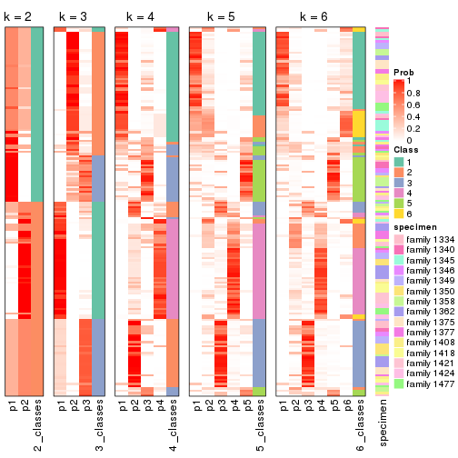


Test correlation between subgroups and known annotations. If the known
annotation is numeric, one-way ANOVA test is applied, and if the known
annotation is discrete, chi-squared contingency table test is applied.

```r
test_to_known_factors(res)
```

```
#>              n specimen(p) k
#> SD:skmeans 167    3.52e-02 2
#> SD:skmeans 152    6.78e-02 3
#> SD:skmeans 124    1.43e-02 4
#> SD:skmeans 113    9.15e-06 5
#> SD:skmeans 101    4.04e-03 6
```


If matrix rows can be associated to genes, consider to use `GO_Enrichment(res,
...)` to perform function enrichment for the signature genes.


 

---------------------------------------------------


### SD:pam


The object with results only for a single top-value method and a single partition method 
can be extracted as:

```r
res = res_list["SD", "pam"]
# you can also extract it by
# res = res_list["SD:pam"]
```

A summary of `res` and all the functions that can be applied to it:

```r
res
```

```
#> A 'ConsensusPartition' object with k = 2, 3, 4, 5, 6.
#>   On a matrix with 22686 rows and 167 columns.
#>   Top rows (1000, 2000, 3000, 4000, 5000) are extracted by 'SD' method.
#>   Subgroups are detected by 'pam' method.
#>   Performed in total 1250 partitions by row resampling.
#>   Best k for subgroups seems to be 2.
#> 
#> Following methods can be applied to this 'ConsensusPartition' object:
#>  [1] "cola_report"             "collect_classes"         "collect_plots"          
#>  [4] "collect_stats"           "colnames"                "compare_signatures"     
#>  [7] "consensus_heatmap"       "dimension_reduction"     "functional_enrichment"  
#> [10] "get_anno_col"            "get_anno"                "get_classes"            
#> [13] "get_consensus"           "get_matrix"              "get_membership"         
#> [16] "get_param"               "get_signatures"          "get_stats"              
#> [19] "is_best_k"               "is_stable_k"             "membership_heatmap"     
#> [22] "ncol"                    "nrow"                    "plot_ecdf"              
#> [25] "rownames"                "select_partition_number" "show"                   
#> [28] "suggest_best_k"          "test_to_known_factors"
```

`collect_plots()` function collects all the plots made from `res` for all `k` (number of partitions)
into one single page to provide an easy and fast comparison between different `k`.

```r
collect_plots(res)
```


The plots are:

- The first row: a plot of the ECDF (Empirical cumulative distribution
  function) curves of the consensus matrix for each `k` and the heatmap of
  predicted classes for each `k`.
- The second row: heatmaps of the consensus matrix for each `k`.
- The third row: heatmaps of the membership matrix for each `k`.
- The fouth row: heatmaps of the signatures for each `k`.

All the plots in panels can be made by individual functions and they are
plotted later in this section.

`select_partition_number()` produces several plots showing different
statistics for choosing "optimized" `k`. There are following statistics:

- ECDF curves of the consensus matrix for each `k`;
- 1-PAC. [The PAC
  score](https://en.wikipedia.org/wiki/Consensus_clustering#Over-interpretation_potential_of_consensus_clustering)
  measures the proportion of the ambiguous subgrouping.
- Mean silhouette score.
- Concordance. The mean probability of fiting the consensus class ids in all
  partitions.
- Area increased. Denote $A_k$ as the area under the ECDF curve for current
  `k`, the area increased is defined as $A_k - A_{k-1}$.
- Rand index. The percent of pairs of samples that are both in a same cluster
  or both are not in a same cluster in the partition of k and k-1.
- Jaccard index. The ratio of pairs of samples are both in a same cluster in
  the partition of k and k-1 and the pairs of samples are both in a same
  cluster in the partition k or k-1.

The detailed explanations of these statistics can be found in [the cola
vignette](http://bioconductor.org/packages/devel/bioc/vignettes/cola/inst/doc/cola.html#toc_13).

Generally speaking, lower PAC score, higher mean silhouette score or higher
concordance corresponds to better partition. Rand index and Jaccard index
measure how similar the current partition is compared to partition with `k-1`.
If they are too similar, we won't accept `k` is better than `k-1`.

```r
select_partition_number(res)
```

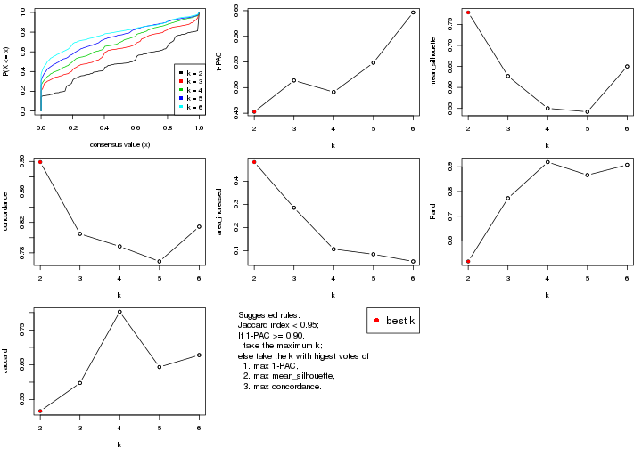

The numeric values for all these statistics can be obtained by `get_stats()`.

```r
get_stats(res)
```

```
#>   k 1-PAC mean_silhouette concordance area_increased  Rand Jaccard
#> 2 2 0.453           0.779       0.899         0.4828 0.517   0.517
#> 3 3 0.514           0.627       0.805         0.2854 0.773   0.598
#> 4 4 0.491           0.550       0.789         0.1064 0.919   0.802
#> 5 5 0.548           0.542       0.769         0.0843 0.867   0.643
#> 6 6 0.646           0.650       0.814         0.0531 0.908   0.678
```

`suggest_best_k()` suggests the best $k$ based on these statistics. The rules are as follows:

- All $k$ with Jaccard index larger than 0.95 are removed because the increase of
  the partition number does not provides enough extra information. If all $k$ are removed,
  the best $k$ is assigned by `NA`.
- For $k$ with 1-PAC larger than 0.9, the maximal $k$ is taken as the "best k". Other $k$ is called "optional k".
- If it does not fit the second rule. The $k$ with the highest vote of highest
  1-PAC, mean silhouette and concordance is taken as the "best k".

```r
suggest_best_k(res)
```

```
#> [1] 2
```


Following shows the table of the partitions (You need to click the **show/hide
code output** link to see it). The membership matrix (columns with name `p*`)
is inferred by
[`clue::cl_consensus()`](https://www.rdocumentation.org/link/cl_consensus?package=clue)
function with the `SE` method. Basically the value in the membership matrix
represents the probability to belong to a certain group. The finall class
label for an item is determined with the group with highest probability it
belongs to.

In `get_classes()` function, the entropy is calculated from the membership
matrix and the silhouette score is calculated from the consensus matrix.


<script>
$( function() {
	$( '#tabs-SD-pam-get-classes' ).tabs();
} );
</script>
<div id='tabs-SD-pam-get-classes'>
<ul>
<li><a href='#tab-SD-pam-get-classes-1'>k = 2</a></li>
<li><a href='#tab-SD-pam-get-classes-2'>k = 3</a></li>
<li><a href='#tab-SD-pam-get-classes-3'>k = 4</a></li>
<li><a href='#tab-SD-pam-get-classes-4'>k = 5</a></li>
<li><a href='#tab-SD-pam-get-classes-5'>k = 6</a></li>
</ul>

<div id='tab-SD-pam-get-classes-1'>
<p><a id='tab-SD-pam-get-classes-1-a' style='color:#0366d6' href='#'>show/hide code output</a></p>
<pre><code class="r">cbind(get_classes(res, k = 2), get_membership(res, k = 2))
</code></pre>

<pre><code>#&gt;          class entropy silhouette    p1    p2
#&gt; GSM30006     2  0.0000      0.855 0.000 1.000
#&gt; GSM30007     1  0.0000      0.892 1.000 0.000
#&gt; GSM30008     1  0.0000      0.892 1.000 0.000
#&gt; GSM30009     1  0.0000      0.892 1.000 0.000
#&gt; GSM30010     1  0.7453      0.707 0.788 0.212
#&gt; GSM30011     2  0.4298      0.805 0.088 0.912
#&gt; GSM30012     2  0.0000      0.855 0.000 1.000
#&gt; GSM30013     2  0.0000      0.855 0.000 1.000
#&gt; GSM30014     1  0.6438      0.753 0.836 0.164
#&gt; GSM30015     1  0.0000      0.892 1.000 0.000
#&gt; GSM30016     1  0.6343      0.757 0.840 0.160
#&gt; GSM30017     1  0.0000      0.892 1.000 0.000
#&gt; GSM30018     1  0.6048      0.767 0.852 0.148
#&gt; GSM30019     2  0.0000      0.855 0.000 1.000
#&gt; GSM30020     1  0.0000      0.892 1.000 0.000
#&gt; GSM30021     1  0.6438      0.754 0.836 0.164
#&gt; GSM30022     1  0.0000      0.892 1.000 0.000
#&gt; GSM30023     1  0.4022      0.836 0.920 0.080
#&gt; GSM30024     1  0.9881      0.274 0.564 0.436
#&gt; GSM30025     1  0.0000      0.892 1.000 0.000
#&gt; GSM30026     1  0.0000      0.892 1.000 0.000
#&gt; GSM30027     1  0.0000      0.892 1.000 0.000
#&gt; GSM30028     1  0.0000      0.892 1.000 0.000
#&gt; GSM30029     1  0.0000      0.892 1.000 0.000
#&gt; GSM30030     1  0.0000      0.892 1.000 0.000
#&gt; GSM30031     1  0.0000      0.892 1.000 0.000
#&gt; GSM30032     1  0.0672      0.888 0.992 0.008
#&gt; GSM30033     1  0.5737      0.774 0.864 0.136
#&gt; GSM30034     1  0.9661      0.277 0.608 0.392
#&gt; GSM30035     1  0.6973      0.729 0.812 0.188
#&gt; GSM30036     2  0.0000      0.855 0.000 1.000
#&gt; GSM30037     1  0.0000      0.892 1.000 0.000
#&gt; GSM30038     1  0.0000      0.892 1.000 0.000
#&gt; GSM30039     2  0.0000      0.855 0.000 1.000
#&gt; GSM30040     2  0.9710      0.273 0.400 0.600
#&gt; GSM30041     2  0.0000      0.855 0.000 1.000
#&gt; GSM30042     2  0.0000      0.855 0.000 1.000
#&gt; GSM30043     2  0.9833      0.200 0.424 0.576
#&gt; GSM30044     1  0.0000      0.892 1.000 0.000
#&gt; GSM30045     1  0.0000      0.892 1.000 0.000
#&gt; GSM30046     1  0.9754      0.223 0.592 0.408
#&gt; GSM30047     2  0.6343      0.802 0.160 0.840
#&gt; GSM30048     1  0.7299      0.693 0.796 0.204
#&gt; GSM30049     2  0.0000      0.855 0.000 1.000
#&gt; GSM30050     2  0.0000      0.855 0.000 1.000
#&gt; GSM30051     2  0.0000      0.855 0.000 1.000
#&gt; GSM30052     1  0.0000      0.892 1.000 0.000
#&gt; GSM30053     2  0.0000      0.855 0.000 1.000
#&gt; GSM30054     2  0.0000      0.855 0.000 1.000
#&gt; GSM30055     2  0.6343      0.802 0.160 0.840
#&gt; GSM30056     2  0.0000      0.855 0.000 1.000
#&gt; GSM30057     2  0.0000      0.855 0.000 1.000
#&gt; GSM30058     2  0.0000      0.855 0.000 1.000
#&gt; GSM30059     2  0.7219      0.773 0.200 0.800
#&gt; GSM30060     1  0.0938      0.885 0.988 0.012
#&gt; GSM30061     2  0.7139      0.777 0.196 0.804
#&gt; GSM30062     2  0.6973      0.783 0.188 0.812
#&gt; GSM30063     2  0.0000      0.855 0.000 1.000
#&gt; GSM30064     1  0.0000      0.892 1.000 0.000
#&gt; GSM30065     2  0.0000      0.855 0.000 1.000
#&gt; GSM30066     1  0.9732      0.360 0.596 0.404
#&gt; GSM30067     1  0.0000      0.892 1.000 0.000
#&gt; GSM30068     1  0.6343      0.757 0.840 0.160
#&gt; GSM30069     1  0.6343      0.757 0.840 0.160
#&gt; GSM30070     1  0.9170      0.574 0.668 0.332
#&gt; GSM30071     1  0.7299      0.731 0.796 0.204
#&gt; GSM30072     1  0.0000      0.892 1.000 0.000
#&gt; GSM30073     2  0.8499      0.585 0.276 0.724
#&gt; GSM30074     1  0.0000      0.892 1.000 0.000
#&gt; GSM30075     1  0.9661      0.275 0.608 0.392
#&gt; GSM30076     2  0.7219      0.773 0.200 0.800
#&gt; GSM30077     2  0.6343      0.802 0.160 0.840
#&gt; GSM30078     2  0.7453      0.762 0.212 0.788
#&gt; GSM30079     1  0.0000      0.892 1.000 0.000
#&gt; GSM30080     2  0.8955      0.626 0.312 0.688
#&gt; GSM30081     2  0.0000      0.855 0.000 1.000
#&gt; GSM30086     2  0.6343      0.802 0.160 0.840
#&gt; GSM30087     2  0.9710      0.444 0.400 0.600
#&gt; GSM30088     1  0.9710      0.250 0.600 0.400
#&gt; GSM30089     1  0.0000      0.892 1.000 0.000
#&gt; GSM30090     2  0.0000      0.855 0.000 1.000
#&gt; GSM30091     2  0.0000      0.855 0.000 1.000
#&gt; GSM30092     2  0.6343      0.802 0.160 0.840
#&gt; GSM30093     2  0.0000      0.855 0.000 1.000
#&gt; GSM30094     2  0.0000      0.855 0.000 1.000
#&gt; GSM30095     2  0.4022      0.811 0.080 0.920
#&gt; GSM30096     1  0.0000      0.892 1.000 0.000
#&gt; GSM30097     2  0.9710      0.444 0.400 0.600
#&gt; GSM30098     1  0.0000      0.892 1.000 0.000
#&gt; GSM30099     2  0.0376      0.853 0.004 0.996
#&gt; GSM30100     1  0.9710      0.370 0.600 0.400
#&gt; GSM30101     2  0.0000      0.855 0.000 1.000
#&gt; GSM30102     2  0.3274      0.825 0.060 0.940
#&gt; GSM30103     1  0.0000      0.892 1.000 0.000
#&gt; GSM30104     2  0.6343      0.802 0.160 0.840
#&gt; GSM30105     1  0.0000      0.892 1.000 0.000
#&gt; GSM30106     1  0.5294      0.797 0.880 0.120
#&gt; GSM30107     2  0.8144      0.716 0.252 0.748
#&gt; GSM30108     1  0.0000      0.892 1.000 0.000
#&gt; GSM30109     1  0.0000      0.892 1.000 0.000
#&gt; GSM30110     1  0.0000      0.892 1.000 0.000
#&gt; GSM30111     1  0.0000      0.892 1.000 0.000
#&gt; GSM30112     1  0.0000      0.892 1.000 0.000
#&gt; GSM30113     1  0.6343      0.757 0.840 0.160
#&gt; GSM30114     1  0.9686      0.442 0.604 0.396
#&gt; GSM30115     1  0.7674      0.684 0.776 0.224
#&gt; GSM30116     2  0.7219      0.683 0.200 0.800
#&gt; GSM30117     1  0.6973      0.709 0.812 0.188
#&gt; GSM30118     1  0.0000      0.892 1.000 0.000
#&gt; GSM30119     1  0.9795      0.371 0.584 0.416
#&gt; GSM30120     1  0.0000      0.892 1.000 0.000
#&gt; GSM30121     1  0.0000      0.892 1.000 0.000
#&gt; GSM30122     1  0.0000      0.892 1.000 0.000
#&gt; GSM30123     2  0.0000      0.855 0.000 1.000
#&gt; GSM30177     2  0.0000      0.855 0.000 1.000
#&gt; GSM30178     2  0.0000      0.855 0.000 1.000
#&gt; GSM30179     1  0.0000      0.892 1.000 0.000
#&gt; GSM30180     1  0.0000      0.892 1.000 0.000
#&gt; GSM30181     2  0.9944      0.285 0.456 0.544
#&gt; GSM30182     2  0.7674      0.749 0.224 0.776
#&gt; GSM30183     1  0.0000      0.892 1.000 0.000
#&gt; GSM30184     2  0.0000      0.855 0.000 1.000
#&gt; GSM30185     1  0.0000      0.892 1.000 0.000
#&gt; GSM30186     2  0.7674      0.651 0.224 0.776
#&gt; GSM30187     2  0.7219      0.773 0.200 0.800
#&gt; GSM30188     2  0.9087      0.606 0.324 0.676
#&gt; GSM30189     1  0.0000      0.892 1.000 0.000
#&gt; GSM30190     2  0.0000      0.855 0.000 1.000
#&gt; GSM30191     2  0.6343      0.802 0.160 0.840
#&gt; GSM30192     2  0.5178      0.822 0.116 0.884
#&gt; GSM30193     1  0.9710      0.250 0.600 0.400
#&gt; GSM30194     2  0.0000      0.855 0.000 1.000
#&gt; GSM30195     1  0.4298      0.828 0.912 0.088
#&gt; GSM30196     1  0.0000      0.892 1.000 0.000
#&gt; GSM30197     1  0.7219      0.699 0.800 0.200
#&gt; GSM30198     1  0.0000      0.892 1.000 0.000
#&gt; GSM30199     1  0.0000      0.892 1.000 0.000
#&gt; GSM30200     1  0.0000      0.892 1.000 0.000
#&gt; GSM30201     1  0.0000      0.892 1.000 0.000
#&gt; GSM30202     1  0.0000      0.892 1.000 0.000
#&gt; GSM30203     2  0.6343      0.802 0.160 0.840
#&gt; GSM30204     1  0.0000      0.892 1.000 0.000
#&gt; GSM30205     1  0.9393      0.349 0.644 0.356
#&gt; GSM30206     2  0.9795      0.403 0.416 0.584
#&gt; GSM30207     1  0.0000      0.892 1.000 0.000
#&gt; GSM30208     1  0.7139      0.706 0.804 0.196
#&gt; GSM30209     2  0.6712      0.724 0.176 0.824
#&gt; GSM30210     1  0.0000      0.892 1.000 0.000
#&gt; GSM30211     1  0.7219      0.699 0.800 0.200
#&gt; GSM30212     1  0.0000      0.892 1.000 0.000
#&gt; GSM30213     1  0.0000      0.892 1.000 0.000
#&gt; GSM30214     1  0.0000      0.892 1.000 0.000
#&gt; GSM30215     1  0.0000      0.892 1.000 0.000
#&gt; GSM30216     1  0.0000      0.892 1.000 0.000
#&gt; GSM30217     1  0.0000      0.892 1.000 0.000
#&gt; GSM30218     2  0.7219      0.778 0.200 0.800
#&gt; GSM30219     1  0.9710      0.370 0.600 0.400
#&gt; GSM30220     1  0.0000      0.892 1.000 0.000
#&gt; GSM30221     2  0.9170      0.591 0.332 0.668
#&gt; GSM30222     1  0.6048      0.767 0.852 0.148
#&gt; GSM30223     1  0.0000      0.892 1.000 0.000
#&gt; GSM30224     1  0.6623      0.737 0.828 0.172
#&gt; GSM30225     1  0.0000      0.892 1.000 0.000
#&gt; GSM30226     1  0.0000      0.892 1.000 0.000
#&gt; GSM30227     1  0.0000      0.892 1.000 0.000
#&gt; GSM30228     2  0.0000      0.855 0.000 1.000
#&gt; GSM30229     2  0.6343      0.802 0.160 0.840
</code></pre>

<script>
$('#tab-SD-pam-get-classes-1-a').parent().next().next().hide();
$('#tab-SD-pam-get-classes-1-a').click(function(){
  $('#tab-SD-pam-get-classes-1-a').parent().next().next().toggle();
  return(false);
});
</script>
</div>

<div id='tab-SD-pam-get-classes-2'>
<p><a id='tab-SD-pam-get-classes-2-a' style='color:#0366d6' href='#'>show/hide code output</a></p>
<pre><code class="r">cbind(get_classes(res, k = 3), get_membership(res, k = 3))
</code></pre>

<pre><code>#&gt;          class entropy silhouette    p1    p2    p3
#&gt; GSM30006     2  0.1643     0.4217 0.000 0.956 0.044
#&gt; GSM30007     1  0.5968     0.6265 0.636 0.364 0.000
#&gt; GSM30008     1  0.0000     0.8131 1.000 0.000 0.000
#&gt; GSM30009     1  0.4452     0.7436 0.808 0.192 0.000
#&gt; GSM30010     3  0.7948     0.4984 0.080 0.320 0.600
#&gt; GSM30011     2  0.7801     0.6969 0.088 0.636 0.276
#&gt; GSM30012     3  0.1529     0.6201 0.000 0.040 0.960
#&gt; GSM30013     3  0.3116     0.5123 0.000 0.108 0.892
#&gt; GSM30014     1  0.6126     0.2268 0.600 0.000 0.400
#&gt; GSM30015     1  0.0000     0.8131 1.000 0.000 0.000
#&gt; GSM30016     1  0.5706     0.6556 0.680 0.320 0.000
#&gt; GSM30017     1  0.0000     0.8131 1.000 0.000 0.000
#&gt; GSM30018     1  0.7001     0.6161 0.628 0.340 0.032
#&gt; GSM30019     3  0.1529     0.6401 0.000 0.040 0.960
#&gt; GSM30020     1  0.0000     0.8131 1.000 0.000 0.000
#&gt; GSM30021     1  0.6510     0.6170 0.624 0.364 0.012
#&gt; GSM30022     1  0.0000     0.8131 1.000 0.000 0.000
#&gt; GSM30023     1  0.6280     0.0739 0.540 0.000 0.460
#&gt; GSM30024     2  0.4555     0.1312 0.200 0.800 0.000
#&gt; GSM30025     1  0.0237     0.8130 0.996 0.004 0.000
#&gt; GSM30026     1  0.0000     0.8131 1.000 0.000 0.000
#&gt; GSM30027     1  0.0000     0.8131 1.000 0.000 0.000
#&gt; GSM30028     1  0.0000     0.8131 1.000 0.000 0.000
#&gt; GSM30029     1  0.0000     0.8131 1.000 0.000 0.000
#&gt; GSM30030     1  0.4750     0.7338 0.784 0.216 0.000
#&gt; GSM30031     1  0.0000     0.8131 1.000 0.000 0.000
#&gt; GSM30032     1  0.1163     0.8101 0.972 0.028 0.000
#&gt; GSM30033     1  0.5529     0.4778 0.704 0.296 0.000
#&gt; GSM30034     1  0.7624     0.5574 0.580 0.368 0.052
#&gt; GSM30035     1  0.3192     0.7288 0.888 0.112 0.000
#&gt; GSM30036     2  0.5968     0.7727 0.000 0.636 0.364
#&gt; GSM30037     1  0.0000     0.8131 1.000 0.000 0.000
#&gt; GSM30038     1  0.6769     0.2287 0.592 0.016 0.392
#&gt; GSM30039     3  0.1643     0.6384 0.000 0.044 0.956
#&gt; GSM30040     2  0.6661     0.2831 0.400 0.588 0.012
#&gt; GSM30041     2  0.6062     0.7801 0.000 0.616 0.384
#&gt; GSM30042     3  0.0592     0.6401 0.000 0.012 0.988
#&gt; GSM30043     2  0.6994     0.2456 0.424 0.556 0.020
#&gt; GSM30044     1  0.6189     0.6236 0.632 0.364 0.004
#&gt; GSM30045     1  0.5968     0.6265 0.636 0.364 0.000
#&gt; GSM30046     3  0.1781     0.6479 0.020 0.020 0.960
#&gt; GSM30047     2  0.6062     0.7801 0.000 0.616 0.384
#&gt; GSM30048     1  0.4750     0.6391 0.784 0.000 0.216
#&gt; GSM30049     2  0.6062     0.7801 0.000 0.616 0.384
#&gt; GSM30050     2  0.5968     0.7727 0.000 0.636 0.364
#&gt; GSM30051     2  0.6062     0.7801 0.000 0.616 0.384
#&gt; GSM30052     1  0.5733     0.6625 0.676 0.324 0.000
#&gt; GSM30053     3  0.1163     0.6314 0.000 0.028 0.972
#&gt; GSM30054     2  0.6062     0.7801 0.000 0.616 0.384
#&gt; GSM30055     2  0.6062     0.7801 0.000 0.616 0.384
#&gt; GSM30056     2  0.6062     0.7801 0.000 0.616 0.384
#&gt; GSM30057     2  0.6140     0.7683 0.000 0.596 0.404
#&gt; GSM30058     2  0.6062     0.7801 0.000 0.616 0.384
#&gt; GSM30059     2  0.9596     0.4847 0.200 0.416 0.384
#&gt; GSM30060     1  0.1964     0.7990 0.944 0.056 0.000
#&gt; GSM30061     2  0.9383     0.5397 0.172 0.444 0.384
#&gt; GSM30062     2  0.9067     0.5948 0.140 0.476 0.384
#&gt; GSM30063     3  0.6225    -0.4835 0.000 0.432 0.568
#&gt; GSM30064     1  0.5902     0.6662 0.680 0.316 0.004
#&gt; GSM30065     2  0.5968     0.7727 0.000 0.636 0.364
#&gt; GSM30066     2  0.6881    -0.0155 0.388 0.592 0.020
#&gt; GSM30067     1  0.4121     0.7548 0.832 0.168 0.000
#&gt; GSM30068     1  0.8562     0.4825 0.608 0.184 0.208
#&gt; GSM30069     3  0.9805     0.1727 0.240 0.364 0.396
#&gt; GSM30070     3  0.7091     0.5127 0.040 0.320 0.640
#&gt; GSM30071     3  0.6404     0.4109 0.344 0.012 0.644
#&gt; GSM30072     1  0.5968     0.6265 0.636 0.364 0.000
#&gt; GSM30073     3  0.2176     0.6454 0.020 0.032 0.948
#&gt; GSM30074     1  0.1529     0.7936 0.960 0.000 0.040
#&gt; GSM30075     3  0.0892     0.6496 0.020 0.000 0.980
#&gt; GSM30076     3  0.1482     0.6383 0.012 0.020 0.968
#&gt; GSM30077     2  0.6737     0.7685 0.016 0.600 0.384
#&gt; GSM30078     3  0.8085     0.1738 0.204 0.148 0.648
#&gt; GSM30079     1  0.4504     0.7464 0.804 0.196 0.000
#&gt; GSM30080     3  0.1129     0.6382 0.004 0.020 0.976
#&gt; GSM30081     2  0.6062     0.7801 0.000 0.616 0.384
#&gt; GSM30086     3  0.1289     0.6282 0.000 0.032 0.968
#&gt; GSM30087     1  0.9734    -0.2332 0.400 0.224 0.376
#&gt; GSM30088     1  0.6330     0.3027 0.600 0.004 0.396
#&gt; GSM30089     1  0.5968     0.6265 0.636 0.364 0.000
#&gt; GSM30090     2  0.6062     0.7801 0.000 0.616 0.384
#&gt; GSM30091     2  0.6062     0.7801 0.000 0.616 0.384
#&gt; GSM30092     2  0.6062     0.7801 0.000 0.616 0.384
#&gt; GSM30093     2  0.6062     0.7801 0.000 0.616 0.384
#&gt; GSM30094     2  0.6062     0.7801 0.000 0.616 0.384
#&gt; GSM30095     2  0.7749     0.7127 0.076 0.624 0.300
#&gt; GSM30096     1  0.0000     0.8131 1.000 0.000 0.000
#&gt; GSM30097     1  0.9786    -0.2499 0.400 0.236 0.364
#&gt; GSM30098     1  0.5363     0.6977 0.724 0.276 0.000
#&gt; GSM30099     2  0.6264     0.7788 0.004 0.616 0.380
#&gt; GSM30100     2  0.5858     0.0655 0.240 0.740 0.020
#&gt; GSM30101     2  0.6062     0.7801 0.000 0.616 0.384
#&gt; GSM30102     2  0.7529     0.7331 0.060 0.624 0.316
#&gt; GSM30103     1  0.0000     0.8131 1.000 0.000 0.000
#&gt; GSM30104     2  0.6062     0.7801 0.000 0.616 0.384
#&gt; GSM30105     1  0.0000     0.8131 1.000 0.000 0.000
#&gt; GSM30106     3  0.7718     0.5113 0.068 0.320 0.612
#&gt; GSM30107     3  0.4514     0.6182 0.012 0.156 0.832
#&gt; GSM30108     1  0.1289     0.8085 0.968 0.032 0.000
#&gt; GSM30109     1  0.6282     0.6561 0.664 0.324 0.012
#&gt; GSM30110     1  0.1129     0.8049 0.976 0.020 0.004
#&gt; GSM30111     1  0.2261     0.7987 0.932 0.068 0.000
#&gt; GSM30112     1  0.1860     0.8034 0.948 0.052 0.000
#&gt; GSM30113     3  0.6126     0.3067 0.400 0.000 0.600
#&gt; GSM30114     3  0.4485     0.6112 0.136 0.020 0.844
#&gt; GSM30115     1  0.5551     0.6252 0.768 0.020 0.212
#&gt; GSM30116     2  0.1529     0.4057 0.000 0.960 0.040
#&gt; GSM30117     1  0.5690     0.4895 0.708 0.288 0.004
#&gt; GSM30118     1  0.0747     0.8074 0.984 0.000 0.016
#&gt; GSM30119     3  0.6383     0.6022 0.104 0.128 0.768
#&gt; GSM30120     1  0.4887     0.5820 0.772 0.000 0.228
#&gt; GSM30121     1  0.0000     0.8131 1.000 0.000 0.000
#&gt; GSM30122     1  0.1964     0.8025 0.944 0.056 0.000
#&gt; GSM30123     2  0.5968     0.7727 0.000 0.636 0.364
#&gt; GSM30177     2  0.5968     0.7727 0.000 0.636 0.364
#&gt; GSM30178     2  0.5968     0.7727 0.000 0.636 0.364
#&gt; GSM30179     1  0.0000     0.8131 1.000 0.000 0.000
#&gt; GSM30180     1  0.0000     0.8131 1.000 0.000 0.000
#&gt; GSM30181     3  0.4915     0.6030 0.012 0.184 0.804
#&gt; GSM30182     2  0.9734     0.4116 0.224 0.400 0.376
#&gt; GSM30183     1  0.0000     0.8131 1.000 0.000 0.000
#&gt; GSM30184     2  0.5216     0.6657 0.000 0.740 0.260
#&gt; GSM30185     1  0.0000     0.8131 1.000 0.000 0.000
#&gt; GSM30186     2  0.8349     0.5271 0.220 0.624 0.156
#&gt; GSM30187     2  0.9483     0.4994 0.188 0.448 0.364
#&gt; GSM30188     3  0.9959    -0.2346 0.324 0.300 0.376
#&gt; GSM30189     1  0.0000     0.8131 1.000 0.000 0.000
#&gt; GSM30190     2  0.5968     0.7727 0.000 0.636 0.364
#&gt; GSM30191     2  0.6062     0.7801 0.000 0.616 0.384
#&gt; GSM30192     3  0.0592     0.6413 0.000 0.012 0.988
#&gt; GSM30193     3  0.1781     0.6479 0.020 0.020 0.960
#&gt; GSM30194     3  0.0892     0.6356 0.000 0.020 0.980
#&gt; GSM30195     1  0.6445     0.6542 0.672 0.308 0.020
#&gt; GSM30196     1  0.5968     0.6265 0.636 0.364 0.000
#&gt; GSM30197     3  0.6529     0.3734 0.368 0.012 0.620
#&gt; GSM30198     1  0.0592     0.8099 0.988 0.000 0.012
#&gt; GSM30199     1  0.0000     0.8131 1.000 0.000 0.000
#&gt; GSM30200     1  0.0592     0.8099 0.988 0.000 0.012
#&gt; GSM30201     1  0.4861     0.7489 0.808 0.180 0.012
#&gt; GSM30202     1  0.0000     0.8131 1.000 0.000 0.000
#&gt; GSM30203     2  0.6062     0.7801 0.000 0.616 0.384
#&gt; GSM30204     1  0.0000     0.8131 1.000 0.000 0.000
#&gt; GSM30205     2  0.6305     0.1367 0.484 0.516 0.000
#&gt; GSM30206     1  0.9547    -0.1987 0.416 0.192 0.392
#&gt; GSM30207     1  0.0000     0.8131 1.000 0.000 0.000
#&gt; GSM30208     1  0.4504     0.6597 0.804 0.000 0.196
#&gt; GSM30209     2  0.3091     0.4471 0.016 0.912 0.072
#&gt; GSM30210     1  0.1163     0.8086 0.972 0.028 0.000
#&gt; GSM30211     1  0.5551     0.6252 0.768 0.020 0.212
#&gt; GSM30212     1  0.0000     0.8131 1.000 0.000 0.000
#&gt; GSM30213     1  0.1411     0.8082 0.964 0.036 0.000
#&gt; GSM30214     1  0.0237     0.8130 0.996 0.004 0.000
#&gt; GSM30215     1  0.0000     0.8131 1.000 0.000 0.000
#&gt; GSM30216     1  0.1289     0.8078 0.968 0.032 0.000
#&gt; GSM30217     1  0.0000     0.8131 1.000 0.000 0.000
#&gt; GSM30218     2  0.7251     0.7546 0.040 0.612 0.348
#&gt; GSM30219     1  0.6126     0.2297 0.600 0.400 0.000
#&gt; GSM30220     1  0.5968     0.6265 0.636 0.364 0.000
#&gt; GSM30221     3  0.9952    -0.2400 0.332 0.292 0.376
#&gt; GSM30222     3  0.5285     0.5557 0.244 0.004 0.752
#&gt; GSM30223     1  0.5968     0.6265 0.636 0.364 0.000
#&gt; GSM30224     1  0.4178     0.6864 0.828 0.000 0.172
#&gt; GSM30225     1  0.0000     0.8131 1.000 0.000 0.000
#&gt; GSM30226     1  0.0000     0.8131 1.000 0.000 0.000
#&gt; GSM30227     1  0.0237     0.8123 0.996 0.000 0.004
#&gt; GSM30228     2  0.6062     0.7801 0.000 0.616 0.384
#&gt; GSM30229     2  0.6062     0.7801 0.000 0.616 0.384
</code></pre>

<script>
$('#tab-SD-pam-get-classes-2-a').parent().next().next().hide();
$('#tab-SD-pam-get-classes-2-a').click(function(){
  $('#tab-SD-pam-get-classes-2-a').parent().next().next().toggle();
  return(false);
});
</script>
</div>

<div id='tab-SD-pam-get-classes-3'>
<p><a id='tab-SD-pam-get-classes-3-a' style='color:#0366d6' href='#'>show/hide code output</a></p>
<pre><code class="r">cbind(get_classes(res, k = 4), get_membership(res, k = 4))
</code></pre>

<pre><code>#&gt;          class entropy silhouette    p1    p2    p3    p4
#&gt; GSM30006     2  0.5998    0.53708 0.000 0.680 0.212 0.108
#&gt; GSM30007     1  0.5138    0.49838 0.600 0.000 0.392 0.008
#&gt; GSM30008     1  0.0000    0.74426 1.000 0.000 0.000 0.000
#&gt; GSM30009     1  0.2675    0.71772 0.892 0.000 0.100 0.008
#&gt; GSM30010     3  0.3808    0.60607 0.176 0.000 0.812 0.012
#&gt; GSM30011     2  0.5157    0.57247 0.028 0.688 0.000 0.284
#&gt; GSM30012     2  0.4998   -0.32773 0.000 0.512 0.000 0.488
#&gt; GSM30013     2  0.4977   -0.25703 0.000 0.540 0.000 0.460
#&gt; GSM30014     3  0.4855    0.55617 0.400 0.000 0.600 0.000
#&gt; GSM30015     1  0.0000    0.74426 1.000 0.000 0.000 0.000
#&gt; GSM30016     1  0.4049    0.63969 0.780 0.000 0.212 0.008
#&gt; GSM30017     1  0.0592    0.74111 0.984 0.000 0.000 0.016
#&gt; GSM30018     1  0.6387    0.36403 0.492 0.000 0.064 0.444
#&gt; GSM30019     4  0.4839    0.48912 0.000 0.184 0.052 0.764
#&gt; GSM30020     1  0.0000    0.74426 1.000 0.000 0.000 0.000
#&gt; GSM30021     3  0.0336    0.54649 0.000 0.000 0.992 0.008
#&gt; GSM30022     1  0.0000    0.74426 1.000 0.000 0.000 0.000
#&gt; GSM30023     1  0.6337   -0.02733 0.476 0.060 0.000 0.464
#&gt; GSM30024     3  0.5466    0.39261 0.060 0.200 0.732 0.008
#&gt; GSM30025     1  0.0188    0.74440 0.996 0.000 0.004 0.000
#&gt; GSM30026     1  0.0000    0.74426 1.000 0.000 0.000 0.000
#&gt; GSM30027     1  0.0000    0.74426 1.000 0.000 0.000 0.000
#&gt; GSM30028     1  0.0000    0.74426 1.000 0.000 0.000 0.000
#&gt; GSM30029     1  0.2530    0.70698 0.888 0.000 0.000 0.112
#&gt; GSM30030     1  0.4011    0.66733 0.784 0.000 0.208 0.008
#&gt; GSM30031     1  0.0000    0.74426 1.000 0.000 0.000 0.000
#&gt; GSM30032     1  0.0992    0.74144 0.976 0.012 0.008 0.004
#&gt; GSM30033     1  0.4382    0.35005 0.704 0.296 0.000 0.000
#&gt; GSM30034     1  0.6480    0.44083 0.568 0.036 0.024 0.372
#&gt; GSM30035     1  0.3108    0.64777 0.872 0.112 0.000 0.016
#&gt; GSM30036     2  0.4624    0.54463 0.000 0.660 0.000 0.340
#&gt; GSM30037     1  0.0188    0.74439 0.996 0.000 0.004 0.000
#&gt; GSM30038     1  0.5231    0.16253 0.604 0.000 0.012 0.384
#&gt; GSM30039     4  0.3400    0.52416 0.000 0.180 0.000 0.820
#&gt; GSM30040     3  0.4855    0.55617 0.400 0.000 0.600 0.000
#&gt; GSM30041     2  0.2408    0.70804 0.000 0.896 0.000 0.104
#&gt; GSM30042     4  0.5497    0.38343 0.000 0.460 0.016 0.524
#&gt; GSM30043     3  0.4855    0.55617 0.400 0.000 0.600 0.000
#&gt; GSM30044     1  0.6499    0.43738 0.524 0.000 0.400 0.076
#&gt; GSM30045     1  0.4855    0.49851 0.600 0.000 0.400 0.000
#&gt; GSM30046     4  0.0524    0.55143 0.004 0.008 0.000 0.988
#&gt; GSM30047     2  0.0000    0.73236 0.000 1.000 0.000 0.000
#&gt; GSM30048     1  0.6373    0.53682 0.652 0.148 0.000 0.200
#&gt; GSM30049     2  0.0000    0.73236 0.000 1.000 0.000 0.000
#&gt; GSM30050     2  0.4477    0.56647 0.000 0.688 0.000 0.312
#&gt; GSM30051     2  0.2760    0.69525 0.000 0.872 0.000 0.128
#&gt; GSM30052     1  0.4730    0.54096 0.636 0.000 0.364 0.000
#&gt; GSM30053     2  0.4999   -0.33701 0.000 0.508 0.000 0.492
#&gt; GSM30054     2  0.0000    0.73236 0.000 1.000 0.000 0.000
#&gt; GSM30055     2  0.0000    0.73236 0.000 1.000 0.000 0.000
#&gt; GSM30056     2  0.0000    0.73236 0.000 1.000 0.000 0.000
#&gt; GSM30057     3  0.4855    0.20480 0.000 0.400 0.600 0.000
#&gt; GSM30058     2  0.0000    0.73236 0.000 1.000 0.000 0.000
#&gt; GSM30059     2  0.4059    0.48747 0.200 0.788 0.000 0.012
#&gt; GSM30060     1  0.3542    0.70367 0.852 0.028 0.120 0.000
#&gt; GSM30061     2  0.3311    0.54247 0.172 0.828 0.000 0.000
#&gt; GSM30062     2  0.3377    0.58666 0.140 0.848 0.000 0.012
#&gt; GSM30063     2  0.3528    0.50794 0.000 0.808 0.000 0.192
#&gt; GSM30064     1  0.6652    0.51190 0.576 0.000 0.316 0.108
#&gt; GSM30065     2  0.4277    0.59249 0.000 0.720 0.000 0.280
#&gt; GSM30066     3  0.2704    0.60776 0.124 0.000 0.876 0.000
#&gt; GSM30067     1  0.2198    0.72840 0.920 0.000 0.072 0.008
#&gt; GSM30068     3  0.4122    0.61072 0.236 0.000 0.760 0.004
#&gt; GSM30069     3  0.0336    0.54649 0.000 0.000 0.992 0.008
#&gt; GSM30070     4  0.7155    0.37938 0.048 0.056 0.324 0.572
#&gt; GSM30071     4  0.5583    0.33785 0.296 0.036 0.004 0.664
#&gt; GSM30072     1  0.4855    0.49851 0.600 0.000 0.400 0.000
#&gt; GSM30073     4  0.1940    0.57416 0.000 0.076 0.000 0.924
#&gt; GSM30074     1  0.3610    0.51453 0.800 0.000 0.200 0.000
#&gt; GSM30075     4  0.4877    0.57092 0.008 0.328 0.000 0.664
#&gt; GSM30076     4  0.4761    0.52068 0.000 0.372 0.000 0.628
#&gt; GSM30077     2  0.1975    0.70161 0.016 0.936 0.000 0.048
#&gt; GSM30078     2  0.7373   -0.11647 0.204 0.516 0.000 0.280
#&gt; GSM30079     1  0.4134    0.63560 0.740 0.000 0.260 0.000
#&gt; GSM30080     4  0.4730    0.53895 0.000 0.364 0.000 0.636
#&gt; GSM30081     2  0.1474    0.72655 0.000 0.948 0.000 0.052
#&gt; GSM30086     4  0.4967    0.39991 0.000 0.452 0.000 0.548
#&gt; GSM30087     1  0.7762    0.01210 0.384 0.236 0.000 0.380
#&gt; GSM30088     1  0.7325    0.22292 0.492 0.340 0.000 0.168
#&gt; GSM30089     1  0.5099    0.51081 0.612 0.000 0.380 0.008
#&gt; GSM30090     2  0.0188    0.73144 0.000 0.996 0.000 0.004
#&gt; GSM30091     2  0.0336    0.73304 0.000 0.992 0.000 0.008
#&gt; GSM30092     2  0.0000    0.73236 0.000 1.000 0.000 0.000
#&gt; GSM30093     2  0.2647    0.69963 0.000 0.880 0.000 0.120
#&gt; GSM30094     2  0.0000    0.73236 0.000 1.000 0.000 0.000
#&gt; GSM30095     2  0.2311    0.69769 0.076 0.916 0.004 0.004
#&gt; GSM30096     1  0.0000    0.74426 1.000 0.000 0.000 0.000
#&gt; GSM30097     1  0.7610   -0.03152 0.400 0.400 0.000 0.200
#&gt; GSM30098     1  0.4564    0.57779 0.672 0.000 0.328 0.000
#&gt; GSM30099     2  0.0188    0.73242 0.004 0.996 0.000 0.000
#&gt; GSM30100     3  0.0817    0.56451 0.024 0.000 0.976 0.000
#&gt; GSM30101     2  0.0188    0.73245 0.000 0.996 0.000 0.004
#&gt; GSM30102     2  0.4212    0.65002 0.012 0.772 0.000 0.216
#&gt; GSM30103     1  0.0000    0.74426 1.000 0.000 0.000 0.000
#&gt; GSM30104     2  0.0921    0.72799 0.000 0.972 0.000 0.028
#&gt; GSM30105     1  0.0000    0.74426 1.000 0.000 0.000 0.000
#&gt; GSM30106     4  0.6508    0.46377 0.072 0.040 0.204 0.684
#&gt; GSM30107     4  0.6216    0.59403 0.000 0.220 0.120 0.660
#&gt; GSM30108     1  0.2760    0.70964 0.872 0.000 0.128 0.000
#&gt; GSM30109     1  0.6898    0.45355 0.524 0.000 0.360 0.116
#&gt; GSM30110     1  0.4843    0.48210 0.604 0.000 0.000 0.396
#&gt; GSM30111     1  0.1305    0.74026 0.960 0.000 0.036 0.004
#&gt; GSM30112     1  0.3528    0.67538 0.808 0.000 0.192 0.000
#&gt; GSM30113     3  0.4855    0.55617 0.400 0.000 0.600 0.000
#&gt; GSM30114     4  0.2101    0.53915 0.000 0.012 0.060 0.928
#&gt; GSM30115     1  0.5620    0.42847 0.560 0.024 0.000 0.416
#&gt; GSM30116     2  0.4857    0.47297 0.000 0.668 0.324 0.008
#&gt; GSM30117     1  0.4356    0.37954 0.708 0.292 0.000 0.000
#&gt; GSM30118     1  0.4996   -0.35023 0.516 0.000 0.484 0.000
#&gt; GSM30119     4  0.8674    0.45713 0.104 0.172 0.204 0.520
#&gt; GSM30120     1  0.4679    0.38805 0.648 0.000 0.000 0.352
#&gt; GSM30121     1  0.1022    0.73678 0.968 0.000 0.000 0.032
#&gt; GSM30122     1  0.1256    0.74143 0.964 0.000 0.028 0.008
#&gt; GSM30123     2  0.4477    0.56647 0.000 0.688 0.000 0.312
#&gt; GSM30177     2  0.4304    0.58881 0.000 0.716 0.000 0.284
#&gt; GSM30178     2  0.4543    0.55662 0.000 0.676 0.000 0.324
#&gt; GSM30179     1  0.0000    0.74426 1.000 0.000 0.000 0.000
#&gt; GSM30180     1  0.0000    0.74426 1.000 0.000 0.000 0.000
#&gt; GSM30181     4  0.5883    0.58533 0.000 0.172 0.128 0.700
#&gt; GSM30182     4  0.7692   -0.03453 0.220 0.368 0.000 0.412
#&gt; GSM30183     1  0.0000    0.74426 1.000 0.000 0.000 0.000
#&gt; GSM30184     2  0.1970    0.71136 0.000 0.932 0.060 0.008
#&gt; GSM30185     1  0.0000    0.74426 1.000 0.000 0.000 0.000
#&gt; GSM30186     2  0.4671    0.53449 0.220 0.752 0.000 0.028
#&gt; GSM30187     2  0.7388    0.29662 0.188 0.500 0.000 0.312
#&gt; GSM30188     4  0.7577    0.09345 0.316 0.216 0.000 0.468
#&gt; GSM30189     1  0.0336    0.74420 0.992 0.000 0.000 0.008
#&gt; GSM30190     2  0.4193    0.60341 0.000 0.732 0.000 0.268
#&gt; GSM30191     2  0.0000    0.73236 0.000 1.000 0.000 0.000
#&gt; GSM30192     4  0.3649    0.62161 0.000 0.204 0.000 0.796
#&gt; GSM30193     4  0.3311    0.62107 0.000 0.172 0.000 0.828
#&gt; GSM30194     3  0.4855    0.20480 0.000 0.400 0.600 0.000
#&gt; GSM30195     1  0.6791    0.58669 0.668 0.036 0.192 0.104
#&gt; GSM30196     1  0.4855    0.49851 0.600 0.000 0.400 0.000
#&gt; GSM30197     4  0.5878    0.32546 0.312 0.056 0.000 0.632
#&gt; GSM30198     1  0.3266    0.67499 0.832 0.000 0.000 0.168
#&gt; GSM30199     1  0.0000    0.74426 1.000 0.000 0.000 0.000
#&gt; GSM30200     1  0.3123    0.68033 0.844 0.000 0.000 0.156
#&gt; GSM30201     1  0.5581    0.40547 0.532 0.000 0.020 0.448
#&gt; GSM30202     1  0.0000    0.74426 1.000 0.000 0.000 0.000
#&gt; GSM30203     2  0.0817    0.72905 0.000 0.976 0.000 0.024
#&gt; GSM30204     1  0.0000    0.74426 1.000 0.000 0.000 0.000
#&gt; GSM30205     2  0.4996    0.07519 0.484 0.516 0.000 0.000
#&gt; GSM30206     1  0.7860    0.00942 0.396 0.312 0.000 0.292
#&gt; GSM30207     1  0.0000    0.74426 1.000 0.000 0.000 0.000
#&gt; GSM30208     1  0.4244    0.65168 0.800 0.168 0.000 0.032
#&gt; GSM30209     2  0.6645    0.52985 0.044 0.680 0.196 0.080
#&gt; GSM30210     1  0.2081    0.72750 0.916 0.000 0.084 0.000
#&gt; GSM30211     1  0.5292    0.35196 0.512 0.008 0.000 0.480
#&gt; GSM30212     1  0.0000    0.74426 1.000 0.000 0.000 0.000
#&gt; GSM30213     1  0.1004    0.74253 0.972 0.000 0.024 0.004
#&gt; GSM30214     1  0.0188    0.74445 0.996 0.000 0.004 0.000
#&gt; GSM30215     1  0.0000    0.74426 1.000 0.000 0.000 0.000
#&gt; GSM30216     1  0.2868    0.70546 0.864 0.000 0.136 0.000
#&gt; GSM30217     1  0.0000    0.74426 1.000 0.000 0.000 0.000
#&gt; GSM30218     2  0.1211    0.72127 0.040 0.960 0.000 0.000
#&gt; GSM30219     1  0.4855    0.13433 0.600 0.400 0.000 0.000
#&gt; GSM30220     1  0.5138    0.49838 0.600 0.000 0.392 0.008
#&gt; GSM30221     2  0.5736    0.20482 0.328 0.628 0.000 0.044
#&gt; GSM30222     4  0.6027    0.49134 0.192 0.124 0.000 0.684
#&gt; GSM30223     1  0.5161    0.49355 0.592 0.000 0.400 0.008
#&gt; GSM30224     1  0.3910    0.66556 0.820 0.156 0.000 0.024
#&gt; GSM30225     1  0.2469    0.69933 0.892 0.000 0.000 0.108
#&gt; GSM30226     1  0.0000    0.74426 1.000 0.000 0.000 0.000
#&gt; GSM30227     1  0.2530    0.69799 0.888 0.000 0.000 0.112
#&gt; GSM30228     2  0.0188    0.73245 0.000 0.996 0.000 0.004
#&gt; GSM30229     2  0.0000    0.73236 0.000 1.000 0.000 0.000
</code></pre>

<script>
$('#tab-SD-pam-get-classes-3-a').parent().next().next().hide();
$('#tab-SD-pam-get-classes-3-a').click(function(){
  $('#tab-SD-pam-get-classes-3-a').parent().next().next().toggle();
  return(false);
});
</script>
</div>

<div id='tab-SD-pam-get-classes-4'>
<p><a id='tab-SD-pam-get-classes-4-a' style='color:#0366d6' href='#'>show/hide code output</a></p>
<pre><code class="r">cbind(get_classes(res, k = 5), get_membership(res, k = 5))
</code></pre>

<pre><code>#&gt;          class entropy silhouette    p1    p2    p3    p4    p5
#&gt; GSM30006     3  0.5546     0.4779 0.000 0.000 0.648 0.180 0.172
#&gt; GSM30007     1  0.5839     0.4463 0.568 0.056 0.000 0.024 0.352
#&gt; GSM30008     1  0.0000     0.7578 1.000 0.000 0.000 0.000 0.000
#&gt; GSM30009     1  0.2471     0.7083 0.864 0.000 0.000 0.000 0.136
#&gt; GSM30010     5  0.3574     0.6316 0.168 0.028 0.000 0.000 0.804
#&gt; GSM30011     3  0.4549     0.1274 0.008 0.000 0.528 0.464 0.000
#&gt; GSM30012     2  0.4150     0.5733 0.000 0.612 0.388 0.000 0.000
#&gt; GSM30013     2  0.4138     0.5722 0.000 0.616 0.384 0.000 0.000
#&gt; GSM30014     5  0.4088     0.6284 0.368 0.000 0.000 0.000 0.632
#&gt; GSM30015     1  0.0000     0.7578 1.000 0.000 0.000 0.000 0.000
#&gt; GSM30016     1  0.3010     0.6813 0.824 0.004 0.000 0.000 0.172
#&gt; GSM30017     1  0.3661     0.4935 0.724 0.000 0.000 0.276 0.000
#&gt; GSM30018     4  0.4430     0.3311 0.024 0.088 0.000 0.792 0.096
#&gt; GSM30019     2  0.6002     0.3567 0.000 0.540 0.036 0.376 0.048
#&gt; GSM30020     1  0.0000     0.7578 1.000 0.000 0.000 0.000 0.000
#&gt; GSM30021     5  0.0162     0.5442 0.000 0.000 0.000 0.004 0.996
#&gt; GSM30022     1  0.0000     0.7578 1.000 0.000 0.000 0.000 0.000
#&gt; GSM30023     2  0.5921     0.3088 0.312 0.596 0.036 0.056 0.000
#&gt; GSM30024     5  0.4028     0.3899 0.048 0.000 0.176 0.000 0.776
#&gt; GSM30025     1  0.0162     0.7581 0.996 0.000 0.000 0.000 0.004
#&gt; GSM30026     1  0.0404     0.7574 0.988 0.012 0.000 0.000 0.000
#&gt; GSM30027     1  0.0000     0.7578 1.000 0.000 0.000 0.000 0.000
#&gt; GSM30028     1  0.0000     0.7578 1.000 0.000 0.000 0.000 0.000
#&gt; GSM30029     1  0.3682     0.6680 0.820 0.072 0.000 0.108 0.000
#&gt; GSM30030     1  0.3388     0.6741 0.792 0.008 0.000 0.000 0.200
#&gt; GSM30031     1  0.0000     0.7578 1.000 0.000 0.000 0.000 0.000
#&gt; GSM30032     1  0.0912     0.7548 0.972 0.000 0.012 0.000 0.016
#&gt; GSM30033     1  0.3774     0.3856 0.704 0.000 0.296 0.000 0.000
#&gt; GSM30034     4  0.4747     0.2584 0.376 0.000 0.012 0.604 0.008
#&gt; GSM30035     1  0.5232     0.3607 0.668 0.000 0.104 0.228 0.000
#&gt; GSM30036     4  0.4359     0.1140 0.000 0.004 0.412 0.584 0.000
#&gt; GSM30037     1  0.0162     0.7583 0.996 0.000 0.000 0.000 0.004
#&gt; GSM30038     1  0.4640     0.1849 0.584 0.400 0.000 0.000 0.016
#&gt; GSM30039     2  0.4270     0.5914 0.000 0.748 0.048 0.204 0.000
#&gt; GSM30040     5  0.4126     0.6114 0.380 0.000 0.000 0.000 0.620
#&gt; GSM30041     3  0.2471     0.7204 0.000 0.000 0.864 0.136 0.000
#&gt; GSM30042     2  0.3452     0.6912 0.000 0.756 0.244 0.000 0.000
#&gt; GSM30043     5  0.4211     0.6339 0.360 0.004 0.000 0.000 0.636
#&gt; GSM30044     4  0.8279     0.0786 0.220 0.148 0.000 0.376 0.256
#&gt; GSM30045     1  0.6562     0.4432 0.564 0.148 0.000 0.028 0.260
#&gt; GSM30046     4  0.0794     0.3582 0.000 0.028 0.000 0.972 0.000
#&gt; GSM30047     3  0.0000     0.8061 0.000 0.000 1.000 0.000 0.000
#&gt; GSM30048     4  0.7577     0.0576 0.380 0.104 0.116 0.400 0.000
#&gt; GSM30049     3  0.0000     0.8061 0.000 0.000 1.000 0.000 0.000
#&gt; GSM30050     4  0.4219     0.1096 0.000 0.000 0.416 0.584 0.000
#&gt; GSM30051     3  0.2891     0.6770 0.000 0.000 0.824 0.176 0.000
#&gt; GSM30052     1  0.6522     0.4543 0.572 0.148 0.000 0.028 0.252
#&gt; GSM30053     2  0.4192     0.5470 0.000 0.596 0.404 0.000 0.000
#&gt; GSM30054     3  0.0000     0.8061 0.000 0.000 1.000 0.000 0.000
#&gt; GSM30055     3  0.0000     0.8061 0.000 0.000 1.000 0.000 0.000
#&gt; GSM30056     3  0.0000     0.8061 0.000 0.000 1.000 0.000 0.000
#&gt; GSM30057     5  0.4088     0.3175 0.000 0.000 0.368 0.000 0.632
#&gt; GSM30058     3  0.0000     0.8061 0.000 0.000 1.000 0.000 0.000
#&gt; GSM30059     3  0.3462     0.5369 0.196 0.000 0.792 0.012 0.000
#&gt; GSM30060     1  0.4554     0.6787 0.792 0.100 0.028 0.004 0.076
#&gt; GSM30061     3  0.2852     0.5920 0.172 0.000 0.828 0.000 0.000
#&gt; GSM30062     3  0.3067     0.6380 0.140 0.012 0.844 0.004 0.000
#&gt; GSM30063     3  0.3274     0.5340 0.000 0.220 0.780 0.000 0.000
#&gt; GSM30064     1  0.7514     0.3316 0.480 0.104 0.000 0.128 0.288
#&gt; GSM30065     4  0.4256     0.0753 0.000 0.000 0.436 0.564 0.000
#&gt; GSM30066     5  0.4520     0.6198 0.116 0.116 0.000 0.004 0.764
#&gt; GSM30067     1  0.2230     0.7193 0.884 0.000 0.000 0.000 0.116
#&gt; GSM30068     5  0.4090     0.6521 0.268 0.016 0.000 0.000 0.716
#&gt; GSM30069     5  0.0162     0.5497 0.004 0.000 0.000 0.000 0.996
#&gt; GSM30070     2  0.3550     0.5690 0.000 0.760 0.004 0.000 0.236
#&gt; GSM30071     2  0.5253     0.4144 0.252 0.684 0.024 0.032 0.008
#&gt; GSM30072     1  0.6562     0.4432 0.564 0.148 0.000 0.028 0.260
#&gt; GSM30073     4  0.4867    -0.1742 0.000 0.432 0.024 0.544 0.000
#&gt; GSM30074     1  0.3074     0.5511 0.804 0.000 0.000 0.000 0.196
#&gt; GSM30075     2  0.3805     0.7089 0.000 0.784 0.184 0.032 0.000
#&gt; GSM30076     2  0.3929     0.7052 0.000 0.764 0.208 0.028 0.000
#&gt; GSM30077     3  0.4356     0.2806 0.000 0.012 0.648 0.340 0.000
#&gt; GSM30078     2  0.7219     0.2847 0.016 0.348 0.308 0.328 0.000
#&gt; GSM30079     1  0.6100     0.5243 0.632 0.148 0.000 0.024 0.196
#&gt; GSM30080     2  0.3819     0.7002 0.000 0.756 0.228 0.016 0.000
#&gt; GSM30081     3  0.1341     0.7837 0.000 0.000 0.944 0.056 0.000
#&gt; GSM30086     2  0.3010     0.7065 0.000 0.824 0.172 0.004 0.000
#&gt; GSM30087     4  0.3814     0.3114 0.000 0.068 0.124 0.808 0.000
#&gt; GSM30088     4  0.7980     0.1671 0.232 0.092 0.288 0.388 0.000
#&gt; GSM30089     1  0.5537     0.4853 0.600 0.040 0.000 0.024 0.336
#&gt; GSM30090     3  0.0162     0.8051 0.000 0.004 0.996 0.000 0.000
#&gt; GSM30091     3  0.0290     0.8049 0.000 0.000 0.992 0.008 0.000
#&gt; GSM30092     3  0.0000     0.8061 0.000 0.000 1.000 0.000 0.000
#&gt; GSM30093     3  0.2732     0.6950 0.000 0.000 0.840 0.160 0.000
#&gt; GSM30094     3  0.0000     0.8061 0.000 0.000 1.000 0.000 0.000
#&gt; GSM30095     3  0.1956     0.7539 0.076 0.000 0.916 0.000 0.008
#&gt; GSM30096     1  0.0162     0.7577 0.996 0.004 0.000 0.000 0.000
#&gt; GSM30097     4  0.6674     0.2846 0.324 0.000 0.248 0.428 0.000
#&gt; GSM30098     1  0.6277     0.4959 0.604 0.128 0.000 0.028 0.240
#&gt; GSM30099     3  0.0162     0.8053 0.004 0.000 0.996 0.000 0.000
#&gt; GSM30100     5  0.3599     0.5852 0.060 0.104 0.000 0.004 0.832
#&gt; GSM30101     3  0.0000     0.8061 0.000 0.000 1.000 0.000 0.000
#&gt; GSM30102     3  0.3807     0.5990 0.000 0.012 0.748 0.240 0.000
#&gt; GSM30103     1  0.0000     0.7578 1.000 0.000 0.000 0.000 0.000
#&gt; GSM30104     3  0.0510     0.8008 0.000 0.000 0.984 0.016 0.000
#&gt; GSM30105     1  0.0000     0.7578 1.000 0.000 0.000 0.000 0.000
#&gt; GSM30106     2  0.7196     0.1525 0.040 0.412 0.000 0.384 0.164
#&gt; GSM30107     2  0.4404     0.7058 0.000 0.748 0.204 0.040 0.008
#&gt; GSM30108     1  0.3906     0.6822 0.812 0.104 0.000 0.004 0.080
#&gt; GSM30109     4  0.8271     0.0901 0.220 0.152 0.000 0.384 0.244
#&gt; GSM30110     4  0.4114     0.2477 0.376 0.000 0.000 0.624 0.000
#&gt; GSM30111     1  0.1410     0.7454 0.940 0.000 0.000 0.000 0.060
#&gt; GSM30112     1  0.6150     0.5210 0.632 0.148 0.000 0.028 0.192
#&gt; GSM30113     5  0.4088     0.6284 0.368 0.000 0.000 0.000 0.632
#&gt; GSM30114     2  0.3910     0.5730 0.000 0.740 0.004 0.248 0.008
#&gt; GSM30115     1  0.4814     0.2505 0.568 0.004 0.016 0.412 0.000
#&gt; GSM30116     3  0.3534     0.5925 0.000 0.000 0.744 0.000 0.256
#&gt; GSM30117     1  0.4658     0.3790 0.684 0.016 0.284 0.016 0.000
#&gt; GSM30118     5  0.4740     0.4103 0.468 0.016 0.000 0.000 0.516
#&gt; GSM30119     2  0.5097     0.6736 0.068 0.752 0.120 0.000 0.060
#&gt; GSM30120     1  0.5923     0.2973 0.572 0.140 0.000 0.288 0.000
#&gt; GSM30121     1  0.0865     0.7513 0.972 0.004 0.000 0.024 0.000
#&gt; GSM30122     1  0.1121     0.7508 0.956 0.000 0.000 0.000 0.044
#&gt; GSM30123     4  0.4219     0.1096 0.000 0.000 0.416 0.584 0.000
#&gt; GSM30177     4  0.4262     0.0637 0.000 0.000 0.440 0.560 0.000
#&gt; GSM30178     4  0.4227     0.1045 0.000 0.000 0.420 0.580 0.000
#&gt; GSM30179     1  0.0000     0.7578 1.000 0.000 0.000 0.000 0.000
#&gt; GSM30180     1  0.0510     0.7567 0.984 0.016 0.000 0.000 0.000
#&gt; GSM30181     2  0.3730     0.6944 0.000 0.828 0.112 0.048 0.012
#&gt; GSM30182     4  0.1671     0.3720 0.000 0.000 0.076 0.924 0.000
#&gt; GSM30183     1  0.0162     0.7577 0.996 0.004 0.000 0.000 0.000
#&gt; GSM30184     3  0.1908     0.7567 0.000 0.000 0.908 0.000 0.092
#&gt; GSM30185     1  0.0404     0.7571 0.988 0.012 0.000 0.000 0.000
#&gt; GSM30186     3  0.6233     0.2778 0.216 0.004 0.568 0.212 0.000
#&gt; GSM30187     4  0.5971     0.3194 0.172 0.000 0.244 0.584 0.000
#&gt; GSM30188     4  0.0794     0.3794 0.000 0.000 0.028 0.972 0.000
#&gt; GSM30189     1  0.1043     0.7508 0.960 0.040 0.000 0.000 0.000
#&gt; GSM30190     3  0.3983     0.4219 0.000 0.000 0.660 0.340 0.000
#&gt; GSM30191     3  0.0000     0.8061 0.000 0.000 1.000 0.000 0.000
#&gt; GSM30192     2  0.3427     0.6638 0.000 0.836 0.056 0.108 0.000
#&gt; GSM30193     2  0.6028     0.2970 0.000 0.468 0.116 0.416 0.000
#&gt; GSM30194     5  0.4088     0.3175 0.000 0.000 0.368 0.000 0.632
#&gt; GSM30195     1  0.5555     0.6116 0.712 0.084 0.004 0.040 0.160
#&gt; GSM30196     1  0.6562     0.4432 0.564 0.148 0.000 0.028 0.260
#&gt; GSM30197     4  0.5914    -0.2476 0.036 0.460 0.036 0.468 0.000
#&gt; GSM30198     1  0.5759     0.2065 0.520 0.092 0.000 0.388 0.000
#&gt; GSM30199     1  0.0000     0.7578 1.000 0.000 0.000 0.000 0.000
#&gt; GSM30200     1  0.5624     0.2280 0.532 0.080 0.000 0.388 0.000
#&gt; GSM30201     4  0.5541     0.3445 0.164 0.092 0.000 0.704 0.040
#&gt; GSM30202     1  0.0290     0.7576 0.992 0.008 0.000 0.000 0.000
#&gt; GSM30203     3  0.1270     0.7840 0.000 0.000 0.948 0.052 0.000
#&gt; GSM30204     1  0.0000     0.7578 1.000 0.000 0.000 0.000 0.000
#&gt; GSM30205     3  0.4304     0.0708 0.484 0.000 0.516 0.000 0.000
#&gt; GSM30206     4  0.7916     0.2729 0.236 0.092 0.256 0.416 0.000
#&gt; GSM30207     1  0.0000     0.7578 1.000 0.000 0.000 0.000 0.000
#&gt; GSM30208     1  0.4213     0.6489 0.792 0.076 0.124 0.008 0.000
#&gt; GSM30209     3  0.4910     0.6051 0.004 0.072 0.740 0.012 0.172
#&gt; GSM30210     1  0.2681     0.7274 0.892 0.052 0.000 0.004 0.052
#&gt; GSM30211     4  0.4944     0.3382 0.208 0.092 0.000 0.700 0.000
#&gt; GSM30212     1  0.0000     0.7578 1.000 0.000 0.000 0.000 0.000
#&gt; GSM30213     1  0.0880     0.7540 0.968 0.000 0.000 0.000 0.032
#&gt; GSM30214     1  0.0162     0.7583 0.996 0.000 0.000 0.000 0.004
#&gt; GSM30215     1  0.0000     0.7578 1.000 0.000 0.000 0.000 0.000
#&gt; GSM30216     1  0.4496     0.6560 0.772 0.116 0.000 0.008 0.104
#&gt; GSM30217     1  0.0000     0.7578 1.000 0.000 0.000 0.000 0.000
#&gt; GSM30218     3  0.1043     0.7866 0.040 0.000 0.960 0.000 0.000
#&gt; GSM30219     1  0.4640     0.1639 0.584 0.016 0.400 0.000 0.000
#&gt; GSM30220     1  0.6093     0.4435 0.564 0.080 0.000 0.024 0.332
#&gt; GSM30221     4  0.5814     0.1123 0.092 0.000 0.436 0.472 0.000
#&gt; GSM30222     2  0.3949     0.6791 0.036 0.828 0.088 0.048 0.000
#&gt; GSM30223     1  0.8191     0.1475 0.372 0.124 0.000 0.224 0.280
#&gt; GSM30224     1  0.3765     0.6709 0.820 0.064 0.112 0.004 0.000
#&gt; GSM30225     1  0.4551     0.3494 0.616 0.016 0.000 0.368 0.000
#&gt; GSM30226     1  0.0404     0.7571 0.988 0.012 0.000 0.000 0.000
#&gt; GSM30227     1  0.4101     0.3562 0.628 0.000 0.000 0.372 0.000
#&gt; GSM30228     3  0.0162     0.8052 0.000 0.000 0.996 0.004 0.000
#&gt; GSM30229     3  0.0000     0.8061 0.000 0.000 1.000 0.000 0.000
</code></pre>

<script>
$('#tab-SD-pam-get-classes-4-a').parent().next().next().hide();
$('#tab-SD-pam-get-classes-4-a').click(function(){
  $('#tab-SD-pam-get-classes-4-a').parent().next().next().toggle();
  return(false);
});
</script>
</div>

<div id='tab-SD-pam-get-classes-5'>
<p><a id='tab-SD-pam-get-classes-5-a' style='color:#0366d6' href='#'>show/hide code output</a></p>
<pre><code class="r">cbind(get_classes(res, k = 6), get_membership(res, k = 6))
</code></pre>

<pre><code>#&gt;          class entropy silhouette    p1    p2    p3    p4    p5    p6
#&gt; GSM30006     3  0.5692     0.5075 0.004 0.072 0.636 0.216 0.072 0.000
#&gt; GSM30007     1  0.5196     0.7461 0.680 0.064 0.000 0.000 0.064 0.192
#&gt; GSM30008     6  0.0000     0.7931 0.000 0.000 0.000 0.000 0.000 1.000
#&gt; GSM30009     6  0.2999     0.7164 0.004 0.072 0.000 0.000 0.072 0.852
#&gt; GSM30010     5  0.2822     0.7253 0.004 0.076 0.000 0.000 0.864 0.056
#&gt; GSM30011     4  0.3989     0.0184 0.000 0.000 0.468 0.528 0.000 0.004
#&gt; GSM30012     2  0.3706     0.5731 0.000 0.620 0.380 0.000 0.000 0.000
#&gt; GSM30013     2  0.3717     0.5605 0.000 0.616 0.384 0.000 0.000 0.000
#&gt; GSM30014     5  0.2793     0.7241 0.000 0.000 0.000 0.000 0.800 0.200
#&gt; GSM30015     6  0.0000     0.7931 0.000 0.000 0.000 0.000 0.000 1.000
#&gt; GSM30016     6  0.3054     0.7147 0.004 0.076 0.000 0.000 0.072 0.848
#&gt; GSM30017     6  0.3121     0.6628 0.180 0.004 0.000 0.012 0.000 0.804
#&gt; GSM30018     4  0.5953     0.4351 0.192 0.200 0.000 0.576 0.032 0.000
#&gt; GSM30019     2  0.4690     0.3204 0.000 0.552 0.000 0.400 0.048 0.000
#&gt; GSM30020     6  0.0000     0.7931 0.000 0.000 0.000 0.000 0.000 1.000
#&gt; GSM30021     5  0.2857     0.6942 0.072 0.072 0.000 0.000 0.856 0.000
#&gt; GSM30022     6  0.0000     0.7931 0.000 0.000 0.000 0.000 0.000 1.000
#&gt; GSM30023     2  0.4311     0.4006 0.000 0.668 0.024 0.012 0.000 0.296
#&gt; GSM30024     5  0.6101     0.5438 0.060 0.072 0.176 0.000 0.644 0.048
#&gt; GSM30025     6  0.0146     0.7933 0.004 0.000 0.000 0.000 0.000 0.996
#&gt; GSM30026     6  0.0363     0.7932 0.000 0.012 0.000 0.000 0.000 0.988
#&gt; GSM30027     6  0.0146     0.7934 0.000 0.004 0.000 0.000 0.000 0.996
#&gt; GSM30028     6  0.0146     0.7934 0.000 0.004 0.000 0.000 0.000 0.996
#&gt; GSM30029     6  0.3161     0.7318 0.040 0.092 0.000 0.020 0.000 0.848
#&gt; GSM30030     6  0.4017     0.6704 0.064 0.064 0.000 0.000 0.072 0.800
#&gt; GSM30031     6  0.0146     0.7934 0.000 0.004 0.000 0.000 0.000 0.996
#&gt; GSM30032     6  0.0870     0.7915 0.000 0.012 0.012 0.000 0.004 0.972
#&gt; GSM30033     6  0.3390     0.4897 0.000 0.000 0.296 0.000 0.000 0.704
#&gt; GSM30034     4  0.0937     0.6848 0.000 0.000 0.000 0.960 0.000 0.040
#&gt; GSM30035     4  0.3797     0.2448 0.000 0.000 0.000 0.580 0.000 0.420
#&gt; GSM30036     4  0.0937     0.7025 0.000 0.000 0.040 0.960 0.000 0.000
#&gt; GSM30037     6  0.0146     0.7933 0.004 0.000 0.000 0.000 0.000 0.996
#&gt; GSM30038     6  0.4010     0.2711 0.000 0.408 0.000 0.000 0.008 0.584
#&gt; GSM30039     2  0.3420     0.5946 0.000 0.748 0.012 0.240 0.000 0.000
#&gt; GSM30040     5  0.3515     0.5814 0.000 0.000 0.000 0.000 0.676 0.324
#&gt; GSM30041     3  0.2300     0.7627 0.000 0.000 0.856 0.144 0.000 0.000
#&gt; GSM30042     2  0.2793     0.7296 0.000 0.800 0.200 0.000 0.000 0.000
#&gt; GSM30043     5  0.2631     0.7337 0.000 0.000 0.000 0.000 0.820 0.180
#&gt; GSM30044     1  0.0000     0.5926 1.000 0.000 0.000 0.000 0.000 0.000
#&gt; GSM30045     1  0.2697     0.7873 0.812 0.000 0.000 0.000 0.000 0.188
#&gt; GSM30046     4  0.2697     0.5996 0.188 0.000 0.000 0.812 0.000 0.000
#&gt; GSM30047     3  0.0000     0.8434 0.000 0.000 1.000 0.000 0.000 0.000
#&gt; GSM30048     6  0.7385     0.3468 0.188 0.180 0.084 0.048 0.000 0.500
#&gt; GSM30049     3  0.0000     0.8434 0.000 0.000 1.000 0.000 0.000 0.000
#&gt; GSM30050     4  0.0937     0.7025 0.000 0.000 0.040 0.960 0.000 0.000
#&gt; GSM30051     3  0.2664     0.7192 0.000 0.000 0.816 0.184 0.000 0.000
#&gt; GSM30052     1  0.3023     0.7718 0.768 0.000 0.000 0.000 0.000 0.232
#&gt; GSM30053     2  0.3737     0.5531 0.000 0.608 0.392 0.000 0.000 0.000
#&gt; GSM30054     3  0.0000     0.8434 0.000 0.000 1.000 0.000 0.000 0.000
#&gt; GSM30055     3  0.0000     0.8434 0.000 0.000 1.000 0.000 0.000 0.000
#&gt; GSM30056     3  0.0000     0.8434 0.000 0.000 1.000 0.000 0.000 0.000
#&gt; GSM30057     5  0.2854     0.6235 0.000 0.000 0.208 0.000 0.792 0.000
#&gt; GSM30058     3  0.0000     0.8434 0.000 0.000 1.000 0.000 0.000 0.000
#&gt; GSM30059     3  0.3354     0.6466 0.000 0.000 0.796 0.036 0.000 0.168
#&gt; GSM30060     6  0.3626     0.6436 0.188 0.000 0.028 0.000 0.008 0.776
#&gt; GSM30061     3  0.2562     0.6654 0.000 0.000 0.828 0.000 0.000 0.172
#&gt; GSM30062     3  0.3434     0.6894 0.000 0.048 0.808 0.004 0.000 0.140
#&gt; GSM30063     3  0.2941     0.5839 0.000 0.220 0.780 0.000 0.000 0.000
#&gt; GSM30064     1  0.5645     0.7032 0.652 0.116 0.000 0.000 0.072 0.160
#&gt; GSM30065     4  0.1204     0.6992 0.000 0.000 0.056 0.944 0.000 0.000
#&gt; GSM30066     5  0.1444     0.7040 0.072 0.000 0.000 0.000 0.928 0.000
#&gt; GSM30067     6  0.2944     0.7201 0.004 0.072 0.000 0.000 0.068 0.856
#&gt; GSM30068     5  0.1958     0.7430 0.000 0.004 0.000 0.000 0.896 0.100
#&gt; GSM30069     5  0.2830     0.7024 0.064 0.068 0.000 0.000 0.864 0.004
#&gt; GSM30070     2  0.2135     0.6379 0.000 0.872 0.000 0.000 0.128 0.000
#&gt; GSM30071     2  0.3315     0.5561 0.000 0.780 0.020 0.000 0.000 0.200
#&gt; GSM30072     1  0.2697     0.7873 0.812 0.000 0.000 0.000 0.000 0.188
#&gt; GSM30073     4  0.3515     0.3192 0.000 0.324 0.000 0.676 0.000 0.000
#&gt; GSM30074     6  0.2762     0.6413 0.000 0.000 0.000 0.000 0.196 0.804
#&gt; GSM30075     2  0.2178     0.7422 0.000 0.868 0.132 0.000 0.000 0.000
#&gt; GSM30076     2  0.3014     0.7340 0.000 0.804 0.184 0.012 0.000 0.000
#&gt; GSM30077     3  0.4525     0.5846 0.188 0.048 0.728 0.036 0.000 0.000
#&gt; GSM30078     2  0.6965     0.4769 0.188 0.440 0.312 0.024 0.000 0.036
#&gt; GSM30079     1  0.3823     0.4488 0.564 0.000 0.000 0.000 0.000 0.436
#&gt; GSM30080     2  0.2793     0.7301 0.000 0.800 0.200 0.000 0.000 0.000
#&gt; GSM30081     3  0.1267     0.8251 0.000 0.000 0.940 0.060 0.000 0.000
#&gt; GSM30086     2  0.2219     0.7419 0.000 0.864 0.136 0.000 0.000 0.000
#&gt; GSM30087     4  0.3367     0.5986 0.000 0.104 0.080 0.816 0.000 0.000
#&gt; GSM30088     6  0.8090     0.1066 0.188 0.168 0.232 0.040 0.000 0.372
#&gt; GSM30089     1  0.6196     0.4899 0.456 0.076 0.000 0.000 0.072 0.396
#&gt; GSM30090     3  0.0260     0.8416 0.000 0.008 0.992 0.000 0.000 0.000
#&gt; GSM30091     3  0.0603     0.8390 0.000 0.016 0.980 0.004 0.000 0.000
#&gt; GSM30092     3  0.0000     0.8434 0.000 0.000 1.000 0.000 0.000 0.000
#&gt; GSM30093     3  0.2527     0.7383 0.000 0.000 0.832 0.168 0.000 0.000
#&gt; GSM30094     3  0.0000     0.8434 0.000 0.000 1.000 0.000 0.000 0.000
#&gt; GSM30095     3  0.2002     0.7998 0.000 0.004 0.908 0.000 0.012 0.076
#&gt; GSM30096     6  0.0632     0.7916 0.000 0.000 0.000 0.000 0.024 0.976
#&gt; GSM30097     4  0.3269     0.5912 0.000 0.000 0.184 0.792 0.000 0.024
#&gt; GSM30098     1  0.4093     0.7228 0.680 0.024 0.000 0.000 0.004 0.292
#&gt; GSM30099     3  0.0146     0.8429 0.000 0.000 0.996 0.000 0.000 0.004
#&gt; GSM30100     5  0.2793     0.6564 0.200 0.000 0.000 0.000 0.800 0.000
#&gt; GSM30101     3  0.0000     0.8434 0.000 0.000 1.000 0.000 0.000 0.000
#&gt; GSM30102     3  0.3892     0.6580 0.000 0.048 0.740 0.212 0.000 0.000
#&gt; GSM30103     6  0.0000     0.7931 0.000 0.000 0.000 0.000 0.000 1.000
#&gt; GSM30104     3  0.0363     0.8404 0.000 0.000 0.988 0.012 0.000 0.000
#&gt; GSM30105     6  0.0000     0.7931 0.000 0.000 0.000 0.000 0.000 1.000
#&gt; GSM30106     2  0.5379     0.5168 0.192 0.684 0.000 0.040 0.060 0.024
#&gt; GSM30107     2  0.2980     0.7302 0.000 0.800 0.192 0.008 0.000 0.000
#&gt; GSM30108     6  0.2762     0.6517 0.196 0.000 0.000 0.000 0.000 0.804
#&gt; GSM30109     1  0.0520     0.5890 0.984 0.008 0.000 0.008 0.000 0.000
#&gt; GSM30110     4  0.5146     0.1376 0.088 0.000 0.000 0.516 0.000 0.396
#&gt; GSM30111     6  0.1572     0.7751 0.000 0.036 0.000 0.000 0.028 0.936
#&gt; GSM30112     1  0.2730     0.7858 0.808 0.000 0.000 0.000 0.000 0.192
#&gt; GSM30113     5  0.2854     0.7191 0.000 0.000 0.000 0.000 0.792 0.208
#&gt; GSM30114     2  0.3175     0.5810 0.000 0.744 0.000 0.256 0.000 0.000
#&gt; GSM30115     6  0.4440     0.3389 0.000 0.016 0.012 0.376 0.000 0.596
#&gt; GSM30116     3  0.3982     0.7244 0.044 0.072 0.800 0.000 0.084 0.000
#&gt; GSM30117     6  0.6822     0.3635 0.000 0.008 0.176 0.152 0.124 0.540
#&gt; GSM30118     5  0.3847     0.4036 0.000 0.008 0.000 0.000 0.644 0.348
#&gt; GSM30119     2  0.4165     0.7036 0.000 0.784 0.108 0.000 0.052 0.056
#&gt; GSM30120     6  0.5343     0.5443 0.112 0.184 0.000 0.040 0.000 0.664
#&gt; GSM30121     6  0.0725     0.7923 0.000 0.012 0.000 0.012 0.000 0.976
#&gt; GSM30122     6  0.1370     0.7810 0.004 0.036 0.000 0.000 0.012 0.948
#&gt; GSM30123     4  0.0937     0.7025 0.000 0.000 0.040 0.960 0.000 0.000
#&gt; GSM30177     4  0.1714     0.6845 0.000 0.000 0.092 0.908 0.000 0.000
#&gt; GSM30178     4  0.1007     0.7020 0.000 0.000 0.044 0.956 0.000 0.000
#&gt; GSM30179     6  0.0000     0.7931 0.000 0.000 0.000 0.000 0.000 1.000
#&gt; GSM30180     6  0.2389     0.7426 0.000 0.008 0.000 0.000 0.128 0.864
#&gt; GSM30181     2  0.2264     0.7314 0.004 0.888 0.096 0.012 0.000 0.000
#&gt; GSM30182     4  0.3416     0.6234 0.140 0.000 0.056 0.804 0.000 0.000
#&gt; GSM30183     6  0.0260     0.7931 0.000 0.008 0.000 0.000 0.000 0.992
#&gt; GSM30184     3  0.2471     0.7914 0.004 0.056 0.888 0.000 0.052 0.000
#&gt; GSM30185     6  0.2135     0.7467 0.000 0.000 0.000 0.000 0.128 0.872
#&gt; GSM30186     4  0.5820     0.3793 0.000 0.008 0.240 0.540 0.000 0.212
#&gt; GSM30187     4  0.0937     0.7025 0.000 0.000 0.040 0.960 0.000 0.000
#&gt; GSM30188     4  0.0458     0.6858 0.016 0.000 0.000 0.984 0.000 0.000
#&gt; GSM30189     6  0.1007     0.7851 0.000 0.044 0.000 0.000 0.000 0.956
#&gt; GSM30190     3  0.3647     0.4270 0.000 0.000 0.640 0.360 0.000 0.000
#&gt; GSM30191     3  0.0000     0.8434 0.000 0.000 1.000 0.000 0.000 0.000
#&gt; GSM30192     2  0.1930     0.7108 0.000 0.916 0.036 0.048 0.000 0.000
#&gt; GSM30193     2  0.5626     0.5968 0.188 0.640 0.120 0.052 0.000 0.000
#&gt; GSM30194     5  0.2793     0.6294 0.000 0.000 0.200 0.000 0.800 0.000
#&gt; GSM30195     6  0.3945     0.6421 0.004 0.200 0.000 0.000 0.048 0.748
#&gt; GSM30196     1  0.2697     0.7873 0.812 0.000 0.000 0.000 0.000 0.188
#&gt; GSM30197     2  0.5881     0.5262 0.188 0.648 0.032 0.092 0.000 0.040
#&gt; GSM30198     6  0.5844     0.4748 0.188 0.168 0.000 0.040 0.000 0.604
#&gt; GSM30199     6  0.0000     0.7931 0.000 0.000 0.000 0.000 0.000 1.000
#&gt; GSM30200     6  0.5486     0.5247 0.188 0.124 0.000 0.040 0.000 0.648
#&gt; GSM30201     4  0.7586     0.1234 0.188 0.200 0.000 0.328 0.000 0.284
#&gt; GSM30202     6  0.1196     0.7858 0.000 0.008 0.000 0.000 0.040 0.952
#&gt; GSM30203     3  0.3050     0.6257 0.000 0.000 0.764 0.236 0.000 0.000
#&gt; GSM30204     6  0.0146     0.7934 0.000 0.004 0.000 0.000 0.000 0.996
#&gt; GSM30205     3  0.3995     0.0701 0.000 0.004 0.516 0.000 0.000 0.480
#&gt; GSM30206     6  0.8245    -0.1195 0.044 0.168 0.228 0.228 0.000 0.332
#&gt; GSM30207     6  0.0146     0.7934 0.000 0.004 0.000 0.000 0.000 0.996
#&gt; GSM30208     6  0.3693     0.6676 0.000 0.092 0.120 0.000 0.000 0.788
#&gt; GSM30209     3  0.4059     0.7182 0.004 0.124 0.784 0.016 0.072 0.000
#&gt; GSM30210     6  0.2053     0.7401 0.108 0.004 0.000 0.000 0.000 0.888
#&gt; GSM30211     6  0.7503    -0.0602 0.188 0.172 0.000 0.296 0.000 0.344
#&gt; GSM30212     6  0.0000     0.7931 0.000 0.000 0.000 0.000 0.000 1.000
#&gt; GSM30213     6  0.1036     0.7872 0.004 0.024 0.000 0.000 0.008 0.964
#&gt; GSM30214     6  0.0146     0.7935 0.000 0.004 0.000 0.000 0.000 0.996
#&gt; GSM30215     6  0.0000     0.7931 0.000 0.000 0.000 0.000 0.000 1.000
#&gt; GSM30216     6  0.3337     0.5442 0.260 0.000 0.000 0.000 0.004 0.736
#&gt; GSM30217     6  0.0000     0.7931 0.000 0.000 0.000 0.000 0.000 1.000
#&gt; GSM30218     3  0.1082     0.8266 0.000 0.004 0.956 0.000 0.000 0.040
#&gt; GSM30219     6  0.5718     0.1591 0.000 0.008 0.400 0.000 0.128 0.464
#&gt; GSM30220     1  0.4654     0.7666 0.720 0.048 0.000 0.000 0.044 0.188
#&gt; GSM30221     4  0.3945     0.3379 0.000 0.000 0.380 0.612 0.000 0.008
#&gt; GSM30222     2  0.1952     0.7218 0.000 0.920 0.052 0.012 0.000 0.016
#&gt; GSM30223     1  0.1364     0.6211 0.952 0.012 0.000 0.000 0.016 0.020
#&gt; GSM30224     6  0.3384     0.6867 0.000 0.068 0.120 0.000 0.000 0.812
#&gt; GSM30225     6  0.5939     0.5081 0.216 0.008 0.000 0.040 0.128 0.608
#&gt; GSM30226     6  0.2135     0.7467 0.000 0.000 0.000 0.000 0.128 0.872
#&gt; GSM30227     6  0.4401     0.4935 0.300 0.004 0.000 0.040 0.000 0.656
#&gt; GSM30228     3  0.0146     0.8426 0.000 0.000 0.996 0.004 0.000 0.000
#&gt; GSM30229     3  0.0000     0.8434 0.000 0.000 1.000 0.000 0.000 0.000
</code></pre>

<script>
$('#tab-SD-pam-get-classes-5-a').parent().next().next().hide();
$('#tab-SD-pam-get-classes-5-a').click(function(){
  $('#tab-SD-pam-get-classes-5-a').parent().next().next().toggle();
  return(false);
});
</script>
</div>
</div>

Heatmaps for the consensus matrix. It visualizes the probability of two
samples to be in a same group.


<script>
$( function() {
	$( '#tabs-SD-pam-consensus-heatmap' ).tabs();
} );
</script>
<div id='tabs-SD-pam-consensus-heatmap'>
<ul>
<li><a href='#tab-SD-pam-consensus-heatmap-1'>k = 2</a></li>
<li><a href='#tab-SD-pam-consensus-heatmap-2'>k = 3</a></li>
<li><a href='#tab-SD-pam-consensus-heatmap-3'>k = 4</a></li>
<li><a href='#tab-SD-pam-consensus-heatmap-4'>k = 5</a></li>
<li><a href='#tab-SD-pam-consensus-heatmap-5'>k = 6</a></li>
</ul>
<div id='tab-SD-pam-consensus-heatmap-1'>
<pre><code class="r">consensus_heatmap(res, k = 2)
</code></pre>

<p></p>

</div>
<div id='tab-SD-pam-consensus-heatmap-2'>
<pre><code class="r">consensus_heatmap(res, k = 3)
</code></pre>

<p></p>

</div>
<div id='tab-SD-pam-consensus-heatmap-3'>
<pre><code class="r">consensus_heatmap(res, k = 4)
</code></pre>

<p></p>

</div>
<div id='tab-SD-pam-consensus-heatmap-4'>
<pre><code class="r">consensus_heatmap(res, k = 5)
</code></pre>

<p></p>

</div>
<div id='tab-SD-pam-consensus-heatmap-5'>
<pre><code class="r">consensus_heatmap(res, k = 6)
</code></pre>

<p></p>

</div>
</div>

Heatmaps for the membership of samples in all partitions to see how consistent they are:


<script>
$( function() {
	$( '#tabs-SD-pam-membership-heatmap' ).tabs();
} );
</script>
<div id='tabs-SD-pam-membership-heatmap'>
<ul>
<li><a href='#tab-SD-pam-membership-heatmap-1'>k = 2</a></li>
<li><a href='#tab-SD-pam-membership-heatmap-2'>k = 3</a></li>
<li><a href='#tab-SD-pam-membership-heatmap-3'>k = 4</a></li>
<li><a href='#tab-SD-pam-membership-heatmap-4'>k = 5</a></li>
<li><a href='#tab-SD-pam-membership-heatmap-5'>k = 6</a></li>
</ul>
<div id='tab-SD-pam-membership-heatmap-1'>
<pre><code class="r">membership_heatmap(res, k = 2)
</code></pre>

<p></p>

</div>
<div id='tab-SD-pam-membership-heatmap-2'>
<pre><code class="r">membership_heatmap(res, k = 3)
</code></pre>

<p></p>

</div>
<div id='tab-SD-pam-membership-heatmap-3'>
<pre><code class="r">membership_heatmap(res, k = 4)
</code></pre>

<p></p>

</div>
<div id='tab-SD-pam-membership-heatmap-4'>
<pre><code class="r">membership_heatmap(res, k = 5)
</code></pre>

<p></p>

</div>
<div id='tab-SD-pam-membership-heatmap-5'>
<pre><code class="r">membership_heatmap(res, k = 6)
</code></pre>

<p></p>

</div>
</div>

As soon as we have had the classes for columns, we can look for signatures
which are significantly different between classes which can be candidate marks
for certain classes. Following are the heatmaps for signatures.


Signature heatmaps where rows are scaled:


<script>
$( function() {
	$( '#tabs-SD-pam-get-signatures' ).tabs();
} );
</script>
<div id='tabs-SD-pam-get-signatures'>
<ul>
<li><a href='#tab-SD-pam-get-signatures-1'>k = 2</a></li>
<li><a href='#tab-SD-pam-get-signatures-2'>k = 3</a></li>
<li><a href='#tab-SD-pam-get-signatures-3'>k = 4</a></li>
<li><a href='#tab-SD-pam-get-signatures-4'>k = 5</a></li>
<li><a href='#tab-SD-pam-get-signatures-5'>k = 6</a></li>
</ul>
<div id='tab-SD-pam-get-signatures-1'>
<pre><code class="r">get_signatures(res, k = 2)
</code></pre>

<p></p>

</div>
<div id='tab-SD-pam-get-signatures-2'>
<pre><code class="r">get_signatures(res, k = 3)
</code></pre>

<p></p>

</div>
<div id='tab-SD-pam-get-signatures-3'>
<pre><code class="r">get_signatures(res, k = 4)
</code></pre>

<p></p>

</div>
<div id='tab-SD-pam-get-signatures-4'>
<pre><code class="r">get_signatures(res, k = 5)
</code></pre>

<p></p>

</div>
<div id='tab-SD-pam-get-signatures-5'>
<pre><code class="r">get_signatures(res, k = 6)
</code></pre>

<p></p>

</div>
</div>


Signature heatmaps where rows are not scaled:


<script>
$( function() {
	$( '#tabs-SD-pam-get-signatures-no-scale' ).tabs();
} );
</script>
<div id='tabs-SD-pam-get-signatures-no-scale'>
<ul>
<li><a href='#tab-SD-pam-get-signatures-no-scale-1'>k = 2</a></li>
<li><a href='#tab-SD-pam-get-signatures-no-scale-2'>k = 3</a></li>
<li><a href='#tab-SD-pam-get-signatures-no-scale-3'>k = 4</a></li>
<li><a href='#tab-SD-pam-get-signatures-no-scale-4'>k = 5</a></li>
<li><a href='#tab-SD-pam-get-signatures-no-scale-5'>k = 6</a></li>
</ul>
<div id='tab-SD-pam-get-signatures-no-scale-1'>
<pre><code class="r">get_signatures(res, k = 2, scale_rows = FALSE)
</code></pre>

<p></p>

</div>
<div id='tab-SD-pam-get-signatures-no-scale-2'>
<pre><code class="r">get_signatures(res, k = 3, scale_rows = FALSE)
</code></pre>

<p></p>

</div>
<div id='tab-SD-pam-get-signatures-no-scale-3'>
<pre><code class="r">get_signatures(res, k = 4, scale_rows = FALSE)
</code></pre>

<p></p>

</div>
<div id='tab-SD-pam-get-signatures-no-scale-4'>
<pre><code class="r">get_signatures(res, k = 5, scale_rows = FALSE)
</code></pre>

<p>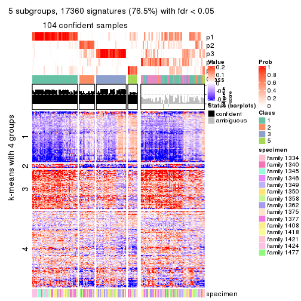</p>

</div>
<div id='tab-SD-pam-get-signatures-no-scale-5'>
<pre><code class="r">get_signatures(res, k = 6, scale_rows = FALSE)
</code></pre>

<p></p>

</div>
</div>


Compare the overlap of signatures from different k:

```r
compare_signatures(res)
```


`get_signature()` returns a data frame invisibly. TO get the list of signatures, the function
call should be assigned to a variable explicitly. In following code, if `plot` argument is set
to `FALSE`, no heatmap is plotted while only the differential analysis is performed.

```r
# code only for demonstration
tb = get_signature(res, k = ..., plot = FALSE)
```

An example of the output of `tb` is:

```
#>   which_row         fdr    mean_1    mean_2 scaled_mean_1 scaled_mean_2 km
#> 1        38 0.042760348  8.373488  9.131774    -0.5533452     0.5164555  1
#> 2        40 0.018707592  7.106213  8.469186    -0.6173731     0.5762149  1
#> 3        55 0.019134737 10.221463 11.207825    -0.6159697     0.5749050  1
#> 4        59 0.006059896  5.921854  7.869574    -0.6899429     0.6439467  1
#> 5        60 0.018055526  8.928898 10.211722    -0.6204761     0.5791110  1
#> 6        98 0.009384629 15.714769 14.887706     0.6635654    -0.6193277  2
...
```

The columns in `tb` are:

1. `which_row`: row indices corresponding to the input matrix.
2. `fdr`: FDR for the differential test. 
3. `mean_x`: The mean value in group x.
4. `scaled_mean_x`: The mean value in group x after rows are scaled.
5. `km`: Row groups if k-means clustering is applied to rows.


UMAP plot which shows how samples are separated.


<script>
$( function() {
	$( '#tabs-SD-pam-dimension-reduction' ).tabs();
} );
</script>
<div id='tabs-SD-pam-dimension-reduction'>
<ul>
<li><a href='#tab-SD-pam-dimension-reduction-1'>k = 2</a></li>
<li><a href='#tab-SD-pam-dimension-reduction-2'>k = 3</a></li>
<li><a href='#tab-SD-pam-dimension-reduction-3'>k = 4</a></li>
<li><a href='#tab-SD-pam-dimension-reduction-4'>k = 5</a></li>
<li><a href='#tab-SD-pam-dimension-reduction-5'>k = 6</a></li>
</ul>
<div id='tab-SD-pam-dimension-reduction-1'>
<pre><code class="r">dimension_reduction(res, k = 2, method = &quot;UMAP&quot;)
</code></pre>

<p></p>

</div>
<div id='tab-SD-pam-dimension-reduction-2'>
<pre><code class="r">dimension_reduction(res, k = 3, method = &quot;UMAP&quot;)
</code></pre>

<p></p>

</div>
<div id='tab-SD-pam-dimension-reduction-3'>
<pre><code class="r">dimension_reduction(res, k = 4, method = &quot;UMAP&quot;)
</code></pre>

<p></p>

</div>
<div id='tab-SD-pam-dimension-reduction-4'>
<pre><code class="r">dimension_reduction(res, k = 5, method = &quot;UMAP&quot;)
</code></pre>

<p></p>

</div>
<div id='tab-SD-pam-dimension-reduction-5'>
<pre><code class="r">dimension_reduction(res, k = 6, method = &quot;UMAP&quot;)
</code></pre>

<p></p>

</div>
</div>


Following heatmap shows how subgroups are split when increasing `k`:

```r
collect_classes(res)
```


Test correlation between subgroups and known annotations. If the known
annotation is numeric, one-way ANOVA test is applied, and if the known
annotation is discrete, chi-squared contingency table test is applied.

```r
test_to_known_factors(res)
```

```
#>          n specimen(p) k
#> SD:pam 149    2.46e-05 2
#> SD:pam 135    8.25e-04 3
#> SD:pam 119    1.73e-03 4
#> SD:pam 104    2.40e-04 5
#> SD:pam 140    1.53e-05 6
```


If matrix rows can be associated to genes, consider to use `GO_Enrichment(res,
...)` to perform function enrichment for the signature genes.


 

---------------------------------------------------


### SD:mclust


The object with results only for a single top-value method and a single partition method 
can be extracted as:

```r
res = res_list["SD", "mclust"]
# you can also extract it by
# res = res_list["SD:mclust"]
```

A summary of `res` and all the functions that can be applied to it:

```r
res
```

```
#> A 'ConsensusPartition' object with k = 2, 3, 4, 5, 6.
#>   On a matrix with 22686 rows and 167 columns.
#>   Top rows (1000, 2000, 3000, 4000, 5000) are extracted by 'SD' method.
#>   Subgroups are detected by 'mclust' method.
#>   Performed in total 1250 partitions by row resampling.
#>   Best k for subgroups seems to be 2.
#> 
#> Following methods can be applied to this 'ConsensusPartition' object:
#>  [1] "cola_report"             "collect_classes"         "collect_plots"          
#>  [4] "collect_stats"           "colnames"                "compare_signatures"     
#>  [7] "consensus_heatmap"       "dimension_reduction"     "functional_enrichment"  
#> [10] "get_anno_col"            "get_anno"                "get_classes"            
#> [13] "get_consensus"           "get_matrix"              "get_membership"         
#> [16] "get_param"               "get_signatures"          "get_stats"              
#> [19] "is_best_k"               "is_stable_k"             "membership_heatmap"     
#> [22] "ncol"                    "nrow"                    "plot_ecdf"              
#> [25] "rownames"                "select_partition_number" "show"                   
#> [28] "suggest_best_k"          "test_to_known_factors"
```

`collect_plots()` function collects all the plots made from `res` for all `k` (number of partitions)
into one single page to provide an easy and fast comparison between different `k`.

```r
collect_plots(res)
```


The plots are:

- The first row: a plot of the ECDF (Empirical cumulative distribution
  function) curves of the consensus matrix for each `k` and the heatmap of
  predicted classes for each `k`.
- The second row: heatmaps of the consensus matrix for each `k`.
- The third row: heatmaps of the membership matrix for each `k`.
- The fouth row: heatmaps of the signatures for each `k`.

All the plots in panels can be made by individual functions and they are
plotted later in this section.

`select_partition_number()` produces several plots showing different
statistics for choosing "optimized" `k`. There are following statistics:

- ECDF curves of the consensus matrix for each `k`;
- 1-PAC. [The PAC
  score](https://en.wikipedia.org/wiki/Consensus_clustering#Over-interpretation_potential_of_consensus_clustering)
  measures the proportion of the ambiguous subgrouping.
- Mean silhouette score.
- Concordance. The mean probability of fiting the consensus class ids in all
  partitions.
- Area increased. Denote $A_k$ as the area under the ECDF curve for current
  `k`, the area increased is defined as $A_k - A_{k-1}$.
- Rand index. The percent of pairs of samples that are both in a same cluster
  or both are not in a same cluster in the partition of k and k-1.
- Jaccard index. The ratio of pairs of samples are both in a same cluster in
  the partition of k and k-1 and the pairs of samples are both in a same
  cluster in the partition k or k-1.

The detailed explanations of these statistics can be found in [the cola
vignette](http://bioconductor.org/packages/devel/bioc/vignettes/cola/inst/doc/cola.html#toc_13).

Generally speaking, lower PAC score, higher mean silhouette score or higher
concordance corresponds to better partition. Rand index and Jaccard index
measure how similar the current partition is compared to partition with `k-1`.
If they are too similar, we won't accept `k` is better than `k-1`.

```r
select_partition_number(res)
```


The numeric values for all these statistics can be obtained by `get_stats()`.

```r
get_stats(res)
```

```
#>   k 1-PAC mean_silhouette concordance area_increased  Rand Jaccard
#> 2 2 0.243           0.790       0.838         0.4793 0.497   0.497
#> 3 3 0.407           0.568       0.747         0.2643 0.845   0.712
#> 4 4 0.517           0.566       0.740         0.1513 0.840   0.641
#> 5 5 0.554           0.384       0.640         0.1003 0.861   0.597
#> 6 6 0.638           0.563       0.728         0.0622 0.816   0.382
```

`suggest_best_k()` suggests the best $k$ based on these statistics. The rules are as follows:

- All $k$ with Jaccard index larger than 0.95 are removed because the increase of
  the partition number does not provides enough extra information. If all $k$ are removed,
  the best $k$ is assigned by `NA`.
- For $k$ with 1-PAC larger than 0.9, the maximal $k$ is taken as the "best k". Other $k$ is called "optional k".
- If it does not fit the second rule. The $k$ with the highest vote of highest
  1-PAC, mean silhouette and concordance is taken as the "best k".

```r
suggest_best_k(res)
```

```
#> [1] 2
```


Following shows the table of the partitions (You need to click the **show/hide
code output** link to see it). The membership matrix (columns with name `p*`)
is inferred by
[`clue::cl_consensus()`](https://www.rdocumentation.org/link/cl_consensus?package=clue)
function with the `SE` method. Basically the value in the membership matrix
represents the probability to belong to a certain group. The finall class
label for an item is determined with the group with highest probability it
belongs to.

In `get_classes()` function, the entropy is calculated from the membership
matrix and the silhouette score is calculated from the consensus matrix.


<script>
$( function() {
	$( '#tabs-SD-mclust-get-classes' ).tabs();
} );
</script>
<div id='tabs-SD-mclust-get-classes'>
<ul>
<li><a href='#tab-SD-mclust-get-classes-1'>k = 2</a></li>
<li><a href='#tab-SD-mclust-get-classes-2'>k = 3</a></li>
<li><a href='#tab-SD-mclust-get-classes-3'>k = 4</a></li>
<li><a href='#tab-SD-mclust-get-classes-4'>k = 5</a></li>
<li><a href='#tab-SD-mclust-get-classes-5'>k = 6</a></li>
</ul>

<div id='tab-SD-mclust-get-classes-1'>
<p><a id='tab-SD-mclust-get-classes-1-a' style='color:#0366d6' href='#'>show/hide code output</a></p>
<pre><code class="r">cbind(get_classes(res, k = 2), get_membership(res, k = 2))
</code></pre>

<pre><code>#&gt;          class entropy silhouette    p1    p2
#&gt; GSM30006     2  0.6048      0.826 0.148 0.852
#&gt; GSM30007     1  0.2236      0.851 0.964 0.036
#&gt; GSM30008     1  0.1414      0.849 0.980 0.020
#&gt; GSM30009     1  0.0000      0.843 1.000 0.000
#&gt; GSM30010     1  0.8443      0.781 0.728 0.272
#&gt; GSM30011     2  0.6148      0.825 0.152 0.848
#&gt; GSM30012     2  0.0000      0.789 0.000 1.000
#&gt; GSM30013     2  0.4690      0.831 0.100 0.900
#&gt; GSM30014     1  0.8386      0.782 0.732 0.268
#&gt; GSM30015     1  0.9977      0.316 0.528 0.472
#&gt; GSM30016     1  0.6531      0.830 0.832 0.168
#&gt; GSM30017     1  0.9896      0.414 0.560 0.440
#&gt; GSM30018     2  0.5519      0.842 0.128 0.872
#&gt; GSM30019     2  0.0000      0.789 0.000 1.000
#&gt; GSM30020     1  0.6531      0.830 0.832 0.168
#&gt; GSM30021     1  0.6531      0.830 0.832 0.168
#&gt; GSM30022     1  0.5737      0.831 0.864 0.136
#&gt; GSM30023     2  0.4815      0.829 0.104 0.896
#&gt; GSM30024     1  0.5294      0.794 0.880 0.120
#&gt; GSM30025     1  0.1414      0.849 0.980 0.020
#&gt; GSM30026     1  0.9358      0.182 0.648 0.352
#&gt; GSM30027     1  0.1414      0.849 0.980 0.020
#&gt; GSM30028     1  0.6531      0.830 0.832 0.168
#&gt; GSM30029     1  0.3114      0.849 0.944 0.056
#&gt; GSM30030     1  0.1414      0.849 0.980 0.020
#&gt; GSM30031     1  0.1414      0.849 0.980 0.020
#&gt; GSM30032     1  0.1414      0.849 0.980 0.020
#&gt; GSM30033     1  0.1414      0.849 0.980 0.020
#&gt; GSM30034     2  0.8081      0.858 0.248 0.752
#&gt; GSM30035     1  0.1414      0.849 0.980 0.020
#&gt; GSM30036     2  0.8081      0.858 0.248 0.752
#&gt; GSM30037     1  0.1414      0.849 0.980 0.020
#&gt; GSM30038     1  0.6531      0.830 0.832 0.168
#&gt; GSM30039     2  0.0000      0.789 0.000 1.000
#&gt; GSM30040     1  0.5408      0.793 0.876 0.124
#&gt; GSM30041     2  0.6048      0.826 0.148 0.852
#&gt; GSM30042     2  0.0000      0.789 0.000 1.000
#&gt; GSM30043     1  0.8327      0.784 0.736 0.264
#&gt; GSM30044     1  0.6048      0.825 0.852 0.148
#&gt; GSM30045     1  0.6531      0.830 0.832 0.168
#&gt; GSM30046     2  0.4690      0.831 0.100 0.900
#&gt; GSM30047     2  0.8081      0.858 0.248 0.752
#&gt; GSM30048     2  0.4690      0.831 0.100 0.900
#&gt; GSM30049     2  0.9087      0.615 0.324 0.676
#&gt; GSM30050     2  0.8081      0.858 0.248 0.752
#&gt; GSM30051     2  0.6048      0.826 0.148 0.852
#&gt; GSM30052     1  0.0000      0.843 1.000 0.000
#&gt; GSM30053     2  0.0000      0.789 0.000 1.000
#&gt; GSM30054     2  0.6247      0.824 0.156 0.844
#&gt; GSM30055     2  0.8443      0.843 0.272 0.728
#&gt; GSM30056     2  0.8081      0.858 0.248 0.752
#&gt; GSM30057     1  0.8443      0.781 0.728 0.272
#&gt; GSM30058     2  0.6048      0.826 0.148 0.852
#&gt; GSM30059     2  0.8081      0.858 0.248 0.752
#&gt; GSM30060     1  0.1414      0.849 0.980 0.020
#&gt; GSM30061     2  0.8081      0.858 0.248 0.752
#&gt; GSM30062     2  0.4939      0.835 0.108 0.892
#&gt; GSM30063     2  0.1184      0.800 0.016 0.984
#&gt; GSM30064     1  0.6531      0.830 0.832 0.168
#&gt; GSM30065     2  0.4690      0.828 0.100 0.900
#&gt; GSM30066     1  0.8386      0.782 0.732 0.268
#&gt; GSM30067     1  0.1414      0.849 0.980 0.020
#&gt; GSM30068     1  0.8386      0.782 0.732 0.268
#&gt; GSM30069     1  0.8386      0.782 0.732 0.268
#&gt; GSM30070     2  0.9044      0.182 0.320 0.680
#&gt; GSM30071     2  0.4939      0.827 0.108 0.892
#&gt; GSM30072     1  0.6531      0.830 0.832 0.168
#&gt; GSM30073     2  0.4690      0.831 0.100 0.900
#&gt; GSM30074     1  0.7056      0.824 0.808 0.192
#&gt; GSM30075     2  0.4690      0.831 0.100 0.900
#&gt; GSM30076     2  0.4815      0.833 0.104 0.896
#&gt; GSM30077     2  0.8081      0.858 0.248 0.752
#&gt; GSM30078     2  0.8081      0.858 0.248 0.752
#&gt; GSM30079     1  0.0000      0.843 1.000 0.000
#&gt; GSM30080     2  0.4431      0.830 0.092 0.908
#&gt; GSM30081     2  0.6048      0.826 0.148 0.852
#&gt; GSM30086     2  0.4690      0.831 0.100 0.900
#&gt; GSM30087     2  0.8081      0.858 0.248 0.752
#&gt; GSM30088     2  0.8081      0.858 0.248 0.752
#&gt; GSM30089     1  0.6531      0.830 0.832 0.168
#&gt; GSM30090     2  0.6048      0.826 0.148 0.852
#&gt; GSM30091     2  0.6343      0.822 0.160 0.840
#&gt; GSM30092     2  0.8081      0.858 0.248 0.752
#&gt; GSM30093     2  0.7674      0.855 0.224 0.776
#&gt; GSM30094     2  0.6343      0.822 0.160 0.840
#&gt; GSM30095     1  0.5408      0.793 0.876 0.124
#&gt; GSM30096     1  0.1414      0.849 0.980 0.020
#&gt; GSM30097     2  0.8081      0.858 0.248 0.752
#&gt; GSM30098     1  0.1414      0.849 0.980 0.020
#&gt; GSM30099     1  0.9909     -0.257 0.556 0.444
#&gt; GSM30100     1  0.8386      0.782 0.732 0.268
#&gt; GSM30101     2  0.6048      0.826 0.148 0.852
#&gt; GSM30102     2  0.8081      0.858 0.248 0.752
#&gt; GSM30103     1  0.1414      0.849 0.980 0.020
#&gt; GSM30104     2  0.8081      0.858 0.248 0.752
#&gt; GSM30105     1  0.1414      0.849 0.980 0.020
#&gt; GSM30106     2  0.4690      0.831 0.100 0.900
#&gt; GSM30107     2  0.4690      0.831 0.100 0.900
#&gt; GSM30108     1  0.6531      0.830 0.832 0.168
#&gt; GSM30109     1  0.6531      0.830 0.832 0.168
#&gt; GSM30110     2  0.8207      0.622 0.256 0.744
#&gt; GSM30111     1  0.7674      0.797 0.776 0.224
#&gt; GSM30112     1  0.6531      0.830 0.832 0.168
#&gt; GSM30113     1  0.8443      0.781 0.728 0.272
#&gt; GSM30114     2  0.1184      0.799 0.016 0.984
#&gt; GSM30115     2  0.4690      0.831 0.100 0.900
#&gt; GSM30116     1  0.4298      0.817 0.912 0.088
#&gt; GSM30117     1  0.1633      0.847 0.976 0.024
#&gt; GSM30118     1  0.6531      0.830 0.832 0.168
#&gt; GSM30119     2  0.0938      0.786 0.012 0.988
#&gt; GSM30120     2  0.8763      0.532 0.296 0.704
#&gt; GSM30121     1  0.6531      0.830 0.832 0.168
#&gt; GSM30122     1  0.1414      0.849 0.980 0.020
#&gt; GSM30123     2  0.8081      0.858 0.248 0.752
#&gt; GSM30177     2  0.8081      0.858 0.248 0.752
#&gt; GSM30178     2  0.8081      0.858 0.248 0.752
#&gt; GSM30179     1  0.5408      0.749 0.876 0.124
#&gt; GSM30180     1  0.5059      0.845 0.888 0.112
#&gt; GSM30181     2  0.4690      0.831 0.100 0.900
#&gt; GSM30182     2  0.8081      0.858 0.248 0.752
#&gt; GSM30183     1  0.8207      0.695 0.744 0.256
#&gt; GSM30184     2  0.6048      0.826 0.148 0.852
#&gt; GSM30185     1  0.1414      0.849 0.980 0.020
#&gt; GSM30186     1  0.5059      0.765 0.888 0.112
#&gt; GSM30187     2  0.8081      0.858 0.248 0.752
#&gt; GSM30188     2  0.8081      0.858 0.248 0.752
#&gt; GSM30189     2  0.8267      0.852 0.260 0.740
#&gt; GSM30190     2  0.6048      0.826 0.148 0.852
#&gt; GSM30191     2  0.8081      0.858 0.248 0.752
#&gt; GSM30192     2  0.4690      0.831 0.100 0.900
#&gt; GSM30193     2  0.4690      0.831 0.100 0.900
#&gt; GSM30194     2  0.9833     -0.242 0.424 0.576
#&gt; GSM30195     1  0.6712      0.827 0.824 0.176
#&gt; GSM30196     1  0.6048      0.825 0.852 0.148
#&gt; GSM30197     2  0.4690      0.831 0.100 0.900
#&gt; GSM30198     2  0.5059      0.824 0.112 0.888
#&gt; GSM30199     1  0.1414      0.849 0.980 0.020
#&gt; GSM30200     2  0.4690      0.831 0.100 0.900
#&gt; GSM30201     2  0.7674      0.860 0.224 0.776
#&gt; GSM30202     1  0.8661      0.665 0.712 0.288
#&gt; GSM30203     2  0.8081      0.858 0.248 0.752
#&gt; GSM30204     2  0.7139      0.732 0.196 0.804
#&gt; GSM30205     1  0.1414      0.849 0.980 0.020
#&gt; GSM30206     2  0.8081      0.858 0.248 0.752
#&gt; GSM30207     2  0.8144      0.856 0.252 0.748
#&gt; GSM30208     2  0.9896      0.574 0.440 0.560
#&gt; GSM30209     1  0.9427      0.118 0.640 0.360
#&gt; GSM30210     1  0.1414      0.849 0.980 0.020
#&gt; GSM30211     2  0.4690      0.831 0.100 0.900
#&gt; GSM30212     1  0.0376      0.845 0.996 0.004
#&gt; GSM30213     1  0.0000      0.843 1.000 0.000
#&gt; GSM30214     1  0.1414      0.849 0.980 0.020
#&gt; GSM30215     1  0.1414      0.849 0.980 0.020
#&gt; GSM30216     1  0.6048      0.825 0.852 0.148
#&gt; GSM30217     1  0.1414      0.849 0.980 0.020
#&gt; GSM30218     2  0.8267      0.852 0.260 0.740
#&gt; GSM30219     1  0.5294      0.794 0.880 0.120
#&gt; GSM30220     1  0.0672      0.846 0.992 0.008
#&gt; GSM30221     2  0.7815      0.860 0.232 0.768
#&gt; GSM30222     2  0.4690      0.831 0.100 0.900
#&gt; GSM30223     1  0.6048      0.825 0.852 0.148
#&gt; GSM30224     2  0.8081      0.858 0.248 0.752
#&gt; GSM30225     1  0.9954      0.354 0.540 0.460
#&gt; GSM30226     1  0.1414      0.849 0.980 0.020
#&gt; GSM30227     1  0.8608      0.729 0.716 0.284
#&gt; GSM30228     2  0.7056      0.846 0.192 0.808
#&gt; GSM30229     2  0.8081      0.858 0.248 0.752
</code></pre>

<script>
$('#tab-SD-mclust-get-classes-1-a').parent().next().next().hide();
$('#tab-SD-mclust-get-classes-1-a').click(function(){
  $('#tab-SD-mclust-get-classes-1-a').parent().next().next().toggle();
  return(false);
});
</script>
</div>

<div id='tab-SD-mclust-get-classes-2'>
<p><a id='tab-SD-mclust-get-classes-2-a' style='color:#0366d6' href='#'>show/hide code output</a></p>
<pre><code class="r">cbind(get_classes(res, k = 3), get_membership(res, k = 3))
</code></pre>

<pre><code>#&gt;          class entropy silhouette    p1    p2    p3
#&gt; GSM30006     1  0.6008   0.622522 0.664 0.004 0.332
#&gt; GSM30007     2  0.2711   0.662372 0.000 0.912 0.088
#&gt; GSM30008     2  0.2280   0.694802 0.008 0.940 0.052
#&gt; GSM30009     2  0.1163   0.694502 0.000 0.972 0.028
#&gt; GSM30010     3  0.8081   0.611687 0.136 0.220 0.644
#&gt; GSM30011     1  0.6473   0.610194 0.652 0.016 0.332
#&gt; GSM30012     1  0.6095   0.626618 0.608 0.000 0.392
#&gt; GSM30013     1  0.5810   0.676119 0.664 0.000 0.336
#&gt; GSM30014     3  0.6018   0.603688 0.008 0.308 0.684
#&gt; GSM30015     1  0.9281   0.046818 0.520 0.204 0.276
#&gt; GSM30016     2  0.8082   0.000849 0.096 0.608 0.296
#&gt; GSM30017     2  0.8248   0.082640 0.352 0.560 0.088
#&gt; GSM30018     1  0.2774   0.728930 0.920 0.072 0.008
#&gt; GSM30019     1  0.6062   0.631509 0.616 0.000 0.384
#&gt; GSM30020     2  0.3129   0.676396 0.008 0.904 0.088
#&gt; GSM30021     2  0.6379   0.187420 0.008 0.624 0.368
#&gt; GSM30022     2  0.1411   0.695576 0.000 0.964 0.036
#&gt; GSM30023     1  0.2448   0.731454 0.924 0.000 0.076
#&gt; GSM30024     2  0.6737   0.054002 0.016 0.600 0.384
#&gt; GSM30025     2  0.2681   0.694977 0.040 0.932 0.028
#&gt; GSM30026     1  0.7653   0.377996 0.644 0.276 0.080
#&gt; GSM30027     2  0.4745   0.637426 0.068 0.852 0.080
#&gt; GSM30028     2  0.3293   0.676277 0.012 0.900 0.088
#&gt; GSM30029     2  0.0892   0.699592 0.000 0.980 0.020
#&gt; GSM30030     2  0.0424   0.699268 0.000 0.992 0.008
#&gt; GSM30031     2  0.0892   0.699592 0.000 0.980 0.020
#&gt; GSM30032     2  0.6208   0.495813 0.068 0.768 0.164
#&gt; GSM30033     2  0.7062   0.304888 0.068 0.696 0.236
#&gt; GSM30034     1  0.0829   0.737886 0.984 0.004 0.012
#&gt; GSM30035     2  0.8107   0.079541 0.068 0.508 0.424
#&gt; GSM30036     1  0.1765   0.739058 0.956 0.004 0.040
#&gt; GSM30037     2  0.1163   0.694502 0.000 0.972 0.028
#&gt; GSM30038     2  0.6625  -0.213720 0.008 0.552 0.440
#&gt; GSM30039     1  0.6095   0.626618 0.608 0.000 0.392
#&gt; GSM30040     3  0.8717   0.585365 0.188 0.220 0.592
#&gt; GSM30041     1  0.6057   0.616987 0.656 0.004 0.340
#&gt; GSM30042     1  0.5926   0.642301 0.644 0.000 0.356
#&gt; GSM30043     3  0.6129   0.598245 0.008 0.324 0.668
#&gt; GSM30044     2  0.4353   0.650884 0.008 0.836 0.156
#&gt; GSM30045     2  0.4353   0.650884 0.008 0.836 0.156
#&gt; GSM30046     1  0.2448   0.733174 0.924 0.000 0.076
#&gt; GSM30047     1  0.0892   0.738651 0.980 0.020 0.000
#&gt; GSM30048     1  0.2448   0.731454 0.924 0.000 0.076
#&gt; GSM30049     3  0.6948  -0.314873 0.472 0.016 0.512
#&gt; GSM30050     1  0.4409   0.721538 0.824 0.004 0.172
#&gt; GSM30051     1  0.6451   0.487268 0.560 0.004 0.436
#&gt; GSM30052     2  0.2625   0.662143 0.000 0.916 0.084
#&gt; GSM30053     1  0.6095   0.626618 0.608 0.000 0.392
#&gt; GSM30054     1  0.6432   0.501439 0.568 0.004 0.428
#&gt; GSM30055     1  0.7213   0.601804 0.700 0.088 0.212
#&gt; GSM30056     1  0.5873   0.632776 0.684 0.004 0.312
#&gt; GSM30057     3  0.6811   0.619935 0.064 0.220 0.716
#&gt; GSM30058     1  0.6148   0.602384 0.640 0.004 0.356
#&gt; GSM30059     1  0.2165   0.734547 0.936 0.064 0.000
#&gt; GSM30060     2  0.6161   0.327560 0.020 0.708 0.272
#&gt; GSM30061     1  0.2448   0.731128 0.924 0.076 0.000
#&gt; GSM30062     1  0.2793   0.735160 0.928 0.028 0.044
#&gt; GSM30063     1  0.6169   0.655714 0.636 0.004 0.360
#&gt; GSM30064     2  0.2866   0.676302 0.008 0.916 0.076
#&gt; GSM30065     1  0.7797   0.649963 0.608 0.072 0.320
#&gt; GSM30066     3  0.5831   0.601712 0.008 0.284 0.708
#&gt; GSM30067     2  0.4121   0.645793 0.000 0.832 0.168
#&gt; GSM30068     3  0.6075   0.602847 0.008 0.316 0.676
#&gt; GSM30069     3  0.6513   0.525889 0.008 0.400 0.592
#&gt; GSM30070     3  0.9048   0.402183 0.288 0.172 0.540
#&gt; GSM30071     1  0.7394   0.600492 0.652 0.064 0.284
#&gt; GSM30072     2  0.4353   0.650884 0.008 0.836 0.156
#&gt; GSM30073     1  0.4654   0.729748 0.792 0.000 0.208
#&gt; GSM30074     3  0.6659   0.374482 0.008 0.460 0.532
#&gt; GSM30075     1  0.5291   0.682422 0.732 0.000 0.268
#&gt; GSM30076     1  0.2939   0.732349 0.916 0.072 0.012
#&gt; GSM30077     1  0.2356   0.730471 0.928 0.072 0.000
#&gt; GSM30078     1  0.2774   0.732780 0.920 0.072 0.008
#&gt; GSM30079     2  0.1163   0.694502 0.000 0.972 0.028
#&gt; GSM30080     1  0.5650   0.669897 0.688 0.000 0.312
#&gt; GSM30081     1  0.6421   0.508306 0.572 0.004 0.424
#&gt; GSM30086     1  0.4346   0.723816 0.816 0.000 0.184
#&gt; GSM30087     1  0.2590   0.729147 0.924 0.072 0.004
#&gt; GSM30088     1  0.2590   0.729147 0.924 0.072 0.004
#&gt; GSM30089     2  0.2866   0.676302 0.008 0.916 0.076
#&gt; GSM30090     1  0.6081   0.613903 0.652 0.004 0.344
#&gt; GSM30091     1  0.6451   0.487268 0.560 0.004 0.436
#&gt; GSM30092     1  0.2356   0.732420 0.928 0.072 0.000
#&gt; GSM30093     1  0.6008   0.623508 0.664 0.004 0.332
#&gt; GSM30094     1  0.6228   0.584357 0.624 0.004 0.372
#&gt; GSM30095     3  0.8065   0.572859 0.092 0.304 0.604
#&gt; GSM30096     2  0.4605   0.615420 0.000 0.796 0.204
#&gt; GSM30097     1  0.0592   0.738262 0.988 0.012 0.000
#&gt; GSM30098     2  0.3619   0.657075 0.000 0.864 0.136
#&gt; GSM30099     1  0.9272   0.181218 0.528 0.240 0.232
#&gt; GSM30100     3  0.6318   0.499816 0.008 0.356 0.636
#&gt; GSM30101     1  0.6169   0.598139 0.636 0.004 0.360
#&gt; GSM30102     1  0.4912   0.691709 0.796 0.008 0.196
#&gt; GSM30103     2  0.4475   0.671961 0.064 0.864 0.072
#&gt; GSM30104     1  0.1267   0.738964 0.972 0.004 0.024
#&gt; GSM30105     2  0.0747   0.698927 0.000 0.984 0.016
#&gt; GSM30106     1  0.2448   0.731454 0.924 0.000 0.076
#&gt; GSM30107     1  0.4357   0.721100 0.868 0.052 0.080
#&gt; GSM30108     2  0.6540   0.141038 0.008 0.584 0.408
#&gt; GSM30109     2  0.4291   0.666943 0.008 0.840 0.152
#&gt; GSM30110     1  0.6625   0.632883 0.744 0.080 0.176
#&gt; GSM30111     1  0.9574   0.003612 0.468 0.312 0.220
#&gt; GSM30112     2  0.2866   0.676302 0.008 0.916 0.076
#&gt; GSM30113     3  0.6282   0.601450 0.012 0.324 0.664
#&gt; GSM30114     1  0.6095   0.626618 0.608 0.000 0.392
#&gt; GSM30115     1  0.2796   0.735870 0.908 0.000 0.092
#&gt; GSM30116     2  0.7764   0.182899 0.068 0.604 0.328
#&gt; GSM30117     2  0.8249   0.048853 0.076 0.500 0.424
#&gt; GSM30118     3  0.6641   0.087274 0.008 0.448 0.544
#&gt; GSM30119     1  0.6672   0.504471 0.520 0.008 0.472
#&gt; GSM30120     1  0.8841   0.378593 0.536 0.136 0.328
#&gt; GSM30121     2  0.5692   0.596892 0.008 0.724 0.268
#&gt; GSM30122     2  0.6719   0.590422 0.068 0.728 0.204
#&gt; GSM30123     1  0.3784   0.726214 0.864 0.004 0.132
#&gt; GSM30177     1  0.5873   0.641780 0.684 0.004 0.312
#&gt; GSM30178     1  0.0747   0.738506 0.984 0.016 0.000
#&gt; GSM30179     2  0.5681   0.381875 0.236 0.748 0.016
#&gt; GSM30180     2  0.4887   0.616176 0.000 0.772 0.228
#&gt; GSM30181     1  0.3116   0.737018 0.892 0.000 0.108
#&gt; GSM30182     1  0.3091   0.733623 0.912 0.072 0.016
#&gt; GSM30183     2  0.7568   0.489902 0.108 0.680 0.212
#&gt; GSM30184     1  0.6033   0.619612 0.660 0.004 0.336
#&gt; GSM30185     2  0.6854   0.579199 0.068 0.716 0.216
#&gt; GSM30186     3  0.9822   0.371137 0.280 0.292 0.428
#&gt; GSM30187     1  0.1647   0.739123 0.960 0.004 0.036
#&gt; GSM30188     1  0.2590   0.731522 0.924 0.072 0.004
#&gt; GSM30189     1  0.3644   0.701789 0.872 0.124 0.004
#&gt; GSM30190     1  0.6081   0.613903 0.652 0.004 0.344
#&gt; GSM30191     1  0.4733   0.714144 0.800 0.004 0.196
#&gt; GSM30192     1  0.4235   0.726370 0.824 0.000 0.176
#&gt; GSM30193     1  0.2448   0.731454 0.924 0.000 0.076
#&gt; GSM30194     3  0.7749   0.226737 0.300 0.076 0.624
#&gt; GSM30195     2  0.9698  -0.328834 0.256 0.456 0.288
#&gt; GSM30196     2  0.4353   0.650884 0.008 0.836 0.156
#&gt; GSM30197     1  0.2356   0.732324 0.928 0.000 0.072
#&gt; GSM30198     1  0.4370   0.711232 0.868 0.056 0.076
#&gt; GSM30199     2  0.6007   0.610608 0.048 0.768 0.184
#&gt; GSM30200     1  0.2448   0.731454 0.924 0.000 0.076
#&gt; GSM30201     1  0.2774   0.728930 0.920 0.072 0.008
#&gt; GSM30202     2  0.9333   0.167303 0.268 0.516 0.216
#&gt; GSM30203     1  0.3780   0.737785 0.892 0.064 0.044
#&gt; GSM30204     1  0.5505   0.653457 0.816 0.096 0.088
#&gt; GSM30205     2  0.5588   0.353439 0.004 0.720 0.276
#&gt; GSM30206     1  0.2590   0.729147 0.924 0.072 0.004
#&gt; GSM30207     1  0.2866   0.730365 0.916 0.076 0.008
#&gt; GSM30208     1  0.4351   0.660753 0.828 0.168 0.004
#&gt; GSM30209     1  0.9417   0.075102 0.504 0.272 0.224
#&gt; GSM30210     2  0.0747   0.698927 0.000 0.984 0.016
#&gt; GSM30211     1  0.2448   0.731454 0.924 0.000 0.076
#&gt; GSM30212     2  0.1163   0.694502 0.000 0.972 0.028
#&gt; GSM30213     2  0.0592   0.697771 0.000 0.988 0.012
#&gt; GSM30214     2  0.3009   0.691053 0.052 0.920 0.028
#&gt; GSM30215     2  0.5412   0.636951 0.032 0.796 0.172
#&gt; GSM30216     2  0.5502   0.606151 0.008 0.744 0.248
#&gt; GSM30217     2  0.1781   0.700785 0.020 0.960 0.020
#&gt; GSM30218     1  0.7489   0.586560 0.664 0.080 0.256
#&gt; GSM30219     3  0.8066   0.222137 0.068 0.404 0.528
#&gt; GSM30220     2  0.2625   0.662143 0.000 0.916 0.084
#&gt; GSM30221     1  0.3742   0.735954 0.892 0.072 0.036
#&gt; GSM30222     1  0.2796   0.735255 0.908 0.000 0.092
#&gt; GSM30223     2  0.4228   0.655909 0.008 0.844 0.148
#&gt; GSM30224     1  0.2590   0.731364 0.924 0.072 0.004
#&gt; GSM30225     1  0.9820  -0.218670 0.428 0.296 0.276
#&gt; GSM30226     2  0.7786   0.347015 0.068 0.600 0.332
#&gt; GSM30227     2  0.9046   0.282171 0.160 0.528 0.312
#&gt; GSM30228     1  0.5623   0.659563 0.716 0.004 0.280
#&gt; GSM30229     1  0.3406   0.737252 0.904 0.068 0.028
</code></pre>

<script>
$('#tab-SD-mclust-get-classes-2-a').parent().next().next().hide();
$('#tab-SD-mclust-get-classes-2-a').click(function(){
  $('#tab-SD-mclust-get-classes-2-a').parent().next().next().toggle();
  return(false);
});
</script>
</div>

<div id='tab-SD-mclust-get-classes-3'>
<p><a id='tab-SD-mclust-get-classes-3-a' style='color:#0366d6' href='#'>show/hide code output</a></p>
<pre><code class="r">cbind(get_classes(res, k = 4), get_membership(res, k = 4))
</code></pre>

<pre><code>#&gt;          class entropy silhouette    p1    p2    p3    p4
#&gt; GSM30006     2  0.4304     0.8265 0.000 0.716 0.000 0.284
#&gt; GSM30007     1  0.2408     0.6506 0.920 0.044 0.036 0.000
#&gt; GSM30008     1  0.5748     0.6281 0.736 0.148 0.104 0.012
#&gt; GSM30009     1  0.2124     0.6574 0.932 0.040 0.028 0.000
#&gt; GSM30010     3  0.4338     0.6325 0.064 0.072 0.840 0.024
#&gt; GSM30011     2  0.4844     0.8048 0.012 0.688 0.000 0.300
#&gt; GSM30012     2  0.5288     0.5370 0.000 0.520 0.008 0.472
#&gt; GSM30013     4  0.2921     0.6289 0.000 0.140 0.000 0.860
#&gt; GSM30014     3  0.2859     0.6288 0.112 0.008 0.880 0.000
#&gt; GSM30015     4  0.7560     0.0804 0.056 0.064 0.368 0.512
#&gt; GSM30016     1  0.7482     0.4534 0.632 0.096 0.188 0.084
#&gt; GSM30017     4  0.6955     0.1307 0.296 0.144 0.000 0.560
#&gt; GSM30018     4  0.2124     0.7152 0.008 0.068 0.000 0.924
#&gt; GSM30019     2  0.5277     0.5625 0.000 0.532 0.008 0.460
#&gt; GSM30020     1  0.5937     0.6136 0.728 0.136 0.120 0.016
#&gt; GSM30021     3  0.4991     0.2818 0.316 0.004 0.672 0.008
#&gt; GSM30022     1  0.2131     0.6679 0.932 0.036 0.032 0.000
#&gt; GSM30023     4  0.1867     0.6726 0.000 0.072 0.000 0.928
#&gt; GSM30024     1  0.5937    -0.0358 0.608 0.052 0.340 0.000
#&gt; GSM30025     1  0.1182     0.6750 0.968 0.016 0.016 0.000
#&gt; GSM30026     4  0.7992     0.3693 0.088 0.320 0.072 0.520
#&gt; GSM30027     1  0.3024     0.6573 0.852 0.148 0.000 0.000
#&gt; GSM30028     1  0.6546     0.5595 0.668 0.144 0.176 0.012
#&gt; GSM30029     1  0.5438     0.6338 0.760 0.132 0.096 0.012
#&gt; GSM30030     1  0.1733     0.6812 0.948 0.028 0.024 0.000
#&gt; GSM30031     1  0.4488     0.6527 0.808 0.096 0.096 0.000
#&gt; GSM30032     1  0.3105     0.6600 0.856 0.140 0.004 0.000
#&gt; GSM30033     1  0.3569     0.6329 0.804 0.196 0.000 0.000
#&gt; GSM30034     4  0.3972     0.6511 0.008 0.204 0.000 0.788
#&gt; GSM30035     1  0.6013     0.5087 0.624 0.064 0.312 0.000
#&gt; GSM30036     4  0.4452     0.6110 0.008 0.260 0.000 0.732
#&gt; GSM30037     1  0.2124     0.6574 0.932 0.040 0.028 0.000
#&gt; GSM30038     3  0.6523     0.4414 0.332 0.080 0.584 0.004
#&gt; GSM30039     4  0.4990     0.0126 0.000 0.352 0.008 0.640
#&gt; GSM30040     3  0.8265     0.3482 0.224 0.344 0.412 0.020
#&gt; GSM30041     2  0.4164     0.8331 0.000 0.736 0.000 0.264
#&gt; GSM30042     4  0.6389    -0.5122 0.000 0.448 0.064 0.488
#&gt; GSM30043     3  0.3793     0.6285 0.112 0.044 0.844 0.000
#&gt; GSM30044     1  0.5340     0.5498 0.728 0.044 0.220 0.008
#&gt; GSM30045     1  0.5340     0.5498 0.728 0.044 0.220 0.008
#&gt; GSM30046     4  0.1022     0.7080 0.000 0.032 0.000 0.968
#&gt; GSM30047     4  0.3852     0.6529 0.008 0.192 0.000 0.800
#&gt; GSM30048     4  0.0336     0.7067 0.000 0.008 0.000 0.992
#&gt; GSM30049     2  0.6524     0.7081 0.120 0.616 0.000 0.264
#&gt; GSM30050     4  0.4699     0.5307 0.004 0.320 0.000 0.676
#&gt; GSM30051     2  0.4072     0.8372 0.000 0.748 0.000 0.252
#&gt; GSM30052     1  0.2408     0.6506 0.920 0.044 0.036 0.000
#&gt; GSM30053     4  0.4086     0.5011 0.000 0.216 0.008 0.776
#&gt; GSM30054     2  0.4103     0.8333 0.000 0.744 0.000 0.256
#&gt; GSM30055     4  0.5686     0.3107 0.032 0.376 0.000 0.592
#&gt; GSM30056     2  0.4500     0.7919 0.000 0.684 0.000 0.316
#&gt; GSM30057     3  0.2500     0.6189 0.040 0.044 0.916 0.000
#&gt; GSM30058     2  0.4072     0.8379 0.000 0.748 0.000 0.252
#&gt; GSM30059     4  0.3933     0.6522 0.008 0.200 0.000 0.792
#&gt; GSM30060     1  0.3448     0.6460 0.828 0.004 0.168 0.000
#&gt; GSM30061     4  0.3852     0.6529 0.008 0.192 0.000 0.800
#&gt; GSM30062     4  0.1389     0.7162 0.000 0.048 0.000 0.952
#&gt; GSM30063     4  0.3942     0.4825 0.000 0.236 0.000 0.764
#&gt; GSM30064     1  0.4917     0.5682 0.768 0.040 0.184 0.008
#&gt; GSM30065     2  0.4994     0.4551 0.000 0.520 0.000 0.480
#&gt; GSM30066     3  0.2216     0.6245 0.092 0.000 0.908 0.000
#&gt; GSM30067     1  0.6170     0.5341 0.600 0.068 0.332 0.000
#&gt; GSM30068     3  0.2530     0.6270 0.112 0.000 0.888 0.000
#&gt; GSM30069     3  0.5025     0.5435 0.252 0.032 0.716 0.000
#&gt; GSM30070     3  0.7307     0.1183 0.040 0.060 0.488 0.412
#&gt; GSM30071     4  0.2040     0.6829 0.012 0.048 0.004 0.936
#&gt; GSM30072     1  0.4176     0.6123 0.832 0.044 0.116 0.008
#&gt; GSM30073     4  0.2921     0.6322 0.000 0.140 0.000 0.860
#&gt; GSM30074     3  0.6403     0.4799 0.260 0.112 0.628 0.000
#&gt; GSM30075     4  0.0921     0.7071 0.000 0.028 0.000 0.972
#&gt; GSM30076     4  0.2011     0.7151 0.000 0.080 0.000 0.920
#&gt; GSM30077     4  0.2546     0.7130 0.008 0.092 0.000 0.900
#&gt; GSM30078     4  0.2918     0.7065 0.008 0.116 0.000 0.876
#&gt; GSM30079     1  0.1706     0.6666 0.948 0.036 0.016 0.000
#&gt; GSM30080     4  0.1940     0.6900 0.000 0.076 0.000 0.924
#&gt; GSM30081     2  0.4072     0.8372 0.000 0.748 0.000 0.252
#&gt; GSM30086     4  0.0592     0.7072 0.000 0.016 0.000 0.984
#&gt; GSM30087     4  0.2737     0.7113 0.008 0.104 0.000 0.888
#&gt; GSM30088     4  0.3768     0.6541 0.008 0.184 0.000 0.808
#&gt; GSM30089     1  0.5041     0.5659 0.760 0.044 0.188 0.008
#&gt; GSM30090     2  0.4134     0.8378 0.000 0.740 0.000 0.260
#&gt; GSM30091     2  0.4134     0.8305 0.000 0.740 0.000 0.260
#&gt; GSM30092     4  0.4086     0.6459 0.008 0.216 0.000 0.776
#&gt; GSM30093     2  0.4134     0.8362 0.000 0.740 0.000 0.260
#&gt; GSM30094     2  0.4103     0.8380 0.000 0.744 0.000 0.256
#&gt; GSM30095     3  0.8157     0.3422 0.280 0.284 0.424 0.012
#&gt; GSM30096     1  0.5807     0.5164 0.636 0.052 0.312 0.000
#&gt; GSM30097     4  0.4123     0.6455 0.008 0.220 0.000 0.772
#&gt; GSM30098     1  0.5288     0.5995 0.732 0.068 0.200 0.000
#&gt; GSM30099     2  0.7330     0.5367 0.184 0.512 0.000 0.304
#&gt; GSM30100     3  0.6016     0.3943 0.412 0.044 0.544 0.000
#&gt; GSM30101     2  0.4072     0.8372 0.000 0.748 0.000 0.252
#&gt; GSM30102     4  0.4836     0.4284 0.008 0.320 0.000 0.672
#&gt; GSM30103     1  0.3810     0.6384 0.804 0.008 0.188 0.000
#&gt; GSM30104     4  0.4360     0.6203 0.008 0.248 0.000 0.744
#&gt; GSM30105     1  0.2647     0.6670 0.880 0.120 0.000 0.000
#&gt; GSM30106     4  0.0000     0.7085 0.000 0.000 0.000 1.000
#&gt; GSM30107     4  0.0937     0.7058 0.012 0.012 0.000 0.976
#&gt; GSM30108     1  0.5340     0.5368 0.728 0.044 0.220 0.008
#&gt; GSM30109     1  0.6428     0.5601 0.648 0.084 0.256 0.012
#&gt; GSM30110     4  0.4581     0.6145 0.028 0.076 0.068 0.828
#&gt; GSM30111     4  0.8164     0.1998 0.248 0.084 0.116 0.552
#&gt; GSM30112     1  0.4937     0.5617 0.700 0.008 0.284 0.008
#&gt; GSM30113     3  0.4187     0.6330 0.092 0.056 0.840 0.012
#&gt; GSM30114     4  0.3074     0.6168 0.000 0.152 0.000 0.848
#&gt; GSM30115     4  0.1211     0.7068 0.000 0.040 0.000 0.960
#&gt; GSM30116     1  0.6464     0.4437 0.596 0.096 0.308 0.000
#&gt; GSM30117     1  0.6013     0.5088 0.624 0.064 0.312 0.000
#&gt; GSM30118     3  0.4105     0.5191 0.100 0.052 0.840 0.008
#&gt; GSM30119     4  0.7593    -0.2711 0.000 0.236 0.288 0.476
#&gt; GSM30120     4  0.5238     0.5499 0.036 0.060 0.116 0.788
#&gt; GSM30121     1  0.7314     0.4766 0.536 0.080 0.352 0.032
#&gt; GSM30122     1  0.5744     0.5523 0.676 0.068 0.256 0.000
#&gt; GSM30123     4  0.3837     0.6436 0.000 0.224 0.000 0.776
#&gt; GSM30177     2  0.4564     0.7650 0.000 0.672 0.000 0.328
#&gt; GSM30178     4  0.4086     0.6475 0.008 0.216 0.000 0.776
#&gt; GSM30179     1  0.6618     0.4006 0.604 0.272 0.000 0.124
#&gt; GSM30180     1  0.6345     0.4476 0.520 0.052 0.424 0.004
#&gt; GSM30181     4  0.0592     0.7096 0.000 0.016 0.000 0.984
#&gt; GSM30182     4  0.2737     0.7114 0.008 0.104 0.000 0.888
#&gt; GSM30183     1  0.7131     0.4335 0.512 0.060 0.396 0.032
#&gt; GSM30184     2  0.4382     0.8190 0.000 0.704 0.000 0.296
#&gt; GSM30185     1  0.5878     0.5137 0.632 0.056 0.312 0.000
#&gt; GSM30186     2  0.7299    -0.1907 0.176 0.512 0.312 0.000
#&gt; GSM30187     4  0.4360     0.6208 0.008 0.248 0.000 0.744
#&gt; GSM30188     4  0.2799     0.7104 0.008 0.108 0.000 0.884
#&gt; GSM30189     4  0.5178     0.6400 0.032 0.204 0.016 0.748
#&gt; GSM30190     2  0.4072     0.8372 0.000 0.748 0.000 0.252
#&gt; GSM30191     4  0.4722     0.5600 0.008 0.300 0.000 0.692
#&gt; GSM30192     4  0.0921     0.7087 0.000 0.028 0.000 0.972
#&gt; GSM30193     4  0.0707     0.7094 0.000 0.020 0.000 0.980
#&gt; GSM30194     3  0.7217     0.0844 0.016 0.132 0.584 0.268
#&gt; GSM30195     4  0.8042     0.2250 0.236 0.056 0.152 0.556
#&gt; GSM30196     1  0.5340     0.5498 0.728 0.044 0.220 0.008
#&gt; GSM30197     4  0.1022     0.7080 0.000 0.032 0.000 0.968
#&gt; GSM30198     4  0.1824     0.6780 0.004 0.060 0.000 0.936
#&gt; GSM30199     1  0.4900     0.5916 0.732 0.032 0.236 0.000
#&gt; GSM30200     4  0.1211     0.6930 0.000 0.040 0.000 0.960
#&gt; GSM30201     4  0.2198     0.7147 0.008 0.072 0.000 0.920
#&gt; GSM30202     3  0.8689    -0.1621 0.356 0.060 0.412 0.172
#&gt; GSM30203     4  0.4482     0.6089 0.008 0.264 0.000 0.728
#&gt; GSM30204     4  0.3377     0.5912 0.012 0.140 0.000 0.848
#&gt; GSM30205     1  0.5327     0.6160 0.720 0.060 0.220 0.000
#&gt; GSM30206     4  0.3972     0.6520 0.008 0.204 0.000 0.788
#&gt; GSM30207     4  0.4319     0.6392 0.012 0.228 0.000 0.760
#&gt; GSM30208     4  0.5920     0.4807 0.052 0.336 0.000 0.612
#&gt; GSM30209     1  0.7648    -0.0543 0.436 0.216 0.000 0.348
#&gt; GSM30210     1  0.2281     0.6719 0.904 0.096 0.000 0.000
#&gt; GSM30211     4  0.0336     0.7095 0.000 0.008 0.000 0.992
#&gt; GSM30212     1  0.1624     0.6640 0.952 0.020 0.028 0.000
#&gt; GSM30213     1  0.1182     0.6772 0.968 0.016 0.016 0.000
#&gt; GSM30214     1  0.3370     0.6761 0.872 0.048 0.080 0.000
#&gt; GSM30215     1  0.5834     0.5966 0.704 0.124 0.172 0.000
#&gt; GSM30216     1  0.6507     0.3851 0.476 0.052 0.464 0.008
#&gt; GSM30217     1  0.2281     0.6719 0.904 0.096 0.000 0.000
#&gt; GSM30218     4  0.5810     0.5445 0.064 0.276 0.000 0.660
#&gt; GSM30219     1  0.7650     0.2005 0.448 0.224 0.328 0.000
#&gt; GSM30220     1  0.2408     0.6506 0.920 0.044 0.036 0.000
#&gt; GSM30221     4  0.2737     0.7105 0.008 0.104 0.000 0.888
#&gt; GSM30222     4  0.0336     0.7067 0.000 0.008 0.000 0.992
#&gt; GSM30223     1  0.5340     0.5498 0.728 0.044 0.220 0.008
#&gt; GSM30224     4  0.3768     0.6541 0.008 0.184 0.000 0.808
#&gt; GSM30225     4  0.7034     0.2050 0.048 0.052 0.312 0.588
#&gt; GSM30226     1  0.5878     0.5137 0.632 0.056 0.312 0.000
#&gt; GSM30227     3  0.8845    -0.1039 0.352 0.052 0.368 0.228
#&gt; GSM30228     2  0.4730     0.7064 0.000 0.636 0.000 0.364
#&gt; GSM30229     4  0.4158     0.6419 0.008 0.224 0.000 0.768
</code></pre>

<script>
$('#tab-SD-mclust-get-classes-3-a').parent().next().next().hide();
$('#tab-SD-mclust-get-classes-3-a').click(function(){
  $('#tab-SD-mclust-get-classes-3-a').parent().next().next().toggle();
  return(false);
});
</script>
</div>

<div id='tab-SD-mclust-get-classes-4'>
<p><a id='tab-SD-mclust-get-classes-4-a' style='color:#0366d6' href='#'>show/hide code output</a></p>
<pre><code class="r">cbind(get_classes(res, k = 5), get_membership(res, k = 5))
</code></pre>

<pre><code>#&gt;          class entropy silhouette    p1    p2    p3    p4    p5
#&gt; GSM30006     3  0.2377     0.6696 0.000 0.000 0.872 0.128 0.000
#&gt; GSM30007     1  0.4015     0.3324 0.652 0.348 0.000 0.000 0.000
#&gt; GSM30008     2  0.4637    -0.2340 0.452 0.536 0.000 0.012 0.000
#&gt; GSM30009     1  0.4126     0.3191 0.620 0.380 0.000 0.000 0.000
#&gt; GSM30010     5  0.0510     0.6743 0.000 0.016 0.000 0.000 0.984
#&gt; GSM30011     3  0.2179     0.6822 0.000 0.000 0.888 0.112 0.000
#&gt; GSM30012     3  0.6272     0.3613 0.000 0.380 0.468 0.152 0.000
#&gt; GSM30013     2  0.6672    -0.3616 0.000 0.392 0.376 0.232 0.000
#&gt; GSM30014     5  0.0613     0.6720 0.008 0.004 0.004 0.000 0.984
#&gt; GSM30015     4  0.8540    -0.0142 0.292 0.224 0.004 0.320 0.160
#&gt; GSM30016     1  0.7364     0.3182 0.408 0.360 0.000 0.044 0.188
#&gt; GSM30017     2  0.5979    -0.0397 0.192 0.588 0.000 0.220 0.000
#&gt; GSM30018     4  0.1195     0.6604 0.000 0.028 0.012 0.960 0.000
#&gt; GSM30019     3  0.6495     0.3504 0.000 0.388 0.424 0.188 0.000
#&gt; GSM30020     1  0.5826     0.3288 0.500 0.404 0.000 0.000 0.096
#&gt; GSM30021     5  0.3521     0.4952 0.232 0.004 0.000 0.000 0.764
#&gt; GSM30022     1  0.4780     0.3746 0.692 0.248 0.000 0.000 0.060
#&gt; GSM30023     4  0.3242     0.6036 0.000 0.216 0.000 0.784 0.000
#&gt; GSM30024     5  0.6234     0.3149 0.332 0.160 0.000 0.000 0.508
#&gt; GSM30025     1  0.4297     0.2443 0.528 0.472 0.000 0.000 0.000
#&gt; GSM30026     4  0.5290     0.5220 0.000 0.184 0.140 0.676 0.000
#&gt; GSM30027     2  0.4481    -0.2266 0.416 0.576 0.000 0.008 0.000
#&gt; GSM30028     2  0.6360    -0.3621 0.420 0.436 0.000 0.004 0.140
#&gt; GSM30029     1  0.5014     0.2993 0.560 0.412 0.000 0.008 0.020
#&gt; GSM30030     1  0.4655     0.2362 0.512 0.476 0.000 0.000 0.012
#&gt; GSM30031     1  0.4297     0.2523 0.528 0.472 0.000 0.000 0.000
#&gt; GSM30032     2  0.4565    -0.2341 0.408 0.580 0.000 0.000 0.012
#&gt; GSM30033     2  0.5317    -0.2349 0.356 0.588 0.052 0.004 0.000
#&gt; GSM30034     4  0.2848     0.6578 0.000 0.004 0.156 0.840 0.000
#&gt; GSM30035     1  0.6390     0.3307 0.596 0.200 0.024 0.000 0.180
#&gt; GSM30036     4  0.3756     0.6040 0.000 0.008 0.248 0.744 0.000
#&gt; GSM30037     1  0.4074     0.3272 0.636 0.364 0.000 0.000 0.000
#&gt; GSM30038     5  0.5980     0.3262 0.176 0.240 0.000 0.000 0.584
#&gt; GSM30039     3  0.6536     0.3363 0.000 0.392 0.412 0.196 0.000
#&gt; GSM30040     5  0.7278     0.3213 0.052 0.156 0.348 0.000 0.444
#&gt; GSM30041     3  0.2280     0.6708 0.000 0.000 0.880 0.120 0.000
#&gt; GSM30042     2  0.6908    -0.3248 0.000 0.392 0.288 0.316 0.004
#&gt; GSM30043     5  0.0000     0.6741 0.000 0.000 0.000 0.000 1.000
#&gt; GSM30044     1  0.5867     0.3722 0.604 0.216 0.000 0.000 0.180
#&gt; GSM30045     1  0.5925     0.3687 0.596 0.216 0.000 0.000 0.188
#&gt; GSM30046     4  0.3954     0.6079 0.000 0.192 0.036 0.772 0.000
#&gt; GSM30047     4  0.2848     0.6579 0.000 0.004 0.156 0.840 0.000
#&gt; GSM30048     4  0.3690     0.6054 0.000 0.200 0.020 0.780 0.000
#&gt; GSM30049     3  0.2913     0.6134 0.004 0.080 0.876 0.040 0.000
#&gt; GSM30050     3  0.4542     0.0153 0.000 0.008 0.536 0.456 0.000
#&gt; GSM30051     3  0.0162     0.6866 0.000 0.000 0.996 0.004 0.000
#&gt; GSM30052     1  0.4030     0.3309 0.648 0.352 0.000 0.000 0.000
#&gt; GSM30053     3  0.6571     0.3154 0.000 0.392 0.404 0.204 0.000
#&gt; GSM30054     3  0.0290     0.6887 0.000 0.000 0.992 0.008 0.000
#&gt; GSM30055     4  0.5419     0.4652 0.044 0.016 0.332 0.608 0.000
#&gt; GSM30056     3  0.2753     0.6515 0.000 0.008 0.856 0.136 0.000
#&gt; GSM30057     5  0.0609     0.6735 0.000 0.020 0.000 0.000 0.980
#&gt; GSM30058     3  0.0880     0.6958 0.000 0.000 0.968 0.032 0.000
#&gt; GSM30059     4  0.2930     0.6574 0.000 0.004 0.164 0.832 0.000
#&gt; GSM30060     1  0.6670     0.2644 0.420 0.196 0.004 0.000 0.380
#&gt; GSM30061     4  0.2648     0.6584 0.000 0.000 0.152 0.848 0.000
#&gt; GSM30062     4  0.3649     0.6265 0.000 0.152 0.040 0.808 0.000
#&gt; GSM30063     3  0.6469     0.3532 0.000 0.380 0.436 0.184 0.000
#&gt; GSM30064     1  0.6016     0.3707 0.580 0.236 0.000 0.000 0.184
#&gt; GSM30065     3  0.5680     0.5026 0.000 0.228 0.624 0.148 0.000
#&gt; GSM30066     5  0.0000     0.6741 0.000 0.000 0.000 0.000 1.000
#&gt; GSM30067     1  0.5074     0.3360 0.660 0.268 0.000 0.000 0.072
#&gt; GSM30068     5  0.0404     0.6738 0.012 0.000 0.000 0.000 0.988
#&gt; GSM30069     5  0.2074     0.6368 0.104 0.000 0.000 0.000 0.896
#&gt; GSM30070     4  0.6997     0.0861 0.020 0.188 0.000 0.396 0.396
#&gt; GSM30071     4  0.4161     0.4410 0.000 0.392 0.000 0.608 0.000
#&gt; GSM30072     1  0.5841     0.3732 0.608 0.212 0.000 0.000 0.180
#&gt; GSM30073     3  0.6618     0.2825 0.000 0.388 0.396 0.216 0.000
#&gt; GSM30074     5  0.4697     0.2997 0.020 0.388 0.000 0.000 0.592
#&gt; GSM30075     4  0.4866     0.4366 0.000 0.392 0.028 0.580 0.000
#&gt; GSM30076     4  0.2438     0.6535 0.000 0.060 0.040 0.900 0.000
#&gt; GSM30077     4  0.2852     0.6600 0.000 0.000 0.172 0.828 0.000
#&gt; GSM30078     4  0.3039     0.6508 0.000 0.000 0.192 0.808 0.000
#&gt; GSM30079     1  0.4264     0.3223 0.620 0.376 0.000 0.000 0.004
#&gt; GSM30080     4  0.5849     0.3161 0.000 0.392 0.100 0.508 0.000
#&gt; GSM30081     3  0.0162     0.6866 0.000 0.000 0.996 0.004 0.000
#&gt; GSM30086     4  0.4856     0.4415 0.000 0.388 0.028 0.584 0.000
#&gt; GSM30087     4  0.2891     0.6581 0.000 0.000 0.176 0.824 0.000
#&gt; GSM30088     4  0.2605     0.6583 0.000 0.000 0.148 0.852 0.000
#&gt; GSM30089     1  0.5871     0.3731 0.604 0.212 0.000 0.000 0.184
#&gt; GSM30090     3  0.1608     0.6944 0.000 0.000 0.928 0.072 0.000
#&gt; GSM30091     3  0.0404     0.6904 0.000 0.000 0.988 0.012 0.000
#&gt; GSM30092     4  0.3003     0.6535 0.000 0.000 0.188 0.812 0.000
#&gt; GSM30093     3  0.1732     0.6833 0.000 0.000 0.920 0.080 0.000
#&gt; GSM30094     3  0.0671     0.6813 0.000 0.000 0.980 0.016 0.004
#&gt; GSM30095     5  0.7658     0.3235 0.092 0.156 0.308 0.000 0.444
#&gt; GSM30096     1  0.5524     0.3495 0.664 0.152 0.004 0.000 0.180
#&gt; GSM30097     4  0.3123     0.6536 0.000 0.004 0.184 0.812 0.000
#&gt; GSM30098     1  0.4468     0.3407 0.716 0.240 0.000 0.000 0.044
#&gt; GSM30099     3  0.6845     0.4154 0.052 0.188 0.572 0.188 0.000
#&gt; GSM30100     5  0.3391     0.5763 0.188 0.012 0.000 0.000 0.800
#&gt; GSM30101     3  0.0162     0.6866 0.000 0.000 0.996 0.004 0.000
#&gt; GSM30102     4  0.3966     0.5196 0.000 0.000 0.336 0.664 0.000
#&gt; GSM30103     1  0.6274     0.3038 0.428 0.424 0.000 0.000 0.148
#&gt; GSM30104     4  0.3421     0.6416 0.000 0.008 0.204 0.788 0.000
#&gt; GSM30105     2  0.4302    -0.2564 0.480 0.520 0.000 0.000 0.000
#&gt; GSM30106     4  0.3109     0.6056 0.000 0.200 0.000 0.800 0.000
#&gt; GSM30107     4  0.4696     0.4720 0.000 0.360 0.024 0.616 0.000
#&gt; GSM30108     1  0.6315     0.3336 0.528 0.212 0.000 0.000 0.260
#&gt; GSM30109     1  0.6021     0.3244 0.476 0.408 0.000 0.000 0.116
#&gt; GSM30110     4  0.8000     0.2037 0.192 0.200 0.156 0.452 0.000
#&gt; GSM30111     4  0.7750    -0.0228 0.304 0.256 0.000 0.380 0.060
#&gt; GSM30112     1  0.6485     0.3770 0.488 0.224 0.000 0.000 0.288
#&gt; GSM30113     5  0.0510     0.6743 0.000 0.016 0.000 0.000 0.984
#&gt; GSM30114     2  0.6660    -0.3611 0.000 0.392 0.380 0.228 0.000
#&gt; GSM30115     4  0.4495     0.5851 0.000 0.200 0.064 0.736 0.000
#&gt; GSM30116     5  0.8032    -0.0483 0.292 0.192 0.116 0.000 0.400
#&gt; GSM30117     1  0.7101     0.3042 0.552 0.212 0.072 0.000 0.164
#&gt; GSM30118     5  0.4236     0.4683 0.328 0.004 0.004 0.000 0.664
#&gt; GSM30119     2  0.8375    -0.3489 0.004 0.332 0.300 0.244 0.120
#&gt; GSM30120     2  0.7931    -0.2112 0.200 0.392 0.068 0.332 0.008
#&gt; GSM30121     1  0.5544     0.3195 0.648 0.184 0.000 0.000 0.168
#&gt; GSM30122     1  0.5232     0.3353 0.648 0.268 0.000 0.000 0.084
#&gt; GSM30123     4  0.3123     0.6502 0.000 0.004 0.184 0.812 0.000
#&gt; GSM30177     3  0.3353     0.6096 0.000 0.008 0.796 0.196 0.000
#&gt; GSM30178     4  0.3039     0.6522 0.000 0.000 0.192 0.808 0.000
#&gt; GSM30179     1  0.7507     0.1129 0.428 0.288 0.048 0.236 0.000
#&gt; GSM30180     1  0.3768     0.3633 0.760 0.008 0.004 0.000 0.228
#&gt; GSM30181     4  0.4114     0.4595 0.000 0.376 0.000 0.624 0.000
#&gt; GSM30182     4  0.3039     0.6478 0.000 0.000 0.192 0.808 0.000
#&gt; GSM30183     1  0.6606     0.2727 0.624 0.140 0.004 0.060 0.172
#&gt; GSM30184     3  0.2732     0.6422 0.000 0.000 0.840 0.160 0.000
#&gt; GSM30185     1  0.5852     0.3368 0.624 0.192 0.004 0.000 0.180
#&gt; GSM30186     3  0.8185    -0.1566 0.264 0.172 0.400 0.000 0.164
#&gt; GSM30187     4  0.3607     0.6105 0.000 0.004 0.244 0.752 0.000
#&gt; GSM30188     4  0.3074     0.6513 0.000 0.000 0.196 0.804 0.000
#&gt; GSM30189     4  0.3048     0.6523 0.000 0.004 0.176 0.820 0.000
#&gt; GSM30190     3  0.0162     0.6866 0.000 0.000 0.996 0.004 0.000
#&gt; GSM30191     4  0.4538     0.1694 0.000 0.008 0.452 0.540 0.000
#&gt; GSM30192     4  0.5010     0.4327 0.000 0.392 0.036 0.572 0.000
#&gt; GSM30193     4  0.3944     0.6043 0.000 0.200 0.032 0.768 0.000
#&gt; GSM30194     5  0.4599     0.2688 0.000 0.000 0.356 0.020 0.624
#&gt; GSM30195     2  0.8433    -0.0928 0.288 0.292 0.000 0.268 0.152
#&gt; GSM30196     1  0.5867     0.3722 0.604 0.216 0.000 0.000 0.180
#&gt; GSM30197     4  0.4168     0.6016 0.000 0.200 0.044 0.756 0.000
#&gt; GSM30198     4  0.3109     0.6056 0.000 0.200 0.000 0.800 0.000
#&gt; GSM30199     1  0.6080     0.3519 0.584 0.248 0.004 0.000 0.164
#&gt; GSM30200     4  0.3109     0.6056 0.000 0.200 0.000 0.800 0.000
#&gt; GSM30201     4  0.0404     0.6632 0.000 0.000 0.012 0.988 0.000
#&gt; GSM30202     1  0.7936     0.1388 0.484 0.164 0.004 0.160 0.188
#&gt; GSM30203     4  0.3752     0.5612 0.000 0.000 0.292 0.708 0.000
#&gt; GSM30204     4  0.3534     0.5861 0.000 0.256 0.000 0.744 0.000
#&gt; GSM30205     2  0.6105    -0.3309 0.392 0.480 0.000 0.000 0.128
#&gt; GSM30206     4  0.2561     0.6577 0.000 0.000 0.144 0.856 0.000
#&gt; GSM30207     4  0.2953     0.6554 0.000 0.012 0.144 0.844 0.000
#&gt; GSM30208     4  0.3911     0.6340 0.000 0.060 0.144 0.796 0.000
#&gt; GSM30209     4  0.7789     0.1937 0.104 0.196 0.208 0.488 0.004
#&gt; GSM30210     2  0.4302    -0.2529 0.480 0.520 0.000 0.000 0.000
#&gt; GSM30211     4  0.3003     0.6116 0.000 0.188 0.000 0.812 0.000
#&gt; GSM30212     1  0.4182     0.3073 0.600 0.400 0.000 0.000 0.000
#&gt; GSM30213     1  0.4415     0.2689 0.552 0.444 0.000 0.000 0.004
#&gt; GSM30214     2  0.5346    -0.2710 0.452 0.496 0.000 0.000 0.052
#&gt; GSM30215     1  0.4582     0.2677 0.572 0.416 0.000 0.000 0.012
#&gt; GSM30216     1  0.5015     0.2670 0.652 0.048 0.004 0.000 0.296
#&gt; GSM30217     2  0.4430    -0.2373 0.456 0.540 0.000 0.000 0.004
#&gt; GSM30218     4  0.5552     0.3475 0.044 0.012 0.420 0.524 0.000
#&gt; GSM30219     5  0.8483     0.0679 0.288 0.192 0.208 0.000 0.312
#&gt; GSM30220     1  0.4030     0.3309 0.648 0.352 0.000 0.000 0.000
#&gt; GSM30221     4  0.2482     0.6682 0.000 0.024 0.084 0.892 0.000
#&gt; GSM30222     4  0.4150     0.4458 0.000 0.388 0.000 0.612 0.000
#&gt; GSM30223     1  0.5867     0.3722 0.604 0.216 0.000 0.000 0.180
#&gt; GSM30224     4  0.2763     0.6570 0.000 0.004 0.148 0.848 0.000
#&gt; GSM30225     1  0.8569    -0.0497 0.320 0.204 0.004 0.292 0.180
#&gt; GSM30226     1  0.5942     0.3359 0.612 0.192 0.004 0.000 0.192
#&gt; GSM30227     1  0.7387     0.1817 0.532 0.180 0.004 0.076 0.208
#&gt; GSM30228     3  0.3461     0.5706 0.000 0.004 0.772 0.224 0.000
#&gt; GSM30229     4  0.3074     0.6495 0.000 0.000 0.196 0.804 0.000
</code></pre>

<script>
$('#tab-SD-mclust-get-classes-4-a').parent().next().next().hide();
$('#tab-SD-mclust-get-classes-4-a').click(function(){
  $('#tab-SD-mclust-get-classes-4-a').parent().next().next().toggle();
  return(false);
});
</script>
</div>

<div id='tab-SD-mclust-get-classes-5'>
<p><a id='tab-SD-mclust-get-classes-5-a' style='color:#0366d6' href='#'>show/hide code output</a></p>
<pre><code class="r">cbind(get_classes(res, k = 6), get_membership(res, k = 6))
</code></pre>

<pre><code>#&gt;          class entropy silhouette    p1    p2    p3    p4    p5    p6
#&gt; GSM30006     3  0.2945     0.6961 0.000 0.020 0.824 0.156 0.000 0.000
#&gt; GSM30007     1  0.3797    -0.3637 0.580 0.000 0.000 0.000 0.000 0.420
#&gt; GSM30008     6  0.4764     0.5666 0.232 0.108 0.000 0.000 0.000 0.660
#&gt; GSM30009     6  0.3869     0.4732 0.500 0.000 0.000 0.000 0.000 0.500
#&gt; GSM30010     5  0.0922     0.8232 0.004 0.004 0.000 0.000 0.968 0.024
#&gt; GSM30011     3  0.2006     0.7317 0.000 0.004 0.892 0.104 0.000 0.000
#&gt; GSM30012     2  0.3833     0.4128 0.000 0.556 0.444 0.000 0.000 0.000
#&gt; GSM30013     2  0.4037     0.4777 0.000 0.608 0.380 0.012 0.000 0.000
#&gt; GSM30014     5  0.0603     0.8212 0.004 0.016 0.000 0.000 0.980 0.000
#&gt; GSM30015     2  0.8239     0.2692 0.128 0.396 0.000 0.100 0.140 0.236
#&gt; GSM30016     1  0.4707     0.5897 0.704 0.152 0.000 0.000 0.008 0.136
#&gt; GSM30017     1  0.5575     0.4201 0.528 0.304 0.000 0.000 0.000 0.168
#&gt; GSM30018     4  0.2631     0.7937 0.008 0.152 0.000 0.840 0.000 0.000
#&gt; GSM30019     2  0.4913     0.5257 0.000 0.588 0.332 0.080 0.000 0.000
#&gt; GSM30020     1  0.3409     0.5980 0.780 0.028 0.000 0.000 0.000 0.192
#&gt; GSM30021     5  0.1806     0.7812 0.088 0.000 0.000 0.000 0.908 0.004
#&gt; GSM30022     1  0.1267     0.6323 0.940 0.000 0.000 0.000 0.000 0.060
#&gt; GSM30023     2  0.4167     0.5275 0.008 0.636 0.000 0.344 0.000 0.012
#&gt; GSM30024     6  0.5826     0.4124 0.212 0.000 0.000 0.000 0.308 0.480
#&gt; GSM30025     6  0.3695     0.5569 0.376 0.000 0.000 0.000 0.000 0.624
#&gt; GSM30026     4  0.3463     0.6578 0.008 0.032 0.000 0.800 0.000 0.160
#&gt; GSM30027     6  0.4209     0.5964 0.160 0.104 0.000 0.000 0.000 0.736
#&gt; GSM30028     1  0.4586     0.5805 0.712 0.104 0.000 0.000 0.008 0.176
#&gt; GSM30029     1  0.3865     0.5874 0.752 0.056 0.000 0.000 0.000 0.192
#&gt; GSM30030     6  0.3992     0.5636 0.364 0.000 0.000 0.000 0.012 0.624
#&gt; GSM30031     1  0.4180     0.3468 0.628 0.024 0.000 0.000 0.000 0.348
#&gt; GSM30032     6  0.3976     0.6032 0.128 0.088 0.000 0.000 0.008 0.776
#&gt; GSM30033     6  0.4170     0.5955 0.124 0.096 0.008 0.000 0.004 0.768
#&gt; GSM30034     4  0.2346     0.8137 0.000 0.124 0.008 0.868 0.000 0.000
#&gt; GSM30035     6  0.3037     0.5584 0.000 0.016 0.000 0.000 0.176 0.808
#&gt; GSM30036     4  0.1625     0.8040 0.000 0.012 0.060 0.928 0.000 0.000
#&gt; GSM30037     6  0.3864     0.4899 0.480 0.000 0.000 0.000 0.000 0.520
#&gt; GSM30038     5  0.5720     0.4179 0.328 0.092 0.000 0.000 0.548 0.032
#&gt; GSM30039     2  0.4700     0.5137 0.000 0.600 0.340 0.060 0.000 0.000
#&gt; GSM30040     3  0.4608     0.2376 0.000 0.004 0.552 0.000 0.412 0.032
#&gt; GSM30041     3  0.3055     0.7134 0.000 0.064 0.840 0.096 0.000 0.000
#&gt; GSM30042     2  0.5119     0.5883 0.000 0.624 0.220 0.156 0.000 0.000
#&gt; GSM30043     5  0.0146     0.8234 0.004 0.000 0.000 0.000 0.996 0.000
#&gt; GSM30044     1  0.0520     0.6415 0.984 0.000 0.000 0.000 0.008 0.008
#&gt; GSM30045     1  0.0520     0.6415 0.984 0.000 0.000 0.000 0.008 0.008
#&gt; GSM30046     2  0.4475     0.4736 0.008 0.528 0.016 0.448 0.000 0.000
#&gt; GSM30047     4  0.2378     0.7916 0.000 0.152 0.000 0.848 0.000 0.000
#&gt; GSM30048     2  0.4126     0.5077 0.008 0.624 0.008 0.360 0.000 0.000
#&gt; GSM30049     3  0.1124     0.7416 0.000 0.008 0.956 0.036 0.000 0.000
#&gt; GSM30050     4  0.3841     0.3765 0.000 0.004 0.380 0.616 0.000 0.000
#&gt; GSM30051     3  0.0146     0.7378 0.000 0.004 0.996 0.000 0.000 0.000
#&gt; GSM30052     1  0.3868    -0.4999 0.508 0.000 0.000 0.000 0.000 0.492
#&gt; GSM30053     2  0.4312     0.4897 0.000 0.604 0.368 0.028 0.000 0.000
#&gt; GSM30054     3  0.0458     0.7399 0.000 0.016 0.984 0.000 0.000 0.000
#&gt; GSM30055     3  0.6631     0.1265 0.000 0.272 0.368 0.332 0.000 0.028
#&gt; GSM30056     3  0.2896     0.6829 0.000 0.016 0.824 0.160 0.000 0.000
#&gt; GSM30057     5  0.0692     0.8239 0.004 0.000 0.000 0.000 0.976 0.020
#&gt; GSM30058     3  0.0972     0.7418 0.000 0.008 0.964 0.028 0.000 0.000
#&gt; GSM30059     4  0.2234     0.8044 0.000 0.124 0.004 0.872 0.000 0.000
#&gt; GSM30060     6  0.4389     0.4858 0.032 0.000 0.000 0.000 0.372 0.596
#&gt; GSM30061     4  0.2631     0.7752 0.000 0.180 0.000 0.820 0.000 0.000
#&gt; GSM30062     4  0.4303     0.0788 0.008 0.360 0.016 0.616 0.000 0.000
#&gt; GSM30063     2  0.4084     0.4613 0.000 0.588 0.400 0.012 0.000 0.000
#&gt; GSM30064     1  0.1970     0.6445 0.920 0.028 0.000 0.000 0.008 0.044
#&gt; GSM30065     3  0.5963    -0.0451 0.000 0.240 0.440 0.320 0.000 0.000
#&gt; GSM30066     5  0.0260     0.8240 0.008 0.000 0.000 0.000 0.992 0.000
#&gt; GSM30067     6  0.3220     0.5927 0.108 0.004 0.000 0.000 0.056 0.832
#&gt; GSM30068     5  0.0458     0.8243 0.016 0.000 0.000 0.000 0.984 0.000
#&gt; GSM30069     5  0.1957     0.7741 0.112 0.000 0.000 0.000 0.888 0.000
#&gt; GSM30070     2  0.5392    -0.0642 0.008 0.548 0.000 0.084 0.356 0.004
#&gt; GSM30071     2  0.2454     0.6120 0.000 0.840 0.000 0.160 0.000 0.000
#&gt; GSM30072     1  0.0520     0.6415 0.984 0.000 0.000 0.000 0.008 0.008
#&gt; GSM30073     2  0.3747     0.4624 0.000 0.604 0.396 0.000 0.000 0.000
#&gt; GSM30074     5  0.5932     0.4366 0.164 0.048 0.000 0.000 0.600 0.188
#&gt; GSM30075     2  0.3592     0.6205 0.000 0.740 0.020 0.240 0.000 0.000
#&gt; GSM30076     4  0.3147     0.7993 0.008 0.160 0.016 0.816 0.000 0.000
#&gt; GSM30077     4  0.1426     0.8182 0.008 0.028 0.016 0.948 0.000 0.000
#&gt; GSM30078     4  0.1957     0.8211 0.008 0.048 0.024 0.920 0.000 0.000
#&gt; GSM30079     6  0.3851     0.5058 0.460 0.000 0.000 0.000 0.000 0.540
#&gt; GSM30080     2  0.4687     0.6415 0.000 0.684 0.136 0.180 0.000 0.000
#&gt; GSM30081     3  0.0260     0.7380 0.000 0.008 0.992 0.000 0.000 0.000
#&gt; GSM30086     2  0.3494     0.6152 0.000 0.736 0.012 0.252 0.000 0.000
#&gt; GSM30087     4  0.1346     0.8144 0.008 0.024 0.016 0.952 0.000 0.000
#&gt; GSM30088     4  0.1333     0.8194 0.008 0.048 0.000 0.944 0.000 0.000
#&gt; GSM30089     1  0.0520     0.6415 0.984 0.000 0.000 0.000 0.008 0.008
#&gt; GSM30090     3  0.1471     0.7415 0.000 0.004 0.932 0.064 0.000 0.000
#&gt; GSM30091     3  0.0622     0.7417 0.000 0.008 0.980 0.012 0.000 0.000
#&gt; GSM30092     4  0.2163     0.8149 0.000 0.092 0.016 0.892 0.000 0.000
#&gt; GSM30093     3  0.0858     0.7398 0.000 0.004 0.968 0.028 0.000 0.000
#&gt; GSM30094     3  0.0508     0.7392 0.000 0.004 0.984 0.012 0.000 0.000
#&gt; GSM30095     3  0.4625     0.2127 0.000 0.004 0.540 0.000 0.424 0.032
#&gt; GSM30096     6  0.4822     0.5576 0.100 0.024 0.000 0.000 0.168 0.708
#&gt; GSM30097     4  0.0914     0.8129 0.000 0.016 0.016 0.968 0.000 0.000
#&gt; GSM30098     6  0.3627     0.5909 0.156 0.020 0.000 0.000 0.028 0.796
#&gt; GSM30099     3  0.6498     0.5242 0.000 0.192 0.568 0.124 0.004 0.112
#&gt; GSM30100     5  0.2823     0.6981 0.204 0.000 0.000 0.000 0.796 0.000
#&gt; GSM30101     3  0.0000     0.7380 0.000 0.000 1.000 0.000 0.000 0.000
#&gt; GSM30102     4  0.5411     0.1915 0.000 0.124 0.364 0.512 0.000 0.000
#&gt; GSM30103     6  0.4704     0.6348 0.156 0.008 0.000 0.000 0.132 0.704
#&gt; GSM30104     4  0.2799     0.7961 0.000 0.064 0.076 0.860 0.000 0.000
#&gt; GSM30105     6  0.4265     0.5704 0.300 0.040 0.000 0.000 0.000 0.660
#&gt; GSM30106     2  0.3984     0.5057 0.008 0.596 0.000 0.396 0.000 0.000
#&gt; GSM30107     2  0.3197     0.6152 0.008 0.804 0.012 0.176 0.000 0.000
#&gt; GSM30108     1  0.3081     0.4510 0.776 0.000 0.000 0.000 0.220 0.004
#&gt; GSM30109     1  0.2982     0.6188 0.828 0.012 0.000 0.000 0.008 0.152
#&gt; GSM30110     2  0.7404     0.5340 0.008 0.464 0.144 0.180 0.004 0.200
#&gt; GSM30111     1  0.5890     0.3401 0.480 0.400 0.000 0.052 0.000 0.068
#&gt; GSM30112     1  0.2365     0.6339 0.888 0.000 0.000 0.000 0.072 0.040
#&gt; GSM30113     5  0.0922     0.8232 0.004 0.004 0.000 0.000 0.968 0.024
#&gt; GSM30114     2  0.4300     0.4917 0.000 0.608 0.364 0.028 0.000 0.000
#&gt; GSM30115     2  0.4624     0.4969 0.008 0.516 0.024 0.452 0.000 0.000
#&gt; GSM30116     6  0.4218     0.4421 0.004 0.000 0.012 0.000 0.400 0.584
#&gt; GSM30117     6  0.3196     0.5557 0.000 0.020 0.008 0.000 0.156 0.816
#&gt; GSM30118     5  0.4050     0.6177 0.024 0.024 0.000 0.000 0.744 0.208
#&gt; GSM30119     2  0.5119     0.5696 0.000 0.628 0.244 0.124 0.004 0.000
#&gt; GSM30120     2  0.6179     0.5847 0.000 0.600 0.032 0.144 0.024 0.200
#&gt; GSM30121     1  0.5099     0.4967 0.588 0.016 0.000 0.000 0.060 0.336
#&gt; GSM30122     6  0.3014     0.5977 0.056 0.016 0.000 0.000 0.068 0.860
#&gt; GSM30123     4  0.0146     0.8166 0.000 0.004 0.000 0.996 0.000 0.000
#&gt; GSM30177     3  0.2669     0.6997 0.000 0.008 0.836 0.156 0.000 0.000
#&gt; GSM30178     4  0.0914     0.8129 0.000 0.016 0.016 0.968 0.000 0.000
#&gt; GSM30179     6  0.5679     0.4646 0.064 0.208 0.000 0.096 0.000 0.632
#&gt; GSM30180     1  0.5950     0.4204 0.552 0.024 0.000 0.000 0.168 0.256
#&gt; GSM30181     2  0.3706     0.5885 0.000 0.620 0.000 0.380 0.000 0.000
#&gt; GSM30182     4  0.1515     0.8067 0.008 0.020 0.028 0.944 0.000 0.000
#&gt; GSM30183     1  0.6203     0.4533 0.560 0.024 0.000 0.020 0.132 0.264
#&gt; GSM30184     3  0.3274     0.7062 0.000 0.080 0.824 0.096 0.000 0.000
#&gt; GSM30185     6  0.3168     0.5558 0.000 0.024 0.000 0.000 0.172 0.804
#&gt; GSM30186     3  0.6119     0.2258 0.000 0.024 0.464 0.000 0.148 0.364
#&gt; GSM30187     4  0.2179     0.8221 0.000 0.064 0.036 0.900 0.000 0.000
#&gt; GSM30188     4  0.1262     0.8112 0.008 0.016 0.020 0.956 0.000 0.000
#&gt; GSM30189     4  0.0508     0.8180 0.000 0.012 0.000 0.984 0.000 0.004
#&gt; GSM30190     3  0.0146     0.7378 0.000 0.004 0.996 0.000 0.000 0.000
#&gt; GSM30191     4  0.3421     0.5716 0.000 0.008 0.256 0.736 0.000 0.000
#&gt; GSM30192     2  0.3738     0.6090 0.000 0.704 0.016 0.280 0.000 0.000
#&gt; GSM30193     2  0.4471     0.4959 0.008 0.532 0.016 0.444 0.000 0.000
#&gt; GSM30194     5  0.4506     0.3735 0.004 0.016 0.352 0.012 0.616 0.000
#&gt; GSM30195     2  0.5612    -0.1922 0.408 0.504 0.000 0.048 0.008 0.032
#&gt; GSM30196     1  0.0520     0.6415 0.984 0.000 0.000 0.000 0.008 0.008
#&gt; GSM30197     2  0.4404     0.4989 0.008 0.576 0.016 0.400 0.000 0.000
#&gt; GSM30198     2  0.4764     0.4901 0.080 0.628 0.000 0.292 0.000 0.000
#&gt; GSM30199     6  0.4298     0.5913 0.068 0.024 0.000 0.000 0.152 0.756
#&gt; GSM30200     2  0.4045     0.4880 0.008 0.564 0.000 0.428 0.000 0.000
#&gt; GSM30201     4  0.2473     0.8022 0.008 0.136 0.000 0.856 0.000 0.000
#&gt; GSM30202     1  0.6718     0.4265 0.524 0.060 0.000 0.016 0.148 0.252
#&gt; GSM30203     4  0.2357     0.7503 0.000 0.012 0.116 0.872 0.000 0.000
#&gt; GSM30204     2  0.5361     0.5030 0.072 0.636 0.000 0.248 0.000 0.044
#&gt; GSM30205     6  0.5334     0.6275 0.136 0.080 0.000 0.000 0.096 0.688
#&gt; GSM30206     4  0.0891     0.8150 0.008 0.024 0.000 0.968 0.000 0.000
#&gt; GSM30207     4  0.2302     0.8065 0.000 0.120 0.000 0.872 0.000 0.008
#&gt; GSM30208     4  0.2197     0.7731 0.000 0.044 0.000 0.900 0.000 0.056
#&gt; GSM30209     3  0.7374     0.3041 0.000 0.308 0.348 0.096 0.004 0.244
#&gt; GSM30210     6  0.4049     0.5656 0.332 0.020 0.000 0.000 0.000 0.648
#&gt; GSM30211     4  0.4089    -0.3955 0.008 0.468 0.000 0.524 0.000 0.000
#&gt; GSM30212     6  0.3833     0.5182 0.444 0.000 0.000 0.000 0.000 0.556
#&gt; GSM30213     6  0.4033     0.5449 0.404 0.004 0.000 0.000 0.004 0.588
#&gt; GSM30214     6  0.4486     0.6070 0.292 0.004 0.000 0.000 0.048 0.656
#&gt; GSM30215     6  0.2833     0.6100 0.148 0.012 0.000 0.000 0.004 0.836
#&gt; GSM30216     1  0.5252     0.5111 0.628 0.028 0.000 0.000 0.076 0.268
#&gt; GSM30217     6  0.3861     0.5680 0.316 0.008 0.000 0.000 0.004 0.672
#&gt; GSM30218     3  0.7027     0.1701 0.000 0.156 0.396 0.344 0.000 0.104
#&gt; GSM30219     6  0.5289     0.3494 0.000 0.000 0.124 0.000 0.316 0.560
#&gt; GSM30220     1  0.3868    -0.4999 0.508 0.000 0.000 0.000 0.000 0.492
#&gt; GSM30221     4  0.3133     0.7783 0.008 0.180 0.008 0.804 0.000 0.000
#&gt; GSM30222     2  0.3215     0.6064 0.004 0.756 0.000 0.240 0.000 0.000
#&gt; GSM30223     1  0.0520     0.6415 0.984 0.000 0.000 0.000 0.008 0.008
#&gt; GSM30224     4  0.1444     0.8188 0.000 0.072 0.000 0.928 0.000 0.000
#&gt; GSM30225     2  0.7979     0.1545 0.192 0.396 0.000 0.036 0.168 0.208
#&gt; GSM30226     6  0.2933     0.5619 0.004 0.000 0.000 0.000 0.200 0.796
#&gt; GSM30227     1  0.6254     0.4521 0.556 0.068 0.000 0.000 0.132 0.244
#&gt; GSM30228     3  0.2814     0.6825 0.000 0.008 0.820 0.172 0.000 0.000
#&gt; GSM30229     4  0.3189     0.7853 0.000 0.184 0.020 0.796 0.000 0.000
</code></pre>

<script>
$('#tab-SD-mclust-get-classes-5-a').parent().next().next().hide();
$('#tab-SD-mclust-get-classes-5-a').click(function(){
  $('#tab-SD-mclust-get-classes-5-a').parent().next().next().toggle();
  return(false);
});
</script>
</div>
</div>

Heatmaps for the consensus matrix. It visualizes the probability of two
samples to be in a same group.


<script>
$( function() {
	$( '#tabs-SD-mclust-consensus-heatmap' ).tabs();
} );
</script>
<div id='tabs-SD-mclust-consensus-heatmap'>
<ul>
<li><a href='#tab-SD-mclust-consensus-heatmap-1'>k = 2</a></li>
<li><a href='#tab-SD-mclust-consensus-heatmap-2'>k = 3</a></li>
<li><a href='#tab-SD-mclust-consensus-heatmap-3'>k = 4</a></li>
<li><a href='#tab-SD-mclust-consensus-heatmap-4'>k = 5</a></li>
<li><a href='#tab-SD-mclust-consensus-heatmap-5'>k = 6</a></li>
</ul>
<div id='tab-SD-mclust-consensus-heatmap-1'>
<pre><code class="r">consensus_heatmap(res, k = 2)
</code></pre>

<p></p>

</div>
<div id='tab-SD-mclust-consensus-heatmap-2'>
<pre><code class="r">consensus_heatmap(res, k = 3)
</code></pre>

<p></p>

</div>
<div id='tab-SD-mclust-consensus-heatmap-3'>
<pre><code class="r">consensus_heatmap(res, k = 4)
</code></pre>

<p>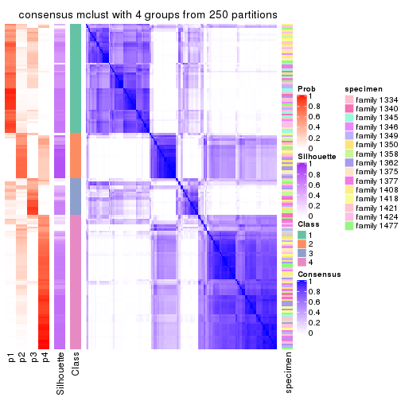</p>

</div>
<div id='tab-SD-mclust-consensus-heatmap-4'>
<pre><code class="r">consensus_heatmap(res, k = 5)
</code></pre>

<p></p>

</div>
<div id='tab-SD-mclust-consensus-heatmap-5'>
<pre><code class="r">consensus_heatmap(res, k = 6)
</code></pre>

<p></p>

</div>
</div>

Heatmaps for the membership of samples in all partitions to see how consistent they are:


<script>
$( function() {
	$( '#tabs-SD-mclust-membership-heatmap' ).tabs();
} );
</script>
<div id='tabs-SD-mclust-membership-heatmap'>
<ul>
<li><a href='#tab-SD-mclust-membership-heatmap-1'>k = 2</a></li>
<li><a href='#tab-SD-mclust-membership-heatmap-2'>k = 3</a></li>
<li><a href='#tab-SD-mclust-membership-heatmap-3'>k = 4</a></li>
<li><a href='#tab-SD-mclust-membership-heatmap-4'>k = 5</a></li>
<li><a href='#tab-SD-mclust-membership-heatmap-5'>k = 6</a></li>
</ul>
<div id='tab-SD-mclust-membership-heatmap-1'>
<pre><code class="r">membership_heatmap(res, k = 2)
</code></pre>

<p></p>

</div>
<div id='tab-SD-mclust-membership-heatmap-2'>
<pre><code class="r">membership_heatmap(res, k = 3)
</code></pre>

<p></p>

</div>
<div id='tab-SD-mclust-membership-heatmap-3'>
<pre><code class="r">membership_heatmap(res, k = 4)
</code></pre>

<p></p>

</div>
<div id='tab-SD-mclust-membership-heatmap-4'>
<pre><code class="r">membership_heatmap(res, k = 5)
</code></pre>

<p></p>

</div>
<div id='tab-SD-mclust-membership-heatmap-5'>
<pre><code class="r">membership_heatmap(res, k = 6)
</code></pre>

<p></p>

</div>
</div>

As soon as we have had the classes for columns, we can look for signatures
which are significantly different between classes which can be candidate marks
for certain classes. Following are the heatmaps for signatures.


Signature heatmaps where rows are scaled:


<script>
$( function() {
	$( '#tabs-SD-mclust-get-signatures' ).tabs();
} );
</script>
<div id='tabs-SD-mclust-get-signatures'>
<ul>
<li><a href='#tab-SD-mclust-get-signatures-1'>k = 2</a></li>
<li><a href='#tab-SD-mclust-get-signatures-2'>k = 3</a></li>
<li><a href='#tab-SD-mclust-get-signatures-3'>k = 4</a></li>
<li><a href='#tab-SD-mclust-get-signatures-4'>k = 5</a></li>
<li><a href='#tab-SD-mclust-get-signatures-5'>k = 6</a></li>
</ul>
<div id='tab-SD-mclust-get-signatures-1'>
<pre><code class="r">get_signatures(res, k = 2)
</code></pre>

<p></p>

</div>
<div id='tab-SD-mclust-get-signatures-2'>
<pre><code class="r">get_signatures(res, k = 3)
</code></pre>

<p></p>

</div>
<div id='tab-SD-mclust-get-signatures-3'>
<pre><code class="r">get_signatures(res, k = 4)
</code></pre>

<p></p>

</div>
<div id='tab-SD-mclust-get-signatures-4'>
<pre><code class="r">get_signatures(res, k = 5)
</code></pre>

<p>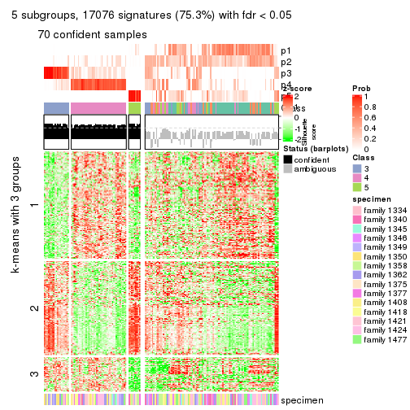</p>

</div>
<div id='tab-SD-mclust-get-signatures-5'>
<pre><code class="r">get_signatures(res, k = 6)
</code></pre>

<p></p>

</div>
</div>


Signature heatmaps where rows are not scaled:


<script>
$( function() {
	$( '#tabs-SD-mclust-get-signatures-no-scale' ).tabs();
} );
</script>
<div id='tabs-SD-mclust-get-signatures-no-scale'>
<ul>
<li><a href='#tab-SD-mclust-get-signatures-no-scale-1'>k = 2</a></li>
<li><a href='#tab-SD-mclust-get-signatures-no-scale-2'>k = 3</a></li>
<li><a href='#tab-SD-mclust-get-signatures-no-scale-3'>k = 4</a></li>
<li><a href='#tab-SD-mclust-get-signatures-no-scale-4'>k = 5</a></li>
<li><a href='#tab-SD-mclust-get-signatures-no-scale-5'>k = 6</a></li>
</ul>
<div id='tab-SD-mclust-get-signatures-no-scale-1'>
<pre><code class="r">get_signatures(res, k = 2, scale_rows = FALSE)
</code></pre>

<p></p>

</div>
<div id='tab-SD-mclust-get-signatures-no-scale-2'>
<pre><code class="r">get_signatures(res, k = 3, scale_rows = FALSE)
</code></pre>

<p></p>

</div>
<div id='tab-SD-mclust-get-signatures-no-scale-3'>
<pre><code class="r">get_signatures(res, k = 4, scale_rows = FALSE)
</code></pre>

<p></p>

</div>
<div id='tab-SD-mclust-get-signatures-no-scale-4'>
<pre><code class="r">get_signatures(res, k = 5, scale_rows = FALSE)
</code></pre>

<p></p>

</div>
<div id='tab-SD-mclust-get-signatures-no-scale-5'>
<pre><code class="r">get_signatures(res, k = 6, scale_rows = FALSE)
</code></pre>

<p></p>

</div>
</div>


Compare the overlap of signatures from different k:

```r
compare_signatures(res)
```


`get_signature()` returns a data frame invisibly. TO get the list of signatures, the function
call should be assigned to a variable explicitly. In following code, if `plot` argument is set
to `FALSE`, no heatmap is plotted while only the differential analysis is performed.

```r
# code only for demonstration
tb = get_signature(res, k = ..., plot = FALSE)
```

An example of the output of `tb` is:

```
#>   which_row         fdr    mean_1    mean_2 scaled_mean_1 scaled_mean_2 km
#> 1        38 0.042760348  8.373488  9.131774    -0.5533452     0.5164555  1
#> 2        40 0.018707592  7.106213  8.469186    -0.6173731     0.5762149  1
#> 3        55 0.019134737 10.221463 11.207825    -0.6159697     0.5749050  1
#> 4        59 0.006059896  5.921854  7.869574    -0.6899429     0.6439467  1
#> 5        60 0.018055526  8.928898 10.211722    -0.6204761     0.5791110  1
#> 6        98 0.009384629 15.714769 14.887706     0.6635654    -0.6193277  2
...
```

The columns in `tb` are:

1. `which_row`: row indices corresponding to the input matrix.
2. `fdr`: FDR for the differential test. 
3. `mean_x`: The mean value in group x.
4. `scaled_mean_x`: The mean value in group x after rows are scaled.
5. `km`: Row groups if k-means clustering is applied to rows.


UMAP plot which shows how samples are separated.


<script>
$( function() {
	$( '#tabs-SD-mclust-dimension-reduction' ).tabs();
} );
</script>
<div id='tabs-SD-mclust-dimension-reduction'>
<ul>
<li><a href='#tab-SD-mclust-dimension-reduction-1'>k = 2</a></li>
<li><a href='#tab-SD-mclust-dimension-reduction-2'>k = 3</a></li>
<li><a href='#tab-SD-mclust-dimension-reduction-3'>k = 4</a></li>
<li><a href='#tab-SD-mclust-dimension-reduction-4'>k = 5</a></li>
<li><a href='#tab-SD-mclust-dimension-reduction-5'>k = 6</a></li>
</ul>
<div id='tab-SD-mclust-dimension-reduction-1'>
<pre><code class="r">dimension_reduction(res, k = 2, method = &quot;UMAP&quot;)
</code></pre>

<p></p>

</div>
<div id='tab-SD-mclust-dimension-reduction-2'>
<pre><code class="r">dimension_reduction(res, k = 3, method = &quot;UMAP&quot;)
</code></pre>

<p>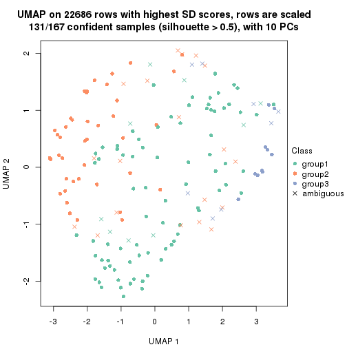</p>

</div>
<div id='tab-SD-mclust-dimension-reduction-3'>
<pre><code class="r">dimension_reduction(res, k = 4, method = &quot;UMAP&quot;)
</code></pre>

<p></p>

</div>
<div id='tab-SD-mclust-dimension-reduction-4'>
<pre><code class="r">dimension_reduction(res, k = 5, method = &quot;UMAP&quot;)
</code></pre>

<p></p>

</div>
<div id='tab-SD-mclust-dimension-reduction-5'>
<pre><code class="r">dimension_reduction(res, k = 6, method = &quot;UMAP&quot;)
</code></pre>

<p></p>

</div>
</div>


Following heatmap shows how subgroups are split when increasing `k`:

```r
collect_classes(res)
```


Test correlation between subgroups and known annotations. If the known
annotation is numeric, one-way ANOVA test is applied, and if the known
annotation is discrete, chi-squared contingency table test is applied.

```r
test_to_known_factors(res)
```

```
#>             n specimen(p) k
#> SD:mclust 159      0.0493 2
#> SD:mclust 131      0.0509 3
#> SD:mclust 132      0.0239 4
#> SD:mclust  70      0.0815 5
#> SD:mclust 118      0.0217 6
```


If matrix rows can be associated to genes, consider to use `GO_Enrichment(res,
...)` to perform function enrichment for the signature genes.


 

---------------------------------------------------


### SD:NMF


The object with results only for a single top-value method and a single partition method 
can be extracted as:

```r
res = res_list["SD", "NMF"]
# you can also extract it by
# res = res_list["SD:NMF"]
```

A summary of `res` and all the functions that can be applied to it:

```r
res
```

```
#> A 'ConsensusPartition' object with k = 2, 3, 4, 5, 6.
#>   On a matrix with 22686 rows and 167 columns.
#>   Top rows (1000, 2000, 3000, 4000, 5000) are extracted by 'SD' method.
#>   Subgroups are detected by 'NMF' method.
#>   Performed in total 1250 partitions by row resampling.
#>   Best k for subgroups seems to be 2.
#> 
#> Following methods can be applied to this 'ConsensusPartition' object:
#>  [1] "cola_report"             "collect_classes"         "collect_plots"          
#>  [4] "collect_stats"           "colnames"                "compare_signatures"     
#>  [7] "consensus_heatmap"       "dimension_reduction"     "functional_enrichment"  
#> [10] "get_anno_col"            "get_anno"                "get_classes"            
#> [13] "get_consensus"           "get_matrix"              "get_membership"         
#> [16] "get_param"               "get_signatures"          "get_stats"              
#> [19] "is_best_k"               "is_stable_k"             "membership_heatmap"     
#> [22] "ncol"                    "nrow"                    "plot_ecdf"              
#> [25] "rownames"                "select_partition_number" "show"                   
#> [28] "suggest_best_k"          "test_to_known_factors"
```

`collect_plots()` function collects all the plots made from `res` for all `k` (number of partitions)
into one single page to provide an easy and fast comparison between different `k`.

```r
collect_plots(res)
```


The plots are:

- The first row: a plot of the ECDF (Empirical cumulative distribution
  function) curves of the consensus matrix for each `k` and the heatmap of
  predicted classes for each `k`.
- The second row: heatmaps of the consensus matrix for each `k`.
- The third row: heatmaps of the membership matrix for each `k`.
- The fouth row: heatmaps of the signatures for each `k`.

All the plots in panels can be made by individual functions and they are
plotted later in this section.

`select_partition_number()` produces several plots showing different
statistics for choosing "optimized" `k`. There are following statistics:

- ECDF curves of the consensus matrix for each `k`;
- 1-PAC. [The PAC
  score](https://en.wikipedia.org/wiki/Consensus_clustering#Over-interpretation_potential_of_consensus_clustering)
  measures the proportion of the ambiguous subgrouping.
- Mean silhouette score.
- Concordance. The mean probability of fiting the consensus class ids in all
  partitions.
- Area increased. Denote $A_k$ as the area under the ECDF curve for current
  `k`, the area increased is defined as $A_k - A_{k-1}$.
- Rand index. The percent of pairs of samples that are both in a same cluster
  or both are not in a same cluster in the partition of k and k-1.
- Jaccard index. The ratio of pairs of samples are both in a same cluster in
  the partition of k and k-1 and the pairs of samples are both in a same
  cluster in the partition k or k-1.

The detailed explanations of these statistics can be found in [the cola
vignette](http://bioconductor.org/packages/devel/bioc/vignettes/cola/inst/doc/cola.html#toc_13).

Generally speaking, lower PAC score, higher mean silhouette score or higher
concordance corresponds to better partition. Rand index and Jaccard index
measure how similar the current partition is compared to partition with `k-1`.
If they are too similar, we won't accept `k` is better than `k-1`.

```r
select_partition_number(res)
```


The numeric values for all these statistics can be obtained by `get_stats()`.

```r
get_stats(res)
```

```
#>   k 1-PAC mean_silhouette concordance area_increased  Rand Jaccard
#> 2 2 0.454           0.733       0.869         0.4923 0.498   0.498
#> 3 3 0.440           0.442       0.719         0.3272 0.845   0.704
#> 4 4 0.461           0.323       0.657         0.0931 0.835   0.615
#> 5 5 0.538           0.379       0.679         0.0722 0.842   0.569
#> 6 6 0.610           0.517       0.726         0.0526 0.837   0.491
```

`suggest_best_k()` suggests the best $k$ based on these statistics. The rules are as follows:

- All $k$ with Jaccard index larger than 0.95 are removed because the increase of
  the partition number does not provides enough extra information. If all $k$ are removed,
  the best $k$ is assigned by `NA`.
- For $k$ with 1-PAC larger than 0.9, the maximal $k$ is taken as the "best k". Other $k$ is called "optional k".
- If it does not fit the second rule. The $k$ with the highest vote of highest
  1-PAC, mean silhouette and concordance is taken as the "best k".

```r
suggest_best_k(res)
```

```
#> [1] 2
```


Following shows the table of the partitions (You need to click the **show/hide
code output** link to see it). The membership matrix (columns with name `p*`)
is inferred by
[`clue::cl_consensus()`](https://www.rdocumentation.org/link/cl_consensus?package=clue)
function with the `SE` method. Basically the value in the membership matrix
represents the probability to belong to a certain group. The finall class
label for an item is determined with the group with highest probability it
belongs to.

In `get_classes()` function, the entropy is calculated from the membership
matrix and the silhouette score is calculated from the consensus matrix.


<script>
$( function() {
	$( '#tabs-SD-NMF-get-classes' ).tabs();
} );
</script>
<div id='tabs-SD-NMF-get-classes'>
<ul>
<li><a href='#tab-SD-NMF-get-classes-1'>k = 2</a></li>
<li><a href='#tab-SD-NMF-get-classes-2'>k = 3</a></li>
<li><a href='#tab-SD-NMF-get-classes-3'>k = 4</a></li>
<li><a href='#tab-SD-NMF-get-classes-4'>k = 5</a></li>
<li><a href='#tab-SD-NMF-get-classes-5'>k = 6</a></li>
</ul>

<div id='tab-SD-NMF-get-classes-1'>
<p><a id='tab-SD-NMF-get-classes-1-a' style='color:#0366d6' href='#'>show/hide code output</a></p>
<pre><code class="r">cbind(get_classes(res, k = 2), get_membership(res, k = 2))
</code></pre>

<pre><code>#&gt;          class entropy silhouette    p1    p2
#&gt; GSM30006     2  0.0000     0.7854 0.000 1.000
#&gt; GSM30007     1  0.0000     0.8889 1.000 0.000
#&gt; GSM30008     1  0.0000     0.8889 1.000 0.000
#&gt; GSM30009     1  0.0000     0.8889 1.000 0.000
#&gt; GSM30010     2  0.9460     0.2251 0.364 0.636
#&gt; GSM30011     2  0.0000     0.7854 0.000 1.000
#&gt; GSM30012     2  0.0000     0.7854 0.000 1.000
#&gt; GSM30013     2  0.0000     0.7854 0.000 1.000
#&gt; GSM30014     1  0.9710     0.4191 0.600 0.400
#&gt; GSM30015     1  0.0000     0.8889 1.000 0.000
#&gt; GSM30016     1  0.4161     0.8188 0.916 0.084
#&gt; GSM30017     1  0.0000     0.8889 1.000 0.000
#&gt; GSM30018     2  0.9710     0.5862 0.400 0.600
#&gt; GSM30019     2  0.0000     0.7854 0.000 1.000
#&gt; GSM30020     1  0.0000     0.8889 1.000 0.000
#&gt; GSM30021     1  0.6801     0.7227 0.820 0.180
#&gt; GSM30022     1  0.0000     0.8889 1.000 0.000
#&gt; GSM30023     2  0.9710     0.5862 0.400 0.600
#&gt; GSM30024     1  0.7219     0.7006 0.800 0.200
#&gt; GSM30025     1  0.0000     0.8889 1.000 0.000
#&gt; GSM30026     1  0.4690     0.7696 0.900 0.100
#&gt; GSM30027     1  0.0000     0.8889 1.000 0.000
#&gt; GSM30028     1  0.0000     0.8889 1.000 0.000
#&gt; GSM30029     1  0.0000     0.8889 1.000 0.000
#&gt; GSM30030     1  0.0000     0.8889 1.000 0.000
#&gt; GSM30031     1  0.0000     0.8889 1.000 0.000
#&gt; GSM30032     1  0.0000     0.8889 1.000 0.000
#&gt; GSM30033     1  0.8499     0.6140 0.724 0.276
#&gt; GSM30034     2  0.9393     0.6386 0.356 0.644
#&gt; GSM30035     1  0.0000     0.8889 1.000 0.000
#&gt; GSM30036     2  0.7219     0.7520 0.200 0.800
#&gt; GSM30037     1  0.0000     0.8889 1.000 0.000
#&gt; GSM30038     1  0.2948     0.8476 0.948 0.052
#&gt; GSM30039     2  0.0000     0.7854 0.000 1.000
#&gt; GSM30040     2  0.8081     0.5009 0.248 0.752
#&gt; GSM30041     2  0.0000     0.7854 0.000 1.000
#&gt; GSM30042     2  0.0000     0.7854 0.000 1.000
#&gt; GSM30043     1  0.9710     0.4191 0.600 0.400
#&gt; GSM30044     1  0.0000     0.8889 1.000 0.000
#&gt; GSM30045     1  0.0000     0.8889 1.000 0.000
#&gt; GSM30046     2  0.9608     0.6073 0.384 0.616
#&gt; GSM30047     2  0.7219     0.7520 0.200 0.800
#&gt; GSM30048     2  0.9710     0.5862 0.400 0.600
#&gt; GSM30049     2  0.0000     0.7854 0.000 1.000
#&gt; GSM30050     2  0.1633     0.7850 0.024 0.976
#&gt; GSM30051     2  0.0000     0.7854 0.000 1.000
#&gt; GSM30052     1  0.0000     0.8889 1.000 0.000
#&gt; GSM30053     2  0.0000     0.7854 0.000 1.000
#&gt; GSM30054     2  0.0000     0.7854 0.000 1.000
#&gt; GSM30055     2  0.0000     0.7854 0.000 1.000
#&gt; GSM30056     2  0.0000     0.7854 0.000 1.000
#&gt; GSM30057     1  0.9993     0.2362 0.516 0.484
#&gt; GSM30058     2  0.0000     0.7854 0.000 1.000
#&gt; GSM30059     2  0.9710     0.5862 0.400 0.600
#&gt; GSM30060     1  0.6343     0.7440 0.840 0.160
#&gt; GSM30061     2  0.7602     0.7420 0.220 0.780
#&gt; GSM30062     2  0.7219     0.7520 0.200 0.800
#&gt; GSM30063     2  0.0000     0.7854 0.000 1.000
#&gt; GSM30064     1  0.0000     0.8889 1.000 0.000
#&gt; GSM30065     2  0.0000     0.7854 0.000 1.000
#&gt; GSM30066     1  0.9686     0.4264 0.604 0.396
#&gt; GSM30067     1  0.0000     0.8889 1.000 0.000
#&gt; GSM30068     1  0.8608     0.6021 0.716 0.284
#&gt; GSM30069     1  0.8763     0.5858 0.704 0.296
#&gt; GSM30070     2  0.3274     0.7487 0.060 0.940
#&gt; GSM30071     2  0.5629     0.7701 0.132 0.868
#&gt; GSM30072     1  0.0000     0.8889 1.000 0.000
#&gt; GSM30073     2  0.7219     0.7520 0.200 0.800
#&gt; GSM30074     1  0.1414     0.8736 0.980 0.020
#&gt; GSM30075     2  0.1184     0.7854 0.016 0.984
#&gt; GSM30076     2  0.7219     0.7520 0.200 0.800
#&gt; GSM30077     2  0.8861     0.6866 0.304 0.696
#&gt; GSM30078     2  0.7376     0.7481 0.208 0.792
#&gt; GSM30079     1  0.0000     0.8889 1.000 0.000
#&gt; GSM30080     2  0.0000     0.7854 0.000 1.000
#&gt; GSM30081     2  0.0000     0.7854 0.000 1.000
#&gt; GSM30086     2  0.0672     0.7856 0.008 0.992
#&gt; GSM30087     2  0.9552     0.6168 0.376 0.624
#&gt; GSM30088     2  0.9710     0.5862 0.400 0.600
#&gt; GSM30089     1  0.0000     0.8889 1.000 0.000
#&gt; GSM30090     2  0.0000     0.7854 0.000 1.000
#&gt; GSM30091     2  0.0000     0.7854 0.000 1.000
#&gt; GSM30092     2  0.7219     0.7520 0.200 0.800
#&gt; GSM30093     2  0.0000     0.7854 0.000 1.000
#&gt; GSM30094     2  0.0000     0.7854 0.000 1.000
#&gt; GSM30095     1  0.9993     0.2365 0.516 0.484
#&gt; GSM30096     1  0.0000     0.8889 1.000 0.000
#&gt; GSM30097     2  0.9710     0.5862 0.400 0.600
#&gt; GSM30098     1  0.0000     0.8889 1.000 0.000
#&gt; GSM30099     2  0.0000     0.7854 0.000 1.000
#&gt; GSM30100     1  0.9580     0.4546 0.620 0.380
#&gt; GSM30101     2  0.0000     0.7854 0.000 1.000
#&gt; GSM30102     2  0.0000     0.7854 0.000 1.000
#&gt; GSM30103     1  0.0000     0.8889 1.000 0.000
#&gt; GSM30104     2  0.5629     0.7703 0.132 0.868
#&gt; GSM30105     1  0.0000     0.8889 1.000 0.000
#&gt; GSM30106     2  0.9710     0.5862 0.400 0.600
#&gt; GSM30107     2  0.8861     0.6868 0.304 0.696
#&gt; GSM30108     1  0.0000     0.8889 1.000 0.000
#&gt; GSM30109     1  0.0000     0.8889 1.000 0.000
#&gt; GSM30110     2  0.9710     0.5862 0.400 0.600
#&gt; GSM30111     1  0.0000     0.8889 1.000 0.000
#&gt; GSM30112     1  0.0000     0.8889 1.000 0.000
#&gt; GSM30113     2  0.9993    -0.1647 0.484 0.516
#&gt; GSM30114     2  0.0000     0.7854 0.000 1.000
#&gt; GSM30115     2  0.9129     0.6657 0.328 0.672
#&gt; GSM30116     1  0.8207     0.6382 0.744 0.256
#&gt; GSM30117     1  0.0000     0.8889 1.000 0.000
#&gt; GSM30118     1  0.0000     0.8889 1.000 0.000
#&gt; GSM30119     2  0.0000     0.7854 0.000 1.000
#&gt; GSM30120     2  0.9754     0.5727 0.408 0.592
#&gt; GSM30121     1  0.0000     0.8889 1.000 0.000
#&gt; GSM30122     1  0.0000     0.8889 1.000 0.000
#&gt; GSM30123     2  0.0000     0.7854 0.000 1.000
#&gt; GSM30177     2  0.0000     0.7854 0.000 1.000
#&gt; GSM30178     2  0.7219     0.7520 0.200 0.800
#&gt; GSM30179     1  0.0000     0.8889 1.000 0.000
#&gt; GSM30180     1  0.0000     0.8889 1.000 0.000
#&gt; GSM30181     2  0.8016     0.7281 0.244 0.756
#&gt; GSM30182     2  0.8955     0.6801 0.312 0.688
#&gt; GSM30183     1  0.0000     0.8889 1.000 0.000
#&gt; GSM30184     2  0.0000     0.7854 0.000 1.000
#&gt; GSM30185     1  0.0000     0.8889 1.000 0.000
#&gt; GSM30186     2  0.4939     0.7093 0.108 0.892
#&gt; GSM30187     2  0.7219     0.7520 0.200 0.800
#&gt; GSM30188     2  0.9635     0.6023 0.388 0.612
#&gt; GSM30189     2  0.9732     0.5797 0.404 0.596
#&gt; GSM30190     2  0.0000     0.7854 0.000 1.000
#&gt; GSM30191     2  0.6531     0.7616 0.168 0.832
#&gt; GSM30192     2  0.2948     0.7825 0.052 0.948
#&gt; GSM30193     2  0.8909     0.6834 0.308 0.692
#&gt; GSM30194     2  0.0000     0.7854 0.000 1.000
#&gt; GSM30195     1  0.0376     0.8851 0.996 0.004
#&gt; GSM30196     1  0.0000     0.8889 1.000 0.000
#&gt; GSM30197     2  0.9460     0.6302 0.364 0.636
#&gt; GSM30198     1  0.9552     0.0741 0.624 0.376
#&gt; GSM30199     1  0.0000     0.8889 1.000 0.000
#&gt; GSM30200     1  0.9996    -0.3410 0.512 0.488
#&gt; GSM30201     2  0.9710     0.5862 0.400 0.600
#&gt; GSM30202     1  0.0000     0.8889 1.000 0.000
#&gt; GSM30203     2  0.7219     0.7520 0.200 0.800
#&gt; GSM30204     1  0.9000     0.2905 0.684 0.316
#&gt; GSM30205     1  0.7056     0.7095 0.808 0.192
#&gt; GSM30206     2  0.9710     0.5862 0.400 0.600
#&gt; GSM30207     2  0.9944     0.4746 0.456 0.544
#&gt; GSM30208     1  0.9686    -0.0106 0.604 0.396
#&gt; GSM30209     2  0.9044     0.3507 0.320 0.680
#&gt; GSM30210     1  0.0000     0.8889 1.000 0.000
#&gt; GSM30211     2  0.9710     0.5862 0.400 0.600
#&gt; GSM30212     1  0.0000     0.8889 1.000 0.000
#&gt; GSM30213     1  0.0000     0.8889 1.000 0.000
#&gt; GSM30214     1  0.0000     0.8889 1.000 0.000
#&gt; GSM30215     1  0.0000     0.8889 1.000 0.000
#&gt; GSM30216     1  0.0000     0.8889 1.000 0.000
#&gt; GSM30217     1  0.0000     0.8889 1.000 0.000
#&gt; GSM30218     2  0.9686     0.5922 0.396 0.604
#&gt; GSM30219     1  0.9552     0.4616 0.624 0.376
#&gt; GSM30220     1  0.0000     0.8889 1.000 0.000
#&gt; GSM30221     2  0.9491     0.6260 0.368 0.632
#&gt; GSM30222     2  0.9635     0.6023 0.388 0.612
#&gt; GSM30223     1  0.0000     0.8889 1.000 0.000
#&gt; GSM30224     2  0.9710     0.5862 0.400 0.600
#&gt; GSM30225     1  0.0000     0.8889 1.000 0.000
#&gt; GSM30226     1  0.0000     0.8889 1.000 0.000
#&gt; GSM30227     1  0.0000     0.8889 1.000 0.000
#&gt; GSM30228     2  0.0000     0.7854 0.000 1.000
#&gt; GSM30229     2  0.0672     0.7856 0.008 0.992
</code></pre>

<script>
$('#tab-SD-NMF-get-classes-1-a').parent().next().next().hide();
$('#tab-SD-NMF-get-classes-1-a').click(function(){
  $('#tab-SD-NMF-get-classes-1-a').parent().next().next().toggle();
  return(false);
});
</script>
</div>

<div id='tab-SD-NMF-get-classes-2'>
<p><a id='tab-SD-NMF-get-classes-2-a' style='color:#0366d6' href='#'>show/hide code output</a></p>
<pre><code class="r">cbind(get_classes(res, k = 3), get_membership(res, k = 3))
</code></pre>

<pre><code>#&gt;          class entropy silhouette    p1    p2    p3
#&gt; GSM30006     1  0.6260    0.13855 0.552 0.000 0.448
#&gt; GSM30007     2  0.0424    0.65912 0.000 0.992 0.008
#&gt; GSM30008     2  0.7627    0.48264 0.044 0.528 0.428
#&gt; GSM30009     2  0.1411    0.66994 0.000 0.964 0.036
#&gt; GSM30010     3  0.7278    0.24725 0.028 0.456 0.516
#&gt; GSM30011     1  0.6307    0.05611 0.512 0.000 0.488
#&gt; GSM30012     1  0.2448    0.63026 0.924 0.000 0.076
#&gt; GSM30013     1  0.1529    0.64935 0.960 0.000 0.040
#&gt; GSM30014     3  0.6204    0.12042 0.000 0.424 0.576
#&gt; GSM30015     3  0.9737   -0.25567 0.224 0.384 0.392
#&gt; GSM30016     2  0.4589    0.49438 0.008 0.820 0.172
#&gt; GSM30017     3  0.9541   -0.26488 0.192 0.384 0.424
#&gt; GSM30018     1  0.3682    0.64877 0.876 0.008 0.116
#&gt; GSM30019     1  0.4235    0.54827 0.824 0.000 0.176
#&gt; GSM30020     2  0.7420    0.50451 0.036 0.544 0.420
#&gt; GSM30021     2  0.2796    0.62175 0.000 0.908 0.092
#&gt; GSM30022     2  0.3500    0.67679 0.004 0.880 0.116
#&gt; GSM30023     1  0.7368    0.41479 0.604 0.044 0.352
#&gt; GSM30024     2  0.5363    0.29306 0.000 0.724 0.276
#&gt; GSM30025     2  0.2796    0.63925 0.000 0.908 0.092
#&gt; GSM30026     3  0.9582   -0.11483 0.256 0.264 0.480
#&gt; GSM30027     2  0.4834    0.63338 0.004 0.792 0.204
#&gt; GSM30028     2  0.6108    0.60637 0.028 0.732 0.240
#&gt; GSM30029     2  0.7757    0.48875 0.052 0.540 0.408
#&gt; GSM30030     2  0.5070    0.64422 0.004 0.772 0.224
#&gt; GSM30031     2  0.7069    0.52570 0.024 0.568 0.408
#&gt; GSM30032     2  0.3500    0.62711 0.004 0.880 0.116
#&gt; GSM30033     3  0.6309    0.03488 0.000 0.496 0.504
#&gt; GSM30034     1  0.2383    0.66659 0.940 0.016 0.044
#&gt; GSM30035     2  0.4700    0.65464 0.008 0.812 0.180
#&gt; GSM30036     1  0.0424    0.66240 0.992 0.000 0.008
#&gt; GSM30037     2  0.0237    0.65921 0.000 0.996 0.004
#&gt; GSM30038     2  0.4063    0.57237 0.020 0.868 0.112
#&gt; GSM30039     1  0.2625    0.62635 0.916 0.000 0.084
#&gt; GSM30040     3  0.7475    0.30749 0.044 0.376 0.580
#&gt; GSM30041     1  0.6309    0.02607 0.500 0.000 0.500
#&gt; GSM30042     1  0.6215    0.18887 0.572 0.000 0.428
#&gt; GSM30043     2  0.6307   -0.20047 0.000 0.512 0.488
#&gt; GSM30044     2  0.1636    0.66903 0.016 0.964 0.020
#&gt; GSM30045     2  0.1015    0.66469 0.012 0.980 0.008
#&gt; GSM30046     1  0.3295    0.65588 0.896 0.008 0.096
#&gt; GSM30047     1  0.1289    0.65723 0.968 0.000 0.032
#&gt; GSM30048     1  0.5835    0.60215 0.784 0.052 0.164
#&gt; GSM30049     3  0.6520   -0.05872 0.488 0.004 0.508
#&gt; GSM30050     1  0.1031    0.65539 0.976 0.000 0.024
#&gt; GSM30051     1  0.6309    0.03642 0.504 0.000 0.496
#&gt; GSM30052     2  0.0237    0.66278 0.000 0.996 0.004
#&gt; GSM30053     1  0.2261    0.63624 0.932 0.000 0.068
#&gt; GSM30054     3  0.6309   -0.08225 0.500 0.000 0.500
#&gt; GSM30055     3  0.7622    0.18728 0.332 0.060 0.608
#&gt; GSM30056     1  0.6180    0.19541 0.584 0.000 0.416
#&gt; GSM30057     3  0.6215    0.20683 0.000 0.428 0.572
#&gt; GSM30058     1  0.6309    0.03642 0.504 0.000 0.496
#&gt; GSM30059     1  0.3618    0.65227 0.884 0.012 0.104
#&gt; GSM30060     2  0.2066    0.62273 0.000 0.940 0.060
#&gt; GSM30061     1  0.1525    0.66491 0.964 0.004 0.032
#&gt; GSM30062     1  0.4575    0.62138 0.812 0.004 0.184
#&gt; GSM30063     1  0.2066    0.63876 0.940 0.000 0.060
#&gt; GSM30064     2  0.1919    0.66635 0.020 0.956 0.024
#&gt; GSM30065     1  0.4842    0.49401 0.776 0.000 0.224
#&gt; GSM30066     2  0.6286   -0.05553 0.000 0.536 0.464
#&gt; GSM30067     2  0.6062    0.62567 0.016 0.708 0.276
#&gt; GSM30068     2  0.6235    0.00588 0.000 0.564 0.436
#&gt; GSM30069     2  0.6154   -0.02244 0.000 0.592 0.408
#&gt; GSM30070     3  0.9669    0.33133 0.212 0.380 0.408
#&gt; GSM30071     1  0.3349    0.64006 0.888 0.004 0.108
#&gt; GSM30072     2  0.0424    0.65785 0.000 0.992 0.008
#&gt; GSM30073     1  0.0000    0.66189 1.000 0.000 0.000
#&gt; GSM30074     2  0.5597    0.56453 0.020 0.764 0.216
#&gt; GSM30075     1  0.3192    0.63271 0.888 0.000 0.112
#&gt; GSM30076     1  0.0424    0.65999 0.992 0.000 0.008
#&gt; GSM30077     1  0.3918    0.64289 0.856 0.004 0.140
#&gt; GSM30078     1  0.2356    0.66370 0.928 0.000 0.072
#&gt; GSM30079     2  0.2301    0.67678 0.004 0.936 0.060
#&gt; GSM30080     1  0.1411    0.65942 0.964 0.000 0.036
#&gt; GSM30081     1  0.6308    0.04642 0.508 0.000 0.492
#&gt; GSM30086     1  0.2796    0.64259 0.908 0.000 0.092
#&gt; GSM30087     1  0.4233    0.62845 0.836 0.004 0.160
#&gt; GSM30088     1  0.5355    0.60683 0.800 0.032 0.168
#&gt; GSM30089     2  0.0747    0.65474 0.000 0.984 0.016
#&gt; GSM30090     1  0.6309    0.03642 0.504 0.000 0.496
#&gt; GSM30091     3  0.6309   -0.07276 0.496 0.000 0.504
#&gt; GSM30092     1  0.2448    0.66427 0.924 0.000 0.076
#&gt; GSM30093     1  0.4931    0.48272 0.768 0.000 0.232
#&gt; GSM30094     1  0.6307    0.04762 0.512 0.000 0.488
#&gt; GSM30095     3  0.6079    0.25742 0.000 0.388 0.612
#&gt; GSM30096     2  0.6633    0.52501 0.008 0.548 0.444
#&gt; GSM30097     1  0.6027    0.52152 0.712 0.016 0.272
#&gt; GSM30098     2  0.6318    0.57813 0.008 0.636 0.356
#&gt; GSM30099     3  0.7883    0.05330 0.428 0.056 0.516
#&gt; GSM30100     2  0.6225   -0.07798 0.000 0.568 0.432
#&gt; GSM30101     1  0.6280    0.11694 0.540 0.000 0.460
#&gt; GSM30102     1  0.6062    0.25227 0.616 0.000 0.384
#&gt; GSM30103     2  0.1031    0.66343 0.000 0.976 0.024
#&gt; GSM30104     1  0.0747    0.65805 0.984 0.000 0.016
#&gt; GSM30105     2  0.4353    0.66462 0.008 0.836 0.156
#&gt; GSM30106     1  0.6113    0.49601 0.688 0.012 0.300
#&gt; GSM30107     1  0.2116    0.66506 0.948 0.012 0.040
#&gt; GSM30108     2  0.0747    0.65474 0.000 0.984 0.016
#&gt; GSM30109     2  0.6931    0.58599 0.032 0.640 0.328
#&gt; GSM30110     1  0.7123    0.39159 0.604 0.032 0.364
#&gt; GSM30111     2  0.4830    0.64641 0.068 0.848 0.084
#&gt; GSM30112     2  0.2939    0.66907 0.012 0.916 0.072
#&gt; GSM30113     3  0.6302    0.20747 0.000 0.480 0.520
#&gt; GSM30114     1  0.0747    0.66188 0.984 0.000 0.016
#&gt; GSM30115     1  0.5378    0.56676 0.756 0.008 0.236
#&gt; GSM30116     2  0.6264    0.06292 0.004 0.616 0.380
#&gt; GSM30117     2  0.6180    0.59774 0.008 0.660 0.332
#&gt; GSM30118     2  0.6738    0.58335 0.020 0.624 0.356
#&gt; GSM30119     1  0.6305    0.06397 0.516 0.000 0.484
#&gt; GSM30120     1  0.7141    0.38538 0.600 0.032 0.368
#&gt; GSM30121     2  0.7228    0.55070 0.036 0.600 0.364
#&gt; GSM30122     2  0.6451    0.56105 0.008 0.608 0.384
#&gt; GSM30123     1  0.5363    0.55370 0.724 0.000 0.276
#&gt; GSM30177     1  0.4399    0.53520 0.812 0.000 0.188
#&gt; GSM30178     1  0.1964    0.66573 0.944 0.000 0.056
#&gt; GSM30179     2  0.8009    0.46467 0.064 0.524 0.412
#&gt; GSM30180     2  0.6359    0.57356 0.008 0.628 0.364
#&gt; GSM30181     1  0.5659    0.55501 0.740 0.012 0.248
#&gt; GSM30182     1  0.4629    0.60987 0.808 0.004 0.188
#&gt; GSM30183     2  0.8549    0.45058 0.100 0.516 0.384
#&gt; GSM30184     1  0.6309    0.03642 0.504 0.000 0.496
#&gt; GSM30185     2  0.6008    0.60183 0.004 0.664 0.332
#&gt; GSM30186     3  0.7042    0.32940 0.140 0.132 0.728
#&gt; GSM30187     1  0.0592    0.66305 0.988 0.000 0.012
#&gt; GSM30188     1  0.4110    0.63308 0.844 0.004 0.152
#&gt; GSM30189     1  0.8362    0.27674 0.528 0.088 0.384
#&gt; GSM30190     1  0.6260    0.13440 0.552 0.000 0.448
#&gt; GSM30191     1  0.1031    0.66569 0.976 0.000 0.024
#&gt; GSM30192     1  0.0237    0.66180 0.996 0.000 0.004
#&gt; GSM30193     1  0.4755    0.61254 0.808 0.008 0.184
#&gt; GSM30194     3  0.6309   -0.07276 0.496 0.000 0.504
#&gt; GSM30195     2  0.2793    0.64632 0.028 0.928 0.044
#&gt; GSM30196     2  0.1636    0.66461 0.020 0.964 0.016
#&gt; GSM30197     1  0.3755    0.64989 0.872 0.008 0.120
#&gt; GSM30198     1  0.9088    0.18246 0.464 0.140 0.396
#&gt; GSM30199     2  0.2796    0.67079 0.000 0.908 0.092
#&gt; GSM30200     1  0.8149    0.28820 0.520 0.072 0.408
#&gt; GSM30201     1  0.6044    0.59225 0.772 0.056 0.172
#&gt; GSM30202     2  0.8488    0.45708 0.096 0.520 0.384
#&gt; GSM30203     1  0.2625    0.66183 0.916 0.000 0.084
#&gt; GSM30204     1  0.9226    0.13230 0.436 0.152 0.412
#&gt; GSM30205     2  0.5948    0.29119 0.000 0.640 0.360
#&gt; GSM30206     1  0.7065    0.41148 0.616 0.032 0.352
#&gt; GSM30207     3  0.9599   -0.08437 0.388 0.200 0.412
#&gt; GSM30208     3  0.9730   -0.01487 0.352 0.228 0.420
#&gt; GSM30209     3  0.8619    0.30283 0.100 0.420 0.480
#&gt; GSM30210     2  0.6498    0.55040 0.008 0.596 0.396
#&gt; GSM30211     1  0.7379    0.38347 0.584 0.040 0.376
#&gt; GSM30212     2  0.1411    0.67277 0.000 0.964 0.036
#&gt; GSM30213     2  0.3482    0.67577 0.000 0.872 0.128
#&gt; GSM30214     2  0.5016    0.64800 0.000 0.760 0.240
#&gt; GSM30215     2  0.6809    0.50191 0.012 0.524 0.464
#&gt; GSM30216     2  0.6129    0.60225 0.008 0.668 0.324
#&gt; GSM30217     2  0.6168    0.54821 0.000 0.588 0.412
#&gt; GSM30218     1  0.8203    0.29834 0.616 0.268 0.116
#&gt; GSM30219     2  0.6308   -0.07817 0.000 0.508 0.492
#&gt; GSM30220     2  0.0592    0.66112 0.000 0.988 0.012
#&gt; GSM30221     1  0.3030    0.66170 0.904 0.004 0.092
#&gt; GSM30222     1  0.3459    0.65742 0.892 0.012 0.096
#&gt; GSM30223     2  0.3181    0.67248 0.024 0.912 0.064
#&gt; GSM30224     1  0.7851    0.41305 0.616 0.080 0.304
#&gt; GSM30225     3  0.9816   -0.02631 0.356 0.244 0.400
#&gt; GSM30226     2  0.4521    0.65683 0.004 0.816 0.180
#&gt; GSM30227     2  0.8887    0.41123 0.124 0.488 0.388
#&gt; GSM30228     1  0.6095    0.23915 0.608 0.000 0.392
#&gt; GSM30229     1  0.2711    0.62308 0.912 0.000 0.088
</code></pre>

<script>
$('#tab-SD-NMF-get-classes-2-a').parent().next().next().hide();
$('#tab-SD-NMF-get-classes-2-a').click(function(){
  $('#tab-SD-NMF-get-classes-2-a').parent().next().next().toggle();
  return(false);
});
</script>
</div>

<div id='tab-SD-NMF-get-classes-3'>
<p><a id='tab-SD-NMF-get-classes-3-a' style='color:#0366d6' href='#'>show/hide code output</a></p>
<pre><code class="r">cbind(get_classes(res, k = 4), get_membership(res, k = 4))
</code></pre>

<pre><code>#&gt;          class entropy silhouette    p1    p2    p3    p4
#&gt; GSM30006     4  0.6552    0.02917 0.000 0.076 0.440 0.484
#&gt; GSM30007     1  0.0188    0.57643 0.996 0.004 0.000 0.000
#&gt; GSM30008     3  0.8029   -0.24592 0.404 0.096 0.444 0.056
#&gt; GSM30009     1  0.2699    0.55784 0.904 0.028 0.068 0.000
#&gt; GSM30010     1  0.5325    0.18481 0.524 0.004 0.468 0.004
#&gt; GSM30011     3  0.6337   -0.02790 0.000 0.060 0.476 0.464
#&gt; GSM30012     4  0.1978    0.63569 0.000 0.004 0.068 0.928
#&gt; GSM30013     4  0.1474    0.64361 0.000 0.000 0.052 0.948
#&gt; GSM30014     3  0.5371   -0.11585 0.364 0.020 0.616 0.000
#&gt; GSM30015     2  0.8989    0.36944 0.252 0.448 0.084 0.216
#&gt; GSM30016     1  0.3873    0.47557 0.772 0.000 0.228 0.000
#&gt; GSM30017     3  0.8023   -0.10303 0.360 0.020 0.444 0.176
#&gt; GSM30018     4  0.2741    0.64448 0.012 0.000 0.096 0.892
#&gt; GSM30019     4  0.3668    0.52740 0.000 0.004 0.188 0.808
#&gt; GSM30020     1  0.6602    0.19722 0.496 0.040 0.444 0.020
#&gt; GSM30021     1  0.5160    0.49203 0.748 0.072 0.180 0.000
#&gt; GSM30022     1  0.3787    0.49770 0.840 0.124 0.036 0.000
#&gt; GSM30023     4  0.5657    0.23436 0.024 0.000 0.436 0.540
#&gt; GSM30024     1  0.4406    0.40557 0.700 0.000 0.300 0.000
#&gt; GSM30025     1  0.4507    0.46162 0.756 0.020 0.224 0.000
#&gt; GSM30026     3  0.9355   -0.08436 0.204 0.124 0.416 0.256
#&gt; GSM30027     1  0.6828    0.25590 0.528 0.092 0.376 0.004
#&gt; GSM30028     1  0.6038    0.25652 0.548 0.012 0.416 0.024
#&gt; GSM30029     1  0.6931    0.17821 0.484 0.036 0.440 0.040
#&gt; GSM30030     1  0.6420    0.26178 0.640 0.228 0.132 0.000
#&gt; GSM30031     1  0.6599    0.20283 0.500 0.040 0.440 0.020
#&gt; GSM30032     1  0.7630    0.14710 0.428 0.208 0.364 0.000
#&gt; GSM30033     3  0.6439    0.12376 0.180 0.172 0.648 0.000
#&gt; GSM30034     4  0.4598    0.59472 0.004 0.160 0.044 0.792
#&gt; GSM30035     2  0.2443    0.38089 0.060 0.916 0.024 0.000
#&gt; GSM30036     4  0.3421    0.61454 0.000 0.088 0.044 0.868
#&gt; GSM30037     1  0.0927    0.57609 0.976 0.016 0.008 0.000
#&gt; GSM30038     1  0.3907    0.47278 0.768 0.000 0.232 0.000
#&gt; GSM30039     4  0.1867    0.63455 0.000 0.000 0.072 0.928
#&gt; GSM30040     3  0.6468   -0.05826 0.396 0.028 0.548 0.028
#&gt; GSM30041     3  0.5774   -0.00926 0.000 0.028 0.508 0.464
#&gt; GSM30042     4  0.4933    0.12801 0.000 0.000 0.432 0.568
#&gt; GSM30043     1  0.5161    0.18374 0.520 0.004 0.476 0.000
#&gt; GSM30044     1  0.1059    0.57553 0.972 0.012 0.016 0.000
#&gt; GSM30045     1  0.0336    0.57576 0.992 0.000 0.008 0.000
#&gt; GSM30046     4  0.2149    0.65172 0.000 0.000 0.088 0.912
#&gt; GSM30047     4  0.3894    0.61769 0.000 0.068 0.088 0.844
#&gt; GSM30048     4  0.5025    0.51027 0.032 0.000 0.252 0.716
#&gt; GSM30049     3  0.6445   -0.00368 0.000 0.068 0.488 0.444
#&gt; GSM30050     4  0.2660    0.63347 0.000 0.056 0.036 0.908
#&gt; GSM30051     4  0.6452   -0.01348 0.000 0.068 0.464 0.468
#&gt; GSM30052     1  0.1118    0.57143 0.964 0.036 0.000 0.000
#&gt; GSM30053     4  0.1302    0.64618 0.000 0.000 0.044 0.956
#&gt; GSM30054     4  0.6755   -0.01205 0.000 0.092 0.452 0.456
#&gt; GSM30055     3  0.5132    0.23570 0.032 0.072 0.796 0.100
#&gt; GSM30056     4  0.7563    0.15396 0.000 0.280 0.236 0.484
#&gt; GSM30057     3  0.7528   -0.06804 0.312 0.184 0.500 0.004
#&gt; GSM30058     3  0.6452   -0.03501 0.000 0.068 0.468 0.464
#&gt; GSM30059     4  0.5720    0.56132 0.032 0.048 0.184 0.736
#&gt; GSM30060     1  0.2363    0.57311 0.920 0.024 0.056 0.000
#&gt; GSM30061     4  0.2868    0.61878 0.000 0.000 0.136 0.864
#&gt; GSM30062     4  0.4776    0.35582 0.000 0.000 0.376 0.624
#&gt; GSM30063     4  0.1978    0.63663 0.000 0.004 0.068 0.928
#&gt; GSM30064     1  0.1474    0.57494 0.948 0.000 0.052 0.000
#&gt; GSM30065     4  0.3852    0.52929 0.000 0.008 0.192 0.800
#&gt; GSM30066     1  0.6683    0.23396 0.496 0.088 0.416 0.000
#&gt; GSM30067     1  0.6549   -0.16200 0.488 0.436 0.076 0.000
#&gt; GSM30068     1  0.6028    0.32672 0.584 0.052 0.364 0.000
#&gt; GSM30069     1  0.5125    0.30072 0.604 0.008 0.388 0.000
#&gt; GSM30070     1  0.4936    0.30962 0.624 0.000 0.372 0.004
#&gt; GSM30071     4  0.5172    0.35927 0.008 0.000 0.404 0.588
#&gt; GSM30072     1  0.0000    0.57632 1.000 0.000 0.000 0.000
#&gt; GSM30073     4  0.0336    0.65437 0.000 0.000 0.008 0.992
#&gt; GSM30074     1  0.4972    0.38270 0.544 0.000 0.456 0.000
#&gt; GSM30075     4  0.4072    0.50897 0.000 0.000 0.252 0.748
#&gt; GSM30076     4  0.0000    0.65542 0.000 0.000 0.000 1.000
#&gt; GSM30077     4  0.3528    0.59732 0.000 0.000 0.192 0.808
#&gt; GSM30078     4  0.1867    0.65598 0.000 0.000 0.072 0.928
#&gt; GSM30079     1  0.2984    0.53556 0.888 0.084 0.028 0.000
#&gt; GSM30080     4  0.0707    0.65790 0.000 0.000 0.020 0.980
#&gt; GSM30081     3  0.6080   -0.02270 0.000 0.044 0.488 0.468
#&gt; GSM30086     4  0.3024    0.60521 0.000 0.000 0.148 0.852
#&gt; GSM30087     4  0.2408    0.64653 0.000 0.000 0.104 0.896
#&gt; GSM30088     4  0.3301    0.64034 0.020 0.012 0.088 0.880
#&gt; GSM30089     1  0.1211    0.57356 0.960 0.000 0.040 0.000
#&gt; GSM30090     4  0.6844   -0.00513 0.000 0.100 0.444 0.456
#&gt; GSM30091     3  0.5856   -0.01051 0.000 0.032 0.504 0.464
#&gt; GSM30092     4  0.3757    0.62916 0.000 0.020 0.152 0.828
#&gt; GSM30093     4  0.6267    0.41231 0.000 0.148 0.188 0.664
#&gt; GSM30094     4  0.7284   -0.01306 0.000 0.148 0.424 0.428
#&gt; GSM30095     3  0.4706    0.07887 0.248 0.020 0.732 0.000
#&gt; GSM30096     2  0.6999    0.26505 0.396 0.504 0.092 0.008
#&gt; GSM30097     4  0.5788    0.56032 0.008 0.148 0.116 0.728
#&gt; GSM30098     2  0.6653    0.21145 0.436 0.480 0.084 0.000
#&gt; GSM30099     2  0.7784   -0.23414 0.004 0.416 0.204 0.376
#&gt; GSM30100     1  0.4855    0.28207 0.600 0.000 0.400 0.000
#&gt; GSM30101     3  0.6082   -0.03922 0.000 0.044 0.480 0.476
#&gt; GSM30102     4  0.6324    0.24073 0.000 0.076 0.340 0.584
#&gt; GSM30103     1  0.3836    0.49639 0.816 0.168 0.016 0.000
#&gt; GSM30104     4  0.3071    0.62237 0.000 0.068 0.044 0.888
#&gt; GSM30105     1  0.5220    0.45003 0.772 0.104 0.116 0.008
#&gt; GSM30106     4  0.5270    0.53769 0.008 0.044 0.212 0.736
#&gt; GSM30107     4  0.3123    0.60954 0.000 0.000 0.156 0.844
#&gt; GSM30108     1  0.1211    0.57144 0.960 0.000 0.040 0.000
#&gt; GSM30109     1  0.7025   -0.14926 0.500 0.404 0.084 0.012
#&gt; GSM30110     4  0.7092   -0.00597 0.016 0.416 0.080 0.488
#&gt; GSM30111     1  0.3266    0.52704 0.876 0.000 0.040 0.084
#&gt; GSM30112     1  0.3450    0.49184 0.836 0.156 0.008 0.000
#&gt; GSM30113     1  0.4977    0.20030 0.540 0.000 0.460 0.000
#&gt; GSM30114     4  0.0336    0.65554 0.000 0.000 0.008 0.992
#&gt; GSM30115     4  0.3796    0.62393 0.000 0.056 0.096 0.848
#&gt; GSM30116     2  0.6454    0.01430 0.344 0.572 0.084 0.000
#&gt; GSM30117     2  0.1629    0.38512 0.024 0.952 0.024 0.000
#&gt; GSM30118     1  0.7343   -0.07757 0.424 0.420 0.156 0.000
#&gt; GSM30119     4  0.5399    0.04378 0.012 0.000 0.468 0.520
#&gt; GSM30120     4  0.6873    0.08364 0.008 0.384 0.084 0.524
#&gt; GSM30121     2  0.7206    0.19661 0.448 0.452 0.080 0.020
#&gt; GSM30122     2  0.5599    0.35853 0.288 0.664 0.048 0.000
#&gt; GSM30123     2  0.6503   -0.17474 0.000 0.480 0.072 0.448
#&gt; GSM30177     4  0.6078    0.44336 0.000 0.164 0.152 0.684
#&gt; GSM30178     4  0.1677    0.66033 0.000 0.012 0.040 0.948
#&gt; GSM30179     3  0.8491   -0.20493 0.364 0.136 0.436 0.064
#&gt; GSM30180     2  0.6602    0.20938 0.436 0.484 0.080 0.000
#&gt; GSM30181     4  0.4344    0.59609 0.000 0.108 0.076 0.816
#&gt; GSM30182     4  0.3732    0.62640 0.000 0.056 0.092 0.852
#&gt; GSM30183     2  0.8314    0.31896 0.364 0.460 0.084 0.092
#&gt; GSM30184     4  0.6507   -0.01709 0.000 0.072 0.464 0.464
#&gt; GSM30185     2  0.5548    0.31571 0.340 0.628 0.032 0.000
#&gt; GSM30186     2  0.2384    0.34209 0.004 0.916 0.072 0.008
#&gt; GSM30187     4  0.0927    0.65486 0.000 0.016 0.008 0.976
#&gt; GSM30188     4  0.2915    0.64779 0.000 0.028 0.080 0.892
#&gt; GSM30189     2  0.8065    0.33522 0.088 0.540 0.088 0.284
#&gt; GSM30190     4  0.7021    0.05535 0.000 0.120 0.400 0.480
#&gt; GSM30191     4  0.3421    0.62705 0.000 0.088 0.044 0.868
#&gt; GSM30192     4  0.0469    0.65710 0.000 0.000 0.012 0.988
#&gt; GSM30193     4  0.2466    0.64806 0.000 0.004 0.096 0.900
#&gt; GSM30194     3  0.5378    0.02020 0.012 0.000 0.540 0.448
#&gt; GSM30195     1  0.2958    0.53955 0.876 0.004 0.116 0.004
#&gt; GSM30196     1  0.0469    0.57749 0.988 0.000 0.012 0.000
#&gt; GSM30197     4  0.3764    0.57423 0.000 0.000 0.216 0.784
#&gt; GSM30198     3  0.7526   -0.00117 0.160 0.004 0.440 0.396
#&gt; GSM30199     1  0.5057    0.23732 0.648 0.340 0.012 0.000
#&gt; GSM30200     4  0.6615    0.17511 0.036 0.024 0.440 0.500
#&gt; GSM30201     4  0.5291    0.49323 0.032 0.004 0.264 0.700
#&gt; GSM30202     2  0.8400    0.35782 0.316 0.488 0.076 0.120
#&gt; GSM30203     4  0.1743    0.65853 0.000 0.004 0.056 0.940
#&gt; GSM30204     3  0.7368   -0.07952 0.112 0.012 0.444 0.432
#&gt; GSM30205     3  0.5213   -0.13932 0.328 0.020 0.652 0.000
#&gt; GSM30206     4  0.8150    0.09396 0.040 0.320 0.152 0.488
#&gt; GSM30207     3  0.9024   -0.02412 0.124 0.136 0.444 0.296
#&gt; GSM30208     3  0.9173   -0.04734 0.176 0.116 0.436 0.272
#&gt; GSM30209     2  0.8542    0.04686 0.296 0.492 0.116 0.096
#&gt; GSM30210     1  0.7211    0.12476 0.444 0.120 0.432 0.004
#&gt; GSM30211     4  0.6584    0.22176 0.024 0.036 0.416 0.524
#&gt; GSM30212     1  0.3754    0.52923 0.852 0.084 0.064 0.000
#&gt; GSM30213     1  0.5249    0.32475 0.708 0.248 0.044 0.000
#&gt; GSM30214     1  0.7722    0.07077 0.444 0.256 0.300 0.000
#&gt; GSM30215     3  0.7909   -0.30459 0.340 0.304 0.356 0.000
#&gt; GSM30216     1  0.6555   -0.18594 0.480 0.444 0.076 0.000
#&gt; GSM30217     1  0.7399    0.10350 0.420 0.164 0.416 0.000
#&gt; GSM30218     2  0.7012   -0.14766 0.012 0.528 0.088 0.372
#&gt; GSM30219     2  0.6602    0.06832 0.080 0.484 0.436 0.000
#&gt; GSM30220     1  0.0927    0.57609 0.976 0.016 0.008 0.000
#&gt; GSM30221     4  0.1389    0.65900 0.000 0.000 0.048 0.952
#&gt; GSM30222     4  0.1661    0.65716 0.004 0.000 0.052 0.944
#&gt; GSM30223     1  0.1488    0.56828 0.956 0.012 0.032 0.000
#&gt; GSM30224     4  0.8158    0.29202 0.088 0.100 0.272 0.540
#&gt; GSM30225     2  0.8942    0.37036 0.184 0.452 0.088 0.276
#&gt; GSM30226     2  0.4933    0.31998 0.296 0.688 0.016 0.000
#&gt; GSM30227     2  0.8744    0.29644 0.380 0.404 0.092 0.124
#&gt; GSM30228     4  0.6275    0.26374 0.000 0.076 0.328 0.596
#&gt; GSM30229     4  0.2676    0.62313 0.000 0.012 0.092 0.896
</code></pre>

<script>
$('#tab-SD-NMF-get-classes-3-a').parent().next().next().hide();
$('#tab-SD-NMF-get-classes-3-a').click(function(){
  $('#tab-SD-NMF-get-classes-3-a').parent().next().next().toggle();
  return(false);
});
</script>
</div>

<div id='tab-SD-NMF-get-classes-4'>
<p><a id='tab-SD-NMF-get-classes-4-a' style='color:#0366d6' href='#'>show/hide code output</a></p>
<pre><code class="r">cbind(get_classes(res, k = 5), get_membership(res, k = 5))
</code></pre>

<pre><code>#&gt;          class entropy silhouette    p1    p2    p3    p4    p5
#&gt; GSM30006     4  0.5578    0.39761 0.000 0.112 0.272 0.616 0.000
#&gt; GSM30007     5  0.2880    0.47818 0.108 0.004 0.020 0.000 0.868
#&gt; GSM30008     3  0.6614   -0.15416 0.132 0.004 0.472 0.012 0.380
#&gt; GSM30009     5  0.2206    0.47724 0.016 0.004 0.068 0.000 0.912
#&gt; GSM30010     3  0.6369   -0.03767 0.012 0.124 0.504 0.000 0.360
#&gt; GSM30011     4  0.6313    0.13344 0.008 0.120 0.416 0.456 0.000
#&gt; GSM30012     4  0.2331    0.68132 0.000 0.080 0.020 0.900 0.000
#&gt; GSM30013     4  0.0693    0.69062 0.000 0.008 0.012 0.980 0.000
#&gt; GSM30014     3  0.5764   -0.03494 0.040 0.124 0.688 0.000 0.148
#&gt; GSM30015     1  0.1808    0.75035 0.936 0.044 0.008 0.012 0.000
#&gt; GSM30016     5  0.4865    0.22670 0.032 0.004 0.324 0.000 0.640
#&gt; GSM30017     5  0.5051    0.15934 0.004 0.000 0.484 0.024 0.488
#&gt; GSM30018     4  0.2060    0.68738 0.052 0.008 0.016 0.924 0.000
#&gt; GSM30019     4  0.1956    0.67534 0.000 0.008 0.076 0.916 0.000
#&gt; GSM30020     5  0.5179    0.18190 0.020 0.000 0.472 0.012 0.496
#&gt; GSM30021     5  0.7720   -0.12319 0.360 0.064 0.216 0.000 0.360
#&gt; GSM30022     1  0.4866    0.49102 0.620 0.036 0.000 0.000 0.344
#&gt; GSM30023     3  0.5888   -0.15275 0.004 0.004 0.472 0.072 0.448
#&gt; GSM30024     5  0.4812    0.22999 0.004 0.032 0.312 0.000 0.652
#&gt; GSM30025     5  0.4358    0.33612 0.008 0.012 0.284 0.000 0.696
#&gt; GSM30026     3  0.7282   -0.06359 0.380 0.004 0.436 0.124 0.056
#&gt; GSM30027     5  0.4798    0.18838 0.012 0.004 0.472 0.000 0.512
#&gt; GSM30028     5  0.4944    0.17854 0.004 0.004 0.472 0.012 0.508
#&gt; GSM30029     5  0.5000    0.17244 0.008 0.000 0.476 0.016 0.500
#&gt; GSM30030     5  0.6643    0.29688 0.308 0.060 0.084 0.000 0.548
#&gt; GSM30031     5  0.4702    0.18696 0.008 0.004 0.476 0.000 0.512
#&gt; GSM30032     5  0.5042    0.19138 0.004 0.024 0.460 0.000 0.512
#&gt; GSM30033     5  0.6561    0.16489 0.012 0.140 0.420 0.000 0.428
#&gt; GSM30034     4  0.2825    0.67172 0.016 0.124 0.000 0.860 0.000
#&gt; GSM30035     1  0.3786    0.67608 0.776 0.204 0.004 0.000 0.016
#&gt; GSM30036     4  0.2448    0.68191 0.020 0.088 0.000 0.892 0.000
#&gt; GSM30037     5  0.2196    0.49778 0.056 0.004 0.024 0.000 0.916
#&gt; GSM30038     5  0.4405    0.28652 0.020 0.004 0.280 0.000 0.696
#&gt; GSM30039     4  0.0898    0.68951 0.000 0.008 0.020 0.972 0.000
#&gt; GSM30040     3  0.6648   -0.12198 0.000 0.268 0.504 0.008 0.220
#&gt; GSM30041     4  0.5990    0.20918 0.000 0.116 0.384 0.500 0.000
#&gt; GSM30042     4  0.4251    0.45995 0.000 0.012 0.316 0.672 0.000
#&gt; GSM30043     3  0.6787   -0.13232 0.024 0.324 0.496 0.000 0.156
#&gt; GSM30044     5  0.1638    0.49715 0.064 0.004 0.000 0.000 0.932
#&gt; GSM30045     5  0.3795    0.43655 0.184 0.004 0.024 0.000 0.788
#&gt; GSM30046     4  0.1538    0.69099 0.008 0.008 0.036 0.948 0.000
#&gt; GSM30047     4  0.6210    0.47487 0.000 0.032 0.200 0.628 0.140
#&gt; GSM30048     4  0.7001   -0.03573 0.004 0.004 0.252 0.384 0.356
#&gt; GSM30049     3  0.6814   -0.24435 0.000 0.288 0.436 0.272 0.004
#&gt; GSM30050     4  0.1731    0.68942 0.012 0.040 0.008 0.940 0.000
#&gt; GSM30051     4  0.6459    0.05883 0.000 0.180 0.400 0.420 0.000
#&gt; GSM30052     5  0.3300    0.49399 0.100 0.020 0.024 0.000 0.856
#&gt; GSM30053     4  0.0798    0.69057 0.000 0.008 0.016 0.976 0.000
#&gt; GSM30054     4  0.6494    0.11190 0.000 0.192 0.364 0.444 0.000
#&gt; GSM30055     3  0.5527   -0.20936 0.000 0.040 0.476 0.012 0.472
#&gt; GSM30056     4  0.5185    0.35075 0.004 0.376 0.040 0.580 0.000
#&gt; GSM30057     3  0.7484   -0.15628 0.108 0.280 0.508 0.008 0.096
#&gt; GSM30058     4  0.6434    0.09524 0.000 0.176 0.392 0.432 0.000
#&gt; GSM30059     4  0.5869    0.54746 0.020 0.024 0.184 0.688 0.084
#&gt; GSM30060     5  0.6215    0.28872 0.020 0.244 0.136 0.000 0.600
#&gt; GSM30061     4  0.6944    0.28203 0.004 0.024 0.284 0.512 0.176
#&gt; GSM30062     4  0.5538    0.22003 0.004 0.000 0.440 0.500 0.056
#&gt; GSM30063     4  0.0898    0.69143 0.000 0.020 0.008 0.972 0.000
#&gt; GSM30064     5  0.1628    0.47924 0.008 0.000 0.056 0.000 0.936
#&gt; GSM30065     4  0.2208    0.67430 0.000 0.020 0.072 0.908 0.000
#&gt; GSM30066     3  0.7484   -0.10912 0.076 0.264 0.484 0.000 0.176
#&gt; GSM30067     1  0.2797    0.74210 0.880 0.060 0.000 0.000 0.060
#&gt; GSM30068     3  0.7186   -0.05268 0.108 0.072 0.452 0.000 0.368
#&gt; GSM30069     5  0.5695    0.01532 0.040 0.020 0.464 0.000 0.476
#&gt; GSM30070     5  0.5824    0.06527 0.012 0.008 0.392 0.048 0.540
#&gt; GSM30071     4  0.5779    0.51858 0.000 0.016 0.160 0.660 0.164
#&gt; GSM30072     5  0.4037    0.44695 0.152 0.012 0.040 0.000 0.796
#&gt; GSM30073     4  0.0740    0.69177 0.008 0.008 0.004 0.980 0.000
#&gt; GSM30074     3  0.5708   -0.15101 0.044 0.020 0.528 0.000 0.408
#&gt; GSM30075     4  0.4941    0.47583 0.004 0.004 0.292 0.664 0.036
#&gt; GSM30076     4  0.0451    0.69163 0.000 0.004 0.008 0.988 0.000
#&gt; GSM30077     4  0.2921    0.65226 0.004 0.000 0.148 0.844 0.004
#&gt; GSM30078     4  0.3100    0.66132 0.004 0.008 0.128 0.852 0.008
#&gt; GSM30079     1  0.4972    0.31330 0.536 0.016 0.008 0.000 0.440
#&gt; GSM30080     4  0.2233    0.68011 0.000 0.004 0.104 0.892 0.000
#&gt; GSM30081     4  0.5794    0.24175 0.000 0.096 0.384 0.520 0.000
#&gt; GSM30086     4  0.2890    0.64814 0.000 0.004 0.160 0.836 0.000
#&gt; GSM30087     4  0.1750    0.69003 0.036 0.000 0.028 0.936 0.000
#&gt; GSM30088     4  0.3584    0.67243 0.076 0.008 0.036 0.856 0.024
#&gt; GSM30089     5  0.1026    0.48646 0.004 0.004 0.024 0.000 0.968
#&gt; GSM30090     4  0.6564    0.06267 0.000 0.204 0.376 0.420 0.000
#&gt; GSM30091     3  0.6219   -0.25731 0.000 0.140 0.436 0.424 0.000
#&gt; GSM30092     4  0.4322    0.56712 0.004 0.016 0.256 0.720 0.004
#&gt; GSM30093     4  0.3476    0.62212 0.000 0.176 0.020 0.804 0.000
#&gt; GSM30094     2  0.6595    0.27265 0.016 0.520 0.304 0.160 0.000
#&gt; GSM30095     3  0.5010   -0.11545 0.000 0.248 0.676 0.000 0.076
#&gt; GSM30096     1  0.3086    0.73472 0.876 0.060 0.048 0.000 0.016
#&gt; GSM30097     4  0.6084    0.49237 0.196 0.116 0.040 0.648 0.000
#&gt; GSM30098     1  0.1568    0.75193 0.944 0.036 0.000 0.000 0.020
#&gt; GSM30099     2  0.5477    0.44327 0.008 0.704 0.072 0.192 0.024
#&gt; GSM30100     5  0.5175    0.00438 0.000 0.040 0.464 0.000 0.496
#&gt; GSM30101     4  0.6946   -0.13772 0.004 0.304 0.332 0.360 0.000
#&gt; GSM30102     4  0.4848    0.55235 0.000 0.132 0.144 0.724 0.000
#&gt; GSM30103     1  0.6976    0.34408 0.484 0.132 0.044 0.000 0.340
#&gt; GSM30104     4  0.3209    0.68486 0.000 0.060 0.076 0.860 0.004
#&gt; GSM30105     5  0.6049    0.30857 0.284 0.060 0.032 0.008 0.616
#&gt; GSM30106     4  0.5015    0.62531 0.080 0.024 0.080 0.780 0.036
#&gt; GSM30107     4  0.5404    0.39841 0.000 0.000 0.088 0.620 0.292
#&gt; GSM30108     5  0.3248    0.47099 0.088 0.004 0.052 0.000 0.856
#&gt; GSM30109     1  0.2729    0.73859 0.884 0.028 0.004 0.000 0.084
#&gt; GSM30110     1  0.1942    0.72165 0.920 0.012 0.000 0.068 0.000
#&gt; GSM30111     5  0.4459    0.45436 0.064 0.040 0.020 0.060 0.816
#&gt; GSM30112     1  0.4880    0.55128 0.664 0.012 0.028 0.000 0.296
#&gt; GSM30113     3  0.5942   -0.03183 0.008 0.084 0.512 0.000 0.396
#&gt; GSM30114     4  0.0932    0.69299 0.020 0.004 0.004 0.972 0.000
#&gt; GSM30115     4  0.3562    0.59473 0.196 0.016 0.000 0.788 0.000
#&gt; GSM30116     2  0.5077    0.46029 0.040 0.748 0.084 0.000 0.128
#&gt; GSM30117     1  0.3796    0.59058 0.700 0.300 0.000 0.000 0.000
#&gt; GSM30118     1  0.3344    0.72811 0.852 0.104 0.016 0.000 0.028
#&gt; GSM30119     4  0.5845    0.14955 0.012 0.028 0.456 0.484 0.020
#&gt; GSM30120     1  0.3790    0.71043 0.840 0.076 0.012 0.064 0.008
#&gt; GSM30121     1  0.1914    0.75310 0.932 0.032 0.004 0.000 0.032
#&gt; GSM30122     1  0.1026    0.74832 0.968 0.024 0.004 0.000 0.004
#&gt; GSM30123     4  0.6859    0.13877 0.296 0.224 0.012 0.468 0.000
#&gt; GSM30177     4  0.3777    0.61100 0.004 0.192 0.020 0.784 0.000
#&gt; GSM30178     4  0.1965    0.68922 0.052 0.024 0.000 0.924 0.000
#&gt; GSM30179     3  0.7339   -0.16412 0.136 0.028 0.412 0.020 0.404
#&gt; GSM30180     1  0.1787    0.75409 0.936 0.044 0.004 0.000 0.016
#&gt; GSM30181     4  0.3527    0.62438 0.148 0.028 0.004 0.820 0.000
#&gt; GSM30182     4  0.2909    0.64296 0.140 0.012 0.000 0.848 0.000
#&gt; GSM30183     1  0.1569    0.75070 0.948 0.032 0.000 0.012 0.008
#&gt; GSM30184     4  0.6269    0.11104 0.000 0.148 0.408 0.444 0.000
#&gt; GSM30185     1  0.2074    0.75383 0.920 0.060 0.004 0.000 0.016
#&gt; GSM30186     2  0.4235    0.18258 0.336 0.656 0.000 0.008 0.000
#&gt; GSM30187     4  0.0771    0.69162 0.004 0.020 0.000 0.976 0.000
#&gt; GSM30188     4  0.3081    0.63271 0.156 0.012 0.000 0.832 0.000
#&gt; GSM30189     1  0.4141    0.61625 0.800 0.088 0.008 0.104 0.000
#&gt; GSM30190     4  0.6171    0.31642 0.000 0.204 0.240 0.556 0.000
#&gt; GSM30191     4  0.4013    0.66200 0.004 0.108 0.084 0.804 0.000
#&gt; GSM30192     4  0.0404    0.69164 0.000 0.000 0.012 0.988 0.000
#&gt; GSM30193     4  0.2363    0.68588 0.052 0.012 0.024 0.912 0.000
#&gt; GSM30194     3  0.6864   -0.23245 0.000 0.288 0.484 0.212 0.016
#&gt; GSM30195     5  0.7350    0.10425 0.232 0.020 0.252 0.016 0.480
#&gt; GSM30196     5  0.1430    0.49635 0.052 0.000 0.004 0.000 0.944
#&gt; GSM30197     4  0.3530    0.63437 0.008 0.004 0.168 0.812 0.008
#&gt; GSM30198     3  0.5836   -0.14891 0.004 0.000 0.468 0.080 0.448
#&gt; GSM30199     1  0.5687    0.61015 0.692 0.064 0.064 0.000 0.180
#&gt; GSM30200     3  0.7228   -0.05973 0.088 0.000 0.432 0.388 0.092
#&gt; GSM30201     4  0.4447    0.59879 0.000 0.008 0.080 0.772 0.140
#&gt; GSM30202     1  0.1557    0.75215 0.940 0.052 0.000 0.008 0.000
#&gt; GSM30203     4  0.2082    0.69637 0.024 0.032 0.016 0.928 0.000
#&gt; GSM30204     3  0.5885   -0.14757 0.004 0.004 0.480 0.072 0.440
#&gt; GSM30205     5  0.6169    0.19323 0.000 0.136 0.392 0.000 0.472
#&gt; GSM30206     1  0.6186    0.15132 0.544 0.048 0.040 0.364 0.004
#&gt; GSM30207     3  0.8105    0.00368 0.032 0.080 0.472 0.152 0.264
#&gt; GSM30208     3  0.7871   -0.05303 0.076 0.024 0.444 0.120 0.336
#&gt; GSM30209     2  0.5861    0.34047 0.008 0.580 0.012 0.060 0.340
#&gt; GSM30210     5  0.6671    0.19156 0.120 0.028 0.368 0.000 0.484
#&gt; GSM30211     4  0.7519    0.31444 0.124 0.032 0.276 0.520 0.048
#&gt; GSM30212     5  0.4800    0.46795 0.136 0.036 0.064 0.000 0.764
#&gt; GSM30213     1  0.5044    0.57178 0.672 0.044 0.012 0.000 0.272
#&gt; GSM30214     1  0.7622    0.11103 0.432 0.068 0.304 0.000 0.196
#&gt; GSM30215     3  0.8469   -0.09867 0.292 0.176 0.308 0.000 0.224
#&gt; GSM30216     1  0.1828    0.75420 0.936 0.028 0.004 0.000 0.032
#&gt; GSM30217     5  0.6034    0.16914 0.044 0.036 0.448 0.000 0.472
#&gt; GSM30218     2  0.7335    0.21788 0.020 0.540 0.092 0.076 0.272
#&gt; GSM30219     1  0.7359    0.08967 0.436 0.308 0.216 0.000 0.040
#&gt; GSM30220     5  0.1483    0.48805 0.012 0.008 0.028 0.000 0.952
#&gt; GSM30221     4  0.1701    0.69117 0.048 0.016 0.000 0.936 0.000
#&gt; GSM30222     4  0.1569    0.69140 0.008 0.004 0.044 0.944 0.000
#&gt; GSM30223     5  0.4419    0.16613 0.344 0.004 0.008 0.000 0.644
#&gt; GSM30224     4  0.7883    0.23134 0.084 0.036 0.324 0.464 0.092
#&gt; GSM30225     1  0.2429    0.74259 0.900 0.076 0.004 0.020 0.000
#&gt; GSM30226     1  0.4443    0.59122 0.680 0.300 0.008 0.000 0.012
#&gt; GSM30227     1  0.1706    0.75633 0.948 0.016 0.008 0.012 0.016
#&gt; GSM30228     4  0.3849    0.62354 0.000 0.112 0.080 0.808 0.000
#&gt; GSM30229     4  0.3318    0.63612 0.000 0.180 0.012 0.808 0.000
</code></pre>

<script>
$('#tab-SD-NMF-get-classes-4-a').parent().next().next().hide();
$('#tab-SD-NMF-get-classes-4-a').click(function(){
  $('#tab-SD-NMF-get-classes-4-a').parent().next().next().toggle();
  return(false);
});
</script>
</div>

<div id='tab-SD-NMF-get-classes-5'>
<p><a id='tab-SD-NMF-get-classes-5-a' style='color:#0366d6' href='#'>show/hide code output</a></p>
<pre><code class="r">cbind(get_classes(res, k = 6), get_membership(res, k = 6))
</code></pre>

<pre><code>#&gt;          class entropy silhouette    p1    p2    p3    p4    p5    p6
#&gt; GSM30006     4  0.2511    0.68840 0.000 0.000 0.056 0.880 0.064 0.000
#&gt; GSM30007     1  0.0291    0.76628 0.992 0.004 0.000 0.000 0.000 0.004
#&gt; GSM30008     6  0.1838    0.71568 0.012 0.040 0.020 0.000 0.000 0.928
#&gt; GSM30009     1  0.1616    0.75597 0.932 0.000 0.020 0.000 0.000 0.048
#&gt; GSM30010     5  0.3957    0.49580 0.140 0.048 0.020 0.004 0.788 0.000
#&gt; GSM30011     4  0.5655    0.51972 0.020 0.032 0.156 0.664 0.128 0.000
#&gt; GSM30012     4  0.4082    0.61953 0.000 0.048 0.000 0.740 0.204 0.008
#&gt; GSM30013     4  0.1410    0.71043 0.000 0.000 0.004 0.944 0.044 0.008
#&gt; GSM30014     5  0.5015    0.44045 0.004 0.092 0.032 0.000 0.704 0.168
#&gt; GSM30015     2  0.2630    0.68809 0.004 0.884 0.028 0.004 0.076 0.004
#&gt; GSM30016     1  0.1149    0.76408 0.960 0.008 0.008 0.000 0.024 0.000
#&gt; GSM30017     6  0.0748    0.71755 0.016 0.004 0.000 0.004 0.000 0.976
#&gt; GSM30018     4  0.2256    0.70963 0.020 0.020 0.016 0.920 0.008 0.016
#&gt; GSM30019     4  0.0891    0.71099 0.000 0.000 0.008 0.968 0.024 0.000
#&gt; GSM30020     6  0.0777    0.71495 0.024 0.004 0.000 0.000 0.000 0.972
#&gt; GSM30021     1  0.6160    0.28907 0.488 0.280 0.016 0.000 0.216 0.000
#&gt; GSM30022     1  0.5336    0.48613 0.616 0.248 0.124 0.000 0.012 0.000
#&gt; GSM30023     6  0.0993    0.71825 0.024 0.000 0.000 0.012 0.000 0.964
#&gt; GSM30024     1  0.3056    0.67417 0.820 0.000 0.012 0.000 0.160 0.008
#&gt; GSM30025     1  0.4339    0.41455 0.648 0.000 0.032 0.000 0.004 0.316
#&gt; GSM30026     6  0.3584    0.52897 0.000 0.244 0.004 0.012 0.000 0.740
#&gt; GSM30027     6  0.2979    0.64088 0.116 0.000 0.044 0.000 0.000 0.840
#&gt; GSM30028     6  0.1152    0.71161 0.044 0.000 0.004 0.000 0.000 0.952
#&gt; GSM30029     6  0.1812    0.69482 0.080 0.000 0.008 0.000 0.000 0.912
#&gt; GSM30030     1  0.7143    0.33852 0.528 0.196 0.116 0.000 0.032 0.128
#&gt; GSM30031     6  0.1080    0.71209 0.032 0.004 0.004 0.000 0.000 0.960
#&gt; GSM30032     6  0.3275    0.66154 0.040 0.000 0.072 0.000 0.040 0.848
#&gt; GSM30033     6  0.6019    0.20871 0.032 0.000 0.172 0.000 0.236 0.560
#&gt; GSM30034     4  0.2926    0.69874 0.012 0.012 0.104 0.860 0.012 0.000
#&gt; GSM30035     3  0.5147    0.27918 0.080 0.252 0.644 0.000 0.024 0.000
#&gt; GSM30036     4  0.2076    0.70717 0.000 0.012 0.060 0.912 0.016 0.000
#&gt; GSM30037     1  0.0893    0.76660 0.972 0.004 0.004 0.000 0.004 0.016
#&gt; GSM30038     1  0.1155    0.76223 0.956 0.000 0.004 0.000 0.036 0.004
#&gt; GSM30039     4  0.1096    0.71138 0.000 0.004 0.008 0.964 0.020 0.004
#&gt; GSM30040     5  0.4793    0.49943 0.056 0.000 0.100 0.016 0.756 0.072
#&gt; GSM30041     4  0.3543    0.58866 0.000 0.000 0.016 0.756 0.224 0.004
#&gt; GSM30042     4  0.4798    0.53944 0.000 0.000 0.004 0.664 0.236 0.096
#&gt; GSM30043     5  0.2646    0.51606 0.060 0.024 0.008 0.004 0.892 0.012
#&gt; GSM30044     1  0.1053    0.76641 0.964 0.004 0.000 0.000 0.012 0.020
#&gt; GSM30045     1  0.0984    0.76765 0.968 0.012 0.000 0.000 0.012 0.008
#&gt; GSM30046     4  0.2030    0.70589 0.000 0.016 0.004 0.920 0.012 0.048
#&gt; GSM30047     6  0.4860   -0.02740 0.008 0.000 0.008 0.464 0.024 0.496
#&gt; GSM30048     6  0.3996    0.57392 0.024 0.000 0.004 0.248 0.004 0.720
#&gt; GSM30049     5  0.4281    0.47500 0.000 0.000 0.068 0.228 0.704 0.000
#&gt; GSM30050     4  0.1268    0.71026 0.000 0.008 0.036 0.952 0.004 0.000
#&gt; GSM30051     5  0.4366    0.10796 0.000 0.000 0.016 0.440 0.540 0.004
#&gt; GSM30052     1  0.1396    0.76527 0.952 0.004 0.008 0.000 0.012 0.024
#&gt; GSM30053     4  0.0806    0.71236 0.000 0.000 0.000 0.972 0.020 0.008
#&gt; GSM30054     4  0.5165    0.11545 0.000 0.000 0.064 0.492 0.436 0.008
#&gt; GSM30055     6  0.2039    0.70450 0.020 0.000 0.012 0.000 0.052 0.916
#&gt; GSM30056     4  0.6149    0.28773 0.000 0.000 0.368 0.456 0.152 0.024
#&gt; GSM30057     5  0.4685    0.46251 0.012 0.152 0.100 0.008 0.728 0.000
#&gt; GSM30058     5  0.4467    0.26210 0.000 0.000 0.028 0.376 0.592 0.004
#&gt; GSM30059     4  0.5396    0.04609 0.004 0.008 0.040 0.480 0.016 0.452
#&gt; GSM30060     5  0.7032   -0.07865 0.096 0.028 0.080 0.000 0.412 0.384
#&gt; GSM30061     6  0.3956    0.62433 0.000 0.000 0.008 0.136 0.080 0.776
#&gt; GSM30062     6  0.1901    0.70521 0.000 0.008 0.004 0.076 0.000 0.912
#&gt; GSM30063     4  0.1807    0.70994 0.000 0.000 0.000 0.920 0.060 0.020
#&gt; GSM30064     1  0.1531    0.74520 0.928 0.000 0.000 0.000 0.004 0.068
#&gt; GSM30065     4  0.1176    0.70645 0.000 0.000 0.020 0.956 0.024 0.000
#&gt; GSM30066     5  0.3725    0.47609 0.040 0.128 0.028 0.000 0.804 0.000
#&gt; GSM30067     2  0.6502    0.10461 0.344 0.420 0.212 0.008 0.016 0.000
#&gt; GSM30068     5  0.6667    0.26023 0.216 0.128 0.128 0.000 0.528 0.000
#&gt; GSM30069     1  0.3867    0.68318 0.792 0.020 0.040 0.004 0.144 0.000
#&gt; GSM30070     1  0.3170    0.70009 0.844 0.000 0.008 0.104 0.040 0.004
#&gt; GSM30071     4  0.6280    0.42563 0.200 0.000 0.056 0.596 0.016 0.132
#&gt; GSM30072     1  0.1007    0.76713 0.968 0.008 0.004 0.000 0.016 0.004
#&gt; GSM30073     4  0.1180    0.71149 0.000 0.004 0.008 0.960 0.024 0.004
#&gt; GSM30074     5  0.7941    0.01736 0.244 0.036 0.104 0.000 0.332 0.284
#&gt; GSM30075     6  0.3731    0.58446 0.000 0.000 0.004 0.240 0.020 0.736
#&gt; GSM30076     4  0.0870    0.71211 0.000 0.000 0.004 0.972 0.012 0.012
#&gt; GSM30077     4  0.4379    0.25419 0.000 0.020 0.004 0.576 0.000 0.400
#&gt; GSM30078     6  0.5595    0.13046 0.000 0.028 0.004 0.404 0.060 0.504
#&gt; GSM30079     1  0.3522    0.65691 0.784 0.172 0.044 0.000 0.000 0.000
#&gt; GSM30080     4  0.4223    0.38219 0.000 0.004 0.000 0.612 0.016 0.368
#&gt; GSM30081     4  0.4012    0.39517 0.000 0.000 0.016 0.640 0.344 0.000
#&gt; GSM30086     4  0.4138    0.38136 0.000 0.000 0.004 0.616 0.012 0.368
#&gt; GSM30087     4  0.2503    0.70224 0.000 0.032 0.012 0.900 0.012 0.044
#&gt; GSM30088     4  0.6106    0.51658 0.000 0.208 0.016 0.596 0.032 0.148
#&gt; GSM30089     1  0.1471    0.74675 0.932 0.000 0.000 0.000 0.004 0.064
#&gt; GSM30090     4  0.5120    0.00856 0.000 0.000 0.068 0.468 0.460 0.004
#&gt; GSM30091     5  0.4456    0.07873 0.000 0.000 0.028 0.448 0.524 0.000
#&gt; GSM30092     6  0.4361    0.17390 0.000 0.016 0.004 0.436 0.000 0.544
#&gt; GSM30093     4  0.2999    0.68205 0.000 0.000 0.072 0.852 0.072 0.004
#&gt; GSM30094     5  0.4004    0.48192 0.000 0.008 0.112 0.076 0.792 0.012
#&gt; GSM30095     5  0.4809    0.41971 0.020 0.000 0.092 0.000 0.700 0.188
#&gt; GSM30096     2  0.4426    0.60991 0.000 0.760 0.036 0.000 0.092 0.112
#&gt; GSM30097     4  0.7536   -0.09681 0.008 0.268 0.280 0.360 0.008 0.076
#&gt; GSM30098     2  0.4640    0.54023 0.128 0.728 0.124 0.000 0.020 0.000
#&gt; GSM30099     3  0.5837    0.30241 0.008 0.000 0.640 0.136 0.164 0.052
#&gt; GSM30100     1  0.4289    0.15552 0.540 0.000 0.012 0.000 0.444 0.004
#&gt; GSM30101     5  0.3829    0.46831 0.000 0.004 0.008 0.260 0.720 0.008
#&gt; GSM30102     4  0.3579    0.67518 0.008 0.008 0.108 0.828 0.040 0.008
#&gt; GSM30103     1  0.5479    0.46990 0.592 0.116 0.276 0.000 0.016 0.000
#&gt; GSM30104     4  0.4597    0.61502 0.000 0.004 0.020 0.708 0.048 0.220
#&gt; GSM30105     1  0.4772    0.60032 0.704 0.088 0.192 0.000 0.008 0.008
#&gt; GSM30106     4  0.7582   -0.05284 0.008 0.212 0.044 0.368 0.036 0.332
#&gt; GSM30107     4  0.4930    0.21159 0.032 0.000 0.004 0.540 0.012 0.412
#&gt; GSM30108     1  0.0924    0.76673 0.972 0.004 0.008 0.000 0.008 0.008
#&gt; GSM30109     2  0.5354    0.33101 0.324 0.592 0.056 0.004 0.020 0.004
#&gt; GSM30110     2  0.3416    0.64392 0.012 0.848 0.064 0.052 0.024 0.000
#&gt; GSM30111     1  0.6591    0.48782 0.616 0.048 0.024 0.024 0.136 0.152
#&gt; GSM30112     1  0.4734    0.22023 0.548 0.412 0.012 0.000 0.028 0.000
#&gt; GSM30113     5  0.4146    0.47872 0.180 0.024 0.020 0.004 0.764 0.008
#&gt; GSM30114     4  0.1223    0.71461 0.000 0.016 0.004 0.960 0.008 0.012
#&gt; GSM30115     4  0.4926    0.12507 0.008 0.464 0.028 0.492 0.008 0.000
#&gt; GSM30116     3  0.5541    0.34464 0.116 0.020 0.616 0.000 0.244 0.004
#&gt; GSM30117     2  0.4380    0.59339 0.000 0.700 0.080 0.000 0.220 0.000
#&gt; GSM30118     2  0.3927    0.62405 0.008 0.748 0.020 0.000 0.216 0.008
#&gt; GSM30119     5  0.5385    0.41346 0.004 0.044 0.032 0.320 0.596 0.004
#&gt; GSM30120     2  0.3459    0.67287 0.004 0.824 0.016 0.016 0.132 0.008
#&gt; GSM30121     2  0.4312    0.56893 0.124 0.764 0.084 0.000 0.028 0.000
#&gt; GSM30122     2  0.3032    0.63910 0.012 0.844 0.124 0.000 0.016 0.004
#&gt; GSM30123     3  0.6809    0.11304 0.000 0.340 0.356 0.272 0.020 0.012
#&gt; GSM30177     4  0.3218    0.68163 0.000 0.000 0.080 0.840 0.072 0.008
#&gt; GSM30178     4  0.1924    0.71309 0.000 0.048 0.028 0.920 0.000 0.004
#&gt; GSM30179     6  0.4760    0.60161 0.028 0.116 0.096 0.008 0.004 0.748
#&gt; GSM30180     2  0.2844    0.68332 0.020 0.856 0.012 0.000 0.112 0.000
#&gt; GSM30181     2  0.6594    0.03308 0.000 0.468 0.060 0.372 0.028 0.072
#&gt; GSM30182     4  0.4929    0.33538 0.000 0.384 0.024 0.568 0.016 0.008
#&gt; GSM30183     2  0.4097    0.60343 0.068 0.800 0.092 0.012 0.028 0.000
#&gt; GSM30184     4  0.4521    0.27699 0.000 0.000 0.028 0.568 0.400 0.004
#&gt; GSM30185     2  0.3093    0.68355 0.008 0.852 0.032 0.000 0.100 0.008
#&gt; GSM30186     3  0.5195    0.43761 0.004 0.188 0.676 0.024 0.108 0.000
#&gt; GSM30187     4  0.0767    0.71235 0.000 0.000 0.012 0.976 0.004 0.008
#&gt; GSM30188     4  0.4644    0.44091 0.004 0.328 0.016 0.632 0.016 0.004
#&gt; GSM30189     2  0.3893    0.63766 0.000 0.820 0.080 0.024 0.052 0.024
#&gt; GSM30190     4  0.4011    0.58293 0.000 0.000 0.060 0.736 0.204 0.000
#&gt; GSM30191     4  0.6769    0.48720 0.000 0.040 0.132 0.552 0.052 0.224
#&gt; GSM30192     4  0.1723    0.70962 0.000 0.004 0.004 0.932 0.012 0.048
#&gt; GSM30193     4  0.5604    0.53519 0.000 0.212 0.020 0.644 0.020 0.104
#&gt; GSM30194     5  0.2513    0.53535 0.000 0.000 0.000 0.140 0.852 0.008
#&gt; GSM30195     1  0.2786    0.74421 0.876 0.052 0.008 0.004 0.060 0.000
#&gt; GSM30196     1  0.0458    0.76595 0.984 0.000 0.000 0.000 0.000 0.016
#&gt; GSM30197     6  0.4862    0.13586 0.000 0.020 0.008 0.440 0.012 0.520
#&gt; GSM30198     6  0.1786    0.71912 0.032 0.000 0.004 0.028 0.004 0.932
#&gt; GSM30199     2  0.7263    0.22540 0.188 0.476 0.200 0.000 0.124 0.012
#&gt; GSM30200     6  0.3976    0.63428 0.004 0.124 0.008 0.080 0.000 0.784
#&gt; GSM30201     4  0.4191    0.66378 0.080 0.012 0.020 0.796 0.004 0.088
#&gt; GSM30202     2  0.3164    0.68472 0.004 0.848 0.024 0.004 0.108 0.012
#&gt; GSM30203     4  0.6110    0.56681 0.000 0.160 0.012 0.624 0.068 0.136
#&gt; GSM30204     6  0.0551    0.71834 0.008 0.004 0.000 0.004 0.000 0.984
#&gt; GSM30205     6  0.4257    0.53296 0.000 0.028 0.020 0.000 0.240 0.712
#&gt; GSM30206     2  0.5613    0.42542 0.000 0.692 0.100 0.108 0.020 0.080
#&gt; GSM30207     6  0.1180    0.71567 0.000 0.024 0.004 0.008 0.004 0.960
#&gt; GSM30208     6  0.2294    0.71085 0.004 0.032 0.036 0.012 0.004 0.912
#&gt; GSM30209     1  0.5296    0.09712 0.476 0.008 0.456 0.048 0.012 0.000
#&gt; GSM30210     6  0.6772    0.28761 0.188 0.104 0.136 0.000 0.016 0.556
#&gt; GSM30211     6  0.6587    0.38726 0.004 0.180 0.032 0.232 0.016 0.536
#&gt; GSM30212     1  0.4364    0.66296 0.764 0.028 0.136 0.000 0.004 0.068
#&gt; GSM30213     1  0.5967    0.32536 0.516 0.276 0.196 0.000 0.012 0.000
#&gt; GSM30214     3  0.7505    0.33204 0.216 0.152 0.420 0.000 0.008 0.204
#&gt; GSM30215     3  0.6460    0.27207 0.028 0.152 0.480 0.000 0.012 0.328
#&gt; GSM30216     2  0.4277    0.57211 0.128 0.764 0.084 0.000 0.024 0.000
#&gt; GSM30217     6  0.2933    0.67101 0.032 0.004 0.096 0.000 0.008 0.860
#&gt; GSM30218     6  0.5618    0.38601 0.000 0.024 0.064 0.016 0.308 0.588
#&gt; GSM30219     5  0.3866    0.38156 0.008 0.232 0.024 0.000 0.736 0.000
#&gt; GSM30220     1  0.1370    0.76063 0.948 0.000 0.004 0.000 0.012 0.036
#&gt; GSM30221     4  0.2001    0.71584 0.000 0.028 0.012 0.924 0.032 0.004
#&gt; GSM30222     4  0.3243    0.67684 0.000 0.020 0.004 0.828 0.012 0.136
#&gt; GSM30223     1  0.1667    0.76114 0.936 0.044 0.004 0.000 0.008 0.008
#&gt; GSM30224     6  0.5299    0.60647 0.000 0.100 0.056 0.108 0.020 0.716
#&gt; GSM30225     2  0.3389    0.67298 0.004 0.844 0.028 0.008 0.096 0.020
#&gt; GSM30226     2  0.4852    0.55071 0.004 0.664 0.072 0.000 0.252 0.008
#&gt; GSM30227     2  0.2838    0.67733 0.004 0.880 0.012 0.004 0.056 0.044
#&gt; GSM30228     4  0.3503    0.63017 0.000 0.000 0.020 0.788 0.180 0.012
#&gt; GSM30229     4  0.6670    0.27822 0.008 0.008 0.012 0.436 0.240 0.296
</code></pre>

<script>
$('#tab-SD-NMF-get-classes-5-a').parent().next().next().hide();
$('#tab-SD-NMF-get-classes-5-a').click(function(){
  $('#tab-SD-NMF-get-classes-5-a').parent().next().next().toggle();
  return(false);
});
</script>
</div>
</div>

Heatmaps for the consensus matrix. It visualizes the probability of two
samples to be in a same group.


<script>
$( function() {
	$( '#tabs-SD-NMF-consensus-heatmap' ).tabs();
} );
</script>
<div id='tabs-SD-NMF-consensus-heatmap'>
<ul>
<li><a href='#tab-SD-NMF-consensus-heatmap-1'>k = 2</a></li>
<li><a href='#tab-SD-NMF-consensus-heatmap-2'>k = 3</a></li>
<li><a href='#tab-SD-NMF-consensus-heatmap-3'>k = 4</a></li>
<li><a href='#tab-SD-NMF-consensus-heatmap-4'>k = 5</a></li>
<li><a href='#tab-SD-NMF-consensus-heatmap-5'>k = 6</a></li>
</ul>
<div id='tab-SD-NMF-consensus-heatmap-1'>
<pre><code class="r">consensus_heatmap(res, k = 2)
</code></pre>

<p></p>

</div>
<div id='tab-SD-NMF-consensus-heatmap-2'>
<pre><code class="r">consensus_heatmap(res, k = 3)
</code></pre>

<p></p>

</div>
<div id='tab-SD-NMF-consensus-heatmap-3'>
<pre><code class="r">consensus_heatmap(res, k = 4)
</code></pre>

<p></p>

</div>
<div id='tab-SD-NMF-consensus-heatmap-4'>
<pre><code class="r">consensus_heatmap(res, k = 5)
</code></pre>

<p></p>

</div>
<div id='tab-SD-NMF-consensus-heatmap-5'>
<pre><code class="r">consensus_heatmap(res, k = 6)
</code></pre>

<p></p>

</div>
</div>

Heatmaps for the membership of samples in all partitions to see how consistent they are:


<script>
$( function() {
	$( '#tabs-SD-NMF-membership-heatmap' ).tabs();
} );
</script>
<div id='tabs-SD-NMF-membership-heatmap'>
<ul>
<li><a href='#tab-SD-NMF-membership-heatmap-1'>k = 2</a></li>
<li><a href='#tab-SD-NMF-membership-heatmap-2'>k = 3</a></li>
<li><a href='#tab-SD-NMF-membership-heatmap-3'>k = 4</a></li>
<li><a href='#tab-SD-NMF-membership-heatmap-4'>k = 5</a></li>
<li><a href='#tab-SD-NMF-membership-heatmap-5'>k = 6</a></li>
</ul>
<div id='tab-SD-NMF-membership-heatmap-1'>
<pre><code class="r">membership_heatmap(res, k = 2)
</code></pre>

<p></p>

</div>
<div id='tab-SD-NMF-membership-heatmap-2'>
<pre><code class="r">membership_heatmap(res, k = 3)
</code></pre>

<p></p>

</div>
<div id='tab-SD-NMF-membership-heatmap-3'>
<pre><code class="r">membership_heatmap(res, k = 4)
</code></pre>

<p></p>

</div>
<div id='tab-SD-NMF-membership-heatmap-4'>
<pre><code class="r">membership_heatmap(res, k = 5)
</code></pre>

<p>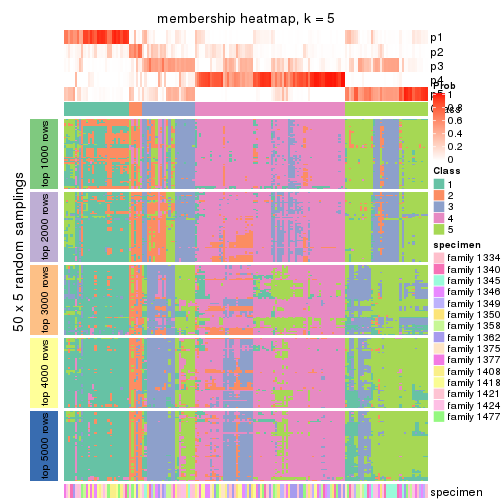</p>

</div>
<div id='tab-SD-NMF-membership-heatmap-5'>
<pre><code class="r">membership_heatmap(res, k = 6)
</code></pre>

<p></p>

</div>
</div>

As soon as we have had the classes for columns, we can look for signatures
which are significantly different between classes which can be candidate marks
for certain classes. Following are the heatmaps for signatures.


Signature heatmaps where rows are scaled:


<script>
$( function() {
	$( '#tabs-SD-NMF-get-signatures' ).tabs();
} );
</script>
<div id='tabs-SD-NMF-get-signatures'>
<ul>
<li><a href='#tab-SD-NMF-get-signatures-1'>k = 2</a></li>
<li><a href='#tab-SD-NMF-get-signatures-2'>k = 3</a></li>
<li><a href='#tab-SD-NMF-get-signatures-3'>k = 4</a></li>
<li><a href='#tab-SD-NMF-get-signatures-4'>k = 5</a></li>
<li><a href='#tab-SD-NMF-get-signatures-5'>k = 6</a></li>
</ul>
<div id='tab-SD-NMF-get-signatures-1'>
<pre><code class="r">get_signatures(res, k = 2)
</code></pre>

<p></p>

</div>
<div id='tab-SD-NMF-get-signatures-2'>
<pre><code class="r">get_signatures(res, k = 3)
</code></pre>

<p></p>

</div>
<div id='tab-SD-NMF-get-signatures-3'>
<pre><code class="r">get_signatures(res, k = 4)
</code></pre>

<p></p>

</div>
<div id='tab-SD-NMF-get-signatures-4'>
<pre><code class="r">get_signatures(res, k = 5)
</code></pre>

<p></p>

</div>
<div id='tab-SD-NMF-get-signatures-5'>
<pre><code class="r">get_signatures(res, k = 6)
</code></pre>

<p></p>

</div>
</div>


Signature heatmaps where rows are not scaled:


<script>
$( function() {
	$( '#tabs-SD-NMF-get-signatures-no-scale' ).tabs();
} );
</script>
<div id='tabs-SD-NMF-get-signatures-no-scale'>
<ul>
<li><a href='#tab-SD-NMF-get-signatures-no-scale-1'>k = 2</a></li>
<li><a href='#tab-SD-NMF-get-signatures-no-scale-2'>k = 3</a></li>
<li><a href='#tab-SD-NMF-get-signatures-no-scale-3'>k = 4</a></li>
<li><a href='#tab-SD-NMF-get-signatures-no-scale-4'>k = 5</a></li>
<li><a href='#tab-SD-NMF-get-signatures-no-scale-5'>k = 6</a></li>
</ul>
<div id='tab-SD-NMF-get-signatures-no-scale-1'>
<pre><code class="r">get_signatures(res, k = 2, scale_rows = FALSE)
</code></pre>

<p></p>

</div>
<div id='tab-SD-NMF-get-signatures-no-scale-2'>
<pre><code class="r">get_signatures(res, k = 3, scale_rows = FALSE)
</code></pre>

<p></p>

</div>
<div id='tab-SD-NMF-get-signatures-no-scale-3'>
<pre><code class="r">get_signatures(res, k = 4, scale_rows = FALSE)
</code></pre>

<p></p>

</div>
<div id='tab-SD-NMF-get-signatures-no-scale-4'>
<pre><code class="r">get_signatures(res, k = 5, scale_rows = FALSE)
</code></pre>

<p></p>

</div>
<div id='tab-SD-NMF-get-signatures-no-scale-5'>
<pre><code class="r">get_signatures(res, k = 6, scale_rows = FALSE)
</code></pre>

<p></p>

</div>
</div>


Compare the overlap of signatures from different k:

```r
compare_signatures(res)
```


`get_signature()` returns a data frame invisibly. TO get the list of signatures, the function
call should be assigned to a variable explicitly. In following code, if `plot` argument is set
to `FALSE`, no heatmap is plotted while only the differential analysis is performed.

```r
# code only for demonstration
tb = get_signature(res, k = ..., plot = FALSE)
```

An example of the output of `tb` is:

```
#>   which_row         fdr    mean_1    mean_2 scaled_mean_1 scaled_mean_2 km
#> 1        38 0.042760348  8.373488  9.131774    -0.5533452     0.5164555  1
#> 2        40 0.018707592  7.106213  8.469186    -0.6173731     0.5762149  1
#> 3        55 0.019134737 10.221463 11.207825    -0.6159697     0.5749050  1
#> 4        59 0.006059896  5.921854  7.869574    -0.6899429     0.6439467  1
#> 5        60 0.018055526  8.928898 10.211722    -0.6204761     0.5791110  1
#> 6        98 0.009384629 15.714769 14.887706     0.6635654    -0.6193277  2
...
```

The columns in `tb` are:

1. `which_row`: row indices corresponding to the input matrix.
2. `fdr`: FDR for the differential test. 
3. `mean_x`: The mean value in group x.
4. `scaled_mean_x`: The mean value in group x after rows are scaled.
5. `km`: Row groups if k-means clustering is applied to rows.


UMAP plot which shows how samples are separated.


<script>
$( function() {
	$( '#tabs-SD-NMF-dimension-reduction' ).tabs();
} );
</script>
<div id='tabs-SD-NMF-dimension-reduction'>
<ul>
<li><a href='#tab-SD-NMF-dimension-reduction-1'>k = 2</a></li>
<li><a href='#tab-SD-NMF-dimension-reduction-2'>k = 3</a></li>
<li><a href='#tab-SD-NMF-dimension-reduction-3'>k = 4</a></li>
<li><a href='#tab-SD-NMF-dimension-reduction-4'>k = 5</a></li>
<li><a href='#tab-SD-NMF-dimension-reduction-5'>k = 6</a></li>
</ul>
<div id='tab-SD-NMF-dimension-reduction-1'>
<pre><code class="r">dimension_reduction(res, k = 2, method = &quot;UMAP&quot;)
</code></pre>

<p></p>

</div>
<div id='tab-SD-NMF-dimension-reduction-2'>
<pre><code class="r">dimension_reduction(res, k = 3, method = &quot;UMAP&quot;)
</code></pre>

<p></p>

</div>
<div id='tab-SD-NMF-dimension-reduction-3'>
<pre><code class="r">dimension_reduction(res, k = 4, method = &quot;UMAP&quot;)
</code></pre>

<p></p>

</div>
<div id='tab-SD-NMF-dimension-reduction-4'>
<pre><code class="r">dimension_reduction(res, k = 5, method = &quot;UMAP&quot;)
</code></pre>

<p></p>

</div>
<div id='tab-SD-NMF-dimension-reduction-5'>
<pre><code class="r">dimension_reduction(res, k = 6, method = &quot;UMAP&quot;)
</code></pre>

<p></p>

</div>
</div>


Following heatmap shows how subgroups are split when increasing `k`:

```r
collect_classes(res)
```


Test correlation between subgroups and known annotations. If the known
annotation is numeric, one-way ANOVA test is applied, and if the known
annotation is discrete, chi-squared contingency table test is applied.

```r
test_to_known_factors(res)
```

```
#>          n specimen(p) k
#> SD:NMF 152     0.00351 2
#> SD:NMF  99     0.03299 3
#> SD:NMF  63     0.58311 4
#> SD:NMF  69     0.11329 5
#> SD:NMF 101     0.00186 6
```


If matrix rows can be associated to genes, consider to use `GO_Enrichment(res,
...)` to perform function enrichment for the signature genes.


 

---------------------------------------------------


### CV:hclust


The object with results only for a single top-value method and a single partition method 
can be extracted as:

```r
res = res_list["CV", "hclust"]
# you can also extract it by
# res = res_list["CV:hclust"]
```

A summary of `res` and all the functions that can be applied to it:

```r
res
```

```
#> A 'ConsensusPartition' object with k = 2, 3, 4, 5, 6.
#>   On a matrix with 22686 rows and 167 columns.
#>   Top rows (1000, 2000, 3000, 4000, 5000) are extracted by 'CV' method.
#>   Subgroups are detected by 'hclust' method.
#>   Performed in total 1250 partitions by row resampling.
#>   Best k for subgroups seems to be 2.
#> 
#> Following methods can be applied to this 'ConsensusPartition' object:
#>  [1] "cola_report"             "collect_classes"         "collect_plots"          
#>  [4] "collect_stats"           "colnames"                "compare_signatures"     
#>  [7] "consensus_heatmap"       "dimension_reduction"     "functional_enrichment"  
#> [10] "get_anno_col"            "get_anno"                "get_classes"            
#> [13] "get_consensus"           "get_matrix"              "get_membership"         
#> [16] "get_param"               "get_signatures"          "get_stats"              
#> [19] "is_best_k"               "is_stable_k"             "membership_heatmap"     
#> [22] "ncol"                    "nrow"                    "plot_ecdf"              
#> [25] "rownames"                "select_partition_number" "show"                   
#> [28] "suggest_best_k"          "test_to_known_factors"
```

`collect_plots()` function collects all the plots made from `res` for all `k` (number of partitions)
into one single page to provide an easy and fast comparison between different `k`.

```r
collect_plots(res)
```


The plots are:

- The first row: a plot of the ECDF (Empirical cumulative distribution
  function) curves of the consensus matrix for each `k` and the heatmap of
  predicted classes for each `k`.
- The second row: heatmaps of the consensus matrix for each `k`.
- The third row: heatmaps of the membership matrix for each `k`.
- The fouth row: heatmaps of the signatures for each `k`.

All the plots in panels can be made by individual functions and they are
plotted later in this section.

`select_partition_number()` produces several plots showing different
statistics for choosing "optimized" `k`. There are following statistics:

- ECDF curves of the consensus matrix for each `k`;
- 1-PAC. [The PAC
  score](https://en.wikipedia.org/wiki/Consensus_clustering#Over-interpretation_potential_of_consensus_clustering)
  measures the proportion of the ambiguous subgrouping.
- Mean silhouette score.
- Concordance. The mean probability of fiting the consensus class ids in all
  partitions.
- Area increased. Denote $A_k$ as the area under the ECDF curve for current
  `k`, the area increased is defined as $A_k - A_{k-1}$.
- Rand index. The percent of pairs of samples that are both in a same cluster
  or both are not in a same cluster in the partition of k and k-1.
- Jaccard index. The ratio of pairs of samples are both in a same cluster in
  the partition of k and k-1 and the pairs of samples are both in a same
  cluster in the partition k or k-1.

The detailed explanations of these statistics can be found in [the cola
vignette](http://bioconductor.org/packages/devel/bioc/vignettes/cola/inst/doc/cola.html#toc_13).

Generally speaking, lower PAC score, higher mean silhouette score or higher
concordance corresponds to better partition. Rand index and Jaccard index
measure how similar the current partition is compared to partition with `k-1`.
If they are too similar, we won't accept `k` is better than `k-1`.

```r
select_partition_number(res)
```


The numeric values for all these statistics can be obtained by `get_stats()`.

```r
get_stats(res)
```

```
#>   k 1-PAC mean_silhouette concordance area_increased  Rand Jaccard
#> 2 2 0.234           0.752       0.839         0.4191 0.522   0.522
#> 3 3 0.295           0.671       0.805         0.3056 0.873   0.765
#> 4 4 0.259           0.417       0.703         0.1699 0.946   0.881
#> 5 5 0.308           0.480       0.694         0.0820 0.894   0.755
#> 6 6 0.373           0.457       0.663         0.0544 0.916   0.764
```

`suggest_best_k()` suggests the best $k$ based on these statistics. The rules are as follows:

- All $k$ with Jaccard index larger than 0.95 are removed because the increase of
  the partition number does not provides enough extra information. If all $k$ are removed,
  the best $k$ is assigned by `NA`.
- For $k$ with 1-PAC larger than 0.9, the maximal $k$ is taken as the "best k". Other $k$ is called "optional k".
- If it does not fit the second rule. The $k$ with the highest vote of highest
  1-PAC, mean silhouette and concordance is taken as the "best k".

```r
suggest_best_k(res)
```

```
#> [1] 2
```


Following shows the table of the partitions (You need to click the **show/hide
code output** link to see it). The membership matrix (columns with name `p*`)
is inferred by
[`clue::cl_consensus()`](https://www.rdocumentation.org/link/cl_consensus?package=clue)
function with the `SE` method. Basically the value in the membership matrix
represents the probability to belong to a certain group. The finall class
label for an item is determined with the group with highest probability it
belongs to.

In `get_classes()` function, the entropy is calculated from the membership
matrix and the silhouette score is calculated from the consensus matrix.


<script>
$( function() {
	$( '#tabs-CV-hclust-get-classes' ).tabs();
} );
</script>
<div id='tabs-CV-hclust-get-classes'>
<ul>
<li><a href='#tab-CV-hclust-get-classes-1'>k = 2</a></li>
<li><a href='#tab-CV-hclust-get-classes-2'>k = 3</a></li>
<li><a href='#tab-CV-hclust-get-classes-3'>k = 4</a></li>
<li><a href='#tab-CV-hclust-get-classes-4'>k = 5</a></li>
<li><a href='#tab-CV-hclust-get-classes-5'>k = 6</a></li>
</ul>

<div id='tab-CV-hclust-get-classes-1'>
<p><a id='tab-CV-hclust-get-classes-1-a' style='color:#0366d6' href='#'>show/hide code output</a></p>
<pre><code class="r">cbind(get_classes(res, k = 2), get_membership(res, k = 2))
</code></pre>

<pre><code>#&gt;          class entropy silhouette    p1    p2
#&gt; GSM30006     2  0.7056      0.800 0.192 0.808
#&gt; GSM30007     1  0.2603      0.856 0.956 0.044
#&gt; GSM30008     1  0.7528      0.760 0.784 0.216
#&gt; GSM30009     1  0.2778      0.856 0.952 0.048
#&gt; GSM30010     2  0.1633      0.749 0.024 0.976
#&gt; GSM30011     2  0.7219      0.800 0.200 0.800
#&gt; GSM30012     2  0.8909      0.722 0.308 0.692
#&gt; GSM30013     1  0.7745      0.745 0.772 0.228
#&gt; GSM30014     2  0.5178      0.787 0.116 0.884
#&gt; GSM30015     1  0.7299      0.777 0.796 0.204
#&gt; GSM30016     1  0.9580      0.349 0.620 0.380
#&gt; GSM30017     1  0.0000      0.844 1.000 0.000
#&gt; GSM30018     1  0.2423      0.855 0.960 0.040
#&gt; GSM30019     2  0.7528      0.797 0.216 0.784
#&gt; GSM30020     1  0.7528      0.760 0.784 0.216
#&gt; GSM30021     2  0.9170      0.695 0.332 0.668
#&gt; GSM30022     1  0.1184      0.851 0.984 0.016
#&gt; GSM30023     1  0.7376      0.769 0.792 0.208
#&gt; GSM30024     2  0.8386      0.771 0.268 0.732
#&gt; GSM30025     1  0.5629      0.829 0.868 0.132
#&gt; GSM30026     1  0.0938      0.849 0.988 0.012
#&gt; GSM30027     1  0.5178      0.825 0.884 0.116
#&gt; GSM30028     1  0.7376      0.769 0.792 0.208
#&gt; GSM30029     1  0.0000      0.844 1.000 0.000
#&gt; GSM30030     1  0.0938      0.849 0.988 0.012
#&gt; GSM30031     1  0.2948      0.857 0.948 0.052
#&gt; GSM30032     2  0.8608      0.760 0.284 0.716
#&gt; GSM30033     2  0.8386      0.771 0.268 0.732
#&gt; GSM30034     1  0.4161      0.850 0.916 0.084
#&gt; GSM30035     2  0.9993      0.344 0.484 0.516
#&gt; GSM30036     1  0.8608      0.605 0.716 0.284
#&gt; GSM30037     1  0.2043      0.854 0.968 0.032
#&gt; GSM30038     2  0.9909      0.458 0.444 0.556
#&gt; GSM30039     2  0.8661      0.747 0.288 0.712
#&gt; GSM30040     2  0.0000      0.733 0.000 1.000
#&gt; GSM30041     2  0.4815      0.785 0.104 0.896
#&gt; GSM30042     2  0.5178      0.787 0.116 0.884
#&gt; GSM30043     2  0.5519      0.789 0.128 0.872
#&gt; GSM30044     1  0.0000      0.844 1.000 0.000
#&gt; GSM30045     1  0.1184      0.851 0.984 0.016
#&gt; GSM30046     1  0.0000      0.844 1.000 0.000
#&gt; GSM30047     1  0.7674      0.750 0.776 0.224
#&gt; GSM30048     1  0.0000      0.844 1.000 0.000
#&gt; GSM30049     2  0.0000      0.733 0.000 1.000
#&gt; GSM30050     1  0.5178      0.841 0.884 0.116
#&gt; GSM30051     2  0.1843      0.752 0.028 0.972
#&gt; GSM30052     1  0.1184      0.851 0.984 0.016
#&gt; GSM30053     2  0.8955      0.722 0.312 0.688
#&gt; GSM30054     2  0.0000      0.733 0.000 1.000
#&gt; GSM30055     2  0.8386      0.771 0.268 0.732
#&gt; GSM30056     2  0.8955      0.719 0.312 0.688
#&gt; GSM30057     2  0.2603      0.761 0.044 0.956
#&gt; GSM30058     2  0.2603      0.761 0.044 0.956
#&gt; GSM30059     1  0.5408      0.838 0.876 0.124
#&gt; GSM30060     2  0.7299      0.799 0.204 0.796
#&gt; GSM30061     1  0.7815      0.742 0.768 0.232
#&gt; GSM30062     1  0.6343      0.819 0.840 0.160
#&gt; GSM30063     2  0.7674      0.795 0.224 0.776
#&gt; GSM30064     1  0.2603      0.856 0.956 0.044
#&gt; GSM30065     2  0.8713      0.749 0.292 0.708
#&gt; GSM30066     2  0.0000      0.733 0.000 1.000
#&gt; GSM30067     1  0.4298      0.850 0.912 0.088
#&gt; GSM30068     2  0.2603      0.761 0.044 0.956
#&gt; GSM30069     2  0.8144      0.781 0.252 0.748
#&gt; GSM30070     2  0.9661      0.576 0.392 0.608
#&gt; GSM30071     2  0.9944      0.433 0.456 0.544
#&gt; GSM30072     1  0.5408      0.836 0.876 0.124
#&gt; GSM30073     2  1.0000      0.263 0.496 0.504
#&gt; GSM30074     2  0.9815      0.532 0.420 0.580
#&gt; GSM30075     2  0.7056      0.800 0.192 0.808
#&gt; GSM30076     1  0.7674      0.750 0.776 0.224
#&gt; GSM30077     1  0.2236      0.855 0.964 0.036
#&gt; GSM30078     1  0.3584      0.854 0.932 0.068
#&gt; GSM30079     1  0.0000      0.844 1.000 0.000
#&gt; GSM30080     1  0.9129      0.541 0.672 0.328
#&gt; GSM30081     2  0.0000      0.733 0.000 1.000
#&gt; GSM30086     1  0.8144      0.712 0.748 0.252
#&gt; GSM30087     1  0.2778      0.856 0.952 0.048
#&gt; GSM30088     1  0.2423      0.855 0.960 0.040
#&gt; GSM30089     1  0.6343      0.789 0.840 0.160
#&gt; GSM30090     2  0.6712      0.799 0.176 0.824
#&gt; GSM30091     2  0.0000      0.733 0.000 1.000
#&gt; GSM30092     1  0.7745      0.746 0.772 0.228
#&gt; GSM30093     2  0.7950      0.788 0.240 0.760
#&gt; GSM30094     2  0.2948      0.764 0.052 0.948
#&gt; GSM30095     2  0.0000      0.733 0.000 1.000
#&gt; GSM30096     1  0.0000      0.844 1.000 0.000
#&gt; GSM30097     1  0.2236      0.855 0.964 0.036
#&gt; GSM30098     1  0.0000      0.844 1.000 0.000
#&gt; GSM30099     2  0.7453      0.796 0.212 0.788
#&gt; GSM30100     2  0.0000      0.733 0.000 1.000
#&gt; GSM30101     2  0.2423      0.759 0.040 0.960
#&gt; GSM30102     2  0.8661      0.748 0.288 0.712
#&gt; GSM30103     2  0.9775      0.553 0.412 0.588
#&gt; GSM30104     1  0.8608      0.662 0.716 0.284
#&gt; GSM30105     1  0.2236      0.855 0.964 0.036
#&gt; GSM30106     1  0.0000      0.844 1.000 0.000
#&gt; GSM30107     1  0.3584      0.856 0.932 0.068
#&gt; GSM30108     1  0.9491      0.304 0.632 0.368
#&gt; GSM30109     1  0.0000      0.844 1.000 0.000
#&gt; GSM30110     1  0.0000      0.844 1.000 0.000
#&gt; GSM30111     1  0.7528      0.759 0.784 0.216
#&gt; GSM30112     1  0.8909      0.613 0.692 0.308
#&gt; GSM30113     2  0.0000      0.733 0.000 1.000
#&gt; GSM30114     2  0.9552      0.608 0.376 0.624
#&gt; GSM30115     1  0.8713      0.635 0.708 0.292
#&gt; GSM30116     2  0.7376      0.799 0.208 0.792
#&gt; GSM30117     2  0.9393      0.650 0.356 0.644
#&gt; GSM30118     2  0.8909      0.740 0.308 0.692
#&gt; GSM30119     2  0.7453      0.783 0.212 0.788
#&gt; GSM30120     1  0.8955      0.600 0.688 0.312
#&gt; GSM30121     1  0.0000      0.844 1.000 0.000
#&gt; GSM30122     1  0.6973      0.790 0.812 0.188
#&gt; GSM30123     2  0.9909      0.512 0.444 0.556
#&gt; GSM30177     2  0.7602      0.796 0.220 0.780
#&gt; GSM30178     1  0.9522      0.388 0.628 0.372
#&gt; GSM30179     1  0.4562      0.848 0.904 0.096
#&gt; GSM30180     1  0.5946      0.826 0.856 0.144
#&gt; GSM30181     1  0.9460      0.306 0.636 0.364
#&gt; GSM30182     1  0.0000      0.844 1.000 0.000
#&gt; GSM30183     1  0.0000      0.844 1.000 0.000
#&gt; GSM30184     2  0.5178      0.788 0.116 0.884
#&gt; GSM30185     1  0.8555      0.653 0.720 0.280
#&gt; GSM30186     2  0.8909      0.729 0.308 0.692
#&gt; GSM30187     1  0.5629      0.830 0.868 0.132
#&gt; GSM30188     1  0.0000      0.844 1.000 0.000
#&gt; GSM30189     1  0.4690      0.846 0.900 0.100
#&gt; GSM30190     2  0.3114      0.766 0.056 0.944
#&gt; GSM30191     1  0.9552      0.375 0.624 0.376
#&gt; GSM30192     1  0.8608      0.575 0.716 0.284
#&gt; GSM30193     1  0.8608      0.575 0.716 0.284
#&gt; GSM30194     2  0.0000      0.733 0.000 1.000
#&gt; GSM30195     1  0.8763      0.631 0.704 0.296
#&gt; GSM30196     1  0.0000      0.844 1.000 0.000
#&gt; GSM30197     1  0.5519      0.832 0.872 0.128
#&gt; GSM30198     1  0.5178      0.839 0.884 0.116
#&gt; GSM30199     2  0.8909      0.740 0.308 0.692
#&gt; GSM30200     1  0.0938      0.849 0.988 0.012
#&gt; GSM30201     1  0.2603      0.856 0.956 0.044
#&gt; GSM30202     1  0.6438      0.814 0.836 0.164
#&gt; GSM30203     1  0.6623      0.807 0.828 0.172
#&gt; GSM30204     1  0.6531      0.808 0.832 0.168
#&gt; GSM30205     1  0.9460      0.381 0.636 0.364
#&gt; GSM30206     1  0.0000      0.844 1.000 0.000
#&gt; GSM30207     1  0.6531      0.808 0.832 0.168
#&gt; GSM30208     1  0.0000      0.844 1.000 0.000
#&gt; GSM30209     2  0.9993      0.284 0.484 0.516
#&gt; GSM30210     1  0.0000      0.844 1.000 0.000
#&gt; GSM30211     1  0.0000      0.844 1.000 0.000
#&gt; GSM30212     1  0.2778      0.856 0.952 0.048
#&gt; GSM30213     1  0.2603      0.855 0.956 0.044
#&gt; GSM30214     1  0.2948      0.856 0.948 0.052
#&gt; GSM30215     1  0.1633      0.853 0.976 0.024
#&gt; GSM30216     1  0.0000      0.844 1.000 0.000
#&gt; GSM30217     1  0.4022      0.850 0.920 0.080
#&gt; GSM30218     2  0.7883      0.789 0.236 0.764
#&gt; GSM30219     2  0.8386      0.770 0.268 0.732
#&gt; GSM30220     1  0.2043      0.854 0.968 0.032
#&gt; GSM30221     1  0.5629      0.834 0.868 0.132
#&gt; GSM30222     1  0.8763      0.608 0.704 0.296
#&gt; GSM30223     1  0.1184      0.851 0.984 0.016
#&gt; GSM30224     1  0.4562      0.847 0.904 0.096
#&gt; GSM30225     1  0.0000      0.844 1.000 0.000
#&gt; GSM30226     2  0.8386      0.771 0.268 0.732
#&gt; GSM30227     1  0.0376      0.846 0.996 0.004
#&gt; GSM30228     2  0.7139      0.800 0.196 0.804
#&gt; GSM30229     1  0.8207      0.710 0.744 0.256
</code></pre>

<script>
$('#tab-CV-hclust-get-classes-1-a').parent().next().next().hide();
$('#tab-CV-hclust-get-classes-1-a').click(function(){
  $('#tab-CV-hclust-get-classes-1-a').parent().next().next().toggle();
  return(false);
});
</script>
</div>

<div id='tab-CV-hclust-get-classes-2'>
<p><a id='tab-CV-hclust-get-classes-2-a' style='color:#0366d6' href='#'>show/hide code output</a></p>
<pre><code class="r">cbind(get_classes(res, k = 3), get_membership(res, k = 3))
</code></pre>

<pre><code>#&gt;          class entropy silhouette    p1    p2    p3
#&gt; GSM30006     2  0.4960     0.6478 0.040 0.832 0.128
#&gt; GSM30007     1  0.2356     0.8145 0.928 0.072 0.000
#&gt; GSM30008     1  0.5845     0.6715 0.688 0.308 0.004
#&gt; GSM30009     1  0.2711     0.8153 0.912 0.088 0.000
#&gt; GSM30010     3  0.5291     0.7212 0.000 0.268 0.732
#&gt; GSM30011     2  0.4964     0.6685 0.048 0.836 0.116
#&gt; GSM30012     2  0.4342     0.7460 0.120 0.856 0.024
#&gt; GSM30013     1  0.6148     0.6099 0.640 0.356 0.004
#&gt; GSM30014     3  0.7130     0.4528 0.024 0.432 0.544
#&gt; GSM30015     1  0.5785     0.6446 0.668 0.332 0.000
#&gt; GSM30016     2  0.6505    -0.0124 0.468 0.528 0.004
#&gt; GSM30017     1  0.0424     0.7969 0.992 0.008 0.000
#&gt; GSM30018     1  0.2959     0.8115 0.900 0.100 0.000
#&gt; GSM30019     2  0.2773     0.6836 0.024 0.928 0.048
#&gt; GSM30020     1  0.5845     0.6715 0.688 0.308 0.004
#&gt; GSM30021     2  0.5111     0.7457 0.144 0.820 0.036
#&gt; GSM30022     1  0.1289     0.8070 0.968 0.032 0.000
#&gt; GSM30023     1  0.6033     0.6421 0.660 0.336 0.004
#&gt; GSM30024     2  0.5319     0.7317 0.104 0.824 0.072
#&gt; GSM30025     1  0.4605     0.7719 0.796 0.204 0.000
#&gt; GSM30026     1  0.0892     0.8015 0.980 0.020 0.000
#&gt; GSM30027     1  0.4235     0.7660 0.824 0.176 0.000
#&gt; GSM30028     1  0.6033     0.6421 0.660 0.336 0.004
#&gt; GSM30029     1  0.0424     0.7969 0.992 0.008 0.000
#&gt; GSM30030     1  0.1031     0.8033 0.976 0.024 0.000
#&gt; GSM30031     1  0.3116     0.8152 0.892 0.108 0.000
#&gt; GSM30032     2  0.6025     0.7235 0.140 0.784 0.076
#&gt; GSM30033     2  0.3293     0.7413 0.088 0.900 0.012
#&gt; GSM30034     1  0.3879     0.8018 0.848 0.152 0.000
#&gt; GSM30035     2  0.6497     0.5571 0.336 0.648 0.016
#&gt; GSM30036     1  0.6111     0.4342 0.604 0.396 0.000
#&gt; GSM30037     1  0.2625     0.8146 0.916 0.084 0.000
#&gt; GSM30038     2  0.5517     0.6449 0.268 0.728 0.004
#&gt; GSM30039     2  0.4526     0.7429 0.104 0.856 0.040
#&gt; GSM30040     3  0.1411     0.7901 0.000 0.036 0.964
#&gt; GSM30041     2  0.6008     0.0766 0.000 0.628 0.372
#&gt; GSM30042     3  0.7130     0.4586 0.024 0.432 0.544
#&gt; GSM30043     3  0.7584     0.2575 0.040 0.472 0.488
#&gt; GSM30044     1  0.0424     0.7969 0.992 0.008 0.000
#&gt; GSM30045     1  0.1753     0.8126 0.952 0.048 0.000
#&gt; GSM30046     1  0.0424     0.7969 0.992 0.008 0.000
#&gt; GSM30047     1  0.5902     0.6569 0.680 0.316 0.004
#&gt; GSM30048     1  0.0424     0.7969 0.992 0.008 0.000
#&gt; GSM30049     3  0.1411     0.7901 0.000 0.036 0.964
#&gt; GSM30050     1  0.4750     0.7733 0.784 0.216 0.000
#&gt; GSM30051     3  0.4931     0.7435 0.000 0.232 0.768
#&gt; GSM30052     1  0.1643     0.8108 0.956 0.044 0.000
#&gt; GSM30053     2  0.4779     0.7462 0.124 0.840 0.036
#&gt; GSM30054     3  0.1289     0.7896 0.000 0.032 0.968
#&gt; GSM30055     2  0.3293     0.7413 0.088 0.900 0.012
#&gt; GSM30056     2  0.6677     0.7182 0.168 0.744 0.088
#&gt; GSM30057     3  0.5733     0.6714 0.000 0.324 0.676
#&gt; GSM30058     3  0.5692     0.7189 0.008 0.268 0.724
#&gt; GSM30059     1  0.4346     0.7904 0.816 0.184 0.000
#&gt; GSM30060     2  0.4479     0.6731 0.044 0.860 0.096
#&gt; GSM30061     1  0.6205     0.6257 0.656 0.336 0.008
#&gt; GSM30062     1  0.5138     0.7498 0.748 0.252 0.000
#&gt; GSM30063     2  0.6372     0.6169 0.068 0.756 0.176
#&gt; GSM30064     1  0.2537     0.8162 0.920 0.080 0.000
#&gt; GSM30065     2  0.3771     0.7472 0.112 0.876 0.012
#&gt; GSM30066     3  0.0000     0.7782 0.000 0.000 1.000
#&gt; GSM30067     1  0.3752     0.8058 0.856 0.144 0.000
#&gt; GSM30068     3  0.5733     0.6714 0.000 0.324 0.676
#&gt; GSM30069     2  0.4925     0.7260 0.080 0.844 0.076
#&gt; GSM30070     2  0.4605     0.7131 0.204 0.796 0.000
#&gt; GSM30071     2  0.5656     0.6332 0.284 0.712 0.004
#&gt; GSM30072     1  0.5244     0.7450 0.756 0.240 0.004
#&gt; GSM30073     2  0.5706     0.5492 0.320 0.680 0.000
#&gt; GSM30074     2  0.5938     0.6840 0.248 0.732 0.020
#&gt; GSM30075     2  0.1620     0.6519 0.012 0.964 0.024
#&gt; GSM30076     1  0.6104     0.6242 0.648 0.348 0.004
#&gt; GSM30077     1  0.2448     0.8163 0.924 0.076 0.000
#&gt; GSM30078     1  0.3816     0.8039 0.852 0.148 0.000
#&gt; GSM30079     1  0.0892     0.7993 0.980 0.020 0.000
#&gt; GSM30080     1  0.6521     0.2216 0.504 0.492 0.004
#&gt; GSM30081     3  0.1964     0.7897 0.000 0.056 0.944
#&gt; GSM30086     1  0.6314     0.5308 0.604 0.392 0.004
#&gt; GSM30087     1  0.2625     0.8160 0.916 0.084 0.000
#&gt; GSM30088     1  0.2261     0.8150 0.932 0.068 0.000
#&gt; GSM30089     1  0.5016     0.7073 0.760 0.240 0.000
#&gt; GSM30090     2  0.5467     0.5773 0.032 0.792 0.176
#&gt; GSM30091     3  0.1411     0.7901 0.000 0.036 0.964
#&gt; GSM30092     1  0.6057     0.6230 0.656 0.340 0.004
#&gt; GSM30093     2  0.4379     0.7277 0.072 0.868 0.060
#&gt; GSM30094     3  0.5926     0.5362 0.000 0.356 0.644
#&gt; GSM30095     3  0.0000     0.7782 0.000 0.000 1.000
#&gt; GSM30096     1  0.1163     0.8078 0.972 0.028 0.000
#&gt; GSM30097     1  0.1964     0.8130 0.944 0.056 0.000
#&gt; GSM30098     1  0.0592     0.7925 0.988 0.012 0.000
#&gt; GSM30099     2  0.4443     0.6867 0.052 0.864 0.084
#&gt; GSM30100     3  0.1411     0.7901 0.000 0.036 0.964
#&gt; GSM30101     3  0.5678     0.6839 0.000 0.316 0.684
#&gt; GSM30102     2  0.4249     0.7464 0.108 0.864 0.028
#&gt; GSM30103     2  0.6195     0.6588 0.276 0.704 0.020
#&gt; GSM30104     1  0.7158     0.4931 0.596 0.372 0.032
#&gt; GSM30105     1  0.1964     0.8130 0.944 0.056 0.000
#&gt; GSM30106     1  0.2711     0.7850 0.912 0.088 0.000
#&gt; GSM30107     1  0.3619     0.8120 0.864 0.136 0.000
#&gt; GSM30108     2  0.6521     0.0489 0.492 0.504 0.004
#&gt; GSM30109     1  0.0424     0.7920 0.992 0.008 0.000
#&gt; GSM30110     1  0.1031     0.8062 0.976 0.024 0.000
#&gt; GSM30111     1  0.5956     0.6446 0.672 0.324 0.004
#&gt; GSM30112     1  0.6516     0.2983 0.516 0.480 0.004
#&gt; GSM30113     3  0.0424     0.7826 0.000 0.008 0.992
#&gt; GSM30114     2  0.4700     0.7305 0.180 0.812 0.008
#&gt; GSM30115     1  0.6460     0.4135 0.556 0.440 0.004
#&gt; GSM30116     2  0.5852     0.6351 0.060 0.788 0.152
#&gt; GSM30117     2  0.4953     0.7370 0.176 0.808 0.016
#&gt; GSM30118     2  0.3995     0.7154 0.116 0.868 0.016
#&gt; GSM30119     2  0.8549     0.0823 0.100 0.516 0.384
#&gt; GSM30120     1  0.6500     0.3409 0.532 0.464 0.004
#&gt; GSM30121     1  0.0424     0.7920 0.992 0.008 0.000
#&gt; GSM30122     1  0.5722     0.6865 0.704 0.292 0.004
#&gt; GSM30123     2  0.5831     0.6796 0.284 0.708 0.008
#&gt; GSM30177     2  0.4887     0.7004 0.060 0.844 0.096
#&gt; GSM30178     2  0.6520    -0.0949 0.488 0.508 0.004
#&gt; GSM30179     1  0.4235     0.7923 0.824 0.176 0.000
#&gt; GSM30180     1  0.5115     0.7551 0.768 0.228 0.004
#&gt; GSM30181     2  0.6672     0.1455 0.472 0.520 0.008
#&gt; GSM30182     1  0.1753     0.7879 0.952 0.048 0.000
#&gt; GSM30183     1  0.0747     0.7998 0.984 0.016 0.000
#&gt; GSM30184     2  0.5831     0.3334 0.008 0.708 0.284
#&gt; GSM30185     1  0.6432     0.4084 0.568 0.428 0.004
#&gt; GSM30186     2  0.4209     0.7506 0.128 0.856 0.016
#&gt; GSM30187     1  0.4796     0.7636 0.780 0.220 0.000
#&gt; GSM30188     1  0.0592     0.7925 0.988 0.012 0.000
#&gt; GSM30189     1  0.4291     0.7898 0.820 0.180 0.000
#&gt; GSM30190     3  0.5988     0.5225 0.000 0.368 0.632
#&gt; GSM30191     2  0.6682    -0.0904 0.488 0.504 0.008
#&gt; GSM30192     1  0.6468     0.2221 0.552 0.444 0.004
#&gt; GSM30193     1  0.6460     0.2318 0.556 0.440 0.004
#&gt; GSM30194     3  0.0424     0.7826 0.000 0.008 0.992
#&gt; GSM30195     1  0.6468     0.3982 0.552 0.444 0.004
#&gt; GSM30196     1  0.0747     0.8031 0.984 0.016 0.000
#&gt; GSM30197     1  0.4654     0.7712 0.792 0.208 0.000
#&gt; GSM30198     1  0.4399     0.7840 0.812 0.188 0.000
#&gt; GSM30199     2  0.4068     0.7191 0.120 0.864 0.016
#&gt; GSM30200     1  0.0892     0.7990 0.980 0.020 0.000
#&gt; GSM30201     1  0.2796     0.8165 0.908 0.092 0.000
#&gt; GSM30202     1  0.5098     0.7505 0.752 0.248 0.000
#&gt; GSM30203     1  0.5327     0.7241 0.728 0.272 0.000
#&gt; GSM30204     1  0.5480     0.7249 0.732 0.264 0.004
#&gt; GSM30205     2  0.6500     0.0707 0.464 0.532 0.004
#&gt; GSM30206     1  0.0592     0.7925 0.988 0.012 0.000
#&gt; GSM30207     1  0.5517     0.7223 0.728 0.268 0.004
#&gt; GSM30208     1  0.0592     0.8008 0.988 0.012 0.000
#&gt; GSM30209     2  0.6473     0.5598 0.312 0.668 0.020
#&gt; GSM30210     1  0.0592     0.7925 0.988 0.012 0.000
#&gt; GSM30211     1  0.1753     0.7879 0.952 0.048 0.000
#&gt; GSM30212     1  0.2711     0.8153 0.912 0.088 0.000
#&gt; GSM30213     1  0.2625     0.8128 0.916 0.084 0.000
#&gt; GSM30214     1  0.2878     0.8152 0.904 0.096 0.000
#&gt; GSM30215     1  0.2356     0.8159 0.928 0.072 0.000
#&gt; GSM30216     1  0.0424     0.7920 0.992 0.008 0.000
#&gt; GSM30217     1  0.3816     0.8006 0.852 0.148 0.000
#&gt; GSM30218     2  0.4475     0.7217 0.072 0.864 0.064
#&gt; GSM30219     2  0.4479     0.7419 0.096 0.860 0.044
#&gt; GSM30220     1  0.2066     0.8125 0.940 0.060 0.000
#&gt; GSM30221     1  0.4750     0.7796 0.784 0.216 0.000
#&gt; GSM30222     1  0.6495     0.3064 0.536 0.460 0.004
#&gt; GSM30223     1  0.1289     0.8070 0.968 0.032 0.000
#&gt; GSM30224     1  0.3941     0.8003 0.844 0.156 0.000
#&gt; GSM30225     1  0.1753     0.7879 0.952 0.048 0.000
#&gt; GSM30226     2  0.4399     0.7404 0.092 0.864 0.044
#&gt; GSM30227     1  0.0592     0.7944 0.988 0.012 0.000
#&gt; GSM30228     2  0.4665     0.6837 0.048 0.852 0.100
#&gt; GSM30229     1  0.6339     0.5855 0.632 0.360 0.008
</code></pre>

<script>
$('#tab-CV-hclust-get-classes-2-a').parent().next().next().hide();
$('#tab-CV-hclust-get-classes-2-a').click(function(){
  $('#tab-CV-hclust-get-classes-2-a').parent().next().next().toggle();
  return(false);
});
</script>
</div>

<div id='tab-CV-hclust-get-classes-3'>
<p><a id='tab-CV-hclust-get-classes-3-a' style='color:#0366d6' href='#'>show/hide code output</a></p>
<pre><code class="r">cbind(get_classes(res, k = 4), get_membership(res, k = 4))
</code></pre>

<pre><code>#&gt;          class entropy silhouette    p1    p2    p3    p4
#&gt; GSM30006     2   0.445   6.92e-01 0.040 0.820 0.124 0.016
#&gt; GSM30007     1   0.289   4.62e-01 0.896 0.036 0.000 0.068
#&gt; GSM30008     1   0.580   4.82e-01 0.668 0.264 0.000 0.068
#&gt; GSM30009     1   0.357   4.39e-01 0.860 0.048 0.000 0.092
#&gt; GSM30010     3   0.483   6.98e-01 0.008 0.252 0.728 0.012
#&gt; GSM30011     2   0.445   7.08e-01 0.048 0.824 0.112 0.016
#&gt; GSM30012     2   0.428   7.50e-01 0.124 0.828 0.020 0.028
#&gt; GSM30013     1   0.601   4.59e-01 0.640 0.288 0.000 0.072
#&gt; GSM30014     3   0.596   4.04e-01 0.012 0.424 0.544 0.020
#&gt; GSM30015     1   0.621   4.62e-01 0.636 0.272 0.000 0.092
#&gt; GSM30016     2   0.671   1.81e-02 0.456 0.456 0.000 0.088
#&gt; GSM30017     1   0.472  -8.84e-02 0.672 0.004 0.000 0.324
#&gt; GSM30018     1   0.588   1.37e-01 0.656 0.068 0.000 0.276
#&gt; GSM30019     2   0.451   7.22e-01 0.048 0.836 0.056 0.060
#&gt; GSM30020     1   0.580   4.82e-01 0.668 0.264 0.000 0.068
#&gt; GSM30021     2   0.525   7.47e-01 0.128 0.784 0.036 0.052
#&gt; GSM30022     1   0.472  -6.69e-05 0.692 0.008 0.000 0.300
#&gt; GSM30023     1   0.599   4.69e-01 0.656 0.264 0.000 0.080
#&gt; GSM30024     2   0.489   7.49e-01 0.116 0.800 0.068 0.016
#&gt; GSM30025     1   0.459   5.06e-01 0.780 0.176 0.000 0.044
#&gt; GSM30026     1   0.492  -1.20e-01 0.656 0.008 0.000 0.336
#&gt; GSM30027     1   0.562   4.19e-01 0.724 0.152 0.000 0.124
#&gt; GSM30028     1   0.599   4.69e-01 0.656 0.264 0.000 0.080
#&gt; GSM30029     1   0.453   2.69e-02 0.704 0.004 0.000 0.292
#&gt; GSM30030     1   0.481  -5.69e-02 0.676 0.008 0.000 0.316
#&gt; GSM30031     1   0.347   4.91e-01 0.868 0.072 0.000 0.060
#&gt; GSM30032     2   0.566   7.41e-01 0.132 0.760 0.072 0.036
#&gt; GSM30033     2   0.524   7.04e-01 0.076 0.780 0.020 0.124
#&gt; GSM30034     1   0.404   5.03e-01 0.832 0.112 0.000 0.056
#&gt; GSM30035     2   0.653   5.23e-01 0.356 0.576 0.016 0.052
#&gt; GSM30036     1   0.586   3.54e-01 0.612 0.340 0.000 0.048
#&gt; GSM30037     1   0.350   4.49e-01 0.860 0.036 0.000 0.104
#&gt; GSM30038     2   0.556   6.30e-01 0.260 0.684 0.000 0.056
#&gt; GSM30039     2   0.448   7.52e-01 0.104 0.828 0.040 0.028
#&gt; GSM30040     3   0.131   7.76e-01 0.000 0.036 0.960 0.004
#&gt; GSM30041     2   0.523   1.81e-01 0.004 0.620 0.368 0.008
#&gt; GSM30042     3   0.605   4.15e-01 0.012 0.420 0.544 0.024
#&gt; GSM30043     3   0.637   1.74e-01 0.044 0.464 0.484 0.008
#&gt; GSM30044     1   0.440   8.11e-02 0.724 0.004 0.000 0.272
#&gt; GSM30045     1   0.316   4.27e-01 0.872 0.020 0.000 0.108
#&gt; GSM30046     1   0.468  -5.68e-02 0.680 0.004 0.000 0.316
#&gt; GSM30047     1   0.617   4.61e-01 0.644 0.284 0.008 0.064
#&gt; GSM30048     1   0.468  -5.68e-02 0.680 0.004 0.000 0.316
#&gt; GSM30049     3   0.112   7.76e-01 0.000 0.036 0.964 0.000
#&gt; GSM30050     1   0.456   5.19e-01 0.796 0.140 0.000 0.064
#&gt; GSM30051     3   0.443   7.22e-01 0.004 0.220 0.764 0.012
#&gt; GSM30052     1   0.247   4.33e-01 0.908 0.012 0.000 0.080
#&gt; GSM30053     2   0.477   7.50e-01 0.112 0.812 0.032 0.044
#&gt; GSM30054     3   0.102   7.76e-01 0.000 0.032 0.968 0.000
#&gt; GSM30055     2   0.524   7.04e-01 0.076 0.780 0.020 0.124
#&gt; GSM30056     2   0.585   7.28e-01 0.164 0.732 0.084 0.020
#&gt; GSM30057     3   0.508   6.41e-01 0.008 0.308 0.676 0.008
#&gt; GSM30058     3   0.478   6.94e-01 0.004 0.264 0.720 0.012
#&gt; GSM30059     1   0.379   5.15e-01 0.840 0.124 0.000 0.036
#&gt; GSM30060     2   0.428   7.08e-01 0.044 0.840 0.092 0.024
#&gt; GSM30061     1   0.584   4.66e-01 0.648 0.300 0.004 0.048
#&gt; GSM30062     1   0.504   5.11e-01 0.744 0.204 0.000 0.052
#&gt; GSM30063     2   0.605   6.46e-01 0.056 0.724 0.176 0.044
#&gt; GSM30064     1   0.306   4.75e-01 0.888 0.040 0.000 0.072
#&gt; GSM30065     2   0.551   7.21e-01 0.104 0.764 0.020 0.112
#&gt; GSM30066     3   0.115   7.57e-01 0.000 0.008 0.968 0.024
#&gt; GSM30067     1   0.384   5.00e-01 0.844 0.104 0.000 0.052
#&gt; GSM30068     3   0.508   6.41e-01 0.008 0.308 0.676 0.008
#&gt; GSM30069     2   0.466   7.48e-01 0.096 0.816 0.072 0.016
#&gt; GSM30070     2   0.504   6.99e-01 0.196 0.748 0.000 0.056
#&gt; GSM30071     2   0.555   6.20e-01 0.280 0.672 0.000 0.048
#&gt; GSM30072     1   0.538   4.82e-01 0.736 0.176 0.000 0.088
#&gt; GSM30073     2   0.612   5.59e-01 0.308 0.620 0.000 0.072
#&gt; GSM30074     2   0.585   6.66e-01 0.244 0.692 0.016 0.048
#&gt; GSM30075     2   0.505   4.97e-01 0.004 0.724 0.028 0.244
#&gt; GSM30076     1   0.594   4.67e-01 0.652 0.276 0.000 0.072
#&gt; GSM30077     1   0.510   3.54e-01 0.748 0.064 0.000 0.188
#&gt; GSM30078     1   0.459   5.06e-01 0.800 0.116 0.000 0.084
#&gt; GSM30079     1   0.484   8.84e-03 0.688 0.012 0.000 0.300
#&gt; GSM30080     1   0.648   2.02e-01 0.508 0.420 0.000 0.072
#&gt; GSM30081     3   0.166   7.76e-01 0.000 0.052 0.944 0.004
#&gt; GSM30086     1   0.614   4.27e-01 0.596 0.340 0.000 0.064
#&gt; GSM30087     1   0.509   3.56e-01 0.752 0.068 0.000 0.180
#&gt; GSM30088     1   0.536   2.59e-01 0.716 0.060 0.000 0.224
#&gt; GSM30089     1   0.549   4.26e-01 0.720 0.200 0.000 0.080
#&gt; GSM30090     2   0.485   6.34e-01 0.032 0.780 0.172 0.016
#&gt; GSM30091     3   0.131   7.76e-01 0.000 0.036 0.960 0.004
#&gt; GSM30092     1   0.582   4.69e-01 0.652 0.288 0.000 0.060
#&gt; GSM30093     2   0.392   7.51e-01 0.072 0.860 0.048 0.020
#&gt; GSM30094     3   0.525   5.01e-01 0.000 0.336 0.644 0.020
#&gt; GSM30095     3   0.115   7.56e-01 0.000 0.008 0.968 0.024
#&gt; GSM30096     1   0.292   3.98e-01 0.876 0.008 0.000 0.116
#&gt; GSM30097     1   0.395   3.04e-01 0.812 0.020 0.000 0.168
#&gt; GSM30098     1   0.499  -5.23e-01 0.520 0.000 0.000 0.480
#&gt; GSM30099     2   0.406   7.17e-01 0.048 0.852 0.080 0.020
#&gt; GSM30100     3   0.131   7.76e-01 0.000 0.036 0.960 0.004
#&gt; GSM30101     3   0.505   6.57e-01 0.004 0.304 0.680 0.012
#&gt; GSM30102     2   0.525   7.50e-01 0.112 0.784 0.024 0.080
#&gt; GSM30103     2   0.656   6.59e-01 0.248 0.652 0.024 0.076
#&gt; GSM30104     1   0.643   4.15e-01 0.604 0.332 0.032 0.032
#&gt; GSM30105     1   0.395   3.04e-01 0.812 0.020 0.000 0.168
#&gt; GSM30106     4   0.520   5.81e-01 0.416 0.008 0.000 0.576
#&gt; GSM30107     1   0.390   4.84e-01 0.844 0.072 0.000 0.084
#&gt; GSM30108     1   0.650  -1.17e-01 0.476 0.452 0.000 0.072
#&gt; GSM30109     1   0.498  -4.95e-01 0.536 0.000 0.000 0.464
#&gt; GSM30110     1   0.303   3.94e-01 0.868 0.008 0.000 0.124
#&gt; GSM30111     1   0.549   4.71e-01 0.664 0.296 0.000 0.040
#&gt; GSM30112     1   0.729   2.75e-01 0.488 0.352 0.000 0.160
#&gt; GSM30113     3   0.118   7.67e-01 0.000 0.016 0.968 0.016
#&gt; GSM30114     2   0.534   7.18e-01 0.180 0.748 0.008 0.064
#&gt; GSM30115     1   0.656   3.53e-01 0.552 0.360 0.000 0.088
#&gt; GSM30116     2   0.528   6.70e-01 0.048 0.776 0.144 0.032
#&gt; GSM30117     2   0.524   7.29e-01 0.180 0.756 0.012 0.052
#&gt; GSM30118     2   0.559   6.75e-01 0.084 0.744 0.012 0.160
#&gt; GSM30119     2   0.748   1.40e-01 0.080 0.496 0.388 0.036
#&gt; GSM30120     1   0.662   2.95e-01 0.520 0.404 0.004 0.072
#&gt; GSM30121     1   0.495  -4.39e-01 0.556 0.000 0.000 0.444
#&gt; GSM30122     1   0.594   4.58e-01 0.684 0.212 0.000 0.104
#&gt; GSM30123     2   0.635   6.62e-01 0.208 0.652 0.000 0.140
#&gt; GSM30177     2   0.474   7.28e-01 0.056 0.820 0.088 0.036
#&gt; GSM30178     1   0.644   8.54e-02 0.488 0.452 0.004 0.056
#&gt; GSM30179     1   0.388   5.16e-01 0.836 0.124 0.000 0.040
#&gt; GSM30180     1   0.532   4.80e-01 0.744 0.160 0.000 0.096
#&gt; GSM30181     4   0.790  -3.71e-02 0.328 0.300 0.000 0.372
#&gt; GSM30182     4   0.497   5.76e-01 0.456 0.000 0.000 0.544
#&gt; GSM30183     1   0.511  -2.20e-01 0.636 0.012 0.000 0.352
#&gt; GSM30184     2   0.543   4.03e-01 0.012 0.680 0.288 0.020
#&gt; GSM30185     1   0.734   2.88e-01 0.500 0.324 0.000 0.176
#&gt; GSM30186     2   0.469   7.51e-01 0.132 0.804 0.012 0.052
#&gt; GSM30187     1   0.451   5.14e-01 0.788 0.168 0.000 0.044
#&gt; GSM30188     1   0.499  -5.56e-01 0.520 0.000 0.000 0.480
#&gt; GSM30189     1   0.396   5.12e-01 0.832 0.124 0.000 0.044
#&gt; GSM30190     3   0.531   4.85e-01 0.000 0.348 0.632 0.020
#&gt; GSM30191     1   0.661   9.81e-02 0.496 0.440 0.012 0.052
#&gt; GSM30192     1   0.776  -2.17e-02 0.432 0.264 0.000 0.304
#&gt; GSM30193     1   0.774  -8.42e-03 0.440 0.264 0.000 0.296
#&gt; GSM30194     3   0.118   7.67e-01 0.000 0.016 0.968 0.016
#&gt; GSM30195     1   0.648   3.25e-01 0.540 0.392 0.004 0.064
#&gt; GSM30196     1   0.380   2.29e-01 0.780 0.000 0.000 0.220
#&gt; GSM30197     1   0.485   5.13e-01 0.772 0.164 0.000 0.064
#&gt; GSM30198     1   0.471   5.18e-01 0.784 0.152 0.000 0.064
#&gt; GSM30199     2   0.550   6.82e-01 0.084 0.752 0.012 0.152
#&gt; GSM30200     1   0.489  -2.02e-02 0.680 0.012 0.000 0.308
#&gt; GSM30201     1   0.487   3.77e-01 0.764 0.056 0.000 0.180
#&gt; GSM30202     1   0.479   5.15e-01 0.756 0.204 0.000 0.040
#&gt; GSM30203     1   0.510   5.05e-01 0.732 0.220 0.000 0.048
#&gt; GSM30204     1   0.525   5.00e-01 0.720 0.228 0.000 0.052
#&gt; GSM30205     2   0.674   2.01e-01 0.420 0.488 0.000 0.092
#&gt; GSM30206     1   0.498  -5.18e-01 0.540 0.000 0.000 0.460
#&gt; GSM30207     1   0.525   4.98e-01 0.720 0.228 0.000 0.052
#&gt; GSM30208     1   0.498  -2.99e-01 0.612 0.004 0.000 0.384
#&gt; GSM30209     2   0.664   5.39e-01 0.292 0.612 0.012 0.084
#&gt; GSM30210     1   0.497  -4.94e-01 0.548 0.000 0.000 0.452
#&gt; GSM30211     4   0.497   5.77e-01 0.456 0.000 0.000 0.544
#&gt; GSM30212     1   0.399   4.14e-01 0.832 0.048 0.000 0.120
#&gt; GSM30213     1   0.511   3.14e-01 0.744 0.060 0.000 0.196
#&gt; GSM30214     1   0.365   4.44e-01 0.856 0.052 0.000 0.092
#&gt; GSM30215     1   0.340   4.37e-01 0.864 0.032 0.000 0.104
#&gt; GSM30216     1   0.522  -4.05e-01 0.568 0.008 0.000 0.424
#&gt; GSM30217     1   0.506   4.63e-01 0.768 0.128 0.000 0.104
#&gt; GSM30218     2   0.393   7.43e-01 0.064 0.860 0.056 0.020
#&gt; GSM30219     2   0.462   7.52e-01 0.096 0.824 0.032 0.048
#&gt; GSM30220     1   0.264   4.46e-01 0.904 0.020 0.000 0.076
#&gt; GSM30221     1   0.495   5.09e-01 0.772 0.144 0.000 0.084
#&gt; GSM30222     1   0.717   2.20e-01 0.500 0.356 0.000 0.144
#&gt; GSM30223     1   0.472  -6.69e-05 0.692 0.008 0.000 0.300
#&gt; GSM30224     1   0.426   5.03e-01 0.820 0.112 0.000 0.068
#&gt; GSM30225     1   0.491  -3.12e-01 0.580 0.000 0.000 0.420
#&gt; GSM30226     2   0.464   7.50e-01 0.092 0.824 0.032 0.052
#&gt; GSM30227     1   0.456  -9.53e-02 0.672 0.000 0.000 0.328
#&gt; GSM30228     2   0.414   7.21e-01 0.048 0.844 0.092 0.016
#&gt; GSM30229     1   0.604   4.46e-01 0.620 0.324 0.004 0.052
</code></pre>

<script>
$('#tab-CV-hclust-get-classes-3-a').parent().next().next().hide();
$('#tab-CV-hclust-get-classes-3-a').click(function(){
  $('#tab-CV-hclust-get-classes-3-a').parent().next().next().toggle();
  return(false);
});
</script>
</div>

<div id='tab-CV-hclust-get-classes-4'>
<p><a id='tab-CV-hclust-get-classes-4-a' style='color:#0366d6' href='#'>show/hide code output</a></p>
<pre><code class="r">cbind(get_classes(res, k = 5), get_membership(res, k = 5))
</code></pre>

<pre><code>#&gt;          class entropy silhouette    p1    p2    p3    p4    p5
#&gt; GSM30006     5  0.3906     0.6762 0.000 0.032 0.128 0.024 0.816
#&gt; GSM30007     4  0.3416     0.5172 0.096 0.020 0.000 0.852 0.032
#&gt; GSM30008     4  0.4929     0.5566 0.028 0.024 0.000 0.692 0.256
#&gt; GSM30009     4  0.4656     0.4626 0.156 0.028 0.000 0.764 0.052
#&gt; GSM30010     3  0.4221     0.6890 0.000 0.032 0.732 0.000 0.236
#&gt; GSM30011     5  0.3764     0.6832 0.000 0.032 0.116 0.024 0.828
#&gt; GSM30012     5  0.4717     0.6591 0.008 0.084 0.020 0.108 0.780
#&gt; GSM30013     4  0.5320     0.5192 0.036 0.028 0.000 0.652 0.284
#&gt; GSM30014     3  0.5608     0.4386 0.004 0.056 0.548 0.004 0.388
#&gt; GSM30015     4  0.5780     0.5056 0.084 0.016 0.000 0.616 0.284
#&gt; GSM30016     4  0.5944     0.1004 0.052 0.024 0.000 0.468 0.456
#&gt; GSM30017     4  0.4542    -0.3022 0.456 0.008 0.000 0.536 0.000
#&gt; GSM30018     4  0.5745     0.0651 0.352 0.012 0.000 0.568 0.068
#&gt; GSM30019     5  0.4380     0.6488 0.004 0.140 0.052 0.016 0.788
#&gt; GSM30020     4  0.4929     0.5566 0.028 0.024 0.000 0.692 0.256
#&gt; GSM30021     5  0.4958     0.6622 0.020 0.064 0.036 0.100 0.780
#&gt; GSM30022     4  0.4645    -0.1980 0.424 0.008 0.000 0.564 0.004
#&gt; GSM30023     4  0.5269     0.5307 0.044 0.024 0.000 0.668 0.264
#&gt; GSM30024     5  0.4186     0.6991 0.008 0.032 0.072 0.064 0.824
#&gt; GSM30025     4  0.4877     0.5762 0.056 0.020 0.000 0.732 0.192
#&gt; GSM30026     1  0.4528     0.4349 0.548 0.000 0.000 0.444 0.008
#&gt; GSM30027     4  0.6318     0.4393 0.104 0.072 0.000 0.644 0.180
#&gt; GSM30028     4  0.5269     0.5307 0.044 0.024 0.000 0.668 0.264
#&gt; GSM30029     4  0.4557    -0.1651 0.404 0.012 0.000 0.584 0.000
#&gt; GSM30030     1  0.4559     0.3446 0.512 0.000 0.000 0.480 0.008
#&gt; GSM30031     4  0.4233     0.5604 0.092 0.028 0.000 0.808 0.072
#&gt; GSM30032     5  0.4579     0.6901 0.016 0.032 0.072 0.076 0.804
#&gt; GSM30033     5  0.4901     0.6290 0.036 0.128 0.024 0.036 0.776
#&gt; GSM30034     4  0.4520     0.5724 0.116 0.004 0.000 0.764 0.116
#&gt; GSM30035     5  0.5989     0.3866 0.032 0.036 0.016 0.312 0.604
#&gt; GSM30036     4  0.5904     0.3604 0.056 0.028 0.000 0.568 0.348
#&gt; GSM30037     4  0.3915     0.5025 0.104 0.048 0.000 0.824 0.024
#&gt; GSM30038     5  0.5615     0.5208 0.052 0.048 0.000 0.228 0.672
#&gt; GSM30039     5  0.4811     0.6723 0.008 0.084 0.040 0.084 0.784
#&gt; GSM30040     3  0.0955     0.7300 0.000 0.004 0.968 0.000 0.028
#&gt; GSM30041     5  0.5076     0.2346 0.000 0.028 0.372 0.008 0.592
#&gt; GSM30042     3  0.5559     0.4383 0.004 0.052 0.548 0.004 0.392
#&gt; GSM30043     3  0.5051     0.2083 0.000 0.024 0.488 0.004 0.484
#&gt; GSM30044     4  0.4505    -0.0969 0.384 0.012 0.000 0.604 0.000
#&gt; GSM30045     4  0.4021     0.4660 0.148 0.036 0.000 0.800 0.016
#&gt; GSM30046     4  0.4538    -0.2768 0.452 0.008 0.000 0.540 0.000
#&gt; GSM30047     4  0.5856     0.4995 0.016 0.068 0.008 0.620 0.288
#&gt; GSM30048     4  0.4538    -0.2768 0.452 0.008 0.000 0.540 0.000
#&gt; GSM30049     3  0.0794     0.7307 0.000 0.000 0.972 0.000 0.028
#&gt; GSM30050     4  0.4347     0.6078 0.076 0.008 0.000 0.780 0.136
#&gt; GSM30051     3  0.3897     0.7040 0.000 0.028 0.768 0.000 0.204
#&gt; GSM30052     4  0.3233     0.4823 0.112 0.028 0.000 0.852 0.008
#&gt; GSM30053     5  0.4865     0.6643 0.016 0.080 0.032 0.088 0.784
#&gt; GSM30054     3  0.0865     0.7289 0.000 0.004 0.972 0.000 0.024
#&gt; GSM30055     5  0.4901     0.6290 0.036 0.128 0.024 0.036 0.776
#&gt; GSM30056     5  0.5486     0.6380 0.008 0.036 0.084 0.148 0.724
#&gt; GSM30057     3  0.4541     0.6453 0.000 0.032 0.680 0.000 0.288
#&gt; GSM30058     3  0.4223     0.6868 0.000 0.028 0.724 0.000 0.248
#&gt; GSM30059     4  0.4065     0.6029 0.056 0.016 0.000 0.808 0.120
#&gt; GSM30060     5  0.3167     0.6805 0.004 0.036 0.092 0.004 0.864
#&gt; GSM30061     4  0.5282     0.5344 0.028 0.024 0.004 0.652 0.292
#&gt; GSM30062     4  0.4821     0.5973 0.040 0.032 0.000 0.740 0.188
#&gt; GSM30063     5  0.5679     0.6144 0.004 0.080 0.172 0.044 0.700
#&gt; GSM30064     4  0.3685     0.5313 0.112 0.016 0.000 0.832 0.040
#&gt; GSM30065     5  0.5036     0.6391 0.028 0.112 0.024 0.064 0.772
#&gt; GSM30066     3  0.1124     0.6990 0.000 0.036 0.960 0.000 0.004
#&gt; GSM30067     4  0.4377     0.5690 0.112 0.004 0.000 0.776 0.108
#&gt; GSM30068     3  0.4541     0.6453 0.000 0.032 0.680 0.000 0.288
#&gt; GSM30069     5  0.4011     0.6977 0.004 0.040 0.076 0.048 0.832
#&gt; GSM30070     5  0.4998     0.5870 0.028 0.064 0.000 0.172 0.736
#&gt; GSM30071     5  0.5630     0.4952 0.036 0.052 0.000 0.264 0.648
#&gt; GSM30072     4  0.5073     0.5378 0.080 0.024 0.000 0.732 0.164
#&gt; GSM30073     5  0.6076     0.3753 0.036 0.072 0.000 0.296 0.596
#&gt; GSM30074     5  0.5852     0.5474 0.036 0.052 0.016 0.224 0.672
#&gt; GSM30075     5  0.6024     0.2149 0.036 0.412 0.036 0.004 0.512
#&gt; GSM30076     4  0.5326     0.5289 0.040 0.028 0.000 0.660 0.272
#&gt; GSM30077     4  0.5196     0.2873 0.308 0.004 0.000 0.632 0.056
#&gt; GSM30078     4  0.4496     0.5856 0.116 0.008 0.000 0.772 0.104
#&gt; GSM30079     4  0.4899    -0.2834 0.456 0.012 0.000 0.524 0.008
#&gt; GSM30080     4  0.6044     0.2974 0.032 0.052 0.000 0.512 0.404
#&gt; GSM30081     3  0.1282     0.7329 0.000 0.004 0.952 0.000 0.044
#&gt; GSM30086     4  0.5621     0.4649 0.028 0.044 0.000 0.608 0.320
#&gt; GSM30087     4  0.5351     0.2959 0.304 0.004 0.000 0.624 0.068
#&gt; GSM30088     4  0.5376     0.1033 0.356 0.004 0.000 0.584 0.056
#&gt; GSM30089     4  0.5503     0.4611 0.088 0.028 0.000 0.692 0.192
#&gt; GSM30090     5  0.4196     0.6321 0.000 0.036 0.176 0.012 0.776
#&gt; GSM30091     3  0.0955     0.7302 0.000 0.004 0.968 0.000 0.028
#&gt; GSM30092     4  0.4873     0.5348 0.012 0.032 0.000 0.676 0.280
#&gt; GSM30093     5  0.3245     0.7013 0.000 0.036 0.048 0.044 0.872
#&gt; GSM30094     3  0.4570     0.4693 0.004 0.016 0.648 0.000 0.332
#&gt; GSM30095     3  0.1205     0.6957 0.000 0.040 0.956 0.000 0.004
#&gt; GSM30096     4  0.3759     0.4337 0.136 0.056 0.000 0.808 0.000
#&gt; GSM30097     4  0.4796     0.2374 0.300 0.008 0.000 0.664 0.028
#&gt; GSM30098     1  0.3530     0.7576 0.784 0.012 0.000 0.204 0.000
#&gt; GSM30099     5  0.2954     0.6850 0.004 0.028 0.080 0.008 0.880
#&gt; GSM30100     3  0.0955     0.7302 0.000 0.004 0.968 0.000 0.028
#&gt; GSM30101     3  0.4464     0.6513 0.000 0.028 0.684 0.000 0.288
#&gt; GSM30102     5  0.5906     0.6186 0.032 0.160 0.024 0.084 0.700
#&gt; GSM30103     5  0.6007     0.5441 0.032 0.076 0.024 0.184 0.684
#&gt; GSM30104     4  0.5775     0.4535 0.016 0.020 0.032 0.596 0.336
#&gt; GSM30105     4  0.4796     0.2374 0.300 0.008 0.000 0.664 0.028
#&gt; GSM30106     1  0.3736     0.6313 0.808 0.052 0.000 0.140 0.000
#&gt; GSM30107     4  0.4375     0.5544 0.104 0.040 0.000 0.800 0.056
#&gt; GSM30108     4  0.6238    -0.0778 0.076 0.024 0.000 0.452 0.448
#&gt; GSM30109     1  0.3720     0.7593 0.760 0.012 0.000 0.228 0.000
#&gt; GSM30110     4  0.3759     0.4286 0.136 0.056 0.000 0.808 0.000
#&gt; GSM30111     4  0.4983     0.5355 0.028 0.020 0.000 0.672 0.280
#&gt; GSM30112     4  0.7464     0.1951 0.076 0.152 0.000 0.464 0.308
#&gt; GSM30113     3  0.1106     0.7116 0.000 0.024 0.964 0.000 0.012
#&gt; GSM30114     5  0.5217     0.6022 0.032 0.060 0.008 0.164 0.736
#&gt; GSM30115     4  0.5865     0.4061 0.044 0.036 0.000 0.572 0.348
#&gt; GSM30116     5  0.4256     0.6470 0.004 0.052 0.148 0.008 0.788
#&gt; GSM30117     5  0.4610     0.6340 0.016 0.060 0.012 0.128 0.784
#&gt; GSM30118     5  0.5980     0.4017 0.028 0.312 0.008 0.052 0.600
#&gt; GSM30119     5  0.6689     0.0497 0.008 0.064 0.388 0.048 0.492
#&gt; GSM30120     4  0.6260     0.3604 0.024 0.072 0.004 0.524 0.376
#&gt; GSM30121     1  0.4193     0.7406 0.684 0.012 0.000 0.304 0.000
#&gt; GSM30122     4  0.6163     0.4891 0.088 0.056 0.000 0.640 0.216
#&gt; GSM30123     5  0.5407     0.4973 0.008 0.196 0.000 0.116 0.680
#&gt; GSM30177     5  0.3945     0.6912 0.012 0.040 0.088 0.024 0.836
#&gt; GSM30178     5  0.5924    -0.1432 0.028 0.036 0.004 0.460 0.472
#&gt; GSM30179     4  0.3730     0.6041 0.040 0.020 0.000 0.832 0.108
#&gt; GSM30180     4  0.5847     0.5559 0.132 0.040 0.000 0.680 0.148
#&gt; GSM30181     2  0.5937     0.6678 0.072 0.688 0.000 0.124 0.116
#&gt; GSM30182     1  0.3224     0.6817 0.824 0.016 0.000 0.160 0.000
#&gt; GSM30183     1  0.5950     0.5228 0.468 0.072 0.000 0.448 0.012
#&gt; GSM30184     5  0.4839     0.4160 0.004 0.040 0.288 0.000 0.668
#&gt; GSM30185     4  0.7496     0.1810 0.100 0.120 0.000 0.460 0.320
#&gt; GSM30186     5  0.4123     0.6770 0.016 0.068 0.012 0.080 0.824
#&gt; GSM30187     4  0.4435     0.6023 0.056 0.012 0.000 0.768 0.164
#&gt; GSM30188     1  0.4134     0.7469 0.744 0.032 0.000 0.224 0.000
#&gt; GSM30189     4  0.4023     0.6013 0.048 0.020 0.000 0.812 0.120
#&gt; GSM30190     3  0.4618     0.4539 0.004 0.016 0.636 0.000 0.344
#&gt; GSM30191     4  0.6128     0.1299 0.028 0.036 0.012 0.468 0.456
#&gt; GSM30192     2  0.7529     0.8170 0.096 0.496 0.000 0.248 0.160
#&gt; GSM30193     2  0.7562     0.8088 0.096 0.488 0.000 0.256 0.160
#&gt; GSM30194     3  0.1106     0.7116 0.000 0.024 0.964 0.000 0.012
#&gt; GSM30195     4  0.5894     0.3807 0.016 0.056 0.004 0.544 0.380
#&gt; GSM30196     4  0.4817     0.1746 0.264 0.056 0.000 0.680 0.000
#&gt; GSM30197     4  0.4312     0.6040 0.060 0.008 0.000 0.776 0.156
#&gt; GSM30198     4  0.4498     0.6055 0.076 0.012 0.000 0.772 0.140
#&gt; GSM30199     5  0.5892     0.4358 0.028 0.292 0.008 0.052 0.620
#&gt; GSM30200     4  0.5000    -0.2863 0.460 0.012 0.000 0.516 0.012
#&gt; GSM30201     4  0.5044     0.3882 0.240 0.012 0.000 0.692 0.056
#&gt; GSM30202     4  0.4729     0.6022 0.044 0.024 0.000 0.744 0.188
#&gt; GSM30203     4  0.4821     0.5874 0.040 0.024 0.000 0.728 0.208
#&gt; GSM30204     4  0.4646     0.5801 0.032 0.020 0.000 0.732 0.216
#&gt; GSM30205     5  0.6612     0.1078 0.068 0.056 0.000 0.400 0.476
#&gt; GSM30206     1  0.4221     0.7570 0.732 0.032 0.000 0.236 0.000
#&gt; GSM30207     4  0.4483     0.5767 0.024 0.020 0.000 0.740 0.216
#&gt; GSM30208     1  0.5672     0.6286 0.520 0.060 0.000 0.412 0.008
#&gt; GSM30209     5  0.5918     0.4297 0.020 0.076 0.012 0.244 0.648
#&gt; GSM30210     1  0.4221     0.7570 0.732 0.032 0.000 0.236 0.000
#&gt; GSM30211     1  0.3183     0.6887 0.828 0.016 0.000 0.156 0.000
#&gt; GSM30212     4  0.5078     0.3991 0.204 0.028 0.000 0.716 0.052
#&gt; GSM30213     4  0.5633     0.1312 0.340 0.016 0.000 0.588 0.056
#&gt; GSM30214     4  0.4799     0.4673 0.164 0.028 0.000 0.752 0.056
#&gt; GSM30215     4  0.4372     0.4847 0.128 0.048 0.000 0.792 0.032
#&gt; GSM30216     1  0.5205     0.7247 0.632 0.048 0.000 0.312 0.008
#&gt; GSM30217     4  0.6157     0.5083 0.108 0.080 0.000 0.668 0.144
#&gt; GSM30218     5  0.2974     0.6997 0.004 0.028 0.056 0.024 0.888
#&gt; GSM30219     5  0.3837     0.6900 0.012 0.060 0.032 0.048 0.848
#&gt; GSM30220     4  0.3368     0.4903 0.120 0.020 0.000 0.844 0.016
#&gt; GSM30221     4  0.4790     0.6030 0.080 0.028 0.000 0.764 0.128
#&gt; GSM30222     4  0.7899     0.0584 0.128 0.208 0.000 0.460 0.204
#&gt; GSM30223     4  0.4645    -0.1980 0.424 0.008 0.000 0.564 0.004
#&gt; GSM30224     4  0.4706     0.5676 0.108 0.016 0.000 0.764 0.112
#&gt; GSM30225     1  0.4327     0.5448 0.632 0.008 0.000 0.360 0.000
#&gt; GSM30226     5  0.3982     0.6897 0.012 0.064 0.036 0.048 0.840
#&gt; GSM30227     4  0.4659    -0.3807 0.492 0.012 0.000 0.496 0.000
#&gt; GSM30228     5  0.3539     0.6912 0.000 0.032 0.092 0.028 0.848
#&gt; GSM30229     4  0.5490     0.5054 0.020 0.036 0.004 0.616 0.324
</code></pre>

<script>
$('#tab-CV-hclust-get-classes-4-a').parent().next().next().hide();
$('#tab-CV-hclust-get-classes-4-a').click(function(){
  $('#tab-CV-hclust-get-classes-4-a').parent().next().next().toggle();
  return(false);
});
</script>
</div>

<div id='tab-CV-hclust-get-classes-5'>
<p><a id='tab-CV-hclust-get-classes-5-a' style='color:#0366d6' href='#'>show/hide code output</a></p>
<pre><code class="r">cbind(get_classes(res, k = 6), get_membership(res, k = 6))
</code></pre>

<pre><code>#&gt;          class entropy silhouette    p1    p2    p3    p4    p5    p6
#&gt; GSM30006     3   0.340     0.5493 0.000 0.024 0.840 0.024 0.100 0.012
#&gt; GSM30007     4   0.435     0.4685 0.160 0.012 0.020 0.760 0.000 0.048
#&gt; GSM30008     4   0.485     0.6132 0.036 0.016 0.220 0.700 0.000 0.028
#&gt; GSM30009     4   0.513     0.3163 0.268 0.000 0.036 0.640 0.000 0.056
#&gt; GSM30010     5   0.395     0.6289 0.000 0.012 0.256 0.000 0.716 0.016
#&gt; GSM30011     3   0.322     0.5603 0.000 0.020 0.852 0.024 0.092 0.012
#&gt; GSM30012     3   0.470     0.5699 0.000 0.060 0.756 0.124 0.016 0.044
#&gt; GSM30013     4   0.535     0.5861 0.036 0.028 0.232 0.664 0.000 0.040
#&gt; GSM30014     5   0.537     0.3858 0.000 0.036 0.400 0.008 0.528 0.028
#&gt; GSM30015     4   0.622     0.5353 0.068 0.012 0.236 0.588 0.000 0.096
#&gt; GSM30016     4   0.601     0.2355 0.028 0.028 0.396 0.492 0.000 0.056
#&gt; GSM30017     1   0.438     0.5425 0.588 0.008 0.000 0.388 0.000 0.016
#&gt; GSM30018     1   0.556     0.2536 0.464 0.012 0.056 0.452 0.000 0.016
#&gt; GSM30019     3   0.441     0.4947 0.000 0.104 0.784 0.024 0.040 0.048
#&gt; GSM30020     4   0.485     0.6132 0.036 0.016 0.220 0.700 0.000 0.028
#&gt; GSM30021     3   0.494     0.5730 0.000 0.056 0.748 0.116 0.032 0.048
#&gt; GSM30022     1   0.438     0.4837 0.572 0.008 0.004 0.408 0.000 0.008
#&gt; GSM30023     4   0.508     0.5958 0.028 0.024 0.212 0.692 0.000 0.044
#&gt; GSM30024     3   0.428     0.5945 0.004 0.012 0.800 0.068 0.056 0.060
#&gt; GSM30025     4   0.529     0.6051 0.060 0.024 0.164 0.704 0.000 0.048
#&gt; GSM30026     1   0.402     0.5862 0.684 0.004 0.008 0.296 0.000 0.008
#&gt; GSM30027     4   0.708     0.4534 0.104 0.080 0.156 0.568 0.000 0.092
#&gt; GSM30028     4   0.508     0.5958 0.028 0.024 0.212 0.692 0.000 0.044
#&gt; GSM30029     1   0.480     0.4615 0.524 0.008 0.000 0.432 0.000 0.036
#&gt; GSM30030     1   0.393     0.5555 0.656 0.004 0.008 0.332 0.000 0.000
#&gt; GSM30031     4   0.479     0.5292 0.112 0.024 0.040 0.756 0.000 0.068
#&gt; GSM30032     3   0.450     0.5773 0.008 0.008 0.784 0.080 0.052 0.068
#&gt; GSM30033     3   0.478     0.3580 0.008 0.008 0.692 0.040 0.012 0.240
#&gt; GSM30034     4   0.476     0.5324 0.192 0.000 0.092 0.700 0.000 0.016
#&gt; GSM30035     3   0.588     0.3742 0.056 0.012 0.600 0.280 0.008 0.044
#&gt; GSM30036     4   0.575     0.4536 0.064 0.016 0.328 0.564 0.000 0.028
#&gt; GSM30037     4   0.472     0.4445 0.128 0.032 0.012 0.748 0.000 0.080
#&gt; GSM30038     3   0.576     0.4575 0.020 0.036 0.624 0.244 0.000 0.076
#&gt; GSM30039     3   0.471     0.5740 0.000 0.060 0.768 0.096 0.032 0.044
#&gt; GSM30040     5   0.130     0.7100 0.000 0.004 0.044 0.000 0.948 0.004
#&gt; GSM30041     3   0.468     0.1521 0.000 0.008 0.612 0.012 0.348 0.020
#&gt; GSM30042     5   0.537     0.3877 0.000 0.032 0.400 0.008 0.528 0.032
#&gt; GSM30043     3   0.518    -0.2130 0.000 0.016 0.476 0.012 0.468 0.028
#&gt; GSM30044     1   0.487     0.4068 0.496 0.008 0.000 0.456 0.000 0.040
#&gt; GSM30045     4   0.501     0.3069 0.212 0.024 0.000 0.676 0.000 0.088
#&gt; GSM30046     1   0.446     0.5274 0.580 0.008 0.000 0.392 0.000 0.020
#&gt; GSM30047     4   0.579     0.5726 0.024 0.016 0.228 0.628 0.004 0.100
#&gt; GSM30048     1   0.446     0.5274 0.580 0.008 0.000 0.392 0.000 0.020
#&gt; GSM30049     5   0.122     0.7114 0.000 0.004 0.048 0.000 0.948 0.000
#&gt; GSM30050     4   0.465     0.6140 0.104 0.012 0.108 0.752 0.000 0.024
#&gt; GSM30051     5   0.383     0.6498 0.000 0.012 0.224 0.000 0.744 0.020
#&gt; GSM30052     4   0.425     0.4283 0.156 0.024 0.004 0.764 0.000 0.052
#&gt; GSM30053     3   0.490     0.5713 0.000 0.068 0.752 0.104 0.028 0.048
#&gt; GSM30054     5   0.162     0.7050 0.000 0.004 0.040 0.000 0.936 0.020
#&gt; GSM30055     3   0.480     0.3488 0.008 0.008 0.688 0.040 0.012 0.244
#&gt; GSM30056     3   0.494     0.5458 0.012 0.016 0.736 0.152 0.064 0.020
#&gt; GSM30057     5   0.429     0.5753 0.000 0.012 0.308 0.000 0.660 0.020
#&gt; GSM30058     5   0.421     0.6222 0.000 0.012 0.264 0.004 0.700 0.020
#&gt; GSM30059     4   0.428     0.6070 0.092 0.008 0.096 0.780 0.000 0.024
#&gt; GSM30060     3   0.324     0.5538 0.000 0.016 0.856 0.012 0.068 0.048
#&gt; GSM30061     4   0.499     0.5948 0.032 0.008 0.264 0.660 0.000 0.036
#&gt; GSM30062     4   0.473     0.6352 0.052 0.020 0.144 0.748 0.000 0.036
#&gt; GSM30063     3   0.556     0.4379 0.000 0.068 0.692 0.056 0.152 0.032
#&gt; GSM30064     4   0.432     0.4858 0.132 0.016 0.024 0.776 0.000 0.052
#&gt; GSM30065     3   0.490     0.4173 0.008 0.004 0.696 0.068 0.012 0.212
#&gt; GSM30066     5   0.189     0.6748 0.000 0.012 0.016 0.000 0.924 0.048
#&gt; GSM30067     4   0.467     0.5277 0.192 0.000 0.092 0.704 0.000 0.012
#&gt; GSM30068     5   0.429     0.5753 0.000 0.012 0.308 0.000 0.660 0.020
#&gt; GSM30069     3   0.430     0.5951 0.000 0.020 0.796 0.068 0.068 0.048
#&gt; GSM30070     3   0.514     0.5108 0.000 0.056 0.684 0.192 0.000 0.068
#&gt; GSM30071     3   0.574     0.4443 0.012 0.044 0.608 0.268 0.000 0.068
#&gt; GSM30072     4   0.530     0.5811 0.064 0.012 0.128 0.708 0.000 0.088
#&gt; GSM30073     3   0.621     0.3621 0.012 0.068 0.532 0.324 0.000 0.064
#&gt; GSM30074     3   0.594     0.4779 0.012 0.040 0.628 0.236 0.016 0.068
#&gt; GSM30075     6   0.620     0.0000 0.000 0.156 0.340 0.000 0.028 0.476
#&gt; GSM30076     4   0.531     0.5933 0.040 0.028 0.224 0.672 0.000 0.036
#&gt; GSM30077     4   0.471     0.1478 0.364 0.000 0.028 0.592 0.000 0.016
#&gt; GSM30078     4   0.445     0.5820 0.124 0.004 0.068 0.764 0.000 0.040
#&gt; GSM30079     1   0.466     0.5207 0.588 0.016 0.000 0.372 0.000 0.024
#&gt; GSM30080     4   0.577     0.3840 0.008 0.044 0.364 0.532 0.000 0.052
#&gt; GSM30081     5   0.158     0.7117 0.000 0.008 0.064 0.000 0.928 0.000
#&gt; GSM30086     4   0.553     0.5403 0.012 0.044 0.280 0.616 0.000 0.048
#&gt; GSM30087     4   0.487     0.0965 0.384 0.000 0.040 0.564 0.000 0.012
#&gt; GSM30088     4   0.478    -0.2144 0.456 0.000 0.028 0.504 0.000 0.012
#&gt; GSM30089     4   0.587     0.5070 0.072 0.020 0.156 0.660 0.000 0.092
#&gt; GSM30090     3   0.382     0.4949 0.000 0.016 0.792 0.020 0.156 0.016
#&gt; GSM30091     5   0.115     0.7106 0.000 0.004 0.044 0.000 0.952 0.000
#&gt; GSM30092     4   0.476     0.5973 0.016 0.016 0.244 0.688 0.000 0.036
#&gt; GSM30093     3   0.288     0.6020 0.000 0.016 0.880 0.056 0.032 0.016
#&gt; GSM30094     5   0.432     0.2563 0.000 0.004 0.348 0.000 0.624 0.024
#&gt; GSM30095     5   0.163     0.6463 0.000 0.012 0.000 0.000 0.928 0.060
#&gt; GSM30096     4   0.539     0.2754 0.204 0.048 0.000 0.656 0.000 0.092
#&gt; GSM30097     4   0.468    -0.0736 0.420 0.000 0.024 0.544 0.000 0.012
#&gt; GSM30098     1   0.337     0.5086 0.820 0.004 0.000 0.060 0.000 0.116
#&gt; GSM30099     3   0.306     0.5628 0.000 0.012 0.868 0.016 0.060 0.044
#&gt; GSM30100     5   0.115     0.7106 0.000 0.004 0.044 0.000 0.952 0.000
#&gt; GSM30101     5   0.429     0.5782 0.000 0.012 0.308 0.000 0.660 0.020
#&gt; GSM30102     3   0.590     0.4137 0.000 0.116 0.660 0.084 0.016 0.124
#&gt; GSM30103     3   0.599     0.4368 0.024 0.020 0.644 0.184 0.016 0.112
#&gt; GSM30104     4   0.527     0.5173 0.020 0.008 0.332 0.600 0.016 0.024
#&gt; GSM30105     4   0.468    -0.0736 0.420 0.000 0.024 0.544 0.000 0.012
#&gt; GSM30106     1   0.401     0.3726 0.728 0.004 0.000 0.040 0.000 0.228
#&gt; GSM30107     4   0.525     0.5098 0.144 0.032 0.040 0.716 0.000 0.068
#&gt; GSM30108     4   0.635     0.0209 0.048 0.012 0.396 0.456 0.000 0.088
#&gt; GSM30109     1   0.364     0.5252 0.800 0.004 0.000 0.080 0.000 0.116
#&gt; GSM30110     4   0.550     0.2513 0.204 0.056 0.000 0.648 0.000 0.092
#&gt; GSM30111     4   0.514     0.6010 0.024 0.020 0.236 0.672 0.000 0.048
#&gt; GSM30112     4   0.756     0.2585 0.032 0.168 0.256 0.440 0.000 0.104
#&gt; GSM30113     5   0.181     0.6807 0.000 0.008 0.020 0.000 0.928 0.044
#&gt; GSM30114     3   0.524     0.5284 0.000 0.052 0.692 0.180 0.008 0.068
#&gt; GSM30115     4   0.570     0.4993 0.016 0.036 0.304 0.588 0.000 0.056
#&gt; GSM30116     3   0.392     0.5113 0.000 0.016 0.800 0.016 0.128 0.040
#&gt; GSM30117     3   0.427     0.5662 0.000 0.032 0.772 0.136 0.004 0.056
#&gt; GSM30118     3   0.578    -0.1300 0.000 0.304 0.568 0.032 0.004 0.092
#&gt; GSM30119     3   0.652     0.0701 0.000 0.060 0.468 0.064 0.380 0.028
#&gt; GSM30120     4   0.581     0.4406 0.000 0.064 0.340 0.544 0.004 0.048
#&gt; GSM30121     1   0.372     0.5733 0.792 0.004 0.000 0.128 0.000 0.076
#&gt; GSM30122     4   0.676     0.5122 0.084 0.040 0.164 0.584 0.000 0.128
#&gt; GSM30123     3   0.539     0.2897 0.000 0.256 0.628 0.076 0.000 0.040
#&gt; GSM30177     3   0.354     0.5764 0.000 0.024 0.844 0.024 0.068 0.040
#&gt; GSM30178     4   0.547     0.1701 0.024 0.024 0.448 0.480 0.000 0.024
#&gt; GSM30179     4   0.433     0.6097 0.068 0.020 0.080 0.792 0.000 0.040
#&gt; GSM30180     4   0.662     0.5187 0.156 0.036 0.108 0.600 0.000 0.100
#&gt; GSM30181     2   0.246     0.3883 0.004 0.892 0.072 0.024 0.000 0.008
#&gt; GSM30182     1   0.389     0.4199 0.768 0.008 0.000 0.052 0.000 0.172
#&gt; GSM30183     1   0.640     0.4970 0.528 0.124 0.000 0.272 0.000 0.076
#&gt; GSM30184     3   0.431     0.2679 0.000 0.016 0.692 0.000 0.264 0.028
#&gt; GSM30185     4   0.789     0.2260 0.064 0.144 0.268 0.416 0.000 0.108
#&gt; GSM30186     3   0.387     0.5897 0.000 0.036 0.812 0.088 0.004 0.060
#&gt; GSM30187     4   0.446     0.6204 0.072 0.012 0.120 0.768 0.000 0.028
#&gt; GSM30188     1   0.476     0.4725 0.736 0.060 0.000 0.076 0.000 0.128
#&gt; GSM30189     4   0.451     0.6051 0.080 0.016 0.088 0.776 0.000 0.040
#&gt; GSM30190     5   0.435     0.2428 0.000 0.004 0.360 0.000 0.612 0.024
#&gt; GSM30191     4   0.554     0.1717 0.028 0.024 0.444 0.480 0.000 0.024
#&gt; GSM30192     2   0.580     0.7159 0.040 0.656 0.112 0.168 0.000 0.024
#&gt; GSM30193     2   0.592     0.7069 0.044 0.644 0.112 0.176 0.000 0.024
#&gt; GSM30194     5   0.181     0.6807 0.000 0.008 0.020 0.000 0.928 0.044
#&gt; GSM30195     4   0.555     0.4574 0.000 0.044 0.340 0.564 0.004 0.048
#&gt; GSM30196     4   0.615    -0.1958 0.352 0.056 0.000 0.496 0.000 0.096
#&gt; GSM30197     4   0.398     0.6144 0.076 0.004 0.104 0.796 0.000 0.020
#&gt; GSM30198     4   0.415     0.6093 0.092 0.004 0.088 0.788 0.000 0.028
#&gt; GSM30199     3   0.568    -0.0550 0.000 0.280 0.592 0.032 0.004 0.092
#&gt; GSM30200     1   0.457     0.5237 0.596 0.008 0.008 0.372 0.000 0.016
#&gt; GSM30201     4   0.519     0.1676 0.320 0.004 0.032 0.604 0.000 0.040
#&gt; GSM30202     4   0.495     0.6321 0.068 0.020 0.136 0.736 0.000 0.040
#&gt; GSM30203     4   0.459     0.6279 0.048 0.016 0.160 0.748 0.000 0.028
#&gt; GSM30204     4   0.446     0.6287 0.044 0.012 0.172 0.748 0.000 0.024
#&gt; GSM30205     3   0.683    -0.0294 0.036 0.028 0.404 0.396 0.000 0.136
#&gt; GSM30206     1   0.473     0.4866 0.740 0.060 0.000 0.080 0.000 0.120
#&gt; GSM30207     4   0.433     0.6259 0.036 0.012 0.172 0.756 0.000 0.024
#&gt; GSM30208     1   0.623     0.5123 0.588 0.112 0.004 0.212 0.000 0.084
#&gt; GSM30209     3   0.570     0.4355 0.000 0.056 0.624 0.244 0.008 0.068
#&gt; GSM30210     1   0.468     0.4917 0.744 0.056 0.000 0.084 0.000 0.116
#&gt; GSM30211     1   0.377     0.4308 0.780 0.008 0.000 0.048 0.000 0.164
#&gt; GSM30212     4   0.526     0.1991 0.328 0.000 0.036 0.588 0.000 0.048
#&gt; GSM30213     4   0.548    -0.1499 0.456 0.000 0.040 0.460 0.000 0.044
#&gt; GSM30214     4   0.509     0.3848 0.248 0.000 0.040 0.656 0.000 0.056
#&gt; GSM30215     4   0.557     0.4190 0.164 0.060 0.024 0.684 0.000 0.068
#&gt; GSM30216     1   0.495     0.5726 0.716 0.076 0.000 0.148 0.000 0.060
#&gt; GSM30217     4   0.696     0.4742 0.112 0.088 0.108 0.588 0.000 0.104
#&gt; GSM30218     3   0.321     0.5883 0.000 0.012 0.864 0.040 0.040 0.044
#&gt; GSM30219     3   0.340     0.5856 0.000 0.028 0.852 0.048 0.016 0.056
#&gt; GSM30220     4   0.417     0.4086 0.184 0.012 0.004 0.752 0.000 0.048
#&gt; GSM30221     4   0.485     0.6095 0.076 0.020 0.084 0.756 0.000 0.064
#&gt; GSM30222     4   0.820     0.1244 0.092 0.172 0.152 0.420 0.000 0.164
#&gt; GSM30223     1   0.438     0.4837 0.572 0.008 0.004 0.408 0.000 0.008
#&gt; GSM30224     4   0.494     0.5153 0.192 0.008 0.080 0.700 0.000 0.020
#&gt; GSM30225     1   0.539     0.4517 0.592 0.008 0.000 0.272 0.000 0.128
#&gt; GSM30226     3   0.348     0.5859 0.000 0.032 0.848 0.048 0.016 0.056
#&gt; GSM30227     1   0.414     0.5682 0.644 0.008 0.000 0.336 0.000 0.012
#&gt; GSM30228     3   0.313     0.5750 0.000 0.020 0.864 0.036 0.068 0.012
#&gt; GSM30229     4   0.536     0.5760 0.024 0.012 0.284 0.628 0.004 0.048
</code></pre>

<script>
$('#tab-CV-hclust-get-classes-5-a').parent().next().next().hide();
$('#tab-CV-hclust-get-classes-5-a').click(function(){
  $('#tab-CV-hclust-get-classes-5-a').parent().next().next().toggle();
  return(false);
});
</script>
</div>
</div>

Heatmaps for the consensus matrix. It visualizes the probability of two
samples to be in a same group.


<script>
$( function() {
	$( '#tabs-CV-hclust-consensus-heatmap' ).tabs();
} );
</script>
<div id='tabs-CV-hclust-consensus-heatmap'>
<ul>
<li><a href='#tab-CV-hclust-consensus-heatmap-1'>k = 2</a></li>
<li><a href='#tab-CV-hclust-consensus-heatmap-2'>k = 3</a></li>
<li><a href='#tab-CV-hclust-consensus-heatmap-3'>k = 4</a></li>
<li><a href='#tab-CV-hclust-consensus-heatmap-4'>k = 5</a></li>
<li><a href='#tab-CV-hclust-consensus-heatmap-5'>k = 6</a></li>
</ul>
<div id='tab-CV-hclust-consensus-heatmap-1'>
<pre><code class="r">consensus_heatmap(res, k = 2)
</code></pre>

<p></p>

</div>
<div id='tab-CV-hclust-consensus-heatmap-2'>
<pre><code class="r">consensus_heatmap(res, k = 3)
</code></pre>

<p></p>

</div>
<div id='tab-CV-hclust-consensus-heatmap-3'>
<pre><code class="r">consensus_heatmap(res, k = 4)
</code></pre>

<p></p>

</div>
<div id='tab-CV-hclust-consensus-heatmap-4'>
<pre><code class="r">consensus_heatmap(res, k = 5)
</code></pre>

<p></p>

</div>
<div id='tab-CV-hclust-consensus-heatmap-5'>
<pre><code class="r">consensus_heatmap(res, k = 6)
</code></pre>

<p></p>

</div>
</div>

Heatmaps for the membership of samples in all partitions to see how consistent they are:


<script>
$( function() {
	$( '#tabs-CV-hclust-membership-heatmap' ).tabs();
} );
</script>
<div id='tabs-CV-hclust-membership-heatmap'>
<ul>
<li><a href='#tab-CV-hclust-membership-heatmap-1'>k = 2</a></li>
<li><a href='#tab-CV-hclust-membership-heatmap-2'>k = 3</a></li>
<li><a href='#tab-CV-hclust-membership-heatmap-3'>k = 4</a></li>
<li><a href='#tab-CV-hclust-membership-heatmap-4'>k = 5</a></li>
<li><a href='#tab-CV-hclust-membership-heatmap-5'>k = 6</a></li>
</ul>
<div id='tab-CV-hclust-membership-heatmap-1'>
<pre><code class="r">membership_heatmap(res, k = 2)
</code></pre>

<p></p>

</div>
<div id='tab-CV-hclust-membership-heatmap-2'>
<pre><code class="r">membership_heatmap(res, k = 3)
</code></pre>

<p></p>

</div>
<div id='tab-CV-hclust-membership-heatmap-3'>
<pre><code class="r">membership_heatmap(res, k = 4)
</code></pre>

<p></p>

</div>
<div id='tab-CV-hclust-membership-heatmap-4'>
<pre><code class="r">membership_heatmap(res, k = 5)
</code></pre>

<p></p>

</div>
<div id='tab-CV-hclust-membership-heatmap-5'>
<pre><code class="r">membership_heatmap(res, k = 6)
</code></pre>

<p></p>

</div>
</div>

As soon as we have had the classes for columns, we can look for signatures
which are significantly different between classes which can be candidate marks
for certain classes. Following are the heatmaps for signatures.


Signature heatmaps where rows are scaled:


<script>
$( function() {
	$( '#tabs-CV-hclust-get-signatures' ).tabs();
} );
</script>
<div id='tabs-CV-hclust-get-signatures'>
<ul>
<li><a href='#tab-CV-hclust-get-signatures-1'>k = 2</a></li>
<li><a href='#tab-CV-hclust-get-signatures-2'>k = 3</a></li>
<li><a href='#tab-CV-hclust-get-signatures-3'>k = 4</a></li>
<li><a href='#tab-CV-hclust-get-signatures-4'>k = 5</a></li>
<li><a href='#tab-CV-hclust-get-signatures-5'>k = 6</a></li>
</ul>
<div id='tab-CV-hclust-get-signatures-1'>
<pre><code class="r">get_signatures(res, k = 2)
</code></pre>

<p></p>

</div>
<div id='tab-CV-hclust-get-signatures-2'>
<pre><code class="r">get_signatures(res, k = 3)
</code></pre>

<p></p>

</div>
<div id='tab-CV-hclust-get-signatures-3'>
<pre><code class="r">get_signatures(res, k = 4)
</code></pre>

<p></p>

</div>
<div id='tab-CV-hclust-get-signatures-4'>
<pre><code class="r">get_signatures(res, k = 5)
</code></pre>

<p></p>

</div>
<div id='tab-CV-hclust-get-signatures-5'>
<pre><code class="r">get_signatures(res, k = 6)
</code></pre>

<p></p>

</div>
</div>


Signature heatmaps where rows are not scaled:


<script>
$( function() {
	$( '#tabs-CV-hclust-get-signatures-no-scale' ).tabs();
} );
</script>
<div id='tabs-CV-hclust-get-signatures-no-scale'>
<ul>
<li><a href='#tab-CV-hclust-get-signatures-no-scale-1'>k = 2</a></li>
<li><a href='#tab-CV-hclust-get-signatures-no-scale-2'>k = 3</a></li>
<li><a href='#tab-CV-hclust-get-signatures-no-scale-3'>k = 4</a></li>
<li><a href='#tab-CV-hclust-get-signatures-no-scale-4'>k = 5</a></li>
<li><a href='#tab-CV-hclust-get-signatures-no-scale-5'>k = 6</a></li>
</ul>
<div id='tab-CV-hclust-get-signatures-no-scale-1'>
<pre><code class="r">get_signatures(res, k = 2, scale_rows = FALSE)
</code></pre>

<p></p>

</div>
<div id='tab-CV-hclust-get-signatures-no-scale-2'>
<pre><code class="r">get_signatures(res, k = 3, scale_rows = FALSE)
</code></pre>

<p></p>

</div>
<div id='tab-CV-hclust-get-signatures-no-scale-3'>
<pre><code class="r">get_signatures(res, k = 4, scale_rows = FALSE)
</code></pre>

<p></p>

</div>
<div id='tab-CV-hclust-get-signatures-no-scale-4'>
<pre><code class="r">get_signatures(res, k = 5, scale_rows = FALSE)
</code></pre>

<p></p>

</div>
<div id='tab-CV-hclust-get-signatures-no-scale-5'>
<pre><code class="r">get_signatures(res, k = 6, scale_rows = FALSE)
</code></pre>

<p></p>

</div>
</div>


Compare the overlap of signatures from different k:

```r
compare_signatures(res)
```


`get_signature()` returns a data frame invisibly. TO get the list of signatures, the function
call should be assigned to a variable explicitly. In following code, if `plot` argument is set
to `FALSE`, no heatmap is plotted while only the differential analysis is performed.

```r
# code only for demonstration
tb = get_signature(res, k = ..., plot = FALSE)
```

An example of the output of `tb` is:

```
#>   which_row         fdr    mean_1    mean_2 scaled_mean_1 scaled_mean_2 km
#> 1        38 0.042760348  8.373488  9.131774    -0.5533452     0.5164555  1
#> 2        40 0.018707592  7.106213  8.469186    -0.6173731     0.5762149  1
#> 3        55 0.019134737 10.221463 11.207825    -0.6159697     0.5749050  1
#> 4        59 0.006059896  5.921854  7.869574    -0.6899429     0.6439467  1
#> 5        60 0.018055526  8.928898 10.211722    -0.6204761     0.5791110  1
#> 6        98 0.009384629 15.714769 14.887706     0.6635654    -0.6193277  2
...
```

The columns in `tb` are:

1. `which_row`: row indices corresponding to the input matrix.
2. `fdr`: FDR for the differential test. 
3. `mean_x`: The mean value in group x.
4. `scaled_mean_x`: The mean value in group x after rows are scaled.
5. `km`: Row groups if k-means clustering is applied to rows.


UMAP plot which shows how samples are separated.


<script>
$( function() {
	$( '#tabs-CV-hclust-dimension-reduction' ).tabs();
} );
</script>
<div id='tabs-CV-hclust-dimension-reduction'>
<ul>
<li><a href='#tab-CV-hclust-dimension-reduction-1'>k = 2</a></li>
<li><a href='#tab-CV-hclust-dimension-reduction-2'>k = 3</a></li>
<li><a href='#tab-CV-hclust-dimension-reduction-3'>k = 4</a></li>
<li><a href='#tab-CV-hclust-dimension-reduction-4'>k = 5</a></li>
<li><a href='#tab-CV-hclust-dimension-reduction-5'>k = 6</a></li>
</ul>
<div id='tab-CV-hclust-dimension-reduction-1'>
<pre><code class="r">dimension_reduction(res, k = 2, method = &quot;UMAP&quot;)
</code></pre>

<p></p>

</div>
<div id='tab-CV-hclust-dimension-reduction-2'>
<pre><code class="r">dimension_reduction(res, k = 3, method = &quot;UMAP&quot;)
</code></pre>

<p></p>

</div>
<div id='tab-CV-hclust-dimension-reduction-3'>
<pre><code class="r">dimension_reduction(res, k = 4, method = &quot;UMAP&quot;)
</code></pre>

<p></p>

</div>
<div id='tab-CV-hclust-dimension-reduction-4'>
<pre><code class="r">dimension_reduction(res, k = 5, method = &quot;UMAP&quot;)
</code></pre>

<p></p>

</div>
<div id='tab-CV-hclust-dimension-reduction-5'>
<pre><code class="r">dimension_reduction(res, k = 6, method = &quot;UMAP&quot;)
</code></pre>

<p></p>

</div>
</div>


Following heatmap shows how subgroups are split when increasing `k`:

```r
collect_classes(res)
```


Test correlation between subgroups and known annotations. If the known
annotation is numeric, one-way ANOVA test is applied, and if the known
annotation is discrete, chi-squared contingency table test is applied.

```r
test_to_known_factors(res)
```

```
#>             n specimen(p) k
#> CV:hclust 156      0.0478 2
#> CV:hclust 144      0.1286 3
#> CV:hclust  75      0.0583 4
#> CV:hclust 102      0.0135 5
#> CV:hclust  92      0.4842 6
```


If matrix rows can be associated to genes, consider to use `GO_Enrichment(res,
...)` to perform function enrichment for the signature genes.


 

---------------------------------------------------


### CV:kmeans


The object with results only for a single top-value method and a single partition method 
can be extracted as:

```r
res = res_list["CV", "kmeans"]
# you can also extract it by
# res = res_list["CV:kmeans"]
```

A summary of `res` and all the functions that can be applied to it:

```r
res
```

```
#> A 'ConsensusPartition' object with k = 2, 3, 4, 5, 6.
#>   On a matrix with 22686 rows and 167 columns.
#>   Top rows (1000, 2000, 3000, 4000, 5000) are extracted by 'CV' method.
#>   Subgroups are detected by 'kmeans' method.
#>   Performed in total 1250 partitions by row resampling.
#>   Best k for subgroups seems to be 2.
#> 
#> Following methods can be applied to this 'ConsensusPartition' object:
#>  [1] "cola_report"             "collect_classes"         "collect_plots"          
#>  [4] "collect_stats"           "colnames"                "compare_signatures"     
#>  [7] "consensus_heatmap"       "dimension_reduction"     "functional_enrichment"  
#> [10] "get_anno_col"            "get_anno"                "get_classes"            
#> [13] "get_consensus"           "get_matrix"              "get_membership"         
#> [16] "get_param"               "get_signatures"          "get_stats"              
#> [19] "is_best_k"               "is_stable_k"             "membership_heatmap"     
#> [22] "ncol"                    "nrow"                    "plot_ecdf"              
#> [25] "rownames"                "select_partition_number" "show"                   
#> [28] "suggest_best_k"          "test_to_known_factors"
```

`collect_plots()` function collects all the plots made from `res` for all `k` (number of partitions)
into one single page to provide an easy and fast comparison between different `k`.

```r
collect_plots(res)
```


The plots are:

- The first row: a plot of the ECDF (Empirical cumulative distribution
  function) curves of the consensus matrix for each `k` and the heatmap of
  predicted classes for each `k`.
- The second row: heatmaps of the consensus matrix for each `k`.
- The third row: heatmaps of the membership matrix for each `k`.
- The fouth row: heatmaps of the signatures for each `k`.

All the plots in panels can be made by individual functions and they are
plotted later in this section.

`select_partition_number()` produces several plots showing different
statistics for choosing "optimized" `k`. There are following statistics:

- ECDF curves of the consensus matrix for each `k`;
- 1-PAC. [The PAC
  score](https://en.wikipedia.org/wiki/Consensus_clustering#Over-interpretation_potential_of_consensus_clustering)
  measures the proportion of the ambiguous subgrouping.
- Mean silhouette score.
- Concordance. The mean probability of fiting the consensus class ids in all
  partitions.
- Area increased. Denote $A_k$ as the area under the ECDF curve for current
  `k`, the area increased is defined as $A_k - A_{k-1}$.
- Rand index. The percent of pairs of samples that are both in a same cluster
  or both are not in a same cluster in the partition of k and k-1.
- Jaccard index. The ratio of pairs of samples are both in a same cluster in
  the partition of k and k-1 and the pairs of samples are both in a same
  cluster in the partition k or k-1.

The detailed explanations of these statistics can be found in [the cola
vignette](http://bioconductor.org/packages/devel/bioc/vignettes/cola/inst/doc/cola.html#toc_13).

Generally speaking, lower PAC score, higher mean silhouette score or higher
concordance corresponds to better partition. Rand index and Jaccard index
measure how similar the current partition is compared to partition with `k-1`.
If they are too similar, we won't accept `k` is better than `k-1`.

```r
select_partition_number(res)
```


The numeric values for all these statistics can be obtained by `get_stats()`.

```r
get_stats(res)
```

```
#>   k 1-PAC mean_silhouette concordance area_increased  Rand Jaccard
#> 2 2 0.890           0.929       0.971         0.4835 0.514   0.514
#> 3 3 0.591           0.783       0.895         0.3067 0.660   0.440
#> 4 4 0.542           0.677       0.777         0.1509 0.749   0.427
#> 5 5 0.566           0.516       0.693         0.0708 0.938   0.777
#> 6 6 0.614           0.554       0.636         0.0431 0.887   0.562
```

`suggest_best_k()` suggests the best $k$ based on these statistics. The rules are as follows:

- All $k$ with Jaccard index larger than 0.95 are removed because the increase of
  the partition number does not provides enough extra information. If all $k$ are removed,
  the best $k$ is assigned by `NA`.
- For $k$ with 1-PAC larger than 0.9, the maximal $k$ is taken as the "best k". Other $k$ is called "optional k".
- If it does not fit the second rule. The $k$ with the highest vote of highest
  1-PAC, mean silhouette and concordance is taken as the "best k".

```r
suggest_best_k(res)
```

```
#> [1] 2
```


Following shows the table of the partitions (You need to click the **show/hide
code output** link to see it). The membership matrix (columns with name `p*`)
is inferred by
[`clue::cl_consensus()`](https://www.rdocumentation.org/link/cl_consensus?package=clue)
function with the `SE` method. Basically the value in the membership matrix
represents the probability to belong to a certain group. The finall class
label for an item is determined with the group with highest probability it
belongs to.

In `get_classes()` function, the entropy is calculated from the membership
matrix and the silhouette score is calculated from the consensus matrix.


<script>
$( function() {
	$( '#tabs-CV-kmeans-get-classes' ).tabs();
} );
</script>
<div id='tabs-CV-kmeans-get-classes'>
<ul>
<li><a href='#tab-CV-kmeans-get-classes-1'>k = 2</a></li>
<li><a href='#tab-CV-kmeans-get-classes-2'>k = 3</a></li>
<li><a href='#tab-CV-kmeans-get-classes-3'>k = 4</a></li>
<li><a href='#tab-CV-kmeans-get-classes-4'>k = 5</a></li>
<li><a href='#tab-CV-kmeans-get-classes-5'>k = 6</a></li>
</ul>

<div id='tab-CV-kmeans-get-classes-1'>
<p><a id='tab-CV-kmeans-get-classes-1-a' style='color:#0366d6' href='#'>show/hide code output</a></p>
<pre><code class="r">cbind(get_classes(res, k = 2), get_membership(res, k = 2))
</code></pre>

<pre><code>#&gt;          class entropy silhouette    p1    p2
#&gt; GSM30006     2   0.000     0.9544 0.000 1.000
#&gt; GSM30007     1   0.000     0.9784 1.000 0.000
#&gt; GSM30008     1   0.000     0.9784 1.000 0.000
#&gt; GSM30009     1   0.000     0.9784 1.000 0.000
#&gt; GSM30010     2   0.000     0.9544 0.000 1.000
#&gt; GSM30011     2   0.000     0.9544 0.000 1.000
#&gt; GSM30012     2   0.000     0.9544 0.000 1.000
#&gt; GSM30013     1   0.730     0.7361 0.796 0.204
#&gt; GSM30014     2   0.000     0.9544 0.000 1.000
#&gt; GSM30015     1   0.000     0.9784 1.000 0.000
#&gt; GSM30016     1   0.775     0.6984 0.772 0.228
#&gt; GSM30017     1   0.000     0.9784 1.000 0.000
#&gt; GSM30018     1   0.000     0.9784 1.000 0.000
#&gt; GSM30019     2   0.000     0.9544 0.000 1.000
#&gt; GSM30020     1   0.000     0.9784 1.000 0.000
#&gt; GSM30021     2   0.000     0.9544 0.000 1.000
#&gt; GSM30022     1   0.000     0.9784 1.000 0.000
#&gt; GSM30023     1   0.000     0.9784 1.000 0.000
#&gt; GSM30024     2   0.000     0.9544 0.000 1.000
#&gt; GSM30025     1   0.000     0.9784 1.000 0.000
#&gt; GSM30026     1   0.000     0.9784 1.000 0.000
#&gt; GSM30027     1   0.000     0.9784 1.000 0.000
#&gt; GSM30028     1   0.000     0.9784 1.000 0.000
#&gt; GSM30029     1   0.000     0.9784 1.000 0.000
#&gt; GSM30030     1   0.000     0.9784 1.000 0.000
#&gt; GSM30031     1   0.000     0.9784 1.000 0.000
#&gt; GSM30032     2   0.000     0.9544 0.000 1.000
#&gt; GSM30033     2   0.000     0.9544 0.000 1.000
#&gt; GSM30034     1   0.000     0.9784 1.000 0.000
#&gt; GSM30035     2   0.000     0.9544 0.000 1.000
#&gt; GSM30036     1   0.000     0.9784 1.000 0.000
#&gt; GSM30037     1   0.000     0.9784 1.000 0.000
#&gt; GSM30038     2   0.730     0.7444 0.204 0.796
#&gt; GSM30039     2   0.000     0.9544 0.000 1.000
#&gt; GSM30040     2   0.000     0.9544 0.000 1.000
#&gt; GSM30041     2   0.000     0.9544 0.000 1.000
#&gt; GSM30042     2   0.000     0.9544 0.000 1.000
#&gt; GSM30043     2   0.000     0.9544 0.000 1.000
#&gt; GSM30044     1   0.000     0.9784 1.000 0.000
#&gt; GSM30045     1   0.000     0.9784 1.000 0.000
#&gt; GSM30046     1   0.000     0.9784 1.000 0.000
#&gt; GSM30047     1   0.000     0.9784 1.000 0.000
#&gt; GSM30048     1   0.000     0.9784 1.000 0.000
#&gt; GSM30049     2   0.000     0.9544 0.000 1.000
#&gt; GSM30050     1   0.000     0.9784 1.000 0.000
#&gt; GSM30051     2   0.000     0.9544 0.000 1.000
#&gt; GSM30052     1   0.000     0.9784 1.000 0.000
#&gt; GSM30053     2   0.000     0.9544 0.000 1.000
#&gt; GSM30054     2   0.000     0.9544 0.000 1.000
#&gt; GSM30055     2   0.000     0.9544 0.000 1.000
#&gt; GSM30056     2   0.000     0.9544 0.000 1.000
#&gt; GSM30057     2   0.000     0.9544 0.000 1.000
#&gt; GSM30058     2   0.000     0.9544 0.000 1.000
#&gt; GSM30059     1   0.000     0.9784 1.000 0.000
#&gt; GSM30060     2   0.000     0.9544 0.000 1.000
#&gt; GSM30061     2   0.788     0.6993 0.236 0.764
#&gt; GSM30062     1   0.000     0.9784 1.000 0.000
#&gt; GSM30063     2   0.000     0.9544 0.000 1.000
#&gt; GSM30064     1   0.000     0.9784 1.000 0.000
#&gt; GSM30065     2   0.000     0.9544 0.000 1.000
#&gt; GSM30066     2   0.000     0.9544 0.000 1.000
#&gt; GSM30067     1   0.000     0.9784 1.000 0.000
#&gt; GSM30068     2   0.000     0.9544 0.000 1.000
#&gt; GSM30069     2   0.000     0.9544 0.000 1.000
#&gt; GSM30070     2   0.821     0.6641 0.256 0.744
#&gt; GSM30071     2   0.552     0.8378 0.128 0.872
#&gt; GSM30072     1   0.000     0.9784 1.000 0.000
#&gt; GSM30073     1   0.987     0.1935 0.568 0.432
#&gt; GSM30074     2   0.000     0.9544 0.000 1.000
#&gt; GSM30075     2   0.000     0.9544 0.000 1.000
#&gt; GSM30076     1   0.000     0.9784 1.000 0.000
#&gt; GSM30077     1   0.000     0.9784 1.000 0.000
#&gt; GSM30078     1   0.000     0.9784 1.000 0.000
#&gt; GSM30079     1   0.000     0.9784 1.000 0.000
#&gt; GSM30080     1   0.563     0.8375 0.868 0.132
#&gt; GSM30081     2   0.000     0.9544 0.000 1.000
#&gt; GSM30086     1   0.260     0.9373 0.956 0.044
#&gt; GSM30087     1   0.000     0.9784 1.000 0.000
#&gt; GSM30088     1   0.000     0.9784 1.000 0.000
#&gt; GSM30089     1   0.000     0.9784 1.000 0.000
#&gt; GSM30090     2   0.000     0.9544 0.000 1.000
#&gt; GSM30091     2   0.000     0.9544 0.000 1.000
#&gt; GSM30092     1   0.000     0.9784 1.000 0.000
#&gt; GSM30093     2   0.000     0.9544 0.000 1.000
#&gt; GSM30094     2   0.000     0.9544 0.000 1.000
#&gt; GSM30095     2   0.000     0.9544 0.000 1.000
#&gt; GSM30096     1   0.000     0.9784 1.000 0.000
#&gt; GSM30097     1   0.000     0.9784 1.000 0.000
#&gt; GSM30098     1   0.000     0.9784 1.000 0.000
#&gt; GSM30099     2   0.000     0.9544 0.000 1.000
#&gt; GSM30100     2   0.000     0.9544 0.000 1.000
#&gt; GSM30101     2   0.000     0.9544 0.000 1.000
#&gt; GSM30102     2   0.000     0.9544 0.000 1.000
#&gt; GSM30103     2   0.000     0.9544 0.000 1.000
#&gt; GSM30104     2   0.722     0.7485 0.200 0.800
#&gt; GSM30105     1   0.000     0.9784 1.000 0.000
#&gt; GSM30106     1   0.000     0.9784 1.000 0.000
#&gt; GSM30107     1   0.000     0.9784 1.000 0.000
#&gt; GSM30108     2   0.987     0.2646 0.432 0.568
#&gt; GSM30109     1   0.000     0.9784 1.000 0.000
#&gt; GSM30110     1   0.000     0.9784 1.000 0.000
#&gt; GSM30111     1   0.595     0.8221 0.856 0.144
#&gt; GSM30112     1   0.000     0.9784 1.000 0.000
#&gt; GSM30113     2   0.000     0.9544 0.000 1.000
#&gt; GSM30114     2   0.975     0.3328 0.408 0.592
#&gt; GSM30115     1   0.000     0.9784 1.000 0.000
#&gt; GSM30116     2   0.000     0.9544 0.000 1.000
#&gt; GSM30117     2   0.714     0.7539 0.196 0.804
#&gt; GSM30118     2   0.000     0.9544 0.000 1.000
#&gt; GSM30119     2   0.000     0.9544 0.000 1.000
#&gt; GSM30120     1   0.000     0.9784 1.000 0.000
#&gt; GSM30121     1   0.000     0.9784 1.000 0.000
#&gt; GSM30122     1   0.000     0.9784 1.000 0.000
#&gt; GSM30123     2   0.615     0.8109 0.152 0.848
#&gt; GSM30177     2   0.000     0.9544 0.000 1.000
#&gt; GSM30178     1   0.000     0.9784 1.000 0.000
#&gt; GSM30179     1   0.000     0.9784 1.000 0.000
#&gt; GSM30180     1   0.000     0.9784 1.000 0.000
#&gt; GSM30181     1   0.388     0.9040 0.924 0.076
#&gt; GSM30182     1   0.000     0.9784 1.000 0.000
#&gt; GSM30183     1   0.000     0.9784 1.000 0.000
#&gt; GSM30184     2   0.000     0.9544 0.000 1.000
#&gt; GSM30185     1   0.224     0.9452 0.964 0.036
#&gt; GSM30186     2   0.000     0.9544 0.000 1.000
#&gt; GSM30187     1   0.000     0.9784 1.000 0.000
#&gt; GSM30188     1   0.000     0.9784 1.000 0.000
#&gt; GSM30189     1   0.000     0.9784 1.000 0.000
#&gt; GSM30190     2   0.000     0.9544 0.000 1.000
#&gt; GSM30191     2   0.745     0.7320 0.212 0.788
#&gt; GSM30192     1   0.000     0.9784 1.000 0.000
#&gt; GSM30193     1   0.000     0.9784 1.000 0.000
#&gt; GSM30194     2   0.000     0.9544 0.000 1.000
#&gt; GSM30195     1   0.000     0.9784 1.000 0.000
#&gt; GSM30196     1   0.000     0.9784 1.000 0.000
#&gt; GSM30197     1   0.000     0.9784 1.000 0.000
#&gt; GSM30198     1   0.000     0.9784 1.000 0.000
#&gt; GSM30199     2   0.000     0.9544 0.000 1.000
#&gt; GSM30200     1   0.000     0.9784 1.000 0.000
#&gt; GSM30201     1   0.000     0.9784 1.000 0.000
#&gt; GSM30202     1   0.000     0.9784 1.000 0.000
#&gt; GSM30203     1   0.000     0.9784 1.000 0.000
#&gt; GSM30204     1   0.000     0.9784 1.000 0.000
#&gt; GSM30205     2   1.000     0.0776 0.488 0.512
#&gt; GSM30206     1   0.000     0.9784 1.000 0.000
#&gt; GSM30207     1   0.714     0.7485 0.804 0.196
#&gt; GSM30208     1   0.000     0.9784 1.000 0.000
#&gt; GSM30209     1   0.973     0.2870 0.596 0.404
#&gt; GSM30210     1   0.000     0.9784 1.000 0.000
#&gt; GSM30211     1   0.000     0.9784 1.000 0.000
#&gt; GSM30212     1   0.000     0.9784 1.000 0.000
#&gt; GSM30213     1   0.000     0.9784 1.000 0.000
#&gt; GSM30214     1   0.000     0.9784 1.000 0.000
#&gt; GSM30215     1   0.000     0.9784 1.000 0.000
#&gt; GSM30216     1   0.000     0.9784 1.000 0.000
#&gt; GSM30217     1   0.000     0.9784 1.000 0.000
#&gt; GSM30218     2   0.000     0.9544 0.000 1.000
#&gt; GSM30219     2   0.000     0.9544 0.000 1.000
#&gt; GSM30220     1   0.000     0.9784 1.000 0.000
#&gt; GSM30221     1   0.000     0.9784 1.000 0.000
#&gt; GSM30222     1   0.000     0.9784 1.000 0.000
#&gt; GSM30223     1   0.000     0.9784 1.000 0.000
#&gt; GSM30224     1   0.000     0.9784 1.000 0.000
#&gt; GSM30225     1   0.000     0.9784 1.000 0.000
#&gt; GSM30226     2   0.000     0.9544 0.000 1.000
#&gt; GSM30227     1   0.000     0.9784 1.000 0.000
#&gt; GSM30228     2   0.000     0.9544 0.000 1.000
#&gt; GSM30229     1   0.430     0.8903 0.912 0.088
</code></pre>

<script>
$('#tab-CV-kmeans-get-classes-1-a').parent().next().next().hide();
$('#tab-CV-kmeans-get-classes-1-a').click(function(){
  $('#tab-CV-kmeans-get-classes-1-a').parent().next().next().toggle();
  return(false);
});
</script>
</div>

<div id='tab-CV-kmeans-get-classes-2'>
<p><a id='tab-CV-kmeans-get-classes-2-a' style='color:#0366d6' href='#'>show/hide code output</a></p>
<pre><code class="r">cbind(get_classes(res, k = 3), get_membership(res, k = 3))
</code></pre>

<pre><code>#&gt;          class entropy silhouette    p1    p2    p3
#&gt; GSM30006     2  0.5327      0.545 0.000 0.728 0.272
#&gt; GSM30007     1  0.5926      0.511 0.644 0.356 0.000
#&gt; GSM30008     2  0.6260      0.133 0.448 0.552 0.000
#&gt; GSM30009     1  0.0000      0.893 1.000 0.000 0.000
#&gt; GSM30010     3  0.0000      0.913 0.000 0.000 1.000
#&gt; GSM30011     2  0.5621      0.472 0.000 0.692 0.308
#&gt; GSM30012     2  0.5621      0.472 0.000 0.692 0.308
#&gt; GSM30013     2  0.0983      0.846 0.016 0.980 0.004
#&gt; GSM30014     3  0.0237      0.912 0.000 0.004 0.996
#&gt; GSM30015     2  0.6140      0.288 0.404 0.596 0.000
#&gt; GSM30016     2  0.0983      0.846 0.016 0.980 0.004
#&gt; GSM30017     1  0.0000      0.893 1.000 0.000 0.000
#&gt; GSM30018     1  0.0237      0.892 0.996 0.004 0.000
#&gt; GSM30019     3  0.5785      0.554 0.000 0.332 0.668
#&gt; GSM30020     2  0.6008      0.378 0.372 0.628 0.000
#&gt; GSM30021     2  0.1031      0.842 0.000 0.976 0.024
#&gt; GSM30022     1  0.0000      0.893 1.000 0.000 0.000
#&gt; GSM30023     1  0.6126      0.399 0.600 0.400 0.000
#&gt; GSM30024     2  0.1289      0.839 0.000 0.968 0.032
#&gt; GSM30025     2  0.5216      0.641 0.260 0.740 0.000
#&gt; GSM30026     1  0.0000      0.893 1.000 0.000 0.000
#&gt; GSM30027     2  0.4235      0.740 0.176 0.824 0.000
#&gt; GSM30028     1  0.4555      0.775 0.800 0.200 0.000
#&gt; GSM30029     1  0.0000      0.893 1.000 0.000 0.000
#&gt; GSM30030     1  0.0000      0.893 1.000 0.000 0.000
#&gt; GSM30031     1  0.3192      0.844 0.888 0.112 0.000
#&gt; GSM30032     2  0.3038      0.786 0.000 0.896 0.104
#&gt; GSM30033     2  0.1163      0.840 0.000 0.972 0.028
#&gt; GSM30034     1  0.3192      0.845 0.888 0.112 0.000
#&gt; GSM30035     2  0.0892      0.842 0.000 0.980 0.020
#&gt; GSM30036     2  0.2959      0.819 0.100 0.900 0.000
#&gt; GSM30037     1  0.5706      0.587 0.680 0.320 0.000
#&gt; GSM30038     2  0.0983      0.846 0.016 0.980 0.004
#&gt; GSM30039     2  0.5591      0.481 0.000 0.696 0.304
#&gt; GSM30040     3  0.0237      0.912 0.000 0.004 0.996
#&gt; GSM30041     3  0.2448      0.882 0.000 0.076 0.924
#&gt; GSM30042     3  0.2537      0.881 0.000 0.080 0.920
#&gt; GSM30043     3  0.0000      0.913 0.000 0.000 1.000
#&gt; GSM30044     1  0.0000      0.893 1.000 0.000 0.000
#&gt; GSM30045     1  0.0237      0.892 0.996 0.004 0.000
#&gt; GSM30046     1  0.0000      0.893 1.000 0.000 0.000
#&gt; GSM30047     2  0.5254      0.612 0.264 0.736 0.000
#&gt; GSM30048     1  0.0000      0.893 1.000 0.000 0.000
#&gt; GSM30049     3  0.0000      0.913 0.000 0.000 1.000
#&gt; GSM30050     1  0.5058      0.727 0.756 0.244 0.000
#&gt; GSM30051     3  0.0000      0.913 0.000 0.000 1.000
#&gt; GSM30052     1  0.5138      0.707 0.748 0.252 0.000
#&gt; GSM30053     2  0.5650      0.476 0.000 0.688 0.312
#&gt; GSM30054     3  0.0237      0.912 0.000 0.004 0.996
#&gt; GSM30055     2  0.1643      0.833 0.000 0.956 0.044
#&gt; GSM30056     2  0.2261      0.820 0.000 0.932 0.068
#&gt; GSM30057     3  0.0237      0.912 0.000 0.004 0.996
#&gt; GSM30058     3  0.0000      0.913 0.000 0.000 1.000
#&gt; GSM30059     2  0.4121      0.761 0.168 0.832 0.000
#&gt; GSM30060     3  0.2625      0.879 0.000 0.084 0.916
#&gt; GSM30061     2  0.0592      0.843 0.000 0.988 0.012
#&gt; GSM30062     2  0.2625      0.823 0.084 0.916 0.000
#&gt; GSM30063     3  0.1860      0.895 0.000 0.052 0.948
#&gt; GSM30064     1  0.3192      0.844 0.888 0.112 0.000
#&gt; GSM30065     2  0.1643      0.833 0.000 0.956 0.044
#&gt; GSM30066     3  0.0000      0.913 0.000 0.000 1.000
#&gt; GSM30067     1  0.4178      0.803 0.828 0.172 0.000
#&gt; GSM30068     3  0.0237      0.912 0.000 0.004 0.996
#&gt; GSM30069     2  0.6026      0.298 0.000 0.624 0.376
#&gt; GSM30070     2  0.0983      0.846 0.016 0.980 0.004
#&gt; GSM30071     2  0.0848      0.844 0.008 0.984 0.008
#&gt; GSM30072     1  0.4842      0.748 0.776 0.224 0.000
#&gt; GSM30073     2  0.0747      0.845 0.016 0.984 0.000
#&gt; GSM30074     2  0.1031      0.842 0.000 0.976 0.024
#&gt; GSM30075     2  0.1529      0.833 0.000 0.960 0.040
#&gt; GSM30076     2  0.6045      0.355 0.380 0.620 0.000
#&gt; GSM30077     1  0.0237      0.892 0.996 0.004 0.000
#&gt; GSM30078     1  0.4235      0.769 0.824 0.176 0.000
#&gt; GSM30079     1  0.0000      0.893 1.000 0.000 0.000
#&gt; GSM30080     2  0.0983      0.846 0.016 0.980 0.004
#&gt; GSM30081     3  0.0000      0.913 0.000 0.000 1.000
#&gt; GSM30086     2  0.0747      0.845 0.016 0.984 0.000
#&gt; GSM30087     1  0.0592      0.890 0.988 0.012 0.000
#&gt; GSM30088     1  0.0237      0.892 0.996 0.004 0.000
#&gt; GSM30089     2  0.2261      0.836 0.068 0.932 0.000
#&gt; GSM30090     3  0.5254      0.691 0.000 0.264 0.736
#&gt; GSM30091     3  0.0000      0.913 0.000 0.000 1.000
#&gt; GSM30092     2  0.3482      0.797 0.128 0.872 0.000
#&gt; GSM30093     2  0.2537      0.809 0.000 0.920 0.080
#&gt; GSM30094     3  0.0237      0.912 0.000 0.004 0.996
#&gt; GSM30095     3  0.0237      0.912 0.000 0.004 0.996
#&gt; GSM30096     1  0.4291      0.806 0.820 0.180 0.000
#&gt; GSM30097     1  0.0000      0.893 1.000 0.000 0.000
#&gt; GSM30098     1  0.0237      0.892 0.996 0.004 0.000
#&gt; GSM30099     3  0.5016      0.729 0.000 0.240 0.760
#&gt; GSM30100     3  0.0000      0.913 0.000 0.000 1.000
#&gt; GSM30101     3  0.0000      0.913 0.000 0.000 1.000
#&gt; GSM30102     2  0.1163      0.840 0.000 0.972 0.028
#&gt; GSM30103     2  0.0892      0.842 0.000 0.980 0.020
#&gt; GSM30104     2  0.0892      0.842 0.000 0.980 0.020
#&gt; GSM30105     1  0.0000      0.893 1.000 0.000 0.000
#&gt; GSM30106     1  0.0237      0.892 0.996 0.004 0.000
#&gt; GSM30107     1  0.4291      0.798 0.820 0.180 0.000
#&gt; GSM30108     2  0.1129      0.846 0.020 0.976 0.004
#&gt; GSM30109     1  0.0237      0.892 0.996 0.004 0.000
#&gt; GSM30110     1  0.0592      0.892 0.988 0.012 0.000
#&gt; GSM30111     2  0.1031      0.845 0.024 0.976 0.000
#&gt; GSM30112     2  0.1529      0.842 0.040 0.960 0.000
#&gt; GSM30113     3  0.0237      0.912 0.000 0.004 0.996
#&gt; GSM30114     2  0.0983      0.846 0.016 0.980 0.004
#&gt; GSM30115     2  0.3116      0.814 0.108 0.892 0.000
#&gt; GSM30116     3  0.2537      0.882 0.000 0.080 0.920
#&gt; GSM30117     2  0.0747      0.843 0.000 0.984 0.016
#&gt; GSM30118     2  0.3038      0.791 0.000 0.896 0.104
#&gt; GSM30119     3  0.5465      0.636 0.000 0.288 0.712
#&gt; GSM30120     2  0.2796      0.822 0.092 0.908 0.000
#&gt; GSM30121     1  0.0000      0.893 1.000 0.000 0.000
#&gt; GSM30122     1  0.5760      0.593 0.672 0.328 0.000
#&gt; GSM30123     2  0.0424      0.843 0.000 0.992 0.008
#&gt; GSM30177     2  0.3619      0.748 0.000 0.864 0.136
#&gt; GSM30178     2  0.3340      0.801 0.120 0.880 0.000
#&gt; GSM30179     2  0.6095      0.288 0.392 0.608 0.000
#&gt; GSM30180     1  0.5254      0.648 0.736 0.264 0.000
#&gt; GSM30181     2  0.4504      0.709 0.196 0.804 0.000
#&gt; GSM30182     1  0.0747      0.889 0.984 0.016 0.000
#&gt; GSM30183     1  0.0592      0.889 0.988 0.012 0.000
#&gt; GSM30184     3  0.5254      0.695 0.000 0.264 0.736
#&gt; GSM30185     2  0.1289      0.841 0.032 0.968 0.000
#&gt; GSM30186     2  0.1163      0.840 0.000 0.972 0.028
#&gt; GSM30187     2  0.5529      0.540 0.296 0.704 0.000
#&gt; GSM30188     1  0.0747      0.889 0.984 0.016 0.000
#&gt; GSM30189     1  0.6192      0.392 0.580 0.420 0.000
#&gt; GSM30190     3  0.0237      0.912 0.000 0.004 0.996
#&gt; GSM30191     2  0.0747      0.843 0.000 0.984 0.016
#&gt; GSM30192     2  0.4121      0.752 0.168 0.832 0.000
#&gt; GSM30193     1  0.4062      0.780 0.836 0.164 0.000
#&gt; GSM30194     3  0.0237      0.912 0.000 0.004 0.996
#&gt; GSM30195     2  0.2625      0.826 0.084 0.916 0.000
#&gt; GSM30196     1  0.0237      0.892 0.996 0.004 0.000
#&gt; GSM30197     2  0.6180      0.246 0.416 0.584 0.000
#&gt; GSM30198     1  0.3482      0.837 0.872 0.128 0.000
#&gt; GSM30199     2  0.3192      0.784 0.000 0.888 0.112
#&gt; GSM30200     1  0.0237      0.892 0.996 0.004 0.000
#&gt; GSM30201     1  0.0000      0.893 1.000 0.000 0.000
#&gt; GSM30202     2  0.2878      0.820 0.096 0.904 0.000
#&gt; GSM30203     2  0.3267      0.802 0.116 0.884 0.000
#&gt; GSM30204     1  0.4062      0.809 0.836 0.164 0.000
#&gt; GSM30205     2  0.0983      0.846 0.016 0.980 0.004
#&gt; GSM30206     1  0.0747      0.889 0.984 0.016 0.000
#&gt; GSM30207     2  0.2261      0.833 0.068 0.932 0.000
#&gt; GSM30208     1  0.0592      0.889 0.988 0.012 0.000
#&gt; GSM30209     2  0.0424      0.843 0.000 0.992 0.008
#&gt; GSM30210     1  0.0592      0.889 0.988 0.012 0.000
#&gt; GSM30211     1  0.0000      0.893 1.000 0.000 0.000
#&gt; GSM30212     1  0.0000      0.893 1.000 0.000 0.000
#&gt; GSM30213     1  0.1031      0.885 0.976 0.024 0.000
#&gt; GSM30214     1  0.4504      0.779 0.804 0.196 0.000
#&gt; GSM30215     1  0.4291      0.806 0.820 0.180 0.000
#&gt; GSM30216     1  0.0592      0.889 0.988 0.012 0.000
#&gt; GSM30217     1  0.6260      0.286 0.552 0.448 0.000
#&gt; GSM30218     2  0.2959      0.790 0.000 0.900 0.100
#&gt; GSM30219     3  0.5810      0.579 0.000 0.336 0.664
#&gt; GSM30220     1  0.3192      0.844 0.888 0.112 0.000
#&gt; GSM30221     2  0.5254      0.615 0.264 0.736 0.000
#&gt; GSM30222     2  0.6225      0.288 0.432 0.568 0.000
#&gt; GSM30223     1  0.0000      0.893 1.000 0.000 0.000
#&gt; GSM30224     1  0.5529      0.636 0.704 0.296 0.000
#&gt; GSM30225     1  0.0237      0.892 0.996 0.004 0.000
#&gt; GSM30226     2  0.2796      0.798 0.000 0.908 0.092
#&gt; GSM30227     1  0.0000      0.893 1.000 0.000 0.000
#&gt; GSM30228     3  0.6154      0.397 0.000 0.408 0.592
#&gt; GSM30229     2  0.1964      0.837 0.056 0.944 0.000
</code></pre>

<script>
$('#tab-CV-kmeans-get-classes-2-a').parent().next().next().hide();
$('#tab-CV-kmeans-get-classes-2-a').click(function(){
  $('#tab-CV-kmeans-get-classes-2-a').parent().next().next().toggle();
  return(false);
});
</script>
</div>

<div id='tab-CV-kmeans-get-classes-3'>
<p><a id='tab-CV-kmeans-get-classes-3-a' style='color:#0366d6' href='#'>show/hide code output</a></p>
<pre><code class="r">cbind(get_classes(res, k = 4), get_membership(res, k = 4))
</code></pre>

<pre><code>#&gt;          class entropy silhouette    p1    p2    p3    p4
#&gt; GSM30006     2  0.2197     0.7605 0.000 0.916 0.080 0.004
#&gt; GSM30007     4  0.5035     0.6756 0.196 0.056 0.000 0.748
#&gt; GSM30008     4  0.4920     0.7236 0.088 0.136 0.000 0.776
#&gt; GSM30009     1  0.3219     0.8243 0.836 0.000 0.000 0.164
#&gt; GSM30010     3  0.0000     0.8858 0.000 0.000 1.000 0.000
#&gt; GSM30011     2  0.2593     0.7484 0.000 0.892 0.104 0.004
#&gt; GSM30012     2  0.3149     0.7537 0.000 0.880 0.088 0.032
#&gt; GSM30013     2  0.4998    -0.3467 0.000 0.512 0.000 0.488
#&gt; GSM30014     3  0.3024     0.7790 0.000 0.148 0.852 0.000
#&gt; GSM30015     4  0.5690     0.6729 0.060 0.268 0.000 0.672
#&gt; GSM30016     2  0.2773     0.7450 0.000 0.880 0.004 0.116
#&gt; GSM30017     1  0.2216     0.8696 0.908 0.000 0.000 0.092
#&gt; GSM30018     1  0.3486     0.8250 0.812 0.000 0.000 0.188
#&gt; GSM30019     2  0.3479     0.7092 0.000 0.840 0.148 0.012
#&gt; GSM30020     4  0.4904     0.6979 0.040 0.216 0.000 0.744
#&gt; GSM30021     2  0.2473     0.7656 0.000 0.908 0.012 0.080
#&gt; GSM30022     1  0.2408     0.8657 0.896 0.000 0.000 0.104
#&gt; GSM30023     4  0.5784     0.6560 0.200 0.100 0.000 0.700
#&gt; GSM30024     2  0.2125     0.7779 0.000 0.920 0.004 0.076
#&gt; GSM30025     4  0.4804     0.6976 0.072 0.148 0.000 0.780
#&gt; GSM30026     1  0.1637     0.8772 0.940 0.000 0.000 0.060
#&gt; GSM30027     4  0.4482     0.6953 0.068 0.128 0.000 0.804
#&gt; GSM30028     4  0.5848     0.6367 0.228 0.088 0.000 0.684
#&gt; GSM30029     1  0.2345     0.8665 0.900 0.000 0.000 0.100
#&gt; GSM30030     1  0.2408     0.8655 0.896 0.000 0.000 0.104
#&gt; GSM30031     4  0.5650     0.2772 0.432 0.024 0.000 0.544
#&gt; GSM30032     2  0.3813     0.7669 0.000 0.828 0.024 0.148
#&gt; GSM30033     2  0.3300     0.7644 0.000 0.848 0.008 0.144
#&gt; GSM30034     4  0.5881     0.1803 0.420 0.036 0.000 0.544
#&gt; GSM30035     2  0.3539     0.7457 0.000 0.820 0.004 0.176
#&gt; GSM30036     4  0.4690     0.6373 0.012 0.276 0.000 0.712
#&gt; GSM30037     4  0.5026     0.5349 0.312 0.016 0.000 0.672
#&gt; GSM30038     2  0.2466     0.7578 0.000 0.900 0.004 0.096
#&gt; GSM30039     2  0.3082     0.7564 0.000 0.884 0.084 0.032
#&gt; GSM30040     3  0.0000     0.8858 0.000 0.000 1.000 0.000
#&gt; GSM30041     3  0.4855     0.3093 0.000 0.400 0.600 0.000
#&gt; GSM30042     2  0.5119     0.0715 0.000 0.556 0.440 0.004
#&gt; GSM30043     3  0.0469     0.8826 0.000 0.012 0.988 0.000
#&gt; GSM30044     1  0.2469     0.8635 0.892 0.000 0.000 0.108
#&gt; GSM30045     4  0.4961     0.2553 0.448 0.000 0.000 0.552
#&gt; GSM30046     1  0.1716     0.8777 0.936 0.000 0.000 0.064
#&gt; GSM30047     4  0.4483     0.6259 0.004 0.284 0.000 0.712
#&gt; GSM30048     1  0.2345     0.8675 0.900 0.000 0.000 0.100
#&gt; GSM30049     3  0.0000     0.8858 0.000 0.000 1.000 0.000
#&gt; GSM30050     4  0.6216     0.6493 0.240 0.108 0.000 0.652
#&gt; GSM30051     3  0.0000     0.8858 0.000 0.000 1.000 0.000
#&gt; GSM30052     4  0.4635     0.6521 0.216 0.028 0.000 0.756
#&gt; GSM30053     2  0.3015     0.7532 0.000 0.884 0.092 0.024
#&gt; GSM30054     3  0.0188     0.8853 0.000 0.004 0.996 0.000
#&gt; GSM30055     2  0.2149     0.7790 0.000 0.912 0.000 0.088
#&gt; GSM30056     2  0.3525     0.7764 0.000 0.860 0.040 0.100
#&gt; GSM30057     3  0.1716     0.8530 0.000 0.064 0.936 0.000
#&gt; GSM30058     3  0.0469     0.8826 0.000 0.012 0.988 0.000
#&gt; GSM30059     4  0.3821     0.7173 0.040 0.120 0.000 0.840
#&gt; GSM30060     2  0.5126     0.1099 0.000 0.552 0.444 0.004
#&gt; GSM30061     2  0.4776     0.3268 0.000 0.624 0.000 0.376
#&gt; GSM30062     4  0.3975     0.6401 0.000 0.240 0.000 0.760
#&gt; GSM30063     3  0.3726     0.6803 0.000 0.212 0.788 0.000
#&gt; GSM30064     4  0.5724     0.3005 0.424 0.028 0.000 0.548
#&gt; GSM30065     2  0.0524     0.7804 0.000 0.988 0.004 0.008
#&gt; GSM30066     3  0.0000     0.8858 0.000 0.000 1.000 0.000
#&gt; GSM30067     4  0.5277     0.5485 0.304 0.028 0.000 0.668
#&gt; GSM30068     3  0.1716     0.8530 0.000 0.064 0.936 0.000
#&gt; GSM30069     2  0.3384     0.7322 0.000 0.860 0.116 0.024
#&gt; GSM30070     2  0.2773     0.7457 0.000 0.880 0.004 0.116
#&gt; GSM30071     2  0.2831     0.7443 0.000 0.876 0.004 0.120
#&gt; GSM30072     4  0.5988     0.6388 0.224 0.100 0.000 0.676
#&gt; GSM30073     2  0.3610     0.7104 0.000 0.800 0.000 0.200
#&gt; GSM30074     2  0.2611     0.7580 0.000 0.896 0.008 0.096
#&gt; GSM30075     2  0.2714     0.7765 0.000 0.884 0.004 0.112
#&gt; GSM30076     4  0.5321     0.6520 0.032 0.296 0.000 0.672
#&gt; GSM30077     1  0.2345     0.8652 0.900 0.000 0.000 0.100
#&gt; GSM30078     4  0.5472     0.6139 0.280 0.044 0.000 0.676
#&gt; GSM30079     1  0.2149     0.8714 0.912 0.000 0.000 0.088
#&gt; GSM30080     2  0.4961    -0.2035 0.000 0.552 0.000 0.448
#&gt; GSM30081     3  0.0000     0.8858 0.000 0.000 1.000 0.000
#&gt; GSM30086     4  0.4998     0.3671 0.000 0.488 0.000 0.512
#&gt; GSM30087     1  0.2011     0.8607 0.920 0.000 0.000 0.080
#&gt; GSM30088     1  0.3074     0.8541 0.848 0.000 0.000 0.152
#&gt; GSM30089     4  0.5537     0.6709 0.056 0.256 0.000 0.688
#&gt; GSM30090     3  0.5126     0.1892 0.000 0.444 0.552 0.004
#&gt; GSM30091     3  0.0000     0.8858 0.000 0.000 1.000 0.000
#&gt; GSM30092     4  0.4673     0.6341 0.008 0.292 0.000 0.700
#&gt; GSM30093     2  0.3734     0.7734 0.000 0.848 0.044 0.108
#&gt; GSM30094     3  0.0188     0.8853 0.000 0.004 0.996 0.000
#&gt; GSM30095     3  0.0188     0.8853 0.000 0.004 0.996 0.000
#&gt; GSM30096     4  0.3907     0.6085 0.232 0.000 0.000 0.768
#&gt; GSM30097     1  0.2216     0.8791 0.908 0.000 0.000 0.092
#&gt; GSM30098     1  0.0469     0.8762 0.988 0.000 0.000 0.012
#&gt; GSM30099     3  0.6082     0.0157 0.000 0.476 0.480 0.044
#&gt; GSM30100     3  0.0000     0.8858 0.000 0.000 1.000 0.000
#&gt; GSM30101     3  0.0707     0.8789 0.000 0.020 0.980 0.000
#&gt; GSM30102     2  0.2662     0.7837 0.000 0.900 0.016 0.084
#&gt; GSM30103     2  0.3448     0.7559 0.000 0.828 0.004 0.168
#&gt; GSM30104     2  0.3306     0.7535 0.000 0.840 0.004 0.156
#&gt; GSM30105     1  0.2469     0.8663 0.892 0.000 0.000 0.108
#&gt; GSM30106     1  0.2450     0.8468 0.912 0.016 0.000 0.072
#&gt; GSM30107     4  0.5444     0.6039 0.264 0.048 0.000 0.688
#&gt; GSM30108     2  0.3612     0.7225 0.012 0.840 0.004 0.144
#&gt; GSM30109     1  0.0188     0.8746 0.996 0.000 0.000 0.004
#&gt; GSM30110     1  0.4250     0.7263 0.724 0.000 0.000 0.276
#&gt; GSM30111     4  0.4866     0.4503 0.000 0.404 0.000 0.596
#&gt; GSM30112     4  0.4277     0.6519 0.000 0.280 0.000 0.720
#&gt; GSM30113     3  0.0188     0.8853 0.000 0.004 0.996 0.000
#&gt; GSM30114     2  0.2469     0.7437 0.000 0.892 0.000 0.108
#&gt; GSM30115     4  0.5149     0.6110 0.016 0.336 0.000 0.648
#&gt; GSM30116     2  0.5808     0.1539 0.000 0.544 0.424 0.032
#&gt; GSM30117     2  0.3751     0.7340 0.000 0.800 0.004 0.196
#&gt; GSM30118     2  0.4139     0.7622 0.000 0.800 0.024 0.176
#&gt; GSM30119     2  0.3711     0.7150 0.000 0.836 0.140 0.024
#&gt; GSM30120     4  0.4585     0.6100 0.000 0.332 0.000 0.668
#&gt; GSM30121     1  0.0469     0.8762 0.988 0.000 0.000 0.012
#&gt; GSM30122     4  0.3611     0.7022 0.060 0.080 0.000 0.860
#&gt; GSM30123     2  0.4535     0.6677 0.000 0.704 0.004 0.292
#&gt; GSM30177     2  0.4364     0.7638 0.000 0.808 0.056 0.136
#&gt; GSM30178     4  0.4382     0.5991 0.000 0.296 0.000 0.704
#&gt; GSM30179     4  0.2706     0.7080 0.020 0.080 0.000 0.900
#&gt; GSM30180     4  0.4872     0.5035 0.356 0.004 0.000 0.640
#&gt; GSM30181     4  0.5265     0.6573 0.092 0.160 0.000 0.748
#&gt; GSM30182     1  0.1867     0.8577 0.928 0.000 0.000 0.072
#&gt; GSM30183     1  0.2921     0.8258 0.860 0.000 0.000 0.140
#&gt; GSM30184     3  0.5060     0.2806 0.000 0.412 0.584 0.004
#&gt; GSM30185     4  0.4677     0.6358 0.040 0.192 0.000 0.768
#&gt; GSM30186     2  0.4095     0.7405 0.000 0.792 0.016 0.192
#&gt; GSM30187     4  0.4574     0.6661 0.024 0.220 0.000 0.756
#&gt; GSM30188     1  0.2345     0.8431 0.900 0.000 0.000 0.100
#&gt; GSM30189     4  0.3764     0.7049 0.076 0.072 0.000 0.852
#&gt; GSM30190     3  0.0188     0.8853 0.000 0.004 0.996 0.000
#&gt; GSM30191     2  0.4830     0.3329 0.000 0.608 0.000 0.392
#&gt; GSM30192     4  0.5558     0.6579 0.080 0.208 0.000 0.712
#&gt; GSM30193     4  0.5720     0.5520 0.296 0.052 0.000 0.652
#&gt; GSM30194     3  0.0188     0.8853 0.000 0.004 0.996 0.000
#&gt; GSM30195     4  0.4790     0.5646 0.000 0.380 0.000 0.620
#&gt; GSM30196     1  0.2345     0.8649 0.900 0.000 0.000 0.100
#&gt; GSM30197     4  0.5520     0.6863 0.060 0.244 0.000 0.696
#&gt; GSM30198     4  0.5865     0.2001 0.412 0.036 0.000 0.552
#&gt; GSM30199     2  0.4245     0.7401 0.000 0.784 0.020 0.196
#&gt; GSM30200     1  0.2081     0.8769 0.916 0.000 0.000 0.084
#&gt; GSM30201     1  0.3123     0.8617 0.844 0.000 0.000 0.156
#&gt; GSM30202     4  0.4348     0.6718 0.024 0.196 0.000 0.780
#&gt; GSM30203     4  0.4284     0.6685 0.020 0.200 0.000 0.780
#&gt; GSM30204     4  0.5538     0.5440 0.320 0.036 0.000 0.644
#&gt; GSM30205     2  0.2469     0.7520 0.000 0.892 0.000 0.108
#&gt; GSM30206     1  0.2408     0.8414 0.896 0.000 0.000 0.104
#&gt; GSM30207     4  0.4877     0.4419 0.000 0.408 0.000 0.592
#&gt; GSM30208     1  0.3123     0.8195 0.844 0.000 0.000 0.156
#&gt; GSM30209     4  0.4594     0.5558 0.000 0.280 0.008 0.712
#&gt; GSM30210     1  0.1557     0.8626 0.944 0.000 0.000 0.056
#&gt; GSM30211     1  0.1211     0.8711 0.960 0.000 0.000 0.040
#&gt; GSM30212     1  0.2921     0.8448 0.860 0.000 0.000 0.140
#&gt; GSM30213     1  0.4972    -0.1504 0.544 0.000 0.000 0.456
#&gt; GSM30214     4  0.4776     0.6321 0.244 0.024 0.000 0.732
#&gt; GSM30215     4  0.3688     0.6320 0.208 0.000 0.000 0.792
#&gt; GSM30216     1  0.1474     0.8631 0.948 0.000 0.000 0.052
#&gt; GSM30217     4  0.3471     0.6907 0.060 0.072 0.000 0.868
#&gt; GSM30218     2  0.4012     0.7437 0.000 0.800 0.016 0.184
#&gt; GSM30219     2  0.5393     0.5432 0.000 0.688 0.268 0.044
#&gt; GSM30220     1  0.5685     0.0230 0.516 0.024 0.000 0.460
#&gt; GSM30221     4  0.4711     0.6688 0.024 0.236 0.000 0.740
#&gt; GSM30222     4  0.6122     0.6923 0.160 0.160 0.000 0.680
#&gt; GSM30223     1  0.2868     0.8462 0.864 0.000 0.000 0.136
#&gt; GSM30224     4  0.5807     0.3413 0.344 0.044 0.000 0.612
#&gt; GSM30225     1  0.1389     0.8683 0.952 0.000 0.000 0.048
#&gt; GSM30226     2  0.4387     0.7387 0.000 0.776 0.024 0.200
#&gt; GSM30227     1  0.0469     0.8780 0.988 0.000 0.000 0.012
#&gt; GSM30228     2  0.4936     0.3627 0.000 0.624 0.372 0.004
#&gt; GSM30229     4  0.4730     0.5227 0.000 0.364 0.000 0.636
</code></pre>

<script>
$('#tab-CV-kmeans-get-classes-3-a').parent().next().next().hide();
$('#tab-CV-kmeans-get-classes-3-a').click(function(){
  $('#tab-CV-kmeans-get-classes-3-a').parent().next().next().toggle();
  return(false);
});
</script>
</div>

<div id='tab-CV-kmeans-get-classes-4'>
<p><a id='tab-CV-kmeans-get-classes-4-a' style='color:#0366d6' href='#'>show/hide code output</a></p>
<pre><code class="r">cbind(get_classes(res, k = 5), get_membership(res, k = 5))
</code></pre>

<pre><code>#&gt;          class entropy silhouette    p1    p2    p3    p4    p5
#&gt; GSM30006     2  0.4640    0.05870 0.000 0.584 0.016 0.000 0.400
#&gt; GSM30007     4  0.2848    0.61485 0.156 0.000 0.000 0.840 0.004
#&gt; GSM30008     4  0.3595    0.63130 0.044 0.064 0.000 0.852 0.040
#&gt; GSM30009     1  0.4060    0.53030 0.640 0.000 0.000 0.360 0.000
#&gt; GSM30010     3  0.0290    0.88791 0.000 0.000 0.992 0.000 0.008
#&gt; GSM30011     2  0.4779    0.07188 0.000 0.588 0.024 0.000 0.388
#&gt; GSM30012     2  0.4867   -0.02092 0.000 0.544 0.024 0.000 0.432
#&gt; GSM30013     5  0.6534    0.17441 0.000 0.200 0.000 0.364 0.436
#&gt; GSM30014     3  0.5258    0.58436 0.000 0.104 0.664 0.000 0.232
#&gt; GSM30015     4  0.5797    0.51994 0.036 0.092 0.000 0.668 0.204
#&gt; GSM30016     5  0.5785    0.41885 0.000 0.404 0.000 0.092 0.504
#&gt; GSM30017     1  0.1908    0.79781 0.908 0.000 0.000 0.092 0.000
#&gt; GSM30018     1  0.3942    0.67402 0.728 0.000 0.000 0.260 0.012
#&gt; GSM30019     2  0.5059    0.02620 0.000 0.548 0.036 0.000 0.416
#&gt; GSM30020     4  0.4372    0.60256 0.032 0.048 0.000 0.792 0.128
#&gt; GSM30021     2  0.4415   -0.07668 0.000 0.552 0.000 0.004 0.444
#&gt; GSM30022     1  0.2471    0.78041 0.864 0.000 0.000 0.136 0.000
#&gt; GSM30023     4  0.4773    0.60506 0.156 0.012 0.000 0.748 0.084
#&gt; GSM30024     2  0.4602    0.18928 0.000 0.656 0.000 0.028 0.316
#&gt; GSM30025     4  0.3648    0.61537 0.096 0.044 0.000 0.840 0.020
#&gt; GSM30026     1  0.1943    0.81044 0.924 0.000 0.000 0.056 0.020
#&gt; GSM30027     4  0.4980    0.58124 0.068 0.068 0.000 0.764 0.100
#&gt; GSM30028     4  0.4564    0.60369 0.176 0.004 0.000 0.748 0.072
#&gt; GSM30029     1  0.2230    0.78879 0.884 0.000 0.000 0.116 0.000
#&gt; GSM30030     1  0.2605    0.77456 0.852 0.000 0.000 0.148 0.000
#&gt; GSM30031     4  0.4206    0.46851 0.272 0.000 0.000 0.708 0.020
#&gt; GSM30032     2  0.2289    0.52909 0.000 0.904 0.004 0.080 0.012
#&gt; GSM30033     2  0.2700    0.53304 0.000 0.884 0.004 0.024 0.088
#&gt; GSM30034     4  0.4934    0.26747 0.352 0.008 0.000 0.616 0.024
#&gt; GSM30035     2  0.2284    0.53510 0.000 0.912 0.004 0.056 0.028
#&gt; GSM30036     4  0.5447    0.53561 0.004 0.200 0.000 0.668 0.128
#&gt; GSM30037     4  0.3994    0.57276 0.188 0.000 0.000 0.772 0.040
#&gt; GSM30038     5  0.5350    0.31046 0.000 0.460 0.000 0.052 0.488
#&gt; GSM30039     2  0.4861   -0.01053 0.000 0.548 0.024 0.000 0.428
#&gt; GSM30040     3  0.0162    0.88817 0.000 0.000 0.996 0.000 0.004
#&gt; GSM30041     3  0.5589    0.22854 0.000 0.372 0.548 0.000 0.080
#&gt; GSM30042     2  0.6767    0.08219 0.000 0.380 0.272 0.000 0.348
#&gt; GSM30043     3  0.1386    0.87625 0.000 0.032 0.952 0.000 0.016
#&gt; GSM30044     1  0.2732    0.76568 0.840 0.000 0.000 0.160 0.000
#&gt; GSM30045     4  0.4946    0.28007 0.368 0.000 0.000 0.596 0.036
#&gt; GSM30046     1  0.1282    0.81241 0.952 0.000 0.000 0.044 0.004
#&gt; GSM30047     4  0.3675    0.57593 0.000 0.188 0.000 0.788 0.024
#&gt; GSM30048     1  0.2280    0.78798 0.880 0.000 0.000 0.120 0.000
#&gt; GSM30049     3  0.0162    0.88811 0.000 0.004 0.996 0.000 0.000
#&gt; GSM30050     4  0.5678    0.60929 0.164 0.032 0.000 0.688 0.116
#&gt; GSM30051     3  0.0324    0.88819 0.000 0.004 0.992 0.000 0.004
#&gt; GSM30052     4  0.3716    0.59555 0.172 0.008 0.000 0.800 0.020
#&gt; GSM30053     2  0.4855   -0.00504 0.000 0.552 0.024 0.000 0.424
#&gt; GSM30054     3  0.0579    0.88691 0.000 0.008 0.984 0.000 0.008
#&gt; GSM30055     2  0.3513    0.44196 0.000 0.800 0.000 0.020 0.180
#&gt; GSM30056     2  0.1743    0.52880 0.000 0.940 0.004 0.028 0.028
#&gt; GSM30057     3  0.3953    0.75447 0.000 0.060 0.792 0.000 0.148
#&gt; GSM30058     3  0.1845    0.86395 0.000 0.056 0.928 0.000 0.016
#&gt; GSM30059     4  0.5365    0.58826 0.020 0.104 0.000 0.704 0.172
#&gt; GSM30060     2  0.3551    0.46223 0.000 0.772 0.220 0.000 0.008
#&gt; GSM30061     2  0.5886    0.06715 0.000 0.584 0.000 0.272 0.144
#&gt; GSM30062     4  0.5632    0.52189 0.000 0.140 0.000 0.628 0.232
#&gt; GSM30063     3  0.3863    0.64857 0.000 0.248 0.740 0.000 0.012
#&gt; GSM30064     4  0.4315    0.46455 0.276 0.000 0.000 0.700 0.024
#&gt; GSM30065     2  0.4425   -0.05561 0.000 0.544 0.000 0.004 0.452
#&gt; GSM30066     3  0.0609    0.88691 0.000 0.000 0.980 0.000 0.020
#&gt; GSM30067     4  0.3336    0.57666 0.228 0.000 0.000 0.772 0.000
#&gt; GSM30068     3  0.3953    0.75447 0.000 0.060 0.792 0.000 0.148
#&gt; GSM30069     2  0.4878   -0.04101 0.000 0.536 0.024 0.000 0.440
#&gt; GSM30070     5  0.5631    0.40353 0.000 0.424 0.000 0.076 0.500
#&gt; GSM30071     5  0.5631    0.40353 0.000 0.424 0.000 0.076 0.500
#&gt; GSM30072     4  0.4656    0.58994 0.180 0.004 0.000 0.740 0.076
#&gt; GSM30073     2  0.6605   -0.18480 0.000 0.460 0.000 0.252 0.288
#&gt; GSM30074     5  0.5237    0.28887 0.000 0.468 0.000 0.044 0.488
#&gt; GSM30075     2  0.3321    0.49379 0.000 0.832 0.000 0.032 0.136
#&gt; GSM30076     4  0.5739    0.50773 0.028 0.084 0.000 0.656 0.232
#&gt; GSM30077     1  0.2624    0.78767 0.872 0.000 0.000 0.116 0.012
#&gt; GSM30078     4  0.6811    0.53447 0.184 0.048 0.000 0.572 0.196
#&gt; GSM30079     1  0.1792    0.80094 0.916 0.000 0.000 0.084 0.000
#&gt; GSM30080     5  0.6219    0.39189 0.000 0.260 0.000 0.196 0.544
#&gt; GSM30081     3  0.0324    0.88819 0.000 0.004 0.992 0.000 0.004
#&gt; GSM30086     4  0.6545    0.11271 0.000 0.208 0.000 0.448 0.344
#&gt; GSM30087     1  0.2813    0.79523 0.876 0.000 0.000 0.084 0.040
#&gt; GSM30088     1  0.3132    0.76459 0.820 0.000 0.000 0.172 0.008
#&gt; GSM30089     4  0.4861    0.57133 0.064 0.052 0.000 0.768 0.116
#&gt; GSM30090     2  0.5915    0.10241 0.000 0.484 0.412 0.000 0.104
#&gt; GSM30091     3  0.0324    0.88798 0.000 0.004 0.992 0.000 0.004
#&gt; GSM30092     4  0.5278    0.55738 0.008 0.136 0.000 0.700 0.156
#&gt; GSM30093     2  0.1026    0.53928 0.000 0.968 0.004 0.024 0.004
#&gt; GSM30094     3  0.0693    0.88560 0.000 0.012 0.980 0.000 0.008
#&gt; GSM30095     3  0.0771    0.88468 0.000 0.004 0.976 0.000 0.020
#&gt; GSM30096     4  0.4487    0.60270 0.124 0.008 0.000 0.772 0.096
#&gt; GSM30097     1  0.1764    0.81093 0.928 0.000 0.000 0.064 0.008
#&gt; GSM30098     1  0.1965    0.79984 0.904 0.000 0.000 0.000 0.096
#&gt; GSM30099     2  0.4015    0.41508 0.000 0.708 0.284 0.004 0.004
#&gt; GSM30100     3  0.0162    0.88817 0.000 0.000 0.996 0.000 0.004
#&gt; GSM30101     3  0.2388    0.84909 0.000 0.072 0.900 0.000 0.028
#&gt; GSM30102     2  0.2172    0.53189 0.000 0.908 0.000 0.016 0.076
#&gt; GSM30103     2  0.2554    0.52984 0.000 0.892 0.000 0.072 0.036
#&gt; GSM30104     2  0.3043    0.48905 0.000 0.864 0.000 0.080 0.056
#&gt; GSM30105     1  0.2471    0.77625 0.864 0.000 0.000 0.136 0.000
#&gt; GSM30106     1  0.3845    0.77427 0.812 0.004 0.000 0.060 0.124
#&gt; GSM30107     4  0.3710    0.59965 0.192 0.000 0.000 0.784 0.024
#&gt; GSM30108     5  0.6285    0.34518 0.000 0.392 0.000 0.152 0.456
#&gt; GSM30109     1  0.2179    0.79923 0.896 0.000 0.000 0.004 0.100
#&gt; GSM30110     1  0.5337    0.28477 0.508 0.000 0.000 0.440 0.052
#&gt; GSM30111     4  0.6510    0.18407 0.000 0.232 0.000 0.484 0.284
#&gt; GSM30112     4  0.5798    0.38036 0.012 0.060 0.000 0.488 0.440
#&gt; GSM30113     3  0.0566    0.88644 0.000 0.004 0.984 0.000 0.012
#&gt; GSM30114     5  0.5713    0.41276 0.000 0.416 0.000 0.084 0.500
#&gt; GSM30115     4  0.5595    0.33937 0.000 0.084 0.000 0.560 0.356
#&gt; GSM30116     2  0.3750    0.45411 0.000 0.756 0.232 0.000 0.012
#&gt; GSM30117     2  0.4000    0.47650 0.000 0.800 0.004 0.064 0.132
#&gt; GSM30118     2  0.4124    0.49220 0.000 0.792 0.008 0.056 0.144
#&gt; GSM30119     2  0.5083   -0.00953 0.000 0.532 0.036 0.000 0.432
#&gt; GSM30120     4  0.5439    0.43227 0.000 0.068 0.000 0.560 0.372
#&gt; GSM30121     1  0.1792    0.80261 0.916 0.000 0.000 0.000 0.084
#&gt; GSM30122     4  0.6225    0.54984 0.028 0.160 0.000 0.624 0.188
#&gt; GSM30123     2  0.4937    0.41827 0.000 0.720 0.004 0.100 0.176
#&gt; GSM30177     2  0.1618    0.53974 0.000 0.944 0.008 0.040 0.008
#&gt; GSM30178     4  0.6010    0.47735 0.000 0.208 0.000 0.584 0.208
#&gt; GSM30179     4  0.4609    0.59241 0.000 0.104 0.000 0.744 0.152
#&gt; GSM30180     4  0.6887    0.49302 0.236 0.028 0.000 0.524 0.212
#&gt; GSM30181     5  0.7433   -0.24352 0.052 0.196 0.000 0.308 0.444
#&gt; GSM30182     1  0.4509    0.73662 0.752 0.000 0.000 0.096 0.152
#&gt; GSM30183     1  0.5581    0.65575 0.636 0.000 0.000 0.140 0.224
#&gt; GSM30184     3  0.4738    0.12284 0.000 0.464 0.520 0.000 0.016
#&gt; GSM30185     5  0.7057   -0.24308 0.008 0.320 0.000 0.324 0.348
#&gt; GSM30186     2  0.3342    0.51679 0.000 0.848 0.004 0.048 0.100
#&gt; GSM30187     4  0.5347    0.56153 0.004 0.144 0.000 0.684 0.168
#&gt; GSM30188     1  0.4119    0.75871 0.780 0.000 0.000 0.068 0.152
#&gt; GSM30189     4  0.5944    0.54539 0.024 0.108 0.000 0.636 0.232
#&gt; GSM30190     3  0.0693    0.88560 0.000 0.012 0.980 0.000 0.008
#&gt; GSM30191     2  0.5268    0.26284 0.000 0.680 0.000 0.172 0.148
#&gt; GSM30192     5  0.5945   -0.40751 0.024 0.052 0.000 0.460 0.464
#&gt; GSM30193     4  0.7277    0.38195 0.200 0.036 0.000 0.428 0.336
#&gt; GSM30194     3  0.0566    0.88644 0.000 0.004 0.984 0.000 0.012
#&gt; GSM30195     4  0.5904    0.34367 0.000 0.112 0.000 0.528 0.360
#&gt; GSM30196     1  0.3236    0.76762 0.828 0.000 0.000 0.152 0.020
#&gt; GSM30197     4  0.5460    0.56380 0.040 0.064 0.000 0.696 0.200
#&gt; GSM30198     4  0.4550    0.41359 0.276 0.000 0.000 0.688 0.036
#&gt; GSM30199     2  0.3570    0.50249 0.000 0.828 0.004 0.044 0.124
#&gt; GSM30200     1  0.2189    0.80158 0.904 0.000 0.000 0.084 0.012
#&gt; GSM30201     1  0.3160    0.76707 0.808 0.000 0.000 0.188 0.004
#&gt; GSM30202     4  0.5764    0.54146 0.016 0.112 0.000 0.648 0.224
#&gt; GSM30203     4  0.5886    0.52610 0.012 0.128 0.000 0.628 0.232
#&gt; GSM30204     4  0.3659    0.57723 0.220 0.000 0.000 0.768 0.012
#&gt; GSM30205     5  0.5810    0.40096 0.000 0.428 0.000 0.092 0.480
#&gt; GSM30206     1  0.4199    0.75615 0.772 0.000 0.000 0.068 0.160
#&gt; GSM30207     4  0.6032    0.31571 0.000 0.368 0.000 0.508 0.124
#&gt; GSM30208     1  0.6119    0.59711 0.584 0.004 0.000 0.184 0.228
#&gt; GSM30209     2  0.6571    0.07953 0.000 0.472 0.000 0.260 0.268
#&gt; GSM30210     1  0.3489    0.78258 0.820 0.000 0.000 0.036 0.144
#&gt; GSM30211     1  0.2769    0.79711 0.876 0.000 0.000 0.032 0.092
#&gt; GSM30212     1  0.3612    0.66090 0.732 0.000 0.000 0.268 0.000
#&gt; GSM30213     1  0.5568   -0.10170 0.516 0.000 0.000 0.412 0.072
#&gt; GSM30214     4  0.4043    0.63628 0.160 0.012 0.000 0.792 0.036
#&gt; GSM30215     4  0.4539    0.60286 0.124 0.008 0.000 0.768 0.100
#&gt; GSM30216     1  0.3093    0.77838 0.824 0.000 0.000 0.008 0.168
#&gt; GSM30217     4  0.5310    0.52481 0.008 0.164 0.000 0.696 0.132
#&gt; GSM30218     2  0.3120    0.52440 0.000 0.864 0.004 0.048 0.084
#&gt; GSM30219     2  0.3243    0.50944 0.000 0.848 0.116 0.004 0.032
#&gt; GSM30220     4  0.4651    0.22302 0.372 0.000 0.000 0.608 0.020
#&gt; GSM30221     4  0.5710    0.54475 0.016 0.112 0.000 0.656 0.216
#&gt; GSM30222     4  0.7089    0.45265 0.120 0.064 0.000 0.500 0.316
#&gt; GSM30223     1  0.3143    0.72559 0.796 0.000 0.000 0.204 0.000
#&gt; GSM30224     4  0.5593    0.37216 0.296 0.032 0.000 0.628 0.044
#&gt; GSM30225     1  0.3471    0.78046 0.836 0.000 0.000 0.072 0.092
#&gt; GSM30226     2  0.3151    0.53035 0.000 0.864 0.004 0.068 0.064
#&gt; GSM30227     1  0.0798    0.81177 0.976 0.000 0.000 0.008 0.016
#&gt; GSM30228     2  0.6063    0.29119 0.000 0.568 0.256 0.000 0.176
#&gt; GSM30229     4  0.6346    0.25640 0.000 0.404 0.000 0.436 0.160
</code></pre>

<script>
$('#tab-CV-kmeans-get-classes-4-a').parent().next().next().hide();
$('#tab-CV-kmeans-get-classes-4-a').click(function(){
  $('#tab-CV-kmeans-get-classes-4-a').parent().next().next().toggle();
  return(false);
});
</script>
</div>

<div id='tab-CV-kmeans-get-classes-5'>
<p><a id='tab-CV-kmeans-get-classes-5-a' style='color:#0366d6' href='#'>show/hide code output</a></p>
<pre><code class="r">cbind(get_classes(res, k = 6), get_membership(res, k = 6))
</code></pre>

<pre><code>#&gt;          class entropy silhouette    p1    p2    p3    p4    p5    p6
#&gt; GSM30006     3  0.1987     0.6616 0.004 0.080 0.908 0.000 0.004 0.004
#&gt; GSM30007     1  0.4552     0.6520 0.664 0.012 0.004 0.288 0.000 0.032
#&gt; GSM30008     4  0.5376     0.2106 0.308 0.028 0.036 0.608 0.000 0.020
#&gt; GSM30009     1  0.4688     0.0831 0.616 0.004 0.000 0.052 0.000 0.328
#&gt; GSM30010     5  0.0363     0.8478 0.000 0.000 0.012 0.000 0.988 0.000
#&gt; GSM30011     3  0.1987     0.6616 0.004 0.080 0.908 0.000 0.004 0.004
#&gt; GSM30012     3  0.1218     0.7077 0.000 0.028 0.956 0.004 0.012 0.000
#&gt; GSM30013     4  0.4948     0.1461 0.064 0.000 0.464 0.472 0.000 0.000
#&gt; GSM30014     5  0.4471     0.3503 0.016 0.008 0.444 0.000 0.532 0.000
#&gt; GSM30015     4  0.4179     0.5554 0.064 0.004 0.116 0.784 0.000 0.032
#&gt; GSM30016     3  0.4007     0.6648 0.036 0.020 0.760 0.184 0.000 0.000
#&gt; GSM30017     6  0.3850     0.6356 0.340 0.004 0.000 0.004 0.000 0.652
#&gt; GSM30018     6  0.5830     0.4718 0.252 0.004 0.000 0.224 0.000 0.520
#&gt; GSM30019     3  0.2220     0.6895 0.016 0.060 0.908 0.000 0.012 0.004
#&gt; GSM30020     4  0.4977     0.3655 0.232 0.004 0.084 0.668 0.000 0.012
#&gt; GSM30021     3  0.1861     0.7228 0.016 0.020 0.928 0.036 0.000 0.000
#&gt; GSM30022     6  0.3954     0.6067 0.372 0.004 0.000 0.004 0.000 0.620
#&gt; GSM30023     1  0.5445     0.4868 0.516 0.004 0.048 0.404 0.000 0.028
#&gt; GSM30024     3  0.3958     0.5949 0.060 0.136 0.784 0.020 0.000 0.000
#&gt; GSM30025     1  0.4598     0.6209 0.652 0.020 0.008 0.304 0.000 0.016
#&gt; GSM30026     6  0.2826     0.7081 0.128 0.000 0.000 0.028 0.000 0.844
#&gt; GSM30027     1  0.5874     0.4721 0.580 0.144 0.024 0.248 0.000 0.004
#&gt; GSM30028     1  0.5265     0.5446 0.552 0.000 0.044 0.372 0.000 0.032
#&gt; GSM30029     6  0.3930     0.6194 0.364 0.004 0.000 0.004 0.000 0.628
#&gt; GSM30030     6  0.4015     0.5853 0.396 0.004 0.000 0.004 0.000 0.596
#&gt; GSM30031     1  0.3974     0.6637 0.752 0.004 0.000 0.188 0.000 0.056
#&gt; GSM30032     2  0.5019     0.7204 0.016 0.572 0.364 0.048 0.000 0.000
#&gt; GSM30033     2  0.5094     0.7105 0.020 0.640 0.280 0.052 0.000 0.008
#&gt; GSM30034     1  0.6250     0.3008 0.436 0.012 0.000 0.316 0.000 0.236
#&gt; GSM30035     2  0.4976     0.7300 0.012 0.592 0.340 0.056 0.000 0.000
#&gt; GSM30036     4  0.4695     0.5628 0.080 0.072 0.060 0.768 0.000 0.020
#&gt; GSM30037     1  0.4898     0.6691 0.684 0.020 0.012 0.236 0.000 0.048
#&gt; GSM30038     3  0.3663     0.6938 0.032 0.020 0.796 0.152 0.000 0.000
#&gt; GSM30039     3  0.1363     0.7062 0.004 0.028 0.952 0.004 0.012 0.000
#&gt; GSM30040     5  0.0000     0.8471 0.000 0.000 0.000 0.000 1.000 0.000
#&gt; GSM30041     5  0.5699     0.1759 0.008 0.108 0.408 0.000 0.472 0.004
#&gt; GSM30042     3  0.3464     0.5751 0.016 0.032 0.812 0.000 0.140 0.000
#&gt; GSM30043     5  0.2685     0.7946 0.008 0.008 0.132 0.000 0.852 0.000
#&gt; GSM30044     6  0.3923     0.5644 0.416 0.004 0.000 0.000 0.000 0.580
#&gt; GSM30045     1  0.4853     0.6197 0.700 0.016 0.000 0.152 0.000 0.132
#&gt; GSM30046     6  0.3419     0.7031 0.176 0.004 0.000 0.028 0.000 0.792
#&gt; GSM30047     4  0.6236    -0.0435 0.372 0.108 0.052 0.468 0.000 0.000
#&gt; GSM30048     6  0.3954     0.6116 0.372 0.004 0.000 0.004 0.000 0.620
#&gt; GSM30049     5  0.0146     0.8473 0.000 0.000 0.000 0.000 0.996 0.004
#&gt; GSM30050     4  0.5176     0.2517 0.236 0.004 0.016 0.652 0.000 0.092
#&gt; GSM30051     5  0.0551     0.8479 0.000 0.004 0.008 0.000 0.984 0.004
#&gt; GSM30052     1  0.4171     0.6696 0.716 0.008 0.000 0.236 0.000 0.040
#&gt; GSM30053     3  0.1578     0.7116 0.004 0.028 0.944 0.012 0.012 0.000
#&gt; GSM30054     5  0.0146     0.8461 0.000 0.004 0.000 0.000 0.996 0.000
#&gt; GSM30055     2  0.5696     0.4659 0.036 0.468 0.440 0.048 0.000 0.008
#&gt; GSM30056     2  0.4813     0.6797 0.004 0.536 0.420 0.036 0.000 0.004
#&gt; GSM30057     5  0.3859     0.6432 0.008 0.008 0.292 0.000 0.692 0.000
#&gt; GSM30058     5  0.3532     0.7759 0.016 0.024 0.148 0.000 0.808 0.004
#&gt; GSM30059     4  0.3684     0.5304 0.112 0.048 0.000 0.812 0.000 0.028
#&gt; GSM30060     2  0.5565     0.6309 0.020 0.528 0.364 0.000 0.088 0.000
#&gt; GSM30061     4  0.5724    -0.0995 0.008 0.408 0.128 0.456 0.000 0.000
#&gt; GSM30062     4  0.2345     0.5852 0.016 0.072 0.016 0.896 0.000 0.000
#&gt; GSM30063     5  0.5426     0.5426 0.016 0.124 0.224 0.000 0.632 0.004
#&gt; GSM30064     1  0.4062     0.6641 0.744 0.000 0.004 0.192 0.000 0.060
#&gt; GSM30065     3  0.3975     0.6402 0.032 0.132 0.796 0.028 0.000 0.012
#&gt; GSM30066     5  0.1802     0.8391 0.024 0.020 0.024 0.000 0.932 0.000
#&gt; GSM30067     1  0.5372     0.5435 0.528 0.004 0.000 0.364 0.000 0.104
#&gt; GSM30068     5  0.3859     0.6432 0.008 0.008 0.292 0.000 0.692 0.000
#&gt; GSM30069     3  0.1715     0.7217 0.020 0.016 0.940 0.016 0.008 0.000
#&gt; GSM30070     3  0.3663     0.6938 0.032 0.020 0.796 0.152 0.000 0.000
#&gt; GSM30071     3  0.3700     0.6915 0.032 0.020 0.792 0.156 0.000 0.000
#&gt; GSM30072     1  0.5169     0.6237 0.624 0.000 0.052 0.288 0.000 0.036
#&gt; GSM30073     4  0.6509     0.0121 0.024 0.180 0.352 0.436 0.000 0.008
#&gt; GSM30074     3  0.3089     0.7125 0.028 0.020 0.848 0.104 0.000 0.000
#&gt; GSM30075     2  0.6008     0.6157 0.040 0.568 0.284 0.100 0.000 0.008
#&gt; GSM30076     4  0.4720     0.5188 0.108 0.008 0.120 0.740 0.000 0.024
#&gt; GSM30077     6  0.4799     0.6503 0.172 0.004 0.000 0.140 0.000 0.684
#&gt; GSM30078     4  0.3833     0.5356 0.052 0.028 0.000 0.800 0.000 0.120
#&gt; GSM30079     6  0.3626     0.6684 0.288 0.004 0.000 0.004 0.000 0.704
#&gt; GSM30080     3  0.4675     0.2597 0.024 0.016 0.584 0.376 0.000 0.000
#&gt; GSM30081     5  0.0551     0.8479 0.000 0.004 0.008 0.000 0.984 0.004
#&gt; GSM30086     4  0.4382     0.5260 0.028 0.024 0.248 0.700 0.000 0.000
#&gt; GSM30087     6  0.3862     0.6875 0.108 0.012 0.000 0.088 0.000 0.792
#&gt; GSM30088     6  0.5408     0.5768 0.212 0.004 0.000 0.184 0.000 0.600
#&gt; GSM30089     1  0.5602     0.4620 0.568 0.024 0.100 0.308 0.000 0.000
#&gt; GSM30090     3  0.6176    -0.2317 0.008 0.292 0.476 0.000 0.220 0.004
#&gt; GSM30091     5  0.0000     0.8471 0.000 0.000 0.000 0.000 1.000 0.000
#&gt; GSM30092     4  0.4379     0.5436 0.104 0.020 0.084 0.776 0.000 0.016
#&gt; GSM30093     2  0.4852     0.6875 0.000 0.528 0.420 0.048 0.000 0.004
#&gt; GSM30094     5  0.1096     0.8427 0.008 0.004 0.020 0.000 0.964 0.004
#&gt; GSM30095     5  0.1092     0.8382 0.020 0.020 0.000 0.000 0.960 0.000
#&gt; GSM30096     1  0.6105     0.4766 0.548 0.112 0.004 0.292 0.000 0.044
#&gt; GSM30097     6  0.3758     0.6986 0.192 0.004 0.000 0.040 0.000 0.764
#&gt; GSM30098     6  0.1713     0.6799 0.028 0.044 0.000 0.000 0.000 0.928
#&gt; GSM30099     2  0.5711     0.6324 0.012 0.548 0.316 0.004 0.120 0.000
#&gt; GSM30100     5  0.0000     0.8471 0.000 0.000 0.000 0.000 1.000 0.000
#&gt; GSM30101     5  0.3610     0.7599 0.012 0.020 0.176 0.000 0.788 0.004
#&gt; GSM30102     2  0.4493     0.7279 0.000 0.612 0.344 0.044 0.000 0.000
#&gt; GSM30103     2  0.5040     0.7290 0.012 0.596 0.328 0.064 0.000 0.000
#&gt; GSM30104     2  0.5521     0.6991 0.008 0.564 0.296 0.132 0.000 0.000
#&gt; GSM30105     6  0.3997     0.6557 0.288 0.004 0.000 0.020 0.000 0.688
#&gt; GSM30106     6  0.3113     0.6566 0.024 0.072 0.000 0.048 0.000 0.856
#&gt; GSM30107     1  0.4973     0.5540 0.548 0.004 0.012 0.400 0.000 0.036
#&gt; GSM30108     3  0.4773     0.6253 0.156 0.020 0.712 0.112 0.000 0.000
#&gt; GSM30109     6  0.2003     0.6769 0.044 0.044 0.000 0.000 0.000 0.912
#&gt; GSM30110     1  0.6168     0.1514 0.544 0.048 0.000 0.140 0.000 0.268
#&gt; GSM30111     4  0.5730     0.4550 0.136 0.036 0.220 0.608 0.000 0.000
#&gt; GSM30112     4  0.5695     0.5040 0.108 0.128 0.108 0.656 0.000 0.000
#&gt; GSM30113     5  0.0291     0.8454 0.004 0.004 0.000 0.000 0.992 0.000
#&gt; GSM30114     3  0.3560     0.6820 0.016 0.020 0.788 0.176 0.000 0.000
#&gt; GSM30115     4  0.4280     0.5218 0.056 0.000 0.232 0.708 0.000 0.004
#&gt; GSM30116     2  0.5528     0.6102 0.008 0.512 0.384 0.000 0.092 0.004
#&gt; GSM30117     2  0.4998     0.7101 0.008 0.656 0.224 0.112 0.000 0.000
#&gt; GSM30118     2  0.5882     0.6429 0.036 0.572 0.264 0.128 0.000 0.000
#&gt; GSM30119     3  0.1722     0.7038 0.016 0.036 0.936 0.004 0.008 0.000
#&gt; GSM30120     4  0.3526     0.5752 0.016 0.020 0.156 0.804 0.000 0.004
#&gt; GSM30121     6  0.1418     0.6847 0.024 0.032 0.000 0.000 0.000 0.944
#&gt; GSM30122     4  0.5579     0.3343 0.228 0.156 0.000 0.600 0.000 0.016
#&gt; GSM30123     2  0.5254     0.5946 0.076 0.692 0.148 0.084 0.000 0.000
#&gt; GSM30177     2  0.4694     0.7185 0.000 0.572 0.376 0.052 0.000 0.000
#&gt; GSM30178     4  0.3588     0.5908 0.012 0.100 0.056 0.824 0.000 0.008
#&gt; GSM30179     4  0.5227     0.3191 0.240 0.100 0.000 0.640 0.000 0.020
#&gt; GSM30180     4  0.5248     0.4434 0.084 0.056 0.000 0.680 0.000 0.180
#&gt; GSM30181     4  0.7085     0.2881 0.160 0.332 0.044 0.432 0.000 0.032
#&gt; GSM30182     6  0.4111     0.6202 0.044 0.064 0.004 0.092 0.000 0.796
#&gt; GSM30183     6  0.6505     0.4588 0.164 0.160 0.008 0.092 0.000 0.576
#&gt; GSM30184     5  0.6138     0.0272 0.008 0.180 0.376 0.000 0.432 0.004
#&gt; GSM30185     2  0.6317    -0.0281 0.152 0.492 0.020 0.324 0.000 0.012
#&gt; GSM30186     2  0.4630     0.7376 0.008 0.660 0.276 0.056 0.000 0.000
#&gt; GSM30187     4  0.3993     0.5794 0.060 0.068 0.036 0.816 0.000 0.020
#&gt; GSM30188     6  0.4154     0.6207 0.060 0.064 0.004 0.076 0.000 0.796
#&gt; GSM30189     4  0.4640     0.4648 0.128 0.124 0.000 0.728 0.000 0.020
#&gt; GSM30190     5  0.1096     0.8427 0.008 0.004 0.020 0.000 0.964 0.004
#&gt; GSM30191     2  0.5771     0.4288 0.012 0.520 0.140 0.328 0.000 0.000
#&gt; GSM30192     4  0.5782     0.4994 0.088 0.144 0.100 0.660 0.000 0.008
#&gt; GSM30193     4  0.6385     0.3751 0.116 0.088 0.012 0.592 0.000 0.192
#&gt; GSM30194     5  0.0291     0.8454 0.004 0.004 0.000 0.000 0.992 0.000
#&gt; GSM30195     4  0.3720     0.5364 0.028 0.000 0.236 0.736 0.000 0.000
#&gt; GSM30196     6  0.4659     0.4882 0.460 0.032 0.000 0.004 0.000 0.504
#&gt; GSM30197     4  0.3550     0.5744 0.060 0.008 0.072 0.836 0.000 0.024
#&gt; GSM30198     4  0.5430    -0.2020 0.400 0.004 0.000 0.492 0.000 0.104
#&gt; GSM30199     2  0.4959     0.7118 0.020 0.672 0.224 0.084 0.000 0.000
#&gt; GSM30200     6  0.3651     0.7000 0.180 0.000 0.000 0.048 0.000 0.772
#&gt; GSM30201     6  0.4972     0.6158 0.288 0.004 0.000 0.088 0.000 0.620
#&gt; GSM30202     4  0.2820     0.5833 0.032 0.052 0.016 0.884 0.000 0.016
#&gt; GSM30203     4  0.2645     0.5851 0.020 0.056 0.016 0.892 0.000 0.016
#&gt; GSM30204     1  0.5595     0.5918 0.524 0.004 0.008 0.360 0.000 0.104
#&gt; GSM30205     3  0.3906     0.6737 0.032 0.020 0.768 0.180 0.000 0.000
#&gt; GSM30206     6  0.4261     0.6100 0.068 0.080 0.004 0.060 0.000 0.788
#&gt; GSM30207     4  0.5190     0.5257 0.068 0.164 0.076 0.692 0.000 0.000
#&gt; GSM30208     6  0.7090     0.3100 0.260 0.176 0.008 0.092 0.000 0.464
#&gt; GSM30209     2  0.5877     0.3537 0.096 0.600 0.052 0.248 0.000 0.004
#&gt; GSM30210     6  0.3938     0.6303 0.116 0.076 0.004 0.012 0.000 0.792
#&gt; GSM30211     6  0.1313     0.6843 0.004 0.028 0.000 0.016 0.000 0.952
#&gt; GSM30212     6  0.4529     0.4292 0.460 0.004 0.000 0.024 0.000 0.512
#&gt; GSM30213     6  0.6335    -0.1099 0.248 0.016 0.000 0.300 0.000 0.436
#&gt; GSM30214     4  0.5716    -0.3471 0.424 0.020 0.000 0.460 0.000 0.096
#&gt; GSM30215     1  0.6125     0.4783 0.548 0.116 0.004 0.288 0.000 0.044
#&gt; GSM30216     6  0.3972     0.6209 0.100 0.092 0.008 0.008 0.000 0.792
#&gt; GSM30217     1  0.6133     0.2847 0.472 0.256 0.004 0.264 0.000 0.004
#&gt; GSM30218     2  0.4916     0.7410 0.016 0.644 0.276 0.064 0.000 0.000
#&gt; GSM30219     2  0.5235     0.5986 0.008 0.492 0.444 0.004 0.048 0.004
#&gt; GSM30220     1  0.4419     0.5677 0.728 0.004 0.000 0.132 0.000 0.136
#&gt; GSM30221     4  0.3062     0.5956 0.020 0.028 0.056 0.872 0.000 0.024
#&gt; GSM30222     4  0.5714     0.5063 0.084 0.132 0.044 0.688 0.000 0.052
#&gt; GSM30223     6  0.4467     0.5423 0.408 0.004 0.000 0.024 0.000 0.564
#&gt; GSM30224     4  0.6863    -0.1680 0.324 0.068 0.000 0.416 0.000 0.192
#&gt; GSM30225     6  0.1777     0.6792 0.004 0.024 0.000 0.044 0.000 0.928
#&gt; GSM30226     2  0.4951     0.7322 0.016 0.596 0.340 0.048 0.000 0.000
#&gt; GSM30227     6  0.2482     0.7077 0.148 0.000 0.000 0.004 0.000 0.848
#&gt; GSM30228     3  0.5163     0.1460 0.008 0.216 0.652 0.000 0.120 0.004
#&gt; GSM30229     4  0.4959     0.3544 0.012 0.352 0.052 0.584 0.000 0.000
</code></pre>

<script>
$('#tab-CV-kmeans-get-classes-5-a').parent().next().next().hide();
$('#tab-CV-kmeans-get-classes-5-a').click(function(){
  $('#tab-CV-kmeans-get-classes-5-a').parent().next().next().toggle();
  return(false);
});
</script>
</div>
</div>

Heatmaps for the consensus matrix. It visualizes the probability of two
samples to be in a same group.


<script>
$( function() {
	$( '#tabs-CV-kmeans-consensus-heatmap' ).tabs();
} );
</script>
<div id='tabs-CV-kmeans-consensus-heatmap'>
<ul>
<li><a href='#tab-CV-kmeans-consensus-heatmap-1'>k = 2</a></li>
<li><a href='#tab-CV-kmeans-consensus-heatmap-2'>k = 3</a></li>
<li><a href='#tab-CV-kmeans-consensus-heatmap-3'>k = 4</a></li>
<li><a href='#tab-CV-kmeans-consensus-heatmap-4'>k = 5</a></li>
<li><a href='#tab-CV-kmeans-consensus-heatmap-5'>k = 6</a></li>
</ul>
<div id='tab-CV-kmeans-consensus-heatmap-1'>
<pre><code class="r">consensus_heatmap(res, k = 2)
</code></pre>

<p></p>

</div>
<div id='tab-CV-kmeans-consensus-heatmap-2'>
<pre><code class="r">consensus_heatmap(res, k = 3)
</code></pre>

<p></p>

</div>
<div id='tab-CV-kmeans-consensus-heatmap-3'>
<pre><code class="r">consensus_heatmap(res, k = 4)
</code></pre>

<p></p>

</div>
<div id='tab-CV-kmeans-consensus-heatmap-4'>
<pre><code class="r">consensus_heatmap(res, k = 5)
</code></pre>

<p></p>

</div>
<div id='tab-CV-kmeans-consensus-heatmap-5'>
<pre><code class="r">consensus_heatmap(res, k = 6)
</code></pre>

<p></p>

</div>
</div>

Heatmaps for the membership of samples in all partitions to see how consistent they are:


<script>
$( function() {
	$( '#tabs-CV-kmeans-membership-heatmap' ).tabs();
} );
</script>
<div id='tabs-CV-kmeans-membership-heatmap'>
<ul>
<li><a href='#tab-CV-kmeans-membership-heatmap-1'>k = 2</a></li>
<li><a href='#tab-CV-kmeans-membership-heatmap-2'>k = 3</a></li>
<li><a href='#tab-CV-kmeans-membership-heatmap-3'>k = 4</a></li>
<li><a href='#tab-CV-kmeans-membership-heatmap-4'>k = 5</a></li>
<li><a href='#tab-CV-kmeans-membership-heatmap-5'>k = 6</a></li>
</ul>
<div id='tab-CV-kmeans-membership-heatmap-1'>
<pre><code class="r">membership_heatmap(res, k = 2)
</code></pre>

<p></p>

</div>
<div id='tab-CV-kmeans-membership-heatmap-2'>
<pre><code class="r">membership_heatmap(res, k = 3)
</code></pre>

<p></p>

</div>
<div id='tab-CV-kmeans-membership-heatmap-3'>
<pre><code class="r">membership_heatmap(res, k = 4)
</code></pre>

<p>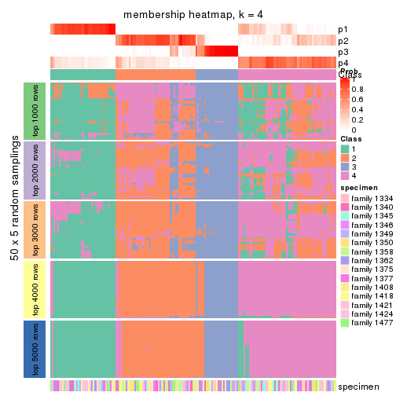</p>

</div>
<div id='tab-CV-kmeans-membership-heatmap-4'>
<pre><code class="r">membership_heatmap(res, k = 5)
</code></pre>

<p></p>

</div>
<div id='tab-CV-kmeans-membership-heatmap-5'>
<pre><code class="r">membership_heatmap(res, k = 6)
</code></pre>

<p></p>

</div>
</div>

As soon as we have had the classes for columns, we can look for signatures
which are significantly different between classes which can be candidate marks
for certain classes. Following are the heatmaps for signatures.


Signature heatmaps where rows are scaled:


<script>
$( function() {
	$( '#tabs-CV-kmeans-get-signatures' ).tabs();
} );
</script>
<div id='tabs-CV-kmeans-get-signatures'>
<ul>
<li><a href='#tab-CV-kmeans-get-signatures-1'>k = 2</a></li>
<li><a href='#tab-CV-kmeans-get-signatures-2'>k = 3</a></li>
<li><a href='#tab-CV-kmeans-get-signatures-3'>k = 4</a></li>
<li><a href='#tab-CV-kmeans-get-signatures-4'>k = 5</a></li>
<li><a href='#tab-CV-kmeans-get-signatures-5'>k = 6</a></li>
</ul>
<div id='tab-CV-kmeans-get-signatures-1'>
<pre><code class="r">get_signatures(res, k = 2)
</code></pre>

<p></p>

</div>
<div id='tab-CV-kmeans-get-signatures-2'>
<pre><code class="r">get_signatures(res, k = 3)
</code></pre>

<p></p>

</div>
<div id='tab-CV-kmeans-get-signatures-3'>
<pre><code class="r">get_signatures(res, k = 4)
</code></pre>

<p></p>

</div>
<div id='tab-CV-kmeans-get-signatures-4'>
<pre><code class="r">get_signatures(res, k = 5)
</code></pre>

<p></p>

</div>
<div id='tab-CV-kmeans-get-signatures-5'>
<pre><code class="r">get_signatures(res, k = 6)
</code></pre>

<p></p>

</div>
</div>


Signature heatmaps where rows are not scaled:


<script>
$( function() {
	$( '#tabs-CV-kmeans-get-signatures-no-scale' ).tabs();
} );
</script>
<div id='tabs-CV-kmeans-get-signatures-no-scale'>
<ul>
<li><a href='#tab-CV-kmeans-get-signatures-no-scale-1'>k = 2</a></li>
<li><a href='#tab-CV-kmeans-get-signatures-no-scale-2'>k = 3</a></li>
<li><a href='#tab-CV-kmeans-get-signatures-no-scale-3'>k = 4</a></li>
<li><a href='#tab-CV-kmeans-get-signatures-no-scale-4'>k = 5</a></li>
<li><a href='#tab-CV-kmeans-get-signatures-no-scale-5'>k = 6</a></li>
</ul>
<div id='tab-CV-kmeans-get-signatures-no-scale-1'>
<pre><code class="r">get_signatures(res, k = 2, scale_rows = FALSE)
</code></pre>

<p></p>

</div>
<div id='tab-CV-kmeans-get-signatures-no-scale-2'>
<pre><code class="r">get_signatures(res, k = 3, scale_rows = FALSE)
</code></pre>

<p></p>

</div>
<div id='tab-CV-kmeans-get-signatures-no-scale-3'>
<pre><code class="r">get_signatures(res, k = 4, scale_rows = FALSE)
</code></pre>

<p></p>

</div>
<div id='tab-CV-kmeans-get-signatures-no-scale-4'>
<pre><code class="r">get_signatures(res, k = 5, scale_rows = FALSE)
</code></pre>

<p></p>

</div>
<div id='tab-CV-kmeans-get-signatures-no-scale-5'>
<pre><code class="r">get_signatures(res, k = 6, scale_rows = FALSE)
</code></pre>

<p></p>

</div>
</div>


Compare the overlap of signatures from different k:

```r
compare_signatures(res)
```


`get_signature()` returns a data frame invisibly. TO get the list of signatures, the function
call should be assigned to a variable explicitly. In following code, if `plot` argument is set
to `FALSE`, no heatmap is plotted while only the differential analysis is performed.

```r
# code only for demonstration
tb = get_signature(res, k = ..., plot = FALSE)
```

An example of the output of `tb` is:

```
#>   which_row         fdr    mean_1    mean_2 scaled_mean_1 scaled_mean_2 km
#> 1        38 0.042760348  8.373488  9.131774    -0.5533452     0.5164555  1
#> 2        40 0.018707592  7.106213  8.469186    -0.6173731     0.5762149  1
#> 3        55 0.019134737 10.221463 11.207825    -0.6159697     0.5749050  1
#> 4        59 0.006059896  5.921854  7.869574    -0.6899429     0.6439467  1
#> 5        60 0.018055526  8.928898 10.211722    -0.6204761     0.5791110  1
#> 6        98 0.009384629 15.714769 14.887706     0.6635654    -0.6193277  2
...
```

The columns in `tb` are:

1. `which_row`: row indices corresponding to the input matrix.
2. `fdr`: FDR for the differential test. 
3. `mean_x`: The mean value in group x.
4. `scaled_mean_x`: The mean value in group x after rows are scaled.
5. `km`: Row groups if k-means clustering is applied to rows.


UMAP plot which shows how samples are separated.


<script>
$( function() {
	$( '#tabs-CV-kmeans-dimension-reduction' ).tabs();
} );
</script>
<div id='tabs-CV-kmeans-dimension-reduction'>
<ul>
<li><a href='#tab-CV-kmeans-dimension-reduction-1'>k = 2</a></li>
<li><a href='#tab-CV-kmeans-dimension-reduction-2'>k = 3</a></li>
<li><a href='#tab-CV-kmeans-dimension-reduction-3'>k = 4</a></li>
<li><a href='#tab-CV-kmeans-dimension-reduction-4'>k = 5</a></li>
<li><a href='#tab-CV-kmeans-dimension-reduction-5'>k = 6</a></li>
</ul>
<div id='tab-CV-kmeans-dimension-reduction-1'>
<pre><code class="r">dimension_reduction(res, k = 2, method = &quot;UMAP&quot;)
</code></pre>

<p></p>

</div>
<div id='tab-CV-kmeans-dimension-reduction-2'>
<pre><code class="r">dimension_reduction(res, k = 3, method = &quot;UMAP&quot;)
</code></pre>

<p></p>

</div>
<div id='tab-CV-kmeans-dimension-reduction-3'>
<pre><code class="r">dimension_reduction(res, k = 4, method = &quot;UMAP&quot;)
</code></pre>

<p></p>

</div>
<div id='tab-CV-kmeans-dimension-reduction-4'>
<pre><code class="r">dimension_reduction(res, k = 5, method = &quot;UMAP&quot;)
</code></pre>

<p></p>

</div>
<div id='tab-CV-kmeans-dimension-reduction-5'>
<pre><code class="r">dimension_reduction(res, k = 6, method = &quot;UMAP&quot;)
</code></pre>

<p></p>

</div>
</div>


Following heatmap shows how subgroups are split when increasing `k`:

```r
collect_classes(res)
```


Test correlation between subgroups and known annotations. If the known
annotation is numeric, one-way ANOVA test is applied, and if the known
annotation is discrete, chi-squared contingency table test is applied.

```r
test_to_known_factors(res)
```

```
#>             n specimen(p) k
#> CV:kmeans 162     0.00441 2
#> CV:kmeans 151     0.30717 3
#> CV:kmeans 144     0.19098 4
#> CV:kmeans 104     0.48026 5
#> CV:kmeans 123     0.00182 6
```


If matrix rows can be associated to genes, consider to use `GO_Enrichment(res,
...)` to perform function enrichment for the signature genes.


 

---------------------------------------------------


### CV:skmeans*


The object with results only for a single top-value method and a single partition method 
can be extracted as:

```r
res = res_list["CV", "skmeans"]
# you can also extract it by
# res = res_list["CV:skmeans"]
```

A summary of `res` and all the functions that can be applied to it:

```r
res
```

```
#> A 'ConsensusPartition' object with k = 2, 3, 4, 5, 6.
#>   On a matrix with 22686 rows and 167 columns.
#>   Top rows (1000, 2000, 3000, 4000, 5000) are extracted by 'CV' method.
#>   Subgroups are detected by 'skmeans' method.
#>   Performed in total 1250 partitions by row resampling.
#>   Best k for subgroups seems to be 2.
#> 
#> Following methods can be applied to this 'ConsensusPartition' object:
#>  [1] "cola_report"             "collect_classes"         "collect_plots"          
#>  [4] "collect_stats"           "colnames"                "compare_signatures"     
#>  [7] "consensus_heatmap"       "dimension_reduction"     "functional_enrichment"  
#> [10] "get_anno_col"            "get_anno"                "get_classes"            
#> [13] "get_consensus"           "get_matrix"              "get_membership"         
#> [16] "get_param"               "get_signatures"          "get_stats"              
#> [19] "is_best_k"               "is_stable_k"             "membership_heatmap"     
#> [22] "ncol"                    "nrow"                    "plot_ecdf"              
#> [25] "rownames"                "select_partition_number" "show"                   
#> [28] "suggest_best_k"          "test_to_known_factors"
```

`collect_plots()` function collects all the plots made from `res` for all `k` (number of partitions)
into one single page to provide an easy and fast comparison between different `k`.

```r
collect_plots(res)
```


The plots are:

- The first row: a plot of the ECDF (Empirical cumulative distribution
  function) curves of the consensus matrix for each `k` and the heatmap of
  predicted classes for each `k`.
- The second row: heatmaps of the consensus matrix for each `k`.
- The third row: heatmaps of the membership matrix for each `k`.
- The fouth row: heatmaps of the signatures for each `k`.

All the plots in panels can be made by individual functions and they are
plotted later in this section.

`select_partition_number()` produces several plots showing different
statistics for choosing "optimized" `k`. There are following statistics:

- ECDF curves of the consensus matrix for each `k`;
- 1-PAC. [The PAC
  score](https://en.wikipedia.org/wiki/Consensus_clustering#Over-interpretation_potential_of_consensus_clustering)
  measures the proportion of the ambiguous subgrouping.
- Mean silhouette score.
- Concordance. The mean probability of fiting the consensus class ids in all
  partitions.
- Area increased. Denote $A_k$ as the area under the ECDF curve for current
  `k`, the area increased is defined as $A_k - A_{k-1}$.
- Rand index. The percent of pairs of samples that are both in a same cluster
  or both are not in a same cluster in the partition of k and k-1.
- Jaccard index. The ratio of pairs of samples are both in a same cluster in
  the partition of k and k-1 and the pairs of samples are both in a same
  cluster in the partition k or k-1.

The detailed explanations of these statistics can be found in [the cola
vignette](http://bioconductor.org/packages/devel/bioc/vignettes/cola/inst/doc/cola.html#toc_13).

Generally speaking, lower PAC score, higher mean silhouette score or higher
concordance corresponds to better partition. Rand index and Jaccard index
measure how similar the current partition is compared to partition with `k-1`.
If they are too similar, we won't accept `k` is better than `k-1`.

```r
select_partition_number(res)
```


The numeric values for all these statistics can be obtained by `get_stats()`.

```r
get_stats(res)
```

```
#>   k 1-PAC mean_silhouette concordance area_increased  Rand Jaccard
#> 2 2 0.950           0.936       0.975         0.4990 0.503   0.503
#> 3 3 0.661           0.767       0.872         0.2414 0.895   0.793
#> 4 4 0.571           0.563       0.787         0.1488 0.867   0.684
#> 5 5 0.575           0.482       0.733         0.0612 0.942   0.818
#> 6 6 0.593           0.448       0.691         0.0436 0.912   0.712
```

`suggest_best_k()` suggests the best $k$ based on these statistics. The rules are as follows:

- All $k$ with Jaccard index larger than 0.95 are removed because the increase of
  the partition number does not provides enough extra information. If all $k$ are removed,
  the best $k$ is assigned by `NA`.
- For $k$ with 1-PAC larger than 0.9, the maximal $k$ is taken as the "best k". Other $k$ is called "optional k".
- If it does not fit the second rule. The $k$ with the highest vote of highest
  1-PAC, mean silhouette and concordance is taken as the "best k".

```r
suggest_best_k(res)
```

```
#> [1] 2
```


Following shows the table of the partitions (You need to click the **show/hide
code output** link to see it). The membership matrix (columns with name `p*`)
is inferred by
[`clue::cl_consensus()`](https://www.rdocumentation.org/link/cl_consensus?package=clue)
function with the `SE` method. Basically the value in the membership matrix
represents the probability to belong to a certain group. The finall class
label for an item is determined with the group with highest probability it
belongs to.

In `get_classes()` function, the entropy is calculated from the membership
matrix and the silhouette score is calculated from the consensus matrix.


<script>
$( function() {
	$( '#tabs-CV-skmeans-get-classes' ).tabs();
} );
</script>
<div id='tabs-CV-skmeans-get-classes'>
<ul>
<li><a href='#tab-CV-skmeans-get-classes-1'>k = 2</a></li>
<li><a href='#tab-CV-skmeans-get-classes-2'>k = 3</a></li>
<li><a href='#tab-CV-skmeans-get-classes-3'>k = 4</a></li>
<li><a href='#tab-CV-skmeans-get-classes-4'>k = 5</a></li>
<li><a href='#tab-CV-skmeans-get-classes-5'>k = 6</a></li>
</ul>

<div id='tab-CV-skmeans-get-classes-1'>
<p><a id='tab-CV-skmeans-get-classes-1-a' style='color:#0366d6' href='#'>show/hide code output</a></p>
<pre><code class="r">cbind(get_classes(res, k = 2), get_membership(res, k = 2))
</code></pre>

<pre><code>#&gt;          class entropy silhouette    p1    p2
#&gt; GSM30006     2  0.0000      0.984 0.000 1.000
#&gt; GSM30007     1  0.0000      0.966 1.000 0.000
#&gt; GSM30008     1  0.0000      0.966 1.000 0.000
#&gt; GSM30009     1  0.0000      0.966 1.000 0.000
#&gt; GSM30010     2  0.0000      0.984 0.000 1.000
#&gt; GSM30011     2  0.0000      0.984 0.000 1.000
#&gt; GSM30012     2  0.0000      0.984 0.000 1.000
#&gt; GSM30013     1  0.9922      0.207 0.552 0.448
#&gt; GSM30014     2  0.0000      0.984 0.000 1.000
#&gt; GSM30015     1  0.0000      0.966 1.000 0.000
#&gt; GSM30016     2  0.0672      0.976 0.008 0.992
#&gt; GSM30017     1  0.0000      0.966 1.000 0.000
#&gt; GSM30018     1  0.0000      0.966 1.000 0.000
#&gt; GSM30019     2  0.0000      0.984 0.000 1.000
#&gt; GSM30020     1  0.0000      0.966 1.000 0.000
#&gt; GSM30021     2  0.0000      0.984 0.000 1.000
#&gt; GSM30022     1  0.0000      0.966 1.000 0.000
#&gt; GSM30023     1  0.0000      0.966 1.000 0.000
#&gt; GSM30024     2  0.0000      0.984 0.000 1.000
#&gt; GSM30025     1  0.0000      0.966 1.000 0.000
#&gt; GSM30026     1  0.0000      0.966 1.000 0.000
#&gt; GSM30027     1  0.0000      0.966 1.000 0.000
#&gt; GSM30028     1  0.0000      0.966 1.000 0.000
#&gt; GSM30029     1  0.0000      0.966 1.000 0.000
#&gt; GSM30030     1  0.0000      0.966 1.000 0.000
#&gt; GSM30031     1  0.0000      0.966 1.000 0.000
#&gt; GSM30032     2  0.0000      0.984 0.000 1.000
#&gt; GSM30033     2  0.0000      0.984 0.000 1.000
#&gt; GSM30034     1  0.0000      0.966 1.000 0.000
#&gt; GSM30035     2  0.0000      0.984 0.000 1.000
#&gt; GSM30036     1  0.0000      0.966 1.000 0.000
#&gt; GSM30037     1  0.0000      0.966 1.000 0.000
#&gt; GSM30038     2  0.0000      0.984 0.000 1.000
#&gt; GSM30039     2  0.0000      0.984 0.000 1.000
#&gt; GSM30040     2  0.0000      0.984 0.000 1.000
#&gt; GSM30041     2  0.0000      0.984 0.000 1.000
#&gt; GSM30042     2  0.0000      0.984 0.000 1.000
#&gt; GSM30043     2  0.0000      0.984 0.000 1.000
#&gt; GSM30044     1  0.0000      0.966 1.000 0.000
#&gt; GSM30045     1  0.0000      0.966 1.000 0.000
#&gt; GSM30046     1  0.0000      0.966 1.000 0.000
#&gt; GSM30047     1  0.0000      0.966 1.000 0.000
#&gt; GSM30048     1  0.0000      0.966 1.000 0.000
#&gt; GSM30049     2  0.0000      0.984 0.000 1.000
#&gt; GSM30050     1  0.0000      0.966 1.000 0.000
#&gt; GSM30051     2  0.0000      0.984 0.000 1.000
#&gt; GSM30052     1  0.0000      0.966 1.000 0.000
#&gt; GSM30053     2  0.0000      0.984 0.000 1.000
#&gt; GSM30054     2  0.0000      0.984 0.000 1.000
#&gt; GSM30055     2  0.0000      0.984 0.000 1.000
#&gt; GSM30056     2  0.0000      0.984 0.000 1.000
#&gt; GSM30057     2  0.0000      0.984 0.000 1.000
#&gt; GSM30058     2  0.0000      0.984 0.000 1.000
#&gt; GSM30059     1  0.0000      0.966 1.000 0.000
#&gt; GSM30060     2  0.0000      0.984 0.000 1.000
#&gt; GSM30061     2  0.0000      0.984 0.000 1.000
#&gt; GSM30062     1  0.0376      0.963 0.996 0.004
#&gt; GSM30063     2  0.0000      0.984 0.000 1.000
#&gt; GSM30064     1  0.0000      0.966 1.000 0.000
#&gt; GSM30065     2  0.0000      0.984 0.000 1.000
#&gt; GSM30066     2  0.0000      0.984 0.000 1.000
#&gt; GSM30067     1  0.0000      0.966 1.000 0.000
#&gt; GSM30068     2  0.0000      0.984 0.000 1.000
#&gt; GSM30069     2  0.0000      0.984 0.000 1.000
#&gt; GSM30070     2  0.0000      0.984 0.000 1.000
#&gt; GSM30071     2  0.0000      0.984 0.000 1.000
#&gt; GSM30072     1  0.0000      0.966 1.000 0.000
#&gt; GSM30073     2  0.3114      0.927 0.056 0.944
#&gt; GSM30074     2  0.0000      0.984 0.000 1.000
#&gt; GSM30075     2  0.0000      0.984 0.000 1.000
#&gt; GSM30076     1  0.0000      0.966 1.000 0.000
#&gt; GSM30077     1  0.0000      0.966 1.000 0.000
#&gt; GSM30078     1  0.0000      0.966 1.000 0.000
#&gt; GSM30079     1  0.0000      0.966 1.000 0.000
#&gt; GSM30080     2  0.6438      0.790 0.164 0.836
#&gt; GSM30081     2  0.0000      0.984 0.000 1.000
#&gt; GSM30086     1  0.9970      0.142 0.532 0.468
#&gt; GSM30087     1  0.0000      0.966 1.000 0.000
#&gt; GSM30088     1  0.0000      0.966 1.000 0.000
#&gt; GSM30089     1  0.7528      0.726 0.784 0.216
#&gt; GSM30090     2  0.0000      0.984 0.000 1.000
#&gt; GSM30091     2  0.0000      0.984 0.000 1.000
#&gt; GSM30092     1  0.0000      0.966 1.000 0.000
#&gt; GSM30093     2  0.0000      0.984 0.000 1.000
#&gt; GSM30094     2  0.0000      0.984 0.000 1.000
#&gt; GSM30095     2  0.0000      0.984 0.000 1.000
#&gt; GSM30096     1  0.0000      0.966 1.000 0.000
#&gt; GSM30097     1  0.0000      0.966 1.000 0.000
#&gt; GSM30098     1  0.0000      0.966 1.000 0.000
#&gt; GSM30099     2  0.0000      0.984 0.000 1.000
#&gt; GSM30100     2  0.0000      0.984 0.000 1.000
#&gt; GSM30101     2  0.0000      0.984 0.000 1.000
#&gt; GSM30102     2  0.0000      0.984 0.000 1.000
#&gt; GSM30103     2  0.0000      0.984 0.000 1.000
#&gt; GSM30104     2  0.0000      0.984 0.000 1.000
#&gt; GSM30105     1  0.0000      0.966 1.000 0.000
#&gt; GSM30106     1  0.0000      0.966 1.000 0.000
#&gt; GSM30107     1  0.0000      0.966 1.000 0.000
#&gt; GSM30108     2  0.0000      0.984 0.000 1.000
#&gt; GSM30109     1  0.0000      0.966 1.000 0.000
#&gt; GSM30110     1  0.0000      0.966 1.000 0.000
#&gt; GSM30111     2  0.9954      0.105 0.460 0.540
#&gt; GSM30112     1  0.7219      0.747 0.800 0.200
#&gt; GSM30113     2  0.0000      0.984 0.000 1.000
#&gt; GSM30114     2  0.0000      0.984 0.000 1.000
#&gt; GSM30115     1  0.0000      0.966 1.000 0.000
#&gt; GSM30116     2  0.0000      0.984 0.000 1.000
#&gt; GSM30117     2  0.0000      0.984 0.000 1.000
#&gt; GSM30118     2  0.0000      0.984 0.000 1.000
#&gt; GSM30119     2  0.0000      0.984 0.000 1.000
#&gt; GSM30120     1  0.0000      0.966 1.000 0.000
#&gt; GSM30121     1  0.0000      0.966 1.000 0.000
#&gt; GSM30122     1  0.0000      0.966 1.000 0.000
#&gt; GSM30123     2  0.0000      0.984 0.000 1.000
#&gt; GSM30177     2  0.0000      0.984 0.000 1.000
#&gt; GSM30178     1  0.4815      0.867 0.896 0.104
#&gt; GSM30179     1  0.0000      0.966 1.000 0.000
#&gt; GSM30180     1  0.0000      0.966 1.000 0.000
#&gt; GSM30181     1  0.9710      0.356 0.600 0.400
#&gt; GSM30182     1  0.0000      0.966 1.000 0.000
#&gt; GSM30183     1  0.0000      0.966 1.000 0.000
#&gt; GSM30184     2  0.0000      0.984 0.000 1.000
#&gt; GSM30185     1  0.9686      0.367 0.604 0.396
#&gt; GSM30186     2  0.0000      0.984 0.000 1.000
#&gt; GSM30187     1  0.0000      0.966 1.000 0.000
#&gt; GSM30188     1  0.0000      0.966 1.000 0.000
#&gt; GSM30189     1  0.0000      0.966 1.000 0.000
#&gt; GSM30190     2  0.0000      0.984 0.000 1.000
#&gt; GSM30191     2  0.0000      0.984 0.000 1.000
#&gt; GSM30192     1  0.6801      0.770 0.820 0.180
#&gt; GSM30193     1  0.0000      0.966 1.000 0.000
#&gt; GSM30194     2  0.0000      0.984 0.000 1.000
#&gt; GSM30195     1  0.7602      0.713 0.780 0.220
#&gt; GSM30196     1  0.0000      0.966 1.000 0.000
#&gt; GSM30197     1  0.0000      0.966 1.000 0.000
#&gt; GSM30198     1  0.0000      0.966 1.000 0.000
#&gt; GSM30199     2  0.0000      0.984 0.000 1.000
#&gt; GSM30200     1  0.0000      0.966 1.000 0.000
#&gt; GSM30201     1  0.0000      0.966 1.000 0.000
#&gt; GSM30202     1  0.0000      0.966 1.000 0.000
#&gt; GSM30203     1  0.0000      0.966 1.000 0.000
#&gt; GSM30204     1  0.0000      0.966 1.000 0.000
#&gt; GSM30205     2  0.1843      0.958 0.028 0.972
#&gt; GSM30206     1  0.0000      0.966 1.000 0.000
#&gt; GSM30207     1  0.9686      0.355 0.604 0.396
#&gt; GSM30208     1  0.0000      0.966 1.000 0.000
#&gt; GSM30209     2  0.0000      0.984 0.000 1.000
#&gt; GSM30210     1  0.0000      0.966 1.000 0.000
#&gt; GSM30211     1  0.0000      0.966 1.000 0.000
#&gt; GSM30212     1  0.0000      0.966 1.000 0.000
#&gt; GSM30213     1  0.0000      0.966 1.000 0.000
#&gt; GSM30214     1  0.0000      0.966 1.000 0.000
#&gt; GSM30215     1  0.0000      0.966 1.000 0.000
#&gt; GSM30216     1  0.0000      0.966 1.000 0.000
#&gt; GSM30217     1  0.0000      0.966 1.000 0.000
#&gt; GSM30218     2  0.0000      0.984 0.000 1.000
#&gt; GSM30219     2  0.0000      0.984 0.000 1.000
#&gt; GSM30220     1  0.0000      0.966 1.000 0.000
#&gt; GSM30221     1  0.0000      0.966 1.000 0.000
#&gt; GSM30222     1  0.0000      0.966 1.000 0.000
#&gt; GSM30223     1  0.0000      0.966 1.000 0.000
#&gt; GSM30224     1  0.0000      0.966 1.000 0.000
#&gt; GSM30225     1  0.0000      0.966 1.000 0.000
#&gt; GSM30226     2  0.0000      0.984 0.000 1.000
#&gt; GSM30227     1  0.0000      0.966 1.000 0.000
#&gt; GSM30228     2  0.0000      0.984 0.000 1.000
#&gt; GSM30229     2  0.9710      0.297 0.400 0.600
</code></pre>

<script>
$('#tab-CV-skmeans-get-classes-1-a').parent().next().next().hide();
$('#tab-CV-skmeans-get-classes-1-a').click(function(){
  $('#tab-CV-skmeans-get-classes-1-a').parent().next().next().toggle();
  return(false);
});
</script>
</div>

<div id='tab-CV-skmeans-get-classes-2'>
<p><a id='tab-CV-skmeans-get-classes-2-a' style='color:#0366d6' href='#'>show/hide code output</a></p>
<pre><code class="r">cbind(get_classes(res, k = 3), get_membership(res, k = 3))
</code></pre>

<pre><code>#&gt;          class entropy silhouette    p1    p2    p3
#&gt; GSM30006     2  0.2448     0.8606 0.000 0.924 0.076
#&gt; GSM30007     1  0.0237     0.8533 0.996 0.000 0.004
#&gt; GSM30008     1  0.0237     0.8533 0.996 0.000 0.004
#&gt; GSM30009     1  0.0237     0.8533 0.996 0.000 0.004
#&gt; GSM30010     2  0.3686     0.7973 0.000 0.860 0.140
#&gt; GSM30011     2  0.1753     0.8824 0.000 0.952 0.048
#&gt; GSM30012     2  0.4702     0.7062 0.000 0.788 0.212
#&gt; GSM30013     3  0.5823     0.6906 0.144 0.064 0.792
#&gt; GSM30014     2  0.4605     0.7184 0.000 0.796 0.204
#&gt; GSM30015     1  0.6126     0.4349 0.600 0.000 0.400
#&gt; GSM30016     3  0.6541     0.6191 0.024 0.304 0.672
#&gt; GSM30017     1  0.0237     0.8533 0.996 0.000 0.004
#&gt; GSM30018     1  0.2796     0.8399 0.908 0.000 0.092
#&gt; GSM30019     2  0.4504     0.7299 0.000 0.804 0.196
#&gt; GSM30020     1  0.4555     0.6650 0.800 0.000 0.200
#&gt; GSM30021     2  0.5363     0.5847 0.000 0.724 0.276
#&gt; GSM30022     1  0.0237     0.8533 0.996 0.000 0.004
#&gt; GSM30023     1  0.5216     0.5698 0.740 0.000 0.260
#&gt; GSM30024     2  0.3267     0.8242 0.000 0.884 0.116
#&gt; GSM30025     1  0.0237     0.8533 0.996 0.000 0.004
#&gt; GSM30026     1  0.1411     0.8546 0.964 0.000 0.036
#&gt; GSM30027     1  0.2537     0.8274 0.920 0.000 0.080
#&gt; GSM30028     1  0.5098     0.5907 0.752 0.000 0.248
#&gt; GSM30029     1  0.0237     0.8533 0.996 0.000 0.004
#&gt; GSM30030     1  0.0237     0.8533 0.996 0.000 0.004
#&gt; GSM30031     1  0.0237     0.8533 0.996 0.000 0.004
#&gt; GSM30032     2  0.0237     0.9090 0.000 0.996 0.004
#&gt; GSM30033     2  0.0892     0.9034 0.000 0.980 0.020
#&gt; GSM30034     1  0.1411     0.8535 0.964 0.000 0.036
#&gt; GSM30035     2  0.0592     0.9068 0.000 0.988 0.012
#&gt; GSM30036     1  0.4121     0.8006 0.832 0.000 0.168
#&gt; GSM30037     1  0.0424     0.8529 0.992 0.000 0.008
#&gt; GSM30038     3  0.6155     0.5904 0.008 0.328 0.664
#&gt; GSM30039     2  0.4750     0.7004 0.000 0.784 0.216
#&gt; GSM30040     2  0.0000     0.9099 0.000 1.000 0.000
#&gt; GSM30041     2  0.0000     0.9099 0.000 1.000 0.000
#&gt; GSM30042     2  0.4605     0.7184 0.000 0.796 0.204
#&gt; GSM30043     2  0.0000     0.9099 0.000 1.000 0.000
#&gt; GSM30044     1  0.0237     0.8533 0.996 0.000 0.004
#&gt; GSM30045     1  0.0237     0.8533 0.996 0.000 0.004
#&gt; GSM30046     1  0.2537     0.8440 0.920 0.000 0.080
#&gt; GSM30047     1  0.0592     0.8518 0.988 0.000 0.012
#&gt; GSM30048     1  0.0237     0.8533 0.996 0.000 0.004
#&gt; GSM30049     2  0.0000     0.9099 0.000 1.000 0.000
#&gt; GSM30050     1  0.3038     0.8362 0.896 0.000 0.104
#&gt; GSM30051     2  0.0000     0.9099 0.000 1.000 0.000
#&gt; GSM30052     1  0.0237     0.8533 0.996 0.000 0.004
#&gt; GSM30053     2  0.4702     0.7062 0.000 0.788 0.212
#&gt; GSM30054     2  0.0000     0.9099 0.000 1.000 0.000
#&gt; GSM30055     2  0.2711     0.8484 0.000 0.912 0.088
#&gt; GSM30056     2  0.0237     0.9090 0.000 0.996 0.004
#&gt; GSM30057     2  0.3752     0.7931 0.000 0.856 0.144
#&gt; GSM30058     2  0.0000     0.9099 0.000 1.000 0.000
#&gt; GSM30059     1  0.4887     0.7644 0.772 0.000 0.228
#&gt; GSM30060     2  0.0000     0.9099 0.000 1.000 0.000
#&gt; GSM30061     2  0.1964     0.8759 0.000 0.944 0.056
#&gt; GSM30062     1  0.6917     0.5970 0.608 0.024 0.368
#&gt; GSM30063     2  0.0000     0.9099 0.000 1.000 0.000
#&gt; GSM30064     1  0.0237     0.8533 0.996 0.000 0.004
#&gt; GSM30065     2  0.4504     0.7365 0.000 0.804 0.196
#&gt; GSM30066     2  0.0000     0.9099 0.000 1.000 0.000
#&gt; GSM30067     1  0.0237     0.8533 0.996 0.000 0.004
#&gt; GSM30068     2  0.4399     0.7397 0.000 0.812 0.188
#&gt; GSM30069     2  0.5760     0.4807 0.000 0.672 0.328
#&gt; GSM30070     3  0.5785     0.5835 0.000 0.332 0.668
#&gt; GSM30071     3  0.5810     0.5777 0.000 0.336 0.664
#&gt; GSM30072     1  0.6095     0.2390 0.608 0.000 0.392
#&gt; GSM30073     3  0.6410     0.3928 0.004 0.420 0.576
#&gt; GSM30074     3  0.5835     0.5706 0.000 0.340 0.660
#&gt; GSM30075     2  0.1753     0.8919 0.000 0.952 0.048
#&gt; GSM30076     1  0.5988     0.4806 0.632 0.000 0.368
#&gt; GSM30077     1  0.3482     0.8336 0.872 0.000 0.128
#&gt; GSM30078     1  0.5465     0.7250 0.712 0.000 0.288
#&gt; GSM30079     1  0.0424     0.8544 0.992 0.000 0.008
#&gt; GSM30080     3  0.4475     0.6869 0.016 0.144 0.840
#&gt; GSM30081     2  0.0000     0.9099 0.000 1.000 0.000
#&gt; GSM30086     3  0.3947     0.6899 0.076 0.040 0.884
#&gt; GSM30087     1  0.3686     0.8316 0.860 0.000 0.140
#&gt; GSM30088     1  0.2625     0.8426 0.916 0.000 0.084
#&gt; GSM30089     3  0.6192     0.3682 0.420 0.000 0.580
#&gt; GSM30090     2  0.0000     0.9099 0.000 1.000 0.000
#&gt; GSM30091     2  0.0000     0.9099 0.000 1.000 0.000
#&gt; GSM30092     1  0.5465     0.6335 0.712 0.000 0.288
#&gt; GSM30093     2  0.0592     0.9068 0.000 0.988 0.012
#&gt; GSM30094     2  0.0000     0.9099 0.000 1.000 0.000
#&gt; GSM30095     2  0.0000     0.9099 0.000 1.000 0.000
#&gt; GSM30096     1  0.2066     0.8481 0.940 0.000 0.060
#&gt; GSM30097     1  0.1860     0.8517 0.948 0.000 0.052
#&gt; GSM30098     1  0.2261     0.8470 0.932 0.000 0.068
#&gt; GSM30099     2  0.0592     0.9068 0.000 0.988 0.012
#&gt; GSM30100     2  0.0000     0.9099 0.000 1.000 0.000
#&gt; GSM30101     2  0.0000     0.9099 0.000 1.000 0.000
#&gt; GSM30102     2  0.0892     0.9034 0.000 0.980 0.020
#&gt; GSM30103     2  0.0747     0.9052 0.000 0.984 0.016
#&gt; GSM30104     2  0.0592     0.9068 0.000 0.988 0.012
#&gt; GSM30105     1  0.0424     0.8544 0.992 0.000 0.008
#&gt; GSM30106     1  0.3340     0.8391 0.880 0.000 0.120
#&gt; GSM30107     1  0.1163     0.8486 0.972 0.000 0.028
#&gt; GSM30108     3  0.7300     0.6406 0.064 0.272 0.664
#&gt; GSM30109     1  0.1289     0.8548 0.968 0.000 0.032
#&gt; GSM30110     1  0.0892     0.8557 0.980 0.000 0.020
#&gt; GSM30111     3  0.7683     0.6106 0.280 0.080 0.640
#&gt; GSM30112     3  0.7395     0.1501 0.380 0.040 0.580
#&gt; GSM30113     2  0.0000     0.9099 0.000 1.000 0.000
#&gt; GSM30114     3  0.5138     0.6550 0.000 0.252 0.748
#&gt; GSM30115     3  0.5216     0.5180 0.260 0.000 0.740
#&gt; GSM30116     2  0.0000     0.9099 0.000 1.000 0.000
#&gt; GSM30117     2  0.1289     0.8967 0.000 0.968 0.032
#&gt; GSM30118     2  0.1529     0.8914 0.000 0.960 0.040
#&gt; GSM30119     2  0.4842     0.6870 0.000 0.776 0.224
#&gt; GSM30120     3  0.3267     0.5908 0.116 0.000 0.884
#&gt; GSM30121     1  0.1289     0.8548 0.968 0.000 0.032
#&gt; GSM30122     1  0.3551     0.8223 0.868 0.000 0.132
#&gt; GSM30123     2  0.2165     0.8669 0.000 0.936 0.064
#&gt; GSM30177     2  0.0592     0.9068 0.000 0.988 0.012
#&gt; GSM30178     1  0.9825     0.0855 0.388 0.244 0.368
#&gt; GSM30179     1  0.3482     0.8263 0.872 0.000 0.128
#&gt; GSM30180     1  0.5363     0.7406 0.724 0.000 0.276
#&gt; GSM30181     1  0.9229     0.1286 0.424 0.152 0.424
#&gt; GSM30182     1  0.4346     0.8099 0.816 0.000 0.184
#&gt; GSM30183     1  0.3619     0.8310 0.864 0.000 0.136
#&gt; GSM30184     2  0.0000     0.9099 0.000 1.000 0.000
#&gt; GSM30185     1  0.9457     0.1275 0.468 0.340 0.192
#&gt; GSM30186     2  0.1163     0.8991 0.000 0.972 0.028
#&gt; GSM30187     1  0.5291     0.7420 0.732 0.000 0.268
#&gt; GSM30188     1  0.4346     0.8102 0.816 0.000 0.184
#&gt; GSM30189     1  0.5178     0.7595 0.744 0.000 0.256
#&gt; GSM30190     2  0.0000     0.9099 0.000 1.000 0.000
#&gt; GSM30191     2  0.4062     0.7421 0.000 0.836 0.164
#&gt; GSM30192     3  0.5553     0.3115 0.272 0.004 0.724
#&gt; GSM30193     1  0.5785     0.6830 0.668 0.000 0.332
#&gt; GSM30194     2  0.0000     0.9099 0.000 1.000 0.000
#&gt; GSM30195     3  0.4172     0.6259 0.156 0.004 0.840
#&gt; GSM30196     1  0.0237     0.8533 0.996 0.000 0.004
#&gt; GSM30197     1  0.6154     0.4827 0.592 0.000 0.408
#&gt; GSM30198     1  0.2356     0.8462 0.928 0.000 0.072
#&gt; GSM30199     2  0.1289     0.8970 0.000 0.968 0.032
#&gt; GSM30200     1  0.2796     0.8399 0.908 0.000 0.092
#&gt; GSM30201     1  0.0747     0.8553 0.984 0.000 0.016
#&gt; GSM30202     1  0.5650     0.7046 0.688 0.000 0.312
#&gt; GSM30203     1  0.5760     0.6894 0.672 0.000 0.328
#&gt; GSM30204     1  0.0237     0.8533 0.996 0.000 0.004
#&gt; GSM30205     3  0.7353     0.6042 0.052 0.316 0.632
#&gt; GSM30206     1  0.4291     0.8125 0.820 0.000 0.180
#&gt; GSM30207     1  0.9438     0.0869 0.504 0.244 0.252
#&gt; GSM30208     1  0.2959     0.8358 0.900 0.000 0.100
#&gt; GSM30209     2  0.3816     0.7584 0.000 0.852 0.148
#&gt; GSM30210     1  0.2959     0.8358 0.900 0.000 0.100
#&gt; GSM30211     1  0.2711     0.8464 0.912 0.000 0.088
#&gt; GSM30212     1  0.0237     0.8533 0.996 0.000 0.004
#&gt; GSM30213     1  0.2537     0.8432 0.920 0.000 0.080
#&gt; GSM30214     1  0.1289     0.8555 0.968 0.000 0.032
#&gt; GSM30215     1  0.1964     0.8491 0.944 0.000 0.056
#&gt; GSM30216     1  0.2959     0.8358 0.900 0.000 0.100
#&gt; GSM30217     1  0.2878     0.8365 0.904 0.000 0.096
#&gt; GSM30218     2  0.1031     0.9018 0.000 0.976 0.024
#&gt; GSM30219     2  0.0000     0.9099 0.000 1.000 0.000
#&gt; GSM30220     1  0.0237     0.8533 0.996 0.000 0.004
#&gt; GSM30221     1  0.5098     0.7401 0.752 0.000 0.248
#&gt; GSM30222     1  0.6168     0.5427 0.588 0.000 0.412
#&gt; GSM30223     1  0.0237     0.8533 0.996 0.000 0.004
#&gt; GSM30224     1  0.2959     0.8429 0.900 0.000 0.100
#&gt; GSM30225     1  0.4121     0.8186 0.832 0.000 0.168
#&gt; GSM30226     2  0.0592     0.9068 0.000 0.988 0.012
#&gt; GSM30227     1  0.1031     0.8553 0.976 0.000 0.024
#&gt; GSM30228     2  0.0000     0.9099 0.000 1.000 0.000
#&gt; GSM30229     2  0.8821     0.0450 0.304 0.552 0.144
</code></pre>

<script>
$('#tab-CV-skmeans-get-classes-2-a').parent().next().next().hide();
$('#tab-CV-skmeans-get-classes-2-a').click(function(){
  $('#tab-CV-skmeans-get-classes-2-a').parent().next().next().toggle();
  return(false);
});
</script>
</div>

<div id='tab-CV-skmeans-get-classes-3'>
<p><a id='tab-CV-skmeans-get-classes-3-a' style='color:#0366d6' href='#'>show/hide code output</a></p>
<pre><code class="r">cbind(get_classes(res, k = 4), get_membership(res, k = 4))
</code></pre>

<pre><code>#&gt;          class entropy silhouette    p1    p2    p3    p4
#&gt; GSM30006     2  0.4356     0.5303 0.000 0.708 0.292 0.000
#&gt; GSM30007     1  0.0336     0.7236 0.992 0.000 0.000 0.008
#&gt; GSM30008     1  0.1211     0.7265 0.960 0.000 0.000 0.040
#&gt; GSM30009     1  0.0336     0.7248 0.992 0.000 0.000 0.008
#&gt; GSM30010     2  0.4222     0.5584 0.000 0.728 0.272 0.000
#&gt; GSM30011     2  0.4008     0.6018 0.000 0.756 0.244 0.000
#&gt; GSM30012     2  0.4972     0.1525 0.000 0.544 0.456 0.000
#&gt; GSM30013     3  0.3861     0.6590 0.056 0.008 0.856 0.080
#&gt; GSM30014     2  0.4888     0.2817 0.000 0.588 0.412 0.000
#&gt; GSM30015     4  0.7670     0.3368 0.364 0.000 0.216 0.420
#&gt; GSM30016     3  0.2647     0.7642 0.000 0.120 0.880 0.000
#&gt; GSM30017     1  0.0336     0.7242 0.992 0.000 0.000 0.008
#&gt; GSM30018     1  0.4661     0.3078 0.652 0.000 0.000 0.348
#&gt; GSM30019     2  0.4888     0.2819 0.000 0.588 0.412 0.000
#&gt; GSM30020     1  0.3760     0.6407 0.836 0.000 0.136 0.028
#&gt; GSM30021     2  0.4992     0.0809 0.000 0.524 0.476 0.000
#&gt; GSM30022     1  0.0336     0.7245 0.992 0.000 0.000 0.008
#&gt; GSM30023     1  0.2944     0.6531 0.868 0.000 0.128 0.004
#&gt; GSM30024     2  0.4304     0.5618 0.000 0.716 0.284 0.000
#&gt; GSM30025     1  0.2610     0.6846 0.900 0.000 0.012 0.088
#&gt; GSM30026     1  0.4103     0.5024 0.744 0.000 0.000 0.256
#&gt; GSM30027     1  0.4677     0.5730 0.776 0.000 0.048 0.176
#&gt; GSM30028     1  0.2714     0.6671 0.884 0.000 0.112 0.004
#&gt; GSM30029     1  0.0188     0.7240 0.996 0.000 0.000 0.004
#&gt; GSM30030     1  0.0188     0.7245 0.996 0.000 0.000 0.004
#&gt; GSM30031     1  0.1867     0.7041 0.928 0.000 0.000 0.072
#&gt; GSM30032     2  0.1661     0.7884 0.000 0.944 0.052 0.004
#&gt; GSM30033     2  0.3758     0.7462 0.000 0.848 0.104 0.048
#&gt; GSM30034     1  0.3801     0.5525 0.780 0.000 0.000 0.220
#&gt; GSM30035     2  0.2882     0.7691 0.000 0.892 0.084 0.024
#&gt; GSM30036     4  0.6315     0.2916 0.432 0.000 0.060 0.508
#&gt; GSM30037     1  0.2329     0.6952 0.916 0.000 0.012 0.072
#&gt; GSM30038     3  0.2647     0.7642 0.000 0.120 0.880 0.000
#&gt; GSM30039     2  0.4948     0.2029 0.000 0.560 0.440 0.000
#&gt; GSM30040     2  0.1118     0.7977 0.000 0.964 0.036 0.000
#&gt; GSM30041     2  0.1118     0.7977 0.000 0.964 0.036 0.000
#&gt; GSM30042     2  0.4888     0.2817 0.000 0.588 0.412 0.000
#&gt; GSM30043     2  0.1118     0.7977 0.000 0.964 0.036 0.000
#&gt; GSM30044     1  0.0188     0.7240 0.996 0.000 0.000 0.004
#&gt; GSM30045     1  0.1557     0.7130 0.944 0.000 0.000 0.056
#&gt; GSM30046     1  0.4585     0.3491 0.668 0.000 0.000 0.332
#&gt; GSM30047     1  0.3099     0.6766 0.876 0.000 0.020 0.104
#&gt; GSM30048     1  0.0188     0.7240 0.996 0.000 0.000 0.004
#&gt; GSM30049     2  0.1118     0.7977 0.000 0.964 0.036 0.000
#&gt; GSM30050     1  0.4855     0.2899 0.644 0.000 0.004 0.352
#&gt; GSM30051     2  0.1118     0.7977 0.000 0.964 0.036 0.000
#&gt; GSM30052     1  0.1940     0.6993 0.924 0.000 0.000 0.076
#&gt; GSM30053     2  0.4967     0.1655 0.000 0.548 0.452 0.000
#&gt; GSM30054     2  0.0469     0.8003 0.000 0.988 0.012 0.000
#&gt; GSM30055     2  0.5309     0.6210 0.000 0.700 0.256 0.044
#&gt; GSM30056     2  0.1022     0.7966 0.000 0.968 0.032 0.000
#&gt; GSM30057     2  0.4454     0.5006 0.000 0.692 0.308 0.000
#&gt; GSM30058     2  0.0921     0.7993 0.000 0.972 0.028 0.000
#&gt; GSM30059     4  0.5649     0.5183 0.344 0.000 0.036 0.620
#&gt; GSM30060     2  0.0707     0.7988 0.000 0.980 0.020 0.000
#&gt; GSM30061     2  0.3903     0.7422 0.000 0.844 0.076 0.080
#&gt; GSM30062     4  0.2048     0.6021 0.064 0.000 0.008 0.928
#&gt; GSM30063     2  0.1022     0.7986 0.000 0.968 0.032 0.000
#&gt; GSM30064     1  0.1743     0.7121 0.940 0.000 0.004 0.056
#&gt; GSM30065     3  0.4941     0.1909 0.000 0.436 0.564 0.000
#&gt; GSM30066     2  0.1118     0.7977 0.000 0.964 0.036 0.000
#&gt; GSM30067     1  0.0469     0.7246 0.988 0.000 0.000 0.012
#&gt; GSM30068     2  0.4585     0.4571 0.000 0.668 0.332 0.000
#&gt; GSM30069     3  0.4985     0.0641 0.000 0.468 0.532 0.000
#&gt; GSM30070     3  0.2647     0.7642 0.000 0.120 0.880 0.000
#&gt; GSM30071     3  0.2647     0.7642 0.000 0.120 0.880 0.000
#&gt; GSM30072     1  0.3831     0.5543 0.792 0.000 0.204 0.004
#&gt; GSM30073     3  0.7692     0.4131 0.000 0.276 0.456 0.268
#&gt; GSM30074     3  0.2921     0.7535 0.000 0.140 0.860 0.000
#&gt; GSM30075     2  0.4710     0.7100 0.000 0.792 0.120 0.088
#&gt; GSM30076     1  0.7640    -0.1987 0.432 0.000 0.212 0.356
#&gt; GSM30077     1  0.4967    -0.0109 0.548 0.000 0.000 0.452
#&gt; GSM30078     4  0.4482     0.5953 0.264 0.000 0.008 0.728
#&gt; GSM30079     1  0.1940     0.7043 0.924 0.000 0.000 0.076
#&gt; GSM30080     3  0.3521     0.7145 0.000 0.052 0.864 0.084
#&gt; GSM30081     2  0.1118     0.7977 0.000 0.964 0.036 0.000
#&gt; GSM30086     3  0.5475     0.4792 0.036 0.000 0.656 0.308
#&gt; GSM30087     1  0.4925     0.1062 0.572 0.000 0.000 0.428
#&gt; GSM30088     1  0.4746     0.2499 0.632 0.000 0.000 0.368
#&gt; GSM30089     1  0.5817     0.4043 0.676 0.000 0.248 0.076
#&gt; GSM30090     2  0.0707     0.8001 0.000 0.980 0.020 0.000
#&gt; GSM30091     2  0.1118     0.7977 0.000 0.964 0.036 0.000
#&gt; GSM30092     1  0.6792     0.0803 0.548 0.000 0.112 0.340
#&gt; GSM30093     2  0.1398     0.7958 0.000 0.956 0.040 0.004
#&gt; GSM30094     2  0.0592     0.8002 0.000 0.984 0.016 0.000
#&gt; GSM30095     2  0.0707     0.8004 0.000 0.980 0.020 0.000
#&gt; GSM30096     1  0.3870     0.5933 0.788 0.000 0.004 0.208
#&gt; GSM30097     1  0.4477     0.3851 0.688 0.000 0.000 0.312
#&gt; GSM30098     1  0.3219     0.6459 0.836 0.000 0.000 0.164
#&gt; GSM30099     2  0.2329     0.7781 0.000 0.916 0.072 0.012
#&gt; GSM30100     2  0.1118     0.7977 0.000 0.964 0.036 0.000
#&gt; GSM30101     2  0.1118     0.7977 0.000 0.964 0.036 0.000
#&gt; GSM30102     2  0.2813     0.7708 0.000 0.896 0.080 0.024
#&gt; GSM30103     2  0.3176     0.7640 0.000 0.880 0.084 0.036
#&gt; GSM30104     2  0.3354     0.7600 0.000 0.872 0.084 0.044
#&gt; GSM30105     1  0.1637     0.7118 0.940 0.000 0.000 0.060
#&gt; GSM30106     1  0.4699     0.3965 0.676 0.000 0.004 0.320
#&gt; GSM30107     1  0.0779     0.7213 0.980 0.000 0.004 0.016
#&gt; GSM30108     3  0.3907     0.7501 0.044 0.120 0.836 0.000
#&gt; GSM30109     1  0.2973     0.6648 0.856 0.000 0.000 0.144
#&gt; GSM30110     1  0.2973     0.7018 0.856 0.000 0.000 0.144
#&gt; GSM30111     3  0.6457     0.4037 0.276 0.020 0.640 0.064
#&gt; GSM30112     4  0.7913     0.2654 0.192 0.012 0.348 0.448
#&gt; GSM30113     2  0.1022     0.7986 0.000 0.968 0.032 0.000
#&gt; GSM30114     3  0.3205     0.7562 0.000 0.104 0.872 0.024
#&gt; GSM30115     3  0.6970     0.0989 0.168 0.000 0.576 0.256
#&gt; GSM30116     2  0.1022     0.7967 0.000 0.968 0.032 0.000
#&gt; GSM30117     2  0.3858     0.7434 0.000 0.844 0.100 0.056
#&gt; GSM30118     2  0.3398     0.7637 0.000 0.872 0.068 0.060
#&gt; GSM30119     2  0.4916     0.2481 0.000 0.576 0.424 0.000
#&gt; GSM30120     4  0.5847     0.0461 0.036 0.000 0.404 0.560
#&gt; GSM30121     1  0.3074     0.6598 0.848 0.000 0.000 0.152
#&gt; GSM30122     1  0.5573    -0.1162 0.508 0.004 0.012 0.476
#&gt; GSM30123     2  0.5995     0.5551 0.000 0.672 0.096 0.232
#&gt; GSM30177     2  0.2882     0.7686 0.000 0.892 0.084 0.024
#&gt; GSM30178     4  0.4375     0.6372 0.156 0.016 0.020 0.808
#&gt; GSM30179     4  0.5277     0.0594 0.460 0.000 0.008 0.532
#&gt; GSM30180     4  0.4331     0.5753 0.288 0.000 0.000 0.712
#&gt; GSM30181     4  0.4720     0.4267 0.016 0.056 0.120 0.808
#&gt; GSM30182     4  0.4967     0.2763 0.452 0.000 0.000 0.548
#&gt; GSM30183     4  0.4999    -0.1063 0.492 0.000 0.000 0.508
#&gt; GSM30184     2  0.0469     0.8002 0.000 0.988 0.012 0.000
#&gt; GSM30185     4  0.7266     0.2703 0.068 0.236 0.072 0.624
#&gt; GSM30186     2  0.3697     0.7475 0.000 0.852 0.100 0.048
#&gt; GSM30187     4  0.4406     0.6231 0.192 0.000 0.028 0.780
#&gt; GSM30188     4  0.4877     0.3526 0.408 0.000 0.000 0.592
#&gt; GSM30189     4  0.3172     0.6026 0.160 0.000 0.000 0.840
#&gt; GSM30190     2  0.0469     0.8004 0.000 0.988 0.012 0.000
#&gt; GSM30191     2  0.5867     0.5851 0.000 0.688 0.096 0.216
#&gt; GSM30192     4  0.4849     0.5385 0.080 0.008 0.116 0.796
#&gt; GSM30193     4  0.3311     0.6321 0.172 0.000 0.000 0.828
#&gt; GSM30194     2  0.0707     0.8004 0.000 0.980 0.020 0.000
#&gt; GSM30195     3  0.6596     0.4378 0.120 0.004 0.628 0.248
#&gt; GSM30196     1  0.1557     0.7181 0.944 0.000 0.000 0.056
#&gt; GSM30197     4  0.6928     0.5129 0.268 0.000 0.156 0.576
#&gt; GSM30198     1  0.4522     0.3341 0.680 0.000 0.000 0.320
#&gt; GSM30199     2  0.3935     0.7412 0.000 0.840 0.100 0.060
#&gt; GSM30200     1  0.4776     0.2374 0.624 0.000 0.000 0.376
#&gt; GSM30201     1  0.3528     0.5912 0.808 0.000 0.000 0.192
#&gt; GSM30202     4  0.2888     0.6319 0.124 0.000 0.004 0.872
#&gt; GSM30203     4  0.3047     0.6306 0.116 0.000 0.012 0.872
#&gt; GSM30204     1  0.0188     0.7240 0.996 0.000 0.000 0.004
#&gt; GSM30205     3  0.4434     0.6942 0.016 0.208 0.772 0.004
#&gt; GSM30206     4  0.4855     0.3677 0.400 0.000 0.000 0.600
#&gt; GSM30207     4  0.9629     0.1900 0.316 0.232 0.132 0.320
#&gt; GSM30208     1  0.4790     0.3891 0.620 0.000 0.000 0.380
#&gt; GSM30209     2  0.6568     0.3933 0.000 0.572 0.096 0.332
#&gt; GSM30210     1  0.4522     0.4775 0.680 0.000 0.000 0.320
#&gt; GSM30211     1  0.4761     0.2656 0.628 0.000 0.000 0.372
#&gt; GSM30212     1  0.0188     0.7245 0.996 0.000 0.000 0.004
#&gt; GSM30213     1  0.3726     0.5918 0.788 0.000 0.000 0.212
#&gt; GSM30214     1  0.1637     0.7127 0.940 0.000 0.000 0.060
#&gt; GSM30215     1  0.3668     0.6049 0.808 0.000 0.004 0.188
#&gt; GSM30216     1  0.4605     0.4553 0.664 0.000 0.000 0.336
#&gt; GSM30217     1  0.4898     0.4931 0.716 0.000 0.024 0.260
#&gt; GSM30218     2  0.3697     0.7486 0.000 0.852 0.100 0.048
#&gt; GSM30219     2  0.0707     0.8006 0.000 0.980 0.020 0.000
#&gt; GSM30220     1  0.1867     0.7011 0.928 0.000 0.000 0.072
#&gt; GSM30221     4  0.5599     0.5397 0.316 0.000 0.040 0.644
#&gt; GSM30222     4  0.4881     0.6223 0.196 0.000 0.048 0.756
#&gt; GSM30223     1  0.0592     0.7240 0.984 0.000 0.000 0.016
#&gt; GSM30224     4  0.4996    -0.0054 0.484 0.000 0.000 0.516
#&gt; GSM30225     4  0.5000     0.1589 0.496 0.000 0.000 0.504
#&gt; GSM30226     2  0.2300     0.7851 0.000 0.920 0.064 0.016
#&gt; GSM30227     1  0.2921     0.6676 0.860 0.000 0.000 0.140
#&gt; GSM30228     2  0.1118     0.7977 0.000 0.964 0.036 0.000
#&gt; GSM30229     2  0.8836     0.0557 0.192 0.432 0.068 0.308
</code></pre>

<script>
$('#tab-CV-skmeans-get-classes-3-a').parent().next().next().hide();
$('#tab-CV-skmeans-get-classes-3-a').click(function(){
  $('#tab-CV-skmeans-get-classes-3-a').parent().next().next().toggle();
  return(false);
});
</script>
</div>

<div id='tab-CV-skmeans-get-classes-4'>
<p><a id='tab-CV-skmeans-get-classes-4-a' style='color:#0366d6' href='#'>show/hide code output</a></p>
<pre><code class="r">cbind(get_classes(res, k = 5), get_membership(res, k = 5))
</code></pre>

<pre><code>#&gt;          class entropy silhouette    p1    p2    p3    p4    p5
#&gt; GSM30006     3  0.2286    0.68730 0.000 0.004 0.888 0.000 0.108
#&gt; GSM30007     1  0.2079    0.65110 0.916 0.064 0.000 0.020 0.000
#&gt; GSM30008     1  0.2595    0.66020 0.888 0.032 0.000 0.080 0.000
#&gt; GSM30009     1  0.1399    0.66023 0.952 0.028 0.000 0.020 0.000
#&gt; GSM30010     3  0.2020    0.69246 0.000 0.000 0.900 0.000 0.100
#&gt; GSM30011     3  0.1732    0.70363 0.000 0.000 0.920 0.000 0.080
#&gt; GSM30012     3  0.3932    0.48943 0.000 0.000 0.672 0.000 0.328
#&gt; GSM30013     5  0.2353    0.75642 0.008 0.028 0.004 0.044 0.916
#&gt; GSM30014     3  0.3534    0.56841 0.000 0.000 0.744 0.000 0.256
#&gt; GSM30015     4  0.7506    0.20704 0.360 0.052 0.000 0.392 0.196
#&gt; GSM30016     5  0.1638    0.78567 0.000 0.004 0.064 0.000 0.932
#&gt; GSM30017     1  0.1281    0.66065 0.956 0.012 0.000 0.032 0.000
#&gt; GSM30018     1  0.4734    0.33254 0.604 0.024 0.000 0.372 0.000
#&gt; GSM30019     3  0.3210    0.60717 0.000 0.000 0.788 0.000 0.212
#&gt; GSM30020     1  0.4324    0.61911 0.804 0.036 0.000 0.064 0.096
#&gt; GSM30021     3  0.4101    0.43204 0.000 0.000 0.628 0.000 0.372
#&gt; GSM30022     1  0.1043    0.65885 0.960 0.000 0.000 0.040 0.000
#&gt; GSM30023     1  0.4009    0.55672 0.792 0.040 0.000 0.008 0.160
#&gt; GSM30024     3  0.4248    0.53912 0.000 0.032 0.728 0.000 0.240
#&gt; GSM30025     1  0.4534    0.51503 0.732 0.224 0.000 0.028 0.016
#&gt; GSM30026     1  0.4066    0.44716 0.672 0.004 0.000 0.324 0.000
#&gt; GSM30027     1  0.6454    0.26624 0.536 0.344 0.000 0.064 0.056
#&gt; GSM30028     1  0.3513    0.59134 0.828 0.036 0.000 0.004 0.132
#&gt; GSM30029     1  0.0865    0.65656 0.972 0.024 0.000 0.004 0.000
#&gt; GSM30030     1  0.0912    0.66131 0.972 0.012 0.000 0.016 0.000
#&gt; GSM30031     1  0.2722    0.62412 0.868 0.120 0.000 0.008 0.004
#&gt; GSM30032     3  0.3489    0.54039 0.000 0.208 0.784 0.004 0.004
#&gt; GSM30033     2  0.4680    0.36940 0.000 0.540 0.448 0.008 0.004
#&gt; GSM30034     1  0.4428    0.49185 0.700 0.032 0.000 0.268 0.000
#&gt; GSM30035     3  0.4505    0.06205 0.000 0.384 0.604 0.012 0.000
#&gt; GSM30036     4  0.7042    0.43656 0.244 0.252 0.000 0.480 0.024
#&gt; GSM30037     1  0.3926    0.57009 0.792 0.172 0.000 0.016 0.020
#&gt; GSM30038     5  0.1544    0.78352 0.000 0.000 0.068 0.000 0.932
#&gt; GSM30039     3  0.3876    0.50389 0.000 0.000 0.684 0.000 0.316
#&gt; GSM30040     3  0.0000    0.73320 0.000 0.000 1.000 0.000 0.000
#&gt; GSM30041     3  0.0162    0.73375 0.000 0.000 0.996 0.000 0.004
#&gt; GSM30042     3  0.3534    0.56861 0.000 0.000 0.744 0.000 0.256
#&gt; GSM30043     3  0.0451    0.73320 0.000 0.004 0.988 0.000 0.008
#&gt; GSM30044     1  0.1282    0.64908 0.952 0.044 0.000 0.000 0.004
#&gt; GSM30045     1  0.2228    0.64364 0.912 0.068 0.000 0.012 0.008
#&gt; GSM30046     1  0.4108    0.45480 0.684 0.008 0.000 0.308 0.000
#&gt; GSM30047     1  0.5550    0.38417 0.600 0.336 0.000 0.032 0.032
#&gt; GSM30048     1  0.1012    0.65960 0.968 0.020 0.000 0.012 0.000
#&gt; GSM30049     3  0.0162    0.73375 0.000 0.000 0.996 0.000 0.004
#&gt; GSM30050     1  0.5662    0.23243 0.552 0.044 0.000 0.384 0.020
#&gt; GSM30051     3  0.0162    0.73375 0.000 0.000 0.996 0.000 0.004
#&gt; GSM30052     1  0.3340    0.59409 0.824 0.156 0.000 0.016 0.004
#&gt; GSM30053     3  0.3857    0.50753 0.000 0.000 0.688 0.000 0.312
#&gt; GSM30054     3  0.0404    0.72947 0.000 0.012 0.988 0.000 0.000
#&gt; GSM30055     3  0.6693   -0.07764 0.000 0.272 0.520 0.016 0.192
#&gt; GSM30056     3  0.1043    0.71646 0.000 0.040 0.960 0.000 0.000
#&gt; GSM30057     3  0.2516    0.66710 0.000 0.000 0.860 0.000 0.140
#&gt; GSM30058     3  0.0000    0.73320 0.000 0.000 1.000 0.000 0.000
#&gt; GSM30059     4  0.5969    0.52990 0.188 0.200 0.000 0.608 0.004
#&gt; GSM30060     3  0.1671    0.69325 0.000 0.076 0.924 0.000 0.000
#&gt; GSM30061     3  0.5574    0.19554 0.000 0.272 0.636 0.080 0.012
#&gt; GSM30062     4  0.5192    0.45053 0.040 0.216 0.000 0.704 0.040
#&gt; GSM30063     3  0.0510    0.72972 0.000 0.016 0.984 0.000 0.000
#&gt; GSM30064     1  0.2520    0.62805 0.888 0.096 0.000 0.004 0.012
#&gt; GSM30065     3  0.5344    0.14289 0.000 0.052 0.500 0.000 0.448
#&gt; GSM30066     3  0.0290    0.73314 0.000 0.000 0.992 0.000 0.008
#&gt; GSM30067     1  0.1872    0.66214 0.928 0.020 0.000 0.052 0.000
#&gt; GSM30068     3  0.2929    0.63676 0.000 0.000 0.820 0.000 0.180
#&gt; GSM30069     3  0.4297    0.21098 0.000 0.000 0.528 0.000 0.472
#&gt; GSM30070     5  0.1341    0.78666 0.000 0.000 0.056 0.000 0.944
#&gt; GSM30071     5  0.1410    0.78641 0.000 0.000 0.060 0.000 0.940
#&gt; GSM30072     1  0.4538    0.46606 0.724 0.044 0.000 0.004 0.228
#&gt; GSM30073     5  0.8366    0.18166 0.004 0.164 0.204 0.228 0.400
#&gt; GSM30074     5  0.1908    0.76530 0.000 0.000 0.092 0.000 0.908
#&gt; GSM30075     2  0.7309    0.42044 0.000 0.412 0.400 0.096 0.092
#&gt; GSM30076     1  0.7689   -0.21580 0.360 0.060 0.000 0.360 0.220
#&gt; GSM30077     1  0.4446    0.16242 0.520 0.004 0.000 0.476 0.000
#&gt; GSM30078     4  0.4803    0.53477 0.220 0.064 0.000 0.712 0.004
#&gt; GSM30079     1  0.2127    0.64390 0.892 0.000 0.000 0.108 0.000
#&gt; GSM30080     5  0.1569    0.76250 0.000 0.012 0.008 0.032 0.948
#&gt; GSM30081     3  0.0162    0.73375 0.000 0.000 0.996 0.000 0.004
#&gt; GSM30086     5  0.6462    0.40516 0.012 0.160 0.000 0.292 0.536
#&gt; GSM30087     1  0.4826    0.14784 0.508 0.020 0.000 0.472 0.000
#&gt; GSM30088     1  0.4649    0.29367 0.580 0.016 0.000 0.404 0.000
#&gt; GSM30089     1  0.6772    0.23469 0.524 0.212 0.000 0.020 0.244
#&gt; GSM30090     3  0.0451    0.73295 0.000 0.008 0.988 0.000 0.004
#&gt; GSM30091     3  0.0000    0.73320 0.000 0.000 1.000 0.000 0.000
#&gt; GSM30092     1  0.6971   -0.03171 0.448 0.064 0.000 0.396 0.092
#&gt; GSM30093     3  0.1478    0.70228 0.000 0.064 0.936 0.000 0.000
#&gt; GSM30094     3  0.0404    0.72947 0.000 0.012 0.988 0.000 0.000
#&gt; GSM30095     3  0.0162    0.73318 0.000 0.004 0.996 0.000 0.000
#&gt; GSM30096     1  0.5949    0.40457 0.608 0.220 0.000 0.168 0.004
#&gt; GSM30097     1  0.4470    0.35782 0.616 0.012 0.000 0.372 0.000
#&gt; GSM30098     1  0.3551    0.57774 0.772 0.008 0.000 0.220 0.000
#&gt; GSM30099     3  0.3430    0.50529 0.000 0.220 0.776 0.004 0.000
#&gt; GSM30100     3  0.0162    0.73375 0.000 0.000 0.996 0.000 0.004
#&gt; GSM30101     3  0.0162    0.73375 0.000 0.000 0.996 0.000 0.004
#&gt; GSM30102     3  0.3741    0.42897 0.000 0.264 0.732 0.004 0.000
#&gt; GSM30103     3  0.4567   -0.14669 0.000 0.448 0.544 0.004 0.004
#&gt; GSM30104     3  0.5088    0.09048 0.000 0.352 0.608 0.032 0.008
#&gt; GSM30105     1  0.2358    0.64458 0.888 0.008 0.000 0.104 0.000
#&gt; GSM30106     1  0.5280    0.45582 0.648 0.024 0.000 0.292 0.036
#&gt; GSM30107     1  0.3914    0.60835 0.832 0.080 0.000 0.044 0.044
#&gt; GSM30108     5  0.2916    0.76883 0.032 0.008 0.072 0.004 0.884
#&gt; GSM30109     1  0.3388    0.58958 0.792 0.008 0.000 0.200 0.000
#&gt; GSM30110     1  0.3780    0.63630 0.808 0.060 0.000 0.132 0.000
#&gt; GSM30111     5  0.7480    0.46017 0.192 0.152 0.012 0.092 0.552
#&gt; GSM30112     4  0.8140    0.17715 0.132 0.184 0.000 0.372 0.312
#&gt; GSM30113     3  0.0162    0.73318 0.000 0.004 0.996 0.000 0.000
#&gt; GSM30114     5  0.1341    0.78666 0.000 0.000 0.056 0.000 0.944
#&gt; GSM30115     5  0.5739    0.37862 0.112 0.024 0.000 0.196 0.668
#&gt; GSM30116     3  0.1908    0.67985 0.000 0.092 0.908 0.000 0.000
#&gt; GSM30117     2  0.5009    0.41754 0.000 0.540 0.428 0.032 0.000
#&gt; GSM30118     3  0.6067   -0.07965 0.000 0.332 0.560 0.092 0.016
#&gt; GSM30119     3  0.4015    0.46660 0.000 0.000 0.652 0.000 0.348
#&gt; GSM30120     4  0.6441   -0.00218 0.032 0.084 0.000 0.480 0.404
#&gt; GSM30121     1  0.3455    0.58436 0.784 0.008 0.000 0.208 0.000
#&gt; GSM30122     4  0.5975    0.27692 0.344 0.124 0.000 0.532 0.000
#&gt; GSM30123     2  0.5246    0.52829 0.000 0.596 0.344 0.060 0.000
#&gt; GSM30177     3  0.4067    0.33666 0.000 0.300 0.692 0.008 0.000
#&gt; GSM30178     4  0.5448    0.51872 0.092 0.212 0.000 0.680 0.016
#&gt; GSM30179     4  0.6529    0.26765 0.296 0.228 0.000 0.476 0.000
#&gt; GSM30180     4  0.5160    0.47373 0.256 0.064 0.000 0.672 0.008
#&gt; GSM30181     4  0.5925    0.11894 0.000 0.388 0.016 0.528 0.068
#&gt; GSM30182     4  0.4702    0.06162 0.432 0.016 0.000 0.552 0.000
#&gt; GSM30183     1  0.6269    0.08378 0.444 0.148 0.000 0.408 0.000
#&gt; GSM30184     3  0.0609    0.72794 0.000 0.020 0.980 0.000 0.000
#&gt; GSM30185     2  0.5973    0.03294 0.016 0.532 0.052 0.392 0.008
#&gt; GSM30186     3  0.4827   -0.30376 0.000 0.476 0.504 0.020 0.000
#&gt; GSM30187     4  0.5557    0.56006 0.160 0.140 0.000 0.684 0.016
#&gt; GSM30188     4  0.5204    0.15969 0.392 0.048 0.000 0.560 0.000
#&gt; GSM30189     4  0.4840    0.55457 0.124 0.152 0.000 0.724 0.000
#&gt; GSM30190     3  0.0510    0.72888 0.000 0.016 0.984 0.000 0.000
#&gt; GSM30191     2  0.6597    0.58478 0.000 0.544 0.240 0.200 0.016
#&gt; GSM30192     4  0.6594    0.32361 0.040 0.172 0.000 0.592 0.196
#&gt; GSM30193     4  0.5474    0.56440 0.144 0.108 0.000 0.712 0.036
#&gt; GSM30194     3  0.0162    0.73318 0.000 0.004 0.996 0.000 0.000
#&gt; GSM30195     5  0.5988    0.56610 0.124 0.068 0.004 0.112 0.692
#&gt; GSM30196     1  0.1331    0.65810 0.952 0.040 0.000 0.008 0.000
#&gt; GSM30197     4  0.6572    0.52030 0.192 0.092 0.000 0.620 0.096
#&gt; GSM30198     1  0.4360    0.44794 0.680 0.020 0.000 0.300 0.000
#&gt; GSM30199     3  0.4886   -0.22559 0.000 0.448 0.528 0.024 0.000
#&gt; GSM30200     1  0.4288    0.34726 0.612 0.004 0.000 0.384 0.000
#&gt; GSM30201     1  0.3562    0.57191 0.788 0.016 0.000 0.196 0.000
#&gt; GSM30202     4  0.3229    0.54823 0.044 0.088 0.000 0.860 0.008
#&gt; GSM30203     4  0.2727    0.52422 0.020 0.080 0.000 0.888 0.012
#&gt; GSM30204     1  0.1106    0.65939 0.964 0.024 0.000 0.012 0.000
#&gt; GSM30205     5  0.5319    0.60676 0.028 0.040 0.200 0.016 0.716
#&gt; GSM30206     4  0.5313    0.17918 0.388 0.056 0.000 0.556 0.000
#&gt; GSM30207     4  0.8771   -0.03979 0.116 0.312 0.104 0.392 0.076
#&gt; GSM30208     1  0.6398    0.22520 0.500 0.200 0.000 0.300 0.000
#&gt; GSM30209     2  0.6120    0.53008 0.000 0.564 0.240 0.196 0.000
#&gt; GSM30210     1  0.5449    0.42292 0.632 0.104 0.000 0.264 0.000
#&gt; GSM30211     1  0.4392    0.35506 0.612 0.008 0.000 0.380 0.000
#&gt; GSM30212     1  0.1485    0.66169 0.948 0.020 0.000 0.032 0.000
#&gt; GSM30213     1  0.3878    0.56282 0.748 0.016 0.000 0.236 0.000
#&gt; GSM30214     1  0.3276    0.64144 0.836 0.032 0.000 0.132 0.000
#&gt; GSM30215     1  0.5555    0.42446 0.636 0.232 0.000 0.132 0.000
#&gt; GSM30216     1  0.5470    0.39481 0.612 0.092 0.000 0.296 0.000
#&gt; GSM30217     1  0.6481    0.16322 0.468 0.388 0.000 0.132 0.012
#&gt; GSM30218     3  0.5403   -0.11285 0.000 0.388 0.556 0.052 0.004
#&gt; GSM30219     3  0.0510    0.73004 0.000 0.016 0.984 0.000 0.000
#&gt; GSM30220     1  0.2911    0.61081 0.852 0.136 0.000 0.008 0.004
#&gt; GSM30221     4  0.6135    0.52444 0.216 0.096 0.000 0.640 0.048
#&gt; GSM30222     4  0.6340    0.48737 0.104 0.176 0.000 0.644 0.076
#&gt; GSM30223     1  0.1364    0.66082 0.952 0.012 0.000 0.036 0.000
#&gt; GSM30224     4  0.6441   -0.02910 0.420 0.152 0.000 0.424 0.004
#&gt; GSM30225     1  0.4560    0.13170 0.508 0.008 0.000 0.484 0.000
#&gt; GSM30226     3  0.3519    0.52240 0.000 0.216 0.776 0.008 0.000
#&gt; GSM30227     1  0.3353    0.59518 0.796 0.008 0.000 0.196 0.000
#&gt; GSM30228     3  0.0162    0.73375 0.000 0.000 0.996 0.000 0.004
#&gt; GSM30229     2  0.7585    0.32327 0.048 0.504 0.100 0.304 0.044
</code></pre>

<script>
$('#tab-CV-skmeans-get-classes-4-a').parent().next().next().hide();
$('#tab-CV-skmeans-get-classes-4-a').click(function(){
  $('#tab-CV-skmeans-get-classes-4-a').parent().next().next().toggle();
  return(false);
});
</script>
</div>

<div id='tab-CV-skmeans-get-classes-5'>
<p><a id='tab-CV-skmeans-get-classes-5-a' style='color:#0366d6' href='#'>show/hide code output</a></p>
<pre><code class="r">cbind(get_classes(res, k = 6), get_membership(res, k = 6))
</code></pre>

<pre><code>#&gt;          class entropy silhouette    p1    p2    p3    p4    p5    p6
#&gt; GSM30006     5  0.2266   0.711344 0.000 0.108 0.012 0.000 0.880 0.000
#&gt; GSM30007     1  0.3835   0.210092 0.684 0.000 0.016 0.000 0.000 0.300
#&gt; GSM30008     1  0.2611   0.523904 0.876 0.000 0.016 0.016 0.000 0.092
#&gt; GSM30009     1  0.2737   0.463973 0.832 0.000 0.004 0.004 0.000 0.160
#&gt; GSM30010     5  0.1910   0.711468 0.000 0.108 0.000 0.000 0.892 0.000
#&gt; GSM30011     5  0.1563   0.739320 0.000 0.056 0.012 0.000 0.932 0.000
#&gt; GSM30012     5  0.3728   0.492077 0.000 0.344 0.004 0.000 0.652 0.000
#&gt; GSM30013     2  0.4101   0.646710 0.004 0.796 0.040 0.068 0.000 0.092
#&gt; GSM30014     5  0.3330   0.569310 0.000 0.284 0.000 0.000 0.716 0.000
#&gt; GSM30015     1  0.7915  -0.100548 0.404 0.180 0.076 0.264 0.000 0.076
#&gt; GSM30016     2  0.1442   0.715513 0.004 0.944 0.000 0.000 0.040 0.012
#&gt; GSM30017     1  0.2264   0.530540 0.888 0.000 0.004 0.012 0.000 0.096
#&gt; GSM30018     1  0.3545   0.549160 0.748 0.000 0.008 0.236 0.000 0.008
#&gt; GSM30019     5  0.3337   0.586675 0.000 0.260 0.004 0.000 0.736 0.000
#&gt; GSM30020     1  0.5095   0.354161 0.708 0.072 0.016 0.032 0.000 0.172
#&gt; GSM30021     5  0.3817   0.333422 0.000 0.432 0.000 0.000 0.568 0.000
#&gt; GSM30022     1  0.1075   0.546648 0.952 0.000 0.000 0.000 0.000 0.048
#&gt; GSM30023     1  0.5646   0.054787 0.580 0.116 0.016 0.004 0.000 0.284
#&gt; GSM30024     5  0.5143   0.467990 0.000 0.240 0.068 0.000 0.656 0.036
#&gt; GSM30025     6  0.4470   0.592192 0.356 0.000 0.040 0.000 0.000 0.604
#&gt; GSM30026     1  0.2697   0.585902 0.812 0.000 0.000 0.188 0.000 0.000
#&gt; GSM30027     6  0.4726   0.614780 0.172 0.024 0.040 0.028 0.000 0.736
#&gt; GSM30028     1  0.5240   0.068905 0.588 0.136 0.000 0.000 0.000 0.276
#&gt; GSM30029     1  0.2697   0.432087 0.812 0.000 0.000 0.000 0.000 0.188
#&gt; GSM30030     1  0.2165   0.520403 0.884 0.000 0.000 0.008 0.000 0.108
#&gt; GSM30031     1  0.4010  -0.117911 0.584 0.000 0.008 0.000 0.000 0.408
#&gt; GSM30032     5  0.4099   0.414914 0.000 0.000 0.244 0.000 0.708 0.048
#&gt; GSM30033     3  0.4705   0.641032 0.000 0.004 0.680 0.008 0.244 0.064
#&gt; GSM30034     1  0.5041   0.520192 0.696 0.000 0.040 0.172 0.000 0.092
#&gt; GSM30035     5  0.4927  -0.283578 0.000 0.000 0.452 0.008 0.496 0.044
#&gt; GSM30036     4  0.8062   0.398243 0.232 0.028 0.280 0.308 0.000 0.152
#&gt; GSM30037     6  0.4446   0.423434 0.460 0.008 0.008 0.004 0.000 0.520
#&gt; GSM30038     2  0.1363   0.719324 0.004 0.952 0.004 0.000 0.028 0.012
#&gt; GSM30039     5  0.3619   0.528384 0.000 0.316 0.004 0.000 0.680 0.000
#&gt; GSM30040     5  0.0291   0.754247 0.000 0.004 0.004 0.000 0.992 0.000
#&gt; GSM30041     5  0.0603   0.753116 0.000 0.004 0.016 0.000 0.980 0.000
#&gt; GSM30042     5  0.3309   0.573897 0.000 0.280 0.000 0.000 0.720 0.000
#&gt; GSM30043     5  0.0820   0.752560 0.000 0.016 0.012 0.000 0.972 0.000
#&gt; GSM30044     1  0.3151   0.328082 0.748 0.000 0.000 0.000 0.000 0.252
#&gt; GSM30045     1  0.3867   0.146328 0.660 0.000 0.000 0.012 0.000 0.328
#&gt; GSM30046     1  0.3243   0.574260 0.780 0.000 0.004 0.208 0.000 0.008
#&gt; GSM30047     6  0.5603   0.575736 0.320 0.008 0.068 0.028 0.000 0.576
#&gt; GSM30048     1  0.2773   0.475016 0.836 0.000 0.004 0.008 0.000 0.152
#&gt; GSM30049     5  0.0146   0.754474 0.000 0.004 0.000 0.000 0.996 0.000
#&gt; GSM30050     1  0.5917   0.377389 0.608 0.020 0.036 0.248 0.000 0.088
#&gt; GSM30051     5  0.0146   0.754474 0.000 0.004 0.000 0.000 0.996 0.000
#&gt; GSM30052     1  0.4396  -0.313836 0.520 0.000 0.024 0.000 0.000 0.456
#&gt; GSM30053     5  0.3728   0.492216 0.000 0.344 0.004 0.000 0.652 0.000
#&gt; GSM30054     5  0.0777   0.746907 0.000 0.000 0.024 0.000 0.972 0.004
#&gt; GSM30055     3  0.7180   0.392683 0.000 0.104 0.388 0.016 0.376 0.116
#&gt; GSM30056     5  0.1285   0.732036 0.000 0.000 0.052 0.000 0.944 0.004
#&gt; GSM30057     5  0.2730   0.651720 0.000 0.192 0.000 0.000 0.808 0.000
#&gt; GSM30058     5  0.0291   0.754804 0.000 0.004 0.004 0.000 0.992 0.000
#&gt; GSM30059     4  0.7626   0.401129 0.220 0.008 0.236 0.384 0.000 0.152
#&gt; GSM30060     5  0.2094   0.703081 0.000 0.000 0.080 0.000 0.900 0.020
#&gt; GSM30061     5  0.6060  -0.272876 0.000 0.008 0.388 0.052 0.488 0.064
#&gt; GSM30062     4  0.6105   0.473761 0.044 0.020 0.144 0.620 0.000 0.172
#&gt; GSM30063     5  0.0692   0.749923 0.000 0.000 0.020 0.000 0.976 0.004
#&gt; GSM30064     1  0.3881  -0.059041 0.600 0.004 0.000 0.000 0.000 0.396
#&gt; GSM30065     5  0.5900   0.074918 0.000 0.408 0.096 0.000 0.464 0.032
#&gt; GSM30066     5  0.0458   0.753767 0.000 0.016 0.000 0.000 0.984 0.000
#&gt; GSM30067     1  0.2101   0.525371 0.892 0.000 0.004 0.004 0.000 0.100
#&gt; GSM30068     5  0.2969   0.625096 0.000 0.224 0.000 0.000 0.776 0.000
#&gt; GSM30069     2  0.3867  -0.175541 0.000 0.512 0.000 0.000 0.488 0.000
#&gt; GSM30070     2  0.0692   0.717622 0.000 0.976 0.000 0.000 0.020 0.004
#&gt; GSM30071     2  0.0632   0.718456 0.000 0.976 0.000 0.000 0.024 0.000
#&gt; GSM30072     1  0.5823  -0.233373 0.508 0.192 0.004 0.000 0.000 0.296
#&gt; GSM30073     2  0.8374   0.113225 0.000 0.356 0.244 0.160 0.160 0.080
#&gt; GSM30074     2  0.1327   0.700539 0.000 0.936 0.000 0.000 0.064 0.000
#&gt; GSM30075     3  0.6410   0.538432 0.000 0.052 0.616 0.080 0.184 0.068
#&gt; GSM30076     1  0.7868  -0.000431 0.432 0.120 0.080 0.260 0.000 0.108
#&gt; GSM30077     1  0.4027   0.473574 0.672 0.000 0.008 0.308 0.000 0.012
#&gt; GSM30078     4  0.5692   0.301960 0.344 0.008 0.064 0.552 0.000 0.032
#&gt; GSM30079     1  0.1625   0.580664 0.928 0.000 0.000 0.060 0.000 0.012
#&gt; GSM30080     2  0.2693   0.686348 0.000 0.884 0.036 0.028 0.000 0.052
#&gt; GSM30081     5  0.0146   0.754474 0.000 0.004 0.000 0.000 0.996 0.000
#&gt; GSM30086     2  0.7335   0.264619 0.020 0.456 0.220 0.216 0.000 0.088
#&gt; GSM30087     1  0.4244   0.464186 0.652 0.000 0.008 0.320 0.000 0.020
#&gt; GSM30088     1  0.3668   0.533229 0.728 0.000 0.008 0.256 0.000 0.008
#&gt; GSM30089     6  0.5395   0.588598 0.216 0.164 0.008 0.000 0.000 0.612
#&gt; GSM30090     5  0.0458   0.752478 0.000 0.000 0.016 0.000 0.984 0.000
#&gt; GSM30091     5  0.0291   0.754247 0.000 0.004 0.004 0.000 0.992 0.000
#&gt; GSM30092     1  0.7222   0.148951 0.504 0.040 0.104 0.244 0.000 0.108
#&gt; GSM30093     5  0.2006   0.687625 0.000 0.000 0.104 0.000 0.892 0.004
#&gt; GSM30094     5  0.0458   0.752178 0.000 0.000 0.016 0.000 0.984 0.000
#&gt; GSM30095     5  0.0692   0.748718 0.000 0.000 0.020 0.000 0.976 0.004
#&gt; GSM30096     6  0.6091   0.475730 0.376 0.000 0.020 0.152 0.000 0.452
#&gt; GSM30097     1  0.3831   0.544279 0.744 0.000 0.012 0.224 0.000 0.020
#&gt; GSM30098     1  0.2653   0.574809 0.844 0.000 0.000 0.144 0.000 0.012
#&gt; GSM30099     5  0.3265   0.466727 0.000 0.000 0.248 0.000 0.748 0.004
#&gt; GSM30100     5  0.0146   0.754474 0.000 0.004 0.000 0.000 0.996 0.000
#&gt; GSM30101     5  0.0146   0.754474 0.000 0.004 0.000 0.000 0.996 0.000
#&gt; GSM30102     5  0.4274   0.195893 0.000 0.004 0.336 0.012 0.640 0.008
#&gt; GSM30103     3  0.5050   0.440193 0.000 0.000 0.508 0.000 0.416 0.076
#&gt; GSM30104     5  0.5427  -0.329496 0.000 0.004 0.444 0.028 0.480 0.044
#&gt; GSM30105     1  0.1909   0.576659 0.920 0.000 0.004 0.052 0.000 0.024
#&gt; GSM30106     1  0.4864   0.566526 0.704 0.020 0.012 0.204 0.000 0.060
#&gt; GSM30107     1  0.4860   0.208098 0.644 0.008 0.020 0.032 0.000 0.296
#&gt; GSM30108     2  0.3181   0.670193 0.020 0.840 0.000 0.000 0.028 0.112
#&gt; GSM30109     1  0.2135   0.577565 0.872 0.000 0.000 0.128 0.000 0.000
#&gt; GSM30110     1  0.4183   0.451266 0.740 0.000 0.004 0.076 0.000 0.180
#&gt; GSM30111     2  0.7891   0.285673 0.056 0.416 0.204 0.056 0.012 0.256
#&gt; GSM30112     4  0.7661   0.299467 0.088 0.252 0.100 0.464 0.000 0.096
#&gt; GSM30113     5  0.0837   0.750485 0.000 0.004 0.020 0.000 0.972 0.004
#&gt; GSM30114     2  0.1710   0.713543 0.000 0.940 0.008 0.012 0.020 0.020
#&gt; GSM30115     2  0.6115   0.359445 0.116 0.636 0.028 0.164 0.000 0.056
#&gt; GSM30116     5  0.1765   0.701544 0.000 0.000 0.096 0.000 0.904 0.000
#&gt; GSM30117     3  0.4823   0.640700 0.000 0.000 0.668 0.028 0.256 0.048
#&gt; GSM30118     5  0.6862  -0.443028 0.000 0.016 0.396 0.120 0.404 0.064
#&gt; GSM30119     5  0.3807   0.466999 0.000 0.368 0.000 0.004 0.628 0.000
#&gt; GSM30120     4  0.6291   0.130616 0.056 0.352 0.020 0.508 0.000 0.064
#&gt; GSM30121     1  0.2178   0.582116 0.868 0.000 0.000 0.132 0.000 0.000
#&gt; GSM30122     4  0.6616   0.262357 0.360 0.000 0.080 0.440 0.000 0.120
#&gt; GSM30123     3  0.6751   0.547710 0.000 0.000 0.468 0.064 0.252 0.216
#&gt; GSM30177     5  0.3482   0.335631 0.000 0.000 0.316 0.000 0.684 0.000
#&gt; GSM30178     4  0.7211   0.501866 0.140 0.016 0.252 0.476 0.000 0.116
#&gt; GSM30179     4  0.6991   0.091374 0.236 0.000 0.068 0.392 0.000 0.304
#&gt; GSM30180     4  0.4862   0.349887 0.340 0.008 0.012 0.608 0.000 0.032
#&gt; GSM30181     4  0.6170   0.295016 0.004 0.036 0.208 0.564 0.000 0.188
#&gt; GSM30182     1  0.4057   0.293728 0.556 0.000 0.000 0.436 0.000 0.008
#&gt; GSM30183     1  0.6016   0.053723 0.456 0.000 0.004 0.320 0.000 0.220
#&gt; GSM30184     5  0.0632   0.749790 0.000 0.000 0.024 0.000 0.976 0.000
#&gt; GSM30185     4  0.6567   0.182487 0.016 0.004 0.292 0.460 0.008 0.220
#&gt; GSM30186     3  0.5200   0.527449 0.000 0.000 0.556 0.028 0.372 0.044
#&gt; GSM30187     4  0.7477   0.478838 0.180 0.012 0.204 0.444 0.000 0.160
#&gt; GSM30188     1  0.4331   0.220451 0.516 0.000 0.000 0.464 0.000 0.020
#&gt; GSM30189     4  0.6144   0.447889 0.200 0.000 0.052 0.572 0.000 0.176
#&gt; GSM30190     5  0.0458   0.752178 0.000 0.000 0.016 0.000 0.984 0.000
#&gt; GSM30191     3  0.5051   0.514425 0.000 0.000 0.708 0.104 0.136 0.052
#&gt; GSM30192     4  0.5732   0.442959 0.032 0.132 0.064 0.684 0.000 0.088
#&gt; GSM30193     4  0.4276   0.522962 0.156 0.020 0.008 0.764 0.000 0.052
#&gt; GSM30194     5  0.0748   0.752036 0.000 0.004 0.016 0.000 0.976 0.004
#&gt; GSM30195     2  0.7065   0.390136 0.096 0.552 0.044 0.164 0.000 0.144
#&gt; GSM30196     1  0.3650   0.287391 0.708 0.000 0.000 0.012 0.000 0.280
#&gt; GSM30197     4  0.7734   0.459355 0.228 0.048 0.184 0.440 0.000 0.100
#&gt; GSM30198     1  0.4866   0.540025 0.696 0.004 0.012 0.188 0.000 0.100
#&gt; GSM30199     3  0.5092   0.527040 0.000 0.000 0.556 0.024 0.380 0.040
#&gt; GSM30200     1  0.3354   0.550626 0.752 0.000 0.004 0.240 0.000 0.004
#&gt; GSM30201     1  0.2760   0.584548 0.856 0.000 0.004 0.116 0.000 0.024
#&gt; GSM30202     4  0.5360   0.567502 0.116 0.000 0.112 0.688 0.000 0.084
#&gt; GSM30203     4  0.4872   0.542575 0.064 0.008 0.136 0.736 0.000 0.056
#&gt; GSM30204     1  0.2865   0.482551 0.840 0.000 0.008 0.012 0.000 0.140
#&gt; GSM30205     2  0.5838   0.583419 0.024 0.684 0.080 0.016 0.148 0.048
#&gt; GSM30206     1  0.4651   0.139222 0.484 0.000 0.000 0.476 0.000 0.040
#&gt; GSM30207     3  0.8272  -0.052154 0.072 0.048 0.444 0.224 0.056 0.156
#&gt; GSM30208     1  0.6312  -0.204975 0.420 0.000 0.012 0.264 0.000 0.304
#&gt; GSM30209     3  0.7464   0.242163 0.000 0.000 0.332 0.212 0.144 0.312
#&gt; GSM30210     1  0.5041   0.350124 0.624 0.000 0.000 0.248 0.000 0.128
#&gt; GSM30211     1  0.3248   0.560183 0.768 0.000 0.004 0.224 0.000 0.004
#&gt; GSM30212     1  0.2243   0.508210 0.880 0.000 0.004 0.004 0.000 0.112
#&gt; GSM30213     1  0.3804   0.527013 0.768 0.000 0.008 0.184 0.000 0.040
#&gt; GSM30214     1  0.3410   0.551169 0.820 0.000 0.004 0.100 0.000 0.076
#&gt; GSM30215     6  0.5804   0.536859 0.356 0.000 0.012 0.136 0.000 0.496
#&gt; GSM30216     1  0.4855   0.342565 0.640 0.000 0.000 0.256 0.000 0.104
#&gt; GSM30217     6  0.5989   0.504874 0.164 0.000 0.100 0.116 0.000 0.620
#&gt; GSM30218     3  0.4864   0.485526 0.000 0.000 0.556 0.020 0.396 0.028
#&gt; GSM30219     5  0.0632   0.750256 0.000 0.000 0.024 0.000 0.976 0.000
#&gt; GSM30220     1  0.4045  -0.184156 0.564 0.000 0.008 0.000 0.000 0.428
#&gt; GSM30221     4  0.6962   0.481363 0.240 0.020 0.160 0.508 0.000 0.072
#&gt; GSM30222     4  0.6633   0.499305 0.124 0.044 0.156 0.600 0.000 0.076
#&gt; GSM30223     1  0.1765   0.521933 0.904 0.000 0.000 0.000 0.000 0.096
#&gt; GSM30224     1  0.6546   0.209132 0.484 0.000 0.048 0.264 0.000 0.204
#&gt; GSM30225     1  0.3864   0.440014 0.648 0.000 0.004 0.344 0.000 0.004
#&gt; GSM30226     5  0.4524   0.444709 0.000 0.000 0.208 0.016 0.712 0.064
#&gt; GSM30227     1  0.2278   0.584517 0.868 0.000 0.000 0.128 0.000 0.004
#&gt; GSM30228     5  0.0291   0.754378 0.000 0.004 0.004 0.000 0.992 0.000
#&gt; GSM30229     3  0.6128   0.212619 0.028 0.020 0.640 0.188 0.024 0.100
</code></pre>

<script>
$('#tab-CV-skmeans-get-classes-5-a').parent().next().next().hide();
$('#tab-CV-skmeans-get-classes-5-a').click(function(){
  $('#tab-CV-skmeans-get-classes-5-a').parent().next().next().toggle();
  return(false);
});
</script>
</div>
</div>

Heatmaps for the consensus matrix. It visualizes the probability of two
samples to be in a same group.


<script>
$( function() {
	$( '#tabs-CV-skmeans-consensus-heatmap' ).tabs();
} );
</script>
<div id='tabs-CV-skmeans-consensus-heatmap'>
<ul>
<li><a href='#tab-CV-skmeans-consensus-heatmap-1'>k = 2</a></li>
<li><a href='#tab-CV-skmeans-consensus-heatmap-2'>k = 3</a></li>
<li><a href='#tab-CV-skmeans-consensus-heatmap-3'>k = 4</a></li>
<li><a href='#tab-CV-skmeans-consensus-heatmap-4'>k = 5</a></li>
<li><a href='#tab-CV-skmeans-consensus-heatmap-5'>k = 6</a></li>
</ul>
<div id='tab-CV-skmeans-consensus-heatmap-1'>
<pre><code class="r">consensus_heatmap(res, k = 2)
</code></pre>

<p></p>

</div>
<div id='tab-CV-skmeans-consensus-heatmap-2'>
<pre><code class="r">consensus_heatmap(res, k = 3)
</code></pre>

<p></p>

</div>
<div id='tab-CV-skmeans-consensus-heatmap-3'>
<pre><code class="r">consensus_heatmap(res, k = 4)
</code></pre>

<p></p>

</div>
<div id='tab-CV-skmeans-consensus-heatmap-4'>
<pre><code class="r">consensus_heatmap(res, k = 5)
</code></pre>

<p></p>

</div>
<div id='tab-CV-skmeans-consensus-heatmap-5'>
<pre><code class="r">consensus_heatmap(res, k = 6)
</code></pre>

<p></p>

</div>
</div>

Heatmaps for the membership of samples in all partitions to see how consistent they are:


<script>
$( function() {
	$( '#tabs-CV-skmeans-membership-heatmap' ).tabs();
} );
</script>
<div id='tabs-CV-skmeans-membership-heatmap'>
<ul>
<li><a href='#tab-CV-skmeans-membership-heatmap-1'>k = 2</a></li>
<li><a href='#tab-CV-skmeans-membership-heatmap-2'>k = 3</a></li>
<li><a href='#tab-CV-skmeans-membership-heatmap-3'>k = 4</a></li>
<li><a href='#tab-CV-skmeans-membership-heatmap-4'>k = 5</a></li>
<li><a href='#tab-CV-skmeans-membership-heatmap-5'>k = 6</a></li>
</ul>
<div id='tab-CV-skmeans-membership-heatmap-1'>
<pre><code class="r">membership_heatmap(res, k = 2)
</code></pre>

<p></p>

</div>
<div id='tab-CV-skmeans-membership-heatmap-2'>
<pre><code class="r">membership_heatmap(res, k = 3)
</code></pre>

<p></p>

</div>
<div id='tab-CV-skmeans-membership-heatmap-3'>
<pre><code class="r">membership_heatmap(res, k = 4)
</code></pre>

<p></p>

</div>
<div id='tab-CV-skmeans-membership-heatmap-4'>
<pre><code class="r">membership_heatmap(res, k = 5)
</code></pre>

<p></p>

</div>
<div id='tab-CV-skmeans-membership-heatmap-5'>
<pre><code class="r">membership_heatmap(res, k = 6)
</code></pre>

<p></p>

</div>
</div>

As soon as we have had the classes for columns, we can look for signatures
which are significantly different between classes which can be candidate marks
for certain classes. Following are the heatmaps for signatures.


Signature heatmaps where rows are scaled:


<script>
$( function() {
	$( '#tabs-CV-skmeans-get-signatures' ).tabs();
} );
</script>
<div id='tabs-CV-skmeans-get-signatures'>
<ul>
<li><a href='#tab-CV-skmeans-get-signatures-1'>k = 2</a></li>
<li><a href='#tab-CV-skmeans-get-signatures-2'>k = 3</a></li>
<li><a href='#tab-CV-skmeans-get-signatures-3'>k = 4</a></li>
<li><a href='#tab-CV-skmeans-get-signatures-4'>k = 5</a></li>
<li><a href='#tab-CV-skmeans-get-signatures-5'>k = 6</a></li>
</ul>
<div id='tab-CV-skmeans-get-signatures-1'>
<pre><code class="r">get_signatures(res, k = 2)
</code></pre>

<p></p>

</div>
<div id='tab-CV-skmeans-get-signatures-2'>
<pre><code class="r">get_signatures(res, k = 3)
</code></pre>

<p></p>

</div>
<div id='tab-CV-skmeans-get-signatures-3'>
<pre><code class="r">get_signatures(res, k = 4)
</code></pre>

<p></p>

</div>
<div id='tab-CV-skmeans-get-signatures-4'>
<pre><code class="r">get_signatures(res, k = 5)
</code></pre>

<p></p>

</div>
<div id='tab-CV-skmeans-get-signatures-5'>
<pre><code class="r">get_signatures(res, k = 6)
</code></pre>

<p></p>

</div>
</div>


Signature heatmaps where rows are not scaled:


<script>
$( function() {
	$( '#tabs-CV-skmeans-get-signatures-no-scale' ).tabs();
} );
</script>
<div id='tabs-CV-skmeans-get-signatures-no-scale'>
<ul>
<li><a href='#tab-CV-skmeans-get-signatures-no-scale-1'>k = 2</a></li>
<li><a href='#tab-CV-skmeans-get-signatures-no-scale-2'>k = 3</a></li>
<li><a href='#tab-CV-skmeans-get-signatures-no-scale-3'>k = 4</a></li>
<li><a href='#tab-CV-skmeans-get-signatures-no-scale-4'>k = 5</a></li>
<li><a href='#tab-CV-skmeans-get-signatures-no-scale-5'>k = 6</a></li>
</ul>
<div id='tab-CV-skmeans-get-signatures-no-scale-1'>
<pre><code class="r">get_signatures(res, k = 2, scale_rows = FALSE)
</code></pre>

<p></p>

</div>
<div id='tab-CV-skmeans-get-signatures-no-scale-2'>
<pre><code class="r">get_signatures(res, k = 3, scale_rows = FALSE)
</code></pre>

<p></p>

</div>
<div id='tab-CV-skmeans-get-signatures-no-scale-3'>
<pre><code class="r">get_signatures(res, k = 4, scale_rows = FALSE)
</code></pre>

<p></p>

</div>
<div id='tab-CV-skmeans-get-signatures-no-scale-4'>
<pre><code class="r">get_signatures(res, k = 5, scale_rows = FALSE)
</code></pre>

<p>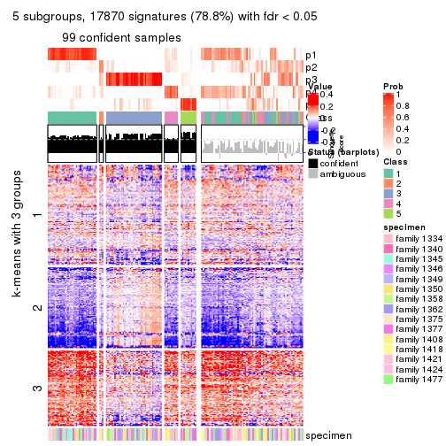</p>

</div>
<div id='tab-CV-skmeans-get-signatures-no-scale-5'>
<pre><code class="r">get_signatures(res, k = 6, scale_rows = FALSE)
</code></pre>

<p></p>

</div>
</div>


Compare the overlap of signatures from different k:

```r
compare_signatures(res)
```


`get_signature()` returns a data frame invisibly. TO get the list of signatures, the function
call should be assigned to a variable explicitly. In following code, if `plot` argument is set
to `FALSE`, no heatmap is plotted while only the differential analysis is performed.

```r
# code only for demonstration
tb = get_signature(res, k = ..., plot = FALSE)
```

An example of the output of `tb` is:

```
#>   which_row         fdr    mean_1    mean_2 scaled_mean_1 scaled_mean_2 km
#> 1        38 0.042760348  8.373488  9.131774    -0.5533452     0.5164555  1
#> 2        40 0.018707592  7.106213  8.469186    -0.6173731     0.5762149  1
#> 3        55 0.019134737 10.221463 11.207825    -0.6159697     0.5749050  1
#> 4        59 0.006059896  5.921854  7.869574    -0.6899429     0.6439467  1
#> 5        60 0.018055526  8.928898 10.211722    -0.6204761     0.5791110  1
#> 6        98 0.009384629 15.714769 14.887706     0.6635654    -0.6193277  2
...
```

The columns in `tb` are:

1. `which_row`: row indices corresponding to the input matrix.
2. `fdr`: FDR for the differential test. 
3. `mean_x`: The mean value in group x.
4. `scaled_mean_x`: The mean value in group x after rows are scaled.
5. `km`: Row groups if k-means clustering is applied to rows.


UMAP plot which shows how samples are separated.


<script>
$( function() {
	$( '#tabs-CV-skmeans-dimension-reduction' ).tabs();
} );
</script>
<div id='tabs-CV-skmeans-dimension-reduction'>
<ul>
<li><a href='#tab-CV-skmeans-dimension-reduction-1'>k = 2</a></li>
<li><a href='#tab-CV-skmeans-dimension-reduction-2'>k = 3</a></li>
<li><a href='#tab-CV-skmeans-dimension-reduction-3'>k = 4</a></li>
<li><a href='#tab-CV-skmeans-dimension-reduction-4'>k = 5</a></li>
<li><a href='#tab-CV-skmeans-dimension-reduction-5'>k = 6</a></li>
</ul>
<div id='tab-CV-skmeans-dimension-reduction-1'>
<pre><code class="r">dimension_reduction(res, k = 2, method = &quot;UMAP&quot;)
</code></pre>

<p></p>

</div>
<div id='tab-CV-skmeans-dimension-reduction-2'>
<pre><code class="r">dimension_reduction(res, k = 3, method = &quot;UMAP&quot;)
</code></pre>

<p></p>

</div>
<div id='tab-CV-skmeans-dimension-reduction-3'>
<pre><code class="r">dimension_reduction(res, k = 4, method = &quot;UMAP&quot;)
</code></pre>

<p></p>

</div>
<div id='tab-CV-skmeans-dimension-reduction-4'>
<pre><code class="r">dimension_reduction(res, k = 5, method = &quot;UMAP&quot;)
</code></pre>

<p></p>

</div>
<div id='tab-CV-skmeans-dimension-reduction-5'>
<pre><code class="r">dimension_reduction(res, k = 6, method = &quot;UMAP&quot;)
</code></pre>

<p></p>

</div>
</div>


Following heatmap shows how subgroups are split when increasing `k`:

```r
collect_classes(res)
```


Test correlation between subgroups and known annotations. If the known
annotation is numeric, one-way ANOVA test is applied, and if the known
annotation is discrete, chi-squared contingency table test is applied.

```r
test_to_known_factors(res)
```

```
#>              n specimen(p) k
#> CV:skmeans 160    5.13e-02 2
#> CV:skmeans 153    5.37e-03 3
#> CV:skmeans 116    1.39e-05 4
#> CV:skmeans  99    8.67e-03 5
#> CV:skmeans  88    1.30e-03 6
```


If matrix rows can be associated to genes, consider to use `GO_Enrichment(res,
...)` to perform function enrichment for the signature genes.


 

---------------------------------------------------


### CV:pam


The object with results only for a single top-value method and a single partition method 
can be extracted as:

```r
res = res_list["CV", "pam"]
# you can also extract it by
# res = res_list["CV:pam"]
```

A summary of `res` and all the functions that can be applied to it:

```r
res
```

```
#> A 'ConsensusPartition' object with k = 2, 3, 4, 5, 6.
#>   On a matrix with 22686 rows and 167 columns.
#>   Top rows (1000, 2000, 3000, 4000, 5000) are extracted by 'CV' method.
#>   Subgroups are detected by 'pam' method.
#>   Performed in total 1250 partitions by row resampling.
#>   Best k for subgroups seems to be 2.
#> 
#> Following methods can be applied to this 'ConsensusPartition' object:
#>  [1] "cola_report"             "collect_classes"         "collect_plots"          
#>  [4] "collect_stats"           "colnames"                "compare_signatures"     
#>  [7] "consensus_heatmap"       "dimension_reduction"     "functional_enrichment"  
#> [10] "get_anno_col"            "get_anno"                "get_classes"            
#> [13] "get_consensus"           "get_matrix"              "get_membership"         
#> [16] "get_param"               "get_signatures"          "get_stats"              
#> [19] "is_best_k"               "is_stable_k"             "membership_heatmap"     
#> [22] "ncol"                    "nrow"                    "plot_ecdf"              
#> [25] "rownames"                "select_partition_number" "show"                   
#> [28] "suggest_best_k"          "test_to_known_factors"
```

`collect_plots()` function collects all the plots made from `res` for all `k` (number of partitions)
into one single page to provide an easy and fast comparison between different `k`.

```r
collect_plots(res)
```


The plots are:

- The first row: a plot of the ECDF (Empirical cumulative distribution
  function) curves of the consensus matrix for each `k` and the heatmap of
  predicted classes for each `k`.
- The second row: heatmaps of the consensus matrix for each `k`.
- The third row: heatmaps of the membership matrix for each `k`.
- The fouth row: heatmaps of the signatures for each `k`.

All the plots in panels can be made by individual functions and they are
plotted later in this section.

`select_partition_number()` produces several plots showing different
statistics for choosing "optimized" `k`. There are following statistics:

- ECDF curves of the consensus matrix for each `k`;
- 1-PAC. [The PAC
  score](https://en.wikipedia.org/wiki/Consensus_clustering#Over-interpretation_potential_of_consensus_clustering)
  measures the proportion of the ambiguous subgrouping.
- Mean silhouette score.
- Concordance. The mean probability of fiting the consensus class ids in all
  partitions.
- Area increased. Denote $A_k$ as the area under the ECDF curve for current
  `k`, the area increased is defined as $A_k - A_{k-1}$.
- Rand index. The percent of pairs of samples that are both in a same cluster
  or both are not in a same cluster in the partition of k and k-1.
- Jaccard index. The ratio of pairs of samples are both in a same cluster in
  the partition of k and k-1 and the pairs of samples are both in a same
  cluster in the partition k or k-1.

The detailed explanations of these statistics can be found in [the cola
vignette](http://bioconductor.org/packages/devel/bioc/vignettes/cola/inst/doc/cola.html#toc_13).

Generally speaking, lower PAC score, higher mean silhouette score or higher
concordance corresponds to better partition. Rand index and Jaccard index
measure how similar the current partition is compared to partition with `k-1`.
If they are too similar, we won't accept `k` is better than `k-1`.

```r
select_partition_number(res)
```


The numeric values for all these statistics can be obtained by `get_stats()`.

```r
get_stats(res)
```

```
#>   k 1-PAC mean_silhouette concordance area_increased  Rand Jaccard
#> 2 2 0.518           0.773       0.901         0.3940 0.578   0.578
#> 3 3 0.725           0.773       0.899         0.2658 0.814   0.705
#> 4 4 0.567           0.676       0.871         0.2462 0.871   0.744
#> 5 5 0.599           0.575       0.822         0.0974 0.917   0.793
#> 6 6 0.615           0.580       0.813         0.0376 0.935   0.815
```

`suggest_best_k()` suggests the best $k$ based on these statistics. The rules are as follows:

- All $k$ with Jaccard index larger than 0.95 are removed because the increase of
  the partition number does not provides enough extra information. If all $k$ are removed,
  the best $k$ is assigned by `NA`.
- For $k$ with 1-PAC larger than 0.9, the maximal $k$ is taken as the "best k". Other $k$ is called "optional k".
- If it does not fit the second rule. The $k$ with the highest vote of highest
  1-PAC, mean silhouette and concordance is taken as the "best k".

```r
suggest_best_k(res)
```

```
#> [1] 2
```


Following shows the table of the partitions (You need to click the **show/hide
code output** link to see it). The membership matrix (columns with name `p*`)
is inferred by
[`clue::cl_consensus()`](https://www.rdocumentation.org/link/cl_consensus?package=clue)
function with the `SE` method. Basically the value in the membership matrix
represents the probability to belong to a certain group. The finall class
label for an item is determined with the group with highest probability it
belongs to.

In `get_classes()` function, the entropy is calculated from the membership
matrix and the silhouette score is calculated from the consensus matrix.


<script>
$( function() {
	$( '#tabs-CV-pam-get-classes' ).tabs();
} );
</script>
<div id='tabs-CV-pam-get-classes'>
<ul>
<li><a href='#tab-CV-pam-get-classes-1'>k = 2</a></li>
<li><a href='#tab-CV-pam-get-classes-2'>k = 3</a></li>
<li><a href='#tab-CV-pam-get-classes-3'>k = 4</a></li>
<li><a href='#tab-CV-pam-get-classes-4'>k = 5</a></li>
<li><a href='#tab-CV-pam-get-classes-5'>k = 6</a></li>
</ul>

<div id='tab-CV-pam-get-classes-1'>
<p><a id='tab-CV-pam-get-classes-1-a' style='color:#0366d6' href='#'>show/hide code output</a></p>
<pre><code class="r">cbind(get_classes(res, k = 2), get_membership(res, k = 2))
</code></pre>

<pre><code>#&gt;          class entropy silhouette    p1    p2
#&gt; GSM30006     2   0.844    0.75116 0.272 0.728
#&gt; GSM30007     1   0.000    0.91218 1.000 0.000
#&gt; GSM30008     1   0.000    0.91218 1.000 0.000
#&gt; GSM30009     1   0.000    0.91218 1.000 0.000
#&gt; GSM30010     2   0.000    0.78913 0.000 1.000
#&gt; GSM30011     2   0.844    0.75116 0.272 0.728
#&gt; GSM30012     2   0.844    0.75116 0.272 0.728
#&gt; GSM30013     1   0.327    0.84987 0.940 0.060
#&gt; GSM30014     2   0.697    0.78474 0.188 0.812
#&gt; GSM30015     1   0.000    0.91218 1.000 0.000
#&gt; GSM30016     1   0.833    0.53362 0.736 0.264
#&gt; GSM30017     1   0.000    0.91218 1.000 0.000
#&gt; GSM30018     1   0.000    0.91218 1.000 0.000
#&gt; GSM30019     2   0.814    0.76315 0.252 0.748
#&gt; GSM30020     1   0.000    0.91218 1.000 0.000
#&gt; GSM30021     2   1.000    0.25968 0.492 0.508
#&gt; GSM30022     1   0.000    0.91218 1.000 0.000
#&gt; GSM30023     1   0.000    0.91218 1.000 0.000
#&gt; GSM30024     1   0.971    0.17631 0.600 0.400
#&gt; GSM30025     1   0.000    0.91218 1.000 0.000
#&gt; GSM30026     1   0.000    0.91218 1.000 0.000
#&gt; GSM30027     1   0.184    0.88706 0.972 0.028
#&gt; GSM30028     1   0.000    0.91218 1.000 0.000
#&gt; GSM30029     1   0.000    0.91218 1.000 0.000
#&gt; GSM30030     1   0.000    0.91218 1.000 0.000
#&gt; GSM30031     1   0.000    0.91218 1.000 0.000
#&gt; GSM30032     1   0.971    0.17631 0.600 0.400
#&gt; GSM30033     1   0.971    0.17631 0.600 0.400
#&gt; GSM30034     1   0.000    0.91218 1.000 0.000
#&gt; GSM30035     2   0.929    0.64657 0.344 0.656
#&gt; GSM30036     1   0.000    0.91218 1.000 0.000
#&gt; GSM30037     1   0.000    0.91218 1.000 0.000
#&gt; GSM30038     2   0.921    0.66001 0.336 0.664
#&gt; GSM30039     2   0.844    0.75116 0.272 0.728
#&gt; GSM30040     2   0.000    0.78913 0.000 1.000
#&gt; GSM30041     2   0.000    0.78913 0.000 1.000
#&gt; GSM30042     2   0.697    0.78474 0.188 0.812
#&gt; GSM30043     2   0.000    0.78913 0.000 1.000
#&gt; GSM30044     1   0.000    0.91218 1.000 0.000
#&gt; GSM30045     1   0.000    0.91218 1.000 0.000
#&gt; GSM30046     1   0.000    0.91218 1.000 0.000
#&gt; GSM30047     1   0.000    0.91218 1.000 0.000
#&gt; GSM30048     1   0.000    0.91218 1.000 0.000
#&gt; GSM30049     2   0.000    0.78913 0.000 1.000
#&gt; GSM30050     1   0.000    0.91218 1.000 0.000
#&gt; GSM30051     2   0.000    0.78913 0.000 1.000
#&gt; GSM30052     1   0.000    0.91218 1.000 0.000
#&gt; GSM30053     2   0.844    0.75116 0.272 0.728
#&gt; GSM30054     2   0.000    0.78913 0.000 1.000
#&gt; GSM30055     1   0.909    0.40771 0.676 0.324
#&gt; GSM30056     2   0.844    0.75116 0.272 0.728
#&gt; GSM30057     2   0.000    0.78913 0.000 1.000
#&gt; GSM30058     2   0.000    0.78913 0.000 1.000
#&gt; GSM30059     1   0.000    0.91218 1.000 0.000
#&gt; GSM30060     1   0.995   -0.08653 0.540 0.460
#&gt; GSM30061     1   0.634    0.72771 0.840 0.160
#&gt; GSM30062     1   0.000    0.91218 1.000 0.000
#&gt; GSM30063     2   0.595    0.79082 0.144 0.856
#&gt; GSM30064     1   0.000    0.91218 1.000 0.000
#&gt; GSM30065     2   0.917    0.66648 0.332 0.668
#&gt; GSM30066     2   0.000    0.78913 0.000 1.000
#&gt; GSM30067     1   0.000    0.91218 1.000 0.000
#&gt; GSM30068     2   0.000    0.78913 0.000 1.000
#&gt; GSM30069     2   0.827    0.75874 0.260 0.740
#&gt; GSM30070     2   0.999    0.35327 0.480 0.520
#&gt; GSM30071     2   0.999    0.34870 0.484 0.516
#&gt; GSM30072     1   0.000    0.91218 1.000 0.000
#&gt; GSM30073     1   0.990    0.00663 0.560 0.440
#&gt; GSM30074     2   0.999    0.35412 0.480 0.520
#&gt; GSM30075     2   0.992    0.40763 0.448 0.552
#&gt; GSM30076     1   0.000    0.91218 1.000 0.000
#&gt; GSM30077     1   0.000    0.91218 1.000 0.000
#&gt; GSM30078     1   0.000    0.91218 1.000 0.000
#&gt; GSM30079     1   0.000    0.91218 1.000 0.000
#&gt; GSM30080     1   0.767    0.61973 0.776 0.224
#&gt; GSM30081     2   0.000    0.78913 0.000 1.000
#&gt; GSM30086     1   0.000    0.91218 1.000 0.000
#&gt; GSM30087     1   0.000    0.91218 1.000 0.000
#&gt; GSM30088     1   0.000    0.91218 1.000 0.000
#&gt; GSM30089     1   0.000    0.91218 1.000 0.000
#&gt; GSM30090     2   0.802    0.76695 0.244 0.756
#&gt; GSM30091     2   0.000    0.78913 0.000 1.000
#&gt; GSM30092     1   0.000    0.91218 1.000 0.000
#&gt; GSM30093     2   0.844    0.75116 0.272 0.728
#&gt; GSM30094     2   0.000    0.78913 0.000 1.000
#&gt; GSM30095     2   0.000    0.78913 0.000 1.000
#&gt; GSM30096     1   0.000    0.91218 1.000 0.000
#&gt; GSM30097     1   0.000    0.91218 1.000 0.000
#&gt; GSM30098     1   0.000    0.91218 1.000 0.000
#&gt; GSM30099     2   0.563    0.78971 0.132 0.868
#&gt; GSM30100     2   0.000    0.78913 0.000 1.000
#&gt; GSM30101     2   0.518    0.79217 0.116 0.884
#&gt; GSM30102     2   0.844    0.75116 0.272 0.728
#&gt; GSM30103     1   0.971    0.17631 0.600 0.400
#&gt; GSM30104     1   0.781    0.61198 0.768 0.232
#&gt; GSM30105     1   0.000    0.91218 1.000 0.000
#&gt; GSM30106     1   0.000    0.91218 1.000 0.000
#&gt; GSM30107     1   0.000    0.91218 1.000 0.000
#&gt; GSM30108     1   0.921    0.36819 0.664 0.336
#&gt; GSM30109     1   0.000    0.91218 1.000 0.000
#&gt; GSM30110     1   0.000    0.91218 1.000 0.000
#&gt; GSM30111     1   0.000    0.91218 1.000 0.000
#&gt; GSM30112     1   0.000    0.91218 1.000 0.000
#&gt; GSM30113     2   0.000    0.78913 0.000 1.000
#&gt; GSM30114     2   0.995    0.41264 0.460 0.540
#&gt; GSM30115     1   0.000    0.91218 1.000 0.000
#&gt; GSM30116     2   0.795    0.76877 0.240 0.760
#&gt; GSM30117     1   0.929    0.35349 0.656 0.344
#&gt; GSM30118     1   0.981    0.09616 0.580 0.420
#&gt; GSM30119     2   0.722    0.78185 0.200 0.800
#&gt; GSM30120     1   0.000    0.91218 1.000 0.000
#&gt; GSM30121     1   0.000    0.91218 1.000 0.000
#&gt; GSM30122     1   0.000    0.91218 1.000 0.000
#&gt; GSM30123     1   0.939    0.31900 0.644 0.356
#&gt; GSM30177     2   0.844    0.75116 0.272 0.728
#&gt; GSM30178     1   0.000    0.91218 1.000 0.000
#&gt; GSM30179     1   0.000    0.91218 1.000 0.000
#&gt; GSM30180     1   0.000    0.91218 1.000 0.000
#&gt; GSM30181     1   0.224    0.87943 0.964 0.036
#&gt; GSM30182     1   0.000    0.91218 1.000 0.000
#&gt; GSM30183     1   0.000    0.91218 1.000 0.000
#&gt; GSM30184     2   0.000    0.78913 0.000 1.000
#&gt; GSM30185     1   0.224    0.87943 0.964 0.036
#&gt; GSM30186     1   0.996   -0.09433 0.536 0.464
#&gt; GSM30187     1   0.000    0.91218 1.000 0.000
#&gt; GSM30188     1   0.000    0.91218 1.000 0.000
#&gt; GSM30189     1   0.000    0.91218 1.000 0.000
#&gt; GSM30190     2   0.000    0.78913 0.000 1.000
#&gt; GSM30191     1   0.494    0.79922 0.892 0.108
#&gt; GSM30192     1   0.242    0.87563 0.960 0.040
#&gt; GSM30193     1   0.000    0.91218 1.000 0.000
#&gt; GSM30194     2   0.000    0.78913 0.000 1.000
#&gt; GSM30195     1   0.000    0.91218 1.000 0.000
#&gt; GSM30196     1   0.000    0.91218 1.000 0.000
#&gt; GSM30197     1   0.000    0.91218 1.000 0.000
#&gt; GSM30198     1   0.000    0.91218 1.000 0.000
#&gt; GSM30199     1   0.971    0.17631 0.600 0.400
#&gt; GSM30200     1   0.000    0.91218 1.000 0.000
#&gt; GSM30201     1   0.000    0.91218 1.000 0.000
#&gt; GSM30202     1   0.000    0.91218 1.000 0.000
#&gt; GSM30203     1   0.000    0.91218 1.000 0.000
#&gt; GSM30204     1   0.000    0.91218 1.000 0.000
#&gt; GSM30205     1   0.971    0.17631 0.600 0.400
#&gt; GSM30206     1   0.000    0.91218 1.000 0.000
#&gt; GSM30207     1   0.000    0.91218 1.000 0.000
#&gt; GSM30208     1   0.000    0.91218 1.000 0.000
#&gt; GSM30209     1   0.767    0.63194 0.776 0.224
#&gt; GSM30210     1   0.000    0.91218 1.000 0.000
#&gt; GSM30211     1   0.000    0.91218 1.000 0.000
#&gt; GSM30212     1   0.000    0.91218 1.000 0.000
#&gt; GSM30213     1   0.000    0.91218 1.000 0.000
#&gt; GSM30214     1   0.000    0.91218 1.000 0.000
#&gt; GSM30215     1   0.000    0.91218 1.000 0.000
#&gt; GSM30216     1   0.000    0.91218 1.000 0.000
#&gt; GSM30217     1   0.000    0.91218 1.000 0.000
#&gt; GSM30218     1   0.971    0.17631 0.600 0.400
#&gt; GSM30219     2   0.844    0.75116 0.272 0.728
#&gt; GSM30220     1   0.000    0.91218 1.000 0.000
#&gt; GSM30221     1   0.000    0.91218 1.000 0.000
#&gt; GSM30222     1   0.000    0.91218 1.000 0.000
#&gt; GSM30223     1   0.000    0.91218 1.000 0.000
#&gt; GSM30224     1   0.000    0.91218 1.000 0.000
#&gt; GSM30225     1   0.000    0.91218 1.000 0.000
#&gt; GSM30226     1   0.971    0.17631 0.600 0.400
#&gt; GSM30227     1   0.000    0.91218 1.000 0.000
#&gt; GSM30228     2   0.844    0.75116 0.272 0.728
#&gt; GSM30229     1   0.000    0.91218 1.000 0.000
</code></pre>

<script>
$('#tab-CV-pam-get-classes-1-a').parent().next().next().hide();
$('#tab-CV-pam-get-classes-1-a').click(function(){
  $('#tab-CV-pam-get-classes-1-a').parent().next().next().toggle();
  return(false);
});
</script>
</div>

<div id='tab-CV-pam-get-classes-2'>
<p><a id='tab-CV-pam-get-classes-2-a' style='color:#0366d6' href='#'>show/hide code output</a></p>
<pre><code class="r">cbind(get_classes(res, k = 3), get_membership(res, k = 3))
</code></pre>

<pre><code>#&gt;          class entropy silhouette    p1    p2    p3
#&gt; GSM30006     2  0.2625     0.7751 0.084 0.916 0.000
#&gt; GSM30007     1  0.0000     0.9064 1.000 0.000 0.000
#&gt; GSM30008     1  0.0000     0.9064 1.000 0.000 0.000
#&gt; GSM30009     1  0.0000     0.9064 1.000 0.000 0.000
#&gt; GSM30010     3  0.0747     0.9420 0.000 0.016 0.984
#&gt; GSM30011     2  0.2625     0.7751 0.084 0.916 0.000
#&gt; GSM30012     2  0.2625     0.7751 0.084 0.916 0.000
#&gt; GSM30013     1  0.3267     0.7989 0.884 0.116 0.000
#&gt; GSM30014     2  0.6053     0.4068 0.020 0.720 0.260
#&gt; GSM30015     1  0.0000     0.9064 1.000 0.000 0.000
#&gt; GSM30016     1  0.2796     0.8246 0.908 0.092 0.000
#&gt; GSM30017     1  0.2625     0.8561 0.916 0.084 0.000
#&gt; GSM30018     1  0.0000     0.9064 1.000 0.000 0.000
#&gt; GSM30019     2  0.2625     0.7751 0.084 0.916 0.000
#&gt; GSM30020     1  0.0000     0.9064 1.000 0.000 0.000
#&gt; GSM30021     2  0.6280     0.3165 0.460 0.540 0.000
#&gt; GSM30022     1  0.0000     0.9064 1.000 0.000 0.000
#&gt; GSM30023     1  0.0000     0.9064 1.000 0.000 0.000
#&gt; GSM30024     2  0.5529     0.6780 0.296 0.704 0.000
#&gt; GSM30025     1  0.0000     0.9064 1.000 0.000 0.000
#&gt; GSM30026     1  0.2448     0.8622 0.924 0.076 0.000
#&gt; GSM30027     1  0.4399     0.6889 0.812 0.188 0.000
#&gt; GSM30028     1  0.0000     0.9064 1.000 0.000 0.000
#&gt; GSM30029     1  0.2625     0.8561 0.916 0.084 0.000
#&gt; GSM30030     1  0.0000     0.9064 1.000 0.000 0.000
#&gt; GSM30031     1  0.0000     0.9064 1.000 0.000 0.000
#&gt; GSM30032     2  0.6309     0.2517 0.496 0.504 0.000
#&gt; GSM30033     2  0.5465     0.6833 0.288 0.712 0.000
#&gt; GSM30034     1  0.0000     0.9064 1.000 0.000 0.000
#&gt; GSM30035     2  0.6180     0.4276 0.416 0.584 0.000
#&gt; GSM30036     1  0.0000     0.9064 1.000 0.000 0.000
#&gt; GSM30037     1  0.0000     0.9064 1.000 0.000 0.000
#&gt; GSM30038     2  0.6111     0.4654 0.396 0.604 0.000
#&gt; GSM30039     2  0.2625     0.7751 0.084 0.916 0.000
#&gt; GSM30040     3  0.0000     0.9517 0.000 0.000 1.000
#&gt; GSM30041     2  0.2625     0.6743 0.000 0.916 0.084
#&gt; GSM30042     2  0.3045     0.7060 0.020 0.916 0.064
#&gt; GSM30043     3  0.6140     0.4397 0.000 0.404 0.596
#&gt; GSM30044     1  0.2625     0.8561 0.916 0.084 0.000
#&gt; GSM30045     1  0.1031     0.8954 0.976 0.024 0.000
#&gt; GSM30046     1  0.2625     0.8561 0.916 0.084 0.000
#&gt; GSM30047     1  0.0000     0.9064 1.000 0.000 0.000
#&gt; GSM30048     1  0.2625     0.8561 0.916 0.084 0.000
#&gt; GSM30049     3  0.0000     0.9517 0.000 0.000 1.000
#&gt; GSM30050     1  0.0424     0.9033 0.992 0.008 0.000
#&gt; GSM30051     3  0.0000     0.9517 0.000 0.000 1.000
#&gt; GSM30052     1  0.0000     0.9064 1.000 0.000 0.000
#&gt; GSM30053     2  0.2625     0.7751 0.084 0.916 0.000
#&gt; GSM30054     3  0.0000     0.9517 0.000 0.000 1.000
#&gt; GSM30055     2  0.5465     0.6833 0.288 0.712 0.000
#&gt; GSM30056     2  0.2625     0.7751 0.084 0.916 0.000
#&gt; GSM30057     2  0.5431     0.3421 0.000 0.716 0.284
#&gt; GSM30058     2  0.2625     0.6743 0.000 0.916 0.084
#&gt; GSM30059     1  0.0000     0.9064 1.000 0.000 0.000
#&gt; GSM30060     2  0.5138     0.7039 0.252 0.748 0.000
#&gt; GSM30061     1  0.6180     0.0871 0.584 0.416 0.000
#&gt; GSM30062     1  0.0000     0.9064 1.000 0.000 0.000
#&gt; GSM30063     2  0.3045     0.7060 0.020 0.916 0.064
#&gt; GSM30064     1  0.0000     0.9064 1.000 0.000 0.000
#&gt; GSM30065     2  0.2625     0.7751 0.084 0.916 0.000
#&gt; GSM30066     3  0.0000     0.9517 0.000 0.000 1.000
#&gt; GSM30067     1  0.0000     0.9064 1.000 0.000 0.000
#&gt; GSM30068     3  0.5591     0.6316 0.000 0.304 0.696
#&gt; GSM30069     2  0.2625     0.7751 0.084 0.916 0.000
#&gt; GSM30070     1  0.6154     0.2073 0.592 0.408 0.000
#&gt; GSM30071     1  0.5138     0.5860 0.748 0.252 0.000
#&gt; GSM30072     1  0.0000     0.9064 1.000 0.000 0.000
#&gt; GSM30073     1  0.6215     0.0496 0.572 0.428 0.000
#&gt; GSM30074     1  0.6111     0.2466 0.604 0.396 0.000
#&gt; GSM30075     2  0.6180     0.4732 0.416 0.584 0.000
#&gt; GSM30076     1  0.0000     0.9064 1.000 0.000 0.000
#&gt; GSM30077     1  0.0747     0.8996 0.984 0.016 0.000
#&gt; GSM30078     1  0.0000     0.9064 1.000 0.000 0.000
#&gt; GSM30079     1  0.1031     0.8954 0.976 0.024 0.000
#&gt; GSM30080     1  0.4796     0.6381 0.780 0.220 0.000
#&gt; GSM30081     3  0.0000     0.9517 0.000 0.000 1.000
#&gt; GSM30086     1  0.0000     0.9064 1.000 0.000 0.000
#&gt; GSM30087     1  0.2066     0.8724 0.940 0.060 0.000
#&gt; GSM30088     1  0.0000     0.9064 1.000 0.000 0.000
#&gt; GSM30089     1  0.0000     0.9064 1.000 0.000 0.000
#&gt; GSM30090     2  0.2866     0.7683 0.076 0.916 0.008
#&gt; GSM30091     3  0.0000     0.9517 0.000 0.000 1.000
#&gt; GSM30092     1  0.0000     0.9064 1.000 0.000 0.000
#&gt; GSM30093     2  0.2625     0.7751 0.084 0.916 0.000
#&gt; GSM30094     3  0.0592     0.9448 0.000 0.012 0.988
#&gt; GSM30095     3  0.0000     0.9517 0.000 0.000 1.000
#&gt; GSM30096     1  0.0000     0.9064 1.000 0.000 0.000
#&gt; GSM30097     1  0.2066     0.8724 0.940 0.060 0.000
#&gt; GSM30098     1  0.2625     0.8561 0.916 0.084 0.000
#&gt; GSM30099     2  0.2998     0.7606 0.068 0.916 0.016
#&gt; GSM30100     3  0.0000     0.9517 0.000 0.000 1.000
#&gt; GSM30101     2  0.3045     0.7060 0.020 0.916 0.064
#&gt; GSM30102     2  0.2625     0.7751 0.084 0.916 0.000
#&gt; GSM30103     1  0.6126     0.1508 0.600 0.400 0.000
#&gt; GSM30104     2  0.5431     0.6861 0.284 0.716 0.000
#&gt; GSM30105     1  0.0000     0.9064 1.000 0.000 0.000
#&gt; GSM30106     1  0.2066     0.8724 0.940 0.060 0.000
#&gt; GSM30107     1  0.1031     0.8954 0.976 0.024 0.000
#&gt; GSM30108     1  0.5529     0.4696 0.704 0.296 0.000
#&gt; GSM30109     1  0.2625     0.8561 0.916 0.084 0.000
#&gt; GSM30110     1  0.0000     0.9064 1.000 0.000 0.000
#&gt; GSM30111     1  0.0000     0.9064 1.000 0.000 0.000
#&gt; GSM30112     1  0.0000     0.9064 1.000 0.000 0.000
#&gt; GSM30113     3  0.0000     0.9517 0.000 0.000 1.000
#&gt; GSM30114     1  0.6140     0.2212 0.596 0.404 0.000
#&gt; GSM30115     1  0.0000     0.9064 1.000 0.000 0.000
#&gt; GSM30116     2  0.2625     0.7751 0.084 0.916 0.000
#&gt; GSM30117     1  0.6111     0.1656 0.604 0.396 0.000
#&gt; GSM30118     1  0.6204     0.0659 0.576 0.424 0.000
#&gt; GSM30119     2  0.3045     0.7060 0.020 0.916 0.064
#&gt; GSM30120     1  0.0000     0.9064 1.000 0.000 0.000
#&gt; GSM30121     1  0.2625     0.8561 0.916 0.084 0.000
#&gt; GSM30122     1  0.0000     0.9064 1.000 0.000 0.000
#&gt; GSM30123     2  0.6308     0.2638 0.492 0.508 0.000
#&gt; GSM30177     2  0.2625     0.7751 0.084 0.916 0.000
#&gt; GSM30178     1  0.0000     0.9064 1.000 0.000 0.000
#&gt; GSM30179     1  0.0000     0.9064 1.000 0.000 0.000
#&gt; GSM30180     1  0.0000     0.9064 1.000 0.000 0.000
#&gt; GSM30181     1  0.4504     0.6728 0.804 0.196 0.000
#&gt; GSM30182     1  0.2625     0.8561 0.916 0.084 0.000
#&gt; GSM30183     1  0.0424     0.9031 0.992 0.008 0.000
#&gt; GSM30184     2  0.2878     0.6673 0.000 0.904 0.096
#&gt; GSM30185     1  0.4178     0.7114 0.828 0.172 0.000
#&gt; GSM30186     2  0.5254     0.6980 0.264 0.736 0.000
#&gt; GSM30187     1  0.0000     0.9064 1.000 0.000 0.000
#&gt; GSM30188     1  0.2625     0.8561 0.916 0.084 0.000
#&gt; GSM30189     1  0.0000     0.9064 1.000 0.000 0.000
#&gt; GSM30190     3  0.0237     0.9492 0.000 0.004 0.996
#&gt; GSM30191     1  0.6308    -0.2320 0.508 0.492 0.000
#&gt; GSM30192     1  0.4605     0.6596 0.796 0.204 0.000
#&gt; GSM30193     1  0.0747     0.8995 0.984 0.016 0.000
#&gt; GSM30194     3  0.0000     0.9517 0.000 0.000 1.000
#&gt; GSM30195     1  0.0000     0.9064 1.000 0.000 0.000
#&gt; GSM30196     1  0.1031     0.8954 0.976 0.024 0.000
#&gt; GSM30197     1  0.0000     0.9064 1.000 0.000 0.000
#&gt; GSM30198     1  0.0000     0.9064 1.000 0.000 0.000
#&gt; GSM30199     1  0.6126     0.1508 0.600 0.400 0.000
#&gt; GSM30200     1  0.2625     0.8561 0.916 0.084 0.000
#&gt; GSM30201     1  0.0000     0.9064 1.000 0.000 0.000
#&gt; GSM30202     1  0.0000     0.9064 1.000 0.000 0.000
#&gt; GSM30203     1  0.0000     0.9064 1.000 0.000 0.000
#&gt; GSM30204     1  0.0000     0.9064 1.000 0.000 0.000
#&gt; GSM30205     1  0.6126     0.1508 0.600 0.400 0.000
#&gt; GSM30206     1  0.1643     0.8840 0.956 0.044 0.000
#&gt; GSM30207     1  0.0000     0.9064 1.000 0.000 0.000
#&gt; GSM30208     1  0.0000     0.9064 1.000 0.000 0.000
#&gt; GSM30209     2  0.5560     0.6744 0.300 0.700 0.000
#&gt; GSM30210     1  0.2625     0.8561 0.916 0.084 0.000
#&gt; GSM30211     1  0.2625     0.8561 0.916 0.084 0.000
#&gt; GSM30212     1  0.0000     0.9064 1.000 0.000 0.000
#&gt; GSM30213     1  0.0000     0.9064 1.000 0.000 0.000
#&gt; GSM30214     1  0.0000     0.9064 1.000 0.000 0.000
#&gt; GSM30215     1  0.0000     0.9064 1.000 0.000 0.000
#&gt; GSM30216     1  0.1031     0.8954 0.976 0.024 0.000
#&gt; GSM30217     1  0.0000     0.9064 1.000 0.000 0.000
#&gt; GSM30218     2  0.5497     0.6808 0.292 0.708 0.000
#&gt; GSM30219     2  0.2625     0.7751 0.084 0.916 0.000
#&gt; GSM30220     1  0.0000     0.9064 1.000 0.000 0.000
#&gt; GSM30221     1  0.0000     0.9064 1.000 0.000 0.000
#&gt; GSM30222     1  0.0000     0.9064 1.000 0.000 0.000
#&gt; GSM30223     1  0.0892     0.8975 0.980 0.020 0.000
#&gt; GSM30224     1  0.0000     0.9064 1.000 0.000 0.000
#&gt; GSM30225     1  0.2625     0.8561 0.916 0.084 0.000
#&gt; GSM30226     2  0.6295     0.3309 0.472 0.528 0.000
#&gt; GSM30227     1  0.2537     0.8592 0.920 0.080 0.000
#&gt; GSM30228     2  0.2625     0.7751 0.084 0.916 0.000
#&gt; GSM30229     1  0.0000     0.9064 1.000 0.000 0.000
</code></pre>

<script>
$('#tab-CV-pam-get-classes-2-a').parent().next().next().hide();
$('#tab-CV-pam-get-classes-2-a').click(function(){
  $('#tab-CV-pam-get-classes-2-a').parent().next().next().toggle();
  return(false);
});
</script>
</div>

<div id='tab-CV-pam-get-classes-3'>
<p><a id='tab-CV-pam-get-classes-3-a' style='color:#0366d6' href='#'>show/hide code output</a></p>
<pre><code class="r">cbind(get_classes(res, k = 4), get_membership(res, k = 4))
</code></pre>

<pre><code>#&gt;          class entropy silhouette    p1    p2    p3    p4
#&gt; GSM30006     2  0.0336     0.7823 0.000 0.992 0.000 0.008
#&gt; GSM30007     1  0.0000     0.8270 1.000 0.000 0.000 0.000
#&gt; GSM30008     1  0.0000     0.8270 1.000 0.000 0.000 0.000
#&gt; GSM30009     1  0.0000     0.8270 1.000 0.000 0.000 0.000
#&gt; GSM30010     3  0.0592     0.9228 0.000 0.016 0.984 0.000
#&gt; GSM30011     2  0.0336     0.7823 0.000 0.992 0.000 0.008
#&gt; GSM30012     2  0.0707     0.7800 0.000 0.980 0.000 0.020
#&gt; GSM30013     1  0.2918     0.7270 0.876 0.116 0.000 0.008
#&gt; GSM30014     2  0.4549     0.5180 0.000 0.776 0.188 0.036
#&gt; GSM30015     1  0.0000     0.8270 1.000 0.000 0.000 0.000
#&gt; GSM30016     1  0.2412     0.7562 0.908 0.084 0.000 0.008
#&gt; GSM30017     4  0.2814     0.7269 0.132 0.000 0.000 0.868
#&gt; GSM30018     1  0.0000     0.8270 1.000 0.000 0.000 0.000
#&gt; GSM30019     2  0.0469     0.7817 0.000 0.988 0.000 0.012
#&gt; GSM30020     1  0.0000     0.8270 1.000 0.000 0.000 0.000
#&gt; GSM30021     2  0.5288     0.0955 0.472 0.520 0.000 0.008
#&gt; GSM30022     1  0.4776     0.2064 0.624 0.000 0.000 0.376
#&gt; GSM30023     1  0.1118     0.8023 0.964 0.000 0.000 0.036
#&gt; GSM30024     2  0.3649     0.6637 0.204 0.796 0.000 0.000
#&gt; GSM30025     1  0.0000     0.8270 1.000 0.000 0.000 0.000
#&gt; GSM30026     1  0.3219     0.6461 0.836 0.000 0.000 0.164
#&gt; GSM30027     1  0.3528     0.6598 0.808 0.192 0.000 0.000
#&gt; GSM30028     1  0.0000     0.8270 1.000 0.000 0.000 0.000
#&gt; GSM30029     4  0.3024     0.7303 0.148 0.000 0.000 0.852
#&gt; GSM30030     1  0.0000     0.8270 1.000 0.000 0.000 0.000
#&gt; GSM30031     1  0.0000     0.8270 1.000 0.000 0.000 0.000
#&gt; GSM30032     2  0.4981     0.1915 0.464 0.536 0.000 0.000
#&gt; GSM30033     2  0.3486     0.6797 0.188 0.812 0.000 0.000
#&gt; GSM30034     1  0.0000     0.8270 1.000 0.000 0.000 0.000
#&gt; GSM30035     2  0.5244     0.2055 0.436 0.556 0.000 0.008
#&gt; GSM30036     1  0.0000     0.8270 1.000 0.000 0.000 0.000
#&gt; GSM30037     1  0.0000     0.8270 1.000 0.000 0.000 0.000
#&gt; GSM30038     2  0.5203     0.2542 0.416 0.576 0.000 0.008
#&gt; GSM30039     2  0.0707     0.7800 0.000 0.980 0.000 0.020
#&gt; GSM30040     3  0.0000     0.9325 0.000 0.000 1.000 0.000
#&gt; GSM30041     2  0.0336     0.7823 0.000 0.992 0.000 0.008
#&gt; GSM30042     2  0.0336     0.7823 0.000 0.992 0.000 0.008
#&gt; GSM30043     3  0.5000     0.1932 0.000 0.500 0.500 0.000
#&gt; GSM30044     4  0.1389     0.6575 0.048 0.000 0.000 0.952
#&gt; GSM30045     1  0.4877     0.0243 0.592 0.000 0.000 0.408
#&gt; GSM30046     4  0.1716     0.6776 0.064 0.000 0.000 0.936
#&gt; GSM30047     1  0.0000     0.8270 1.000 0.000 0.000 0.000
#&gt; GSM30048     4  0.2921     0.7295 0.140 0.000 0.000 0.860
#&gt; GSM30049     3  0.0000     0.9325 0.000 0.000 1.000 0.000
#&gt; GSM30050     1  0.0336     0.8223 0.992 0.000 0.000 0.008
#&gt; GSM30051     3  0.0188     0.9314 0.000 0.004 0.996 0.000
#&gt; GSM30052     1  0.0000     0.8270 1.000 0.000 0.000 0.000
#&gt; GSM30053     2  0.0707     0.7800 0.000 0.980 0.000 0.020
#&gt; GSM30054     3  0.0000     0.9325 0.000 0.000 1.000 0.000
#&gt; GSM30055     2  0.3486     0.6797 0.188 0.812 0.000 0.000
#&gt; GSM30056     2  0.0000     0.7825 0.000 1.000 0.000 0.000
#&gt; GSM30057     2  0.3610     0.5221 0.000 0.800 0.200 0.000
#&gt; GSM30058     2  0.0000     0.7825 0.000 1.000 0.000 0.000
#&gt; GSM30059     1  0.0000     0.8270 1.000 0.000 0.000 0.000
#&gt; GSM30060     2  0.3074     0.7101 0.152 0.848 0.000 0.000
#&gt; GSM30061     1  0.4898     0.2303 0.584 0.416 0.000 0.000
#&gt; GSM30062     1  0.0000     0.8270 1.000 0.000 0.000 0.000
#&gt; GSM30063     2  0.0336     0.7823 0.000 0.992 0.000 0.008
#&gt; GSM30064     1  0.4164     0.4650 0.736 0.000 0.000 0.264
#&gt; GSM30065     2  0.0469     0.7820 0.000 0.988 0.000 0.012
#&gt; GSM30066     3  0.0000     0.9325 0.000 0.000 1.000 0.000
#&gt; GSM30067     1  0.0000     0.8270 1.000 0.000 0.000 0.000
#&gt; GSM30068     3  0.5343     0.5803 0.000 0.316 0.656 0.028
#&gt; GSM30069     2  0.1389     0.7674 0.000 0.952 0.000 0.048
#&gt; GSM30070     1  0.6079     0.3087 0.568 0.380 0.000 0.052
#&gt; GSM30071     1  0.5203     0.5242 0.720 0.232 0.000 0.048
#&gt; GSM30072     1  0.4761     0.2188 0.628 0.000 0.000 0.372
#&gt; GSM30073     1  0.5628     0.1658 0.556 0.420 0.000 0.024
#&gt; GSM30074     1  0.5971     0.3454 0.584 0.368 0.000 0.048
#&gt; GSM30075     2  0.5150     0.3761 0.396 0.596 0.000 0.008
#&gt; GSM30076     1  0.0000     0.8270 1.000 0.000 0.000 0.000
#&gt; GSM30077     1  0.3219     0.6698 0.836 0.000 0.000 0.164
#&gt; GSM30078     1  0.0000     0.8270 1.000 0.000 0.000 0.000
#&gt; GSM30079     1  0.3801     0.5860 0.780 0.000 0.000 0.220
#&gt; GSM30080     1  0.4327     0.6195 0.768 0.216 0.000 0.016
#&gt; GSM30081     3  0.0188     0.9314 0.000 0.004 0.996 0.000
#&gt; GSM30086     1  0.0000     0.8270 1.000 0.000 0.000 0.000
#&gt; GSM30087     1  0.3172     0.6497 0.840 0.000 0.000 0.160
#&gt; GSM30088     1  0.2011     0.7760 0.920 0.000 0.000 0.080
#&gt; GSM30089     1  0.0000     0.8270 1.000 0.000 0.000 0.000
#&gt; GSM30090     2  0.0000     0.7825 0.000 1.000 0.000 0.000
#&gt; GSM30091     3  0.0000     0.9325 0.000 0.000 1.000 0.000
#&gt; GSM30092     1  0.0000     0.8270 1.000 0.000 0.000 0.000
#&gt; GSM30093     2  0.0000     0.7825 0.000 1.000 0.000 0.000
#&gt; GSM30094     3  0.0592     0.9240 0.000 0.016 0.984 0.000
#&gt; GSM30095     3  0.0000     0.9325 0.000 0.000 1.000 0.000
#&gt; GSM30096     1  0.0000     0.8270 1.000 0.000 0.000 0.000
#&gt; GSM30097     1  0.4164     0.4694 0.736 0.000 0.000 0.264
#&gt; GSM30098     4  0.3649     0.7419 0.204 0.000 0.000 0.796
#&gt; GSM30099     2  0.0000     0.7825 0.000 1.000 0.000 0.000
#&gt; GSM30100     3  0.0000     0.9325 0.000 0.000 1.000 0.000
#&gt; GSM30101     2  0.0000     0.7825 0.000 1.000 0.000 0.000
#&gt; GSM30102     2  0.0336     0.7823 0.000 0.992 0.000 0.008
#&gt; GSM30103     1  0.5138     0.2784 0.600 0.392 0.000 0.008
#&gt; GSM30104     2  0.3444     0.6842 0.184 0.816 0.000 0.000
#&gt; GSM30105     1  0.0000     0.8270 1.000 0.000 0.000 0.000
#&gt; GSM30106     1  0.4008     0.5134 0.756 0.000 0.000 0.244
#&gt; GSM30107     1  0.2530     0.7318 0.888 0.000 0.000 0.112
#&gt; GSM30108     1  0.5359     0.4911 0.676 0.288 0.000 0.036
#&gt; GSM30109     4  0.1867     0.6883 0.072 0.000 0.000 0.928
#&gt; GSM30110     1  0.0000     0.8270 1.000 0.000 0.000 0.000
#&gt; GSM30111     1  0.0000     0.8270 1.000 0.000 0.000 0.000
#&gt; GSM30112     1  0.2281     0.7536 0.904 0.000 0.000 0.096
#&gt; GSM30113     3  0.0000     0.9325 0.000 0.000 1.000 0.000
#&gt; GSM30114     1  0.5997     0.3261 0.576 0.376 0.000 0.048
#&gt; GSM30115     1  0.0469     0.8198 0.988 0.000 0.000 0.012
#&gt; GSM30116     2  0.0000     0.7825 0.000 1.000 0.000 0.000
#&gt; GSM30117     1  0.4843     0.2899 0.604 0.396 0.000 0.000
#&gt; GSM30118     1  0.4916     0.2163 0.576 0.424 0.000 0.000
#&gt; GSM30119     2  0.1302     0.7685 0.000 0.956 0.000 0.044
#&gt; GSM30120     1  0.0000     0.8270 1.000 0.000 0.000 0.000
#&gt; GSM30121     4  0.3311     0.7442 0.172 0.000 0.000 0.828
#&gt; GSM30122     1  0.0000     0.8270 1.000 0.000 0.000 0.000
#&gt; GSM30123     2  0.4992     0.1482 0.476 0.524 0.000 0.000
#&gt; GSM30177     2  0.0000     0.7825 0.000 1.000 0.000 0.000
#&gt; GSM30178     1  0.0000     0.8270 1.000 0.000 0.000 0.000
#&gt; GSM30179     1  0.0000     0.8270 1.000 0.000 0.000 0.000
#&gt; GSM30180     1  0.0000     0.8270 1.000 0.000 0.000 0.000
#&gt; GSM30181     1  0.3751     0.6484 0.800 0.196 0.000 0.004
#&gt; GSM30182     4  0.4730     0.5879 0.364 0.000 0.000 0.636
#&gt; GSM30183     1  0.1118     0.8051 0.964 0.000 0.000 0.036
#&gt; GSM30184     2  0.0927     0.7759 0.000 0.976 0.016 0.008
#&gt; GSM30185     1  0.3311     0.6783 0.828 0.172 0.000 0.000
#&gt; GSM30186     2  0.3219     0.7005 0.164 0.836 0.000 0.000
#&gt; GSM30187     1  0.0000     0.8270 1.000 0.000 0.000 0.000
#&gt; GSM30188     4  0.4730     0.5879 0.364 0.000 0.000 0.636
#&gt; GSM30189     1  0.0000     0.8270 1.000 0.000 0.000 0.000
#&gt; GSM30190     3  0.0336     0.9292 0.000 0.008 0.992 0.000
#&gt; GSM30191     2  0.5000     0.0727 0.496 0.504 0.000 0.000
#&gt; GSM30192     1  0.3649     0.6416 0.796 0.204 0.000 0.000
#&gt; GSM30193     1  0.2149     0.7592 0.912 0.000 0.000 0.088
#&gt; GSM30194     3  0.0000     0.9325 0.000 0.000 1.000 0.000
#&gt; GSM30195     1  0.0000     0.8270 1.000 0.000 0.000 0.000
#&gt; GSM30196     4  0.4999     0.2521 0.492 0.000 0.000 0.508
#&gt; GSM30197     1  0.0000     0.8270 1.000 0.000 0.000 0.000
#&gt; GSM30198     1  0.0000     0.8270 1.000 0.000 0.000 0.000
#&gt; GSM30199     1  0.4866     0.2666 0.596 0.404 0.000 0.000
#&gt; GSM30200     4  0.3801     0.7428 0.220 0.000 0.000 0.780
#&gt; GSM30201     4  0.4999     0.2142 0.492 0.000 0.000 0.508
#&gt; GSM30202     1  0.0000     0.8270 1.000 0.000 0.000 0.000
#&gt; GSM30203     1  0.0000     0.8270 1.000 0.000 0.000 0.000
#&gt; GSM30204     1  0.0000     0.8270 1.000 0.000 0.000 0.000
#&gt; GSM30205     1  0.4855     0.2782 0.600 0.400 0.000 0.000
#&gt; GSM30206     1  0.4697     0.2113 0.644 0.000 0.000 0.356
#&gt; GSM30207     1  0.0000     0.8270 1.000 0.000 0.000 0.000
#&gt; GSM30208     1  0.0000     0.8270 1.000 0.000 0.000 0.000
#&gt; GSM30209     2  0.3569     0.6734 0.196 0.804 0.000 0.000
#&gt; GSM30210     4  0.4866     0.5142 0.404 0.000 0.000 0.596
#&gt; GSM30211     4  0.1389     0.6575 0.048 0.000 0.000 0.952
#&gt; GSM30212     1  0.0000     0.8270 1.000 0.000 0.000 0.000
#&gt; GSM30213     1  0.1211     0.7992 0.960 0.000 0.000 0.040
#&gt; GSM30214     1  0.0000     0.8270 1.000 0.000 0.000 0.000
#&gt; GSM30215     1  0.0000     0.8270 1.000 0.000 0.000 0.000
#&gt; GSM30216     4  0.4999     0.2919 0.492 0.000 0.000 0.508
#&gt; GSM30217     1  0.0000     0.8270 1.000 0.000 0.000 0.000
#&gt; GSM30218     2  0.3569     0.6718 0.196 0.804 0.000 0.000
#&gt; GSM30219     2  0.0336     0.7823 0.000 0.992 0.000 0.008
#&gt; GSM30220     1  0.4761     0.2188 0.628 0.000 0.000 0.372
#&gt; GSM30221     1  0.0592     0.8176 0.984 0.000 0.000 0.016
#&gt; GSM30222     1  0.4730     0.2413 0.636 0.000 0.000 0.364
#&gt; GSM30223     1  0.4925    -0.0017 0.572 0.000 0.000 0.428
#&gt; GSM30224     1  0.2216     0.7590 0.908 0.000 0.000 0.092
#&gt; GSM30225     4  0.2216     0.7061 0.092 0.000 0.000 0.908
#&gt; GSM30226     2  0.4817     0.4073 0.388 0.612 0.000 0.000
#&gt; GSM30227     4  0.3311     0.7311 0.172 0.000 0.000 0.828
#&gt; GSM30228     2  0.0000     0.7825 0.000 1.000 0.000 0.000
#&gt; GSM30229     1  0.0000     0.8270 1.000 0.000 0.000 0.000
</code></pre>

<script>
$('#tab-CV-pam-get-classes-3-a').parent().next().next().hide();
$('#tab-CV-pam-get-classes-3-a').click(function(){
  $('#tab-CV-pam-get-classes-3-a').parent().next().next().toggle();
  return(false);
});
</script>
</div>

<div id='tab-CV-pam-get-classes-4'>
<p><a id='tab-CV-pam-get-classes-4-a' style='color:#0366d6' href='#'>show/hide code output</a></p>
<pre><code class="r">cbind(get_classes(res, k = 5), get_membership(res, k = 5))
</code></pre>

<pre><code>#&gt;          class entropy silhouette    p1    p2    p3    p4    p5
#&gt; GSM30006     2  0.3895    0.31969 0.000 0.680 0.000 0.000 0.320
#&gt; GSM30007     4  0.0000    0.80319 0.000 0.000 0.000 1.000 0.000
#&gt; GSM30008     4  0.0000    0.80319 0.000 0.000 0.000 1.000 0.000
#&gt; GSM30009     4  0.0000    0.80319 0.000 0.000 0.000 1.000 0.000
#&gt; GSM30010     3  0.0566    0.94845 0.000 0.012 0.984 0.000 0.004
#&gt; GSM30011     2  0.3913    0.31407 0.000 0.676 0.000 0.000 0.324
#&gt; GSM30012     5  0.4088    0.43909 0.000 0.368 0.000 0.000 0.632
#&gt; GSM30013     4  0.3995    0.60866 0.000 0.044 0.000 0.776 0.180
#&gt; GSM30014     2  0.4256    0.07984 0.000 0.564 0.000 0.000 0.436
#&gt; GSM30015     4  0.0000    0.80319 0.000 0.000 0.000 1.000 0.000
#&gt; GSM30016     4  0.4167    0.52772 0.000 0.024 0.000 0.724 0.252
#&gt; GSM30017     1  0.2782    0.65323 0.880 0.000 0.000 0.072 0.048
#&gt; GSM30018     4  0.0000    0.80319 0.000 0.000 0.000 1.000 0.000
#&gt; GSM30019     2  0.4278   -0.04505 0.000 0.548 0.000 0.000 0.452
#&gt; GSM30020     4  0.0000    0.80319 0.000 0.000 0.000 1.000 0.000
#&gt; GSM30021     4  0.6438   -0.05046 0.000 0.220 0.000 0.500 0.280
#&gt; GSM30022     4  0.6542   -0.33205 0.372 0.000 0.000 0.428 0.200
#&gt; GSM30023     4  0.1670    0.76299 0.052 0.000 0.000 0.936 0.012
#&gt; GSM30024     2  0.2179    0.57580 0.000 0.896 0.000 0.100 0.004
#&gt; GSM30025     4  0.0000    0.80319 0.000 0.000 0.000 1.000 0.000
#&gt; GSM30026     4  0.2773    0.65996 0.164 0.000 0.000 0.836 0.000
#&gt; GSM30027     4  0.3109    0.64919 0.000 0.200 0.000 0.800 0.000
#&gt; GSM30028     4  0.0000    0.80319 0.000 0.000 0.000 1.000 0.000
#&gt; GSM30029     1  0.2962    0.65402 0.868 0.000 0.000 0.084 0.048
#&gt; GSM30030     4  0.0000    0.80319 0.000 0.000 0.000 1.000 0.000
#&gt; GSM30031     4  0.0000    0.80319 0.000 0.000 0.000 1.000 0.000
#&gt; GSM30032     2  0.4291    0.04152 0.000 0.536 0.000 0.464 0.000
#&gt; GSM30033     2  0.1608    0.60363 0.000 0.928 0.000 0.072 0.000
#&gt; GSM30034     4  0.0000    0.80319 0.000 0.000 0.000 1.000 0.000
#&gt; GSM30035     4  0.6590   -0.20767 0.000 0.228 0.000 0.452 0.320
#&gt; GSM30036     4  0.0000    0.80319 0.000 0.000 0.000 1.000 0.000
#&gt; GSM30037     4  0.2561    0.67932 0.000 0.000 0.000 0.856 0.144
#&gt; GSM30038     4  0.6597   -0.22991 0.000 0.224 0.000 0.444 0.332
#&gt; GSM30039     5  0.4088    0.43909 0.000 0.368 0.000 0.000 0.632
#&gt; GSM30040     3  0.0000    0.95854 0.000 0.000 1.000 0.000 0.000
#&gt; GSM30041     2  0.3913    0.31407 0.000 0.676 0.000 0.000 0.324
#&gt; GSM30042     2  0.3857    0.34046 0.000 0.688 0.000 0.000 0.312
#&gt; GSM30043     2  0.4420    0.05179 0.000 0.548 0.448 0.000 0.004
#&gt; GSM30044     1  0.2471    0.60758 0.864 0.000 0.000 0.000 0.136
#&gt; GSM30045     4  0.6554   -0.40850 0.392 0.000 0.000 0.408 0.200
#&gt; GSM30046     1  0.1800    0.62661 0.932 0.000 0.000 0.020 0.048
#&gt; GSM30047     4  0.0000    0.80319 0.000 0.000 0.000 1.000 0.000
#&gt; GSM30048     1  0.2903    0.65413 0.872 0.000 0.000 0.080 0.048
#&gt; GSM30049     3  0.0000    0.95854 0.000 0.000 1.000 0.000 0.000
#&gt; GSM30050     4  0.0290    0.79933 0.008 0.000 0.000 0.992 0.000
#&gt; GSM30051     3  0.0290    0.95487 0.000 0.008 0.992 0.000 0.000
#&gt; GSM30052     4  0.0000    0.80319 0.000 0.000 0.000 1.000 0.000
#&gt; GSM30053     5  0.4101    0.43454 0.000 0.372 0.000 0.000 0.628
#&gt; GSM30054     3  0.0000    0.95854 0.000 0.000 1.000 0.000 0.000
#&gt; GSM30055     2  0.1608    0.60363 0.000 0.928 0.000 0.072 0.000
#&gt; GSM30056     2  0.0000    0.61896 0.000 1.000 0.000 0.000 0.000
#&gt; GSM30057     2  0.3388    0.45382 0.000 0.792 0.200 0.000 0.008
#&gt; GSM30058     2  0.0000    0.61896 0.000 1.000 0.000 0.000 0.000
#&gt; GSM30059     4  0.0000    0.80319 0.000 0.000 0.000 1.000 0.000
#&gt; GSM30060     2  0.1270    0.61303 0.000 0.948 0.000 0.052 0.000
#&gt; GSM30061     4  0.4242    0.28571 0.000 0.428 0.000 0.572 0.000
#&gt; GSM30062     4  0.0000    0.80319 0.000 0.000 0.000 1.000 0.000
#&gt; GSM30063     2  0.3774    0.36108 0.000 0.704 0.000 0.000 0.296
#&gt; GSM30064     4  0.6161    0.02308 0.248 0.000 0.000 0.556 0.196
#&gt; GSM30065     2  0.4084    0.30883 0.000 0.668 0.000 0.004 0.328
#&gt; GSM30066     3  0.0162    0.95716 0.000 0.000 0.996 0.000 0.004
#&gt; GSM30067     4  0.0000    0.80319 0.000 0.000 0.000 1.000 0.000
#&gt; GSM30068     3  0.5790    0.46364 0.000 0.184 0.616 0.000 0.200
#&gt; GSM30069     5  0.4060    0.39529 0.000 0.360 0.000 0.000 0.640
#&gt; GSM30070     5  0.4305    0.61543 0.000 0.052 0.000 0.200 0.748
#&gt; GSM30071     5  0.4495    0.61673 0.000 0.064 0.000 0.200 0.736
#&gt; GSM30072     4  0.6539   -0.32232 0.368 0.000 0.000 0.432 0.200
#&gt; GSM30073     5  0.4604    0.22122 0.000 0.012 0.000 0.428 0.560
#&gt; GSM30074     5  0.4527    0.61479 0.000 0.064 0.000 0.204 0.732
#&gt; GSM30075     2  0.6458    0.00341 0.000 0.424 0.000 0.396 0.180
#&gt; GSM30076     4  0.0290    0.79918 0.000 0.000 0.000 0.992 0.008
#&gt; GSM30077     4  0.2891    0.65961 0.176 0.000 0.000 0.824 0.000
#&gt; GSM30078     4  0.0000    0.80319 0.000 0.000 0.000 1.000 0.000
#&gt; GSM30079     4  0.5646    0.28537 0.212 0.000 0.000 0.632 0.156
#&gt; GSM30080     4  0.6055   -0.02076 0.000 0.120 0.000 0.472 0.408
#&gt; GSM30081     3  0.0162    0.95703 0.000 0.004 0.996 0.000 0.000
#&gt; GSM30086     4  0.0404    0.79706 0.000 0.000 0.000 0.988 0.012
#&gt; GSM30087     4  0.2813    0.65404 0.168 0.000 0.000 0.832 0.000
#&gt; GSM30088     4  0.1732    0.75715 0.080 0.000 0.000 0.920 0.000
#&gt; GSM30089     4  0.0000    0.80319 0.000 0.000 0.000 1.000 0.000
#&gt; GSM30090     2  0.0000    0.61896 0.000 1.000 0.000 0.000 0.000
#&gt; GSM30091     3  0.0000    0.95854 0.000 0.000 1.000 0.000 0.000
#&gt; GSM30092     4  0.0000    0.80319 0.000 0.000 0.000 1.000 0.000
#&gt; GSM30093     2  0.0000    0.61896 0.000 1.000 0.000 0.000 0.000
#&gt; GSM30094     3  0.2249    0.85779 0.000 0.008 0.896 0.000 0.096
#&gt; GSM30095     3  0.0000    0.95854 0.000 0.000 1.000 0.000 0.000
#&gt; GSM30096     4  0.0000    0.80319 0.000 0.000 0.000 1.000 0.000
#&gt; GSM30097     4  0.3661    0.50246 0.276 0.000 0.000 0.724 0.000
#&gt; GSM30098     1  0.3039    0.66083 0.808 0.000 0.000 0.192 0.000
#&gt; GSM30099     2  0.0000    0.61896 0.000 1.000 0.000 0.000 0.000
#&gt; GSM30100     3  0.0000    0.95854 0.000 0.000 1.000 0.000 0.000
#&gt; GSM30101     2  0.0703    0.61058 0.000 0.976 0.000 0.000 0.024
#&gt; GSM30102     2  0.4066    0.31221 0.000 0.672 0.000 0.004 0.324
#&gt; GSM30103     4  0.5740    0.33322 0.000 0.272 0.000 0.600 0.128
#&gt; GSM30104     2  0.1544    0.60637 0.000 0.932 0.000 0.068 0.000
#&gt; GSM30105     4  0.0000    0.80319 0.000 0.000 0.000 1.000 0.000
#&gt; GSM30106     4  0.4777    0.41122 0.268 0.000 0.000 0.680 0.052
#&gt; GSM30107     4  0.4317    0.57464 0.160 0.000 0.000 0.764 0.076
#&gt; GSM30108     4  0.4557    0.01769 0.000 0.008 0.000 0.516 0.476
#&gt; GSM30109     1  0.1701    0.63918 0.936 0.000 0.000 0.016 0.048
#&gt; GSM30110     4  0.0000    0.80319 0.000 0.000 0.000 1.000 0.000
#&gt; GSM30111     4  0.0000    0.80319 0.000 0.000 0.000 1.000 0.000
#&gt; GSM30112     4  0.5274    0.32072 0.064 0.000 0.000 0.600 0.336
#&gt; GSM30113     3  0.0000    0.95854 0.000 0.000 1.000 0.000 0.000
#&gt; GSM30114     5  0.4305    0.61590 0.000 0.052 0.000 0.200 0.748
#&gt; GSM30115     4  0.2561    0.69033 0.000 0.000 0.000 0.856 0.144
#&gt; GSM30116     2  0.0000    0.61896 0.000 1.000 0.000 0.000 0.000
#&gt; GSM30117     4  0.4171    0.36179 0.000 0.396 0.000 0.604 0.000
#&gt; GSM30118     4  0.4565    0.31403 0.000 0.408 0.000 0.580 0.012
#&gt; GSM30119     5  0.4297    0.09319 0.000 0.472 0.000 0.000 0.528
#&gt; GSM30120     4  0.0000    0.80319 0.000 0.000 0.000 1.000 0.000
#&gt; GSM30121     1  0.5339    0.66336 0.672 0.000 0.000 0.152 0.176
#&gt; GSM30122     4  0.0000    0.80319 0.000 0.000 0.000 1.000 0.000
#&gt; GSM30123     2  0.4150    0.17441 0.000 0.612 0.000 0.388 0.000
#&gt; GSM30177     2  0.0000    0.61896 0.000 1.000 0.000 0.000 0.000
#&gt; GSM30178     4  0.0000    0.80319 0.000 0.000 0.000 1.000 0.000
#&gt; GSM30179     4  0.0000    0.80319 0.000 0.000 0.000 1.000 0.000
#&gt; GSM30180     4  0.0000    0.80319 0.000 0.000 0.000 1.000 0.000
#&gt; GSM30181     4  0.3266    0.64149 0.004 0.200 0.000 0.796 0.000
#&gt; GSM30182     1  0.4015    0.50930 0.652 0.000 0.000 0.348 0.000
#&gt; GSM30183     4  0.2149    0.75346 0.036 0.000 0.000 0.916 0.048
#&gt; GSM30184     2  0.4558    0.28641 0.000 0.652 0.024 0.000 0.324
#&gt; GSM30185     4  0.2891    0.66929 0.000 0.176 0.000 0.824 0.000
#&gt; GSM30186     2  0.1478    0.60820 0.000 0.936 0.000 0.064 0.000
#&gt; GSM30187     4  0.0000    0.80319 0.000 0.000 0.000 1.000 0.000
#&gt; GSM30188     1  0.4015    0.50930 0.652 0.000 0.000 0.348 0.000
#&gt; GSM30189     4  0.0000    0.80319 0.000 0.000 0.000 1.000 0.000
#&gt; GSM30190     3  0.1082    0.93444 0.000 0.008 0.964 0.000 0.028
#&gt; GSM30191     2  0.4278    0.08958 0.000 0.548 0.000 0.452 0.000
#&gt; GSM30192     4  0.3563    0.62968 0.000 0.208 0.000 0.780 0.012
#&gt; GSM30193     4  0.2248    0.74206 0.088 0.000 0.000 0.900 0.012
#&gt; GSM30194     3  0.0000    0.95854 0.000 0.000 1.000 0.000 0.000
#&gt; GSM30195     4  0.0000    0.80319 0.000 0.000 0.000 1.000 0.000
#&gt; GSM30196     1  0.6410    0.54742 0.496 0.000 0.000 0.304 0.200
#&gt; GSM30197     4  0.0162    0.80130 0.004 0.000 0.000 0.996 0.000
#&gt; GSM30198     4  0.0000    0.80319 0.000 0.000 0.000 1.000 0.000
#&gt; GSM30199     4  0.4201    0.33403 0.000 0.408 0.000 0.592 0.000
#&gt; GSM30200     1  0.5653    0.65875 0.632 0.000 0.000 0.208 0.160
#&gt; GSM30201     1  0.6357    0.55930 0.512 0.000 0.000 0.288 0.200
#&gt; GSM30202     4  0.0000    0.80319 0.000 0.000 0.000 1.000 0.000
#&gt; GSM30203     4  0.0000    0.80319 0.000 0.000 0.000 1.000 0.000
#&gt; GSM30204     4  0.0000    0.80319 0.000 0.000 0.000 1.000 0.000
#&gt; GSM30205     4  0.4331    0.34797 0.000 0.400 0.000 0.596 0.004
#&gt; GSM30206     4  0.4045    0.31758 0.356 0.000 0.000 0.644 0.000
#&gt; GSM30207     4  0.0000    0.80319 0.000 0.000 0.000 1.000 0.000
#&gt; GSM30208     4  0.0000    0.80319 0.000 0.000 0.000 1.000 0.000
#&gt; GSM30209     2  0.1608    0.60319 0.000 0.928 0.000 0.072 0.000
#&gt; GSM30210     1  0.4171    0.41273 0.604 0.000 0.000 0.396 0.000
#&gt; GSM30211     1  0.0404    0.61503 0.988 0.000 0.000 0.000 0.012
#&gt; GSM30212     4  0.0000    0.80319 0.000 0.000 0.000 1.000 0.000
#&gt; GSM30213     4  0.3521    0.63454 0.040 0.000 0.000 0.820 0.140
#&gt; GSM30214     4  0.0000    0.80319 0.000 0.000 0.000 1.000 0.000
#&gt; GSM30215     4  0.0000    0.80319 0.000 0.000 0.000 1.000 0.000
#&gt; GSM30216     1  0.6343    0.55623 0.492 0.000 0.000 0.332 0.176
#&gt; GSM30217     4  0.0000    0.80319 0.000 0.000 0.000 1.000 0.000
#&gt; GSM30218     2  0.2020    0.57720 0.000 0.900 0.000 0.100 0.000
#&gt; GSM30219     2  0.3109    0.48285 0.000 0.800 0.000 0.000 0.200
#&gt; GSM30220     4  0.6539   -0.32232 0.368 0.000 0.000 0.432 0.200
#&gt; GSM30221     4  0.0703    0.79052 0.024 0.000 0.000 0.976 0.000
#&gt; GSM30222     4  0.6544   -0.30291 0.356 0.000 0.000 0.440 0.204
#&gt; GSM30223     1  0.6551    0.40157 0.416 0.000 0.000 0.384 0.200
#&gt; GSM30224     4  0.1965    0.73778 0.096 0.000 0.000 0.904 0.000
#&gt; GSM30225     1  0.2074    0.65691 0.920 0.000 0.000 0.036 0.044
#&gt; GSM30226     2  0.4138    0.20464 0.000 0.616 0.000 0.384 0.000
#&gt; GSM30227     1  0.4982    0.63921 0.700 0.000 0.000 0.100 0.200
#&gt; GSM30228     2  0.1197    0.60228 0.000 0.952 0.000 0.000 0.048
#&gt; GSM30229     4  0.0000    0.80319 0.000 0.000 0.000 1.000 0.000
</code></pre>

<script>
$('#tab-CV-pam-get-classes-4-a').parent().next().next().hide();
$('#tab-CV-pam-get-classes-4-a').click(function(){
  $('#tab-CV-pam-get-classes-4-a').parent().next().next().toggle();
  return(false);
});
</script>
</div>

<div id='tab-CV-pam-get-classes-5'>
<p><a id='tab-CV-pam-get-classes-5-a' style='color:#0366d6' href='#'>show/hide code output</a></p>
<pre><code class="r">cbind(get_classes(res, k = 6), get_membership(res, k = 6))
</code></pre>

<pre><code>#&gt;          class entropy silhouette    p1    p2    p3    p4    p5    p6
#&gt; GSM30006     3  0.3050    0.58126 0.000 0.236 0.764 0.000 0.000 0.000
#&gt; GSM30007     4  0.0000    0.83183 0.000 0.000 0.000 1.000 0.000 0.000
#&gt; GSM30008     4  0.0000    0.83183 0.000 0.000 0.000 1.000 0.000 0.000
#&gt; GSM30009     4  0.0000    0.83183 0.000 0.000 0.000 1.000 0.000 0.000
#&gt; GSM30010     5  0.2544    0.84792 0.120 0.012 0.004 0.000 0.864 0.000
#&gt; GSM30011     3  0.3076    0.57778 0.000 0.240 0.760 0.000 0.000 0.000
#&gt; GSM30012     2  0.2996    0.56534 0.000 0.772 0.228 0.000 0.000 0.000
#&gt; GSM30013     4  0.4289    0.45187 0.008 0.268 0.028 0.692 0.000 0.004
#&gt; GSM30014     1  0.5978   -0.25062 0.444 0.296 0.260 0.000 0.000 0.000
#&gt; GSM30015     4  0.0000    0.83183 0.000 0.000 0.000 1.000 0.000 0.000
#&gt; GSM30016     4  0.2912    0.67464 0.000 0.172 0.012 0.816 0.000 0.000
#&gt; GSM30017     6  0.0603    0.60876 0.004 0.000 0.000 0.016 0.000 0.980
#&gt; GSM30018     4  0.0000    0.83183 0.000 0.000 0.000 1.000 0.000 0.000
#&gt; GSM30019     2  0.5975    0.28005 0.256 0.444 0.300 0.000 0.000 0.000
#&gt; GSM30020     4  0.0000    0.83183 0.000 0.000 0.000 1.000 0.000 0.000
#&gt; GSM30021     4  0.6111    0.08531 0.016 0.188 0.312 0.484 0.000 0.000
#&gt; GSM30022     1  0.5543    0.39564 0.488 0.000 0.000 0.372 0.000 0.140
#&gt; GSM30023     4  0.2006    0.74608 0.000 0.004 0.000 0.892 0.000 0.104
#&gt; GSM30024     3  0.2688    0.64888 0.000 0.068 0.868 0.064 0.000 0.000
#&gt; GSM30025     4  0.0000    0.83183 0.000 0.000 0.000 1.000 0.000 0.000
#&gt; GSM30026     4  0.3044    0.68504 0.048 0.000 0.000 0.836 0.000 0.116
#&gt; GSM30027     4  0.2823    0.65985 0.000 0.000 0.204 0.796 0.000 0.000
#&gt; GSM30028     4  0.0000    0.83183 0.000 0.000 0.000 1.000 0.000 0.000
#&gt; GSM30029     6  0.0458    0.60860 0.000 0.000 0.000 0.016 0.000 0.984
#&gt; GSM30030     4  0.0000    0.83183 0.000 0.000 0.000 1.000 0.000 0.000
#&gt; GSM30031     4  0.0000    0.83183 0.000 0.000 0.000 1.000 0.000 0.000
#&gt; GSM30032     3  0.3851    0.07262 0.000 0.000 0.540 0.460 0.000 0.000
#&gt; GSM30033     3  0.0865    0.69532 0.000 0.000 0.964 0.036 0.000 0.000
#&gt; GSM30034     4  0.0000    0.83183 0.000 0.000 0.000 1.000 0.000 0.000
#&gt; GSM30035     4  0.5918   -0.00833 0.000 0.232 0.312 0.456 0.000 0.000
#&gt; GSM30036     4  0.0000    0.83183 0.000 0.000 0.000 1.000 0.000 0.000
#&gt; GSM30037     4  0.2300    0.69464 0.144 0.000 0.000 0.856 0.000 0.000
#&gt; GSM30038     4  0.6163   -0.03474 0.008 0.240 0.308 0.444 0.000 0.000
#&gt; GSM30039     2  0.3050    0.55634 0.000 0.764 0.236 0.000 0.000 0.000
#&gt; GSM30040     5  0.0000    0.94625 0.000 0.000 0.000 0.000 1.000 0.000
#&gt; GSM30041     3  0.3076    0.57778 0.000 0.240 0.760 0.000 0.000 0.000
#&gt; GSM30042     1  0.5684   -0.30232 0.448 0.136 0.412 0.000 0.000 0.004
#&gt; GSM30043     3  0.5680    0.12447 0.440 0.084 0.452 0.000 0.024 0.000
#&gt; GSM30044     6  0.2178    0.52275 0.132 0.000 0.000 0.000 0.000 0.868
#&gt; GSM30045     1  0.5310    0.33890 0.536 0.000 0.000 0.348 0.000 0.116
#&gt; GSM30046     6  0.0260    0.60320 0.000 0.000 0.000 0.008 0.000 0.992
#&gt; GSM30047     4  0.0000    0.83183 0.000 0.000 0.000 1.000 0.000 0.000
#&gt; GSM30048     6  0.0458    0.60860 0.000 0.000 0.000 0.016 0.000 0.984
#&gt; GSM30049     5  0.0000    0.94625 0.000 0.000 0.000 0.000 1.000 0.000
#&gt; GSM30050     4  0.0260    0.82806 0.000 0.000 0.000 0.992 0.000 0.008
#&gt; GSM30051     5  0.0520    0.94018 0.008 0.000 0.008 0.000 0.984 0.000
#&gt; GSM30052     4  0.0000    0.83183 0.000 0.000 0.000 1.000 0.000 0.000
#&gt; GSM30053     2  0.2996    0.56534 0.000 0.772 0.228 0.000 0.000 0.000
#&gt; GSM30054     5  0.0000    0.94625 0.000 0.000 0.000 0.000 1.000 0.000
#&gt; GSM30055     3  0.0790    0.69657 0.000 0.000 0.968 0.032 0.000 0.000
#&gt; GSM30056     3  0.0000    0.69749 0.000 0.000 1.000 0.000 0.000 0.000
#&gt; GSM30057     3  0.5069    0.16226 0.440 0.076 0.484 0.000 0.000 0.000
#&gt; GSM30058     3  0.3052    0.53831 0.216 0.004 0.780 0.000 0.000 0.000
#&gt; GSM30059     4  0.0000    0.83183 0.000 0.000 0.000 1.000 0.000 0.000
#&gt; GSM30060     3  0.0692    0.69880 0.000 0.004 0.976 0.020 0.000 0.000
#&gt; GSM30061     4  0.3810    0.27193 0.000 0.000 0.428 0.572 0.000 0.000
#&gt; GSM30062     4  0.0146    0.83002 0.000 0.000 0.004 0.996 0.000 0.000
#&gt; GSM30063     3  0.2969    0.59168 0.000 0.224 0.776 0.000 0.000 0.000
#&gt; GSM30064     4  0.4407   -0.30642 0.480 0.000 0.000 0.496 0.000 0.024
#&gt; GSM30065     3  0.3240    0.57620 0.000 0.244 0.752 0.004 0.000 0.000
#&gt; GSM30066     5  0.5040    0.44369 0.408 0.076 0.000 0.000 0.516 0.000
#&gt; GSM30067     4  0.0000    0.83183 0.000 0.000 0.000 1.000 0.000 0.000
#&gt; GSM30068     1  0.6908   -0.24984 0.444 0.300 0.092 0.000 0.164 0.000
#&gt; GSM30069     2  0.4781    0.43021 0.320 0.608 0.072 0.000 0.000 0.000
#&gt; GSM30070     2  0.1606    0.63346 0.008 0.932 0.000 0.056 0.000 0.004
#&gt; GSM30071     2  0.2443    0.64276 0.004 0.880 0.020 0.096 0.000 0.000
#&gt; GSM30072     1  0.5543    0.39564 0.488 0.000 0.000 0.372 0.000 0.140
#&gt; GSM30073     2  0.3955    0.41717 0.004 0.668 0.012 0.316 0.000 0.000
#&gt; GSM30074     2  0.1769    0.63946 0.004 0.924 0.012 0.060 0.000 0.000
#&gt; GSM30075     3  0.5765    0.17666 0.008 0.120 0.488 0.380 0.000 0.004
#&gt; GSM30076     4  0.0665    0.82069 0.008 0.008 0.000 0.980 0.000 0.004
#&gt; GSM30077     4  0.2562    0.68933 0.000 0.000 0.000 0.828 0.000 0.172
#&gt; GSM30078     4  0.0405    0.82630 0.000 0.008 0.004 0.988 0.000 0.000
#&gt; GSM30079     4  0.4972    0.25164 0.256 0.000 0.000 0.628 0.000 0.116
#&gt; GSM30080     2  0.4952    0.37891 0.008 0.612 0.056 0.320 0.000 0.004
#&gt; GSM30081     5  0.0146    0.94438 0.000 0.000 0.004 0.000 0.996 0.000
#&gt; GSM30086     4  0.0862    0.81598 0.008 0.016 0.000 0.972 0.000 0.004
#&gt; GSM30087     4  0.2527    0.68022 0.000 0.000 0.000 0.832 0.000 0.168
#&gt; GSM30088     4  0.1556    0.78213 0.000 0.000 0.000 0.920 0.000 0.080
#&gt; GSM30089     4  0.0000    0.83183 0.000 0.000 0.000 1.000 0.000 0.000
#&gt; GSM30090     3  0.0146    0.69754 0.000 0.004 0.996 0.000 0.000 0.000
#&gt; GSM30091     5  0.0000    0.94625 0.000 0.000 0.000 0.000 1.000 0.000
#&gt; GSM30092     4  0.0000    0.83183 0.000 0.000 0.000 1.000 0.000 0.000
#&gt; GSM30093     3  0.0146    0.69754 0.000 0.004 0.996 0.000 0.000 0.000
#&gt; GSM30094     5  0.1462    0.89458 0.000 0.056 0.008 0.000 0.936 0.000
#&gt; GSM30095     5  0.0000    0.94625 0.000 0.000 0.000 0.000 1.000 0.000
#&gt; GSM30096     4  0.0000    0.83183 0.000 0.000 0.000 1.000 0.000 0.000
#&gt; GSM30097     4  0.3288    0.53799 0.000 0.000 0.000 0.724 0.000 0.276
#&gt; GSM30098     6  0.5202    0.37305 0.192 0.000 0.000 0.192 0.000 0.616
#&gt; GSM30099     3  0.0000    0.69749 0.000 0.000 1.000 0.000 0.000 0.000
#&gt; GSM30100     5  0.0000    0.94625 0.000 0.000 0.000 0.000 1.000 0.000
#&gt; GSM30101     3  0.3862    0.30087 0.388 0.004 0.608 0.000 0.000 0.000
#&gt; GSM30102     3  0.3189    0.58008 0.000 0.236 0.760 0.004 0.000 0.000
#&gt; GSM30103     4  0.4738    0.35586 0.000 0.064 0.336 0.600 0.000 0.000
#&gt; GSM30104     3  0.0790    0.69657 0.000 0.000 0.968 0.032 0.000 0.000
#&gt; GSM30105     4  0.0000    0.83183 0.000 0.000 0.000 1.000 0.000 0.000
#&gt; GSM30106     4  0.4313   -0.05622 0.004 0.012 0.000 0.504 0.000 0.480
#&gt; GSM30107     4  0.4481    0.13368 0.020 0.008 0.000 0.572 0.000 0.400
#&gt; GSM30108     4  0.4303    0.06350 0.004 0.460 0.012 0.524 0.000 0.000
#&gt; GSM30109     6  0.3975    0.37390 0.392 0.000 0.000 0.008 0.000 0.600
#&gt; GSM30110     4  0.0000    0.83183 0.000 0.000 0.000 1.000 0.000 0.000
#&gt; GSM30111     4  0.0000    0.83183 0.000 0.000 0.000 1.000 0.000 0.000
#&gt; GSM30112     2  0.5144    0.23427 0.092 0.536 0.000 0.372 0.000 0.000
#&gt; GSM30113     5  0.0000    0.94625 0.000 0.000 0.000 0.000 1.000 0.000
#&gt; GSM30114     2  0.2754    0.62977 0.008 0.860 0.012 0.116 0.000 0.004
#&gt; GSM30115     4  0.3126    0.54906 0.000 0.248 0.000 0.752 0.000 0.000
#&gt; GSM30116     3  0.0146    0.69754 0.000 0.004 0.996 0.000 0.000 0.000
#&gt; GSM30117     4  0.3747    0.35107 0.000 0.000 0.396 0.604 0.000 0.000
#&gt; GSM30118     4  0.4481    0.29518 0.008 0.020 0.400 0.572 0.000 0.000
#&gt; GSM30119     1  0.5890   -0.29828 0.448 0.372 0.176 0.000 0.000 0.004
#&gt; GSM30120     4  0.0000    0.83183 0.000 0.000 0.000 1.000 0.000 0.000
#&gt; GSM30121     1  0.5383   -0.17358 0.472 0.000 0.000 0.112 0.000 0.416
#&gt; GSM30122     4  0.0000    0.83183 0.000 0.000 0.000 1.000 0.000 0.000
#&gt; GSM30123     3  0.3607    0.29524 0.000 0.000 0.652 0.348 0.000 0.000
#&gt; GSM30177     3  0.0000    0.69749 0.000 0.000 1.000 0.000 0.000 0.000
#&gt; GSM30178     4  0.0146    0.83002 0.000 0.000 0.004 0.996 0.000 0.000
#&gt; GSM30179     4  0.0000    0.83183 0.000 0.000 0.000 1.000 0.000 0.000
#&gt; GSM30180     4  0.0000    0.83183 0.000 0.000 0.000 1.000 0.000 0.000
#&gt; GSM30181     4  0.3819    0.62306 0.004 0.040 0.200 0.756 0.000 0.000
#&gt; GSM30182     6  0.4846    0.30651 0.056 0.008 0.000 0.328 0.000 0.608
#&gt; GSM30183     4  0.1908    0.77704 0.056 0.000 0.000 0.916 0.000 0.028
#&gt; GSM30184     3  0.3670    0.56236 0.000 0.240 0.736 0.000 0.024 0.000
#&gt; GSM30185     4  0.2597    0.68648 0.000 0.000 0.176 0.824 0.000 0.000
#&gt; GSM30186     3  0.0937    0.69372 0.000 0.000 0.960 0.040 0.000 0.000
#&gt; GSM30187     4  0.0000    0.83183 0.000 0.000 0.000 1.000 0.000 0.000
#&gt; GSM30188     6  0.4607    0.30833 0.056 0.000 0.000 0.328 0.000 0.616
#&gt; GSM30189     4  0.0000    0.83183 0.000 0.000 0.000 1.000 0.000 0.000
#&gt; GSM30190     5  0.0717    0.93297 0.000 0.016 0.008 0.000 0.976 0.000
#&gt; GSM30191     3  0.3838    0.12996 0.000 0.000 0.552 0.448 0.000 0.000
#&gt; GSM30192     4  0.3679    0.63014 0.008 0.016 0.208 0.764 0.000 0.004
#&gt; GSM30193     4  0.2302    0.76751 0.032 0.008 0.000 0.900 0.000 0.060
#&gt; GSM30194     5  0.0000    0.94625 0.000 0.000 0.000 0.000 1.000 0.000
#&gt; GSM30195     4  0.0000    0.83183 0.000 0.000 0.000 1.000 0.000 0.000
#&gt; GSM30196     1  0.5646    0.30417 0.536 0.000 0.000 0.244 0.000 0.220
#&gt; GSM30197     4  0.0146    0.82997 0.000 0.000 0.000 0.996 0.000 0.004
#&gt; GSM30198     4  0.0000    0.83183 0.000 0.000 0.000 1.000 0.000 0.000
#&gt; GSM30199     4  0.3789    0.30604 0.000 0.000 0.416 0.584 0.000 0.000
#&gt; GSM30200     1  0.5821   -0.15215 0.408 0.000 0.000 0.184 0.000 0.408
#&gt; GSM30201     1  0.5839    0.25687 0.488 0.000 0.000 0.236 0.000 0.276
#&gt; GSM30202     4  0.0000    0.83183 0.000 0.000 0.000 1.000 0.000 0.000
#&gt; GSM30203     4  0.0000    0.83183 0.000 0.000 0.000 1.000 0.000 0.000
#&gt; GSM30204     4  0.0000    0.83183 0.000 0.000 0.000 1.000 0.000 0.000
#&gt; GSM30205     4  0.3993    0.32877 0.008 0.000 0.400 0.592 0.000 0.000
#&gt; GSM30206     4  0.5098    0.31376 0.048 0.032 0.000 0.620 0.000 0.300
#&gt; GSM30207     4  0.0000    0.83183 0.000 0.000 0.000 1.000 0.000 0.000
#&gt; GSM30208     4  0.0000    0.83183 0.000 0.000 0.000 1.000 0.000 0.000
#&gt; GSM30209     3  0.0790    0.69659 0.000 0.000 0.968 0.032 0.000 0.000
#&gt; GSM30210     6  0.5462    0.19583 0.056 0.032 0.000 0.392 0.000 0.520
#&gt; GSM30211     6  0.1387    0.59430 0.068 0.000 0.000 0.000 0.000 0.932
#&gt; GSM30212     4  0.0000    0.83183 0.000 0.000 0.000 1.000 0.000 0.000
#&gt; GSM30213     4  0.2664    0.63636 0.184 0.000 0.000 0.816 0.000 0.000
#&gt; GSM30214     4  0.0000    0.83183 0.000 0.000 0.000 1.000 0.000 0.000
#&gt; GSM30215     4  0.0000    0.83183 0.000 0.000 0.000 1.000 0.000 0.000
#&gt; GSM30216     1  0.5998    0.20763 0.436 0.000 0.000 0.300 0.000 0.264
#&gt; GSM30217     4  0.0000    0.83183 0.000 0.000 0.000 1.000 0.000 0.000
#&gt; GSM30218     3  0.1610    0.65765 0.000 0.000 0.916 0.084 0.000 0.000
#&gt; GSM30219     3  0.2664    0.62323 0.000 0.184 0.816 0.000 0.000 0.000
#&gt; GSM30220     1  0.5543    0.39564 0.488 0.000 0.000 0.372 0.000 0.140
#&gt; GSM30221     4  0.0632    0.81771 0.024 0.000 0.000 0.976 0.000 0.000
#&gt; GSM30222     1  0.5801    0.38991 0.484 0.012 0.000 0.372 0.000 0.132
#&gt; GSM30223     1  0.5458    0.38208 0.536 0.000 0.000 0.320 0.000 0.144
#&gt; GSM30224     4  0.1765    0.75973 0.000 0.000 0.000 0.904 0.000 0.096
#&gt; GSM30225     6  0.4076    0.39682 0.364 0.000 0.000 0.016 0.000 0.620
#&gt; GSM30226     3  0.3717    0.26948 0.000 0.000 0.616 0.384 0.000 0.000
#&gt; GSM30227     1  0.4603   -0.17838 0.544 0.000 0.000 0.040 0.000 0.416
#&gt; GSM30228     3  0.1387    0.68224 0.000 0.068 0.932 0.000 0.000 0.000
#&gt; GSM30229     4  0.0000    0.83183 0.000 0.000 0.000 1.000 0.000 0.000
</code></pre>

<script>
$('#tab-CV-pam-get-classes-5-a').parent().next().next().hide();
$('#tab-CV-pam-get-classes-5-a').click(function(){
  $('#tab-CV-pam-get-classes-5-a').parent().next().next().toggle();
  return(false);
});
</script>
</div>
</div>

Heatmaps for the consensus matrix. It visualizes the probability of two
samples to be in a same group.


<script>
$( function() {
	$( '#tabs-CV-pam-consensus-heatmap' ).tabs();
} );
</script>
<div id='tabs-CV-pam-consensus-heatmap'>
<ul>
<li><a href='#tab-CV-pam-consensus-heatmap-1'>k = 2</a></li>
<li><a href='#tab-CV-pam-consensus-heatmap-2'>k = 3</a></li>
<li><a href='#tab-CV-pam-consensus-heatmap-3'>k = 4</a></li>
<li><a href='#tab-CV-pam-consensus-heatmap-4'>k = 5</a></li>
<li><a href='#tab-CV-pam-consensus-heatmap-5'>k = 6</a></li>
</ul>
<div id='tab-CV-pam-consensus-heatmap-1'>
<pre><code class="r">consensus_heatmap(res, k = 2)
</code></pre>

<p></p>

</div>
<div id='tab-CV-pam-consensus-heatmap-2'>
<pre><code class="r">consensus_heatmap(res, k = 3)
</code></pre>

<p></p>

</div>
<div id='tab-CV-pam-consensus-heatmap-3'>
<pre><code class="r">consensus_heatmap(res, k = 4)
</code></pre>

<p></p>

</div>
<div id='tab-CV-pam-consensus-heatmap-4'>
<pre><code class="r">consensus_heatmap(res, k = 5)
</code></pre>

<p></p>

</div>
<div id='tab-CV-pam-consensus-heatmap-5'>
<pre><code class="r">consensus_heatmap(res, k = 6)
</code></pre>

<p></p>

</div>
</div>

Heatmaps for the membership of samples in all partitions to see how consistent they are:


<script>
$( function() {
	$( '#tabs-CV-pam-membership-heatmap' ).tabs();
} );
</script>
<div id='tabs-CV-pam-membership-heatmap'>
<ul>
<li><a href='#tab-CV-pam-membership-heatmap-1'>k = 2</a></li>
<li><a href='#tab-CV-pam-membership-heatmap-2'>k = 3</a></li>
<li><a href='#tab-CV-pam-membership-heatmap-3'>k = 4</a></li>
<li><a href='#tab-CV-pam-membership-heatmap-4'>k = 5</a></li>
<li><a href='#tab-CV-pam-membership-heatmap-5'>k = 6</a></li>
</ul>
<div id='tab-CV-pam-membership-heatmap-1'>
<pre><code class="r">membership_heatmap(res, k = 2)
</code></pre>

<p></p>

</div>
<div id='tab-CV-pam-membership-heatmap-2'>
<pre><code class="r">membership_heatmap(res, k = 3)
</code></pre>

<p></p>

</div>
<div id='tab-CV-pam-membership-heatmap-3'>
<pre><code class="r">membership_heatmap(res, k = 4)
</code></pre>

<p></p>

</div>
<div id='tab-CV-pam-membership-heatmap-4'>
<pre><code class="r">membership_heatmap(res, k = 5)
</code></pre>

<p></p>

</div>
<div id='tab-CV-pam-membership-heatmap-5'>
<pre><code class="r">membership_heatmap(res, k = 6)
</code></pre>

<p></p>

</div>
</div>

As soon as we have had the classes for columns, we can look for signatures
which are significantly different between classes which can be candidate marks
for certain classes. Following are the heatmaps for signatures.


Signature heatmaps where rows are scaled:


<script>
$( function() {
	$( '#tabs-CV-pam-get-signatures' ).tabs();
} );
</script>
<div id='tabs-CV-pam-get-signatures'>
<ul>
<li><a href='#tab-CV-pam-get-signatures-1'>k = 2</a></li>
<li><a href='#tab-CV-pam-get-signatures-2'>k = 3</a></li>
<li><a href='#tab-CV-pam-get-signatures-3'>k = 4</a></li>
<li><a href='#tab-CV-pam-get-signatures-4'>k = 5</a></li>
<li><a href='#tab-CV-pam-get-signatures-5'>k = 6</a></li>
</ul>
<div id='tab-CV-pam-get-signatures-1'>
<pre><code class="r">get_signatures(res, k = 2)
</code></pre>

<p></p>

</div>
<div id='tab-CV-pam-get-signatures-2'>
<pre><code class="r">get_signatures(res, k = 3)
</code></pre>

<p></p>

</div>
<div id='tab-CV-pam-get-signatures-3'>
<pre><code class="r">get_signatures(res, k = 4)
</code></pre>

<p></p>

</div>
<div id='tab-CV-pam-get-signatures-4'>
<pre><code class="r">get_signatures(res, k = 5)
</code></pre>

<p></p>

</div>
<div id='tab-CV-pam-get-signatures-5'>
<pre><code class="r">get_signatures(res, k = 6)
</code></pre>

<p></p>

</div>
</div>


Signature heatmaps where rows are not scaled:


<script>
$( function() {
	$( '#tabs-CV-pam-get-signatures-no-scale' ).tabs();
} );
</script>
<div id='tabs-CV-pam-get-signatures-no-scale'>
<ul>
<li><a href='#tab-CV-pam-get-signatures-no-scale-1'>k = 2</a></li>
<li><a href='#tab-CV-pam-get-signatures-no-scale-2'>k = 3</a></li>
<li><a href='#tab-CV-pam-get-signatures-no-scale-3'>k = 4</a></li>
<li><a href='#tab-CV-pam-get-signatures-no-scale-4'>k = 5</a></li>
<li><a href='#tab-CV-pam-get-signatures-no-scale-5'>k = 6</a></li>
</ul>
<div id='tab-CV-pam-get-signatures-no-scale-1'>
<pre><code class="r">get_signatures(res, k = 2, scale_rows = FALSE)
</code></pre>

<p></p>

</div>
<div id='tab-CV-pam-get-signatures-no-scale-2'>
<pre><code class="r">get_signatures(res, k = 3, scale_rows = FALSE)
</code></pre>

<p></p>

</div>
<div id='tab-CV-pam-get-signatures-no-scale-3'>
<pre><code class="r">get_signatures(res, k = 4, scale_rows = FALSE)
</code></pre>

<p></p>

</div>
<div id='tab-CV-pam-get-signatures-no-scale-4'>
<pre><code class="r">get_signatures(res, k = 5, scale_rows = FALSE)
</code></pre>

<p></p>

</div>
<div id='tab-CV-pam-get-signatures-no-scale-5'>
<pre><code class="r">get_signatures(res, k = 6, scale_rows = FALSE)
</code></pre>

<p></p>

</div>
</div>


Compare the overlap of signatures from different k:

```r
compare_signatures(res)
```


`get_signature()` returns a data frame invisibly. TO get the list of signatures, the function
call should be assigned to a variable explicitly. In following code, if `plot` argument is set
to `FALSE`, no heatmap is plotted while only the differential analysis is performed.

```r
# code only for demonstration
tb = get_signature(res, k = ..., plot = FALSE)
```

An example of the output of `tb` is:

```
#>   which_row         fdr    mean_1    mean_2 scaled_mean_1 scaled_mean_2 km
#> 1        38 0.042760348  8.373488  9.131774    -0.5533452     0.5164555  1
#> 2        40 0.018707592  7.106213  8.469186    -0.6173731     0.5762149  1
#> 3        55 0.019134737 10.221463 11.207825    -0.6159697     0.5749050  1
#> 4        59 0.006059896  5.921854  7.869574    -0.6899429     0.6439467  1
#> 5        60 0.018055526  8.928898 10.211722    -0.6204761     0.5791110  1
#> 6        98 0.009384629 15.714769 14.887706     0.6635654    -0.6193277  2
...
```

The columns in `tb` are:

1. `which_row`: row indices corresponding to the input matrix.
2. `fdr`: FDR for the differential test. 
3. `mean_x`: The mean value in group x.
4. `scaled_mean_x`: The mean value in group x after rows are scaled.
5. `km`: Row groups if k-means clustering is applied to rows.


UMAP plot which shows how samples are separated.


<script>
$( function() {
	$( '#tabs-CV-pam-dimension-reduction' ).tabs();
} );
</script>
<div id='tabs-CV-pam-dimension-reduction'>
<ul>
<li><a href='#tab-CV-pam-dimension-reduction-1'>k = 2</a></li>
<li><a href='#tab-CV-pam-dimension-reduction-2'>k = 3</a></li>
<li><a href='#tab-CV-pam-dimension-reduction-3'>k = 4</a></li>
<li><a href='#tab-CV-pam-dimension-reduction-4'>k = 5</a></li>
<li><a href='#tab-CV-pam-dimension-reduction-5'>k = 6</a></li>
</ul>
<div id='tab-CV-pam-dimension-reduction-1'>
<pre><code class="r">dimension_reduction(res, k = 2, method = &quot;UMAP&quot;)
</code></pre>

<p></p>

</div>
<div id='tab-CV-pam-dimension-reduction-2'>
<pre><code class="r">dimension_reduction(res, k = 3, method = &quot;UMAP&quot;)
</code></pre>

<p></p>

</div>
<div id='tab-CV-pam-dimension-reduction-3'>
<pre><code class="r">dimension_reduction(res, k = 4, method = &quot;UMAP&quot;)
</code></pre>

<p>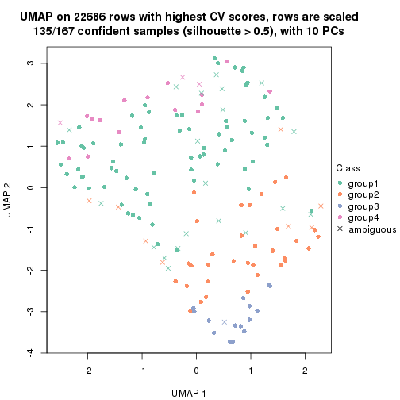</p>

</div>
<div id='tab-CV-pam-dimension-reduction-4'>
<pre><code class="r">dimension_reduction(res, k = 5, method = &quot;UMAP&quot;)
</code></pre>

<p></p>

</div>
<div id='tab-CV-pam-dimension-reduction-5'>
<pre><code class="r">dimension_reduction(res, k = 6, method = &quot;UMAP&quot;)
</code></pre>

<p></p>

</div>
</div>


Following heatmap shows how subgroups are split when increasing `k`:

```r
collect_classes(res)
```


Test correlation between subgroups and known annotations. If the known
annotation is numeric, one-way ANOVA test is applied, and if the known
annotation is discrete, chi-squared contingency table test is applied.

```r
test_to_known_factors(res)
```

```
#>          n specimen(p) k
#> CV:pam 145    0.011900 2
#> CV:pam 145    0.103568 3
#> CV:pam 135    0.206221 4
#> CV:pam 119    0.000204 5
#> CV:pam 115    0.002859 6
```


If matrix rows can be associated to genes, consider to use `GO_Enrichment(res,
...)` to perform function enrichment for the signature genes.


 

---------------------------------------------------


### CV:mclust


The object with results only for a single top-value method and a single partition method 
can be extracted as:

```r
res = res_list["CV", "mclust"]
# you can also extract it by
# res = res_list["CV:mclust"]
```

A summary of `res` and all the functions that can be applied to it:

```r
res
```

```
#> A 'ConsensusPartition' object with k = 2, 3, 4, 5, 6.
#>   On a matrix with 22686 rows and 167 columns.
#>   Top rows (1000, 2000, 3000, 4000, 5000) are extracted by 'CV' method.
#>   Subgroups are detected by 'mclust' method.
#>   Performed in total 1250 partitions by row resampling.
#>   Best k for subgroups seems to be 5.
#> 
#> Following methods can be applied to this 'ConsensusPartition' object:
#>  [1] "cola_report"             "collect_classes"         "collect_plots"          
#>  [4] "collect_stats"           "colnames"                "compare_signatures"     
#>  [7] "consensus_heatmap"       "dimension_reduction"     "functional_enrichment"  
#> [10] "get_anno_col"            "get_anno"                "get_classes"            
#> [13] "get_consensus"           "get_matrix"              "get_membership"         
#> [16] "get_param"               "get_signatures"          "get_stats"              
#> [19] "is_best_k"               "is_stable_k"             "membership_heatmap"     
#> [22] "ncol"                    "nrow"                    "plot_ecdf"              
#> [25] "rownames"                "select_partition_number" "show"                   
#> [28] "suggest_best_k"          "test_to_known_factors"
```

`collect_plots()` function collects all the plots made from `res` for all `k` (number of partitions)
into one single page to provide an easy and fast comparison between different `k`.

```r
collect_plots(res)
```


The plots are:

- The first row: a plot of the ECDF (Empirical cumulative distribution
  function) curves of the consensus matrix for each `k` and the heatmap of
  predicted classes for each `k`.
- The second row: heatmaps of the consensus matrix for each `k`.
- The third row: heatmaps of the membership matrix for each `k`.
- The fouth row: heatmaps of the signatures for each `k`.

All the plots in panels can be made by individual functions and they are
plotted later in this section.

`select_partition_number()` produces several plots showing different
statistics for choosing "optimized" `k`. There are following statistics:

- ECDF curves of the consensus matrix for each `k`;
- 1-PAC. [The PAC
  score](https://en.wikipedia.org/wiki/Consensus_clustering#Over-interpretation_potential_of_consensus_clustering)
  measures the proportion of the ambiguous subgrouping.
- Mean silhouette score.
- Concordance. The mean probability of fiting the consensus class ids in all
  partitions.
- Area increased. Denote $A_k$ as the area under the ECDF curve for current
  `k`, the area increased is defined as $A_k - A_{k-1}$.
- Rand index. The percent of pairs of samples that are both in a same cluster
  or both are not in a same cluster in the partition of k and k-1.
- Jaccard index. The ratio of pairs of samples are both in a same cluster in
  the partition of k and k-1 and the pairs of samples are both in a same
  cluster in the partition k or k-1.

The detailed explanations of these statistics can be found in [the cola
vignette](http://bioconductor.org/packages/devel/bioc/vignettes/cola/inst/doc/cola.html#toc_13).

Generally speaking, lower PAC score, higher mean silhouette score or higher
concordance corresponds to better partition. Rand index and Jaccard index
measure how similar the current partition is compared to partition with `k-1`.
If they are too similar, we won't accept `k` is better than `k-1`.

```r
select_partition_number(res)
```


The numeric values for all these statistics can be obtained by `get_stats()`.

```r
get_stats(res)
```

```
#>   k 1-PAC mean_silhouette concordance area_increased  Rand Jaccard
#> 2 2 0.108           0.251       0.709         0.3871 0.826   0.826
#> 3 3 0.178           0.313       0.660         0.4428 0.497   0.435
#> 4 4 0.300           0.407       0.618         0.1973 0.686   0.404
#> 5 5 0.458           0.534       0.726         0.1088 0.850   0.565
#> 6 6 0.498           0.314       0.617         0.0542 0.812   0.431
```

`suggest_best_k()` suggests the best $k$ based on these statistics. The rules are as follows:

- All $k$ with Jaccard index larger than 0.95 are removed because the increase of
  the partition number does not provides enough extra information. If all $k$ are removed,
  the best $k$ is assigned by `NA`.
- For $k$ with 1-PAC larger than 0.9, the maximal $k$ is taken as the "best k". Other $k$ is called "optional k".
- If it does not fit the second rule. The $k$ with the highest vote of highest
  1-PAC, mean silhouette and concordance is taken as the "best k".

```r
suggest_best_k(res)
```

```
#> [1] 5
```


Following shows the table of the partitions (You need to click the **show/hide
code output** link to see it). The membership matrix (columns with name `p*`)
is inferred by
[`clue::cl_consensus()`](https://www.rdocumentation.org/link/cl_consensus?package=clue)
function with the `SE` method. Basically the value in the membership matrix
represents the probability to belong to a certain group. The finall class
label for an item is determined with the group with highest probability it
belongs to.

In `get_classes()` function, the entropy is calculated from the membership
matrix and the silhouette score is calculated from the consensus matrix.


<script>
$( function() {
	$( '#tabs-CV-mclust-get-classes' ).tabs();
} );
</script>
<div id='tabs-CV-mclust-get-classes'>
<ul>
<li><a href='#tab-CV-mclust-get-classes-1'>k = 2</a></li>
<li><a href='#tab-CV-mclust-get-classes-2'>k = 3</a></li>
<li><a href='#tab-CV-mclust-get-classes-3'>k = 4</a></li>
<li><a href='#tab-CV-mclust-get-classes-4'>k = 5</a></li>
<li><a href='#tab-CV-mclust-get-classes-5'>k = 6</a></li>
</ul>

<div id='tab-CV-mclust-get-classes-1'>
<p><a id='tab-CV-mclust-get-classes-1-a' style='color:#0366d6' href='#'>show/hide code output</a></p>
<pre><code class="r">cbind(get_classes(res, k = 2), get_membership(res, k = 2))
</code></pre>

<pre><code>#&gt;          class entropy silhouette    p1    p2
#&gt; GSM30006     1   0.760    0.08859 0.780 0.220
#&gt; GSM30007     1   0.973    0.40209 0.596 0.404
#&gt; GSM30008     1   0.980    0.39416 0.584 0.416
#&gt; GSM30009     1   0.988    0.38757 0.564 0.436
#&gt; GSM30010     1   0.998   -0.78259 0.528 0.472
#&gt; GSM30011     1   0.795    0.02382 0.760 0.240
#&gt; GSM30012     1   0.760    0.12833 0.780 0.220
#&gt; GSM30013     1   0.416    0.44878 0.916 0.084
#&gt; GSM30014     1   0.886   -0.15104 0.696 0.304
#&gt; GSM30015     1   0.204    0.47949 0.968 0.032
#&gt; GSM30016     1   0.402    0.44564 0.920 0.080
#&gt; GSM30017     1   0.891    0.43115 0.692 0.308
#&gt; GSM30018     1   0.952    0.40031 0.628 0.372
#&gt; GSM30019     1   0.996   -0.80974 0.536 0.464
#&gt; GSM30020     1   0.973    0.38719 0.596 0.404
#&gt; GSM30021     1   0.563    0.40139 0.868 0.132
#&gt; GSM30022     1   0.971    0.38603 0.600 0.400
#&gt; GSM30023     1   0.327    0.47095 0.940 0.060
#&gt; GSM30024     1   0.388    0.44853 0.924 0.076
#&gt; GSM30025     1   0.689    0.43598 0.816 0.184
#&gt; GSM30026     1   0.469    0.47188 0.900 0.100
#&gt; GSM30027     1   0.971    0.19512 0.600 0.400
#&gt; GSM30028     1   0.482    0.48157 0.896 0.104
#&gt; GSM30029     1   0.981    0.39431 0.580 0.420
#&gt; GSM30030     1   0.983    0.39055 0.576 0.424
#&gt; GSM30031     1   0.987    0.38612 0.568 0.432
#&gt; GSM30032     1   0.615    0.35405 0.848 0.152
#&gt; GSM30033     1   0.574    0.39391 0.864 0.136
#&gt; GSM30034     1   0.904    0.43935 0.680 0.320
#&gt; GSM30035     1   0.584    0.40192 0.860 0.140
#&gt; GSM30036     1   0.985    0.39764 0.572 0.428
#&gt; GSM30037     1   0.999    0.36914 0.520 0.480
#&gt; GSM30038     1   0.402    0.44564 0.920 0.080
#&gt; GSM30039     1   0.975   -0.65335 0.592 0.408
#&gt; GSM30040     2   0.992    0.94225 0.448 0.552
#&gt; GSM30041     1   0.904   -0.22148 0.680 0.320
#&gt; GSM30042     1   0.886   -0.13140 0.696 0.304
#&gt; GSM30043     1   0.866   -0.13880 0.712 0.288
#&gt; GSM30044     1   0.978    0.37925 0.588 0.412
#&gt; GSM30045     1   0.866    0.43012 0.712 0.288
#&gt; GSM30046     1   0.224    0.47692 0.964 0.036
#&gt; GSM30047     1   0.985    0.39193 0.572 0.428
#&gt; GSM30048     1   0.388    0.48733 0.924 0.076
#&gt; GSM30049     2   0.998    0.90252 0.472 0.528
#&gt; GSM30050     1   0.861    0.44912 0.716 0.284
#&gt; GSM30051     1   1.000   -0.86465 0.504 0.496
#&gt; GSM30052     1   0.680    0.47121 0.820 0.180
#&gt; GSM30053     1   0.981   -0.68094 0.580 0.420
#&gt; GSM30054     2   0.988    0.93936 0.436 0.564
#&gt; GSM30055     1   0.494    0.46273 0.892 0.108
#&gt; GSM30056     1   0.802    0.10056 0.756 0.244
#&gt; GSM30057     1   0.866   -0.13766 0.712 0.288
#&gt; GSM30058     1   0.999   -0.80847 0.516 0.484
#&gt; GSM30059     1   0.430    0.44223 0.912 0.088
#&gt; GSM30060     2   0.996    0.92695 0.464 0.536
#&gt; GSM30061     1   0.563    0.45834 0.868 0.132
#&gt; GSM30062     1   0.881    0.00406 0.700 0.300
#&gt; GSM30063     1   0.895   -0.21158 0.688 0.312
#&gt; GSM30064     1   0.969    0.38803 0.604 0.396
#&gt; GSM30065     1   0.388    0.44670 0.924 0.076
#&gt; GSM30066     2   0.995    0.90903 0.460 0.540
#&gt; GSM30067     1   0.985    0.39089 0.572 0.428
#&gt; GSM30068     1   0.876   -0.13375 0.704 0.296
#&gt; GSM30069     1   0.795    0.11329 0.760 0.240
#&gt; GSM30070     1   0.443    0.43614 0.908 0.092
#&gt; GSM30071     1   0.402    0.44564 0.920 0.080
#&gt; GSM30072     1   0.402    0.48737 0.920 0.080
#&gt; GSM30073     1   0.327    0.44104 0.940 0.060
#&gt; GSM30074     1   0.634    0.32366 0.840 0.160
#&gt; GSM30075     1   0.900   -0.23184 0.684 0.316
#&gt; GSM30076     1   0.936    0.41538 0.648 0.352
#&gt; GSM30077     1   0.224    0.47135 0.964 0.036
#&gt; GSM30078     1   0.855    0.09186 0.720 0.280
#&gt; GSM30079     1   0.987    0.38893 0.568 0.432
#&gt; GSM30080     1   0.373    0.45053 0.928 0.072
#&gt; GSM30081     1   0.999   -0.81582 0.516 0.484
#&gt; GSM30086     1   0.224    0.45777 0.964 0.036
#&gt; GSM30087     1   0.574    0.40991 0.864 0.136
#&gt; GSM30088     1   0.980    0.39742 0.584 0.416
#&gt; GSM30089     1   0.563    0.48686 0.868 0.132
#&gt; GSM30090     2   0.996    0.92937 0.464 0.536
#&gt; GSM30091     2   0.999    0.89274 0.480 0.520
#&gt; GSM30092     1   0.985    0.39103 0.572 0.428
#&gt; GSM30093     1   0.995   -0.68286 0.540 0.460
#&gt; GSM30094     2   0.990    0.94115 0.440 0.560
#&gt; GSM30095     2   0.988    0.93936 0.436 0.564
#&gt; GSM30096     1   0.969    0.14838 0.604 0.396
#&gt; GSM30097     1   0.625    0.47581 0.844 0.156
#&gt; GSM30098     1   0.895    0.05617 0.688 0.312
#&gt; GSM30099     2   0.993    0.90273 0.452 0.548
#&gt; GSM30100     1   1.000   -0.82718 0.508 0.492
#&gt; GSM30101     1   0.929   -0.30585 0.656 0.344
#&gt; GSM30102     1   0.895   -0.16814 0.688 0.312
#&gt; GSM30103     1   0.574    0.42103 0.864 0.136
#&gt; GSM30104     1   0.541    0.46110 0.876 0.124
#&gt; GSM30105     1   0.943    0.42288 0.640 0.360
#&gt; GSM30106     1   0.753    0.23948 0.784 0.216
#&gt; GSM30107     1   0.891    0.42841 0.692 0.308
#&gt; GSM30108     1   0.327    0.47211 0.940 0.060
#&gt; GSM30109     1   0.775    0.16670 0.772 0.228
#&gt; GSM30110     1   0.971    0.36422 0.600 0.400
#&gt; GSM30111     1   0.827    0.44971 0.740 0.260
#&gt; GSM30112     1   0.714    0.20476 0.804 0.196
#&gt; GSM30113     2   1.000    0.85937 0.500 0.500
#&gt; GSM30114     1   0.443    0.43614 0.908 0.092
#&gt; GSM30115     1   0.343    0.45588 0.936 0.064
#&gt; GSM30116     2   0.985    0.92730 0.428 0.572
#&gt; GSM30117     1   0.913   -0.06304 0.672 0.328
#&gt; GSM30118     1   0.993   -0.64853 0.548 0.452
#&gt; GSM30119     1   0.850   -0.10945 0.724 0.276
#&gt; GSM30120     1   0.204    0.45536 0.968 0.032
#&gt; GSM30121     1   0.242    0.47939 0.960 0.040
#&gt; GSM30122     1   0.891    0.04637 0.692 0.308
#&gt; GSM30123     1   0.921   -0.07299 0.664 0.336
#&gt; GSM30177     1   0.996   -0.69833 0.536 0.464
#&gt; GSM30178     1   0.881    0.11290 0.700 0.300
#&gt; GSM30179     1   0.895    0.05457 0.688 0.312
#&gt; GSM30180     1   0.850    0.09677 0.724 0.276
#&gt; GSM30181     1   0.871    0.05506 0.708 0.292
#&gt; GSM30182     1   0.871    0.07839 0.708 0.292
#&gt; GSM30183     1   0.891    0.05798 0.692 0.308
#&gt; GSM30184     2   0.990    0.93625 0.440 0.560
#&gt; GSM30185     1   0.900   -0.02586 0.684 0.316
#&gt; GSM30186     1   0.996   -0.66883 0.536 0.464
#&gt; GSM30187     1   0.662    0.46846 0.828 0.172
#&gt; GSM30188     1   0.895    0.04725 0.688 0.312
#&gt; GSM30189     1   0.886    0.04506 0.696 0.304
#&gt; GSM30190     2   0.988    0.93936 0.436 0.564
#&gt; GSM30191     1   0.788    0.23281 0.764 0.236
#&gt; GSM30192     1   0.788    0.11931 0.764 0.236
#&gt; GSM30193     1   0.802    0.10835 0.756 0.244
#&gt; GSM30194     2   0.991    0.94066 0.444 0.556
#&gt; GSM30195     1   0.311    0.45760 0.944 0.056
#&gt; GSM30196     1   0.998    0.35990 0.528 0.472
#&gt; GSM30197     1   0.730    0.46496 0.796 0.204
#&gt; GSM30198     1   0.961    0.39635 0.616 0.384
#&gt; GSM30199     1   0.998   -0.71301 0.524 0.476
#&gt; GSM30200     1   0.224    0.47885 0.964 0.036
#&gt; GSM30201     1   0.978    0.39434 0.588 0.412
#&gt; GSM30202     1   0.443    0.44327 0.908 0.092
#&gt; GSM30203     1   0.871    0.07099 0.708 0.292
#&gt; GSM30204     1   0.966    0.38899 0.608 0.392
#&gt; GSM30205     1   0.402    0.44564 0.920 0.080
#&gt; GSM30206     1   0.891    0.04913 0.692 0.308
#&gt; GSM30207     1   0.850    0.45676 0.724 0.276
#&gt; GSM30208     1   0.909    0.04141 0.676 0.324
#&gt; GSM30209     1   0.929   -0.06692 0.656 0.344
#&gt; GSM30210     1   0.913    0.03863 0.672 0.328
#&gt; GSM30211     1   0.767    0.16721 0.776 0.224
#&gt; GSM30212     1   0.680    0.47526 0.820 0.180
#&gt; GSM30213     1   0.416    0.44998 0.916 0.084
#&gt; GSM30214     1   0.634    0.47472 0.840 0.160
#&gt; GSM30215     1   0.929    0.06475 0.656 0.344
#&gt; GSM30216     1   0.855    0.10135 0.720 0.280
#&gt; GSM30217     1   0.913    0.04963 0.672 0.328
#&gt; GSM30218     1   0.895   -0.02536 0.688 0.312
#&gt; GSM30219     2   0.997    0.92085 0.468 0.532
#&gt; GSM30220     1   0.775    0.33590 0.772 0.228
#&gt; GSM30221     1   0.518    0.48415 0.884 0.116
#&gt; GSM30222     1   0.808    0.10433 0.752 0.248
#&gt; GSM30223     1   0.969    0.38856 0.604 0.396
#&gt; GSM30224     1   0.949    0.41988 0.632 0.368
#&gt; GSM30225     1   0.775    0.13867 0.772 0.228
#&gt; GSM30226     1   0.932   -0.08796 0.652 0.348
#&gt; GSM30227     1   0.204    0.47693 0.968 0.032
#&gt; GSM30228     1   1.000   -0.87121 0.500 0.500
#&gt; GSM30229     1   0.625    0.45433 0.844 0.156
</code></pre>

<script>
$('#tab-CV-mclust-get-classes-1-a').parent().next().next().hide();
$('#tab-CV-mclust-get-classes-1-a').click(function(){
  $('#tab-CV-mclust-get-classes-1-a').parent().next().next().toggle();
  return(false);
});
</script>
</div>

<div id='tab-CV-mclust-get-classes-2'>
<p><a id='tab-CV-mclust-get-classes-2-a' style='color:#0366d6' href='#'>show/hide code output</a></p>
<pre><code class="r">cbind(get_classes(res, k = 3), get_membership(res, k = 3))
</code></pre>

<pre><code>#&gt;          class entropy silhouette    p1    p2    p3
#&gt; GSM30006     2  0.7912     0.2910 0.404 0.536 0.060
#&gt; GSM30007     1  0.3764     0.6607 0.892 0.068 0.040
#&gt; GSM30008     1  0.5122     0.5843 0.788 0.200 0.012
#&gt; GSM30009     1  0.2902     0.6603 0.920 0.064 0.016
#&gt; GSM30010     2  0.7969    -0.1393 0.060 0.508 0.432
#&gt; GSM30011     2  0.7945     0.3082 0.388 0.548 0.064
#&gt; GSM30012     2  0.7920     0.3310 0.360 0.572 0.068
#&gt; GSM30013     1  0.8135    -0.1675 0.484 0.448 0.068
#&gt; GSM30014     2  0.6264     0.1770 0.068 0.764 0.168
#&gt; GSM30015     1  0.6940     0.4761 0.708 0.224 0.068
#&gt; GSM30016     2  0.8066     0.2878 0.404 0.528 0.068
#&gt; GSM30017     1  0.2384     0.6645 0.936 0.008 0.056
#&gt; GSM30018     1  0.0661     0.6663 0.988 0.004 0.008
#&gt; GSM30019     2  0.5780     0.3562 0.080 0.800 0.120
#&gt; GSM30020     1  0.4605     0.4997 0.796 0.204 0.000
#&gt; GSM30021     2  0.6298     0.3173 0.388 0.608 0.004
#&gt; GSM30022     1  0.0848     0.6650 0.984 0.008 0.008
#&gt; GSM30023     1  0.5075     0.6547 0.836 0.096 0.068
#&gt; GSM30024     2  0.7169     0.3016 0.404 0.568 0.028
#&gt; GSM30025     1  0.7271     0.4327 0.608 0.352 0.040
#&gt; GSM30026     1  0.4399     0.6444 0.812 0.188 0.000
#&gt; GSM30027     1  0.8691     0.3201 0.528 0.356 0.116
#&gt; GSM30028     1  0.3875     0.6663 0.888 0.044 0.068
#&gt; GSM30029     1  0.1453     0.6713 0.968 0.024 0.008
#&gt; GSM30030     1  0.2846     0.6625 0.924 0.056 0.020
#&gt; GSM30031     1  0.3009     0.6598 0.920 0.052 0.028
#&gt; GSM30032     2  0.6688     0.2034 0.408 0.580 0.012
#&gt; GSM30033     2  0.6688     0.2034 0.408 0.580 0.012
#&gt; GSM30034     1  0.3856     0.6604 0.888 0.072 0.040
#&gt; GSM30035     2  0.6950     0.2003 0.408 0.572 0.020
#&gt; GSM30036     1  0.7163     0.3349 0.628 0.332 0.040
#&gt; GSM30037     1  0.2050     0.6740 0.952 0.028 0.020
#&gt; GSM30038     2  0.8066     0.2878 0.404 0.528 0.068
#&gt; GSM30039     2  0.5325     0.4315 0.248 0.748 0.004
#&gt; GSM30040     2  0.6215    -0.1527 0.000 0.572 0.428
#&gt; GSM30041     2  0.7389    -0.1391 0.036 0.556 0.408
#&gt; GSM30042     2  0.5816     0.4096 0.156 0.788 0.056
#&gt; GSM30043     2  0.7699    -0.1086 0.052 0.560 0.388
#&gt; GSM30044     1  0.0424     0.6622 0.992 0.000 0.008
#&gt; GSM30045     1  0.2176     0.6730 0.948 0.032 0.020
#&gt; GSM30046     1  0.4087     0.6649 0.880 0.052 0.068
#&gt; GSM30047     1  0.6647     0.0965 0.592 0.396 0.012
#&gt; GSM30048     1  0.3875     0.6668 0.888 0.044 0.068
#&gt; GSM30049     2  0.6432    -0.1521 0.004 0.568 0.428
#&gt; GSM30050     1  0.1877     0.6702 0.956 0.012 0.032
#&gt; GSM30051     2  0.7801    -0.1474 0.052 0.520 0.428
#&gt; GSM30052     1  0.5514     0.6470 0.800 0.156 0.044
#&gt; GSM30053     2  0.6703     0.4296 0.236 0.712 0.052
#&gt; GSM30054     2  0.6215    -0.1527 0.000 0.572 0.428
#&gt; GSM30055     2  0.7979     0.1661 0.440 0.500 0.060
#&gt; GSM30056     2  0.5988     0.3361 0.304 0.688 0.008
#&gt; GSM30057     2  0.7553    -0.0299 0.060 0.620 0.320
#&gt; GSM30058     2  0.6483    -0.1204 0.008 0.600 0.392
#&gt; GSM30059     1  0.6653     0.5525 0.680 0.288 0.032
#&gt; GSM30060     2  0.2866     0.3636 0.076 0.916 0.008
#&gt; GSM30061     2  0.7181     0.1924 0.408 0.564 0.028
#&gt; GSM30062     2  0.8212     0.2884 0.296 0.600 0.104
#&gt; GSM30063     2  0.3112     0.3044 0.028 0.916 0.056
#&gt; GSM30064     1  0.0592     0.6609 0.988 0.000 0.012
#&gt; GSM30065     2  0.8066     0.2878 0.404 0.528 0.068
#&gt; GSM30066     3  0.7004     0.1621 0.020 0.428 0.552
#&gt; GSM30067     1  0.0424     0.6622 0.992 0.000 0.008
#&gt; GSM30068     2  0.7962    -0.1361 0.060 0.512 0.428
#&gt; GSM30069     2  0.7982     0.3143 0.376 0.556 0.068
#&gt; GSM30070     2  0.8066     0.2878 0.404 0.528 0.068
#&gt; GSM30071     2  0.8066     0.2878 0.404 0.528 0.068
#&gt; GSM30072     1  0.3649     0.6679 0.896 0.036 0.068
#&gt; GSM30073     2  0.6505     0.1933 0.468 0.528 0.004
#&gt; GSM30074     2  0.8066     0.2878 0.404 0.528 0.068
#&gt; GSM30075     2  0.8275     0.2870 0.296 0.596 0.108
#&gt; GSM30076     1  0.6678     0.4549 0.728 0.208 0.064
#&gt; GSM30077     1  0.3482     0.6582 0.872 0.128 0.000
#&gt; GSM30078     1  0.7001     0.5305 0.716 0.200 0.084
#&gt; GSM30079     1  0.0661     0.6638 0.988 0.004 0.008
#&gt; GSM30080     2  0.8066     0.2878 0.404 0.528 0.068
#&gt; GSM30081     2  0.7801    -0.1474 0.052 0.520 0.428
#&gt; GSM30086     1  0.7995    -0.1742 0.480 0.460 0.060
#&gt; GSM30087     1  0.4504     0.6379 0.804 0.196 0.000
#&gt; GSM30088     1  0.3141     0.6641 0.912 0.068 0.020
#&gt; GSM30089     2  0.6682     0.1684 0.488 0.504 0.008
#&gt; GSM30090     2  0.3619     0.1872 0.000 0.864 0.136
#&gt; GSM30091     2  0.6215    -0.1527 0.000 0.572 0.428
#&gt; GSM30092     1  0.5591     0.2966 0.696 0.304 0.000
#&gt; GSM30093     2  0.4796     0.4040 0.220 0.780 0.000
#&gt; GSM30094     2  0.6215    -0.1527 0.000 0.572 0.428
#&gt; GSM30095     3  0.6286     0.1439 0.000 0.464 0.536
#&gt; GSM30096     1  0.8218     0.3749 0.640 0.176 0.184
#&gt; GSM30097     1  0.5239     0.6494 0.808 0.160 0.032
#&gt; GSM30098     1  0.9105    -0.2351 0.500 0.152 0.348
#&gt; GSM30099     2  0.6892     0.2195 0.112 0.736 0.152
#&gt; GSM30100     2  0.7004    -0.1508 0.020 0.552 0.428
#&gt; GSM30101     2  0.7112     0.0429 0.060 0.680 0.260
#&gt; GSM30102     2  0.6513     0.2183 0.400 0.592 0.008
#&gt; GSM30103     2  0.7287     0.1905 0.408 0.560 0.032
#&gt; GSM30104     2  0.7192     0.1904 0.412 0.560 0.028
#&gt; GSM30105     1  0.3764     0.6597 0.892 0.068 0.040
#&gt; GSM30106     1  0.5237     0.6266 0.824 0.120 0.056
#&gt; GSM30107     1  0.2297     0.6729 0.944 0.020 0.036
#&gt; GSM30108     2  0.8066     0.2878 0.404 0.528 0.068
#&gt; GSM30109     1  0.7388     0.4313 0.704 0.136 0.160
#&gt; GSM30110     1  0.1482     0.6652 0.968 0.012 0.020
#&gt; GSM30111     1  0.7997    -0.1431 0.472 0.468 0.060
#&gt; GSM30112     2  0.8546     0.2947 0.348 0.544 0.108
#&gt; GSM30113     2  0.6215    -0.1527 0.000 0.572 0.428
#&gt; GSM30114     2  0.8066     0.2878 0.404 0.528 0.068
#&gt; GSM30115     1  0.7644     0.2912 0.624 0.308 0.068
#&gt; GSM30116     2  0.6746     0.1587 0.076 0.732 0.192
#&gt; GSM30117     2  0.8159     0.2695 0.320 0.588 0.092
#&gt; GSM30118     2  0.6260     0.1630 0.000 0.552 0.448
#&gt; GSM30119     2  0.3845     0.3935 0.116 0.872 0.012
#&gt; GSM30120     2  0.6291     0.1970 0.468 0.532 0.000
#&gt; GSM30121     1  0.3412     0.6601 0.876 0.124 0.000
#&gt; GSM30122     1  0.9760    -0.3013 0.420 0.236 0.344
#&gt; GSM30123     2  0.7640     0.2358 0.052 0.576 0.372
#&gt; GSM30177     2  0.5633     0.4033 0.208 0.768 0.024
#&gt; GSM30178     2  0.7050     0.2414 0.372 0.600 0.028
#&gt; GSM30179     2  0.9462    -0.1576 0.400 0.420 0.180
#&gt; GSM30180     1  0.8616     0.1647 0.588 0.148 0.264
#&gt; GSM30181     2  0.6267     0.1611 0.000 0.548 0.452
#&gt; GSM30182     3  0.9191     0.4241 0.424 0.148 0.428
#&gt; GSM30183     1  0.9252    -0.2923 0.480 0.164 0.356
#&gt; GSM30184     3  0.8255     0.1598 0.076 0.428 0.496
#&gt; GSM30185     2  0.6786     0.1532 0.012 0.540 0.448
#&gt; GSM30186     2  0.8285     0.3094 0.112 0.600 0.288
#&gt; GSM30187     1  0.7083     0.3768 0.592 0.380 0.028
#&gt; GSM30188     3  0.9177     0.4769 0.400 0.148 0.452
#&gt; GSM30189     1  0.9484    -0.2576 0.472 0.200 0.328
#&gt; GSM30190     2  0.6215    -0.1527 0.000 0.572 0.428
#&gt; GSM30191     2  0.6783     0.2209 0.396 0.588 0.016
#&gt; GSM30192     2  0.8875     0.2186 0.128 0.508 0.364
#&gt; GSM30193     3  0.9177     0.4769 0.400 0.148 0.452
#&gt; GSM30194     2  0.6215    -0.1527 0.000 0.572 0.428
#&gt; GSM30195     1  0.7395    -0.1651 0.492 0.476 0.032
#&gt; GSM30196     1  0.0747     0.6590 0.984 0.000 0.016
#&gt; GSM30197     1  0.5823     0.5892 0.792 0.144 0.064
#&gt; GSM30198     1  0.1031     0.6696 0.976 0.024 0.000
#&gt; GSM30199     2  0.6204     0.1730 0.000 0.576 0.424
#&gt; GSM30200     1  0.3752     0.6698 0.884 0.096 0.020
#&gt; GSM30201     1  0.3213     0.6628 0.912 0.060 0.028
#&gt; GSM30202     1  0.5905     0.4774 0.648 0.352 0.000
#&gt; GSM30203     2  0.9125    -0.0572 0.392 0.464 0.144
#&gt; GSM30204     1  0.1585     0.6667 0.964 0.028 0.008
#&gt; GSM30205     2  0.8066     0.2878 0.404 0.528 0.068
#&gt; GSM30206     3  0.9177     0.4769 0.400 0.148 0.452
#&gt; GSM30207     1  0.7396    -0.1030 0.488 0.480 0.032
#&gt; GSM30208     1  0.9449    -0.4119 0.436 0.180 0.384
#&gt; GSM30209     2  0.8275     0.3036 0.108 0.596 0.296
#&gt; GSM30210     3  0.9265     0.4357 0.416 0.156 0.428
#&gt; GSM30211     1  0.7221     0.4582 0.716 0.136 0.148
#&gt; GSM30212     1  0.5036     0.6610 0.832 0.120 0.048
#&gt; GSM30213     1  0.4452     0.6408 0.808 0.192 0.000
#&gt; GSM30214     1  0.5111     0.6471 0.808 0.168 0.024
#&gt; GSM30215     1  0.8457     0.3074 0.616 0.168 0.216
#&gt; GSM30216     1  0.8847    -0.0511 0.552 0.148 0.300
#&gt; GSM30217     1  0.9571     0.2897 0.472 0.304 0.224
#&gt; GSM30218     2  0.3192     0.3915 0.112 0.888 0.000
#&gt; GSM30219     2  0.1015     0.3378 0.012 0.980 0.008
#&gt; GSM30220     1  0.5514     0.6470 0.800 0.156 0.044
#&gt; GSM30221     1  0.6577     0.3037 0.572 0.420 0.008
#&gt; GSM30222     2  0.9234     0.1531 0.160 0.476 0.364
#&gt; GSM30223     1  0.1860     0.6622 0.948 0.000 0.052
#&gt; GSM30224     1  0.4035     0.6630 0.880 0.080 0.040
#&gt; GSM30225     1  0.8890    -0.0281 0.544 0.148 0.308
#&gt; GSM30226     2  0.6659     0.3832 0.132 0.752 0.116
#&gt; GSM30227     1  0.3482     0.6582 0.872 0.128 0.000
#&gt; GSM30228     2  0.3826     0.4359 0.124 0.868 0.008
#&gt; GSM30229     2  0.7181     0.1924 0.408 0.564 0.028
</code></pre>

<script>
$('#tab-CV-mclust-get-classes-2-a').parent().next().next().hide();
$('#tab-CV-mclust-get-classes-2-a').click(function(){
  $('#tab-CV-mclust-get-classes-2-a').parent().next().next().toggle();
  return(false);
});
</script>
</div>

<div id='tab-CV-mclust-get-classes-3'>
<p><a id='tab-CV-mclust-get-classes-3-a' style='color:#0366d6' href='#'>show/hide code output</a></p>
<pre><code class="r">cbind(get_classes(res, k = 4), get_membership(res, k = 4))
</code></pre>

<pre><code>#&gt;          class entropy silhouette    p1    p2    p3    p4
#&gt; GSM30006     2  0.6074   7.11e-01 0.340 0.600 0.060 0.000
#&gt; GSM30007     1  0.5064   4.59e-01 0.632 0.004 0.004 0.360
#&gt; GSM30008     1  0.5655   4.30e-01 0.604 0.024 0.004 0.368
#&gt; GSM30009     1  0.4126   5.42e-01 0.776 0.004 0.004 0.216
#&gt; GSM30010     3  0.2266   7.31e-01 0.000 0.084 0.912 0.004
#&gt; GSM30011     2  0.6179   7.17e-01 0.324 0.612 0.060 0.004
#&gt; GSM30012     2  0.5769   7.20e-01 0.264 0.676 0.056 0.004
#&gt; GSM30013     2  0.6809   5.31e-01 0.360 0.532 0.000 0.108
#&gt; GSM30014     3  0.5155   3.19e-01 0.000 0.468 0.528 0.004
#&gt; GSM30015     1  0.6167   5.43e-01 0.652 0.100 0.000 0.248
#&gt; GSM30016     2  0.5881   7.03e-01 0.296 0.652 0.008 0.044
#&gt; GSM30017     1  0.1854   5.99e-01 0.940 0.048 0.000 0.012
#&gt; GSM30018     1  0.1576   6.19e-01 0.948 0.004 0.000 0.048
#&gt; GSM30019     2  0.7364   7.00e-02 0.004 0.548 0.240 0.208
#&gt; GSM30020     1  0.5693   5.43e-01 0.688 0.072 0.000 0.240
#&gt; GSM30021     2  0.7892   6.40e-01 0.240 0.564 0.148 0.048
#&gt; GSM30022     1  0.0188   6.06e-01 0.996 0.000 0.000 0.004
#&gt; GSM30023     1  0.5256   5.94e-01 0.732 0.064 0.000 0.204
#&gt; GSM30024     2  0.7846   5.74e-01 0.384 0.468 0.036 0.112
#&gt; GSM30025     4  0.6938  -4.64e-02 0.392 0.040 0.040 0.528
#&gt; GSM30026     1  0.3463   5.81e-01 0.868 0.004 0.032 0.096
#&gt; GSM30027     4  0.6235   1.08e-01 0.352 0.020 0.032 0.596
#&gt; GSM30028     1  0.5184   5.95e-01 0.736 0.060 0.000 0.204
#&gt; GSM30029     1  0.1109   6.05e-01 0.968 0.004 0.000 0.028
#&gt; GSM30030     1  0.3441   5.43e-01 0.840 0.004 0.004 0.152
#&gt; GSM30031     1  0.4997   5.32e-01 0.688 0.012 0.004 0.296
#&gt; GSM30032     4  0.9565  -9.13e-02 0.228 0.316 0.124 0.332
#&gt; GSM30033     4  0.9225   2.34e-02 0.216 0.300 0.092 0.392
#&gt; GSM30034     1  0.4973   4.92e-01 0.692 0.004 0.012 0.292
#&gt; GSM30035     4  0.8762   2.01e-01 0.208 0.216 0.084 0.492
#&gt; GSM30036     1  0.6214   2.89e-01 0.524 0.044 0.004 0.428
#&gt; GSM30037     1  0.6045   5.44e-01 0.664 0.064 0.008 0.264
#&gt; GSM30038     2  0.4647   7.28e-01 0.288 0.704 0.008 0.000
#&gt; GSM30039     2  0.7765   5.23e-01 0.164 0.568 0.232 0.036
#&gt; GSM30040     3  0.0469   7.58e-01 0.000 0.000 0.988 0.012
#&gt; GSM30041     3  0.2918   7.24e-01 0.000 0.116 0.876 0.008
#&gt; GSM30042     2  0.6198   3.86e-01 0.084 0.652 0.260 0.004
#&gt; GSM30043     3  0.3306   7.09e-01 0.000 0.156 0.840 0.004
#&gt; GSM30044     1  0.0672   6.04e-01 0.984 0.008 0.000 0.008
#&gt; GSM30045     1  0.4912   6.03e-01 0.776 0.060 0.004 0.160
#&gt; GSM30046     1  0.2443   5.96e-01 0.916 0.060 0.000 0.024
#&gt; GSM30047     1  0.6014   4.13e-01 0.588 0.052 0.000 0.360
#&gt; GSM30048     1  0.2021   5.99e-01 0.932 0.056 0.000 0.012
#&gt; GSM30049     3  0.0524   7.58e-01 0.000 0.004 0.988 0.008
#&gt; GSM30050     1  0.4399   6.00e-01 0.768 0.020 0.000 0.212
#&gt; GSM30051     3  0.0672   7.56e-01 0.000 0.008 0.984 0.008
#&gt; GSM30052     4  0.7388  -2.10e-01 0.448 0.064 0.040 0.448
#&gt; GSM30053     2  0.8202   5.14e-01 0.156 0.560 0.208 0.076
#&gt; GSM30054     3  0.0592   7.55e-01 0.000 0.000 0.984 0.016
#&gt; GSM30055     2  0.7795   3.90e-01 0.328 0.448 0.004 0.220
#&gt; GSM30056     4  0.9545  -6.85e-02 0.136 0.328 0.196 0.340
#&gt; GSM30057     3  0.4889   5.24e-01 0.000 0.360 0.636 0.004
#&gt; GSM30058     3  0.2480   7.39e-01 0.000 0.088 0.904 0.008
#&gt; GSM30059     4  0.6360   6.15e-02 0.364 0.020 0.036 0.580
#&gt; GSM30060     3  0.8138   1.93e-01 0.008 0.300 0.392 0.300
#&gt; GSM30061     4  0.8631   1.98e-01 0.288 0.196 0.056 0.460
#&gt; GSM30062     4  0.6634   3.17e-01 0.268 0.056 0.036 0.640
#&gt; GSM30063     3  0.7241   3.28e-01 0.004 0.364 0.500 0.132
#&gt; GSM30064     1  0.4426   6.04e-01 0.780 0.020 0.004 0.196
#&gt; GSM30065     2  0.6640   6.55e-01 0.360 0.560 0.008 0.072
#&gt; GSM30066     3  0.3052   6.73e-01 0.000 0.004 0.860 0.136
#&gt; GSM30067     1  0.3726   5.99e-01 0.788 0.000 0.000 0.212
#&gt; GSM30068     3  0.4837   5.40e-01 0.000 0.348 0.648 0.004
#&gt; GSM30069     2  0.5247   7.29e-01 0.284 0.684 0.032 0.000
#&gt; GSM30070     2  0.4621   7.26e-01 0.284 0.708 0.008 0.000
#&gt; GSM30071     2  0.4792   7.26e-01 0.312 0.680 0.008 0.000
#&gt; GSM30072     1  0.5148   5.95e-01 0.736 0.056 0.000 0.208
#&gt; GSM30073     1  0.8795  -3.93e-01 0.388 0.344 0.052 0.216
#&gt; GSM30074     2  0.4769   7.27e-01 0.308 0.684 0.008 0.000
#&gt; GSM30075     2  0.8797   6.20e-02 0.180 0.392 0.064 0.364
#&gt; GSM30076     1  0.6238   5.30e-01 0.652 0.112 0.000 0.236
#&gt; GSM30077     1  0.3591   6.08e-01 0.872 0.016 0.032 0.080
#&gt; GSM30078     4  0.6414  -6.54e-02 0.412 0.024 0.028 0.536
#&gt; GSM30079     1  0.0592   6.05e-01 0.984 0.000 0.000 0.016
#&gt; GSM30080     2  0.6823   6.28e-01 0.288 0.596 0.008 0.108
#&gt; GSM30081     3  0.0672   7.56e-01 0.000 0.008 0.984 0.008
#&gt; GSM30086     1  0.7999  -1.90e-01 0.424 0.360 0.012 0.204
#&gt; GSM30087     1  0.4540   5.39e-01 0.772 0.000 0.032 0.196
#&gt; GSM30088     1  0.3208   5.90e-01 0.848 0.000 0.004 0.148
#&gt; GSM30089     1  0.7346   4.81e-01 0.592 0.104 0.036 0.268
#&gt; GSM30090     3  0.6868   4.57e-01 0.000 0.264 0.584 0.152
#&gt; GSM30091     3  0.0524   7.58e-01 0.000 0.004 0.988 0.008
#&gt; GSM30092     1  0.5550   5.40e-01 0.692 0.060 0.000 0.248
#&gt; GSM30093     4  0.8966  -4.63e-05 0.060 0.328 0.236 0.376
#&gt; GSM30094     3  0.0707   7.56e-01 0.000 0.000 0.980 0.020
#&gt; GSM30095     3  0.3074   6.63e-01 0.000 0.000 0.848 0.152
#&gt; GSM30096     4  0.5511   2.43e-01 0.284 0.004 0.036 0.676
#&gt; GSM30097     1  0.4835   4.53e-01 0.756 0.004 0.032 0.208
#&gt; GSM30098     1  0.7401  -4.95e-02 0.476 0.148 0.004 0.372
#&gt; GSM30099     3  0.8048   2.11e-01 0.008 0.240 0.396 0.356
#&gt; GSM30100     3  0.0524   7.58e-01 0.000 0.004 0.988 0.008
#&gt; GSM30101     3  0.3448   6.97e-01 0.000 0.168 0.828 0.004
#&gt; GSM30102     4  0.9200  -5.04e-02 0.252 0.320 0.076 0.352
#&gt; GSM30103     4  0.8518   2.53e-01 0.220 0.192 0.072 0.516
#&gt; GSM30104     4  0.8942   1.06e-01 0.292 0.232 0.064 0.412
#&gt; GSM30105     1  0.4303   5.21e-01 0.792 0.004 0.020 0.184
#&gt; GSM30106     1  0.4760   5.02e-01 0.792 0.052 0.008 0.148
#&gt; GSM30107     1  0.5085   5.96e-01 0.752 0.028 0.016 0.204
#&gt; GSM30108     2  0.6723   5.87e-01 0.368 0.548 0.008 0.076
#&gt; GSM30109     1  0.5125   3.46e-01 0.720 0.008 0.024 0.248
#&gt; GSM30110     1  0.4041   6.11e-01 0.840 0.056 0.004 0.100
#&gt; GSM30111     1  0.7450   1.80e-01 0.508 0.228 0.000 0.264
#&gt; GSM30112     4  0.7640   2.51e-01 0.264 0.148 0.028 0.560
#&gt; GSM30113     3  0.0469   7.58e-01 0.000 0.000 0.988 0.012
#&gt; GSM30114     2  0.4799   7.27e-01 0.284 0.704 0.008 0.004
#&gt; GSM30115     1  0.6770   4.99e-01 0.604 0.160 0.000 0.236
#&gt; GSM30116     4  0.8013  -1.82e-01 0.008 0.232 0.352 0.408
#&gt; GSM30117     4  0.6618   4.20e-01 0.124 0.128 0.048 0.700
#&gt; GSM30118     4  0.6032   1.61e-01 0.008 0.428 0.028 0.536
#&gt; GSM30119     2  0.6012  -4.53e-02 0.024 0.560 0.404 0.012
#&gt; GSM30120     1  0.8390   1.72e-01 0.428 0.224 0.028 0.320
#&gt; GSM30121     1  0.2432   6.01e-01 0.928 0.020 0.024 0.028
#&gt; GSM30122     4  0.3241   4.51e-01 0.072 0.040 0.004 0.884
#&gt; GSM30123     4  0.4865   3.63e-01 0.032 0.184 0.012 0.772
#&gt; GSM30177     4  0.8904  -3.69e-03 0.052 0.308 0.260 0.380
#&gt; GSM30178     4  0.6995   3.12e-01 0.264 0.080 0.036 0.620
#&gt; GSM30179     4  0.4871   3.74e-01 0.188 0.008 0.036 0.768
#&gt; GSM30180     4  0.7881   2.02e-02 0.360 0.136 0.028 0.476
#&gt; GSM30181     4  0.5430   3.83e-01 0.056 0.204 0.008 0.732
#&gt; GSM30182     1  0.7694  -5.92e-02 0.456 0.196 0.004 0.344
#&gt; GSM30183     4  0.7262   6.26e-02 0.424 0.072 0.028 0.476
#&gt; GSM30184     3  0.6679   5.50e-01 0.004 0.148 0.632 0.216
#&gt; GSM30185     4  0.4034   4.13e-01 0.012 0.180 0.004 0.804
#&gt; GSM30186     4  0.5770   3.21e-01 0.040 0.228 0.024 0.708
#&gt; GSM30187     4  0.6893  -7.24e-02 0.408 0.040 0.036 0.516
#&gt; GSM30188     1  0.7577  -8.75e-02 0.440 0.168 0.004 0.388
#&gt; GSM30189     4  0.4522   3.68e-01 0.164 0.032 0.008 0.796
#&gt; GSM30190     3  0.0469   7.58e-01 0.000 0.000 0.988 0.012
#&gt; GSM30191     4  0.8060   3.29e-01 0.172 0.172 0.076 0.580
#&gt; GSM30192     4  0.7451   2.62e-01 0.184 0.264 0.008 0.544
#&gt; GSM30193     4  0.7431   1.51e-01 0.268 0.196 0.004 0.532
#&gt; GSM30194     3  0.0469   7.56e-01 0.000 0.000 0.988 0.012
#&gt; GSM30195     1  0.7157   4.73e-01 0.620 0.140 0.024 0.216
#&gt; GSM30196     1  0.1822   5.92e-01 0.944 0.044 0.004 0.008
#&gt; GSM30197     1  0.5900   5.73e-01 0.684 0.096 0.000 0.220
#&gt; GSM30198     1  0.2814   6.25e-01 0.868 0.000 0.000 0.132
#&gt; GSM30199     4  0.5872   2.21e-01 0.000 0.384 0.040 0.576
#&gt; GSM30200     1  0.2197   5.99e-01 0.928 0.048 0.000 0.024
#&gt; GSM30201     1  0.2401   5.83e-01 0.904 0.000 0.004 0.092
#&gt; GSM30202     4  0.6978  -9.04e-02 0.416 0.044 0.036 0.504
#&gt; GSM30203     4  0.5533   3.22e-01 0.244 0.020 0.028 0.708
#&gt; GSM30204     1  0.3688   5.99e-01 0.792 0.000 0.000 0.208
#&gt; GSM30205     2  0.6966   5.46e-01 0.360 0.536 0.008 0.096
#&gt; GSM30206     4  0.7587   1.02e-01 0.404 0.168 0.004 0.424
#&gt; GSM30207     4  0.7507  -8.53e-02 0.416 0.140 0.008 0.436
#&gt; GSM30208     4  0.5857   1.98e-01 0.340 0.032 0.008 0.620
#&gt; GSM30209     4  0.2917   4.68e-01 0.040 0.048 0.008 0.904
#&gt; GSM30210     4  0.7477   1.10e-01 0.416 0.152 0.004 0.428
#&gt; GSM30211     1  0.5392   3.38e-01 0.708 0.016 0.024 0.252
#&gt; GSM30212     1  0.4669   5.13e-01 0.772 0.008 0.024 0.196
#&gt; GSM30213     1  0.5681   3.63e-01 0.568 0.000 0.028 0.404
#&gt; GSM30214     1  0.6086   2.80e-01 0.516 0.004 0.036 0.444
#&gt; GSM30215     4  0.4872   3.29e-01 0.212 0.004 0.032 0.752
#&gt; GSM30216     1  0.7162   5.17e-02 0.548 0.076 0.028 0.348
#&gt; GSM30217     4  0.3128   4.54e-01 0.076 0.004 0.032 0.888
#&gt; GSM30218     4  0.7688   8.72e-02 0.004 0.252 0.252 0.492
#&gt; GSM30219     3  0.7706   2.66e-01 0.000 0.300 0.448 0.252
#&gt; GSM30220     1  0.7313   2.25e-01 0.516 0.064 0.040 0.380
#&gt; GSM30221     1  0.6853   3.63e-01 0.536 0.040 0.036 0.388
#&gt; GSM30222     4  0.7349   1.71e-01 0.276 0.180 0.004 0.540
#&gt; GSM30223     1  0.2313   6.18e-01 0.924 0.044 0.000 0.032
#&gt; GSM30224     1  0.5154   4.61e-01 0.660 0.004 0.012 0.324
#&gt; GSM30225     1  0.7656   2.98e-02 0.520 0.160 0.016 0.304
#&gt; GSM30226     4  0.6545   2.88e-01 0.016 0.212 0.108 0.664
#&gt; GSM30227     1  0.2883   5.93e-01 0.908 0.016 0.028 0.048
#&gt; GSM30228     3  0.8750   5.36e-02 0.052 0.356 0.388 0.204
#&gt; GSM30229     4  0.7539   2.51e-01 0.296 0.108 0.036 0.560
</code></pre>

<script>
$('#tab-CV-mclust-get-classes-3-a').parent().next().next().hide();
$('#tab-CV-mclust-get-classes-3-a').click(function(){
  $('#tab-CV-mclust-get-classes-3-a').parent().next().next().toggle();
  return(false);
});
</script>
</div>

<div id='tab-CV-mclust-get-classes-4'>
<p><a id='tab-CV-mclust-get-classes-4-a' style='color:#0366d6' href='#'>show/hide code output</a></p>
<pre><code class="r">cbind(get_classes(res, k = 5), get_membership(res, k = 5))
</code></pre>

<pre><code>#&gt;          class entropy silhouette    p1    p2    p3    p4    p5
#&gt; GSM30006     5  0.3361    0.72398 0.064 0.008 0.056 0.008 0.864
#&gt; GSM30007     1  0.3127    0.66629 0.848 0.128 0.000 0.004 0.020
#&gt; GSM30008     1  0.3584    0.67966 0.836 0.112 0.000 0.012 0.040
#&gt; GSM30009     1  0.2729    0.68272 0.884 0.084 0.000 0.028 0.004
#&gt; GSM30010     3  0.2439    0.77631 0.000 0.004 0.876 0.000 0.120
#&gt; GSM30011     5  0.3279    0.72103 0.052 0.012 0.064 0.004 0.868
#&gt; GSM30012     5  0.3100    0.71402 0.040 0.020 0.064 0.000 0.876
#&gt; GSM30013     5  0.4830    0.16514 0.420 0.016 0.000 0.004 0.560
#&gt; GSM30014     5  0.3628    0.56682 0.000 0.012 0.216 0.000 0.772
#&gt; GSM30015     1  0.6392    0.53814 0.624 0.052 0.000 0.200 0.124
#&gt; GSM30016     5  0.2429    0.72130 0.076 0.020 0.000 0.004 0.900
#&gt; GSM30017     1  0.3403    0.63496 0.820 0.008 0.000 0.160 0.012
#&gt; GSM30018     1  0.3835    0.63363 0.732 0.000 0.000 0.260 0.008
#&gt; GSM30019     5  0.4110    0.56914 0.000 0.012 0.028 0.184 0.776
#&gt; GSM30020     1  0.3801    0.67795 0.840 0.040 0.000 0.068 0.052
#&gt; GSM30021     5  0.4621    0.69643 0.060 0.044 0.076 0.016 0.804
#&gt; GSM30022     1  0.2464    0.66581 0.892 0.012 0.000 0.092 0.004
#&gt; GSM30023     1  0.1630    0.68870 0.944 0.016 0.000 0.004 0.036
#&gt; GSM30024     5  0.5521    0.50344 0.272 0.084 0.008 0.000 0.636
#&gt; GSM30025     1  0.5087    0.37274 0.600 0.364 0.000 0.016 0.020
#&gt; GSM30026     1  0.4817    0.60914 0.656 0.044 0.000 0.300 0.000
#&gt; GSM30027     1  0.5949    0.41902 0.624 0.240 0.000 0.120 0.016
#&gt; GSM30028     1  0.0727    0.68524 0.980 0.004 0.000 0.004 0.012
#&gt; GSM30029     1  0.3203    0.63169 0.820 0.012 0.000 0.168 0.000
#&gt; GSM30030     1  0.3392    0.68249 0.848 0.084 0.000 0.064 0.004
#&gt; GSM30031     1  0.2645    0.67949 0.884 0.096 0.000 0.008 0.012
#&gt; GSM30032     2  0.6713    0.54201 0.084 0.580 0.068 0.004 0.264
#&gt; GSM30033     2  0.5262    0.60192 0.056 0.696 0.028 0.000 0.220
#&gt; GSM30034     1  0.4677    0.63304 0.740 0.176 0.000 0.080 0.004
#&gt; GSM30035     2  0.5252    0.62806 0.068 0.748 0.060 0.004 0.120
#&gt; GSM30036     1  0.6438    0.54594 0.604 0.240 0.000 0.104 0.052
#&gt; GSM30037     1  0.3527    0.66873 0.820 0.148 0.000 0.004 0.028
#&gt; GSM30038     5  0.2166    0.72761 0.072 0.012 0.000 0.004 0.912
#&gt; GSM30039     5  0.3490    0.66574 0.004 0.028 0.120 0.008 0.840
#&gt; GSM30040     3  0.0290    0.85430 0.000 0.008 0.992 0.000 0.000
#&gt; GSM30041     3  0.3163    0.74499 0.000 0.012 0.824 0.000 0.164
#&gt; GSM30042     5  0.3071    0.70991 0.036 0.012 0.080 0.000 0.872
#&gt; GSM30043     3  0.1894    0.82144 0.000 0.008 0.920 0.000 0.072
#&gt; GSM30044     1  0.2753    0.65997 0.876 0.012 0.000 0.104 0.008
#&gt; GSM30045     1  0.2178    0.67091 0.920 0.048 0.000 0.008 0.024
#&gt; GSM30046     1  0.4422    0.57921 0.664 0.004 0.000 0.320 0.012
#&gt; GSM30047     1  0.4442    0.65029 0.760 0.184 0.000 0.016 0.040
#&gt; GSM30048     1  0.3145    0.64635 0.844 0.008 0.000 0.136 0.012
#&gt; GSM30049     3  0.0290    0.85430 0.000 0.008 0.992 0.000 0.000
#&gt; GSM30050     1  0.4328    0.62778 0.752 0.024 0.000 0.208 0.016
#&gt; GSM30051     3  0.0162    0.85293 0.000 0.004 0.996 0.000 0.000
#&gt; GSM30052     1  0.4956    0.51023 0.664 0.292 0.000 0.016 0.028
#&gt; GSM30053     5  0.4322    0.65088 0.000 0.092 0.084 0.024 0.800
#&gt; GSM30054     3  0.1074    0.84583 0.000 0.012 0.968 0.016 0.004
#&gt; GSM30055     5  0.6757   -0.05312 0.388 0.216 0.000 0.004 0.392
#&gt; GSM30056     2  0.6391    0.57409 0.032 0.612 0.124 0.004 0.228
#&gt; GSM30057     3  0.4489    0.27166 0.000 0.008 0.572 0.000 0.420
#&gt; GSM30058     3  0.1469    0.84114 0.000 0.016 0.948 0.000 0.036
#&gt; GSM30059     2  0.6371    0.27596 0.304 0.564 0.000 0.100 0.032
#&gt; GSM30060     2  0.6080    0.52646 0.000 0.572 0.228 0.000 0.200
#&gt; GSM30061     2  0.6677    0.51535 0.176 0.584 0.024 0.008 0.208
#&gt; GSM30062     1  0.7134    0.20317 0.436 0.280 0.000 0.264 0.020
#&gt; GSM30063     3  0.6380    0.26841 0.000 0.204 0.508 0.000 0.288
#&gt; GSM30064     1  0.0566    0.68325 0.984 0.012 0.000 0.000 0.004
#&gt; GSM30065     5  0.3877    0.68981 0.056 0.016 0.008 0.084 0.836
#&gt; GSM30066     3  0.3325    0.73130 0.000 0.032 0.852 0.104 0.012
#&gt; GSM30067     1  0.1830    0.69211 0.932 0.052 0.000 0.012 0.004
#&gt; GSM30068     5  0.4522    0.07377 0.000 0.008 0.440 0.000 0.552
#&gt; GSM30069     5  0.2875    0.72272 0.056 0.008 0.052 0.000 0.884
#&gt; GSM30070     5  0.1970    0.72631 0.060 0.012 0.000 0.004 0.924
#&gt; GSM30071     5  0.2116    0.72790 0.076 0.008 0.000 0.004 0.912
#&gt; GSM30072     1  0.1278    0.68571 0.960 0.020 0.000 0.004 0.016
#&gt; GSM30073     5  0.7012    0.30606 0.252 0.052 0.000 0.160 0.536
#&gt; GSM30074     5  0.1952    0.72773 0.084 0.000 0.000 0.004 0.912
#&gt; GSM30075     5  0.6778   -0.12162 0.004 0.284 0.000 0.264 0.448
#&gt; GSM30076     1  0.5858    0.57658 0.668 0.032 0.000 0.180 0.120
#&gt; GSM30077     1  0.4366    0.59436 0.664 0.000 0.000 0.320 0.016
#&gt; GSM30078     4  0.6489   -0.06612 0.408 0.120 0.000 0.456 0.016
#&gt; GSM30079     1  0.3289    0.67880 0.844 0.048 0.000 0.108 0.000
#&gt; GSM30080     5  0.2367    0.72079 0.072 0.020 0.000 0.004 0.904
#&gt; GSM30081     3  0.0290    0.85430 0.000 0.008 0.992 0.000 0.000
#&gt; GSM30086     5  0.7194   -0.07706 0.380 0.040 0.000 0.164 0.416
#&gt; GSM30087     1  0.4456    0.59232 0.660 0.020 0.000 0.320 0.000
#&gt; GSM30088     1  0.3988    0.64192 0.732 0.016 0.000 0.252 0.000
#&gt; GSM30089     1  0.2478    0.68022 0.904 0.060 0.000 0.008 0.028
#&gt; GSM30090     3  0.6113    0.18289 0.000 0.332 0.524 0.000 0.144
#&gt; GSM30091     3  0.0290    0.85430 0.000 0.008 0.992 0.000 0.000
#&gt; GSM30092     1  0.5207    0.63189 0.736 0.064 0.000 0.148 0.052
#&gt; GSM30093     2  0.5301    0.59263 0.004 0.676 0.104 0.000 0.216
#&gt; GSM30094     3  0.0671    0.85240 0.000 0.016 0.980 0.000 0.004
#&gt; GSM30095     3  0.1831    0.78968 0.000 0.000 0.920 0.076 0.004
#&gt; GSM30096     1  0.6470   -0.00768 0.448 0.412 0.000 0.128 0.012
#&gt; GSM30097     1  0.6150    0.56082 0.576 0.176 0.000 0.244 0.004
#&gt; GSM30098     4  0.4577    0.50511 0.176 0.084 0.000 0.740 0.000
#&gt; GSM30099     2  0.5522    0.45245 0.000 0.600 0.308 0.000 0.092
#&gt; GSM30100     3  0.0290    0.85430 0.000 0.008 0.992 0.000 0.000
#&gt; GSM30101     3  0.2771    0.76721 0.000 0.012 0.860 0.000 0.128
#&gt; GSM30102     2  0.7639    0.41067 0.076 0.492 0.020 0.112 0.300
#&gt; GSM30103     2  0.5870    0.61846 0.100 0.704 0.056 0.008 0.132
#&gt; GSM30104     2  0.7211    0.47012 0.168 0.516 0.048 0.004 0.264
#&gt; GSM30105     1  0.4191    0.65157 0.780 0.156 0.000 0.060 0.004
#&gt; GSM30106     1  0.5124    0.31458 0.488 0.004 0.000 0.480 0.028
#&gt; GSM30107     1  0.2922    0.68560 0.880 0.024 0.000 0.080 0.016
#&gt; GSM30108     5  0.4759    0.41589 0.388 0.016 0.000 0.004 0.592
#&gt; GSM30109     1  0.4402    0.38447 0.620 0.004 0.000 0.372 0.004
#&gt; GSM30110     1  0.2492    0.67189 0.908 0.048 0.000 0.020 0.024
#&gt; GSM30111     1  0.5976    0.30511 0.568 0.076 0.000 0.020 0.336
#&gt; GSM30112     4  0.7863    0.42681 0.252 0.208 0.000 0.440 0.100
#&gt; GSM30113     3  0.0290    0.85430 0.000 0.008 0.992 0.000 0.000
#&gt; GSM30114     5  0.2141    0.72512 0.064 0.016 0.000 0.004 0.916
#&gt; GSM30115     1  0.6813    0.44923 0.568 0.056 0.000 0.136 0.240
#&gt; GSM30116     2  0.5911    0.48550 0.000 0.616 0.276 0.024 0.084
#&gt; GSM30117     2  0.4098    0.59149 0.044 0.836 0.024 0.028 0.068
#&gt; GSM30118     4  0.5675    0.21208 0.000 0.384 0.008 0.544 0.064
#&gt; GSM30119     5  0.3651    0.63235 0.004 0.028 0.160 0.000 0.808
#&gt; GSM30120     1  0.7597    0.39285 0.516 0.156 0.000 0.180 0.148
#&gt; GSM30121     1  0.3475    0.62295 0.804 0.004 0.000 0.180 0.012
#&gt; GSM30122     2  0.5642    0.29413 0.136 0.624 0.000 0.240 0.000
#&gt; GSM30123     2  0.4288    0.43695 0.004 0.756 0.004 0.204 0.032
#&gt; GSM30177     2  0.5367    0.59372 0.000 0.668 0.148 0.000 0.184
#&gt; GSM30178     2  0.7702   -0.14723 0.356 0.392 0.000 0.172 0.080
#&gt; GSM30179     2  0.6307    0.19531 0.284 0.540 0.000 0.172 0.004
#&gt; GSM30180     4  0.4457    0.58840 0.208 0.048 0.000 0.740 0.004
#&gt; GSM30181     4  0.4555    0.49748 0.012 0.292 0.004 0.684 0.008
#&gt; GSM30182     4  0.0960    0.60368 0.016 0.004 0.000 0.972 0.008
#&gt; GSM30183     1  0.5896   -0.09804 0.452 0.100 0.000 0.448 0.000
#&gt; GSM30184     3  0.6643    0.25860 0.000 0.308 0.548 0.084 0.060
#&gt; GSM30185     4  0.5371    0.28562 0.056 0.420 0.000 0.524 0.000
#&gt; GSM30186     2  0.4505    0.50640 0.000 0.752 0.004 0.176 0.068
#&gt; GSM30187     1  0.6938    0.27733 0.420 0.412 0.000 0.132 0.036
#&gt; GSM30188     4  0.1399    0.60574 0.020 0.028 0.000 0.952 0.000
#&gt; GSM30189     2  0.5825    0.12827 0.116 0.564 0.000 0.320 0.000
#&gt; GSM30190     3  0.0671    0.85240 0.000 0.016 0.980 0.000 0.004
#&gt; GSM30191     2  0.4464    0.60160 0.068 0.800 0.032 0.004 0.096
#&gt; GSM30192     4  0.5381    0.60012 0.140 0.092 0.000 0.724 0.044
#&gt; GSM30193     4  0.3909    0.62277 0.148 0.048 0.000 0.800 0.004
#&gt; GSM30194     3  0.0510    0.84724 0.000 0.000 0.984 0.016 0.000
#&gt; GSM30195     1  0.6635    0.51187 0.616 0.084 0.000 0.116 0.184
#&gt; GSM30196     1  0.2861    0.66928 0.888 0.024 0.000 0.064 0.024
#&gt; GSM30197     1  0.6518    0.51908 0.604 0.044 0.000 0.204 0.148
#&gt; GSM30198     1  0.3967    0.63816 0.772 0.020 0.000 0.200 0.008
#&gt; GSM30199     2  0.5053    0.37950 0.000 0.668 0.004 0.268 0.060
#&gt; GSM30200     1  0.4474    0.57264 0.652 0.004 0.000 0.332 0.012
#&gt; GSM30201     1  0.3812    0.67229 0.772 0.024 0.000 0.204 0.000
#&gt; GSM30202     1  0.7492    0.19476 0.404 0.324 0.000 0.228 0.044
#&gt; GSM30203     4  0.7026    0.17866 0.216 0.360 0.000 0.408 0.016
#&gt; GSM30204     1  0.0912    0.69086 0.972 0.012 0.000 0.016 0.000
#&gt; GSM30205     5  0.3523    0.67990 0.140 0.032 0.000 0.004 0.824
#&gt; GSM30206     4  0.2006    0.59502 0.012 0.072 0.000 0.916 0.000
#&gt; GSM30207     1  0.7160    0.17575 0.428 0.344 0.000 0.028 0.200
#&gt; GSM30208     4  0.6779    0.18100 0.288 0.324 0.000 0.388 0.000
#&gt; GSM30209     2  0.3768    0.47763 0.020 0.808 0.000 0.156 0.016
#&gt; GSM30210     4  0.4636    0.48351 0.124 0.132 0.000 0.744 0.000
#&gt; GSM30211     4  0.4436   -0.12137 0.396 0.000 0.000 0.596 0.008
#&gt; GSM30212     1  0.3852    0.64123 0.796 0.168 0.000 0.028 0.008
#&gt; GSM30213     1  0.4467    0.62306 0.752 0.164 0.000 0.084 0.000
#&gt; GSM30214     1  0.4015    0.56220 0.724 0.264 0.000 0.008 0.004
#&gt; GSM30215     2  0.6385    0.14351 0.368 0.496 0.000 0.124 0.012
#&gt; GSM30216     1  0.5052    0.04620 0.552 0.036 0.000 0.412 0.000
#&gt; GSM30217     2  0.6011    0.32804 0.240 0.612 0.000 0.136 0.012
#&gt; GSM30218     2  0.4351    0.61066 0.000 0.768 0.132 0.000 0.100
#&gt; GSM30219     2  0.6166    0.50420 0.000 0.556 0.244 0.000 0.200
#&gt; GSM30220     1  0.5079    0.48698 0.640 0.316 0.000 0.020 0.024
#&gt; GSM30221     1  0.7105    0.44602 0.536 0.192 0.000 0.216 0.056
#&gt; GSM30222     4  0.5055    0.60392 0.128 0.100 0.000 0.744 0.028
#&gt; GSM30223     1  0.1757    0.68108 0.936 0.004 0.000 0.048 0.012
#&gt; GSM30224     1  0.5689    0.61511 0.676 0.184 0.000 0.116 0.024
#&gt; GSM30225     4  0.1717    0.60996 0.052 0.004 0.000 0.936 0.008
#&gt; GSM30226     2  0.4527    0.54444 0.000 0.780 0.020 0.120 0.080
#&gt; GSM30227     1  0.3675    0.61903 0.772 0.004 0.000 0.216 0.008
#&gt; GSM30228     2  0.6626    0.37405 0.000 0.456 0.272 0.000 0.272
#&gt; GSM30229     2  0.5798    0.33901 0.300 0.596 0.000 0.008 0.096
</code></pre>

<script>
$('#tab-CV-mclust-get-classes-4-a').parent().next().next().hide();
$('#tab-CV-mclust-get-classes-4-a').click(function(){
  $('#tab-CV-mclust-get-classes-4-a').parent().next().next().toggle();
  return(false);
});
</script>
</div>

<div id='tab-CV-mclust-get-classes-5'>
<p><a id='tab-CV-mclust-get-classes-5-a' style='color:#0366d6' href='#'>show/hide code output</a></p>
<pre><code class="r">cbind(get_classes(res, k = 6), get_membership(res, k = 6))
</code></pre>

<pre><code>#&gt;          class entropy silhouette    p1    p2    p3    p4    p5    p6
#&gt; GSM30006     2  0.3442    0.66310 0.000 0.836 0.068 0.076 0.016 0.004
#&gt; GSM30007     4  0.4517   -0.25294 0.444 0.000 0.032 0.524 0.000 0.000
#&gt; GSM30008     4  0.3831    0.06769 0.268 0.000 0.012 0.712 0.000 0.008
#&gt; GSM30009     1  0.5027    0.34905 0.552 0.000 0.004 0.376 0.000 0.068
#&gt; GSM30010     5  0.2135    0.76379 0.000 0.128 0.000 0.000 0.872 0.000
#&gt; GSM30011     2  0.2867    0.67399 0.000 0.872 0.064 0.040 0.024 0.000
#&gt; GSM30012     2  0.2520    0.67503 0.000 0.888 0.068 0.032 0.012 0.000
#&gt; GSM30013     4  0.3937    0.06100 0.004 0.424 0.000 0.572 0.000 0.000
#&gt; GSM30014     2  0.3983    0.54140 0.000 0.736 0.056 0.000 0.208 0.000
#&gt; GSM30015     4  0.1888    0.33297 0.004 0.068 0.000 0.916 0.000 0.012
#&gt; GSM30016     2  0.2805    0.65765 0.000 0.812 0.004 0.184 0.000 0.000
#&gt; GSM30017     6  0.5945    0.20605 0.216 0.000 0.000 0.388 0.000 0.396
#&gt; GSM30018     4  0.5655   -0.12945 0.200 0.000 0.000 0.528 0.000 0.272
#&gt; GSM30019     2  0.3932    0.60619 0.016 0.796 0.072 0.000 0.004 0.112
#&gt; GSM30020     4  0.3149    0.27738 0.076 0.020 0.000 0.852 0.000 0.052
#&gt; GSM30021     2  0.4448    0.67484 0.000 0.772 0.072 0.108 0.040 0.008
#&gt; GSM30022     4  0.6075   -0.17839 0.280 0.000 0.000 0.396 0.000 0.324
#&gt; GSM30023     4  0.4734    0.08697 0.196 0.008 0.000 0.692 0.000 0.104
#&gt; GSM30024     2  0.5908    0.54493 0.024 0.656 0.084 0.180 0.004 0.052
#&gt; GSM30025     1  0.5623    0.26925 0.476 0.000 0.104 0.408 0.000 0.012
#&gt; GSM30026     4  0.5955   -0.25821 0.232 0.000 0.000 0.436 0.000 0.332
#&gt; GSM30027     1  0.5940    0.34460 0.500 0.000 0.116 0.356 0.000 0.028
#&gt; GSM30028     4  0.5119   -0.08561 0.308 0.000 0.000 0.584 0.000 0.108
#&gt; GSM30029     4  0.6108   -0.21755 0.320 0.000 0.000 0.376 0.000 0.304
#&gt; GSM30030     1  0.5912    0.24987 0.456 0.000 0.004 0.356 0.000 0.184
#&gt; GSM30031     1  0.4313    0.28393 0.504 0.000 0.004 0.480 0.000 0.012
#&gt; GSM30032     3  0.5824    0.48146 0.044 0.312 0.568 0.068 0.008 0.000
#&gt; GSM30033     3  0.5568    0.49116 0.024 0.200 0.620 0.156 0.000 0.000
#&gt; GSM30034     1  0.5876    0.32753 0.476 0.000 0.044 0.404 0.000 0.076
#&gt; GSM30035     3  0.4759    0.58692 0.028 0.056 0.740 0.160 0.012 0.004
#&gt; GSM30036     4  0.4268    0.25399 0.108 0.020 0.108 0.764 0.000 0.000
#&gt; GSM30037     4  0.4097   -0.29592 0.492 0.000 0.008 0.500 0.000 0.000
#&gt; GSM30038     2  0.2527    0.67199 0.000 0.832 0.000 0.168 0.000 0.000
#&gt; GSM30039     2  0.3141    0.63280 0.000 0.848 0.072 0.004 0.072 0.004
#&gt; GSM30040     5  0.0000    0.86600 0.000 0.000 0.000 0.000 1.000 0.000
#&gt; GSM30041     5  0.5246    0.42592 0.000 0.256 0.148 0.000 0.596 0.000
#&gt; GSM30042     2  0.2594    0.66902 0.000 0.884 0.072 0.028 0.016 0.000
#&gt; GSM30043     5  0.3151    0.64457 0.000 0.252 0.000 0.000 0.748 0.000
#&gt; GSM30044     4  0.6095   -0.19087 0.292 0.000 0.000 0.384 0.000 0.324
#&gt; GSM30045     4  0.5233   -0.17222 0.404 0.000 0.000 0.500 0.000 0.096
#&gt; GSM30046     6  0.5888    0.24389 0.200 0.000 0.000 0.400 0.000 0.400
#&gt; GSM30047     4  0.3904    0.12144 0.232 0.004 0.032 0.732 0.000 0.000
#&gt; GSM30048     4  0.6043   -0.24800 0.252 0.000 0.000 0.384 0.000 0.364
#&gt; GSM30049     5  0.0000    0.86600 0.000 0.000 0.000 0.000 1.000 0.000
#&gt; GSM30050     4  0.2501    0.25728 0.108 0.004 0.000 0.872 0.000 0.016
#&gt; GSM30051     5  0.0000    0.86600 0.000 0.000 0.000 0.000 1.000 0.000
#&gt; GSM30052     1  0.5115    0.36889 0.560 0.000 0.080 0.356 0.000 0.004
#&gt; GSM30053     2  0.3590    0.63870 0.000 0.824 0.092 0.016 0.064 0.004
#&gt; GSM30054     5  0.0692    0.85690 0.000 0.000 0.020 0.000 0.976 0.004
#&gt; GSM30055     2  0.7187   -0.00591 0.084 0.380 0.204 0.328 0.000 0.004
#&gt; GSM30056     3  0.6063    0.53718 0.032 0.272 0.592 0.028 0.072 0.004
#&gt; GSM30057     2  0.3860   -0.02078 0.000 0.528 0.000 0.000 0.472 0.000
#&gt; GSM30058     5  0.2446    0.77211 0.000 0.124 0.012 0.000 0.864 0.000
#&gt; GSM30059     4  0.4892    0.13702 0.100 0.000 0.272 0.628 0.000 0.000
#&gt; GSM30060     3  0.5165    0.55497 0.000 0.228 0.616 0.000 0.156 0.000
#&gt; GSM30061     4  0.7205   -0.22213 0.072 0.200 0.356 0.364 0.004 0.004
#&gt; GSM30062     4  0.4088    0.29353 0.064 0.020 0.076 0.808 0.000 0.032
#&gt; GSM30063     2  0.6214   -0.14490 0.000 0.372 0.280 0.000 0.344 0.004
#&gt; GSM30064     4  0.5135   -0.16352 0.368 0.000 0.000 0.540 0.000 0.092
#&gt; GSM30065     2  0.3448    0.64784 0.004 0.808 0.004 0.156 0.004 0.024
#&gt; GSM30066     5  0.3798    0.77227 0.052 0.104 0.004 0.000 0.812 0.028
#&gt; GSM30067     4  0.4640   -0.15344 0.348 0.000 0.004 0.604 0.000 0.044
#&gt; GSM30068     2  0.3659    0.30375 0.000 0.636 0.000 0.000 0.364 0.000
#&gt; GSM30069     2  0.2527    0.67706 0.000 0.884 0.064 0.048 0.004 0.000
#&gt; GSM30070     2  0.2595    0.66787 0.000 0.836 0.004 0.160 0.000 0.000
#&gt; GSM30071     2  0.2597    0.66907 0.000 0.824 0.000 0.176 0.000 0.000
#&gt; GSM30072     4  0.4855   -0.09924 0.328 0.000 0.000 0.596 0.000 0.076
#&gt; GSM30073     4  0.5728   -0.15920 0.020 0.400 0.044 0.508 0.000 0.028
#&gt; GSM30074     2  0.2260    0.68277 0.000 0.860 0.000 0.140 0.000 0.000
#&gt; GSM30075     2  0.7476    0.05155 0.008 0.376 0.256 0.256 0.000 0.104
#&gt; GSM30076     4  0.2164    0.32614 0.016 0.044 0.000 0.912 0.000 0.028
#&gt; GSM30077     4  0.5587   -0.01978 0.176 0.008 0.000 0.580 0.000 0.236
#&gt; GSM30078     4  0.5673    0.18523 0.164 0.000 0.028 0.612 0.000 0.196
#&gt; GSM30079     4  0.6187   -0.16399 0.348 0.000 0.004 0.384 0.000 0.264
#&gt; GSM30080     2  0.2902    0.64190 0.000 0.800 0.004 0.196 0.000 0.000
#&gt; GSM30081     5  0.0000    0.86600 0.000 0.000 0.000 0.000 1.000 0.000
#&gt; GSM30086     4  0.3622    0.28223 0.000 0.236 0.004 0.744 0.000 0.016
#&gt; GSM30087     4  0.5816   -0.13062 0.212 0.000 0.000 0.484 0.000 0.304
#&gt; GSM30088     4  0.5873   -0.10104 0.248 0.000 0.000 0.480 0.000 0.272
#&gt; GSM30089     4  0.5080   -0.04992 0.292 0.004 0.004 0.616 0.000 0.084
#&gt; GSM30090     3  0.6099    0.25758 0.000 0.228 0.408 0.000 0.360 0.004
#&gt; GSM30091     5  0.0000    0.86600 0.000 0.000 0.000 0.000 1.000 0.000
#&gt; GSM30092     4  0.1862    0.30973 0.044 0.008 0.004 0.928 0.000 0.016
#&gt; GSM30093     3  0.5235    0.60943 0.000 0.192 0.680 0.040 0.084 0.004
#&gt; GSM30094     5  0.0458    0.86052 0.000 0.000 0.016 0.000 0.984 0.000
#&gt; GSM30095     5  0.0837    0.84641 0.000 0.004 0.004 0.000 0.972 0.020
#&gt; GSM30096     1  0.6150    0.36638 0.540 0.000 0.200 0.228 0.000 0.032
#&gt; GSM30097     1  0.6675    0.03012 0.376 0.000 0.032 0.268 0.000 0.324
#&gt; GSM30098     6  0.3737    0.43548 0.112 0.000 0.016 0.068 0.000 0.804
#&gt; GSM30099     3  0.5354    0.60256 0.032 0.168 0.660 0.000 0.140 0.000
#&gt; GSM30100     5  0.0000    0.86600 0.000 0.000 0.000 0.000 1.000 0.000
#&gt; GSM30101     5  0.4537    0.51780 0.000 0.264 0.072 0.000 0.664 0.000
#&gt; GSM30102     3  0.6353    0.35548 0.008 0.240 0.520 0.212 0.004 0.016
#&gt; GSM30103     3  0.5616    0.55010 0.060 0.064 0.668 0.192 0.012 0.004
#&gt; GSM30104     3  0.7473    0.24245 0.096 0.312 0.352 0.232 0.004 0.004
#&gt; GSM30105     1  0.6279    0.34175 0.484 0.000 0.032 0.316 0.000 0.168
#&gt; GSM30106     6  0.6080    0.31340 0.164 0.016 0.000 0.368 0.000 0.452
#&gt; GSM30107     4  0.4141    0.17131 0.156 0.008 0.000 0.756 0.000 0.080
#&gt; GSM30108     2  0.5766    0.46421 0.032 0.576 0.012 0.308 0.000 0.072
#&gt; GSM30109     6  0.4544    0.40035 0.052 0.000 0.004 0.292 0.000 0.652
#&gt; GSM30110     4  0.5838   -0.19715 0.400 0.000 0.000 0.412 0.000 0.188
#&gt; GSM30111     4  0.4678    0.27357 0.040 0.184 0.000 0.720 0.000 0.056
#&gt; GSM30112     4  0.6138    0.23027 0.096 0.052 0.036 0.632 0.000 0.184
#&gt; GSM30113     5  0.0000    0.86600 0.000 0.000 0.000 0.000 1.000 0.000
#&gt; GSM30114     2  0.2668    0.66583 0.000 0.828 0.004 0.168 0.000 0.000
#&gt; GSM30115     4  0.3381    0.31283 0.004 0.144 0.008 0.816 0.000 0.028
#&gt; GSM30116     3  0.5152    0.58949 0.008 0.144 0.672 0.000 0.168 0.008
#&gt; GSM30117     3  0.4344    0.60028 0.004 0.032 0.764 0.144 0.056 0.000
#&gt; GSM30118     3  0.6966    0.49980 0.120 0.104 0.592 0.064 0.004 0.116
#&gt; GSM30119     2  0.3214    0.62086 0.000 0.836 0.080 0.004 0.080 0.000
#&gt; GSM30120     4  0.3284    0.32334 0.008 0.100 0.032 0.844 0.000 0.016
#&gt; GSM30121     6  0.5944    0.21978 0.216 0.000 0.000 0.384 0.000 0.400
#&gt; GSM30122     3  0.6597    0.03224 0.104 0.000 0.480 0.316 0.000 0.100
#&gt; GSM30123     3  0.2207    0.57942 0.020 0.008 0.908 0.004 0.000 0.060
#&gt; GSM30177     3  0.5001    0.61550 0.028 0.164 0.704 0.000 0.100 0.004
#&gt; GSM30178     4  0.4681    0.27325 0.092 0.032 0.088 0.764 0.000 0.024
#&gt; GSM30179     4  0.6398   -0.07396 0.232 0.000 0.268 0.472 0.000 0.028
#&gt; GSM30180     4  0.5615    0.15455 0.144 0.008 0.000 0.552 0.000 0.296
#&gt; GSM30181     3  0.7655   -0.02774 0.216 0.000 0.312 0.268 0.000 0.204
#&gt; GSM30182     6  0.3183    0.44141 0.040 0.000 0.004 0.128 0.000 0.828
#&gt; GSM30183     6  0.7511   -0.01591 0.268 0.000 0.176 0.196 0.000 0.360
#&gt; GSM30184     5  0.6098    0.06736 0.000 0.140 0.344 0.000 0.488 0.028
#&gt; GSM30185     3  0.6785    0.26823 0.116 0.000 0.512 0.164 0.000 0.208
#&gt; GSM30186     3  0.4093    0.62398 0.016 0.096 0.812 0.020 0.016 0.040
#&gt; GSM30187     4  0.4362    0.25615 0.100 0.016 0.120 0.760 0.000 0.004
#&gt; GSM30188     6  0.3516    0.46725 0.004 0.000 0.088 0.096 0.000 0.812
#&gt; GSM30189     4  0.6312    0.00869 0.092 0.000 0.416 0.424 0.000 0.068
#&gt; GSM30190     5  0.0458    0.86052 0.000 0.000 0.016 0.000 0.984 0.000
#&gt; GSM30191     3  0.5943    0.51288 0.020 0.068 0.616 0.248 0.044 0.004
#&gt; GSM30192     4  0.6540    0.05078 0.144 0.032 0.016 0.484 0.000 0.324
#&gt; GSM30193     4  0.6680   -0.10107 0.236 0.004 0.028 0.392 0.000 0.340
#&gt; GSM30194     5  0.0146    0.86379 0.000 0.000 0.000 0.000 0.996 0.004
#&gt; GSM30195     4  0.2882    0.32479 0.008 0.064 0.016 0.876 0.000 0.036
#&gt; GSM30196     1  0.6044    0.01902 0.380 0.000 0.000 0.368 0.000 0.252
#&gt; GSM30197     4  0.2132    0.33082 0.004 0.052 0.004 0.912 0.000 0.028
#&gt; GSM30198     4  0.4233    0.17438 0.168 0.004 0.000 0.740 0.000 0.088
#&gt; GSM30199     3  0.4801    0.58015 0.088 0.104 0.744 0.004 0.000 0.060
#&gt; GSM30200     4  0.5880   -0.30289 0.200 0.000 0.000 0.424 0.000 0.376
#&gt; GSM30201     4  0.6041   -0.17174 0.272 0.000 0.000 0.416 0.000 0.312
#&gt; GSM30202     4  0.4424    0.27336 0.084 0.020 0.108 0.772 0.000 0.016
#&gt; GSM30203     4  0.5327    0.24022 0.040 0.012 0.140 0.696 0.000 0.112
#&gt; GSM30204     4  0.5137   -0.06381 0.284 0.000 0.000 0.596 0.000 0.120
#&gt; GSM30205     2  0.4032    0.57375 0.004 0.704 0.004 0.268 0.000 0.020
#&gt; GSM30206     6  0.4326    0.45341 0.028 0.000 0.092 0.116 0.000 0.764
#&gt; GSM30207     4  0.5359    0.23914 0.124 0.096 0.080 0.696 0.000 0.004
#&gt; GSM30208     1  0.7186   -0.00696 0.372 0.000 0.204 0.100 0.000 0.324
#&gt; GSM30209     3  0.3505    0.50197 0.016 0.000 0.804 0.152 0.000 0.028
#&gt; GSM30210     6  0.4232    0.39377 0.168 0.000 0.100 0.000 0.000 0.732
#&gt; GSM30211     6  0.3828    0.46096 0.012 0.000 0.004 0.288 0.000 0.696
#&gt; GSM30212     1  0.5696    0.41365 0.576 0.000 0.048 0.300 0.000 0.076
#&gt; GSM30213     4  0.5840   -0.34663 0.432 0.000 0.032 0.448 0.000 0.088
#&gt; GSM30214     4  0.4872   -0.27383 0.452 0.000 0.040 0.500 0.000 0.008
#&gt; GSM30215     1  0.6109    0.35028 0.540 0.000 0.224 0.208 0.000 0.028
#&gt; GSM30216     6  0.6656    0.23207 0.268 0.000 0.080 0.156 0.000 0.496
#&gt; GSM30217     1  0.6272    0.31410 0.500 0.000 0.268 0.204 0.000 0.028
#&gt; GSM30218     3  0.3973    0.62597 0.004 0.120 0.780 0.004 0.092 0.000
#&gt; GSM30219     3  0.5399    0.53541 0.000 0.208 0.584 0.000 0.208 0.000
#&gt; GSM30220     1  0.5180    0.42474 0.612 0.000 0.080 0.292 0.000 0.016
#&gt; GSM30221     4  0.4364    0.28762 0.088 0.044 0.048 0.792 0.000 0.028
#&gt; GSM30222     4  0.6090    0.04797 0.128 0.004 0.024 0.492 0.000 0.352
#&gt; GSM30223     4  0.6039   -0.14482 0.332 0.000 0.000 0.408 0.000 0.260
#&gt; GSM30224     4  0.5865   -0.24223 0.408 0.000 0.040 0.472 0.000 0.080
#&gt; GSM30225     6  0.3089    0.47794 0.060 0.000 0.004 0.092 0.000 0.844
#&gt; GSM30226     3  0.4233    0.62199 0.080 0.108 0.780 0.004 0.000 0.028
#&gt; GSM30227     6  0.5915    0.23235 0.208 0.000 0.000 0.384 0.000 0.408
#&gt; GSM30228     3  0.6165    0.31236 0.004 0.324 0.408 0.000 0.264 0.000
#&gt; GSM30229     4  0.5898    0.15280 0.100 0.044 0.268 0.584 0.000 0.004
</code></pre>

<script>
$('#tab-CV-mclust-get-classes-5-a').parent().next().next().hide();
$('#tab-CV-mclust-get-classes-5-a').click(function(){
  $('#tab-CV-mclust-get-classes-5-a').parent().next().next().toggle();
  return(false);
});
</script>
</div>
</div>

Heatmaps for the consensus matrix. It visualizes the probability of two
samples to be in a same group.


<script>
$( function() {
	$( '#tabs-CV-mclust-consensus-heatmap' ).tabs();
} );
</script>
<div id='tabs-CV-mclust-consensus-heatmap'>
<ul>
<li><a href='#tab-CV-mclust-consensus-heatmap-1'>k = 2</a></li>
<li><a href='#tab-CV-mclust-consensus-heatmap-2'>k = 3</a></li>
<li><a href='#tab-CV-mclust-consensus-heatmap-3'>k = 4</a></li>
<li><a href='#tab-CV-mclust-consensus-heatmap-4'>k = 5</a></li>
<li><a href='#tab-CV-mclust-consensus-heatmap-5'>k = 6</a></li>
</ul>
<div id='tab-CV-mclust-consensus-heatmap-1'>
<pre><code class="r">consensus_heatmap(res, k = 2)
</code></pre>

<p></p>

</div>
<div id='tab-CV-mclust-consensus-heatmap-2'>
<pre><code class="r">consensus_heatmap(res, k = 3)
</code></pre>

<p></p>

</div>
<div id='tab-CV-mclust-consensus-heatmap-3'>
<pre><code class="r">consensus_heatmap(res, k = 4)
</code></pre>

<p></p>

</div>
<div id='tab-CV-mclust-consensus-heatmap-4'>
<pre><code class="r">consensus_heatmap(res, k = 5)
</code></pre>

<p></p>

</div>
<div id='tab-CV-mclust-consensus-heatmap-5'>
<pre><code class="r">consensus_heatmap(res, k = 6)
</code></pre>

<p></p>

</div>
</div>

Heatmaps for the membership of samples in all partitions to see how consistent they are:


<script>
$( function() {
	$( '#tabs-CV-mclust-membership-heatmap' ).tabs();
} );
</script>
<div id='tabs-CV-mclust-membership-heatmap'>
<ul>
<li><a href='#tab-CV-mclust-membership-heatmap-1'>k = 2</a></li>
<li><a href='#tab-CV-mclust-membership-heatmap-2'>k = 3</a></li>
<li><a href='#tab-CV-mclust-membership-heatmap-3'>k = 4</a></li>
<li><a href='#tab-CV-mclust-membership-heatmap-4'>k = 5</a></li>
<li><a href='#tab-CV-mclust-membership-heatmap-5'>k = 6</a></li>
</ul>
<div id='tab-CV-mclust-membership-heatmap-1'>
<pre><code class="r">membership_heatmap(res, k = 2)
</code></pre>

<p></p>

</div>
<div id='tab-CV-mclust-membership-heatmap-2'>
<pre><code class="r">membership_heatmap(res, k = 3)
</code></pre>

<p></p>

</div>
<div id='tab-CV-mclust-membership-heatmap-3'>
<pre><code class="r">membership_heatmap(res, k = 4)
</code></pre>

<p></p>

</div>
<div id='tab-CV-mclust-membership-heatmap-4'>
<pre><code class="r">membership_heatmap(res, k = 5)
</code></pre>

<p></p>

</div>
<div id='tab-CV-mclust-membership-heatmap-5'>
<pre><code class="r">membership_heatmap(res, k = 6)
</code></pre>

<p></p>

</div>
</div>

As soon as we have had the classes for columns, we can look for signatures
which are significantly different between classes which can be candidate marks
for certain classes. Following are the heatmaps for signatures.


Signature heatmaps where rows are scaled:


<script>
$( function() {
	$( '#tabs-CV-mclust-get-signatures' ).tabs();
} );
</script>
<div id='tabs-CV-mclust-get-signatures'>
<ul>
<li><a href='#tab-CV-mclust-get-signatures-1'>k = 2</a></li>
<li><a href='#tab-CV-mclust-get-signatures-2'>k = 3</a></li>
<li><a href='#tab-CV-mclust-get-signatures-3'>k = 4</a></li>
<li><a href='#tab-CV-mclust-get-signatures-4'>k = 5</a></li>
<li><a href='#tab-CV-mclust-get-signatures-5'>k = 6</a></li>
</ul>
<div id='tab-CV-mclust-get-signatures-1'>
<pre><code class="r">get_signatures(res, k = 2)
</code></pre>

<p></p>

</div>
<div id='tab-CV-mclust-get-signatures-2'>
<pre><code class="r">get_signatures(res, k = 3)
</code></pre>

<p></p>

</div>
<div id='tab-CV-mclust-get-signatures-3'>
<pre><code class="r">get_signatures(res, k = 4)
</code></pre>

<p></p>

</div>
<div id='tab-CV-mclust-get-signatures-4'>
<pre><code class="r">get_signatures(res, k = 5)
</code></pre>

<p></p>

</div>
<div id='tab-CV-mclust-get-signatures-5'>
<pre><code class="r">get_signatures(res, k = 6)
</code></pre>

<p></p>

</div>
</div>


Signature heatmaps where rows are not scaled:


<script>
$( function() {
	$( '#tabs-CV-mclust-get-signatures-no-scale' ).tabs();
} );
</script>
<div id='tabs-CV-mclust-get-signatures-no-scale'>
<ul>
<li><a href='#tab-CV-mclust-get-signatures-no-scale-1'>k = 2</a></li>
<li><a href='#tab-CV-mclust-get-signatures-no-scale-2'>k = 3</a></li>
<li><a href='#tab-CV-mclust-get-signatures-no-scale-3'>k = 4</a></li>
<li><a href='#tab-CV-mclust-get-signatures-no-scale-4'>k = 5</a></li>
<li><a href='#tab-CV-mclust-get-signatures-no-scale-5'>k = 6</a></li>
</ul>
<div id='tab-CV-mclust-get-signatures-no-scale-1'>
<pre><code class="r">get_signatures(res, k = 2, scale_rows = FALSE)
</code></pre>

<p></p>

</div>
<div id='tab-CV-mclust-get-signatures-no-scale-2'>
<pre><code class="r">get_signatures(res, k = 3, scale_rows = FALSE)
</code></pre>

<p></p>

</div>
<div id='tab-CV-mclust-get-signatures-no-scale-3'>
<pre><code class="r">get_signatures(res, k = 4, scale_rows = FALSE)
</code></pre>

<p></p>

</div>
<div id='tab-CV-mclust-get-signatures-no-scale-4'>
<pre><code class="r">get_signatures(res, k = 5, scale_rows = FALSE)
</code></pre>

<p></p>

</div>
<div id='tab-CV-mclust-get-signatures-no-scale-5'>
<pre><code class="r">get_signatures(res, k = 6, scale_rows = FALSE)
</code></pre>

<p></p>

</div>
</div>


Compare the overlap of signatures from different k:

```r
compare_signatures(res)
```


`get_signature()` returns a data frame invisibly. TO get the list of signatures, the function
call should be assigned to a variable explicitly. In following code, if `plot` argument is set
to `FALSE`, no heatmap is plotted while only the differential analysis is performed.

```r
# code only for demonstration
tb = get_signature(res, k = ..., plot = FALSE)
```

An example of the output of `tb` is:

```
#>   which_row         fdr    mean_1    mean_2 scaled_mean_1 scaled_mean_2 km
#> 1        38 0.042760348  8.373488  9.131774    -0.5533452     0.5164555  1
#> 2        40 0.018707592  7.106213  8.469186    -0.6173731     0.5762149  1
#> 3        55 0.019134737 10.221463 11.207825    -0.6159697     0.5749050  1
#> 4        59 0.006059896  5.921854  7.869574    -0.6899429     0.6439467  1
#> 5        60 0.018055526  8.928898 10.211722    -0.6204761     0.5791110  1
#> 6        98 0.009384629 15.714769 14.887706     0.6635654    -0.6193277  2
...
```

The columns in `tb` are:

1. `which_row`: row indices corresponding to the input matrix.
2. `fdr`: FDR for the differential test. 
3. `mean_x`: The mean value in group x.
4. `scaled_mean_x`: The mean value in group x after rows are scaled.
5. `km`: Row groups if k-means clustering is applied to rows.


UMAP plot which shows how samples are separated.


<script>
$( function() {
	$( '#tabs-CV-mclust-dimension-reduction' ).tabs();
} );
</script>
<div id='tabs-CV-mclust-dimension-reduction'>
<ul>
<li><a href='#tab-CV-mclust-dimension-reduction-1'>k = 2</a></li>
<li><a href='#tab-CV-mclust-dimension-reduction-2'>k = 3</a></li>
<li><a href='#tab-CV-mclust-dimension-reduction-3'>k = 4</a></li>
<li><a href='#tab-CV-mclust-dimension-reduction-4'>k = 5</a></li>
<li><a href='#tab-CV-mclust-dimension-reduction-5'>k = 6</a></li>
</ul>
<div id='tab-CV-mclust-dimension-reduction-1'>
<pre><code class="r">dimension_reduction(res, k = 2, method = &quot;UMAP&quot;)
</code></pre>

<p></p>

</div>
<div id='tab-CV-mclust-dimension-reduction-2'>
<pre><code class="r">dimension_reduction(res, k = 3, method = &quot;UMAP&quot;)
</code></pre>

<p></p>

</div>
<div id='tab-CV-mclust-dimension-reduction-3'>
<pre><code class="r">dimension_reduction(res, k = 4, method = &quot;UMAP&quot;)
</code></pre>

<p></p>

</div>
<div id='tab-CV-mclust-dimension-reduction-4'>
<pre><code class="r">dimension_reduction(res, k = 5, method = &quot;UMAP&quot;)
</code></pre>

<p></p>

</div>
<div id='tab-CV-mclust-dimension-reduction-5'>
<pre><code class="r">dimension_reduction(res, k = 6, method = &quot;UMAP&quot;)
</code></pre>

<p></p>

</div>
</div>


Following heatmap shows how subgroups are split when increasing `k`:

```r
collect_classes(res)
```


Test correlation between subgroups and known annotations. If the known
annotation is numeric, one-way ANOVA test is applied, and if the known
annotation is discrete, chi-squared contingency table test is applied.

```r
test_to_known_factors(res)
```

```
#>             n specimen(p) k
#> CV:mclust  16          NA 2
#> CV:mclust  48          NA 3
#> CV:mclust  81     0.03386 4
#> CV:mclust 115     0.00413 5
#> CV:mclust  55     0.01737 6
```


If matrix rows can be associated to genes, consider to use `GO_Enrichment(res,
...)` to perform function enrichment for the signature genes.


 

---------------------------------------------------


### CV:NMF


The object with results only for a single top-value method and a single partition method 
can be extracted as:

```r
res = res_list["CV", "NMF"]
# you can also extract it by
# res = res_list["CV:NMF"]
```

A summary of `res` and all the functions that can be applied to it:

```r
res
```

```
#> A 'ConsensusPartition' object with k = 2, 3, 4, 5, 6.
#>   On a matrix with 22686 rows and 167 columns.
#>   Top rows (1000, 2000, 3000, 4000, 5000) are extracted by 'CV' method.
#>   Subgroups are detected by 'NMF' method.
#>   Performed in total 1250 partitions by row resampling.
#>   Best k for subgroups seems to be 2.
#> 
#> Following methods can be applied to this 'ConsensusPartition' object:
#>  [1] "cola_report"             "collect_classes"         "collect_plots"          
#>  [4] "collect_stats"           "colnames"                "compare_signatures"     
#>  [7] "consensus_heatmap"       "dimension_reduction"     "functional_enrichment"  
#> [10] "get_anno_col"            "get_anno"                "get_classes"            
#> [13] "get_consensus"           "get_matrix"              "get_membership"         
#> [16] "get_param"               "get_signatures"          "get_stats"              
#> [19] "is_best_k"               "is_stable_k"             "membership_heatmap"     
#> [22] "ncol"                    "nrow"                    "plot_ecdf"              
#> [25] "rownames"                "select_partition_number" "show"                   
#> [28] "suggest_best_k"          "test_to_known_factors"
```

`collect_plots()` function collects all the plots made from `res` for all `k` (number of partitions)
into one single page to provide an easy and fast comparison between different `k`.

```r
collect_plots(res)
```


The plots are:

- The first row: a plot of the ECDF (Empirical cumulative distribution
  function) curves of the consensus matrix for each `k` and the heatmap of
  predicted classes for each `k`.
- The second row: heatmaps of the consensus matrix for each `k`.
- The third row: heatmaps of the membership matrix for each `k`.
- The fouth row: heatmaps of the signatures for each `k`.

All the plots in panels can be made by individual functions and they are
plotted later in this section.

`select_partition_number()` produces several plots showing different
statistics for choosing "optimized" `k`. There are following statistics:

- ECDF curves of the consensus matrix for each `k`;
- 1-PAC. [The PAC
  score](https://en.wikipedia.org/wiki/Consensus_clustering#Over-interpretation_potential_of_consensus_clustering)
  measures the proportion of the ambiguous subgrouping.
- Mean silhouette score.
- Concordance. The mean probability of fiting the consensus class ids in all
  partitions.
- Area increased. Denote $A_k$ as the area under the ECDF curve for current
  `k`, the area increased is defined as $A_k - A_{k-1}$.
- Rand index. The percent of pairs of samples that are both in a same cluster
  or both are not in a same cluster in the partition of k and k-1.
- Jaccard index. The ratio of pairs of samples are both in a same cluster in
  the partition of k and k-1 and the pairs of samples are both in a same
  cluster in the partition k or k-1.

The detailed explanations of these statistics can be found in [the cola
vignette](http://bioconductor.org/packages/devel/bioc/vignettes/cola/inst/doc/cola.html#toc_13).

Generally speaking, lower PAC score, higher mean silhouette score or higher
concordance corresponds to better partition. Rand index and Jaccard index
measure how similar the current partition is compared to partition with `k-1`.
If they are too similar, we won't accept `k` is better than `k-1`.

```r
select_partition_number(res)
```


The numeric values for all these statistics can be obtained by `get_stats()`.

```r
get_stats(res)
```

```
#>   k 1-PAC mean_silhouette concordance area_increased  Rand Jaccard
#> 2 2 0.156           0.554       0.754         0.4610 0.556   0.556
#> 3 3 0.297           0.464       0.730         0.3622 0.671   0.476
#> 4 4 0.350           0.390       0.630         0.1569 0.752   0.437
#> 5 5 0.451           0.385       0.655         0.0749 0.865   0.558
#> 6 6 0.507           0.341       0.591         0.0410 0.886   0.563
```

`suggest_best_k()` suggests the best $k$ based on these statistics. The rules are as follows:

- All $k$ with Jaccard index larger than 0.95 are removed because the increase of
  the partition number does not provides enough extra information. If all $k$ are removed,
  the best $k$ is assigned by `NA`.
- For $k$ with 1-PAC larger than 0.9, the maximal $k$ is taken as the "best k". Other $k$ is called "optional k".
- If it does not fit the second rule. The $k$ with the highest vote of highest
  1-PAC, mean silhouette and concordance is taken as the "best k".

```r
suggest_best_k(res)
```

```
#> [1] 2
```


Following shows the table of the partitions (You need to click the **show/hide
code output** link to see it). The membership matrix (columns with name `p*`)
is inferred by
[`clue::cl_consensus()`](https://www.rdocumentation.org/link/cl_consensus?package=clue)
function with the `SE` method. Basically the value in the membership matrix
represents the probability to belong to a certain group. The finall class
label for an item is determined with the group with highest probability it
belongs to.

In `get_classes()` function, the entropy is calculated from the membership
matrix and the silhouette score is calculated from the consensus matrix.


<script>
$( function() {
	$( '#tabs-CV-NMF-get-classes' ).tabs();
} );
</script>
<div id='tabs-CV-NMF-get-classes'>
<ul>
<li><a href='#tab-CV-NMF-get-classes-1'>k = 2</a></li>
<li><a href='#tab-CV-NMF-get-classes-2'>k = 3</a></li>
<li><a href='#tab-CV-NMF-get-classes-3'>k = 4</a></li>
<li><a href='#tab-CV-NMF-get-classes-4'>k = 5</a></li>
<li><a href='#tab-CV-NMF-get-classes-5'>k = 6</a></li>
</ul>

<div id='tab-CV-NMF-get-classes-1'>
<p><a id='tab-CV-NMF-get-classes-1-a' style='color:#0366d6' href='#'>show/hide code output</a></p>
<pre><code class="r">cbind(get_classes(res, k = 2), get_membership(res, k = 2))
</code></pre>

<pre><code>#&gt;          class entropy silhouette    p1    p2
#&gt; GSM30006     2  0.9460     0.6087 0.364 0.636
#&gt; GSM30007     1  0.7219     0.6878 0.800 0.200
#&gt; GSM30008     1  0.4562     0.7083 0.904 0.096
#&gt; GSM30009     1  0.7219     0.6968 0.800 0.200
#&gt; GSM30010     2  0.9909     0.5371 0.444 0.556
#&gt; GSM30011     2  0.9710     0.5798 0.400 0.600
#&gt; GSM30012     2  0.9988     0.4958 0.480 0.520
#&gt; GSM30013     1  0.5294     0.5691 0.880 0.120
#&gt; GSM30014     2  0.9460     0.6101 0.364 0.636
#&gt; GSM30015     1  0.1633     0.6694 0.976 0.024
#&gt; GSM30016     1  0.7453     0.4218 0.788 0.212
#&gt; GSM30017     1  0.0672     0.6827 0.992 0.008
#&gt; GSM30018     1  0.1414     0.6919 0.980 0.020
#&gt; GSM30019     2  0.8207     0.6349 0.256 0.744
#&gt; GSM30020     1  0.0672     0.6792 0.992 0.008
#&gt; GSM30021     2  0.9323     0.6204 0.348 0.652
#&gt; GSM30022     1  0.1843     0.6891 0.972 0.028
#&gt; GSM30023     1  0.4562     0.5993 0.904 0.096
#&gt; GSM30024     2  0.9460     0.6078 0.364 0.636
#&gt; GSM30025     1  0.7950     0.6616 0.760 0.240
#&gt; GSM30026     1  0.8016     0.6762 0.756 0.244
#&gt; GSM30027     1  0.8813     0.3510 0.700 0.300
#&gt; GSM30028     1  0.5737     0.5458 0.864 0.136
#&gt; GSM30029     1  0.4298     0.7071 0.912 0.088
#&gt; GSM30030     1  0.7219     0.6885 0.800 0.200
#&gt; GSM30031     1  0.6148     0.7088 0.848 0.152
#&gt; GSM30032     2  0.9580     0.4419 0.380 0.620
#&gt; GSM30033     2  0.9358     0.2804 0.352 0.648
#&gt; GSM30034     1  0.7950     0.6734 0.760 0.240
#&gt; GSM30035     2  0.8327     0.4181 0.264 0.736
#&gt; GSM30036     1  0.7528     0.6840 0.784 0.216
#&gt; GSM30037     1  0.8813     0.4934 0.700 0.300
#&gt; GSM30038     1  0.9358    -0.0077 0.648 0.352
#&gt; GSM30039     1  0.9993    -0.4622 0.516 0.484
#&gt; GSM30040     2  0.3431     0.6245 0.064 0.936
#&gt; GSM30041     2  0.9393     0.6124 0.356 0.644
#&gt; GSM30042     2  0.9850     0.5531 0.428 0.572
#&gt; GSM30043     2  0.9552     0.6027 0.376 0.624
#&gt; GSM30044     1  0.1633     0.6691 0.976 0.024
#&gt; GSM30045     1  0.3879     0.6302 0.924 0.076
#&gt; GSM30046     1  0.0938     0.6767 0.988 0.012
#&gt; GSM30047     1  0.8499     0.5040 0.724 0.276
#&gt; GSM30048     1  0.2236     0.6597 0.964 0.036
#&gt; GSM30049     2  0.8763     0.6356 0.296 0.704
#&gt; GSM30050     1  0.4690     0.6239 0.900 0.100
#&gt; GSM30051     2  0.9000     0.6290 0.316 0.684
#&gt; GSM30052     1  0.7815     0.6803 0.768 0.232
#&gt; GSM30053     2  0.9491     0.6055 0.368 0.632
#&gt; GSM30054     2  0.4562     0.5721 0.096 0.904
#&gt; GSM30055     1  0.9710    -0.0901 0.600 0.400
#&gt; GSM30056     2  0.7139     0.6427 0.196 0.804
#&gt; GSM30057     2  0.9393     0.6134 0.356 0.644
#&gt; GSM30058     2  0.7602     0.6472 0.220 0.780
#&gt; GSM30059     1  0.8813     0.6366 0.700 0.300
#&gt; GSM30060     2  0.6438     0.5314 0.164 0.836
#&gt; GSM30061     1  0.7883     0.6844 0.764 0.236
#&gt; GSM30062     1  0.8207     0.6629 0.744 0.256
#&gt; GSM30063     2  0.9970     0.3551 0.468 0.532
#&gt; GSM30064     1  0.3274     0.6385 0.940 0.060
#&gt; GSM30065     1  0.9427    -0.0353 0.640 0.360
#&gt; GSM30066     2  0.7376     0.6357 0.208 0.792
#&gt; GSM30067     1  0.4022     0.7035 0.920 0.080
#&gt; GSM30068     2  0.9552     0.6006 0.376 0.624
#&gt; GSM30069     2  0.9608     0.5941 0.384 0.616
#&gt; GSM30070     1  0.9044     0.0909 0.680 0.320
#&gt; GSM30071     1  0.8327     0.2479 0.736 0.264
#&gt; GSM30072     1  0.4298     0.6091 0.912 0.088
#&gt; GSM30073     1  0.9460     0.0633 0.636 0.364
#&gt; GSM30074     1  0.9922    -0.3431 0.552 0.448
#&gt; GSM30075     2  0.9732     0.3893 0.404 0.596
#&gt; GSM30076     1  0.4298     0.6090 0.912 0.088
#&gt; GSM30077     1  0.4431     0.7078 0.908 0.092
#&gt; GSM30078     1  0.8861     0.6323 0.696 0.304
#&gt; GSM30079     1  0.4298     0.7043 0.912 0.088
#&gt; GSM30080     1  0.3431     0.6340 0.936 0.064
#&gt; GSM30081     2  0.8499     0.6375 0.276 0.724
#&gt; GSM30086     1  0.1184     0.6871 0.984 0.016
#&gt; GSM30087     1  0.7376     0.6950 0.792 0.208
#&gt; GSM30088     1  0.6438     0.7044 0.836 0.164
#&gt; GSM30089     1  0.8207     0.3807 0.744 0.256
#&gt; GSM30090     2  0.7950     0.6451 0.240 0.760
#&gt; GSM30091     2  0.9044     0.6291 0.320 0.680
#&gt; GSM30092     1  0.1414     0.6723 0.980 0.020
#&gt; GSM30093     2  0.4562     0.5757 0.096 0.904
#&gt; GSM30094     2  0.2778     0.5991 0.048 0.952
#&gt; GSM30095     2  0.7139     0.5032 0.196 0.804
#&gt; GSM30096     1  0.8386     0.6511 0.732 0.268
#&gt; GSM30097     1  0.8016     0.6721 0.756 0.244
#&gt; GSM30098     1  0.9358     0.5901 0.648 0.352
#&gt; GSM30099     2  0.6247     0.6219 0.156 0.844
#&gt; GSM30100     2  0.8955     0.6305 0.312 0.688
#&gt; GSM30101     2  0.9087     0.6271 0.324 0.676
#&gt; GSM30102     2  0.9754     0.0628 0.408 0.592
#&gt; GSM30103     2  1.0000    -0.2213 0.500 0.500
#&gt; GSM30104     1  0.8386     0.6456 0.732 0.268
#&gt; GSM30105     1  0.7453     0.6803 0.788 0.212
#&gt; GSM30106     1  0.2603     0.6528 0.956 0.044
#&gt; GSM30107     1  0.1633     0.6863 0.976 0.024
#&gt; GSM30108     1  0.9795    -0.1885 0.584 0.416
#&gt; GSM30109     1  0.4161     0.6915 0.916 0.084
#&gt; GSM30110     1  0.2043     0.6823 0.968 0.032
#&gt; GSM30111     1  0.1184     0.6744 0.984 0.016
#&gt; GSM30112     1  0.7056     0.6880 0.808 0.192
#&gt; GSM30113     2  0.9358     0.4111 0.352 0.648
#&gt; GSM30114     1  0.8327     0.2368 0.736 0.264
#&gt; GSM30115     1  0.3584     0.6304 0.932 0.068
#&gt; GSM30116     2  0.2423     0.6106 0.040 0.960
#&gt; GSM30117     1  0.9944     0.4614 0.544 0.456
#&gt; GSM30118     2  0.8016     0.4632 0.244 0.756
#&gt; GSM30119     2  1.0000     0.4821 0.496 0.504
#&gt; GSM30120     1  0.3879     0.6906 0.924 0.076
#&gt; GSM30121     1  0.2778     0.6494 0.952 0.048
#&gt; GSM30122     1  0.9833     0.5115 0.576 0.424
#&gt; GSM30123     2  0.7602     0.4494 0.220 0.780
#&gt; GSM30177     2  0.6887     0.5111 0.184 0.816
#&gt; GSM30178     1  0.9323     0.5949 0.652 0.348
#&gt; GSM30179     1  0.9552     0.5681 0.624 0.376
#&gt; GSM30180     1  0.7745     0.6804 0.772 0.228
#&gt; GSM30181     1  0.9393     0.5869 0.644 0.356
#&gt; GSM30182     1  0.8909     0.6290 0.692 0.308
#&gt; GSM30183     1  0.8555     0.6273 0.720 0.280
#&gt; GSM30184     2  0.3114     0.5933 0.056 0.944
#&gt; GSM30185     1  0.9896     0.4901 0.560 0.440
#&gt; GSM30186     2  0.7299     0.4848 0.204 0.796
#&gt; GSM30187     1  0.8861     0.6351 0.696 0.304
#&gt; GSM30188     1  0.9129     0.6132 0.672 0.328
#&gt; GSM30189     1  0.9460     0.5786 0.636 0.364
#&gt; GSM30190     2  0.3879     0.5817 0.076 0.924
#&gt; GSM30191     1  0.9427     0.5827 0.640 0.360
#&gt; GSM30192     1  0.6887     0.6758 0.816 0.184
#&gt; GSM30193     1  0.7376     0.6681 0.792 0.208
#&gt; GSM30194     2  0.8386     0.4384 0.268 0.732
#&gt; GSM30195     1  0.2603     0.6646 0.956 0.044
#&gt; GSM30196     1  0.2948     0.6522 0.948 0.052
#&gt; GSM30197     1  0.3879     0.7053 0.924 0.076
#&gt; GSM30198     1  0.5408     0.7093 0.876 0.124
#&gt; GSM30199     2  0.7453     0.4860 0.212 0.788
#&gt; GSM30200     1  0.1414     0.6904 0.980 0.020
#&gt; GSM30201     1  0.5408     0.7091 0.876 0.124
#&gt; GSM30202     1  0.8016     0.6766 0.756 0.244
#&gt; GSM30203     1  0.9170     0.6078 0.668 0.332
#&gt; GSM30204     1  0.1184     0.6744 0.984 0.016
#&gt; GSM30205     1  0.8813     0.1461 0.700 0.300
#&gt; GSM30206     1  0.9580     0.5622 0.620 0.380
#&gt; GSM30207     1  0.6148     0.7035 0.848 0.152
#&gt; GSM30208     1  0.9686     0.5451 0.604 0.396
#&gt; GSM30209     2  0.9944    -0.3465 0.456 0.544
#&gt; GSM30210     1  0.9686     0.5447 0.604 0.396
#&gt; GSM30211     1  0.5408     0.7092 0.876 0.124
#&gt; GSM30212     1  0.7299     0.6850 0.796 0.204
#&gt; GSM30213     1  0.7602     0.6912 0.780 0.220
#&gt; GSM30214     1  0.8909     0.6349 0.692 0.308
#&gt; GSM30215     1  0.9775     0.5264 0.588 0.412
#&gt; GSM30216     1  0.7815     0.6054 0.768 0.232
#&gt; GSM30217     1  0.9909     0.4839 0.556 0.444
#&gt; GSM30218     2  0.8081     0.4553 0.248 0.752
#&gt; GSM30219     2  0.2948     0.6159 0.052 0.948
#&gt; GSM30220     1  0.8499     0.6564 0.724 0.276
#&gt; GSM30221     1  0.6438     0.7052 0.836 0.164
#&gt; GSM30222     1  0.8081     0.6694 0.752 0.248
#&gt; GSM30223     1  0.2236     0.6597 0.964 0.036
#&gt; GSM30224     1  0.8499     0.6584 0.724 0.276
#&gt; GSM30225     1  0.6148     0.7045 0.848 0.152
#&gt; GSM30226     2  0.5842     0.5454 0.140 0.860
#&gt; GSM30227     1  0.1843     0.6870 0.972 0.028
#&gt; GSM30228     2  0.8608     0.6370 0.284 0.716
#&gt; GSM30229     1  0.8909     0.6310 0.692 0.308
</code></pre>

<script>
$('#tab-CV-NMF-get-classes-1-a').parent().next().next().hide();
$('#tab-CV-NMF-get-classes-1-a').click(function(){
  $('#tab-CV-NMF-get-classes-1-a').parent().next().next().toggle();
  return(false);
});
</script>
</div>

<div id='tab-CV-NMF-get-classes-2'>
<p><a id='tab-CV-NMF-get-classes-2-a' style='color:#0366d6' href='#'>show/hide code output</a></p>
<pre><code class="r">cbind(get_classes(res, k = 3), get_membership(res, k = 3))
</code></pre>

<pre><code>#&gt;          class entropy silhouette    p1    p2    p3
#&gt; GSM30006     3  0.1753   7.28e-01 0.048 0.000 0.952
#&gt; GSM30007     1  0.5728   5.06e-01 0.720 0.272 0.008
#&gt; GSM30008     1  0.4931   5.77e-01 0.784 0.212 0.004
#&gt; GSM30009     1  0.6566   3.30e-01 0.612 0.376 0.012
#&gt; GSM30010     3  0.6798   6.16e-01 0.256 0.048 0.696
#&gt; GSM30011     3  0.4164   7.01e-01 0.144 0.008 0.848
#&gt; GSM30012     3  0.6608   2.43e-01 0.432 0.008 0.560
#&gt; GSM30013     1  0.4465   5.96e-01 0.820 0.004 0.176
#&gt; GSM30014     3  0.1643   7.27e-01 0.044 0.000 0.956
#&gt; GSM30015     1  0.1399   6.80e-01 0.968 0.004 0.028
#&gt; GSM30016     1  0.6421   1.16e-01 0.572 0.004 0.424
#&gt; GSM30017     1  0.0237   6.82e-01 0.996 0.000 0.004
#&gt; GSM30018     1  0.2096   6.75e-01 0.944 0.052 0.004
#&gt; GSM30019     3  0.4469   7.02e-01 0.120 0.028 0.852
#&gt; GSM30020     1  0.0848   6.83e-01 0.984 0.008 0.008
#&gt; GSM30021     3  0.1878   7.26e-01 0.044 0.004 0.952
#&gt; GSM30022     1  0.2584   6.74e-01 0.928 0.064 0.008
#&gt; GSM30023     1  0.4110   6.32e-01 0.844 0.004 0.152
#&gt; GSM30024     3  0.4700   6.40e-01 0.180 0.008 0.812
#&gt; GSM30025     1  0.7736   2.57e-01 0.548 0.400 0.052
#&gt; GSM30026     1  0.6045   2.91e-01 0.620 0.380 0.000
#&gt; GSM30027     3  0.8473   4.21e-01 0.208 0.176 0.616
#&gt; GSM30028     1  0.5785   4.43e-01 0.696 0.004 0.300
#&gt; GSM30029     1  0.4139   6.44e-01 0.860 0.124 0.016
#&gt; GSM30030     1  0.5845   4.61e-01 0.688 0.308 0.004
#&gt; GSM30031     1  0.5171   5.88e-01 0.784 0.204 0.012
#&gt; GSM30032     1  0.9947  -1.15e-01 0.376 0.288 0.336
#&gt; GSM30033     2  0.9527   1.80e-02 0.192 0.436 0.372
#&gt; GSM30034     2  0.6252   1.65e-01 0.444 0.556 0.000
#&gt; GSM30035     2  0.5687   3.93e-01 0.020 0.756 0.224
#&gt; GSM30036     1  0.6386   2.46e-01 0.584 0.412 0.004
#&gt; GSM30037     1  0.8976   3.48e-01 0.532 0.152 0.316
#&gt; GSM30038     1  0.6247   2.59e-01 0.620 0.004 0.376
#&gt; GSM30039     3  0.6476   1.64e-01 0.448 0.004 0.548
#&gt; GSM30040     3  0.5058   6.27e-01 0.000 0.244 0.756
#&gt; GSM30041     3  0.3692   7.32e-01 0.056 0.048 0.896
#&gt; GSM30042     3  0.4682   6.67e-01 0.192 0.004 0.804
#&gt; GSM30043     3  0.4121   7.28e-01 0.040 0.084 0.876
#&gt; GSM30044     1  0.3141   6.75e-01 0.912 0.020 0.068
#&gt; GSM30045     1  0.6570   4.68e-01 0.668 0.024 0.308
#&gt; GSM30046     1  0.1031   6.81e-01 0.976 0.000 0.024
#&gt; GSM30047     1  0.8728   3.97e-01 0.592 0.208 0.200
#&gt; GSM30048     1  0.1170   6.83e-01 0.976 0.008 0.016
#&gt; GSM30049     3  0.2711   7.17e-01 0.000 0.088 0.912
#&gt; GSM30050     1  0.4539   6.35e-01 0.836 0.016 0.148
#&gt; GSM30051     3  0.4725   7.25e-01 0.060 0.088 0.852
#&gt; GSM30052     2  0.6825  -2.26e-02 0.488 0.500 0.012
#&gt; GSM30053     3  0.7545   5.76e-01 0.172 0.136 0.692
#&gt; GSM30054     2  0.5835   8.80e-02 0.000 0.660 0.340
#&gt; GSM30055     3  0.6811   2.69e-01 0.404 0.016 0.580
#&gt; GSM30056     3  0.6033   5.28e-01 0.004 0.336 0.660
#&gt; GSM30057     3  0.2031   7.31e-01 0.032 0.016 0.952
#&gt; GSM30058     3  0.5325   6.25e-01 0.004 0.248 0.748
#&gt; GSM30059     2  0.6299   8.49e-02 0.476 0.524 0.000
#&gt; GSM30060     2  0.6934   9.74e-02 0.028 0.624 0.348
#&gt; GSM30061     1  0.8452   2.18e-01 0.556 0.340 0.104
#&gt; GSM30062     1  0.6291  -1.29e-02 0.532 0.468 0.000
#&gt; GSM30063     1  0.8159   2.22e-01 0.588 0.092 0.320
#&gt; GSM30064     1  0.3769   6.64e-01 0.880 0.016 0.104
#&gt; GSM30065     1  0.6432   7.91e-02 0.568 0.004 0.428
#&gt; GSM30066     3  0.6111   4.36e-01 0.000 0.396 0.604
#&gt; GSM30067     1  0.3213   6.61e-01 0.900 0.092 0.008
#&gt; GSM30068     3  0.1267   7.27e-01 0.024 0.004 0.972
#&gt; GSM30069     3  0.4293   6.71e-01 0.164 0.004 0.832
#&gt; GSM30070     1  0.5896   4.08e-01 0.700 0.008 0.292
#&gt; GSM30071     1  0.4351   6.04e-01 0.828 0.004 0.168
#&gt; GSM30072     1  0.5656   5.10e-01 0.712 0.004 0.284
#&gt; GSM30073     1  0.4658   6.14e-01 0.856 0.076 0.068
#&gt; GSM30074     1  0.6505   5.77e-04 0.528 0.004 0.468
#&gt; GSM30075     1  0.7762   4.06e-01 0.668 0.120 0.212
#&gt; GSM30076     1  0.2400   6.70e-01 0.932 0.004 0.064
#&gt; GSM30077     1  0.2200   6.77e-01 0.940 0.056 0.004
#&gt; GSM30078     1  0.6180   1.88e-01 0.584 0.416 0.000
#&gt; GSM30079     1  0.4353   6.24e-01 0.836 0.156 0.008
#&gt; GSM30080     1  0.3965   6.32e-01 0.860 0.008 0.132
#&gt; GSM30081     3  0.2066   7.24e-01 0.000 0.060 0.940
#&gt; GSM30086     1  0.1129   6.81e-01 0.976 0.004 0.020
#&gt; GSM30087     1  0.6079   2.53e-01 0.612 0.388 0.000
#&gt; GSM30088     1  0.5291   4.90e-01 0.732 0.268 0.000
#&gt; GSM30089     3  0.6553   4.00e-01 0.324 0.020 0.656
#&gt; GSM30090     3  0.4473   6.89e-01 0.008 0.164 0.828
#&gt; GSM30091     3  0.3038   7.12e-01 0.000 0.104 0.896
#&gt; GSM30092     1  0.2414   6.84e-01 0.940 0.020 0.040
#&gt; GSM30093     2  0.5902   1.89e-01 0.004 0.680 0.316
#&gt; GSM30094     3  0.6309   2.58e-01 0.000 0.500 0.500
#&gt; GSM30095     2  0.7091   1.71e-01 0.040 0.640 0.320
#&gt; GSM30096     2  0.6284   4.68e-01 0.304 0.680 0.016
#&gt; GSM30097     1  0.6308  -1.44e-02 0.508 0.492 0.000
#&gt; GSM30098     2  0.5678   4.63e-01 0.316 0.684 0.000
#&gt; GSM30099     3  0.6483   3.38e-01 0.004 0.452 0.544
#&gt; GSM30100     3  0.2625   7.19e-01 0.000 0.084 0.916
#&gt; GSM30101     3  0.2939   7.28e-01 0.012 0.072 0.916
#&gt; GSM30102     2  0.9912   2.07e-01 0.300 0.400 0.300
#&gt; GSM30103     2  0.7569   5.00e-01 0.116 0.684 0.200
#&gt; GSM30104     1  0.8732   2.23e-01 0.552 0.316 0.132
#&gt; GSM30105     1  0.6521  -8.41e-05 0.504 0.492 0.004
#&gt; GSM30106     1  0.1711   6.77e-01 0.960 0.008 0.032
#&gt; GSM30107     1  0.0424   6.82e-01 0.992 0.008 0.000
#&gt; GSM30108     3  0.6318   3.64e-01 0.356 0.008 0.636
#&gt; GSM30109     1  0.4883   5.73e-01 0.788 0.208 0.004
#&gt; GSM30110     1  0.3091   6.78e-01 0.912 0.072 0.016
#&gt; GSM30111     1  0.1015   6.84e-01 0.980 0.008 0.012
#&gt; GSM30112     1  0.4235   5.97e-01 0.824 0.176 0.000
#&gt; GSM30113     1  0.9167   1.28e-01 0.512 0.168 0.320
#&gt; GSM30114     1  0.3965   6.32e-01 0.860 0.008 0.132
#&gt; GSM30115     1  0.4228   6.23e-01 0.844 0.008 0.148
#&gt; GSM30116     3  0.6168   4.23e-01 0.000 0.412 0.588
#&gt; GSM30117     2  0.1860   6.19e-01 0.052 0.948 0.000
#&gt; GSM30118     2  0.8668   3.97e-01 0.180 0.596 0.224
#&gt; GSM30119     3  0.6172   5.19e-01 0.308 0.012 0.680
#&gt; GSM30120     1  0.3921   6.72e-01 0.884 0.080 0.036
#&gt; GSM30121     1  0.2383   6.81e-01 0.940 0.016 0.044
#&gt; GSM30122     2  0.2959   6.20e-01 0.100 0.900 0.000
#&gt; GSM30123     2  0.1170   5.78e-01 0.008 0.976 0.016
#&gt; GSM30177     2  0.6108   3.45e-01 0.028 0.732 0.240
#&gt; GSM30178     2  0.6330   3.43e-01 0.396 0.600 0.004
#&gt; GSM30179     2  0.4555   5.87e-01 0.200 0.800 0.000
#&gt; GSM30180     1  0.6168   1.87e-01 0.588 0.412 0.000
#&gt; GSM30181     2  0.5098   5.53e-01 0.248 0.752 0.000
#&gt; GSM30182     2  0.6154   3.46e-01 0.408 0.592 0.000
#&gt; GSM30183     2  0.5560   5.05e-01 0.300 0.700 0.000
#&gt; GSM30184     2  0.6421  -1.36e-01 0.004 0.572 0.424
#&gt; GSM30185     2  0.2860   6.21e-01 0.084 0.912 0.004
#&gt; GSM30186     2  0.0892   5.94e-01 0.020 0.980 0.000
#&gt; GSM30187     2  0.6305   8.07e-02 0.484 0.516 0.000
#&gt; GSM30188     2  0.5905   4.31e-01 0.352 0.648 0.000
#&gt; GSM30189     2  0.4750   5.81e-01 0.216 0.784 0.000
#&gt; GSM30190     2  0.5948   3.99e-02 0.000 0.640 0.360
#&gt; GSM30191     2  0.4796   5.77e-01 0.220 0.780 0.000
#&gt; GSM30192     1  0.7890   1.16e-01 0.544 0.396 0.060
#&gt; GSM30193     2  0.6308   1.23e-01 0.492 0.508 0.000
#&gt; GSM30194     2  0.8226   1.93e-01 0.096 0.584 0.320
#&gt; GSM30195     1  0.3120   6.66e-01 0.908 0.012 0.080
#&gt; GSM30196     1  0.3802   6.76e-01 0.888 0.032 0.080
#&gt; GSM30197     1  0.0237   6.82e-01 0.996 0.004 0.000
#&gt; GSM30198     1  0.1860   6.75e-01 0.948 0.052 0.000
#&gt; GSM30199     2  0.4206   5.40e-01 0.040 0.872 0.088
#&gt; GSM30200     1  0.0592   6.82e-01 0.988 0.012 0.000
#&gt; GSM30201     1  0.5115   5.55e-01 0.768 0.228 0.004
#&gt; GSM30202     1  0.6267   9.03e-02 0.548 0.452 0.000
#&gt; GSM30203     2  0.6235   2.55e-01 0.436 0.564 0.000
#&gt; GSM30204     1  0.1315   6.83e-01 0.972 0.020 0.008
#&gt; GSM30205     1  0.6075   4.24e-01 0.676 0.008 0.316
#&gt; GSM30206     2  0.4654   5.85e-01 0.208 0.792 0.000
#&gt; GSM30207     1  0.4555   5.86e-01 0.800 0.200 0.000
#&gt; GSM30208     2  0.3686   6.13e-01 0.140 0.860 0.000
#&gt; GSM30209     2  0.4087   6.05e-01 0.068 0.880 0.052
#&gt; GSM30210     2  0.3340   6.17e-01 0.120 0.880 0.000
#&gt; GSM30211     1  0.2537   6.65e-01 0.920 0.080 0.000
#&gt; GSM30212     1  0.6669   9.46e-02 0.524 0.468 0.008
#&gt; GSM30213     1  0.6274   8.91e-02 0.544 0.456 0.000
#&gt; GSM30214     2  0.6126   3.76e-01 0.352 0.644 0.004
#&gt; GSM30215     2  0.4002   6.05e-01 0.160 0.840 0.000
#&gt; GSM30216     2  0.9588   2.36e-01 0.324 0.460 0.216
#&gt; GSM30217     2  0.3845   6.18e-01 0.116 0.872 0.012
#&gt; GSM30218     2  0.7113   4.98e-01 0.112 0.720 0.168
#&gt; GSM30219     3  0.6252   3.70e-01 0.000 0.444 0.556
#&gt; GSM30220     2  0.6460   1.64e-01 0.440 0.556 0.004
#&gt; GSM30221     1  0.5591   4.30e-01 0.696 0.304 0.000
#&gt; GSM30222     1  0.5882   3.34e-01 0.652 0.348 0.000
#&gt; GSM30223     1  0.1031   6.83e-01 0.976 0.000 0.024
#&gt; GSM30224     1  0.6307  -8.19e-03 0.512 0.488 0.000
#&gt; GSM30225     1  0.3267   6.46e-01 0.884 0.116 0.000
#&gt; GSM30226     2  0.2866   5.33e-01 0.008 0.916 0.076
#&gt; GSM30227     1  0.1337   6.84e-01 0.972 0.016 0.012
#&gt; GSM30228     3  0.2625   7.21e-01 0.000 0.084 0.916
#&gt; GSM30229     2  0.6280   1.41e-01 0.460 0.540 0.000
</code></pre>

<script>
$('#tab-CV-NMF-get-classes-2-a').parent().next().next().hide();
$('#tab-CV-NMF-get-classes-2-a').click(function(){
  $('#tab-CV-NMF-get-classes-2-a').parent().next().next().toggle();
  return(false);
});
</script>
</div>

<div id='tab-CV-NMF-get-classes-3'>
<p><a id='tab-CV-NMF-get-classes-3-a' style='color:#0366d6' href='#'>show/hide code output</a></p>
<pre><code class="r">cbind(get_classes(res, k = 4), get_membership(res, k = 4))
</code></pre>

<pre><code>#&gt;          class entropy silhouette    p1    p2    p3    p4
#&gt; GSM30006     2   0.411     0.6746 0.008 0.788 0.004 0.200
#&gt; GSM30007     1   0.345     0.6107 0.836 0.000 0.008 0.156
#&gt; GSM30008     1   0.367     0.6062 0.824 0.000 0.012 0.164
#&gt; GSM30009     1   0.337     0.6180 0.872 0.008 0.020 0.100
#&gt; GSM30010     2   0.647     0.5921 0.016 0.632 0.068 0.284
#&gt; GSM30011     2   0.433     0.6547 0.000 0.748 0.008 0.244
#&gt; GSM30012     2   0.561     0.2480 0.020 0.496 0.000 0.484
#&gt; GSM30013     4   0.595     0.4679 0.124 0.184 0.000 0.692
#&gt; GSM30014     2   0.363     0.6795 0.004 0.812 0.000 0.184
#&gt; GSM30015     4   0.324     0.5438 0.136 0.004 0.004 0.856
#&gt; GSM30016     4   0.650    -0.1126 0.072 0.452 0.000 0.476
#&gt; GSM30017     1   0.470     0.4216 0.644 0.000 0.000 0.356
#&gt; GSM30018     4   0.516     0.4153 0.284 0.000 0.028 0.688
#&gt; GSM30019     2   0.660     0.5260 0.000 0.564 0.096 0.340
#&gt; GSM30020     1   0.464     0.4482 0.656 0.000 0.000 0.344
#&gt; GSM30021     2   0.422     0.6734 0.040 0.832 0.012 0.116
#&gt; GSM30022     1   0.409     0.5745 0.776 0.008 0.000 0.216
#&gt; GSM30023     4   0.738     0.2059 0.348 0.172 0.000 0.480
#&gt; GSM30024     2   0.568     0.4817 0.224 0.708 0.008 0.060
#&gt; GSM30025     1   0.295     0.5750 0.904 0.056 0.020 0.020
#&gt; GSM30026     1   0.610     0.5428 0.680 0.000 0.136 0.184
#&gt; GSM30027     1   0.718     0.1663 0.548 0.352 0.044 0.056
#&gt; GSM30028     4   0.807     0.1269 0.304 0.336 0.004 0.356
#&gt; GSM30029     1   0.350     0.6040 0.832 0.008 0.000 0.160
#&gt; GSM30030     1   0.353     0.6101 0.836 0.000 0.012 0.152
#&gt; GSM30031     1   0.345     0.6147 0.852 0.004 0.012 0.132
#&gt; GSM30032     1   0.777     0.3603 0.612 0.184 0.100 0.104
#&gt; GSM30033     3   0.880     0.2137 0.072 0.272 0.460 0.196
#&gt; GSM30034     1   0.496     0.5792 0.764 0.000 0.168 0.068
#&gt; GSM30035     3   0.826     0.3772 0.272 0.200 0.492 0.036
#&gt; GSM30036     4   0.813     0.1780 0.316 0.020 0.208 0.456
#&gt; GSM30037     1   0.408     0.5401 0.828 0.132 0.004 0.036
#&gt; GSM30038     4   0.678    -0.1241 0.080 0.452 0.004 0.464
#&gt; GSM30039     4   0.585    -0.1436 0.004 0.404 0.028 0.564
#&gt; GSM30040     2   0.564     0.3183 0.000 0.604 0.364 0.032
#&gt; GSM30041     2   0.447     0.6794 0.000 0.784 0.036 0.180
#&gt; GSM30042     2   0.443     0.6204 0.004 0.720 0.000 0.276
#&gt; GSM30043     2   0.518     0.6105 0.064 0.800 0.080 0.056
#&gt; GSM30044     1   0.403     0.5886 0.804 0.012 0.004 0.180
#&gt; GSM30045     1   0.657     0.4586 0.656 0.192 0.008 0.144
#&gt; GSM30046     4   0.462     0.3530 0.340 0.000 0.000 0.660
#&gt; GSM30047     1   0.698     0.4661 0.680 0.148 0.088 0.084
#&gt; GSM30048     1   0.486     0.4680 0.668 0.008 0.000 0.324
#&gt; GSM30049     2   0.233     0.6506 0.024 0.932 0.024 0.020
#&gt; GSM30050     4   0.580     0.4496 0.056 0.196 0.024 0.724
#&gt; GSM30051     2   0.576     0.6286 0.000 0.712 0.128 0.160
#&gt; GSM30052     1   0.171     0.6002 0.948 0.016 0.036 0.000
#&gt; GSM30053     2   0.699     0.4658 0.004 0.536 0.112 0.348
#&gt; GSM30054     3   0.589     0.2868 0.004 0.308 0.640 0.048
#&gt; GSM30055     2   0.760     0.1520 0.260 0.524 0.008 0.208
#&gt; GSM30056     2   0.649     0.3473 0.056 0.600 0.328 0.016
#&gt; GSM30057     2   0.311     0.6868 0.012 0.876 0.004 0.108
#&gt; GSM30058     2   0.594     0.4000 0.000 0.620 0.324 0.056
#&gt; GSM30059     1   0.674     0.4956 0.620 0.008 0.256 0.116
#&gt; GSM30060     1   0.861    -0.1657 0.396 0.360 0.200 0.044
#&gt; GSM30061     1   0.883     0.3692 0.516 0.156 0.156 0.172
#&gt; GSM30062     4   0.780     0.1821 0.252 0.000 0.348 0.400
#&gt; GSM30063     4   0.841     0.2139 0.104 0.284 0.100 0.512
#&gt; GSM30064     1   0.433     0.5948 0.808 0.028 0.008 0.156
#&gt; GSM30065     4   0.529    -0.0492 0.012 0.404 0.000 0.584
#&gt; GSM30066     2   0.662     0.2398 0.036 0.588 0.340 0.036
#&gt; GSM30067     1   0.407     0.5506 0.748 0.000 0.000 0.252
#&gt; GSM30068     2   0.264     0.6790 0.020 0.904 0.000 0.076
#&gt; GSM30069     2   0.440     0.6526 0.044 0.816 0.008 0.132
#&gt; GSM30070     4   0.587     0.1807 0.052 0.324 0.000 0.624
#&gt; GSM30071     4   0.668     0.4348 0.240 0.148 0.000 0.612
#&gt; GSM30072     1   0.688     0.4418 0.624 0.164 0.008 0.204
#&gt; GSM30073     4   0.701     0.4631 0.196 0.076 0.068 0.660
#&gt; GSM30074     2   0.693     0.3176 0.116 0.560 0.004 0.320
#&gt; GSM30075     4   0.702     0.4456 0.100 0.088 0.132 0.680
#&gt; GSM30076     4   0.487     0.5407 0.148 0.076 0.000 0.776
#&gt; GSM30077     4   0.402     0.5483 0.096 0.000 0.068 0.836
#&gt; GSM30078     4   0.658     0.4412 0.168 0.000 0.200 0.632
#&gt; GSM30079     1   0.480     0.5255 0.704 0.008 0.004 0.284
#&gt; GSM30080     4   0.375     0.5576 0.084 0.064 0.000 0.852
#&gt; GSM30081     2   0.317     0.6812 0.004 0.888 0.040 0.068
#&gt; GSM30086     4   0.316     0.5400 0.144 0.000 0.004 0.852
#&gt; GSM30087     1   0.772    -0.0336 0.388 0.000 0.224 0.388
#&gt; GSM30088     4   0.656    -0.0429 0.452 0.000 0.076 0.472
#&gt; GSM30089     1   0.649     0.1116 0.500 0.440 0.008 0.052
#&gt; GSM30090     2   0.569     0.5523 0.004 0.688 0.252 0.056
#&gt; GSM30091     2   0.355     0.6313 0.000 0.860 0.096 0.044
#&gt; GSM30092     4   0.479     0.2556 0.380 0.000 0.000 0.620
#&gt; GSM30093     3   0.537     0.3870 0.000 0.244 0.704 0.052
#&gt; GSM30094     3   0.719     0.0420 0.048 0.416 0.492 0.044
#&gt; GSM30095     3   0.608     0.3114 0.004 0.292 0.640 0.064
#&gt; GSM30096     1   0.506     0.4756 0.756 0.024 0.200 0.020
#&gt; GSM30097     1   0.648     0.5029 0.636 0.000 0.224 0.140
#&gt; GSM30098     1   0.664     0.2273 0.520 0.000 0.392 0.088
#&gt; GSM30099     1   0.897    -0.3012 0.344 0.292 0.312 0.052
#&gt; GSM30100     2   0.252     0.6441 0.032 0.924 0.028 0.016
#&gt; GSM30101     2   0.484     0.6648 0.000 0.784 0.104 0.112
#&gt; GSM30102     4   0.811    -0.2004 0.024 0.172 0.392 0.412
#&gt; GSM30103     1   0.747     0.2305 0.620 0.144 0.188 0.048
#&gt; GSM30104     4   0.981    -0.0244 0.292 0.160 0.252 0.296
#&gt; GSM30105     1   0.507     0.5921 0.768 0.000 0.120 0.112
#&gt; GSM30106     4   0.270     0.5491 0.124 0.000 0.000 0.876
#&gt; GSM30107     1   0.497     0.2139 0.548 0.000 0.000 0.452
#&gt; GSM30108     2   0.686     0.3511 0.268 0.604 0.008 0.120
#&gt; GSM30109     1   0.633     0.4440 0.624 0.004 0.080 0.292
#&gt; GSM30110     1   0.480     0.5168 0.704 0.004 0.008 0.284
#&gt; GSM30111     1   0.492     0.4043 0.628 0.004 0.000 0.368
#&gt; GSM30112     4   0.809     0.2145 0.312 0.012 0.240 0.436
#&gt; GSM30113     4   0.936     0.0737 0.136 0.284 0.172 0.408
#&gt; GSM30114     4   0.447     0.5406 0.080 0.112 0.000 0.808
#&gt; GSM30115     4   0.495     0.5049 0.084 0.144 0.000 0.772
#&gt; GSM30116     2   0.741     0.1048 0.100 0.484 0.396 0.020
#&gt; GSM30117     3   0.321     0.5930 0.104 0.000 0.872 0.024
#&gt; GSM30118     3   0.753     0.4451 0.044 0.172 0.612 0.172
#&gt; GSM30119     2   0.596     0.4854 0.012 0.580 0.024 0.384
#&gt; GSM30120     4   0.593     0.5354 0.140 0.016 0.116 0.728
#&gt; GSM30121     4   0.446     0.5413 0.156 0.028 0.012 0.804
#&gt; GSM30122     3   0.317     0.5915 0.104 0.004 0.876 0.016
#&gt; GSM30123     3   0.347     0.5881 0.092 0.024 0.872 0.012
#&gt; GSM30177     3   0.762     0.3292 0.132 0.260 0.572 0.036
#&gt; GSM30178     4   0.653     0.0497 0.064 0.004 0.424 0.508
#&gt; GSM30179     3   0.568     0.2051 0.404 0.000 0.568 0.028
#&gt; GSM30180     4   0.650     0.4126 0.124 0.000 0.252 0.624
#&gt; GSM30181     3   0.515     0.4893 0.060 0.000 0.740 0.200
#&gt; GSM30182     4   0.583     0.0982 0.032 0.000 0.436 0.532
#&gt; GSM30183     3   0.694     0.2767 0.344 0.000 0.532 0.124
#&gt; GSM30184     3   0.554     0.1916 0.000 0.360 0.612 0.028
#&gt; GSM30185     3   0.301     0.5922 0.080 0.000 0.888 0.032
#&gt; GSM30186     3   0.242     0.5805 0.024 0.016 0.928 0.032
#&gt; GSM30187     3   0.781     0.1109 0.344 0.000 0.400 0.256
#&gt; GSM30188     3   0.668     0.3288 0.120 0.000 0.588 0.292
#&gt; GSM30189     3   0.588     0.3255 0.344 0.000 0.608 0.048
#&gt; GSM30190     3   0.586     0.2368 0.000 0.340 0.612 0.048
#&gt; GSM30191     3   0.500     0.5654 0.084 0.000 0.768 0.148
#&gt; GSM30192     4   0.550     0.2919 0.020 0.004 0.352 0.624
#&gt; GSM30193     4   0.616     0.1432 0.052 0.000 0.416 0.532
#&gt; GSM30194     3   0.789     0.2671 0.024 0.284 0.516 0.176
#&gt; GSM30195     4   0.566     0.5219 0.180 0.092 0.004 0.724
#&gt; GSM30196     1   0.369     0.6089 0.844 0.032 0.000 0.124
#&gt; GSM30197     4   0.477     0.3892 0.308 0.000 0.008 0.684
#&gt; GSM30198     1   0.479     0.3842 0.620 0.000 0.000 0.380
#&gt; GSM30199     3   0.483     0.5473 0.036 0.084 0.816 0.064
#&gt; GSM30200     4   0.466     0.3307 0.348 0.000 0.000 0.652
#&gt; GSM30201     1   0.425     0.5756 0.768 0.000 0.012 0.220
#&gt; GSM30202     1   0.771     0.2498 0.448 0.000 0.292 0.260
#&gt; GSM30203     3   0.682     0.0620 0.100 0.000 0.488 0.412
#&gt; GSM30204     1   0.413     0.5428 0.740 0.000 0.000 0.260
#&gt; GSM30205     4   0.601     0.2320 0.056 0.340 0.000 0.604
#&gt; GSM30206     3   0.538     0.5249 0.116 0.000 0.744 0.140
#&gt; GSM30207     1   0.509     0.5344 0.688 0.000 0.024 0.288
#&gt; GSM30208     3   0.554     0.3852 0.340 0.004 0.632 0.024
#&gt; GSM30209     3   0.537     0.5716 0.140 0.060 0.772 0.028
#&gt; GSM30210     3   0.559     0.2652 0.404 0.008 0.576 0.012
#&gt; GSM30211     4   0.514     0.3900 0.296 0.000 0.024 0.680
#&gt; GSM30212     1   0.239     0.6123 0.928 0.012 0.024 0.036
#&gt; GSM30213     1   0.684     0.4770 0.600 0.000 0.180 0.220
#&gt; GSM30214     1   0.584     0.4440 0.672 0.004 0.264 0.060
#&gt; GSM30215     1   0.556     0.4025 0.720 0.032 0.224 0.024
#&gt; GSM30216     1   0.863    -0.0297 0.412 0.132 0.380 0.076
#&gt; GSM30217     1   0.622     0.2518 0.640 0.044 0.296 0.020
#&gt; GSM30218     1   0.870    -0.1719 0.404 0.164 0.368 0.064
#&gt; GSM30219     2   0.644     0.1496 0.020 0.512 0.436 0.032
#&gt; GSM30220     1   0.208     0.5999 0.932 0.008 0.056 0.004
#&gt; GSM30221     4   0.630     0.4054 0.252 0.000 0.108 0.640
#&gt; GSM30222     4   0.664     0.4513 0.152 0.000 0.228 0.620
#&gt; GSM30223     1   0.486     0.4676 0.668 0.008 0.000 0.324
#&gt; GSM30224     1   0.604     0.4992 0.672 0.000 0.224 0.104
#&gt; GSM30225     4   0.600     0.4240 0.256 0.000 0.084 0.660
#&gt; GSM30226     3   0.757     0.4055 0.344 0.136 0.504 0.016
#&gt; GSM30227     4   0.513     0.1085 0.444 0.000 0.004 0.552
#&gt; GSM30228     2   0.395     0.6785 0.004 0.848 0.072 0.076
#&gt; GSM30229     3   0.803    -0.1107 0.280 0.004 0.368 0.348
</code></pre>

<script>
$('#tab-CV-NMF-get-classes-3-a').parent().next().next().hide();
$('#tab-CV-NMF-get-classes-3-a').click(function(){
  $('#tab-CV-NMF-get-classes-3-a').parent().next().next().toggle();
  return(false);
});
</script>
</div>

<div id='tab-CV-NMF-get-classes-4'>
<p><a id='tab-CV-NMF-get-classes-4-a' style='color:#0366d6' href='#'>show/hide code output</a></p>
<pre><code class="r">cbind(get_classes(res, k = 5), get_membership(res, k = 5))
</code></pre>

<pre><code>#&gt;          class entropy silhouette    p1    p2    p3    p4    p5
#&gt; GSM30006     5  0.5698    0.54267 0.000 0.004 0.148 0.208 0.640
#&gt; GSM30007     1  0.3272    0.72238 0.876 0.052 0.024 0.040 0.008
#&gt; GSM30008     1  0.2053    0.72774 0.924 0.024 0.004 0.048 0.000
#&gt; GSM30009     1  0.1220    0.72685 0.964 0.020 0.004 0.004 0.008
#&gt; GSM30010     5  0.6789    0.38654 0.000 0.012 0.280 0.220 0.488
#&gt; GSM30011     5  0.5351    0.42622 0.000 0.004 0.056 0.348 0.592
#&gt; GSM30012     5  0.4928    0.34042 0.008 0.020 0.000 0.376 0.596
#&gt; GSM30013     4  0.5264    0.23718 0.052 0.004 0.000 0.604 0.340
#&gt; GSM30014     5  0.2748    0.60533 0.000 0.008 0.016 0.096 0.880
#&gt; GSM30015     4  0.3410    0.56398 0.064 0.024 0.000 0.860 0.052
#&gt; GSM30016     5  0.4382    0.47607 0.024 0.000 0.000 0.288 0.688
#&gt; GSM30017     1  0.3848    0.68009 0.800 0.028 0.004 0.164 0.004
#&gt; GSM30018     4  0.4410    0.48452 0.276 0.016 0.000 0.700 0.008
#&gt; GSM30019     5  0.6602    0.41859 0.000 0.084 0.056 0.312 0.548
#&gt; GSM30020     1  0.3511    0.67730 0.800 0.004 0.000 0.184 0.012
#&gt; GSM30021     5  0.2633    0.59814 0.012 0.024 0.000 0.068 0.896
#&gt; GSM30022     1  0.1764    0.72948 0.928 0.000 0.000 0.064 0.008
#&gt; GSM30023     1  0.6958    0.01338 0.396 0.008 0.000 0.252 0.344
#&gt; GSM30024     5  0.3724    0.48202 0.184 0.000 0.028 0.000 0.788
#&gt; GSM30025     1  0.3443    0.68965 0.860 0.012 0.032 0.012 0.084
#&gt; GSM30026     1  0.4743    0.65656 0.744 0.116 0.004 0.136 0.000
#&gt; GSM30027     5  0.7332   -0.09628 0.404 0.036 0.128 0.016 0.416
#&gt; GSM30028     5  0.5765    0.21196 0.304 0.000 0.000 0.116 0.580
#&gt; GSM30029     1  0.0727    0.72871 0.980 0.004 0.000 0.012 0.004
#&gt; GSM30030     1  0.2165    0.72934 0.924 0.024 0.016 0.036 0.000
#&gt; GSM30031     1  0.1173    0.72788 0.964 0.020 0.004 0.012 0.000
#&gt; GSM30032     1  0.7194    0.16441 0.488 0.036 0.364 0.044 0.068
#&gt; GSM30033     3  0.6194    0.26782 0.024 0.244 0.624 0.100 0.008
#&gt; GSM30034     1  0.4799    0.62406 0.732 0.036 0.204 0.028 0.000
#&gt; GSM30035     3  0.5121    0.46159 0.092 0.108 0.760 0.016 0.024
#&gt; GSM30036     3  0.7771    0.24400 0.104 0.152 0.496 0.240 0.008
#&gt; GSM30037     1  0.3597    0.64225 0.800 0.008 0.012 0.000 0.180
#&gt; GSM30038     5  0.4477    0.48006 0.040 0.000 0.000 0.252 0.708
#&gt; GSM30039     4  0.5760   -0.11105 0.000 0.036 0.028 0.508 0.428
#&gt; GSM30040     3  0.5566    0.24829 0.000 0.088 0.580 0.000 0.332
#&gt; GSM30041     5  0.6189    0.29696 0.000 0.000 0.384 0.140 0.476
#&gt; GSM30042     5  0.3632    0.58715 0.000 0.004 0.020 0.176 0.800
#&gt; GSM30043     5  0.6532    0.17847 0.060 0.076 0.304 0.000 0.560
#&gt; GSM30044     1  0.2925    0.71765 0.884 0.024 0.000 0.024 0.068
#&gt; GSM30045     1  0.5763    0.49504 0.608 0.032 0.004 0.040 0.316
#&gt; GSM30046     4  0.4588    0.45231 0.308 0.012 0.000 0.668 0.012
#&gt; GSM30047     1  0.5898    0.14440 0.528 0.012 0.400 0.008 0.052
#&gt; GSM30048     1  0.4087    0.69215 0.800 0.028 0.000 0.144 0.028
#&gt; GSM30049     5  0.3487    0.47907 0.008 0.000 0.212 0.000 0.780
#&gt; GSM30050     4  0.6668    0.31519 0.016 0.028 0.216 0.604 0.136
#&gt; GSM30051     5  0.6294    0.28118 0.000 0.012 0.404 0.108 0.476
#&gt; GSM30052     1  0.1869    0.71774 0.936 0.028 0.028 0.008 0.000
#&gt; GSM30053     5  0.6180    0.37059 0.004 0.112 0.008 0.316 0.560
#&gt; GSM30054     3  0.4734    0.39379 0.000 0.188 0.724 0.000 0.088
#&gt; GSM30055     5  0.8799    0.14340 0.232 0.024 0.148 0.228 0.368
#&gt; GSM30056     3  0.4611    0.35386 0.008 0.016 0.704 0.008 0.264
#&gt; GSM30057     5  0.2234    0.58649 0.000 0.004 0.044 0.036 0.916
#&gt; GSM30058     3  0.4886    0.26416 0.000 0.008 0.668 0.036 0.288
#&gt; GSM30059     1  0.5540    0.53030 0.644 0.020 0.272 0.064 0.000
#&gt; GSM30060     3  0.8244    0.07493 0.312 0.144 0.352 0.000 0.192
#&gt; GSM30061     1  0.6648    0.37119 0.564 0.020 0.308 0.076 0.032
#&gt; GSM30062     2  0.6454   -0.02868 0.140 0.456 0.008 0.396 0.000
#&gt; GSM30063     4  0.7164    0.19304 0.060 0.024 0.324 0.520 0.072
#&gt; GSM30064     1  0.2767    0.71306 0.884 0.004 0.004 0.020 0.088
#&gt; GSM30065     4  0.5639   -0.22231 0.004 0.004 0.052 0.472 0.468
#&gt; GSM30066     5  0.7587   -0.04035 0.032 0.352 0.228 0.008 0.380
#&gt; GSM30067     1  0.2339    0.72699 0.892 0.004 0.000 0.100 0.004
#&gt; GSM30068     5  0.1708    0.58253 0.004 0.004 0.032 0.016 0.944
#&gt; GSM30069     5  0.1485    0.58594 0.020 0.000 0.000 0.032 0.948
#&gt; GSM30070     5  0.4852    0.35052 0.016 0.008 0.000 0.380 0.596
#&gt; GSM30071     4  0.6584    0.07784 0.208 0.000 0.000 0.412 0.380
#&gt; GSM30072     1  0.5309    0.46614 0.604 0.004 0.000 0.056 0.336
#&gt; GSM30073     4  0.7176    0.31282 0.112 0.040 0.268 0.552 0.028
#&gt; GSM30074     5  0.3471    0.55211 0.072 0.000 0.000 0.092 0.836
#&gt; GSM30075     4  0.7452    0.12272 0.036 0.244 0.240 0.472 0.008
#&gt; GSM30076     4  0.4128    0.51078 0.068 0.004 0.004 0.800 0.124
#&gt; GSM30077     4  0.2624    0.54959 0.052 0.028 0.008 0.904 0.008
#&gt; GSM30078     4  0.5576    0.43497 0.084 0.164 0.048 0.704 0.000
#&gt; GSM30079     1  0.2777    0.72247 0.864 0.016 0.000 0.120 0.000
#&gt; GSM30080     4  0.3926    0.49941 0.052 0.008 0.000 0.808 0.132
#&gt; GSM30081     5  0.4743    0.52277 0.000 0.004 0.212 0.064 0.720
#&gt; GSM30086     4  0.4523    0.52400 0.080 0.096 0.016 0.796 0.012
#&gt; GSM30087     4  0.7055    0.09112 0.352 0.252 0.012 0.384 0.000
#&gt; GSM30088     4  0.5741    0.03205 0.420 0.040 0.024 0.516 0.000
#&gt; GSM30089     1  0.4557    0.28454 0.552 0.004 0.000 0.004 0.440
#&gt; GSM30090     5  0.5319    0.16971 0.000 0.004 0.464 0.040 0.492
#&gt; GSM30091     5  0.4888    0.07215 0.000 0.004 0.472 0.016 0.508
#&gt; GSM30092     4  0.4696    0.36183 0.360 0.000 0.000 0.616 0.024
#&gt; GSM30093     3  0.6667    0.36673 0.000 0.220 0.600 0.092 0.088
#&gt; GSM30094     3  0.2488    0.49407 0.000 0.004 0.872 0.000 0.124
#&gt; GSM30095     2  0.5981    0.06704 0.008 0.524 0.388 0.004 0.076
#&gt; GSM30096     1  0.5329    0.56118 0.684 0.236 0.004 0.060 0.016
#&gt; GSM30097     1  0.6590    0.56861 0.632 0.108 0.124 0.136 0.000
#&gt; GSM30098     1  0.6255    0.37726 0.560 0.312 0.020 0.108 0.000
#&gt; GSM30099     3  0.4491    0.42964 0.172 0.008 0.764 0.004 0.052
#&gt; GSM30100     5  0.3812    0.45797 0.020 0.004 0.196 0.000 0.780
#&gt; GSM30101     5  0.5957    0.36219 0.000 0.008 0.360 0.092 0.540
#&gt; GSM30102     3  0.7276    0.02976 0.004 0.196 0.432 0.340 0.028
#&gt; GSM30103     3  0.6636   -0.00244 0.432 0.080 0.452 0.016 0.020
#&gt; GSM30104     3  0.4426    0.43370 0.128 0.028 0.788 0.056 0.000
#&gt; GSM30105     1  0.4280    0.70160 0.812 0.056 0.072 0.060 0.000
#&gt; GSM30106     4  0.4319    0.54171 0.080 0.060 0.008 0.816 0.036
#&gt; GSM30107     1  0.6746    0.37742 0.552 0.176 0.012 0.248 0.012
#&gt; GSM30108     5  0.3197    0.51074 0.152 0.000 0.004 0.012 0.832
#&gt; GSM30109     1  0.5971    0.55979 0.640 0.200 0.000 0.140 0.020
#&gt; GSM30110     1  0.5670    0.59207 0.684 0.116 0.000 0.172 0.028
#&gt; GSM30111     1  0.4582    0.66572 0.764 0.040 0.004 0.172 0.020
#&gt; GSM30112     2  0.7062    0.27625 0.076 0.592 0.212 0.104 0.016
#&gt; GSM30113     2  0.7930   -0.00246 0.012 0.416 0.332 0.164 0.076
#&gt; GSM30114     4  0.4823    0.37387 0.040 0.008 0.000 0.688 0.264
#&gt; GSM30115     4  0.5088    0.37558 0.028 0.032 0.000 0.684 0.256
#&gt; GSM30116     3  0.5063    0.41537 0.004 0.052 0.712 0.016 0.216
#&gt; GSM30117     3  0.4880    0.38349 0.028 0.236 0.708 0.028 0.000
#&gt; GSM30118     2  0.5444    0.13631 0.000 0.580 0.360 0.008 0.052
#&gt; GSM30119     5  0.6058    0.47551 0.000 0.036 0.072 0.292 0.600
#&gt; GSM30120     4  0.6073    0.43060 0.080 0.248 0.000 0.628 0.044
#&gt; GSM30121     4  0.4453    0.54365 0.076 0.036 0.000 0.796 0.092
#&gt; GSM30122     2  0.5022    0.23625 0.016 0.672 0.276 0.036 0.000
#&gt; GSM30123     2  0.4921   -0.10055 0.004 0.536 0.444 0.004 0.012
#&gt; GSM30177     3  0.2171    0.48988 0.008 0.020 0.924 0.004 0.044
#&gt; GSM30178     4  0.6561    0.21351 0.004 0.248 0.180 0.556 0.012
#&gt; GSM30179     2  0.5649    0.23887 0.356 0.572 0.012 0.060 0.000
#&gt; GSM30180     4  0.5516    0.29711 0.040 0.364 0.012 0.580 0.004
#&gt; GSM30181     2  0.3043    0.38904 0.000 0.864 0.056 0.080 0.000
#&gt; GSM30182     4  0.5083    0.16992 0.000 0.432 0.036 0.532 0.000
#&gt; GSM30183     2  0.7254    0.30290 0.284 0.508 0.044 0.156 0.008
#&gt; GSM30184     3  0.6869    0.32854 0.000 0.256 0.504 0.020 0.220
#&gt; GSM30185     2  0.3847    0.31581 0.000 0.784 0.180 0.036 0.000
#&gt; GSM30186     3  0.4679    0.28416 0.004 0.376 0.608 0.008 0.004
#&gt; GSM30187     3  0.8548   -0.12616 0.216 0.280 0.292 0.212 0.000
#&gt; GSM30188     2  0.5428    0.19518 0.064 0.620 0.008 0.308 0.000
#&gt; GSM30189     2  0.6873    0.18557 0.360 0.488 0.060 0.092 0.000
#&gt; GSM30190     3  0.3409    0.47621 0.000 0.052 0.836 0.000 0.112
#&gt; GSM30191     3  0.7110    0.18839 0.044 0.252 0.512 0.192 0.000
#&gt; GSM30192     4  0.4892    0.27772 0.000 0.408 0.004 0.568 0.020
#&gt; GSM30193     4  0.4798    0.14483 0.012 0.472 0.000 0.512 0.004
#&gt; GSM30194     2  0.6855    0.04625 0.000 0.488 0.364 0.072 0.076
#&gt; GSM30195     4  0.7232    0.32626 0.116 0.088 0.000 0.512 0.284
#&gt; GSM30196     1  0.3845    0.69151 0.824 0.028 0.004 0.020 0.124
#&gt; GSM30197     4  0.4122    0.43841 0.304 0.004 0.004 0.688 0.000
#&gt; GSM30198     1  0.3686    0.66787 0.780 0.012 0.004 0.204 0.000
#&gt; GSM30199     2  0.5623    0.11243 0.008 0.540 0.404 0.008 0.040
#&gt; GSM30200     4  0.4280    0.43270 0.312 0.008 0.000 0.676 0.004
#&gt; GSM30201     1  0.2518    0.72683 0.896 0.016 0.008 0.080 0.000
#&gt; GSM30202     1  0.7940    0.17298 0.456 0.200 0.136 0.208 0.000
#&gt; GSM30203     4  0.6694    0.26547 0.100 0.264 0.064 0.572 0.000
#&gt; GSM30204     1  0.2228    0.72480 0.900 0.004 0.000 0.092 0.004
#&gt; GSM30205     4  0.6095   -0.00320 0.040 0.024 0.012 0.504 0.420
#&gt; GSM30206     2  0.3902    0.39406 0.016 0.824 0.068 0.092 0.000
#&gt; GSM30207     1  0.4628    0.69894 0.772 0.020 0.084 0.124 0.000
#&gt; GSM30208     2  0.6043    0.24138 0.348 0.556 0.072 0.024 0.000
#&gt; GSM30209     3  0.5119    0.18020 0.016 0.440 0.532 0.008 0.004
#&gt; GSM30210     2  0.5304    0.12503 0.408 0.548 0.036 0.008 0.000
#&gt; GSM30211     4  0.5358    0.46999 0.216 0.076 0.020 0.688 0.000
#&gt; GSM30212     1  0.2227    0.72244 0.924 0.028 0.032 0.004 0.012
#&gt; GSM30213     1  0.5577    0.59242 0.672 0.188 0.012 0.128 0.000
#&gt; GSM30214     1  0.4964    0.64316 0.748 0.132 0.096 0.024 0.000
#&gt; GSM30215     1  0.5175    0.62130 0.736 0.176 0.040 0.036 0.012
#&gt; GSM30216     2  0.7369    0.34656 0.208 0.540 0.004 0.084 0.164
#&gt; GSM30217     1  0.6325    0.52949 0.656 0.176 0.116 0.016 0.036
#&gt; GSM30218     3  0.7992    0.02060 0.296 0.208 0.420 0.060 0.016
#&gt; GSM30219     3  0.3689    0.37141 0.000 0.004 0.740 0.000 0.256
#&gt; GSM30220     1  0.2115    0.71785 0.928 0.032 0.028 0.008 0.004
#&gt; GSM30221     4  0.4862    0.48252 0.228 0.016 0.044 0.712 0.000
#&gt; GSM30222     4  0.5990    0.13996 0.024 0.392 0.060 0.524 0.000
#&gt; GSM30223     1  0.3276    0.70542 0.836 0.000 0.000 0.132 0.032
#&gt; GSM30224     1  0.6113    0.55071 0.660 0.180 0.064 0.096 0.000
#&gt; GSM30225     4  0.4891    0.50378 0.196 0.064 0.008 0.728 0.004
#&gt; GSM30226     3  0.8306    0.06175 0.316 0.244 0.352 0.020 0.068
#&gt; GSM30227     1  0.5817    0.12122 0.516 0.064 0.000 0.408 0.012
#&gt; GSM30228     5  0.5905    0.40819 0.000 0.036 0.308 0.056 0.600
#&gt; GSM30229     4  0.8568   -0.03759 0.216 0.244 0.240 0.300 0.000
</code></pre>

<script>
$('#tab-CV-NMF-get-classes-4-a').parent().next().next().hide();
$('#tab-CV-NMF-get-classes-4-a').click(function(){
  $('#tab-CV-NMF-get-classes-4-a').parent().next().next().toggle();
  return(false);
});
</script>
</div>

<div id='tab-CV-NMF-get-classes-5'>
<p><a id='tab-CV-NMF-get-classes-5-a' style='color:#0366d6' href='#'>show/hide code output</a></p>
<pre><code class="r">cbind(get_classes(res, k = 6), get_membership(res, k = 6))
</code></pre>

<pre><code>#&gt;          class entropy silhouette    p1    p2    p3    p4    p5    p6
#&gt; GSM30006     3   0.588    0.52465 0.000 0.156 0.640 0.080 0.004 0.120
#&gt; GSM30007     1   0.517    0.52649 0.648 0.040 0.004 0.268 0.036 0.004
#&gt; GSM30008     1   0.378    0.59836 0.792 0.032 0.000 0.028 0.000 0.148
#&gt; GSM30009     1   0.204    0.63785 0.924 0.012 0.004 0.004 0.040 0.016
#&gt; GSM30010     3   0.630    0.18893 0.000 0.000 0.444 0.028 0.360 0.168
#&gt; GSM30011     3   0.629    0.49027 0.000 0.072 0.604 0.116 0.016 0.192
#&gt; GSM30012     3   0.539    0.42756 0.008 0.000 0.612 0.104 0.008 0.268
#&gt; GSM30013     3   0.641    0.16356 0.024 0.000 0.456 0.252 0.000 0.268
#&gt; GSM30014     3   0.284    0.54035 0.000 0.000 0.856 0.000 0.088 0.056
#&gt; GSM30015     4   0.585    0.29086 0.012 0.000 0.148 0.504 0.000 0.336
#&gt; GSM30016     3   0.382    0.55961 0.016 0.000 0.800 0.092 0.000 0.092
#&gt; GSM30017     1   0.474    0.52083 0.636 0.000 0.008 0.308 0.004 0.044
#&gt; GSM30018     4   0.705    0.28760 0.180 0.012 0.052 0.436 0.004 0.316
#&gt; GSM30019     3   0.653    0.49576 0.000 0.052 0.588 0.092 0.052 0.216
#&gt; GSM30020     1   0.460    0.54172 0.712 0.000 0.004 0.100 0.004 0.180
#&gt; GSM30021     3   0.323    0.52245 0.040 0.000 0.852 0.000 0.044 0.064
#&gt; GSM30022     1   0.241    0.62165 0.880 0.000 0.000 0.028 0.000 0.092
#&gt; GSM30023     1   0.669    0.18130 0.448 0.004 0.364 0.136 0.020 0.028
#&gt; GSM30024     3   0.544    0.28494 0.260 0.024 0.644 0.004 0.036 0.032
#&gt; GSM30025     1   0.449    0.58512 0.788 0.064 0.084 0.004 0.028 0.032
#&gt; GSM30026     1   0.459    0.48753 0.664 0.016 0.000 0.040 0.000 0.280
#&gt; GSM30027     1   0.681    0.11172 0.428 0.080 0.400 0.004 0.024 0.064
#&gt; GSM30028     3   0.562    0.07579 0.372 0.000 0.536 0.044 0.008 0.040
#&gt; GSM30029     1   0.141    0.63632 0.952 0.008 0.004 0.028 0.004 0.004
#&gt; GSM30030     1   0.363    0.62580 0.808 0.052 0.000 0.128 0.004 0.008
#&gt; GSM30031     1   0.177    0.63610 0.936 0.004 0.004 0.024 0.004 0.028
#&gt; GSM30032     1   0.725   -0.02660 0.392 0.036 0.028 0.176 0.360 0.008
#&gt; GSM30033     4   0.684   -0.11311 0.040 0.372 0.012 0.444 0.116 0.016
#&gt; GSM30034     1   0.525    0.38429 0.528 0.408 0.000 0.032 0.008 0.024
#&gt; GSM30035     2   0.115    0.59909 0.012 0.956 0.000 0.000 0.032 0.000
#&gt; GSM30036     2   0.260    0.59418 0.008 0.888 0.008 0.068 0.000 0.028
#&gt; GSM30037     1   0.437    0.54977 0.768 0.012 0.152 0.004 0.024 0.040
#&gt; GSM30038     3   0.384    0.55398 0.028 0.000 0.804 0.100 0.000 0.068
#&gt; GSM30039     3   0.586    0.38167 0.000 0.000 0.544 0.164 0.016 0.276
#&gt; GSM30040     5   0.548    0.29495 0.000 0.188 0.220 0.000 0.588 0.004
#&gt; GSM30041     3   0.702    0.22022 0.000 0.332 0.452 0.096 0.100 0.020
#&gt; GSM30042     3   0.427    0.56304 0.000 0.000 0.780 0.056 0.084 0.080
#&gt; GSM30043     5   0.613    0.21953 0.108 0.000 0.372 0.008 0.484 0.028
#&gt; GSM30044     1   0.347    0.59182 0.836 0.000 0.096 0.008 0.024 0.036
#&gt; GSM30045     1   0.566    0.46175 0.616 0.000 0.248 0.008 0.028 0.100
#&gt; GSM30046     4   0.666    0.27508 0.296 0.000 0.036 0.412 0.000 0.256
#&gt; GSM30047     2   0.637    0.18000 0.352 0.496 0.092 0.048 0.008 0.004
#&gt; GSM30048     1   0.371    0.55175 0.720 0.000 0.008 0.264 0.000 0.008
#&gt; GSM30049     3   0.607    0.34869 0.044 0.140 0.636 0.000 0.152 0.028
#&gt; GSM30050     4   0.758    0.00142 0.000 0.200 0.268 0.340 0.000 0.192
#&gt; GSM30051     3   0.730    0.27876 0.000 0.264 0.452 0.020 0.176 0.088
#&gt; GSM30052     1   0.219    0.63223 0.912 0.040 0.000 0.004 0.008 0.036
#&gt; GSM30053     3   0.598    0.44571 0.000 0.000 0.524 0.072 0.064 0.340
#&gt; GSM30054     5   0.525   -0.14507 0.000 0.440 0.012 0.024 0.500 0.024
#&gt; GSM30055     4   0.785    0.03882 0.132 0.204 0.240 0.400 0.012 0.012
#&gt; GSM30056     2   0.339    0.56931 0.000 0.800 0.164 0.004 0.032 0.000
#&gt; GSM30057     3   0.293    0.47714 0.012 0.000 0.844 0.000 0.128 0.016
#&gt; GSM30058     2   0.620    0.24429 0.000 0.460 0.236 0.000 0.292 0.012
#&gt; GSM30059     1   0.703    0.46182 0.560 0.064 0.000 0.100 0.188 0.088
#&gt; GSM30060     5   0.658    0.34919 0.272 0.024 0.108 0.016 0.552 0.028
#&gt; GSM30061     1   0.659    0.29144 0.484 0.004 0.004 0.100 0.336 0.072
#&gt; GSM30062     6   0.600    0.41575 0.156 0.004 0.008 0.128 0.064 0.640
#&gt; GSM30063     5   0.744   -0.06869 0.068 0.000 0.028 0.212 0.412 0.280
#&gt; GSM30064     1   0.260    0.60579 0.880 0.004 0.088 0.000 0.008 0.020
#&gt; GSM30065     3   0.658    0.43611 0.000 0.136 0.536 0.220 0.000 0.108
#&gt; GSM30066     5   0.481    0.47505 0.028 0.000 0.148 0.000 0.716 0.108
#&gt; GSM30067     1   0.352    0.60480 0.812 0.004 0.000 0.052 0.004 0.128
#&gt; GSM30068     3   0.363    0.44406 0.032 0.000 0.800 0.000 0.148 0.020
#&gt; GSM30069     3   0.280    0.48544 0.056 0.000 0.876 0.000 0.048 0.020
#&gt; GSM30070     3   0.443    0.53257 0.016 0.000 0.744 0.136 0.000 0.104
#&gt; GSM30071     3   0.780    0.03285 0.260 0.000 0.356 0.188 0.012 0.184
#&gt; GSM30072     1   0.493    0.39179 0.616 0.000 0.324 0.004 0.020 0.036
#&gt; GSM30073     4   0.754    0.18900 0.096 0.000 0.016 0.376 0.296 0.216
#&gt; GSM30074     3   0.365    0.49865 0.108 0.000 0.820 0.008 0.016 0.048
#&gt; GSM30075     4   0.337    0.21834 0.004 0.016 0.000 0.780 0.200 0.000
#&gt; GSM30076     4   0.695    0.28535 0.032 0.028 0.212 0.468 0.000 0.260
#&gt; GSM30077     4   0.570    0.31011 0.008 0.008 0.108 0.572 0.004 0.300
#&gt; GSM30078     4   0.245    0.35983 0.004 0.016 0.000 0.900 0.048 0.032
#&gt; GSM30079     1   0.394    0.62124 0.796 0.008 0.004 0.128 0.008 0.056
#&gt; GSM30080     4   0.578    0.27870 0.008 0.000 0.228 0.548 0.000 0.216
#&gt; GSM30081     3   0.535    0.47792 0.000 0.164 0.676 0.000 0.104 0.056
#&gt; GSM30086     4   0.242    0.39122 0.008 0.004 0.016 0.908 0.024 0.040
#&gt; GSM30087     6   0.598    0.26746 0.232 0.020 0.004 0.180 0.000 0.564
#&gt; GSM30088     4   0.662    0.11935 0.356 0.028 0.004 0.400 0.000 0.212
#&gt; GSM30089     1   0.549    0.32610 0.568 0.012 0.352 0.004 0.028 0.036
#&gt; GSM30090     3   0.531    0.05179 0.000 0.444 0.484 0.000 0.040 0.032
#&gt; GSM30091     5   0.681    0.01942 0.020 0.272 0.344 0.000 0.352 0.012
#&gt; GSM30092     4   0.753    0.28752 0.200 0.012 0.092 0.368 0.004 0.324
#&gt; GSM30093     2   0.491    0.57230 0.000 0.752 0.092 0.044 0.028 0.084
#&gt; GSM30094     2   0.470    0.33505 0.000 0.600 0.040 0.000 0.352 0.008
#&gt; GSM30095     5   0.125    0.52255 0.000 0.000 0.012 0.008 0.956 0.024
#&gt; GSM30096     1   0.412    0.33388 0.572 0.012 0.000 0.000 0.000 0.416
#&gt; GSM30097     1   0.678    0.25321 0.408 0.388 0.000 0.112 0.004 0.088
#&gt; GSM30098     1   0.740    0.30117 0.452 0.048 0.000 0.164 0.060 0.276
#&gt; GSM30099     2   0.593    0.31223 0.132 0.560 0.004 0.008 0.284 0.012
#&gt; GSM30100     3   0.599    0.11987 0.096 0.008 0.572 0.004 0.288 0.032
#&gt; GSM30101     3   0.679    0.31870 0.000 0.252 0.512 0.024 0.168 0.044
#&gt; GSM30102     4   0.627   -0.25955 0.000 0.120 0.012 0.452 0.392 0.024
#&gt; GSM30103     2   0.368    0.39873 0.232 0.744 0.000 0.000 0.020 0.004
#&gt; GSM30104     2   0.225    0.59184 0.012 0.900 0.000 0.072 0.016 0.000
#&gt; GSM30105     1   0.585    0.55365 0.620 0.212 0.000 0.124 0.012 0.032
#&gt; GSM30106     4   0.333    0.38294 0.024 0.004 0.088 0.848 0.004 0.032
#&gt; GSM30107     1   0.559    0.25349 0.452 0.000 0.004 0.448 0.084 0.012
#&gt; GSM30108     3   0.465    0.35008 0.220 0.008 0.712 0.004 0.020 0.036
#&gt; GSM30109     1   0.519    0.16848 0.484 0.000 0.016 0.024 0.016 0.460
#&gt; GSM30110     1   0.467    0.34639 0.580 0.000 0.012 0.028 0.000 0.380
#&gt; GSM30111     1   0.449    0.45915 0.620 0.000 0.012 0.348 0.016 0.004
#&gt; GSM30112     5   0.451    0.38192 0.072 0.000 0.004 0.040 0.760 0.124
#&gt; GSM30113     5   0.410    0.44201 0.000 0.000 0.012 0.304 0.672 0.012
#&gt; GSM30114     3   0.666    0.03709 0.032 0.000 0.396 0.284 0.000 0.288
#&gt; GSM30115     3   0.633   -0.05805 0.008 0.000 0.356 0.316 0.000 0.320
#&gt; GSM30116     2   0.329    0.58341 0.004 0.828 0.128 0.000 0.032 0.008
#&gt; GSM30117     2   0.262    0.59286 0.008 0.892 0.000 0.020 0.024 0.056
#&gt; GSM30118     5   0.350    0.47416 0.000 0.004 0.012 0.012 0.788 0.184
#&gt; GSM30119     3   0.636    0.43469 0.000 0.000 0.492 0.032 0.212 0.264
#&gt; GSM30120     6   0.501    0.23492 0.056 0.000 0.112 0.104 0.004 0.724
#&gt; GSM30121     6   0.706   -0.27299 0.060 0.004 0.232 0.348 0.000 0.356
#&gt; GSM30122     5   0.618   -0.13426 0.012 0.144 0.000 0.012 0.472 0.360
#&gt; GSM30123     6   0.583   -0.01394 0.008 0.380 0.000 0.000 0.148 0.464
#&gt; GSM30177     2   0.373    0.51669 0.012 0.752 0.004 0.004 0.224 0.004
#&gt; GSM30178     6   0.705   -0.07330 0.000 0.280 0.064 0.320 0.000 0.336
#&gt; GSM30179     6   0.537    0.22478 0.332 0.016 0.000 0.000 0.084 0.568
#&gt; GSM30180     6   0.658    0.22541 0.044 0.008 0.008 0.268 0.140 0.532
#&gt; GSM30181     6   0.459    0.19143 0.000 0.032 0.000 0.004 0.400 0.564
#&gt; GSM30182     6   0.679    0.14211 0.000 0.020 0.028 0.344 0.180 0.428
#&gt; GSM30183     6   0.335    0.45152 0.164 0.024 0.000 0.000 0.008 0.804
#&gt; GSM30184     2   0.727    0.18698 0.000 0.388 0.176 0.008 0.332 0.096
#&gt; GSM30185     6   0.518    0.16576 0.000 0.080 0.000 0.004 0.384 0.532
#&gt; GSM30186     2   0.431    0.54003 0.000 0.756 0.000 0.016 0.120 0.108
#&gt; GSM30187     2   0.712   -0.25135 0.208 0.360 0.000 0.088 0.000 0.344
#&gt; GSM30188     6   0.382    0.45865 0.096 0.020 0.000 0.024 0.040 0.820
#&gt; GSM30189     6   0.510    0.34514 0.276 0.068 0.000 0.016 0.004 0.636
#&gt; GSM30190     2   0.506    0.31391 0.000 0.572 0.036 0.004 0.368 0.020
#&gt; GSM30191     2   0.446    0.52951 0.012 0.736 0.000 0.136 0.000 0.116
#&gt; GSM30192     6   0.637    0.22010 0.000 0.004 0.068 0.272 0.116 0.540
#&gt; GSM30193     6   0.439    0.39492 0.004 0.004 0.024 0.112 0.084 0.772
#&gt; GSM30194     5   0.180    0.51922 0.000 0.000 0.012 0.072 0.916 0.000
#&gt; GSM30195     6   0.668   -0.05094 0.112 0.000 0.324 0.100 0.000 0.464
#&gt; GSM30196     1   0.436    0.56309 0.748 0.004 0.160 0.000 0.012 0.076
#&gt; GSM30197     4   0.631    0.27515 0.236 0.000 0.016 0.484 0.004 0.260
#&gt; GSM30198     1   0.451    0.56788 0.716 0.000 0.000 0.164 0.004 0.116
#&gt; GSM30199     5   0.335    0.50972 0.000 0.016 0.008 0.028 0.836 0.112
#&gt; GSM30200     4   0.664    0.20982 0.300 0.000 0.020 0.380 0.004 0.296
#&gt; GSM30201     1   0.371    0.59347 0.792 0.008 0.000 0.040 0.004 0.156
#&gt; GSM30202     6   0.668    0.04711 0.364 0.008 0.000 0.052 0.140 0.436
#&gt; GSM30203     6   0.701   -0.04130 0.108 0.084 0.000 0.348 0.020 0.440
#&gt; GSM30204     1   0.343    0.62112 0.816 0.004 0.000 0.116 0.000 0.064
#&gt; GSM30205     3   0.549    0.31038 0.016 0.016 0.568 0.356 0.032 0.012
#&gt; GSM30206     6   0.492    0.22285 0.000 0.040 0.000 0.016 0.372 0.572
#&gt; GSM30207     1   0.623    0.51553 0.588 0.068 0.000 0.256 0.032 0.056
#&gt; GSM30208     6   0.567    0.34146 0.256 0.072 0.000 0.000 0.064 0.608
#&gt; GSM30209     2   0.320    0.54006 0.000 0.788 0.000 0.000 0.016 0.196
#&gt; GSM30210     1   0.682   -0.11317 0.364 0.048 0.000 0.000 0.236 0.352
#&gt; GSM30211     4   0.391    0.37571 0.132 0.004 0.004 0.796 0.012 0.052
#&gt; GSM30212     1   0.373    0.62861 0.824 0.060 0.000 0.080 0.028 0.008
#&gt; GSM30213     1   0.661    0.46775 0.536 0.004 0.004 0.116 0.256 0.084
#&gt; GSM30214     1   0.617    0.53977 0.616 0.220 0.000 0.060 0.040 0.064
#&gt; GSM30215     1   0.439    0.53720 0.700 0.064 0.000 0.000 0.004 0.232
#&gt; GSM30216     6   0.631    0.37102 0.152 0.020 0.076 0.000 0.136 0.616
#&gt; GSM30217     1   0.539    0.48472 0.648 0.132 0.000 0.000 0.028 0.192
#&gt; GSM30218     5   0.670    0.27977 0.236 0.060 0.000 0.228 0.476 0.000
#&gt; GSM30219     2   0.561    0.39367 0.000 0.580 0.196 0.000 0.216 0.008
#&gt; GSM30220     1   0.245    0.63279 0.904 0.040 0.000 0.012 0.016 0.028
#&gt; GSM30221     4   0.665    0.24885 0.208 0.012 0.004 0.472 0.020 0.284
#&gt; GSM30222     4   0.442    0.15319 0.004 0.000 0.000 0.608 0.360 0.028
#&gt; GSM30223     1   0.387    0.59882 0.792 0.000 0.012 0.056 0.004 0.136
#&gt; GSM30224     1   0.633    0.37725 0.548 0.104 0.000 0.092 0.000 0.256
#&gt; GSM30225     4   0.589    0.15930 0.172 0.000 0.004 0.428 0.000 0.396
#&gt; GSM30226     1   0.809    0.06246 0.344 0.256 0.032 0.000 0.188 0.180
#&gt; GSM30227     1   0.585    0.17212 0.480 0.000 0.008 0.132 0.004 0.376
#&gt; GSM30228     3   0.640    0.32809 0.000 0.288 0.536 0.008 0.088 0.080
#&gt; GSM30229     4   0.572    0.02358 0.088 0.048 0.000 0.592 0.272 0.000
</code></pre>

<script>
$('#tab-CV-NMF-get-classes-5-a').parent().next().next().hide();
$('#tab-CV-NMF-get-classes-5-a').click(function(){
  $('#tab-CV-NMF-get-classes-5-a').parent().next().next().toggle();
  return(false);
});
</script>
</div>
</div>

Heatmaps for the consensus matrix. It visualizes the probability of two
samples to be in a same group.


<script>
$( function() {
	$( '#tabs-CV-NMF-consensus-heatmap' ).tabs();
} );
</script>
<div id='tabs-CV-NMF-consensus-heatmap'>
<ul>
<li><a href='#tab-CV-NMF-consensus-heatmap-1'>k = 2</a></li>
<li><a href='#tab-CV-NMF-consensus-heatmap-2'>k = 3</a></li>
<li><a href='#tab-CV-NMF-consensus-heatmap-3'>k = 4</a></li>
<li><a href='#tab-CV-NMF-consensus-heatmap-4'>k = 5</a></li>
<li><a href='#tab-CV-NMF-consensus-heatmap-5'>k = 6</a></li>
</ul>
<div id='tab-CV-NMF-consensus-heatmap-1'>
<pre><code class="r">consensus_heatmap(res, k = 2)
</code></pre>

<p></p>

</div>
<div id='tab-CV-NMF-consensus-heatmap-2'>
<pre><code class="r">consensus_heatmap(res, k = 3)
</code></pre>

<p></p>

</div>
<div id='tab-CV-NMF-consensus-heatmap-3'>
<pre><code class="r">consensus_heatmap(res, k = 4)
</code></pre>

<p></p>

</div>
<div id='tab-CV-NMF-consensus-heatmap-4'>
<pre><code class="r">consensus_heatmap(res, k = 5)
</code></pre>

<p></p>

</div>
<div id='tab-CV-NMF-consensus-heatmap-5'>
<pre><code class="r">consensus_heatmap(res, k = 6)
</code></pre>

<p></p>

</div>
</div>

Heatmaps for the membership of samples in all partitions to see how consistent they are:


<script>
$( function() {
	$( '#tabs-CV-NMF-membership-heatmap' ).tabs();
} );
</script>
<div id='tabs-CV-NMF-membership-heatmap'>
<ul>
<li><a href='#tab-CV-NMF-membership-heatmap-1'>k = 2</a></li>
<li><a href='#tab-CV-NMF-membership-heatmap-2'>k = 3</a></li>
<li><a href='#tab-CV-NMF-membership-heatmap-3'>k = 4</a></li>
<li><a href='#tab-CV-NMF-membership-heatmap-4'>k = 5</a></li>
<li><a href='#tab-CV-NMF-membership-heatmap-5'>k = 6</a></li>
</ul>
<div id='tab-CV-NMF-membership-heatmap-1'>
<pre><code class="r">membership_heatmap(res, k = 2)
</code></pre>

<p>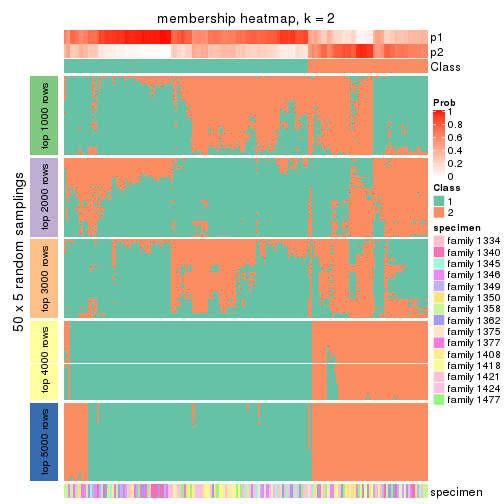</p>

</div>
<div id='tab-CV-NMF-membership-heatmap-2'>
<pre><code class="r">membership_heatmap(res, k = 3)
</code></pre>

<p></p>

</div>
<div id='tab-CV-NMF-membership-heatmap-3'>
<pre><code class="r">membership_heatmap(res, k = 4)
</code></pre>

<p>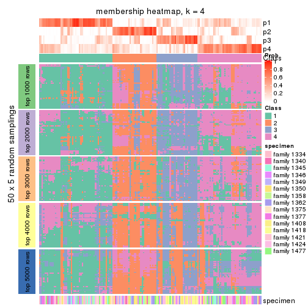</p>

</div>
<div id='tab-CV-NMF-membership-heatmap-4'>
<pre><code class="r">membership_heatmap(res, k = 5)
</code></pre>

<p></p>

</div>
<div id='tab-CV-NMF-membership-heatmap-5'>
<pre><code class="r">membership_heatmap(res, k = 6)
</code></pre>

<p></p>

</div>
</div>

As soon as we have had the classes for columns, we can look for signatures
which are significantly different between classes which can be candidate marks
for certain classes. Following are the heatmaps for signatures.


Signature heatmaps where rows are scaled:


<script>
$( function() {
	$( '#tabs-CV-NMF-get-signatures' ).tabs();
} );
</script>
<div id='tabs-CV-NMF-get-signatures'>
<ul>
<li><a href='#tab-CV-NMF-get-signatures-1'>k = 2</a></li>
<li><a href='#tab-CV-NMF-get-signatures-2'>k = 3</a></li>
<li><a href='#tab-CV-NMF-get-signatures-3'>k = 4</a></li>
<li><a href='#tab-CV-NMF-get-signatures-4'>k = 5</a></li>
<li><a href='#tab-CV-NMF-get-signatures-5'>k = 6</a></li>
</ul>
<div id='tab-CV-NMF-get-signatures-1'>
<pre><code class="r">get_signatures(res, k = 2)
</code></pre>

<p></p>

</div>
<div id='tab-CV-NMF-get-signatures-2'>
<pre><code class="r">get_signatures(res, k = 3)
</code></pre>

<p>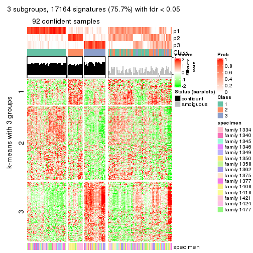</p>

</div>
<div id='tab-CV-NMF-get-signatures-3'>
<pre><code class="r">get_signatures(res, k = 4)
</code></pre>

<p></p>

</div>
<div id='tab-CV-NMF-get-signatures-4'>
<pre><code class="r">get_signatures(res, k = 5)
</code></pre>

<p></p>

</div>
<div id='tab-CV-NMF-get-signatures-5'>
<pre><code class="r">get_signatures(res, k = 6)
</code></pre>

<p></p>

</div>
</div>


Signature heatmaps where rows are not scaled:


<script>
$( function() {
	$( '#tabs-CV-NMF-get-signatures-no-scale' ).tabs();
} );
</script>
<div id='tabs-CV-NMF-get-signatures-no-scale'>
<ul>
<li><a href='#tab-CV-NMF-get-signatures-no-scale-1'>k = 2</a></li>
<li><a href='#tab-CV-NMF-get-signatures-no-scale-2'>k = 3</a></li>
<li><a href='#tab-CV-NMF-get-signatures-no-scale-3'>k = 4</a></li>
<li><a href='#tab-CV-NMF-get-signatures-no-scale-4'>k = 5</a></li>
<li><a href='#tab-CV-NMF-get-signatures-no-scale-5'>k = 6</a></li>
</ul>
<div id='tab-CV-NMF-get-signatures-no-scale-1'>
<pre><code class="r">get_signatures(res, k = 2, scale_rows = FALSE)
</code></pre>

<p></p>

</div>
<div id='tab-CV-NMF-get-signatures-no-scale-2'>
<pre><code class="r">get_signatures(res, k = 3, scale_rows = FALSE)
</code></pre>

<p></p>

</div>
<div id='tab-CV-NMF-get-signatures-no-scale-3'>
<pre><code class="r">get_signatures(res, k = 4, scale_rows = FALSE)
</code></pre>

<p></p>

</div>
<div id='tab-CV-NMF-get-signatures-no-scale-4'>
<pre><code class="r">get_signatures(res, k = 5, scale_rows = FALSE)
</code></pre>

<p></p>

</div>
<div id='tab-CV-NMF-get-signatures-no-scale-5'>
<pre><code class="r">get_signatures(res, k = 6, scale_rows = FALSE)
</code></pre>

<p></p>

</div>
</div>


Compare the overlap of signatures from different k:

```r
compare_signatures(res)
```


`get_signature()` returns a data frame invisibly. TO get the list of signatures, the function
call should be assigned to a variable explicitly. In following code, if `plot` argument is set
to `FALSE`, no heatmap is plotted while only the differential analysis is performed.

```r
# code only for demonstration
tb = get_signature(res, k = ..., plot = FALSE)
```

An example of the output of `tb` is:

```
#>   which_row         fdr    mean_1    mean_2 scaled_mean_1 scaled_mean_2 km
#> 1        38 0.042760348  8.373488  9.131774    -0.5533452     0.5164555  1
#> 2        40 0.018707592  7.106213  8.469186    -0.6173731     0.5762149  1
#> 3        55 0.019134737 10.221463 11.207825    -0.6159697     0.5749050  1
#> 4        59 0.006059896  5.921854  7.869574    -0.6899429     0.6439467  1
#> 5        60 0.018055526  8.928898 10.211722    -0.6204761     0.5791110  1
#> 6        98 0.009384629 15.714769 14.887706     0.6635654    -0.6193277  2
...
```

The columns in `tb` are:

1. `which_row`: row indices corresponding to the input matrix.
2. `fdr`: FDR for the differential test. 
3. `mean_x`: The mean value in group x.
4. `scaled_mean_x`: The mean value in group x after rows are scaled.
5. `km`: Row groups if k-means clustering is applied to rows.


UMAP plot which shows how samples are separated.


<script>
$( function() {
	$( '#tabs-CV-NMF-dimension-reduction' ).tabs();
} );
</script>
<div id='tabs-CV-NMF-dimension-reduction'>
<ul>
<li><a href='#tab-CV-NMF-dimension-reduction-1'>k = 2</a></li>
<li><a href='#tab-CV-NMF-dimension-reduction-2'>k = 3</a></li>
<li><a href='#tab-CV-NMF-dimension-reduction-3'>k = 4</a></li>
<li><a href='#tab-CV-NMF-dimension-reduction-4'>k = 5</a></li>
<li><a href='#tab-CV-NMF-dimension-reduction-5'>k = 6</a></li>
</ul>
<div id='tab-CV-NMF-dimension-reduction-1'>
<pre><code class="r">dimension_reduction(res, k = 2, method = &quot;UMAP&quot;)
</code></pre>

<p></p>

</div>
<div id='tab-CV-NMF-dimension-reduction-2'>
<pre><code class="r">dimension_reduction(res, k = 3, method = &quot;UMAP&quot;)
</code></pre>

<p></p>

</div>
<div id='tab-CV-NMF-dimension-reduction-3'>
<pre><code class="r">dimension_reduction(res, k = 4, method = &quot;UMAP&quot;)
</code></pre>

<p></p>

</div>
<div id='tab-CV-NMF-dimension-reduction-4'>
<pre><code class="r">dimension_reduction(res, k = 5, method = &quot;UMAP&quot;)
</code></pre>

<p></p>

</div>
<div id='tab-CV-NMF-dimension-reduction-5'>
<pre><code class="r">dimension_reduction(res, k = 6, method = &quot;UMAP&quot;)
</code></pre>

<p></p>

</div>
</div>


Following heatmap shows how subgroups are split when increasing `k`:

```r
collect_classes(res)
```


Test correlation between subgroups and known annotations. If the known
annotation is numeric, one-way ANOVA test is applied, and if the known
annotation is discrete, chi-squared contingency table test is applied.

```r
test_to_known_factors(res)
```

```
#>          n specimen(p) k
#> CV:NMF 132    6.30e-02 2
#> CV:NMF  92    4.37e-08 3
#> CV:NMF  65    1.84e-04 4
#> CV:NMF  56    5.69e-02 5
#> CV:NMF  49    2.13e-02 6
```


If matrix rows can be associated to genes, consider to use `GO_Enrichment(res,
...)` to perform function enrichment for the signature genes.


 

---------------------------------------------------


### MAD:hclust


The object with results only for a single top-value method and a single partition method 
can be extracted as:

```r
res = res_list["MAD", "hclust"]
# you can also extract it by
# res = res_list["MAD:hclust"]
```

A summary of `res` and all the functions that can be applied to it:

```r
res
```

```
#> A 'ConsensusPartition' object with k = 2, 3, 4, 5, 6.
#>   On a matrix with 22686 rows and 167 columns.
#>   Top rows (1000, 2000, 3000, 4000, 5000) are extracted by 'MAD' method.
#>   Subgroups are detected by 'hclust' method.
#>   Performed in total 1250 partitions by row resampling.
#>   Best k for subgroups seems to be 2.
#> 
#> Following methods can be applied to this 'ConsensusPartition' object:
#>  [1] "cola_report"             "collect_classes"         "collect_plots"          
#>  [4] "collect_stats"           "colnames"                "compare_signatures"     
#>  [7] "consensus_heatmap"       "dimension_reduction"     "functional_enrichment"  
#> [10] "get_anno_col"            "get_anno"                "get_classes"            
#> [13] "get_consensus"           "get_matrix"              "get_membership"         
#> [16] "get_param"               "get_signatures"          "get_stats"              
#> [19] "is_best_k"               "is_stable_k"             "membership_heatmap"     
#> [22] "ncol"                    "nrow"                    "plot_ecdf"              
#> [25] "rownames"                "select_partition_number" "show"                   
#> [28] "suggest_best_k"          "test_to_known_factors"
```

`collect_plots()` function collects all the plots made from `res` for all `k` (number of partitions)
into one single page to provide an easy and fast comparison between different `k`.

```r
collect_plots(res)
```


The plots are:

- The first row: a plot of the ECDF (Empirical cumulative distribution
  function) curves of the consensus matrix for each `k` and the heatmap of
  predicted classes for each `k`.
- The second row: heatmaps of the consensus matrix for each `k`.
- The third row: heatmaps of the membership matrix for each `k`.
- The fouth row: heatmaps of the signatures for each `k`.

All the plots in panels can be made by individual functions and they are
plotted later in this section.

`select_partition_number()` produces several plots showing different
statistics for choosing "optimized" `k`. There are following statistics:

- ECDF curves of the consensus matrix for each `k`;
- 1-PAC. [The PAC
  score](https://en.wikipedia.org/wiki/Consensus_clustering#Over-interpretation_potential_of_consensus_clustering)
  measures the proportion of the ambiguous subgrouping.
- Mean silhouette score.
- Concordance. The mean probability of fiting the consensus class ids in all
  partitions.
- Area increased. Denote $A_k$ as the area under the ECDF curve for current
  `k`, the area increased is defined as $A_k - A_{k-1}$.
- Rand index. The percent of pairs of samples that are both in a same cluster
  or both are not in a same cluster in the partition of k and k-1.
- Jaccard index. The ratio of pairs of samples are both in a same cluster in
  the partition of k and k-1 and the pairs of samples are both in a same
  cluster in the partition k or k-1.

The detailed explanations of these statistics can be found in [the cola
vignette](http://bioconductor.org/packages/devel/bioc/vignettes/cola/inst/doc/cola.html#toc_13).

Generally speaking, lower PAC score, higher mean silhouette score or higher
concordance corresponds to better partition. Rand index and Jaccard index
measure how similar the current partition is compared to partition with `k-1`.
If they are too similar, we won't accept `k` is better than `k-1`.

```r
select_partition_number(res)
```


The numeric values for all these statistics can be obtained by `get_stats()`.

```r
get_stats(res)
```

```
#>   k 1-PAC mean_silhouette concordance area_increased  Rand Jaccard
#> 2 2 0.142           0.294       0.701         0.4540 0.615   0.615
#> 3 3 0.177           0.512       0.664         0.3312 0.583   0.419
#> 4 4 0.260           0.329       0.557         0.1570 0.897   0.755
#> 5 5 0.337           0.300       0.553         0.0784 0.805   0.501
#> 6 6 0.428           0.390       0.568         0.0513 0.931   0.736
```

`suggest_best_k()` suggests the best $k$ based on these statistics. The rules are as follows:

- All $k$ with Jaccard index larger than 0.95 are removed because the increase of
  the partition number does not provides enough extra information. If all $k$ are removed,
  the best $k$ is assigned by `NA`.
- For $k$ with 1-PAC larger than 0.9, the maximal $k$ is taken as the "best k". Other $k$ is called "optional k".
- If it does not fit the second rule. The $k$ with the highest vote of highest
  1-PAC, mean silhouette and concordance is taken as the "best k".

```r
suggest_best_k(res)
```

```
#> [1] 2
```


Following shows the table of the partitions (You need to click the **show/hide
code output** link to see it). The membership matrix (columns with name `p*`)
is inferred by
[`clue::cl_consensus()`](https://www.rdocumentation.org/link/cl_consensus?package=clue)
function with the `SE` method. Basically the value in the membership matrix
represents the probability to belong to a certain group. The finall class
label for an item is determined with the group with highest probability it
belongs to.

In `get_classes()` function, the entropy is calculated from the membership
matrix and the silhouette score is calculated from the consensus matrix.


<script>
$( function() {
	$( '#tabs-MAD-hclust-get-classes' ).tabs();
} );
</script>
<div id='tabs-MAD-hclust-get-classes'>
<ul>
<li><a href='#tab-MAD-hclust-get-classes-1'>k = 2</a></li>
<li><a href='#tab-MAD-hclust-get-classes-2'>k = 3</a></li>
<li><a href='#tab-MAD-hclust-get-classes-3'>k = 4</a></li>
<li><a href='#tab-MAD-hclust-get-classes-4'>k = 5</a></li>
<li><a href='#tab-MAD-hclust-get-classes-5'>k = 6</a></li>
</ul>

<div id='tab-MAD-hclust-get-classes-1'>
<p><a id='tab-MAD-hclust-get-classes-1-a' style='color:#0366d6' href='#'>show/hide code output</a></p>
<pre><code class="r">cbind(get_classes(res, k = 2), get_membership(res, k = 2))
</code></pre>

<pre><code>#&gt;          class entropy silhouette    p1    p2
#&gt; GSM30006     2  0.9922    0.29131 0.448 0.552
#&gt; GSM30007     1  0.9866    0.34512 0.568 0.432
#&gt; GSM30008     1  0.9323    0.40497 0.652 0.348
#&gt; GSM30009     1  0.9491    0.40340 0.632 0.368
#&gt; GSM30010     2  0.3431    0.53078 0.064 0.936
#&gt; GSM30011     1  1.0000   -0.19721 0.504 0.496
#&gt; GSM30012     1  0.9977   -0.19456 0.528 0.472
#&gt; GSM30013     1  0.4690    0.40024 0.900 0.100
#&gt; GSM30014     2  0.2423    0.52926 0.040 0.960
#&gt; GSM30015     1  0.9248    0.41979 0.660 0.340
#&gt; GSM30016     2  0.9922    0.29131 0.448 0.552
#&gt; GSM30017     1  0.9393    0.41378 0.644 0.356
#&gt; GSM30018     1  0.4161    0.41826 0.916 0.084
#&gt; GSM30019     1  0.9983   -0.20467 0.524 0.476
#&gt; GSM30020     1  0.9358    0.40368 0.648 0.352
#&gt; GSM30021     2  0.8081    0.34600 0.248 0.752
#&gt; GSM30022     1  0.9522    0.40039 0.628 0.372
#&gt; GSM30023     1  0.9209    0.40980 0.664 0.336
#&gt; GSM30024     2  0.2236    0.52799 0.036 0.964
#&gt; GSM30025     1  0.9661    0.37123 0.608 0.392
#&gt; GSM30026     1  0.9044    0.42616 0.680 0.320
#&gt; GSM30027     1  0.9393    0.38874 0.644 0.356
#&gt; GSM30028     1  0.9635    0.38885 0.612 0.388
#&gt; GSM30029     1  0.8813    0.43015 0.700 0.300
#&gt; GSM30030     1  0.9358    0.41431 0.648 0.352
#&gt; GSM30031     1  0.9427    0.41129 0.640 0.360
#&gt; GSM30032     2  0.9732    0.03860 0.404 0.596
#&gt; GSM30033     2  0.9732    0.07943 0.404 0.596
#&gt; GSM30034     1  0.1414    0.45204 0.980 0.020
#&gt; GSM30035     2  0.9129    0.25752 0.328 0.672
#&gt; GSM30036     1  0.6973    0.30391 0.812 0.188
#&gt; GSM30037     1  0.9608    0.39389 0.616 0.384
#&gt; GSM30038     2  0.9977    0.15252 0.472 0.528
#&gt; GSM30039     1  0.9922   -0.15553 0.552 0.448
#&gt; GSM30040     2  0.8267    0.45242 0.260 0.740
#&gt; GSM30041     1  0.9922   -0.16470 0.552 0.448
#&gt; GSM30042     1  0.9996   -0.22969 0.512 0.488
#&gt; GSM30043     2  0.2603    0.53035 0.044 0.956
#&gt; GSM30044     1  0.9635    0.38765 0.612 0.388
#&gt; GSM30045     1  0.9608    0.38987 0.616 0.384
#&gt; GSM30046     1  0.4939    0.40076 0.892 0.108
#&gt; GSM30047     1  0.5946    0.38666 0.856 0.144
#&gt; GSM30048     1  0.5059    0.40273 0.888 0.112
#&gt; GSM30049     2  0.9460    0.39270 0.364 0.636
#&gt; GSM30050     1  0.7056    0.29693 0.808 0.192
#&gt; GSM30051     2  0.9635    0.36803 0.388 0.612
#&gt; GSM30052     1  0.9522    0.40039 0.628 0.372
#&gt; GSM30053     1  0.9988   -0.22136 0.520 0.480
#&gt; GSM30054     2  0.9635    0.36603 0.388 0.612
#&gt; GSM30055     1  0.8813    0.13283 0.700 0.300
#&gt; GSM30056     1  0.9963   -0.17773 0.536 0.464
#&gt; GSM30057     2  0.3431    0.53078 0.064 0.936
#&gt; GSM30058     1  0.9963   -0.17773 0.536 0.464
#&gt; GSM30059     1  0.0672    0.45504 0.992 0.008
#&gt; GSM30060     2  0.6531    0.44900 0.168 0.832
#&gt; GSM30061     1  0.8081    0.23247 0.752 0.248
#&gt; GSM30062     1  0.4815    0.40388 0.896 0.104
#&gt; GSM30063     1  0.9983   -0.21508 0.524 0.476
#&gt; GSM30064     1  0.8861    0.41568 0.696 0.304
#&gt; GSM30065     1  0.9944   -0.18069 0.544 0.456
#&gt; GSM30066     2  0.2236    0.52799 0.036 0.964
#&gt; GSM30067     1  0.9393    0.41281 0.644 0.356
#&gt; GSM30068     2  0.2236    0.52799 0.036 0.964
#&gt; GSM30069     2  0.2236    0.52799 0.036 0.964
#&gt; GSM30070     1  0.9954   -0.09093 0.540 0.460
#&gt; GSM30071     1  0.9850    0.02126 0.572 0.428
#&gt; GSM30072     1  0.9732    0.37630 0.596 0.404
#&gt; GSM30073     1  0.8861    0.13064 0.696 0.304
#&gt; GSM30074     2  0.9635    0.15767 0.388 0.612
#&gt; GSM30075     1  0.9286    0.05006 0.656 0.344
#&gt; GSM30076     1  0.3431    0.42681 0.936 0.064
#&gt; GSM30077     1  0.1633    0.44744 0.976 0.024
#&gt; GSM30078     1  0.0376    0.45396 0.996 0.004
#&gt; GSM30079     1  0.9522    0.40039 0.628 0.372
#&gt; GSM30080     1  0.9286    0.05006 0.656 0.344
#&gt; GSM30081     2  0.9635    0.36603 0.388 0.612
#&gt; GSM30086     1  0.9286    0.05006 0.656 0.344
#&gt; GSM30087     1  0.0938    0.45222 0.988 0.012
#&gt; GSM30088     1  0.0672    0.45504 0.992 0.008
#&gt; GSM30089     1  0.9815    0.35088 0.580 0.420
#&gt; GSM30090     1  0.9963   -0.17773 0.536 0.464
#&gt; GSM30091     2  0.9635    0.36603 0.388 0.612
#&gt; GSM30092     1  0.1633    0.44744 0.976 0.024
#&gt; GSM30093     1  0.9323   -0.00455 0.652 0.348
#&gt; GSM30094     2  0.9552    0.37870 0.376 0.624
#&gt; GSM30095     2  0.2948    0.53135 0.052 0.948
#&gt; GSM30096     1  0.9393    0.41399 0.644 0.356
#&gt; GSM30097     1  0.0672    0.45504 0.992 0.008
#&gt; GSM30098     1  0.9491    0.40379 0.632 0.368
#&gt; GSM30099     1  0.9580    0.00786 0.620 0.380
#&gt; GSM30100     2  0.2236    0.52799 0.036 0.964
#&gt; GSM30101     2  0.9608    0.37360 0.384 0.616
#&gt; GSM30102     1  0.9850   -0.09094 0.572 0.428
#&gt; GSM30103     2  0.9323    0.18223 0.348 0.652
#&gt; GSM30104     1  0.5629    0.36991 0.868 0.132
#&gt; GSM30105     1  0.9170    0.41382 0.668 0.332
#&gt; GSM30106     1  0.6623    0.38762 0.828 0.172
#&gt; GSM30107     1  0.7674    0.25395 0.776 0.224
#&gt; GSM30108     1  0.9881    0.34017 0.564 0.436
#&gt; GSM30109     1  0.9427    0.41049 0.640 0.360
#&gt; GSM30110     1  0.6148    0.44511 0.848 0.152
#&gt; GSM30111     1  0.9866    0.01865 0.568 0.432
#&gt; GSM30112     1  0.9635    0.38984 0.612 0.388
#&gt; GSM30113     2  0.3274    0.53159 0.060 0.940
#&gt; GSM30114     1  0.9909   -0.14943 0.556 0.444
#&gt; GSM30115     1  0.8327    0.29233 0.736 0.264
#&gt; GSM30116     2  0.8608    0.31429 0.284 0.716
#&gt; GSM30117     2  0.9129    0.25580 0.328 0.672
#&gt; GSM30118     1  0.9954    0.28850 0.540 0.460
#&gt; GSM30119     2  1.0000    0.13462 0.496 0.504
#&gt; GSM30120     2  1.0000    0.13462 0.496 0.504
#&gt; GSM30121     1  0.9393    0.41281 0.644 0.356
#&gt; GSM30122     1  0.9608    0.39059 0.616 0.384
#&gt; GSM30123     1  0.9427    0.00111 0.640 0.360
#&gt; GSM30177     1  0.9491   -0.03954 0.632 0.368
#&gt; GSM30178     1  0.6973    0.30391 0.812 0.188
#&gt; GSM30179     1  0.8555    0.42939 0.720 0.280
#&gt; GSM30180     1  0.9393    0.41210 0.644 0.356
#&gt; GSM30181     1  0.9323    0.05306 0.652 0.348
#&gt; GSM30182     1  0.0672    0.45280 0.992 0.008
#&gt; GSM30183     1  0.9209    0.42107 0.664 0.336
#&gt; GSM30184     2  0.9661    0.36999 0.392 0.608
#&gt; GSM30185     2  0.9087    0.24788 0.324 0.676
#&gt; GSM30186     2  0.9710    0.22760 0.400 0.600
#&gt; GSM30187     1  0.0938    0.45200 0.988 0.012
#&gt; GSM30188     1  0.0672    0.45280 0.992 0.008
#&gt; GSM30189     1  0.8267    0.43438 0.740 0.260
#&gt; GSM30190     2  0.9909    0.31240 0.444 0.556
#&gt; GSM30191     1  0.3733    0.41885 0.928 0.072
#&gt; GSM30192     1  0.9286    0.05006 0.656 0.344
#&gt; GSM30193     1  0.8267    0.19870 0.740 0.260
#&gt; GSM30194     2  0.9044    0.40895 0.320 0.680
#&gt; GSM30195     2  0.9996    0.13597 0.488 0.512
#&gt; GSM30196     1  0.9608    0.38987 0.616 0.384
#&gt; GSM30197     1  0.4815    0.40997 0.896 0.104
#&gt; GSM30198     1  0.6247    0.41785 0.844 0.156
#&gt; GSM30199     2  0.9087    0.24830 0.324 0.676
#&gt; GSM30200     1  0.4815    0.40997 0.896 0.104
#&gt; GSM30201     1  0.2236    0.45460 0.964 0.036
#&gt; GSM30202     1  0.9358    0.41461 0.648 0.352
#&gt; GSM30203     1  0.0376    0.45396 0.996 0.004
#&gt; GSM30204     1  0.8955    0.29712 0.688 0.312
#&gt; GSM30205     2  0.9323    0.21665 0.348 0.652
#&gt; GSM30206     1  0.2236    0.45511 0.964 0.036
#&gt; GSM30207     1  0.8955    0.29712 0.688 0.312
#&gt; GSM30208     1  0.6343    0.44508 0.840 0.160
#&gt; GSM30209     1  0.9795   -0.05829 0.584 0.416
#&gt; GSM30210     1  0.9491    0.40382 0.632 0.368
#&gt; GSM30211     1  0.4431    0.41617 0.908 0.092
#&gt; GSM30212     1  0.9522    0.40039 0.628 0.372
#&gt; GSM30213     1  0.9522    0.40039 0.628 0.372
#&gt; GSM30214     1  0.9393    0.41251 0.644 0.356
#&gt; GSM30215     1  0.9323    0.41655 0.652 0.348
#&gt; GSM30216     1  0.9522    0.40039 0.628 0.372
#&gt; GSM30217     1  0.9491    0.40382 0.632 0.368
#&gt; GSM30218     1  0.8713    0.14606 0.708 0.292
#&gt; GSM30219     2  0.8813    0.30399 0.300 0.700
#&gt; GSM30220     1  0.9522    0.40039 0.628 0.372
#&gt; GSM30221     1  0.1184    0.45333 0.984 0.016
#&gt; GSM30222     1  0.9323    0.04892 0.652 0.348
#&gt; GSM30223     1  0.9522    0.40039 0.628 0.372
#&gt; GSM30224     1  0.0672    0.45504 0.992 0.008
#&gt; GSM30225     1  0.9393    0.41210 0.644 0.356
#&gt; GSM30226     2  0.8763    0.30316 0.296 0.704
#&gt; GSM30227     1  0.9358    0.41461 0.648 0.352
#&gt; GSM30228     1  0.9427   -0.01626 0.640 0.360
#&gt; GSM30229     1  0.8813    0.11484 0.700 0.300
</code></pre>

<script>
$('#tab-MAD-hclust-get-classes-1-a').parent().next().next().hide();
$('#tab-MAD-hclust-get-classes-1-a').click(function(){
  $('#tab-MAD-hclust-get-classes-1-a').parent().next().next().toggle();
  return(false);
});
</script>
</div>

<div id='tab-MAD-hclust-get-classes-2'>
<p><a id='tab-MAD-hclust-get-classes-2-a' style='color:#0366d6' href='#'>show/hide code output</a></p>
<pre><code class="r">cbind(get_classes(res, k = 3), get_membership(res, k = 3))
</code></pre>

<pre><code>#&gt;          class entropy silhouette    p1    p2    p3
#&gt; GSM30006     2   0.760    0.36477 0.056 0.600 0.344
#&gt; GSM30007     1   0.657    0.66750 0.748 0.080 0.172
#&gt; GSM30008     1   0.653    0.73498 0.760 0.120 0.120
#&gt; GSM30009     1   0.240    0.77101 0.932 0.004 0.064
#&gt; GSM30010     3   0.543    0.71204 0.144 0.048 0.808
#&gt; GSM30011     2   0.862    0.43585 0.132 0.572 0.296
#&gt; GSM30012     2   0.475    0.49687 0.008 0.808 0.184
#&gt; GSM30013     2   0.715    0.55727 0.348 0.616 0.036
#&gt; GSM30014     3   0.517    0.71640 0.172 0.024 0.804
#&gt; GSM30015     1   0.559    0.71641 0.808 0.124 0.068
#&gt; GSM30016     2   0.760    0.36477 0.056 0.600 0.344
#&gt; GSM30017     1   0.304    0.77397 0.920 0.040 0.040
#&gt; GSM30018     2   0.725    0.53785 0.368 0.596 0.036
#&gt; GSM30019     2   0.412    0.49271 0.000 0.832 0.168
#&gt; GSM30020     1   0.646    0.73810 0.764 0.116 0.120
#&gt; GSM30021     3   0.885    0.37262 0.372 0.124 0.504
#&gt; GSM30022     1   0.290    0.76801 0.920 0.016 0.064
#&gt; GSM30023     1   0.518    0.74443 0.832 0.088 0.080
#&gt; GSM30024     3   0.517    0.70704 0.192 0.016 0.792
#&gt; GSM30025     1   0.482    0.75352 0.844 0.048 0.108
#&gt; GSM30026     1   0.471    0.74918 0.852 0.092 0.056
#&gt; GSM30027     1   0.524    0.74305 0.828 0.072 0.100
#&gt; GSM30028     1   0.397    0.76466 0.884 0.044 0.072
#&gt; GSM30029     1   0.406    0.75886 0.880 0.076 0.044
#&gt; GSM30030     1   0.333    0.77846 0.904 0.020 0.076
#&gt; GSM30031     1   0.315    0.77468 0.916 0.040 0.044
#&gt; GSM30032     1   0.734    0.39363 0.652 0.060 0.288
#&gt; GSM30033     1   0.790    0.33905 0.616 0.084 0.300
#&gt; GSM30034     2   0.730    0.45968 0.412 0.556 0.032
#&gt; GSM30035     1   0.806   -0.14540 0.488 0.064 0.448
#&gt; GSM30036     2   0.843    0.59484 0.292 0.588 0.120
#&gt; GSM30037     1   0.327    0.76584 0.904 0.016 0.080
#&gt; GSM30038     2   0.812    0.31583 0.168 0.648 0.184
#&gt; GSM30039     2   0.392    0.51154 0.004 0.856 0.140
#&gt; GSM30040     3   0.800    0.21044 0.072 0.360 0.568
#&gt; GSM30041     2   0.762    0.45117 0.072 0.636 0.292
#&gt; GSM30042     2   0.502    0.47426 0.004 0.776 0.220
#&gt; GSM30043     3   0.517    0.71843 0.172 0.024 0.804
#&gt; GSM30044     1   0.524    0.73823 0.828 0.072 0.100
#&gt; GSM30045     1   0.500    0.74135 0.840 0.072 0.088
#&gt; GSM30046     2   0.685    0.55946 0.300 0.664 0.036
#&gt; GSM30047     2   0.885    0.41630 0.396 0.484 0.120
#&gt; GSM30048     2   0.654    0.54900 0.304 0.672 0.024
#&gt; GSM30049     3   0.706   -0.10775 0.020 0.460 0.520
#&gt; GSM30050     2   0.757    0.61131 0.256 0.660 0.084
#&gt; GSM30051     2   0.630    0.16823 0.000 0.520 0.480
#&gt; GSM30052     1   0.207    0.76747 0.940 0.000 0.060
#&gt; GSM30053     2   0.537    0.48429 0.016 0.776 0.208
#&gt; GSM30054     2   0.630    0.15678 0.000 0.516 0.484
#&gt; GSM30055     2   0.974    0.32826 0.304 0.444 0.252
#&gt; GSM30056     2   0.764    0.42388 0.068 0.624 0.308
#&gt; GSM30057     3   0.543    0.71204 0.144 0.048 0.808
#&gt; GSM30058     2   0.764    0.42388 0.068 0.624 0.308
#&gt; GSM30059     2   0.710    0.45214 0.420 0.556 0.024
#&gt; GSM30060     3   0.699    0.55249 0.320 0.036 0.644
#&gt; GSM30061     2   0.954    0.36066 0.348 0.452 0.200
#&gt; GSM30062     2   0.628    0.55263 0.304 0.680 0.016
#&gt; GSM30063     2   0.546    0.48850 0.020 0.776 0.204
#&gt; GSM30064     1   0.662    0.70975 0.744 0.080 0.176
#&gt; GSM30065     2   0.700    0.48767 0.060 0.692 0.248
#&gt; GSM30066     3   0.484    0.71575 0.168 0.016 0.816
#&gt; GSM30067     1   0.466    0.76136 0.856 0.068 0.076
#&gt; GSM30068     3   0.492    0.71521 0.164 0.020 0.816
#&gt; GSM30069     3   0.484    0.71600 0.168 0.016 0.816
#&gt; GSM30070     2   0.678    0.40392 0.088 0.736 0.176
#&gt; GSM30071     2   0.756    0.44880 0.188 0.688 0.124
#&gt; GSM30072     1   0.541    0.72564 0.820 0.076 0.104
#&gt; GSM30073     2   0.662    0.59411 0.148 0.752 0.100
#&gt; GSM30074     2   0.951   -0.04517 0.268 0.492 0.240
#&gt; GSM30075     2   0.288    0.55072 0.024 0.924 0.052
#&gt; GSM30076     2   0.699    0.53906 0.360 0.612 0.028
#&gt; GSM30077     2   0.691    0.48956 0.396 0.584 0.020
#&gt; GSM30078     2   0.696    0.47015 0.412 0.568 0.020
#&gt; GSM30079     1   0.275    0.76659 0.924 0.012 0.064
#&gt; GSM30080     2   0.288    0.55072 0.024 0.924 0.052
#&gt; GSM30081     2   0.630    0.16699 0.000 0.520 0.480
#&gt; GSM30086     2   0.288    0.55072 0.024 0.924 0.052
#&gt; GSM30087     2   0.695    0.47088 0.408 0.572 0.020
#&gt; GSM30088     2   0.710    0.45568 0.420 0.556 0.024
#&gt; GSM30089     1   0.616    0.70530 0.780 0.092 0.128
#&gt; GSM30090     2   0.764    0.42388 0.068 0.624 0.308
#&gt; GSM30091     2   0.630    0.16001 0.000 0.516 0.484
#&gt; GSM30092     2   0.690    0.49268 0.392 0.588 0.020
#&gt; GSM30093     2   0.851    0.51294 0.160 0.608 0.232
#&gt; GSM30094     3   0.652   -0.15670 0.004 0.488 0.508
#&gt; GSM30095     3   0.580    0.71729 0.176 0.044 0.780
#&gt; GSM30096     1   0.383    0.76414 0.888 0.036 0.076
#&gt; GSM30097     2   0.710    0.45214 0.420 0.556 0.024
#&gt; GSM30098     1   0.103    0.77150 0.976 0.000 0.024
#&gt; GSM30099     2   0.991    0.17330 0.280 0.392 0.328
#&gt; GSM30100     3   0.517    0.70704 0.192 0.016 0.792
#&gt; GSM30101     2   0.652    0.13223 0.004 0.500 0.496
#&gt; GSM30102     2   0.979    0.25328 0.244 0.416 0.340
#&gt; GSM30103     1   0.777    0.16490 0.592 0.064 0.344
#&gt; GSM30104     2   0.814    0.57477 0.316 0.592 0.092
#&gt; GSM30105     1   0.531    0.75562 0.816 0.048 0.136
#&gt; GSM30106     2   0.719    0.52282 0.336 0.624 0.040
#&gt; GSM30107     2   0.664    0.55788 0.140 0.752 0.108
#&gt; GSM30108     1   0.662    0.66220 0.744 0.080 0.176
#&gt; GSM30109     1   0.256    0.77780 0.936 0.036 0.028
#&gt; GSM30110     1   0.823    0.08075 0.564 0.348 0.088
#&gt; GSM30111     2   0.765    0.43802 0.220 0.672 0.108
#&gt; GSM30112     1   0.620    0.71646 0.760 0.056 0.184
#&gt; GSM30113     3   0.617    0.70833 0.168 0.064 0.768
#&gt; GSM30114     2   0.416    0.51388 0.008 0.848 0.144
#&gt; GSM30115     2   0.826    0.57989 0.284 0.604 0.112
#&gt; GSM30116     3   0.782    0.26436 0.444 0.052 0.504
#&gt; GSM30117     1   0.792   -0.17030 0.480 0.056 0.464
#&gt; GSM30118     1   0.689    0.67340 0.736 0.112 0.152
#&gt; GSM30119     2   0.721    0.42731 0.128 0.716 0.156
#&gt; GSM30120     2   0.721    0.42731 0.128 0.716 0.156
#&gt; GSM30121     1   0.466    0.76136 0.856 0.068 0.076
#&gt; GSM30122     1   0.527    0.73150 0.816 0.044 0.140
#&gt; GSM30123     2   0.888    0.48706 0.176 0.568 0.256
#&gt; GSM30177     2   0.836    0.50206 0.140 0.616 0.244
#&gt; GSM30178     2   0.843    0.59484 0.292 0.588 0.120
#&gt; GSM30179     1   0.579    0.69550 0.796 0.136 0.068
#&gt; GSM30180     1   0.509    0.73876 0.836 0.092 0.072
#&gt; GSM30181     2   0.334    0.55069 0.032 0.908 0.060
#&gt; GSM30182     2   0.716    0.48287 0.400 0.572 0.028
#&gt; GSM30183     1   0.526    0.74987 0.828 0.084 0.088
#&gt; GSM30184     2   0.668    0.16518 0.008 0.516 0.476
#&gt; GSM30185     1   0.774   -0.12304 0.504 0.048 0.448
#&gt; GSM30186     3   0.888    0.16520 0.416 0.120 0.464
#&gt; GSM30187     2   0.691    0.49193 0.396 0.584 0.020
#&gt; GSM30188     2   0.716    0.48287 0.400 0.572 0.028
#&gt; GSM30189     1   0.615    0.64961 0.776 0.148 0.076
#&gt; GSM30190     2   0.678    0.30556 0.016 0.588 0.396
#&gt; GSM30191     2   0.769    0.52888 0.364 0.580 0.056
#&gt; GSM30192     2   0.298    0.54901 0.024 0.920 0.056
#&gt; GSM30193     2   0.486    0.59056 0.116 0.840 0.044
#&gt; GSM30194     3   0.603    0.19169 0.004 0.336 0.660
#&gt; GSM30195     2   0.792    0.34606 0.152 0.664 0.184
#&gt; GSM30196     1   0.500    0.74135 0.840 0.072 0.088
#&gt; GSM30197     2   0.660    0.54865 0.312 0.664 0.024
#&gt; GSM30198     2   0.770    0.41343 0.388 0.560 0.052
#&gt; GSM30199     1   0.771   -0.07629 0.528 0.048 0.424
#&gt; GSM30200     2   0.660    0.54865 0.312 0.664 0.024
#&gt; GSM30201     2   0.733    0.42358 0.424 0.544 0.032
#&gt; GSM30202     1   0.524    0.73664 0.828 0.100 0.072
#&gt; GSM30203     2   0.696    0.47015 0.412 0.568 0.020
#&gt; GSM30204     1   0.869    0.38236 0.588 0.248 0.164
#&gt; GSM30205     1   0.834   -0.14373 0.460 0.080 0.460
#&gt; GSM30206     1   0.692    0.00804 0.608 0.368 0.024
#&gt; GSM30207     1   0.869    0.38236 0.588 0.248 0.164
#&gt; GSM30208     1   0.564    0.51393 0.760 0.220 0.020
#&gt; GSM30209     2   0.956    0.31492 0.220 0.472 0.308
#&gt; GSM30210     1   0.176    0.77327 0.956 0.004 0.040
#&gt; GSM30211     2   0.642    0.53715 0.324 0.660 0.016
#&gt; GSM30212     1   0.196    0.76860 0.944 0.000 0.056
#&gt; GSM30213     1   0.196    0.76860 0.944 0.000 0.056
#&gt; GSM30214     1   0.312    0.77451 0.908 0.012 0.080
#&gt; GSM30215     1   0.230    0.77797 0.944 0.036 0.020
#&gt; GSM30216     1   0.244    0.77444 0.940 0.032 0.028
#&gt; GSM30217     1   0.176    0.77327 0.956 0.004 0.040
#&gt; GSM30218     2   0.968    0.36062 0.300 0.456 0.244
#&gt; GSM30219     3   0.791    0.23550 0.448 0.056 0.496
#&gt; GSM30220     1   0.207    0.76747 0.940 0.000 0.060
#&gt; GSM30221     2   0.709    0.45451 0.416 0.560 0.024
#&gt; GSM30222     2   0.290    0.55248 0.028 0.924 0.048
#&gt; GSM30223     1   0.376    0.76767 0.892 0.040 0.068
#&gt; GSM30224     2   0.710    0.45568 0.420 0.556 0.024
#&gt; GSM30225     1   0.541    0.72790 0.820 0.104 0.076
#&gt; GSM30226     3   0.783    0.23351 0.452 0.052 0.496
#&gt; GSM30227     1   0.466    0.75574 0.856 0.076 0.068
#&gt; GSM30228     2   0.836    0.51488 0.148 0.620 0.232
#&gt; GSM30229     2   0.962    0.37656 0.276 0.472 0.252
</code></pre>

<script>
$('#tab-MAD-hclust-get-classes-2-a').parent().next().next().hide();
$('#tab-MAD-hclust-get-classes-2-a').click(function(){
  $('#tab-MAD-hclust-get-classes-2-a').parent().next().next().toggle();
  return(false);
});
</script>
</div>

<div id='tab-MAD-hclust-get-classes-3'>
<p><a id='tab-MAD-hclust-get-classes-3-a' style='color:#0366d6' href='#'>show/hide code output</a></p>
<pre><code class="r">cbind(get_classes(res, k = 4), get_membership(res, k = 4))
</code></pre>

<pre><code>#&gt;          class entropy silhouette    p1    p2    p3    p4
#&gt; GSM30006     2   0.693   0.412202 0.016 0.620 0.244 0.120
#&gt; GSM30007     1   0.760   0.411269 0.552 0.024 0.144 0.280
#&gt; GSM30008     1   0.827   0.568988 0.488 0.052 0.144 0.316
#&gt; GSM30009     1   0.317   0.649951 0.884 0.000 0.056 0.060
#&gt; GSM30010     3   0.303   0.675902 0.056 0.032 0.900 0.012
#&gt; GSM30011     2   0.759   0.379897 0.036 0.588 0.228 0.148
#&gt; GSM30012     2   0.387   0.405802 0.000 0.844 0.096 0.060
#&gt; GSM30013     2   0.776  -0.503647 0.196 0.504 0.012 0.288
#&gt; GSM30014     3   0.278   0.682381 0.072 0.008 0.904 0.016
#&gt; GSM30015     1   0.796   0.412858 0.520 0.048 0.120 0.312
#&gt; GSM30016     2   0.693   0.412202 0.016 0.620 0.244 0.120
#&gt; GSM30017     1   0.626   0.641724 0.652 0.012 0.068 0.268
#&gt; GSM30018     2   0.793  -0.556432 0.196 0.484 0.016 0.304
#&gt; GSM30019     2   0.323   0.398022 0.000 0.880 0.072 0.048
#&gt; GSM30020     1   0.824   0.570229 0.488 0.048 0.148 0.316
#&gt; GSM30021     3   0.824   0.468437 0.252 0.088 0.544 0.116
#&gt; GSM30022     1   0.376   0.633528 0.848 0.000 0.048 0.104
#&gt; GSM30023     1   0.744   0.584705 0.544 0.036 0.088 0.332
#&gt; GSM30024     3   0.331   0.647472 0.172 0.000 0.828 0.000
#&gt; GSM30025     1   0.715   0.578744 0.580 0.012 0.132 0.276
#&gt; GSM30026     1   0.683   0.594756 0.652 0.040 0.080 0.228
#&gt; GSM30027     1   0.750   0.576048 0.560 0.032 0.112 0.296
#&gt; GSM30028     1   0.684   0.607415 0.604 0.016 0.092 0.288
#&gt; GSM30029     1   0.673   0.634539 0.628 0.032 0.064 0.276
#&gt; GSM30030     1   0.525   0.650859 0.752 0.000 0.100 0.148
#&gt; GSM30031     1   0.623   0.642095 0.656 0.012 0.068 0.264
#&gt; GSM30032     1   0.824   0.134914 0.444 0.020 0.292 0.244
#&gt; GSM30033     1   0.863   0.099811 0.408 0.036 0.292 0.264
#&gt; GSM30034     4   0.780   0.748125 0.208 0.376 0.004 0.412
#&gt; GSM30035     3   0.833   0.413749 0.300 0.032 0.460 0.208
#&gt; GSM30036     2   0.860  -0.213578 0.156 0.504 0.084 0.256
#&gt; GSM30037     1   0.373   0.635947 0.860 0.004 0.076 0.060
#&gt; GSM30038     2   0.801   0.271428 0.092 0.588 0.124 0.196
#&gt; GSM30039     2   0.293   0.388765 0.000 0.896 0.056 0.048
#&gt; GSM30040     3   0.716   0.069938 0.020 0.352 0.540 0.088
#&gt; GSM30041     2   0.713   0.399714 0.024 0.624 0.212 0.140
#&gt; GSM30042     2   0.523   0.415448 0.000 0.756 0.128 0.116
#&gt; GSM30043     3   0.310   0.681722 0.084 0.008 0.888 0.020
#&gt; GSM30044     1   0.646   0.547254 0.672 0.020 0.092 0.216
#&gt; GSM30045     1   0.598   0.554785 0.712 0.020 0.072 0.196
#&gt; GSM30046     2   0.692  -0.245048 0.100 0.524 0.004 0.372
#&gt; GSM30047     4   0.911   0.349644 0.184 0.328 0.092 0.396
#&gt; GSM30048     2   0.680  -0.260719 0.100 0.500 0.000 0.400
#&gt; GSM30049     2   0.640   0.210761 0.000 0.468 0.468 0.064
#&gt; GSM30050     2   0.678  -0.000927 0.144 0.664 0.024 0.168
#&gt; GSM30051     2   0.595   0.302378 0.000 0.544 0.416 0.040
#&gt; GSM30052     1   0.209   0.633955 0.932 0.000 0.048 0.020
#&gt; GSM30053     2   0.409   0.411680 0.000 0.828 0.116 0.056
#&gt; GSM30054     2   0.618   0.293325 0.000 0.524 0.424 0.052
#&gt; GSM30055     2   0.981   0.134851 0.184 0.324 0.204 0.288
#&gt; GSM30056     2   0.681   0.393894 0.020 0.636 0.240 0.104
#&gt; GSM30057     3   0.303   0.675902 0.056 0.032 0.900 0.012
#&gt; GSM30058     2   0.681   0.393894 0.020 0.636 0.240 0.104
#&gt; GSM30059     4   0.755   0.763636 0.192 0.376 0.000 0.432
#&gt; GSM30060     3   0.645   0.599730 0.180 0.012 0.676 0.132
#&gt; GSM30061     2   0.976   0.020311 0.224 0.320 0.160 0.296
#&gt; GSM30062     2   0.680  -0.308213 0.100 0.500 0.000 0.400
#&gt; GSM30063     2   0.422   0.410561 0.004 0.828 0.112 0.056
#&gt; GSM30064     1   0.691   0.544514 0.584 0.016 0.088 0.312
#&gt; GSM30065     2   0.583   0.404452 0.012 0.728 0.160 0.100
#&gt; GSM30066     3   0.253   0.682528 0.100 0.000 0.896 0.004
#&gt; GSM30067     1   0.673   0.629804 0.684 0.040 0.120 0.156
#&gt; GSM30068     3   0.267   0.680170 0.100 0.008 0.892 0.000
#&gt; GSM30069     3   0.277   0.681109 0.116 0.000 0.880 0.004
#&gt; GSM30070     2   0.674   0.302336 0.036 0.648 0.072 0.244
#&gt; GSM30071     2   0.785   0.204158 0.072 0.572 0.100 0.256
#&gt; GSM30072     1   0.638   0.520914 0.680 0.024 0.080 0.216
#&gt; GSM30073     2   0.573   0.223682 0.084 0.752 0.028 0.136
#&gt; GSM30074     2   0.928   0.045273 0.104 0.408 0.268 0.220
#&gt; GSM30075     2   0.321   0.322430 0.000 0.848 0.004 0.148
#&gt; GSM30076     2   0.773  -0.619913 0.180 0.464 0.008 0.348
#&gt; GSM30077     2   0.774  -0.732953 0.172 0.412 0.008 0.408
#&gt; GSM30078     2   0.755  -0.754999 0.188 0.408 0.000 0.404
#&gt; GSM30079     1   0.370   0.632082 0.852 0.000 0.048 0.100
#&gt; GSM30080     2   0.321   0.322430 0.000 0.848 0.004 0.148
#&gt; GSM30081     2   0.595   0.301199 0.000 0.544 0.416 0.040
#&gt; GSM30086     2   0.321   0.322430 0.000 0.848 0.004 0.148
#&gt; GSM30087     4   0.757   0.751391 0.192 0.400 0.000 0.408
#&gt; GSM30088     4   0.758   0.763668 0.196 0.380 0.000 0.424
#&gt; GSM30089     1   0.738   0.523366 0.616 0.044 0.120 0.220
#&gt; GSM30090     2   0.681   0.393894 0.020 0.636 0.240 0.104
#&gt; GSM30091     2   0.589   0.289680 0.000 0.540 0.424 0.036
#&gt; GSM30092     4   0.774   0.704156 0.172 0.408 0.008 0.412
#&gt; GSM30093     2   0.814   0.264035 0.052 0.544 0.180 0.224
#&gt; GSM30094     2   0.613   0.253497 0.000 0.508 0.444 0.048
#&gt; GSM30095     3   0.431   0.679472 0.088 0.028 0.840 0.044
#&gt; GSM30096     1   0.691   0.602547 0.644 0.020 0.144 0.192
#&gt; GSM30097     4   0.755   0.763636 0.192 0.376 0.000 0.432
#&gt; GSM30098     1   0.217   0.647554 0.928 0.000 0.020 0.052
#&gt; GSM30099     2   0.983   0.030360 0.180 0.324 0.276 0.220
#&gt; GSM30100     3   0.331   0.647472 0.172 0.000 0.828 0.000
#&gt; GSM30101     2   0.611   0.280430 0.000 0.524 0.428 0.048
#&gt; GSM30102     2   0.958   0.226096 0.140 0.380 0.240 0.240
#&gt; GSM30103     1   0.818  -0.149305 0.476 0.036 0.324 0.164
#&gt; GSM30104     2   0.864  -0.457608 0.148 0.416 0.068 0.368
#&gt; GSM30105     1   0.563   0.627735 0.768 0.040 0.104 0.088
#&gt; GSM30106     2   0.760  -0.432736 0.176 0.456 0.004 0.364
#&gt; GSM30107     2   0.571   0.233204 0.028 0.636 0.008 0.328
#&gt; GSM30108     1   0.763   0.404158 0.548 0.024 0.148 0.280
#&gt; GSM30109     1   0.382   0.660493 0.844 0.004 0.032 0.120
#&gt; GSM30110     4   0.878   0.440441 0.308 0.212 0.056 0.424
#&gt; GSM30111     2   0.817   0.139119 0.076 0.512 0.100 0.312
#&gt; GSM30112     1   0.716   0.539727 0.588 0.008 0.232 0.172
#&gt; GSM30113     3   0.448   0.674732 0.104 0.036 0.828 0.032
#&gt; GSM30114     2   0.301   0.387738 0.000 0.892 0.056 0.052
#&gt; GSM30115     2   0.799  -0.090903 0.128 0.568 0.068 0.236
#&gt; GSM30116     3   0.789   0.496549 0.284 0.020 0.508 0.188
#&gt; GSM30117     3   0.810   0.442510 0.260 0.028 0.504 0.208
#&gt; GSM30118     1   0.877   0.429156 0.420 0.056 0.208 0.316
#&gt; GSM30119     2   0.688   0.310174 0.032 0.664 0.164 0.140
#&gt; GSM30120     2   0.688   0.310174 0.032 0.664 0.164 0.140
#&gt; GSM30121     1   0.673   0.629804 0.684 0.040 0.120 0.156
#&gt; GSM30122     1   0.722   0.533558 0.604 0.016 0.184 0.196
#&gt; GSM30123     2   0.850   0.246349 0.060 0.500 0.192 0.248
#&gt; GSM30177     2   0.793   0.296984 0.044 0.564 0.188 0.204
#&gt; GSM30178     2   0.860  -0.213578 0.156 0.504 0.084 0.256
#&gt; GSM30179     1   0.727   0.574661 0.612 0.064 0.068 0.256
#&gt; GSM30180     1   0.768   0.456982 0.504 0.020 0.140 0.336
#&gt; GSM30181     2   0.349   0.322674 0.004 0.836 0.004 0.156
#&gt; GSM30182     2   0.771  -0.725527 0.188 0.416 0.004 0.392
#&gt; GSM30183     1   0.710   0.611362 0.664 0.060 0.116 0.160
#&gt; GSM30184     2   0.652   0.300213 0.004 0.520 0.412 0.064
#&gt; GSM30185     3   0.798   0.418710 0.300 0.020 0.488 0.192
#&gt; GSM30186     3   0.914   0.406463 0.256 0.100 0.436 0.208
#&gt; GSM30187     2   0.771  -0.737910 0.188 0.412 0.004 0.396
#&gt; GSM30188     2   0.771  -0.725527 0.188 0.416 0.004 0.392
#&gt; GSM30189     1   0.800   0.434737 0.580 0.096 0.104 0.220
#&gt; GSM30190     2   0.604   0.406163 0.000 0.628 0.304 0.068
#&gt; GSM30191     2   0.840  -0.605643 0.160 0.404 0.044 0.392
#&gt; GSM30192     2   0.326   0.322783 0.000 0.844 0.004 0.152
#&gt; GSM30193     2   0.460   0.251586 0.040 0.776 0.000 0.184
#&gt; GSM30194     3   0.531   0.126400 0.000 0.328 0.648 0.024
#&gt; GSM30195     2   0.780   0.280466 0.072 0.600 0.128 0.200
#&gt; GSM30196     1   0.604   0.553204 0.708 0.020 0.076 0.196
#&gt; GSM30197     2   0.701  -0.307598 0.104 0.500 0.004 0.392
#&gt; GSM30198     4   0.750   0.228194 0.156 0.400 0.004 0.440
#&gt; GSM30199     3   0.805   0.371839 0.360 0.020 0.440 0.180
#&gt; GSM30200     2   0.701  -0.307598 0.104 0.500 0.004 0.392
#&gt; GSM30201     4   0.778   0.735878 0.212 0.340 0.004 0.444
#&gt; GSM30202     1   0.780   0.448900 0.508 0.028 0.136 0.328
#&gt; GSM30203     2   0.757  -0.758479 0.192 0.408 0.000 0.400
#&gt; GSM30204     1   0.926   0.277601 0.420 0.160 0.132 0.288
#&gt; GSM30205     3   0.829   0.351578 0.276 0.032 0.476 0.216
#&gt; GSM30206     1   0.765  -0.367353 0.456 0.232 0.000 0.312
#&gt; GSM30207     1   0.926   0.277601 0.420 0.160 0.132 0.288
#&gt; GSM30208     1   0.694   0.315049 0.612 0.152 0.008 0.228
#&gt; GSM30209     2   0.932   0.263847 0.112 0.412 0.216 0.260
#&gt; GSM30210     1   0.309   0.657815 0.888 0.000 0.060 0.052
#&gt; GSM30211     2   0.683  -0.366439 0.100 0.480 0.000 0.420
#&gt; GSM30212     1   0.247   0.637538 0.916 0.000 0.056 0.028
#&gt; GSM30213     1   0.247   0.637538 0.916 0.000 0.056 0.028
#&gt; GSM30214     1   0.436   0.648543 0.816 0.000 0.096 0.088
#&gt; GSM30215     1   0.423   0.665338 0.824 0.016 0.024 0.136
#&gt; GSM30216     1   0.299   0.654647 0.880 0.000 0.016 0.104
#&gt; GSM30217     1   0.317   0.657086 0.884 0.000 0.060 0.056
#&gt; GSM30218     2   0.975   0.127334 0.188 0.356 0.196 0.260
#&gt; GSM30219     3   0.784   0.484351 0.248 0.024 0.536 0.192
#&gt; GSM30220     1   0.209   0.633955 0.932 0.000 0.048 0.020
#&gt; GSM30221     4   0.781   0.744071 0.208 0.384 0.004 0.404
#&gt; GSM30222     2   0.326   0.322090 0.004 0.844 0.000 0.152
#&gt; GSM30223     1   0.458   0.618241 0.788 0.000 0.052 0.160
#&gt; GSM30224     4   0.758   0.763668 0.196 0.380 0.000 0.424
#&gt; GSM30225     1   0.782   0.417717 0.492 0.024 0.144 0.340
#&gt; GSM30226     3   0.782   0.482491 0.252 0.020 0.528 0.200
#&gt; GSM30227     1   0.736   0.525698 0.560 0.016 0.136 0.288
#&gt; GSM30228     2   0.825   0.252686 0.048 0.516 0.176 0.260
#&gt; GSM30229     2   0.960   0.160824 0.156 0.384 0.204 0.256
</code></pre>

<script>
$('#tab-MAD-hclust-get-classes-3-a').parent().next().next().hide();
$('#tab-MAD-hclust-get-classes-3-a').click(function(){
  $('#tab-MAD-hclust-get-classes-3-a').parent().next().next().toggle();
  return(false);
});
</script>
</div>

<div id='tab-MAD-hclust-get-classes-4'>
<p><a id='tab-MAD-hclust-get-classes-4-a' style='color:#0366d6' href='#'>show/hide code output</a></p>
<pre><code class="r">cbind(get_classes(res, k = 5), get_membership(res, k = 5))
</code></pre>

<pre><code>#&gt;          class entropy silhouette    p1    p2    p3    p4    p5
#&gt; GSM30006     5   0.785    0.44284 0.012 0.124 0.152 0.200 0.512
#&gt; GSM30007     1   0.730    0.23004 0.484 0.332 0.116 0.008 0.060
#&gt; GSM30008     1   0.859    0.23938 0.332 0.304 0.116 0.232 0.016
#&gt; GSM30009     1   0.462    0.53837 0.784 0.092 0.036 0.088 0.000
#&gt; GSM30010     3   0.238    0.51434 0.028 0.008 0.920 0.024 0.020
#&gt; GSM30011     5   0.800    0.29585 0.004 0.112 0.156 0.320 0.408
#&gt; GSM30012     5   0.552    0.50046 0.000 0.040 0.064 0.208 0.688
#&gt; GSM30013     4   0.473    0.42426 0.040 0.012 0.004 0.732 0.212
#&gt; GSM30014     3   0.221    0.51925 0.040 0.016 0.924 0.004 0.016
#&gt; GSM30015     4   0.845   -0.18183 0.220 0.212 0.132 0.420 0.016
#&gt; GSM30016     5   0.785    0.44284 0.012 0.124 0.152 0.200 0.512
#&gt; GSM30017     1   0.749    0.40997 0.512 0.252 0.068 0.160 0.008
#&gt; GSM30018     4   0.463    0.45144 0.040 0.016 0.004 0.752 0.188
#&gt; GSM30019     5   0.446    0.49716 0.004 0.012 0.036 0.188 0.760
#&gt; GSM30020     1   0.861    0.24123 0.332 0.304 0.120 0.228 0.016
#&gt; GSM30021     3   0.770    0.23502 0.188 0.156 0.536 0.016 0.104
#&gt; GSM30022     1   0.433    0.52671 0.812 0.088 0.052 0.044 0.004
#&gt; GSM30023     1   0.779    0.25189 0.420 0.324 0.052 0.192 0.012
#&gt; GSM30024     3   0.328    0.48286 0.184 0.004 0.808 0.000 0.004
#&gt; GSM30025     1   0.723    0.26514 0.488 0.320 0.084 0.108 0.000
#&gt; GSM30026     1   0.797    0.37510 0.440 0.224 0.080 0.248 0.008
#&gt; GSM30027     1   0.757    0.24024 0.464 0.320 0.068 0.140 0.008
#&gt; GSM30028     1   0.749    0.32278 0.468 0.316 0.072 0.140 0.004
#&gt; GSM30029     1   0.747    0.39148 0.504 0.252 0.048 0.184 0.012
#&gt; GSM30030     1   0.700    0.46845 0.596 0.168 0.096 0.136 0.004
#&gt; GSM30031     1   0.746    0.41190 0.516 0.252 0.068 0.156 0.008
#&gt; GSM30032     2   0.815    0.29856 0.344 0.348 0.224 0.072 0.012
#&gt; GSM30033     2   0.837    0.36229 0.308 0.388 0.196 0.084 0.024
#&gt; GSM30034     4   0.353    0.52227 0.036 0.032 0.000 0.852 0.080
#&gt; GSM30035     3   0.849   -0.18616 0.176 0.336 0.372 0.072 0.044
#&gt; GSM30036     4   0.610    0.30625 0.016 0.088 0.024 0.652 0.220
#&gt; GSM30037     1   0.495    0.53765 0.768 0.072 0.080 0.080 0.000
#&gt; GSM30038     5   0.829    0.35429 0.056 0.204 0.092 0.148 0.500
#&gt; GSM30039     5   0.454    0.48351 0.000 0.016 0.024 0.236 0.724
#&gt; GSM30040     3   0.785   -0.01988 0.016 0.112 0.444 0.096 0.332
#&gt; GSM30041     5   0.799    0.35702 0.000 0.148 0.136 0.320 0.396
#&gt; GSM30042     5   0.723    0.49626 0.012 0.084 0.100 0.248 0.556
#&gt; GSM30043     3   0.280    0.51021 0.056 0.048 0.888 0.000 0.008
#&gt; GSM30044     1   0.625    0.41523 0.652 0.216 0.064 0.016 0.052
#&gt; GSM30045     1   0.534    0.43210 0.716 0.196 0.048 0.016 0.024
#&gt; GSM30046     4   0.682    0.23883 0.052 0.160 0.000 0.572 0.216
#&gt; GSM30047     4   0.703    0.39948 0.096 0.152 0.040 0.632 0.080
#&gt; GSM30048     4   0.661    0.24896 0.052 0.164 0.000 0.604 0.180
#&gt; GSM30049     3   0.800   -0.29041 0.008 0.088 0.372 0.168 0.364
#&gt; GSM30050     4   0.563    0.08460 0.020 0.040 0.000 0.540 0.400
#&gt; GSM30051     5   0.744    0.33434 0.004 0.056 0.344 0.152 0.444
#&gt; GSM30052     1   0.345    0.52678 0.856 0.052 0.020 0.072 0.000
#&gt; GSM30053     5   0.606    0.50446 0.008 0.032 0.088 0.220 0.652
#&gt; GSM30054     5   0.755    0.33247 0.004 0.056 0.352 0.168 0.420
#&gt; GSM30055     4   0.940   -0.20974 0.160 0.232 0.128 0.364 0.116
#&gt; GSM30056     5   0.806    0.34916 0.000 0.148 0.152 0.300 0.400
#&gt; GSM30057     3   0.238    0.51434 0.028 0.008 0.920 0.024 0.020
#&gt; GSM30058     5   0.806    0.34916 0.000 0.148 0.152 0.300 0.400
#&gt; GSM30059     4   0.165    0.52576 0.028 0.004 0.000 0.944 0.024
#&gt; GSM30060     3   0.618    0.24641 0.136 0.244 0.604 0.004 0.012
#&gt; GSM30061     4   0.916   -0.10261 0.176 0.208 0.104 0.404 0.108
#&gt; GSM30062     4   0.627    0.29413 0.052 0.160 0.000 0.644 0.144
#&gt; GSM30063     5   0.603    0.50286 0.008 0.032 0.084 0.224 0.652
#&gt; GSM30064     1   0.798    0.37148 0.508 0.260 0.068 0.068 0.096
#&gt; GSM30065     5   0.696    0.41677 0.000 0.088 0.092 0.276 0.544
#&gt; GSM30066     3   0.211    0.52413 0.084 0.004 0.908 0.000 0.004
#&gt; GSM30067     1   0.753    0.44661 0.548 0.100 0.144 0.196 0.012
#&gt; GSM30068     3   0.229    0.52403 0.084 0.000 0.900 0.000 0.016
#&gt; GSM30069     3   0.246    0.51988 0.100 0.008 0.888 0.000 0.004
#&gt; GSM30070     5   0.708    0.38161 0.016 0.228 0.048 0.136 0.572
#&gt; GSM30071     5   0.887    0.25820 0.076 0.180 0.076 0.292 0.376
#&gt; GSM30072     1   0.568    0.38624 0.664 0.248 0.052 0.012 0.024
#&gt; GSM30073     5   0.519    0.25747 0.000 0.032 0.008 0.388 0.572
#&gt; GSM30074     5   0.930    0.04650 0.068 0.236 0.244 0.128 0.324
#&gt; GSM30075     5   0.623    0.40086 0.004 0.136 0.000 0.344 0.516
#&gt; GSM30076     4   0.376    0.47932 0.028 0.008 0.004 0.816 0.144
#&gt; GSM30077     4   0.240    0.51728 0.024 0.016 0.004 0.916 0.040
#&gt; GSM30078     4   0.224    0.51589 0.024 0.000 0.000 0.908 0.068
#&gt; GSM30079     1   0.435    0.52902 0.812 0.080 0.052 0.052 0.004
#&gt; GSM30080     5   0.623    0.40086 0.004 0.136 0.000 0.344 0.516
#&gt; GSM30081     5   0.744    0.33301 0.004 0.056 0.344 0.152 0.444
#&gt; GSM30086     5   0.623    0.40086 0.004 0.136 0.000 0.344 0.516
#&gt; GSM30087     4   0.242    0.52310 0.032 0.016 0.000 0.912 0.040
#&gt; GSM30088     4   0.174    0.52640 0.032 0.004 0.000 0.940 0.024
#&gt; GSM30089     1   0.688    0.39386 0.616 0.204 0.092 0.024 0.064
#&gt; GSM30090     5   0.806    0.34916 0.000 0.148 0.152 0.300 0.400
#&gt; GSM30091     5   0.745    0.32301 0.004 0.056 0.352 0.152 0.436
#&gt; GSM30092     4   0.248    0.51699 0.024 0.016 0.004 0.912 0.044
#&gt; GSM30093     4   0.778   -0.06359 0.008 0.144 0.092 0.464 0.292
#&gt; GSM30094     5   0.759    0.29186 0.004 0.068 0.368 0.148 0.412
#&gt; GSM30095     3   0.445    0.49010 0.056 0.092 0.804 0.004 0.044
#&gt; GSM30096     1   0.834    0.32723 0.424 0.196 0.156 0.216 0.008
#&gt; GSM30097     4   0.165    0.52576 0.028 0.004 0.000 0.944 0.024
#&gt; GSM30098     1   0.424    0.53402 0.816 0.040 0.048 0.092 0.004
#&gt; GSM30099     2   0.969    0.20323 0.132 0.288 0.168 0.264 0.148
#&gt; GSM30100     3   0.328    0.48286 0.184 0.004 0.808 0.000 0.004
#&gt; GSM30101     5   0.760    0.31514 0.004 0.068 0.352 0.152 0.424
#&gt; GSM30102     4   0.949   -0.19580 0.088 0.256 0.144 0.312 0.200
#&gt; GSM30103     1   0.839   -0.34598 0.368 0.300 0.240 0.060 0.032
#&gt; GSM30104     4   0.490    0.43820 0.020 0.080 0.024 0.780 0.096
#&gt; GSM30105     1   0.651    0.46088 0.652 0.116 0.080 0.144 0.008
#&gt; GSM30106     4   0.612    0.33734 0.032 0.128 0.000 0.636 0.204
#&gt; GSM30107     5   0.758    0.26325 0.048 0.244 0.000 0.308 0.400
#&gt; GSM30108     1   0.731    0.22230 0.480 0.336 0.116 0.008 0.060
#&gt; GSM30109     1   0.541    0.54832 0.756 0.072 0.040 0.100 0.032
#&gt; GSM30110     4   0.706    0.40829 0.092 0.112 0.048 0.640 0.108
#&gt; GSM30111     5   0.875    0.17286 0.076 0.172 0.064 0.328 0.360
#&gt; GSM30112     1   0.766    0.41762 0.528 0.092 0.248 0.108 0.024
#&gt; GSM30113     3   0.393    0.51741 0.088 0.020 0.836 0.012 0.044
#&gt; GSM30114     5   0.442    0.48415 0.000 0.016 0.024 0.220 0.740
#&gt; GSM30115     4   0.707    0.15317 0.056 0.032 0.052 0.504 0.356
#&gt; GSM30116     3   0.796   -0.05687 0.156 0.360 0.404 0.040 0.040
#&gt; GSM30117     3   0.817   -0.13534 0.136 0.340 0.416 0.068 0.040
#&gt; GSM30118     4   0.937   -0.19695 0.188 0.216 0.232 0.308 0.056
#&gt; GSM30119     5   0.815    0.38807 0.016 0.144 0.148 0.216 0.476
#&gt; GSM30120     5   0.815    0.38807 0.016 0.144 0.148 0.216 0.476
#&gt; GSM30121     1   0.753    0.44661 0.548 0.100 0.144 0.196 0.012
#&gt; GSM30122     1   0.816    0.23676 0.456 0.200 0.196 0.140 0.008
#&gt; GSM30123     4   0.808   -0.03557 0.016 0.184 0.092 0.460 0.248
#&gt; GSM30177     4   0.776   -0.10654 0.004 0.144 0.096 0.448 0.308
#&gt; GSM30178     4   0.610    0.30625 0.016 0.088 0.024 0.652 0.220
#&gt; GSM30179     1   0.772    0.30885 0.452 0.216 0.056 0.268 0.008
#&gt; GSM30180     4   0.879   -0.26407 0.252 0.216 0.172 0.344 0.016
#&gt; GSM30181     5   0.630    0.39572 0.004 0.148 0.000 0.336 0.512
#&gt; GSM30182     4   0.271    0.50796 0.024 0.000 0.000 0.876 0.100
#&gt; GSM30183     1   0.776    0.43130 0.536 0.108 0.124 0.208 0.024
#&gt; GSM30184     5   0.769    0.34160 0.004 0.064 0.336 0.180 0.416
#&gt; GSM30185     3   0.822   -0.14043 0.172 0.328 0.404 0.060 0.036
#&gt; GSM30186     2   0.906    0.05627 0.152 0.332 0.328 0.116 0.072
#&gt; GSM30187     4   0.260    0.51087 0.024 0.000 0.000 0.884 0.092
#&gt; GSM30188     4   0.271    0.50796 0.024 0.000 0.000 0.876 0.100
#&gt; GSM30189     1   0.822    0.23675 0.388 0.148 0.108 0.340 0.016
#&gt; GSM30190     5   0.787    0.43575 0.004 0.108 0.216 0.196 0.476
#&gt; GSM30191     4   0.389    0.48655 0.024 0.064 0.008 0.840 0.064
#&gt; GSM30192     5   0.625    0.39862 0.004 0.140 0.000 0.340 0.516
#&gt; GSM30193     5   0.692    0.28793 0.032 0.140 0.000 0.392 0.436
#&gt; GSM30194     3   0.617    0.13406 0.000 0.040 0.628 0.104 0.228
#&gt; GSM30195     5   0.815    0.36064 0.036 0.204 0.096 0.164 0.500
#&gt; GSM30196     1   0.544    0.42837 0.708 0.200 0.052 0.016 0.024
#&gt; GSM30197     4   0.634    0.29422 0.052 0.140 0.000 0.636 0.172
#&gt; GSM30198     4   0.748    0.22837 0.092 0.192 0.000 0.512 0.204
#&gt; GSM30199     3   0.835   -0.17572 0.252 0.312 0.352 0.048 0.036
#&gt; GSM30200     4   0.634    0.29422 0.052 0.140 0.000 0.636 0.172
#&gt; GSM30201     4   0.316    0.52006 0.040 0.032 0.000 0.876 0.052
#&gt; GSM30202     4   0.872   -0.25551 0.256 0.224 0.152 0.352 0.016
#&gt; GSM30203     4   0.232    0.51745 0.028 0.000 0.000 0.904 0.068
#&gt; GSM30204     4   0.809   -0.35262 0.312 0.272 0.076 0.336 0.004
#&gt; GSM30205     3   0.814   -0.27233 0.212 0.280 0.420 0.068 0.020
#&gt; GSM30206     4   0.583    0.22648 0.332 0.072 0.000 0.580 0.016
#&gt; GSM30207     4   0.809   -0.35262 0.312 0.272 0.076 0.336 0.004
#&gt; GSM30208     1   0.652    0.18971 0.448 0.144 0.004 0.400 0.004
#&gt; GSM30209     4   0.898   -0.10087 0.052 0.272 0.104 0.348 0.224
#&gt; GSM30210     1   0.527    0.52681 0.736 0.132 0.052 0.080 0.000
#&gt; GSM30211     4   0.600    0.32851 0.052 0.152 0.000 0.672 0.124
#&gt; GSM30212     1   0.414    0.53146 0.816 0.032 0.068 0.084 0.000
#&gt; GSM30213     1   0.414    0.53146 0.816 0.032 0.068 0.084 0.000
#&gt; GSM30214     1   0.611    0.50343 0.676 0.128 0.096 0.100 0.000
#&gt; GSM30215     1   0.620    0.49603 0.652 0.136 0.052 0.160 0.000
#&gt; GSM30216     1   0.491    0.54921 0.784 0.064 0.044 0.092 0.016
#&gt; GSM30217     1   0.532    0.52517 0.732 0.136 0.052 0.080 0.000
#&gt; GSM30218     4   0.959   -0.15437 0.156 0.216 0.128 0.340 0.160
#&gt; GSM30219     3   0.772   -0.10608 0.120 0.372 0.428 0.044 0.036
#&gt; GSM30220     1   0.345    0.52678 0.856 0.052 0.020 0.072 0.000
#&gt; GSM30221     4   0.359    0.51870 0.032 0.028 0.000 0.844 0.096
#&gt; GSM30222     5   0.623    0.39919 0.004 0.136 0.000 0.344 0.516
#&gt; GSM30223     1   0.501    0.50235 0.760 0.140 0.028 0.060 0.012
#&gt; GSM30224     4   0.174    0.52640 0.032 0.004 0.000 0.940 0.024
#&gt; GSM30225     4   0.861   -0.16270 0.200 0.212 0.172 0.400 0.016
#&gt; GSM30226     3   0.764   -0.09694 0.116 0.380 0.428 0.040 0.036
#&gt; GSM30227     1   0.875    0.27734 0.320 0.216 0.152 0.296 0.016
#&gt; GSM30228     4   0.755   -0.00397 0.004 0.148 0.096 0.512 0.240
#&gt; GSM30229     4   0.953   -0.05133 0.124 0.204 0.128 0.348 0.196
</code></pre>

<script>
$('#tab-MAD-hclust-get-classes-4-a').parent().next().next().hide();
$('#tab-MAD-hclust-get-classes-4-a').click(function(){
  $('#tab-MAD-hclust-get-classes-4-a').parent().next().next().toggle();
  return(false);
});
</script>
</div>

<div id='tab-MAD-hclust-get-classes-5'>
<p><a id='tab-MAD-hclust-get-classes-5-a' style='color:#0366d6' href='#'>show/hide code output</a></p>
<pre><code class="r">cbind(get_classes(res, k = 6), get_membership(res, k = 6))
</code></pre>

<pre><code>#&gt;          class entropy silhouette    p1    p2    p3    p4    p5    p6
#&gt; GSM30006     3   0.825   0.469458 0.000 0.192 0.392 0.168 0.072 0.176
#&gt; GSM30007     1   0.813   0.232418 0.356 0.084 0.304 0.000 0.096 0.160
#&gt; GSM30008     1   0.930   0.246770 0.260 0.040 0.156 0.232 0.100 0.212
#&gt; GSM30009     1   0.415   0.517693 0.808 0.004 0.028 0.028 0.040 0.092
#&gt; GSM30010     5   0.256   0.734931 0.012 0.012 0.016 0.016 0.904 0.040
#&gt; GSM30011     3   0.839   0.419916 0.004 0.132 0.308 0.296 0.060 0.200
#&gt; GSM30012     3   0.685   0.468027 0.000 0.300 0.464 0.176 0.044 0.016
#&gt; GSM30013     4   0.458   0.462262 0.012 0.088 0.152 0.740 0.004 0.004
#&gt; GSM30014     5   0.202   0.734494 0.020 0.012 0.008 0.000 0.924 0.036
#&gt; GSM30015     4   0.836  -0.012513 0.120 0.028 0.112 0.412 0.068 0.260
#&gt; GSM30016     3   0.825   0.469458 0.000 0.192 0.392 0.168 0.072 0.176
#&gt; GSM30017     1   0.863   0.394786 0.400 0.020 0.156 0.156 0.088 0.180
#&gt; GSM30018     4   0.440   0.489446 0.012 0.092 0.128 0.760 0.004 0.004
#&gt; GSM30019     3   0.640   0.423559 0.000 0.328 0.480 0.156 0.028 0.008
#&gt; GSM30020     1   0.928   0.248581 0.260 0.036 0.156 0.228 0.104 0.216
#&gt; GSM30021     5   0.791   0.316954 0.128 0.100 0.100 0.008 0.488 0.176
#&gt; GSM30022     1   0.489   0.504897 0.744 0.000 0.116 0.016 0.044 0.080
#&gt; GSM30023     1   0.863   0.277752 0.324 0.020 0.176 0.188 0.044 0.248
#&gt; GSM30024     5   0.307   0.704441 0.152 0.008 0.016 0.000 0.824 0.000
#&gt; GSM30025     1   0.809   0.330799 0.404 0.012 0.160 0.092 0.056 0.276
#&gt; GSM30026     1   0.817   0.351986 0.404 0.024 0.068 0.220 0.052 0.232
#&gt; GSM30027     1   0.820   0.310705 0.384 0.012 0.168 0.124 0.044 0.268
#&gt; GSM30028     1   0.874   0.323955 0.356 0.020 0.160 0.136 0.088 0.240
#&gt; GSM30029     1   0.826   0.402657 0.420 0.016 0.172 0.176 0.044 0.172
#&gt; GSM30030     1   0.688   0.452805 0.560 0.004 0.028 0.080 0.124 0.204
#&gt; GSM30031     1   0.861   0.397746 0.404 0.020 0.156 0.152 0.088 0.180
#&gt; GSM30032     6   0.798   0.132199 0.244 0.012 0.084 0.072 0.140 0.448
#&gt; GSM30033     6   0.801   0.180230 0.224 0.020 0.112 0.084 0.088 0.472
#&gt; GSM30034     4   0.279   0.550371 0.008 0.032 0.076 0.876 0.000 0.008
#&gt; GSM30035     6   0.588   0.500198 0.096 0.008 0.032 0.048 0.136 0.680
#&gt; GSM30036     4   0.568   0.281688 0.004 0.044 0.184 0.652 0.004 0.112
#&gt; GSM30037     1   0.471   0.511007 0.760 0.000 0.040 0.020 0.068 0.112
#&gt; GSM30038     2   0.582   0.597138 0.036 0.712 0.060 0.068 0.092 0.032
#&gt; GSM30039     3   0.651   0.375181 0.000 0.336 0.436 0.200 0.020 0.008
#&gt; GSM30040     5   0.763  -0.279013 0.004 0.044 0.356 0.064 0.368 0.164
#&gt; GSM30041     3   0.824   0.518819 0.000 0.120 0.312 0.308 0.064 0.196
#&gt; GSM30042     2   0.718   0.204562 0.000 0.492 0.200 0.204 0.080 0.024
#&gt; GSM30043     5   0.197   0.718870 0.020 0.000 0.012 0.000 0.920 0.048
#&gt; GSM30044     1   0.685   0.409775 0.544 0.076 0.260 0.004 0.048 0.068
#&gt; GSM30045     1   0.618   0.424325 0.600 0.036 0.252 0.004 0.040 0.068
#&gt; GSM30046     4   0.606   0.118884 0.008 0.296 0.176 0.512 0.000 0.008
#&gt; GSM30047     4   0.649   0.396164 0.092 0.052 0.092 0.624 0.000 0.140
#&gt; GSM30048     4   0.592   0.099696 0.008 0.300 0.140 0.540 0.000 0.012
#&gt; GSM30049     3   0.785   0.517744 0.000 0.040 0.388 0.136 0.292 0.144
#&gt; GSM30050     4   0.615  -0.005245 0.004 0.108 0.300 0.540 0.000 0.048
#&gt; GSM30051     3   0.778   0.587631 0.000 0.060 0.420 0.132 0.284 0.104
#&gt; GSM30052     1   0.308   0.502721 0.872 0.004 0.032 0.012 0.020 0.060
#&gt; GSM30053     3   0.733   0.431235 0.000 0.332 0.400 0.180 0.056 0.032
#&gt; GSM30054     3   0.791   0.576690 0.000 0.060 0.400 0.144 0.284 0.112
#&gt; GSM30055     4   0.852  -0.115745 0.116 0.052 0.176 0.336 0.024 0.296
#&gt; GSM30056     3   0.809   0.529513 0.000 0.088 0.344 0.276 0.064 0.228
#&gt; GSM30057     5   0.256   0.734931 0.012 0.012 0.016 0.016 0.904 0.040
#&gt; GSM30058     3   0.809   0.529513 0.000 0.088 0.344 0.276 0.064 0.228
#&gt; GSM30059     4   0.127   0.559259 0.008 0.004 0.036 0.952 0.000 0.000
#&gt; GSM30060     5   0.613   0.125883 0.064 0.008 0.072 0.000 0.544 0.312
#&gt; GSM30061     4   0.839  -0.039559 0.136 0.052 0.164 0.380 0.016 0.252
#&gt; GSM30062     4   0.561   0.182361 0.008 0.260 0.132 0.592 0.000 0.008
#&gt; GSM30063     3   0.731   0.430277 0.000 0.328 0.400 0.188 0.052 0.032
#&gt; GSM30064     1   0.823   0.376232 0.424 0.192 0.228 0.040 0.048 0.068
#&gt; GSM30065     3   0.783   0.574859 0.000 0.168 0.408 0.252 0.036 0.136
#&gt; GSM30066     5   0.224   0.744350 0.064 0.004 0.004 0.000 0.904 0.024
#&gt; GSM30067     1   0.758   0.403723 0.528 0.020 0.080 0.152 0.052 0.168
#&gt; GSM30068     5   0.248   0.743120 0.064 0.008 0.012 0.000 0.896 0.020
#&gt; GSM30069     5   0.307   0.732758 0.088 0.004 0.012 0.000 0.856 0.040
#&gt; GSM30070     2   0.335   0.618409 0.004 0.856 0.020 0.064 0.044 0.012
#&gt; GSM30071     2   0.779   0.589509 0.028 0.496 0.100 0.232 0.068 0.076
#&gt; GSM30072     1   0.650   0.377296 0.544 0.032 0.284 0.000 0.048 0.092
#&gt; GSM30073     3   0.621   0.319381 0.000 0.212 0.428 0.348 0.000 0.012
#&gt; GSM30074     2   0.821   0.372206 0.028 0.448 0.096 0.076 0.236 0.116
#&gt; GSM30075     2   0.381   0.664355 0.000 0.712 0.024 0.264 0.000 0.000
#&gt; GSM30076     4   0.357   0.513251 0.008 0.056 0.104 0.824 0.004 0.004
#&gt; GSM30077     4   0.189   0.557553 0.008 0.016 0.024 0.932 0.000 0.020
#&gt; GSM30078     4   0.184   0.552882 0.008 0.008 0.064 0.920 0.000 0.000
#&gt; GSM30079     1   0.468   0.502604 0.760 0.000 0.096 0.012 0.044 0.088
#&gt; GSM30080     2   0.381   0.664355 0.000 0.712 0.024 0.264 0.000 0.000
#&gt; GSM30081     3   0.778   0.585948 0.000 0.060 0.420 0.132 0.284 0.104
#&gt; GSM30086     2   0.381   0.664355 0.000 0.712 0.024 0.264 0.000 0.000
#&gt; GSM30087     4   0.171   0.553749 0.004 0.028 0.028 0.936 0.000 0.004
#&gt; GSM30088     4   0.146   0.558004 0.016 0.016 0.020 0.948 0.000 0.000
#&gt; GSM30089     1   0.774   0.405215 0.492 0.092 0.216 0.008 0.088 0.104
#&gt; GSM30090     3   0.809   0.529513 0.000 0.088 0.344 0.276 0.064 0.228
#&gt; GSM30091     3   0.775   0.581256 0.000 0.052 0.420 0.132 0.284 0.112
#&gt; GSM30092     4   0.197   0.557293 0.008 0.016 0.028 0.928 0.000 0.020
#&gt; GSM30093     4   0.712  -0.170606 0.000 0.064 0.232 0.460 0.016 0.228
#&gt; GSM30094     3   0.771   0.556596 0.000 0.048 0.412 0.124 0.300 0.116
#&gt; GSM30095     5   0.406   0.632639 0.020 0.004 0.052 0.000 0.780 0.144
#&gt; GSM30096     1   0.801   0.258177 0.384 0.028 0.044 0.164 0.060 0.320
#&gt; GSM30097     4   0.127   0.559259 0.008 0.004 0.036 0.952 0.000 0.000
#&gt; GSM30098     1   0.358   0.495250 0.812 0.004 0.012 0.028 0.004 0.140
#&gt; GSM30099     6   0.853   0.171350 0.084 0.056 0.204 0.232 0.040 0.384
#&gt; GSM30100     5   0.307   0.704441 0.152 0.008 0.016 0.000 0.824 0.000
#&gt; GSM30101     3   0.778   0.573654 0.000 0.056 0.416 0.128 0.288 0.112
#&gt; GSM30102     6   0.864   0.000352 0.044 0.104 0.164 0.284 0.052 0.352
#&gt; GSM30103     6   0.639   0.331187 0.288 0.012 0.024 0.048 0.064 0.564
#&gt; GSM30104     4   0.432   0.466506 0.004 0.020 0.108 0.776 0.004 0.088
#&gt; GSM30105     1   0.635   0.432045 0.652 0.024 0.040 0.072 0.056 0.156
#&gt; GSM30106     4   0.600   0.211567 0.016 0.268 0.124 0.572 0.000 0.020
#&gt; GSM30107     2   0.545   0.562294 0.008 0.652 0.128 0.196 0.008 0.008
#&gt; GSM30108     1   0.814   0.225132 0.352 0.084 0.304 0.000 0.096 0.164
#&gt; GSM30109     1   0.492   0.521139 0.760 0.028 0.076 0.052 0.004 0.080
#&gt; GSM30110     4   0.628   0.414242 0.032 0.044 0.184 0.640 0.020 0.080
#&gt; GSM30111     2   0.767   0.520333 0.036 0.476 0.132 0.264 0.044 0.048
#&gt; GSM30112     1   0.766   0.390261 0.500 0.028 0.120 0.060 0.236 0.056
#&gt; GSM30113     5   0.366   0.732895 0.068 0.016 0.040 0.000 0.836 0.040
#&gt; GSM30114     3   0.645   0.382369 0.000 0.340 0.448 0.184 0.020 0.008
#&gt; GSM30115     4   0.682   0.177276 0.012 0.140 0.320 0.480 0.016 0.032
#&gt; GSM30116     6   0.582   0.424972 0.064 0.012 0.024 0.028 0.232 0.640
#&gt; GSM30117     6   0.511   0.487532 0.048 0.008 0.012 0.048 0.164 0.720
#&gt; GSM30118     4   0.908  -0.078977 0.088 0.060 0.132 0.300 0.120 0.300
#&gt; GSM30119     2   0.675   0.630318 0.004 0.612 0.092 0.132 0.096 0.064
#&gt; GSM30120     2   0.675   0.630318 0.004 0.612 0.092 0.132 0.096 0.064
#&gt; GSM30121     1   0.758   0.403723 0.528 0.020 0.080 0.152 0.052 0.168
#&gt; GSM30122     1   0.758   0.143891 0.368 0.004 0.020 0.108 0.148 0.352
#&gt; GSM30123     4   0.699  -0.135906 0.004 0.056 0.184 0.452 0.008 0.296
#&gt; GSM30177     4   0.729  -0.219839 0.000 0.076 0.236 0.436 0.016 0.236
#&gt; GSM30178     4   0.568   0.281688 0.004 0.044 0.184 0.652 0.004 0.112
#&gt; GSM30179     1   0.781   0.291106 0.412 0.008 0.060 0.236 0.048 0.236
#&gt; GSM30180     4   0.877  -0.144056 0.164 0.036 0.120 0.316 0.064 0.300
#&gt; GSM30181     2   0.379   0.668370 0.000 0.716 0.024 0.260 0.000 0.000
#&gt; GSM30182     4   0.220   0.543866 0.004 0.012 0.080 0.900 0.000 0.004
#&gt; GSM30183     1   0.755   0.391215 0.516 0.024 0.092 0.168 0.028 0.172
#&gt; GSM30184     3   0.803   0.587331 0.000 0.060 0.392 0.152 0.268 0.128
#&gt; GSM30185     6   0.548   0.483120 0.084 0.004 0.008 0.040 0.192 0.672
#&gt; GSM30186     6   0.662   0.504848 0.072 0.016 0.064 0.092 0.116 0.640
#&gt; GSM30187     4   0.212   0.542899 0.008 0.008 0.084 0.900 0.000 0.000
#&gt; GSM30188     4   0.220   0.543866 0.004 0.012 0.080 0.900 0.000 0.004
#&gt; GSM30189     1   0.782   0.171283 0.360 0.012 0.044 0.296 0.044 0.244
#&gt; GSM30190     3   0.823   0.634728 0.000 0.096 0.408 0.180 0.124 0.192
#&gt; GSM30191     4   0.327   0.523865 0.008 0.024 0.036 0.852 0.000 0.080
#&gt; GSM30192     2   0.416   0.651555 0.000 0.704 0.040 0.252 0.004 0.000
#&gt; GSM30193     2   0.532   0.550555 0.004 0.568 0.112 0.316 0.000 0.000
#&gt; GSM30194     5   0.581   0.202881 0.000 0.036 0.228 0.088 0.628 0.020
#&gt; GSM30195     2   0.575   0.614678 0.024 0.712 0.056 0.084 0.092 0.032
#&gt; GSM30196     1   0.621   0.422176 0.596 0.036 0.256 0.004 0.044 0.064
#&gt; GSM30197     4   0.558   0.197585 0.008 0.268 0.136 0.584 0.000 0.004
#&gt; GSM30198     4   0.685   0.016740 0.032 0.328 0.160 0.452 0.000 0.028
#&gt; GSM30199     6   0.602   0.466179 0.152 0.004 0.012 0.028 0.192 0.612
#&gt; GSM30200     4   0.558   0.197585 0.008 0.268 0.136 0.584 0.000 0.004
#&gt; GSM30201     4   0.264   0.540143 0.012 0.020 0.068 0.888 0.000 0.012
#&gt; GSM30202     4   0.875  -0.137066 0.168 0.036 0.128 0.324 0.056 0.288
#&gt; GSM30203     4   0.194   0.554129 0.012 0.008 0.064 0.916 0.000 0.000
#&gt; GSM30204     6   0.753   0.092377 0.240 0.020 0.076 0.324 0.000 0.340
#&gt; GSM30205     6   0.802   0.287356 0.144 0.012 0.072 0.068 0.328 0.376
#&gt; GSM30206     4   0.583   0.183478 0.340 0.012 0.016 0.536 0.000 0.096
#&gt; GSM30207     6   0.753   0.092377 0.240 0.020 0.076 0.324 0.000 0.340
#&gt; GSM30208     1   0.672   0.186552 0.420 0.016 0.028 0.360 0.000 0.176
#&gt; GSM30209     6   0.795  -0.131491 0.016 0.128 0.164 0.316 0.016 0.360
#&gt; GSM30210     1   0.497   0.506430 0.732 0.004 0.020 0.020 0.084 0.140
#&gt; GSM30211     4   0.558   0.231826 0.008 0.236 0.132 0.612 0.000 0.012
#&gt; GSM30212     1   0.373   0.495277 0.812 0.000 0.004 0.020 0.052 0.112
#&gt; GSM30213     1   0.373   0.495277 0.812 0.000 0.004 0.020 0.052 0.112
#&gt; GSM30214     1   0.578   0.479828 0.652 0.004 0.012 0.036 0.124 0.172
#&gt; GSM30215     1   0.614   0.463936 0.608 0.004 0.024 0.120 0.028 0.216
#&gt; GSM30216     1   0.457   0.523093 0.780 0.016 0.068 0.048 0.004 0.084
#&gt; GSM30217     1   0.501   0.504970 0.728 0.004 0.020 0.020 0.084 0.144
#&gt; GSM30218     4   0.850  -0.082749 0.108 0.052 0.208 0.320 0.020 0.292
#&gt; GSM30219     6   0.468   0.480498 0.028 0.012 0.012 0.032 0.172 0.744
#&gt; GSM30220     1   0.308   0.502721 0.872 0.004 0.032 0.012 0.020 0.060
#&gt; GSM30221     4   0.289   0.551084 0.004 0.028 0.108 0.856 0.000 0.004
#&gt; GSM30222     2   0.381   0.666282 0.000 0.712 0.024 0.264 0.000 0.000
#&gt; GSM30223     1   0.567   0.474050 0.688 0.020 0.172 0.044 0.020 0.056
#&gt; GSM30224     4   0.146   0.558004 0.016 0.016 0.020 0.948 0.000 0.000
#&gt; GSM30225     4   0.844   0.002775 0.100 0.036 0.120 0.392 0.068 0.284
#&gt; GSM30226     6   0.466   0.473011 0.024 0.016 0.012 0.028 0.176 0.744
#&gt; GSM30227     6   0.886  -0.200702 0.244 0.036 0.120 0.272 0.056 0.272
#&gt; GSM30228     4   0.704  -0.060393 0.000 0.072 0.192 0.488 0.016 0.232
#&gt; GSM30229     4   0.833  -0.064465 0.084 0.048 0.228 0.340 0.020 0.280
</code></pre>

<script>
$('#tab-MAD-hclust-get-classes-5-a').parent().next().next().hide();
$('#tab-MAD-hclust-get-classes-5-a').click(function(){
  $('#tab-MAD-hclust-get-classes-5-a').parent().next().next().toggle();
  return(false);
});
</script>
</div>
</div>

Heatmaps for the consensus matrix. It visualizes the probability of two
samples to be in a same group.


<script>
$( function() {
	$( '#tabs-MAD-hclust-consensus-heatmap' ).tabs();
} );
</script>
<div id='tabs-MAD-hclust-consensus-heatmap'>
<ul>
<li><a href='#tab-MAD-hclust-consensus-heatmap-1'>k = 2</a></li>
<li><a href='#tab-MAD-hclust-consensus-heatmap-2'>k = 3</a></li>
<li><a href='#tab-MAD-hclust-consensus-heatmap-3'>k = 4</a></li>
<li><a href='#tab-MAD-hclust-consensus-heatmap-4'>k = 5</a></li>
<li><a href='#tab-MAD-hclust-consensus-heatmap-5'>k = 6</a></li>
</ul>
<div id='tab-MAD-hclust-consensus-heatmap-1'>
<pre><code class="r">consensus_heatmap(res, k = 2)
</code></pre>

<p></p>

</div>
<div id='tab-MAD-hclust-consensus-heatmap-2'>
<pre><code class="r">consensus_heatmap(res, k = 3)
</code></pre>

<p></p>

</div>
<div id='tab-MAD-hclust-consensus-heatmap-3'>
<pre><code class="r">consensus_heatmap(res, k = 4)
</code></pre>

<p></p>

</div>
<div id='tab-MAD-hclust-consensus-heatmap-4'>
<pre><code class="r">consensus_heatmap(res, k = 5)
</code></pre>

<p></p>

</div>
<div id='tab-MAD-hclust-consensus-heatmap-5'>
<pre><code class="r">consensus_heatmap(res, k = 6)
</code></pre>

<p></p>

</div>
</div>

Heatmaps for the membership of samples in all partitions to see how consistent they are:


<script>
$( function() {
	$( '#tabs-MAD-hclust-membership-heatmap' ).tabs();
} );
</script>
<div id='tabs-MAD-hclust-membership-heatmap'>
<ul>
<li><a href='#tab-MAD-hclust-membership-heatmap-1'>k = 2</a></li>
<li><a href='#tab-MAD-hclust-membership-heatmap-2'>k = 3</a></li>
<li><a href='#tab-MAD-hclust-membership-heatmap-3'>k = 4</a></li>
<li><a href='#tab-MAD-hclust-membership-heatmap-4'>k = 5</a></li>
<li><a href='#tab-MAD-hclust-membership-heatmap-5'>k = 6</a></li>
</ul>
<div id='tab-MAD-hclust-membership-heatmap-1'>
<pre><code class="r">membership_heatmap(res, k = 2)
</code></pre>

<p></p>

</div>
<div id='tab-MAD-hclust-membership-heatmap-2'>
<pre><code class="r">membership_heatmap(res, k = 3)
</code></pre>

<p></p>

</div>
<div id='tab-MAD-hclust-membership-heatmap-3'>
<pre><code class="r">membership_heatmap(res, k = 4)
</code></pre>

<p></p>

</div>
<div id='tab-MAD-hclust-membership-heatmap-4'>
<pre><code class="r">membership_heatmap(res, k = 5)
</code></pre>

<p></p>

</div>
<div id='tab-MAD-hclust-membership-heatmap-5'>
<pre><code class="r">membership_heatmap(res, k = 6)
</code></pre>

<p></p>

</div>
</div>

As soon as we have had the classes for columns, we can look for signatures
which are significantly different between classes which can be candidate marks
for certain classes. Following are the heatmaps for signatures.


Signature heatmaps where rows are scaled:


<script>
$( function() {
	$( '#tabs-MAD-hclust-get-signatures' ).tabs();
} );
</script>
<div id='tabs-MAD-hclust-get-signatures'>
<ul>
<li><a href='#tab-MAD-hclust-get-signatures-1'>k = 2</a></li>
<li><a href='#tab-MAD-hclust-get-signatures-2'>k = 3</a></li>
<li><a href='#tab-MAD-hclust-get-signatures-3'>k = 4</a></li>
<li><a href='#tab-MAD-hclust-get-signatures-4'>k = 5</a></li>
<li><a href='#tab-MAD-hclust-get-signatures-5'>k = 6</a></li>
</ul>
<div id='tab-MAD-hclust-get-signatures-1'>
<pre><code class="r">get_signatures(res, k = 2)
</code></pre>

<p></p>

</div>
<div id='tab-MAD-hclust-get-signatures-2'>
<pre><code class="r">get_signatures(res, k = 3)
</code></pre>

<p></p>

</div>
<div id='tab-MAD-hclust-get-signatures-3'>
<pre><code class="r">get_signatures(res, k = 4)
</code></pre>

<p></p>

</div>
<div id='tab-MAD-hclust-get-signatures-4'>
<pre><code class="r">get_signatures(res, k = 5)
</code></pre>

<p></p>

</div>
<div id='tab-MAD-hclust-get-signatures-5'>
<pre><code class="r">get_signatures(res, k = 6)
</code></pre>

<p></p>

</div>
</div>


Signature heatmaps where rows are not scaled:


<script>
$( function() {
	$( '#tabs-MAD-hclust-get-signatures-no-scale' ).tabs();
} );
</script>
<div id='tabs-MAD-hclust-get-signatures-no-scale'>
<ul>
<li><a href='#tab-MAD-hclust-get-signatures-no-scale-1'>k = 2</a></li>
<li><a href='#tab-MAD-hclust-get-signatures-no-scale-2'>k = 3</a></li>
<li><a href='#tab-MAD-hclust-get-signatures-no-scale-3'>k = 4</a></li>
<li><a href='#tab-MAD-hclust-get-signatures-no-scale-4'>k = 5</a></li>
<li><a href='#tab-MAD-hclust-get-signatures-no-scale-5'>k = 6</a></li>
</ul>
<div id='tab-MAD-hclust-get-signatures-no-scale-1'>
<pre><code class="r">get_signatures(res, k = 2, scale_rows = FALSE)
</code></pre>

<p></p>

</div>
<div id='tab-MAD-hclust-get-signatures-no-scale-2'>
<pre><code class="r">get_signatures(res, k = 3, scale_rows = FALSE)
</code></pre>

<p></p>

</div>
<div id='tab-MAD-hclust-get-signatures-no-scale-3'>
<pre><code class="r">get_signatures(res, k = 4, scale_rows = FALSE)
</code></pre>

<p></p>

</div>
<div id='tab-MAD-hclust-get-signatures-no-scale-4'>
<pre><code class="r">get_signatures(res, k = 5, scale_rows = FALSE)
</code></pre>

<p></p>

</div>
<div id='tab-MAD-hclust-get-signatures-no-scale-5'>
<pre><code class="r">get_signatures(res, k = 6, scale_rows = FALSE)
</code></pre>

<p></p>

</div>
</div>


Compare the overlap of signatures from different k:

```r
compare_signatures(res)
```

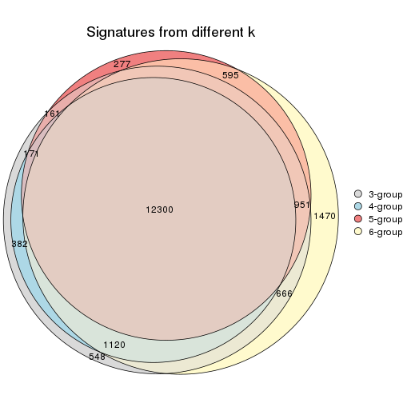

`get_signature()` returns a data frame invisibly. TO get the list of signatures, the function
call should be assigned to a variable explicitly. In following code, if `plot` argument is set
to `FALSE`, no heatmap is plotted while only the differential analysis is performed.

```r
# code only for demonstration
tb = get_signature(res, k = ..., plot = FALSE)
```

An example of the output of `tb` is:

```
#>   which_row         fdr    mean_1    mean_2 scaled_mean_1 scaled_mean_2 km
#> 1        38 0.042760348  8.373488  9.131774    -0.5533452     0.5164555  1
#> 2        40 0.018707592  7.106213  8.469186    -0.6173731     0.5762149  1
#> 3        55 0.019134737 10.221463 11.207825    -0.6159697     0.5749050  1
#> 4        59 0.006059896  5.921854  7.869574    -0.6899429     0.6439467  1
#> 5        60 0.018055526  8.928898 10.211722    -0.6204761     0.5791110  1
#> 6        98 0.009384629 15.714769 14.887706     0.6635654    -0.6193277  2
...
```

The columns in `tb` are:

1. `which_row`: row indices corresponding to the input matrix.
2. `fdr`: FDR for the differential test. 
3. `mean_x`: The mean value in group x.
4. `scaled_mean_x`: The mean value in group x after rows are scaled.
5. `km`: Row groups if k-means clustering is applied to rows.


UMAP plot which shows how samples are separated.


<script>
$( function() {
	$( '#tabs-MAD-hclust-dimension-reduction' ).tabs();
} );
</script>
<div id='tabs-MAD-hclust-dimension-reduction'>
<ul>
<li><a href='#tab-MAD-hclust-dimension-reduction-1'>k = 2</a></li>
<li><a href='#tab-MAD-hclust-dimension-reduction-2'>k = 3</a></li>
<li><a href='#tab-MAD-hclust-dimension-reduction-3'>k = 4</a></li>
<li><a href='#tab-MAD-hclust-dimension-reduction-4'>k = 5</a></li>
<li><a href='#tab-MAD-hclust-dimension-reduction-5'>k = 6</a></li>
</ul>
<div id='tab-MAD-hclust-dimension-reduction-1'>
<pre><code class="r">dimension_reduction(res, k = 2, method = &quot;UMAP&quot;)
</code></pre>

<p></p>

</div>
<div id='tab-MAD-hclust-dimension-reduction-2'>
<pre><code class="r">dimension_reduction(res, k = 3, method = &quot;UMAP&quot;)
</code></pre>

<p></p>

</div>
<div id='tab-MAD-hclust-dimension-reduction-3'>
<pre><code class="r">dimension_reduction(res, k = 4, method = &quot;UMAP&quot;)
</code></pre>

<p></p>

</div>
<div id='tab-MAD-hclust-dimension-reduction-4'>
<pre><code class="r">dimension_reduction(res, k = 5, method = &quot;UMAP&quot;)
</code></pre>

<p></p>

</div>
<div id='tab-MAD-hclust-dimension-reduction-5'>
<pre><code class="r">dimension_reduction(res, k = 6, method = &quot;UMAP&quot;)
</code></pre>

<p></p>

</div>
</div>


Following heatmap shows how subgroups are split when increasing `k`:

```r
collect_classes(res)
```


Test correlation between subgroups and known annotations. If the known
annotation is numeric, one-way ANOVA test is applied, and if the known
annotation is discrete, chi-squared contingency table test is applied.

```r
test_to_known_factors(res)
```

```
#>             n specimen(p) k
#> MAD:hclust 11          NA 2
#> MAD:hclust 93      0.0749 3
#> MAD:hclust 63      0.1583 4
#> MAD:hclust 41      0.0157 5
#> MAD:hclust 69      0.0594 6
```


If matrix rows can be associated to genes, consider to use `GO_Enrichment(res,
...)` to perform function enrichment for the signature genes.


 

---------------------------------------------------


### MAD:kmeans


The object with results only for a single top-value method and a single partition method 
can be extracted as:

```r
res = res_list["MAD", "kmeans"]
# you can also extract it by
# res = res_list["MAD:kmeans"]
```

A summary of `res` and all the functions that can be applied to it:

```r
res
```

```
#> A 'ConsensusPartition' object with k = 2, 3, 4, 5, 6.
#>   On a matrix with 22686 rows and 167 columns.
#>   Top rows (1000, 2000, 3000, 4000, 5000) are extracted by 'MAD' method.
#>   Subgroups are detected by 'kmeans' method.
#>   Performed in total 1250 partitions by row resampling.
#>   Best k for subgroups seems to be 2.
#> 
#> Following methods can be applied to this 'ConsensusPartition' object:
#>  [1] "cola_report"             "collect_classes"         "collect_plots"          
#>  [4] "collect_stats"           "colnames"                "compare_signatures"     
#>  [7] "consensus_heatmap"       "dimension_reduction"     "functional_enrichment"  
#> [10] "get_anno_col"            "get_anno"                "get_classes"            
#> [13] "get_consensus"           "get_matrix"              "get_membership"         
#> [16] "get_param"               "get_signatures"          "get_stats"              
#> [19] "is_best_k"               "is_stable_k"             "membership_heatmap"     
#> [22] "ncol"                    "nrow"                    "plot_ecdf"              
#> [25] "rownames"                "select_partition_number" "show"                   
#> [28] "suggest_best_k"          "test_to_known_factors"
```

`collect_plots()` function collects all the plots made from `res` for all `k` (number of partitions)
into one single page to provide an easy and fast comparison between different `k`.

```r
collect_plots(res)
```


The plots are:

- The first row: a plot of the ECDF (Empirical cumulative distribution
  function) curves of the consensus matrix for each `k` and the heatmap of
  predicted classes for each `k`.
- The second row: heatmaps of the consensus matrix for each `k`.
- The third row: heatmaps of the membership matrix for each `k`.
- The fouth row: heatmaps of the signatures for each `k`.

All the plots in panels can be made by individual functions and they are
plotted later in this section.

`select_partition_number()` produces several plots showing different
statistics for choosing "optimized" `k`. There are following statistics:

- ECDF curves of the consensus matrix for each `k`;
- 1-PAC. [The PAC
  score](https://en.wikipedia.org/wiki/Consensus_clustering#Over-interpretation_potential_of_consensus_clustering)
  measures the proportion of the ambiguous subgrouping.
- Mean silhouette score.
- Concordance. The mean probability of fiting the consensus class ids in all
  partitions.
- Area increased. Denote $A_k$ as the area under the ECDF curve for current
  `k`, the area increased is defined as $A_k - A_{k-1}$.
- Rand index. The percent of pairs of samples that are both in a same cluster
  or both are not in a same cluster in the partition of k and k-1.
- Jaccard index. The ratio of pairs of samples are both in a same cluster in
  the partition of k and k-1 and the pairs of samples are both in a same
  cluster in the partition k or k-1.

The detailed explanations of these statistics can be found in [the cola
vignette](http://bioconductor.org/packages/devel/bioc/vignettes/cola/inst/doc/cola.html#toc_13).

Generally speaking, lower PAC score, higher mean silhouette score or higher
concordance corresponds to better partition. Rand index and Jaccard index
measure how similar the current partition is compared to partition with `k-1`.
If they are too similar, we won't accept `k` is better than `k-1`.

```r
select_partition_number(res)
```


The numeric values for all these statistics can be obtained by `get_stats()`.

```r
get_stats(res)
```

```
#>   k 1-PAC mean_silhouette concordance area_increased  Rand Jaccard
#> 2 2 0.491           0.612       0.788         0.4914 0.499   0.499
#> 3 3 0.390           0.608       0.762         0.3192 0.719   0.498
#> 4 4 0.520           0.615       0.759         0.1354 0.838   0.575
#> 5 5 0.565           0.426       0.642         0.0707 0.904   0.672
#> 6 6 0.616           0.469       0.643         0.0464 0.847   0.443
```

`suggest_best_k()` suggests the best $k$ based on these statistics. The rules are as follows:

- All $k$ with Jaccard index larger than 0.95 are removed because the increase of
  the partition number does not provides enough extra information. If all $k$ are removed,
  the best $k$ is assigned by `NA`.
- For $k$ with 1-PAC larger than 0.9, the maximal $k$ is taken as the "best k". Other $k$ is called "optional k".
- If it does not fit the second rule. The $k$ with the highest vote of highest
  1-PAC, mean silhouette and concordance is taken as the "best k".

```r
suggest_best_k(res)
```

```
#> [1] 2
```


Following shows the table of the partitions (You need to click the **show/hide
code output** link to see it). The membership matrix (columns with name `p*`)
is inferred by
[`clue::cl_consensus()`](https://www.rdocumentation.org/link/cl_consensus?package=clue)
function with the `SE` method. Basically the value in the membership matrix
represents the probability to belong to a certain group. The finall class
label for an item is determined with the group with highest probability it
belongs to.

In `get_classes()` function, the entropy is calculated from the membership
matrix and the silhouette score is calculated from the consensus matrix.


<script>
$( function() {
	$( '#tabs-MAD-kmeans-get-classes' ).tabs();
} );
</script>
<div id='tabs-MAD-kmeans-get-classes'>
<ul>
<li><a href='#tab-MAD-kmeans-get-classes-1'>k = 2</a></li>
<li><a href='#tab-MAD-kmeans-get-classes-2'>k = 3</a></li>
<li><a href='#tab-MAD-kmeans-get-classes-3'>k = 4</a></li>
<li><a href='#tab-MAD-kmeans-get-classes-4'>k = 5</a></li>
<li><a href='#tab-MAD-kmeans-get-classes-5'>k = 6</a></li>
</ul>

<div id='tab-MAD-kmeans-get-classes-1'>
<p><a id='tab-MAD-kmeans-get-classes-1-a' style='color:#0366d6' href='#'>show/hide code output</a></p>
<pre><code class="r">cbind(get_classes(res, k = 2), get_membership(res, k = 2))
</code></pre>

<pre><code>#&gt;          class entropy silhouette    p1    p2
#&gt; GSM30006     2  0.9970      0.625 0.468 0.532
#&gt; GSM30007     1  0.9963      0.757 0.536 0.464
#&gt; GSM30008     1  0.9977      0.757 0.528 0.472
#&gt; GSM30009     1  0.9970      0.757 0.532 0.468
#&gt; GSM30010     1  0.4690      0.284 0.900 0.100
#&gt; GSM30011     2  0.9970      0.625 0.468 0.532
#&gt; GSM30012     2  0.9970      0.623 0.468 0.532
#&gt; GSM30013     2  0.9970      0.623 0.468 0.532
#&gt; GSM30014     1  0.1414      0.413 0.980 0.020
#&gt; GSM30015     1  0.9970      0.757 0.532 0.468
#&gt; GSM30016     1  0.1414      0.413 0.980 0.020
#&gt; GSM30017     1  0.9970      0.757 0.532 0.468
#&gt; GSM30018     2  0.0672      0.579 0.008 0.992
#&gt; GSM30019     2  0.9970      0.623 0.468 0.532
#&gt; GSM30020     1  0.9970      0.757 0.532 0.468
#&gt; GSM30021     1  0.1414      0.413 0.980 0.020
#&gt; GSM30022     1  0.9970      0.757 0.532 0.468
#&gt; GSM30023     2  0.0672      0.591 0.008 0.992
#&gt; GSM30024     1  0.0000      0.425 1.000 0.000
#&gt; GSM30025     1  0.9970      0.757 0.532 0.468
#&gt; GSM30026     2  0.9988     -0.697 0.480 0.520
#&gt; GSM30027     1  0.9970      0.757 0.532 0.468
#&gt; GSM30028     1  0.9970      0.757 0.532 0.468
#&gt; GSM30029     1  0.9977      0.757 0.528 0.472
#&gt; GSM30030     1  0.9970      0.757 0.532 0.468
#&gt; GSM30031     1  0.9977      0.757 0.528 0.472
#&gt; GSM30032     1  0.9970      0.757 0.532 0.468
#&gt; GSM30033     1  0.2423      0.438 0.960 0.040
#&gt; GSM30034     2  0.1184      0.575 0.016 0.984
#&gt; GSM30035     1  0.9954      0.754 0.540 0.460
#&gt; GSM30036     2  0.0938      0.593 0.012 0.988
#&gt; GSM30037     1  0.9970      0.757 0.532 0.468
#&gt; GSM30038     1  0.1414      0.413 0.980 0.020
#&gt; GSM30039     2  0.9970      0.623 0.468 0.532
#&gt; GSM30040     1  0.4690      0.283 0.900 0.100
#&gt; GSM30041     2  0.9970      0.625 0.468 0.532
#&gt; GSM30042     2  0.9970      0.623 0.468 0.532
#&gt; GSM30043     1  0.1184      0.413 0.984 0.016
#&gt; GSM30044     1  0.9970      0.757 0.532 0.468
#&gt; GSM30045     1  0.9970      0.757 0.532 0.468
#&gt; GSM30046     2  0.0672      0.591 0.008 0.992
#&gt; GSM30047     2  0.0672      0.591 0.008 0.992
#&gt; GSM30048     2  0.1414      0.569 0.020 0.980
#&gt; GSM30049     2  0.9970      0.625 0.468 0.532
#&gt; GSM30050     2  0.8327      0.608 0.264 0.736
#&gt; GSM30051     2  0.9970      0.625 0.468 0.532
#&gt; GSM30052     1  0.9970      0.757 0.532 0.468
#&gt; GSM30053     2  0.9970      0.623 0.468 0.532
#&gt; GSM30054     2  0.9970      0.625 0.468 0.532
#&gt; GSM30055     2  0.9896      0.623 0.440 0.560
#&gt; GSM30056     2  0.9970      0.625 0.468 0.532
#&gt; GSM30057     1  0.2948      0.368 0.948 0.052
#&gt; GSM30058     2  0.9970      0.625 0.468 0.532
#&gt; GSM30059     2  0.1414      0.569 0.020 0.980
#&gt; GSM30060     1  0.2043      0.444 0.968 0.032
#&gt; GSM30061     2  0.0376      0.591 0.004 0.996
#&gt; GSM30062     2  0.0376      0.591 0.004 0.996
#&gt; GSM30063     2  0.9963      0.624 0.464 0.536
#&gt; GSM30064     1  0.9970      0.757 0.532 0.468
#&gt; GSM30065     2  0.9970      0.625 0.468 0.532
#&gt; GSM30066     1  0.1184      0.413 0.984 0.016
#&gt; GSM30067     1  0.9977      0.757 0.528 0.472
#&gt; GSM30068     1  0.1414      0.413 0.980 0.020
#&gt; GSM30069     1  0.1414      0.413 0.980 0.020
#&gt; GSM30070     2  0.9970      0.623 0.468 0.532
#&gt; GSM30071     2  0.9970      0.623 0.468 0.532
#&gt; GSM30072     1  0.9970      0.757 0.532 0.468
#&gt; GSM30073     2  0.9754      0.621 0.408 0.592
#&gt; GSM30074     1  0.1414      0.413 0.980 0.020
#&gt; GSM30075     2  0.9970      0.623 0.468 0.532
#&gt; GSM30076     2  0.0672      0.593 0.008 0.992
#&gt; GSM30077     2  0.0376      0.591 0.004 0.996
#&gt; GSM30078     2  0.0376      0.591 0.004 0.996
#&gt; GSM30079     1  0.9970      0.757 0.532 0.468
#&gt; GSM30080     2  0.9970      0.623 0.468 0.532
#&gt; GSM30081     2  0.9970      0.625 0.468 0.532
#&gt; GSM30086     2  0.9970      0.623 0.468 0.532
#&gt; GSM30087     2  0.0376      0.591 0.004 0.996
#&gt; GSM30088     2  0.1184      0.569 0.016 0.984
#&gt; GSM30089     1  0.9970      0.757 0.532 0.468
#&gt; GSM30090     2  0.9970      0.625 0.468 0.532
#&gt; GSM30091     2  0.9970      0.625 0.468 0.532
#&gt; GSM30092     2  0.0672      0.591 0.008 0.992
#&gt; GSM30093     2  0.9970      0.625 0.468 0.532
#&gt; GSM30094     2  0.9970      0.625 0.468 0.532
#&gt; GSM30095     1  0.4431      0.299 0.908 0.092
#&gt; GSM30096     1  0.9970      0.757 0.532 0.468
#&gt; GSM30097     2  0.1414      0.569 0.020 0.980
#&gt; GSM30098     1  0.9970      0.757 0.532 0.468
#&gt; GSM30099     2  0.9922      0.624 0.448 0.552
#&gt; GSM30100     1  0.1184      0.413 0.984 0.016
#&gt; GSM30101     2  0.9970      0.625 0.468 0.532
#&gt; GSM30102     2  0.9970      0.625 0.468 0.532
#&gt; GSM30103     1  0.9970      0.757 0.532 0.468
#&gt; GSM30104     2  0.1184      0.594 0.016 0.984
#&gt; GSM30105     1  0.9970      0.757 0.532 0.468
#&gt; GSM30106     2  0.0672      0.591 0.008 0.992
#&gt; GSM30107     2  0.0938      0.592 0.012 0.988
#&gt; GSM30108     1  0.2423      0.450 0.960 0.040
#&gt; GSM30109     1  0.9970      0.757 0.532 0.468
#&gt; GSM30110     2  0.0376      0.587 0.004 0.996
#&gt; GSM30111     1  0.9970      0.757 0.532 0.468
#&gt; GSM30112     1  0.9970      0.757 0.532 0.468
#&gt; GSM30113     1  0.4562      0.292 0.904 0.096
#&gt; GSM30114     2  0.9970      0.623 0.468 0.532
#&gt; GSM30115     2  0.0938      0.592 0.012 0.988
#&gt; GSM30116     1  0.1184      0.422 0.984 0.016
#&gt; GSM30117     1  0.9963      0.756 0.536 0.464
#&gt; GSM30118     1  0.1414      0.413 0.980 0.020
#&gt; GSM30119     2  0.9970      0.623 0.468 0.532
#&gt; GSM30120     2  0.6343      0.600 0.160 0.840
#&gt; GSM30121     1  0.9970      0.757 0.532 0.468
#&gt; GSM30122     1  0.9970      0.757 0.532 0.468
#&gt; GSM30123     2  0.9896      0.623 0.440 0.560
#&gt; GSM30177     2  0.9970      0.625 0.468 0.532
#&gt; GSM30178     2  0.0672      0.591 0.008 0.992
#&gt; GSM30179     1  0.9970      0.757 0.532 0.468
#&gt; GSM30180     1  0.9970      0.757 0.532 0.468
#&gt; GSM30181     2  0.7674      0.605 0.224 0.776
#&gt; GSM30182     2  0.0376      0.591 0.004 0.996
#&gt; GSM30183     1  0.9970      0.757 0.532 0.468
#&gt; GSM30184     2  0.9970      0.625 0.468 0.532
#&gt; GSM30185     1  0.9970      0.757 0.532 0.468
#&gt; GSM30186     1  0.6247      0.274 0.844 0.156
#&gt; GSM30187     2  0.0672      0.591 0.008 0.992
#&gt; GSM30188     2  0.0000      0.588 0.000 1.000
#&gt; GSM30189     2  0.1633      0.564 0.024 0.976
#&gt; GSM30190     2  0.9970      0.625 0.468 0.532
#&gt; GSM30191     2  0.3584      0.598 0.068 0.932
#&gt; GSM30192     2  0.9970      0.623 0.468 0.532
#&gt; GSM30193     2  0.0672      0.591 0.008 0.992
#&gt; GSM30194     2  0.9977      0.624 0.472 0.528
#&gt; GSM30195     1  0.9000      0.566 0.684 0.316
#&gt; GSM30196     1  0.9970      0.757 0.532 0.468
#&gt; GSM30197     2  0.0672      0.591 0.008 0.992
#&gt; GSM30198     2  0.2423      0.537 0.040 0.960
#&gt; GSM30199     1  0.9970      0.757 0.532 0.468
#&gt; GSM30200     2  0.1843      0.557 0.028 0.972
#&gt; GSM30201     2  0.1184      0.569 0.016 0.984
#&gt; GSM30202     1  0.9970      0.757 0.532 0.468
#&gt; GSM30203     2  0.0672      0.591 0.008 0.992
#&gt; GSM30204     2  0.2778      0.523 0.048 0.952
#&gt; GSM30205     1  0.1633      0.415 0.976 0.024
#&gt; GSM30206     2  0.1414      0.569 0.020 0.980
#&gt; GSM30207     2  0.1633      0.564 0.024 0.976
#&gt; GSM30208     2  0.2423      0.538 0.040 0.960
#&gt; GSM30209     2  0.2236      0.593 0.036 0.964
#&gt; GSM30210     1  0.9970      0.757 0.532 0.468
#&gt; GSM30211     2  0.1414      0.569 0.020 0.980
#&gt; GSM30212     1  0.9970      0.757 0.532 0.468
#&gt; GSM30213     1  0.9970      0.757 0.532 0.468
#&gt; GSM30214     1  0.9970      0.757 0.532 0.468
#&gt; GSM30215     1  0.9970      0.757 0.532 0.468
#&gt; GSM30216     1  0.9970      0.757 0.532 0.468
#&gt; GSM30217     1  0.9970      0.757 0.532 0.468
#&gt; GSM30218     2  0.0672      0.591 0.008 0.992
#&gt; GSM30219     1  0.1414      0.412 0.980 0.020
#&gt; GSM30220     1  0.9970      0.757 0.532 0.468
#&gt; GSM30221     2  0.0376      0.591 0.004 0.996
#&gt; GSM30222     2  0.1414      0.594 0.020 0.980
#&gt; GSM30223     1  0.9970      0.757 0.532 0.468
#&gt; GSM30224     2  0.1414      0.569 0.020 0.980
#&gt; GSM30225     1  0.9970      0.757 0.532 0.468
#&gt; GSM30226     1  0.9970      0.757 0.532 0.468
#&gt; GSM30227     1  0.9970      0.757 0.532 0.468
#&gt; GSM30228     2  0.9970      0.625 0.468 0.532
#&gt; GSM30229     2  0.3431      0.598 0.064 0.936
</code></pre>

<script>
$('#tab-MAD-kmeans-get-classes-1-a').parent().next().next().hide();
$('#tab-MAD-kmeans-get-classes-1-a').click(function(){
  $('#tab-MAD-kmeans-get-classes-1-a').parent().next().next().toggle();
  return(false);
});
</script>
</div>

<div id='tab-MAD-kmeans-get-classes-2'>
<p><a id='tab-MAD-kmeans-get-classes-2-a' style='color:#0366d6' href='#'>show/hide code output</a></p>
<pre><code class="r">cbind(get_classes(res, k = 3), get_membership(res, k = 3))
</code></pre>

<pre><code>#&gt;          class entropy silhouette    p1    p2    p3
#&gt; GSM30006     3  0.6305     0.4967 0.484 0.000 0.516
#&gt; GSM30007     2  0.3038     0.8676 0.000 0.896 0.104
#&gt; GSM30008     2  0.3267     0.8351 0.000 0.884 0.116
#&gt; GSM30009     2  0.0237     0.8538 0.000 0.996 0.004
#&gt; GSM30010     3  0.1765     0.5949 0.004 0.040 0.956
#&gt; GSM30011     3  0.6305     0.4967 0.484 0.000 0.516
#&gt; GSM30012     3  0.6204     0.4786 0.424 0.000 0.576
#&gt; GSM30013     1  0.3816     0.6441 0.852 0.000 0.148
#&gt; GSM30014     3  0.3030     0.5539 0.004 0.092 0.904
#&gt; GSM30015     1  0.9808    -0.1039 0.392 0.368 0.240
#&gt; GSM30016     3  0.5803     0.5357 0.028 0.212 0.760
#&gt; GSM30017     1  0.8624     0.2088 0.476 0.424 0.100
#&gt; GSM30018     1  0.4196     0.7394 0.864 0.112 0.024
#&gt; GSM30019     3  0.6225     0.4737 0.432 0.000 0.568
#&gt; GSM30020     2  0.3987     0.8331 0.020 0.872 0.108
#&gt; GSM30021     3  0.3412     0.5472 0.000 0.124 0.876
#&gt; GSM30022     2  0.3112     0.8692 0.004 0.900 0.096
#&gt; GSM30023     1  0.6258     0.6850 0.752 0.196 0.052
#&gt; GSM30024     3  0.7337     0.3843 0.056 0.300 0.644
#&gt; GSM30025     2  0.0592     0.8541 0.000 0.988 0.012
#&gt; GSM30026     1  0.8844     0.2913 0.488 0.392 0.120
#&gt; GSM30027     2  0.4887     0.8102 0.060 0.844 0.096
#&gt; GSM30028     2  0.4369     0.8235 0.040 0.864 0.096
#&gt; GSM30029     2  0.3528     0.8313 0.016 0.892 0.092
#&gt; GSM30030     2  0.3116     0.8702 0.000 0.892 0.108
#&gt; GSM30031     2  0.3112     0.8377 0.004 0.900 0.096
#&gt; GSM30032     2  0.4527     0.8225 0.052 0.860 0.088
#&gt; GSM30033     3  0.8844     0.1404 0.116 0.440 0.444
#&gt; GSM30034     1  0.4136     0.7373 0.864 0.116 0.020
#&gt; GSM30035     2  0.7814     0.7318 0.104 0.652 0.244
#&gt; GSM30036     1  0.2187     0.6802 0.948 0.028 0.024
#&gt; GSM30037     2  0.2878     0.8692 0.000 0.904 0.096
#&gt; GSM30038     3  0.5680     0.5122 0.024 0.212 0.764
#&gt; GSM30039     3  0.6215     0.4730 0.428 0.000 0.572
#&gt; GSM30040     3  0.5662     0.6048 0.092 0.100 0.808
#&gt; GSM30041     3  0.6305     0.4967 0.484 0.000 0.516
#&gt; GSM30042     3  0.6126     0.4747 0.400 0.000 0.600
#&gt; GSM30043     3  0.2590     0.5764 0.004 0.072 0.924
#&gt; GSM30044     2  0.4172     0.8607 0.028 0.868 0.104
#&gt; GSM30045     2  0.4874     0.8375 0.028 0.828 0.144
#&gt; GSM30046     1  0.3832     0.7413 0.880 0.100 0.020
#&gt; GSM30047     1  0.3637     0.7188 0.892 0.084 0.024
#&gt; GSM30048     1  0.4999     0.7243 0.820 0.152 0.028
#&gt; GSM30049     3  0.6274     0.5163 0.456 0.000 0.544
#&gt; GSM30050     1  0.3499     0.6367 0.900 0.028 0.072
#&gt; GSM30051     3  0.6299     0.5013 0.476 0.000 0.524
#&gt; GSM30052     2  0.2711     0.8703 0.000 0.912 0.088
#&gt; GSM30053     3  0.6204     0.4666 0.424 0.000 0.576
#&gt; GSM30054     3  0.6305     0.4967 0.484 0.000 0.516
#&gt; GSM30055     1  0.8314    -0.1132 0.556 0.092 0.352
#&gt; GSM30056     1  0.6451    -0.3593 0.560 0.004 0.436
#&gt; GSM30057     3  0.1878     0.5940 0.004 0.044 0.952
#&gt; GSM30058     3  0.6305     0.4967 0.484 0.000 0.516
#&gt; GSM30059     1  0.3983     0.7387 0.852 0.144 0.004
#&gt; GSM30060     3  0.7600     0.1241 0.060 0.328 0.612
#&gt; GSM30061     1  0.4121     0.7401 0.868 0.108 0.024
#&gt; GSM30062     1  0.3272     0.7436 0.904 0.080 0.016
#&gt; GSM30063     1  0.4121     0.6047 0.832 0.000 0.168
#&gt; GSM30064     2  0.2443     0.8348 0.028 0.940 0.032
#&gt; GSM30065     3  0.6307     0.4831 0.488 0.000 0.512
#&gt; GSM30066     3  0.3116     0.5477 0.000 0.108 0.892
#&gt; GSM30067     2  0.4178     0.8626 0.000 0.828 0.172
#&gt; GSM30068     3  0.3879     0.5431 0.000 0.152 0.848
#&gt; GSM30069     3  0.4235     0.5351 0.000 0.176 0.824
#&gt; GSM30070     3  0.5016     0.5598 0.240 0.000 0.760
#&gt; GSM30071     1  0.7460    -0.0272 0.524 0.036 0.440
#&gt; GSM30072     2  0.3826     0.8597 0.008 0.868 0.124
#&gt; GSM30073     1  0.3619     0.6556 0.864 0.000 0.136
#&gt; GSM30074     3  0.5223     0.5307 0.024 0.176 0.800
#&gt; GSM30075     1  0.3686     0.6872 0.860 0.000 0.140
#&gt; GSM30076     1  0.2356     0.7404 0.928 0.072 0.000
#&gt; GSM30077     1  0.3112     0.7431 0.900 0.096 0.004
#&gt; GSM30078     1  0.2860     0.7420 0.912 0.084 0.004
#&gt; GSM30079     2  0.2878     0.8692 0.000 0.904 0.096
#&gt; GSM30080     1  0.3412     0.6823 0.876 0.000 0.124
#&gt; GSM30081     3  0.6299     0.5013 0.476 0.000 0.524
#&gt; GSM30086     1  0.3267     0.6988 0.884 0.000 0.116
#&gt; GSM30087     1  0.3375     0.7428 0.892 0.100 0.008
#&gt; GSM30088     1  0.5435     0.7066 0.784 0.192 0.024
#&gt; GSM30089     2  0.3406     0.8497 0.028 0.904 0.068
#&gt; GSM30090     3  0.6305     0.4967 0.484 0.000 0.516
#&gt; GSM30091     3  0.6299     0.5013 0.476 0.000 0.524
#&gt; GSM30092     1  0.3359     0.7374 0.900 0.084 0.016
#&gt; GSM30093     1  0.6260    -0.3708 0.552 0.000 0.448
#&gt; GSM30094     3  0.6305     0.4967 0.484 0.000 0.516
#&gt; GSM30095     3  0.5811     0.6040 0.092 0.108 0.800
#&gt; GSM30096     2  0.4291     0.8568 0.000 0.820 0.180
#&gt; GSM30097     1  0.4741     0.7363 0.828 0.152 0.020
#&gt; GSM30098     2  0.3116     0.8696 0.000 0.892 0.108
#&gt; GSM30099     3  0.8277     0.4213 0.456 0.076 0.468
#&gt; GSM30100     3  0.4978     0.5182 0.004 0.216 0.780
#&gt; GSM30101     3  0.6305     0.4967 0.484 0.000 0.516
#&gt; GSM30102     1  0.6489    -0.4313 0.540 0.004 0.456
#&gt; GSM30103     2  0.5036     0.8445 0.048 0.832 0.120
#&gt; GSM30104     1  0.1585     0.6877 0.964 0.028 0.008
#&gt; GSM30105     2  0.0747     0.8559 0.000 0.984 0.016
#&gt; GSM30106     1  0.4489     0.7381 0.856 0.108 0.036
#&gt; GSM30107     1  0.4189     0.7372 0.876 0.068 0.056
#&gt; GSM30108     2  0.6673     0.5937 0.020 0.636 0.344
#&gt; GSM30109     2  0.4094     0.8656 0.028 0.872 0.100
#&gt; GSM30110     1  0.5566     0.7239 0.812 0.108 0.080
#&gt; GSM30111     1  0.9030     0.2302 0.476 0.388 0.136
#&gt; GSM30112     2  0.5455     0.8201 0.028 0.788 0.184
#&gt; GSM30113     3  0.1765     0.5949 0.004 0.040 0.956
#&gt; GSM30114     1  0.6299    -0.1659 0.524 0.000 0.476
#&gt; GSM30115     1  0.3993     0.7340 0.884 0.064 0.052
#&gt; GSM30116     3  0.7935     0.3765 0.116 0.236 0.648
#&gt; GSM30117     2  0.8076     0.7153 0.116 0.632 0.252
#&gt; GSM30118     3  0.3038     0.5449 0.000 0.104 0.896
#&gt; GSM30119     3  0.5058     0.5695 0.244 0.000 0.756
#&gt; GSM30120     1  0.6357     0.4840 0.652 0.012 0.336
#&gt; GSM30121     2  0.4521     0.8599 0.004 0.816 0.180
#&gt; GSM30122     2  0.4351     0.8559 0.004 0.828 0.168
#&gt; GSM30123     1  0.5277     0.4385 0.796 0.024 0.180
#&gt; GSM30177     1  0.5553     0.2241 0.724 0.004 0.272
#&gt; GSM30178     1  0.3370     0.7175 0.904 0.072 0.024
#&gt; GSM30179     2  0.4892     0.7950 0.048 0.840 0.112
#&gt; GSM30180     2  0.5244     0.8324 0.004 0.756 0.240
#&gt; GSM30181     1  0.3482     0.6894 0.872 0.000 0.128
#&gt; GSM30182     1  0.3752     0.7409 0.884 0.096 0.020
#&gt; GSM30183     2  0.4682     0.8554 0.004 0.804 0.192
#&gt; GSM30184     3  0.6305     0.4967 0.484 0.000 0.516
#&gt; GSM30185     2  0.6723     0.7995 0.048 0.704 0.248
#&gt; GSM30186     3  0.8513     0.5369 0.264 0.140 0.596
#&gt; GSM30187     1  0.3966     0.7318 0.876 0.100 0.024
#&gt; GSM30188     1  0.3832     0.7413 0.880 0.100 0.020
#&gt; GSM30189     1  0.7584     0.6416 0.676 0.220 0.104
#&gt; GSM30190     3  0.6307     0.4899 0.488 0.000 0.512
#&gt; GSM30191     1  0.2187     0.6802 0.948 0.028 0.024
#&gt; GSM30192     1  0.3038     0.6932 0.896 0.000 0.104
#&gt; GSM30193     1  0.3713     0.7394 0.892 0.076 0.032
#&gt; GSM30194     3  0.4842     0.5793 0.224 0.000 0.776
#&gt; GSM30195     3  0.8487     0.2826 0.292 0.124 0.584
#&gt; GSM30196     2  0.4172     0.8607 0.028 0.868 0.104
#&gt; GSM30197     1  0.3539     0.7419 0.888 0.100 0.012
#&gt; GSM30198     1  0.6539     0.6216 0.684 0.288 0.028
#&gt; GSM30199     2  0.6646     0.8013 0.048 0.712 0.240
#&gt; GSM30200     1  0.6379     0.6498 0.712 0.256 0.032
#&gt; GSM30201     1  0.5331     0.7093 0.792 0.184 0.024
#&gt; GSM30202     2  0.9436     0.4749 0.256 0.504 0.240
#&gt; GSM30203     1  0.3502     0.7359 0.896 0.084 0.020
#&gt; GSM30204     1  0.8148     0.5227 0.604 0.296 0.100
#&gt; GSM30205     3  0.7295     0.5134 0.072 0.252 0.676
#&gt; GSM30206     1  0.5680     0.6997 0.764 0.212 0.024
#&gt; GSM30207     1  0.8028     0.5732 0.616 0.288 0.096
#&gt; GSM30208     1  0.7163     0.5803 0.628 0.332 0.040
#&gt; GSM30209     1  0.9356    -0.0470 0.512 0.272 0.216
#&gt; GSM30210     2  0.0237     0.8538 0.000 0.996 0.004
#&gt; GSM30211     1  0.5508     0.7032 0.784 0.188 0.028
#&gt; GSM30212     2  0.2356     0.8709 0.000 0.928 0.072
#&gt; GSM30213     2  0.2878     0.8692 0.000 0.904 0.096
#&gt; GSM30214     2  0.2945     0.8507 0.004 0.908 0.088
#&gt; GSM30215     2  0.2796     0.8467 0.000 0.908 0.092
#&gt; GSM30216     2  0.3425     0.8682 0.004 0.884 0.112
#&gt; GSM30217     2  0.2448     0.8487 0.000 0.924 0.076
#&gt; GSM30218     1  0.3742     0.7122 0.892 0.072 0.036
#&gt; GSM30219     3  0.6039     0.5619 0.108 0.104 0.788
#&gt; GSM30220     2  0.2537     0.8709 0.000 0.920 0.080
#&gt; GSM30221     1  0.3752     0.7409 0.884 0.096 0.020
#&gt; GSM30222     1  0.4128     0.6958 0.856 0.012 0.132
#&gt; GSM30223     2  0.4015     0.8634 0.028 0.876 0.096
#&gt; GSM30224     1  0.5803     0.6995 0.760 0.212 0.028
#&gt; GSM30225     1  0.9837    -0.1175 0.392 0.360 0.248
#&gt; GSM30226     2  0.6742     0.7974 0.052 0.708 0.240
#&gt; GSM30227     2  0.9598     0.2796 0.348 0.444 0.208
#&gt; GSM30228     1  0.6260    -0.3708 0.552 0.000 0.448
#&gt; GSM30229     1  0.1015     0.6947 0.980 0.008 0.012
</code></pre>

<script>
$('#tab-MAD-kmeans-get-classes-2-a').parent().next().next().hide();
$('#tab-MAD-kmeans-get-classes-2-a').click(function(){
  $('#tab-MAD-kmeans-get-classes-2-a').parent().next().next().toggle();
  return(false);
});
</script>
</div>

<div id='tab-MAD-kmeans-get-classes-3'>
<p><a id='tab-MAD-kmeans-get-classes-3-a' style='color:#0366d6' href='#'>show/hide code output</a></p>
<pre><code class="r">cbind(get_classes(res, k = 4), get_membership(res, k = 4))
</code></pre>

<pre><code>#&gt;          class entropy silhouette    p1    p2    p3    p4
#&gt; GSM30006     2  0.2730    0.67366 0.000 0.896 0.016 0.088
#&gt; GSM30007     1  0.2149    0.81213 0.912 0.000 0.088 0.000
#&gt; GSM30008     1  0.5107    0.77466 0.804 0.072 0.052 0.072
#&gt; GSM30009     1  0.0336    0.82016 0.992 0.000 0.008 0.000
#&gt; GSM30010     3  0.4192    0.56712 0.008 0.208 0.780 0.004
#&gt; GSM30011     2  0.2796    0.67385 0.000 0.892 0.016 0.092
#&gt; GSM30012     2  0.6134    0.48236 0.000 0.660 0.236 0.104
#&gt; GSM30013     4  0.6488    0.54838 0.000 0.292 0.104 0.604
#&gt; GSM30014     3  0.3870    0.56641 0.004 0.208 0.788 0.000
#&gt; GSM30015     3  0.7701   -0.00403 0.128 0.020 0.444 0.408
#&gt; GSM30016     3  0.6664    0.52492 0.092 0.108 0.708 0.092
#&gt; GSM30017     4  0.7111    0.56598 0.144 0.068 0.120 0.668
#&gt; GSM30018     4  0.0895    0.81018 0.000 0.020 0.004 0.976
#&gt; GSM30019     2  0.5705    0.55377 0.000 0.712 0.180 0.108
#&gt; GSM30020     1  0.5266    0.76633 0.796 0.068 0.068 0.068
#&gt; GSM30021     3  0.3925    0.57769 0.016 0.176 0.808 0.000
#&gt; GSM30022     1  0.2480    0.81791 0.904 0.008 0.088 0.000
#&gt; GSM30023     4  0.5260    0.70273 0.024 0.068 0.128 0.780
#&gt; GSM30024     3  0.7494    0.38869 0.352 0.188 0.460 0.000
#&gt; GSM30025     1  0.2631    0.80792 0.912 0.064 0.016 0.008
#&gt; GSM30026     4  0.4928    0.68191 0.072 0.076 0.040 0.812
#&gt; GSM30027     1  0.5390    0.73800 0.776 0.120 0.028 0.076
#&gt; GSM30028     1  0.6774    0.64951 0.696 0.068 0.124 0.112
#&gt; GSM30029     1  0.4607    0.77280 0.828 0.068 0.032 0.072
#&gt; GSM30030     1  0.2463    0.82539 0.924 0.032 0.036 0.008
#&gt; GSM30031     1  0.4555    0.77680 0.832 0.068 0.036 0.064
#&gt; GSM30032     1  0.5279    0.75472 0.788 0.112 0.044 0.056
#&gt; GSM30033     2  0.7396    0.17281 0.344 0.536 0.032 0.088
#&gt; GSM30034     4  0.3219    0.77783 0.000 0.164 0.000 0.836
#&gt; GSM30035     2  0.8145   -0.10640 0.348 0.368 0.276 0.008
#&gt; GSM30036     2  0.4948    0.19185 0.000 0.560 0.000 0.440
#&gt; GSM30037     1  0.1022    0.82353 0.968 0.000 0.032 0.000
#&gt; GSM30038     3  0.5177    0.53855 0.200 0.052 0.744 0.004
#&gt; GSM30039     2  0.6422    0.46874 0.000 0.632 0.248 0.120
#&gt; GSM30040     2  0.5548    0.10252 0.024 0.588 0.388 0.000
#&gt; GSM30041     2  0.3048    0.67366 0.000 0.876 0.016 0.108
#&gt; GSM30042     2  0.7448    0.07928 0.000 0.428 0.400 0.172
#&gt; GSM30043     3  0.4248    0.55764 0.012 0.220 0.768 0.000
#&gt; GSM30044     1  0.2921    0.78910 0.860 0.000 0.140 0.000
#&gt; GSM30045     1  0.3266    0.76880 0.832 0.000 0.168 0.000
#&gt; GSM30046     4  0.4662    0.78453 0.000 0.112 0.092 0.796
#&gt; GSM30047     4  0.2546    0.78653 0.000 0.092 0.008 0.900
#&gt; GSM30048     4  0.2918    0.77489 0.008 0.000 0.116 0.876
#&gt; GSM30049     2  0.2949    0.67033 0.000 0.888 0.024 0.088
#&gt; GSM30050     2  0.4624    0.45139 0.000 0.660 0.000 0.340
#&gt; GSM30051     2  0.3894    0.64871 0.000 0.844 0.068 0.088
#&gt; GSM30052     1  0.0921    0.82371 0.972 0.000 0.028 0.000
#&gt; GSM30053     2  0.6549    0.44971 0.000 0.612 0.268 0.120
#&gt; GSM30054     2  0.3037    0.67396 0.000 0.880 0.020 0.100
#&gt; GSM30055     2  0.6268    0.16778 0.028 0.516 0.016 0.440
#&gt; GSM30056     2  0.4188    0.62639 0.000 0.752 0.004 0.244
#&gt; GSM30057     3  0.4011    0.56663 0.008 0.208 0.784 0.000
#&gt; GSM30058     2  0.2909    0.67319 0.000 0.888 0.020 0.092
#&gt; GSM30059     4  0.2839    0.79946 0.004 0.108 0.004 0.884
#&gt; GSM30060     1  0.7693    0.01350 0.424 0.224 0.352 0.000
#&gt; GSM30061     4  0.1584    0.80650 0.000 0.036 0.012 0.952
#&gt; GSM30062     4  0.3088    0.81492 0.000 0.060 0.052 0.888
#&gt; GSM30063     4  0.6478    0.49973 0.000 0.336 0.088 0.576
#&gt; GSM30064     1  0.2773    0.78863 0.880 0.000 0.116 0.004
#&gt; GSM30065     2  0.3550    0.66899 0.000 0.860 0.044 0.096
#&gt; GSM30066     3  0.4137    0.56641 0.012 0.208 0.780 0.000
#&gt; GSM30067     1  0.4661    0.74512 0.728 0.016 0.256 0.000
#&gt; GSM30068     3  0.4019    0.57402 0.012 0.196 0.792 0.000
#&gt; GSM30069     3  0.6123    0.55031 0.132 0.192 0.676 0.000
#&gt; GSM30070     3  0.5809    0.44636 0.004 0.076 0.696 0.224
#&gt; GSM30071     3  0.6447    0.04258 0.000 0.068 0.484 0.448
#&gt; GSM30072     1  0.2530    0.80330 0.888 0.000 0.112 0.000
#&gt; GSM30073     4  0.6252    0.58318 0.000 0.288 0.088 0.624
#&gt; GSM30074     3  0.4626    0.55758 0.064 0.120 0.808 0.008
#&gt; GSM30075     4  0.4883    0.58481 0.000 0.016 0.288 0.696
#&gt; GSM30076     4  0.2805    0.80536 0.000 0.100 0.012 0.888
#&gt; GSM30077     4  0.2408    0.80068 0.000 0.104 0.000 0.896
#&gt; GSM30078     4  0.2408    0.80068 0.000 0.104 0.000 0.896
#&gt; GSM30079     1  0.1807    0.82370 0.940 0.008 0.052 0.000
#&gt; GSM30080     4  0.6113    0.59381 0.000 0.080 0.284 0.636
#&gt; GSM30081     2  0.3894    0.65054 0.000 0.844 0.068 0.088
#&gt; GSM30086     4  0.3105    0.78265 0.000 0.012 0.120 0.868
#&gt; GSM30087     4  0.2408    0.80068 0.000 0.104 0.000 0.896
#&gt; GSM30088     4  0.1191    0.80405 0.004 0.024 0.004 0.968
#&gt; GSM30089     1  0.2589    0.78974 0.884 0.000 0.116 0.000
#&gt; GSM30090     2  0.2401    0.67490 0.000 0.904 0.004 0.092
#&gt; GSM30091     2  0.3894    0.65054 0.000 0.844 0.068 0.088
#&gt; GSM30092     4  0.2921    0.78930 0.000 0.140 0.000 0.860
#&gt; GSM30093     2  0.3801    0.63207 0.000 0.780 0.000 0.220
#&gt; GSM30094     2  0.2480    0.67427 0.000 0.904 0.008 0.088
#&gt; GSM30095     2  0.5807    0.11569 0.040 0.596 0.364 0.000
#&gt; GSM30096     1  0.4948    0.72918 0.724 0.016 0.252 0.008
#&gt; GSM30097     4  0.3391    0.78560 0.004 0.148 0.004 0.844
#&gt; GSM30098     1  0.2987    0.81298 0.880 0.016 0.104 0.000
#&gt; GSM30099     2  0.6304    0.56731 0.064 0.652 0.016 0.268
#&gt; GSM30100     3  0.6879    0.51179 0.188 0.216 0.596 0.000
#&gt; GSM30101     2  0.3176    0.66562 0.000 0.880 0.036 0.084
#&gt; GSM30102     2  0.4072    0.62758 0.000 0.748 0.000 0.252
#&gt; GSM30103     1  0.2909    0.81832 0.888 0.020 0.092 0.000
#&gt; GSM30104     4  0.3837    0.70276 0.000 0.224 0.000 0.776
#&gt; GSM30105     1  0.1492    0.82638 0.956 0.004 0.036 0.004
#&gt; GSM30106     4  0.2773    0.77668 0.000 0.004 0.116 0.880
#&gt; GSM30107     4  0.4015    0.79145 0.000 0.052 0.116 0.832
#&gt; GSM30108     3  0.4948    0.13585 0.440 0.000 0.560 0.000
#&gt; GSM30109     1  0.3428    0.80326 0.844 0.012 0.144 0.000
#&gt; GSM30110     4  0.6474    0.62091 0.000 0.120 0.256 0.624
#&gt; GSM30111     4  0.6305    0.60690 0.036 0.076 0.184 0.704
#&gt; GSM30112     1  0.4399    0.74479 0.760 0.016 0.224 0.000
#&gt; GSM30113     3  0.3908    0.56523 0.000 0.212 0.784 0.004
#&gt; GSM30114     2  0.7762    0.11266 0.000 0.384 0.380 0.236
#&gt; GSM30115     4  0.5339    0.75505 0.000 0.156 0.100 0.744
#&gt; GSM30116     2  0.7363    0.12120 0.200 0.516 0.284 0.000
#&gt; GSM30117     2  0.8882    0.09234 0.224 0.412 0.304 0.060
#&gt; GSM30118     3  0.3345    0.57760 0.012 0.124 0.860 0.004
#&gt; GSM30119     3  0.6603    0.24315 0.000 0.328 0.572 0.100
#&gt; GSM30120     3  0.5896    0.31776 0.004 0.052 0.648 0.296
#&gt; GSM30121     1  0.4908    0.72834 0.692 0.016 0.292 0.000
#&gt; GSM30122     1  0.5300    0.73077 0.720 0.024 0.240 0.016
#&gt; GSM30123     2  0.4535    0.54060 0.000 0.704 0.004 0.292
#&gt; GSM30177     2  0.4535    0.54060 0.000 0.704 0.004 0.292
#&gt; GSM30178     4  0.3873    0.71741 0.000 0.228 0.000 0.772
#&gt; GSM30179     1  0.5427    0.74753 0.780 0.072 0.040 0.108
#&gt; GSM30180     1  0.5458    0.63328 0.612 0.016 0.368 0.004
#&gt; GSM30181     4  0.4182    0.74208 0.000 0.024 0.180 0.796
#&gt; GSM30182     4  0.3219    0.77584 0.000 0.164 0.000 0.836
#&gt; GSM30183     1  0.5110    0.71988 0.684 0.016 0.296 0.004
#&gt; GSM30184     2  0.2799    0.67425 0.000 0.884 0.008 0.108
#&gt; GSM30185     1  0.6079    0.66794 0.652 0.060 0.280 0.008
#&gt; GSM30186     2  0.7711    0.38497 0.092 0.596 0.232 0.080
#&gt; GSM30187     4  0.3649    0.74433 0.000 0.204 0.000 0.796
#&gt; GSM30188     4  0.3074    0.78189 0.000 0.152 0.000 0.848
#&gt; GSM30189     4  0.3670    0.78261 0.004 0.092 0.044 0.860
#&gt; GSM30190     2  0.2546    0.67490 0.000 0.900 0.008 0.092
#&gt; GSM30191     4  0.4999    0.03124 0.000 0.492 0.000 0.508
#&gt; GSM30192     4  0.5395    0.74728 0.000 0.092 0.172 0.736
#&gt; GSM30193     4  0.4352    0.79142 0.000 0.080 0.104 0.816
#&gt; GSM30194     3  0.6170    0.16689 0.000 0.420 0.528 0.052
#&gt; GSM30195     3  0.6720    0.45277 0.076 0.024 0.628 0.272
#&gt; GSM30196     1  0.2868    0.78969 0.864 0.000 0.136 0.000
#&gt; GSM30197     4  0.4163    0.79388 0.000 0.076 0.096 0.828
#&gt; GSM30198     4  0.5106    0.70988 0.036 0.056 0.112 0.796
#&gt; GSM30199     1  0.4804    0.71364 0.708 0.016 0.276 0.000
#&gt; GSM30200     4  0.4090    0.74627 0.008 0.040 0.116 0.836
#&gt; GSM30201     4  0.0859    0.80637 0.008 0.008 0.004 0.980
#&gt; GSM30202     3  0.8389   -0.09225 0.340 0.020 0.380 0.260
#&gt; GSM30203     4  0.3172    0.77683 0.000 0.160 0.000 0.840
#&gt; GSM30204     4  0.5820    0.67805 0.052 0.068 0.124 0.756
#&gt; GSM30205     2  0.7958   -0.24602 0.192 0.404 0.392 0.012
#&gt; GSM30206     4  0.1492    0.80130 0.004 0.036 0.004 0.956
#&gt; GSM30207     4  0.4182    0.73441 0.036 0.104 0.020 0.840
#&gt; GSM30208     4  0.4540    0.71459 0.056 0.100 0.020 0.824
#&gt; GSM30209     2  0.7047    0.51699 0.100 0.576 0.016 0.308
#&gt; GSM30210     1  0.1786    0.81611 0.948 0.036 0.008 0.008
#&gt; GSM30211     4  0.1807    0.80151 0.008 0.000 0.052 0.940
#&gt; GSM30212     1  0.0921    0.82382 0.972 0.000 0.028 0.000
#&gt; GSM30213     1  0.1807    0.82370 0.940 0.008 0.052 0.000
#&gt; GSM30214     1  0.4549    0.79265 0.816 0.076 0.100 0.008
#&gt; GSM30215     1  0.4736    0.78922 0.808 0.076 0.104 0.012
#&gt; GSM30216     1  0.3335    0.80881 0.856 0.016 0.128 0.000
#&gt; GSM30217     1  0.3777    0.79992 0.864 0.068 0.056 0.012
#&gt; GSM30218     4  0.3720    0.75669 0.024 0.100 0.016 0.860
#&gt; GSM30219     2  0.5942    0.08361 0.040 0.548 0.412 0.000
#&gt; GSM30220     1  0.0817    0.82327 0.976 0.000 0.024 0.000
#&gt; GSM30221     4  0.2921    0.78851 0.000 0.140 0.000 0.860
#&gt; GSM30222     4  0.2976    0.77951 0.000 0.008 0.120 0.872
#&gt; GSM30223     1  0.2921    0.78910 0.860 0.000 0.140 0.000
#&gt; GSM30224     4  0.1675    0.79880 0.004 0.044 0.004 0.948
#&gt; GSM30225     3  0.7734    0.01475 0.132 0.020 0.444 0.404
#&gt; GSM30226     1  0.6326    0.63392 0.624 0.068 0.300 0.008
#&gt; GSM30227     3  0.8293    0.12047 0.244 0.020 0.424 0.312
#&gt; GSM30228     2  0.2973    0.66483 0.000 0.856 0.000 0.144
#&gt; GSM30229     4  0.2704    0.79278 0.000 0.124 0.000 0.876
</code></pre>

<script>
$('#tab-MAD-kmeans-get-classes-3-a').parent().next().next().hide();
$('#tab-MAD-kmeans-get-classes-3-a').click(function(){
  $('#tab-MAD-kmeans-get-classes-3-a').parent().next().next().toggle();
  return(false);
});
</script>
</div>

<div id='tab-MAD-kmeans-get-classes-4'>
<p><a id='tab-MAD-kmeans-get-classes-4-a' style='color:#0366d6' href='#'>show/hide code output</a></p>
<pre><code class="r">cbind(get_classes(res, k = 5), get_membership(res, k = 5))
</code></pre>

<pre><code>#&gt;          class entropy silhouette    p1    p2    p3    p4    p5
#&gt; GSM30006     3   0.173    0.68562 0.000 0.008 0.940 0.040 0.012
#&gt; GSM30007     1   0.221    0.66145 0.916 0.052 0.004 0.000 0.028
#&gt; GSM30008     2   0.546   -0.33217 0.460 0.492 0.000 0.036 0.012
#&gt; GSM30009     1   0.239    0.65929 0.888 0.104 0.004 0.000 0.004
#&gt; GSM30010     5   0.231    0.73557 0.012 0.008 0.056 0.008 0.916
#&gt; GSM30011     3   0.148    0.68194 0.000 0.008 0.952 0.028 0.012
#&gt; GSM30012     3   0.645    0.30852 0.000 0.008 0.536 0.272 0.184
#&gt; GSM30013     4   0.586    0.14545 0.000 0.008 0.328 0.572 0.092
#&gt; GSM30014     5   0.167    0.73401 0.008 0.016 0.032 0.000 0.944
#&gt; GSM30015     2   0.865    0.17532 0.136 0.312 0.012 0.300 0.240
#&gt; GSM30016     5   0.718    0.50420 0.088 0.052 0.020 0.332 0.508
#&gt; GSM30017     2   0.540    0.16119 0.060 0.536 0.000 0.404 0.000
#&gt; GSM30018     4   0.515    0.54111 0.000 0.336 0.028 0.620 0.016
#&gt; GSM30019     3   0.585    0.41178 0.000 0.004 0.620 0.220 0.156
#&gt; GSM30020     1   0.543    0.29408 0.476 0.476 0.000 0.040 0.008
#&gt; GSM30021     5   0.240    0.73366 0.016 0.012 0.028 0.024 0.920
#&gt; GSM30022     1   0.144    0.67507 0.948 0.044 0.004 0.000 0.004
#&gt; GSM30023     4   0.440    0.07134 0.000 0.328 0.000 0.656 0.016
#&gt; GSM30024     5   0.653    0.56661 0.252 0.060 0.096 0.000 0.592
#&gt; GSM30025     1   0.477    0.41356 0.572 0.412 0.004 0.004 0.008
#&gt; GSM30026     2   0.397    0.08443 0.000 0.692 0.000 0.304 0.004
#&gt; GSM30027     2   0.618   -0.25047 0.432 0.488 0.040 0.028 0.012
#&gt; GSM30028     2   0.656   -0.13966 0.364 0.468 0.000 0.160 0.008
#&gt; GSM30029     1   0.525    0.32127 0.504 0.456 0.000 0.036 0.004
#&gt; GSM30030     1   0.467    0.53317 0.656 0.316 0.004 0.000 0.024
#&gt; GSM30031     1   0.530    0.30485 0.488 0.472 0.000 0.032 0.008
#&gt; GSM30032     2   0.606   -0.26897 0.436 0.492 0.036 0.016 0.020
#&gt; GSM30033     3   0.724    0.11722 0.088 0.408 0.436 0.020 0.048
#&gt; GSM30034     4   0.588    0.52643 0.000 0.368 0.068 0.548 0.016
#&gt; GSM30035     3   0.854   -0.06689 0.220 0.236 0.316 0.000 0.228
#&gt; GSM30036     3   0.665   -0.15286 0.000 0.300 0.444 0.256 0.000
#&gt; GSM30037     1   0.177    0.67121 0.924 0.072 0.000 0.000 0.004
#&gt; GSM30038     5   0.611    0.63508 0.208 0.024 0.012 0.104 0.652
#&gt; GSM30039     3   0.640    0.29813 0.000 0.004 0.524 0.288 0.184
#&gt; GSM30040     3   0.600   -0.04348 0.000 0.112 0.456 0.000 0.432
#&gt; GSM30041     3   0.340    0.64894 0.000 0.004 0.828 0.144 0.024
#&gt; GSM30042     4   0.669   -0.13628 0.000 0.000 0.248 0.416 0.336
#&gt; GSM30043     5   0.269    0.70826 0.016 0.012 0.084 0.000 0.888
#&gt; GSM30044     1   0.282    0.64242 0.892 0.064 0.004 0.012 0.028
#&gt; GSM30045     1   0.274    0.64045 0.892 0.064 0.000 0.012 0.032
#&gt; GSM30046     4   0.475    0.54186 0.000 0.184 0.080 0.732 0.004
#&gt; GSM30047     4   0.561    0.48115 0.000 0.360 0.072 0.564 0.004
#&gt; GSM30048     4   0.366    0.47740 0.000 0.252 0.004 0.744 0.000
#&gt; GSM30049     3   0.215    0.67283 0.000 0.004 0.920 0.032 0.044
#&gt; GSM30050     3   0.444    0.55823 0.000 0.104 0.760 0.136 0.000
#&gt; GSM30051     3   0.260    0.66507 0.000 0.004 0.896 0.040 0.060
#&gt; GSM30052     1   0.205    0.67000 0.912 0.080 0.004 0.000 0.004
#&gt; GSM30053     3   0.645    0.28317 0.000 0.004 0.512 0.300 0.184
#&gt; GSM30054     3   0.279    0.68086 0.000 0.008 0.888 0.064 0.040
#&gt; GSM30055     3   0.723    0.06853 0.004 0.300 0.388 0.296 0.012
#&gt; GSM30056     3   0.324    0.67207 0.000 0.048 0.848 0.104 0.000
#&gt; GSM30057     5   0.163    0.73357 0.016 0.004 0.036 0.000 0.944
#&gt; GSM30058     3   0.168    0.68401 0.000 0.004 0.940 0.044 0.012
#&gt; GSM30059     4   0.507    0.53187 0.000 0.364 0.044 0.592 0.000
#&gt; GSM30060     5   0.765    0.17946 0.124 0.352 0.108 0.000 0.416
#&gt; GSM30061     4   0.460    0.51929 0.000 0.340 0.016 0.640 0.004
#&gt; GSM30062     4   0.493    0.53851 0.000 0.296 0.052 0.652 0.000
#&gt; GSM30063     4   0.588   -0.01953 0.000 0.008 0.420 0.496 0.076
#&gt; GSM30064     1   0.391    0.61496 0.816 0.136 0.008 0.012 0.028
#&gt; GSM30065     3   0.313    0.65210 0.000 0.004 0.864 0.080 0.052
#&gt; GSM30066     5   0.238    0.71825 0.016 0.012 0.064 0.000 0.908
#&gt; GSM30067     1   0.565    0.57480 0.688 0.124 0.028 0.000 0.160
#&gt; GSM30068     5   0.174    0.73698 0.024 0.004 0.032 0.000 0.940
#&gt; GSM30069     5   0.427    0.68985 0.184 0.012 0.036 0.000 0.768
#&gt; GSM30070     5   0.566    0.44272 0.020 0.016 0.020 0.376 0.568
#&gt; GSM30071     4   0.439    0.27156 0.000 0.016 0.016 0.728 0.240
#&gt; GSM30072     1   0.197    0.65486 0.924 0.052 0.000 0.000 0.024
#&gt; GSM30073     4   0.547    0.18968 0.000 0.020 0.360 0.584 0.036
#&gt; GSM30074     5   0.526    0.62163 0.016 0.188 0.004 0.080 0.712
#&gt; GSM30075     4   0.388    0.38576 0.000 0.012 0.016 0.784 0.188
#&gt; GSM30076     4   0.542    0.54976 0.000 0.332 0.044 0.608 0.016
#&gt; GSM30077     4   0.555    0.54355 0.000 0.340 0.084 0.576 0.000
#&gt; GSM30078     4   0.553    0.54459 0.000 0.336 0.084 0.580 0.000
#&gt; GSM30079     1   0.120    0.67580 0.956 0.040 0.004 0.000 0.000
#&gt; GSM30080     4   0.410    0.39695 0.000 0.000 0.048 0.768 0.184
#&gt; GSM30081     3   0.267    0.66691 0.000 0.004 0.892 0.044 0.060
#&gt; GSM30086     4   0.294    0.46337 0.000 0.012 0.024 0.876 0.088
#&gt; GSM30087     4   0.543    0.54427 0.000 0.336 0.076 0.588 0.000
#&gt; GSM30088     4   0.457    0.52615 0.000 0.348 0.020 0.632 0.000
#&gt; GSM30089     1   0.408    0.62256 0.792 0.164 0.004 0.012 0.028
#&gt; GSM30090     3   0.181    0.68522 0.000 0.012 0.936 0.044 0.008
#&gt; GSM30091     3   0.267    0.66691 0.000 0.004 0.892 0.044 0.060
#&gt; GSM30092     4   0.625    0.50580 0.000 0.364 0.152 0.484 0.000
#&gt; GSM30093     3   0.205    0.68349 0.000 0.028 0.920 0.052 0.000
#&gt; GSM30094     3   0.153    0.68447 0.000 0.004 0.948 0.036 0.012
#&gt; GSM30095     3   0.627   -0.03823 0.004 0.128 0.448 0.000 0.420
#&gt; GSM30096     1   0.679    0.46691 0.488 0.280 0.012 0.000 0.220
#&gt; GSM30097     4   0.601    0.51245 0.000 0.376 0.120 0.504 0.000
#&gt; GSM30098     1   0.241    0.66599 0.900 0.080 0.012 0.000 0.008
#&gt; GSM30099     3   0.533    0.57678 0.004 0.096 0.696 0.196 0.008
#&gt; GSM30100     5   0.524    0.66229 0.212 0.016 0.076 0.000 0.696
#&gt; GSM30101     3   0.259    0.67673 0.000 0.008 0.900 0.048 0.044
#&gt; GSM30102     3   0.410    0.60656 0.000 0.044 0.764 0.192 0.000
#&gt; GSM30103     1   0.414    0.64824 0.768 0.196 0.020 0.000 0.016
#&gt; GSM30104     4   0.644    0.47924 0.000 0.324 0.196 0.480 0.000
#&gt; GSM30105     1   0.320    0.66724 0.832 0.152 0.012 0.000 0.004
#&gt; GSM30106     4   0.175    0.46143 0.000 0.032 0.000 0.936 0.032
#&gt; GSM30107     4   0.268    0.46291 0.000 0.040 0.020 0.900 0.040
#&gt; GSM30108     5   0.550    0.25956 0.464 0.052 0.004 0.000 0.480
#&gt; GSM30109     1   0.325    0.65233 0.856 0.112 0.008 0.012 0.012
#&gt; GSM30110     4   0.807    0.23525 0.020 0.276 0.116 0.464 0.124
#&gt; GSM30111     4   0.497    0.31491 0.036 0.144 0.016 0.764 0.040
#&gt; GSM30112     1   0.366    0.63798 0.832 0.112 0.000 0.012 0.044
#&gt; GSM30113     5   0.238    0.73471 0.008 0.012 0.060 0.008 0.912
#&gt; GSM30114     4   0.676   -0.08689 0.000 0.004 0.360 0.416 0.220
#&gt; GSM30115     4   0.444    0.43928 0.000 0.024 0.180 0.764 0.032
#&gt; GSM30116     3   0.749    0.22318 0.084 0.164 0.488 0.000 0.264
#&gt; GSM30117     3   0.863   -0.00138 0.184 0.256 0.316 0.004 0.240
#&gt; GSM30118     5   0.359    0.68788 0.024 0.048 0.020 0.044 0.864
#&gt; GSM30119     5   0.603    0.44603 0.000 0.012 0.096 0.336 0.556
#&gt; GSM30120     4   0.679   -0.17579 0.016 0.056 0.048 0.472 0.408
#&gt; GSM30121     1   0.563    0.57488 0.688 0.112 0.028 0.000 0.172
#&gt; GSM30122     1   0.674    0.49333 0.520 0.276 0.020 0.000 0.184
#&gt; GSM30123     3   0.354    0.65091 0.000 0.088 0.832 0.080 0.000
#&gt; GSM30177     3   0.265    0.67792 0.000 0.048 0.888 0.064 0.000
#&gt; GSM30178     4   0.660    0.46389 0.000 0.356 0.216 0.428 0.000
#&gt; GSM30179     2   0.605   -0.17050 0.404 0.500 0.000 0.084 0.012
#&gt; GSM30180     1   0.630    0.48899 0.572 0.160 0.012 0.000 0.256
#&gt; GSM30181     4   0.326    0.43487 0.000 0.004 0.020 0.836 0.140
#&gt; GSM30182     4   0.659    0.49401 0.000 0.336 0.192 0.468 0.004
#&gt; GSM30183     1   0.595    0.55898 0.656 0.140 0.028 0.000 0.176
#&gt; GSM30184     3   0.348    0.65168 0.000 0.008 0.828 0.140 0.024
#&gt; GSM30185     1   0.757    0.39029 0.424 0.284 0.052 0.000 0.240
#&gt; GSM30186     3   0.666    0.37444 0.036 0.160 0.592 0.004 0.208
#&gt; GSM30187     4   0.648    0.50400 0.000 0.352 0.168 0.476 0.004
#&gt; GSM30188     4   0.630    0.52292 0.000 0.336 0.148 0.512 0.004
#&gt; GSM30189     2   0.604   -0.37558 0.000 0.484 0.060 0.432 0.024
#&gt; GSM30190     3   0.133    0.68406 0.000 0.000 0.952 0.040 0.008
#&gt; GSM30191     3   0.673   -0.23521 0.000 0.324 0.408 0.268 0.000
#&gt; GSM30192     4   0.367    0.43906 0.000 0.000 0.048 0.812 0.140
#&gt; GSM30193     4   0.192    0.48898 0.000 0.000 0.040 0.928 0.032
#&gt; GSM30194     5   0.454    0.45190 0.000 0.008 0.320 0.012 0.660
#&gt; GSM30195     4   0.679   -0.30630 0.052 0.040 0.024 0.464 0.420
#&gt; GSM30196     1   0.257    0.64330 0.900 0.064 0.000 0.012 0.024
#&gt; GSM30197     4   0.446    0.53746 0.000 0.196 0.064 0.740 0.000
#&gt; GSM30198     4   0.412    0.40638 0.000 0.304 0.004 0.688 0.004
#&gt; GSM30199     1   0.674    0.47237 0.504 0.240 0.012 0.000 0.244
#&gt; GSM30200     4   0.364    0.44213 0.000 0.272 0.000 0.728 0.000
#&gt; GSM30201     4   0.435    0.52092 0.000 0.356 0.004 0.636 0.004
#&gt; GSM30202     1   0.789    0.27523 0.432 0.248 0.012 0.056 0.252
#&gt; GSM30203     4   0.667    0.49016 0.000 0.360 0.180 0.452 0.008
#&gt; GSM30204     2   0.430   -0.04583 0.000 0.512 0.000 0.488 0.000
#&gt; GSM30205     2   0.771   -0.13770 0.040 0.408 0.256 0.008 0.288
#&gt; GSM30206     4   0.470    0.49569 0.000 0.388 0.020 0.592 0.000
#&gt; GSM30207     2   0.400    0.08540 0.000 0.704 0.008 0.288 0.000
#&gt; GSM30208     2   0.395    0.07381 0.004 0.696 0.000 0.300 0.000
#&gt; GSM30209     3   0.633    0.53376 0.020 0.124 0.648 0.184 0.024
#&gt; GSM30210     1   0.425    0.52801 0.688 0.300 0.004 0.004 0.004
#&gt; GSM30211     4   0.408    0.52285 0.000 0.328 0.004 0.668 0.000
#&gt; GSM30212     1   0.205    0.67288 0.912 0.080 0.004 0.000 0.004
#&gt; GSM30213     1   0.150    0.67779 0.940 0.056 0.004 0.000 0.000
#&gt; GSM30214     1   0.512    0.44164 0.540 0.428 0.008 0.000 0.024
#&gt; GSM30215     1   0.511    0.39314 0.508 0.464 0.004 0.004 0.020
#&gt; GSM30216     1   0.235    0.66701 0.900 0.084 0.004 0.000 0.012
#&gt; GSM30217     1   0.506    0.35858 0.528 0.444 0.000 0.008 0.020
#&gt; GSM30218     2   0.666   -0.16256 0.004 0.468 0.116 0.392 0.020
#&gt; GSM30219     3   0.708    0.11977 0.052 0.128 0.468 0.000 0.352
#&gt; GSM30220     1   0.211    0.67007 0.908 0.084 0.004 0.000 0.004
#&gt; GSM30221     4   0.585    0.54531 0.000 0.340 0.072 0.572 0.016
#&gt; GSM30222     4   0.269    0.45390 0.000 0.012 0.016 0.888 0.084
#&gt; GSM30223     1   0.257    0.64330 0.900 0.064 0.000 0.012 0.024
#&gt; GSM30224     4   0.464    0.48270 0.000 0.400 0.016 0.584 0.000
#&gt; GSM30225     2   0.876    0.17001 0.164 0.308 0.012 0.276 0.240
#&gt; GSM30226     1   0.757    0.39029 0.424 0.284 0.052 0.000 0.240
#&gt; GSM30227     1   0.889   -0.02938 0.280 0.244 0.012 0.248 0.216
#&gt; GSM30228     3   0.167    0.68544 0.000 0.012 0.936 0.052 0.000
#&gt; GSM30229     4   0.601    0.51837 0.000 0.328 0.088 0.568 0.016
</code></pre>

<script>
$('#tab-MAD-kmeans-get-classes-4-a').parent().next().next().hide();
$('#tab-MAD-kmeans-get-classes-4-a').click(function(){
  $('#tab-MAD-kmeans-get-classes-4-a').parent().next().next().toggle();
  return(false);
});
</script>
</div>

<div id='tab-MAD-kmeans-get-classes-5'>
<p><a id='tab-MAD-kmeans-get-classes-5-a' style='color:#0366d6' href='#'>show/hide code output</a></p>
<pre><code class="r">cbind(get_classes(res, k = 6), get_membership(res, k = 6))
</code></pre>

<pre><code>#&gt;          class entropy silhouette    p1    p2    p3    p4    p5    p6
#&gt; GSM30006     3  0.1003    0.73568 0.000 0.020 0.964 0.016 0.000 0.000
#&gt; GSM30007     1  0.2159    0.65422 0.904 0.012 0.000 0.000 0.012 0.072
#&gt; GSM30008     6  0.4399    0.43345 0.140 0.036 0.000 0.044 0.012 0.768
#&gt; GSM30009     1  0.3615    0.51741 0.700 0.008 0.000 0.000 0.000 0.292
#&gt; GSM30010     5  0.1176    0.74393 0.000 0.024 0.020 0.000 0.956 0.000
#&gt; GSM30011     3  0.1194    0.73384 0.000 0.032 0.956 0.004 0.000 0.008
#&gt; GSM30012     3  0.5353    0.20071 0.000 0.372 0.548 0.020 0.056 0.004
#&gt; GSM30013     2  0.6241    0.31891 0.000 0.520 0.300 0.140 0.036 0.004
#&gt; GSM30014     5  0.1363    0.74574 0.004 0.012 0.028 0.000 0.952 0.004
#&gt; GSM30015     2  0.8716   -0.06231 0.148 0.356 0.004 0.156 0.164 0.172
#&gt; GSM30016     2  0.6940    0.05350 0.088 0.448 0.004 0.088 0.356 0.016
#&gt; GSM30017     6  0.7418    0.20954 0.164 0.200 0.000 0.168 0.012 0.456
#&gt; GSM30018     4  0.1714    0.67876 0.000 0.092 0.000 0.908 0.000 0.000
#&gt; GSM30019     3  0.4909    0.39342 0.000 0.280 0.648 0.016 0.052 0.004
#&gt; GSM30020     6  0.5236    0.38569 0.284 0.044 0.000 0.028 0.012 0.632
#&gt; GSM30021     5  0.2116    0.73624 0.024 0.036 0.024 0.000 0.916 0.000
#&gt; GSM30022     1  0.3654    0.63946 0.792 0.060 0.000 0.000 0.004 0.144
#&gt; GSM30023     2  0.6444    0.15808 0.032 0.424 0.000 0.140 0.008 0.396
#&gt; GSM30024     5  0.6053    0.58360 0.192 0.024 0.048 0.000 0.628 0.108
#&gt; GSM30025     6  0.3175    0.38381 0.256 0.000 0.000 0.000 0.000 0.744
#&gt; GSM30026     4  0.5035    0.20547 0.004 0.036 0.000 0.488 0.012 0.460
#&gt; GSM30027     6  0.4100    0.46107 0.152 0.032 0.020 0.016 0.000 0.780
#&gt; GSM30028     6  0.6482    0.34760 0.252 0.152 0.000 0.040 0.016 0.540
#&gt; GSM30029     6  0.5185    0.33839 0.328 0.040 0.000 0.024 0.008 0.600
#&gt; GSM30030     6  0.4426    0.14874 0.376 0.020 0.000 0.000 0.008 0.596
#&gt; GSM30031     6  0.5065    0.38050 0.288 0.032 0.000 0.028 0.012 0.640
#&gt; GSM30032     6  0.3795    0.46315 0.132 0.032 0.012 0.008 0.008 0.808
#&gt; GSM30033     6  0.5200    0.32458 0.028 0.032 0.288 0.012 0.004 0.636
#&gt; GSM30034     4  0.3363    0.69682 0.000 0.088 0.040 0.844 0.008 0.020
#&gt; GSM30035     6  0.7739    0.23840 0.048 0.240 0.144 0.000 0.124 0.444
#&gt; GSM30036     4  0.4693    0.37890 0.000 0.024 0.384 0.576 0.000 0.016
#&gt; GSM30037     1  0.3354    0.57142 0.752 0.004 0.000 0.000 0.004 0.240
#&gt; GSM30038     5  0.5353    0.51973 0.264 0.124 0.004 0.000 0.604 0.004
#&gt; GSM30039     3  0.5433    0.17379 0.000 0.376 0.540 0.024 0.056 0.004
#&gt; GSM30040     5  0.5775    0.20872 0.000 0.020 0.408 0.000 0.468 0.104
#&gt; GSM30041     3  0.3355    0.66187 0.000 0.064 0.828 0.100 0.008 0.000
#&gt; GSM30042     2  0.7213    0.36515 0.000 0.460 0.220 0.136 0.180 0.004
#&gt; GSM30043     5  0.1975    0.73733 0.008 0.008 0.044 0.000 0.924 0.016
#&gt; GSM30044     1  0.0964    0.64926 0.968 0.016 0.000 0.000 0.012 0.004
#&gt; GSM30045     1  0.0806    0.64736 0.972 0.008 0.000 0.000 0.020 0.000
#&gt; GSM30046     4  0.5363    0.33180 0.000 0.268 0.080 0.624 0.004 0.024
#&gt; GSM30047     4  0.3229    0.69043 0.000 0.044 0.040 0.852 0.000 0.064
#&gt; GSM30048     4  0.5657    0.25791 0.052 0.240 0.004 0.636 0.008 0.060
#&gt; GSM30049     3  0.1722    0.72516 0.000 0.016 0.936 0.008 0.036 0.004
#&gt; GSM30050     3  0.4125    0.52266 0.000 0.024 0.716 0.244 0.000 0.016
#&gt; GSM30051     3  0.1639    0.72110 0.000 0.008 0.940 0.008 0.036 0.008
#&gt; GSM30052     1  0.3298    0.56939 0.756 0.008 0.000 0.000 0.000 0.236
#&gt; GSM30053     3  0.5425    0.17821 0.000 0.372 0.544 0.024 0.056 0.004
#&gt; GSM30054     3  0.2697    0.71304 0.000 0.064 0.884 0.032 0.016 0.004
#&gt; GSM30055     6  0.6985    0.00598 0.000 0.060 0.280 0.288 0.000 0.372
#&gt; GSM30056     3  0.3593    0.65793 0.000 0.016 0.784 0.180 0.000 0.020
#&gt; GSM30057     5  0.1332    0.74512 0.008 0.012 0.028 0.000 0.952 0.000
#&gt; GSM30058     3  0.1049    0.73476 0.000 0.008 0.960 0.032 0.000 0.000
#&gt; GSM30059     4  0.1492    0.71778 0.000 0.000 0.036 0.940 0.000 0.024
#&gt; GSM30060     6  0.6318    0.13930 0.040 0.040 0.056 0.000 0.360 0.504
#&gt; GSM30061     4  0.2971    0.68294 0.000 0.072 0.020 0.868 0.004 0.036
#&gt; GSM30062     4  0.3747    0.66399 0.000 0.096 0.060 0.816 0.004 0.024
#&gt; GSM30063     3  0.5784    0.06920 0.000 0.400 0.488 0.084 0.024 0.004
#&gt; GSM30064     1  0.2544    0.60188 0.888 0.028 0.004 0.000 0.008 0.072
#&gt; GSM30065     3  0.2890    0.67464 0.000 0.096 0.864 0.016 0.020 0.004
#&gt; GSM30066     5  0.1780    0.74080 0.008 0.008 0.044 0.000 0.932 0.008
#&gt; GSM30067     1  0.7064    0.24788 0.416 0.260 0.000 0.000 0.084 0.240
#&gt; GSM30068     5  0.1832    0.74603 0.008 0.032 0.032 0.000 0.928 0.000
#&gt; GSM30069     5  0.3749    0.69976 0.124 0.044 0.028 0.000 0.804 0.000
#&gt; GSM30070     5  0.6068    0.11196 0.024 0.376 0.004 0.120 0.476 0.000
#&gt; GSM30071     2  0.5591    0.54982 0.004 0.564 0.004 0.308 0.116 0.004
#&gt; GSM30072     1  0.1332    0.65736 0.952 0.008 0.000 0.000 0.012 0.028
#&gt; GSM30073     2  0.6026    0.25635 0.000 0.480 0.364 0.136 0.016 0.004
#&gt; GSM30074     5  0.4455    0.60800 0.016 0.072 0.000 0.000 0.728 0.184
#&gt; GSM30075     2  0.5159    0.53114 0.000 0.548 0.004 0.376 0.068 0.004
#&gt; GSM30076     4  0.2560    0.69352 0.000 0.092 0.036 0.872 0.000 0.000
#&gt; GSM30077     4  0.1812    0.71879 0.000 0.008 0.080 0.912 0.000 0.000
#&gt; GSM30078     4  0.1802    0.71970 0.000 0.012 0.072 0.916 0.000 0.000
#&gt; GSM30079     1  0.3819    0.63314 0.768 0.052 0.000 0.000 0.004 0.176
#&gt; GSM30080     2  0.5403    0.53086 0.000 0.552 0.024 0.356 0.068 0.000
#&gt; GSM30081     3  0.1639    0.72160 0.000 0.008 0.940 0.008 0.036 0.008
#&gt; GSM30086     2  0.4819    0.49160 0.000 0.532 0.004 0.424 0.036 0.004
#&gt; GSM30087     4  0.2039    0.71857 0.000 0.020 0.076 0.904 0.000 0.000
#&gt; GSM30088     4  0.1369    0.71185 0.000 0.016 0.016 0.952 0.000 0.016
#&gt; GSM30089     1  0.2887    0.58795 0.856 0.020 0.004 0.000 0.008 0.112
#&gt; GSM30090     3  0.0777    0.73492 0.000 0.004 0.972 0.024 0.000 0.000
#&gt; GSM30091     3  0.1526    0.72283 0.000 0.008 0.944 0.008 0.036 0.004
#&gt; GSM30092     4  0.2742    0.70479 0.000 0.012 0.128 0.852 0.000 0.008
#&gt; GSM30093     3  0.1453    0.72872 0.000 0.008 0.944 0.040 0.000 0.008
#&gt; GSM30094     3  0.1476    0.73150 0.000 0.028 0.948 0.008 0.012 0.004
#&gt; GSM30095     5  0.5778    0.19108 0.000 0.020 0.412 0.000 0.464 0.104
#&gt; GSM30096     6  0.7136    0.16729 0.176 0.196 0.004 0.000 0.144 0.480
#&gt; GSM30097     4  0.2833    0.71677 0.000 0.012 0.104 0.860 0.000 0.024
#&gt; GSM30098     1  0.5517    0.50460 0.596 0.148 0.000 0.000 0.012 0.244
#&gt; GSM30099     3  0.6181    0.46543 0.000 0.048 0.556 0.232 0.000 0.164
#&gt; GSM30100     5  0.4148    0.66247 0.180 0.008 0.048 0.000 0.756 0.008
#&gt; GSM30101     3  0.2314    0.72420 0.000 0.048 0.908 0.012 0.024 0.008
#&gt; GSM30102     3  0.4593    0.57954 0.000 0.036 0.688 0.248 0.000 0.028
#&gt; GSM30103     6  0.6003   -0.07424 0.324 0.164 0.000 0.000 0.016 0.496
#&gt; GSM30104     4  0.3147    0.69726 0.000 0.016 0.140 0.828 0.000 0.016
#&gt; GSM30105     1  0.5278    0.39854 0.524 0.076 0.004 0.000 0.004 0.392
#&gt; GSM30106     2  0.5027    0.49079 0.020 0.588 0.000 0.356 0.012 0.024
#&gt; GSM30107     2  0.4701    0.50873 0.024 0.608 0.004 0.352 0.004 0.008
#&gt; GSM30108     1  0.4161    0.12690 0.608 0.012 0.000 0.000 0.376 0.004
#&gt; GSM30109     1  0.3266    0.62687 0.832 0.080 0.004 0.000 0.000 0.084
#&gt; GSM30110     2  0.8336    0.09850 0.092 0.400 0.060 0.304 0.060 0.084
#&gt; GSM30111     2  0.7054    0.41965 0.092 0.492 0.004 0.300 0.032 0.080
#&gt; GSM30112     1  0.3019    0.64041 0.864 0.048 0.000 0.000 0.028 0.060
#&gt; GSM30113     5  0.1495    0.74595 0.004 0.020 0.020 0.000 0.948 0.008
#&gt; GSM30114     2  0.6282    0.27128 0.000 0.500 0.344 0.064 0.088 0.004
#&gt; GSM30115     2  0.5862    0.44588 0.000 0.540 0.188 0.260 0.012 0.000
#&gt; GSM30116     3  0.7906   -0.08565 0.020 0.148 0.332 0.000 0.220 0.280
#&gt; GSM30117     6  0.7854    0.25673 0.032 0.208 0.160 0.004 0.160 0.436
#&gt; GSM30118     5  0.4079    0.59559 0.020 0.168 0.012 0.000 0.772 0.028
#&gt; GSM30119     5  0.5729    0.15367 0.000 0.356 0.016 0.116 0.512 0.000
#&gt; GSM30120     2  0.5193    0.37473 0.016 0.692 0.008 0.068 0.200 0.016
#&gt; GSM30121     1  0.7082    0.24747 0.420 0.272 0.000 0.000 0.092 0.216
#&gt; GSM30122     6  0.6692    0.21728 0.136 0.216 0.004 0.000 0.108 0.536
#&gt; GSM30123     3  0.3910    0.65643 0.000 0.024 0.784 0.148 0.000 0.044
#&gt; GSM30177     3  0.2170    0.72080 0.000 0.016 0.908 0.060 0.000 0.016
#&gt; GSM30178     4  0.3731    0.64262 0.000 0.024 0.212 0.756 0.000 0.008
#&gt; GSM30179     6  0.4879    0.43268 0.092 0.028 0.000 0.160 0.004 0.716
#&gt; GSM30180     1  0.7709    0.07488 0.332 0.228 0.004 0.000 0.176 0.260
#&gt; GSM30181     2  0.4753    0.53720 0.000 0.596 0.000 0.348 0.052 0.004
#&gt; GSM30182     4  0.3440    0.65674 0.000 0.028 0.196 0.776 0.000 0.000
#&gt; GSM30183     1  0.7280    0.21825 0.396 0.284 0.000 0.004 0.096 0.220
#&gt; GSM30184     3  0.3419    0.66210 0.000 0.072 0.824 0.096 0.008 0.000
#&gt; GSM30185     6  0.6948    0.25386 0.100 0.200 0.012 0.000 0.168 0.520
#&gt; GSM30186     3  0.7723    0.06964 0.004 0.212 0.400 0.016 0.120 0.248
#&gt; GSM30187     4  0.3159    0.69181 0.000 0.020 0.152 0.820 0.000 0.008
#&gt; GSM30188     4  0.2950    0.69478 0.000 0.024 0.148 0.828 0.000 0.000
#&gt; GSM30189     4  0.4915    0.56411 0.000 0.184 0.032 0.716 0.016 0.052
#&gt; GSM30190     3  0.0260    0.73188 0.000 0.000 0.992 0.008 0.000 0.000
#&gt; GSM30191     4  0.4546    0.43468 0.000 0.020 0.356 0.608 0.000 0.016
#&gt; GSM30192     2  0.5201    0.53872 0.000 0.592 0.032 0.328 0.048 0.000
#&gt; GSM30193     2  0.4486    0.48103 0.000 0.584 0.028 0.384 0.000 0.004
#&gt; GSM30194     5  0.3884    0.61746 0.000 0.020 0.232 0.000 0.736 0.012
#&gt; GSM30195     2  0.6929    0.28695 0.112 0.484 0.004 0.136 0.264 0.000
#&gt; GSM30196     1  0.0767    0.65049 0.976 0.008 0.000 0.000 0.012 0.004
#&gt; GSM30197     4  0.5101    0.36171 0.000 0.252 0.052 0.660 0.008 0.028
#&gt; GSM30198     4  0.6113    0.24257 0.056 0.244 0.004 0.600 0.012 0.084
#&gt; GSM30199     6  0.6913    0.23624 0.128 0.152 0.004 0.000 0.204 0.512
#&gt; GSM30200     4  0.5418    0.31320 0.040 0.232 0.004 0.660 0.012 0.052
#&gt; GSM30201     4  0.2384    0.67558 0.000 0.056 0.004 0.900 0.008 0.032
#&gt; GSM30202     6  0.8583    0.02738 0.220 0.256 0.004 0.060 0.180 0.280
#&gt; GSM30203     4  0.3768    0.67125 0.000 0.044 0.168 0.780 0.004 0.004
#&gt; GSM30204     6  0.7050   -0.01173 0.052 0.220 0.000 0.292 0.012 0.424
#&gt; GSM30205     6  0.6060    0.31092 0.004 0.040 0.192 0.008 0.144 0.612
#&gt; GSM30206     4  0.1321    0.71477 0.000 0.004 0.020 0.952 0.000 0.024
#&gt; GSM30207     4  0.4487    0.29996 0.000 0.024 0.000 0.552 0.004 0.420
#&gt; GSM30208     4  0.4513    0.34072 0.000 0.028 0.000 0.572 0.004 0.396
#&gt; GSM30209     3  0.6730    0.46327 0.000 0.104 0.548 0.176 0.008 0.164
#&gt; GSM30210     6  0.3797    0.12567 0.420 0.000 0.000 0.000 0.000 0.580
#&gt; GSM30211     4  0.2700    0.64905 0.008 0.060 0.004 0.888 0.008 0.032
#&gt; GSM30212     1  0.4306    0.50912 0.656 0.032 0.000 0.000 0.004 0.308
#&gt; GSM30213     1  0.4431    0.58528 0.688 0.060 0.000 0.000 0.004 0.248
#&gt; GSM30214     6  0.3084    0.40542 0.132 0.032 0.000 0.000 0.004 0.832
#&gt; GSM30215     6  0.3879    0.37535 0.176 0.040 0.000 0.008 0.004 0.772
#&gt; GSM30216     1  0.4436    0.59548 0.740 0.096 0.004 0.000 0.008 0.152
#&gt; GSM30217     6  0.3161    0.41943 0.216 0.000 0.000 0.008 0.000 0.776
#&gt; GSM30218     4  0.6801    0.24912 0.000 0.100 0.088 0.468 0.012 0.332
#&gt; GSM30219     3  0.7967   -0.07788 0.016 0.208 0.328 0.000 0.208 0.240
#&gt; GSM30220     1  0.3323    0.56564 0.752 0.008 0.000 0.000 0.000 0.240
#&gt; GSM30221     4  0.3113    0.69517 0.000 0.100 0.048 0.844 0.008 0.000
#&gt; GSM30222     2  0.4523    0.52438 0.000 0.592 0.000 0.372 0.032 0.004
#&gt; GSM30223     1  0.0767    0.65054 0.976 0.012 0.000 0.000 0.008 0.004
#&gt; GSM30224     4  0.1232    0.71434 0.000 0.004 0.016 0.956 0.000 0.024
#&gt; GSM30225     2  0.8755   -0.07330 0.172 0.344 0.004 0.136 0.176 0.168
#&gt; GSM30226     6  0.6952    0.25483 0.100 0.196 0.012 0.000 0.172 0.520
#&gt; GSM30227     2  0.8135   -0.11171 0.288 0.360 0.004 0.044 0.164 0.140
#&gt; GSM30228     3  0.1624    0.73004 0.000 0.008 0.936 0.044 0.000 0.012
#&gt; GSM30229     4  0.3922    0.67497 0.000 0.100 0.056 0.808 0.008 0.028
</code></pre>

<script>
$('#tab-MAD-kmeans-get-classes-5-a').parent().next().next().hide();
$('#tab-MAD-kmeans-get-classes-5-a').click(function(){
  $('#tab-MAD-kmeans-get-classes-5-a').parent().next().next().toggle();
  return(false);
});
</script>
</div>
</div>

Heatmaps for the consensus matrix. It visualizes the probability of two
samples to be in a same group.


<script>
$( function() {
	$( '#tabs-MAD-kmeans-consensus-heatmap' ).tabs();
} );
</script>
<div id='tabs-MAD-kmeans-consensus-heatmap'>
<ul>
<li><a href='#tab-MAD-kmeans-consensus-heatmap-1'>k = 2</a></li>
<li><a href='#tab-MAD-kmeans-consensus-heatmap-2'>k = 3</a></li>
<li><a href='#tab-MAD-kmeans-consensus-heatmap-3'>k = 4</a></li>
<li><a href='#tab-MAD-kmeans-consensus-heatmap-4'>k = 5</a></li>
<li><a href='#tab-MAD-kmeans-consensus-heatmap-5'>k = 6</a></li>
</ul>
<div id='tab-MAD-kmeans-consensus-heatmap-1'>
<pre><code class="r">consensus_heatmap(res, k = 2)
</code></pre>

<p></p>

</div>
<div id='tab-MAD-kmeans-consensus-heatmap-2'>
<pre><code class="r">consensus_heatmap(res, k = 3)
</code></pre>

<p></p>

</div>
<div id='tab-MAD-kmeans-consensus-heatmap-3'>
<pre><code class="r">consensus_heatmap(res, k = 4)
</code></pre>

<p></p>

</div>
<div id='tab-MAD-kmeans-consensus-heatmap-4'>
<pre><code class="r">consensus_heatmap(res, k = 5)
</code></pre>

<p></p>

</div>
<div id='tab-MAD-kmeans-consensus-heatmap-5'>
<pre><code class="r">consensus_heatmap(res, k = 6)
</code></pre>

<p></p>

</div>
</div>

Heatmaps for the membership of samples in all partitions to see how consistent they are:


<script>
$( function() {
	$( '#tabs-MAD-kmeans-membership-heatmap' ).tabs();
} );
</script>
<div id='tabs-MAD-kmeans-membership-heatmap'>
<ul>
<li><a href='#tab-MAD-kmeans-membership-heatmap-1'>k = 2</a></li>
<li><a href='#tab-MAD-kmeans-membership-heatmap-2'>k = 3</a></li>
<li><a href='#tab-MAD-kmeans-membership-heatmap-3'>k = 4</a></li>
<li><a href='#tab-MAD-kmeans-membership-heatmap-4'>k = 5</a></li>
<li><a href='#tab-MAD-kmeans-membership-heatmap-5'>k = 6</a></li>
</ul>
<div id='tab-MAD-kmeans-membership-heatmap-1'>
<pre><code class="r">membership_heatmap(res, k = 2)
</code></pre>

<p></p>

</div>
<div id='tab-MAD-kmeans-membership-heatmap-2'>
<pre><code class="r">membership_heatmap(res, k = 3)
</code></pre>

<p></p>

</div>
<div id='tab-MAD-kmeans-membership-heatmap-3'>
<pre><code class="r">membership_heatmap(res, k = 4)
</code></pre>

<p></p>

</div>
<div id='tab-MAD-kmeans-membership-heatmap-4'>
<pre><code class="r">membership_heatmap(res, k = 5)
</code></pre>

<p></p>

</div>
<div id='tab-MAD-kmeans-membership-heatmap-5'>
<pre><code class="r">membership_heatmap(res, k = 6)
</code></pre>

<p></p>

</div>
</div>

As soon as we have had the classes for columns, we can look for signatures
which are significantly different between classes which can be candidate marks
for certain classes. Following are the heatmaps for signatures.


Signature heatmaps where rows are scaled:


<script>
$( function() {
	$( '#tabs-MAD-kmeans-get-signatures' ).tabs();
} );
</script>
<div id='tabs-MAD-kmeans-get-signatures'>
<ul>
<li><a href='#tab-MAD-kmeans-get-signatures-1'>k = 2</a></li>
<li><a href='#tab-MAD-kmeans-get-signatures-2'>k = 3</a></li>
<li><a href='#tab-MAD-kmeans-get-signatures-3'>k = 4</a></li>
<li><a href='#tab-MAD-kmeans-get-signatures-4'>k = 5</a></li>
<li><a href='#tab-MAD-kmeans-get-signatures-5'>k = 6</a></li>
</ul>
<div id='tab-MAD-kmeans-get-signatures-1'>
<pre><code class="r">get_signatures(res, k = 2)
</code></pre>

<p></p>

</div>
<div id='tab-MAD-kmeans-get-signatures-2'>
<pre><code class="r">get_signatures(res, k = 3)
</code></pre>

<p></p>

</div>
<div id='tab-MAD-kmeans-get-signatures-3'>
<pre><code class="r">get_signatures(res, k = 4)
</code></pre>

<p></p>

</div>
<div id='tab-MAD-kmeans-get-signatures-4'>
<pre><code class="r">get_signatures(res, k = 5)
</code></pre>

<p></p>

</div>
<div id='tab-MAD-kmeans-get-signatures-5'>
<pre><code class="r">get_signatures(res, k = 6)
</code></pre>

<p></p>

</div>
</div>


Signature heatmaps where rows are not scaled:


<script>
$( function() {
	$( '#tabs-MAD-kmeans-get-signatures-no-scale' ).tabs();
} );
</script>
<div id='tabs-MAD-kmeans-get-signatures-no-scale'>
<ul>
<li><a href='#tab-MAD-kmeans-get-signatures-no-scale-1'>k = 2</a></li>
<li><a href='#tab-MAD-kmeans-get-signatures-no-scale-2'>k = 3</a></li>
<li><a href='#tab-MAD-kmeans-get-signatures-no-scale-3'>k = 4</a></li>
<li><a href='#tab-MAD-kmeans-get-signatures-no-scale-4'>k = 5</a></li>
<li><a href='#tab-MAD-kmeans-get-signatures-no-scale-5'>k = 6</a></li>
</ul>
<div id='tab-MAD-kmeans-get-signatures-no-scale-1'>
<pre><code class="r">get_signatures(res, k = 2, scale_rows = FALSE)
</code></pre>

<p></p>

</div>
<div id='tab-MAD-kmeans-get-signatures-no-scale-2'>
<pre><code class="r">get_signatures(res, k = 3, scale_rows = FALSE)
</code></pre>

<p></p>

</div>
<div id='tab-MAD-kmeans-get-signatures-no-scale-3'>
<pre><code class="r">get_signatures(res, k = 4, scale_rows = FALSE)
</code></pre>

<p></p>

</div>
<div id='tab-MAD-kmeans-get-signatures-no-scale-4'>
<pre><code class="r">get_signatures(res, k = 5, scale_rows = FALSE)
</code></pre>

<p></p>

</div>
<div id='tab-MAD-kmeans-get-signatures-no-scale-5'>
<pre><code class="r">get_signatures(res, k = 6, scale_rows = FALSE)
</code></pre>

<pre><code>#&gt; Error in mat[ceiling(1:nr/h_ratio), ceiling(1:nc/w_ratio), drop = FALSE]: subscript out of bounds
</code></pre>

<p></p>

</div>
</div>


Compare the overlap of signatures from different k:

```r
compare_signatures(res)
```


`get_signature()` returns a data frame invisibly. TO get the list of signatures, the function
call should be assigned to a variable explicitly. In following code, if `plot` argument is set
to `FALSE`, no heatmap is plotted while only the differential analysis is performed.

```r
# code only for demonstration
tb = get_signature(res, k = ..., plot = FALSE)
```

An example of the output of `tb` is:

```
#>   which_row         fdr    mean_1    mean_2 scaled_mean_1 scaled_mean_2 km
#> 1        38 0.042760348  8.373488  9.131774    -0.5533452     0.5164555  1
#> 2        40 0.018707592  7.106213  8.469186    -0.6173731     0.5762149  1
#> 3        55 0.019134737 10.221463 11.207825    -0.6159697     0.5749050  1
#> 4        59 0.006059896  5.921854  7.869574    -0.6899429     0.6439467  1
#> 5        60 0.018055526  8.928898 10.211722    -0.6204761     0.5791110  1
#> 6        98 0.009384629 15.714769 14.887706     0.6635654    -0.6193277  2
...
```

The columns in `tb` are:

1. `which_row`: row indices corresponding to the input matrix.
2. `fdr`: FDR for the differential test. 
3. `mean_x`: The mean value in group x.
4. `scaled_mean_x`: The mean value in group x after rows are scaled.
5. `km`: Row groups if k-means clustering is applied to rows.


UMAP plot which shows how samples are separated.


<script>
$( function() {
	$( '#tabs-MAD-kmeans-dimension-reduction' ).tabs();
} );
</script>
<div id='tabs-MAD-kmeans-dimension-reduction'>
<ul>
<li><a href='#tab-MAD-kmeans-dimension-reduction-1'>k = 2</a></li>
<li><a href='#tab-MAD-kmeans-dimension-reduction-2'>k = 3</a></li>
<li><a href='#tab-MAD-kmeans-dimension-reduction-3'>k = 4</a></li>
<li><a href='#tab-MAD-kmeans-dimension-reduction-4'>k = 5</a></li>
<li><a href='#tab-MAD-kmeans-dimension-reduction-5'>k = 6</a></li>
</ul>
<div id='tab-MAD-kmeans-dimension-reduction-1'>
<pre><code class="r">dimension_reduction(res, k = 2, method = &quot;UMAP&quot;)
</code></pre>

<p></p>

</div>
<div id='tab-MAD-kmeans-dimension-reduction-2'>
<pre><code class="r">dimension_reduction(res, k = 3, method = &quot;UMAP&quot;)
</code></pre>

<p>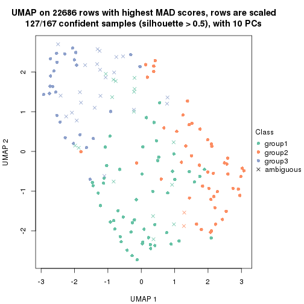</p>

</div>
<div id='tab-MAD-kmeans-dimension-reduction-3'>
<pre><code class="r">dimension_reduction(res, k = 4, method = &quot;UMAP&quot;)
</code></pre>

<p></p>

</div>
<div id='tab-MAD-kmeans-dimension-reduction-4'>
<pre><code class="r">dimension_reduction(res, k = 5, method = &quot;UMAP&quot;)
</code></pre>

<p></p>

</div>
<div id='tab-MAD-kmeans-dimension-reduction-5'>
<pre><code class="r">dimension_reduction(res, k = 6, method = &quot;UMAP&quot;)
</code></pre>

<p></p>

</div>
</div>


Following heatmap shows how subgroups are split when increasing `k`:

```r
collect_classes(res)
```


Test correlation between subgroups and known annotations. If the known
annotation is numeric, one-way ANOVA test is applied, and if the known
annotation is discrete, chi-squared contingency table test is applied.

```r
test_to_known_factors(res)
```

```
#>              n specimen(p) k
#> MAD:kmeans 142      0.0504 2
#> MAD:kmeans 127      0.0360 3
#> MAD:kmeans 135      0.0169 4
#> MAD:kmeans  86      0.2674 5
#> MAD:kmeans  90      0.4595 6
```


If matrix rows can be associated to genes, consider to use `GO_Enrichment(res,
...)` to perform function enrichment for the signature genes.


 

---------------------------------------------------


### MAD:skmeans


The object with results only for a single top-value method and a single partition method 
can be extracted as:

```r
res = res_list["MAD", "skmeans"]
# you can also extract it by
# res = res_list["MAD:skmeans"]
```

A summary of `res` and all the functions that can be applied to it:

```r
res
```

```
#> A 'ConsensusPartition' object with k = 2, 3, 4, 5, 6.
#>   On a matrix with 22686 rows and 167 columns.
#>   Top rows (1000, 2000, 3000, 4000, 5000) are extracted by 'MAD' method.
#>   Subgroups are detected by 'skmeans' method.
#>   Performed in total 1250 partitions by row resampling.
#>   Best k for subgroups seems to be 3.
#> 
#> Following methods can be applied to this 'ConsensusPartition' object:
#>  [1] "cola_report"             "collect_classes"         "collect_plots"          
#>  [4] "collect_stats"           "colnames"                "compare_signatures"     
#>  [7] "consensus_heatmap"       "dimension_reduction"     "functional_enrichment"  
#> [10] "get_anno_col"            "get_anno"                "get_classes"            
#> [13] "get_consensus"           "get_matrix"              "get_membership"         
#> [16] "get_param"               "get_signatures"          "get_stats"              
#> [19] "is_best_k"               "is_stable_k"             "membership_heatmap"     
#> [22] "ncol"                    "nrow"                    "plot_ecdf"              
#> [25] "rownames"                "select_partition_number" "show"                   
#> [28] "suggest_best_k"          "test_to_known_factors"
```

`collect_plots()` function collects all the plots made from `res` for all `k` (number of partitions)
into one single page to provide an easy and fast comparison between different `k`.

```r
collect_plots(res)
```


The plots are:

- The first row: a plot of the ECDF (Empirical cumulative distribution
  function) curves of the consensus matrix for each `k` and the heatmap of
  predicted classes for each `k`.
- The second row: heatmaps of the consensus matrix for each `k`.
- The third row: heatmaps of the membership matrix for each `k`.
- The fouth row: heatmaps of the signatures for each `k`.

All the plots in panels can be made by individual functions and they are
plotted later in this section.

`select_partition_number()` produces several plots showing different
statistics for choosing "optimized" `k`. There are following statistics:

- ECDF curves of the consensus matrix for each `k`;
- 1-PAC. [The PAC
  score](https://en.wikipedia.org/wiki/Consensus_clustering#Over-interpretation_potential_of_consensus_clustering)
  measures the proportion of the ambiguous subgrouping.
- Mean silhouette score.
- Concordance. The mean probability of fiting the consensus class ids in all
  partitions.
- Area increased. Denote $A_k$ as the area under the ECDF curve for current
  `k`, the area increased is defined as $A_k - A_{k-1}$.
- Rand index. The percent of pairs of samples that are both in a same cluster
  or both are not in a same cluster in the partition of k and k-1.
- Jaccard index. The ratio of pairs of samples are both in a same cluster in
  the partition of k and k-1 and the pairs of samples are both in a same
  cluster in the partition k or k-1.

The detailed explanations of these statistics can be found in [the cola
vignette](http://bioconductor.org/packages/devel/bioc/vignettes/cola/inst/doc/cola.html#toc_13).

Generally speaking, lower PAC score, higher mean silhouette score or higher
concordance corresponds to better partition. Rand index and Jaccard index
measure how similar the current partition is compared to partition with `k-1`.
If they are too similar, we won't accept `k` is better than `k-1`.

```r
select_partition_number(res)
```


The numeric values for all these statistics can be obtained by `get_stats()`.

```r
get_stats(res)
```

```
#>   k 1-PAC mean_silhouette concordance area_increased  Rand Jaccard
#> 2 2 0.504           0.709       0.835         0.5002 0.498   0.498
#> 3 3 0.592           0.784       0.851         0.3146 0.697   0.464
#> 4 4 0.603           0.722       0.815         0.1289 0.848   0.586
#> 5 5 0.612           0.471       0.699         0.0712 0.925   0.723
#> 6 6 0.667           0.589       0.737         0.0440 0.890   0.564
```

`suggest_best_k()` suggests the best $k$ based on these statistics. The rules are as follows:

- All $k$ with Jaccard index larger than 0.95 are removed because the increase of
  the partition number does not provides enough extra information. If all $k$ are removed,
  the best $k$ is assigned by `NA`.
- For $k$ with 1-PAC larger than 0.9, the maximal $k$ is taken as the "best k". Other $k$ is called "optional k".
- If it does not fit the second rule. The $k$ with the highest vote of highest
  1-PAC, mean silhouette and concordance is taken as the "best k".

```r
suggest_best_k(res)
```

```
#> [1] 3
```


Following shows the table of the partitions (You need to click the **show/hide
code output** link to see it). The membership matrix (columns with name `p*`)
is inferred by
[`clue::cl_consensus()`](https://www.rdocumentation.org/link/cl_consensus?package=clue)
function with the `SE` method. Basically the value in the membership matrix
represents the probability to belong to a certain group. The finall class
label for an item is determined with the group with highest probability it
belongs to.

In `get_classes()` function, the entropy is calculated from the membership
matrix and the silhouette score is calculated from the consensus matrix.


<script>
$( function() {
	$( '#tabs-MAD-skmeans-get-classes' ).tabs();
} );
</script>
<div id='tabs-MAD-skmeans-get-classes'>
<ul>
<li><a href='#tab-MAD-skmeans-get-classes-1'>k = 2</a></li>
<li><a href='#tab-MAD-skmeans-get-classes-2'>k = 3</a></li>
<li><a href='#tab-MAD-skmeans-get-classes-3'>k = 4</a></li>
<li><a href='#tab-MAD-skmeans-get-classes-4'>k = 5</a></li>
<li><a href='#tab-MAD-skmeans-get-classes-5'>k = 6</a></li>
</ul>

<div id='tab-MAD-skmeans-get-classes-1'>
<p><a id='tab-MAD-skmeans-get-classes-1-a' style='color:#0366d6' href='#'>show/hide code output</a></p>
<pre><code class="r">cbind(get_classes(res, k = 2), get_membership(res, k = 2))
</code></pre>

<pre><code>#&gt;          class entropy silhouette    p1    p2
#&gt; GSM30006     2  0.9710      0.737 0.400 0.600
#&gt; GSM30007     1  0.9710      0.798 0.600 0.400
#&gt; GSM30008     1  0.9710      0.798 0.600 0.400
#&gt; GSM30009     1  0.9710      0.798 0.600 0.400
#&gt; GSM30010     1  0.0376      0.576 0.996 0.004
#&gt; GSM30011     2  0.9710      0.737 0.400 0.600
#&gt; GSM30012     2  0.9710      0.737 0.400 0.600
#&gt; GSM30013     2  0.9710      0.737 0.400 0.600
#&gt; GSM30014     1  0.0000      0.580 1.000 0.000
#&gt; GSM30015     1  0.9710      0.798 0.600 0.400
#&gt; GSM30016     1  0.0000      0.580 1.000 0.000
#&gt; GSM30017     1  0.9710      0.798 0.600 0.400
#&gt; GSM30018     2  0.0000      0.654 0.000 1.000
#&gt; GSM30019     2  0.9710      0.737 0.400 0.600
#&gt; GSM30020     1  0.9710      0.798 0.600 0.400
#&gt; GSM30021     1  0.0000      0.580 1.000 0.000
#&gt; GSM30022     1  0.9710      0.798 0.600 0.400
#&gt; GSM30023     2  0.0000      0.654 0.000 1.000
#&gt; GSM30024     1  0.0000      0.580 1.000 0.000
#&gt; GSM30025     1  0.9710      0.798 0.600 0.400
#&gt; GSM30026     1  0.9710      0.798 0.600 0.400
#&gt; GSM30027     1  0.9710      0.798 0.600 0.400
#&gt; GSM30028     1  0.9710      0.798 0.600 0.400
#&gt; GSM30029     1  0.9710      0.798 0.600 0.400
#&gt; GSM30030     1  0.9710      0.798 0.600 0.400
#&gt; GSM30031     1  0.9710      0.798 0.600 0.400
#&gt; GSM30032     1  0.9710      0.798 0.600 0.400
#&gt; GSM30033     1  0.0000      0.580 1.000 0.000
#&gt; GSM30034     2  0.0000      0.654 0.000 1.000
#&gt; GSM30035     1  0.0000      0.580 1.000 0.000
#&gt; GSM30036     2  0.1633      0.659 0.024 0.976
#&gt; GSM30037     1  0.9710      0.798 0.600 0.400
#&gt; GSM30038     1  0.0000      0.580 1.000 0.000
#&gt; GSM30039     2  0.9710      0.737 0.400 0.600
#&gt; GSM30040     1  0.0376      0.576 0.996 0.004
#&gt; GSM30041     2  0.9710      0.737 0.400 0.600
#&gt; GSM30042     2  0.9710      0.737 0.400 0.600
#&gt; GSM30043     1  0.0000      0.580 1.000 0.000
#&gt; GSM30044     1  0.9710      0.798 0.600 0.400
#&gt; GSM30045     1  0.9710      0.798 0.600 0.400
#&gt; GSM30046     2  0.0000      0.654 0.000 1.000
#&gt; GSM30047     2  0.0000      0.654 0.000 1.000
#&gt; GSM30048     2  0.0000      0.654 0.000 1.000
#&gt; GSM30049     2  0.9710      0.737 0.400 0.600
#&gt; GSM30050     2  0.9710      0.737 0.400 0.600
#&gt; GSM30051     2  0.9710      0.737 0.400 0.600
#&gt; GSM30052     1  0.9710      0.798 0.600 0.400
#&gt; GSM30053     2  0.9710      0.737 0.400 0.600
#&gt; GSM30054     2  0.9710      0.737 0.400 0.600
#&gt; GSM30055     2  0.9710      0.737 0.400 0.600
#&gt; GSM30056     2  0.9710      0.737 0.400 0.600
#&gt; GSM30057     1  0.0376      0.576 0.996 0.004
#&gt; GSM30058     2  0.9710      0.737 0.400 0.600
#&gt; GSM30059     2  0.0000      0.654 0.000 1.000
#&gt; GSM30060     1  0.0000      0.580 1.000 0.000
#&gt; GSM30061     2  0.0000      0.654 0.000 1.000
#&gt; GSM30062     2  0.0000      0.654 0.000 1.000
#&gt; GSM30063     2  0.9710      0.737 0.400 0.600
#&gt; GSM30064     1  0.9710      0.798 0.600 0.400
#&gt; GSM30065     2  0.9710      0.737 0.400 0.600
#&gt; GSM30066     1  0.0000      0.580 1.000 0.000
#&gt; GSM30067     1  0.9710      0.798 0.600 0.400
#&gt; GSM30068     1  0.0000      0.580 1.000 0.000
#&gt; GSM30069     1  0.0000      0.580 1.000 0.000
#&gt; GSM30070     2  0.9732      0.734 0.404 0.596
#&gt; GSM30071     2  0.9710      0.737 0.400 0.600
#&gt; GSM30072     1  0.9710      0.798 0.600 0.400
#&gt; GSM30073     2  0.9710      0.737 0.400 0.600
#&gt; GSM30074     1  0.0000      0.580 1.000 0.000
#&gt; GSM30075     2  0.9710      0.737 0.400 0.600
#&gt; GSM30076     2  0.0000      0.654 0.000 1.000
#&gt; GSM30077     2  0.0000      0.654 0.000 1.000
#&gt; GSM30078     2  0.0000      0.654 0.000 1.000
#&gt; GSM30079     1  0.9710      0.798 0.600 0.400
#&gt; GSM30080     2  0.9710      0.737 0.400 0.600
#&gt; GSM30081     2  0.9710      0.737 0.400 0.600
#&gt; GSM30086     2  0.9710      0.737 0.400 0.600
#&gt; GSM30087     2  0.0000      0.654 0.000 1.000
#&gt; GSM30088     2  0.0000      0.654 0.000 1.000
#&gt; GSM30089     1  0.9710      0.798 0.600 0.400
#&gt; GSM30090     2  0.9710      0.737 0.400 0.600
#&gt; GSM30091     2  0.9710      0.737 0.400 0.600
#&gt; GSM30092     2  0.0000      0.654 0.000 1.000
#&gt; GSM30093     2  0.9710      0.737 0.400 0.600
#&gt; GSM30094     2  0.9710      0.737 0.400 0.600
#&gt; GSM30095     1  0.0376      0.576 0.996 0.004
#&gt; GSM30096     1  0.9710      0.798 0.600 0.400
#&gt; GSM30097     2  0.0000      0.654 0.000 1.000
#&gt; GSM30098     1  0.9710      0.798 0.600 0.400
#&gt; GSM30099     2  0.9710      0.737 0.400 0.600
#&gt; GSM30100     1  0.0000      0.580 1.000 0.000
#&gt; GSM30101     2  0.9710      0.737 0.400 0.600
#&gt; GSM30102     2  0.9710      0.737 0.400 0.600
#&gt; GSM30103     1  0.9710      0.798 0.600 0.400
#&gt; GSM30104     2  0.6801      0.689 0.180 0.820
#&gt; GSM30105     1  0.9710      0.798 0.600 0.400
#&gt; GSM30106     2  0.0000      0.654 0.000 1.000
#&gt; GSM30107     2  0.0000      0.654 0.000 1.000
#&gt; GSM30108     1  0.0000      0.580 1.000 0.000
#&gt; GSM30109     1  0.9710      0.798 0.600 0.400
#&gt; GSM30110     2  0.0000      0.654 0.000 1.000
#&gt; GSM30111     1  0.9710      0.798 0.600 0.400
#&gt; GSM30112     1  0.9710      0.798 0.600 0.400
#&gt; GSM30113     1  0.0376      0.576 0.996 0.004
#&gt; GSM30114     2  0.9710      0.737 0.400 0.600
#&gt; GSM30115     2  0.2603      0.663 0.044 0.956
#&gt; GSM30116     1  0.0000      0.580 1.000 0.000
#&gt; GSM30117     1  0.0000      0.580 1.000 0.000
#&gt; GSM30118     1  0.0000      0.580 1.000 0.000
#&gt; GSM30119     2  0.9710      0.737 0.400 0.600
#&gt; GSM30120     2  0.9775      0.726 0.412 0.588
#&gt; GSM30121     1  0.9710      0.798 0.600 0.400
#&gt; GSM30122     1  0.9710      0.798 0.600 0.400
#&gt; GSM30123     2  0.9710      0.737 0.400 0.600
#&gt; GSM30177     2  0.9710      0.737 0.400 0.600
#&gt; GSM30178     2  0.0000      0.654 0.000 1.000
#&gt; GSM30179     1  0.9710      0.798 0.600 0.400
#&gt; GSM30180     1  0.9710      0.798 0.600 0.400
#&gt; GSM30181     2  0.9710      0.737 0.400 0.600
#&gt; GSM30182     2  0.0000      0.654 0.000 1.000
#&gt; GSM30183     1  0.9710      0.798 0.600 0.400
#&gt; GSM30184     2  0.9710      0.737 0.400 0.600
#&gt; GSM30185     1  0.9710      0.798 0.600 0.400
#&gt; GSM30186     1  0.1184      0.559 0.984 0.016
#&gt; GSM30187     2  0.0000      0.654 0.000 1.000
#&gt; GSM30188     2  0.0000      0.654 0.000 1.000
#&gt; GSM30189     2  0.0376      0.649 0.004 0.996
#&gt; GSM30190     2  0.9710      0.737 0.400 0.600
#&gt; GSM30191     2  0.9710      0.737 0.400 0.600
#&gt; GSM30192     2  0.9710      0.737 0.400 0.600
#&gt; GSM30193     2  0.0000      0.654 0.000 1.000
#&gt; GSM30194     2  0.9710      0.737 0.400 0.600
#&gt; GSM30195     1  0.0000      0.580 1.000 0.000
#&gt; GSM30196     1  0.9710      0.798 0.600 0.400
#&gt; GSM30197     2  0.0000      0.654 0.000 1.000
#&gt; GSM30198     2  0.0672      0.643 0.008 0.992
#&gt; GSM30199     1  0.7139      0.683 0.804 0.196
#&gt; GSM30200     2  0.0376      0.649 0.004 0.996
#&gt; GSM30201     2  0.0000      0.654 0.000 1.000
#&gt; GSM30202     1  0.9710      0.798 0.600 0.400
#&gt; GSM30203     2  0.0000      0.654 0.000 1.000
#&gt; GSM30204     2  0.1843      0.614 0.028 0.972
#&gt; GSM30205     1  0.0000      0.580 1.000 0.000
#&gt; GSM30206     2  0.0000      0.654 0.000 1.000
#&gt; GSM30207     2  0.0376      0.649 0.004 0.996
#&gt; GSM30208     2  0.0376      0.649 0.004 0.996
#&gt; GSM30209     2  0.9710      0.737 0.400 0.600
#&gt; GSM30210     1  0.9710      0.798 0.600 0.400
#&gt; GSM30211     2  0.0000      0.654 0.000 1.000
#&gt; GSM30212     1  0.9710      0.798 0.600 0.400
#&gt; GSM30213     1  0.9710      0.798 0.600 0.400
#&gt; GSM30214     1  0.9710      0.798 0.600 0.400
#&gt; GSM30215     1  0.9710      0.798 0.600 0.400
#&gt; GSM30216     1  0.9710      0.798 0.600 0.400
#&gt; GSM30217     1  0.9710      0.798 0.600 0.400
#&gt; GSM30218     2  0.4815      0.674 0.104 0.896
#&gt; GSM30219     1  0.0000      0.580 1.000 0.000
#&gt; GSM30220     1  0.9710      0.798 0.600 0.400
#&gt; GSM30221     2  0.0000      0.654 0.000 1.000
#&gt; GSM30222     2  0.0000      0.654 0.000 1.000
#&gt; GSM30223     1  0.9710      0.798 0.600 0.400
#&gt; GSM30224     2  0.0000      0.654 0.000 1.000
#&gt; GSM30225     1  0.9710      0.798 0.600 0.400
#&gt; GSM30226     1  0.9710      0.798 0.600 0.400
#&gt; GSM30227     1  0.9710      0.798 0.600 0.400
#&gt; GSM30228     2  0.9710      0.737 0.400 0.600
#&gt; GSM30229     2  0.9710      0.737 0.400 0.600
</code></pre>

<script>
$('#tab-MAD-skmeans-get-classes-1-a').parent().next().next().hide();
$('#tab-MAD-skmeans-get-classes-1-a').click(function(){
  $('#tab-MAD-skmeans-get-classes-1-a').parent().next().next().toggle();
  return(false);
});
</script>
</div>

<div id='tab-MAD-skmeans-get-classes-2'>
<p><a id='tab-MAD-skmeans-get-classes-2-a' style='color:#0366d6' href='#'>show/hide code output</a></p>
<pre><code class="r">cbind(get_classes(res, k = 3), get_membership(res, k = 3))
</code></pre>

<pre><code>#&gt;          class entropy silhouette    p1    p2    p3
#&gt; GSM30006     3  0.1753     0.7776 0.048 0.000 0.952
#&gt; GSM30007     2  0.0237     0.9019 0.000 0.996 0.004
#&gt; GSM30008     2  0.3879     0.8380 0.152 0.848 0.000
#&gt; GSM30009     2  0.1753     0.8888 0.048 0.952 0.000
#&gt; GSM30010     3  0.4172     0.7170 0.004 0.156 0.840
#&gt; GSM30011     3  0.1753     0.7776 0.048 0.000 0.952
#&gt; GSM30012     3  0.1860     0.7766 0.052 0.000 0.948
#&gt; GSM30013     3  0.3412     0.6967 0.124 0.000 0.876
#&gt; GSM30014     3  0.6126     0.5337 0.004 0.352 0.644
#&gt; GSM30015     2  0.7027     0.5510 0.296 0.660 0.044
#&gt; GSM30016     3  0.7310     0.5230 0.040 0.360 0.600
#&gt; GSM30017     1  0.3192     0.6936 0.888 0.112 0.000
#&gt; GSM30018     1  0.4110     0.9204 0.844 0.004 0.152
#&gt; GSM30019     3  0.1860     0.7766 0.052 0.000 0.948
#&gt; GSM30020     2  0.3879     0.8380 0.152 0.848 0.000
#&gt; GSM30021     3  0.6126     0.5337 0.004 0.352 0.644
#&gt; GSM30022     2  0.0000     0.9023 0.000 1.000 0.000
#&gt; GSM30023     1  0.0000     0.8028 1.000 0.000 0.000
#&gt; GSM30024     3  0.6309     0.2773 0.000 0.500 0.500
#&gt; GSM30025     2  0.3879     0.8380 0.152 0.848 0.000
#&gt; GSM30026     1  0.2173     0.7525 0.944 0.048 0.008
#&gt; GSM30027     2  0.4110     0.8367 0.152 0.844 0.004
#&gt; GSM30028     2  0.3879     0.8380 0.152 0.848 0.000
#&gt; GSM30029     2  0.3879     0.8380 0.152 0.848 0.000
#&gt; GSM30030     2  0.0000     0.9023 0.000 1.000 0.000
#&gt; GSM30031     2  0.3879     0.8380 0.152 0.848 0.000
#&gt; GSM30032     2  0.4110     0.8367 0.152 0.844 0.004
#&gt; GSM30033     3  0.9118     0.3261 0.152 0.352 0.496
#&gt; GSM30034     1  0.4172     0.9199 0.840 0.004 0.156
#&gt; GSM30035     2  0.1753     0.8901 0.000 0.952 0.048
#&gt; GSM30036     1  0.5591     0.7853 0.696 0.000 0.304
#&gt; GSM30037     2  0.0000     0.9023 0.000 1.000 0.000
#&gt; GSM30038     3  0.6330     0.5141 0.004 0.396 0.600
#&gt; GSM30039     3  0.1860     0.7766 0.052 0.000 0.948
#&gt; GSM30040     3  0.4602     0.7220 0.016 0.152 0.832
#&gt; GSM30041     3  0.1753     0.7776 0.048 0.000 0.952
#&gt; GSM30042     3  0.1964     0.7755 0.056 0.000 0.944
#&gt; GSM30043     3  0.5873     0.5845 0.004 0.312 0.684
#&gt; GSM30044     2  0.0237     0.9019 0.000 0.996 0.004
#&gt; GSM30045     2  0.0237     0.9019 0.000 0.996 0.004
#&gt; GSM30046     1  0.4172     0.9199 0.840 0.004 0.156
#&gt; GSM30047     1  0.3941     0.9194 0.844 0.000 0.156
#&gt; GSM30048     1  0.4110     0.9204 0.844 0.004 0.152
#&gt; GSM30049     3  0.1753     0.7776 0.048 0.000 0.952
#&gt; GSM30050     1  0.5968     0.7024 0.636 0.000 0.364
#&gt; GSM30051     3  0.1753     0.7776 0.048 0.000 0.952
#&gt; GSM30052     2  0.0000     0.9023 0.000 1.000 0.000
#&gt; GSM30053     3  0.1860     0.7766 0.052 0.000 0.948
#&gt; GSM30054     3  0.1753     0.7776 0.048 0.000 0.952
#&gt; GSM30055     3  0.6483     0.5528 0.392 0.008 0.600
#&gt; GSM30056     3  0.1753     0.7776 0.048 0.000 0.952
#&gt; GSM30057     3  0.4172     0.7170 0.004 0.156 0.840
#&gt; GSM30058     3  0.1753     0.7776 0.048 0.000 0.952
#&gt; GSM30059     1  0.4110     0.9204 0.844 0.004 0.152
#&gt; GSM30060     2  0.5760     0.3521 0.000 0.672 0.328
#&gt; GSM30061     1  0.4110     0.9204 0.844 0.004 0.152
#&gt; GSM30062     1  0.4110     0.9204 0.844 0.004 0.152
#&gt; GSM30063     3  0.5497     0.3544 0.292 0.000 0.708
#&gt; GSM30064     2  0.3918     0.8449 0.140 0.856 0.004
#&gt; GSM30065     3  0.1753     0.7776 0.048 0.000 0.952
#&gt; GSM30066     3  0.6126     0.5337 0.004 0.352 0.644
#&gt; GSM30067     2  0.1031     0.8985 0.000 0.976 0.024
#&gt; GSM30068     3  0.6126     0.5337 0.004 0.352 0.644
#&gt; GSM30069     3  0.6209     0.5252 0.004 0.368 0.628
#&gt; GSM30070     3  0.1989     0.7769 0.048 0.004 0.948
#&gt; GSM30071     3  0.3752     0.7511 0.144 0.000 0.856
#&gt; GSM30072     2  0.0237     0.9019 0.000 0.996 0.004
#&gt; GSM30073     1  0.5905     0.7158 0.648 0.000 0.352
#&gt; GSM30074     3  0.8536     0.5295 0.144 0.260 0.596
#&gt; GSM30075     1  0.5650     0.7439 0.688 0.000 0.312
#&gt; GSM30076     1  0.4110     0.9204 0.844 0.004 0.152
#&gt; GSM30077     1  0.4110     0.9204 0.844 0.004 0.152
#&gt; GSM30078     1  0.4110     0.9204 0.844 0.004 0.152
#&gt; GSM30079     2  0.0000     0.9023 0.000 1.000 0.000
#&gt; GSM30080     1  0.5733     0.7237 0.676 0.000 0.324
#&gt; GSM30081     3  0.1753     0.7776 0.048 0.000 0.952
#&gt; GSM30086     1  0.5431     0.7857 0.716 0.000 0.284
#&gt; GSM30087     1  0.4110     0.9204 0.844 0.004 0.152
#&gt; GSM30088     1  0.4110     0.9204 0.844 0.004 0.152
#&gt; GSM30089     2  0.1878     0.8915 0.044 0.952 0.004
#&gt; GSM30090     3  0.1753     0.7776 0.048 0.000 0.952
#&gt; GSM30091     3  0.1753     0.7776 0.048 0.000 0.952
#&gt; GSM30092     1  0.4002     0.9184 0.840 0.000 0.160
#&gt; GSM30093     3  0.1753     0.7776 0.048 0.000 0.952
#&gt; GSM30094     3  0.1753     0.7776 0.048 0.000 0.952
#&gt; GSM30095     3  0.4531     0.7201 0.008 0.168 0.824
#&gt; GSM30096     2  0.1643     0.8911 0.000 0.956 0.044
#&gt; GSM30097     1  0.4172     0.9199 0.840 0.004 0.156
#&gt; GSM30098     2  0.1031     0.8985 0.000 0.976 0.024
#&gt; GSM30099     3  0.2165     0.7753 0.064 0.000 0.936
#&gt; GSM30100     3  0.6330     0.5141 0.004 0.396 0.600
#&gt; GSM30101     3  0.1753     0.7776 0.048 0.000 0.952
#&gt; GSM30102     3  0.1753     0.7776 0.048 0.000 0.952
#&gt; GSM30103     2  0.1031     0.8991 0.000 0.976 0.024
#&gt; GSM30104     1  0.3941     0.9194 0.844 0.000 0.156
#&gt; GSM30105     2  0.0424     0.9016 0.008 0.992 0.000
#&gt; GSM30106     1  0.3879     0.9194 0.848 0.000 0.152
#&gt; GSM30107     1  0.3879     0.9194 0.848 0.000 0.152
#&gt; GSM30108     2  0.0475     0.9007 0.004 0.992 0.004
#&gt; GSM30109     2  0.0592     0.9012 0.000 0.988 0.012
#&gt; GSM30110     1  0.6189     0.7459 0.632 0.004 0.364
#&gt; GSM30111     2  0.6359     0.4277 0.404 0.592 0.004
#&gt; GSM30112     2  0.1399     0.8967 0.004 0.968 0.028
#&gt; GSM30113     3  0.4172     0.7170 0.004 0.156 0.840
#&gt; GSM30114     3  0.1860     0.7766 0.052 0.000 0.948
#&gt; GSM30115     1  0.5733     0.7548 0.676 0.000 0.324
#&gt; GSM30116     3  0.6286     0.2952 0.000 0.464 0.536
#&gt; GSM30117     2  0.1753     0.8901 0.000 0.952 0.048
#&gt; GSM30118     3  0.6126     0.5337 0.004 0.352 0.644
#&gt; GSM30119     3  0.1753     0.7771 0.048 0.000 0.952
#&gt; GSM30120     1  0.6948     0.5086 0.512 0.016 0.472
#&gt; GSM30121     2  0.1163     0.8973 0.000 0.972 0.028
#&gt; GSM30122     2  0.1411     0.8948 0.000 0.964 0.036
#&gt; GSM30123     3  0.5216     0.4580 0.260 0.000 0.740
#&gt; GSM30177     3  0.4887     0.5275 0.228 0.000 0.772
#&gt; GSM30178     1  0.4002     0.9184 0.840 0.000 0.160
#&gt; GSM30179     2  0.3941     0.8352 0.156 0.844 0.000
#&gt; GSM30180     2  0.1643     0.8911 0.000 0.956 0.044
#&gt; GSM30181     1  0.3879     0.9194 0.848 0.000 0.152
#&gt; GSM30182     1  0.4172     0.9199 0.840 0.004 0.156
#&gt; GSM30183     2  0.1643     0.8911 0.000 0.956 0.044
#&gt; GSM30184     3  0.1753     0.7776 0.048 0.000 0.952
#&gt; GSM30185     2  0.1753     0.8901 0.000 0.952 0.048
#&gt; GSM30186     3  0.5254     0.6316 0.000 0.264 0.736
#&gt; GSM30187     1  0.4172     0.9199 0.840 0.004 0.156
#&gt; GSM30188     1  0.4172     0.9199 0.840 0.004 0.156
#&gt; GSM30189     1  0.4755     0.8999 0.808 0.008 0.184
#&gt; GSM30190     3  0.1753     0.7776 0.048 0.000 0.952
#&gt; GSM30191     1  0.5098     0.8477 0.752 0.000 0.248
#&gt; GSM30192     1  0.4121     0.9101 0.832 0.000 0.168
#&gt; GSM30193     1  0.3879     0.9194 0.848 0.000 0.152
#&gt; GSM30194     3  0.0592     0.7717 0.012 0.000 0.988
#&gt; GSM30195     3  0.6298     0.5173 0.004 0.388 0.608
#&gt; GSM30196     2  0.0237     0.9019 0.000 0.996 0.004
#&gt; GSM30197     1  0.4110     0.9204 0.844 0.004 0.152
#&gt; GSM30198     1  0.0592     0.7955 0.988 0.012 0.000
#&gt; GSM30199     2  0.1753     0.8901 0.000 0.952 0.048
#&gt; GSM30200     1  0.0237     0.8026 0.996 0.004 0.000
#&gt; GSM30201     1  0.4110     0.9204 0.844 0.004 0.152
#&gt; GSM30202     2  0.1878     0.8901 0.004 0.952 0.044
#&gt; GSM30203     1  0.4172     0.9199 0.840 0.004 0.156
#&gt; GSM30204     1  0.1643     0.7625 0.956 0.044 0.000
#&gt; GSM30205     3  0.8392     0.5431 0.148 0.236 0.616
#&gt; GSM30206     1  0.4110     0.9204 0.844 0.004 0.152
#&gt; GSM30207     1  0.0747     0.7919 0.984 0.016 0.000
#&gt; GSM30208     1  0.0592     0.7956 0.988 0.012 0.000
#&gt; GSM30209     3  0.5207     0.7161 0.052 0.124 0.824
#&gt; GSM30210     2  0.3879     0.8380 0.152 0.848 0.000
#&gt; GSM30211     1  0.4110     0.9204 0.844 0.004 0.152
#&gt; GSM30212     2  0.0000     0.9023 0.000 1.000 0.000
#&gt; GSM30213     2  0.0000     0.9023 0.000 1.000 0.000
#&gt; GSM30214     2  0.1289     0.8946 0.032 0.968 0.000
#&gt; GSM30215     2  0.3619     0.8468 0.136 0.864 0.000
#&gt; GSM30216     2  0.1031     0.8985 0.000 0.976 0.024
#&gt; GSM30217     2  0.3879     0.8380 0.152 0.848 0.000
#&gt; GSM30218     1  0.4605     0.8962 0.796 0.000 0.204
#&gt; GSM30219     3  0.5905     0.5338 0.000 0.352 0.648
#&gt; GSM30220     2  0.0000     0.9023 0.000 1.000 0.000
#&gt; GSM30221     1  0.4172     0.9199 0.840 0.004 0.156
#&gt; GSM30222     1  0.3879     0.9194 0.848 0.000 0.152
#&gt; GSM30223     2  0.0237     0.9019 0.000 0.996 0.004
#&gt; GSM30224     1  0.4110     0.9204 0.844 0.004 0.152
#&gt; GSM30225     2  0.7674     0.0636 0.476 0.480 0.044
#&gt; GSM30226     2  0.1753     0.8901 0.000 0.952 0.048
#&gt; GSM30227     2  0.6546     0.6382 0.240 0.716 0.044
#&gt; GSM30228     3  0.1753     0.7776 0.048 0.000 0.952
#&gt; GSM30229     1  0.3941     0.9194 0.844 0.000 0.156
</code></pre>

<script>
$('#tab-MAD-skmeans-get-classes-2-a').parent().next().next().hide();
$('#tab-MAD-skmeans-get-classes-2-a').click(function(){
  $('#tab-MAD-skmeans-get-classes-2-a').parent().next().next().toggle();
  return(false);
});
</script>
</div>

<div id='tab-MAD-skmeans-get-classes-3'>
<p><a id='tab-MAD-skmeans-get-classes-3-a' style='color:#0366d6' href='#'>show/hide code output</a></p>
<pre><code class="r">cbind(get_classes(res, k = 4), get_membership(res, k = 4))
</code></pre>

<pre><code>#&gt;          class entropy silhouette    p1    p2    p3    p4
#&gt; GSM30006     2  0.0000     0.8107 0.000 1.000 0.000 0.000
#&gt; GSM30007     1  0.1389     0.8539 0.952 0.000 0.048 0.000
#&gt; GSM30008     1  0.3052     0.8262 0.860 0.000 0.004 0.136
#&gt; GSM30009     1  0.0000     0.8597 1.000 0.000 0.000 0.000
#&gt; GSM30010     3  0.0188     0.7084 0.004 0.000 0.996 0.000
#&gt; GSM30011     2  0.0000     0.8107 0.000 1.000 0.000 0.000
#&gt; GSM30012     3  0.4898     0.4957 0.000 0.416 0.584 0.000
#&gt; GSM30013     3  0.5398     0.5022 0.000 0.404 0.580 0.016
#&gt; GSM30014     3  0.0376     0.7077 0.004 0.004 0.992 0.000
#&gt; GSM30015     1  0.7892     0.1919 0.368 0.000 0.292 0.340
#&gt; GSM30016     3  0.3610     0.6737 0.200 0.000 0.800 0.000
#&gt; GSM30017     4  0.2654     0.6941 0.108 0.000 0.004 0.888
#&gt; GSM30018     4  0.3024     0.8688 0.000 0.148 0.000 0.852
#&gt; GSM30019     3  0.4961     0.4408 0.000 0.448 0.552 0.000
#&gt; GSM30020     1  0.3052     0.8262 0.860 0.000 0.004 0.136
#&gt; GSM30021     3  0.0524     0.7087 0.008 0.004 0.988 0.000
#&gt; GSM30022     1  0.0592     0.8602 0.984 0.000 0.016 0.000
#&gt; GSM30023     4  0.2222     0.7372 0.016 0.000 0.060 0.924
#&gt; GSM30024     1  0.7593     0.1748 0.472 0.300 0.228 0.000
#&gt; GSM30025     1  0.1109     0.8576 0.968 0.000 0.004 0.028
#&gt; GSM30026     4  0.1489     0.7479 0.044 0.000 0.004 0.952
#&gt; GSM30027     1  0.4696     0.7909 0.796 0.064 0.004 0.136
#&gt; GSM30028     1  0.3196     0.8261 0.856 0.000 0.008 0.136
#&gt; GSM30029     1  0.3052     0.8262 0.860 0.000 0.004 0.136
#&gt; GSM30030     1  0.0188     0.8603 0.996 0.000 0.004 0.000
#&gt; GSM30031     1  0.3052     0.8262 0.860 0.000 0.004 0.136
#&gt; GSM30032     1  0.4038     0.8123 0.828 0.032 0.004 0.136
#&gt; GSM30033     2  0.6854     0.4523 0.260 0.600 0.004 0.136
#&gt; GSM30034     4  0.4040     0.8117 0.000 0.248 0.000 0.752
#&gt; GSM30035     2  0.7036     0.4580 0.216 0.576 0.208 0.000
#&gt; GSM30036     2  0.4697     0.1376 0.000 0.644 0.000 0.356
#&gt; GSM30037     1  0.0592     0.8602 0.984 0.000 0.016 0.000
#&gt; GSM30038     3  0.3569     0.6763 0.196 0.000 0.804 0.000
#&gt; GSM30039     3  0.4898     0.4957 0.000 0.416 0.584 0.000
#&gt; GSM30040     2  0.5169     0.5708 0.032 0.696 0.272 0.000
#&gt; GSM30041     2  0.0000     0.8107 0.000 1.000 0.000 0.000
#&gt; GSM30042     3  0.6299     0.5646 0.000 0.320 0.600 0.080
#&gt; GSM30043     3  0.2773     0.6172 0.004 0.116 0.880 0.000
#&gt; GSM30044     1  0.1867     0.8465 0.928 0.000 0.072 0.000
#&gt; GSM30045     1  0.2589     0.8208 0.884 0.000 0.116 0.000
#&gt; GSM30046     4  0.3306     0.8673 0.000 0.156 0.004 0.840
#&gt; GSM30047     4  0.3172     0.8628 0.000 0.160 0.000 0.840
#&gt; GSM30048     4  0.2999     0.8689 0.000 0.132 0.004 0.864
#&gt; GSM30049     2  0.0000     0.8107 0.000 1.000 0.000 0.000
#&gt; GSM30050     2  0.1867     0.7553 0.000 0.928 0.000 0.072
#&gt; GSM30051     2  0.0000     0.8107 0.000 1.000 0.000 0.000
#&gt; GSM30052     1  0.0336     0.8604 0.992 0.000 0.008 0.000
#&gt; GSM30053     3  0.4898     0.4957 0.000 0.416 0.584 0.000
#&gt; GSM30054     2  0.0188     0.8091 0.000 0.996 0.000 0.004
#&gt; GSM30055     2  0.5204     0.5103 0.012 0.612 0.000 0.376
#&gt; GSM30056     2  0.0592     0.8047 0.000 0.984 0.000 0.016
#&gt; GSM30057     3  0.0376     0.7077 0.004 0.004 0.992 0.000
#&gt; GSM30058     2  0.0000     0.8107 0.000 1.000 0.000 0.000
#&gt; GSM30059     4  0.2921     0.8699 0.000 0.140 0.000 0.860
#&gt; GSM30060     1  0.7310     0.4188 0.532 0.256 0.212 0.000
#&gt; GSM30061     4  0.2814     0.8695 0.000 0.132 0.000 0.868
#&gt; GSM30062     4  0.2868     0.8696 0.000 0.136 0.000 0.864
#&gt; GSM30063     2  0.7599    -0.2489 0.000 0.424 0.376 0.200
#&gt; GSM30064     1  0.1022     0.8557 0.968 0.000 0.032 0.000
#&gt; GSM30065     2  0.1867     0.7437 0.000 0.928 0.072 0.000
#&gt; GSM30066     3  0.0524     0.7061 0.004 0.008 0.988 0.000
#&gt; GSM30067     1  0.1792     0.8540 0.932 0.000 0.068 0.000
#&gt; GSM30068     3  0.0376     0.7077 0.004 0.004 0.992 0.000
#&gt; GSM30069     3  0.3257     0.6932 0.152 0.004 0.844 0.000
#&gt; GSM30070     3  0.4802     0.7031 0.132 0.016 0.800 0.052
#&gt; GSM30071     3  0.5610     0.6675 0.000 0.104 0.720 0.176
#&gt; GSM30072     1  0.1867     0.8465 0.928 0.000 0.072 0.000
#&gt; GSM30073     4  0.7273     0.3930 0.000 0.400 0.148 0.452
#&gt; GSM30074     3  0.4462     0.6747 0.064 0.000 0.804 0.132
#&gt; GSM30075     3  0.6773     0.5088 0.000 0.136 0.588 0.276
#&gt; GSM30076     4  0.3024     0.8688 0.000 0.148 0.000 0.852
#&gt; GSM30077     4  0.2868     0.8696 0.000 0.136 0.000 0.864
#&gt; GSM30078     4  0.2868     0.8696 0.000 0.136 0.000 0.864
#&gt; GSM30079     1  0.0592     0.8602 0.984 0.000 0.016 0.000
#&gt; GSM30080     3  0.6773     0.5088 0.000 0.136 0.588 0.276
#&gt; GSM30081     2  0.0000     0.8107 0.000 1.000 0.000 0.000
#&gt; GSM30086     3  0.6794     0.5020 0.000 0.136 0.584 0.280
#&gt; GSM30087     4  0.2868     0.8696 0.000 0.136 0.000 0.864
#&gt; GSM30088     4  0.2814     0.8695 0.000 0.132 0.000 0.868
#&gt; GSM30089     1  0.1211     0.8547 0.960 0.000 0.040 0.000
#&gt; GSM30090     2  0.0000     0.8107 0.000 1.000 0.000 0.000
#&gt; GSM30091     2  0.0000     0.8107 0.000 1.000 0.000 0.000
#&gt; GSM30092     4  0.3649     0.8478 0.000 0.204 0.000 0.796
#&gt; GSM30093     2  0.0000     0.8107 0.000 1.000 0.000 0.000
#&gt; GSM30094     2  0.0000     0.8107 0.000 1.000 0.000 0.000
#&gt; GSM30095     2  0.5337     0.5731 0.044 0.696 0.260 0.000
#&gt; GSM30096     1  0.3649     0.7902 0.796 0.000 0.204 0.000
#&gt; GSM30097     4  0.3486     0.8561 0.000 0.188 0.000 0.812
#&gt; GSM30098     1  0.1716     0.8546 0.936 0.000 0.064 0.000
#&gt; GSM30099     2  0.1302     0.7873 0.000 0.956 0.000 0.044
#&gt; GSM30100     3  0.6063     0.5966 0.196 0.124 0.680 0.000
#&gt; GSM30101     2  0.0000     0.8107 0.000 1.000 0.000 0.000
#&gt; GSM30102     2  0.0707     0.8012 0.000 0.980 0.000 0.020
#&gt; GSM30103     1  0.1118     0.8605 0.964 0.000 0.036 0.000
#&gt; GSM30104     4  0.3837     0.8283 0.000 0.224 0.000 0.776
#&gt; GSM30105     1  0.0188     0.8603 0.996 0.000 0.004 0.000
#&gt; GSM30106     4  0.3659     0.8614 0.000 0.136 0.024 0.840
#&gt; GSM30107     4  0.5092     0.7969 0.000 0.140 0.096 0.764
#&gt; GSM30108     1  0.4992     0.1242 0.524 0.000 0.476 0.000
#&gt; GSM30109     1  0.1474     0.8564 0.948 0.000 0.052 0.000
#&gt; GSM30110     4  0.6697     0.5761 0.004 0.144 0.224 0.628
#&gt; GSM30111     3  0.4706     0.6295 0.248 0.000 0.732 0.020
#&gt; GSM30112     1  0.3266     0.7994 0.832 0.000 0.168 0.000
#&gt; GSM30113     3  0.0336     0.7092 0.008 0.000 0.992 0.000
#&gt; GSM30114     3  0.5016     0.5196 0.000 0.396 0.600 0.004
#&gt; GSM30115     4  0.7039     0.5655 0.000 0.316 0.144 0.540
#&gt; GSM30116     2  0.6834     0.4879 0.176 0.600 0.224 0.000
#&gt; GSM30117     2  0.6846     0.4867 0.184 0.600 0.216 0.000
#&gt; GSM30118     3  0.0188     0.7084 0.004 0.000 0.996 0.000
#&gt; GSM30119     3  0.3688     0.6756 0.000 0.208 0.792 0.000
#&gt; GSM30120     3  0.0336     0.7086 0.000 0.008 0.992 0.000
#&gt; GSM30121     1  0.2589     0.8393 0.884 0.000 0.116 0.000
#&gt; GSM30122     1  0.3444     0.8012 0.816 0.000 0.184 0.000
#&gt; GSM30123     2  0.0188     0.8090 0.000 0.996 0.000 0.004
#&gt; GSM30177     2  0.0188     0.8090 0.000 0.996 0.000 0.004
#&gt; GSM30178     4  0.4454     0.7404 0.000 0.308 0.000 0.692
#&gt; GSM30179     1  0.3052     0.8262 0.860 0.000 0.004 0.136
#&gt; GSM30180     1  0.4356     0.7359 0.708 0.000 0.292 0.000
#&gt; GSM30181     3  0.6851     0.5071 0.000 0.148 0.584 0.268
#&gt; GSM30182     4  0.3649     0.8480 0.000 0.204 0.000 0.796
#&gt; GSM30183     1  0.3873     0.7863 0.772 0.000 0.228 0.000
#&gt; GSM30184     2  0.0000     0.8107 0.000 1.000 0.000 0.000
#&gt; GSM30185     1  0.3726     0.7880 0.788 0.000 0.212 0.000
#&gt; GSM30186     2  0.3978     0.6497 0.012 0.796 0.192 0.000
#&gt; GSM30187     4  0.4103     0.8030 0.000 0.256 0.000 0.744
#&gt; GSM30188     4  0.3569     0.8518 0.000 0.196 0.000 0.804
#&gt; GSM30189     4  0.5178     0.7435 0.008 0.084 0.136 0.772
#&gt; GSM30190     2  0.0000     0.8107 0.000 1.000 0.000 0.000
#&gt; GSM30191     2  0.3486     0.6045 0.000 0.812 0.000 0.188
#&gt; GSM30192     3  0.6883     0.5110 0.000 0.156 0.584 0.260
#&gt; GSM30193     4  0.3208     0.8685 0.000 0.148 0.004 0.848
#&gt; GSM30194     3  0.3486     0.6536 0.000 0.188 0.812 0.000
#&gt; GSM30195     3  0.3668     0.6823 0.188 0.004 0.808 0.000
#&gt; GSM30196     1  0.1867     0.8465 0.928 0.000 0.072 0.000
#&gt; GSM30197     4  0.3052     0.8691 0.000 0.136 0.004 0.860
#&gt; GSM30198     4  0.0188     0.7776 0.000 0.000 0.004 0.996
#&gt; GSM30199     1  0.3688     0.7904 0.792 0.000 0.208 0.000
#&gt; GSM30200     4  0.0188     0.7776 0.000 0.000 0.004 0.996
#&gt; GSM30201     4  0.2814     0.8695 0.000 0.132 0.000 0.868
#&gt; GSM30202     1  0.5297     0.7113 0.676 0.000 0.292 0.032
#&gt; GSM30203     4  0.3688     0.8447 0.000 0.208 0.000 0.792
#&gt; GSM30204     4  0.0927     0.7664 0.016 0.000 0.008 0.976
#&gt; GSM30205     2  0.8862     0.2319 0.144 0.444 0.316 0.096
#&gt; GSM30206     4  0.2814     0.8695 0.000 0.132 0.000 0.868
#&gt; GSM30207     4  0.0779     0.7672 0.016 0.000 0.004 0.980
#&gt; GSM30208     4  0.0779     0.7672 0.016 0.000 0.004 0.980
#&gt; GSM30209     2  0.4499     0.6599 0.160 0.792 0.000 0.048
#&gt; GSM30210     1  0.2125     0.8481 0.920 0.000 0.004 0.076
#&gt; GSM30211     4  0.2814     0.8695 0.000 0.132 0.000 0.868
#&gt; GSM30212     1  0.0188     0.8603 0.996 0.000 0.004 0.000
#&gt; GSM30213     1  0.0592     0.8602 0.984 0.000 0.016 0.000
#&gt; GSM30214     1  0.2179     0.8517 0.924 0.000 0.012 0.064
#&gt; GSM30215     1  0.2999     0.8276 0.864 0.000 0.004 0.132
#&gt; GSM30216     1  0.1940     0.8529 0.924 0.000 0.076 0.000
#&gt; GSM30217     1  0.3052     0.8262 0.860 0.000 0.004 0.136
#&gt; GSM30218     2  0.2943     0.7607 0.000 0.892 0.032 0.076
#&gt; GSM30219     2  0.5536     0.4331 0.024 0.592 0.384 0.000
#&gt; GSM30220     1  0.0188     0.8603 0.996 0.000 0.004 0.000
#&gt; GSM30221     4  0.3942     0.8229 0.000 0.236 0.000 0.764
#&gt; GSM30222     3  0.6815     0.4949 0.000 0.136 0.580 0.284
#&gt; GSM30223     1  0.1867     0.8465 0.928 0.000 0.072 0.000
#&gt; GSM30224     4  0.2814     0.8695 0.000 0.132 0.000 0.868
#&gt; GSM30225     4  0.7784     0.0801 0.280 0.000 0.292 0.428
#&gt; GSM30226     1  0.3764     0.7857 0.784 0.000 0.216 0.000
#&gt; GSM30227     1  0.6058     0.6620 0.624 0.000 0.308 0.068
#&gt; GSM30228     2  0.0000     0.8107 0.000 1.000 0.000 0.000
#&gt; GSM30229     4  0.4500     0.6890 0.000 0.316 0.000 0.684
</code></pre>

<script>
$('#tab-MAD-skmeans-get-classes-3-a').parent().next().next().hide();
$('#tab-MAD-skmeans-get-classes-3-a').click(function(){
  $('#tab-MAD-skmeans-get-classes-3-a').parent().next().next().toggle();
  return(false);
});
</script>
</div>

<div id='tab-MAD-skmeans-get-classes-4'>
<p><a id='tab-MAD-skmeans-get-classes-4-a' style='color:#0366d6' href='#'>show/hide code output</a></p>
<pre><code class="r">cbind(get_classes(res, k = 5), get_membership(res, k = 5))
</code></pre>

<pre><code>#&gt;          class entropy silhouette    p1    p2    p3    p4    p5
#&gt; GSM30006     3  0.0290     0.7763 0.000 0.000 0.992 0.008 0.000
#&gt; GSM30007     1  0.1836     0.6615 0.932 0.032 0.000 0.000 0.036
#&gt; GSM30008     1  0.4114     0.3889 0.624 0.376 0.000 0.000 0.000
#&gt; GSM30009     1  0.2127     0.6562 0.892 0.108 0.000 0.000 0.000
#&gt; GSM30010     5  0.4288     0.3485 0.012 0.324 0.000 0.000 0.664
#&gt; GSM30011     3  0.0000     0.7760 0.000 0.000 1.000 0.000 0.000
#&gt; GSM30012     5  0.4576     0.1697 0.000 0.004 0.456 0.004 0.536
#&gt; GSM30013     5  0.5543     0.2901 0.000 0.004 0.356 0.068 0.572
#&gt; GSM30014     5  0.4235     0.3416 0.008 0.336 0.000 0.000 0.656
#&gt; GSM30015     5  0.8502    -0.1417 0.292 0.232 0.004 0.148 0.324
#&gt; GSM30016     5  0.6581     0.2440 0.228 0.316 0.000 0.000 0.456
#&gt; GSM30017     2  0.7401     0.2461 0.176 0.532 0.000 0.188 0.104
#&gt; GSM30018     4  0.0727     0.7832 0.000 0.004 0.012 0.980 0.004
#&gt; GSM30019     3  0.4559    -0.0828 0.000 0.000 0.512 0.008 0.480
#&gt; GSM30020     2  0.4305    -0.2265 0.488 0.512 0.000 0.000 0.000
#&gt; GSM30021     5  0.5037     0.3318 0.048 0.336 0.000 0.000 0.616
#&gt; GSM30022     1  0.0162     0.6755 0.996 0.004 0.000 0.000 0.000
#&gt; GSM30023     2  0.6334     0.1031 0.004 0.520 0.000 0.160 0.316
#&gt; GSM30024     2  0.8281    -0.0165 0.280 0.372 0.176 0.000 0.172
#&gt; GSM30025     1  0.3913     0.4801 0.676 0.324 0.000 0.000 0.000
#&gt; GSM30026     4  0.4299     0.4205 0.004 0.388 0.000 0.608 0.000
#&gt; GSM30027     1  0.5492     0.2197 0.504 0.432 0.064 0.000 0.000
#&gt; GSM30028     2  0.4767    -0.1115 0.420 0.560 0.000 0.000 0.020
#&gt; GSM30029     2  0.4305    -0.2265 0.488 0.512 0.000 0.000 0.000
#&gt; GSM30030     1  0.2358     0.6612 0.888 0.104 0.000 0.000 0.008
#&gt; GSM30031     2  0.4306    -0.2331 0.492 0.508 0.000 0.000 0.000
#&gt; GSM30032     1  0.4924     0.3041 0.552 0.420 0.028 0.000 0.000
#&gt; GSM30033     3  0.5671     0.3130 0.096 0.336 0.568 0.000 0.000
#&gt; GSM30034     4  0.2068     0.7664 0.000 0.004 0.092 0.904 0.000
#&gt; GSM30035     3  0.8248     0.0639 0.304 0.136 0.352 0.000 0.208
#&gt; GSM30036     4  0.4262     0.2695 0.000 0.000 0.440 0.560 0.000
#&gt; GSM30037     1  0.2079     0.6678 0.916 0.064 0.000 0.000 0.020
#&gt; GSM30038     5  0.6545     0.2523 0.220 0.316 0.000 0.000 0.464
#&gt; GSM30039     5  0.4545     0.2137 0.000 0.004 0.432 0.004 0.560
#&gt; GSM30040     3  0.6226     0.4399 0.020 0.128 0.592 0.000 0.260
#&gt; GSM30041     3  0.1124     0.7692 0.000 0.004 0.960 0.036 0.000
#&gt; GSM30042     5  0.6921     0.4107 0.000 0.064 0.200 0.164 0.572
#&gt; GSM30043     5  0.5993     0.2797 0.024 0.332 0.072 0.000 0.572
#&gt; GSM30044     1  0.3667     0.5885 0.812 0.140 0.000 0.000 0.048
#&gt; GSM30045     1  0.4424     0.4885 0.728 0.224 0.000 0.000 0.048
#&gt; GSM30046     4  0.4848     0.6739 0.000 0.064 0.032 0.756 0.148
#&gt; GSM30047     4  0.1907     0.7756 0.000 0.044 0.028 0.928 0.000
#&gt; GSM30048     4  0.5319     0.5937 0.000 0.212 0.004 0.676 0.108
#&gt; GSM30049     3  0.0162     0.7774 0.000 0.000 0.996 0.004 0.000
#&gt; GSM30050     3  0.3305     0.5717 0.000 0.000 0.776 0.224 0.000
#&gt; GSM30051     3  0.0162     0.7774 0.000 0.000 0.996 0.004 0.000
#&gt; GSM30052     1  0.1894     0.6686 0.920 0.072 0.000 0.000 0.008
#&gt; GSM30053     5  0.4383     0.2256 0.000 0.000 0.424 0.004 0.572
#&gt; GSM30054     3  0.0865     0.7726 0.000 0.004 0.972 0.024 0.000
#&gt; GSM30055     3  0.6052     0.4188 0.000 0.180 0.572 0.248 0.000
#&gt; GSM30056     3  0.0963     0.7682 0.000 0.000 0.964 0.036 0.000
#&gt; GSM30057     5  0.4270     0.3419 0.004 0.336 0.004 0.000 0.656
#&gt; GSM30058     3  0.0162     0.7774 0.000 0.000 0.996 0.004 0.000
#&gt; GSM30059     4  0.0955     0.7836 0.000 0.004 0.028 0.968 0.000
#&gt; GSM30060     2  0.7858     0.0719 0.156 0.476 0.168 0.000 0.200
#&gt; GSM30061     4  0.1502     0.7750 0.000 0.056 0.004 0.940 0.000
#&gt; GSM30062     4  0.3186     0.7472 0.000 0.080 0.008 0.864 0.048
#&gt; GSM30063     5  0.6380     0.2101 0.000 0.008 0.384 0.132 0.476
#&gt; GSM30064     1  0.4204     0.5433 0.756 0.196 0.000 0.000 0.048
#&gt; GSM30065     3  0.2017     0.7092 0.000 0.000 0.912 0.008 0.080
#&gt; GSM30066     5  0.4491     0.3377 0.012 0.336 0.004 0.000 0.648
#&gt; GSM30067     1  0.2813     0.6470 0.880 0.084 0.004 0.000 0.032
#&gt; GSM30068     5  0.4524     0.3392 0.020 0.336 0.000 0.000 0.644
#&gt; GSM30069     5  0.6503     0.2603 0.204 0.332 0.000 0.000 0.464
#&gt; GSM30070     5  0.7018     0.3271 0.144 0.256 0.000 0.060 0.540
#&gt; GSM30071     5  0.4004     0.3894 0.000 0.016 0.008 0.216 0.760
#&gt; GSM30072     1  0.3075     0.6253 0.860 0.092 0.000 0.000 0.048
#&gt; GSM30073     5  0.7128     0.1767 0.000 0.036 0.372 0.164 0.428
#&gt; GSM30074     2  0.4977    -0.2833 0.028 0.500 0.000 0.000 0.472
#&gt; GSM30075     5  0.5101     0.1983 0.000 0.032 0.008 0.356 0.604
#&gt; GSM30076     4  0.0960     0.7817 0.000 0.004 0.008 0.972 0.016
#&gt; GSM30077     4  0.0609     0.7830 0.000 0.000 0.020 0.980 0.000
#&gt; GSM30078     4  0.0510     0.7830 0.000 0.000 0.016 0.984 0.000
#&gt; GSM30079     1  0.0162     0.6755 0.996 0.004 0.000 0.000 0.000
#&gt; GSM30080     5  0.5204     0.2061 0.000 0.024 0.020 0.348 0.608
#&gt; GSM30081     3  0.0162     0.7774 0.000 0.000 0.996 0.004 0.000
#&gt; GSM30086     5  0.5126     0.1830 0.000 0.032 0.008 0.364 0.596
#&gt; GSM30087     4  0.0510     0.7824 0.000 0.000 0.016 0.984 0.000
#&gt; GSM30088     4  0.0000     0.7799 0.000 0.000 0.000 1.000 0.000
#&gt; GSM30089     1  0.4902     0.3671 0.648 0.304 0.000 0.000 0.048
#&gt; GSM30090     3  0.0162     0.7774 0.000 0.000 0.996 0.004 0.000
#&gt; GSM30091     3  0.0162     0.7774 0.000 0.000 0.996 0.004 0.000
#&gt; GSM30092     4  0.2471     0.7469 0.000 0.000 0.136 0.864 0.000
#&gt; GSM30093     3  0.0162     0.7774 0.000 0.000 0.996 0.004 0.000
#&gt; GSM30094     3  0.0451     0.7758 0.000 0.004 0.988 0.008 0.000
#&gt; GSM30095     3  0.6187     0.4459 0.020 0.124 0.596 0.000 0.260
#&gt; GSM30096     1  0.5759     0.5022 0.620 0.180 0.000 0.000 0.200
#&gt; GSM30097     4  0.1410     0.7793 0.000 0.000 0.060 0.940 0.000
#&gt; GSM30098     1  0.2130     0.6553 0.908 0.080 0.000 0.000 0.012
#&gt; GSM30099     3  0.3134     0.7030 0.000 0.032 0.848 0.120 0.000
#&gt; GSM30100     5  0.7989     0.1652 0.208 0.336 0.096 0.000 0.360
#&gt; GSM30101     3  0.0451     0.7758 0.000 0.004 0.988 0.008 0.000
#&gt; GSM30102     3  0.2286     0.7186 0.000 0.004 0.888 0.108 0.000
#&gt; GSM30103     1  0.1638     0.6721 0.932 0.064 0.004 0.000 0.000
#&gt; GSM30104     4  0.2280     0.7562 0.000 0.000 0.120 0.880 0.000
#&gt; GSM30105     1  0.1341     0.6729 0.944 0.056 0.000 0.000 0.000
#&gt; GSM30106     4  0.6569     0.2462 0.000 0.184 0.004 0.464 0.348
#&gt; GSM30107     4  0.6634     0.1495 0.000 0.188 0.004 0.424 0.384
#&gt; GSM30108     2  0.6749    -0.0702 0.336 0.396 0.000 0.000 0.268
#&gt; GSM30109     1  0.2798     0.6353 0.852 0.140 0.000 0.000 0.008
#&gt; GSM30110     4  0.8917     0.1764 0.052 0.164 0.120 0.356 0.308
#&gt; GSM30111     5  0.7249    -0.0186 0.268 0.292 0.000 0.024 0.416
#&gt; GSM30112     1  0.4755     0.4666 0.696 0.244 0.000 0.000 0.060
#&gt; GSM30113     5  0.4473     0.3470 0.020 0.324 0.000 0.000 0.656
#&gt; GSM30114     5  0.4238     0.3027 0.000 0.000 0.368 0.004 0.628
#&gt; GSM30115     5  0.7517     0.1224 0.000 0.048 0.292 0.236 0.424
#&gt; GSM30116     3  0.7141     0.4317 0.136 0.112 0.568 0.000 0.184
#&gt; GSM30117     3  0.8080     0.2314 0.220 0.140 0.428 0.000 0.212
#&gt; GSM30118     5  0.5036     0.3045 0.036 0.404 0.000 0.000 0.560
#&gt; GSM30119     5  0.6160     0.4047 0.000 0.184 0.216 0.008 0.592
#&gt; GSM30120     5  0.3411     0.3563 0.036 0.072 0.032 0.000 0.860
#&gt; GSM30121     1  0.3567     0.6288 0.836 0.092 0.004 0.000 0.068
#&gt; GSM30122     1  0.5410     0.5438 0.676 0.140 0.004 0.000 0.180
#&gt; GSM30123     3  0.0162     0.7774 0.000 0.000 0.996 0.004 0.000
#&gt; GSM30177     3  0.0162     0.7774 0.000 0.000 0.996 0.004 0.000
#&gt; GSM30178     4  0.3508     0.6229 0.000 0.000 0.252 0.748 0.000
#&gt; GSM30179     1  0.4182     0.3754 0.600 0.400 0.000 0.000 0.000
#&gt; GSM30180     1  0.5408     0.5035 0.668 0.116 0.004 0.000 0.212
#&gt; GSM30181     5  0.5185     0.1907 0.000 0.036 0.008 0.360 0.596
#&gt; GSM30182     4  0.2471     0.7421 0.000 0.000 0.136 0.864 0.000
#&gt; GSM30183     1  0.4583     0.5797 0.756 0.096 0.004 0.000 0.144
#&gt; GSM30184     3  0.1205     0.7675 0.000 0.004 0.956 0.040 0.000
#&gt; GSM30185     1  0.5716     0.4927 0.636 0.144 0.004 0.000 0.216
#&gt; GSM30186     3  0.5967     0.5269 0.052 0.084 0.660 0.000 0.204
#&gt; GSM30187     4  0.2230     0.7569 0.000 0.000 0.116 0.884 0.000
#&gt; GSM30188     4  0.1544     0.7775 0.000 0.000 0.068 0.932 0.000
#&gt; GSM30189     4  0.6022     0.6036 0.028 0.080 0.088 0.716 0.088
#&gt; GSM30190     3  0.0162     0.7774 0.000 0.000 0.996 0.004 0.000
#&gt; GSM30191     3  0.4302    -0.0726 0.000 0.000 0.520 0.480 0.000
#&gt; GSM30192     5  0.5667     0.2092 0.000 0.028 0.044 0.332 0.596
#&gt; GSM30193     4  0.5819     0.4055 0.000 0.064 0.020 0.580 0.336
#&gt; GSM30194     5  0.6674     0.3566 0.000 0.304 0.260 0.000 0.436
#&gt; GSM30195     5  0.6728     0.2691 0.204 0.320 0.000 0.008 0.468
#&gt; GSM30196     1  0.3752     0.5811 0.804 0.148 0.000 0.000 0.048
#&gt; GSM30197     4  0.3999     0.6974 0.000 0.068 0.008 0.808 0.116
#&gt; GSM30198     4  0.5359     0.5627 0.000 0.256 0.000 0.644 0.100
#&gt; GSM30199     1  0.5183     0.5321 0.692 0.104 0.004 0.000 0.200
#&gt; GSM30200     4  0.4832     0.6335 0.000 0.176 0.000 0.720 0.104
#&gt; GSM30201     4  0.0955     0.7802 0.000 0.028 0.004 0.968 0.000
#&gt; GSM30202     1  0.6213     0.4687 0.628 0.132 0.004 0.024 0.212
#&gt; GSM30203     4  0.2561     0.7359 0.000 0.000 0.144 0.856 0.000
#&gt; GSM30204     2  0.6020    -0.1432 0.004 0.524 0.000 0.364 0.108
#&gt; GSM30205     2  0.6067     0.1173 0.040 0.644 0.212 0.000 0.104
#&gt; GSM30206     4  0.0324     0.7803 0.000 0.004 0.004 0.992 0.000
#&gt; GSM30207     4  0.4015     0.4688 0.000 0.348 0.000 0.652 0.000
#&gt; GSM30208     4  0.4151     0.4670 0.004 0.344 0.000 0.652 0.000
#&gt; GSM30209     3  0.4872     0.6370 0.112 0.028 0.760 0.100 0.000
#&gt; GSM30210     1  0.3966     0.4589 0.664 0.336 0.000 0.000 0.000
#&gt; GSM30211     4  0.2396     0.7599 0.000 0.068 0.004 0.904 0.024
#&gt; GSM30212     1  0.1478     0.6713 0.936 0.064 0.000 0.000 0.000
#&gt; GSM30213     1  0.0510     0.6768 0.984 0.016 0.000 0.000 0.000
#&gt; GSM30214     1  0.3961     0.5504 0.736 0.248 0.000 0.000 0.016
#&gt; GSM30215     1  0.3949     0.4872 0.696 0.300 0.000 0.000 0.004
#&gt; GSM30216     1  0.1872     0.6661 0.928 0.052 0.000 0.000 0.020
#&gt; GSM30217     1  0.4161     0.3793 0.608 0.392 0.000 0.000 0.000
#&gt; GSM30218     3  0.4747     0.6160 0.000 0.080 0.732 0.184 0.004
#&gt; GSM30219     3  0.7328     0.3732 0.080 0.164 0.520 0.000 0.236
#&gt; GSM30220     1  0.1851     0.6653 0.912 0.088 0.000 0.000 0.000
#&gt; GSM30221     4  0.2909     0.7322 0.000 0.000 0.140 0.848 0.012
#&gt; GSM30222     5  0.5331     0.1455 0.000 0.060 0.000 0.372 0.568
#&gt; GSM30223     1  0.3667     0.5885 0.812 0.140 0.000 0.000 0.048
#&gt; GSM30224     4  0.0324     0.7807 0.000 0.004 0.004 0.992 0.000
#&gt; GSM30225     5  0.8314    -0.1382 0.272 0.260 0.000 0.132 0.336
#&gt; GSM30226     1  0.5726     0.4915 0.636 0.148 0.004 0.000 0.212
#&gt; GSM30227     1  0.7197     0.0991 0.360 0.284 0.000 0.016 0.340
#&gt; GSM30228     3  0.0162     0.7774 0.000 0.000 0.996 0.004 0.000
#&gt; GSM30229     4  0.3007     0.7396 0.000 0.028 0.104 0.864 0.004
</code></pre>

<script>
$('#tab-MAD-skmeans-get-classes-4-a').parent().next().next().hide();
$('#tab-MAD-skmeans-get-classes-4-a').click(function(){
  $('#tab-MAD-skmeans-get-classes-4-a').parent().next().next().toggle();
  return(false);
});
</script>
</div>

<div id='tab-MAD-skmeans-get-classes-5'>
<p><a id='tab-MAD-skmeans-get-classes-5-a' style='color:#0366d6' href='#'>show/hide code output</a></p>
<pre><code class="r">cbind(get_classes(res, k = 6), get_membership(res, k = 6))
</code></pre>

<pre><code>#&gt;          class entropy silhouette    p1    p2    p3    p4    p5    p6
#&gt; GSM30006     3  0.0632   0.809834 0.000 0.024 0.976 0.000 0.000 0.000
#&gt; GSM30007     1  0.3681   0.543764 0.796 0.012 0.000 0.000 0.048 0.144
#&gt; GSM30008     6  0.2823   0.612980 0.204 0.000 0.000 0.000 0.000 0.796
#&gt; GSM30009     1  0.3606   0.480987 0.728 0.016 0.000 0.000 0.000 0.256
#&gt; GSM30010     5  0.0935   0.775307 0.004 0.032 0.000 0.000 0.964 0.000
#&gt; GSM30011     3  0.0146   0.810865 0.000 0.000 0.996 0.004 0.000 0.000
#&gt; GSM30012     2  0.4988   0.549388 0.000 0.552 0.380 0.004 0.064 0.000
#&gt; GSM30013     2  0.4856   0.668075 0.000 0.680 0.232 0.028 0.060 0.000
#&gt; GSM30014     5  0.0260   0.774048 0.000 0.008 0.000 0.000 0.992 0.000
#&gt; GSM30015     1  0.8238   0.282375 0.380 0.196 0.000 0.060 0.184 0.180
#&gt; GSM30016     5  0.3694   0.695381 0.232 0.028 0.000 0.000 0.740 0.000
#&gt; GSM30017     6  0.3312   0.593221 0.020 0.124 0.000 0.028 0.000 0.828
#&gt; GSM30018     4  0.2053   0.768282 0.000 0.108 0.004 0.888 0.000 0.000
#&gt; GSM30019     2  0.4994   0.497825 0.000 0.524 0.412 0.004 0.060 0.000
#&gt; GSM30020     6  0.1858   0.652133 0.092 0.004 0.000 0.000 0.000 0.904
#&gt; GSM30021     5  0.1151   0.779070 0.032 0.012 0.000 0.000 0.956 0.000
#&gt; GSM30022     1  0.1843   0.578543 0.912 0.004 0.000 0.000 0.004 0.080
#&gt; GSM30023     6  0.3952   0.368882 0.000 0.308 0.000 0.020 0.000 0.672
#&gt; GSM30024     5  0.4515   0.667972 0.240 0.012 0.016 0.000 0.704 0.028
#&gt; GSM30025     6  0.3756   0.435480 0.352 0.004 0.000 0.000 0.000 0.644
#&gt; GSM30026     6  0.4018   0.082903 0.008 0.000 0.000 0.412 0.000 0.580
#&gt; GSM30027     6  0.3280   0.627223 0.160 0.004 0.028 0.000 0.000 0.808
#&gt; GSM30028     6  0.2189   0.644371 0.060 0.032 0.000 0.000 0.004 0.904
#&gt; GSM30029     6  0.1806   0.654844 0.088 0.004 0.000 0.000 0.000 0.908
#&gt; GSM30030     1  0.3840   0.429490 0.696 0.020 0.000 0.000 0.000 0.284
#&gt; GSM30031     6  0.1806   0.654844 0.088 0.004 0.000 0.000 0.000 0.908
#&gt; GSM30032     6  0.3589   0.589587 0.208 0.008 0.004 0.000 0.012 0.768
#&gt; GSM30033     3  0.4594   0.298989 0.016 0.004 0.536 0.000 0.008 0.436
#&gt; GSM30034     4  0.2633   0.768039 0.000 0.104 0.032 0.864 0.000 0.000
#&gt; GSM30035     1  0.8064   0.304520 0.428 0.120 0.196 0.000 0.176 0.080
#&gt; GSM30036     4  0.3729   0.580023 0.000 0.012 0.296 0.692 0.000 0.000
#&gt; GSM30037     1  0.3570   0.509566 0.752 0.016 0.000 0.000 0.004 0.228
#&gt; GSM30038     5  0.3698   0.709779 0.212 0.028 0.000 0.000 0.756 0.004
#&gt; GSM30039     2  0.4951   0.581694 0.000 0.568 0.364 0.004 0.064 0.000
#&gt; GSM30040     3  0.4731   0.491448 0.008 0.004 0.612 0.000 0.340 0.036
#&gt; GSM30041     3  0.2218   0.777446 0.000 0.104 0.884 0.012 0.000 0.000
#&gt; GSM30042     2  0.5912   0.658854 0.000 0.628 0.092 0.120 0.160 0.000
#&gt; GSM30043     5  0.0665   0.774915 0.004 0.008 0.008 0.000 0.980 0.000
#&gt; GSM30044     1  0.4651   0.480754 0.692 0.020 0.000 0.000 0.056 0.232
#&gt; GSM30045     1  0.5345   0.448480 0.640 0.020 0.000 0.000 0.132 0.208
#&gt; GSM30046     4  0.5227   0.330388 0.000 0.356 0.044 0.568 0.000 0.032
#&gt; GSM30047     4  0.3440   0.731324 0.000 0.028 0.036 0.828 0.000 0.108
#&gt; GSM30048     4  0.6025   0.222504 0.000 0.200 0.008 0.472 0.000 0.320
#&gt; GSM30049     3  0.0146   0.811326 0.000 0.004 0.996 0.000 0.000 0.000
#&gt; GSM30050     3  0.3748   0.440230 0.000 0.012 0.688 0.300 0.000 0.000
#&gt; GSM30051     3  0.0146   0.811137 0.000 0.004 0.996 0.000 0.000 0.000
#&gt; GSM30052     1  0.3516   0.513857 0.760 0.016 0.000 0.000 0.004 0.220
#&gt; GSM30053     2  0.5185   0.605833 0.000 0.572 0.348 0.016 0.064 0.000
#&gt; GSM30054     3  0.2112   0.782920 0.000 0.088 0.896 0.016 0.000 0.000
#&gt; GSM30055     3  0.6266   0.416340 0.000 0.044 0.528 0.164 0.000 0.264
#&gt; GSM30056     3  0.1444   0.791395 0.000 0.000 0.928 0.072 0.000 0.000
#&gt; GSM30057     5  0.0260   0.774048 0.000 0.008 0.000 0.000 0.992 0.000
#&gt; GSM30058     3  0.0363   0.811151 0.000 0.000 0.988 0.012 0.000 0.000
#&gt; GSM30059     4  0.0891   0.785158 0.000 0.008 0.024 0.968 0.000 0.000
#&gt; GSM30060     5  0.4497   0.659838 0.052 0.016 0.020 0.000 0.752 0.160
#&gt; GSM30061     4  0.3464   0.708691 0.000 0.108 0.000 0.808 0.000 0.084
#&gt; GSM30062     4  0.3894   0.666881 0.000 0.120 0.008 0.784 0.000 0.088
#&gt; GSM30063     2  0.4836   0.665865 0.000 0.660 0.260 0.064 0.016 0.000
#&gt; GSM30064     1  0.5241   0.219854 0.528 0.024 0.000 0.000 0.048 0.400
#&gt; GSM30065     3  0.2408   0.706888 0.000 0.108 0.876 0.004 0.012 0.000
#&gt; GSM30066     5  0.0405   0.775012 0.004 0.008 0.000 0.000 0.988 0.000
#&gt; GSM30067     1  0.2727   0.577078 0.880 0.064 0.000 0.000 0.028 0.028
#&gt; GSM30068     5  0.0692   0.778819 0.020 0.004 0.000 0.000 0.976 0.000
#&gt; GSM30069     5  0.2882   0.736614 0.180 0.008 0.000 0.000 0.812 0.000
#&gt; GSM30070     5  0.5249   0.543991 0.060 0.268 0.000 0.040 0.632 0.000
#&gt; GSM30071     2  0.5104   0.643083 0.000 0.660 0.004 0.164 0.168 0.004
#&gt; GSM30072     1  0.4165   0.534041 0.772 0.020 0.000 0.000 0.088 0.120
#&gt; GSM30073     2  0.4672   0.671139 0.000 0.660 0.280 0.048 0.008 0.004
#&gt; GSM30074     5  0.3309   0.704895 0.024 0.004 0.000 0.000 0.800 0.172
#&gt; GSM30075     2  0.4061   0.673389 0.000 0.716 0.000 0.248 0.024 0.012
#&gt; GSM30076     4  0.2738   0.716775 0.000 0.176 0.004 0.820 0.000 0.000
#&gt; GSM30077     4  0.0405   0.781213 0.000 0.004 0.008 0.988 0.000 0.000
#&gt; GSM30078     4  0.0603   0.781792 0.000 0.016 0.004 0.980 0.000 0.000
#&gt; GSM30079     1  0.2100   0.567457 0.884 0.000 0.000 0.000 0.004 0.112
#&gt; GSM30080     2  0.4039   0.675827 0.000 0.716 0.000 0.248 0.028 0.008
#&gt; GSM30081     3  0.0146   0.810865 0.000 0.000 0.996 0.004 0.000 0.000
#&gt; GSM30086     2  0.4318   0.665625 0.000 0.700 0.004 0.256 0.028 0.012
#&gt; GSM30087     4  0.0405   0.781213 0.000 0.004 0.008 0.988 0.000 0.000
#&gt; GSM30088     4  0.0260   0.780530 0.000 0.008 0.000 0.992 0.000 0.000
#&gt; GSM30089     1  0.6283   0.259130 0.476 0.020 0.000 0.000 0.240 0.264
#&gt; GSM30090     3  0.0146   0.810865 0.000 0.000 0.996 0.004 0.000 0.000
#&gt; GSM30091     3  0.0000   0.811006 0.000 0.000 1.000 0.000 0.000 0.000
#&gt; GSM30092     4  0.1863   0.767674 0.000 0.000 0.104 0.896 0.000 0.000
#&gt; GSM30093     3  0.0146   0.810865 0.000 0.000 0.996 0.004 0.000 0.000
#&gt; GSM30094     3  0.0922   0.807749 0.000 0.024 0.968 0.004 0.004 0.000
#&gt; GSM30095     3  0.4898   0.506787 0.004 0.008 0.616 0.000 0.320 0.052
#&gt; GSM30096     1  0.6530   0.423778 0.556 0.124 0.000 0.000 0.176 0.144
#&gt; GSM30097     4  0.2201   0.777908 0.000 0.028 0.076 0.896 0.000 0.000
#&gt; GSM30098     1  0.2164   0.582118 0.908 0.028 0.000 0.000 0.008 0.056
#&gt; GSM30099     3  0.3214   0.744174 0.000 0.016 0.836 0.116 0.000 0.032
#&gt; GSM30100     5  0.3296   0.730152 0.188 0.012 0.008 0.000 0.792 0.000
#&gt; GSM30101     3  0.1333   0.800093 0.000 0.048 0.944 0.008 0.000 0.000
#&gt; GSM30102     3  0.2309   0.766903 0.000 0.028 0.888 0.084 0.000 0.000
#&gt; GSM30103     1  0.3226   0.551234 0.808 0.012 0.000 0.000 0.012 0.168
#&gt; GSM30104     4  0.1075   0.783782 0.000 0.000 0.048 0.952 0.000 0.000
#&gt; GSM30105     1  0.2738   0.533045 0.820 0.004 0.000 0.000 0.000 0.176
#&gt; GSM30106     2  0.4313   0.637709 0.000 0.732 0.004 0.172 0.000 0.092
#&gt; GSM30107     2  0.4031   0.661815 0.000 0.748 0.004 0.188 0.000 0.060
#&gt; GSM30108     5  0.4562   0.568355 0.316 0.020 0.000 0.000 0.640 0.024
#&gt; GSM30109     1  0.3018   0.541753 0.816 0.012 0.000 0.000 0.004 0.168
#&gt; GSM30110     2  0.8860   0.176759 0.172 0.388 0.092 0.200 0.048 0.100
#&gt; GSM30111     1  0.7642   0.000714 0.312 0.280 0.000 0.008 0.120 0.280
#&gt; GSM30112     1  0.4596   0.514244 0.736 0.024 0.000 0.000 0.128 0.112
#&gt; GSM30113     5  0.0858   0.776241 0.004 0.028 0.000 0.000 0.968 0.000
#&gt; GSM30114     2  0.5006   0.676646 0.000 0.644 0.264 0.016 0.076 0.000
#&gt; GSM30115     2  0.4816   0.704125 0.000 0.692 0.212 0.080 0.008 0.008
#&gt; GSM30116     3  0.7135   0.418102 0.120 0.052 0.520 0.000 0.236 0.072
#&gt; GSM30117     1  0.8239   0.190253 0.352 0.128 0.272 0.000 0.180 0.068
#&gt; GSM30118     5  0.3375   0.645562 0.056 0.112 0.000 0.000 0.824 0.008
#&gt; GSM30119     5  0.5674   0.097573 0.000 0.356 0.144 0.004 0.496 0.000
#&gt; GSM30120     2  0.4970   0.470510 0.052 0.696 0.024 0.000 0.212 0.016
#&gt; GSM30121     1  0.3695   0.558003 0.820 0.084 0.000 0.000 0.044 0.052
#&gt; GSM30122     1  0.6270   0.446646 0.592 0.124 0.000 0.000 0.140 0.144
#&gt; GSM30123     3  0.0862   0.809039 0.000 0.008 0.972 0.016 0.000 0.004
#&gt; GSM30177     3  0.0291   0.810013 0.000 0.004 0.992 0.004 0.000 0.000
#&gt; GSM30178     4  0.2896   0.726816 0.000 0.016 0.160 0.824 0.000 0.000
#&gt; GSM30179     6  0.3215   0.597161 0.240 0.004 0.000 0.000 0.000 0.756
#&gt; GSM30180     1  0.5858   0.462135 0.620 0.128 0.000 0.000 0.188 0.064
#&gt; GSM30181     2  0.3516   0.696294 0.000 0.804 0.004 0.156 0.024 0.012
#&gt; GSM30182     4  0.2752   0.760923 0.000 0.036 0.108 0.856 0.000 0.000
#&gt; GSM30183     1  0.4975   0.514610 0.716 0.128 0.000 0.000 0.104 0.052
#&gt; GSM30184     3  0.2218   0.777446 0.000 0.104 0.884 0.012 0.000 0.000
#&gt; GSM30185     1  0.6642   0.427828 0.540 0.128 0.000 0.000 0.184 0.148
#&gt; GSM30186     3  0.5988   0.584989 0.040 0.124 0.656 0.000 0.136 0.044
#&gt; GSM30187     4  0.2384   0.774946 0.000 0.032 0.084 0.884 0.000 0.000
#&gt; GSM30188     4  0.2554   0.774642 0.000 0.048 0.076 0.876 0.000 0.000
#&gt; GSM30189     4  0.4564   0.661705 0.004 0.168 0.028 0.744 0.052 0.004
#&gt; GSM30190     3  0.0146   0.810865 0.000 0.000 0.996 0.004 0.000 0.000
#&gt; GSM30191     4  0.3547   0.542909 0.000 0.000 0.332 0.668 0.000 0.000
#&gt; GSM30192     2  0.3732   0.697012 0.000 0.788 0.008 0.168 0.024 0.012
#&gt; GSM30193     2  0.3398   0.666680 0.000 0.768 0.004 0.216 0.000 0.012
#&gt; GSM30194     5  0.3816   0.586492 0.000 0.032 0.240 0.000 0.728 0.000
#&gt; GSM30195     5  0.4629   0.691773 0.216 0.080 0.000 0.004 0.696 0.004
#&gt; GSM30196     1  0.4675   0.480220 0.688 0.020 0.000 0.000 0.056 0.236
#&gt; GSM30197     4  0.4585   0.400005 0.000 0.304 0.008 0.644 0.000 0.044
#&gt; GSM30198     6  0.5871  -0.117037 0.004 0.168 0.000 0.408 0.000 0.420
#&gt; GSM30199     1  0.6132   0.444161 0.568 0.048 0.000 0.000 0.212 0.172
#&gt; GSM30200     4  0.5296   0.415217 0.000 0.184 0.000 0.600 0.000 0.216
#&gt; GSM30201     4  0.1682   0.779521 0.000 0.052 0.000 0.928 0.000 0.020
#&gt; GSM30202     1  0.6128   0.451384 0.596 0.132 0.000 0.000 0.188 0.084
#&gt; GSM30203     4  0.3062   0.745933 0.000 0.052 0.112 0.836 0.000 0.000
#&gt; GSM30204     6  0.4215   0.543521 0.008 0.148 0.000 0.092 0.000 0.752
#&gt; GSM30205     5  0.4910   0.400103 0.000 0.008 0.052 0.000 0.572 0.368
#&gt; GSM30206     4  0.0291   0.780871 0.000 0.004 0.004 0.992 0.000 0.000
#&gt; GSM30207     4  0.3996   0.111369 0.000 0.004 0.000 0.512 0.000 0.484
#&gt; GSM30208     4  0.3995   0.111896 0.000 0.004 0.000 0.516 0.000 0.480
#&gt; GSM30209     3  0.5093   0.694290 0.064 0.108 0.740 0.052 0.000 0.036
#&gt; GSM30210     6  0.3872   0.345838 0.392 0.004 0.000 0.000 0.000 0.604
#&gt; GSM30211     4  0.3140   0.710714 0.000 0.092 0.008 0.844 0.000 0.056
#&gt; GSM30212     1  0.2902   0.521528 0.800 0.004 0.000 0.000 0.000 0.196
#&gt; GSM30213     1  0.2320   0.559078 0.864 0.000 0.000 0.000 0.004 0.132
#&gt; GSM30214     1  0.4226   0.139041 0.580 0.004 0.000 0.000 0.012 0.404
#&gt; GSM30215     6  0.3975   0.226295 0.452 0.004 0.000 0.000 0.000 0.544
#&gt; GSM30216     1  0.2147   0.584519 0.912 0.032 0.000 0.000 0.012 0.044
#&gt; GSM30217     6  0.3314   0.578918 0.256 0.004 0.000 0.000 0.000 0.740
#&gt; GSM30218     3  0.6468   0.553757 0.020 0.084 0.612 0.148 0.004 0.132
#&gt; GSM30219     3  0.7426   0.300664 0.088 0.120 0.456 0.000 0.288 0.048
#&gt; GSM30220     1  0.3596   0.503687 0.748 0.016 0.000 0.000 0.004 0.232
#&gt; GSM30221     4  0.3241   0.751142 0.000 0.112 0.064 0.824 0.000 0.000
#&gt; GSM30222     2  0.3799   0.686694 0.000 0.756 0.000 0.208 0.024 0.012
#&gt; GSM30223     1  0.4675   0.484845 0.688 0.020 0.000 0.000 0.056 0.236
#&gt; GSM30224     4  0.0291   0.782427 0.000 0.000 0.004 0.992 0.000 0.004
#&gt; GSM30225     1  0.8298   0.259128 0.356 0.208 0.000 0.056 0.188 0.192
#&gt; GSM30226     1  0.6660   0.426549 0.536 0.128 0.000 0.000 0.192 0.144
#&gt; GSM30227     1  0.7567   0.258523 0.356 0.220 0.000 0.000 0.188 0.236
#&gt; GSM30228     3  0.0363   0.811151 0.000 0.000 0.988 0.012 0.000 0.000
#&gt; GSM30229     4  0.4717   0.664634 0.000 0.132 0.128 0.720 0.000 0.020
</code></pre>

<script>
$('#tab-MAD-skmeans-get-classes-5-a').parent().next().next().hide();
$('#tab-MAD-skmeans-get-classes-5-a').click(function(){
  $('#tab-MAD-skmeans-get-classes-5-a').parent().next().next().toggle();
  return(false);
});
</script>
</div>
</div>

Heatmaps for the consensus matrix. It visualizes the probability of two
samples to be in a same group.


<script>
$( function() {
	$( '#tabs-MAD-skmeans-consensus-heatmap' ).tabs();
} );
</script>
<div id='tabs-MAD-skmeans-consensus-heatmap'>
<ul>
<li><a href='#tab-MAD-skmeans-consensus-heatmap-1'>k = 2</a></li>
<li><a href='#tab-MAD-skmeans-consensus-heatmap-2'>k = 3</a></li>
<li><a href='#tab-MAD-skmeans-consensus-heatmap-3'>k = 4</a></li>
<li><a href='#tab-MAD-skmeans-consensus-heatmap-4'>k = 5</a></li>
<li><a href='#tab-MAD-skmeans-consensus-heatmap-5'>k = 6</a></li>
</ul>
<div id='tab-MAD-skmeans-consensus-heatmap-1'>
<pre><code class="r">consensus_heatmap(res, k = 2)
</code></pre>

<p></p>

</div>
<div id='tab-MAD-skmeans-consensus-heatmap-2'>
<pre><code class="r">consensus_heatmap(res, k = 3)
</code></pre>

<p></p>

</div>
<div id='tab-MAD-skmeans-consensus-heatmap-3'>
<pre><code class="r">consensus_heatmap(res, k = 4)
</code></pre>

<p></p>

</div>
<div id='tab-MAD-skmeans-consensus-heatmap-4'>
<pre><code class="r">consensus_heatmap(res, k = 5)
</code></pre>

<p></p>

</div>
<div id='tab-MAD-skmeans-consensus-heatmap-5'>
<pre><code class="r">consensus_heatmap(res, k = 6)
</code></pre>

<p></p>

</div>
</div>

Heatmaps for the membership of samples in all partitions to see how consistent they are:


<script>
$( function() {
	$( '#tabs-MAD-skmeans-membership-heatmap' ).tabs();
} );
</script>
<div id='tabs-MAD-skmeans-membership-heatmap'>
<ul>
<li><a href='#tab-MAD-skmeans-membership-heatmap-1'>k = 2</a></li>
<li><a href='#tab-MAD-skmeans-membership-heatmap-2'>k = 3</a></li>
<li><a href='#tab-MAD-skmeans-membership-heatmap-3'>k = 4</a></li>
<li><a href='#tab-MAD-skmeans-membership-heatmap-4'>k = 5</a></li>
<li><a href='#tab-MAD-skmeans-membership-heatmap-5'>k = 6</a></li>
</ul>
<div id='tab-MAD-skmeans-membership-heatmap-1'>
<pre><code class="r">membership_heatmap(res, k = 2)
</code></pre>

<p></p>

</div>
<div id='tab-MAD-skmeans-membership-heatmap-2'>
<pre><code class="r">membership_heatmap(res, k = 3)
</code></pre>

<p></p>

</div>
<div id='tab-MAD-skmeans-membership-heatmap-3'>
<pre><code class="r">membership_heatmap(res, k = 4)
</code></pre>

<p></p>

</div>
<div id='tab-MAD-skmeans-membership-heatmap-4'>
<pre><code class="r">membership_heatmap(res, k = 5)
</code></pre>

<p></p>

</div>
<div id='tab-MAD-skmeans-membership-heatmap-5'>
<pre><code class="r">membership_heatmap(res, k = 6)
</code></pre>

<p></p>

</div>
</div>

As soon as we have had the classes for columns, we can look for signatures
which are significantly different between classes which can be candidate marks
for certain classes. Following are the heatmaps for signatures.


Signature heatmaps where rows are scaled:


<script>
$( function() {
	$( '#tabs-MAD-skmeans-get-signatures' ).tabs();
} );
</script>
<div id='tabs-MAD-skmeans-get-signatures'>
<ul>
<li><a href='#tab-MAD-skmeans-get-signatures-1'>k = 2</a></li>
<li><a href='#tab-MAD-skmeans-get-signatures-2'>k = 3</a></li>
<li><a href='#tab-MAD-skmeans-get-signatures-3'>k = 4</a></li>
<li><a href='#tab-MAD-skmeans-get-signatures-4'>k = 5</a></li>
<li><a href='#tab-MAD-skmeans-get-signatures-5'>k = 6</a></li>
</ul>
<div id='tab-MAD-skmeans-get-signatures-1'>
<pre><code class="r">get_signatures(res, k = 2)
</code></pre>

<p></p>

</div>
<div id='tab-MAD-skmeans-get-signatures-2'>
<pre><code class="r">get_signatures(res, k = 3)
</code></pre>

<p></p>

</div>
<div id='tab-MAD-skmeans-get-signatures-3'>
<pre><code class="r">get_signatures(res, k = 4)
</code></pre>

<p></p>

</div>
<div id='tab-MAD-skmeans-get-signatures-4'>
<pre><code class="r">get_signatures(res, k = 5)
</code></pre>

<p></p>

</div>
<div id='tab-MAD-skmeans-get-signatures-5'>
<pre><code class="r">get_signatures(res, k = 6)
</code></pre>

<p></p>

</div>
</div>


Signature heatmaps where rows are not scaled:


<script>
$( function() {
	$( '#tabs-MAD-skmeans-get-signatures-no-scale' ).tabs();
} );
</script>
<div id='tabs-MAD-skmeans-get-signatures-no-scale'>
<ul>
<li><a href='#tab-MAD-skmeans-get-signatures-no-scale-1'>k = 2</a></li>
<li><a href='#tab-MAD-skmeans-get-signatures-no-scale-2'>k = 3</a></li>
<li><a href='#tab-MAD-skmeans-get-signatures-no-scale-3'>k = 4</a></li>
<li><a href='#tab-MAD-skmeans-get-signatures-no-scale-4'>k = 5</a></li>
<li><a href='#tab-MAD-skmeans-get-signatures-no-scale-5'>k = 6</a></li>
</ul>
<div id='tab-MAD-skmeans-get-signatures-no-scale-1'>
<pre><code class="r">get_signatures(res, k = 2, scale_rows = FALSE)
</code></pre>

<p></p>

</div>
<div id='tab-MAD-skmeans-get-signatures-no-scale-2'>
<pre><code class="r">get_signatures(res, k = 3, scale_rows = FALSE)
</code></pre>

<p></p>

</div>
<div id='tab-MAD-skmeans-get-signatures-no-scale-3'>
<pre><code class="r">get_signatures(res, k = 4, scale_rows = FALSE)
</code></pre>

<p></p>

</div>
<div id='tab-MAD-skmeans-get-signatures-no-scale-4'>
<pre><code class="r">get_signatures(res, k = 5, scale_rows = FALSE)
</code></pre>

<p></p>

</div>
<div id='tab-MAD-skmeans-get-signatures-no-scale-5'>
<pre><code class="r">get_signatures(res, k = 6, scale_rows = FALSE)
</code></pre>

<p></p>

</div>
</div>


Compare the overlap of signatures from different k:

```r
compare_signatures(res)
```


`get_signature()` returns a data frame invisibly. TO get the list of signatures, the function
call should be assigned to a variable explicitly. In following code, if `plot` argument is set
to `FALSE`, no heatmap is plotted while only the differential analysis is performed.

```r
# code only for demonstration
tb = get_signature(res, k = ..., plot = FALSE)
```

An example of the output of `tb` is:

```
#>   which_row         fdr    mean_1    mean_2 scaled_mean_1 scaled_mean_2 km
#> 1        38 0.042760348  8.373488  9.131774    -0.5533452     0.5164555  1
#> 2        40 0.018707592  7.106213  8.469186    -0.6173731     0.5762149  1
#> 3        55 0.019134737 10.221463 11.207825    -0.6159697     0.5749050  1
#> 4        59 0.006059896  5.921854  7.869574    -0.6899429     0.6439467  1
#> 5        60 0.018055526  8.928898 10.211722    -0.6204761     0.5791110  1
#> 6        98 0.009384629 15.714769 14.887706     0.6635654    -0.6193277  2
...
```

The columns in `tb` are:

1. `which_row`: row indices corresponding to the input matrix.
2. `fdr`: FDR for the differential test. 
3. `mean_x`: The mean value in group x.
4. `scaled_mean_x`: The mean value in group x after rows are scaled.
5. `km`: Row groups if k-means clustering is applied to rows.


UMAP plot which shows how samples are separated.


<script>
$( function() {
	$( '#tabs-MAD-skmeans-dimension-reduction' ).tabs();
} );
</script>
<div id='tabs-MAD-skmeans-dimension-reduction'>
<ul>
<li><a href='#tab-MAD-skmeans-dimension-reduction-1'>k = 2</a></li>
<li><a href='#tab-MAD-skmeans-dimension-reduction-2'>k = 3</a></li>
<li><a href='#tab-MAD-skmeans-dimension-reduction-3'>k = 4</a></li>
<li><a href='#tab-MAD-skmeans-dimension-reduction-4'>k = 5</a></li>
<li><a href='#tab-MAD-skmeans-dimension-reduction-5'>k = 6</a></li>
</ul>
<div id='tab-MAD-skmeans-dimension-reduction-1'>
<pre><code class="r">dimension_reduction(res, k = 2, method = &quot;UMAP&quot;)
</code></pre>

<p></p>

</div>
<div id='tab-MAD-skmeans-dimension-reduction-2'>
<pre><code class="r">dimension_reduction(res, k = 3, method = &quot;UMAP&quot;)
</code></pre>

<p></p>

</div>
<div id='tab-MAD-skmeans-dimension-reduction-3'>
<pre><code class="r">dimension_reduction(res, k = 4, method = &quot;UMAP&quot;)
</code></pre>

<p></p>

</div>
<div id='tab-MAD-skmeans-dimension-reduction-4'>
<pre><code class="r">dimension_reduction(res, k = 5, method = &quot;UMAP&quot;)
</code></pre>

<p></p>

</div>
<div id='tab-MAD-skmeans-dimension-reduction-5'>
<pre><code class="r">dimension_reduction(res, k = 6, method = &quot;UMAP&quot;)
</code></pre>

<p></p>

</div>
</div>


Following heatmap shows how subgroups are split when increasing `k`:

```r
collect_classes(res)
```


Test correlation between subgroups and known annotations. If the known
annotation is numeric, one-way ANOVA test is applied, and if the known
annotation is discrete, chi-squared contingency table test is applied.

```r
test_to_known_factors(res)
```

```
#>               n specimen(p) k
#> MAD:skmeans 167    0.035208 2
#> MAD:skmeans 159    0.042232 3
#> MAD:skmeans 148    0.011823 4
#> MAD:skmeans  85    0.477250 5
#> MAD:skmeans 122    0.000399 6
```


If matrix rows can be associated to genes, consider to use `GO_Enrichment(res,
...)` to perform function enrichment for the signature genes.


 

---------------------------------------------------


### MAD:pam


The object with results only for a single top-value method and a single partition method 
can be extracted as:

```r
res = res_list["MAD", "pam"]
# you can also extract it by
# res = res_list["MAD:pam"]
```

A summary of `res` and all the functions that can be applied to it:

```r
res
```

```
#> A 'ConsensusPartition' object with k = 2, 3, 4, 5, 6.
#>   On a matrix with 22686 rows and 167 columns.
#>   Top rows (1000, 2000, 3000, 4000, 5000) are extracted by 'MAD' method.
#>   Subgroups are detected by 'pam' method.
#>   Performed in total 1250 partitions by row resampling.
#>   Best k for subgroups seems to be 2.
#> 
#> Following methods can be applied to this 'ConsensusPartition' object:
#>  [1] "cola_report"             "collect_classes"         "collect_plots"          
#>  [4] "collect_stats"           "colnames"                "compare_signatures"     
#>  [7] "consensus_heatmap"       "dimension_reduction"     "functional_enrichment"  
#> [10] "get_anno_col"            "get_anno"                "get_classes"            
#> [13] "get_consensus"           "get_matrix"              "get_membership"         
#> [16] "get_param"               "get_signatures"          "get_stats"              
#> [19] "is_best_k"               "is_stable_k"             "membership_heatmap"     
#> [22] "ncol"                    "nrow"                    "plot_ecdf"              
#> [25] "rownames"                "select_partition_number" "show"                   
#> [28] "suggest_best_k"          "test_to_known_factors"
```

`collect_plots()` function collects all the plots made from `res` for all `k` (number of partitions)
into one single page to provide an easy and fast comparison between different `k`.

```r
collect_plots(res)
```


The plots are:

- The first row: a plot of the ECDF (Empirical cumulative distribution
  function) curves of the consensus matrix for each `k` and the heatmap of
  predicted classes for each `k`.
- The second row: heatmaps of the consensus matrix for each `k`.
- The third row: heatmaps of the membership matrix for each `k`.
- The fouth row: heatmaps of the signatures for each `k`.

All the plots in panels can be made by individual functions and they are
plotted later in this section.

`select_partition_number()` produces several plots showing different
statistics for choosing "optimized" `k`. There are following statistics:

- ECDF curves of the consensus matrix for each `k`;
- 1-PAC. [The PAC
  score](https://en.wikipedia.org/wiki/Consensus_clustering#Over-interpretation_potential_of_consensus_clustering)
  measures the proportion of the ambiguous subgrouping.
- Mean silhouette score.
- Concordance. The mean probability of fiting the consensus class ids in all
  partitions.
- Area increased. Denote $A_k$ as the area under the ECDF curve for current
  `k`, the area increased is defined as $A_k - A_{k-1}$.
- Rand index. The percent of pairs of samples that are both in a same cluster
  or both are not in a same cluster in the partition of k and k-1.
- Jaccard index. The ratio of pairs of samples are both in a same cluster in
  the partition of k and k-1 and the pairs of samples are both in a same
  cluster in the partition k or k-1.

The detailed explanations of these statistics can be found in [the cola
vignette](http://bioconductor.org/packages/devel/bioc/vignettes/cola/inst/doc/cola.html#toc_13).

Generally speaking, lower PAC score, higher mean silhouette score or higher
concordance corresponds to better partition. Rand index and Jaccard index
measure how similar the current partition is compared to partition with `k-1`.
If they are too similar, we won't accept `k` is better than `k-1`.

```r
select_partition_number(res)
```


The numeric values for all these statistics can be obtained by `get_stats()`.

```r
get_stats(res)
```

```
#>   k 1-PAC mean_silhouette concordance area_increased  Rand Jaccard
#> 2 2 0.463           0.708       0.878         0.4797 0.519   0.519
#> 3 3 0.520           0.726       0.857         0.3027 0.788   0.613
#> 4 4 0.599           0.695       0.851         0.0962 0.929   0.813
#> 5 5 0.600           0.611       0.799         0.0964 0.916   0.748
#> 6 6 0.657           0.594       0.797         0.0480 0.893   0.620
```

`suggest_best_k()` suggests the best $k$ based on these statistics. The rules are as follows:

- All $k$ with Jaccard index larger than 0.95 are removed because the increase of
  the partition number does not provides enough extra information. If all $k$ are removed,
  the best $k$ is assigned by `NA`.
- For $k$ with 1-PAC larger than 0.9, the maximal $k$ is taken as the "best k". Other $k$ is called "optional k".
- If it does not fit the second rule. The $k$ with the highest vote of highest
  1-PAC, mean silhouette and concordance is taken as the "best k".

```r
suggest_best_k(res)
```

```
#> [1] 2
```


Following shows the table of the partitions (You need to click the **show/hide
code output** link to see it). The membership matrix (columns with name `p*`)
is inferred by
[`clue::cl_consensus()`](https://www.rdocumentation.org/link/cl_consensus?package=clue)
function with the `SE` method. Basically the value in the membership matrix
represents the probability to belong to a certain group. The finall class
label for an item is determined with the group with highest probability it
belongs to.

In `get_classes()` function, the entropy is calculated from the membership
matrix and the silhouette score is calculated from the consensus matrix.


<script>
$( function() {
	$( '#tabs-MAD-pam-get-classes' ).tabs();
} );
</script>
<div id='tabs-MAD-pam-get-classes'>
<ul>
<li><a href='#tab-MAD-pam-get-classes-1'>k = 2</a></li>
<li><a href='#tab-MAD-pam-get-classes-2'>k = 3</a></li>
<li><a href='#tab-MAD-pam-get-classes-3'>k = 4</a></li>
<li><a href='#tab-MAD-pam-get-classes-4'>k = 5</a></li>
<li><a href='#tab-MAD-pam-get-classes-5'>k = 6</a></li>
</ul>

<div id='tab-MAD-pam-get-classes-1'>
<p><a id='tab-MAD-pam-get-classes-1-a' style='color:#0366d6' href='#'>show/hide code output</a></p>
<pre><code class="r">cbind(get_classes(res, k = 2), get_membership(res, k = 2))
</code></pre>

<pre><code>#&gt;          class entropy silhouette    p1    p2
#&gt; GSM30006     2  0.0000     0.8117 0.000 1.000
#&gt; GSM30007     1  0.0000     0.8637 1.000 0.000
#&gt; GSM30008     1  0.0000     0.8637 1.000 0.000
#&gt; GSM30009     1  0.0000     0.8637 1.000 0.000
#&gt; GSM30010     1  0.9393     0.4570 0.644 0.356
#&gt; GSM30011     2  0.0000     0.8117 0.000 1.000
#&gt; GSM30012     2  0.0000     0.8117 0.000 1.000
#&gt; GSM30013     2  0.0000     0.8117 0.000 1.000
#&gt; GSM30014     1  0.8555     0.5508 0.720 0.280
#&gt; GSM30015     1  0.0000     0.8637 1.000 0.000
#&gt; GSM30016     1  0.8555     0.5508 0.720 0.280
#&gt; GSM30017     1  0.0000     0.8637 1.000 0.000
#&gt; GSM30018     1  0.7139     0.6799 0.804 0.196
#&gt; GSM30019     2  0.0000     0.8117 0.000 1.000
#&gt; GSM30020     1  0.0000     0.8637 1.000 0.000
#&gt; GSM30021     1  0.8608     0.5462 0.716 0.284
#&gt; GSM30022     1  0.0000     0.8637 1.000 0.000
#&gt; GSM30023     1  0.5842     0.7493 0.860 0.140
#&gt; GSM30024     2  0.9775     0.2257 0.412 0.588
#&gt; GSM30025     1  0.0000     0.8637 1.000 0.000
#&gt; GSM30026     1  0.0000     0.8637 1.000 0.000
#&gt; GSM30027     1  0.0000     0.8637 1.000 0.000
#&gt; GSM30028     1  0.0000     0.8637 1.000 0.000
#&gt; GSM30029     1  0.0000     0.8637 1.000 0.000
#&gt; GSM30030     1  0.0000     0.8637 1.000 0.000
#&gt; GSM30031     1  0.0000     0.8637 1.000 0.000
#&gt; GSM30032     1  0.2778     0.8318 0.952 0.048
#&gt; GSM30033     1  0.5408     0.7496 0.876 0.124
#&gt; GSM30034     1  0.9580     0.2845 0.620 0.380
#&gt; GSM30035     1  0.9209     0.4627 0.664 0.336
#&gt; GSM30036     2  0.0000     0.8117 0.000 1.000
#&gt; GSM30037     1  0.0000     0.8637 1.000 0.000
#&gt; GSM30038     1  0.0000     0.8637 1.000 0.000
#&gt; GSM30039     2  0.0000     0.8117 0.000 1.000
#&gt; GSM30040     2  0.9635     0.2867 0.388 0.612
#&gt; GSM30041     2  0.0000     0.8117 0.000 1.000
#&gt; GSM30042     2  0.0000     0.8117 0.000 1.000
#&gt; GSM30043     2  0.9710     0.2574 0.400 0.600
#&gt; GSM30044     1  0.0000     0.8637 1.000 0.000
#&gt; GSM30045     1  0.0000     0.8637 1.000 0.000
#&gt; GSM30046     1  0.9580     0.2845 0.620 0.380
#&gt; GSM30047     2  0.8555     0.6349 0.280 0.720
#&gt; GSM30048     1  0.7219     0.6744 0.800 0.200
#&gt; GSM30049     2  0.0000     0.8117 0.000 1.000
#&gt; GSM30050     2  0.0000     0.8117 0.000 1.000
#&gt; GSM30051     2  0.0000     0.8117 0.000 1.000
#&gt; GSM30052     1  0.0000     0.8637 1.000 0.000
#&gt; GSM30053     2  0.0000     0.8117 0.000 1.000
#&gt; GSM30054     2  0.0000     0.8117 0.000 1.000
#&gt; GSM30055     2  0.9427     0.5361 0.360 0.640
#&gt; GSM30056     2  0.0000     0.8117 0.000 1.000
#&gt; GSM30057     2  0.4161     0.7598 0.084 0.916
#&gt; GSM30058     2  0.0000     0.8117 0.000 1.000
#&gt; GSM30059     2  0.9580     0.4807 0.380 0.620
#&gt; GSM30060     1  0.0000     0.8637 1.000 0.000
#&gt; GSM30061     2  0.9358     0.5355 0.352 0.648
#&gt; GSM30062     2  0.9393     0.5282 0.356 0.644
#&gt; GSM30063     2  0.0000     0.8117 0.000 1.000
#&gt; GSM30064     1  0.0000     0.8637 1.000 0.000
#&gt; GSM30065     2  0.0000     0.8117 0.000 1.000
#&gt; GSM30066     1  0.9922     0.2077 0.552 0.448
#&gt; GSM30067     1  0.0000     0.8637 1.000 0.000
#&gt; GSM30068     1  0.8555     0.5508 0.720 0.280
#&gt; GSM30069     1  0.8555     0.5508 0.720 0.280
#&gt; GSM30070     1  0.9970     0.2381 0.532 0.468
#&gt; GSM30071     1  0.9393     0.4605 0.644 0.356
#&gt; GSM30072     1  0.0000     0.8637 1.000 0.000
#&gt; GSM30073     2  0.9000     0.4275 0.316 0.684
#&gt; GSM30074     1  0.0000     0.8637 1.000 0.000
#&gt; GSM30075     1  0.7602     0.6449 0.780 0.220
#&gt; GSM30076     2  0.8555     0.6349 0.280 0.720
#&gt; GSM30077     2  0.8555     0.6349 0.280 0.720
#&gt; GSM30078     2  0.9087     0.5790 0.324 0.676
#&gt; GSM30079     1  0.0000     0.8637 1.000 0.000
#&gt; GSM30080     2  0.9896     0.3362 0.440 0.560
#&gt; GSM30081     2  0.0000     0.8117 0.000 1.000
#&gt; GSM30086     2  0.8813     0.6157 0.300 0.700
#&gt; GSM30087     2  0.9970     0.2515 0.468 0.532
#&gt; GSM30088     1  0.6801     0.6972 0.820 0.180
#&gt; GSM30089     1  0.0000     0.8637 1.000 0.000
#&gt; GSM30090     2  0.0000     0.8117 0.000 1.000
#&gt; GSM30091     2  0.0000     0.8117 0.000 1.000
#&gt; GSM30092     2  0.8555     0.6349 0.280 0.720
#&gt; GSM30093     2  0.0000     0.8117 0.000 1.000
#&gt; GSM30094     2  0.0000     0.8117 0.000 1.000
#&gt; GSM30095     2  0.3733     0.7689 0.072 0.928
#&gt; GSM30096     1  0.0000     0.8637 1.000 0.000
#&gt; GSM30097     1  0.9977    -0.0511 0.528 0.472
#&gt; GSM30098     1  0.0000     0.8637 1.000 0.000
#&gt; GSM30099     2  0.0376     0.8104 0.004 0.996
#&gt; GSM30100     1  0.9954     0.1724 0.540 0.460
#&gt; GSM30101     2  0.0000     0.8117 0.000 1.000
#&gt; GSM30102     2  0.0000     0.8117 0.000 1.000
#&gt; GSM30103     1  0.0000     0.8637 1.000 0.000
#&gt; GSM30104     2  0.8555     0.6349 0.280 0.720
#&gt; GSM30105     1  0.0000     0.8637 1.000 0.000
#&gt; GSM30106     1  0.6973     0.6914 0.812 0.188
#&gt; GSM30107     2  0.9710     0.4380 0.400 0.600
#&gt; GSM30108     1  0.0000     0.8637 1.000 0.000
#&gt; GSM30109     1  0.0000     0.8637 1.000 0.000
#&gt; GSM30110     1  0.1414     0.8514 0.980 0.020
#&gt; GSM30111     1  0.0000     0.8637 1.000 0.000
#&gt; GSM30112     1  0.0000     0.8637 1.000 0.000
#&gt; GSM30113     1  0.8555     0.5508 0.720 0.280
#&gt; GSM30114     1  0.9996     0.1847 0.512 0.488
#&gt; GSM30115     1  0.9393     0.4749 0.644 0.356
#&gt; GSM30116     2  0.4562     0.7494 0.096 0.904
#&gt; GSM30117     1  0.7883     0.5935 0.764 0.236
#&gt; GSM30118     1  0.0000     0.8637 1.000 0.000
#&gt; GSM30119     1  0.9983     0.2158 0.524 0.476
#&gt; GSM30120     1  0.0000     0.8637 1.000 0.000
#&gt; GSM30121     1  0.0000     0.8637 1.000 0.000
#&gt; GSM30122     1  0.0000     0.8637 1.000 0.000
#&gt; GSM30123     2  0.0000     0.8117 0.000 1.000
#&gt; GSM30177     2  0.0000     0.8117 0.000 1.000
#&gt; GSM30178     2  0.0000     0.8117 0.000 1.000
#&gt; GSM30179     1  0.0000     0.8637 1.000 0.000
#&gt; GSM30180     1  0.0000     0.8637 1.000 0.000
#&gt; GSM30181     1  0.9710     0.2216 0.600 0.400
#&gt; GSM30182     2  0.9000     0.5906 0.316 0.684
#&gt; GSM30183     1  0.0000     0.8637 1.000 0.000
#&gt; GSM30184     2  0.0000     0.8117 0.000 1.000
#&gt; GSM30185     1  0.0000     0.8637 1.000 0.000
#&gt; GSM30186     2  0.4690     0.7416 0.100 0.900
#&gt; GSM30187     2  0.8555     0.6349 0.280 0.720
#&gt; GSM30188     2  0.9710     0.4380 0.400 0.600
#&gt; GSM30189     1  0.0000     0.8637 1.000 0.000
#&gt; GSM30190     2  0.0000     0.8117 0.000 1.000
#&gt; GSM30191     2  0.8555     0.6349 0.280 0.720
#&gt; GSM30192     2  0.0000     0.8117 0.000 1.000
#&gt; GSM30193     1  0.9710     0.2216 0.600 0.400
#&gt; GSM30194     2  0.0000     0.8117 0.000 1.000
#&gt; GSM30195     1  0.1184     0.8537 0.984 0.016
#&gt; GSM30196     1  0.0000     0.8637 1.000 0.000
#&gt; GSM30197     1  0.5842     0.7476 0.860 0.140
#&gt; GSM30198     1  0.0000     0.8637 1.000 0.000
#&gt; GSM30199     1  0.0000     0.8637 1.000 0.000
#&gt; GSM30200     1  0.0000     0.8637 1.000 0.000
#&gt; GSM30201     1  0.4022     0.8058 0.920 0.080
#&gt; GSM30202     1  0.0000     0.8637 1.000 0.000
#&gt; GSM30203     2  0.8555     0.6349 0.280 0.720
#&gt; GSM30204     1  0.0000     0.8637 1.000 0.000
#&gt; GSM30205     1  0.9323     0.3107 0.652 0.348
#&gt; GSM30206     1  0.9993    -0.1024 0.516 0.484
#&gt; GSM30207     1  0.0000     0.8637 1.000 0.000
#&gt; GSM30208     1  0.5629     0.7556 0.868 0.132
#&gt; GSM30209     2  0.2043     0.7950 0.032 0.968
#&gt; GSM30210     1  0.0000     0.8637 1.000 0.000
#&gt; GSM30211     1  0.7219     0.6744 0.800 0.200
#&gt; GSM30212     1  0.0000     0.8637 1.000 0.000
#&gt; GSM30213     1  0.0000     0.8637 1.000 0.000
#&gt; GSM30214     1  0.0000     0.8637 1.000 0.000
#&gt; GSM30215     1  0.0000     0.8637 1.000 0.000
#&gt; GSM30216     1  0.0000     0.8637 1.000 0.000
#&gt; GSM30217     1  0.0000     0.8637 1.000 0.000
#&gt; GSM30218     2  0.8713     0.6232 0.292 0.708
#&gt; GSM30219     2  0.9909     0.1317 0.444 0.556
#&gt; GSM30220     1  0.0000     0.8637 1.000 0.000
#&gt; GSM30221     2  0.9795     0.4000 0.416 0.584
#&gt; GSM30222     1  0.6148     0.7369 0.848 0.152
#&gt; GSM30223     1  0.0000     0.8637 1.000 0.000
#&gt; GSM30224     1  0.5178     0.7726 0.884 0.116
#&gt; GSM30225     1  0.0000     0.8637 1.000 0.000
#&gt; GSM30226     1  0.0000     0.8637 1.000 0.000
#&gt; GSM30227     1  0.0000     0.8637 1.000 0.000
#&gt; GSM30228     2  0.0000     0.8117 0.000 1.000
#&gt; GSM30229     2  0.8555     0.6349 0.280 0.720
</code></pre>

<script>
$('#tab-MAD-pam-get-classes-1-a').parent().next().next().hide();
$('#tab-MAD-pam-get-classes-1-a').click(function(){
  $('#tab-MAD-pam-get-classes-1-a').parent().next().next().toggle();
  return(false);
});
</script>
</div>

<div id='tab-MAD-pam-get-classes-2'>
<p><a id='tab-MAD-pam-get-classes-2-a' style='color:#0366d6' href='#'>show/hide code output</a></p>
<pre><code class="r">cbind(get_classes(res, k = 3), get_membership(res, k = 3))
</code></pre>

<pre><code>#&gt;          class entropy silhouette    p1    p2    p3
#&gt; GSM30006     2  0.3619    0.69800 0.000 0.864 0.136
#&gt; GSM30007     1  0.4654    0.80384 0.792 0.000 0.208
#&gt; GSM30008     1  0.0000    0.87494 1.000 0.000 0.000
#&gt; GSM30009     1  0.3482    0.83631 0.872 0.000 0.128
#&gt; GSM30010     3  0.2703    0.74654 0.056 0.016 0.928
#&gt; GSM30011     2  0.0000    0.79082 0.000 1.000 0.000
#&gt; GSM30012     3  0.4654    0.82682 0.000 0.208 0.792
#&gt; GSM30013     3  0.4654    0.82682 0.000 0.208 0.792
#&gt; GSM30014     3  0.6095    0.45930 0.392 0.000 0.608
#&gt; GSM30015     1  0.0000    0.87494 1.000 0.000 0.000
#&gt; GSM30016     1  0.3686    0.83219 0.860 0.000 0.140
#&gt; GSM30017     1  0.0000    0.87494 1.000 0.000 0.000
#&gt; GSM30018     1  0.6940    0.69583 0.708 0.068 0.224
#&gt; GSM30019     3  0.4654    0.82682 0.000 0.208 0.792
#&gt; GSM30020     1  0.0000    0.87494 1.000 0.000 0.000
#&gt; GSM30021     1  0.4702    0.80162 0.788 0.000 0.212
#&gt; GSM30022     1  0.0000    0.87494 1.000 0.000 0.000
#&gt; GSM30023     3  0.6843    0.77820 0.116 0.144 0.740
#&gt; GSM30024     2  0.8767    0.45017 0.204 0.588 0.208
#&gt; GSM30025     1  0.0000    0.87494 1.000 0.000 0.000
#&gt; GSM30026     1  0.0000    0.87494 1.000 0.000 0.000
#&gt; GSM30027     1  0.3482    0.76400 0.872 0.128 0.000
#&gt; GSM30028     1  0.0000    0.87494 1.000 0.000 0.000
#&gt; GSM30029     1  0.0000    0.87494 1.000 0.000 0.000
#&gt; GSM30030     1  0.4399    0.81466 0.812 0.000 0.188
#&gt; GSM30031     1  0.0000    0.87494 1.000 0.000 0.000
#&gt; GSM30032     1  0.4059    0.83307 0.860 0.012 0.128
#&gt; GSM30033     1  0.6140    0.18868 0.596 0.404 0.000
#&gt; GSM30034     1  0.8278    0.53001 0.620 0.248 0.132
#&gt; GSM30035     1  0.5621    0.44879 0.692 0.308 0.000
#&gt; GSM30036     2  0.0000    0.79082 0.000 1.000 0.000
#&gt; GSM30037     1  0.0000    0.87494 1.000 0.000 0.000
#&gt; GSM30038     3  0.6079    0.46262 0.388 0.000 0.612
#&gt; GSM30039     3  0.4654    0.82682 0.000 0.208 0.792
#&gt; GSM30040     2  0.6467    0.40765 0.388 0.604 0.008
#&gt; GSM30041     2  0.0000    0.79082 0.000 1.000 0.000
#&gt; GSM30042     3  0.4654    0.82682 0.000 0.208 0.792
#&gt; GSM30043     2  0.7600    0.42886 0.344 0.600 0.056
#&gt; GSM30044     1  0.4654    0.80384 0.792 0.000 0.208
#&gt; GSM30045     1  0.4654    0.80384 0.792 0.000 0.208
#&gt; GSM30046     3  0.7298    0.74362 0.100 0.200 0.700
#&gt; GSM30047     2  0.0000    0.79082 0.000 1.000 0.000
#&gt; GSM30048     1  0.6585    0.64238 0.736 0.200 0.064
#&gt; GSM30049     2  0.0000    0.79082 0.000 1.000 0.000
#&gt; GSM30050     2  0.0000    0.79082 0.000 1.000 0.000
#&gt; GSM30051     2  0.0000    0.79082 0.000 1.000 0.000
#&gt; GSM30052     1  0.4555    0.80845 0.800 0.000 0.200
#&gt; GSM30053     3  0.4654    0.82682 0.000 0.208 0.792
#&gt; GSM30054     2  0.0000    0.79082 0.000 1.000 0.000
#&gt; GSM30055     2  0.1964    0.75805 0.056 0.944 0.000
#&gt; GSM30056     2  0.0000    0.79082 0.000 1.000 0.000
#&gt; GSM30057     2  0.7451    0.29199 0.060 0.636 0.304
#&gt; GSM30058     2  0.0000    0.79082 0.000 1.000 0.000
#&gt; GSM30059     2  0.6045    0.37410 0.380 0.620 0.000
#&gt; GSM30060     1  0.6710    0.63977 0.732 0.196 0.072
#&gt; GSM30061     2  0.5706    0.49052 0.320 0.680 0.000
#&gt; GSM30062     2  0.5835    0.46219 0.340 0.660 0.000
#&gt; GSM30063     3  0.4842    0.81223 0.000 0.224 0.776
#&gt; GSM30064     1  0.3879    0.82874 0.848 0.000 0.152
#&gt; GSM30065     2  0.0000    0.79082 0.000 1.000 0.000
#&gt; GSM30066     2  0.9377    0.10582 0.380 0.448 0.172
#&gt; GSM30067     1  0.3340    0.84000 0.880 0.000 0.120
#&gt; GSM30068     3  0.6235   -0.00532 0.436 0.000 0.564
#&gt; GSM30069     3  0.4504    0.55370 0.196 0.000 0.804
#&gt; GSM30070     3  0.2496    0.77111 0.004 0.068 0.928
#&gt; GSM30071     3  0.3181    0.74467 0.064 0.024 0.912
#&gt; GSM30072     1  0.4654    0.80384 0.792 0.000 0.208
#&gt; GSM30073     3  0.4654    0.82682 0.000 0.208 0.792
#&gt; GSM30074     1  0.5138    0.55414 0.748 0.000 0.252
#&gt; GSM30075     3  0.4555    0.82778 0.000 0.200 0.800
#&gt; GSM30076     3  0.4654    0.82682 0.000 0.208 0.792
#&gt; GSM30077     2  0.4555    0.62283 0.200 0.800 0.000
#&gt; GSM30078     2  0.9754    0.04964 0.292 0.444 0.264
#&gt; GSM30079     1  0.2448    0.85579 0.924 0.000 0.076
#&gt; GSM30080     3  0.4654    0.82682 0.000 0.208 0.792
#&gt; GSM30081     2  0.0000    0.79082 0.000 1.000 0.000
#&gt; GSM30086     3  0.5072    0.82607 0.012 0.196 0.792
#&gt; GSM30087     2  0.6291    0.11878 0.468 0.532 0.000
#&gt; GSM30088     1  0.4555    0.71279 0.800 0.200 0.000
#&gt; GSM30089     1  0.4452    0.81241 0.808 0.000 0.192
#&gt; GSM30090     2  0.0000    0.79082 0.000 1.000 0.000
#&gt; GSM30091     2  0.0000    0.79082 0.000 1.000 0.000
#&gt; GSM30092     2  0.0000    0.79082 0.000 1.000 0.000
#&gt; GSM30093     2  0.0000    0.79082 0.000 1.000 0.000
#&gt; GSM30094     2  0.0000    0.79082 0.000 1.000 0.000
#&gt; GSM30095     2  0.3472    0.74102 0.040 0.904 0.056
#&gt; GSM30096     1  0.0000    0.87494 1.000 0.000 0.000
#&gt; GSM30097     1  0.6295    0.08349 0.528 0.472 0.000
#&gt; GSM30098     1  0.4555    0.80845 0.800 0.000 0.200
#&gt; GSM30099     2  0.0000    0.79082 0.000 1.000 0.000
#&gt; GSM30100     2  0.9556    0.17113 0.332 0.460 0.208
#&gt; GSM30101     2  0.0000    0.79082 0.000 1.000 0.000
#&gt; GSM30102     2  0.0000    0.79082 0.000 1.000 0.000
#&gt; GSM30103     1  0.0000    0.87494 1.000 0.000 0.000
#&gt; GSM30104     2  0.0000    0.79082 0.000 1.000 0.000
#&gt; GSM30105     1  0.0000    0.87494 1.000 0.000 0.000
#&gt; GSM30106     3  0.2496    0.77046 0.004 0.068 0.928
#&gt; GSM30107     3  0.4555    0.82778 0.000 0.200 0.800
#&gt; GSM30108     1  0.2356    0.85609 0.928 0.000 0.072
#&gt; GSM30109     1  0.4605    0.80620 0.796 0.000 0.204
#&gt; GSM30110     1  0.2339    0.86372 0.940 0.012 0.048
#&gt; GSM30111     1  0.1031    0.87078 0.976 0.000 0.024
#&gt; GSM30112     1  0.2537    0.85452 0.920 0.000 0.080
#&gt; GSM30113     3  0.5058    0.67674 0.244 0.000 0.756
#&gt; GSM30114     3  0.4784    0.82812 0.004 0.200 0.796
#&gt; GSM30115     1  0.7298    0.58590 0.700 0.200 0.100
#&gt; GSM30116     2  0.4733    0.65014 0.004 0.800 0.196
#&gt; GSM30117     1  0.6308   -0.11280 0.508 0.492 0.000
#&gt; GSM30118     1  0.0000    0.87494 1.000 0.000 0.000
#&gt; GSM30119     3  0.3272    0.79208 0.004 0.104 0.892
#&gt; GSM30120     3  0.5327    0.65642 0.272 0.000 0.728
#&gt; GSM30121     1  0.0000    0.87494 1.000 0.000 0.000
#&gt; GSM30122     1  0.0000    0.87494 1.000 0.000 0.000
#&gt; GSM30123     2  0.0000    0.79082 0.000 1.000 0.000
#&gt; GSM30177     2  0.0000    0.79082 0.000 1.000 0.000
#&gt; GSM30178     2  0.0000    0.79082 0.000 1.000 0.000
#&gt; GSM30179     1  0.0000    0.87494 1.000 0.000 0.000
#&gt; GSM30180     1  0.0000    0.87494 1.000 0.000 0.000
#&gt; GSM30181     3  0.4291    0.82374 0.000 0.180 0.820
#&gt; GSM30182     2  0.5138    0.56742 0.252 0.748 0.000
#&gt; GSM30183     1  0.0000    0.87494 1.000 0.000 0.000
#&gt; GSM30184     2  0.0747    0.78251 0.000 0.984 0.016
#&gt; GSM30185     1  0.0000    0.87494 1.000 0.000 0.000
#&gt; GSM30186     2  0.3267    0.71031 0.116 0.884 0.000
#&gt; GSM30187     2  0.4555    0.62283 0.200 0.800 0.000
#&gt; GSM30188     2  0.6126    0.32394 0.400 0.600 0.000
#&gt; GSM30189     1  0.0000    0.87494 1.000 0.000 0.000
#&gt; GSM30190     2  0.0000    0.79082 0.000 1.000 0.000
#&gt; GSM30191     2  0.0000    0.79082 0.000 1.000 0.000
#&gt; GSM30192     3  0.4555    0.82778 0.000 0.200 0.800
#&gt; GSM30193     3  0.4654    0.82682 0.000 0.208 0.792
#&gt; GSM30194     3  0.4654    0.82682 0.000 0.208 0.792
#&gt; GSM30195     1  0.3851    0.83247 0.860 0.004 0.136
#&gt; GSM30196     1  0.4654    0.80384 0.792 0.000 0.208
#&gt; GSM30197     3  0.9217    0.30000 0.400 0.152 0.448
#&gt; GSM30198     1  0.0000    0.87494 1.000 0.000 0.000
#&gt; GSM30199     1  0.0000    0.87494 1.000 0.000 0.000
#&gt; GSM30200     1  0.0000    0.87494 1.000 0.000 0.000
#&gt; GSM30201     1  0.4848    0.82096 0.836 0.036 0.128
#&gt; GSM30202     1  0.0000    0.87494 1.000 0.000 0.000
#&gt; GSM30203     2  0.0000    0.79082 0.000 1.000 0.000
#&gt; GSM30204     1  0.0000    0.87494 1.000 0.000 0.000
#&gt; GSM30205     2  0.6490    0.45789 0.360 0.628 0.012
#&gt; GSM30206     1  0.6308    0.00657 0.508 0.492 0.000
#&gt; GSM30207     1  0.0000    0.87494 1.000 0.000 0.000
#&gt; GSM30208     1  0.3816    0.77499 0.852 0.148 0.000
#&gt; GSM30209     2  0.4277    0.69475 0.016 0.852 0.132
#&gt; GSM30210     1  0.0000    0.87494 1.000 0.000 0.000
#&gt; GSM30211     1  0.5660    0.68905 0.772 0.200 0.028
#&gt; GSM30212     1  0.0000    0.87494 1.000 0.000 0.000
#&gt; GSM30213     1  0.0000    0.87494 1.000 0.000 0.000
#&gt; GSM30214     1  0.0000    0.87494 1.000 0.000 0.000
#&gt; GSM30215     1  0.0000    0.87494 1.000 0.000 0.000
#&gt; GSM30216     1  0.2356    0.85609 0.928 0.000 0.072
#&gt; GSM30217     1  0.0000    0.87494 1.000 0.000 0.000
#&gt; GSM30218     2  0.0747    0.78420 0.016 0.984 0.000
#&gt; GSM30219     2  0.6252    0.28832 0.444 0.556 0.000
#&gt; GSM30220     1  0.4654    0.80384 0.792 0.000 0.208
#&gt; GSM30221     2  0.6848    0.26454 0.416 0.568 0.016
#&gt; GSM30222     3  0.5000    0.80799 0.044 0.124 0.832
#&gt; GSM30223     1  0.4654    0.80384 0.792 0.000 0.208
#&gt; GSM30224     1  0.3340    0.80228 0.880 0.120 0.000
#&gt; GSM30225     1  0.0000    0.87494 1.000 0.000 0.000
#&gt; GSM30226     1  0.0000    0.87494 1.000 0.000 0.000
#&gt; GSM30227     1  0.0000    0.87494 1.000 0.000 0.000
#&gt; GSM30228     2  0.0000    0.79082 0.000 1.000 0.000
#&gt; GSM30229     2  0.0000    0.79082 0.000 1.000 0.000
</code></pre>

<script>
$('#tab-MAD-pam-get-classes-2-a').parent().next().next().hide();
$('#tab-MAD-pam-get-classes-2-a').click(function(){
  $('#tab-MAD-pam-get-classes-2-a').parent().next().next().toggle();
  return(false);
});
</script>
</div>

<div id='tab-MAD-pam-get-classes-3'>
<p><a id='tab-MAD-pam-get-classes-3-a' style='color:#0366d6' href='#'>show/hide code output</a></p>
<pre><code class="r">cbind(get_classes(res, k = 4), get_membership(res, k = 4))
</code></pre>

<pre><code>#&gt;          class entropy silhouette    p1    p2    p3    p4
#&gt; GSM30006     2  0.5168     0.4825 0.000 0.712 0.248 0.040
#&gt; GSM30007     1  0.5138     0.5393 0.600 0.000 0.392 0.008
#&gt; GSM30008     1  0.0000     0.8194 1.000 0.000 0.000 0.000
#&gt; GSM30009     1  0.2494     0.7978 0.916 0.000 0.048 0.036
#&gt; GSM30010     3  0.4230     0.7000 0.072 0.036 0.848 0.044
#&gt; GSM30011     2  0.0469     0.8327 0.000 0.988 0.000 0.012
#&gt; GSM30012     4  0.3528     0.7771 0.000 0.192 0.000 0.808
#&gt; GSM30013     4  0.3074     0.8028 0.000 0.152 0.000 0.848
#&gt; GSM30014     3  0.3649     0.6921 0.204 0.000 0.796 0.000
#&gt; GSM30015     1  0.0000     0.8194 1.000 0.000 0.000 0.000
#&gt; GSM30016     1  0.5168     0.6289 0.712 0.000 0.248 0.040
#&gt; GSM30017     1  0.0000     0.8194 1.000 0.000 0.000 0.000
#&gt; GSM30018     1  0.7026     0.5445 0.600 0.008 0.240 0.152
#&gt; GSM30019     4  0.4595     0.7627 0.000 0.176 0.044 0.780
#&gt; GSM30020     1  0.0000     0.8194 1.000 0.000 0.000 0.000
#&gt; GSM30021     3  0.1118     0.6992 0.000 0.000 0.964 0.036
#&gt; GSM30022     1  0.0000     0.8194 1.000 0.000 0.000 0.000
#&gt; GSM30023     4  0.3009     0.7669 0.056 0.052 0.000 0.892
#&gt; GSM30024     3  0.5517     0.4315 0.000 0.316 0.648 0.036
#&gt; GSM30025     1  0.0000     0.8194 1.000 0.000 0.000 0.000
#&gt; GSM30026     1  0.0000     0.8194 1.000 0.000 0.000 0.000
#&gt; GSM30027     1  0.2760     0.6972 0.872 0.128 0.000 0.000
#&gt; GSM30028     1  0.0000     0.8194 1.000 0.000 0.000 0.000
#&gt; GSM30029     1  0.0188     0.8191 0.996 0.000 0.000 0.004
#&gt; GSM30030     1  0.4100     0.7561 0.816 0.000 0.148 0.036
#&gt; GSM30031     1  0.0000     0.8194 1.000 0.000 0.000 0.000
#&gt; GSM30032     1  0.3589     0.7879 0.880 0.036 0.048 0.036
#&gt; GSM30033     1  0.4866     0.1797 0.596 0.404 0.000 0.000
#&gt; GSM30034     1  0.7876     0.5464 0.604 0.148 0.164 0.084
#&gt; GSM30035     1  0.4454     0.3878 0.692 0.308 0.000 0.000
#&gt; GSM30036     2  0.1474     0.8163 0.000 0.948 0.000 0.052
#&gt; GSM30037     1  0.0000     0.8194 1.000 0.000 0.000 0.000
#&gt; GSM30038     4  0.6855     0.3811 0.200 0.000 0.200 0.600
#&gt; GSM30039     4  0.2704     0.8089 0.000 0.124 0.000 0.876
#&gt; GSM30040     3  0.5387     0.6563 0.256 0.048 0.696 0.000
#&gt; GSM30041     2  0.0336     0.8339 0.000 0.992 0.000 0.008
#&gt; GSM30042     4  0.2281     0.8070 0.000 0.096 0.000 0.904
#&gt; GSM30043     3  0.4277     0.5989 0.280 0.000 0.720 0.000
#&gt; GSM30044     1  0.4855     0.5394 0.600 0.000 0.400 0.000
#&gt; GSM30045     1  0.4855     0.5394 0.600 0.000 0.400 0.000
#&gt; GSM30046     4  0.4549     0.7258 0.100 0.096 0.000 0.804
#&gt; GSM30047     2  0.0000     0.8349 0.000 1.000 0.000 0.000
#&gt; GSM30048     1  0.5484     0.6703 0.732 0.104 0.000 0.164
#&gt; GSM30049     2  0.0000     0.8349 0.000 1.000 0.000 0.000
#&gt; GSM30050     2  0.0469     0.8327 0.000 0.988 0.000 0.012
#&gt; GSM30051     2  0.0469     0.8327 0.000 0.988 0.000 0.012
#&gt; GSM30052     1  0.3610     0.7427 0.800 0.000 0.200 0.000
#&gt; GSM30053     4  0.3569     0.7758 0.000 0.196 0.000 0.804
#&gt; GSM30054     2  0.0000     0.8349 0.000 1.000 0.000 0.000
#&gt; GSM30055     2  0.2002     0.8029 0.020 0.936 0.000 0.044
#&gt; GSM30056     2  0.0000     0.8349 0.000 1.000 0.000 0.000
#&gt; GSM30057     3  0.6170     0.4185 0.068 0.332 0.600 0.000
#&gt; GSM30058     2  0.0000     0.8349 0.000 1.000 0.000 0.000
#&gt; GSM30059     2  0.4790     0.3315 0.380 0.620 0.000 0.000
#&gt; GSM30060     1  0.6381     0.5175 0.652 0.196 0.152 0.000
#&gt; GSM30061     2  0.5917     0.4274 0.320 0.624 0.000 0.056
#&gt; GSM30062     2  0.6265     0.3722 0.340 0.588 0.000 0.072
#&gt; GSM30063     4  0.3486     0.7820 0.000 0.188 0.000 0.812
#&gt; GSM30064     1  0.5118     0.7052 0.752 0.000 0.176 0.072
#&gt; GSM30065     2  0.0469     0.8327 0.000 0.988 0.000 0.012
#&gt; GSM30066     3  0.0469     0.7042 0.012 0.000 0.988 0.000
#&gt; GSM30067     1  0.2399     0.7993 0.920 0.000 0.048 0.032
#&gt; GSM30068     3  0.1576     0.7189 0.048 0.000 0.948 0.004
#&gt; GSM30069     3  0.1118     0.6992 0.000 0.000 0.964 0.036
#&gt; GSM30070     4  0.4220     0.5220 0.000 0.004 0.248 0.748
#&gt; GSM30071     4  0.5094     0.5052 0.024 0.008 0.244 0.724
#&gt; GSM30072     1  0.4855     0.5394 0.600 0.000 0.400 0.000
#&gt; GSM30073     4  0.2814     0.8055 0.000 0.132 0.000 0.868
#&gt; GSM30074     1  0.5762     0.0872 0.608 0.000 0.352 0.040
#&gt; GSM30075     4  0.1637     0.7972 0.000 0.060 0.000 0.940
#&gt; GSM30076     4  0.2921     0.8074 0.000 0.140 0.000 0.860
#&gt; GSM30077     2  0.5288     0.5912 0.200 0.732 0.000 0.068
#&gt; GSM30078     4  0.7887     0.1099 0.292 0.332 0.000 0.376
#&gt; GSM30079     1  0.3123     0.7641 0.844 0.000 0.156 0.000
#&gt; GSM30080     4  0.2216     0.8067 0.000 0.092 0.000 0.908
#&gt; GSM30081     2  0.0336     0.8328 0.000 0.992 0.008 0.000
#&gt; GSM30086     4  0.1557     0.7947 0.000 0.056 0.000 0.944
#&gt; GSM30087     1  0.6452     0.0353 0.468 0.464 0.000 0.068
#&gt; GSM30088     1  0.5352     0.6683 0.740 0.168 0.000 0.092
#&gt; GSM30089     1  0.5558     0.5760 0.640 0.000 0.324 0.036
#&gt; GSM30090     2  0.1389     0.8095 0.000 0.952 0.000 0.048
#&gt; GSM30091     2  0.0000     0.8349 0.000 1.000 0.000 0.000
#&gt; GSM30092     2  0.0000     0.8349 0.000 1.000 0.000 0.000
#&gt; GSM30093     2  0.0336     0.8339 0.000 0.992 0.000 0.008
#&gt; GSM30094     2  0.0000     0.8349 0.000 1.000 0.000 0.000
#&gt; GSM30095     2  0.2725     0.7800 0.056 0.912 0.016 0.016
#&gt; GSM30096     1  0.0000     0.8194 1.000 0.000 0.000 0.000
#&gt; GSM30097     1  0.4989     0.1739 0.528 0.472 0.000 0.000
#&gt; GSM30098     1  0.3751     0.7432 0.800 0.000 0.196 0.004
#&gt; GSM30099     2  0.0000     0.8349 0.000 1.000 0.000 0.000
#&gt; GSM30100     3  0.0000     0.6974 0.000 0.000 1.000 0.000
#&gt; GSM30101     2  0.0000     0.8349 0.000 1.000 0.000 0.000
#&gt; GSM30102     2  0.1716     0.8072 0.000 0.936 0.000 0.064
#&gt; GSM30103     1  0.0000     0.8194 1.000 0.000 0.000 0.000
#&gt; GSM30104     2  0.0921     0.8221 0.000 0.972 0.000 0.028
#&gt; GSM30105     1  0.0000     0.8194 1.000 0.000 0.000 0.000
#&gt; GSM30106     4  0.5404     0.5352 0.000 0.052 0.248 0.700
#&gt; GSM30107     4  0.2973     0.8057 0.000 0.144 0.000 0.856
#&gt; GSM30108     1  0.3074     0.7654 0.848 0.000 0.152 0.000
#&gt; GSM30109     1  0.4500     0.6463 0.684 0.000 0.316 0.000
#&gt; GSM30110     1  0.2761     0.8016 0.908 0.012 0.016 0.064
#&gt; GSM30111     1  0.0524     0.8182 0.988 0.000 0.004 0.008
#&gt; GSM30112     1  0.4164     0.6886 0.736 0.000 0.264 0.000
#&gt; GSM30113     3  0.4011     0.6892 0.208 0.000 0.784 0.008
#&gt; GSM30114     4  0.2345     0.8092 0.000 0.100 0.000 0.900
#&gt; GSM30115     1  0.5940     0.6088 0.692 0.120 0.000 0.188
#&gt; GSM30116     2  0.4425     0.6508 0.004 0.800 0.160 0.036
#&gt; GSM30117     2  0.5296     0.1025 0.496 0.496 0.000 0.008
#&gt; GSM30118     3  0.5138     0.5033 0.392 0.000 0.600 0.008
#&gt; GSM30119     4  0.1488     0.7810 0.000 0.032 0.012 0.956
#&gt; GSM30120     4  0.3801     0.5657 0.220 0.000 0.000 0.780
#&gt; GSM30121     1  0.0336     0.8182 0.992 0.000 0.000 0.008
#&gt; GSM30122     1  0.0000     0.8194 1.000 0.000 0.000 0.000
#&gt; GSM30123     2  0.0469     0.8327 0.000 0.988 0.000 0.012
#&gt; GSM30177     2  0.0469     0.8327 0.000 0.988 0.000 0.012
#&gt; GSM30178     2  0.1557     0.8115 0.000 0.944 0.000 0.056
#&gt; GSM30179     1  0.0000     0.8194 1.000 0.000 0.000 0.000
#&gt; GSM30180     1  0.0336     0.8182 0.992 0.000 0.000 0.008
#&gt; GSM30181     4  0.2345     0.8091 0.000 0.100 0.000 0.900
#&gt; GSM30182     2  0.4516     0.5580 0.252 0.736 0.000 0.012
#&gt; GSM30183     1  0.0336     0.8182 0.992 0.000 0.000 0.008
#&gt; GSM30184     2  0.0524     0.8316 0.000 0.988 0.008 0.004
#&gt; GSM30185     1  0.0000     0.8194 1.000 0.000 0.000 0.000
#&gt; GSM30186     2  0.2675     0.7426 0.100 0.892 0.000 0.008
#&gt; GSM30187     2  0.4059     0.6263 0.200 0.788 0.000 0.012
#&gt; GSM30188     2  0.5279     0.2689 0.400 0.588 0.000 0.012
#&gt; GSM30189     1  0.1211     0.8117 0.960 0.000 0.000 0.040
#&gt; GSM30190     2  0.0188     0.8346 0.000 0.996 0.000 0.004
#&gt; GSM30191     2  0.0000     0.8349 0.000 1.000 0.000 0.000
#&gt; GSM30192     4  0.2216     0.8109 0.000 0.092 0.000 0.908
#&gt; GSM30193     4  0.2408     0.8112 0.000 0.104 0.000 0.896
#&gt; GSM30194     3  0.6855     0.3074 0.000 0.200 0.600 0.200
#&gt; GSM30195     1  0.6534     0.5696 0.624 0.000 0.244 0.132
#&gt; GSM30196     1  0.4855     0.5394 0.600 0.000 0.400 0.000
#&gt; GSM30197     4  0.5807     0.2977 0.344 0.044 0.000 0.612
#&gt; GSM30198     1  0.1716     0.8045 0.936 0.000 0.000 0.064
#&gt; GSM30199     1  0.0000     0.8194 1.000 0.000 0.000 0.000
#&gt; GSM30200     1  0.1211     0.8109 0.960 0.000 0.000 0.040
#&gt; GSM30201     1  0.4414     0.7647 0.824 0.020 0.036 0.120
#&gt; GSM30202     1  0.0336     0.8182 0.992 0.000 0.000 0.008
#&gt; GSM30203     2  0.0188     0.8338 0.000 0.996 0.000 0.004
#&gt; GSM30204     1  0.0000     0.8194 1.000 0.000 0.000 0.000
#&gt; GSM30205     2  0.4920     0.3462 0.368 0.628 0.004 0.000
#&gt; GSM30206     1  0.6666     0.2195 0.508 0.404 0.000 0.088
#&gt; GSM30207     1  0.0000     0.8194 1.000 0.000 0.000 0.000
#&gt; GSM30208     1  0.3707     0.7443 0.840 0.132 0.000 0.028
#&gt; GSM30209     2  0.3958     0.7196 0.000 0.836 0.052 0.112
#&gt; GSM30210     1  0.0000     0.8194 1.000 0.000 0.000 0.000
#&gt; GSM30211     1  0.4992     0.7098 0.772 0.096 0.000 0.132
#&gt; GSM30212     1  0.0000     0.8194 1.000 0.000 0.000 0.000
#&gt; GSM30213     1  0.0000     0.8194 1.000 0.000 0.000 0.000
#&gt; GSM30214     1  0.0000     0.8194 1.000 0.000 0.000 0.000
#&gt; GSM30215     1  0.0000     0.8194 1.000 0.000 0.000 0.000
#&gt; GSM30216     1  0.3074     0.7654 0.848 0.000 0.152 0.000
#&gt; GSM30217     1  0.0000     0.8194 1.000 0.000 0.000 0.000
#&gt; GSM30218     2  0.0592     0.8300 0.016 0.984 0.000 0.000
#&gt; GSM30219     2  0.5244     0.2234 0.436 0.556 0.000 0.008
#&gt; GSM30220     1  0.5510     0.5381 0.600 0.000 0.376 0.024
#&gt; GSM30221     2  0.5320     0.2106 0.416 0.572 0.000 0.012
#&gt; GSM30222     4  0.1575     0.7804 0.012 0.028 0.004 0.956
#&gt; GSM30223     1  0.4790     0.5680 0.620 0.000 0.380 0.000
#&gt; GSM30224     1  0.3612     0.7617 0.856 0.100 0.000 0.044
#&gt; GSM30225     1  0.0336     0.8182 0.992 0.000 0.000 0.008
#&gt; GSM30226     1  0.0000     0.8194 1.000 0.000 0.000 0.000
#&gt; GSM30227     1  0.0000     0.8194 1.000 0.000 0.000 0.000
#&gt; GSM30228     2  0.0000     0.8349 0.000 1.000 0.000 0.000
#&gt; GSM30229     2  0.0188     0.8338 0.000 0.996 0.000 0.004
</code></pre>

<script>
$('#tab-MAD-pam-get-classes-3-a').parent().next().next().hide();
$('#tab-MAD-pam-get-classes-3-a').click(function(){
  $('#tab-MAD-pam-get-classes-3-a').parent().next().next().toggle();
  return(false);
});
</script>
</div>

<div id='tab-MAD-pam-get-classes-4'>
<p><a id='tab-MAD-pam-get-classes-4-a' style='color:#0366d6' href='#'>show/hide code output</a></p>
<pre><code class="r">cbind(get_classes(res, k = 5), get_membership(res, k = 5))
</code></pre>

<pre><code>#&gt;          class entropy silhouette    p1    p2    p3    p4    p5
#&gt; GSM30006     3  0.5524    0.50580 0.000 0.016 0.684 0.120 0.180
#&gt; GSM30007     1  0.5294    0.49213 0.596 0.008 0.000 0.044 0.352
#&gt; GSM30008     1  0.0000    0.77778 1.000 0.000 0.000 0.000 0.000
#&gt; GSM30009     1  0.2677    0.72800 0.872 0.016 0.000 0.112 0.000
#&gt; GSM30010     5  0.4191    0.67187 0.020 0.028 0.008 0.144 0.800
#&gt; GSM30011     3  0.2929    0.71821 0.000 0.000 0.820 0.180 0.000
#&gt; GSM30012     2  0.3196    0.75600 0.000 0.804 0.192 0.004 0.000
#&gt; GSM30013     2  0.2850    0.81613 0.000 0.872 0.092 0.036 0.000
#&gt; GSM30014     5  0.3143    0.64964 0.204 0.000 0.000 0.000 0.796
#&gt; GSM30015     1  0.0510    0.77516 0.984 0.000 0.000 0.016 0.000
#&gt; GSM30016     1  0.5526    0.56067 0.688 0.020 0.000 0.112 0.180
#&gt; GSM30017     1  0.4182   -0.05621 0.600 0.000 0.000 0.400 0.000
#&gt; GSM30018     4  0.4238    0.46385 0.028 0.076 0.000 0.808 0.088
#&gt; GSM30019     2  0.4306    0.75116 0.000 0.772 0.172 0.012 0.044
#&gt; GSM30020     1  0.0000    0.77778 1.000 0.000 0.000 0.000 0.000
#&gt; GSM30021     5  0.3146    0.67393 0.000 0.028 0.000 0.128 0.844
#&gt; GSM30022     1  0.0000    0.77778 1.000 0.000 0.000 0.000 0.000
#&gt; GSM30023     2  0.3716    0.74308 0.048 0.844 0.036 0.072 0.000
#&gt; GSM30024     5  0.6339    0.35478 0.000 0.016 0.316 0.124 0.544
#&gt; GSM30025     1  0.0000    0.77778 1.000 0.000 0.000 0.000 0.000
#&gt; GSM30026     1  0.0000    0.77778 1.000 0.000 0.000 0.000 0.000
#&gt; GSM30027     1  0.2377    0.65931 0.872 0.000 0.128 0.000 0.000
#&gt; GSM30028     1  0.0000    0.77778 1.000 0.000 0.000 0.000 0.000
#&gt; GSM30029     1  0.1341    0.74723 0.944 0.000 0.000 0.056 0.000
#&gt; GSM30030     1  0.4098    0.70085 0.808 0.016 0.000 0.112 0.064
#&gt; GSM30031     1  0.0000    0.77778 1.000 0.000 0.000 0.000 0.000
#&gt; GSM30032     1  0.3269    0.72027 0.852 0.016 0.020 0.112 0.000
#&gt; GSM30033     1  0.4192    0.18158 0.596 0.000 0.404 0.000 0.000
#&gt; GSM30034     1  0.6105    0.16398 0.468 0.008 0.072 0.444 0.008
#&gt; GSM30035     1  0.6827   -0.00535 0.468 0.004 0.288 0.236 0.004
#&gt; GSM30036     3  0.4400    0.60797 0.000 0.020 0.672 0.308 0.000
#&gt; GSM30037     1  0.0000    0.77778 1.000 0.000 0.000 0.000 0.000
#&gt; GSM30038     2  0.6016    0.39520 0.216 0.600 0.000 0.004 0.180
#&gt; GSM30039     2  0.2270    0.82055 0.000 0.904 0.076 0.020 0.000
#&gt; GSM30040     5  0.4689    0.58361 0.264 0.000 0.048 0.000 0.688
#&gt; GSM30041     3  0.0510    0.80155 0.000 0.000 0.984 0.016 0.000
#&gt; GSM30042     2  0.1270    0.81997 0.000 0.948 0.052 0.000 0.000
#&gt; GSM30043     5  0.3828    0.55115 0.220 0.008 0.000 0.008 0.764
#&gt; GSM30044     4  0.6114    0.37299 0.132 0.000 0.000 0.492 0.376
#&gt; GSM30045     1  0.4824    0.49088 0.596 0.000 0.000 0.028 0.376
#&gt; GSM30046     4  0.4465    0.42397 0.000 0.204 0.060 0.736 0.000
#&gt; GSM30047     3  0.0000    0.80438 0.000 0.000 1.000 0.000 0.000
#&gt; GSM30048     4  0.7385    0.56469 0.252 0.116 0.116 0.516 0.000
#&gt; GSM30049     3  0.0000    0.80438 0.000 0.000 1.000 0.000 0.000
#&gt; GSM30050     3  0.3796    0.62485 0.000 0.000 0.700 0.300 0.000
#&gt; GSM30051     3  0.0510    0.80142 0.000 0.000 0.984 0.016 0.000
#&gt; GSM30052     1  0.3829    0.67488 0.776 0.000 0.000 0.028 0.196
#&gt; GSM30053     2  0.3074    0.75385 0.000 0.804 0.196 0.000 0.000
#&gt; GSM30054     3  0.0000    0.80438 0.000 0.000 1.000 0.000 0.000
#&gt; GSM30055     3  0.1800    0.77417 0.020 0.048 0.932 0.000 0.000
#&gt; GSM30056     3  0.0000    0.80438 0.000 0.000 1.000 0.000 0.000
#&gt; GSM30057     5  0.5330    0.45913 0.064 0.000 0.312 0.004 0.620
#&gt; GSM30058     3  0.0000    0.80438 0.000 0.000 1.000 0.000 0.000
#&gt; GSM30059     3  0.4126    0.26021 0.380 0.000 0.620 0.000 0.000
#&gt; GSM30060     1  0.5820    0.45842 0.612 0.000 0.196 0.000 0.192
#&gt; GSM30061     3  0.5186    0.32756 0.320 0.052 0.624 0.004 0.000
#&gt; GSM30062     3  0.7111    0.10072 0.284 0.056 0.512 0.148 0.000
#&gt; GSM30063     2  0.2929    0.77219 0.000 0.820 0.180 0.000 0.000
#&gt; GSM30064     1  0.5697    0.54388 0.656 0.020 0.000 0.228 0.096
#&gt; GSM30065     3  0.3796    0.62485 0.000 0.000 0.700 0.300 0.000
#&gt; GSM30066     5  0.0807    0.66602 0.000 0.012 0.000 0.012 0.976
#&gt; GSM30067     1  0.2573    0.73308 0.880 0.016 0.000 0.104 0.000
#&gt; GSM30068     5  0.2523    0.69186 0.028 0.024 0.000 0.040 0.908
#&gt; GSM30069     5  0.2677    0.66960 0.000 0.016 0.000 0.112 0.872
#&gt; GSM30070     2  0.5050    0.53566 0.000 0.700 0.000 0.120 0.180
#&gt; GSM30071     2  0.5436    0.53753 0.012 0.688 0.000 0.124 0.176
#&gt; GSM30072     1  0.4824    0.49088 0.596 0.000 0.000 0.028 0.376
#&gt; GSM30073     2  0.3019    0.80786 0.000 0.864 0.088 0.048 0.000
#&gt; GSM30074     1  0.4963    0.16354 0.608 0.040 0.000 0.000 0.352
#&gt; GSM30075     2  0.1386    0.81232 0.000 0.952 0.032 0.016 0.000
#&gt; GSM30076     2  0.2020    0.82094 0.000 0.900 0.100 0.000 0.000
#&gt; GSM30077     3  0.6078   -0.06363 0.020 0.072 0.508 0.400 0.000
#&gt; GSM30078     2  0.7385   -0.21463 0.060 0.408 0.152 0.380 0.000
#&gt; GSM30079     1  0.3562    0.68263 0.788 0.000 0.000 0.016 0.196
#&gt; GSM30080     2  0.1357    0.81906 0.000 0.948 0.048 0.004 0.000
#&gt; GSM30081     3  0.0290    0.80287 0.000 0.000 0.992 0.000 0.008
#&gt; GSM30086     2  0.1399    0.80947 0.000 0.952 0.028 0.020 0.000
#&gt; GSM30087     4  0.3970    0.47796 0.000 0.056 0.156 0.788 0.000
#&gt; GSM30088     4  0.7182    0.55329 0.252 0.060 0.168 0.520 0.000
#&gt; GSM30089     1  0.6057    0.50240 0.616 0.016 0.000 0.136 0.232
#&gt; GSM30090     3  0.1270    0.77974 0.000 0.052 0.948 0.000 0.000
#&gt; GSM30091     3  0.0000    0.80438 0.000 0.000 1.000 0.000 0.000
#&gt; GSM30092     3  0.0000    0.80438 0.000 0.000 1.000 0.000 0.000
#&gt; GSM30093     3  0.0290    0.80338 0.000 0.000 0.992 0.008 0.000
#&gt; GSM30094     3  0.0000    0.80438 0.000 0.000 1.000 0.000 0.000
#&gt; GSM30095     3  0.2584    0.75401 0.040 0.008 0.900 0.052 0.000
#&gt; GSM30096     1  0.0000    0.77778 1.000 0.000 0.000 0.000 0.000
#&gt; GSM30097     1  0.6685    0.02776 0.436 0.000 0.284 0.280 0.000
#&gt; GSM30098     1  0.3916    0.68071 0.780 0.004 0.000 0.028 0.188
#&gt; GSM30099     3  0.0000    0.80438 0.000 0.000 1.000 0.000 0.000
#&gt; GSM30100     5  0.0162    0.65600 0.000 0.000 0.000 0.004 0.996
#&gt; GSM30101     3  0.0000    0.80438 0.000 0.000 1.000 0.000 0.000
#&gt; GSM30102     3  0.2124    0.77808 0.000 0.056 0.916 0.028 0.000
#&gt; GSM30103     1  0.0000    0.77778 1.000 0.000 0.000 0.000 0.000
#&gt; GSM30104     3  0.0963    0.79079 0.000 0.036 0.964 0.000 0.000
#&gt; GSM30105     1  0.0000    0.77778 1.000 0.000 0.000 0.000 0.000
#&gt; GSM30106     4  0.6474    0.35659 0.000 0.188 0.040 0.608 0.164
#&gt; GSM30107     2  0.2074    0.81927 0.000 0.896 0.104 0.000 0.000
#&gt; GSM30108     1  0.3353    0.68820 0.796 0.000 0.000 0.008 0.196
#&gt; GSM30109     4  0.6404    0.44885 0.184 0.004 0.000 0.524 0.288
#&gt; GSM30110     4  0.4309    0.52769 0.308 0.016 0.000 0.676 0.000
#&gt; GSM30111     1  0.0510    0.77581 0.984 0.000 0.000 0.016 0.000
#&gt; GSM30112     1  0.4404    0.59517 0.684 0.000 0.000 0.024 0.292
#&gt; GSM30113     5  0.3455    0.64701 0.208 0.008 0.000 0.000 0.784
#&gt; GSM30114     2  0.2079    0.81979 0.000 0.916 0.064 0.020 0.000
#&gt; GSM30115     1  0.6915    0.35164 0.596 0.148 0.104 0.152 0.000
#&gt; GSM30116     3  0.4245    0.65757 0.000 0.028 0.800 0.124 0.048
#&gt; GSM30117     3  0.6507    0.15083 0.416 0.032 0.472 0.076 0.004
#&gt; GSM30118     5  0.5676    0.47572 0.300 0.032 0.000 0.048 0.620
#&gt; GSM30119     2  0.1364    0.80054 0.000 0.952 0.012 0.036 0.000
#&gt; GSM30120     2  0.5700    0.43906 0.176 0.628 0.000 0.196 0.000
#&gt; GSM30121     1  0.1568    0.76321 0.944 0.020 0.000 0.036 0.000
#&gt; GSM30122     1  0.0000    0.77778 1.000 0.000 0.000 0.000 0.000
#&gt; GSM30123     3  0.3796    0.62485 0.000 0.000 0.700 0.300 0.000
#&gt; GSM30177     3  0.3774    0.62873 0.000 0.000 0.704 0.296 0.000
#&gt; GSM30178     3  0.4165    0.60455 0.000 0.008 0.672 0.320 0.000
#&gt; GSM30179     1  0.0000    0.77778 1.000 0.000 0.000 0.000 0.000
#&gt; GSM30180     1  0.2227    0.75422 0.916 0.032 0.000 0.048 0.004
#&gt; GSM30181     2  0.1671    0.82377 0.000 0.924 0.076 0.000 0.000
#&gt; GSM30182     4  0.3242    0.44953 0.000 0.000 0.216 0.784 0.000
#&gt; GSM30183     1  0.1568    0.76321 0.944 0.020 0.000 0.036 0.000
#&gt; GSM30184     3  0.0566    0.80122 0.000 0.004 0.984 0.012 0.000
#&gt; GSM30185     1  0.0968    0.77343 0.972 0.012 0.000 0.012 0.004
#&gt; GSM30186     3  0.5166    0.65046 0.088 0.020 0.720 0.172 0.000
#&gt; GSM30187     3  0.6275    0.35743 0.180 0.000 0.520 0.300 0.000
#&gt; GSM30188     4  0.3143    0.45515 0.000 0.000 0.204 0.796 0.000
#&gt; GSM30189     1  0.1281    0.76922 0.956 0.012 0.000 0.032 0.000
#&gt; GSM30190     3  0.1544    0.78396 0.000 0.000 0.932 0.068 0.000
#&gt; GSM30191     3  0.0000    0.80438 0.000 0.000 1.000 0.000 0.000
#&gt; GSM30192     2  0.1571    0.82414 0.000 0.936 0.060 0.004 0.000
#&gt; GSM30193     4  0.5652    0.12649 0.000 0.404 0.080 0.516 0.000
#&gt; GSM30194     5  0.5881    0.39381 0.000 0.180 0.196 0.004 0.620
#&gt; GSM30195     1  0.6417    0.51196 0.620 0.044 0.000 0.160 0.176
#&gt; GSM30196     1  0.4824    0.49088 0.596 0.000 0.000 0.028 0.376
#&gt; GSM30197     4  0.5126    0.22171 0.024 0.432 0.008 0.536 0.000
#&gt; GSM30198     4  0.5036    0.38569 0.452 0.032 0.000 0.516 0.000
#&gt; GSM30199     1  0.0000    0.77778 1.000 0.000 0.000 0.000 0.000
#&gt; GSM30200     4  0.4448    0.33764 0.480 0.004 0.000 0.516 0.000
#&gt; GSM30201     4  0.4461    0.56673 0.184 0.036 0.020 0.760 0.000
#&gt; GSM30202     1  0.1830    0.75989 0.932 0.028 0.000 0.040 0.000
#&gt; GSM30203     3  0.1041    0.79650 0.000 0.004 0.964 0.032 0.000
#&gt; GSM30204     1  0.0000    0.77778 1.000 0.000 0.000 0.000 0.000
#&gt; GSM30205     3  0.4238    0.37657 0.368 0.000 0.628 0.004 0.000
#&gt; GSM30206     1  0.6894    0.12782 0.488 0.056 0.356 0.100 0.000
#&gt; GSM30207     1  0.0000    0.77778 1.000 0.000 0.000 0.000 0.000
#&gt; GSM30208     1  0.3061    0.67811 0.844 0.000 0.136 0.020 0.000
#&gt; GSM30209     3  0.4025    0.67804 0.000 0.060 0.796 0.140 0.004
#&gt; GSM30210     1  0.0000    0.77778 1.000 0.000 0.000 0.000 0.000
#&gt; GSM30211     4  0.6133    0.58303 0.184 0.060 0.100 0.656 0.000
#&gt; GSM30212     1  0.0000    0.77778 1.000 0.000 0.000 0.000 0.000
#&gt; GSM30213     1  0.0000    0.77778 1.000 0.000 0.000 0.000 0.000
#&gt; GSM30214     1  0.0000    0.77778 1.000 0.000 0.000 0.000 0.000
#&gt; GSM30215     1  0.0000    0.77778 1.000 0.000 0.000 0.000 0.000
#&gt; GSM30216     1  0.3745    0.67709 0.780 0.000 0.000 0.024 0.196
#&gt; GSM30217     1  0.0000    0.77778 1.000 0.000 0.000 0.000 0.000
#&gt; GSM30218     3  0.0510    0.80038 0.016 0.000 0.984 0.000 0.000
#&gt; GSM30219     3  0.6040    0.28779 0.360 0.032 0.556 0.048 0.004
#&gt; GSM30220     1  0.5824    0.49083 0.596 0.012 0.000 0.088 0.304
#&gt; GSM30221     4  0.6654    0.23380 0.180 0.008 0.348 0.464 0.000
#&gt; GSM30222     2  0.0898    0.80127 0.000 0.972 0.008 0.020 0.000
#&gt; GSM30223     4  0.6736    0.29856 0.256 0.000 0.000 0.384 0.360
#&gt; GSM30224     1  0.3056    0.69732 0.860 0.008 0.112 0.020 0.000
#&gt; GSM30225     4  0.5149    0.38978 0.424 0.032 0.000 0.540 0.004
#&gt; GSM30226     1  0.0968    0.77343 0.972 0.012 0.000 0.012 0.004
#&gt; GSM30227     1  0.4307   -0.34538 0.500 0.000 0.000 0.500 0.000
#&gt; GSM30228     3  0.0000    0.80438 0.000 0.000 1.000 0.000 0.000
#&gt; GSM30229     3  0.0162    0.80331 0.000 0.004 0.996 0.000 0.000
</code></pre>

<script>
$('#tab-MAD-pam-get-classes-4-a').parent().next().next().hide();
$('#tab-MAD-pam-get-classes-4-a').click(function(){
  $('#tab-MAD-pam-get-classes-4-a').parent().next().next().toggle();
  return(false);
});
</script>
</div>

<div id='tab-MAD-pam-get-classes-5'>
<p><a id='tab-MAD-pam-get-classes-5-a' style='color:#0366d6' href='#'>show/hide code output</a></p>
<pre><code class="r">cbind(get_classes(res, k = 6), get_membership(res, k = 6))
</code></pre>

<pre><code>#&gt;          class entropy silhouette    p1    p2    p3    p4    p5    p6
#&gt; GSM30006     3  0.4809    0.48435 0.000 0.000 0.668 0.140 0.192 0.000
#&gt; GSM30007     1  0.4353    0.35033 0.588 0.000 0.000 0.000 0.028 0.384
#&gt; GSM30008     6  0.0000    0.78581 0.000 0.000 0.000 0.000 0.000 1.000
#&gt; GSM30009     6  0.2730    0.65067 0.000 0.000 0.000 0.000 0.192 0.808
#&gt; GSM30010     5  0.0260    0.73649 0.000 0.000 0.000 0.000 0.992 0.008
#&gt; GSM30011     3  0.2941    0.54787 0.000 0.000 0.780 0.220 0.000 0.000
#&gt; GSM30012     2  0.2915    0.73664 0.000 0.808 0.184 0.008 0.000 0.000
#&gt; GSM30013     2  0.2625    0.80583 0.000 0.872 0.072 0.056 0.000 0.000
#&gt; GSM30014     5  0.2902    0.69641 0.000 0.000 0.000 0.004 0.800 0.196
#&gt; GSM30015     6  0.0972    0.77503 0.000 0.008 0.000 0.028 0.000 0.964
#&gt; GSM30016     6  0.2871    0.64836 0.000 0.004 0.000 0.000 0.192 0.804
#&gt; GSM30017     6  0.4099    0.12233 0.372 0.000 0.000 0.016 0.000 0.612
#&gt; GSM30018     4  0.6294    0.10252 0.384 0.024 0.000 0.416 0.176 0.000
#&gt; GSM30019     2  0.3939    0.73197 0.000 0.776 0.160 0.020 0.044 0.000
#&gt; GSM30020     6  0.0000    0.78581 0.000 0.000 0.000 0.000 0.000 1.000
#&gt; GSM30021     5  0.0000    0.73585 0.000 0.000 0.000 0.000 1.000 0.000
#&gt; GSM30022     6  0.0000    0.78581 0.000 0.000 0.000 0.000 0.000 1.000
#&gt; GSM30023     2  0.3108    0.76303 0.000 0.860 0.036 0.052 0.000 0.052
#&gt; GSM30024     5  0.5210    0.33577 0.068 0.000 0.316 0.000 0.596 0.020
#&gt; GSM30025     6  0.0000    0.78581 0.000 0.000 0.000 0.000 0.000 1.000
#&gt; GSM30026     6  0.0000    0.78581 0.000 0.000 0.000 0.000 0.000 1.000
#&gt; GSM30027     6  0.2135    0.65061 0.000 0.000 0.128 0.000 0.000 0.872
#&gt; GSM30028     6  0.0000    0.78581 0.000 0.000 0.000 0.000 0.000 1.000
#&gt; GSM30029     6  0.1511    0.74775 0.044 0.004 0.000 0.012 0.000 0.940
#&gt; GSM30030     6  0.2871    0.64708 0.004 0.000 0.000 0.000 0.192 0.804
#&gt; GSM30031     6  0.0000    0.78581 0.000 0.000 0.000 0.000 0.000 1.000
#&gt; GSM30032     6  0.2664    0.65980 0.000 0.000 0.000 0.000 0.184 0.816
#&gt; GSM30033     6  0.3765    0.17567 0.000 0.000 0.404 0.000 0.000 0.596
#&gt; GSM30034     4  0.3816    0.57569 0.000 0.000 0.024 0.784 0.160 0.032
#&gt; GSM30035     4  0.3446    0.36400 0.000 0.000 0.000 0.692 0.000 0.308
#&gt; GSM30036     4  0.3454    0.75901 0.000 0.024 0.208 0.768 0.000 0.000
#&gt; GSM30037     6  0.0000    0.78581 0.000 0.000 0.000 0.000 0.000 1.000
#&gt; GSM30038     2  0.4255    0.31871 0.004 0.600 0.000 0.000 0.016 0.380
#&gt; GSM30039     2  0.1908    0.80717 0.000 0.916 0.056 0.028 0.000 0.000
#&gt; GSM30040     5  0.4664    0.42429 0.000 0.000 0.052 0.000 0.584 0.364
#&gt; GSM30041     3  0.0713    0.79931 0.000 0.000 0.972 0.028 0.000 0.000
#&gt; GSM30042     2  0.0937    0.81409 0.000 0.960 0.040 0.000 0.000 0.000
#&gt; GSM30043     5  0.3820    0.75437 0.112 0.000 0.000 0.052 0.804 0.032
#&gt; GSM30044     1  0.0000    0.27590 1.000 0.000 0.000 0.000 0.000 0.000
#&gt; GSM30045     1  0.3717    0.35471 0.616 0.000 0.000 0.000 0.000 0.384
#&gt; GSM30046     1  0.6706   -0.16032 0.384 0.212 0.044 0.360 0.000 0.000
#&gt; GSM30047     3  0.0000    0.81110 0.000 0.000 1.000 0.000 0.000 0.000
#&gt; GSM30048     1  0.8028    0.26210 0.384 0.128 0.124 0.072 0.000 0.292
#&gt; GSM30049     3  0.0146    0.81068 0.000 0.004 0.996 0.000 0.000 0.000
#&gt; GSM30050     4  0.3136    0.75953 0.000 0.004 0.228 0.768 0.000 0.000
#&gt; GSM30051     3  0.0858    0.79714 0.000 0.004 0.968 0.028 0.000 0.000
#&gt; GSM30052     1  0.3867    0.14788 0.512 0.000 0.000 0.000 0.000 0.488
#&gt; GSM30053     2  0.2730    0.73029 0.000 0.808 0.192 0.000 0.000 0.000
#&gt; GSM30054     3  0.0000    0.81110 0.000 0.000 1.000 0.000 0.000 0.000
#&gt; GSM30055     3  0.1461    0.77885 0.000 0.044 0.940 0.000 0.000 0.016
#&gt; GSM30056     3  0.0000    0.81110 0.000 0.000 1.000 0.000 0.000 0.000
#&gt; GSM30057     5  0.3606    0.68163 0.000 0.000 0.140 0.008 0.800 0.052
#&gt; GSM30058     3  0.0000    0.81110 0.000 0.000 1.000 0.000 0.000 0.000
#&gt; GSM30059     3  0.3934    0.24055 0.000 0.000 0.616 0.008 0.000 0.376
#&gt; GSM30060     6  0.5254    0.33256 0.196 0.000 0.196 0.000 0.000 0.608
#&gt; GSM30061     3  0.4524    0.31942 0.000 0.052 0.628 0.000 0.000 0.320
#&gt; GSM30062     3  0.6438    0.23423 0.072 0.064 0.548 0.028 0.000 0.288
#&gt; GSM30063     2  0.2527    0.76037 0.000 0.832 0.168 0.000 0.000 0.000
#&gt; GSM30064     1  0.5965    0.29571 0.436 0.004 0.000 0.000 0.192 0.368
#&gt; GSM30065     4  0.3136    0.75953 0.000 0.004 0.228 0.768 0.000 0.000
#&gt; GSM30066     5  0.3511    0.74424 0.124 0.004 0.000 0.064 0.808 0.000
#&gt; GSM30067     6  0.2664    0.66023 0.000 0.000 0.000 0.000 0.184 0.816
#&gt; GSM30068     5  0.3159    0.76443 0.060 0.004 0.000 0.064 0.856 0.016
#&gt; GSM30069     5  0.0260    0.73582 0.008 0.000 0.000 0.000 0.992 0.000
#&gt; GSM30070     2  0.2454    0.73101 0.000 0.840 0.000 0.000 0.160 0.000
#&gt; GSM30071     2  0.3523    0.72532 0.000 0.812 0.000 0.040 0.132 0.016
#&gt; GSM30072     1  0.3717    0.35471 0.616 0.000 0.000 0.000 0.000 0.384
#&gt; GSM30073     2  0.2744    0.78444 0.000 0.864 0.064 0.072 0.000 0.000
#&gt; GSM30074     6  0.4458    0.20514 0.000 0.040 0.000 0.000 0.352 0.608
#&gt; GSM30075     2  0.0713    0.81209 0.000 0.972 0.028 0.000 0.000 0.000
#&gt; GSM30076     2  0.1610    0.80988 0.000 0.916 0.084 0.000 0.000 0.000
#&gt; GSM30077     3  0.5144    0.17965 0.384 0.068 0.540 0.008 0.000 0.000
#&gt; GSM30078     2  0.7016    0.20066 0.336 0.424 0.172 0.020 0.000 0.048
#&gt; GSM30079     6  0.3515    0.37365 0.324 0.000 0.000 0.000 0.000 0.676
#&gt; GSM30080     2  0.0937    0.81307 0.000 0.960 0.040 0.000 0.000 0.000
#&gt; GSM30081     3  0.0405    0.80894 0.000 0.004 0.988 0.000 0.008 0.000
#&gt; GSM30086     2  0.0713    0.80953 0.000 0.972 0.028 0.000 0.000 0.000
#&gt; GSM30087     4  0.5264    0.60959 0.112 0.064 0.132 0.692 0.000 0.000
#&gt; GSM30088     1  0.7882    0.24062 0.384 0.068 0.176 0.076 0.000 0.296
#&gt; GSM30089     6  0.5680   -0.00457 0.292 0.000 0.000 0.000 0.192 0.516
#&gt; GSM30090     3  0.1075    0.78409 0.000 0.048 0.952 0.000 0.000 0.000
#&gt; GSM30091     3  0.0146    0.81068 0.000 0.004 0.996 0.000 0.000 0.000
#&gt; GSM30092     3  0.0000    0.81110 0.000 0.000 1.000 0.000 0.000 0.000
#&gt; GSM30093     3  0.0632    0.80221 0.000 0.000 0.976 0.024 0.000 0.000
#&gt; GSM30094     3  0.0000    0.81110 0.000 0.000 1.000 0.000 0.000 0.000
#&gt; GSM30095     3  0.2176    0.74751 0.000 0.000 0.896 0.000 0.080 0.024
#&gt; GSM30096     6  0.0000    0.78581 0.000 0.000 0.000 0.000 0.000 1.000
#&gt; GSM30097     4  0.3780    0.74174 0.000 0.004 0.248 0.728 0.000 0.020
#&gt; GSM30098     6  0.4436    0.15105 0.380 0.000 0.000 0.008 0.020 0.592
#&gt; GSM30099     3  0.0146    0.81068 0.000 0.004 0.996 0.000 0.000 0.000
#&gt; GSM30100     5  0.2793    0.71084 0.200 0.000 0.000 0.000 0.800 0.000
#&gt; GSM30101     3  0.0146    0.81068 0.000 0.004 0.996 0.000 0.000 0.000
#&gt; GSM30102     3  0.2134    0.76993 0.000 0.052 0.904 0.044 0.000 0.000
#&gt; GSM30103     6  0.0000    0.78581 0.000 0.000 0.000 0.000 0.000 1.000
#&gt; GSM30104     3  0.1007    0.78735 0.000 0.044 0.956 0.000 0.000 0.000
#&gt; GSM30105     6  0.0000    0.78581 0.000 0.000 0.000 0.000 0.000 1.000
#&gt; GSM30106     1  0.6928   -0.20450 0.384 0.352 0.000 0.072 0.192 0.000
#&gt; GSM30107     2  0.1663    0.80831 0.000 0.912 0.088 0.000 0.000 0.000
#&gt; GSM30108     6  0.3126    0.53729 0.248 0.000 0.000 0.000 0.000 0.752
#&gt; GSM30109     1  0.0260    0.27556 0.992 0.000 0.000 0.000 0.008 0.000
#&gt; GSM30110     1  0.6759    0.26582 0.360 0.012 0.000 0.320 0.016 0.292
#&gt; GSM30111     6  0.0790    0.77623 0.000 0.000 0.000 0.000 0.032 0.968
#&gt; GSM30112     1  0.3717    0.35471 0.616 0.000 0.000 0.000 0.000 0.384
#&gt; GSM30113     5  0.2793    0.69307 0.000 0.000 0.000 0.000 0.800 0.200
#&gt; GSM30114     2  0.2129    0.80408 0.000 0.904 0.056 0.040 0.000 0.000
#&gt; GSM30115     6  0.5992    0.29660 0.000 0.152 0.092 0.136 0.000 0.620
#&gt; GSM30116     3  0.2793    0.63840 0.000 0.000 0.800 0.000 0.200 0.000
#&gt; GSM30117     4  0.6674    0.09394 0.000 0.024 0.244 0.428 0.008 0.296
#&gt; GSM30118     5  0.4421    0.70395 0.000 0.024 0.000 0.160 0.744 0.072
#&gt; GSM30119     2  0.2163    0.77585 0.000 0.892 0.004 0.096 0.008 0.000
#&gt; GSM30120     2  0.4951    0.61542 0.020 0.692 0.000 0.168 0.000 0.120
#&gt; GSM30121     6  0.2301    0.72914 0.000 0.020 0.000 0.096 0.000 0.884
#&gt; GSM30122     6  0.0000    0.78581 0.000 0.000 0.000 0.000 0.000 1.000
#&gt; GSM30123     4  0.3136    0.75953 0.000 0.004 0.228 0.768 0.000 0.000
#&gt; GSM30177     4  0.3565    0.68697 0.000 0.004 0.304 0.692 0.000 0.000
#&gt; GSM30178     4  0.3403    0.76038 0.000 0.020 0.212 0.768 0.000 0.000
#&gt; GSM30179     6  0.0000    0.78581 0.000 0.000 0.000 0.000 0.000 1.000
#&gt; GSM30180     6  0.3313    0.67139 0.000 0.024 0.000 0.160 0.008 0.808
#&gt; GSM30181     2  0.1411    0.81231 0.000 0.936 0.060 0.000 0.004 0.000
#&gt; GSM30182     4  0.3121    0.73821 0.012 0.004 0.180 0.804 0.000 0.000
#&gt; GSM30183     6  0.2301    0.72914 0.000 0.020 0.000 0.096 0.000 0.884
#&gt; GSM30184     3  0.0692    0.80548 0.000 0.004 0.976 0.000 0.020 0.000
#&gt; GSM30185     6  0.1728    0.75504 0.000 0.004 0.000 0.064 0.008 0.924
#&gt; GSM30186     4  0.5411    0.16396 0.000 0.020 0.456 0.460 0.000 0.064
#&gt; GSM30187     4  0.3136    0.75953 0.000 0.004 0.228 0.768 0.000 0.000
#&gt; GSM30188     4  0.3166    0.72288 0.024 0.004 0.156 0.816 0.000 0.000
#&gt; GSM30189     6  0.1789    0.75892 0.000 0.032 0.000 0.044 0.000 0.924
#&gt; GSM30190     3  0.1663    0.74638 0.000 0.000 0.912 0.088 0.000 0.000
#&gt; GSM30191     3  0.0000    0.81110 0.000 0.000 1.000 0.000 0.000 0.000
#&gt; GSM30192     2  0.1075    0.81610 0.000 0.952 0.048 0.000 0.000 0.000
#&gt; GSM30193     2  0.6144    0.31936 0.384 0.472 0.072 0.072 0.000 0.000
#&gt; GSM30194     5  0.2980    0.61714 0.000 0.000 0.192 0.008 0.800 0.000
#&gt; GSM30195     6  0.4297    0.63091 0.000 0.032 0.000 0.136 0.068 0.764
#&gt; GSM30196     1  0.3717    0.35471 0.616 0.000 0.000 0.000 0.000 0.384
#&gt; GSM30197     2  0.5845    0.26190 0.384 0.500 0.012 0.088 0.000 0.016
#&gt; GSM30198     6  0.5754   -0.09717 0.384 0.040 0.000 0.072 0.000 0.504
#&gt; GSM30199     6  0.0000    0.78581 0.000 0.000 0.000 0.000 0.000 1.000
#&gt; GSM30200     6  0.5360   -0.05692 0.384 0.016 0.000 0.072 0.000 0.528
#&gt; GSM30201     1  0.8200    0.20257 0.384 0.044 0.012 0.244 0.108 0.208
#&gt; GSM30202     6  0.2851    0.70308 0.000 0.020 0.000 0.132 0.004 0.844
#&gt; GSM30203     3  0.3684    0.22052 0.000 0.004 0.664 0.332 0.000 0.000
#&gt; GSM30204     6  0.0000    0.78581 0.000 0.000 0.000 0.000 0.000 1.000
#&gt; GSM30205     3  0.3979    0.34734 0.000 0.000 0.628 0.000 0.012 0.360
#&gt; GSM30206     6  0.5911    0.04469 0.000 0.064 0.376 0.060 0.000 0.500
#&gt; GSM30207     6  0.0000    0.78581 0.000 0.000 0.000 0.000 0.000 1.000
#&gt; GSM30208     6  0.2692    0.64362 0.000 0.012 0.148 0.000 0.000 0.840
#&gt; GSM30209     3  0.3393    0.62782 0.000 0.004 0.784 0.020 0.192 0.000
#&gt; GSM30210     6  0.0000    0.78581 0.000 0.000 0.000 0.000 0.000 1.000
#&gt; GSM30211     1  0.8083    0.13825 0.384 0.072 0.092 0.236 0.000 0.216
#&gt; GSM30212     6  0.0000    0.78581 0.000 0.000 0.000 0.000 0.000 1.000
#&gt; GSM30213     6  0.0000    0.78581 0.000 0.000 0.000 0.000 0.000 1.000
#&gt; GSM30214     6  0.0000    0.78581 0.000 0.000 0.000 0.000 0.000 1.000
#&gt; GSM30215     6  0.0000    0.78581 0.000 0.000 0.000 0.000 0.000 1.000
#&gt; GSM30216     1  0.3838    0.24826 0.552 0.000 0.000 0.000 0.000 0.448
#&gt; GSM30217     6  0.0000    0.78581 0.000 0.000 0.000 0.000 0.000 1.000
#&gt; GSM30218     3  0.0603    0.80579 0.000 0.004 0.980 0.000 0.000 0.016
#&gt; GSM30219     3  0.6112    0.28843 0.000 0.024 0.556 0.160 0.008 0.252
#&gt; GSM30220     1  0.5086    0.33042 0.532 0.000 0.000 0.000 0.084 0.384
#&gt; GSM30221     4  0.5483    0.59274 0.020 0.008 0.328 0.592 0.024 0.028
#&gt; GSM30222     2  0.0291    0.80118 0.000 0.992 0.000 0.004 0.000 0.004
#&gt; GSM30223     1  0.0937    0.30443 0.960 0.000 0.000 0.000 0.000 0.040
#&gt; GSM30224     6  0.2581    0.67514 0.000 0.020 0.120 0.000 0.000 0.860
#&gt; GSM30225     1  0.6676    0.25950 0.412 0.024 0.000 0.228 0.008 0.328
#&gt; GSM30226     6  0.1728    0.75504 0.000 0.004 0.000 0.064 0.008 0.924
#&gt; GSM30227     1  0.4949    0.29076 0.548 0.000 0.000 0.072 0.000 0.380
#&gt; GSM30228     3  0.0146    0.81068 0.000 0.004 0.996 0.000 0.000 0.000
#&gt; GSM30229     3  0.0146    0.81002 0.000 0.004 0.996 0.000 0.000 0.000
</code></pre>

<script>
$('#tab-MAD-pam-get-classes-5-a').parent().next().next().hide();
$('#tab-MAD-pam-get-classes-5-a').click(function(){
  $('#tab-MAD-pam-get-classes-5-a').parent().next().next().toggle();
  return(false);
});
</script>
</div>
</div>

Heatmaps for the consensus matrix. It visualizes the probability of two
samples to be in a same group.


<script>
$( function() {
	$( '#tabs-MAD-pam-consensus-heatmap' ).tabs();
} );
</script>
<div id='tabs-MAD-pam-consensus-heatmap'>
<ul>
<li><a href='#tab-MAD-pam-consensus-heatmap-1'>k = 2</a></li>
<li><a href='#tab-MAD-pam-consensus-heatmap-2'>k = 3</a></li>
<li><a href='#tab-MAD-pam-consensus-heatmap-3'>k = 4</a></li>
<li><a href='#tab-MAD-pam-consensus-heatmap-4'>k = 5</a></li>
<li><a href='#tab-MAD-pam-consensus-heatmap-5'>k = 6</a></li>
</ul>
<div id='tab-MAD-pam-consensus-heatmap-1'>
<pre><code class="r">consensus_heatmap(res, k = 2)
</code></pre>

<p></p>

</div>
<div id='tab-MAD-pam-consensus-heatmap-2'>
<pre><code class="r">consensus_heatmap(res, k = 3)
</code></pre>

<p></p>

</div>
<div id='tab-MAD-pam-consensus-heatmap-3'>
<pre><code class="r">consensus_heatmap(res, k = 4)
</code></pre>

<p></p>

</div>
<div id='tab-MAD-pam-consensus-heatmap-4'>
<pre><code class="r">consensus_heatmap(res, k = 5)
</code></pre>

<p></p>

</div>
<div id='tab-MAD-pam-consensus-heatmap-5'>
<pre><code class="r">consensus_heatmap(res, k = 6)
</code></pre>

<p></p>

</div>
</div>

Heatmaps for the membership of samples in all partitions to see how consistent they are:


<script>
$( function() {
	$( '#tabs-MAD-pam-membership-heatmap' ).tabs();
} );
</script>
<div id='tabs-MAD-pam-membership-heatmap'>
<ul>
<li><a href='#tab-MAD-pam-membership-heatmap-1'>k = 2</a></li>
<li><a href='#tab-MAD-pam-membership-heatmap-2'>k = 3</a></li>
<li><a href='#tab-MAD-pam-membership-heatmap-3'>k = 4</a></li>
<li><a href='#tab-MAD-pam-membership-heatmap-4'>k = 5</a></li>
<li><a href='#tab-MAD-pam-membership-heatmap-5'>k = 6</a></li>
</ul>
<div id='tab-MAD-pam-membership-heatmap-1'>
<pre><code class="r">membership_heatmap(res, k = 2)
</code></pre>

<p></p>

</div>
<div id='tab-MAD-pam-membership-heatmap-2'>
<pre><code class="r">membership_heatmap(res, k = 3)
</code></pre>

<p></p>

</div>
<div id='tab-MAD-pam-membership-heatmap-3'>
<pre><code class="r">membership_heatmap(res, k = 4)
</code></pre>

<p></p>

</div>
<div id='tab-MAD-pam-membership-heatmap-4'>
<pre><code class="r">membership_heatmap(res, k = 5)
</code></pre>

<p></p>

</div>
<div id='tab-MAD-pam-membership-heatmap-5'>
<pre><code class="r">membership_heatmap(res, k = 6)
</code></pre>

<p></p>

</div>
</div>

As soon as we have had the classes for columns, we can look for signatures
which are significantly different between classes which can be candidate marks
for certain classes. Following are the heatmaps for signatures.


Signature heatmaps where rows are scaled:


<script>
$( function() {
	$( '#tabs-MAD-pam-get-signatures' ).tabs();
} );
</script>
<div id='tabs-MAD-pam-get-signatures'>
<ul>
<li><a href='#tab-MAD-pam-get-signatures-1'>k = 2</a></li>
<li><a href='#tab-MAD-pam-get-signatures-2'>k = 3</a></li>
<li><a href='#tab-MAD-pam-get-signatures-3'>k = 4</a></li>
<li><a href='#tab-MAD-pam-get-signatures-4'>k = 5</a></li>
<li><a href='#tab-MAD-pam-get-signatures-5'>k = 6</a></li>
</ul>
<div id='tab-MAD-pam-get-signatures-1'>
<pre><code class="r">get_signatures(res, k = 2)
</code></pre>

<p></p>

</div>
<div id='tab-MAD-pam-get-signatures-2'>
<pre><code class="r">get_signatures(res, k = 3)
</code></pre>

<p></p>

</div>
<div id='tab-MAD-pam-get-signatures-3'>
<pre><code class="r">get_signatures(res, k = 4)
</code></pre>

<p></p>

</div>
<div id='tab-MAD-pam-get-signatures-4'>
<pre><code class="r">get_signatures(res, k = 5)
</code></pre>

<p></p>

</div>
<div id='tab-MAD-pam-get-signatures-5'>
<pre><code class="r">get_signatures(res, k = 6)
</code></pre>

<p></p>

</div>
</div>


Signature heatmaps where rows are not scaled:


<script>
$( function() {
	$( '#tabs-MAD-pam-get-signatures-no-scale' ).tabs();
} );
</script>
<div id='tabs-MAD-pam-get-signatures-no-scale'>
<ul>
<li><a href='#tab-MAD-pam-get-signatures-no-scale-1'>k = 2</a></li>
<li><a href='#tab-MAD-pam-get-signatures-no-scale-2'>k = 3</a></li>
<li><a href='#tab-MAD-pam-get-signatures-no-scale-3'>k = 4</a></li>
<li><a href='#tab-MAD-pam-get-signatures-no-scale-4'>k = 5</a></li>
<li><a href='#tab-MAD-pam-get-signatures-no-scale-5'>k = 6</a></li>
</ul>
<div id='tab-MAD-pam-get-signatures-no-scale-1'>
<pre><code class="r">get_signatures(res, k = 2, scale_rows = FALSE)
</code></pre>

<p></p>

</div>
<div id='tab-MAD-pam-get-signatures-no-scale-2'>
<pre><code class="r">get_signatures(res, k = 3, scale_rows = FALSE)
</code></pre>

<p></p>

</div>
<div id='tab-MAD-pam-get-signatures-no-scale-3'>
<pre><code class="r">get_signatures(res, k = 4, scale_rows = FALSE)
</code></pre>

<p></p>

</div>
<div id='tab-MAD-pam-get-signatures-no-scale-4'>
<pre><code class="r">get_signatures(res, k = 5, scale_rows = FALSE)
</code></pre>

<p></p>

</div>
<div id='tab-MAD-pam-get-signatures-no-scale-5'>
<pre><code class="r">get_signatures(res, k = 6, scale_rows = FALSE)
</code></pre>

<p></p>

</div>
</div>


Compare the overlap of signatures from different k:

```r
compare_signatures(res)
```


`get_signature()` returns a data frame invisibly. TO get the list of signatures, the function
call should be assigned to a variable explicitly. In following code, if `plot` argument is set
to `FALSE`, no heatmap is plotted while only the differential analysis is performed.

```r
# code only for demonstration
tb = get_signature(res, k = ..., plot = FALSE)
```

An example of the output of `tb` is:

```
#>   which_row         fdr    mean_1    mean_2 scaled_mean_1 scaled_mean_2 km
#> 1        38 0.042760348  8.373488  9.131774    -0.5533452     0.5164555  1
#> 2        40 0.018707592  7.106213  8.469186    -0.6173731     0.5762149  1
#> 3        55 0.019134737 10.221463 11.207825    -0.6159697     0.5749050  1
#> 4        59 0.006059896  5.921854  7.869574    -0.6899429     0.6439467  1
#> 5        60 0.018055526  8.928898 10.211722    -0.6204761     0.5791110  1
#> 6        98 0.009384629 15.714769 14.887706     0.6635654    -0.6193277  2
...
```

The columns in `tb` are:

1. `which_row`: row indices corresponding to the input matrix.
2. `fdr`: FDR for the differential test. 
3. `mean_x`: The mean value in group x.
4. `scaled_mean_x`: The mean value in group x after rows are scaled.
5. `km`: Row groups if k-means clustering is applied to rows.


UMAP plot which shows how samples are separated.


<script>
$( function() {
	$( '#tabs-MAD-pam-dimension-reduction' ).tabs();
} );
</script>
<div id='tabs-MAD-pam-dimension-reduction'>
<ul>
<li><a href='#tab-MAD-pam-dimension-reduction-1'>k = 2</a></li>
<li><a href='#tab-MAD-pam-dimension-reduction-2'>k = 3</a></li>
<li><a href='#tab-MAD-pam-dimension-reduction-3'>k = 4</a></li>
<li><a href='#tab-MAD-pam-dimension-reduction-4'>k = 5</a></li>
<li><a href='#tab-MAD-pam-dimension-reduction-5'>k = 6</a></li>
</ul>
<div id='tab-MAD-pam-dimension-reduction-1'>
<pre><code class="r">dimension_reduction(res, k = 2, method = &quot;UMAP&quot;)
</code></pre>

<p></p>

</div>
<div id='tab-MAD-pam-dimension-reduction-2'>
<pre><code class="r">dimension_reduction(res, k = 3, method = &quot;UMAP&quot;)
</code></pre>

<p></p>

</div>
<div id='tab-MAD-pam-dimension-reduction-3'>
<pre><code class="r">dimension_reduction(res, k = 4, method = &quot;UMAP&quot;)
</code></pre>

<p></p>

</div>
<div id='tab-MAD-pam-dimension-reduction-4'>
<pre><code class="r">dimension_reduction(res, k = 5, method = &quot;UMAP&quot;)
</code></pre>

<p>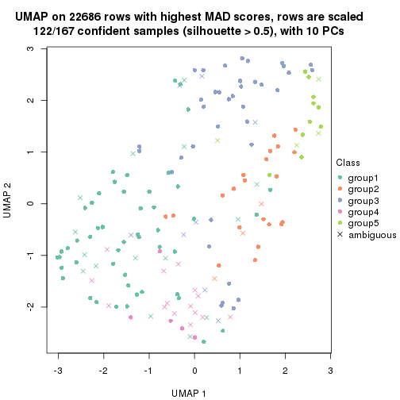</p>

</div>
<div id='tab-MAD-pam-dimension-reduction-5'>
<pre><code class="r">dimension_reduction(res, k = 6, method = &quot;UMAP&quot;)
</code></pre>

<p></p>

</div>
</div>


Following heatmap shows how subgroups are split when increasing `k`:

```r
collect_classes(res)
```


Test correlation between subgroups and known annotations. If the known
annotation is numeric, one-way ANOVA test is applied, and if the known
annotation is discrete, chi-squared contingency table test is applied.

```r
test_to_known_factors(res)
```

```
#>           n specimen(p) k
#> MAD:pam 140    0.000133 2
#> MAD:pam 143    0.007349 3
#> MAD:pam 146    0.015024 4
#> MAD:pam 122    0.063617 5
#> MAD:pam 117    0.002355 6
```


If matrix rows can be associated to genes, consider to use `GO_Enrichment(res,
...)` to perform function enrichment for the signature genes.


 

---------------------------------------------------


### MAD:mclust


The object with results only for a single top-value method and a single partition method 
can be extracted as:

```r
res = res_list["MAD", "mclust"]
# you can also extract it by
# res = res_list["MAD:mclust"]
```

A summary of `res` and all the functions that can be applied to it:

```r
res
```

```
#> A 'ConsensusPartition' object with k = 2, 3, 4, 5, 6.
#>   On a matrix with 22686 rows and 167 columns.
#>   Top rows (1000, 2000, 3000, 4000, 5000) are extracted by 'MAD' method.
#>   Subgroups are detected by 'mclust' method.
#>   Performed in total 1250 partitions by row resampling.
#>   Best k for subgroups seems to be 6.
#> 
#> Following methods can be applied to this 'ConsensusPartition' object:
#>  [1] "cola_report"             "collect_classes"         "collect_plots"          
#>  [4] "collect_stats"           "colnames"                "compare_signatures"     
#>  [7] "consensus_heatmap"       "dimension_reduction"     "functional_enrichment"  
#> [10] "get_anno_col"            "get_anno"                "get_classes"            
#> [13] "get_consensus"           "get_matrix"              "get_membership"         
#> [16] "get_param"               "get_signatures"          "get_stats"              
#> [19] "is_best_k"               "is_stable_k"             "membership_heatmap"     
#> [22] "ncol"                    "nrow"                    "plot_ecdf"              
#> [25] "rownames"                "select_partition_number" "show"                   
#> [28] "suggest_best_k"          "test_to_known_factors"
```

`collect_plots()` function collects all the plots made from `res` for all `k` (number of partitions)
into one single page to provide an easy and fast comparison between different `k`.

```r
collect_plots(res)
```


The plots are:

- The first row: a plot of the ECDF (Empirical cumulative distribution
  function) curves of the consensus matrix for each `k` and the heatmap of
  predicted classes for each `k`.
- The second row: heatmaps of the consensus matrix for each `k`.
- The third row: heatmaps of the membership matrix for each `k`.
- The fouth row: heatmaps of the signatures for each `k`.

All the plots in panels can be made by individual functions and they are
plotted later in this section.

`select_partition_number()` produces several plots showing different
statistics for choosing "optimized" `k`. There are following statistics:

- ECDF curves of the consensus matrix for each `k`;
- 1-PAC. [The PAC
  score](https://en.wikipedia.org/wiki/Consensus_clustering#Over-interpretation_potential_of_consensus_clustering)
  measures the proportion of the ambiguous subgrouping.
- Mean silhouette score.
- Concordance. The mean probability of fiting the consensus class ids in all
  partitions.
- Area increased. Denote $A_k$ as the area under the ECDF curve for current
  `k`, the area increased is defined as $A_k - A_{k-1}$.
- Rand index. The percent of pairs of samples that are both in a same cluster
  or both are not in a same cluster in the partition of k and k-1.
- Jaccard index. The ratio of pairs of samples are both in a same cluster in
  the partition of k and k-1 and the pairs of samples are both in a same
  cluster in the partition k or k-1.

The detailed explanations of these statistics can be found in [the cola
vignette](http://bioconductor.org/packages/devel/bioc/vignettes/cola/inst/doc/cola.html#toc_13).

Generally speaking, lower PAC score, higher mean silhouette score or higher
concordance corresponds to better partition. Rand index and Jaccard index
measure how similar the current partition is compared to partition with `k-1`.
If they are too similar, we won't accept `k` is better than `k-1`.

```r
select_partition_number(res)
```


The numeric values for all these statistics can be obtained by `get_stats()`.

```r
get_stats(res)
```

```
#>   k 1-PAC mean_silhouette concordance area_increased  Rand Jaccard
#> 2 2 0.225           0.680       0.763         0.4582 0.497   0.497
#> 3 3 0.325           0.572       0.747         0.3203 0.819   0.669
#> 4 4 0.513           0.468       0.731         0.1705 0.782   0.519
#> 5 5 0.584           0.541       0.737         0.0917 0.832   0.498
#> 6 6 0.653           0.673       0.782         0.0519 0.895   0.586
```

`suggest_best_k()` suggests the best $k$ based on these statistics. The rules are as follows:

- All $k$ with Jaccard index larger than 0.95 are removed because the increase of
  the partition number does not provides enough extra information. If all $k$ are removed,
  the best $k$ is assigned by `NA`.
- For $k$ with 1-PAC larger than 0.9, the maximal $k$ is taken as the "best k". Other $k$ is called "optional k".
- If it does not fit the second rule. The $k$ with the highest vote of highest
  1-PAC, mean silhouette and concordance is taken as the "best k".

```r
suggest_best_k(res)
```

```
#> [1] 6
```


Following shows the table of the partitions (You need to click the **show/hide
code output** link to see it). The membership matrix (columns with name `p*`)
is inferred by
[`clue::cl_consensus()`](https://www.rdocumentation.org/link/cl_consensus?package=clue)
function with the `SE` method. Basically the value in the membership matrix
represents the probability to belong to a certain group. The finall class
label for an item is determined with the group with highest probability it
belongs to.

In `get_classes()` function, the entropy is calculated from the membership
matrix and the silhouette score is calculated from the consensus matrix.


<script>
$( function() {
	$( '#tabs-MAD-mclust-get-classes' ).tabs();
} );
</script>
<div id='tabs-MAD-mclust-get-classes'>
<ul>
<li><a href='#tab-MAD-mclust-get-classes-1'>k = 2</a></li>
<li><a href='#tab-MAD-mclust-get-classes-2'>k = 3</a></li>
<li><a href='#tab-MAD-mclust-get-classes-3'>k = 4</a></li>
<li><a href='#tab-MAD-mclust-get-classes-4'>k = 5</a></li>
<li><a href='#tab-MAD-mclust-get-classes-5'>k = 6</a></li>
</ul>

<div id='tab-MAD-mclust-get-classes-1'>
<p><a id='tab-MAD-mclust-get-classes-1-a' style='color:#0366d6' href='#'>show/hide code output</a></p>
<pre><code class="r">cbind(get_classes(res, k = 2), get_membership(res, k = 2))
</code></pre>

<pre><code>#&gt;          class entropy silhouette    p1    p2
#&gt; GSM30006     2  0.5059     0.6675 0.112 0.888
#&gt; GSM30007     1  0.0000     0.7778 1.000 0.000
#&gt; GSM30008     1  0.2603     0.7779 0.956 0.044
#&gt; GSM30009     1  0.0000     0.7778 1.000 0.000
#&gt; GSM30010     2  0.9815    -0.3410 0.420 0.580
#&gt; GSM30011     2  0.5059     0.6675 0.112 0.888
#&gt; GSM30012     2  0.0000     0.6433 0.000 1.000
#&gt; GSM30013     2  0.8081     0.7593 0.248 0.752
#&gt; GSM30014     1  0.9754     0.5913 0.592 0.408
#&gt; GSM30015     1  0.9393     0.4474 0.644 0.356
#&gt; GSM30016     1  0.6343     0.7685 0.840 0.160
#&gt; GSM30017     1  0.9209     0.5011 0.664 0.336
#&gt; GSM30018     2  0.8327     0.7626 0.264 0.736
#&gt; GSM30019     2  0.0000     0.6433 0.000 1.000
#&gt; GSM30020     1  0.6247     0.7701 0.844 0.156
#&gt; GSM30021     1  0.9635     0.6116 0.612 0.388
#&gt; GSM30022     1  0.5059     0.7606 0.888 0.112
#&gt; GSM30023     2  0.8267     0.7521 0.260 0.740
#&gt; GSM30024     1  0.8713     0.5972 0.708 0.292
#&gt; GSM30025     1  0.0000     0.7778 1.000 0.000
#&gt; GSM30026     1  0.9358     0.0572 0.648 0.352
#&gt; GSM30027     1  0.2603     0.7779 0.956 0.044
#&gt; GSM30028     1  0.6247     0.7701 0.844 0.156
#&gt; GSM30029     1  0.6247     0.7701 0.844 0.156
#&gt; GSM30030     1  0.0000     0.7778 1.000 0.000
#&gt; GSM30031     1  0.2778     0.7869 0.952 0.048
#&gt; GSM30032     1  0.2603     0.7779 0.956 0.044
#&gt; GSM30033     1  0.2603     0.7779 0.956 0.044
#&gt; GSM30034     2  0.9460     0.7655 0.364 0.636
#&gt; GSM30035     1  0.2603     0.7779 0.956 0.044
#&gt; GSM30036     2  0.9460     0.7655 0.364 0.636
#&gt; GSM30037     1  0.0000     0.7778 1.000 0.000
#&gt; GSM30038     1  0.6887     0.7645 0.816 0.184
#&gt; GSM30039     2  0.0000     0.6433 0.000 1.000
#&gt; GSM30040     1  0.9909     0.3806 0.556 0.444
#&gt; GSM30041     2  0.5059     0.6675 0.112 0.888
#&gt; GSM30042     2  0.0000     0.6433 0.000 1.000
#&gt; GSM30043     1  0.9635     0.5957 0.612 0.388
#&gt; GSM30044     1  0.6247     0.7701 0.844 0.156
#&gt; GSM30045     1  0.6247     0.7701 0.844 0.156
#&gt; GSM30046     2  0.8144     0.7585 0.252 0.748
#&gt; GSM30047     2  0.9460     0.7655 0.364 0.636
#&gt; GSM30048     2  0.8144     0.7585 0.252 0.748
#&gt; GSM30049     2  0.6801     0.6030 0.180 0.820
#&gt; GSM30050     2  0.9460     0.7655 0.364 0.636
#&gt; GSM30051     2  0.5059     0.6675 0.112 0.888
#&gt; GSM30052     1  0.0000     0.7778 1.000 0.000
#&gt; GSM30053     2  0.0000     0.6433 0.000 1.000
#&gt; GSM30054     2  0.5059     0.6675 0.112 0.888
#&gt; GSM30055     2  0.9775     0.7132 0.412 0.588
#&gt; GSM30056     2  0.9427     0.7659 0.360 0.640
#&gt; GSM30057     1  0.9795     0.5860 0.584 0.416
#&gt; GSM30058     2  0.5059     0.6675 0.112 0.888
#&gt; GSM30059     2  0.9460     0.7655 0.364 0.636
#&gt; GSM30060     1  0.5408     0.7490 0.876 0.124
#&gt; GSM30061     2  0.9460     0.7655 0.364 0.636
#&gt; GSM30062     2  0.8207     0.7602 0.256 0.744
#&gt; GSM30063     2  0.3274     0.6844 0.060 0.940
#&gt; GSM30064     1  0.6247     0.7701 0.844 0.156
#&gt; GSM30065     2  0.5059     0.6675 0.112 0.888
#&gt; GSM30066     1  0.9754     0.5913 0.592 0.408
#&gt; GSM30067     1  0.2603     0.7779 0.956 0.044
#&gt; GSM30068     1  0.9754     0.5913 0.592 0.408
#&gt; GSM30069     1  0.9754     0.5913 0.592 0.408
#&gt; GSM30070     2  0.8207     0.1959 0.256 0.744
#&gt; GSM30071     2  0.8144     0.7585 0.252 0.748
#&gt; GSM30072     1  0.6247     0.7701 0.844 0.156
#&gt; GSM30073     2  0.8081     0.7593 0.248 0.752
#&gt; GSM30074     1  0.9460     0.6345 0.636 0.364
#&gt; GSM30075     2  0.8081     0.7593 0.248 0.752
#&gt; GSM30076     2  0.8267     0.7615 0.260 0.740
#&gt; GSM30077     2  0.9209     0.7700 0.336 0.664
#&gt; GSM30078     2  0.9170     0.7701 0.332 0.668
#&gt; GSM30079     1  0.0000     0.7778 1.000 0.000
#&gt; GSM30080     2  0.7376     0.7546 0.208 0.792
#&gt; GSM30081     2  0.5059     0.6675 0.112 0.888
#&gt; GSM30086     2  0.8144     0.7585 0.252 0.748
#&gt; GSM30087     2  0.9248     0.7695 0.340 0.660
#&gt; GSM30088     2  0.9460     0.7655 0.364 0.636
#&gt; GSM30089     1  0.6247     0.7701 0.844 0.156
#&gt; GSM30090     2  0.5059     0.6675 0.112 0.888
#&gt; GSM30091     2  0.5059     0.6675 0.112 0.888
#&gt; GSM30092     2  0.9460     0.7655 0.364 0.636
#&gt; GSM30093     2  0.7219     0.7155 0.200 0.800
#&gt; GSM30094     2  0.5059     0.6675 0.112 0.888
#&gt; GSM30095     1  0.8861     0.5878 0.696 0.304
#&gt; GSM30096     1  0.0000     0.7778 1.000 0.000
#&gt; GSM30097     2  0.9460     0.7655 0.364 0.636
#&gt; GSM30098     1  0.0000     0.7778 1.000 0.000
#&gt; GSM30099     1  0.9970    -0.4629 0.532 0.468
#&gt; GSM30100     1  0.9129     0.5986 0.672 0.328
#&gt; GSM30101     2  0.5059     0.6675 0.112 0.888
#&gt; GSM30102     2  0.9460     0.7655 0.364 0.636
#&gt; GSM30103     1  0.2603     0.7779 0.956 0.044
#&gt; GSM30104     2  0.9460     0.7655 0.364 0.636
#&gt; GSM30105     1  0.0000     0.7778 1.000 0.000
#&gt; GSM30106     2  0.8144     0.7585 0.252 0.748
#&gt; GSM30107     2  0.8144     0.7585 0.252 0.748
#&gt; GSM30108     1  0.6247     0.7701 0.844 0.156
#&gt; GSM30109     1  0.6247     0.7701 0.844 0.156
#&gt; GSM30110     2  0.8713     0.7155 0.292 0.708
#&gt; GSM30111     1  0.7299     0.7345 0.796 0.204
#&gt; GSM30112     1  0.6247     0.7701 0.844 0.156
#&gt; GSM30113     1  0.9866     0.5733 0.568 0.432
#&gt; GSM30114     2  0.0376     0.6464 0.004 0.996
#&gt; GSM30115     2  0.8144     0.7585 0.252 0.748
#&gt; GSM30116     1  0.8207     0.6337 0.744 0.256
#&gt; GSM30117     1  0.2603     0.7779 0.956 0.044
#&gt; GSM30118     1  0.9170     0.6627 0.668 0.332
#&gt; GSM30119     2  0.0000     0.6433 0.000 1.000
#&gt; GSM30120     2  0.9170     0.6503 0.332 0.668
#&gt; GSM30121     1  0.6247     0.7701 0.844 0.156
#&gt; GSM30122     1  0.2603     0.7779 0.956 0.044
#&gt; GSM30123     2  0.9460     0.7655 0.364 0.636
#&gt; GSM30177     2  0.9460     0.7655 0.364 0.636
#&gt; GSM30178     2  0.9460     0.7655 0.364 0.636
#&gt; GSM30179     1  0.4690     0.7279 0.900 0.100
#&gt; GSM30180     1  0.5519     0.7786 0.872 0.128
#&gt; GSM30181     2  0.8144     0.7585 0.252 0.748
#&gt; GSM30182     2  0.9209     0.7700 0.336 0.664
#&gt; GSM30183     1  0.7602     0.7135 0.780 0.220
#&gt; GSM30184     2  0.5059     0.6675 0.112 0.888
#&gt; GSM30185     1  0.2603     0.7779 0.956 0.044
#&gt; GSM30186     1  0.8386     0.3539 0.732 0.268
#&gt; GSM30187     2  0.9460     0.7655 0.364 0.636
#&gt; GSM30188     2  0.9427     0.7664 0.360 0.640
#&gt; GSM30189     2  0.9491     0.7624 0.368 0.632
#&gt; GSM30190     2  0.5059     0.6675 0.112 0.888
#&gt; GSM30191     2  0.9460     0.7655 0.364 0.636
#&gt; GSM30192     2  0.8081     0.7593 0.248 0.752
#&gt; GSM30193     2  0.8144     0.7585 0.252 0.748
#&gt; GSM30194     2  0.5629     0.4982 0.132 0.868
#&gt; GSM30195     1  0.6623     0.7615 0.828 0.172
#&gt; GSM30196     1  0.6247     0.7701 0.844 0.156
#&gt; GSM30197     2  0.8144     0.7585 0.252 0.748
#&gt; GSM30198     2  0.9393     0.6012 0.356 0.644
#&gt; GSM30199     1  0.2603     0.7779 0.956 0.044
#&gt; GSM30200     2  0.8144     0.7585 0.252 0.748
#&gt; GSM30201     2  0.8327     0.7626 0.264 0.736
#&gt; GSM30202     1  0.7674     0.7115 0.776 0.224
#&gt; GSM30203     2  0.9460     0.7655 0.364 0.636
#&gt; GSM30204     2  0.9933     0.3216 0.452 0.548
#&gt; GSM30205     1  0.2603     0.7779 0.956 0.044
#&gt; GSM30206     2  0.9460     0.7655 0.364 0.636
#&gt; GSM30207     1  0.9881    -0.3451 0.564 0.436
#&gt; GSM30208     1  0.9881    -0.3451 0.564 0.436
#&gt; GSM30209     1  0.9460    -0.0576 0.636 0.364
#&gt; GSM30210     1  0.0000     0.7778 1.000 0.000
#&gt; GSM30211     2  0.8144     0.7585 0.252 0.748
#&gt; GSM30212     1  0.0000     0.7778 1.000 0.000
#&gt; GSM30213     1  0.0000     0.7778 1.000 0.000
#&gt; GSM30214     1  0.0000     0.7778 1.000 0.000
#&gt; GSM30215     1  0.0000     0.7778 1.000 0.000
#&gt; GSM30216     1  0.5946     0.7696 0.856 0.144
#&gt; GSM30217     1  0.0000     0.7778 1.000 0.000
#&gt; GSM30218     2  0.9491     0.7625 0.368 0.632
#&gt; GSM30219     1  0.8763     0.5929 0.704 0.296
#&gt; GSM30220     1  0.0000     0.7778 1.000 0.000
#&gt; GSM30221     2  0.8861     0.7690 0.304 0.696
#&gt; GSM30222     2  0.8144     0.7585 0.252 0.748
#&gt; GSM30223     1  0.6247     0.7701 0.844 0.156
#&gt; GSM30224     2  0.9460     0.7655 0.364 0.636
#&gt; GSM30225     1  0.9209     0.5009 0.664 0.336
#&gt; GSM30226     1  0.2603     0.7779 0.956 0.044
#&gt; GSM30227     1  0.6801     0.7553 0.820 0.180
#&gt; GSM30228     2  0.6343     0.6948 0.160 0.840
#&gt; GSM30229     2  0.9460     0.7655 0.364 0.636
</code></pre>

<script>
$('#tab-MAD-mclust-get-classes-1-a').parent().next().next().hide();
$('#tab-MAD-mclust-get-classes-1-a').click(function(){
  $('#tab-MAD-mclust-get-classes-1-a').parent().next().next().toggle();
  return(false);
});
</script>
</div>

<div id='tab-MAD-mclust-get-classes-2'>
<p><a id='tab-MAD-mclust-get-classes-2-a' style='color:#0366d6' href='#'>show/hide code output</a></p>
<pre><code class="r">cbind(get_classes(res, k = 3), get_membership(res, k = 3))
</code></pre>

<pre><code>#&gt;          class entropy silhouette    p1    p2    p3
#&gt; GSM30006     1  0.6215     0.5779 0.572 0.000 0.428
#&gt; GSM30007     2  0.3879     0.6270 0.000 0.848 0.152
#&gt; GSM30008     2  0.4505     0.6479 0.092 0.860 0.048
#&gt; GSM30009     2  0.3619     0.6379 0.000 0.864 0.136
#&gt; GSM30010     3  0.7640     0.7513 0.096 0.240 0.664
#&gt; GSM30011     1  0.7636     0.5630 0.556 0.048 0.396
#&gt; GSM30012     1  0.5968     0.5646 0.636 0.000 0.364
#&gt; GSM30013     1  0.4796     0.6754 0.780 0.000 0.220
#&gt; GSM30014     3  0.7677     0.7507 0.096 0.244 0.660
#&gt; GSM30015     1  0.7953     0.0456 0.564 0.368 0.068
#&gt; GSM30016     2  0.9722    -0.2775 0.244 0.444 0.312
#&gt; GSM30017     2  0.8518     0.0707 0.436 0.472 0.092
#&gt; GSM30018     1  0.2414     0.7135 0.940 0.040 0.020
#&gt; GSM30019     1  0.5968     0.5635 0.636 0.000 0.364
#&gt; GSM30020     2  0.4920     0.6319 0.108 0.840 0.052
#&gt; GSM30021     3  0.7085     0.7237 0.096 0.188 0.716
#&gt; GSM30022     2  0.6372     0.6416 0.068 0.756 0.176
#&gt; GSM30023     1  0.3213     0.6963 0.912 0.028 0.060
#&gt; GSM30024     3  0.6432     0.0599 0.004 0.428 0.568
#&gt; GSM30025     2  0.2772     0.6592 0.004 0.916 0.080
#&gt; GSM30026     1  0.6483     0.1681 0.600 0.392 0.008
#&gt; GSM30027     2  0.5734     0.5559 0.048 0.788 0.164
#&gt; GSM30028     2  0.6093     0.5850 0.156 0.776 0.068
#&gt; GSM30029     2  0.4165     0.6546 0.076 0.876 0.048
#&gt; GSM30030     2  0.0237     0.6629 0.000 0.996 0.004
#&gt; GSM30031     2  0.4058     0.6562 0.076 0.880 0.044
#&gt; GSM30032     2  0.4934     0.5850 0.024 0.820 0.156
#&gt; GSM30033     2  0.7406     0.0441 0.044 0.596 0.360
#&gt; GSM30034     1  0.3528     0.7147 0.892 0.016 0.092
#&gt; GSM30035     2  0.7116     0.2300 0.040 0.636 0.324
#&gt; GSM30036     1  0.3682     0.7161 0.876 0.008 0.116
#&gt; GSM30037     2  0.4291     0.6319 0.008 0.840 0.152
#&gt; GSM30038     3  0.7815     0.6658 0.096 0.260 0.644
#&gt; GSM30039     1  0.5926     0.5733 0.644 0.000 0.356
#&gt; GSM30040     3  0.6897     0.5753 0.040 0.292 0.668
#&gt; GSM30041     1  0.6235     0.5716 0.564 0.000 0.436
#&gt; GSM30042     1  0.5706     0.5901 0.680 0.000 0.320
#&gt; GSM30043     3  0.7677     0.7507 0.096 0.244 0.660
#&gt; GSM30044     2  0.7814     0.5768 0.104 0.652 0.244
#&gt; GSM30045     2  0.8075     0.5470 0.104 0.620 0.276
#&gt; GSM30046     1  0.1950     0.7035 0.952 0.008 0.040
#&gt; GSM30047     1  0.3678     0.7140 0.892 0.028 0.080
#&gt; GSM30048     1  0.2383     0.7025 0.940 0.016 0.044
#&gt; GSM30049     1  0.7466     0.5123 0.520 0.036 0.444
#&gt; GSM30050     1  0.5016     0.7061 0.760 0.000 0.240
#&gt; GSM30051     1  0.6280     0.5531 0.540 0.000 0.460
#&gt; GSM30052     2  0.3879     0.6270 0.000 0.848 0.152
#&gt; GSM30053     1  0.5859     0.5826 0.656 0.000 0.344
#&gt; GSM30054     1  0.6280     0.5531 0.540 0.000 0.460
#&gt; GSM30055     1  0.8599     0.5737 0.584 0.140 0.276
#&gt; GSM30056     1  0.5948     0.6331 0.640 0.000 0.360
#&gt; GSM30057     3  0.7677     0.7507 0.096 0.244 0.660
#&gt; GSM30058     1  0.6274     0.5580 0.544 0.000 0.456
#&gt; GSM30059     1  0.3967     0.7130 0.884 0.044 0.072
#&gt; GSM30060     2  0.6667     0.0782 0.016 0.616 0.368
#&gt; GSM30061     1  0.2297     0.7211 0.944 0.036 0.020
#&gt; GSM30062     1  0.1905     0.7085 0.956 0.016 0.028
#&gt; GSM30063     1  0.5098     0.6612 0.752 0.000 0.248
#&gt; GSM30064     2  0.7179     0.5973 0.104 0.712 0.184
#&gt; GSM30065     1  0.6742     0.6243 0.656 0.028 0.316
#&gt; GSM30066     3  0.6605     0.7363 0.096 0.152 0.752
#&gt; GSM30067     2  0.3589     0.6754 0.052 0.900 0.048
#&gt; GSM30068     3  0.6605     0.7363 0.096 0.152 0.752
#&gt; GSM30069     3  0.6775     0.7319 0.096 0.164 0.740
#&gt; GSM30070     3  0.8763     0.4758 0.312 0.136 0.552
#&gt; GSM30071     1  0.5681     0.6502 0.748 0.016 0.236
#&gt; GSM30072     2  0.7814     0.5768 0.104 0.652 0.244
#&gt; GSM30073     1  0.3192     0.7079 0.888 0.000 0.112
#&gt; GSM30074     3  0.8132     0.7114 0.096 0.304 0.600
#&gt; GSM30075     1  0.4842     0.6665 0.776 0.000 0.224
#&gt; GSM30076     1  0.1411     0.7186 0.964 0.036 0.000
#&gt; GSM30077     1  0.1529     0.7183 0.960 0.040 0.000
#&gt; GSM30078     1  0.1647     0.7195 0.960 0.036 0.004
#&gt; GSM30079     2  0.3686     0.6351 0.000 0.860 0.140
#&gt; GSM30080     1  0.4974     0.6568 0.764 0.000 0.236
#&gt; GSM30081     1  0.6280     0.5531 0.540 0.000 0.460
#&gt; GSM30086     1  0.4465     0.6903 0.820 0.004 0.176
#&gt; GSM30087     1  0.1765     0.7191 0.956 0.040 0.004
#&gt; GSM30088     1  0.3039     0.7196 0.920 0.044 0.036
#&gt; GSM30089     2  0.7664     0.5578 0.104 0.668 0.228
#&gt; GSM30090     1  0.6274     0.5580 0.544 0.000 0.456
#&gt; GSM30091     1  0.6280     0.5531 0.540 0.000 0.460
#&gt; GSM30092     1  0.3649     0.7138 0.896 0.036 0.068
#&gt; GSM30093     1  0.6045     0.6309 0.620 0.000 0.380
#&gt; GSM30094     1  0.6280     0.5531 0.540 0.000 0.460
#&gt; GSM30095     3  0.6867     0.5754 0.040 0.288 0.672
#&gt; GSM30096     2  0.0829     0.6608 0.004 0.984 0.012
#&gt; GSM30097     1  0.3713     0.7143 0.892 0.032 0.076
#&gt; GSM30098     2  0.3644     0.6435 0.004 0.872 0.124
#&gt; GSM30099     1  0.9527     0.2617 0.436 0.192 0.372
#&gt; GSM30100     3  0.5815     0.6782 0.096 0.104 0.800
#&gt; GSM30101     1  0.6280     0.5531 0.540 0.000 0.460
#&gt; GSM30102     1  0.6407     0.6773 0.700 0.028 0.272
#&gt; GSM30103     2  0.4059     0.6586 0.012 0.860 0.128
#&gt; GSM30104     1  0.3375     0.7156 0.892 0.008 0.100
#&gt; GSM30105     2  0.0592     0.6647 0.000 0.988 0.012
#&gt; GSM30106     1  0.2173     0.7039 0.944 0.008 0.048
#&gt; GSM30107     1  0.2680     0.7069 0.924 0.008 0.068
#&gt; GSM30108     3  0.8465     0.1712 0.096 0.376 0.528
#&gt; GSM30109     2  0.6920     0.6052 0.104 0.732 0.164
#&gt; GSM30110     1  0.3589     0.6882 0.900 0.052 0.048
#&gt; GSM30111     2  0.9507    -0.1582 0.380 0.432 0.188
#&gt; GSM30112     2  0.8014     0.5498 0.104 0.628 0.268
#&gt; GSM30113     3  0.7677     0.7507 0.096 0.244 0.660
#&gt; GSM30114     1  0.5291     0.6468 0.732 0.000 0.268
#&gt; GSM30115     1  0.2400     0.7054 0.932 0.004 0.064
#&gt; GSM30116     2  0.7581    -0.0533 0.040 0.496 0.464
#&gt; GSM30117     2  0.7876     0.1818 0.080 0.612 0.308
#&gt; GSM30118     3  0.7941     0.7332 0.096 0.276 0.628
#&gt; GSM30119     1  0.6985     0.4780 0.592 0.024 0.384
#&gt; GSM30120     1  0.7935     0.4865 0.648 0.116 0.236
#&gt; GSM30121     2  0.5449     0.6243 0.116 0.816 0.068
#&gt; GSM30122     2  0.4505     0.6222 0.048 0.860 0.092
#&gt; GSM30123     1  0.5864     0.6780 0.704 0.008 0.288
#&gt; GSM30177     1  0.5785     0.6695 0.696 0.004 0.300
#&gt; GSM30178     1  0.3590     0.7144 0.896 0.028 0.076
#&gt; GSM30179     2  0.6001     0.5628 0.144 0.784 0.072
#&gt; GSM30180     2  0.4458     0.6513 0.080 0.864 0.056
#&gt; GSM30181     1  0.3879     0.6971 0.848 0.000 0.152
#&gt; GSM30182     1  0.2443     0.7219 0.940 0.032 0.028
#&gt; GSM30183     2  0.6588     0.5321 0.208 0.732 0.060
#&gt; GSM30184     1  0.6274     0.5580 0.544 0.000 0.456
#&gt; GSM30185     2  0.5677     0.5706 0.048 0.792 0.160
#&gt; GSM30186     2  0.9882    -0.2448 0.280 0.408 0.312
#&gt; GSM30187     1  0.3678     0.7148 0.892 0.028 0.080
#&gt; GSM30188     1  0.2681     0.7220 0.932 0.040 0.028
#&gt; GSM30189     1  0.5625     0.6776 0.808 0.116 0.076
#&gt; GSM30190     1  0.6280     0.5531 0.540 0.000 0.460
#&gt; GSM30191     1  0.4233     0.7205 0.836 0.004 0.160
#&gt; GSM30192     1  0.4399     0.6829 0.812 0.000 0.188
#&gt; GSM30193     1  0.1765     0.7035 0.956 0.004 0.040
#&gt; GSM30194     3  0.6970     0.4831 0.276 0.048 0.676
#&gt; GSM30195     1  0.9927    -0.3114 0.392 0.316 0.292
#&gt; GSM30196     2  0.7814     0.5768 0.104 0.652 0.244
#&gt; GSM30197     1  0.1765     0.7035 0.956 0.004 0.040
#&gt; GSM30198     1  0.3797     0.6812 0.892 0.056 0.052
#&gt; GSM30199     2  0.3425     0.6362 0.004 0.884 0.112
#&gt; GSM30200     1  0.2599     0.7000 0.932 0.016 0.052
#&gt; GSM30201     1  0.2663     0.7119 0.932 0.044 0.024
#&gt; GSM30202     2  0.7250     0.3997 0.288 0.656 0.056
#&gt; GSM30203     1  0.4015     0.7155 0.876 0.028 0.096
#&gt; GSM30204     1  0.6159     0.4953 0.756 0.196 0.048
#&gt; GSM30205     2  0.7306     0.0897 0.044 0.616 0.340
#&gt; GSM30206     1  0.3875     0.7143 0.888 0.044 0.068
#&gt; GSM30207     1  0.7446     0.4773 0.664 0.260 0.076
#&gt; GSM30208     1  0.6543     0.6276 0.748 0.176 0.076
#&gt; GSM30209     1  0.9837     0.1819 0.424 0.284 0.292
#&gt; GSM30210     2  0.1647     0.6651 0.004 0.960 0.036
#&gt; GSM30211     1  0.2383     0.7025 0.940 0.016 0.044
#&gt; GSM30212     2  0.2878     0.6547 0.000 0.904 0.096
#&gt; GSM30213     2  0.3619     0.6377 0.000 0.864 0.136
#&gt; GSM30214     2  0.0424     0.6630 0.008 0.992 0.000
#&gt; GSM30215     2  0.0000     0.6620 0.000 1.000 0.000
#&gt; GSM30216     2  0.6383     0.6388 0.104 0.768 0.128
#&gt; GSM30217     2  0.0000     0.6620 0.000 1.000 0.000
#&gt; GSM30218     1  0.8937     0.5221 0.564 0.184 0.252
#&gt; GSM30219     3  0.7575     0.2994 0.040 0.456 0.504
#&gt; GSM30220     2  0.3879     0.6270 0.000 0.848 0.152
#&gt; GSM30221     1  0.2116     0.7203 0.948 0.040 0.012
#&gt; GSM30222     1  0.3272     0.7068 0.892 0.004 0.104
#&gt; GSM30223     2  0.7814     0.5768 0.104 0.652 0.244
#&gt; GSM30224     1  0.4281     0.7113 0.872 0.056 0.072
#&gt; GSM30225     1  0.8165    -0.1124 0.512 0.416 0.072
#&gt; GSM30226     2  0.6302     0.5309 0.048 0.744 0.208
#&gt; GSM30227     2  0.8568     0.3146 0.228 0.604 0.168
#&gt; GSM30228     1  0.6045     0.6139 0.620 0.000 0.380
#&gt; GSM30229     1  0.4174     0.7213 0.872 0.036 0.092
</code></pre>

<script>
$('#tab-MAD-mclust-get-classes-2-a').parent().next().next().hide();
$('#tab-MAD-mclust-get-classes-2-a').click(function(){
  $('#tab-MAD-mclust-get-classes-2-a').parent().next().next().toggle();
  return(false);
});
</script>
</div>

<div id='tab-MAD-mclust-get-classes-3'>
<p><a id='tab-MAD-mclust-get-classes-3-a' style='color:#0366d6' href='#'>show/hide code output</a></p>
<pre><code class="r">cbind(get_classes(res, k = 4), get_membership(res, k = 4))
</code></pre>

<pre><code>#&gt;          class entropy silhouette    p1    p2    p3    p4
#&gt; GSM30006     2  0.0657     0.7052 0.004 0.984 0.000 0.012
#&gt; GSM30007     1  0.3907     0.6275 0.768 0.000 0.232 0.000
#&gt; GSM30008     1  0.6166     0.5989 0.692 0.008 0.116 0.184
#&gt; GSM30009     1  0.3610     0.6525 0.800 0.000 0.200 0.000
#&gt; GSM30010     3  0.3831     0.5745 0.204 0.004 0.792 0.000
#&gt; GSM30011     2  0.0779     0.7027 0.004 0.980 0.000 0.016
#&gt; GSM30012     2  0.5546     0.3640 0.000 0.664 0.044 0.292
#&gt; GSM30013     4  0.5812     0.4523 0.000 0.328 0.048 0.624
#&gt; GSM30014     3  0.3831     0.5745 0.204 0.004 0.792 0.000
#&gt; GSM30015     4  0.7153    -0.0365 0.440 0.020 0.076 0.464
#&gt; GSM30016     3  0.7054    -0.0230 0.400 0.008 0.496 0.096
#&gt; GSM30017     4  0.4405     0.3033 0.152 0.000 0.048 0.800
#&gt; GSM30018     4  0.4999     0.5962 0.000 0.328 0.012 0.660
#&gt; GSM30019     2  0.5546     0.3640 0.000 0.664 0.044 0.292
#&gt; GSM30020     1  0.6511     0.5331 0.640 0.000 0.172 0.188
#&gt; GSM30021     3  0.3751     0.5752 0.196 0.004 0.800 0.000
#&gt; GSM30022     1  0.4522     0.5608 0.680 0.000 0.320 0.000
#&gt; GSM30023     4  0.2161     0.4776 0.004 0.016 0.048 0.932
#&gt; GSM30024     3  0.5097    -0.0755 0.428 0.004 0.568 0.000
#&gt; GSM30025     1  0.3569     0.6545 0.804 0.000 0.196 0.000
#&gt; GSM30026     4  0.5036     0.3495 0.024 0.280 0.000 0.696
#&gt; GSM30027     1  0.3583     0.6568 0.816 0.004 0.000 0.180
#&gt; GSM30028     1  0.7380     0.2747 0.512 0.000 0.288 0.200
#&gt; GSM30029     1  0.6027     0.5892 0.684 0.000 0.124 0.192
#&gt; GSM30030     1  0.3400     0.6601 0.820 0.000 0.180 0.000
#&gt; GSM30031     1  0.5989     0.6038 0.700 0.004 0.116 0.180
#&gt; GSM30032     1  0.3583     0.6568 0.816 0.004 0.000 0.180
#&gt; GSM30033     1  0.5863     0.5936 0.700 0.120 0.000 0.180
#&gt; GSM30034     4  0.4996     0.5022 0.000 0.484 0.000 0.516
#&gt; GSM30035     1  0.2081     0.6252 0.916 0.084 0.000 0.000
#&gt; GSM30036     4  0.4996     0.5022 0.000 0.484 0.000 0.516
#&gt; GSM30037     1  0.3610     0.6525 0.800 0.000 0.200 0.000
#&gt; GSM30038     3  0.1305     0.5386 0.036 0.004 0.960 0.000
#&gt; GSM30039     2  0.5897     0.2263 0.000 0.588 0.044 0.368
#&gt; GSM30040     1  0.7385    -0.1201 0.484 0.176 0.340 0.000
#&gt; GSM30041     2  0.0188     0.7096 0.004 0.996 0.000 0.000
#&gt; GSM30042     2  0.6920     0.2591 0.000 0.552 0.132 0.316
#&gt; GSM30043     3  0.3945     0.5686 0.216 0.004 0.780 0.000
#&gt; GSM30044     3  0.4985    -0.0884 0.468 0.000 0.532 0.000
#&gt; GSM30045     3  0.4985    -0.0884 0.468 0.000 0.532 0.000
#&gt; GSM30046     4  0.4919     0.6107 0.000 0.200 0.048 0.752
#&gt; GSM30047     4  0.4989     0.5031 0.000 0.472 0.000 0.528
#&gt; GSM30048     4  0.4881     0.6108 0.000 0.196 0.048 0.756
#&gt; GSM30049     2  0.2662     0.6536 0.084 0.900 0.000 0.016
#&gt; GSM30050     2  0.4661    -0.0804 0.000 0.652 0.000 0.348
#&gt; GSM30051     2  0.0188     0.7096 0.004 0.996 0.000 0.000
#&gt; GSM30052     1  0.3610     0.6525 0.800 0.000 0.200 0.000
#&gt; GSM30053     2  0.6235     0.0727 0.000 0.524 0.056 0.420
#&gt; GSM30054     2  0.0188     0.7096 0.004 0.996 0.000 0.000
#&gt; GSM30055     2  0.5157     0.2216 0.028 0.688 0.000 0.284
#&gt; GSM30056     2  0.0895     0.6972 0.004 0.976 0.000 0.020
#&gt; GSM30057     3  0.3831     0.5745 0.204 0.004 0.792 0.000
#&gt; GSM30058     2  0.0188     0.7096 0.004 0.996 0.000 0.000
#&gt; GSM30059     4  0.4989     0.5031 0.000 0.472 0.000 0.528
#&gt; GSM30060     1  0.1824     0.6493 0.936 0.004 0.060 0.000
#&gt; GSM30061     4  0.5933     0.5153 0.000 0.464 0.036 0.500
#&gt; GSM30062     4  0.5472     0.6092 0.000 0.280 0.044 0.676
#&gt; GSM30063     4  0.6055     0.3548 0.000 0.436 0.044 0.520
#&gt; GSM30064     3  0.5165    -0.1062 0.484 0.000 0.512 0.004
#&gt; GSM30065     2  0.3354     0.6054 0.000 0.872 0.044 0.084
#&gt; GSM30066     3  0.3668     0.5750 0.188 0.004 0.808 0.000
#&gt; GSM30067     1  0.2589     0.6407 0.884 0.000 0.116 0.000
#&gt; GSM30068     3  0.3668     0.5750 0.188 0.004 0.808 0.000
#&gt; GSM30069     3  0.1004     0.5425 0.024 0.004 0.972 0.000
#&gt; GSM30070     3  0.5950     0.2695 0.008 0.184 0.708 0.100
#&gt; GSM30071     4  0.5690     0.5070 0.000 0.268 0.060 0.672
#&gt; GSM30072     1  0.4998     0.1577 0.512 0.000 0.488 0.000
#&gt; GSM30073     4  0.5279     0.5818 0.000 0.252 0.044 0.704
#&gt; GSM30074     3  0.4771     0.5603 0.148 0.004 0.788 0.060
#&gt; GSM30075     4  0.5328     0.5663 0.000 0.248 0.048 0.704
#&gt; GSM30076     4  0.5284     0.5868 0.000 0.368 0.016 0.616
#&gt; GSM30077     4  0.4888     0.5613 0.000 0.412 0.000 0.588
#&gt; GSM30078     4  0.4888     0.5613 0.000 0.412 0.000 0.588
#&gt; GSM30079     1  0.3610     0.6525 0.800 0.000 0.200 0.000
#&gt; GSM30080     4  0.5549     0.5289 0.000 0.280 0.048 0.672
#&gt; GSM30081     2  0.0188     0.7096 0.004 0.996 0.000 0.000
#&gt; GSM30086     4  0.4957     0.6087 0.000 0.204 0.048 0.748
#&gt; GSM30087     4  0.4888     0.5613 0.000 0.412 0.000 0.588
#&gt; GSM30088     4  0.4981     0.5019 0.000 0.464 0.000 0.536
#&gt; GSM30089     3  0.5158    -0.0926 0.472 0.004 0.524 0.000
#&gt; GSM30090     2  0.0376     0.7085 0.004 0.992 0.000 0.004
#&gt; GSM30091     2  0.0188     0.7096 0.004 0.996 0.000 0.000
#&gt; GSM30092     4  0.4996     0.5022 0.000 0.484 0.000 0.516
#&gt; GSM30093     2  0.0000     0.7070 0.000 1.000 0.000 0.000
#&gt; GSM30094     2  0.0657     0.7052 0.004 0.984 0.000 0.012
#&gt; GSM30095     1  0.7375    -0.1135 0.488 0.176 0.336 0.000
#&gt; GSM30096     1  0.0000     0.6635 1.000 0.000 0.000 0.000
#&gt; GSM30097     4  0.4996     0.5022 0.000 0.484 0.000 0.516
#&gt; GSM30098     1  0.3311     0.6639 0.828 0.000 0.172 0.000
#&gt; GSM30099     2  0.5352     0.5531 0.168 0.740 0.000 0.092
#&gt; GSM30100     3  0.2125     0.5015 0.076 0.004 0.920 0.000
#&gt; GSM30101     2  0.0188     0.7096 0.004 0.996 0.000 0.000
#&gt; GSM30102     2  0.3933     0.4614 0.008 0.792 0.000 0.200
#&gt; GSM30103     1  0.2466     0.6800 0.900 0.004 0.096 0.000
#&gt; GSM30104     4  0.4996     0.5022 0.000 0.484 0.000 0.516
#&gt; GSM30105     1  0.4008     0.6688 0.820 0.000 0.148 0.032
#&gt; GSM30106     4  0.4719     0.6088 0.000 0.180 0.048 0.772
#&gt; GSM30107     4  0.4919     0.6107 0.000 0.200 0.048 0.752
#&gt; GSM30108     3  0.3052     0.4646 0.136 0.004 0.860 0.000
#&gt; GSM30109     3  0.5165    -0.1061 0.484 0.000 0.512 0.004
#&gt; GSM30110     4  0.5041     0.6115 0.008 0.188 0.044 0.760
#&gt; GSM30111     4  0.9155    -0.2601 0.352 0.092 0.188 0.368
#&gt; GSM30112     3  0.4994    -0.0950 0.480 0.000 0.520 0.000
#&gt; GSM30113     3  0.3831     0.5745 0.204 0.004 0.792 0.000
#&gt; GSM30114     4  0.6061     0.2937 0.000 0.400 0.048 0.552
#&gt; GSM30115     4  0.4842     0.6109 0.000 0.192 0.048 0.760
#&gt; GSM30116     1  0.3257     0.5548 0.844 0.152 0.004 0.000
#&gt; GSM30117     1  0.2973     0.6070 0.884 0.096 0.000 0.020
#&gt; GSM30118     3  0.3831     0.5745 0.204 0.004 0.792 0.000
#&gt; GSM30119     2  0.8030     0.1401 0.004 0.388 0.296 0.312
#&gt; GSM30120     4  0.5084     0.6051 0.012 0.180 0.044 0.764
#&gt; GSM30121     1  0.4010     0.5245 0.816 0.000 0.156 0.028
#&gt; GSM30122     1  0.0000     0.6635 1.000 0.000 0.000 0.000
#&gt; GSM30123     2  0.4843    -0.2395 0.000 0.604 0.000 0.396
#&gt; GSM30177     2  0.3024     0.5300 0.000 0.852 0.000 0.148
#&gt; GSM30178     4  0.4996     0.5022 0.000 0.484 0.000 0.516
#&gt; GSM30179     1  0.5669     0.5805 0.708 0.092 0.000 0.200
#&gt; GSM30180     1  0.2814     0.5909 0.868 0.000 0.132 0.000
#&gt; GSM30181     4  0.4881     0.6093 0.000 0.196 0.048 0.756
#&gt; GSM30182     4  0.4888     0.5613 0.000 0.412 0.000 0.588
#&gt; GSM30183     1  0.4954     0.4981 0.784 0.004 0.120 0.092
#&gt; GSM30184     2  0.0188     0.7096 0.004 0.996 0.000 0.000
#&gt; GSM30185     1  0.0188     0.6627 0.996 0.004 0.000 0.000
#&gt; GSM30186     2  0.5167     0.3315 0.340 0.644 0.000 0.016
#&gt; GSM30187     4  0.4996     0.5022 0.000 0.484 0.000 0.516
#&gt; GSM30188     4  0.4888     0.5613 0.000 0.412 0.000 0.588
#&gt; GSM30189     4  0.5151     0.5018 0.004 0.464 0.000 0.532
#&gt; GSM30190     2  0.0188     0.7096 0.004 0.996 0.000 0.000
#&gt; GSM30191     4  0.5000     0.4833 0.000 0.496 0.000 0.504
#&gt; GSM30192     4  0.4957     0.6087 0.000 0.204 0.048 0.748
#&gt; GSM30193     4  0.4919     0.6107 0.000 0.200 0.048 0.752
#&gt; GSM30194     3  0.7164     0.0560 0.004 0.296 0.552 0.148
#&gt; GSM30195     1  0.9769    -0.0355 0.340 0.164 0.236 0.260
#&gt; GSM30196     3  0.4985    -0.0884 0.468 0.000 0.532 0.000
#&gt; GSM30197     4  0.4919     0.6107 0.000 0.200 0.048 0.752
#&gt; GSM30198     4  0.2594     0.4981 0.004 0.036 0.044 0.916
#&gt; GSM30199     1  0.0779     0.6651 0.980 0.004 0.016 0.000
#&gt; GSM30200     4  0.4145     0.5765 0.004 0.124 0.044 0.828
#&gt; GSM30201     4  0.5460     0.5940 0.000 0.340 0.028 0.632
#&gt; GSM30202     1  0.6039     0.3405 0.684 0.000 0.128 0.188
#&gt; GSM30203     4  0.4996     0.5022 0.000 0.484 0.000 0.516
#&gt; GSM30204     4  0.1635     0.4599 0.008 0.000 0.044 0.948
#&gt; GSM30205     1  0.3978     0.6058 0.848 0.032 0.104 0.016
#&gt; GSM30206     4  0.4981     0.5019 0.000 0.464 0.000 0.536
#&gt; GSM30207     4  0.4483     0.3578 0.004 0.284 0.000 0.712
#&gt; GSM30208     4  0.4621     0.3566 0.008 0.284 0.000 0.708
#&gt; GSM30209     2  0.7216     0.2475 0.284 0.536 0.000 0.180
#&gt; GSM30210     1  0.4356     0.6640 0.804 0.000 0.048 0.148
#&gt; GSM30211     4  0.4800     0.6120 0.000 0.196 0.044 0.760
#&gt; GSM30212     1  0.3610     0.6525 0.800 0.000 0.200 0.000
#&gt; GSM30213     1  0.3610     0.6525 0.800 0.000 0.200 0.000
#&gt; GSM30214     1  0.0592     0.6696 0.984 0.000 0.000 0.016
#&gt; GSM30215     1  0.3356     0.6581 0.824 0.000 0.000 0.176
#&gt; GSM30216     1  0.4730     0.1775 0.636 0.000 0.364 0.000
#&gt; GSM30217     1  0.3400     0.6560 0.820 0.000 0.000 0.180
#&gt; GSM30218     2  0.5691    -0.4446 0.024 0.508 0.000 0.468
#&gt; GSM30219     1  0.6346     0.2269 0.656 0.152 0.192 0.000
#&gt; GSM30220     1  0.3610     0.6525 0.800 0.000 0.200 0.000
#&gt; GSM30221     4  0.4905     0.5813 0.000 0.364 0.004 0.632
#&gt; GSM30222     4  0.4719     0.6088 0.000 0.180 0.048 0.772
#&gt; GSM30223     3  0.5155    -0.0928 0.468 0.000 0.528 0.004
#&gt; GSM30224     4  0.4981     0.5019 0.000 0.464 0.000 0.536
#&gt; GSM30225     4  0.6347     0.1169 0.384 0.000 0.068 0.548
#&gt; GSM30226     1  0.0779     0.6651 0.980 0.004 0.016 0.000
#&gt; GSM30227     1  0.7117     0.0455 0.564 0.000 0.228 0.208
#&gt; GSM30228     2  0.1637     0.6577 0.000 0.940 0.000 0.060
#&gt; GSM30229     4  0.4996     0.5022 0.000 0.484 0.000 0.516
</code></pre>

<script>
$('#tab-MAD-mclust-get-classes-3-a').parent().next().next().hide();
$('#tab-MAD-mclust-get-classes-3-a').click(function(){
  $('#tab-MAD-mclust-get-classes-3-a').parent().next().next().toggle();
  return(false);
});
</script>
</div>

<div id='tab-MAD-mclust-get-classes-4'>
<p><a id='tab-MAD-mclust-get-classes-4-a' style='color:#0366d6' href='#'>show/hide code output</a></p>
<pre><code class="r">cbind(get_classes(res, k = 5), get_membership(res, k = 5))
</code></pre>

<pre><code>#&gt;          class entropy silhouette    p1    p2    p3    p4    p5
#&gt; GSM30006     3  0.3689    0.69554 0.000 0.004 0.740 0.256 0.000
#&gt; GSM30007     1  0.0932    0.68818 0.972 0.020 0.004 0.004 0.000
#&gt; GSM30008     1  0.4442    0.66412 0.728 0.004 0.012 0.016 0.240
#&gt; GSM30009     1  0.0609    0.68973 0.980 0.000 0.020 0.000 0.000
#&gt; GSM30010     5  0.3596    0.82593 0.000 0.200 0.016 0.000 0.784
#&gt; GSM30011     3  0.3160    0.71802 0.000 0.004 0.808 0.188 0.000
#&gt; GSM30012     2  0.4645    0.43288 0.000 0.564 0.424 0.008 0.004
#&gt; GSM30013     2  0.4989    0.61318 0.000 0.708 0.168 0.124 0.000
#&gt; GSM30014     5  0.3596    0.82593 0.000 0.200 0.016 0.000 0.784
#&gt; GSM30015     2  0.6917    0.15451 0.264 0.520 0.016 0.192 0.008
#&gt; GSM30016     1  0.8127    0.14707 0.432 0.132 0.016 0.116 0.304
#&gt; GSM30017     2  0.8291   -0.03727 0.344 0.348 0.012 0.096 0.200
#&gt; GSM30018     4  0.2286    0.68638 0.004 0.108 0.000 0.888 0.000
#&gt; GSM30019     2  0.4745    0.43386 0.000 0.560 0.424 0.012 0.004
#&gt; GSM30020     1  0.5517    0.54008 0.540 0.024 0.020 0.004 0.412
#&gt; GSM30021     5  0.3496    0.81603 0.000 0.200 0.012 0.000 0.788
#&gt; GSM30022     1  0.3367    0.65002 0.860 0.032 0.016 0.004 0.088
#&gt; GSM30023     4  0.5764    0.10132 0.012 0.408 0.000 0.520 0.060
#&gt; GSM30024     1  0.4937    0.12019 0.580 0.004 0.024 0.000 0.392
#&gt; GSM30025     1  0.0609    0.68973 0.980 0.000 0.020 0.000 0.000
#&gt; GSM30026     4  0.3908    0.55751 0.016 0.004 0.004 0.776 0.200
#&gt; GSM30027     1  0.4389    0.65993 0.752 0.024 0.020 0.000 0.204
#&gt; GSM30028     1  0.5947    0.46581 0.476 0.040 0.020 0.008 0.456
#&gt; GSM30029     1  0.5135    0.64642 0.668 0.028 0.020 0.004 0.280
#&gt; GSM30030     1  0.0898    0.69046 0.972 0.008 0.020 0.000 0.000
#&gt; GSM30031     1  0.4712    0.65915 0.708 0.020 0.016 0.004 0.252
#&gt; GSM30032     1  0.4552    0.65713 0.744 0.032 0.020 0.000 0.204
#&gt; GSM30033     1  0.7249    0.17442 0.416 0.032 0.348 0.000 0.204
#&gt; GSM30034     4  0.0290    0.74270 0.000 0.000 0.008 0.992 0.000
#&gt; GSM30035     1  0.6659    0.40669 0.504 0.232 0.256 0.000 0.008
#&gt; GSM30036     4  0.0963    0.73099 0.000 0.000 0.036 0.964 0.000
#&gt; GSM30037     1  0.0609    0.68973 0.980 0.000 0.020 0.000 0.000
#&gt; GSM30038     5  0.4242    0.67733 0.208 0.036 0.004 0.000 0.752
#&gt; GSM30039     2  0.4798    0.45860 0.000 0.576 0.404 0.016 0.004
#&gt; GSM30040     3  0.7817    0.18454 0.116 0.200 0.468 0.000 0.216
#&gt; GSM30041     3  0.3662    0.69268 0.000 0.004 0.744 0.252 0.000
#&gt; GSM30042     2  0.4969    0.60674 0.000 0.712 0.064 0.212 0.012
#&gt; GSM30043     5  0.3752    0.82400 0.004 0.200 0.016 0.000 0.780
#&gt; GSM30044     1  0.5467    0.46711 0.660 0.052 0.020 0.004 0.264
#&gt; GSM30045     1  0.5426    0.46567 0.660 0.048 0.020 0.004 0.268
#&gt; GSM30046     4  0.4278    0.05386 0.000 0.452 0.000 0.548 0.000
#&gt; GSM30047     4  0.0290    0.74270 0.000 0.000 0.008 0.992 0.000
#&gt; GSM30048     4  0.4528    0.06581 0.008 0.444 0.000 0.548 0.000
#&gt; GSM30049     3  0.3550    0.71117 0.020 0.000 0.796 0.184 0.000
#&gt; GSM30050     4  0.4262    0.11892 0.000 0.000 0.440 0.560 0.000
#&gt; GSM30051     3  0.1270    0.68944 0.000 0.000 0.948 0.052 0.000
#&gt; GSM30052     1  0.0609    0.68973 0.980 0.000 0.020 0.000 0.000
#&gt; GSM30053     2  0.4633    0.51219 0.000 0.632 0.348 0.016 0.004
#&gt; GSM30054     3  0.1908    0.70680 0.000 0.000 0.908 0.092 0.000
#&gt; GSM30055     4  0.5523   -0.13785 0.024 0.020 0.416 0.536 0.004
#&gt; GSM30056     3  0.3838    0.67267 0.000 0.004 0.716 0.280 0.000
#&gt; GSM30057     5  0.3596    0.82593 0.000 0.200 0.016 0.000 0.784
#&gt; GSM30058     3  0.2605    0.72057 0.000 0.000 0.852 0.148 0.000
#&gt; GSM30059     4  0.0290    0.74270 0.000 0.000 0.008 0.992 0.000
#&gt; GSM30060     1  0.5173    0.62928 0.696 0.228 0.024 0.000 0.052
#&gt; GSM30061     4  0.0579    0.74185 0.000 0.008 0.008 0.984 0.000
#&gt; GSM30062     4  0.4015    0.32540 0.000 0.348 0.000 0.652 0.000
#&gt; GSM30063     2  0.6184    0.56416 0.000 0.576 0.208 0.212 0.004
#&gt; GSM30064     1  0.5336    0.47431 0.668 0.044 0.020 0.004 0.264
#&gt; GSM30065     3  0.5756    0.32094 0.000 0.176 0.620 0.204 0.000
#&gt; GSM30066     5  0.3752    0.82400 0.004 0.200 0.016 0.000 0.780
#&gt; GSM30067     1  0.3948    0.67147 0.788 0.180 0.008 0.004 0.020
#&gt; GSM30068     5  0.3596    0.82593 0.000 0.200 0.016 0.000 0.784
#&gt; GSM30069     5  0.4052    0.72255 0.176 0.024 0.016 0.000 0.784
#&gt; GSM30070     5  0.6491    0.00448 0.000 0.336 0.000 0.200 0.464
#&gt; GSM30071     2  0.4475    0.59279 0.000 0.692 0.000 0.276 0.032
#&gt; GSM30072     1  0.5223    0.47969 0.676 0.044 0.016 0.004 0.260
#&gt; GSM30073     2  0.5355    0.57687 0.000 0.624 0.292 0.084 0.000
#&gt; GSM30074     5  0.2377    0.76237 0.000 0.128 0.000 0.000 0.872
#&gt; GSM30075     2  0.3838    0.59786 0.000 0.716 0.000 0.280 0.004
#&gt; GSM30076     4  0.2377    0.67134 0.000 0.128 0.000 0.872 0.000
#&gt; GSM30077     4  0.1197    0.72787 0.000 0.048 0.000 0.952 0.000
#&gt; GSM30078     4  0.1270    0.72626 0.000 0.052 0.000 0.948 0.000
#&gt; GSM30079     1  0.0451    0.68996 0.988 0.008 0.000 0.004 0.000
#&gt; GSM30080     2  0.3838    0.59786 0.000 0.716 0.000 0.280 0.004
#&gt; GSM30081     3  0.1270    0.68944 0.000 0.000 0.948 0.052 0.000
#&gt; GSM30086     2  0.3707    0.59449 0.000 0.716 0.000 0.284 0.000
#&gt; GSM30087     4  0.1197    0.72787 0.000 0.048 0.000 0.952 0.000
#&gt; GSM30088     4  0.0162    0.74093 0.004 0.000 0.000 0.996 0.000
#&gt; GSM30089     1  0.5252    0.46719 0.660 0.044 0.020 0.000 0.276
#&gt; GSM30090     3  0.2605    0.72068 0.000 0.000 0.852 0.148 0.000
#&gt; GSM30091     3  0.3143    0.71433 0.000 0.000 0.796 0.204 0.000
#&gt; GSM30092     4  0.0290    0.74270 0.000 0.000 0.008 0.992 0.000
#&gt; GSM30093     3  0.2011    0.68324 0.000 0.004 0.908 0.088 0.000
#&gt; GSM30094     3  0.1270    0.68944 0.000 0.000 0.948 0.052 0.000
#&gt; GSM30095     3  0.8152    0.13776 0.168 0.204 0.424 0.000 0.204
#&gt; GSM30096     1  0.3643    0.65737 0.776 0.212 0.008 0.004 0.000
#&gt; GSM30097     4  0.0290    0.74270 0.000 0.000 0.008 0.992 0.000
#&gt; GSM30098     1  0.1568    0.69379 0.944 0.036 0.020 0.000 0.000
#&gt; GSM30099     3  0.6792    0.51191 0.128 0.032 0.532 0.304 0.004
#&gt; GSM30100     5  0.3789    0.69180 0.224 0.000 0.016 0.000 0.760
#&gt; GSM30101     3  0.1341    0.68988 0.000 0.000 0.944 0.056 0.000
#&gt; GSM30102     3  0.4446    0.32716 0.000 0.004 0.520 0.476 0.000
#&gt; GSM30103     1  0.3264    0.67993 0.836 0.140 0.020 0.000 0.004
#&gt; GSM30104     4  0.0290    0.74270 0.000 0.000 0.008 0.992 0.000
#&gt; GSM30105     1  0.1630    0.69459 0.944 0.004 0.016 0.000 0.036
#&gt; GSM30106     2  0.3966    0.52116 0.000 0.664 0.000 0.336 0.000
#&gt; GSM30107     2  0.3707    0.59488 0.000 0.716 0.000 0.284 0.000
#&gt; GSM30108     5  0.5322    0.40473 0.360 0.028 0.020 0.000 0.592
#&gt; GSM30109     1  0.5336    0.47431 0.668 0.044 0.020 0.004 0.264
#&gt; GSM30110     4  0.6503   -0.02195 0.000 0.372 0.192 0.436 0.000
#&gt; GSM30111     1  0.8753   -0.08548 0.352 0.216 0.020 0.268 0.144
#&gt; GSM30112     1  0.5490    0.46597 0.656 0.052 0.020 0.004 0.268
#&gt; GSM30113     5  0.3596    0.82593 0.000 0.200 0.016 0.000 0.784
#&gt; GSM30114     2  0.4673    0.60154 0.000 0.716 0.228 0.052 0.004
#&gt; GSM30115     2  0.5922    0.33655 0.000 0.520 0.112 0.368 0.000
#&gt; GSM30116     1  0.6902    0.16557 0.408 0.232 0.352 0.000 0.008
#&gt; GSM30117     1  0.6909    0.15602 0.400 0.232 0.360 0.000 0.008
#&gt; GSM30118     5  0.3398    0.81632 0.000 0.216 0.004 0.000 0.780
#&gt; GSM30119     2  0.6855    0.55025 0.000 0.596 0.088 0.140 0.176
#&gt; GSM30120     2  0.3362    0.59458 0.000 0.844 0.076 0.080 0.000
#&gt; GSM30121     1  0.6641    0.53426 0.552 0.272 0.020 0.004 0.152
#&gt; GSM30122     1  0.3789    0.64900 0.768 0.212 0.020 0.000 0.000
#&gt; GSM30123     4  0.4251    0.10195 0.000 0.004 0.372 0.624 0.000
#&gt; GSM30177     3  0.4310    0.53971 0.000 0.004 0.604 0.392 0.000
#&gt; GSM30178     4  0.0290    0.74270 0.000 0.000 0.008 0.992 0.000
#&gt; GSM30179     1  0.4983    0.64410 0.720 0.004 0.008 0.068 0.200
#&gt; GSM30180     1  0.5719    0.62364 0.668 0.216 0.020 0.004 0.092
#&gt; GSM30181     2  0.3684    0.59787 0.000 0.720 0.000 0.280 0.000
#&gt; GSM30182     4  0.4133    0.57765 0.000 0.052 0.180 0.768 0.000
#&gt; GSM30183     1  0.6489    0.47541 0.516 0.384 0.020 0.036 0.044
#&gt; GSM30184     3  0.3508    0.69367 0.000 0.000 0.748 0.252 0.000
#&gt; GSM30185     1  0.4096    0.64003 0.744 0.232 0.020 0.000 0.004
#&gt; GSM30186     3  0.5927    0.46096 0.116 0.232 0.636 0.008 0.008
#&gt; GSM30187     4  0.0290    0.74270 0.000 0.000 0.008 0.992 0.000
#&gt; GSM30188     4  0.1484    0.72841 0.000 0.048 0.008 0.944 0.000
#&gt; GSM30189     4  0.0290    0.74270 0.000 0.000 0.008 0.992 0.000
#&gt; GSM30190     3  0.1270    0.68944 0.000 0.000 0.948 0.052 0.000
#&gt; GSM30191     4  0.1478    0.71409 0.000 0.000 0.064 0.936 0.000
#&gt; GSM30192     2  0.3684    0.59787 0.000 0.720 0.000 0.280 0.000
#&gt; GSM30193     2  0.3932    0.53465 0.000 0.672 0.000 0.328 0.000
#&gt; GSM30194     5  0.4015    0.51445 0.000 0.000 0.348 0.000 0.652
#&gt; GSM30195     2  0.8845    0.22452 0.184 0.356 0.020 0.224 0.216
#&gt; GSM30196     1  0.5467    0.46711 0.660 0.052 0.020 0.004 0.264
#&gt; GSM30197     4  0.4307   -0.11897 0.000 0.500 0.000 0.500 0.000
#&gt; GSM30198     4  0.4759    0.19713 0.016 0.388 0.004 0.592 0.000
#&gt; GSM30199     1  0.4007    0.64497 0.756 0.220 0.020 0.000 0.004
#&gt; GSM30200     4  0.4138    0.24366 0.000 0.384 0.000 0.616 0.000
#&gt; GSM30201     4  0.1831    0.70989 0.004 0.076 0.000 0.920 0.000
#&gt; GSM30202     1  0.6883    0.40701 0.460 0.416 0.020 0.052 0.052
#&gt; GSM30203     4  0.3039    0.62741 0.000 0.012 0.152 0.836 0.000
#&gt; GSM30204     4  0.7258    0.06847 0.020 0.340 0.008 0.432 0.200
#&gt; GSM30205     1  0.6067    0.63683 0.660 0.204 0.052 0.004 0.080
#&gt; GSM30206     4  0.0162    0.74198 0.000 0.000 0.004 0.996 0.000
#&gt; GSM30207     4  0.3388    0.57487 0.000 0.000 0.008 0.792 0.200
#&gt; GSM30208     4  0.3388    0.57487 0.000 0.000 0.008 0.792 0.200
#&gt; GSM30209     3  0.6720    0.39534 0.108 0.028 0.484 0.376 0.004
#&gt; GSM30210     1  0.3742    0.67143 0.788 0.004 0.020 0.000 0.188
#&gt; GSM30211     4  0.3999    0.33426 0.000 0.344 0.000 0.656 0.000
#&gt; GSM30212     1  0.0609    0.68973 0.980 0.000 0.020 0.000 0.000
#&gt; GSM30213     1  0.0324    0.69035 0.992 0.004 0.000 0.004 0.000
#&gt; GSM30214     1  0.4573    0.67195 0.772 0.140 0.020 0.000 0.068
#&gt; GSM30215     1  0.3846    0.66582 0.776 0.004 0.020 0.000 0.200
#&gt; GSM30216     1  0.7026    0.42315 0.496 0.216 0.020 0.004 0.264
#&gt; GSM30217     1  0.3690    0.66648 0.780 0.000 0.020 0.000 0.200
#&gt; GSM30218     4  0.5009    0.37534 0.036 0.012 0.264 0.684 0.004
#&gt; GSM30219     3  0.8344    0.05697 0.288 0.232 0.336 0.000 0.144
#&gt; GSM30220     1  0.0609    0.68973 0.980 0.000 0.020 0.000 0.000
#&gt; GSM30221     4  0.1270    0.72830 0.000 0.052 0.000 0.948 0.000
#&gt; GSM30222     2  0.3707    0.59488 0.000 0.716 0.000 0.284 0.000
#&gt; GSM30223     1  0.5467    0.46711 0.660 0.052 0.020 0.004 0.264
#&gt; GSM30224     4  0.0290    0.74270 0.000 0.000 0.008 0.992 0.000
#&gt; GSM30225     2  0.5863    0.03932 0.312 0.576 0.004 0.108 0.000
#&gt; GSM30226     1  0.4096    0.64003 0.744 0.232 0.020 0.000 0.004
#&gt; GSM30227     2  0.6738   -0.40654 0.400 0.468 0.016 0.016 0.100
#&gt; GSM30228     3  0.3969    0.65451 0.000 0.004 0.692 0.304 0.000
#&gt; GSM30229     4  0.0290    0.74270 0.000 0.000 0.008 0.992 0.000
</code></pre>

<script>
$('#tab-MAD-mclust-get-classes-4-a').parent().next().next().hide();
$('#tab-MAD-mclust-get-classes-4-a').click(function(){
  $('#tab-MAD-mclust-get-classes-4-a').parent().next().next().toggle();
  return(false);
});
</script>
</div>

<div id='tab-MAD-mclust-get-classes-5'>
<p><a id='tab-MAD-mclust-get-classes-5-a' style='color:#0366d6' href='#'>show/hide code output</a></p>
<pre><code class="r">cbind(get_classes(res, k = 6), get_membership(res, k = 6))
</code></pre>

<pre><code>#&gt;          class entropy silhouette    p1    p2    p3    p4    p5    p6
#&gt; GSM30006     3  0.3046     0.7478 0.000 0.012 0.800 0.188 0.000 0.000
#&gt; GSM30007     6  0.2969     0.5928 0.224 0.000 0.000 0.000 0.000 0.776
#&gt; GSM30008     6  0.3911     0.6411 0.368 0.008 0.000 0.000 0.000 0.624
#&gt; GSM30009     6  0.2378     0.6775 0.152 0.000 0.000 0.000 0.000 0.848
#&gt; GSM30010     5  0.0363     0.8307 0.000 0.012 0.000 0.000 0.988 0.000
#&gt; GSM30011     3  0.2053     0.7649 0.000 0.004 0.888 0.108 0.000 0.000
#&gt; GSM30012     2  0.3747     0.5345 0.000 0.604 0.396 0.000 0.000 0.000
#&gt; GSM30013     2  0.3493     0.7091 0.000 0.800 0.136 0.064 0.000 0.000
#&gt; GSM30014     5  0.0000     0.8326 0.000 0.000 0.000 0.000 1.000 0.000
#&gt; GSM30015     2  0.7512     0.3027 0.168 0.492 0.000 0.064 0.196 0.080
#&gt; GSM30016     1  0.5387     0.6005 0.624 0.284 0.000 0.020 0.024 0.048
#&gt; GSM30017     1  0.3023     0.5572 0.784 0.212 0.000 0.004 0.000 0.000
#&gt; GSM30018     4  0.0777     0.8834 0.004 0.024 0.000 0.972 0.000 0.000
#&gt; GSM30019     2  0.3810     0.4842 0.000 0.572 0.428 0.000 0.000 0.000
#&gt; GSM30020     1  0.1812     0.6792 0.912 0.008 0.000 0.000 0.000 0.080
#&gt; GSM30021     5  0.0405     0.8313 0.000 0.008 0.000 0.000 0.988 0.004
#&gt; GSM30022     1  0.3126     0.7514 0.752 0.000 0.000 0.000 0.000 0.248
#&gt; GSM30023     2  0.4664     0.6770 0.076 0.644 0.000 0.280 0.000 0.000
#&gt; GSM30024     6  0.3445     0.4900 0.008 0.000 0.000 0.000 0.260 0.732
#&gt; GSM30025     6  0.2378     0.6775 0.152 0.000 0.000 0.000 0.000 0.848
#&gt; GSM30026     4  0.3012     0.7001 0.196 0.008 0.000 0.796 0.000 0.000
#&gt; GSM30027     6  0.3615     0.6729 0.292 0.008 0.000 0.000 0.000 0.700
#&gt; GSM30028     1  0.1269     0.7069 0.956 0.012 0.000 0.000 0.020 0.012
#&gt; GSM30029     1  0.1918     0.6733 0.904 0.008 0.000 0.000 0.000 0.088
#&gt; GSM30030     6  0.2833     0.6872 0.148 0.004 0.000 0.000 0.012 0.836
#&gt; GSM30031     1  0.3490     0.3629 0.724 0.008 0.000 0.000 0.000 0.268
#&gt; GSM30032     6  0.3023     0.6663 0.212 0.004 0.000 0.000 0.000 0.784
#&gt; GSM30033     6  0.5182     0.5242 0.208 0.004 0.156 0.000 0.000 0.632
#&gt; GSM30034     4  0.0632     0.8864 0.000 0.024 0.000 0.976 0.000 0.000
#&gt; GSM30035     6  0.4288     0.6297 0.020 0.000 0.044 0.000 0.204 0.732
#&gt; GSM30036     4  0.0508     0.8857 0.000 0.012 0.004 0.984 0.000 0.000
#&gt; GSM30037     6  0.2454     0.6756 0.160 0.000 0.000 0.000 0.000 0.840
#&gt; GSM30038     5  0.5510     0.5577 0.164 0.028 0.000 0.000 0.636 0.172
#&gt; GSM30039     2  0.3992     0.5618 0.000 0.624 0.364 0.012 0.000 0.000
#&gt; GSM30040     3  0.4887     0.3900 0.020 0.012 0.592 0.000 0.360 0.016
#&gt; GSM30041     3  0.3156     0.7492 0.000 0.020 0.800 0.180 0.000 0.000
#&gt; GSM30042     2  0.2730     0.7641 0.000 0.808 0.000 0.192 0.000 0.000
#&gt; GSM30043     5  0.0000     0.8326 0.000 0.000 0.000 0.000 1.000 0.000
#&gt; GSM30044     1  0.3284     0.7735 0.784 0.000 0.000 0.000 0.020 0.196
#&gt; GSM30045     1  0.3364     0.7734 0.780 0.000 0.000 0.000 0.024 0.196
#&gt; GSM30046     2  0.3742     0.6616 0.004 0.648 0.000 0.348 0.000 0.000
#&gt; GSM30047     4  0.0547     0.8862 0.000 0.020 0.000 0.980 0.000 0.000
#&gt; GSM30048     2  0.3684     0.6651 0.004 0.664 0.000 0.332 0.000 0.000
#&gt; GSM30049     3  0.2613     0.7663 0.000 0.012 0.848 0.140 0.000 0.000
#&gt; GSM30050     4  0.3934     0.3757 0.000 0.008 0.376 0.616 0.000 0.000
#&gt; GSM30051     3  0.0000     0.7163 0.000 0.000 1.000 0.000 0.000 0.000
#&gt; GSM30052     6  0.2454     0.6756 0.160 0.000 0.000 0.000 0.000 0.840
#&gt; GSM30053     2  0.3710     0.6192 0.000 0.696 0.292 0.012 0.000 0.000
#&gt; GSM30054     3  0.1649     0.7409 0.000 0.032 0.932 0.036 0.000 0.000
#&gt; GSM30055     3  0.4638     0.3310 0.000 0.020 0.520 0.448 0.000 0.012
#&gt; GSM30056     3  0.3081     0.7384 0.000 0.004 0.776 0.220 0.000 0.000
#&gt; GSM30057     5  0.0000     0.8326 0.000 0.000 0.000 0.000 1.000 0.000
#&gt; GSM30058     3  0.2219     0.7666 0.000 0.000 0.864 0.136 0.000 0.000
#&gt; GSM30059     4  0.0547     0.8862 0.000 0.020 0.000 0.980 0.000 0.000
#&gt; GSM30060     6  0.2823     0.6671 0.000 0.000 0.000 0.000 0.204 0.796
#&gt; GSM30061     4  0.0547     0.8862 0.000 0.020 0.000 0.980 0.000 0.000
#&gt; GSM30062     4  0.3866    -0.3772 0.000 0.484 0.000 0.516 0.000 0.000
#&gt; GSM30063     2  0.5027     0.6598 0.000 0.640 0.200 0.160 0.000 0.000
#&gt; GSM30064     1  0.3502     0.7746 0.780 0.008 0.000 0.000 0.020 0.192
#&gt; GSM30065     3  0.5952    -0.0163 0.000 0.228 0.432 0.340 0.000 0.000
#&gt; GSM30066     5  0.0000     0.8326 0.000 0.000 0.000 0.000 1.000 0.000
#&gt; GSM30067     6  0.5071     0.6833 0.152 0.012 0.000 0.000 0.168 0.668
#&gt; GSM30068     5  0.0000     0.8326 0.000 0.000 0.000 0.000 1.000 0.000
#&gt; GSM30069     5  0.2773     0.7355 0.008 0.004 0.000 0.000 0.836 0.152
#&gt; GSM30070     5  0.4944     0.3073 0.000 0.448 0.000 0.064 0.488 0.000
#&gt; GSM30071     2  0.2664     0.7640 0.000 0.816 0.000 0.184 0.000 0.000
#&gt; GSM30072     1  0.3364     0.7734 0.780 0.000 0.000 0.000 0.024 0.196
#&gt; GSM30073     2  0.3499     0.6031 0.000 0.680 0.320 0.000 0.000 0.000
#&gt; GSM30074     5  0.3243     0.7102 0.208 0.004 0.000 0.000 0.780 0.008
#&gt; GSM30075     2  0.2730     0.7649 0.000 0.808 0.000 0.192 0.000 0.000
#&gt; GSM30076     4  0.0458     0.8862 0.000 0.016 0.000 0.984 0.000 0.000
#&gt; GSM30077     4  0.0146     0.8871 0.000 0.004 0.000 0.996 0.000 0.000
#&gt; GSM30078     4  0.0363     0.8853 0.000 0.012 0.000 0.988 0.000 0.000
#&gt; GSM30079     6  0.2378     0.6775 0.152 0.000 0.000 0.000 0.000 0.848
#&gt; GSM30080     2  0.2823     0.7637 0.000 0.796 0.000 0.204 0.000 0.000
#&gt; GSM30081     3  0.0260     0.7163 0.000 0.008 0.992 0.000 0.000 0.000
#&gt; GSM30086     2  0.2730     0.7649 0.000 0.808 0.000 0.192 0.000 0.000
#&gt; GSM30087     4  0.0000     0.8873 0.000 0.000 0.000 1.000 0.000 0.000
#&gt; GSM30088     4  0.0547     0.8862 0.000 0.020 0.000 0.980 0.000 0.000
#&gt; GSM30089     1  0.3374     0.7725 0.772 0.000 0.000 0.000 0.020 0.208
#&gt; GSM30090     3  0.1957     0.7656 0.000 0.000 0.888 0.112 0.000 0.000
#&gt; GSM30091     3  0.2988     0.7637 0.000 0.024 0.824 0.152 0.000 0.000
#&gt; GSM30092     4  0.0260     0.8865 0.000 0.008 0.000 0.992 0.000 0.000
#&gt; GSM30093     3  0.0547     0.7248 0.000 0.000 0.980 0.020 0.000 0.000
#&gt; GSM30094     3  0.0000     0.7163 0.000 0.000 1.000 0.000 0.000 0.000
#&gt; GSM30095     3  0.5480     0.4149 0.020 0.008 0.588 0.000 0.312 0.072
#&gt; GSM30096     6  0.4828     0.6773 0.136 0.000 0.000 0.000 0.200 0.664
#&gt; GSM30097     4  0.0000     0.8873 0.000 0.000 0.000 1.000 0.000 0.000
#&gt; GSM30098     6  0.3139     0.6901 0.152 0.000 0.000 0.000 0.032 0.816
#&gt; GSM30099     3  0.6343     0.6117 0.020 0.020 0.548 0.196 0.000 0.216
#&gt; GSM30100     5  0.2980     0.6948 0.008 0.000 0.000 0.000 0.800 0.192
#&gt; GSM30101     3  0.0000     0.7163 0.000 0.000 1.000 0.000 0.000 0.000
#&gt; GSM30102     3  0.4199     0.4955 0.000 0.020 0.600 0.380 0.000 0.000
#&gt; GSM30103     6  0.2165     0.6957 0.000 0.008 0.000 0.000 0.108 0.884
#&gt; GSM30104     4  0.0260     0.8865 0.000 0.008 0.000 0.992 0.000 0.000
#&gt; GSM30105     6  0.3424     0.6906 0.204 0.024 0.000 0.000 0.000 0.772
#&gt; GSM30106     2  0.2805     0.7640 0.004 0.812 0.000 0.184 0.000 0.000
#&gt; GSM30107     2  0.2772     0.7640 0.004 0.816 0.000 0.180 0.000 0.000
#&gt; GSM30108     5  0.4877     0.5727 0.148 0.000 0.000 0.000 0.660 0.192
#&gt; GSM30109     1  0.3374     0.7725 0.772 0.000 0.000 0.000 0.020 0.208
#&gt; GSM30110     2  0.5821     0.5901 0.000 0.544 0.176 0.268 0.012 0.000
#&gt; GSM30111     1  0.4714     0.6077 0.680 0.248 0.000 0.056 0.004 0.012
#&gt; GSM30112     1  0.3394     0.7735 0.776 0.000 0.000 0.000 0.024 0.200
#&gt; GSM30113     5  0.0363     0.8307 0.000 0.012 0.000 0.000 0.988 0.000
#&gt; GSM30114     2  0.2793     0.6639 0.000 0.800 0.200 0.000 0.000 0.000
#&gt; GSM30115     2  0.4581     0.7257 0.004 0.672 0.068 0.256 0.000 0.000
#&gt; GSM30116     6  0.6185     0.3647 0.020 0.004 0.252 0.000 0.200 0.524
#&gt; GSM30117     6  0.5636     0.4920 0.020 0.000 0.172 0.000 0.204 0.604
#&gt; GSM30118     5  0.0000     0.8326 0.000 0.000 0.000 0.000 1.000 0.000
#&gt; GSM30119     2  0.5137     0.6980 0.000 0.708 0.076 0.116 0.100 0.000
#&gt; GSM30120     2  0.3645     0.6396 0.000 0.804 0.056 0.012 0.128 0.000
#&gt; GSM30121     1  0.4714     0.6396 0.700 0.012 0.000 0.000 0.192 0.096
#&gt; GSM30122     6  0.4170     0.6816 0.060 0.008 0.000 0.000 0.192 0.740
#&gt; GSM30123     4  0.3373     0.5298 0.000 0.008 0.248 0.744 0.000 0.000
#&gt; GSM30177     3  0.3394     0.7273 0.000 0.012 0.752 0.236 0.000 0.000
#&gt; GSM30178     4  0.0260     0.8865 0.000 0.008 0.000 0.992 0.000 0.000
#&gt; GSM30179     6  0.5479     0.5689 0.324 0.008 0.000 0.116 0.000 0.552
#&gt; GSM30180     1  0.5501     0.4192 0.564 0.000 0.000 0.000 0.200 0.236
#&gt; GSM30181     2  0.2664     0.7640 0.000 0.816 0.000 0.184 0.000 0.000
#&gt; GSM30182     4  0.2362     0.7626 0.000 0.004 0.136 0.860 0.000 0.000
#&gt; GSM30183     1  0.6212     0.5809 0.616 0.048 0.000 0.028 0.188 0.120
#&gt; GSM30184     3  0.3139     0.7588 0.000 0.028 0.812 0.160 0.000 0.000
#&gt; GSM30185     6  0.3315     0.6599 0.020 0.000 0.000 0.000 0.200 0.780
#&gt; GSM30186     3  0.6278     0.3798 0.020 0.012 0.536 0.000 0.192 0.240
#&gt; GSM30187     4  0.0547     0.8877 0.000 0.020 0.000 0.980 0.000 0.000
#&gt; GSM30188     4  0.0777     0.8775 0.000 0.024 0.004 0.972 0.000 0.000
#&gt; GSM30189     4  0.0146     0.8878 0.000 0.004 0.000 0.996 0.000 0.000
#&gt; GSM30190     3  0.0000     0.7163 0.000 0.000 1.000 0.000 0.000 0.000
#&gt; GSM30191     4  0.0520     0.8844 0.000 0.008 0.008 0.984 0.000 0.000
#&gt; GSM30192     2  0.2762     0.7641 0.000 0.804 0.000 0.196 0.000 0.000
#&gt; GSM30193     2  0.2964     0.7640 0.004 0.792 0.000 0.204 0.000 0.000
#&gt; GSM30194     5  0.3464     0.5645 0.000 0.000 0.312 0.000 0.688 0.000
#&gt; GSM30195     2  0.5643    -0.2771 0.440 0.476 0.000 0.040 0.020 0.024
#&gt; GSM30196     1  0.3284     0.7735 0.784 0.000 0.000 0.000 0.020 0.196
#&gt; GSM30197     2  0.3360     0.7386 0.004 0.732 0.000 0.264 0.000 0.000
#&gt; GSM30198     2  0.4037     0.5983 0.012 0.608 0.000 0.380 0.000 0.000
#&gt; GSM30199     6  0.2793     0.6690 0.000 0.000 0.000 0.000 0.200 0.800
#&gt; GSM30200     2  0.3944     0.5366 0.004 0.568 0.000 0.428 0.000 0.000
#&gt; GSM30201     4  0.0692     0.8854 0.004 0.020 0.000 0.976 0.000 0.000
#&gt; GSM30202     1  0.6327     0.5367 0.572 0.104 0.000 0.000 0.204 0.120
#&gt; GSM30203     4  0.2006     0.8003 0.000 0.004 0.104 0.892 0.000 0.000
#&gt; GSM30204     2  0.5569     0.5235 0.196 0.548 0.000 0.256 0.000 0.000
#&gt; GSM30205     6  0.3702     0.6849 0.044 0.008 0.000 0.000 0.164 0.784
#&gt; GSM30206     4  0.0260     0.8876 0.000 0.008 0.000 0.992 0.000 0.000
#&gt; GSM30207     4  0.2980     0.7020 0.192 0.008 0.000 0.800 0.000 0.000
#&gt; GSM30208     4  0.2980     0.7020 0.192 0.008 0.000 0.800 0.000 0.000
#&gt; GSM30209     3  0.6846     0.5398 0.020 0.132 0.516 0.260 0.000 0.072
#&gt; GSM30210     6  0.3499     0.6731 0.320 0.000 0.000 0.000 0.000 0.680
#&gt; GSM30211     2  0.3975     0.4975 0.004 0.544 0.000 0.452 0.000 0.000
#&gt; GSM30212     6  0.2378     0.6775 0.152 0.000 0.000 0.000 0.000 0.848
#&gt; GSM30213     6  0.2378     0.6775 0.152 0.000 0.000 0.000 0.000 0.848
#&gt; GSM30214     6  0.4882     0.6990 0.204 0.004 0.000 0.000 0.124 0.668
#&gt; GSM30215     6  0.3699     0.6663 0.336 0.004 0.000 0.000 0.000 0.660
#&gt; GSM30216     1  0.3771     0.7084 0.764 0.000 0.000 0.000 0.180 0.056
#&gt; GSM30217     6  0.3728     0.6629 0.344 0.004 0.000 0.000 0.000 0.652
#&gt; GSM30218     4  0.5486     0.2130 0.000 0.020 0.296 0.584 0.000 0.100
#&gt; GSM30219     6  0.6452     0.1047 0.020 0.000 0.320 0.000 0.252 0.408
#&gt; GSM30220     6  0.2454     0.6756 0.160 0.000 0.000 0.000 0.000 0.840
#&gt; GSM30221     4  0.0632     0.8864 0.000 0.024 0.000 0.976 0.000 0.000
#&gt; GSM30222     2  0.2664     0.7640 0.000 0.816 0.000 0.184 0.000 0.000
#&gt; GSM30223     1  0.3284     0.7735 0.784 0.000 0.000 0.000 0.020 0.196
#&gt; GSM30224     4  0.0363     0.8873 0.000 0.012 0.000 0.988 0.000 0.000
#&gt; GSM30225     2  0.6530     0.2408 0.248 0.508 0.000 0.008 0.200 0.036
#&gt; GSM30226     6  0.3231     0.6621 0.016 0.000 0.000 0.000 0.200 0.784
#&gt; GSM30227     1  0.3640     0.6759 0.764 0.028 0.000 0.000 0.204 0.004
#&gt; GSM30228     3  0.2912     0.7410 0.000 0.000 0.784 0.216 0.000 0.000
#&gt; GSM30229     4  0.0458     0.8869 0.000 0.016 0.000 0.984 0.000 0.000
</code></pre>

<script>
$('#tab-MAD-mclust-get-classes-5-a').parent().next().next().hide();
$('#tab-MAD-mclust-get-classes-5-a').click(function(){
  $('#tab-MAD-mclust-get-classes-5-a').parent().next().next().toggle();
  return(false);
});
</script>
</div>
</div>

Heatmaps for the consensus matrix. It visualizes the probability of two
samples to be in a same group.


<script>
$( function() {
	$( '#tabs-MAD-mclust-consensus-heatmap' ).tabs();
} );
</script>
<div id='tabs-MAD-mclust-consensus-heatmap'>
<ul>
<li><a href='#tab-MAD-mclust-consensus-heatmap-1'>k = 2</a></li>
<li><a href='#tab-MAD-mclust-consensus-heatmap-2'>k = 3</a></li>
<li><a href='#tab-MAD-mclust-consensus-heatmap-3'>k = 4</a></li>
<li><a href='#tab-MAD-mclust-consensus-heatmap-4'>k = 5</a></li>
<li><a href='#tab-MAD-mclust-consensus-heatmap-5'>k = 6</a></li>
</ul>
<div id='tab-MAD-mclust-consensus-heatmap-1'>
<pre><code class="r">consensus_heatmap(res, k = 2)
</code></pre>

<p></p>

</div>
<div id='tab-MAD-mclust-consensus-heatmap-2'>
<pre><code class="r">consensus_heatmap(res, k = 3)
</code></pre>

<p>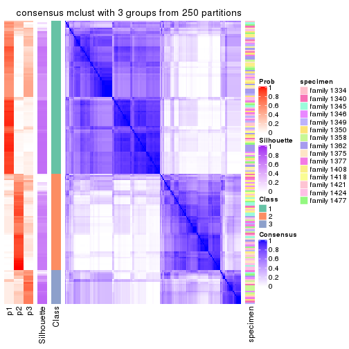</p>

</div>
<div id='tab-MAD-mclust-consensus-heatmap-3'>
<pre><code class="r">consensus_heatmap(res, k = 4)
</code></pre>

<p></p>

</div>
<div id='tab-MAD-mclust-consensus-heatmap-4'>
<pre><code class="r">consensus_heatmap(res, k = 5)
</code></pre>

<p></p>

</div>
<div id='tab-MAD-mclust-consensus-heatmap-5'>
<pre><code class="r">consensus_heatmap(res, k = 6)
</code></pre>

<p></p>

</div>
</div>

Heatmaps for the membership of samples in all partitions to see how consistent they are:


<script>
$( function() {
	$( '#tabs-MAD-mclust-membership-heatmap' ).tabs();
} );
</script>
<div id='tabs-MAD-mclust-membership-heatmap'>
<ul>
<li><a href='#tab-MAD-mclust-membership-heatmap-1'>k = 2</a></li>
<li><a href='#tab-MAD-mclust-membership-heatmap-2'>k = 3</a></li>
<li><a href='#tab-MAD-mclust-membership-heatmap-3'>k = 4</a></li>
<li><a href='#tab-MAD-mclust-membership-heatmap-4'>k = 5</a></li>
<li><a href='#tab-MAD-mclust-membership-heatmap-5'>k = 6</a></li>
</ul>
<div id='tab-MAD-mclust-membership-heatmap-1'>
<pre><code class="r">membership_heatmap(res, k = 2)
</code></pre>

<p></p>

</div>
<div id='tab-MAD-mclust-membership-heatmap-2'>
<pre><code class="r">membership_heatmap(res, k = 3)
</code></pre>

<p></p>

</div>
<div id='tab-MAD-mclust-membership-heatmap-3'>
<pre><code class="r">membership_heatmap(res, k = 4)
</code></pre>

<p></p>

</div>
<div id='tab-MAD-mclust-membership-heatmap-4'>
<pre><code class="r">membership_heatmap(res, k = 5)
</code></pre>

<p></p>

</div>
<div id='tab-MAD-mclust-membership-heatmap-5'>
<pre><code class="r">membership_heatmap(res, k = 6)
</code></pre>

<p></p>

</div>
</div>

As soon as we have had the classes for columns, we can look for signatures
which are significantly different between classes which can be candidate marks
for certain classes. Following are the heatmaps for signatures.


Signature heatmaps where rows are scaled:


<script>
$( function() {
	$( '#tabs-MAD-mclust-get-signatures' ).tabs();
} );
</script>
<div id='tabs-MAD-mclust-get-signatures'>
<ul>
<li><a href='#tab-MAD-mclust-get-signatures-1'>k = 2</a></li>
<li><a href='#tab-MAD-mclust-get-signatures-2'>k = 3</a></li>
<li><a href='#tab-MAD-mclust-get-signatures-3'>k = 4</a></li>
<li><a href='#tab-MAD-mclust-get-signatures-4'>k = 5</a></li>
<li><a href='#tab-MAD-mclust-get-signatures-5'>k = 6</a></li>
</ul>
<div id='tab-MAD-mclust-get-signatures-1'>
<pre><code class="r">get_signatures(res, k = 2)
</code></pre>

<p></p>

</div>
<div id='tab-MAD-mclust-get-signatures-2'>
<pre><code class="r">get_signatures(res, k = 3)
</code></pre>

<p></p>

</div>
<div id='tab-MAD-mclust-get-signatures-3'>
<pre><code class="r">get_signatures(res, k = 4)
</code></pre>

<p></p>

</div>
<div id='tab-MAD-mclust-get-signatures-4'>
<pre><code class="r">get_signatures(res, k = 5)
</code></pre>

<p></p>

</div>
<div id='tab-MAD-mclust-get-signatures-5'>
<pre><code class="r">get_signatures(res, k = 6)
</code></pre>

<p></p>

</div>
</div>


Signature heatmaps where rows are not scaled:


<script>
$( function() {
	$( '#tabs-MAD-mclust-get-signatures-no-scale' ).tabs();
} );
</script>
<div id='tabs-MAD-mclust-get-signatures-no-scale'>
<ul>
<li><a href='#tab-MAD-mclust-get-signatures-no-scale-1'>k = 2</a></li>
<li><a href='#tab-MAD-mclust-get-signatures-no-scale-2'>k = 3</a></li>
<li><a href='#tab-MAD-mclust-get-signatures-no-scale-3'>k = 4</a></li>
<li><a href='#tab-MAD-mclust-get-signatures-no-scale-4'>k = 5</a></li>
<li><a href='#tab-MAD-mclust-get-signatures-no-scale-5'>k = 6</a></li>
</ul>
<div id='tab-MAD-mclust-get-signatures-no-scale-1'>
<pre><code class="r">get_signatures(res, k = 2, scale_rows = FALSE)
</code></pre>

<p></p>

</div>
<div id='tab-MAD-mclust-get-signatures-no-scale-2'>
<pre><code class="r">get_signatures(res, k = 3, scale_rows = FALSE)
</code></pre>

<p></p>

</div>
<div id='tab-MAD-mclust-get-signatures-no-scale-3'>
<pre><code class="r">get_signatures(res, k = 4, scale_rows = FALSE)
</code></pre>

<p></p>

</div>
<div id='tab-MAD-mclust-get-signatures-no-scale-4'>
<pre><code class="r">get_signatures(res, k = 5, scale_rows = FALSE)
</code></pre>

<p></p>

</div>
<div id='tab-MAD-mclust-get-signatures-no-scale-5'>
<pre><code class="r">get_signatures(res, k = 6, scale_rows = FALSE)
</code></pre>

<p></p>

</div>
</div>


Compare the overlap of signatures from different k:

```r
compare_signatures(res)
```


`get_signature()` returns a data frame invisibly. TO get the list of signatures, the function
call should be assigned to a variable explicitly. In following code, if `plot` argument is set
to `FALSE`, no heatmap is plotted while only the differential analysis is performed.

```r
# code only for demonstration
tb = get_signature(res, k = ..., plot = FALSE)
```

An example of the output of `tb` is:

```
#>   which_row         fdr    mean_1    mean_2 scaled_mean_1 scaled_mean_2 km
#> 1        38 0.042760348  8.373488  9.131774    -0.5533452     0.5164555  1
#> 2        40 0.018707592  7.106213  8.469186    -0.6173731     0.5762149  1
#> 3        55 0.019134737 10.221463 11.207825    -0.6159697     0.5749050  1
#> 4        59 0.006059896  5.921854  7.869574    -0.6899429     0.6439467  1
#> 5        60 0.018055526  8.928898 10.211722    -0.6204761     0.5791110  1
#> 6        98 0.009384629 15.714769 14.887706     0.6635654    -0.6193277  2
...
```

The columns in `tb` are:

1. `which_row`: row indices corresponding to the input matrix.
2. `fdr`: FDR for the differential test. 
3. `mean_x`: The mean value in group x.
4. `scaled_mean_x`: The mean value in group x after rows are scaled.
5. `km`: Row groups if k-means clustering is applied to rows.


UMAP plot which shows how samples are separated.


<script>
$( function() {
	$( '#tabs-MAD-mclust-dimension-reduction' ).tabs();
} );
</script>
<div id='tabs-MAD-mclust-dimension-reduction'>
<ul>
<li><a href='#tab-MAD-mclust-dimension-reduction-1'>k = 2</a></li>
<li><a href='#tab-MAD-mclust-dimension-reduction-2'>k = 3</a></li>
<li><a href='#tab-MAD-mclust-dimension-reduction-3'>k = 4</a></li>
<li><a href='#tab-MAD-mclust-dimension-reduction-4'>k = 5</a></li>
<li><a href='#tab-MAD-mclust-dimension-reduction-5'>k = 6</a></li>
</ul>
<div id='tab-MAD-mclust-dimension-reduction-1'>
<pre><code class="r">dimension_reduction(res, k = 2, method = &quot;UMAP&quot;)
</code></pre>

<p></p>

</div>
<div id='tab-MAD-mclust-dimension-reduction-2'>
<pre><code class="r">dimension_reduction(res, k = 3, method = &quot;UMAP&quot;)
</code></pre>

<p></p>

</div>
<div id='tab-MAD-mclust-dimension-reduction-3'>
<pre><code class="r">dimension_reduction(res, k = 4, method = &quot;UMAP&quot;)
</code></pre>

<p></p>

</div>
<div id='tab-MAD-mclust-dimension-reduction-4'>
<pre><code class="r">dimension_reduction(res, k = 5, method = &quot;UMAP&quot;)
</code></pre>

<p></p>

</div>
<div id='tab-MAD-mclust-dimension-reduction-5'>
<pre><code class="r">dimension_reduction(res, k = 6, method = &quot;UMAP&quot;)
</code></pre>

<p></p>

</div>
</div>


Following heatmap shows how subgroups are split when increasing `k`:

```r
collect_classes(res)
```


Test correlation between subgroups and known annotations. If the known
annotation is numeric, one-way ANOVA test is applied, and if the known
annotation is discrete, chi-squared contingency table test is applied.

```r
test_to_known_factors(res)
```

```
#>              n specimen(p) k
#> MAD:mclust 155    0.012979 2
#> MAD:mclust 140    0.006141 3
#> MAD:mclust 117    0.000789 4
#> MAD:mclust 115    0.005952 5
#> MAD:mclust 146    0.007571 6
```


If matrix rows can be associated to genes, consider to use `GO_Enrichment(res,
...)` to perform function enrichment for the signature genes.


 

---------------------------------------------------


### MAD:NMF


The object with results only for a single top-value method and a single partition method 
can be extracted as:

```r
res = res_list["MAD", "NMF"]
# you can also extract it by
# res = res_list["MAD:NMF"]
```

A summary of `res` and all the functions that can be applied to it:

```r
res
```

```
#> A 'ConsensusPartition' object with k = 2, 3, 4, 5, 6.
#>   On a matrix with 22686 rows and 167 columns.
#>   Top rows (1000, 2000, 3000, 4000, 5000) are extracted by 'MAD' method.
#>   Subgroups are detected by 'NMF' method.
#>   Performed in total 1250 partitions by row resampling.
#>   Best k for subgroups seems to be 2.
#> 
#> Following methods can be applied to this 'ConsensusPartition' object:
#>  [1] "cola_report"             "collect_classes"         "collect_plots"          
#>  [4] "collect_stats"           "colnames"                "compare_signatures"     
#>  [7] "consensus_heatmap"       "dimension_reduction"     "functional_enrichment"  
#> [10] "get_anno_col"            "get_anno"                "get_classes"            
#> [13] "get_consensus"           "get_matrix"              "get_membership"         
#> [16] "get_param"               "get_signatures"          "get_stats"              
#> [19] "is_best_k"               "is_stable_k"             "membership_heatmap"     
#> [22] "ncol"                    "nrow"                    "plot_ecdf"              
#> [25] "rownames"                "select_partition_number" "show"                   
#> [28] "suggest_best_k"          "test_to_known_factors"
```

`collect_plots()` function collects all the plots made from `res` for all `k` (number of partitions)
into one single page to provide an easy and fast comparison between different `k`.

```r
collect_plots(res)
```


The plots are:

- The first row: a plot of the ECDF (Empirical cumulative distribution
  function) curves of the consensus matrix for each `k` and the heatmap of
  predicted classes for each `k`.
- The second row: heatmaps of the consensus matrix for each `k`.
- The third row: heatmaps of the membership matrix for each `k`.
- The fouth row: heatmaps of the signatures for each `k`.

All the plots in panels can be made by individual functions and they are
plotted later in this section.

`select_partition_number()` produces several plots showing different
statistics for choosing "optimized" `k`. There are following statistics:

- ECDF curves of the consensus matrix for each `k`;
- 1-PAC. [The PAC
  score](https://en.wikipedia.org/wiki/Consensus_clustering#Over-interpretation_potential_of_consensus_clustering)
  measures the proportion of the ambiguous subgrouping.
- Mean silhouette score.
- Concordance. The mean probability of fiting the consensus class ids in all
  partitions.
- Area increased. Denote $A_k$ as the area under the ECDF curve for current
  `k`, the area increased is defined as $A_k - A_{k-1}$.
- Rand index. The percent of pairs of samples that are both in a same cluster
  or both are not in a same cluster in the partition of k and k-1.
- Jaccard index. The ratio of pairs of samples are both in a same cluster in
  the partition of k and k-1 and the pairs of samples are both in a same
  cluster in the partition k or k-1.

The detailed explanations of these statistics can be found in [the cola
vignette](http://bioconductor.org/packages/devel/bioc/vignettes/cola/inst/doc/cola.html#toc_13).

Generally speaking, lower PAC score, higher mean silhouette score or higher
concordance corresponds to better partition. Rand index and Jaccard index
measure how similar the current partition is compared to partition with `k-1`.
If they are too similar, we won't accept `k` is better than `k-1`.

```r
select_partition_number(res)
```


The numeric values for all these statistics can be obtained by `get_stats()`.

```r
get_stats(res)
```

```
#>   k 1-PAC mean_silhouette concordance area_increased  Rand Jaccard
#> 2 2 0.410           0.633       0.844         0.4907 0.497   0.497
#> 3 3 0.407           0.643       0.769         0.3293 0.706   0.481
#> 4 4 0.512           0.538       0.742         0.0879 0.887   0.704
#> 5 5 0.552           0.564       0.751         0.0800 0.866   0.608
#> 6 6 0.615           0.566       0.759         0.0533 0.812   0.402
```

`suggest_best_k()` suggests the best $k$ based on these statistics. The rules are as follows:

- All $k$ with Jaccard index larger than 0.95 are removed because the increase of
  the partition number does not provides enough extra information. If all $k$ are removed,
  the best $k$ is assigned by `NA`.
- For $k$ with 1-PAC larger than 0.9, the maximal $k$ is taken as the "best k". Other $k$ is called "optional k".
- If it does not fit the second rule. The $k$ with the highest vote of highest
  1-PAC, mean silhouette and concordance is taken as the "best k".

```r
suggest_best_k(res)
```

```
#> [1] 2
```


Following shows the table of the partitions (You need to click the **show/hide
code output** link to see it). The membership matrix (columns with name `p*`)
is inferred by
[`clue::cl_consensus()`](https://www.rdocumentation.org/link/cl_consensus?package=clue)
function with the `SE` method. Basically the value in the membership matrix
represents the probability to belong to a certain group. The finall class
label for an item is determined with the group with highest probability it
belongs to.

In `get_classes()` function, the entropy is calculated from the membership
matrix and the silhouette score is calculated from the consensus matrix.


<script>
$( function() {
	$( '#tabs-MAD-NMF-get-classes' ).tabs();
} );
</script>
<div id='tabs-MAD-NMF-get-classes'>
<ul>
<li><a href='#tab-MAD-NMF-get-classes-1'>k = 2</a></li>
<li><a href='#tab-MAD-NMF-get-classes-2'>k = 3</a></li>
<li><a href='#tab-MAD-NMF-get-classes-3'>k = 4</a></li>
<li><a href='#tab-MAD-NMF-get-classes-4'>k = 5</a></li>
<li><a href='#tab-MAD-NMF-get-classes-5'>k = 6</a></li>
</ul>

<div id='tab-MAD-NMF-get-classes-1'>
<p><a id='tab-MAD-NMF-get-classes-1-a' style='color:#0366d6' href='#'>show/hide code output</a></p>
<pre><code class="r">cbind(get_classes(res, k = 2), get_membership(res, k = 2))
</code></pre>

<pre><code>#&gt;          class entropy silhouette    p1    p2
#&gt; GSM30006     2  0.0000   0.740744 0.000 1.000
#&gt; GSM30007     1  0.0000   0.820961 1.000 0.000
#&gt; GSM30008     1  0.0000   0.820961 1.000 0.000
#&gt; GSM30009     1  0.0000   0.820961 1.000 0.000
#&gt; GSM30010     2  0.8713   0.353083 0.292 0.708
#&gt; GSM30011     2  0.0000   0.740744 0.000 1.000
#&gt; GSM30012     2  0.0000   0.740744 0.000 1.000
#&gt; GSM30013     2  0.0000   0.740744 0.000 1.000
#&gt; GSM30014     1  0.9815   0.350167 0.580 0.420
#&gt; GSM30015     1  0.0000   0.820961 1.000 0.000
#&gt; GSM30016     1  0.8443   0.558550 0.728 0.272
#&gt; GSM30017     1  0.0000   0.820961 1.000 0.000
#&gt; GSM30018     2  0.9754   0.525326 0.408 0.592
#&gt; GSM30019     2  0.0000   0.740744 0.000 1.000
#&gt; GSM30020     1  0.0000   0.820961 1.000 0.000
#&gt; GSM30021     1  0.8763   0.528428 0.704 0.296
#&gt; GSM30022     1  0.0000   0.820961 1.000 0.000
#&gt; GSM30023     2  0.9933   0.435046 0.452 0.548
#&gt; GSM30024     1  0.9710   0.383983 0.600 0.400
#&gt; GSM30025     1  0.0000   0.820961 1.000 0.000
#&gt; GSM30026     1  0.3584   0.752615 0.932 0.068
#&gt; GSM30027     1  0.0000   0.820961 1.000 0.000
#&gt; GSM30028     1  0.0000   0.820961 1.000 0.000
#&gt; GSM30029     1  0.0000   0.820961 1.000 0.000
#&gt; GSM30030     1  0.0000   0.820961 1.000 0.000
#&gt; GSM30031     1  0.0000   0.820961 1.000 0.000
#&gt; GSM30032     1  0.0000   0.820961 1.000 0.000
#&gt; GSM30033     1  0.9732   0.377737 0.596 0.404
#&gt; GSM30034     2  0.9710   0.538680 0.400 0.600
#&gt; GSM30035     1  0.4161   0.753969 0.916 0.084
#&gt; GSM30036     2  0.7815   0.661561 0.232 0.768
#&gt; GSM30037     1  0.0000   0.820961 1.000 0.000
#&gt; GSM30038     1  0.7674   0.616634 0.776 0.224
#&gt; GSM30039     2  0.0000   0.740744 0.000 1.000
#&gt; GSM30040     2  0.8267   0.417820 0.260 0.740
#&gt; GSM30041     2  0.0000   0.740744 0.000 1.000
#&gt; GSM30042     2  0.0000   0.740744 0.000 1.000
#&gt; GSM30043     1  0.9977   0.244778 0.528 0.472
#&gt; GSM30044     1  0.0000   0.820961 1.000 0.000
#&gt; GSM30045     1  0.0000   0.820961 1.000 0.000
#&gt; GSM30046     2  0.9710   0.538680 0.400 0.600
#&gt; GSM30047     2  0.9358   0.579461 0.352 0.648
#&gt; GSM30048     1  0.9795  -0.031866 0.584 0.416
#&gt; GSM30049     2  0.0000   0.740744 0.000 1.000
#&gt; GSM30050     2  0.5059   0.717715 0.112 0.888
#&gt; GSM30051     2  0.0000   0.740744 0.000 1.000
#&gt; GSM30052     1  0.0000   0.820961 1.000 0.000
#&gt; GSM30053     2  0.0000   0.740744 0.000 1.000
#&gt; GSM30054     2  0.0000   0.740744 0.000 1.000
#&gt; GSM30055     2  0.0376   0.738415 0.004 0.996
#&gt; GSM30056     2  0.0000   0.740744 0.000 1.000
#&gt; GSM30057     2  0.9710   0.087447 0.400 0.600
#&gt; GSM30058     2  0.0000   0.740744 0.000 1.000
#&gt; GSM30059     2  0.9732   0.532094 0.404 0.596
#&gt; GSM30060     1  0.7299   0.638551 0.796 0.204
#&gt; GSM30061     2  0.9710   0.538680 0.400 0.600
#&gt; GSM30062     2  0.9710   0.538680 0.400 0.600
#&gt; GSM30063     2  0.0000   0.740744 0.000 1.000
#&gt; GSM30064     1  0.0000   0.820961 1.000 0.000
#&gt; GSM30065     2  0.0000   0.740744 0.000 1.000
#&gt; GSM30066     1  0.9710   0.383983 0.600 0.400
#&gt; GSM30067     1  0.0000   0.820961 1.000 0.000
#&gt; GSM30068     1  0.9710   0.383983 0.600 0.400
#&gt; GSM30069     1  0.9710   0.383983 0.600 0.400
#&gt; GSM30070     2  0.0376   0.738415 0.004 0.996
#&gt; GSM30071     2  0.5059   0.718466 0.112 0.888
#&gt; GSM30072     1  0.0000   0.820961 1.000 0.000
#&gt; GSM30073     2  0.7376   0.674893 0.208 0.792
#&gt; GSM30074     1  0.7139   0.647056 0.804 0.196
#&gt; GSM30075     2  0.4690   0.721284 0.100 0.900
#&gt; GSM30076     2  0.9248   0.588695 0.340 0.660
#&gt; GSM30077     2  0.9710   0.538680 0.400 0.600
#&gt; GSM30078     2  0.9710   0.538680 0.400 0.600
#&gt; GSM30079     1  0.0000   0.820961 1.000 0.000
#&gt; GSM30080     2  0.0000   0.740744 0.000 1.000
#&gt; GSM30081     2  0.0000   0.740744 0.000 1.000
#&gt; GSM30086     2  0.4939   0.718994 0.108 0.892
#&gt; GSM30087     2  0.9710   0.538680 0.400 0.600
#&gt; GSM30088     1  0.9922  -0.153001 0.552 0.448
#&gt; GSM30089     1  0.0000   0.820961 1.000 0.000
#&gt; GSM30090     2  0.0000   0.740744 0.000 1.000
#&gt; GSM30091     2  0.0000   0.740744 0.000 1.000
#&gt; GSM30092     2  0.9710   0.538680 0.400 0.600
#&gt; GSM30093     2  0.0000   0.740744 0.000 1.000
#&gt; GSM30094     2  0.0000   0.740744 0.000 1.000
#&gt; GSM30095     2  0.9635   0.120674 0.388 0.612
#&gt; GSM30096     1  0.0000   0.820961 1.000 0.000
#&gt; GSM30097     2  0.9881   0.470633 0.436 0.564
#&gt; GSM30098     1  0.0000   0.820961 1.000 0.000
#&gt; GSM30099     2  0.0000   0.740744 0.000 1.000
#&gt; GSM30100     1  0.9710   0.383983 0.600 0.400
#&gt; GSM30101     2  0.0000   0.740744 0.000 1.000
#&gt; GSM30102     2  0.0000   0.740744 0.000 1.000
#&gt; GSM30103     1  0.0000   0.820961 1.000 0.000
#&gt; GSM30104     2  0.7219   0.678880 0.200 0.800
#&gt; GSM30105     1  0.0000   0.820961 1.000 0.000
#&gt; GSM30106     2  0.9795   0.510808 0.416 0.584
#&gt; GSM30107     2  0.9710   0.538680 0.400 0.600
#&gt; GSM30108     1  0.0000   0.820961 1.000 0.000
#&gt; GSM30109     1  0.0000   0.820961 1.000 0.000
#&gt; GSM30110     2  0.9983   0.375104 0.476 0.524
#&gt; GSM30111     1  0.0000   0.820961 1.000 0.000
#&gt; GSM30112     1  0.0000   0.820961 1.000 0.000
#&gt; GSM30113     2  0.9686   0.098676 0.396 0.604
#&gt; GSM30114     2  0.0000   0.740744 0.000 1.000
#&gt; GSM30115     2  0.9710   0.538680 0.400 0.600
#&gt; GSM30116     1  0.9710   0.383983 0.600 0.400
#&gt; GSM30117     1  0.0000   0.820961 1.000 0.000
#&gt; GSM30118     1  0.7139   0.646984 0.804 0.196
#&gt; GSM30119     2  0.0000   0.740744 0.000 1.000
#&gt; GSM30120     2  0.9795   0.510907 0.416 0.584
#&gt; GSM30121     1  0.0000   0.820961 1.000 0.000
#&gt; GSM30122     1  0.0000   0.820961 1.000 0.000
#&gt; GSM30123     2  0.0000   0.740744 0.000 1.000
#&gt; GSM30177     2  0.0000   0.740744 0.000 1.000
#&gt; GSM30178     2  0.9608   0.553067 0.384 0.616
#&gt; GSM30179     1  0.0000   0.820961 1.000 0.000
#&gt; GSM30180     1  0.0000   0.820961 1.000 0.000
#&gt; GSM30181     2  0.9710   0.538680 0.400 0.600
#&gt; GSM30182     2  0.9710   0.538680 0.400 0.600
#&gt; GSM30183     1  0.0000   0.820961 1.000 0.000
#&gt; GSM30184     2  0.0000   0.740744 0.000 1.000
#&gt; GSM30185     1  0.0000   0.820961 1.000 0.000
#&gt; GSM30186     2  0.5519   0.626387 0.128 0.872
#&gt; GSM30187     2  0.9710   0.538680 0.400 0.600
#&gt; GSM30188     2  0.9710   0.538680 0.400 0.600
#&gt; GSM30189     1  0.9775  -0.016170 0.588 0.412
#&gt; GSM30190     2  0.0000   0.740744 0.000 1.000
#&gt; GSM30191     2  0.6887   0.687140 0.184 0.816
#&gt; GSM30192     2  0.2423   0.734641 0.040 0.960
#&gt; GSM30193     2  0.9710   0.538680 0.400 0.600
#&gt; GSM30194     2  0.0000   0.740744 0.000 1.000
#&gt; GSM30195     1  0.0376   0.817516 0.996 0.004
#&gt; GSM30196     1  0.0000   0.820961 1.000 0.000
#&gt; GSM30197     2  0.9710   0.538680 0.400 0.600
#&gt; GSM30198     1  0.7883   0.488789 0.764 0.236
#&gt; GSM30199     1  0.0000   0.820961 1.000 0.000
#&gt; GSM30200     1  0.9635   0.072547 0.612 0.388
#&gt; GSM30201     1  0.9866  -0.093514 0.568 0.432
#&gt; GSM30202     1  0.0000   0.820961 1.000 0.000
#&gt; GSM30203     2  0.9710   0.538680 0.400 0.600
#&gt; GSM30204     1  0.7602   0.521093 0.780 0.220
#&gt; GSM30205     1  0.9522   0.424346 0.628 0.372
#&gt; GSM30206     1  0.9866  -0.093514 0.568 0.432
#&gt; GSM30207     1  0.9580   0.100218 0.620 0.380
#&gt; GSM30208     1  0.9000   0.295793 0.684 0.316
#&gt; GSM30209     2  0.4690   0.657716 0.100 0.900
#&gt; GSM30210     1  0.0000   0.820961 1.000 0.000
#&gt; GSM30211     1  0.9754  -0.000666 0.592 0.408
#&gt; GSM30212     1  0.0000   0.820961 1.000 0.000
#&gt; GSM30213     1  0.0000   0.820961 1.000 0.000
#&gt; GSM30214     1  0.0000   0.820961 1.000 0.000
#&gt; GSM30215     1  0.0000   0.820961 1.000 0.000
#&gt; GSM30216     1  0.0000   0.820961 1.000 0.000
#&gt; GSM30217     1  0.0000   0.820961 1.000 0.000
#&gt; GSM30218     2  0.9970   0.396227 0.468 0.532
#&gt; GSM30219     1  0.9732   0.377603 0.596 0.404
#&gt; GSM30220     1  0.0000   0.820961 1.000 0.000
#&gt; GSM30221     2  0.9710   0.538680 0.400 0.600
#&gt; GSM30222     2  0.9710   0.538680 0.400 0.600
#&gt; GSM30223     1  0.0000   0.820961 1.000 0.000
#&gt; GSM30224     1  0.9775  -0.016170 0.588 0.412
#&gt; GSM30225     1  0.0000   0.820961 1.000 0.000
#&gt; GSM30226     1  0.0000   0.820961 1.000 0.000
#&gt; GSM30227     1  0.0000   0.820961 1.000 0.000
#&gt; GSM30228     2  0.0000   0.740744 0.000 1.000
#&gt; GSM30229     2  0.5842   0.706975 0.140 0.860
</code></pre>

<script>
$('#tab-MAD-NMF-get-classes-1-a').parent().next().next().hide();
$('#tab-MAD-NMF-get-classes-1-a').click(function(){
  $('#tab-MAD-NMF-get-classes-1-a').parent().next().next().toggle();
  return(false);
});
</script>
</div>

<div id='tab-MAD-NMF-get-classes-2'>
<p><a id='tab-MAD-NMF-get-classes-2-a' style='color:#0366d6' href='#'>show/hide code output</a></p>
<pre><code class="r">cbind(get_classes(res, k = 3), get_membership(res, k = 3))
</code></pre>

<pre><code>#&gt;          class entropy silhouette    p1    p2    p3
#&gt; GSM30006     3  0.5948    0.60826 0.360 0.000 0.640
#&gt; GSM30007     2  0.3377    0.76302 0.012 0.896 0.092
#&gt; GSM30008     2  0.7223    0.72328 0.144 0.716 0.140
#&gt; GSM30009     2  0.2056    0.79699 0.024 0.952 0.024
#&gt; GSM30010     3  0.5955    0.63111 0.048 0.180 0.772
#&gt; GSM30011     3  0.5706    0.65512 0.320 0.000 0.680
#&gt; GSM30012     1  0.4399    0.62672 0.812 0.000 0.188
#&gt; GSM30013     1  0.3816    0.68326 0.852 0.000 0.148
#&gt; GSM30014     3  0.5285    0.50060 0.004 0.244 0.752
#&gt; GSM30015     2  0.8091    0.54855 0.320 0.592 0.088
#&gt; GSM30016     2  0.7286    0.02936 0.028 0.508 0.464
#&gt; GSM30017     2  0.8690    0.48327 0.308 0.560 0.132
#&gt; GSM30018     1  0.1964    0.79029 0.944 0.056 0.000
#&gt; GSM30019     1  0.6168    0.01807 0.588 0.000 0.412
#&gt; GSM30020     2  0.6792    0.73685 0.124 0.744 0.132
#&gt; GSM30021     2  0.6244    0.29569 0.000 0.560 0.440
#&gt; GSM30022     2  0.4095    0.79699 0.056 0.880 0.064
#&gt; GSM30023     1  0.6448    0.68107 0.764 0.104 0.132
#&gt; GSM30024     3  0.6308    0.11746 0.000 0.492 0.508
#&gt; GSM30025     2  0.3551    0.76929 0.000 0.868 0.132
#&gt; GSM30026     2  0.9331    0.37789 0.344 0.480 0.176
#&gt; GSM30027     2  0.4485    0.75749 0.020 0.844 0.136
#&gt; GSM30028     2  0.6915    0.72931 0.140 0.736 0.124
#&gt; GSM30029     2  0.7211    0.71555 0.156 0.716 0.128
#&gt; GSM30030     2  0.1765    0.79747 0.040 0.956 0.004
#&gt; GSM30031     2  0.6597    0.74012 0.120 0.756 0.124
#&gt; GSM30032     2  0.4897    0.74404 0.016 0.812 0.172
#&gt; GSM30033     3  0.5656    0.42110 0.004 0.284 0.712
#&gt; GSM30034     1  0.4859    0.72356 0.840 0.116 0.044
#&gt; GSM30035     2  0.5406    0.71044 0.020 0.780 0.200
#&gt; GSM30036     1  0.3983    0.73185 0.884 0.048 0.068
#&gt; GSM30037     2  0.2866    0.76962 0.008 0.916 0.076
#&gt; GSM30038     2  0.7777    0.32963 0.060 0.576 0.364
#&gt; GSM30039     1  0.4346    0.63257 0.816 0.000 0.184
#&gt; GSM30040     3  0.5020    0.61794 0.012 0.192 0.796
#&gt; GSM30041     3  0.5650    0.66085 0.312 0.000 0.688
#&gt; GSM30042     3  0.6192    0.49131 0.420 0.000 0.580
#&gt; GSM30043     3  0.5618    0.55276 0.008 0.260 0.732
#&gt; GSM30044     2  0.4658    0.78227 0.068 0.856 0.076
#&gt; GSM30045     2  0.4830    0.77888 0.068 0.848 0.084
#&gt; GSM30046     1  0.0983    0.79720 0.980 0.016 0.004
#&gt; GSM30047     1  0.2939    0.76946 0.916 0.012 0.072
#&gt; GSM30048     1  0.4423    0.76069 0.864 0.088 0.048
#&gt; GSM30049     3  0.5623    0.67106 0.280 0.004 0.716
#&gt; GSM30050     1  0.4551    0.67776 0.844 0.024 0.132
#&gt; GSM30051     3  0.5706    0.65512 0.320 0.000 0.680
#&gt; GSM30052     2  0.2680    0.77356 0.008 0.924 0.068
#&gt; GSM30053     1  0.4121    0.65556 0.832 0.000 0.168
#&gt; GSM30054     3  0.5621    0.66295 0.308 0.000 0.692
#&gt; GSM30055     3  0.5722    0.64248 0.132 0.068 0.800
#&gt; GSM30056     3  0.6026    0.59188 0.376 0.000 0.624
#&gt; GSM30057     3  0.4897    0.59762 0.016 0.172 0.812
#&gt; GSM30058     3  0.5650    0.66072 0.312 0.000 0.688
#&gt; GSM30059     1  0.4390    0.73027 0.840 0.148 0.012
#&gt; GSM30060     2  0.4178    0.70169 0.000 0.828 0.172
#&gt; GSM30061     1  0.1905    0.79907 0.956 0.016 0.028
#&gt; GSM30062     1  0.3771    0.75944 0.876 0.012 0.112
#&gt; GSM30063     1  0.3879    0.67740 0.848 0.000 0.152
#&gt; GSM30064     2  0.5179    0.78392 0.080 0.832 0.088
#&gt; GSM30065     1  0.6192   -0.00872 0.580 0.000 0.420
#&gt; GSM30066     3  0.5480    0.50192 0.004 0.264 0.732
#&gt; GSM30067     2  0.4475    0.79202 0.072 0.864 0.064
#&gt; GSM30068     3  0.5902    0.42154 0.004 0.316 0.680
#&gt; GSM30069     3  0.5929    0.46640 0.004 0.320 0.676
#&gt; GSM30070     1  0.8675   -0.13011 0.476 0.104 0.420
#&gt; GSM30071     1  0.4209    0.76916 0.860 0.020 0.120
#&gt; GSM30072     2  0.4056    0.77154 0.032 0.876 0.092
#&gt; GSM30073     1  0.2173    0.77881 0.944 0.008 0.048
#&gt; GSM30074     2  0.8375    0.52821 0.092 0.540 0.368
#&gt; GSM30075     1  0.4195    0.76045 0.852 0.012 0.136
#&gt; GSM30076     1  0.1453    0.78947 0.968 0.008 0.024
#&gt; GSM30077     1  0.1491    0.79843 0.968 0.016 0.016
#&gt; GSM30078     1  0.1182    0.79674 0.976 0.012 0.012
#&gt; GSM30079     2  0.2318    0.79691 0.028 0.944 0.028
#&gt; GSM30080     1  0.2066    0.77665 0.940 0.000 0.060
#&gt; GSM30081     3  0.5733    0.65126 0.324 0.000 0.676
#&gt; GSM30086     1  0.3295    0.78378 0.896 0.008 0.096
#&gt; GSM30087     1  0.1529    0.79509 0.960 0.040 0.000
#&gt; GSM30088     1  0.3918    0.74300 0.856 0.140 0.004
#&gt; GSM30089     2  0.4527    0.77674 0.052 0.860 0.088
#&gt; GSM30090     3  0.5621    0.66295 0.308 0.000 0.692
#&gt; GSM30091     3  0.5591    0.66495 0.304 0.000 0.696
#&gt; GSM30092     1  0.1751    0.79826 0.960 0.012 0.028
#&gt; GSM30093     3  0.6307    0.33563 0.488 0.000 0.512
#&gt; GSM30094     3  0.5560    0.66509 0.300 0.000 0.700
#&gt; GSM30095     3  0.3425    0.60280 0.004 0.112 0.884
#&gt; GSM30096     2  0.5891    0.77073 0.052 0.780 0.168
#&gt; GSM30097     1  0.4861    0.68706 0.800 0.192 0.008
#&gt; GSM30098     2  0.3875    0.78939 0.044 0.888 0.068
#&gt; GSM30099     3  0.7447    0.64480 0.280 0.068 0.652
#&gt; GSM30100     3  0.6057    0.46277 0.004 0.340 0.656
#&gt; GSM30101     3  0.5785    0.64371 0.332 0.000 0.668
#&gt; GSM30102     3  0.6062    0.57114 0.384 0.000 0.616
#&gt; GSM30103     2  0.3295    0.76308 0.008 0.896 0.096
#&gt; GSM30104     1  0.3276    0.75186 0.908 0.024 0.068
#&gt; GSM30105     2  0.1765    0.79815 0.040 0.956 0.004
#&gt; GSM30106     1  0.2774    0.78422 0.920 0.072 0.008
#&gt; GSM30107     1  0.1905    0.79597 0.956 0.016 0.028
#&gt; GSM30108     2  0.4479    0.77286 0.044 0.860 0.096
#&gt; GSM30109     2  0.5631    0.77330 0.132 0.804 0.064
#&gt; GSM30110     1  0.5319    0.71697 0.824 0.104 0.072
#&gt; GSM30111     2  0.7731    0.69618 0.228 0.664 0.108
#&gt; GSM30112     2  0.5588    0.78001 0.068 0.808 0.124
#&gt; GSM30113     3  0.6025    0.60158 0.028 0.232 0.740
#&gt; GSM30114     1  0.1964    0.77547 0.944 0.000 0.056
#&gt; GSM30115     1  0.1647    0.79658 0.960 0.036 0.004
#&gt; GSM30116     3  0.6629    0.38314 0.016 0.360 0.624
#&gt; GSM30117     2  0.5585    0.69622 0.024 0.772 0.204
#&gt; GSM30118     2  0.7012    0.58550 0.040 0.652 0.308
#&gt; GSM30119     3  0.5948    0.59409 0.360 0.000 0.640
#&gt; GSM30120     1  0.4189    0.75708 0.876 0.056 0.068
#&gt; GSM30121     2  0.5393    0.78173 0.108 0.820 0.072
#&gt; GSM30122     2  0.4092    0.77770 0.036 0.876 0.088
#&gt; GSM30123     1  0.6510    0.19486 0.624 0.012 0.364
#&gt; GSM30177     1  0.6305   -0.27169 0.516 0.000 0.484
#&gt; GSM30178     1  0.1031    0.79102 0.976 0.000 0.024
#&gt; GSM30179     2  0.6975    0.72657 0.144 0.732 0.124
#&gt; GSM30180     2  0.4749    0.78978 0.072 0.852 0.076
#&gt; GSM30181     1  0.1315    0.79755 0.972 0.020 0.008
#&gt; GSM30182     1  0.0747    0.79780 0.984 0.016 0.000
#&gt; GSM30183     2  0.6490    0.74798 0.172 0.752 0.076
#&gt; GSM30184     3  0.5591    0.66495 0.304 0.000 0.696
#&gt; GSM30185     2  0.4045    0.77079 0.024 0.872 0.104
#&gt; GSM30186     3  0.7265    0.57789 0.076 0.240 0.684
#&gt; GSM30187     1  0.1289    0.78681 0.968 0.000 0.032
#&gt; GSM30188     1  0.0892    0.79800 0.980 0.020 0.000
#&gt; GSM30189     1  0.7851    0.39352 0.616 0.304 0.080
#&gt; GSM30190     3  0.5882    0.62433 0.348 0.000 0.652
#&gt; GSM30191     1  0.4339    0.73135 0.868 0.048 0.084
#&gt; GSM30192     1  0.1753    0.77651 0.952 0.000 0.048
#&gt; GSM30193     1  0.0983    0.79720 0.980 0.016 0.004
#&gt; GSM30194     3  0.5497    0.66839 0.292 0.000 0.708
#&gt; GSM30195     2  0.7232    0.71151 0.172 0.712 0.116
#&gt; GSM30196     2  0.4745    0.78057 0.068 0.852 0.080
#&gt; GSM30197     1  0.3253    0.78550 0.912 0.036 0.052
#&gt; GSM30198     1  0.8559    0.31894 0.572 0.304 0.124
#&gt; GSM30199     2  0.2878    0.77478 0.000 0.904 0.096
#&gt; GSM30200     1  0.7319    0.60694 0.708 0.164 0.128
#&gt; GSM30201     1  0.4848    0.73518 0.836 0.128 0.036
#&gt; GSM30202     2  0.6324    0.75460 0.160 0.764 0.076
#&gt; GSM30203     1  0.0661    0.79425 0.988 0.004 0.008
#&gt; GSM30204     1  0.8712    0.27847 0.556 0.312 0.132
#&gt; GSM30205     3  0.6282    0.20470 0.004 0.384 0.612
#&gt; GSM30206     1  0.7058    0.63046 0.720 0.180 0.100
#&gt; GSM30207     2  0.9110    0.16839 0.420 0.440 0.140
#&gt; GSM30208     2  0.8995    0.32577 0.372 0.492 0.136
#&gt; GSM30209     3  0.8410    0.65540 0.164 0.216 0.620
#&gt; GSM30210     2  0.4786    0.76894 0.044 0.844 0.112
#&gt; GSM30211     1  0.6455    0.67587 0.764 0.128 0.108
#&gt; GSM30212     2  0.1170    0.79046 0.008 0.976 0.016
#&gt; GSM30213     2  0.1170    0.79461 0.016 0.976 0.008
#&gt; GSM30214     2  0.3445    0.78857 0.016 0.896 0.088
#&gt; GSM30215     2  0.5637    0.76034 0.040 0.788 0.172
#&gt; GSM30216     2  0.4189    0.79370 0.056 0.876 0.068
#&gt; GSM30217     2  0.4551    0.75851 0.024 0.844 0.132
#&gt; GSM30218     2  0.9457    0.15019 0.340 0.468 0.192
#&gt; GSM30219     3  0.5754    0.45218 0.004 0.296 0.700
#&gt; GSM30220     2  0.2584    0.77550 0.008 0.928 0.064
#&gt; GSM30221     1  0.1015    0.79553 0.980 0.012 0.008
#&gt; GSM30222     1  0.1453    0.79773 0.968 0.024 0.008
#&gt; GSM30223     2  0.4737    0.78784 0.084 0.852 0.064
#&gt; GSM30224     1  0.7034    0.51466 0.668 0.284 0.048
#&gt; GSM30225     1  0.8608    0.03325 0.512 0.384 0.104
#&gt; GSM30226     2  0.4209    0.76211 0.016 0.856 0.128
#&gt; GSM30227     2  0.7983    0.63566 0.264 0.632 0.104
#&gt; GSM30228     3  0.6168    0.51751 0.412 0.000 0.588
#&gt; GSM30229     1  0.4172    0.67984 0.840 0.004 0.156
</code></pre>

<script>
$('#tab-MAD-NMF-get-classes-2-a').parent().next().next().hide();
$('#tab-MAD-NMF-get-classes-2-a').click(function(){
  $('#tab-MAD-NMF-get-classes-2-a').parent().next().next().toggle();
  return(false);
});
</script>
</div>

<div id='tab-MAD-NMF-get-classes-3'>
<p><a id='tab-MAD-NMF-get-classes-3-a' style='color:#0366d6' href='#'>show/hide code output</a></p>
<pre><code class="r">cbind(get_classes(res, k = 4), get_membership(res, k = 4))
</code></pre>

<pre><code>#&gt;          class entropy silhouette    p1    p2    p3    p4
#&gt; GSM30006     2  0.7366     0.3565 0.000 0.484 0.172 0.344
#&gt; GSM30007     1  0.4817     0.6706 0.612 0.388 0.000 0.000
#&gt; GSM30008     1  0.4095     0.6676 0.792 0.000 0.192 0.016
#&gt; GSM30009     1  0.4585     0.7019 0.668 0.332 0.000 0.000
#&gt; GSM30010     2  0.0657     0.4316 0.000 0.984 0.004 0.012
#&gt; GSM30011     2  0.7138     0.4151 0.000 0.540 0.164 0.296
#&gt; GSM30012     4  0.2797     0.7188 0.000 0.068 0.032 0.900
#&gt; GSM30013     4  0.1356     0.7593 0.000 0.032 0.008 0.960
#&gt; GSM30014     2  0.4957     0.3655 0.112 0.776 0.112 0.000
#&gt; GSM30015     1  0.4746     0.3010 0.688 0.000 0.008 0.304
#&gt; GSM30016     2  0.3123     0.3272 0.156 0.844 0.000 0.000
#&gt; GSM30017     1  0.7227     0.5662 0.628 0.032 0.192 0.148
#&gt; GSM30018     4  0.2011     0.7682 0.080 0.000 0.000 0.920
#&gt; GSM30019     4  0.4891     0.3180 0.000 0.308 0.012 0.680
#&gt; GSM30020     1  0.5081     0.6817 0.756 0.044 0.192 0.008
#&gt; GSM30021     2  0.4008     0.1329 0.244 0.756 0.000 0.000
#&gt; GSM30022     1  0.3873     0.7149 0.772 0.228 0.000 0.000
#&gt; GSM30023     4  0.5977     0.5663 0.120 0.000 0.192 0.688
#&gt; GSM30024     2  0.3105     0.3386 0.140 0.856 0.004 0.000
#&gt; GSM30025     1  0.5453     0.7029 0.648 0.320 0.032 0.000
#&gt; GSM30026     1  0.7416     0.2567 0.496 0.000 0.192 0.312
#&gt; GSM30027     1  0.4857     0.6811 0.764 0.040 0.192 0.004
#&gt; GSM30028     1  0.5791     0.6829 0.716 0.084 0.192 0.008
#&gt; GSM30029     1  0.5077     0.6687 0.760 0.020 0.192 0.028
#&gt; GSM30030     1  0.4245     0.7146 0.784 0.196 0.020 0.000
#&gt; GSM30031     1  0.4652     0.6758 0.776 0.020 0.192 0.012
#&gt; GSM30032     1  0.5411     0.6264 0.656 0.032 0.312 0.000
#&gt; GSM30033     3  0.5771    -0.1270 0.028 0.460 0.512 0.000
#&gt; GSM30034     4  0.3836     0.6729 0.016 0.000 0.168 0.816
#&gt; GSM30035     3  0.4401     0.5746 0.272 0.004 0.724 0.000
#&gt; GSM30036     4  0.2814     0.7033 0.000 0.000 0.132 0.868
#&gt; GSM30037     1  0.4776     0.6801 0.624 0.376 0.000 0.000
#&gt; GSM30038     2  0.3688     0.2370 0.208 0.792 0.000 0.000
#&gt; GSM30039     4  0.2611     0.7081 0.000 0.096 0.008 0.896
#&gt; GSM30040     2  0.2918     0.4133 0.000 0.876 0.116 0.008
#&gt; GSM30041     2  0.6832     0.4284 0.000 0.572 0.132 0.296
#&gt; GSM30042     2  0.5345     0.3375 0.000 0.560 0.012 0.428
#&gt; GSM30043     2  0.2300     0.4234 0.016 0.920 0.064 0.000
#&gt; GSM30044     1  0.4730     0.6885 0.636 0.364 0.000 0.000
#&gt; GSM30045     1  0.4790     0.6776 0.620 0.380 0.000 0.000
#&gt; GSM30046     4  0.1302     0.7794 0.044 0.000 0.000 0.956
#&gt; GSM30047     4  0.2469     0.7230 0.000 0.000 0.108 0.892
#&gt; GSM30048     4  0.2714     0.7512 0.112 0.000 0.004 0.884
#&gt; GSM30049     2  0.7073     0.4147 0.000 0.564 0.180 0.256
#&gt; GSM30050     4  0.3161     0.6988 0.000 0.012 0.124 0.864
#&gt; GSM30051     2  0.7205     0.4082 0.000 0.528 0.168 0.304
#&gt; GSM30052     1  0.4643     0.6973 0.656 0.344 0.000 0.000
#&gt; GSM30053     4  0.1807     0.7466 0.000 0.052 0.008 0.940
#&gt; GSM30054     2  0.7407     0.3858 0.000 0.508 0.204 0.288
#&gt; GSM30055     2  0.7039     0.2790 0.008 0.536 0.352 0.104
#&gt; GSM30056     3  0.6980     0.2191 0.000 0.132 0.536 0.332
#&gt; GSM30057     2  0.4920     0.3403 0.192 0.756 0.052 0.000
#&gt; GSM30058     2  0.7222     0.4080 0.000 0.528 0.172 0.300
#&gt; GSM30059     4  0.3554     0.7390 0.136 0.000 0.020 0.844
#&gt; GSM30060     1  0.6147     0.6257 0.564 0.380 0.056 0.000
#&gt; GSM30061     4  0.0895     0.7813 0.020 0.000 0.004 0.976
#&gt; GSM30062     4  0.4801     0.6360 0.048 0.000 0.188 0.764
#&gt; GSM30063     4  0.1174     0.7639 0.000 0.020 0.012 0.968
#&gt; GSM30064     1  0.4713     0.6905 0.640 0.360 0.000 0.000
#&gt; GSM30065     4  0.4656     0.5780 0.000 0.160 0.056 0.784
#&gt; GSM30066     2  0.4284     0.3545 0.200 0.780 0.020 0.000
#&gt; GSM30067     1  0.2010     0.6842 0.932 0.060 0.004 0.004
#&gt; GSM30068     2  0.4072     0.3293 0.252 0.748 0.000 0.000
#&gt; GSM30069     2  0.1022     0.4138 0.032 0.968 0.000 0.000
#&gt; GSM30070     2  0.1284     0.4198 0.024 0.964 0.000 0.012
#&gt; GSM30071     4  0.6217     0.3762 0.016 0.288 0.052 0.644
#&gt; GSM30072     1  0.4817     0.6706 0.612 0.388 0.000 0.000
#&gt; GSM30073     4  0.0188     0.7743 0.000 0.000 0.004 0.996
#&gt; GSM30074     2  0.7402    -0.0943 0.308 0.500 0.192 0.000
#&gt; GSM30075     4  0.3529     0.6959 0.012 0.000 0.152 0.836
#&gt; GSM30076     4  0.0000     0.7756 0.000 0.000 0.000 1.000
#&gt; GSM30077     4  0.1975     0.7763 0.048 0.000 0.016 0.936
#&gt; GSM30078     4  0.0592     0.7793 0.016 0.000 0.000 0.984
#&gt; GSM30079     1  0.4477     0.7080 0.688 0.312 0.000 0.000
#&gt; GSM30080     4  0.0188     0.7767 0.000 0.000 0.004 0.996
#&gt; GSM30081     2  0.7045     0.4169 0.000 0.544 0.148 0.308
#&gt; GSM30086     4  0.1118     0.7774 0.000 0.000 0.036 0.964
#&gt; GSM30087     4  0.1637     0.7756 0.060 0.000 0.000 0.940
#&gt; GSM30088     4  0.2973     0.7339 0.144 0.000 0.000 0.856
#&gt; GSM30089     1  0.4925     0.6319 0.572 0.428 0.000 0.000
#&gt; GSM30090     2  0.7557     0.3523 0.000 0.484 0.232 0.284
#&gt; GSM30091     2  0.6936     0.4264 0.000 0.564 0.144 0.292
#&gt; GSM30092     4  0.3081     0.7605 0.048 0.000 0.064 0.888
#&gt; GSM30093     4  0.6586     0.1177 0.000 0.088 0.368 0.544
#&gt; GSM30094     2  0.7677     0.2897 0.000 0.456 0.296 0.248
#&gt; GSM30095     2  0.3498     0.4033 0.008 0.832 0.160 0.000
#&gt; GSM30096     1  0.0895     0.6664 0.976 0.000 0.020 0.004
#&gt; GSM30097     4  0.4979     0.6687 0.176 0.000 0.064 0.760
#&gt; GSM30098     1  0.1059     0.6765 0.972 0.016 0.012 0.000
#&gt; GSM30099     3  0.6570     0.3714 0.000 0.164 0.632 0.204
#&gt; GSM30100     2  0.1635     0.4097 0.044 0.948 0.008 0.000
#&gt; GSM30101     2  0.7218     0.4002 0.000 0.520 0.164 0.316
#&gt; GSM30102     4  0.7399    -0.3589 0.000 0.416 0.164 0.420
#&gt; GSM30103     1  0.4372     0.7056 0.728 0.268 0.004 0.000
#&gt; GSM30104     4  0.2281     0.7358 0.000 0.000 0.096 0.904
#&gt; GSM30105     1  0.3831     0.7161 0.792 0.204 0.000 0.004
#&gt; GSM30106     4  0.2345     0.7584 0.100 0.000 0.000 0.900
#&gt; GSM30107     4  0.0817     0.7805 0.024 0.000 0.000 0.976
#&gt; GSM30108     1  0.4972     0.5960 0.544 0.456 0.000 0.000
#&gt; GSM30109     1  0.2859     0.7036 0.880 0.112 0.000 0.008
#&gt; GSM30110     4  0.4973     0.4859 0.348 0.000 0.008 0.644
#&gt; GSM30111     1  0.6136     0.6708 0.632 0.288 0.000 0.080
#&gt; GSM30112     1  0.4431     0.6953 0.696 0.304 0.000 0.000
#&gt; GSM30113     2  0.0000     0.4248 0.000 1.000 0.000 0.000
#&gt; GSM30114     4  0.0000     0.7756 0.000 0.000 0.000 1.000
#&gt; GSM30115     4  0.1557     0.7774 0.056 0.000 0.000 0.944
#&gt; GSM30116     3  0.4741     0.5193 0.028 0.228 0.744 0.000
#&gt; GSM30117     3  0.4193     0.5773 0.268 0.000 0.732 0.000
#&gt; GSM30118     1  0.5150     0.2266 0.596 0.396 0.008 0.000
#&gt; GSM30119     2  0.5055     0.3947 0.000 0.624 0.008 0.368
#&gt; GSM30120     4  0.4718     0.5663 0.272 0.004 0.008 0.716
#&gt; GSM30121     1  0.1994     0.6871 0.936 0.052 0.004 0.008
#&gt; GSM30122     1  0.4406     0.3494 0.700 0.000 0.300 0.000
#&gt; GSM30123     4  0.6071     0.3447 0.048 0.004 0.348 0.600
#&gt; GSM30177     4  0.6058     0.3498 0.000 0.072 0.296 0.632
#&gt; GSM30178     4  0.0927     0.7766 0.008 0.000 0.016 0.976
#&gt; GSM30179     1  0.5109     0.6322 0.744 0.000 0.196 0.060
#&gt; GSM30180     1  0.1724     0.6753 0.948 0.032 0.020 0.000
#&gt; GSM30181     4  0.1118     0.7804 0.036 0.000 0.000 0.964
#&gt; GSM30182     4  0.1118     0.7806 0.036 0.000 0.000 0.964
#&gt; GSM30183     1  0.2164     0.6327 0.924 0.004 0.004 0.068
#&gt; GSM30184     2  0.7265     0.4041 0.000 0.528 0.184 0.288
#&gt; GSM30185     1  0.4040     0.4607 0.752 0.000 0.248 0.000
#&gt; GSM30186     3  0.3649     0.5872 0.204 0.000 0.796 0.000
#&gt; GSM30187     4  0.0469     0.7734 0.000 0.000 0.012 0.988
#&gt; GSM30188     4  0.1118     0.7806 0.036 0.000 0.000 0.964
#&gt; GSM30189     1  0.7362    -0.1870 0.444 0.000 0.160 0.396
#&gt; GSM30190     2  0.7824     0.2532 0.000 0.404 0.268 0.328
#&gt; GSM30191     4  0.3052     0.7152 0.004 0.000 0.136 0.860
#&gt; GSM30192     4  0.0000     0.7756 0.000 0.000 0.000 1.000
#&gt; GSM30193     4  0.1474     0.7777 0.052 0.000 0.000 0.948
#&gt; GSM30194     2  0.6293     0.4371 0.000 0.628 0.096 0.276
#&gt; GSM30195     2  0.5378    -0.4689 0.448 0.540 0.000 0.012
#&gt; GSM30196     1  0.4746     0.6863 0.632 0.368 0.000 0.000
#&gt; GSM30197     4  0.3754     0.7301 0.064 0.000 0.084 0.852
#&gt; GSM30198     4  0.7778     0.1507 0.336 0.008 0.192 0.464
#&gt; GSM30199     1  0.3074     0.6970 0.848 0.152 0.000 0.000
#&gt; GSM30200     4  0.6303     0.5364 0.148 0.000 0.192 0.660
#&gt; GSM30201     4  0.2773     0.7484 0.116 0.000 0.004 0.880
#&gt; GSM30202     1  0.2255     0.6273 0.920 0.000 0.012 0.068
#&gt; GSM30203     4  0.0376     0.7762 0.004 0.000 0.004 0.992
#&gt; GSM30204     4  0.7540     0.0856 0.364 0.000 0.192 0.444
#&gt; GSM30205     2  0.6672     0.2640 0.168 0.620 0.212 0.000
#&gt; GSM30206     4  0.7091     0.4336 0.248 0.000 0.188 0.564
#&gt; GSM30207     4  0.7775     0.0490 0.380 0.000 0.240 0.380
#&gt; GSM30208     1  0.7550     0.1710 0.464 0.000 0.204 0.332
#&gt; GSM30209     3  0.4018     0.5216 0.004 0.224 0.772 0.000
#&gt; GSM30210     1  0.3991     0.6834 0.808 0.020 0.172 0.000
#&gt; GSM30211     4  0.6075     0.5597 0.128 0.000 0.192 0.680
#&gt; GSM30212     1  0.4072     0.7138 0.748 0.252 0.000 0.000
#&gt; GSM30213     1  0.4164     0.7152 0.736 0.264 0.000 0.000
#&gt; GSM30214     1  0.3837     0.6706 0.776 0.000 0.224 0.000
#&gt; GSM30215     1  0.4040     0.6464 0.752 0.000 0.248 0.000
#&gt; GSM30216     1  0.1940     0.6921 0.924 0.076 0.000 0.000
#&gt; GSM30217     1  0.3610     0.6714 0.800 0.000 0.200 0.000
#&gt; GSM30218     3  0.5315     0.5029 0.048 0.004 0.724 0.224
#&gt; GSM30219     2  0.7120     0.1940 0.212 0.564 0.224 0.000
#&gt; GSM30220     1  0.4713     0.6904 0.640 0.360 0.000 0.000
#&gt; GSM30221     4  0.0336     0.7783 0.008 0.000 0.000 0.992
#&gt; GSM30222     4  0.1302     0.7796 0.044 0.000 0.000 0.956
#&gt; GSM30223     1  0.4661     0.6958 0.652 0.348 0.000 0.000
#&gt; GSM30224     4  0.6739     0.4451 0.304 0.000 0.120 0.576
#&gt; GSM30225     1  0.4955     0.2160 0.648 0.000 0.008 0.344
#&gt; GSM30226     1  0.4661     0.2582 0.652 0.000 0.348 0.000
#&gt; GSM30227     1  0.3411     0.6641 0.880 0.048 0.008 0.064
#&gt; GSM30228     4  0.7494    -0.2379 0.000 0.352 0.188 0.460
#&gt; GSM30229     4  0.2363     0.7423 0.000 0.024 0.056 0.920
</code></pre>

<script>
$('#tab-MAD-NMF-get-classes-3-a').parent().next().next().hide();
$('#tab-MAD-NMF-get-classes-3-a').click(function(){
  $('#tab-MAD-NMF-get-classes-3-a').parent().next().next().toggle();
  return(false);
});
</script>
</div>

<div id='tab-MAD-NMF-get-classes-4'>
<p><a id='tab-MAD-NMF-get-classes-4-a' style='color:#0366d6' href='#'>show/hide code output</a></p>
<pre><code class="r">cbind(get_classes(res, k = 5), get_membership(res, k = 5))
</code></pre>

<pre><code>#&gt;          class entropy silhouette    p1    p2    p3    p4    p5
#&gt; GSM30006     3  0.5962     0.2733 0.000 0.000 0.468 0.424 0.108
#&gt; GSM30007     1  0.7035     0.3330 0.416 0.264 0.308 0.000 0.012
#&gt; GSM30008     1  0.3883     0.5815 0.800 0.160 0.000 0.028 0.012
#&gt; GSM30009     1  0.5403     0.6046 0.680 0.084 0.220 0.000 0.016
#&gt; GSM30010     3  0.2095     0.4681 0.000 0.012 0.920 0.008 0.060
#&gt; GSM30011     3  0.5771     0.4212 0.000 0.008 0.588 0.316 0.088
#&gt; GSM30012     4  0.3317     0.7433 0.000 0.000 0.044 0.840 0.116
#&gt; GSM30013     4  0.1668     0.7961 0.000 0.000 0.028 0.940 0.032
#&gt; GSM30014     3  0.4940     0.4236 0.112 0.068 0.764 0.000 0.056
#&gt; GSM30015     2  0.1851     0.7706 0.004 0.940 0.008 0.024 0.024
#&gt; GSM30016     3  0.4186     0.3408 0.128 0.064 0.796 0.000 0.012
#&gt; GSM30017     1  0.1544     0.6305 0.932 0.000 0.000 0.068 0.000
#&gt; GSM30018     4  0.1612     0.8079 0.024 0.016 0.000 0.948 0.012
#&gt; GSM30019     4  0.3194     0.6929 0.000 0.000 0.148 0.832 0.020
#&gt; GSM30020     1  0.0898     0.6523 0.972 0.020 0.000 0.008 0.000
#&gt; GSM30021     3  0.5599    -0.2722 0.008 0.448 0.492 0.000 0.052
#&gt; GSM30022     2  0.3451     0.7610 0.032 0.856 0.080 0.000 0.032
#&gt; GSM30023     1  0.2329     0.5950 0.876 0.000 0.000 0.124 0.000
#&gt; GSM30024     3  0.4185     0.2713 0.216 0.024 0.752 0.000 0.008
#&gt; GSM30025     1  0.3626     0.6375 0.816 0.012 0.152 0.000 0.020
#&gt; GSM30026     2  0.6936     0.0478 0.364 0.388 0.000 0.240 0.008
#&gt; GSM30027     1  0.0566     0.6470 0.984 0.000 0.004 0.000 0.012
#&gt; GSM30028     1  0.0960     0.6492 0.972 0.000 0.016 0.008 0.004
#&gt; GSM30029     1  0.0671     0.6486 0.980 0.004 0.000 0.016 0.000
#&gt; GSM30030     1  0.7535     0.2471 0.404 0.360 0.172 0.000 0.064
#&gt; GSM30031     1  0.0613     0.6496 0.984 0.004 0.000 0.008 0.004
#&gt; GSM30032     1  0.1661     0.6462 0.940 0.000 0.024 0.000 0.036
#&gt; GSM30033     1  0.5848     0.3267 0.608 0.000 0.192 0.000 0.200
#&gt; GSM30034     4  0.3808     0.7259 0.004 0.032 0.004 0.808 0.152
#&gt; GSM30035     2  0.3492     0.7062 0.000 0.796 0.016 0.000 0.188
#&gt; GSM30036     4  0.2844     0.7682 0.000 0.028 0.004 0.876 0.092
#&gt; GSM30037     1  0.6044     0.5526 0.588 0.116 0.284 0.000 0.012
#&gt; GSM30038     3  0.4288     0.2960 0.180 0.052 0.764 0.000 0.004
#&gt; GSM30039     4  0.1670     0.7816 0.000 0.000 0.052 0.936 0.012
#&gt; GSM30040     3  0.3167     0.4501 0.004 0.000 0.820 0.004 0.172
#&gt; GSM30041     3  0.5719     0.4530 0.000 0.000 0.596 0.284 0.120
#&gt; GSM30042     3  0.4912     0.2682 0.008 0.000 0.500 0.480 0.012
#&gt; GSM30043     3  0.4500     0.4403 0.040 0.020 0.760 0.000 0.180
#&gt; GSM30044     1  0.6247     0.5389 0.560 0.132 0.296 0.000 0.012
#&gt; GSM30045     1  0.7135     0.1914 0.356 0.328 0.304 0.000 0.012
#&gt; GSM30046     4  0.1243     0.8076 0.028 0.004 0.000 0.960 0.008
#&gt; GSM30047     4  0.5338     0.4602 0.328 0.000 0.004 0.608 0.060
#&gt; GSM30048     1  0.4354     0.3133 0.624 0.000 0.000 0.368 0.008
#&gt; GSM30049     3  0.5909     0.4588 0.004 0.000 0.616 0.200 0.180
#&gt; GSM30050     4  0.2547     0.7764 0.000 0.016 0.016 0.900 0.068
#&gt; GSM30051     3  0.5870     0.4487 0.000 0.000 0.584 0.276 0.140
#&gt; GSM30052     1  0.6235     0.5447 0.556 0.144 0.292 0.000 0.008
#&gt; GSM30053     4  0.1043     0.7940 0.000 0.000 0.040 0.960 0.000
#&gt; GSM30054     3  0.6332     0.4226 0.004 0.000 0.544 0.264 0.188
#&gt; GSM30055     1  0.2554     0.6234 0.896 0.000 0.020 0.008 0.076
#&gt; GSM30056     5  0.5890     0.2343 0.004 0.000 0.092 0.380 0.524
#&gt; GSM30057     3  0.3847     0.4139 0.000 0.180 0.784 0.000 0.036
#&gt; GSM30058     3  0.5958     0.4320 0.000 0.000 0.568 0.288 0.144
#&gt; GSM30059     4  0.4000     0.7193 0.180 0.020 0.000 0.784 0.016
#&gt; GSM30060     1  0.5282     0.5667 0.700 0.008 0.148 0.000 0.144
#&gt; GSM30061     4  0.5095     0.3687 0.400 0.000 0.000 0.560 0.040
#&gt; GSM30062     4  0.4045     0.5155 0.356 0.000 0.000 0.644 0.000
#&gt; GSM30063     4  0.1012     0.8026 0.000 0.000 0.012 0.968 0.020
#&gt; GSM30064     1  0.4164     0.6074 0.728 0.012 0.252 0.000 0.008
#&gt; GSM30065     4  0.3193     0.6956 0.000 0.000 0.132 0.840 0.028
#&gt; GSM30066     3  0.4800     0.4089 0.012 0.148 0.748 0.000 0.092
#&gt; GSM30067     2  0.2221     0.7785 0.000 0.912 0.052 0.000 0.036
#&gt; GSM30068     3  0.4419     0.3378 0.012 0.276 0.700 0.000 0.012
#&gt; GSM30069     3  0.2474     0.4138 0.012 0.084 0.896 0.000 0.008
#&gt; GSM30070     3  0.3359     0.4267 0.052 0.028 0.872 0.040 0.008
#&gt; GSM30071     4  0.6243     0.4696 0.140 0.000 0.216 0.616 0.028
#&gt; GSM30072     1  0.6793     0.2549 0.376 0.292 0.332 0.000 0.000
#&gt; GSM30073     4  0.0693     0.8039 0.000 0.008 0.012 0.980 0.000
#&gt; GSM30074     3  0.5789     0.2243 0.356 0.088 0.552 0.000 0.004
#&gt; GSM30075     4  0.3452     0.6669 0.244 0.000 0.000 0.756 0.000
#&gt; GSM30076     4  0.0854     0.8057 0.008 0.000 0.004 0.976 0.012
#&gt; GSM30077     4  0.2074     0.7849 0.104 0.000 0.000 0.896 0.000
#&gt; GSM30078     4  0.2554     0.7952 0.072 0.000 0.000 0.892 0.036
#&gt; GSM30079     2  0.5081     0.6857 0.080 0.740 0.148 0.000 0.032
#&gt; GSM30080     4  0.1124     0.8095 0.036 0.000 0.000 0.960 0.004
#&gt; GSM30081     3  0.5523     0.4098 0.000 0.000 0.572 0.348 0.080
#&gt; GSM30086     4  0.1830     0.8059 0.068 0.000 0.008 0.924 0.000
#&gt; GSM30087     4  0.1471     0.8076 0.024 0.020 0.000 0.952 0.004
#&gt; GSM30088     4  0.4147     0.7438 0.064 0.116 0.000 0.804 0.016
#&gt; GSM30089     1  0.5054     0.5632 0.632 0.036 0.324 0.000 0.008
#&gt; GSM30090     3  0.6301     0.4018 0.000 0.000 0.532 0.252 0.216
#&gt; GSM30091     3  0.5790     0.4595 0.004 0.000 0.608 0.268 0.120
#&gt; GSM30092     4  0.2439     0.7771 0.120 0.000 0.000 0.876 0.004
#&gt; GSM30093     4  0.4370     0.6080 0.000 0.000 0.056 0.744 0.200
#&gt; GSM30094     3  0.6369     0.2515 0.004 0.012 0.472 0.100 0.412
#&gt; GSM30095     3  0.4525     0.4235 0.056 0.000 0.724 0.000 0.220
#&gt; GSM30096     2  0.2520     0.7640 0.048 0.896 0.000 0.000 0.056
#&gt; GSM30097     4  0.5684     0.6298 0.048 0.144 0.000 0.700 0.108
#&gt; GSM30098     2  0.1082     0.7786 0.000 0.964 0.008 0.000 0.028
#&gt; GSM30099     5  0.6134     0.4482 0.028 0.000 0.172 0.164 0.636
#&gt; GSM30100     3  0.2420     0.4028 0.088 0.008 0.896 0.000 0.008
#&gt; GSM30101     3  0.6177     0.4268 0.000 0.000 0.556 0.212 0.232
#&gt; GSM30102     4  0.5873     0.0244 0.000 0.000 0.348 0.540 0.112
#&gt; GSM30103     2  0.5911     0.6672 0.056 0.684 0.136 0.000 0.124
#&gt; GSM30104     4  0.1668     0.8090 0.028 0.000 0.000 0.940 0.032
#&gt; GSM30105     2  0.7158    -0.0376 0.368 0.456 0.100 0.000 0.076
#&gt; GSM30106     4  0.3193     0.7744 0.112 0.004 0.000 0.852 0.032
#&gt; GSM30107     1  0.4746    -0.0689 0.504 0.000 0.000 0.480 0.016
#&gt; GSM30108     1  0.6830     0.4149 0.448 0.196 0.344 0.000 0.012
#&gt; GSM30109     2  0.3022     0.7721 0.020 0.880 0.064 0.000 0.036
#&gt; GSM30110     2  0.2408     0.7261 0.000 0.892 0.008 0.096 0.004
#&gt; GSM30111     1  0.8149     0.2982 0.400 0.304 0.200 0.084 0.012
#&gt; GSM30112     2  0.3697     0.7209 0.016 0.796 0.180 0.000 0.008
#&gt; GSM30113     3  0.1788     0.4667 0.004 0.008 0.932 0.000 0.056
#&gt; GSM30114     4  0.1299     0.8038 0.000 0.012 0.020 0.960 0.008
#&gt; GSM30115     4  0.2833     0.7593 0.000 0.120 0.004 0.864 0.012
#&gt; GSM30116     5  0.3907     0.5520 0.016 0.016 0.180 0.000 0.788
#&gt; GSM30117     2  0.3990     0.5723 0.000 0.688 0.004 0.000 0.308
#&gt; GSM30118     2  0.3323     0.7524 0.000 0.844 0.100 0.000 0.056
#&gt; GSM30119     3  0.4423     0.4637 0.000 0.008 0.684 0.296 0.012
#&gt; GSM30120     2  0.4078     0.7362 0.004 0.828 0.060 0.072 0.036
#&gt; GSM30121     2  0.1914     0.7782 0.000 0.924 0.060 0.000 0.016
#&gt; GSM30122     2  0.1981     0.7635 0.016 0.920 0.000 0.000 0.064
#&gt; GSM30123     4  0.5812     0.4908 0.008 0.060 0.024 0.640 0.268
#&gt; GSM30177     4  0.4168     0.6326 0.000 0.000 0.052 0.764 0.184
#&gt; GSM30178     4  0.2209     0.7953 0.000 0.056 0.000 0.912 0.032
#&gt; GSM30179     1  0.3247     0.6229 0.864 0.072 0.000 0.052 0.012
#&gt; GSM30180     2  0.1300     0.7788 0.000 0.956 0.016 0.000 0.028
#&gt; GSM30181     4  0.1209     0.8090 0.012 0.012 0.000 0.964 0.012
#&gt; GSM30182     4  0.1331     0.8062 0.008 0.040 0.000 0.952 0.000
#&gt; GSM30183     2  0.1891     0.7791 0.000 0.936 0.016 0.016 0.032
#&gt; GSM30184     3  0.6034     0.4394 0.000 0.000 0.572 0.256 0.172
#&gt; GSM30185     2  0.1768     0.7694 0.004 0.924 0.000 0.000 0.072
#&gt; GSM30186     5  0.3659     0.4535 0.000 0.220 0.012 0.000 0.768
#&gt; GSM30187     4  0.0451     0.8054 0.004 0.000 0.000 0.988 0.008
#&gt; GSM30188     4  0.1990     0.7980 0.008 0.068 0.000 0.920 0.004
#&gt; GSM30189     2  0.5877     0.4357 0.016 0.648 0.000 0.156 0.180
#&gt; GSM30190     3  0.6609     0.2351 0.000 0.000 0.416 0.368 0.216
#&gt; GSM30191     4  0.2172     0.7932 0.016 0.000 0.000 0.908 0.076
#&gt; GSM30192     4  0.0290     0.8048 0.000 0.000 0.000 0.992 0.008
#&gt; GSM30193     4  0.1682     0.8090 0.032 0.012 0.000 0.944 0.012
#&gt; GSM30194     3  0.5411     0.4742 0.000 0.000 0.664 0.160 0.176
#&gt; GSM30195     3  0.5725    -0.2465 0.028 0.416 0.528 0.016 0.012
#&gt; GSM30196     1  0.5971     0.5522 0.588 0.104 0.296 0.000 0.012
#&gt; GSM30197     4  0.2228     0.7903 0.092 0.004 0.000 0.900 0.004
#&gt; GSM30198     1  0.3006     0.5698 0.836 0.000 0.004 0.156 0.004
#&gt; GSM30199     2  0.4552     0.7206 0.056 0.780 0.132 0.000 0.032
#&gt; GSM30200     4  0.5331     0.4742 0.344 0.048 0.000 0.600 0.008
#&gt; GSM30201     4  0.3632     0.7404 0.152 0.016 0.000 0.816 0.016
#&gt; GSM30202     2  0.1573     0.7725 0.004 0.948 0.004 0.008 0.036
#&gt; GSM30203     4  0.2026     0.8046 0.012 0.008 0.000 0.924 0.056
#&gt; GSM30204     1  0.2280     0.5980 0.880 0.000 0.000 0.120 0.000
#&gt; GSM30205     1  0.4307     0.5775 0.772 0.000 0.100 0.000 0.128
#&gt; GSM30206     4  0.6253     0.4960 0.184 0.188 0.000 0.608 0.020
#&gt; GSM30207     1  0.5103     0.4730 0.736 0.036 0.000 0.160 0.068
#&gt; GSM30208     1  0.4054     0.5622 0.812 0.040 0.000 0.120 0.028
#&gt; GSM30209     5  0.3727     0.5547 0.000 0.000 0.216 0.016 0.768
#&gt; GSM30210     1  0.2445     0.6537 0.908 0.056 0.020 0.000 0.016
#&gt; GSM30211     4  0.5433     0.6136 0.216 0.064 0.000 0.688 0.032
#&gt; GSM30212     1  0.6820     0.5544 0.580 0.208 0.152 0.000 0.060
#&gt; GSM30213     2  0.4837     0.7173 0.084 0.772 0.096 0.000 0.048
#&gt; GSM30214     2  0.6050     0.4286 0.300 0.572 0.008 0.000 0.120
#&gt; GSM30215     1  0.6272     0.1540 0.468 0.380 0.000 0.000 0.152
#&gt; GSM30216     2  0.2363     0.7773 0.012 0.912 0.052 0.000 0.024
#&gt; GSM30217     1  0.1399     0.6496 0.952 0.028 0.000 0.000 0.020
#&gt; GSM30218     1  0.6722     0.1309 0.464 0.020 0.028 0.068 0.420
#&gt; GSM30219     2  0.6147     0.3369 0.000 0.544 0.288 0.000 0.168
#&gt; GSM30220     1  0.5135     0.5876 0.656 0.052 0.284 0.000 0.008
#&gt; GSM30221     4  0.1710     0.8060 0.000 0.040 0.004 0.940 0.016
#&gt; GSM30222     4  0.1329     0.8090 0.032 0.004 0.000 0.956 0.008
#&gt; GSM30223     2  0.6012     0.5041 0.144 0.616 0.228 0.000 0.012
#&gt; GSM30224     4  0.6565     0.4954 0.244 0.120 0.000 0.588 0.048
#&gt; GSM30225     2  0.2632     0.7586 0.004 0.892 0.000 0.032 0.072
#&gt; GSM30226     2  0.3774     0.7133 0.012 0.780 0.008 0.000 0.200
#&gt; GSM30227     2  0.2848     0.7771 0.040 0.896 0.036 0.024 0.004
#&gt; GSM30228     4  0.5559     0.3901 0.004 0.000 0.228 0.648 0.120
#&gt; GSM30229     4  0.4103     0.7090 0.016 0.000 0.036 0.792 0.156
</code></pre>

<script>
$('#tab-MAD-NMF-get-classes-4-a').parent().next().next().hide();
$('#tab-MAD-NMF-get-classes-4-a').click(function(){
  $('#tab-MAD-NMF-get-classes-4-a').parent().next().next().toggle();
  return(false);
});
</script>
</div>

<div id='tab-MAD-NMF-get-classes-5'>
<p><a id='tab-MAD-NMF-get-classes-5-a' style='color:#0366d6' href='#'>show/hide code output</a></p>
<pre><code class="r">cbind(get_classes(res, k = 6), get_membership(res, k = 6))
</code></pre>

<pre><code>#&gt;          class entropy silhouette    p1    p2    p3    p4    p5    p6
#&gt; GSM30006     4  0.2711    0.71565 0.000 0.004 0.068 0.872 0.056 0.000
#&gt; GSM30007     1  0.0692    0.76565 0.976 0.020 0.000 0.000 0.000 0.004
#&gt; GSM30008     6  0.2601    0.71190 0.016 0.068 0.024 0.000 0.004 0.888
#&gt; GSM30009     1  0.1549    0.75728 0.936 0.000 0.020 0.000 0.000 0.044
#&gt; GSM30010     5  0.2812    0.60953 0.104 0.028 0.000 0.008 0.860 0.000
#&gt; GSM30011     4  0.5675    0.48904 0.012 0.024 0.104 0.620 0.240 0.000
#&gt; GSM30012     4  0.4779    0.60190 0.000 0.048 0.000 0.676 0.248 0.028
#&gt; GSM30013     4  0.1555    0.74386 0.000 0.008 0.000 0.940 0.040 0.012
#&gt; GSM30014     5  0.3915    0.57679 0.008 0.060 0.020 0.000 0.804 0.108
#&gt; GSM30015     2  0.1399    0.74879 0.008 0.956 0.012 0.008 0.008 0.008
#&gt; GSM30016     1  0.2045    0.75844 0.928 0.016 0.024 0.016 0.012 0.004
#&gt; GSM30017     6  0.1299    0.71950 0.036 0.004 0.000 0.004 0.004 0.952
#&gt; GSM30018     4  0.1844    0.74100 0.004 0.028 0.012 0.932 0.000 0.024
#&gt; GSM30019     4  0.1636    0.73367 0.000 0.004 0.024 0.936 0.036 0.000
#&gt; GSM30020     6  0.1628    0.71854 0.036 0.012 0.008 0.000 0.004 0.940
#&gt; GSM30021     1  0.6261    0.19458 0.436 0.244 0.012 0.000 0.308 0.000
#&gt; GSM30022     1  0.5186    0.28721 0.544 0.368 0.084 0.000 0.004 0.000
#&gt; GSM30023     6  0.1666    0.72231 0.036 0.000 0.008 0.020 0.000 0.936
#&gt; GSM30024     1  0.3751    0.63694 0.784 0.004 0.020 0.000 0.172 0.020
#&gt; GSM30025     1  0.4586    0.42075 0.640 0.000 0.036 0.000 0.012 0.312
#&gt; GSM30026     6  0.4371    0.51609 0.000 0.296 0.012 0.020 0.004 0.668
#&gt; GSM30027     6  0.3712    0.58385 0.204 0.000 0.032 0.000 0.004 0.760
#&gt; GSM30028     6  0.1644    0.70397 0.076 0.000 0.000 0.000 0.004 0.920
#&gt; GSM30029     6  0.2402    0.68044 0.120 0.000 0.012 0.000 0.000 0.868
#&gt; GSM30030     1  0.7135    0.30344 0.508 0.204 0.164 0.000 0.020 0.104
#&gt; GSM30031     6  0.1411    0.70964 0.060 0.000 0.000 0.000 0.004 0.936
#&gt; GSM30032     6  0.3916    0.64793 0.100 0.000 0.068 0.000 0.032 0.800
#&gt; GSM30033     5  0.6932   -0.06554 0.052 0.000 0.292 0.000 0.356 0.300
#&gt; GSM30034     4  0.2738    0.72772 0.016 0.020 0.084 0.876 0.004 0.000
#&gt; GSM30035     3  0.5569    0.15859 0.056 0.316 0.584 0.008 0.036 0.000
#&gt; GSM30036     4  0.2039    0.73549 0.000 0.020 0.052 0.916 0.012 0.000
#&gt; GSM30037     1  0.1176    0.76544 0.956 0.000 0.020 0.000 0.000 0.024
#&gt; GSM30038     1  0.2086    0.74433 0.912 0.008 0.004 0.000 0.064 0.012
#&gt; GSM30039     4  0.2236    0.74369 0.000 0.008 0.016 0.912 0.048 0.016
#&gt; GSM30040     5  0.1765    0.62456 0.024 0.000 0.052 0.000 0.924 0.000
#&gt; GSM30041     4  0.4226    0.55064 0.000 0.000 0.040 0.692 0.264 0.004
#&gt; GSM30042     4  0.5046    0.42233 0.000 0.000 0.008 0.592 0.328 0.072
#&gt; GSM30043     5  0.2118    0.61548 0.036 0.016 0.008 0.000 0.920 0.020
#&gt; GSM30044     1  0.0713    0.76319 0.972 0.000 0.000 0.000 0.000 0.028
#&gt; GSM30045     1  0.0891    0.76486 0.968 0.024 0.000 0.000 0.000 0.008
#&gt; GSM30046     4  0.1624    0.74030 0.000 0.008 0.012 0.936 0.000 0.044
#&gt; GSM30047     6  0.5247    0.36068 0.012 0.000 0.032 0.360 0.024 0.572
#&gt; GSM30048     6  0.4348    0.66114 0.056 0.004 0.012 0.192 0.000 0.736
#&gt; GSM30049     5  0.3127    0.60600 0.000 0.000 0.056 0.100 0.840 0.004
#&gt; GSM30050     4  0.1515    0.73794 0.000 0.020 0.028 0.944 0.008 0.000
#&gt; GSM30051     5  0.4197    0.47876 0.000 0.000 0.032 0.284 0.680 0.004
#&gt; GSM30052     1  0.1963    0.76142 0.928 0.012 0.016 0.000 0.012 0.032
#&gt; GSM30053     4  0.1074    0.74386 0.000 0.000 0.000 0.960 0.028 0.012
#&gt; GSM30054     5  0.4982    0.02471 0.000 0.000 0.048 0.456 0.488 0.008
#&gt; GSM30055     6  0.3359    0.69054 0.056 0.000 0.036 0.008 0.048 0.852
#&gt; GSM30056     3  0.5796   -0.10312 0.000 0.000 0.480 0.400 0.092 0.028
#&gt; GSM30057     5  0.3414    0.59342 0.012 0.092 0.068 0.000 0.828 0.000
#&gt; GSM30058     5  0.4028    0.53426 0.000 0.000 0.036 0.224 0.732 0.008
#&gt; GSM30059     6  0.4789    0.14391 0.000 0.016 0.024 0.448 0.000 0.512
#&gt; GSM30060     5  0.6346   -0.01324 0.092 0.012 0.044 0.000 0.428 0.424
#&gt; GSM30061     6  0.3644    0.67860 0.004 0.016 0.000 0.144 0.032 0.804
#&gt; GSM30062     6  0.2058    0.71703 0.000 0.036 0.000 0.056 0.000 0.908
#&gt; GSM30063     4  0.1421    0.74388 0.000 0.000 0.000 0.944 0.028 0.028
#&gt; GSM30064     1  0.1556    0.73966 0.920 0.000 0.000 0.000 0.000 0.080
#&gt; GSM30065     4  0.1503    0.73447 0.000 0.008 0.016 0.944 0.032 0.000
#&gt; GSM30066     5  0.2757    0.59364 0.016 0.104 0.016 0.000 0.864 0.000
#&gt; GSM30067     2  0.5873    0.39285 0.312 0.556 0.100 0.016 0.016 0.000
#&gt; GSM30068     5  0.5660    0.43600 0.156 0.132 0.064 0.000 0.648 0.000
#&gt; GSM30069     1  0.4238    0.57376 0.720 0.016 0.036 0.000 0.228 0.000
#&gt; GSM30070     1  0.3375    0.66928 0.828 0.004 0.000 0.104 0.060 0.004
#&gt; GSM30071     4  0.5194    0.57553 0.176 0.000 0.048 0.704 0.020 0.052
#&gt; GSM30072     1  0.1010    0.76232 0.960 0.036 0.004 0.000 0.000 0.000
#&gt; GSM30073     4  0.1036    0.74456 0.000 0.024 0.000 0.964 0.008 0.004
#&gt; GSM30074     5  0.7312    0.16081 0.316 0.032 0.060 0.000 0.420 0.172
#&gt; GSM30075     6  0.3888    0.63228 0.000 0.012 0.008 0.236 0.008 0.736
#&gt; GSM30076     4  0.1036    0.74323 0.000 0.004 0.000 0.964 0.008 0.024
#&gt; GSM30077     6  0.4661    0.11532 0.000 0.032 0.004 0.464 0.000 0.500
#&gt; GSM30078     6  0.5354    0.45089 0.000 0.052 0.000 0.320 0.040 0.588
#&gt; GSM30079     1  0.4112    0.62091 0.724 0.224 0.048 0.000 0.004 0.000
#&gt; GSM30080     4  0.3089    0.69437 0.000 0.004 0.000 0.800 0.008 0.188
#&gt; GSM30081     4  0.4486    0.33141 0.000 0.000 0.028 0.584 0.384 0.004
#&gt; GSM30086     4  0.3221    0.67342 0.000 0.000 0.004 0.772 0.004 0.220
#&gt; GSM30087     4  0.2375    0.73438 0.000 0.036 0.008 0.896 0.000 0.060
#&gt; GSM30088     4  0.6269    0.32007 0.000 0.284 0.008 0.476 0.008 0.224
#&gt; GSM30089     1  0.1745    0.74547 0.920 0.000 0.012 0.000 0.000 0.068
#&gt; GSM30090     5  0.4800    0.45694 0.000 0.000 0.076 0.280 0.640 0.004
#&gt; GSM30091     5  0.4452    0.47931 0.000 0.000 0.040 0.288 0.664 0.008
#&gt; GSM30092     6  0.4853    0.39820 0.000 0.040 0.008 0.360 0.004 0.588
#&gt; GSM30093     4  0.3489    0.70894 0.000 0.008 0.100 0.828 0.056 0.008
#&gt; GSM30094     5  0.3552    0.59240 0.000 0.028 0.088 0.036 0.836 0.012
#&gt; GSM30095     5  0.2411    0.61972 0.024 0.000 0.032 0.000 0.900 0.044
#&gt; GSM30096     2  0.2965    0.69414 0.008 0.856 0.016 0.000 0.012 0.108
#&gt; GSM30097     4  0.7105    0.00153 0.000 0.204 0.344 0.364 0.000 0.088
#&gt; GSM30098     2  0.4573    0.65824 0.136 0.736 0.112 0.008 0.008 0.000
#&gt; GSM30099     3  0.5071    0.43707 0.008 0.000 0.696 0.092 0.180 0.024
#&gt; GSM30100     5  0.4381    0.11159 0.456 0.000 0.016 0.000 0.524 0.004
#&gt; GSM30101     5  0.3315    0.59979 0.000 0.012 0.012 0.140 0.824 0.012
#&gt; GSM30102     4  0.3153    0.70296 0.004 0.012 0.100 0.848 0.036 0.000
#&gt; GSM30103     1  0.4887    0.62529 0.700 0.120 0.160 0.000 0.020 0.000
#&gt; GSM30104     4  0.4433    0.52802 0.000 0.000 0.028 0.668 0.016 0.288
#&gt; GSM30105     1  0.4357    0.66732 0.744 0.112 0.136 0.004 0.000 0.004
#&gt; GSM30106     4  0.6137    0.12205 0.012 0.080 0.012 0.504 0.020 0.372
#&gt; GSM30107     4  0.5139    0.08733 0.060 0.000 0.004 0.508 0.004 0.424
#&gt; GSM30108     1  0.0924    0.76546 0.972 0.008 0.008 0.000 0.004 0.008
#&gt; GSM30109     2  0.5045    0.47139 0.304 0.616 0.068 0.008 0.004 0.000
#&gt; GSM30110     2  0.2910    0.73486 0.048 0.876 0.028 0.044 0.004 0.000
#&gt; GSM30111     1  0.6895    0.41404 0.560 0.156 0.048 0.036 0.008 0.192
#&gt; GSM30112     1  0.4453    0.12861 0.524 0.452 0.020 0.004 0.000 0.000
#&gt; GSM30113     5  0.2554    0.61539 0.088 0.012 0.020 0.000 0.880 0.000
#&gt; GSM30114     4  0.2489    0.74397 0.000 0.028 0.032 0.904 0.016 0.020
#&gt; GSM30115     4  0.4325    0.35995 0.000 0.412 0.016 0.568 0.004 0.000
#&gt; GSM30116     3  0.4701    0.50150 0.108 0.012 0.728 0.000 0.144 0.008
#&gt; GSM30117     2  0.3376    0.69119 0.000 0.816 0.128 0.000 0.052 0.004
#&gt; GSM30118     2  0.2754    0.69988 0.012 0.860 0.004 0.000 0.116 0.008
#&gt; GSM30119     5  0.4579    0.46838 0.008 0.036 0.004 0.300 0.652 0.000
#&gt; GSM30120     2  0.1844    0.73773 0.000 0.928 0.000 0.016 0.040 0.016
#&gt; GSM30121     2  0.4361    0.67254 0.136 0.768 0.064 0.012 0.020 0.000
#&gt; GSM30122     2  0.2988    0.71508 0.028 0.828 0.144 0.000 0.000 0.000
#&gt; GSM30123     4  0.5838    0.17002 0.000 0.036 0.432 0.464 0.060 0.008
#&gt; GSM30177     4  0.3675    0.68324 0.000 0.000 0.124 0.796 0.076 0.004
#&gt; GSM30178     4  0.2812    0.72690 0.000 0.104 0.028 0.860 0.000 0.008
#&gt; GSM30179     6  0.3434    0.70177 0.048 0.044 0.052 0.000 0.008 0.848
#&gt; GSM30180     2  0.1268    0.74880 0.036 0.952 0.004 0.000 0.008 0.000
#&gt; GSM30181     4  0.4156    0.68608 0.000 0.120 0.004 0.764 0.004 0.108
#&gt; GSM30182     4  0.3640    0.66016 0.000 0.204 0.004 0.764 0.000 0.028
#&gt; GSM30183     2  0.3997    0.70018 0.076 0.800 0.092 0.028 0.004 0.000
#&gt; GSM30184     4  0.4500    0.31415 0.000 0.000 0.036 0.572 0.392 0.000
#&gt; GSM30185     2  0.2350    0.74215 0.008 0.900 0.064 0.000 0.024 0.004
#&gt; GSM30186     3  0.3853    0.50687 0.000 0.156 0.780 0.012 0.052 0.000
#&gt; GSM30187     4  0.0951    0.74216 0.000 0.008 0.004 0.968 0.000 0.020
#&gt; GSM30188     4  0.3354    0.68019 0.000 0.184 0.008 0.792 0.000 0.016
#&gt; GSM30189     2  0.3426    0.69979 0.000 0.848 0.064 0.016 0.020 0.052
#&gt; GSM30190     4  0.4739    0.52980 0.000 0.004 0.068 0.664 0.260 0.004
#&gt; GSM30191     4  0.6712    0.37389 0.000 0.056 0.220 0.492 0.004 0.228
#&gt; GSM30192     4  0.1750    0.74031 0.000 0.004 0.004 0.928 0.008 0.056
#&gt; GSM30193     4  0.4293    0.66658 0.000 0.112 0.000 0.740 0.004 0.144
#&gt; GSM30194     5  0.1493    0.63196 0.004 0.000 0.000 0.056 0.936 0.004
#&gt; GSM30195     1  0.3055    0.73291 0.856 0.092 0.000 0.012 0.036 0.004
#&gt; GSM30196     1  0.1082    0.76128 0.956 0.004 0.000 0.000 0.000 0.040
#&gt; GSM30197     6  0.5032    0.34604 0.000 0.060 0.008 0.376 0.000 0.556
#&gt; GSM30198     6  0.2615    0.72561 0.044 0.008 0.012 0.044 0.000 0.892
#&gt; GSM30199     2  0.7241    0.15883 0.216 0.428 0.272 0.000 0.068 0.016
#&gt; GSM30200     6  0.4718    0.62702 0.000 0.176 0.020 0.092 0.000 0.712
#&gt; GSM30201     4  0.3961    0.69391 0.048 0.012 0.016 0.796 0.000 0.128
#&gt; GSM30202     2  0.0912    0.74945 0.004 0.972 0.004 0.000 0.008 0.012
#&gt; GSM30203     4  0.5582    0.59425 0.000 0.156 0.000 0.636 0.036 0.172
#&gt; GSM30204     6  0.1343    0.72451 0.012 0.004 0.004 0.020 0.004 0.956
#&gt; GSM30205     6  0.4667    0.50306 0.004 0.036 0.020 0.000 0.264 0.676
#&gt; GSM30206     2  0.6327   -0.02585 0.000 0.456 0.040 0.144 0.000 0.360
#&gt; GSM30207     6  0.1964    0.71550 0.000 0.056 0.012 0.008 0.004 0.920
#&gt; GSM30208     6  0.1873    0.71825 0.000 0.048 0.020 0.008 0.000 0.924
#&gt; GSM30209     3  0.5072    0.17898 0.404 0.000 0.532 0.052 0.012 0.000
#&gt; GSM30210     6  0.4857    0.47894 0.264 0.016 0.064 0.000 0.000 0.656
#&gt; GSM30211     6  0.5489    0.59075 0.000 0.124 0.032 0.208 0.000 0.636
#&gt; GSM30212     1  0.4198    0.69493 0.772 0.036 0.136 0.000 0.000 0.056
#&gt; GSM30213     1  0.5182    0.53277 0.624 0.236 0.136 0.000 0.004 0.000
#&gt; GSM30214     3  0.6652    0.41649 0.132 0.132 0.580 0.000 0.016 0.140
#&gt; GSM30215     6  0.6598    0.04978 0.056 0.132 0.384 0.000 0.004 0.424
#&gt; GSM30216     2  0.4451    0.63513 0.172 0.728 0.092 0.000 0.004 0.004
#&gt; GSM30217     6  0.3040    0.68231 0.056 0.004 0.060 0.000 0.016 0.864
#&gt; GSM30218     6  0.5674    0.56141 0.000 0.064 0.060 0.020 0.196 0.660
#&gt; GSM30219     5  0.3991    0.41102 0.008 0.300 0.012 0.000 0.680 0.000
#&gt; GSM30220     1  0.1285    0.75408 0.944 0.000 0.004 0.000 0.000 0.052
#&gt; GSM30221     4  0.2365    0.73691 0.008 0.084 0.000 0.892 0.004 0.012
#&gt; GSM30222     4  0.3458    0.71581 0.008 0.048 0.000 0.828 0.008 0.108
#&gt; GSM30223     1  0.2165    0.73201 0.884 0.108 0.008 0.000 0.000 0.000
#&gt; GSM30224     6  0.5383    0.63510 0.000 0.128 0.056 0.140 0.000 0.676
#&gt; GSM30225     2  0.2832    0.71891 0.000 0.884 0.024 0.012 0.032 0.048
#&gt; GSM30226     2  0.4014    0.67042 0.004 0.784 0.136 0.000 0.060 0.016
#&gt; GSM30227     2  0.2232    0.73146 0.012 0.904 0.004 0.004 0.004 0.072
#&gt; GSM30228     4  0.3986    0.60542 0.000 0.000 0.032 0.732 0.228 0.008
#&gt; GSM30229     4  0.6633    0.19629 0.000 0.020 0.016 0.440 0.192 0.332
</code></pre>

<script>
$('#tab-MAD-NMF-get-classes-5-a').parent().next().next().hide();
$('#tab-MAD-NMF-get-classes-5-a').click(function(){
  $('#tab-MAD-NMF-get-classes-5-a').parent().next().next().toggle();
  return(false);
});
</script>
</div>
</div>

Heatmaps for the consensus matrix. It visualizes the probability of two
samples to be in a same group.


<script>
$( function() {
	$( '#tabs-MAD-NMF-consensus-heatmap' ).tabs();
} );
</script>
<div id='tabs-MAD-NMF-consensus-heatmap'>
<ul>
<li><a href='#tab-MAD-NMF-consensus-heatmap-1'>k = 2</a></li>
<li><a href='#tab-MAD-NMF-consensus-heatmap-2'>k = 3</a></li>
<li><a href='#tab-MAD-NMF-consensus-heatmap-3'>k = 4</a></li>
<li><a href='#tab-MAD-NMF-consensus-heatmap-4'>k = 5</a></li>
<li><a href='#tab-MAD-NMF-consensus-heatmap-5'>k = 6</a></li>
</ul>
<div id='tab-MAD-NMF-consensus-heatmap-1'>
<pre><code class="r">consensus_heatmap(res, k = 2)
</code></pre>

<p></p>

</div>
<div id='tab-MAD-NMF-consensus-heatmap-2'>
<pre><code class="r">consensus_heatmap(res, k = 3)
</code></pre>

<p></p>

</div>
<div id='tab-MAD-NMF-consensus-heatmap-3'>
<pre><code class="r">consensus_heatmap(res, k = 4)
</code></pre>

<p></p>

</div>
<div id='tab-MAD-NMF-consensus-heatmap-4'>
<pre><code class="r">consensus_heatmap(res, k = 5)
</code></pre>

<p></p>

</div>
<div id='tab-MAD-NMF-consensus-heatmap-5'>
<pre><code class="r">consensus_heatmap(res, k = 6)
</code></pre>

<p></p>

</div>
</div>

Heatmaps for the membership of samples in all partitions to see how consistent they are:


<script>
$( function() {
	$( '#tabs-MAD-NMF-membership-heatmap' ).tabs();
} );
</script>
<div id='tabs-MAD-NMF-membership-heatmap'>
<ul>
<li><a href='#tab-MAD-NMF-membership-heatmap-1'>k = 2</a></li>
<li><a href='#tab-MAD-NMF-membership-heatmap-2'>k = 3</a></li>
<li><a href='#tab-MAD-NMF-membership-heatmap-3'>k = 4</a></li>
<li><a href='#tab-MAD-NMF-membership-heatmap-4'>k = 5</a></li>
<li><a href='#tab-MAD-NMF-membership-heatmap-5'>k = 6</a></li>
</ul>
<div id='tab-MAD-NMF-membership-heatmap-1'>
<pre><code class="r">membership_heatmap(res, k = 2)
</code></pre>

<p></p>

</div>
<div id='tab-MAD-NMF-membership-heatmap-2'>
<pre><code class="r">membership_heatmap(res, k = 3)
</code></pre>

<p></p>

</div>
<div id='tab-MAD-NMF-membership-heatmap-3'>
<pre><code class="r">membership_heatmap(res, k = 4)
</code></pre>

<p></p>

</div>
<div id='tab-MAD-NMF-membership-heatmap-4'>
<pre><code class="r">membership_heatmap(res, k = 5)
</code></pre>

<p></p>

</div>
<div id='tab-MAD-NMF-membership-heatmap-5'>
<pre><code class="r">membership_heatmap(res, k = 6)
</code></pre>

<p></p>

</div>
</div>

As soon as we have had the classes for columns, we can look for signatures
which are significantly different between classes which can be candidate marks
for certain classes. Following are the heatmaps for signatures.


Signature heatmaps where rows are scaled:


<script>
$( function() {
	$( '#tabs-MAD-NMF-get-signatures' ).tabs();
} );
</script>
<div id='tabs-MAD-NMF-get-signatures'>
<ul>
<li><a href='#tab-MAD-NMF-get-signatures-1'>k = 2</a></li>
<li><a href='#tab-MAD-NMF-get-signatures-2'>k = 3</a></li>
<li><a href='#tab-MAD-NMF-get-signatures-3'>k = 4</a></li>
<li><a href='#tab-MAD-NMF-get-signatures-4'>k = 5</a></li>
<li><a href='#tab-MAD-NMF-get-signatures-5'>k = 6</a></li>
</ul>
<div id='tab-MAD-NMF-get-signatures-1'>
<pre><code class="r">get_signatures(res, k = 2)
</code></pre>

<p></p>

</div>
<div id='tab-MAD-NMF-get-signatures-2'>
<pre><code class="r">get_signatures(res, k = 3)
</code></pre>

<p></p>

</div>
<div id='tab-MAD-NMF-get-signatures-3'>
<pre><code class="r">get_signatures(res, k = 4)
</code></pre>

<p></p>

</div>
<div id='tab-MAD-NMF-get-signatures-4'>
<pre><code class="r">get_signatures(res, k = 5)
</code></pre>

<p></p>

</div>
<div id='tab-MAD-NMF-get-signatures-5'>
<pre><code class="r">get_signatures(res, k = 6)
</code></pre>

<p></p>

</div>
</div>


Signature heatmaps where rows are not scaled:


<script>
$( function() {
	$( '#tabs-MAD-NMF-get-signatures-no-scale' ).tabs();
} );
</script>
<div id='tabs-MAD-NMF-get-signatures-no-scale'>
<ul>
<li><a href='#tab-MAD-NMF-get-signatures-no-scale-1'>k = 2</a></li>
<li><a href='#tab-MAD-NMF-get-signatures-no-scale-2'>k = 3</a></li>
<li><a href='#tab-MAD-NMF-get-signatures-no-scale-3'>k = 4</a></li>
<li><a href='#tab-MAD-NMF-get-signatures-no-scale-4'>k = 5</a></li>
<li><a href='#tab-MAD-NMF-get-signatures-no-scale-5'>k = 6</a></li>
</ul>
<div id='tab-MAD-NMF-get-signatures-no-scale-1'>
<pre><code class="r">get_signatures(res, k = 2, scale_rows = FALSE)
</code></pre>

<p></p>

</div>
<div id='tab-MAD-NMF-get-signatures-no-scale-2'>
<pre><code class="r">get_signatures(res, k = 3, scale_rows = FALSE)
</code></pre>

<p>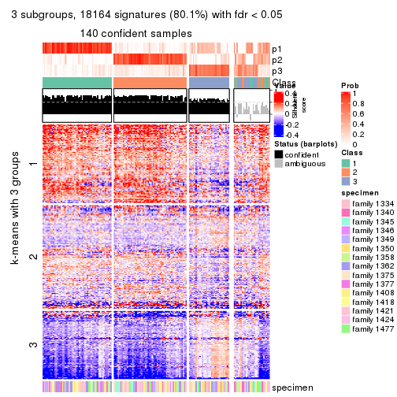</p>

</div>
<div id='tab-MAD-NMF-get-signatures-no-scale-3'>
<pre><code class="r">get_signatures(res, k = 4, scale_rows = FALSE)
</code></pre>

<p></p>

</div>
<div id='tab-MAD-NMF-get-signatures-no-scale-4'>
<pre><code class="r">get_signatures(res, k = 5, scale_rows = FALSE)
</code></pre>

<p></p>

</div>
<div id='tab-MAD-NMF-get-signatures-no-scale-5'>
<pre><code class="r">get_signatures(res, k = 6, scale_rows = FALSE)
</code></pre>

<p></p>

</div>
</div>


Compare the overlap of signatures from different k:

```r
compare_signatures(res)
```


`get_signature()` returns a data frame invisibly. TO get the list of signatures, the function
call should be assigned to a variable explicitly. In following code, if `plot` argument is set
to `FALSE`, no heatmap is plotted while only the differential analysis is performed.

```r
# code only for demonstration
tb = get_signature(res, k = ..., plot = FALSE)
```

An example of the output of `tb` is:

```
#>   which_row         fdr    mean_1    mean_2 scaled_mean_1 scaled_mean_2 km
#> 1        38 0.042760348  8.373488  9.131774    -0.5533452     0.5164555  1
#> 2        40 0.018707592  7.106213  8.469186    -0.6173731     0.5762149  1
#> 3        55 0.019134737 10.221463 11.207825    -0.6159697     0.5749050  1
#> 4        59 0.006059896  5.921854  7.869574    -0.6899429     0.6439467  1
#> 5        60 0.018055526  8.928898 10.211722    -0.6204761     0.5791110  1
#> 6        98 0.009384629 15.714769 14.887706     0.6635654    -0.6193277  2
...
```

The columns in `tb` are:

1. `which_row`: row indices corresponding to the input matrix.
2. `fdr`: FDR for the differential test. 
3. `mean_x`: The mean value in group x.
4. `scaled_mean_x`: The mean value in group x after rows are scaled.
5. `km`: Row groups if k-means clustering is applied to rows.


UMAP plot which shows how samples are separated.


<script>
$( function() {
	$( '#tabs-MAD-NMF-dimension-reduction' ).tabs();
} );
</script>
<div id='tabs-MAD-NMF-dimension-reduction'>
<ul>
<li><a href='#tab-MAD-NMF-dimension-reduction-1'>k = 2</a></li>
<li><a href='#tab-MAD-NMF-dimension-reduction-2'>k = 3</a></li>
<li><a href='#tab-MAD-NMF-dimension-reduction-3'>k = 4</a></li>
<li><a href='#tab-MAD-NMF-dimension-reduction-4'>k = 5</a></li>
<li><a href='#tab-MAD-NMF-dimension-reduction-5'>k = 6</a></li>
</ul>
<div id='tab-MAD-NMF-dimension-reduction-1'>
<pre><code class="r">dimension_reduction(res, k = 2, method = &quot;UMAP&quot;)
</code></pre>

<p></p>

</div>
<div id='tab-MAD-NMF-dimension-reduction-2'>
<pre><code class="r">dimension_reduction(res, k = 3, method = &quot;UMAP&quot;)
</code></pre>

<p></p>

</div>
<div id='tab-MAD-NMF-dimension-reduction-3'>
<pre><code class="r">dimension_reduction(res, k = 4, method = &quot;UMAP&quot;)
</code></pre>

<p></p>

</div>
<div id='tab-MAD-NMF-dimension-reduction-4'>
<pre><code class="r">dimension_reduction(res, k = 5, method = &quot;UMAP&quot;)
</code></pre>

<p></p>

</div>
<div id='tab-MAD-NMF-dimension-reduction-5'>
<pre><code class="r">dimension_reduction(res, k = 6, method = &quot;UMAP&quot;)
</code></pre>

<p></p>

</div>
</div>


Following heatmap shows how subgroups are split when increasing `k`:

```r
collect_classes(res)
```


Test correlation between subgroups and known annotations. If the known
annotation is numeric, one-way ANOVA test is applied, and if the known
annotation is discrete, chi-squared contingency table test is applied.

```r
test_to_known_factors(res)
```

```
#>           n specimen(p) k
#> MAD:NMF 136     0.00283 2
#> MAD:NMF 140     0.14855 3
#> MAD:NMF 104     0.09923 4
#> MAD:NMF 103     0.00880 5
#> MAD:NMF 121     0.00307 6
```


If matrix rows can be associated to genes, consider to use `GO_Enrichment(res,
...)` to perform function enrichment for the signature genes.


 

---------------------------------------------------


### ATC:hclust


The object with results only for a single top-value method and a single partition method 
can be extracted as:

```r
res = res_list["ATC", "hclust"]
# you can also extract it by
# res = res_list["ATC:hclust"]
```

A summary of `res` and all the functions that can be applied to it:

```r
res
```

```
#> A 'ConsensusPartition' object with k = 2, 3, 4, 5, 6.
#>   On a matrix with 22686 rows and 167 columns.
#>   Top rows (1000, 2000, 3000, 4000, 5000) are extracted by 'ATC' method.
#>   Subgroups are detected by 'hclust' method.
#>   Performed in total 1250 partitions by row resampling.
#>   Best k for subgroups seems to be 2.
#> 
#> Following methods can be applied to this 'ConsensusPartition' object:
#>  [1] "cola_report"             "collect_classes"         "collect_plots"          
#>  [4] "collect_stats"           "colnames"                "compare_signatures"     
#>  [7] "consensus_heatmap"       "dimension_reduction"     "functional_enrichment"  
#> [10] "get_anno_col"            "get_anno"                "get_classes"            
#> [13] "get_consensus"           "get_matrix"              "get_membership"         
#> [16] "get_param"               "get_signatures"          "get_stats"              
#> [19] "is_best_k"               "is_stable_k"             "membership_heatmap"     
#> [22] "ncol"                    "nrow"                    "plot_ecdf"              
#> [25] "rownames"                "select_partition_number" "show"                   
#> [28] "suggest_best_k"          "test_to_known_factors"
```

`collect_plots()` function collects all the plots made from `res` for all `k` (number of partitions)
into one single page to provide an easy and fast comparison between different `k`.

```r
collect_plots(res)
```


The plots are:

- The first row: a plot of the ECDF (Empirical cumulative distribution
  function) curves of the consensus matrix for each `k` and the heatmap of
  predicted classes for each `k`.
- The second row: heatmaps of the consensus matrix for each `k`.
- The third row: heatmaps of the membership matrix for each `k`.
- The fouth row: heatmaps of the signatures for each `k`.

All the plots in panels can be made by individual functions and they are
plotted later in this section.

`select_partition_number()` produces several plots showing different
statistics for choosing "optimized" `k`. There are following statistics:

- ECDF curves of the consensus matrix for each `k`;
- 1-PAC. [The PAC
  score](https://en.wikipedia.org/wiki/Consensus_clustering#Over-interpretation_potential_of_consensus_clustering)
  measures the proportion of the ambiguous subgrouping.
- Mean silhouette score.
- Concordance. The mean probability of fiting the consensus class ids in all
  partitions.
- Area increased. Denote $A_k$ as the area under the ECDF curve for current
  `k`, the area increased is defined as $A_k - A_{k-1}$.
- Rand index. The percent of pairs of samples that are both in a same cluster
  or both are not in a same cluster in the partition of k and k-1.
- Jaccard index. The ratio of pairs of samples are both in a same cluster in
  the partition of k and k-1 and the pairs of samples are both in a same
  cluster in the partition k or k-1.

The detailed explanations of these statistics can be found in [the cola
vignette](http://bioconductor.org/packages/devel/bioc/vignettes/cola/inst/doc/cola.html#toc_13).

Generally speaking, lower PAC score, higher mean silhouette score or higher
concordance corresponds to better partition. Rand index and Jaccard index
measure how similar the current partition is compared to partition with `k-1`.
If they are too similar, we won't accept `k` is better than `k-1`.

```r
select_partition_number(res)
```


The numeric values for all these statistics can be obtained by `get_stats()`.

```r
get_stats(res)
```

```
#>   k 1-PAC mean_silhouette concordance area_increased  Rand Jaccard
#> 2 2 0.611           0.916       0.939         0.4665 0.501   0.501
#> 3 3 0.735           0.882       0.937         0.2758 0.910   0.820
#> 4 4 0.722           0.787       0.887         0.2223 0.857   0.652
#> 5 5 0.722           0.693       0.829         0.0584 0.944   0.796
#> 6 6 0.699           0.314       0.633         0.0361 0.846   0.461
```

`suggest_best_k()` suggests the best $k$ based on these statistics. The rules are as follows:

- All $k$ with Jaccard index larger than 0.95 are removed because the increase of
  the partition number does not provides enough extra information. If all $k$ are removed,
  the best $k$ is assigned by `NA`.
- For $k$ with 1-PAC larger than 0.9, the maximal $k$ is taken as the "best k". Other $k$ is called "optional k".
- If it does not fit the second rule. The $k$ with the highest vote of highest
  1-PAC, mean silhouette and concordance is taken as the "best k".

```r
suggest_best_k(res)
```

```
#> [1] 2
```


Following shows the table of the partitions (You need to click the **show/hide
code output** link to see it). The membership matrix (columns with name `p*`)
is inferred by
[`clue::cl_consensus()`](https://www.rdocumentation.org/link/cl_consensus?package=clue)
function with the `SE` method. Basically the value in the membership matrix
represents the probability to belong to a certain group. The finall class
label for an item is determined with the group with highest probability it
belongs to.

In `get_classes()` function, the entropy is calculated from the membership
matrix and the silhouette score is calculated from the consensus matrix.


<script>
$( function() {
	$( '#tabs-ATC-hclust-get-classes' ).tabs();
} );
</script>
<div id='tabs-ATC-hclust-get-classes'>
<ul>
<li><a href='#tab-ATC-hclust-get-classes-1'>k = 2</a></li>
<li><a href='#tab-ATC-hclust-get-classes-2'>k = 3</a></li>
<li><a href='#tab-ATC-hclust-get-classes-3'>k = 4</a></li>
<li><a href='#tab-ATC-hclust-get-classes-4'>k = 5</a></li>
<li><a href='#tab-ATC-hclust-get-classes-5'>k = 6</a></li>
</ul>

<div id='tab-ATC-hclust-get-classes-1'>
<p><a id='tab-ATC-hclust-get-classes-1-a' style='color:#0366d6' href='#'>show/hide code output</a></p>
<pre><code class="r">cbind(get_classes(res, k = 2), get_membership(res, k = 2))
</code></pre>

<pre><code>#&gt;          class entropy silhouette    p1    p2
#&gt; GSM30006     2  0.4815      0.899 0.104 0.896
#&gt; GSM30007     1  0.0000      0.982 1.000 0.000
#&gt; GSM30008     1  0.0000      0.982 1.000 0.000
#&gt; GSM30009     1  0.0000      0.982 1.000 0.000
#&gt; GSM30010     2  0.0000      0.877 0.000 1.000
#&gt; GSM30011     2  0.4815      0.899 0.104 0.896
#&gt; GSM30012     2  0.5059      0.900 0.112 0.888
#&gt; GSM30013     1  0.4562      0.879 0.904 0.096
#&gt; GSM30014     2  0.0000      0.877 0.000 1.000
#&gt; GSM30015     1  0.0000      0.982 1.000 0.000
#&gt; GSM30016     2  0.6343      0.895 0.160 0.840
#&gt; GSM30017     1  0.0000      0.982 1.000 0.000
#&gt; GSM30018     1  0.0000      0.982 1.000 0.000
#&gt; GSM30019     2  0.0000      0.877 0.000 1.000
#&gt; GSM30020     1  0.0000      0.982 1.000 0.000
#&gt; GSM30021     2  0.5408      0.900 0.124 0.876
#&gt; GSM30022     1  0.0000      0.982 1.000 0.000
#&gt; GSM30023     1  0.0672      0.976 0.992 0.008
#&gt; GSM30024     2  0.3431      0.894 0.064 0.936
#&gt; GSM30025     1  0.4161      0.894 0.916 0.084
#&gt; GSM30026     1  0.0000      0.982 1.000 0.000
#&gt; GSM30027     2  0.9686      0.545 0.396 0.604
#&gt; GSM30028     1  0.0672      0.976 0.992 0.008
#&gt; GSM30029     1  0.0000      0.982 1.000 0.000
#&gt; GSM30030     1  0.0000      0.982 1.000 0.000
#&gt; GSM30031     1  0.0000      0.982 1.000 0.000
#&gt; GSM30032     2  0.6623      0.887 0.172 0.828
#&gt; GSM30033     2  0.6148      0.897 0.152 0.848
#&gt; GSM30034     1  0.0000      0.982 1.000 0.000
#&gt; GSM30035     2  0.6438      0.893 0.164 0.836
#&gt; GSM30036     1  0.0672      0.976 0.992 0.008
#&gt; GSM30037     2  0.9686      0.545 0.396 0.604
#&gt; GSM30038     2  0.6343      0.895 0.160 0.840
#&gt; GSM30039     2  0.5059      0.900 0.112 0.888
#&gt; GSM30040     2  0.0000      0.877 0.000 1.000
#&gt; GSM30041     2  0.2603      0.890 0.044 0.956
#&gt; GSM30042     2  0.0000      0.877 0.000 1.000
#&gt; GSM30043     2  0.0000      0.877 0.000 1.000
#&gt; GSM30044     1  0.0000      0.982 1.000 0.000
#&gt; GSM30045     1  0.0000      0.982 1.000 0.000
#&gt; GSM30046     1  0.0000      0.982 1.000 0.000
#&gt; GSM30047     1  0.0672      0.976 0.992 0.008
#&gt; GSM30048     1  0.0000      0.982 1.000 0.000
#&gt; GSM30049     2  0.0000      0.877 0.000 1.000
#&gt; GSM30050     1  0.0672      0.976 0.992 0.008
#&gt; GSM30051     2  0.0000      0.877 0.000 1.000
#&gt; GSM30052     1  0.0000      0.982 1.000 0.000
#&gt; GSM30053     2  0.5059      0.900 0.112 0.888
#&gt; GSM30054     2  0.0000      0.877 0.000 1.000
#&gt; GSM30055     2  0.6438      0.893 0.164 0.836
#&gt; GSM30056     2  0.6343      0.895 0.160 0.840
#&gt; GSM30057     2  0.0000      0.877 0.000 1.000
#&gt; GSM30058     2  0.0000      0.877 0.000 1.000
#&gt; GSM30059     1  0.0000      0.982 1.000 0.000
#&gt; GSM30060     2  0.6048      0.898 0.148 0.852
#&gt; GSM30061     1  0.6712      0.754 0.824 0.176
#&gt; GSM30062     1  0.1184      0.969 0.984 0.016
#&gt; GSM30063     2  0.6438      0.893 0.164 0.836
#&gt; GSM30064     1  0.0000      0.982 1.000 0.000
#&gt; GSM30065     2  0.6247      0.896 0.156 0.844
#&gt; GSM30066     2  0.0000      0.877 0.000 1.000
#&gt; GSM30067     1  0.0000      0.982 1.000 0.000
#&gt; GSM30068     2  0.0000      0.877 0.000 1.000
#&gt; GSM30069     2  0.3431      0.894 0.064 0.936
#&gt; GSM30070     2  0.6048      0.898 0.148 0.852
#&gt; GSM30071     2  0.6343      0.894 0.160 0.840
#&gt; GSM30072     1  0.0000      0.982 1.000 0.000
#&gt; GSM30073     2  0.6623      0.887 0.172 0.828
#&gt; GSM30074     2  0.6247      0.896 0.156 0.844
#&gt; GSM30075     2  0.6623      0.887 0.172 0.828
#&gt; GSM30076     1  0.0000      0.982 1.000 0.000
#&gt; GSM30077     1  0.0000      0.982 1.000 0.000
#&gt; GSM30078     1  0.0000      0.982 1.000 0.000
#&gt; GSM30079     1  0.0000      0.982 1.000 0.000
#&gt; GSM30080     2  0.9580      0.578 0.380 0.620
#&gt; GSM30081     2  0.0000      0.877 0.000 1.000
#&gt; GSM30086     1  0.7950      0.631 0.760 0.240
#&gt; GSM30087     1  0.0000      0.982 1.000 0.000
#&gt; GSM30088     1  0.0000      0.982 1.000 0.000
#&gt; GSM30089     2  0.9661      0.554 0.392 0.608
#&gt; GSM30090     2  0.2603      0.890 0.044 0.956
#&gt; GSM30091     2  0.0000      0.877 0.000 1.000
#&gt; GSM30092     1  0.5519      0.831 0.872 0.128
#&gt; GSM30093     2  0.6438      0.893 0.164 0.836
#&gt; GSM30094     2  0.0000      0.877 0.000 1.000
#&gt; GSM30095     2  0.0000      0.877 0.000 1.000
#&gt; GSM30096     1  0.0000      0.982 1.000 0.000
#&gt; GSM30097     1  0.0000      0.982 1.000 0.000
#&gt; GSM30098     1  0.0000      0.982 1.000 0.000
#&gt; GSM30099     2  0.6048      0.898 0.148 0.852
#&gt; GSM30100     2  0.0000      0.877 0.000 1.000
#&gt; GSM30101     2  0.0000      0.877 0.000 1.000
#&gt; GSM30102     2  0.6438      0.893 0.164 0.836
#&gt; GSM30103     2  0.9881      0.444 0.436 0.564
#&gt; GSM30104     1  0.8661      0.514 0.712 0.288
#&gt; GSM30105     1  0.0000      0.982 1.000 0.000
#&gt; GSM30106     1  0.0000      0.982 1.000 0.000
#&gt; GSM30107     1  0.0376      0.979 0.996 0.004
#&gt; GSM30108     2  0.6247      0.896 0.156 0.844
#&gt; GSM30109     1  0.0000      0.982 1.000 0.000
#&gt; GSM30110     1  0.0000      0.982 1.000 0.000
#&gt; GSM30111     1  0.0000      0.982 1.000 0.000
#&gt; GSM30112     1  0.3274      0.923 0.940 0.060
#&gt; GSM30113     2  0.0000      0.877 0.000 1.000
#&gt; GSM30114     2  0.6247      0.896 0.156 0.844
#&gt; GSM30115     1  0.0376      0.979 0.996 0.004
#&gt; GSM30116     2  0.0000      0.877 0.000 1.000
#&gt; GSM30117     2  0.8144      0.797 0.252 0.748
#&gt; GSM30118     2  0.6048      0.898 0.148 0.852
#&gt; GSM30119     2  0.0000      0.877 0.000 1.000
#&gt; GSM30120     1  0.4161      0.894 0.916 0.084
#&gt; GSM30121     1  0.0000      0.982 1.000 0.000
#&gt; GSM30122     1  0.0000      0.982 1.000 0.000
#&gt; GSM30123     2  0.6048      0.898 0.148 0.852
#&gt; GSM30177     2  0.6438      0.893 0.164 0.836
#&gt; GSM30178     1  0.0376      0.979 0.996 0.004
#&gt; GSM30179     1  0.0000      0.982 1.000 0.000
#&gt; GSM30180     1  0.0000      0.982 1.000 0.000
#&gt; GSM30181     2  0.6623      0.887 0.172 0.828
#&gt; GSM30182     1  0.0000      0.982 1.000 0.000
#&gt; GSM30183     1  0.0000      0.982 1.000 0.000
#&gt; GSM30184     2  0.2603      0.890 0.044 0.956
#&gt; GSM30185     2  0.6623      0.887 0.172 0.828
#&gt; GSM30186     2  0.6438      0.893 0.164 0.836
#&gt; GSM30187     1  0.0000      0.982 1.000 0.000
#&gt; GSM30188     1  0.0000      0.982 1.000 0.000
#&gt; GSM30189     1  0.0000      0.982 1.000 0.000
#&gt; GSM30190     2  0.0000      0.877 0.000 1.000
#&gt; GSM30191     2  0.9129      0.682 0.328 0.672
#&gt; GSM30192     2  0.6438      0.893 0.164 0.836
#&gt; GSM30193     1  0.0000      0.982 1.000 0.000
#&gt; GSM30194     2  0.0000      0.877 0.000 1.000
#&gt; GSM30195     1  0.3733      0.908 0.928 0.072
#&gt; GSM30196     1  0.0000      0.982 1.000 0.000
#&gt; GSM30197     1  0.0000      0.982 1.000 0.000
#&gt; GSM30198     1  0.0000      0.982 1.000 0.000
#&gt; GSM30199     2  0.6048      0.898 0.148 0.852
#&gt; GSM30200     1  0.0000      0.982 1.000 0.000
#&gt; GSM30201     1  0.0000      0.982 1.000 0.000
#&gt; GSM30202     1  0.0000      0.982 1.000 0.000
#&gt; GSM30203     1  0.0000      0.982 1.000 0.000
#&gt; GSM30204     1  0.0000      0.982 1.000 0.000
#&gt; GSM30205     2  0.6343      0.894 0.160 0.840
#&gt; GSM30206     1  0.0000      0.982 1.000 0.000
#&gt; GSM30207     1  0.0000      0.982 1.000 0.000
#&gt; GSM30208     1  0.0000      0.982 1.000 0.000
#&gt; GSM30209     2  0.6623      0.887 0.172 0.828
#&gt; GSM30210     1  0.0000      0.982 1.000 0.000
#&gt; GSM30211     1  0.0000      0.982 1.000 0.000
#&gt; GSM30212     1  0.0000      0.982 1.000 0.000
#&gt; GSM30213     1  0.0000      0.982 1.000 0.000
#&gt; GSM30214     1  0.0376      0.979 0.996 0.004
#&gt; GSM30215     1  0.0000      0.982 1.000 0.000
#&gt; GSM30216     1  0.0000      0.982 1.000 0.000
#&gt; GSM30217     1  0.0000      0.982 1.000 0.000
#&gt; GSM30218     2  0.6623      0.887 0.172 0.828
#&gt; GSM30219     2  0.2603      0.890 0.044 0.956
#&gt; GSM30220     1  0.0000      0.982 1.000 0.000
#&gt; GSM30221     1  0.0000      0.982 1.000 0.000
#&gt; GSM30222     1  0.1633      0.961 0.976 0.024
#&gt; GSM30223     1  0.0000      0.982 1.000 0.000
#&gt; GSM30224     1  0.0000      0.982 1.000 0.000
#&gt; GSM30225     1  0.0000      0.982 1.000 0.000
#&gt; GSM30226     2  0.6531      0.890 0.168 0.832
#&gt; GSM30227     1  0.0000      0.982 1.000 0.000
#&gt; GSM30228     2  0.4815      0.899 0.104 0.896
#&gt; GSM30229     1  0.4022      0.900 0.920 0.080
</code></pre>

<script>
$('#tab-ATC-hclust-get-classes-1-a').parent().next().next().hide();
$('#tab-ATC-hclust-get-classes-1-a').click(function(){
  $('#tab-ATC-hclust-get-classes-1-a').parent().next().next().toggle();
  return(false);
});
</script>
</div>

<div id='tab-ATC-hclust-get-classes-2'>
<p><a id='tab-ATC-hclust-get-classes-2-a' style='color:#0366d6' href='#'>show/hide code output</a></p>
<pre><code class="r">cbind(get_classes(res, k = 3), get_membership(res, k = 3))
</code></pre>

<pre><code>#&gt;          class entropy silhouette    p1    p2    p3
#&gt; GSM30006     2  0.4002      0.798 0.000 0.840 0.160
#&gt; GSM30007     1  0.0747      0.939 0.984 0.016 0.000
#&gt; GSM30008     1  0.0000      0.942 1.000 0.000 0.000
#&gt; GSM30009     1  0.0000      0.942 1.000 0.000 0.000
#&gt; GSM30010     3  0.0000      0.965 0.000 0.000 1.000
#&gt; GSM30011     2  0.4002      0.798 0.000 0.840 0.160
#&gt; GSM30012     2  0.3752      0.811 0.000 0.856 0.144
#&gt; GSM30013     1  0.5058      0.753 0.756 0.244 0.000
#&gt; GSM30014     3  0.0000      0.965 0.000 0.000 1.000
#&gt; GSM30015     1  0.0237      0.942 0.996 0.004 0.000
#&gt; GSM30016     2  0.0829      0.890 0.004 0.984 0.012
#&gt; GSM30017     1  0.0000      0.942 1.000 0.000 0.000
#&gt; GSM30018     1  0.0000      0.942 1.000 0.000 0.000
#&gt; GSM30019     3  0.0000      0.965 0.000 0.000 1.000
#&gt; GSM30020     1  0.0892      0.938 0.980 0.020 0.000
#&gt; GSM30021     2  0.3482      0.823 0.000 0.872 0.128
#&gt; GSM30022     1  0.0000      0.942 1.000 0.000 0.000
#&gt; GSM30023     1  0.3619      0.878 0.864 0.136 0.000
#&gt; GSM30024     2  0.5058      0.704 0.000 0.756 0.244
#&gt; GSM30025     1  0.4504      0.816 0.804 0.196 0.000
#&gt; GSM30026     1  0.0000      0.942 1.000 0.000 0.000
#&gt; GSM30027     2  0.4887      0.648 0.228 0.772 0.000
#&gt; GSM30028     1  0.3619      0.878 0.864 0.136 0.000
#&gt; GSM30029     1  0.0000      0.942 1.000 0.000 0.000
#&gt; GSM30030     1  0.0000      0.942 1.000 0.000 0.000
#&gt; GSM30031     1  0.0000      0.942 1.000 0.000 0.000
#&gt; GSM30032     2  0.0237      0.887 0.004 0.996 0.000
#&gt; GSM30033     2  0.0747      0.889 0.000 0.984 0.016
#&gt; GSM30034     1  0.0000      0.942 1.000 0.000 0.000
#&gt; GSM30035     2  0.0237      0.890 0.000 0.996 0.004
#&gt; GSM30036     1  0.3482      0.884 0.872 0.128 0.000
#&gt; GSM30037     2  0.4887      0.648 0.228 0.772 0.000
#&gt; GSM30038     2  0.0829      0.890 0.004 0.984 0.012
#&gt; GSM30039     2  0.3752      0.811 0.000 0.856 0.144
#&gt; GSM30040     3  0.0000      0.965 0.000 0.000 1.000
#&gt; GSM30041     2  0.5882      0.534 0.000 0.652 0.348
#&gt; GSM30042     3  0.1860      0.932 0.000 0.052 0.948
#&gt; GSM30043     3  0.0000      0.965 0.000 0.000 1.000
#&gt; GSM30044     1  0.0000      0.942 1.000 0.000 0.000
#&gt; GSM30045     1  0.0592      0.940 0.988 0.012 0.000
#&gt; GSM30046     1  0.0000      0.942 1.000 0.000 0.000
#&gt; GSM30047     1  0.3619      0.878 0.864 0.136 0.000
#&gt; GSM30048     1  0.0000      0.942 1.000 0.000 0.000
#&gt; GSM30049     3  0.0000      0.965 0.000 0.000 1.000
#&gt; GSM30050     1  0.3619      0.878 0.864 0.136 0.000
#&gt; GSM30051     3  0.0000      0.965 0.000 0.000 1.000
#&gt; GSM30052     1  0.0000      0.942 1.000 0.000 0.000
#&gt; GSM30053     2  0.3752      0.811 0.000 0.856 0.144
#&gt; GSM30054     3  0.0000      0.965 0.000 0.000 1.000
#&gt; GSM30055     2  0.0237      0.890 0.000 0.996 0.004
#&gt; GSM30056     2  0.0424      0.890 0.000 0.992 0.008
#&gt; GSM30057     3  0.0000      0.965 0.000 0.000 1.000
#&gt; GSM30058     3  0.1860      0.932 0.000 0.052 0.948
#&gt; GSM30059     1  0.2796      0.908 0.908 0.092 0.000
#&gt; GSM30060     2  0.1031      0.887 0.000 0.976 0.024
#&gt; GSM30061     1  0.5431      0.678 0.716 0.284 0.000
#&gt; GSM30062     1  0.3412      0.886 0.876 0.124 0.000
#&gt; GSM30063     2  0.0237      0.890 0.000 0.996 0.004
#&gt; GSM30064     1  0.0000      0.942 1.000 0.000 0.000
#&gt; GSM30065     2  0.0592      0.889 0.000 0.988 0.012
#&gt; GSM30066     3  0.0000      0.965 0.000 0.000 1.000
#&gt; GSM30067     1  0.0000      0.942 1.000 0.000 0.000
#&gt; GSM30068     3  0.0000      0.965 0.000 0.000 1.000
#&gt; GSM30069     2  0.5058      0.704 0.000 0.756 0.244
#&gt; GSM30070     2  0.1643      0.878 0.000 0.956 0.044
#&gt; GSM30071     2  0.0424      0.890 0.000 0.992 0.008
#&gt; GSM30072     1  0.2711      0.910 0.912 0.088 0.000
#&gt; GSM30073     2  0.0237      0.887 0.004 0.996 0.000
#&gt; GSM30074     2  0.0747      0.889 0.000 0.984 0.016
#&gt; GSM30075     2  0.0237      0.887 0.004 0.996 0.000
#&gt; GSM30076     1  0.3340      0.890 0.880 0.120 0.000
#&gt; GSM30077     1  0.0237      0.942 0.996 0.004 0.000
#&gt; GSM30078     1  0.0237      0.942 0.996 0.004 0.000
#&gt; GSM30079     1  0.0000      0.942 1.000 0.000 0.000
#&gt; GSM30080     2  0.5420      0.636 0.240 0.752 0.008
#&gt; GSM30081     3  0.0000      0.965 0.000 0.000 1.000
#&gt; GSM30086     1  0.6045      0.494 0.620 0.380 0.000
#&gt; GSM30087     1  0.0000      0.942 1.000 0.000 0.000
#&gt; GSM30088     1  0.0000      0.942 1.000 0.000 0.000
#&gt; GSM30089     2  0.4842      0.653 0.224 0.776 0.000
#&gt; GSM30090     2  0.5882      0.534 0.000 0.652 0.348
#&gt; GSM30091     3  0.0000      0.965 0.000 0.000 1.000
#&gt; GSM30092     1  0.5058      0.746 0.756 0.244 0.000
#&gt; GSM30093     2  0.0237      0.890 0.000 0.996 0.004
#&gt; GSM30094     3  0.4346      0.783 0.000 0.184 0.816
#&gt; GSM30095     3  0.0000      0.965 0.000 0.000 1.000
#&gt; GSM30096     1  0.0000      0.942 1.000 0.000 0.000
#&gt; GSM30097     1  0.0000      0.942 1.000 0.000 0.000
#&gt; GSM30098     1  0.0000      0.942 1.000 0.000 0.000
#&gt; GSM30099     2  0.0892      0.888 0.000 0.980 0.020
#&gt; GSM30100     3  0.0000      0.965 0.000 0.000 1.000
#&gt; GSM30101     3  0.0747      0.956 0.000 0.016 0.984
#&gt; GSM30102     2  0.0237      0.890 0.000 0.996 0.004
#&gt; GSM30103     2  0.5291      0.592 0.268 0.732 0.000
#&gt; GSM30104     1  0.6111      0.429 0.604 0.396 0.000
#&gt; GSM30105     1  0.0000      0.942 1.000 0.000 0.000
#&gt; GSM30106     1  0.0424      0.940 0.992 0.008 0.000
#&gt; GSM30107     1  0.3192      0.895 0.888 0.112 0.000
#&gt; GSM30108     2  0.0592      0.889 0.000 0.988 0.012
#&gt; GSM30109     1  0.0000      0.942 1.000 0.000 0.000
#&gt; GSM30110     1  0.0000      0.942 1.000 0.000 0.000
#&gt; GSM30111     1  0.3038      0.900 0.896 0.104 0.000
#&gt; GSM30112     1  0.4750      0.793 0.784 0.216 0.000
#&gt; GSM30113     3  0.0000      0.965 0.000 0.000 1.000
#&gt; GSM30114     2  0.0592      0.889 0.000 0.988 0.012
#&gt; GSM30115     1  0.2959      0.903 0.900 0.100 0.000
#&gt; GSM30116     3  0.4346      0.783 0.000 0.184 0.816
#&gt; GSM30117     2  0.2625      0.818 0.084 0.916 0.000
#&gt; GSM30118     2  0.0892      0.888 0.000 0.980 0.020
#&gt; GSM30119     3  0.1860      0.932 0.000 0.052 0.948
#&gt; GSM30120     1  0.4605      0.806 0.796 0.204 0.000
#&gt; GSM30121     1  0.0000      0.942 1.000 0.000 0.000
#&gt; GSM30122     1  0.2711      0.910 0.912 0.088 0.000
#&gt; GSM30123     2  0.0892      0.888 0.000 0.980 0.020
#&gt; GSM30177     2  0.0237      0.890 0.000 0.996 0.004
#&gt; GSM30178     1  0.3412      0.887 0.876 0.124 0.000
#&gt; GSM30179     1  0.0747      0.939 0.984 0.016 0.000
#&gt; GSM30180     1  0.2796      0.908 0.908 0.092 0.000
#&gt; GSM30181     2  0.0237      0.887 0.004 0.996 0.000
#&gt; GSM30182     1  0.0000      0.942 1.000 0.000 0.000
#&gt; GSM30183     1  0.0000      0.942 1.000 0.000 0.000
#&gt; GSM30184     2  0.5882      0.534 0.000 0.652 0.348
#&gt; GSM30185     2  0.0237      0.887 0.004 0.996 0.000
#&gt; GSM30186     2  0.0237      0.890 0.000 0.996 0.004
#&gt; GSM30187     1  0.0237      0.942 0.996 0.004 0.000
#&gt; GSM30188     1  0.0000      0.942 1.000 0.000 0.000
#&gt; GSM30189     1  0.0237      0.942 0.996 0.004 0.000
#&gt; GSM30190     3  0.4346      0.783 0.000 0.184 0.816
#&gt; GSM30191     2  0.4062      0.729 0.164 0.836 0.000
#&gt; GSM30192     2  0.0237      0.890 0.000 0.996 0.004
#&gt; GSM30193     1  0.1031      0.936 0.976 0.024 0.000
#&gt; GSM30194     3  0.0000      0.965 0.000 0.000 1.000
#&gt; GSM30195     1  0.4605      0.805 0.796 0.204 0.000
#&gt; GSM30196     1  0.0000      0.942 1.000 0.000 0.000
#&gt; GSM30197     1  0.0237      0.942 0.996 0.004 0.000
#&gt; GSM30198     1  0.0000      0.942 1.000 0.000 0.000
#&gt; GSM30199     2  0.0892      0.888 0.000 0.980 0.020
#&gt; GSM30200     1  0.0000      0.942 1.000 0.000 0.000
#&gt; GSM30201     1  0.0000      0.942 1.000 0.000 0.000
#&gt; GSM30202     1  0.2448      0.917 0.924 0.076 0.000
#&gt; GSM30203     1  0.2625      0.912 0.916 0.084 0.000
#&gt; GSM30204     1  0.0000      0.942 1.000 0.000 0.000
#&gt; GSM30205     2  0.0424      0.890 0.000 0.992 0.008
#&gt; GSM30206     1  0.0000      0.942 1.000 0.000 0.000
#&gt; GSM30207     1  0.2537      0.913 0.920 0.080 0.000
#&gt; GSM30208     1  0.0000      0.942 1.000 0.000 0.000
#&gt; GSM30209     2  0.0237      0.887 0.004 0.996 0.000
#&gt; GSM30210     1  0.0000      0.942 1.000 0.000 0.000
#&gt; GSM30211     1  0.0000      0.942 1.000 0.000 0.000
#&gt; GSM30212     1  0.0000      0.942 1.000 0.000 0.000
#&gt; GSM30213     1  0.2711      0.910 0.912 0.088 0.000
#&gt; GSM30214     1  0.3116      0.897 0.892 0.108 0.000
#&gt; GSM30215     1  0.0424      0.941 0.992 0.008 0.000
#&gt; GSM30216     1  0.0237      0.942 0.996 0.004 0.000
#&gt; GSM30217     1  0.2625      0.912 0.916 0.084 0.000
#&gt; GSM30218     2  0.0237      0.887 0.004 0.996 0.000
#&gt; GSM30219     2  0.5905      0.526 0.000 0.648 0.352
#&gt; GSM30220     1  0.0000      0.942 1.000 0.000 0.000
#&gt; GSM30221     1  0.0424      0.941 0.992 0.008 0.000
#&gt; GSM30222     1  0.3816      0.868 0.852 0.148 0.000
#&gt; GSM30223     1  0.0000      0.942 1.000 0.000 0.000
#&gt; GSM30224     1  0.0000      0.942 1.000 0.000 0.000
#&gt; GSM30225     1  0.0000      0.942 1.000 0.000 0.000
#&gt; GSM30226     2  0.0475      0.889 0.004 0.992 0.004
#&gt; GSM30227     1  0.0000      0.942 1.000 0.000 0.000
#&gt; GSM30228     2  0.4062      0.794 0.000 0.836 0.164
#&gt; GSM30229     1  0.4504      0.818 0.804 0.196 0.000
</code></pre>

<script>
$('#tab-ATC-hclust-get-classes-2-a').parent().next().next().hide();
$('#tab-ATC-hclust-get-classes-2-a').click(function(){
  $('#tab-ATC-hclust-get-classes-2-a').parent().next().next().toggle();
  return(false);
});
</script>
</div>

<div id='tab-ATC-hclust-get-classes-3'>
<p><a id='tab-ATC-hclust-get-classes-3-a' style='color:#0366d6' href='#'>show/hide code output</a></p>
<pre><code class="r">cbind(get_classes(res, k = 4), get_membership(res, k = 4))
</code></pre>

<pre><code>#&gt;          class entropy silhouette    p1    p2    p3    p4
#&gt; GSM30006     2  0.3495      0.806 0.000 0.844 0.140 0.016
#&gt; GSM30007     4  0.4790      0.328 0.380 0.000 0.000 0.620
#&gt; GSM30008     1  0.3528      0.740 0.808 0.000 0.000 0.192
#&gt; GSM30009     1  0.3528      0.740 0.808 0.000 0.000 0.192
#&gt; GSM30010     3  0.0000      0.959 0.000 0.000 1.000 0.000
#&gt; GSM30011     2  0.3495      0.806 0.000 0.844 0.140 0.016
#&gt; GSM30012     2  0.3280      0.819 0.000 0.860 0.124 0.016
#&gt; GSM30013     4  0.3224      0.803 0.016 0.120 0.000 0.864
#&gt; GSM30014     3  0.0188      0.959 0.000 0.004 0.996 0.000
#&gt; GSM30015     1  0.4888      0.409 0.588 0.000 0.000 0.412
#&gt; GSM30016     2  0.0592      0.887 0.000 0.984 0.000 0.016
#&gt; GSM30017     1  0.0000      0.844 1.000 0.000 0.000 0.000
#&gt; GSM30018     1  0.0817      0.842 0.976 0.000 0.000 0.024
#&gt; GSM30019     3  0.0188      0.959 0.000 0.004 0.996 0.000
#&gt; GSM30020     4  0.4877      0.240 0.408 0.000 0.000 0.592
#&gt; GSM30021     2  0.2988      0.829 0.000 0.876 0.112 0.012
#&gt; GSM30022     1  0.0469      0.844 0.988 0.000 0.000 0.012
#&gt; GSM30023     4  0.1488      0.858 0.032 0.012 0.000 0.956
#&gt; GSM30024     2  0.4399      0.716 0.000 0.760 0.224 0.016
#&gt; GSM30025     4  0.3634      0.829 0.048 0.096 0.000 0.856
#&gt; GSM30026     1  0.0000      0.844 1.000 0.000 0.000 0.000
#&gt; GSM30027     2  0.4372      0.645 0.004 0.728 0.000 0.268
#&gt; GSM30028     4  0.1488      0.858 0.032 0.012 0.000 0.956
#&gt; GSM30029     1  0.0000      0.844 1.000 0.000 0.000 0.000
#&gt; GSM30030     1  0.0000      0.844 1.000 0.000 0.000 0.000
#&gt; GSM30031     1  0.0817      0.842 0.976 0.000 0.000 0.024
#&gt; GSM30032     2  0.2216      0.866 0.000 0.908 0.000 0.092
#&gt; GSM30033     2  0.0469      0.884 0.000 0.988 0.000 0.012
#&gt; GSM30034     1  0.0921      0.841 0.972 0.000 0.000 0.028
#&gt; GSM30035     2  0.0707      0.886 0.000 0.980 0.000 0.020
#&gt; GSM30036     4  0.1545      0.860 0.040 0.008 0.000 0.952
#&gt; GSM30037     2  0.4401      0.639 0.004 0.724 0.000 0.272
#&gt; GSM30038     2  0.0469      0.887 0.000 0.988 0.000 0.012
#&gt; GSM30039     2  0.3280      0.819 0.000 0.860 0.124 0.016
#&gt; GSM30040     3  0.0336      0.960 0.000 0.000 0.992 0.008
#&gt; GSM30041     2  0.5110      0.559 0.000 0.656 0.328 0.016
#&gt; GSM30042     3  0.1807      0.928 0.000 0.052 0.940 0.008
#&gt; GSM30043     3  0.0336      0.960 0.000 0.000 0.992 0.008
#&gt; GSM30044     1  0.0188      0.844 0.996 0.000 0.000 0.004
#&gt; GSM30045     4  0.4843      0.309 0.396 0.000 0.000 0.604
#&gt; GSM30046     1  0.0000      0.844 1.000 0.000 0.000 0.000
#&gt; GSM30047     4  0.1488      0.858 0.032 0.012 0.000 0.956
#&gt; GSM30048     1  0.0000      0.844 1.000 0.000 0.000 0.000
#&gt; GSM30049     3  0.0336      0.960 0.000 0.000 0.992 0.008
#&gt; GSM30050     4  0.1488      0.858 0.032 0.012 0.000 0.956
#&gt; GSM30051     3  0.0336      0.960 0.000 0.000 0.992 0.008
#&gt; GSM30052     1  0.0817      0.842 0.976 0.000 0.000 0.024
#&gt; GSM30053     2  0.3280      0.819 0.000 0.860 0.124 0.016
#&gt; GSM30054     3  0.0336      0.960 0.000 0.000 0.992 0.008
#&gt; GSM30055     2  0.0592      0.886 0.000 0.984 0.000 0.016
#&gt; GSM30056     2  0.0779      0.887 0.000 0.980 0.004 0.016
#&gt; GSM30057     3  0.0188      0.959 0.000 0.004 0.996 0.000
#&gt; GSM30058     3  0.1807      0.928 0.000 0.052 0.940 0.008
#&gt; GSM30059     4  0.1940      0.856 0.076 0.000 0.000 0.924
#&gt; GSM30060     2  0.0657      0.883 0.000 0.984 0.004 0.012
#&gt; GSM30061     4  0.4839      0.742 0.052 0.184 0.000 0.764
#&gt; GSM30062     4  0.1938      0.862 0.052 0.012 0.000 0.936
#&gt; GSM30063     2  0.1389      0.883 0.000 0.952 0.000 0.048
#&gt; GSM30064     1  0.1792      0.822 0.932 0.000 0.000 0.068
#&gt; GSM30065     2  0.0336      0.885 0.000 0.992 0.000 0.008
#&gt; GSM30066     3  0.0336      0.960 0.000 0.000 0.992 0.008
#&gt; GSM30067     1  0.4746      0.509 0.632 0.000 0.000 0.368
#&gt; GSM30068     3  0.0000      0.959 0.000 0.000 1.000 0.000
#&gt; GSM30069     2  0.4399      0.716 0.000 0.760 0.224 0.016
#&gt; GSM30070     2  0.1356      0.879 0.000 0.960 0.032 0.008
#&gt; GSM30071     2  0.0469      0.887 0.000 0.988 0.000 0.012
#&gt; GSM30072     4  0.2081      0.854 0.084 0.000 0.000 0.916
#&gt; GSM30073     2  0.2216      0.866 0.000 0.908 0.000 0.092
#&gt; GSM30074     2  0.0376      0.885 0.000 0.992 0.004 0.004
#&gt; GSM30075     2  0.1792      0.873 0.000 0.932 0.000 0.068
#&gt; GSM30076     4  0.1743      0.862 0.056 0.004 0.000 0.940
#&gt; GSM30077     1  0.4817      0.467 0.612 0.000 0.000 0.388
#&gt; GSM30078     1  0.4817      0.467 0.612 0.000 0.000 0.388
#&gt; GSM30079     1  0.0707      0.843 0.980 0.000 0.000 0.020
#&gt; GSM30080     2  0.4663      0.623 0.012 0.716 0.000 0.272
#&gt; GSM30081     3  0.0336      0.960 0.000 0.000 0.992 0.008
#&gt; GSM30086     4  0.4621      0.559 0.008 0.284 0.000 0.708
#&gt; GSM30087     1  0.0921      0.841 0.972 0.000 0.000 0.028
#&gt; GSM30088     1  0.0000      0.844 1.000 0.000 0.000 0.000
#&gt; GSM30089     2  0.4313      0.657 0.004 0.736 0.000 0.260
#&gt; GSM30090     2  0.5110      0.559 0.000 0.656 0.328 0.016
#&gt; GSM30091     3  0.0336      0.960 0.000 0.000 0.992 0.008
#&gt; GSM30092     4  0.4070      0.797 0.044 0.132 0.000 0.824
#&gt; GSM30093     2  0.0707      0.886 0.000 0.980 0.000 0.020
#&gt; GSM30094     3  0.4012      0.769 0.000 0.184 0.800 0.016
#&gt; GSM30095     3  0.0336      0.960 0.000 0.000 0.992 0.008
#&gt; GSM30096     1  0.4564      0.565 0.672 0.000 0.000 0.328
#&gt; GSM30097     1  0.0000      0.844 1.000 0.000 0.000 0.000
#&gt; GSM30098     1  0.0000      0.844 1.000 0.000 0.000 0.000
#&gt; GSM30099     2  0.0469      0.884 0.000 0.988 0.000 0.012
#&gt; GSM30100     3  0.0336      0.960 0.000 0.000 0.992 0.008
#&gt; GSM30101     3  0.0895      0.950 0.000 0.020 0.976 0.004
#&gt; GSM30102     2  0.0592      0.886 0.000 0.984 0.000 0.016
#&gt; GSM30103     2  0.4643      0.520 0.000 0.656 0.000 0.344
#&gt; GSM30104     4  0.5720      0.541 0.052 0.296 0.000 0.652
#&gt; GSM30105     1  0.0817      0.842 0.976 0.000 0.000 0.024
#&gt; GSM30106     1  0.4804      0.483 0.616 0.000 0.000 0.384
#&gt; GSM30107     4  0.1637      0.861 0.060 0.000 0.000 0.940
#&gt; GSM30108     2  0.0188      0.885 0.000 0.996 0.000 0.004
#&gt; GSM30109     1  0.0000      0.844 1.000 0.000 0.000 0.000
#&gt; GSM30110     1  0.3123      0.765 0.844 0.000 0.000 0.156
#&gt; GSM30111     4  0.1637      0.860 0.060 0.000 0.000 0.940
#&gt; GSM30112     4  0.2706      0.824 0.020 0.080 0.000 0.900
#&gt; GSM30113     3  0.0336      0.960 0.000 0.000 0.992 0.008
#&gt; GSM30114     2  0.0188      0.885 0.000 0.996 0.000 0.004
#&gt; GSM30115     4  0.2266      0.856 0.084 0.004 0.000 0.912
#&gt; GSM30116     3  0.4012      0.769 0.000 0.184 0.800 0.016
#&gt; GSM30117     2  0.3074      0.810 0.000 0.848 0.000 0.152
#&gt; GSM30118     2  0.0469      0.884 0.000 0.988 0.000 0.012
#&gt; GSM30119     3  0.1807      0.928 0.000 0.052 0.940 0.008
#&gt; GSM30120     4  0.3354      0.832 0.044 0.084 0.000 0.872
#&gt; GSM30121     1  0.4522      0.589 0.680 0.000 0.000 0.320
#&gt; GSM30122     4  0.2589      0.833 0.116 0.000 0.000 0.884
#&gt; GSM30123     2  0.0469      0.884 0.000 0.988 0.000 0.012
#&gt; GSM30177     2  0.0707      0.886 0.000 0.980 0.000 0.020
#&gt; GSM30178     4  0.1398      0.859 0.040 0.004 0.000 0.956
#&gt; GSM30179     4  0.4999     -0.127 0.492 0.000 0.000 0.508
#&gt; GSM30180     4  0.1940      0.857 0.076 0.000 0.000 0.924
#&gt; GSM30181     2  0.1716      0.874 0.000 0.936 0.000 0.064
#&gt; GSM30182     1  0.3649      0.727 0.796 0.000 0.000 0.204
#&gt; GSM30183     1  0.3649      0.727 0.796 0.000 0.000 0.204
#&gt; GSM30184     2  0.5110      0.559 0.000 0.656 0.328 0.016
#&gt; GSM30185     2  0.1211      0.883 0.000 0.960 0.000 0.040
#&gt; GSM30186     2  0.0707      0.886 0.000 0.980 0.000 0.020
#&gt; GSM30187     1  0.4877      0.423 0.592 0.000 0.000 0.408
#&gt; GSM30188     1  0.0000      0.844 1.000 0.000 0.000 0.000
#&gt; GSM30189     1  0.4866      0.432 0.596 0.000 0.000 0.404
#&gt; GSM30190     3  0.4012      0.769 0.000 0.184 0.800 0.016
#&gt; GSM30191     2  0.4122      0.709 0.004 0.760 0.000 0.236
#&gt; GSM30192     2  0.0817      0.886 0.000 0.976 0.000 0.024
#&gt; GSM30193     1  0.5000      0.132 0.500 0.000 0.000 0.500
#&gt; GSM30194     3  0.0336      0.960 0.000 0.000 0.992 0.008
#&gt; GSM30195     4  0.2742      0.835 0.024 0.076 0.000 0.900
#&gt; GSM30196     1  0.0000      0.844 1.000 0.000 0.000 0.000
#&gt; GSM30197     1  0.4790      0.484 0.620 0.000 0.000 0.380
#&gt; GSM30198     1  0.0000      0.844 1.000 0.000 0.000 0.000
#&gt; GSM30199     2  0.0592      0.885 0.000 0.984 0.000 0.016
#&gt; GSM30200     1  0.0000      0.844 1.000 0.000 0.000 0.000
#&gt; GSM30201     1  0.0000      0.844 1.000 0.000 0.000 0.000
#&gt; GSM30202     4  0.2345      0.845 0.100 0.000 0.000 0.900
#&gt; GSM30203     4  0.2647      0.831 0.120 0.000 0.000 0.880
#&gt; GSM30204     1  0.4830      0.460 0.608 0.000 0.000 0.392
#&gt; GSM30205     2  0.0469      0.886 0.000 0.988 0.000 0.012
#&gt; GSM30206     1  0.0707      0.843 0.980 0.000 0.000 0.020
#&gt; GSM30207     4  0.3444      0.763 0.184 0.000 0.000 0.816
#&gt; GSM30208     1  0.1022      0.840 0.968 0.000 0.000 0.032
#&gt; GSM30209     2  0.1022      0.884 0.000 0.968 0.000 0.032
#&gt; GSM30210     1  0.0000      0.844 1.000 0.000 0.000 0.000
#&gt; GSM30211     1  0.0000      0.844 1.000 0.000 0.000 0.000
#&gt; GSM30212     1  0.0469      0.844 0.988 0.000 0.000 0.012
#&gt; GSM30213     4  0.2345      0.845 0.100 0.000 0.000 0.900
#&gt; GSM30214     4  0.1716      0.860 0.064 0.000 0.000 0.936
#&gt; GSM30215     1  0.4981      0.245 0.536 0.000 0.000 0.464
#&gt; GSM30216     1  0.3907      0.699 0.768 0.000 0.000 0.232
#&gt; GSM30217     4  0.2868      0.813 0.136 0.000 0.000 0.864
#&gt; GSM30218     2  0.1792      0.873 0.000 0.932 0.000 0.068
#&gt; GSM30219     2  0.5130      0.551 0.000 0.652 0.332 0.016
#&gt; GSM30220     1  0.0000      0.844 1.000 0.000 0.000 0.000
#&gt; GSM30221     1  0.4941      0.349 0.564 0.000 0.000 0.436
#&gt; GSM30222     4  0.2565      0.853 0.056 0.032 0.000 0.912
#&gt; GSM30223     1  0.0000      0.844 1.000 0.000 0.000 0.000
#&gt; GSM30224     1  0.0000      0.844 1.000 0.000 0.000 0.000
#&gt; GSM30225     1  0.0336      0.844 0.992 0.000 0.000 0.008
#&gt; GSM30226     2  0.1792      0.875 0.000 0.932 0.000 0.068
#&gt; GSM30227     1  0.0000      0.844 1.000 0.000 0.000 0.000
#&gt; GSM30228     2  0.3547      0.803 0.000 0.840 0.144 0.016
#&gt; GSM30229     4  0.2943      0.835 0.032 0.076 0.000 0.892
</code></pre>

<script>
$('#tab-ATC-hclust-get-classes-3-a').parent().next().next().hide();
$('#tab-ATC-hclust-get-classes-3-a').click(function(){
  $('#tab-ATC-hclust-get-classes-3-a').parent().next().next().toggle();
  return(false);
});
</script>
</div>

<div id='tab-ATC-hclust-get-classes-4'>
<p><a id='tab-ATC-hclust-get-classes-4-a' style='color:#0366d6' href='#'>show/hide code output</a></p>
<pre><code class="r">cbind(get_classes(res, k = 5), get_membership(res, k = 5))
</code></pre>

<pre><code>#&gt;          class entropy silhouette    p1    p2    p3    p4    p5
#&gt; GSM30006     5  0.4142     0.7178 0.000 0.308 0.004 0.004 0.684
#&gt; GSM30007     4  0.4558     0.4276 0.324 0.000 0.000 0.652 0.024
#&gt; GSM30008     1  0.3621     0.7156 0.788 0.000 0.000 0.192 0.020
#&gt; GSM30009     1  0.3621     0.7156 0.788 0.000 0.000 0.192 0.020
#&gt; GSM30010     3  0.0609     0.8960 0.000 0.000 0.980 0.000 0.020
#&gt; GSM30011     5  0.4286     0.6915 0.000 0.340 0.004 0.004 0.652
#&gt; GSM30012     5  0.4218     0.7103 0.000 0.324 0.004 0.004 0.668
#&gt; GSM30013     4  0.2629     0.7631 0.000 0.136 0.000 0.860 0.004
#&gt; GSM30014     3  0.1608     0.8825 0.000 0.000 0.928 0.000 0.072
#&gt; GSM30015     1  0.4867     0.3024 0.544 0.000 0.000 0.432 0.024
#&gt; GSM30016     2  0.2513     0.6870 0.000 0.876 0.000 0.008 0.116
#&gt; GSM30017     1  0.0609     0.8381 0.980 0.000 0.000 0.000 0.020
#&gt; GSM30018     1  0.0955     0.8338 0.968 0.000 0.000 0.028 0.004
#&gt; GSM30019     3  0.2127     0.8675 0.000 0.000 0.892 0.000 0.108
#&gt; GSM30020     4  0.4682     0.3463 0.356 0.000 0.000 0.620 0.024
#&gt; GSM30021     5  0.4264     0.6401 0.000 0.376 0.000 0.004 0.620
#&gt; GSM30022     1  0.0912     0.8379 0.972 0.000 0.000 0.012 0.016
#&gt; GSM30023     4  0.1059     0.8385 0.008 0.020 0.000 0.968 0.004
#&gt; GSM30024     5  0.3847     0.7065 0.000 0.180 0.036 0.000 0.784
#&gt; GSM30025     4  0.2917     0.7922 0.012 0.108 0.000 0.868 0.012
#&gt; GSM30026     1  0.0609     0.8381 0.980 0.000 0.000 0.000 0.020
#&gt; GSM30027     2  0.4054     0.5176 0.000 0.732 0.000 0.248 0.020
#&gt; GSM30028     4  0.1059     0.8385 0.008 0.020 0.000 0.968 0.004
#&gt; GSM30029     1  0.0609     0.8381 0.980 0.000 0.000 0.000 0.020
#&gt; GSM30030     1  0.0609     0.8381 0.980 0.000 0.000 0.000 0.020
#&gt; GSM30031     1  0.0865     0.8344 0.972 0.000 0.000 0.024 0.004
#&gt; GSM30032     2  0.3595     0.6190 0.000 0.816 0.000 0.044 0.140
#&gt; GSM30033     2  0.3837     0.4534 0.000 0.692 0.000 0.000 0.308
#&gt; GSM30034     1  0.1041     0.8328 0.964 0.000 0.000 0.032 0.004
#&gt; GSM30035     2  0.2329     0.6901 0.000 0.876 0.000 0.000 0.124
#&gt; GSM30036     4  0.0960     0.8396 0.008 0.016 0.000 0.972 0.004
#&gt; GSM30037     2  0.4080     0.5137 0.000 0.728 0.000 0.252 0.020
#&gt; GSM30038     2  0.3013     0.6572 0.000 0.832 0.000 0.008 0.160
#&gt; GSM30039     5  0.4218     0.7103 0.000 0.324 0.004 0.004 0.668
#&gt; GSM30040     3  0.0000     0.8982 0.000 0.000 1.000 0.000 0.000
#&gt; GSM30041     5  0.4591     0.6605 0.000 0.120 0.132 0.000 0.748
#&gt; GSM30042     3  0.3534     0.7740 0.000 0.000 0.744 0.000 0.256
#&gt; GSM30043     3  0.0290     0.8977 0.000 0.000 0.992 0.000 0.008
#&gt; GSM30044     1  0.0162     0.8380 0.996 0.000 0.000 0.000 0.004
#&gt; GSM30045     4  0.4639     0.4036 0.344 0.000 0.000 0.632 0.024
#&gt; GSM30046     1  0.0290     0.8383 0.992 0.000 0.000 0.000 0.008
#&gt; GSM30047     4  0.1059     0.8385 0.008 0.020 0.000 0.968 0.004
#&gt; GSM30048     1  0.0609     0.8381 0.980 0.000 0.000 0.000 0.020
#&gt; GSM30049     3  0.0000     0.8982 0.000 0.000 1.000 0.000 0.000
#&gt; GSM30050     4  0.1059     0.8385 0.008 0.020 0.000 0.968 0.004
#&gt; GSM30051     3  0.0000     0.8982 0.000 0.000 1.000 0.000 0.000
#&gt; GSM30052     1  0.0865     0.8344 0.972 0.000 0.000 0.024 0.004
#&gt; GSM30053     5  0.4218     0.7103 0.000 0.324 0.004 0.004 0.668
#&gt; GSM30054     3  0.0000     0.8982 0.000 0.000 1.000 0.000 0.000
#&gt; GSM30055     2  0.2377     0.6890 0.000 0.872 0.000 0.000 0.128
#&gt; GSM30056     2  0.3561     0.5073 0.000 0.740 0.000 0.000 0.260
#&gt; GSM30057     3  0.1608     0.8825 0.000 0.000 0.928 0.000 0.072
#&gt; GSM30058     3  0.3534     0.7740 0.000 0.000 0.744 0.000 0.256
#&gt; GSM30059     4  0.1043     0.8420 0.040 0.000 0.000 0.960 0.000
#&gt; GSM30060     5  0.4287     0.4358 0.000 0.460 0.000 0.000 0.540
#&gt; GSM30061     4  0.3848     0.7004 0.012 0.196 0.000 0.780 0.012
#&gt; GSM30062     4  0.0912     0.8411 0.012 0.016 0.000 0.972 0.000
#&gt; GSM30063     2  0.4562     0.4658 0.000 0.676 0.000 0.032 0.292
#&gt; GSM30064     1  0.1942     0.8109 0.920 0.000 0.000 0.068 0.012
#&gt; GSM30065     2  0.3550     0.5825 0.000 0.760 0.000 0.004 0.236
#&gt; GSM30066     3  0.0000     0.8982 0.000 0.000 1.000 0.000 0.000
#&gt; GSM30067     1  0.4779     0.4207 0.588 0.000 0.000 0.388 0.024
#&gt; GSM30068     3  0.0609     0.8960 0.000 0.000 0.980 0.000 0.020
#&gt; GSM30069     5  0.3847     0.7065 0.000 0.180 0.036 0.000 0.784
#&gt; GSM30070     2  0.3884     0.5130 0.000 0.708 0.000 0.004 0.288
#&gt; GSM30071     2  0.1892     0.6964 0.000 0.916 0.000 0.004 0.080
#&gt; GSM30072     4  0.1121     0.8422 0.044 0.000 0.000 0.956 0.000
#&gt; GSM30073     2  0.3595     0.6190 0.000 0.816 0.000 0.044 0.140
#&gt; GSM30074     2  0.3741     0.4807 0.000 0.732 0.000 0.004 0.264
#&gt; GSM30075     2  0.2723     0.6486 0.000 0.864 0.000 0.012 0.124
#&gt; GSM30076     4  0.1153     0.8453 0.024 0.008 0.000 0.964 0.004
#&gt; GSM30077     1  0.4833     0.3644 0.564 0.000 0.000 0.412 0.024
#&gt; GSM30078     1  0.4833     0.3644 0.564 0.000 0.000 0.412 0.024
#&gt; GSM30079     1  0.0771     0.8357 0.976 0.000 0.000 0.020 0.004
#&gt; GSM30080     2  0.5018     0.4809 0.000 0.664 0.000 0.268 0.068
#&gt; GSM30081     3  0.0000     0.8982 0.000 0.000 1.000 0.000 0.000
#&gt; GSM30086     4  0.4687     0.4810 0.000 0.288 0.000 0.672 0.040
#&gt; GSM30087     1  0.1082     0.8329 0.964 0.000 0.000 0.028 0.008
#&gt; GSM30088     1  0.0609     0.8381 0.980 0.000 0.000 0.000 0.020
#&gt; GSM30089     2  0.3999     0.5238 0.000 0.740 0.000 0.240 0.020
#&gt; GSM30090     5  0.4591     0.6605 0.000 0.120 0.132 0.000 0.748
#&gt; GSM30091     3  0.0000     0.8982 0.000 0.000 1.000 0.000 0.000
#&gt; GSM30092     4  0.3300     0.7652 0.012 0.140 0.000 0.836 0.012
#&gt; GSM30093     2  0.2377     0.6881 0.000 0.872 0.000 0.000 0.128
#&gt; GSM30094     3  0.4310     0.6008 0.000 0.004 0.604 0.000 0.392
#&gt; GSM30095     3  0.0000     0.8982 0.000 0.000 1.000 0.000 0.000
#&gt; GSM30096     1  0.4654     0.4880 0.628 0.000 0.000 0.348 0.024
#&gt; GSM30097     1  0.0609     0.8381 0.980 0.000 0.000 0.000 0.020
#&gt; GSM30098     1  0.0609     0.8381 0.980 0.000 0.000 0.000 0.020
#&gt; GSM30099     5  0.4302     0.3805 0.000 0.480 0.000 0.000 0.520
#&gt; GSM30100     3  0.0000     0.8982 0.000 0.000 1.000 0.000 0.000
#&gt; GSM30101     3  0.3210     0.8068 0.000 0.000 0.788 0.000 0.212
#&gt; GSM30102     2  0.2280     0.6915 0.000 0.880 0.000 0.000 0.120
#&gt; GSM30103     2  0.4484     0.4424 0.000 0.668 0.000 0.308 0.024
#&gt; GSM30104     4  0.4607     0.5058 0.012 0.312 0.000 0.664 0.012
#&gt; GSM30105     1  0.0955     0.8338 0.968 0.000 0.000 0.028 0.004
#&gt; GSM30106     1  0.4930     0.4047 0.580 0.000 0.000 0.388 0.032
#&gt; GSM30107     4  0.0992     0.8455 0.024 0.000 0.000 0.968 0.008
#&gt; GSM30108     2  0.3741     0.4879 0.000 0.732 0.000 0.004 0.264
#&gt; GSM30109     1  0.0609     0.8381 0.980 0.000 0.000 0.000 0.020
#&gt; GSM30110     1  0.3359     0.7368 0.816 0.000 0.000 0.164 0.020
#&gt; GSM30111     4  0.0703     0.8436 0.024 0.000 0.000 0.976 0.000
#&gt; GSM30112     4  0.2376     0.8012 0.000 0.044 0.000 0.904 0.052
#&gt; GSM30113     3  0.0000     0.8982 0.000 0.000 1.000 0.000 0.000
#&gt; GSM30114     2  0.2488     0.6794 0.000 0.872 0.000 0.004 0.124
#&gt; GSM30115     4  0.1408     0.8440 0.044 0.008 0.000 0.948 0.000
#&gt; GSM30116     3  0.4310     0.6008 0.000 0.004 0.604 0.000 0.392
#&gt; GSM30117     2  0.2915     0.6444 0.000 0.860 0.000 0.116 0.024
#&gt; GSM30118     5  0.4287     0.4300 0.000 0.460 0.000 0.000 0.540
#&gt; GSM30119     3  0.3534     0.7740 0.000 0.000 0.744 0.000 0.256
#&gt; GSM30120     4  0.2470     0.7987 0.012 0.104 0.000 0.884 0.000
#&gt; GSM30121     1  0.4624     0.5154 0.636 0.000 0.000 0.340 0.024
#&gt; GSM30122     4  0.1894     0.8269 0.072 0.000 0.000 0.920 0.008
#&gt; GSM30123     5  0.4302     0.3805 0.000 0.480 0.000 0.000 0.520
#&gt; GSM30177     2  0.2329     0.6901 0.000 0.876 0.000 0.000 0.124
#&gt; GSM30178     4  0.0854     0.8402 0.008 0.012 0.000 0.976 0.004
#&gt; GSM30179     4  0.4878     0.0424 0.440 0.000 0.000 0.536 0.024
#&gt; GSM30180     4  0.1043     0.8426 0.040 0.000 0.000 0.960 0.000
#&gt; GSM30181     2  0.2674     0.6539 0.000 0.868 0.000 0.012 0.120
#&gt; GSM30182     1  0.3877     0.6908 0.764 0.000 0.000 0.212 0.024
#&gt; GSM30183     1  0.3909     0.6857 0.760 0.000 0.000 0.216 0.024
#&gt; GSM30184     5  0.4591     0.6605 0.000 0.120 0.132 0.000 0.748
#&gt; GSM30185     2  0.0992     0.6966 0.000 0.968 0.000 0.008 0.024
#&gt; GSM30186     2  0.2377     0.6881 0.000 0.872 0.000 0.000 0.128
#&gt; GSM30187     1  0.4867     0.3111 0.544 0.000 0.000 0.432 0.024
#&gt; GSM30188     1  0.0609     0.8381 0.980 0.000 0.000 0.000 0.020
#&gt; GSM30189     1  0.4861     0.3218 0.548 0.000 0.000 0.428 0.024
#&gt; GSM30190     3  0.4310     0.6008 0.000 0.004 0.604 0.000 0.392
#&gt; GSM30191     2  0.3630     0.5634 0.000 0.780 0.000 0.204 0.016
#&gt; GSM30192     2  0.2230     0.6968 0.000 0.884 0.000 0.000 0.116
#&gt; GSM30193     4  0.4735    -0.0433 0.460 0.000 0.000 0.524 0.016
#&gt; GSM30194     3  0.0000     0.8982 0.000 0.000 1.000 0.000 0.000
#&gt; GSM30195     4  0.2295     0.8063 0.004 0.088 0.000 0.900 0.008
#&gt; GSM30196     1  0.0609     0.8381 0.980 0.000 0.000 0.000 0.020
#&gt; GSM30197     1  0.4817     0.3835 0.572 0.000 0.000 0.404 0.024
#&gt; GSM30198     1  0.0404     0.8382 0.988 0.000 0.000 0.000 0.012
#&gt; GSM30199     2  0.4249    -0.1000 0.000 0.568 0.000 0.000 0.432
#&gt; GSM30200     1  0.0609     0.8381 0.980 0.000 0.000 0.000 0.020
#&gt; GSM30201     1  0.0609     0.8381 0.980 0.000 0.000 0.000 0.020
#&gt; GSM30202     4  0.1638     0.8341 0.064 0.000 0.000 0.932 0.004
#&gt; GSM30203     4  0.1851     0.8198 0.088 0.000 0.000 0.912 0.000
#&gt; GSM30204     1  0.4833     0.3636 0.564 0.000 0.000 0.412 0.024
#&gt; GSM30205     2  0.3586     0.5029 0.000 0.736 0.000 0.000 0.264
#&gt; GSM30206     1  0.1211     0.8341 0.960 0.000 0.000 0.024 0.016
#&gt; GSM30207     4  0.2971     0.7550 0.156 0.000 0.000 0.836 0.008
#&gt; GSM30208     1  0.1124     0.8319 0.960 0.000 0.000 0.036 0.004
#&gt; GSM30209     2  0.1851     0.6996 0.000 0.912 0.000 0.000 0.088
#&gt; GSM30210     1  0.0609     0.8381 0.980 0.000 0.000 0.000 0.020
#&gt; GSM30211     1  0.0609     0.8381 0.980 0.000 0.000 0.000 0.020
#&gt; GSM30212     1  0.0566     0.8369 0.984 0.000 0.000 0.012 0.004
#&gt; GSM30213     4  0.1628     0.8354 0.056 0.000 0.000 0.936 0.008
#&gt; GSM30214     4  0.0794     0.8450 0.028 0.000 0.000 0.972 0.000
#&gt; GSM30215     4  0.4906    -0.1059 0.480 0.000 0.000 0.496 0.024
#&gt; GSM30216     1  0.4141     0.6497 0.728 0.000 0.000 0.248 0.024
#&gt; GSM30217     4  0.2351     0.8109 0.088 0.000 0.000 0.896 0.016
#&gt; GSM30218     2  0.2723     0.6486 0.000 0.864 0.000 0.012 0.124
#&gt; GSM30219     5  0.4588     0.6559 0.000 0.116 0.136 0.000 0.748
#&gt; GSM30220     1  0.0609     0.8381 0.980 0.000 0.000 0.000 0.020
#&gt; GSM30221     1  0.4897     0.2247 0.516 0.000 0.000 0.460 0.024
#&gt; GSM30222     4  0.2523     0.8337 0.028 0.024 0.000 0.908 0.040
#&gt; GSM30223     1  0.0609     0.8381 0.980 0.000 0.000 0.000 0.020
#&gt; GSM30224     1  0.0609     0.8381 0.980 0.000 0.000 0.000 0.020
#&gt; GSM30225     1  0.0693     0.8388 0.980 0.000 0.000 0.008 0.012
#&gt; GSM30226     2  0.2331     0.6780 0.000 0.900 0.000 0.020 0.080
#&gt; GSM30227     1  0.0609     0.8381 0.980 0.000 0.000 0.000 0.020
#&gt; GSM30228     5  0.4122     0.7186 0.000 0.304 0.004 0.004 0.688
#&gt; GSM30229     4  0.2570     0.7960 0.000 0.084 0.000 0.888 0.028
</code></pre>

<script>
$('#tab-ATC-hclust-get-classes-4-a').parent().next().next().hide();
$('#tab-ATC-hclust-get-classes-4-a').click(function(){
  $('#tab-ATC-hclust-get-classes-4-a').parent().next().next().toggle();
  return(false);
});
</script>
</div>

<div id='tab-ATC-hclust-get-classes-5'>
<p><a id='tab-ATC-hclust-get-classes-5-a' style='color:#0366d6' href='#'>show/hide code output</a></p>
<pre><code class="r">cbind(get_classes(res, k = 6), get_membership(res, k = 6))
</code></pre>

<pre><code>#&gt;          class entropy silhouette    p1    p2    p3    p4    p5    p6
#&gt; GSM30006     3  0.3886     0.6958 0.000 0.264 0.708 0.000 0.000 0.028
#&gt; GSM30007     1  0.3398     0.2537 0.740 0.000 0.000 0.252 0.000 0.008
#&gt; GSM30008     1  0.3109     0.4538 0.772 0.000 0.000 0.224 0.000 0.004
#&gt; GSM30009     1  0.3109     0.4538 0.772 0.000 0.000 0.224 0.000 0.004
#&gt; GSM30010     5  0.0547     0.8851 0.000 0.000 0.020 0.000 0.980 0.000
#&gt; GSM30011     3  0.4101     0.6555 0.000 0.308 0.664 0.000 0.000 0.028
#&gt; GSM30012     3  0.4060     0.6860 0.000 0.284 0.684 0.000 0.000 0.032
#&gt; GSM30013     4  0.7223    -0.3570 0.232 0.100 0.000 0.384 0.000 0.284
#&gt; GSM30014     5  0.1714     0.8654 0.000 0.000 0.092 0.000 0.908 0.000
#&gt; GSM30015     1  0.2311     0.5104 0.880 0.000 0.000 0.104 0.000 0.016
#&gt; GSM30016     2  0.2936     0.6659 0.000 0.856 0.060 0.004 0.000 0.080
#&gt; GSM30017     4  0.3810    -0.0686 0.428 0.000 0.000 0.572 0.000 0.000
#&gt; GSM30018     1  0.4062     0.2523 0.552 0.000 0.000 0.440 0.000 0.008
#&gt; GSM30019     5  0.2135     0.8493 0.000 0.000 0.128 0.000 0.872 0.000
#&gt; GSM30020     1  0.3712     0.3455 0.768 0.000 0.000 0.180 0.000 0.052
#&gt; GSM30021     3  0.4319     0.6108 0.000 0.348 0.620 0.000 0.000 0.032
#&gt; GSM30022     4  0.3838    -0.1041 0.448 0.000 0.000 0.552 0.000 0.000
#&gt; GSM30023     4  0.6311    -0.2398 0.280 0.012 0.000 0.424 0.000 0.284
#&gt; GSM30024     3  0.3196     0.7081 0.000 0.156 0.816 0.000 0.020 0.008
#&gt; GSM30025     4  0.7289    -0.3571 0.264 0.072 0.008 0.368 0.000 0.288
#&gt; GSM30026     4  0.3810    -0.0686 0.428 0.000 0.000 0.572 0.000 0.000
#&gt; GSM30027     2  0.5544     0.4294 0.068 0.672 0.008 0.172 0.000 0.080
#&gt; GSM30028     4  0.6311    -0.2398 0.280 0.012 0.000 0.424 0.000 0.284
#&gt; GSM30029     4  0.3810    -0.0686 0.428 0.000 0.000 0.572 0.000 0.000
#&gt; GSM30030     4  0.3810    -0.0686 0.428 0.000 0.000 0.572 0.000 0.000
#&gt; GSM30031     1  0.4051     0.2621 0.560 0.000 0.000 0.432 0.000 0.008
#&gt; GSM30032     6  0.4976    -0.2200 0.000 0.400 0.060 0.004 0.000 0.536
#&gt; GSM30033     2  0.3541     0.4975 0.000 0.728 0.260 0.000 0.000 0.012
#&gt; GSM30034     1  0.4057     0.2563 0.556 0.000 0.000 0.436 0.000 0.008
#&gt; GSM30035     2  0.2122     0.6725 0.000 0.900 0.076 0.000 0.000 0.024
#&gt; GSM30036     4  0.6245    -0.2349 0.288 0.008 0.000 0.420 0.000 0.284
#&gt; GSM30037     2  0.5591     0.4233 0.068 0.668 0.008 0.172 0.000 0.084
#&gt; GSM30038     2  0.3347     0.6433 0.000 0.824 0.104 0.004 0.000 0.068
#&gt; GSM30039     3  0.4060     0.6860 0.000 0.284 0.684 0.000 0.000 0.032
#&gt; GSM30040     5  0.0000     0.8870 0.000 0.000 0.000 0.000 1.000 0.000
#&gt; GSM30041     3  0.3759     0.6691 0.000 0.084 0.796 0.000 0.112 0.008
#&gt; GSM30042     5  0.3490     0.7528 0.000 0.000 0.268 0.000 0.724 0.008
#&gt; GSM30043     5  0.0363     0.8862 0.000 0.000 0.012 0.000 0.988 0.000
#&gt; GSM30044     4  0.4096    -0.1729 0.484 0.000 0.000 0.508 0.000 0.008
#&gt; GSM30045     1  0.4118     0.2619 0.628 0.000 0.000 0.352 0.000 0.020
#&gt; GSM30046     4  0.4095    -0.1656 0.480 0.000 0.000 0.512 0.000 0.008
#&gt; GSM30047     4  0.6311    -0.2398 0.280 0.012 0.000 0.424 0.000 0.284
#&gt; GSM30048     4  0.3810    -0.0686 0.428 0.000 0.000 0.572 0.000 0.000
#&gt; GSM30049     5  0.0000     0.8870 0.000 0.000 0.000 0.000 1.000 0.000
#&gt; GSM30050     4  0.6311    -0.2398 0.280 0.012 0.000 0.424 0.000 0.284
#&gt; GSM30051     5  0.0000     0.8870 0.000 0.000 0.000 0.000 1.000 0.000
#&gt; GSM30052     1  0.4051     0.2621 0.560 0.000 0.000 0.432 0.000 0.008
#&gt; GSM30053     3  0.4060     0.6860 0.000 0.284 0.684 0.000 0.000 0.032
#&gt; GSM30054     5  0.0000     0.8870 0.000 0.000 0.000 0.000 1.000 0.000
#&gt; GSM30055     2  0.2255     0.6782 0.000 0.892 0.080 0.000 0.000 0.028
#&gt; GSM30056     2  0.3645     0.4577 0.000 0.740 0.236 0.000 0.000 0.024
#&gt; GSM30057     5  0.1714     0.8654 0.000 0.000 0.092 0.000 0.908 0.000
#&gt; GSM30058     5  0.3490     0.7528 0.000 0.000 0.268 0.000 0.724 0.008
#&gt; GSM30059     4  0.6007    -0.1964 0.356 0.000 0.000 0.404 0.000 0.240
#&gt; GSM30060     3  0.5117     0.5450 0.000 0.288 0.596 0.000 0.000 0.116
#&gt; GSM30061     4  0.7779    -0.4082 0.252 0.156 0.008 0.308 0.000 0.276
#&gt; GSM30062     4  0.6305    -0.2304 0.300 0.012 0.000 0.424 0.000 0.264
#&gt; GSM30063     6  0.5991    -0.3196 0.000 0.260 0.256 0.004 0.000 0.480
#&gt; GSM30064     1  0.3934     0.3206 0.616 0.000 0.000 0.376 0.000 0.008
#&gt; GSM30065     2  0.3385     0.5826 0.000 0.788 0.180 0.000 0.000 0.032
#&gt; GSM30066     5  0.0000     0.8870 0.000 0.000 0.000 0.000 1.000 0.000
#&gt; GSM30067     1  0.1958     0.5238 0.896 0.000 0.000 0.100 0.000 0.004
#&gt; GSM30068     5  0.0547     0.8851 0.000 0.000 0.020 0.000 0.980 0.000
#&gt; GSM30069     3  0.3196     0.7081 0.000 0.156 0.816 0.000 0.020 0.008
#&gt; GSM30070     2  0.3541     0.5286 0.000 0.748 0.232 0.000 0.000 0.020
#&gt; GSM30071     2  0.2747     0.6679 0.000 0.860 0.044 0.000 0.000 0.096
#&gt; GSM30072     4  0.6029    -0.1999 0.356 0.000 0.000 0.396 0.000 0.248
#&gt; GSM30073     6  0.4976    -0.2200 0.000 0.400 0.060 0.004 0.000 0.536
#&gt; GSM30074     2  0.4301     0.4145 0.000 0.696 0.240 0.000 0.000 0.064
#&gt; GSM30075     6  0.5392    -0.2549 0.000 0.440 0.112 0.000 0.000 0.448
#&gt; GSM30076     4  0.6061    -0.2221 0.308 0.000 0.000 0.408 0.000 0.284
#&gt; GSM30077     1  0.0622     0.5204 0.980 0.000 0.000 0.012 0.000 0.008
#&gt; GSM30078     1  0.0622     0.5204 0.980 0.000 0.000 0.012 0.000 0.008
#&gt; GSM30079     1  0.4072     0.2381 0.544 0.000 0.000 0.448 0.000 0.008
#&gt; GSM30080     2  0.6217     0.4086 0.096 0.636 0.040 0.164 0.000 0.064
#&gt; GSM30081     5  0.0000     0.8870 0.000 0.000 0.000 0.000 1.000 0.000
#&gt; GSM30086     6  0.7640     0.3318 0.128 0.236 0.012 0.244 0.000 0.380
#&gt; GSM30087     1  0.4062     0.2539 0.552 0.000 0.000 0.440 0.000 0.008
#&gt; GSM30088     4  0.3810    -0.0686 0.428 0.000 0.000 0.572 0.000 0.000
#&gt; GSM30089     2  0.5434     0.4418 0.068 0.684 0.008 0.164 0.000 0.076
#&gt; GSM30090     3  0.3759     0.6691 0.000 0.084 0.796 0.000 0.112 0.008
#&gt; GSM30091     5  0.0000     0.8870 0.000 0.000 0.000 0.000 1.000 0.000
#&gt; GSM30092     6  0.7577     0.3001 0.248 0.112 0.008 0.312 0.000 0.320
#&gt; GSM30093     2  0.2176     0.6706 0.000 0.896 0.080 0.000 0.000 0.024
#&gt; GSM30094     5  0.4010     0.5751 0.000 0.000 0.408 0.000 0.584 0.008
#&gt; GSM30095     5  0.0000     0.8870 0.000 0.000 0.000 0.000 1.000 0.000
#&gt; GSM30096     1  0.3566     0.4990 0.752 0.000 0.000 0.224 0.000 0.024
#&gt; GSM30097     4  0.3810    -0.0686 0.428 0.000 0.000 0.572 0.000 0.000
#&gt; GSM30098     4  0.3810    -0.0686 0.428 0.000 0.000 0.572 0.000 0.000
#&gt; GSM30099     3  0.5192     0.5161 0.000 0.308 0.576 0.000 0.000 0.116
#&gt; GSM30100     5  0.0000     0.8870 0.000 0.000 0.000 0.000 1.000 0.000
#&gt; GSM30101     5  0.3217     0.7863 0.000 0.000 0.224 0.000 0.768 0.008
#&gt; GSM30102     2  0.2009     0.6757 0.000 0.908 0.068 0.000 0.000 0.024
#&gt; GSM30103     2  0.6344     0.2751 0.052 0.568 0.008 0.164 0.000 0.208
#&gt; GSM30104     4  0.7865    -0.4445 0.228 0.268 0.008 0.300 0.000 0.196
#&gt; GSM30105     1  0.4062     0.2523 0.552 0.000 0.000 0.440 0.000 0.008
#&gt; GSM30106     1  0.2613     0.5151 0.848 0.000 0.000 0.140 0.000 0.012
#&gt; GSM30107     4  0.6078    -0.2384 0.336 0.000 0.000 0.388 0.000 0.276
#&gt; GSM30108     2  0.4198     0.4319 0.000 0.708 0.232 0.000 0.000 0.060
#&gt; GSM30109     4  0.3810    -0.0686 0.428 0.000 0.000 0.572 0.000 0.000
#&gt; GSM30110     1  0.3349     0.4367 0.748 0.000 0.000 0.244 0.000 0.008
#&gt; GSM30111     4  0.6006    -0.2067 0.332 0.000 0.000 0.420 0.000 0.248
#&gt; GSM30112     6  0.6240     0.3396 0.156 0.004 0.028 0.304 0.000 0.508
#&gt; GSM30113     5  0.0000     0.8870 0.000 0.000 0.000 0.000 1.000 0.000
#&gt; GSM30114     2  0.2965     0.6519 0.000 0.848 0.080 0.000 0.000 0.072
#&gt; GSM30115     4  0.6183    -0.2081 0.332 0.004 0.000 0.396 0.000 0.268
#&gt; GSM30116     5  0.4010     0.5751 0.000 0.000 0.408 0.000 0.584 0.008
#&gt; GSM30117     2  0.4091     0.5956 0.012 0.736 0.012 0.016 0.000 0.224
#&gt; GSM30118     3  0.5153     0.5418 0.000 0.288 0.592 0.000 0.000 0.120
#&gt; GSM30119     5  0.3490     0.7528 0.000 0.000 0.268 0.000 0.724 0.008
#&gt; GSM30120     4  0.7081    -0.3097 0.292 0.096 0.000 0.416 0.000 0.196
#&gt; GSM30121     1  0.2553     0.5189 0.848 0.000 0.000 0.144 0.000 0.008
#&gt; GSM30122     1  0.5624    -0.2354 0.456 0.000 0.000 0.396 0.000 0.148
#&gt; GSM30123     3  0.5192     0.5161 0.000 0.308 0.576 0.000 0.000 0.116
#&gt; GSM30177     2  0.2122     0.6725 0.000 0.900 0.076 0.000 0.000 0.024
#&gt; GSM30178     4  0.6158    -0.2326 0.292 0.004 0.000 0.420 0.000 0.284
#&gt; GSM30179     1  0.2888     0.4474 0.852 0.000 0.000 0.092 0.000 0.056
#&gt; GSM30180     4  0.5995    -0.1984 0.356 0.000 0.000 0.408 0.000 0.236
#&gt; GSM30181     2  0.5380     0.2296 0.000 0.500 0.116 0.000 0.000 0.384
#&gt; GSM30182     1  0.2915     0.4752 0.808 0.000 0.000 0.184 0.000 0.008
#&gt; GSM30183     1  0.2882     0.4781 0.812 0.000 0.000 0.180 0.000 0.008
#&gt; GSM30184     3  0.3759     0.6691 0.000 0.084 0.796 0.000 0.112 0.008
#&gt; GSM30185     2  0.2531     0.6614 0.000 0.856 0.012 0.000 0.000 0.132
#&gt; GSM30186     2  0.2176     0.6706 0.000 0.896 0.080 0.000 0.000 0.024
#&gt; GSM30187     1  0.1088     0.5145 0.960 0.000 0.000 0.016 0.000 0.024
#&gt; GSM30188     4  0.3810    -0.0686 0.428 0.000 0.000 0.572 0.000 0.000
#&gt; GSM30189     1  0.0993     0.5147 0.964 0.000 0.000 0.024 0.000 0.012
#&gt; GSM30190     5  0.4010     0.5751 0.000 0.000 0.408 0.000 0.584 0.008
#&gt; GSM30191     2  0.5124     0.5055 0.036 0.672 0.012 0.044 0.000 0.236
#&gt; GSM30192     2  0.1890     0.6816 0.000 0.916 0.060 0.000 0.000 0.024
#&gt; GSM30193     1  0.3139     0.4158 0.812 0.000 0.000 0.028 0.000 0.160
#&gt; GSM30194     5  0.0000     0.8870 0.000 0.000 0.000 0.000 1.000 0.000
#&gt; GSM30195     6  0.7091     0.2918 0.244 0.076 0.000 0.308 0.000 0.372
#&gt; GSM30196     4  0.3810    -0.0686 0.428 0.000 0.000 0.572 0.000 0.000
#&gt; GSM30197     1  0.0806     0.5226 0.972 0.000 0.000 0.008 0.000 0.020
#&gt; GSM30198     4  0.3838    -0.1003 0.448 0.000 0.000 0.552 0.000 0.000
#&gt; GSM30199     3  0.5445     0.2698 0.000 0.416 0.464 0.000 0.000 0.120
#&gt; GSM30200     4  0.3810    -0.0686 0.428 0.000 0.000 0.572 0.000 0.000
#&gt; GSM30201     4  0.3810    -0.0686 0.428 0.000 0.000 0.572 0.000 0.000
#&gt; GSM30202     4  0.5945    -0.1999 0.388 0.000 0.000 0.396 0.000 0.216
#&gt; GSM30203     1  0.5995    -0.2695 0.408 0.000 0.000 0.356 0.000 0.236
#&gt; GSM30204     1  0.2402     0.5152 0.856 0.000 0.000 0.140 0.000 0.004
#&gt; GSM30205     2  0.3483     0.4538 0.000 0.748 0.236 0.000 0.000 0.016
#&gt; GSM30206     1  0.3991     0.2040 0.524 0.000 0.000 0.472 0.000 0.004
#&gt; GSM30207     1  0.5877    -0.1724 0.428 0.000 0.000 0.372 0.000 0.200
#&gt; GSM30208     1  0.4057     0.2662 0.556 0.000 0.000 0.436 0.000 0.008
#&gt; GSM30209     2  0.2136     0.6807 0.000 0.904 0.048 0.000 0.000 0.048
#&gt; GSM30210     4  0.3810    -0.0686 0.428 0.000 0.000 0.572 0.000 0.000
#&gt; GSM30211     4  0.3810    -0.0686 0.428 0.000 0.000 0.572 0.000 0.000
#&gt; GSM30212     1  0.4093     0.1934 0.516 0.000 0.000 0.476 0.000 0.008
#&gt; GSM30213     1  0.5722    -0.2624 0.432 0.000 0.000 0.404 0.000 0.164
#&gt; GSM30214     4  0.5979    -0.2051 0.352 0.000 0.000 0.416 0.000 0.232
#&gt; GSM30215     1  0.2882     0.4580 0.812 0.000 0.000 0.180 0.000 0.008
#&gt; GSM30216     1  0.2743     0.4922 0.828 0.000 0.000 0.164 0.000 0.008
#&gt; GSM30217     1  0.5330    -0.1966 0.496 0.000 0.000 0.396 0.000 0.108
#&gt; GSM30218     2  0.5423     0.1436 0.000 0.444 0.116 0.000 0.000 0.440
#&gt; GSM30219     3  0.3752     0.6649 0.000 0.080 0.796 0.000 0.116 0.008
#&gt; GSM30220     4  0.3810    -0.0686 0.428 0.000 0.000 0.572 0.000 0.000
#&gt; GSM30221     1  0.1563     0.4959 0.932 0.000 0.000 0.056 0.000 0.012
#&gt; GSM30222     6  0.6454     0.2445 0.304 0.008 0.004 0.336 0.000 0.348
#&gt; GSM30223     4  0.3810    -0.0686 0.428 0.000 0.000 0.572 0.000 0.000
#&gt; GSM30224     4  0.3810    -0.0686 0.428 0.000 0.000 0.572 0.000 0.000
#&gt; GSM30225     4  0.3857    -0.1388 0.468 0.000 0.000 0.532 0.000 0.000
#&gt; GSM30226     2  0.4476     0.5371 0.000 0.664 0.064 0.000 0.000 0.272
#&gt; GSM30227     4  0.3810    -0.0686 0.428 0.000 0.000 0.572 0.000 0.000
#&gt; GSM30228     3  0.3789     0.6978 0.000 0.260 0.716 0.000 0.000 0.024
#&gt; GSM30229     4  0.7088    -0.3598 0.248 0.052 0.008 0.376 0.000 0.316
</code></pre>

<script>
$('#tab-ATC-hclust-get-classes-5-a').parent().next().next().hide();
$('#tab-ATC-hclust-get-classes-5-a').click(function(){
  $('#tab-ATC-hclust-get-classes-5-a').parent().next().next().toggle();
  return(false);
});
</script>
</div>
</div>

Heatmaps for the consensus matrix. It visualizes the probability of two
samples to be in a same group.


<script>
$( function() {
	$( '#tabs-ATC-hclust-consensus-heatmap' ).tabs();
} );
</script>
<div id='tabs-ATC-hclust-consensus-heatmap'>
<ul>
<li><a href='#tab-ATC-hclust-consensus-heatmap-1'>k = 2</a></li>
<li><a href='#tab-ATC-hclust-consensus-heatmap-2'>k = 3</a></li>
<li><a href='#tab-ATC-hclust-consensus-heatmap-3'>k = 4</a></li>
<li><a href='#tab-ATC-hclust-consensus-heatmap-4'>k = 5</a></li>
<li><a href='#tab-ATC-hclust-consensus-heatmap-5'>k = 6</a></li>
</ul>
<div id='tab-ATC-hclust-consensus-heatmap-1'>
<pre><code class="r">consensus_heatmap(res, k = 2)
</code></pre>

<p></p>

</div>
<div id='tab-ATC-hclust-consensus-heatmap-2'>
<pre><code class="r">consensus_heatmap(res, k = 3)
</code></pre>

<p></p>

</div>
<div id='tab-ATC-hclust-consensus-heatmap-3'>
<pre><code class="r">consensus_heatmap(res, k = 4)
</code></pre>

<p></p>

</div>
<div id='tab-ATC-hclust-consensus-heatmap-4'>
<pre><code class="r">consensus_heatmap(res, k = 5)
</code></pre>

<p></p>

</div>
<div id='tab-ATC-hclust-consensus-heatmap-5'>
<pre><code class="r">consensus_heatmap(res, k = 6)
</code></pre>

<p></p>

</div>
</div>

Heatmaps for the membership of samples in all partitions to see how consistent they are:


<script>
$( function() {
	$( '#tabs-ATC-hclust-membership-heatmap' ).tabs();
} );
</script>
<div id='tabs-ATC-hclust-membership-heatmap'>
<ul>
<li><a href='#tab-ATC-hclust-membership-heatmap-1'>k = 2</a></li>
<li><a href='#tab-ATC-hclust-membership-heatmap-2'>k = 3</a></li>
<li><a href='#tab-ATC-hclust-membership-heatmap-3'>k = 4</a></li>
<li><a href='#tab-ATC-hclust-membership-heatmap-4'>k = 5</a></li>
<li><a href='#tab-ATC-hclust-membership-heatmap-5'>k = 6</a></li>
</ul>
<div id='tab-ATC-hclust-membership-heatmap-1'>
<pre><code class="r">membership_heatmap(res, k = 2)
</code></pre>

<p></p>

</div>
<div id='tab-ATC-hclust-membership-heatmap-2'>
<pre><code class="r">membership_heatmap(res, k = 3)
</code></pre>

<p></p>

</div>
<div id='tab-ATC-hclust-membership-heatmap-3'>
<pre><code class="r">membership_heatmap(res, k = 4)
</code></pre>

<p></p>

</div>
<div id='tab-ATC-hclust-membership-heatmap-4'>
<pre><code class="r">membership_heatmap(res, k = 5)
</code></pre>

<p></p>

</div>
<div id='tab-ATC-hclust-membership-heatmap-5'>
<pre><code class="r">membership_heatmap(res, k = 6)
</code></pre>

<p></p>

</div>
</div>

As soon as we have had the classes for columns, we can look for signatures
which are significantly different between classes which can be candidate marks
for certain classes. Following are the heatmaps for signatures.


Signature heatmaps where rows are scaled:


<script>
$( function() {
	$( '#tabs-ATC-hclust-get-signatures' ).tabs();
} );
</script>
<div id='tabs-ATC-hclust-get-signatures'>
<ul>
<li><a href='#tab-ATC-hclust-get-signatures-1'>k = 2</a></li>
<li><a href='#tab-ATC-hclust-get-signatures-2'>k = 3</a></li>
<li><a href='#tab-ATC-hclust-get-signatures-3'>k = 4</a></li>
<li><a href='#tab-ATC-hclust-get-signatures-4'>k = 5</a></li>
<li><a href='#tab-ATC-hclust-get-signatures-5'>k = 6</a></li>
</ul>
<div id='tab-ATC-hclust-get-signatures-1'>
<pre><code class="r">get_signatures(res, k = 2)
</code></pre>

<p></p>

</div>
<div id='tab-ATC-hclust-get-signatures-2'>
<pre><code class="r">get_signatures(res, k = 3)
</code></pre>

<p></p>

</div>
<div id='tab-ATC-hclust-get-signatures-3'>
<pre><code class="r">get_signatures(res, k = 4)
</code></pre>

<p></p>

</div>
<div id='tab-ATC-hclust-get-signatures-4'>
<pre><code class="r">get_signatures(res, k = 5)
</code></pre>

<p></p>

</div>
<div id='tab-ATC-hclust-get-signatures-5'>
<pre><code class="r">get_signatures(res, k = 6)
</code></pre>

<p></p>

</div>
</div>


Signature heatmaps where rows are not scaled:


<script>
$( function() {
	$( '#tabs-ATC-hclust-get-signatures-no-scale' ).tabs();
} );
</script>
<div id='tabs-ATC-hclust-get-signatures-no-scale'>
<ul>
<li><a href='#tab-ATC-hclust-get-signatures-no-scale-1'>k = 2</a></li>
<li><a href='#tab-ATC-hclust-get-signatures-no-scale-2'>k = 3</a></li>
<li><a href='#tab-ATC-hclust-get-signatures-no-scale-3'>k = 4</a></li>
<li><a href='#tab-ATC-hclust-get-signatures-no-scale-4'>k = 5</a></li>
<li><a href='#tab-ATC-hclust-get-signatures-no-scale-5'>k = 6</a></li>
</ul>
<div id='tab-ATC-hclust-get-signatures-no-scale-1'>
<pre><code class="r">get_signatures(res, k = 2, scale_rows = FALSE)
</code></pre>

<p></p>

</div>
<div id='tab-ATC-hclust-get-signatures-no-scale-2'>
<pre><code class="r">get_signatures(res, k = 3, scale_rows = FALSE)
</code></pre>

<p></p>

</div>
<div id='tab-ATC-hclust-get-signatures-no-scale-3'>
<pre><code class="r">get_signatures(res, k = 4, scale_rows = FALSE)
</code></pre>

<p></p>

</div>
<div id='tab-ATC-hclust-get-signatures-no-scale-4'>
<pre><code class="r">get_signatures(res, k = 5, scale_rows = FALSE)
</code></pre>

<p></p>

</div>
<div id='tab-ATC-hclust-get-signatures-no-scale-5'>
<pre><code class="r">get_signatures(res, k = 6, scale_rows = FALSE)
</code></pre>

<p></p>

</div>
</div>


Compare the overlap of signatures from different k:

```r
compare_signatures(res)
```


`get_signature()` returns a data frame invisibly. TO get the list of signatures, the function
call should be assigned to a variable explicitly. In following code, if `plot` argument is set
to `FALSE`, no heatmap is plotted while only the differential analysis is performed.

```r
# code only for demonstration
tb = get_signature(res, k = ..., plot = FALSE)
```

An example of the output of `tb` is:

```
#>   which_row         fdr    mean_1    mean_2 scaled_mean_1 scaled_mean_2 km
#> 1        38 0.042760348  8.373488  9.131774    -0.5533452     0.5164555  1
#> 2        40 0.018707592  7.106213  8.469186    -0.6173731     0.5762149  1
#> 3        55 0.019134737 10.221463 11.207825    -0.6159697     0.5749050  1
#> 4        59 0.006059896  5.921854  7.869574    -0.6899429     0.6439467  1
#> 5        60 0.018055526  8.928898 10.211722    -0.6204761     0.5791110  1
#> 6        98 0.009384629 15.714769 14.887706     0.6635654    -0.6193277  2
...
```

The columns in `tb` are:

1. `which_row`: row indices corresponding to the input matrix.
2. `fdr`: FDR for the differential test. 
3. `mean_x`: The mean value in group x.
4. `scaled_mean_x`: The mean value in group x after rows are scaled.
5. `km`: Row groups if k-means clustering is applied to rows.


UMAP plot which shows how samples are separated.


<script>
$( function() {
	$( '#tabs-ATC-hclust-dimension-reduction' ).tabs();
} );
</script>
<div id='tabs-ATC-hclust-dimension-reduction'>
<ul>
<li><a href='#tab-ATC-hclust-dimension-reduction-1'>k = 2</a></li>
<li><a href='#tab-ATC-hclust-dimension-reduction-2'>k = 3</a></li>
<li><a href='#tab-ATC-hclust-dimension-reduction-3'>k = 4</a></li>
<li><a href='#tab-ATC-hclust-dimension-reduction-4'>k = 5</a></li>
<li><a href='#tab-ATC-hclust-dimension-reduction-5'>k = 6</a></li>
</ul>
<div id='tab-ATC-hclust-dimension-reduction-1'>
<pre><code class="r">dimension_reduction(res, k = 2, method = &quot;UMAP&quot;)
</code></pre>

<p></p>

</div>
<div id='tab-ATC-hclust-dimension-reduction-2'>
<pre><code class="r">dimension_reduction(res, k = 3, method = &quot;UMAP&quot;)
</code></pre>

<p></p>

</div>
<div id='tab-ATC-hclust-dimension-reduction-3'>
<pre><code class="r">dimension_reduction(res, k = 4, method = &quot;UMAP&quot;)
</code></pre>

<p></p>

</div>
<div id='tab-ATC-hclust-dimension-reduction-4'>
<pre><code class="r">dimension_reduction(res, k = 5, method = &quot;UMAP&quot;)
</code></pre>

<p></p>

</div>
<div id='tab-ATC-hclust-dimension-reduction-5'>
<pre><code class="r">dimension_reduction(res, k = 6, method = &quot;UMAP&quot;)
</code></pre>

<p></p>

</div>
</div>


Following heatmap shows how subgroups are split when increasing `k`:

```r
collect_classes(res)
```


Test correlation between subgroups and known annotations. If the known
annotation is numeric, one-way ANOVA test is applied, and if the known
annotation is discrete, chi-squared contingency table test is applied.

```r
test_to_known_factors(res)
```

```
#>              n specimen(p) k
#> ATC:hclust 166      0.0987 2
#> ATC:hclust 165      0.1962 3
#> ATC:hclust 152      0.3913 4
#> ATC:hclust 138      0.2105 5
#> ATC:hclust  69      0.7648 6
```


If matrix rows can be associated to genes, consider to use `GO_Enrichment(res,
...)` to perform function enrichment for the signature genes.


 

---------------------------------------------------


### ATC:kmeans*


The object with results only for a single top-value method and a single partition method 
can be extracted as:

```r
res = res_list["ATC", "kmeans"]
# you can also extract it by
# res = res_list["ATC:kmeans"]
```

A summary of `res` and all the functions that can be applied to it:

```r
res
```

```
#> A 'ConsensusPartition' object with k = 2, 3, 4, 5, 6.
#>   On a matrix with 22686 rows and 167 columns.
#>   Top rows (1000, 2000, 3000, 4000, 5000) are extracted by 'ATC' method.
#>   Subgroups are detected by 'kmeans' method.
#>   Performed in total 1250 partitions by row resampling.
#>   Best k for subgroups seems to be 4.
#> 
#> Following methods can be applied to this 'ConsensusPartition' object:
#>  [1] "cola_report"             "collect_classes"         "collect_plots"          
#>  [4] "collect_stats"           "colnames"                "compare_signatures"     
#>  [7] "consensus_heatmap"       "dimension_reduction"     "functional_enrichment"  
#> [10] "get_anno_col"            "get_anno"                "get_classes"            
#> [13] "get_consensus"           "get_matrix"              "get_membership"         
#> [16] "get_param"               "get_signatures"          "get_stats"              
#> [19] "is_best_k"               "is_stable_k"             "membership_heatmap"     
#> [22] "ncol"                    "nrow"                    "plot_ecdf"              
#> [25] "rownames"                "select_partition_number" "show"                   
#> [28] "suggest_best_k"          "test_to_known_factors"
```

`collect_plots()` function collects all the plots made from `res` for all `k` (number of partitions)
into one single page to provide an easy and fast comparison between different `k`.

```r
collect_plots(res)
```


The plots are:

- The first row: a plot of the ECDF (Empirical cumulative distribution
  function) curves of the consensus matrix for each `k` and the heatmap of
  predicted classes for each `k`.
- The second row: heatmaps of the consensus matrix for each `k`.
- The third row: heatmaps of the membership matrix for each `k`.
- The fouth row: heatmaps of the signatures for each `k`.

All the plots in panels can be made by individual functions and they are
plotted later in this section.

`select_partition_number()` produces several plots showing different
statistics for choosing "optimized" `k`. There are following statistics:

- ECDF curves of the consensus matrix for each `k`;
- 1-PAC. [The PAC
  score](https://en.wikipedia.org/wiki/Consensus_clustering#Over-interpretation_potential_of_consensus_clustering)
  measures the proportion of the ambiguous subgrouping.
- Mean silhouette score.
- Concordance. The mean probability of fiting the consensus class ids in all
  partitions.
- Area increased. Denote $A_k$ as the area under the ECDF curve for current
  `k`, the area increased is defined as $A_k - A_{k-1}$.
- Rand index. The percent of pairs of samples that are both in a same cluster
  or both are not in a same cluster in the partition of k and k-1.
- Jaccard index. The ratio of pairs of samples are both in a same cluster in
  the partition of k and k-1 and the pairs of samples are both in a same
  cluster in the partition k or k-1.

The detailed explanations of these statistics can be found in [the cola
vignette](http://bioconductor.org/packages/devel/bioc/vignettes/cola/inst/doc/cola.html#toc_13).

Generally speaking, lower PAC score, higher mean silhouette score or higher
concordance corresponds to better partition. Rand index and Jaccard index
measure how similar the current partition is compared to partition with `k-1`.
If they are too similar, we won't accept `k` is better than `k-1`.

```r
select_partition_number(res)
```


The numeric values for all these statistics can be obtained by `get_stats()`.

```r
get_stats(res)
```

```
#>   k 1-PAC mean_silhouette concordance area_increased  Rand Jaccard
#> 2 2 1.000           0.986       0.994         0.4904 0.510   0.510
#> 3 3 0.948           0.957       0.982         0.2423 0.798   0.636
#> 4 4 0.947           0.911       0.963         0.2115 0.806   0.543
#> 5 5 0.775           0.750       0.840         0.0721 0.845   0.505
#> 6 6 0.787           0.720       0.832         0.0442 0.890   0.549
```

`suggest_best_k()` suggests the best $k$ based on these statistics. The rules are as follows:

- All $k$ with Jaccard index larger than 0.95 are removed because the increase of
  the partition number does not provides enough extra information. If all $k$ are removed,
  the best $k$ is assigned by `NA`.
- For $k$ with 1-PAC larger than 0.9, the maximal $k$ is taken as the "best k". Other $k$ is called "optional k".
- If it does not fit the second rule. The $k$ with the highest vote of highest
  1-PAC, mean silhouette and concordance is taken as the "best k".

```r
suggest_best_k(res)
```

```
#> [1] 4
#> attr(,"optional")
#> [1] 2 3
```

There is also optional best $k$ = 2 3 that is worth to check.

Following shows the table of the partitions (You need to click the **show/hide
code output** link to see it). The membership matrix (columns with name `p*`)
is inferred by
[`clue::cl_consensus()`](https://www.rdocumentation.org/link/cl_consensus?package=clue)
function with the `SE` method. Basically the value in the membership matrix
represents the probability to belong to a certain group. The finall class
label for an item is determined with the group with highest probability it
belongs to.

In `get_classes()` function, the entropy is calculated from the membership
matrix and the silhouette score is calculated from the consensus matrix.


<script>
$( function() {
	$( '#tabs-ATC-kmeans-get-classes' ).tabs();
} );
</script>
<div id='tabs-ATC-kmeans-get-classes'>
<ul>
<li><a href='#tab-ATC-kmeans-get-classes-1'>k = 2</a></li>
<li><a href='#tab-ATC-kmeans-get-classes-2'>k = 3</a></li>
<li><a href='#tab-ATC-kmeans-get-classes-3'>k = 4</a></li>
<li><a href='#tab-ATC-kmeans-get-classes-4'>k = 5</a></li>
<li><a href='#tab-ATC-kmeans-get-classes-5'>k = 6</a></li>
</ul>

<div id='tab-ATC-kmeans-get-classes-1'>
<p><a id='tab-ATC-kmeans-get-classes-1-a' style='color:#0366d6' href='#'>show/hide code output</a></p>
<pre><code class="r">cbind(get_classes(res, k = 2), get_membership(res, k = 2))
</code></pre>

<pre><code>#&gt;          class entropy silhouette    p1    p2
#&gt; GSM30006     2  0.0000      0.994 0.000 1.000
#&gt; GSM30007     1  0.0000      0.995 1.000 0.000
#&gt; GSM30008     1  0.0000      0.995 1.000 0.000
#&gt; GSM30009     1  0.0000      0.995 1.000 0.000
#&gt; GSM30010     2  0.0000      0.994 0.000 1.000
#&gt; GSM30011     2  0.0000      0.994 0.000 1.000
#&gt; GSM30012     2  0.0000      0.994 0.000 1.000
#&gt; GSM30013     1  0.0000      0.995 1.000 0.000
#&gt; GSM30014     2  0.0000      0.994 0.000 1.000
#&gt; GSM30015     1  0.0000      0.995 1.000 0.000
#&gt; GSM30016     2  0.0000      0.994 0.000 1.000
#&gt; GSM30017     1  0.0000      0.995 1.000 0.000
#&gt; GSM30018     1  0.0000      0.995 1.000 0.000
#&gt; GSM30019     2  0.0000      0.994 0.000 1.000
#&gt; GSM30020     1  0.0000      0.995 1.000 0.000
#&gt; GSM30021     2  0.0000      0.994 0.000 1.000
#&gt; GSM30022     1  0.0000      0.995 1.000 0.000
#&gt; GSM30023     1  0.0000      0.995 1.000 0.000
#&gt; GSM30024     2  0.0000      0.994 0.000 1.000
#&gt; GSM30025     1  0.0000      0.995 1.000 0.000
#&gt; GSM30026     1  0.0000      0.995 1.000 0.000
#&gt; GSM30027     2  0.9661      0.345 0.392 0.608
#&gt; GSM30028     1  0.0000      0.995 1.000 0.000
#&gt; GSM30029     1  0.0000      0.995 1.000 0.000
#&gt; GSM30030     1  0.0000      0.995 1.000 0.000
#&gt; GSM30031     1  0.0000      0.995 1.000 0.000
#&gt; GSM30032     2  0.0000      0.994 0.000 1.000
#&gt; GSM30033     2  0.0000      0.994 0.000 1.000
#&gt; GSM30034     1  0.0000      0.995 1.000 0.000
#&gt; GSM30035     2  0.0000      0.994 0.000 1.000
#&gt; GSM30036     1  0.0000      0.995 1.000 0.000
#&gt; GSM30037     1  0.4815      0.883 0.896 0.104
#&gt; GSM30038     2  0.0000      0.994 0.000 1.000
#&gt; GSM30039     2  0.0000      0.994 0.000 1.000
#&gt; GSM30040     2  0.0000      0.994 0.000 1.000
#&gt; GSM30041     2  0.0000      0.994 0.000 1.000
#&gt; GSM30042     2  0.0000      0.994 0.000 1.000
#&gt; GSM30043     2  0.0000      0.994 0.000 1.000
#&gt; GSM30044     1  0.0000      0.995 1.000 0.000
#&gt; GSM30045     1  0.0000      0.995 1.000 0.000
#&gt; GSM30046     1  0.0000      0.995 1.000 0.000
#&gt; GSM30047     1  0.0000      0.995 1.000 0.000
#&gt; GSM30048     1  0.0000      0.995 1.000 0.000
#&gt; GSM30049     2  0.0000      0.994 0.000 1.000
#&gt; GSM30050     1  0.0000      0.995 1.000 0.000
#&gt; GSM30051     2  0.0000      0.994 0.000 1.000
#&gt; GSM30052     1  0.0000      0.995 1.000 0.000
#&gt; GSM30053     2  0.0000      0.994 0.000 1.000
#&gt; GSM30054     2  0.0000      0.994 0.000 1.000
#&gt; GSM30055     2  0.0000      0.994 0.000 1.000
#&gt; GSM30056     2  0.0000      0.994 0.000 1.000
#&gt; GSM30057     2  0.0000      0.994 0.000 1.000
#&gt; GSM30058     2  0.0000      0.994 0.000 1.000
#&gt; GSM30059     1  0.0000      0.995 1.000 0.000
#&gt; GSM30060     2  0.0000      0.994 0.000 1.000
#&gt; GSM30061     1  0.0000      0.995 1.000 0.000
#&gt; GSM30062     1  0.0000      0.995 1.000 0.000
#&gt; GSM30063     2  0.0000      0.994 0.000 1.000
#&gt; GSM30064     1  0.0000      0.995 1.000 0.000
#&gt; GSM30065     2  0.0000      0.994 0.000 1.000
#&gt; GSM30066     2  0.0000      0.994 0.000 1.000
#&gt; GSM30067     1  0.0000      0.995 1.000 0.000
#&gt; GSM30068     2  0.0000      0.994 0.000 1.000
#&gt; GSM30069     2  0.0000      0.994 0.000 1.000
#&gt; GSM30070     2  0.0000      0.994 0.000 1.000
#&gt; GSM30071     2  0.0000      0.994 0.000 1.000
#&gt; GSM30072     1  0.0000      0.995 1.000 0.000
#&gt; GSM30073     1  0.7139      0.759 0.804 0.196
#&gt; GSM30074     2  0.0000      0.994 0.000 1.000
#&gt; GSM30075     2  0.0938      0.983 0.012 0.988
#&gt; GSM30076     1  0.0000      0.995 1.000 0.000
#&gt; GSM30077     1  0.0000      0.995 1.000 0.000
#&gt; GSM30078     1  0.0000      0.995 1.000 0.000
#&gt; GSM30079     1  0.0000      0.995 1.000 0.000
#&gt; GSM30080     2  0.0000      0.994 0.000 1.000
#&gt; GSM30081     2  0.0000      0.994 0.000 1.000
#&gt; GSM30086     1  0.0000      0.995 1.000 0.000
#&gt; GSM30087     1  0.0000      0.995 1.000 0.000
#&gt; GSM30088     1  0.0000      0.995 1.000 0.000
#&gt; GSM30089     1  0.7139      0.759 0.804 0.196
#&gt; GSM30090     2  0.0000      0.994 0.000 1.000
#&gt; GSM30091     2  0.0000      0.994 0.000 1.000
#&gt; GSM30092     1  0.0000      0.995 1.000 0.000
#&gt; GSM30093     2  0.0000      0.994 0.000 1.000
#&gt; GSM30094     2  0.0000      0.994 0.000 1.000
#&gt; GSM30095     2  0.0000      0.994 0.000 1.000
#&gt; GSM30096     1  0.0000      0.995 1.000 0.000
#&gt; GSM30097     1  0.0000      0.995 1.000 0.000
#&gt; GSM30098     1  0.0000      0.995 1.000 0.000
#&gt; GSM30099     2  0.0000      0.994 0.000 1.000
#&gt; GSM30100     2  0.0000      0.994 0.000 1.000
#&gt; GSM30101     2  0.0000      0.994 0.000 1.000
#&gt; GSM30102     2  0.0000      0.994 0.000 1.000
#&gt; GSM30103     1  0.0672      0.987 0.992 0.008
#&gt; GSM30104     1  0.0000      0.995 1.000 0.000
#&gt; GSM30105     1  0.0000      0.995 1.000 0.000
#&gt; GSM30106     1  0.0000      0.995 1.000 0.000
#&gt; GSM30107     1  0.0000      0.995 1.000 0.000
#&gt; GSM30108     2  0.0000      0.994 0.000 1.000
#&gt; GSM30109     1  0.0000      0.995 1.000 0.000
#&gt; GSM30110     1  0.0000      0.995 1.000 0.000
#&gt; GSM30111     1  0.0000      0.995 1.000 0.000
#&gt; GSM30112     1  0.0000      0.995 1.000 0.000
#&gt; GSM30113     2  0.0000      0.994 0.000 1.000
#&gt; GSM30114     2  0.0000      0.994 0.000 1.000
#&gt; GSM30115     1  0.0000      0.995 1.000 0.000
#&gt; GSM30116     2  0.0000      0.994 0.000 1.000
#&gt; GSM30117     1  0.0672      0.987 0.992 0.008
#&gt; GSM30118     2  0.0000      0.994 0.000 1.000
#&gt; GSM30119     2  0.0000      0.994 0.000 1.000
#&gt; GSM30120     1  0.0000      0.995 1.000 0.000
#&gt; GSM30121     1  0.0000      0.995 1.000 0.000
#&gt; GSM30122     1  0.0000      0.995 1.000 0.000
#&gt; GSM30123     2  0.0000      0.994 0.000 1.000
#&gt; GSM30177     2  0.0000      0.994 0.000 1.000
#&gt; GSM30178     1  0.0000      0.995 1.000 0.000
#&gt; GSM30179     1  0.0000      0.995 1.000 0.000
#&gt; GSM30180     1  0.0000      0.995 1.000 0.000
#&gt; GSM30181     2  0.0938      0.983 0.012 0.988
#&gt; GSM30182     1  0.0000      0.995 1.000 0.000
#&gt; GSM30183     1  0.0000      0.995 1.000 0.000
#&gt; GSM30184     2  0.0000      0.994 0.000 1.000
#&gt; GSM30185     2  0.0000      0.994 0.000 1.000
#&gt; GSM30186     2  0.0000      0.994 0.000 1.000
#&gt; GSM30187     1  0.0000      0.995 1.000 0.000
#&gt; GSM30188     1  0.0000      0.995 1.000 0.000
#&gt; GSM30189     1  0.0000      0.995 1.000 0.000
#&gt; GSM30190     2  0.0000      0.994 0.000 1.000
#&gt; GSM30191     1  0.0000      0.995 1.000 0.000
#&gt; GSM30192     2  0.0672      0.987 0.008 0.992
#&gt; GSM30193     1  0.0000      0.995 1.000 0.000
#&gt; GSM30194     2  0.0000      0.994 0.000 1.000
#&gt; GSM30195     1  0.0000      0.995 1.000 0.000
#&gt; GSM30196     1  0.0000      0.995 1.000 0.000
#&gt; GSM30197     1  0.0000      0.995 1.000 0.000
#&gt; GSM30198     1  0.0000      0.995 1.000 0.000
#&gt; GSM30199     2  0.0000      0.994 0.000 1.000
#&gt; GSM30200     1  0.0000      0.995 1.000 0.000
#&gt; GSM30201     1  0.0000      0.995 1.000 0.000
#&gt; GSM30202     1  0.0000      0.995 1.000 0.000
#&gt; GSM30203     1  0.0000      0.995 1.000 0.000
#&gt; GSM30204     1  0.0000      0.995 1.000 0.000
#&gt; GSM30205     2  0.0000      0.994 0.000 1.000
#&gt; GSM30206     1  0.0000      0.995 1.000 0.000
#&gt; GSM30207     1  0.0000      0.995 1.000 0.000
#&gt; GSM30208     1  0.0000      0.995 1.000 0.000
#&gt; GSM30209     2  0.0672      0.987 0.008 0.992
#&gt; GSM30210     1  0.0000      0.995 1.000 0.000
#&gt; GSM30211     1  0.0000      0.995 1.000 0.000
#&gt; GSM30212     1  0.0000      0.995 1.000 0.000
#&gt; GSM30213     1  0.0000      0.995 1.000 0.000
#&gt; GSM30214     1  0.0000      0.995 1.000 0.000
#&gt; GSM30215     1  0.0000      0.995 1.000 0.000
#&gt; GSM30216     1  0.0000      0.995 1.000 0.000
#&gt; GSM30217     1  0.0000      0.995 1.000 0.000
#&gt; GSM30218     2  0.0376      0.990 0.004 0.996
#&gt; GSM30219     2  0.0000      0.994 0.000 1.000
#&gt; GSM30220     1  0.0000      0.995 1.000 0.000
#&gt; GSM30221     1  0.0000      0.995 1.000 0.000
#&gt; GSM30222     1  0.0000      0.995 1.000 0.000
#&gt; GSM30223     1  0.0000      0.995 1.000 0.000
#&gt; GSM30224     1  0.0000      0.995 1.000 0.000
#&gt; GSM30225     1  0.0000      0.995 1.000 0.000
#&gt; GSM30226     2  0.0000      0.994 0.000 1.000
#&gt; GSM30227     1  0.0000      0.995 1.000 0.000
#&gt; GSM30228     2  0.0000      0.994 0.000 1.000
#&gt; GSM30229     1  0.0000      0.995 1.000 0.000
</code></pre>

<script>
$('#tab-ATC-kmeans-get-classes-1-a').parent().next().next().hide();
$('#tab-ATC-kmeans-get-classes-1-a').click(function(){
  $('#tab-ATC-kmeans-get-classes-1-a').parent().next().next().toggle();
  return(false);
});
</script>
</div>

<div id='tab-ATC-kmeans-get-classes-2'>
<p><a id='tab-ATC-kmeans-get-classes-2-a' style='color:#0366d6' href='#'>show/hide code output</a></p>
<pre><code class="r">cbind(get_classes(res, k = 3), get_membership(res, k = 3))
</code></pre>

<pre><code>#&gt;          class entropy silhouette    p1    p2    p3
#&gt; GSM30006     2  0.0000      0.977 0.000 1.000 0.000
#&gt; GSM30007     1  0.0000      0.975 1.000 0.000 0.000
#&gt; GSM30008     1  0.0000      0.975 1.000 0.000 0.000
#&gt; GSM30009     1  0.0000      0.975 1.000 0.000 0.000
#&gt; GSM30010     3  0.0000      1.000 0.000 0.000 1.000
#&gt; GSM30011     2  0.0000      0.977 0.000 1.000 0.000
#&gt; GSM30012     2  0.0000      0.977 0.000 1.000 0.000
#&gt; GSM30013     2  0.0000      0.977 0.000 1.000 0.000
#&gt; GSM30014     3  0.0000      1.000 0.000 0.000 1.000
#&gt; GSM30015     1  0.0000      0.975 1.000 0.000 0.000
#&gt; GSM30016     2  0.0000      0.977 0.000 1.000 0.000
#&gt; GSM30017     1  0.0000      0.975 1.000 0.000 0.000
#&gt; GSM30018     1  0.0000      0.975 1.000 0.000 0.000
#&gt; GSM30019     3  0.0000      1.000 0.000 0.000 1.000
#&gt; GSM30020     1  0.0000      0.975 1.000 0.000 0.000
#&gt; GSM30021     2  0.0000      0.977 0.000 1.000 0.000
#&gt; GSM30022     1  0.0000      0.975 1.000 0.000 0.000
#&gt; GSM30023     1  0.3941      0.811 0.844 0.156 0.000
#&gt; GSM30024     2  0.0000      0.977 0.000 1.000 0.000
#&gt; GSM30025     2  0.4750      0.683 0.216 0.784 0.000
#&gt; GSM30026     1  0.0000      0.975 1.000 0.000 0.000
#&gt; GSM30027     2  0.0000      0.977 0.000 1.000 0.000
#&gt; GSM30028     1  0.2959      0.874 0.900 0.100 0.000
#&gt; GSM30029     1  0.0000      0.975 1.000 0.000 0.000
#&gt; GSM30030     1  0.0000      0.975 1.000 0.000 0.000
#&gt; GSM30031     1  0.0000      0.975 1.000 0.000 0.000
#&gt; GSM30032     2  0.0000      0.977 0.000 1.000 0.000
#&gt; GSM30033     2  0.0000      0.977 0.000 1.000 0.000
#&gt; GSM30034     1  0.0000      0.975 1.000 0.000 0.000
#&gt; GSM30035     2  0.0000      0.977 0.000 1.000 0.000
#&gt; GSM30036     1  0.3752      0.825 0.856 0.144 0.000
#&gt; GSM30037     2  0.0000      0.977 0.000 1.000 0.000
#&gt; GSM30038     2  0.0000      0.977 0.000 1.000 0.000
#&gt; GSM30039     2  0.0000      0.977 0.000 1.000 0.000
#&gt; GSM30040     3  0.0000      1.000 0.000 0.000 1.000
#&gt; GSM30041     2  0.5678      0.543 0.000 0.684 0.316
#&gt; GSM30042     3  0.0000      1.000 0.000 0.000 1.000
#&gt; GSM30043     3  0.0000      1.000 0.000 0.000 1.000
#&gt; GSM30044     1  0.0000      0.975 1.000 0.000 0.000
#&gt; GSM30045     1  0.0000      0.975 1.000 0.000 0.000
#&gt; GSM30046     1  0.0000      0.975 1.000 0.000 0.000
#&gt; GSM30047     1  0.0237      0.971 0.996 0.004 0.000
#&gt; GSM30048     1  0.0000      0.975 1.000 0.000 0.000
#&gt; GSM30049     3  0.0000      1.000 0.000 0.000 1.000
#&gt; GSM30050     1  0.5733      0.551 0.676 0.324 0.000
#&gt; GSM30051     3  0.0000      1.000 0.000 0.000 1.000
#&gt; GSM30052     1  0.0000      0.975 1.000 0.000 0.000
#&gt; GSM30053     2  0.0237      0.974 0.000 0.996 0.004
#&gt; GSM30054     3  0.0000      1.000 0.000 0.000 1.000
#&gt; GSM30055     2  0.0000      0.977 0.000 1.000 0.000
#&gt; GSM30056     2  0.0000      0.977 0.000 1.000 0.000
#&gt; GSM30057     3  0.0000      1.000 0.000 0.000 1.000
#&gt; GSM30058     3  0.0000      1.000 0.000 0.000 1.000
#&gt; GSM30059     1  0.0000      0.975 1.000 0.000 0.000
#&gt; GSM30060     2  0.0237      0.974 0.000 0.996 0.004
#&gt; GSM30061     2  0.0000      0.977 0.000 1.000 0.000
#&gt; GSM30062     1  0.3941      0.811 0.844 0.156 0.000
#&gt; GSM30063     2  0.0000      0.977 0.000 1.000 0.000
#&gt; GSM30064     1  0.0000      0.975 1.000 0.000 0.000
#&gt; GSM30065     2  0.0000      0.977 0.000 1.000 0.000
#&gt; GSM30066     3  0.0000      1.000 0.000 0.000 1.000
#&gt; GSM30067     1  0.0000      0.975 1.000 0.000 0.000
#&gt; GSM30068     3  0.0000      1.000 0.000 0.000 1.000
#&gt; GSM30069     2  0.4235      0.783 0.000 0.824 0.176
#&gt; GSM30070     2  0.0000      0.977 0.000 1.000 0.000
#&gt; GSM30071     2  0.0000      0.977 0.000 1.000 0.000
#&gt; GSM30072     1  0.0000      0.975 1.000 0.000 0.000
#&gt; GSM30073     2  0.0000      0.977 0.000 1.000 0.000
#&gt; GSM30074     2  0.0000      0.977 0.000 1.000 0.000
#&gt; GSM30075     2  0.0000      0.977 0.000 1.000 0.000
#&gt; GSM30076     1  0.0000      0.975 1.000 0.000 0.000
#&gt; GSM30077     1  0.0000      0.975 1.000 0.000 0.000
#&gt; GSM30078     1  0.0000      0.975 1.000 0.000 0.000
#&gt; GSM30079     1  0.0000      0.975 1.000 0.000 0.000
#&gt; GSM30080     2  0.0000      0.977 0.000 1.000 0.000
#&gt; GSM30081     3  0.0000      1.000 0.000 0.000 1.000
#&gt; GSM30086     2  0.0000      0.977 0.000 1.000 0.000
#&gt; GSM30087     1  0.0000      0.975 1.000 0.000 0.000
#&gt; GSM30088     1  0.0000      0.975 1.000 0.000 0.000
#&gt; GSM30089     2  0.0000      0.977 0.000 1.000 0.000
#&gt; GSM30090     2  0.0747      0.963 0.000 0.984 0.016
#&gt; GSM30091     3  0.0000      1.000 0.000 0.000 1.000
#&gt; GSM30092     1  0.3941      0.811 0.844 0.156 0.000
#&gt; GSM30093     2  0.0000      0.977 0.000 1.000 0.000
#&gt; GSM30094     3  0.0000      1.000 0.000 0.000 1.000
#&gt; GSM30095     3  0.0000      1.000 0.000 0.000 1.000
#&gt; GSM30096     1  0.0000      0.975 1.000 0.000 0.000
#&gt; GSM30097     1  0.0000      0.975 1.000 0.000 0.000
#&gt; GSM30098     1  0.0000      0.975 1.000 0.000 0.000
#&gt; GSM30099     2  0.0000      0.977 0.000 1.000 0.000
#&gt; GSM30100     3  0.0000      1.000 0.000 0.000 1.000
#&gt; GSM30101     3  0.0000      1.000 0.000 0.000 1.000
#&gt; GSM30102     2  0.0000      0.977 0.000 1.000 0.000
#&gt; GSM30103     2  0.0000      0.977 0.000 1.000 0.000
#&gt; GSM30104     2  0.0000      0.977 0.000 1.000 0.000
#&gt; GSM30105     1  0.0000      0.975 1.000 0.000 0.000
#&gt; GSM30106     1  0.0000      0.975 1.000 0.000 0.000
#&gt; GSM30107     1  0.0000      0.975 1.000 0.000 0.000
#&gt; GSM30108     2  0.0000      0.977 0.000 1.000 0.000
#&gt; GSM30109     1  0.0000      0.975 1.000 0.000 0.000
#&gt; GSM30110     1  0.0000      0.975 1.000 0.000 0.000
#&gt; GSM30111     1  0.0000      0.975 1.000 0.000 0.000
#&gt; GSM30112     1  0.5733      0.535 0.676 0.324 0.000
#&gt; GSM30113     3  0.0000      1.000 0.000 0.000 1.000
#&gt; GSM30114     2  0.0000      0.977 0.000 1.000 0.000
#&gt; GSM30115     1  0.4555      0.756 0.800 0.200 0.000
#&gt; GSM30116     3  0.0000      1.000 0.000 0.000 1.000
#&gt; GSM30117     2  0.0000      0.977 0.000 1.000 0.000
#&gt; GSM30118     2  0.0000      0.977 0.000 1.000 0.000
#&gt; GSM30119     3  0.0000      1.000 0.000 0.000 1.000
#&gt; GSM30120     2  0.0000      0.977 0.000 1.000 0.000
#&gt; GSM30121     1  0.0000      0.975 1.000 0.000 0.000
#&gt; GSM30122     1  0.0000      0.975 1.000 0.000 0.000
#&gt; GSM30123     2  0.0000      0.977 0.000 1.000 0.000
#&gt; GSM30177     2  0.0000      0.977 0.000 1.000 0.000
#&gt; GSM30178     1  0.0000      0.975 1.000 0.000 0.000
#&gt; GSM30179     1  0.0000      0.975 1.000 0.000 0.000
#&gt; GSM30180     1  0.0000      0.975 1.000 0.000 0.000
#&gt; GSM30181     2  0.0000      0.977 0.000 1.000 0.000
#&gt; GSM30182     1  0.0000      0.975 1.000 0.000 0.000
#&gt; GSM30183     1  0.0000      0.975 1.000 0.000 0.000
#&gt; GSM30184     2  0.4235      0.783 0.000 0.824 0.176
#&gt; GSM30185     2  0.0000      0.977 0.000 1.000 0.000
#&gt; GSM30186     2  0.0000      0.977 0.000 1.000 0.000
#&gt; GSM30187     1  0.0000      0.975 1.000 0.000 0.000
#&gt; GSM30188     1  0.0000      0.975 1.000 0.000 0.000
#&gt; GSM30189     1  0.0000      0.975 1.000 0.000 0.000
#&gt; GSM30190     3  0.0000      1.000 0.000 0.000 1.000
#&gt; GSM30191     2  0.0000      0.977 0.000 1.000 0.000
#&gt; GSM30192     2  0.0000      0.977 0.000 1.000 0.000
#&gt; GSM30193     1  0.0000      0.975 1.000 0.000 0.000
#&gt; GSM30194     3  0.0000      1.000 0.000 0.000 1.000
#&gt; GSM30195     1  0.5431      0.617 0.716 0.284 0.000
#&gt; GSM30196     1  0.0000      0.975 1.000 0.000 0.000
#&gt; GSM30197     1  0.0000      0.975 1.000 0.000 0.000
#&gt; GSM30198     1  0.0000      0.975 1.000 0.000 0.000
#&gt; GSM30199     2  0.0000      0.977 0.000 1.000 0.000
#&gt; GSM30200     1  0.0000      0.975 1.000 0.000 0.000
#&gt; GSM30201     1  0.0000      0.975 1.000 0.000 0.000
#&gt; GSM30202     1  0.0000      0.975 1.000 0.000 0.000
#&gt; GSM30203     1  0.0000      0.975 1.000 0.000 0.000
#&gt; GSM30204     1  0.0000      0.975 1.000 0.000 0.000
#&gt; GSM30205     2  0.0000      0.977 0.000 1.000 0.000
#&gt; GSM30206     1  0.0000      0.975 1.000 0.000 0.000
#&gt; GSM30207     1  0.0000      0.975 1.000 0.000 0.000
#&gt; GSM30208     1  0.0000      0.975 1.000 0.000 0.000
#&gt; GSM30209     2  0.0000      0.977 0.000 1.000 0.000
#&gt; GSM30210     1  0.0000      0.975 1.000 0.000 0.000
#&gt; GSM30211     1  0.0000      0.975 1.000 0.000 0.000
#&gt; GSM30212     1  0.0000      0.975 1.000 0.000 0.000
#&gt; GSM30213     1  0.0000      0.975 1.000 0.000 0.000
#&gt; GSM30214     1  0.0000      0.975 1.000 0.000 0.000
#&gt; GSM30215     1  0.0000      0.975 1.000 0.000 0.000
#&gt; GSM30216     1  0.0000      0.975 1.000 0.000 0.000
#&gt; GSM30217     1  0.0000      0.975 1.000 0.000 0.000
#&gt; GSM30218     2  0.0000      0.977 0.000 1.000 0.000
#&gt; GSM30219     2  0.0747      0.963 0.000 0.984 0.016
#&gt; GSM30220     1  0.0000      0.975 1.000 0.000 0.000
#&gt; GSM30221     1  0.0000      0.975 1.000 0.000 0.000
#&gt; GSM30222     1  0.0237      0.971 0.996 0.004 0.000
#&gt; GSM30223     1  0.0000      0.975 1.000 0.000 0.000
#&gt; GSM30224     1  0.0000      0.975 1.000 0.000 0.000
#&gt; GSM30225     1  0.0000      0.975 1.000 0.000 0.000
#&gt; GSM30226     2  0.0000      0.977 0.000 1.000 0.000
#&gt; GSM30227     1  0.0000      0.975 1.000 0.000 0.000
#&gt; GSM30228     2  0.0000      0.977 0.000 1.000 0.000
#&gt; GSM30229     2  0.5098      0.631 0.248 0.752 0.000
</code></pre>

<script>
$('#tab-ATC-kmeans-get-classes-2-a').parent().next().next().hide();
$('#tab-ATC-kmeans-get-classes-2-a').click(function(){
  $('#tab-ATC-kmeans-get-classes-2-a').parent().next().next().toggle();
  return(false);
});
</script>
</div>

<div id='tab-ATC-kmeans-get-classes-3'>
<p><a id='tab-ATC-kmeans-get-classes-3-a' style='color:#0366d6' href='#'>show/hide code output</a></p>
<pre><code class="r">cbind(get_classes(res, k = 4), get_membership(res, k = 4))
</code></pre>

<pre><code>#&gt;          class entropy silhouette    p1    p2    p3    p4
#&gt; GSM30006     2  0.0000     0.9732 0.000 1.000 0.000 0.000
#&gt; GSM30007     4  0.1637     0.8770 0.060 0.000 0.000 0.940
#&gt; GSM30008     1  0.3907     0.7129 0.768 0.000 0.000 0.232
#&gt; GSM30009     1  0.0000     0.9605 1.000 0.000 0.000 0.000
#&gt; GSM30010     3  0.0000     0.9934 0.000 0.000 1.000 0.000
#&gt; GSM30011     2  0.0000     0.9732 0.000 1.000 0.000 0.000
#&gt; GSM30012     2  0.0000     0.9732 0.000 1.000 0.000 0.000
#&gt; GSM30013     4  0.0000     0.9187 0.000 0.000 0.000 1.000
#&gt; GSM30014     3  0.0000     0.9934 0.000 0.000 1.000 0.000
#&gt; GSM30015     4  0.1716     0.8741 0.064 0.000 0.000 0.936
#&gt; GSM30016     2  0.0000     0.9732 0.000 1.000 0.000 0.000
#&gt; GSM30017     1  0.0000     0.9605 1.000 0.000 0.000 0.000
#&gt; GSM30018     1  0.0000     0.9605 1.000 0.000 0.000 0.000
#&gt; GSM30019     3  0.0000     0.9934 0.000 0.000 1.000 0.000
#&gt; GSM30020     4  0.0000     0.9187 0.000 0.000 0.000 1.000
#&gt; GSM30021     2  0.0000     0.9732 0.000 1.000 0.000 0.000
#&gt; GSM30022     1  0.0000     0.9605 1.000 0.000 0.000 0.000
#&gt; GSM30023     4  0.0000     0.9187 0.000 0.000 0.000 1.000
#&gt; GSM30024     2  0.0000     0.9732 0.000 1.000 0.000 0.000
#&gt; GSM30025     4  0.0000     0.9187 0.000 0.000 0.000 1.000
#&gt; GSM30026     1  0.0000     0.9605 1.000 0.000 0.000 0.000
#&gt; GSM30027     2  0.1557     0.9289 0.000 0.944 0.000 0.056
#&gt; GSM30028     4  0.0000     0.9187 0.000 0.000 0.000 1.000
#&gt; GSM30029     1  0.0000     0.9605 1.000 0.000 0.000 0.000
#&gt; GSM30030     1  0.0000     0.9605 1.000 0.000 0.000 0.000
#&gt; GSM30031     1  0.0000     0.9605 1.000 0.000 0.000 0.000
#&gt; GSM30032     2  0.0188     0.9707 0.000 0.996 0.000 0.004
#&gt; GSM30033     2  0.0000     0.9732 0.000 1.000 0.000 0.000
#&gt; GSM30034     1  0.0000     0.9605 1.000 0.000 0.000 0.000
#&gt; GSM30035     2  0.0000     0.9732 0.000 1.000 0.000 0.000
#&gt; GSM30036     4  0.0000     0.9187 0.000 0.000 0.000 1.000
#&gt; GSM30037     4  0.5000    -0.0556 0.000 0.500 0.000 0.500
#&gt; GSM30038     2  0.0000     0.9732 0.000 1.000 0.000 0.000
#&gt; GSM30039     2  0.0000     0.9732 0.000 1.000 0.000 0.000
#&gt; GSM30040     3  0.0000     0.9934 0.000 0.000 1.000 0.000
#&gt; GSM30041     2  0.0000     0.9732 0.000 1.000 0.000 0.000
#&gt; GSM30042     3  0.1211     0.9638 0.000 0.040 0.960 0.000
#&gt; GSM30043     3  0.0000     0.9934 0.000 0.000 1.000 0.000
#&gt; GSM30044     1  0.0000     0.9605 1.000 0.000 0.000 0.000
#&gt; GSM30045     4  0.1637     0.8770 0.060 0.000 0.000 0.940
#&gt; GSM30046     1  0.0000     0.9605 1.000 0.000 0.000 0.000
#&gt; GSM30047     4  0.0000     0.9187 0.000 0.000 0.000 1.000
#&gt; GSM30048     1  0.0000     0.9605 1.000 0.000 0.000 0.000
#&gt; GSM30049     3  0.0000     0.9934 0.000 0.000 1.000 0.000
#&gt; GSM30050     4  0.0000     0.9187 0.000 0.000 0.000 1.000
#&gt; GSM30051     3  0.0000     0.9934 0.000 0.000 1.000 0.000
#&gt; GSM30052     1  0.0000     0.9605 1.000 0.000 0.000 0.000
#&gt; GSM30053     2  0.0000     0.9732 0.000 1.000 0.000 0.000
#&gt; GSM30054     3  0.0000     0.9934 0.000 0.000 1.000 0.000
#&gt; GSM30055     2  0.0000     0.9732 0.000 1.000 0.000 0.000
#&gt; GSM30056     2  0.0000     0.9732 0.000 1.000 0.000 0.000
#&gt; GSM30057     3  0.0000     0.9934 0.000 0.000 1.000 0.000
#&gt; GSM30058     3  0.0000     0.9934 0.000 0.000 1.000 0.000
#&gt; GSM30059     4  0.0000     0.9187 0.000 0.000 0.000 1.000
#&gt; GSM30060     2  0.0000     0.9732 0.000 1.000 0.000 0.000
#&gt; GSM30061     4  0.0000     0.9187 0.000 0.000 0.000 1.000
#&gt; GSM30062     4  0.0000     0.9187 0.000 0.000 0.000 1.000
#&gt; GSM30063     2  0.0000     0.9732 0.000 1.000 0.000 0.000
#&gt; GSM30064     1  0.0000     0.9605 1.000 0.000 0.000 0.000
#&gt; GSM30065     2  0.0000     0.9732 0.000 1.000 0.000 0.000
#&gt; GSM30066     3  0.0000     0.9934 0.000 0.000 1.000 0.000
#&gt; GSM30067     4  0.4972     0.1343 0.456 0.000 0.000 0.544
#&gt; GSM30068     3  0.0000     0.9934 0.000 0.000 1.000 0.000
#&gt; GSM30069     2  0.0000     0.9732 0.000 1.000 0.000 0.000
#&gt; GSM30070     2  0.0000     0.9732 0.000 1.000 0.000 0.000
#&gt; GSM30071     2  0.1211     0.9435 0.000 0.960 0.000 0.040
#&gt; GSM30072     4  0.0000     0.9187 0.000 0.000 0.000 1.000
#&gt; GSM30073     4  0.4356     0.5447 0.000 0.292 0.000 0.708
#&gt; GSM30074     2  0.0000     0.9732 0.000 1.000 0.000 0.000
#&gt; GSM30075     2  0.1637     0.9293 0.000 0.940 0.000 0.060
#&gt; GSM30076     4  0.0000     0.9187 0.000 0.000 0.000 1.000
#&gt; GSM30077     4  0.4564     0.4933 0.328 0.000 0.000 0.672
#&gt; GSM30078     4  0.2216     0.8496 0.092 0.000 0.000 0.908
#&gt; GSM30079     1  0.0000     0.9605 1.000 0.000 0.000 0.000
#&gt; GSM30080     2  0.1211     0.9435 0.000 0.960 0.000 0.040
#&gt; GSM30081     3  0.0000     0.9934 0.000 0.000 1.000 0.000
#&gt; GSM30086     4  0.4356     0.5591 0.000 0.292 0.000 0.708
#&gt; GSM30087     1  0.0000     0.9605 1.000 0.000 0.000 0.000
#&gt; GSM30088     1  0.0000     0.9605 1.000 0.000 0.000 0.000
#&gt; GSM30089     4  0.4830     0.3139 0.000 0.392 0.000 0.608
#&gt; GSM30090     2  0.0000     0.9732 0.000 1.000 0.000 0.000
#&gt; GSM30091     3  0.0000     0.9934 0.000 0.000 1.000 0.000
#&gt; GSM30092     4  0.0000     0.9187 0.000 0.000 0.000 1.000
#&gt; GSM30093     2  0.0000     0.9732 0.000 1.000 0.000 0.000
#&gt; GSM30094     3  0.0921     0.9733 0.000 0.028 0.972 0.000
#&gt; GSM30095     3  0.0000     0.9934 0.000 0.000 1.000 0.000
#&gt; GSM30096     1  0.4250     0.6385 0.724 0.000 0.000 0.276
#&gt; GSM30097     1  0.0000     0.9605 1.000 0.000 0.000 0.000
#&gt; GSM30098     1  0.0000     0.9605 1.000 0.000 0.000 0.000
#&gt; GSM30099     2  0.0000     0.9732 0.000 1.000 0.000 0.000
#&gt; GSM30100     3  0.0000     0.9934 0.000 0.000 1.000 0.000
#&gt; GSM30101     3  0.0000     0.9934 0.000 0.000 1.000 0.000
#&gt; GSM30102     2  0.0000     0.9732 0.000 1.000 0.000 0.000
#&gt; GSM30103     2  0.4605     0.5159 0.000 0.664 0.000 0.336
#&gt; GSM30104     4  0.0000     0.9187 0.000 0.000 0.000 1.000
#&gt; GSM30105     1  0.0000     0.9605 1.000 0.000 0.000 0.000
#&gt; GSM30106     4  0.4304     0.5813 0.284 0.000 0.000 0.716
#&gt; GSM30107     4  0.0000     0.9187 0.000 0.000 0.000 1.000
#&gt; GSM30108     2  0.0000     0.9732 0.000 1.000 0.000 0.000
#&gt; GSM30109     1  0.0000     0.9605 1.000 0.000 0.000 0.000
#&gt; GSM30110     1  0.0000     0.9605 1.000 0.000 0.000 0.000
#&gt; GSM30111     4  0.0000     0.9187 0.000 0.000 0.000 1.000
#&gt; GSM30112     4  0.0000     0.9187 0.000 0.000 0.000 1.000
#&gt; GSM30113     3  0.0000     0.9934 0.000 0.000 1.000 0.000
#&gt; GSM30114     2  0.0000     0.9732 0.000 1.000 0.000 0.000
#&gt; GSM30115     4  0.0000     0.9187 0.000 0.000 0.000 1.000
#&gt; GSM30116     3  0.1118     0.9669 0.000 0.036 0.964 0.000
#&gt; GSM30117     2  0.4564     0.5333 0.000 0.672 0.000 0.328
#&gt; GSM30118     2  0.0000     0.9732 0.000 1.000 0.000 0.000
#&gt; GSM30119     3  0.1389     0.9562 0.000 0.048 0.952 0.000
#&gt; GSM30120     4  0.0000     0.9187 0.000 0.000 0.000 1.000
#&gt; GSM30121     1  0.0000     0.9605 1.000 0.000 0.000 0.000
#&gt; GSM30122     4  0.0000     0.9187 0.000 0.000 0.000 1.000
#&gt; GSM30123     2  0.0000     0.9732 0.000 1.000 0.000 0.000
#&gt; GSM30177     2  0.0000     0.9732 0.000 1.000 0.000 0.000
#&gt; GSM30178     4  0.0000     0.9187 0.000 0.000 0.000 1.000
#&gt; GSM30179     4  0.0000     0.9187 0.000 0.000 0.000 1.000
#&gt; GSM30180     4  0.0000     0.9187 0.000 0.000 0.000 1.000
#&gt; GSM30181     2  0.1637     0.9293 0.000 0.940 0.000 0.060
#&gt; GSM30182     1  0.0000     0.9605 1.000 0.000 0.000 0.000
#&gt; GSM30183     1  0.3486     0.7763 0.812 0.000 0.000 0.188
#&gt; GSM30184     2  0.0000     0.9732 0.000 1.000 0.000 0.000
#&gt; GSM30185     2  0.0817     0.9575 0.000 0.976 0.000 0.024
#&gt; GSM30186     2  0.0000     0.9732 0.000 1.000 0.000 0.000
#&gt; GSM30187     4  0.1716     0.8741 0.064 0.000 0.000 0.936
#&gt; GSM30188     1  0.0000     0.9605 1.000 0.000 0.000 0.000
#&gt; GSM30189     1  0.3311     0.7953 0.828 0.000 0.000 0.172
#&gt; GSM30190     3  0.0000     0.9934 0.000 0.000 1.000 0.000
#&gt; GSM30191     4  0.0000     0.9187 0.000 0.000 0.000 1.000
#&gt; GSM30192     2  0.1637     0.9293 0.000 0.940 0.000 0.060
#&gt; GSM30193     4  0.0000     0.9187 0.000 0.000 0.000 1.000
#&gt; GSM30194     3  0.0000     0.9934 0.000 0.000 1.000 0.000
#&gt; GSM30195     4  0.0000     0.9187 0.000 0.000 0.000 1.000
#&gt; GSM30196     1  0.0000     0.9605 1.000 0.000 0.000 0.000
#&gt; GSM30197     1  0.3486     0.7756 0.812 0.000 0.000 0.188
#&gt; GSM30198     1  0.0000     0.9605 1.000 0.000 0.000 0.000
#&gt; GSM30199     2  0.0000     0.9732 0.000 1.000 0.000 0.000
#&gt; GSM30200     1  0.0000     0.9605 1.000 0.000 0.000 0.000
#&gt; GSM30201     1  0.0000     0.9605 1.000 0.000 0.000 0.000
#&gt; GSM30202     4  0.0000     0.9187 0.000 0.000 0.000 1.000
#&gt; GSM30203     4  0.0000     0.9187 0.000 0.000 0.000 1.000
#&gt; GSM30204     1  0.3688     0.7485 0.792 0.000 0.000 0.208
#&gt; GSM30205     2  0.0000     0.9732 0.000 1.000 0.000 0.000
#&gt; GSM30206     1  0.0000     0.9605 1.000 0.000 0.000 0.000
#&gt; GSM30207     4  0.0000     0.9187 0.000 0.000 0.000 1.000
#&gt; GSM30208     1  0.0000     0.9605 1.000 0.000 0.000 0.000
#&gt; GSM30209     2  0.1637     0.9293 0.000 0.940 0.000 0.060
#&gt; GSM30210     1  0.0000     0.9605 1.000 0.000 0.000 0.000
#&gt; GSM30211     1  0.0000     0.9605 1.000 0.000 0.000 0.000
#&gt; GSM30212     1  0.0000     0.9605 1.000 0.000 0.000 0.000
#&gt; GSM30213     4  0.0000     0.9187 0.000 0.000 0.000 1.000
#&gt; GSM30214     4  0.0000     0.9187 0.000 0.000 0.000 1.000
#&gt; GSM30215     1  0.4250     0.6385 0.724 0.000 0.000 0.276
#&gt; GSM30216     4  0.4661     0.4482 0.348 0.000 0.000 0.652
#&gt; GSM30217     4  0.0000     0.9187 0.000 0.000 0.000 1.000
#&gt; GSM30218     2  0.1637     0.9293 0.000 0.940 0.000 0.060
#&gt; GSM30219     2  0.0000     0.9732 0.000 1.000 0.000 0.000
#&gt; GSM30220     1  0.0000     0.9605 1.000 0.000 0.000 0.000
#&gt; GSM30221     4  0.1716     0.8741 0.064 0.000 0.000 0.936
#&gt; GSM30222     4  0.0000     0.9187 0.000 0.000 0.000 1.000
#&gt; GSM30223     1  0.0000     0.9605 1.000 0.000 0.000 0.000
#&gt; GSM30224     1  0.0000     0.9605 1.000 0.000 0.000 0.000
#&gt; GSM30225     1  0.0000     0.9605 1.000 0.000 0.000 0.000
#&gt; GSM30226     2  0.0000     0.9732 0.000 1.000 0.000 0.000
#&gt; GSM30227     1  0.0000     0.9605 1.000 0.000 0.000 0.000
#&gt; GSM30228     2  0.0000     0.9732 0.000 1.000 0.000 0.000
#&gt; GSM30229     4  0.0000     0.9187 0.000 0.000 0.000 1.000
</code></pre>

<script>
$('#tab-ATC-kmeans-get-classes-3-a').parent().next().next().hide();
$('#tab-ATC-kmeans-get-classes-3-a').click(function(){
  $('#tab-ATC-kmeans-get-classes-3-a').parent().next().next().toggle();
  return(false);
});
</script>
</div>

<div id='tab-ATC-kmeans-get-classes-4'>
<p><a id='tab-ATC-kmeans-get-classes-4-a' style='color:#0366d6' href='#'>show/hide code output</a></p>
<pre><code class="r">cbind(get_classes(res, k = 5), get_membership(res, k = 5))
</code></pre>

<pre><code>#&gt;          class entropy silhouette    p1    p2    p3    p4    p5
#&gt; GSM30006     5  0.0000     0.8372 0.000 0.000 0.000 0.000 1.000
#&gt; GSM30007     4  0.0000     0.7975 0.000 0.000 0.000 1.000 0.000
#&gt; GSM30008     4  0.2732     0.6812 0.160 0.000 0.000 0.840 0.000
#&gt; GSM30009     1  0.3774     0.6777 0.704 0.000 0.000 0.296 0.000
#&gt; GSM30010     3  0.0000     0.9826 0.000 0.000 1.000 0.000 0.000
#&gt; GSM30011     5  0.1608     0.8118 0.000 0.072 0.000 0.000 0.928
#&gt; GSM30012     5  0.0000     0.8372 0.000 0.000 0.000 0.000 1.000
#&gt; GSM30013     2  0.3074     0.5179 0.000 0.804 0.000 0.196 0.000
#&gt; GSM30014     3  0.0000     0.9826 0.000 0.000 1.000 0.000 0.000
#&gt; GSM30015     4  0.0000     0.7975 0.000 0.000 0.000 1.000 0.000
#&gt; GSM30016     2  0.3999     0.5874 0.000 0.656 0.000 0.000 0.344
#&gt; GSM30017     1  0.0000     0.9314 1.000 0.000 0.000 0.000 0.000
#&gt; GSM30018     1  0.0000     0.9314 1.000 0.000 0.000 0.000 0.000
#&gt; GSM30019     3  0.1732     0.9292 0.000 0.000 0.920 0.000 0.080
#&gt; GSM30020     4  0.0000     0.7975 0.000 0.000 0.000 1.000 0.000
#&gt; GSM30021     5  0.0000     0.8372 0.000 0.000 0.000 0.000 1.000
#&gt; GSM30022     1  0.0000     0.9314 1.000 0.000 0.000 0.000 0.000
#&gt; GSM30023     4  0.4030     0.6311 0.000 0.352 0.000 0.648 0.000
#&gt; GSM30024     5  0.0000     0.8372 0.000 0.000 0.000 0.000 1.000
#&gt; GSM30025     2  0.3074     0.5153 0.000 0.804 0.000 0.196 0.000
#&gt; GSM30026     1  0.0000     0.9314 1.000 0.000 0.000 0.000 0.000
#&gt; GSM30027     2  0.1894     0.7155 0.000 0.920 0.000 0.008 0.072
#&gt; GSM30028     4  0.3966     0.6476 0.000 0.336 0.000 0.664 0.000
#&gt; GSM30029     1  0.0000     0.9314 1.000 0.000 0.000 0.000 0.000
#&gt; GSM30030     1  0.0000     0.9314 1.000 0.000 0.000 0.000 0.000
#&gt; GSM30031     1  0.3707     0.6958 0.716 0.000 0.000 0.284 0.000
#&gt; GSM30032     2  0.2648     0.7000 0.000 0.848 0.000 0.000 0.152
#&gt; GSM30033     5  0.3586     0.5812 0.000 0.264 0.000 0.000 0.736
#&gt; GSM30034     1  0.1544     0.8935 0.932 0.000 0.000 0.068 0.000
#&gt; GSM30035     2  0.3876     0.6070 0.000 0.684 0.000 0.000 0.316
#&gt; GSM30036     4  0.4015     0.6358 0.000 0.348 0.000 0.652 0.000
#&gt; GSM30037     2  0.0404     0.7070 0.000 0.988 0.000 0.012 0.000
#&gt; GSM30038     2  0.4192     0.4740 0.000 0.596 0.000 0.000 0.404
#&gt; GSM30039     5  0.0000     0.8372 0.000 0.000 0.000 0.000 1.000
#&gt; GSM30040     3  0.0000     0.9826 0.000 0.000 1.000 0.000 0.000
#&gt; GSM30041     5  0.0000     0.8372 0.000 0.000 0.000 0.000 1.000
#&gt; GSM30042     5  0.3730     0.4832 0.000 0.000 0.288 0.000 0.712
#&gt; GSM30043     3  0.0000     0.9826 0.000 0.000 1.000 0.000 0.000
#&gt; GSM30044     1  0.0000     0.9314 1.000 0.000 0.000 0.000 0.000
#&gt; GSM30045     4  0.0000     0.7975 0.000 0.000 0.000 1.000 0.000
#&gt; GSM30046     1  0.0000     0.9314 1.000 0.000 0.000 0.000 0.000
#&gt; GSM30047     4  0.3895     0.6613 0.000 0.320 0.000 0.680 0.000
#&gt; GSM30048     1  0.0000     0.9314 1.000 0.000 0.000 0.000 0.000
#&gt; GSM30049     3  0.0000     0.9826 0.000 0.000 1.000 0.000 0.000
#&gt; GSM30050     4  0.4088     0.6101 0.000 0.368 0.000 0.632 0.000
#&gt; GSM30051     3  0.0000     0.9826 0.000 0.000 1.000 0.000 0.000
#&gt; GSM30052     1  0.3684     0.7018 0.720 0.000 0.000 0.280 0.000
#&gt; GSM30053     5  0.0000     0.8372 0.000 0.000 0.000 0.000 1.000
#&gt; GSM30054     3  0.0000     0.9826 0.000 0.000 1.000 0.000 0.000
#&gt; GSM30055     2  0.3876     0.6070 0.000 0.684 0.000 0.000 0.316
#&gt; GSM30056     5  0.2179     0.7940 0.000 0.112 0.000 0.000 0.888
#&gt; GSM30057     3  0.0000     0.9826 0.000 0.000 1.000 0.000 0.000
#&gt; GSM30058     3  0.1908     0.9188 0.000 0.000 0.908 0.000 0.092
#&gt; GSM30059     4  0.1965     0.7752 0.000 0.096 0.000 0.904 0.000
#&gt; GSM30060     5  0.0794     0.8301 0.000 0.028 0.000 0.000 0.972
#&gt; GSM30061     2  0.2179     0.6340 0.000 0.888 0.000 0.112 0.000
#&gt; GSM30062     4  0.4030     0.6311 0.000 0.352 0.000 0.648 0.000
#&gt; GSM30063     5  0.3395     0.6418 0.000 0.236 0.000 0.000 0.764
#&gt; GSM30064     4  0.3876     0.4067 0.316 0.000 0.000 0.684 0.000
#&gt; GSM30065     2  0.4278     0.3411 0.000 0.548 0.000 0.000 0.452
#&gt; GSM30066     3  0.0000     0.9826 0.000 0.000 1.000 0.000 0.000
#&gt; GSM30067     4  0.0510     0.7912 0.016 0.000 0.000 0.984 0.000
#&gt; GSM30068     3  0.0000     0.9826 0.000 0.000 1.000 0.000 0.000
#&gt; GSM30069     5  0.0000     0.8372 0.000 0.000 0.000 0.000 1.000
#&gt; GSM30070     5  0.0963     0.8285 0.000 0.036 0.000 0.000 0.964
#&gt; GSM30071     2  0.2513     0.7089 0.000 0.876 0.000 0.008 0.116
#&gt; GSM30072     4  0.3857     0.6679 0.000 0.312 0.000 0.688 0.000
#&gt; GSM30073     2  0.1043     0.6977 0.000 0.960 0.000 0.040 0.000
#&gt; GSM30074     5  0.2179     0.7863 0.000 0.112 0.000 0.000 0.888
#&gt; GSM30075     2  0.3774     0.6304 0.000 0.704 0.000 0.000 0.296
#&gt; GSM30076     4  0.0000     0.7975 0.000 0.000 0.000 1.000 0.000
#&gt; GSM30077     4  0.0000     0.7975 0.000 0.000 0.000 1.000 0.000
#&gt; GSM30078     4  0.0000     0.7975 0.000 0.000 0.000 1.000 0.000
#&gt; GSM30079     1  0.2966     0.8093 0.816 0.000 0.000 0.184 0.000
#&gt; GSM30080     2  0.2136     0.7144 0.000 0.904 0.000 0.008 0.088
#&gt; GSM30081     3  0.0000     0.9826 0.000 0.000 1.000 0.000 0.000
#&gt; GSM30086     2  0.0000     0.7091 0.000 1.000 0.000 0.000 0.000
#&gt; GSM30087     1  0.2966     0.8089 0.816 0.000 0.000 0.184 0.000
#&gt; GSM30088     1  0.0000     0.9314 1.000 0.000 0.000 0.000 0.000
#&gt; GSM30089     2  0.0703     0.7040 0.000 0.976 0.000 0.024 0.000
#&gt; GSM30090     5  0.0000     0.8372 0.000 0.000 0.000 0.000 1.000
#&gt; GSM30091     3  0.0000     0.9826 0.000 0.000 1.000 0.000 0.000
#&gt; GSM30092     4  0.3999     0.6399 0.000 0.344 0.000 0.656 0.000
#&gt; GSM30093     5  0.4138     0.2791 0.000 0.384 0.000 0.000 0.616
#&gt; GSM30094     5  0.3932     0.4105 0.000 0.000 0.328 0.000 0.672
#&gt; GSM30095     3  0.0000     0.9826 0.000 0.000 1.000 0.000 0.000
#&gt; GSM30096     4  0.2732     0.6816 0.160 0.000 0.000 0.840 0.000
#&gt; GSM30097     1  0.0000     0.9314 1.000 0.000 0.000 0.000 0.000
#&gt; GSM30098     1  0.0000     0.9314 1.000 0.000 0.000 0.000 0.000
#&gt; GSM30099     5  0.2179     0.7940 0.000 0.112 0.000 0.000 0.888
#&gt; GSM30100     3  0.0000     0.9826 0.000 0.000 1.000 0.000 0.000
#&gt; GSM30101     3  0.1671     0.9323 0.000 0.000 0.924 0.000 0.076
#&gt; GSM30102     2  0.3895     0.6011 0.000 0.680 0.000 0.000 0.320
#&gt; GSM30103     2  0.0000     0.7091 0.000 1.000 0.000 0.000 0.000
#&gt; GSM30104     2  0.2179     0.6340 0.000 0.888 0.000 0.112 0.000
#&gt; GSM30105     1  0.3109     0.7940 0.800 0.000 0.000 0.200 0.000
#&gt; GSM30106     4  0.0000     0.7975 0.000 0.000 0.000 1.000 0.000
#&gt; GSM30107     4  0.3480     0.7083 0.000 0.248 0.000 0.752 0.000
#&gt; GSM30108     5  0.2424     0.7673 0.000 0.132 0.000 0.000 0.868
#&gt; GSM30109     1  0.0000     0.9314 1.000 0.000 0.000 0.000 0.000
#&gt; GSM30110     1  0.3661     0.7075 0.724 0.000 0.000 0.276 0.000
#&gt; GSM30111     4  0.3876     0.6645 0.000 0.316 0.000 0.684 0.000
#&gt; GSM30112     4  0.4294     0.4209 0.000 0.468 0.000 0.532 0.000
#&gt; GSM30113     3  0.0000     0.9826 0.000 0.000 1.000 0.000 0.000
#&gt; GSM30114     2  0.3109     0.6870 0.000 0.800 0.000 0.000 0.200
#&gt; GSM30115     4  0.4015     0.6358 0.000 0.348 0.000 0.652 0.000
#&gt; GSM30116     5  0.3816     0.4613 0.000 0.000 0.304 0.000 0.696
#&gt; GSM30117     2  0.0000     0.7091 0.000 1.000 0.000 0.000 0.000
#&gt; GSM30118     5  0.0794     0.8301 0.000 0.028 0.000 0.000 0.972
#&gt; GSM30119     5  0.3366     0.5878 0.000 0.000 0.232 0.000 0.768
#&gt; GSM30120     2  0.3074     0.5179 0.000 0.804 0.000 0.196 0.000
#&gt; GSM30121     4  0.3913     0.3814 0.324 0.000 0.000 0.676 0.000
#&gt; GSM30122     4  0.0000     0.7975 0.000 0.000 0.000 1.000 0.000
#&gt; GSM30123     5  0.2179     0.7940 0.000 0.112 0.000 0.000 0.888
#&gt; GSM30177     2  0.3876     0.6070 0.000 0.684 0.000 0.000 0.316
#&gt; GSM30178     4  0.3508     0.7059 0.000 0.252 0.000 0.748 0.000
#&gt; GSM30179     4  0.0000     0.7975 0.000 0.000 0.000 1.000 0.000
#&gt; GSM30180     4  0.3857     0.6676 0.000 0.312 0.000 0.688 0.000
#&gt; GSM30181     2  0.3774     0.6304 0.000 0.704 0.000 0.000 0.296
#&gt; GSM30182     4  0.4294    -0.1016 0.468 0.000 0.000 0.532 0.000
#&gt; GSM30183     4  0.2648     0.6897 0.152 0.000 0.000 0.848 0.000
#&gt; GSM30184     5  0.0000     0.8372 0.000 0.000 0.000 0.000 1.000
#&gt; GSM30185     2  0.3774     0.6304 0.000 0.704 0.000 0.000 0.296
#&gt; GSM30186     5  0.4138     0.2791 0.000 0.384 0.000 0.000 0.616
#&gt; GSM30187     4  0.0000     0.7975 0.000 0.000 0.000 1.000 0.000
#&gt; GSM30188     1  0.0000     0.9314 1.000 0.000 0.000 0.000 0.000
#&gt; GSM30189     4  0.2929     0.6563 0.180 0.000 0.000 0.820 0.000
#&gt; GSM30190     3  0.1908     0.9188 0.000 0.000 0.908 0.000 0.092
#&gt; GSM30191     2  0.0963     0.6991 0.000 0.964 0.000 0.036 0.000
#&gt; GSM30192     2  0.3774     0.6304 0.000 0.704 0.000 0.000 0.296
#&gt; GSM30193     4  0.0404     0.7960 0.000 0.012 0.000 0.988 0.000
#&gt; GSM30194     3  0.0000     0.9826 0.000 0.000 1.000 0.000 0.000
#&gt; GSM30195     4  0.4192     0.5505 0.000 0.404 0.000 0.596 0.000
#&gt; GSM30196     1  0.0000     0.9314 1.000 0.000 0.000 0.000 0.000
#&gt; GSM30197     4  0.3003     0.6454 0.188 0.000 0.000 0.812 0.000
#&gt; GSM30198     1  0.0000     0.9314 1.000 0.000 0.000 0.000 0.000
#&gt; GSM30199     5  0.4294    -0.0354 0.000 0.468 0.000 0.000 0.532
#&gt; GSM30200     1  0.0000     0.9314 1.000 0.000 0.000 0.000 0.000
#&gt; GSM30201     1  0.0000     0.9314 1.000 0.000 0.000 0.000 0.000
#&gt; GSM30202     4  0.0880     0.7921 0.000 0.032 0.000 0.968 0.000
#&gt; GSM30203     4  0.1965     0.7752 0.000 0.096 0.000 0.904 0.000
#&gt; GSM30204     4  0.2966     0.6510 0.184 0.000 0.000 0.816 0.000
#&gt; GSM30205     5  0.1851     0.8026 0.000 0.088 0.000 0.000 0.912
#&gt; GSM30206     1  0.3395     0.7388 0.764 0.000 0.000 0.236 0.000
#&gt; GSM30207     4  0.0000     0.7975 0.000 0.000 0.000 1.000 0.000
#&gt; GSM30208     1  0.3210     0.7820 0.788 0.000 0.000 0.212 0.000
#&gt; GSM30209     2  0.3774     0.6304 0.000 0.704 0.000 0.000 0.296
#&gt; GSM30210     1  0.0000     0.9314 1.000 0.000 0.000 0.000 0.000
#&gt; GSM30211     1  0.0000     0.9314 1.000 0.000 0.000 0.000 0.000
#&gt; GSM30212     1  0.0000     0.9314 1.000 0.000 0.000 0.000 0.000
#&gt; GSM30213     4  0.0000     0.7975 0.000 0.000 0.000 1.000 0.000
#&gt; GSM30214     4  0.3508     0.7059 0.000 0.252 0.000 0.748 0.000
#&gt; GSM30215     4  0.2648     0.6907 0.152 0.000 0.000 0.848 0.000
#&gt; GSM30216     4  0.0404     0.7929 0.012 0.000 0.000 0.988 0.000
#&gt; GSM30217     4  0.0000     0.7975 0.000 0.000 0.000 1.000 0.000
#&gt; GSM30218     2  0.3707     0.6381 0.000 0.716 0.000 0.000 0.284
#&gt; GSM30219     5  0.0000     0.8372 0.000 0.000 0.000 0.000 1.000
#&gt; GSM30220     1  0.0000     0.9314 1.000 0.000 0.000 0.000 0.000
#&gt; GSM30221     4  0.0000     0.7975 0.000 0.000 0.000 1.000 0.000
#&gt; GSM30222     4  0.4060     0.6133 0.000 0.360 0.000 0.640 0.000
#&gt; GSM30223     1  0.0000     0.9314 1.000 0.000 0.000 0.000 0.000
#&gt; GSM30224     1  0.0000     0.9314 1.000 0.000 0.000 0.000 0.000
#&gt; GSM30225     1  0.0000     0.9314 1.000 0.000 0.000 0.000 0.000
#&gt; GSM30226     2  0.3876     0.6070 0.000 0.684 0.000 0.000 0.316
#&gt; GSM30227     1  0.0000     0.9314 1.000 0.000 0.000 0.000 0.000
#&gt; GSM30228     5  0.0000     0.8372 0.000 0.000 0.000 0.000 1.000
#&gt; GSM30229     2  0.4138    -0.0658 0.000 0.616 0.000 0.384 0.000
</code></pre>

<script>
$('#tab-ATC-kmeans-get-classes-4-a').parent().next().next().hide();
$('#tab-ATC-kmeans-get-classes-4-a').click(function(){
  $('#tab-ATC-kmeans-get-classes-4-a').parent().next().next().toggle();
  return(false);
});
</script>
</div>

<div id='tab-ATC-kmeans-get-classes-5'>
<p><a id='tab-ATC-kmeans-get-classes-5-a' style='color:#0366d6' href='#'>show/hide code output</a></p>
<pre><code class="r">cbind(get_classes(res, k = 6), get_membership(res, k = 6))
</code></pre>

<pre><code>#&gt;          class entropy silhouette    p1    p2    p3    p4    p5    p6
#&gt; GSM30006     3  0.0146    0.84284 0.000 0.004 0.996 0.000 0.000 0.000
#&gt; GSM30007     1  0.2704    0.58713 0.844 0.016 0.000 0.140 0.000 0.000
#&gt; GSM30008     1  0.2164    0.72358 0.908 0.020 0.000 0.012 0.000 0.060
#&gt; GSM30009     1  0.4679    0.40666 0.604 0.028 0.000 0.016 0.000 0.352
#&gt; GSM30010     5  0.0547    0.94266 0.000 0.000 0.000 0.020 0.980 0.000
#&gt; GSM30011     3  0.2795    0.79059 0.000 0.100 0.856 0.044 0.000 0.000
#&gt; GSM30012     3  0.1049    0.83836 0.000 0.008 0.960 0.032 0.000 0.000
#&gt; GSM30013     4  0.3663    0.73380 0.068 0.148 0.000 0.784 0.000 0.000
#&gt; GSM30014     5  0.0547    0.94266 0.000 0.000 0.000 0.020 0.980 0.000
#&gt; GSM30015     1  0.0622    0.70529 0.980 0.008 0.000 0.012 0.000 0.000
#&gt; GSM30016     2  0.3792    0.77435 0.000 0.780 0.108 0.112 0.000 0.000
#&gt; GSM30017     6  0.0363    0.94433 0.000 0.012 0.000 0.000 0.000 0.988
#&gt; GSM30018     6  0.1053    0.92828 0.012 0.020 0.000 0.004 0.000 0.964
#&gt; GSM30019     5  0.3792    0.81171 0.000 0.000 0.112 0.108 0.780 0.000
#&gt; GSM30020     1  0.1297    0.68276 0.948 0.012 0.000 0.040 0.000 0.000
#&gt; GSM30021     3  0.1461    0.83251 0.000 0.016 0.940 0.044 0.000 0.000
#&gt; GSM30022     6  0.0291    0.94228 0.000 0.004 0.000 0.004 0.000 0.992
#&gt; GSM30023     4  0.3394    0.81831 0.200 0.024 0.000 0.776 0.000 0.000
#&gt; GSM30024     3  0.0858    0.84137 0.000 0.028 0.968 0.004 0.000 0.000
#&gt; GSM30025     4  0.3695    0.72452 0.060 0.164 0.000 0.776 0.000 0.000
#&gt; GSM30026     6  0.0603    0.94363 0.000 0.016 0.000 0.004 0.000 0.980
#&gt; GSM30027     2  0.3512    0.71072 0.000 0.720 0.008 0.272 0.000 0.000
#&gt; GSM30028     4  0.3394    0.81652 0.236 0.012 0.000 0.752 0.000 0.000
#&gt; GSM30029     6  0.0363    0.94433 0.000 0.012 0.000 0.000 0.000 0.988
#&gt; GSM30030     6  0.0806    0.93355 0.000 0.020 0.000 0.008 0.000 0.972
#&gt; GSM30031     1  0.4548    0.40456 0.604 0.024 0.000 0.012 0.000 0.360
#&gt; GSM30032     2  0.2199    0.79809 0.000 0.892 0.020 0.088 0.000 0.000
#&gt; GSM30033     2  0.3843    0.09458 0.000 0.548 0.452 0.000 0.000 0.000
#&gt; GSM30034     6  0.4776   -0.00835 0.448 0.028 0.000 0.012 0.000 0.512
#&gt; GSM30035     2  0.1610    0.78294 0.000 0.916 0.084 0.000 0.000 0.000
#&gt; GSM30036     4  0.3690    0.78315 0.288 0.012 0.000 0.700 0.000 0.000
#&gt; GSM30037     2  0.3351    0.69223 0.000 0.712 0.000 0.288 0.000 0.000
#&gt; GSM30038     2  0.4340    0.70668 0.000 0.712 0.200 0.088 0.000 0.000
#&gt; GSM30039     3  0.0146    0.84284 0.000 0.004 0.996 0.000 0.000 0.000
#&gt; GSM30040     5  0.0000    0.94931 0.000 0.000 0.000 0.000 1.000 0.000
#&gt; GSM30041     3  0.1141    0.83405 0.000 0.000 0.948 0.052 0.000 0.000
#&gt; GSM30042     3  0.3078    0.76415 0.000 0.000 0.836 0.108 0.056 0.000
#&gt; GSM30043     5  0.0000    0.94931 0.000 0.000 0.000 0.000 1.000 0.000
#&gt; GSM30044     6  0.0964    0.92962 0.004 0.016 0.000 0.012 0.000 0.968
#&gt; GSM30045     1  0.0820    0.70849 0.972 0.012 0.000 0.016 0.000 0.000
#&gt; GSM30046     6  0.0000    0.94376 0.000 0.000 0.000 0.000 0.000 1.000
#&gt; GSM30047     4  0.3592    0.81451 0.240 0.020 0.000 0.740 0.000 0.000
#&gt; GSM30048     6  0.0363    0.94433 0.000 0.012 0.000 0.000 0.000 0.988
#&gt; GSM30049     5  0.0000    0.94931 0.000 0.000 0.000 0.000 1.000 0.000
#&gt; GSM30050     4  0.3409    0.81676 0.192 0.028 0.000 0.780 0.000 0.000
#&gt; GSM30051     5  0.0000    0.94931 0.000 0.000 0.000 0.000 1.000 0.000
#&gt; GSM30052     1  0.4691    0.39855 0.600 0.028 0.000 0.016 0.000 0.356
#&gt; GSM30053     3  0.0363    0.84277 0.000 0.000 0.988 0.012 0.000 0.000
#&gt; GSM30054     5  0.0000    0.94931 0.000 0.000 0.000 0.000 1.000 0.000
#&gt; GSM30055     2  0.2912    0.79322 0.000 0.852 0.076 0.072 0.000 0.000
#&gt; GSM30056     3  0.3221    0.69011 0.000 0.264 0.736 0.000 0.000 0.000
#&gt; GSM30057     5  0.1204    0.92604 0.000 0.000 0.000 0.056 0.944 0.000
#&gt; GSM30058     5  0.4474    0.72511 0.000 0.000 0.188 0.108 0.704 0.000
#&gt; GSM30059     4  0.4331    0.47746 0.464 0.020 0.000 0.516 0.000 0.000
#&gt; GSM30060     3  0.1913    0.82155 0.000 0.080 0.908 0.012 0.000 0.000
#&gt; GSM30061     4  0.3738    0.66288 0.040 0.208 0.000 0.752 0.000 0.000
#&gt; GSM30062     4  0.3432    0.81922 0.216 0.020 0.000 0.764 0.000 0.000
#&gt; GSM30063     3  0.4246    0.27688 0.000 0.452 0.532 0.016 0.000 0.000
#&gt; GSM30064     1  0.2737    0.71165 0.868 0.024 0.000 0.012 0.000 0.096
#&gt; GSM30065     2  0.4444    0.63540 0.000 0.676 0.256 0.068 0.000 0.000
#&gt; GSM30066     5  0.0000    0.94931 0.000 0.000 0.000 0.000 1.000 0.000
#&gt; GSM30067     1  0.0806    0.71106 0.972 0.020 0.000 0.008 0.000 0.000
#&gt; GSM30068     5  0.0000    0.94931 0.000 0.000 0.000 0.000 1.000 0.000
#&gt; GSM30069     3  0.0865    0.83926 0.000 0.000 0.964 0.036 0.000 0.000
#&gt; GSM30070     3  0.3715    0.69510 0.000 0.188 0.764 0.048 0.000 0.000
#&gt; GSM30071     2  0.3445    0.72650 0.000 0.732 0.008 0.260 0.000 0.000
#&gt; GSM30072     4  0.3198    0.79841 0.260 0.000 0.000 0.740 0.000 0.000
#&gt; GSM30073     2  0.3916    0.63384 0.020 0.680 0.000 0.300 0.000 0.000
#&gt; GSM30074     3  0.4142    0.63240 0.000 0.232 0.712 0.056 0.000 0.000
#&gt; GSM30075     2  0.2506    0.79534 0.000 0.880 0.068 0.052 0.000 0.000
#&gt; GSM30076     1  0.3668    0.12046 0.668 0.004 0.000 0.328 0.000 0.000
#&gt; GSM30077     1  0.0405    0.70825 0.988 0.008 0.000 0.004 0.000 0.000
#&gt; GSM30078     1  0.0508    0.70462 0.984 0.004 0.000 0.012 0.000 0.000
#&gt; GSM30079     1  0.4740    0.26939 0.544 0.028 0.000 0.012 0.000 0.416
#&gt; GSM30080     2  0.3445    0.72806 0.000 0.732 0.008 0.260 0.000 0.000
#&gt; GSM30081     5  0.0000    0.94931 0.000 0.000 0.000 0.000 1.000 0.000
#&gt; GSM30086     2  0.3868    0.24564 0.000 0.504 0.000 0.496 0.000 0.000
#&gt; GSM30087     1  0.4637    0.28644 0.556 0.028 0.000 0.008 0.000 0.408
#&gt; GSM30088     6  0.0363    0.94433 0.000 0.012 0.000 0.000 0.000 0.988
#&gt; GSM30089     2  0.3446    0.66565 0.000 0.692 0.000 0.308 0.000 0.000
#&gt; GSM30090     3  0.0865    0.83926 0.000 0.000 0.964 0.036 0.000 0.000
#&gt; GSM30091     5  0.0000    0.94931 0.000 0.000 0.000 0.000 1.000 0.000
#&gt; GSM30092     4  0.3314    0.81854 0.224 0.012 0.000 0.764 0.000 0.000
#&gt; GSM30093     2  0.3672    0.36677 0.000 0.632 0.368 0.000 0.000 0.000
#&gt; GSM30094     3  0.3078    0.76415 0.000 0.000 0.836 0.108 0.056 0.000
#&gt; GSM30095     5  0.0000    0.94931 0.000 0.000 0.000 0.000 1.000 0.000
#&gt; GSM30096     1  0.2011    0.72450 0.912 0.020 0.000 0.004 0.000 0.064
#&gt; GSM30097     6  0.0603    0.94363 0.000 0.016 0.000 0.004 0.000 0.980
#&gt; GSM30098     6  0.0603    0.94363 0.000 0.016 0.000 0.004 0.000 0.980
#&gt; GSM30099     3  0.3337    0.69091 0.000 0.260 0.736 0.004 0.000 0.000
#&gt; GSM30100     5  0.0000    0.94931 0.000 0.000 0.000 0.000 1.000 0.000
#&gt; GSM30101     5  0.3747    0.81499 0.000 0.000 0.112 0.104 0.784 0.000
#&gt; GSM30102     2  0.2146    0.76017 0.000 0.880 0.116 0.004 0.000 0.000
#&gt; GSM30103     2  0.2378    0.78089 0.000 0.848 0.000 0.152 0.000 0.000
#&gt; GSM30104     4  0.3738    0.66288 0.040 0.208 0.000 0.752 0.000 0.000
#&gt; GSM30105     1  0.4776    0.17862 0.512 0.028 0.000 0.012 0.000 0.448
#&gt; GSM30106     1  0.0806    0.71140 0.972 0.020 0.000 0.008 0.000 0.000
#&gt; GSM30107     4  0.3738    0.77749 0.280 0.016 0.000 0.704 0.000 0.000
#&gt; GSM30108     3  0.4327    0.58035 0.000 0.264 0.680 0.056 0.000 0.000
#&gt; GSM30109     6  0.0363    0.94433 0.000 0.012 0.000 0.000 0.000 0.988
#&gt; GSM30110     1  0.4472    0.44044 0.628 0.024 0.000 0.012 0.000 0.336
#&gt; GSM30111     4  0.3337    0.80130 0.260 0.004 0.000 0.736 0.000 0.000
#&gt; GSM30112     4  0.3595    0.78907 0.120 0.084 0.000 0.796 0.000 0.000
#&gt; GSM30113     5  0.0000    0.94931 0.000 0.000 0.000 0.000 1.000 0.000
#&gt; GSM30114     2  0.3593    0.75267 0.000 0.748 0.024 0.228 0.000 0.000
#&gt; GSM30115     4  0.3470    0.81383 0.248 0.012 0.000 0.740 0.000 0.000
#&gt; GSM30116     3  0.3078    0.76415 0.000 0.000 0.836 0.108 0.056 0.000
#&gt; GSM30117     2  0.2048    0.78574 0.000 0.880 0.000 0.120 0.000 0.000
#&gt; GSM30118     3  0.2593    0.79017 0.000 0.148 0.844 0.008 0.000 0.000
#&gt; GSM30119     3  0.2752    0.78325 0.000 0.000 0.856 0.108 0.036 0.000
#&gt; GSM30120     4  0.3907    0.70434 0.068 0.176 0.000 0.756 0.000 0.000
#&gt; GSM30121     1  0.2282    0.71638 0.888 0.024 0.000 0.000 0.000 0.088
#&gt; GSM30122     1  0.3840    0.25061 0.696 0.020 0.000 0.284 0.000 0.000
#&gt; GSM30123     3  0.3314    0.69558 0.000 0.256 0.740 0.004 0.000 0.000
#&gt; GSM30177     2  0.1501    0.78649 0.000 0.924 0.076 0.000 0.000 0.000
#&gt; GSM30178     4  0.4037    0.66659 0.380 0.012 0.000 0.608 0.000 0.000
#&gt; GSM30179     1  0.1225    0.68510 0.952 0.012 0.000 0.036 0.000 0.000
#&gt; GSM30180     4  0.3940    0.71083 0.348 0.012 0.000 0.640 0.000 0.000
#&gt; GSM30181     2  0.2563    0.79499 0.000 0.876 0.072 0.052 0.000 0.000
#&gt; GSM30182     1  0.2783    0.68927 0.836 0.016 0.000 0.000 0.000 0.148
#&gt; GSM30183     1  0.1779    0.72434 0.920 0.016 0.000 0.000 0.000 0.064
#&gt; GSM30184     3  0.0865    0.83926 0.000 0.000 0.964 0.036 0.000 0.000
#&gt; GSM30185     2  0.2365    0.79949 0.000 0.888 0.072 0.040 0.000 0.000
#&gt; GSM30186     2  0.3672    0.36677 0.000 0.632 0.368 0.000 0.000 0.000
#&gt; GSM30187     1  0.0622    0.70376 0.980 0.012 0.000 0.008 0.000 0.000
#&gt; GSM30188     6  0.0458    0.94294 0.000 0.016 0.000 0.000 0.000 0.984
#&gt; GSM30189     1  0.1745    0.72462 0.920 0.012 0.000 0.000 0.000 0.068
#&gt; GSM30190     5  0.4414    0.73596 0.000 0.000 0.180 0.108 0.712 0.000
#&gt; GSM30191     4  0.4264    0.32842 0.028 0.352 0.000 0.620 0.000 0.000
#&gt; GSM30192     2  0.2563    0.80041 0.000 0.876 0.072 0.052 0.000 0.000
#&gt; GSM30193     1  0.4179   -0.39380 0.516 0.012 0.000 0.472 0.000 0.000
#&gt; GSM30194     5  0.0000    0.94931 0.000 0.000 0.000 0.000 1.000 0.000
#&gt; GSM30195     4  0.3652    0.81518 0.188 0.044 0.000 0.768 0.000 0.000
#&gt; GSM30196     6  0.0748    0.93367 0.004 0.016 0.000 0.004 0.000 0.976
#&gt; GSM30197     1  0.1838    0.72398 0.916 0.016 0.000 0.000 0.000 0.068
#&gt; GSM30198     6  0.0000    0.94376 0.000 0.000 0.000 0.000 0.000 1.000
#&gt; GSM30199     2  0.3168    0.67306 0.000 0.792 0.192 0.016 0.000 0.000
#&gt; GSM30200     6  0.0363    0.94433 0.000 0.012 0.000 0.000 0.000 0.988
#&gt; GSM30201     6  0.0363    0.94433 0.000 0.012 0.000 0.000 0.000 0.988
#&gt; GSM30202     1  0.4246   -0.34151 0.532 0.016 0.000 0.452 0.000 0.000
#&gt; GSM30203     4  0.4141    0.56466 0.432 0.012 0.000 0.556 0.000 0.000
#&gt; GSM30204     1  0.2317    0.72236 0.900 0.020 0.000 0.016 0.000 0.064
#&gt; GSM30205     3  0.3710    0.60007 0.000 0.292 0.696 0.012 0.000 0.000
#&gt; GSM30206     6  0.4700   -0.07205 0.472 0.028 0.000 0.008 0.000 0.492
#&gt; GSM30207     1  0.4118    0.02350 0.628 0.020 0.000 0.352 0.000 0.000
#&gt; GSM30208     1  0.4751    0.24731 0.536 0.028 0.000 0.012 0.000 0.424
#&gt; GSM30209     2  0.2294    0.79725 0.000 0.892 0.072 0.036 0.000 0.000
#&gt; GSM30210     6  0.0717    0.94325 0.000 0.016 0.000 0.008 0.000 0.976
#&gt; GSM30211     6  0.0363    0.94433 0.000 0.012 0.000 0.000 0.000 0.988
#&gt; GSM30212     6  0.1857    0.89729 0.032 0.028 0.000 0.012 0.000 0.928
#&gt; GSM30213     1  0.3487    0.40252 0.756 0.020 0.000 0.224 0.000 0.000
#&gt; GSM30214     4  0.4230    0.67998 0.364 0.024 0.000 0.612 0.000 0.000
#&gt; GSM30215     1  0.2400    0.72363 0.896 0.024 0.000 0.016 0.000 0.064
#&gt; GSM30216     1  0.0508    0.70764 0.984 0.012 0.000 0.004 0.000 0.000
#&gt; GSM30217     1  0.3855    0.30513 0.704 0.024 0.000 0.272 0.000 0.000
#&gt; GSM30218     2  0.2511    0.79595 0.000 0.880 0.064 0.056 0.000 0.000
#&gt; GSM30219     3  0.0865    0.83926 0.000 0.000 0.964 0.036 0.000 0.000
#&gt; GSM30220     6  0.1053    0.92881 0.004 0.020 0.000 0.012 0.000 0.964
#&gt; GSM30221     1  0.0725    0.70125 0.976 0.012 0.000 0.012 0.000 0.000
#&gt; GSM30222     4  0.4034    0.70651 0.328 0.020 0.000 0.652 0.000 0.000
#&gt; GSM30223     6  0.0000    0.94376 0.000 0.000 0.000 0.000 0.000 1.000
#&gt; GSM30224     6  0.0363    0.94433 0.000 0.012 0.000 0.000 0.000 0.988
#&gt; GSM30225     6  0.0146    0.94324 0.000 0.004 0.000 0.000 0.000 0.996
#&gt; GSM30226     2  0.1802    0.78641 0.000 0.916 0.072 0.012 0.000 0.000
#&gt; GSM30227     6  0.0000    0.94376 0.000 0.000 0.000 0.000 0.000 1.000
#&gt; GSM30228     3  0.0260    0.84284 0.000 0.008 0.992 0.000 0.000 0.000
#&gt; GSM30229     4  0.3717    0.74493 0.072 0.148 0.000 0.780 0.000 0.000
</code></pre>

<script>
$('#tab-ATC-kmeans-get-classes-5-a').parent().next().next().hide();
$('#tab-ATC-kmeans-get-classes-5-a').click(function(){
  $('#tab-ATC-kmeans-get-classes-5-a').parent().next().next().toggle();
  return(false);
});
</script>
</div>
</div>

Heatmaps for the consensus matrix. It visualizes the probability of two
samples to be in a same group.


<script>
$( function() {
	$( '#tabs-ATC-kmeans-consensus-heatmap' ).tabs();
} );
</script>
<div id='tabs-ATC-kmeans-consensus-heatmap'>
<ul>
<li><a href='#tab-ATC-kmeans-consensus-heatmap-1'>k = 2</a></li>
<li><a href='#tab-ATC-kmeans-consensus-heatmap-2'>k = 3</a></li>
<li><a href='#tab-ATC-kmeans-consensus-heatmap-3'>k = 4</a></li>
<li><a href='#tab-ATC-kmeans-consensus-heatmap-4'>k = 5</a></li>
<li><a href='#tab-ATC-kmeans-consensus-heatmap-5'>k = 6</a></li>
</ul>
<div id='tab-ATC-kmeans-consensus-heatmap-1'>
<pre><code class="r">consensus_heatmap(res, k = 2)
</code></pre>

<p></p>

</div>
<div id='tab-ATC-kmeans-consensus-heatmap-2'>
<pre><code class="r">consensus_heatmap(res, k = 3)
</code></pre>

<p>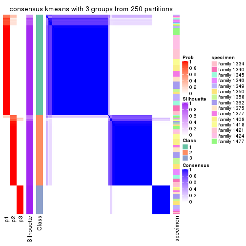</p>

</div>
<div id='tab-ATC-kmeans-consensus-heatmap-3'>
<pre><code class="r">consensus_heatmap(res, k = 4)
</code></pre>

<p></p>

</div>
<div id='tab-ATC-kmeans-consensus-heatmap-4'>
<pre><code class="r">consensus_heatmap(res, k = 5)
</code></pre>

<p></p>

</div>
<div id='tab-ATC-kmeans-consensus-heatmap-5'>
<pre><code class="r">consensus_heatmap(res, k = 6)
</code></pre>

<p></p>

</div>
</div>

Heatmaps for the membership of samples in all partitions to see how consistent they are:


<script>
$( function() {
	$( '#tabs-ATC-kmeans-membership-heatmap' ).tabs();
} );
</script>
<div id='tabs-ATC-kmeans-membership-heatmap'>
<ul>
<li><a href='#tab-ATC-kmeans-membership-heatmap-1'>k = 2</a></li>
<li><a href='#tab-ATC-kmeans-membership-heatmap-2'>k = 3</a></li>
<li><a href='#tab-ATC-kmeans-membership-heatmap-3'>k = 4</a></li>
<li><a href='#tab-ATC-kmeans-membership-heatmap-4'>k = 5</a></li>
<li><a href='#tab-ATC-kmeans-membership-heatmap-5'>k = 6</a></li>
</ul>
<div id='tab-ATC-kmeans-membership-heatmap-1'>
<pre><code class="r">membership_heatmap(res, k = 2)
</code></pre>

<p></p>

</div>
<div id='tab-ATC-kmeans-membership-heatmap-2'>
<pre><code class="r">membership_heatmap(res, k = 3)
</code></pre>

<p></p>

</div>
<div id='tab-ATC-kmeans-membership-heatmap-3'>
<pre><code class="r">membership_heatmap(res, k = 4)
</code></pre>

<p></p>

</div>
<div id='tab-ATC-kmeans-membership-heatmap-4'>
<pre><code class="r">membership_heatmap(res, k = 5)
</code></pre>

<p></p>

</div>
<div id='tab-ATC-kmeans-membership-heatmap-5'>
<pre><code class="r">membership_heatmap(res, k = 6)
</code></pre>

<p></p>

</div>
</div>

As soon as we have had the classes for columns, we can look for signatures
which are significantly different between classes which can be candidate marks
for certain classes. Following are the heatmaps for signatures.


Signature heatmaps where rows are scaled:


<script>
$( function() {
	$( '#tabs-ATC-kmeans-get-signatures' ).tabs();
} );
</script>
<div id='tabs-ATC-kmeans-get-signatures'>
<ul>
<li><a href='#tab-ATC-kmeans-get-signatures-1'>k = 2</a></li>
<li><a href='#tab-ATC-kmeans-get-signatures-2'>k = 3</a></li>
<li><a href='#tab-ATC-kmeans-get-signatures-3'>k = 4</a></li>
<li><a href='#tab-ATC-kmeans-get-signatures-4'>k = 5</a></li>
<li><a href='#tab-ATC-kmeans-get-signatures-5'>k = 6</a></li>
</ul>
<div id='tab-ATC-kmeans-get-signatures-1'>
<pre><code class="r">get_signatures(res, k = 2)
</code></pre>

<p></p>

</div>
<div id='tab-ATC-kmeans-get-signatures-2'>
<pre><code class="r">get_signatures(res, k = 3)
</code></pre>

<p></p>

</div>
<div id='tab-ATC-kmeans-get-signatures-3'>
<pre><code class="r">get_signatures(res, k = 4)
</code></pre>

<p></p>

</div>
<div id='tab-ATC-kmeans-get-signatures-4'>
<pre><code class="r">get_signatures(res, k = 5)
</code></pre>

<p></p>

</div>
<div id='tab-ATC-kmeans-get-signatures-5'>
<pre><code class="r">get_signatures(res, k = 6)
</code></pre>

<p></p>

</div>
</div>


Signature heatmaps where rows are not scaled:


<script>
$( function() {
	$( '#tabs-ATC-kmeans-get-signatures-no-scale' ).tabs();
} );
</script>
<div id='tabs-ATC-kmeans-get-signatures-no-scale'>
<ul>
<li><a href='#tab-ATC-kmeans-get-signatures-no-scale-1'>k = 2</a></li>
<li><a href='#tab-ATC-kmeans-get-signatures-no-scale-2'>k = 3</a></li>
<li><a href='#tab-ATC-kmeans-get-signatures-no-scale-3'>k = 4</a></li>
<li><a href='#tab-ATC-kmeans-get-signatures-no-scale-4'>k = 5</a></li>
<li><a href='#tab-ATC-kmeans-get-signatures-no-scale-5'>k = 6</a></li>
</ul>
<div id='tab-ATC-kmeans-get-signatures-no-scale-1'>
<pre><code class="r">get_signatures(res, k = 2, scale_rows = FALSE)
</code></pre>

<p></p>

</div>
<div id='tab-ATC-kmeans-get-signatures-no-scale-2'>
<pre><code class="r">get_signatures(res, k = 3, scale_rows = FALSE)
</code></pre>

<p></p>

</div>
<div id='tab-ATC-kmeans-get-signatures-no-scale-3'>
<pre><code class="r">get_signatures(res, k = 4, scale_rows = FALSE)
</code></pre>

<p></p>

</div>
<div id='tab-ATC-kmeans-get-signatures-no-scale-4'>
<pre><code class="r">get_signatures(res, k = 5, scale_rows = FALSE)
</code></pre>

<p></p>

</div>
<div id='tab-ATC-kmeans-get-signatures-no-scale-5'>
<pre><code class="r">get_signatures(res, k = 6, scale_rows = FALSE)
</code></pre>

<p></p>

</div>
</div>


Compare the overlap of signatures from different k:

```r
compare_signatures(res)
```


`get_signature()` returns a data frame invisibly. TO get the list of signatures, the function
call should be assigned to a variable explicitly. In following code, if `plot` argument is set
to `FALSE`, no heatmap is plotted while only the differential analysis is performed.

```r
# code only for demonstration
tb = get_signature(res, k = ..., plot = FALSE)
```

An example of the output of `tb` is:

```
#>   which_row         fdr    mean_1    mean_2 scaled_mean_1 scaled_mean_2 km
#> 1        38 0.042760348  8.373488  9.131774    -0.5533452     0.5164555  1
#> 2        40 0.018707592  7.106213  8.469186    -0.6173731     0.5762149  1
#> 3        55 0.019134737 10.221463 11.207825    -0.6159697     0.5749050  1
#> 4        59 0.006059896  5.921854  7.869574    -0.6899429     0.6439467  1
#> 5        60 0.018055526  8.928898 10.211722    -0.6204761     0.5791110  1
#> 6        98 0.009384629 15.714769 14.887706     0.6635654    -0.6193277  2
...
```

The columns in `tb` are:

1. `which_row`: row indices corresponding to the input matrix.
2. `fdr`: FDR for the differential test. 
3. `mean_x`: The mean value in group x.
4. `scaled_mean_x`: The mean value in group x after rows are scaled.
5. `km`: Row groups if k-means clustering is applied to rows.


UMAP plot which shows how samples are separated.


<script>
$( function() {
	$( '#tabs-ATC-kmeans-dimension-reduction' ).tabs();
} );
</script>
<div id='tabs-ATC-kmeans-dimension-reduction'>
<ul>
<li><a href='#tab-ATC-kmeans-dimension-reduction-1'>k = 2</a></li>
<li><a href='#tab-ATC-kmeans-dimension-reduction-2'>k = 3</a></li>
<li><a href='#tab-ATC-kmeans-dimension-reduction-3'>k = 4</a></li>
<li><a href='#tab-ATC-kmeans-dimension-reduction-4'>k = 5</a></li>
<li><a href='#tab-ATC-kmeans-dimension-reduction-5'>k = 6</a></li>
</ul>
<div id='tab-ATC-kmeans-dimension-reduction-1'>
<pre><code class="r">dimension_reduction(res, k = 2, method = &quot;UMAP&quot;)
</code></pre>

<p></p>

</div>
<div id='tab-ATC-kmeans-dimension-reduction-2'>
<pre><code class="r">dimension_reduction(res, k = 3, method = &quot;UMAP&quot;)
</code></pre>

<p></p>

</div>
<div id='tab-ATC-kmeans-dimension-reduction-3'>
<pre><code class="r">dimension_reduction(res, k = 4, method = &quot;UMAP&quot;)
</code></pre>

<p></p>

</div>
<div id='tab-ATC-kmeans-dimension-reduction-4'>
<pre><code class="r">dimension_reduction(res, k = 5, method = &quot;UMAP&quot;)
</code></pre>

<p></p>

</div>
<div id='tab-ATC-kmeans-dimension-reduction-5'>
<pre><code class="r">dimension_reduction(res, k = 6, method = &quot;UMAP&quot;)
</code></pre>

<p></p>

</div>
</div>


Following heatmap shows how subgroups are split when increasing `k`:

```r
collect_classes(res)
```


Test correlation between subgroups and known annotations. If the known
annotation is numeric, one-way ANOVA test is applied, and if the known
annotation is discrete, chi-squared contingency table test is applied.

```r
test_to_known_factors(res)
```

```
#>              n specimen(p) k
#> ATC:kmeans 166       0.268 2
#> ATC:kmeans 167       0.175 3
#> ATC:kmeans 162       0.540 4
#> ATC:kmeans 154       0.430 5
#> ATC:kmeans 143       0.386 6
```


If matrix rows can be associated to genes, consider to use `GO_Enrichment(res,
...)` to perform function enrichment for the signature genes.


 

---------------------------------------------------


### ATC:skmeans**


The object with results only for a single top-value method and a single partition method 
can be extracted as:

```r
res = res_list["ATC", "skmeans"]
# you can also extract it by
# res = res_list["ATC:skmeans"]
```

A summary of `res` and all the functions that can be applied to it:

```r
res
```

```
#> A 'ConsensusPartition' object with k = 2, 3, 4, 5, 6.
#>   On a matrix with 22686 rows and 167 columns.
#>   Top rows (1000, 2000, 3000, 4000, 5000) are extracted by 'ATC' method.
#>   Subgroups are detected by 'skmeans' method.
#>   Performed in total 1250 partitions by row resampling.
#>   Best k for subgroups seems to be 2.
#> 
#> Following methods can be applied to this 'ConsensusPartition' object:
#>  [1] "cola_report"             "collect_classes"         "collect_plots"          
#>  [4] "collect_stats"           "colnames"                "compare_signatures"     
#>  [7] "consensus_heatmap"       "dimension_reduction"     "functional_enrichment"  
#> [10] "get_anno_col"            "get_anno"                "get_classes"            
#> [13] "get_consensus"           "get_matrix"              "get_membership"         
#> [16] "get_param"               "get_signatures"          "get_stats"              
#> [19] "is_best_k"               "is_stable_k"             "membership_heatmap"     
#> [22] "ncol"                    "nrow"                    "plot_ecdf"              
#> [25] "rownames"                "select_partition_number" "show"                   
#> [28] "suggest_best_k"          "test_to_known_factors"
```

`collect_plots()` function collects all the plots made from `res` for all `k` (number of partitions)
into one single page to provide an easy and fast comparison between different `k`.

```r
collect_plots(res)
```


The plots are:

- The first row: a plot of the ECDF (Empirical cumulative distribution
  function) curves of the consensus matrix for each `k` and the heatmap of
  predicted classes for each `k`.
- The second row: heatmaps of the consensus matrix for each `k`.
- The third row: heatmaps of the membership matrix for each `k`.
- The fouth row: heatmaps of the signatures for each `k`.

All the plots in panels can be made by individual functions and they are
plotted later in this section.

`select_partition_number()` produces several plots showing different
statistics for choosing "optimized" `k`. There are following statistics:

- ECDF curves of the consensus matrix for each `k`;
- 1-PAC. [The PAC
  score](https://en.wikipedia.org/wiki/Consensus_clustering#Over-interpretation_potential_of_consensus_clustering)
  measures the proportion of the ambiguous subgrouping.
- Mean silhouette score.
- Concordance. The mean probability of fiting the consensus class ids in all
  partitions.
- Area increased. Denote $A_k$ as the area under the ECDF curve for current
  `k`, the area increased is defined as $A_k - A_{k-1}$.
- Rand index. The percent of pairs of samples that are both in a same cluster
  or both are not in a same cluster in the partition of k and k-1.
- Jaccard index. The ratio of pairs of samples are both in a same cluster in
  the partition of k and k-1 and the pairs of samples are both in a same
  cluster in the partition k or k-1.

The detailed explanations of these statistics can be found in [the cola
vignette](http://bioconductor.org/packages/devel/bioc/vignettes/cola/inst/doc/cola.html#toc_13).

Generally speaking, lower PAC score, higher mean silhouette score or higher
concordance corresponds to better partition. Rand index and Jaccard index
measure how similar the current partition is compared to partition with `k-1`.
If they are too similar, we won't accept `k` is better than `k-1`.

```r
select_partition_number(res)
```


The numeric values for all these statistics can be obtained by `get_stats()`.

```r
get_stats(res)
```

```
#>   k 1-PAC mean_silhouette concordance area_increased  Rand Jaccard
#> 2 2 1.000           0.993       0.997         0.4989 0.501   0.501
#> 3 3 0.872           0.863       0.940         0.1219 0.956   0.912
#> 4 4 0.794           0.728       0.900         0.0810 0.979   0.953
#> 5 5 0.794           0.730       0.857         0.0634 0.917   0.812
#> 6 6 0.711           0.767       0.872         0.0495 0.964   0.904
```

`suggest_best_k()` suggests the best $k$ based on these statistics. The rules are as follows:

- All $k$ with Jaccard index larger than 0.95 are removed because the increase of
  the partition number does not provides enough extra information. If all $k$ are removed,
  the best $k$ is assigned by `NA`.
- For $k$ with 1-PAC larger than 0.9, the maximal $k$ is taken as the "best k". Other $k$ is called "optional k".
- If it does not fit the second rule. The $k$ with the highest vote of highest
  1-PAC, mean silhouette and concordance is taken as the "best k".

```r
suggest_best_k(res)
```

```
#> [1] 2
```


Following shows the table of the partitions (You need to click the **show/hide
code output** link to see it). The membership matrix (columns with name `p*`)
is inferred by
[`clue::cl_consensus()`](https://www.rdocumentation.org/link/cl_consensus?package=clue)
function with the `SE` method. Basically the value in the membership matrix
represents the probability to belong to a certain group. The finall class
label for an item is determined with the group with highest probability it
belongs to.

In `get_classes()` function, the entropy is calculated from the membership
matrix and the silhouette score is calculated from the consensus matrix.


<script>
$( function() {
	$( '#tabs-ATC-skmeans-get-classes' ).tabs();
} );
</script>
<div id='tabs-ATC-skmeans-get-classes'>
<ul>
<li><a href='#tab-ATC-skmeans-get-classes-1'>k = 2</a></li>
<li><a href='#tab-ATC-skmeans-get-classes-2'>k = 3</a></li>
<li><a href='#tab-ATC-skmeans-get-classes-3'>k = 4</a></li>
<li><a href='#tab-ATC-skmeans-get-classes-4'>k = 5</a></li>
<li><a href='#tab-ATC-skmeans-get-classes-5'>k = 6</a></li>
</ul>

<div id='tab-ATC-skmeans-get-classes-1'>
<p><a id='tab-ATC-skmeans-get-classes-1-a' style='color:#0366d6' href='#'>show/hide code output</a></p>
<pre><code class="r">cbind(get_classes(res, k = 2), get_membership(res, k = 2))
</code></pre>

<pre><code>#&gt;          class entropy silhouette    p1    p2
#&gt; GSM30006     2  0.0000      0.994 0.000 1.000
#&gt; GSM30007     1  0.0000      1.000 1.000 0.000
#&gt; GSM30008     1  0.0000      1.000 1.000 0.000
#&gt; GSM30009     1  0.0000      1.000 1.000 0.000
#&gt; GSM30010     2  0.0000      0.994 0.000 1.000
#&gt; GSM30011     2  0.0000      0.994 0.000 1.000
#&gt; GSM30012     2  0.0000      0.994 0.000 1.000
#&gt; GSM30013     1  0.0000      1.000 1.000 0.000
#&gt; GSM30014     2  0.0000      0.994 0.000 1.000
#&gt; GSM30015     1  0.0000      1.000 1.000 0.000
#&gt; GSM30016     2  0.0000      0.994 0.000 1.000
#&gt; GSM30017     1  0.0000      1.000 1.000 0.000
#&gt; GSM30018     1  0.0000      1.000 1.000 0.000
#&gt; GSM30019     2  0.0000      0.994 0.000 1.000
#&gt; GSM30020     1  0.0000      1.000 1.000 0.000
#&gt; GSM30021     2  0.0000      0.994 0.000 1.000
#&gt; GSM30022     1  0.0000      1.000 1.000 0.000
#&gt; GSM30023     1  0.0000      1.000 1.000 0.000
#&gt; GSM30024     2  0.0000      0.994 0.000 1.000
#&gt; GSM30025     1  0.0000      1.000 1.000 0.000
#&gt; GSM30026     1  0.0000      1.000 1.000 0.000
#&gt; GSM30027     2  0.0000      0.994 0.000 1.000
#&gt; GSM30028     1  0.0000      1.000 1.000 0.000
#&gt; GSM30029     1  0.0000      1.000 1.000 0.000
#&gt; GSM30030     1  0.0000      1.000 1.000 0.000
#&gt; GSM30031     1  0.0000      1.000 1.000 0.000
#&gt; GSM30032     2  0.0000      0.994 0.000 1.000
#&gt; GSM30033     2  0.0000      0.994 0.000 1.000
#&gt; GSM30034     1  0.0000      1.000 1.000 0.000
#&gt; GSM30035     2  0.0000      0.994 0.000 1.000
#&gt; GSM30036     1  0.0000      1.000 1.000 0.000
#&gt; GSM30037     2  0.0000      0.994 0.000 1.000
#&gt; GSM30038     2  0.0000      0.994 0.000 1.000
#&gt; GSM30039     2  0.0000      0.994 0.000 1.000
#&gt; GSM30040     2  0.0000      0.994 0.000 1.000
#&gt; GSM30041     2  0.0000      0.994 0.000 1.000
#&gt; GSM30042     2  0.0000      0.994 0.000 1.000
#&gt; GSM30043     2  0.0000      0.994 0.000 1.000
#&gt; GSM30044     1  0.0000      1.000 1.000 0.000
#&gt; GSM30045     1  0.0000      1.000 1.000 0.000
#&gt; GSM30046     1  0.0000      1.000 1.000 0.000
#&gt; GSM30047     1  0.0000      1.000 1.000 0.000
#&gt; GSM30048     1  0.0000      1.000 1.000 0.000
#&gt; GSM30049     2  0.0000      0.994 0.000 1.000
#&gt; GSM30050     1  0.0000      1.000 1.000 0.000
#&gt; GSM30051     2  0.0000      0.994 0.000 1.000
#&gt; GSM30052     1  0.0000      1.000 1.000 0.000
#&gt; GSM30053     2  0.0000      0.994 0.000 1.000
#&gt; GSM30054     2  0.0000      0.994 0.000 1.000
#&gt; GSM30055     2  0.0000      0.994 0.000 1.000
#&gt; GSM30056     2  0.0000      0.994 0.000 1.000
#&gt; GSM30057     2  0.0000      0.994 0.000 1.000
#&gt; GSM30058     2  0.0000      0.994 0.000 1.000
#&gt; GSM30059     1  0.0000      1.000 1.000 0.000
#&gt; GSM30060     2  0.0000      0.994 0.000 1.000
#&gt; GSM30061     1  0.0376      0.996 0.996 0.004
#&gt; GSM30062     1  0.0000      1.000 1.000 0.000
#&gt; GSM30063     2  0.0000      0.994 0.000 1.000
#&gt; GSM30064     1  0.0000      1.000 1.000 0.000
#&gt; GSM30065     2  0.0000      0.994 0.000 1.000
#&gt; GSM30066     2  0.0000      0.994 0.000 1.000
#&gt; GSM30067     1  0.0000      1.000 1.000 0.000
#&gt; GSM30068     2  0.0000      0.994 0.000 1.000
#&gt; GSM30069     2  0.0000      0.994 0.000 1.000
#&gt; GSM30070     2  0.0000      0.994 0.000 1.000
#&gt; GSM30071     2  0.0000      0.994 0.000 1.000
#&gt; GSM30072     1  0.0000      1.000 1.000 0.000
#&gt; GSM30073     2  0.4161      0.905 0.084 0.916
#&gt; GSM30074     2  0.0000      0.994 0.000 1.000
#&gt; GSM30075     2  0.0000      0.994 0.000 1.000
#&gt; GSM30076     1  0.0000      1.000 1.000 0.000
#&gt; GSM30077     1  0.0000      1.000 1.000 0.000
#&gt; GSM30078     1  0.0000      1.000 1.000 0.000
#&gt; GSM30079     1  0.0000      1.000 1.000 0.000
#&gt; GSM30080     2  0.0000      0.994 0.000 1.000
#&gt; GSM30081     2  0.0000      0.994 0.000 1.000
#&gt; GSM30086     2  0.9608      0.377 0.384 0.616
#&gt; GSM30087     1  0.0000      1.000 1.000 0.000
#&gt; GSM30088     1  0.0000      1.000 1.000 0.000
#&gt; GSM30089     2  0.0000      0.994 0.000 1.000
#&gt; GSM30090     2  0.0000      0.994 0.000 1.000
#&gt; GSM30091     2  0.0000      0.994 0.000 1.000
#&gt; GSM30092     1  0.0000      1.000 1.000 0.000
#&gt; GSM30093     2  0.0000      0.994 0.000 1.000
#&gt; GSM30094     2  0.0000      0.994 0.000 1.000
#&gt; GSM30095     2  0.0000      0.994 0.000 1.000
#&gt; GSM30096     1  0.0000      1.000 1.000 0.000
#&gt; GSM30097     1  0.0000      1.000 1.000 0.000
#&gt; GSM30098     1  0.0000      1.000 1.000 0.000
#&gt; GSM30099     2  0.0000      0.994 0.000 1.000
#&gt; GSM30100     2  0.0000      0.994 0.000 1.000
#&gt; GSM30101     2  0.0000      0.994 0.000 1.000
#&gt; GSM30102     2  0.0000      0.994 0.000 1.000
#&gt; GSM30103     2  0.0000      0.994 0.000 1.000
#&gt; GSM30104     1  0.0000      1.000 1.000 0.000
#&gt; GSM30105     1  0.0000      1.000 1.000 0.000
#&gt; GSM30106     1  0.0000      1.000 1.000 0.000
#&gt; GSM30107     1  0.0000      1.000 1.000 0.000
#&gt; GSM30108     2  0.0000      0.994 0.000 1.000
#&gt; GSM30109     1  0.0000      1.000 1.000 0.000
#&gt; GSM30110     1  0.0000      1.000 1.000 0.000
#&gt; GSM30111     1  0.0000      1.000 1.000 0.000
#&gt; GSM30112     1  0.0000      1.000 1.000 0.000
#&gt; GSM30113     2  0.0000      0.994 0.000 1.000
#&gt; GSM30114     2  0.0000      0.994 0.000 1.000
#&gt; GSM30115     1  0.0000      1.000 1.000 0.000
#&gt; GSM30116     2  0.0000      0.994 0.000 1.000
#&gt; GSM30117     2  0.0000      0.994 0.000 1.000
#&gt; GSM30118     2  0.0000      0.994 0.000 1.000
#&gt; GSM30119     2  0.0000      0.994 0.000 1.000
#&gt; GSM30120     1  0.0000      1.000 1.000 0.000
#&gt; GSM30121     1  0.0000      1.000 1.000 0.000
#&gt; GSM30122     1  0.0000      1.000 1.000 0.000
#&gt; GSM30123     2  0.0000      0.994 0.000 1.000
#&gt; GSM30177     2  0.0000      0.994 0.000 1.000
#&gt; GSM30178     1  0.0000      1.000 1.000 0.000
#&gt; GSM30179     1  0.0000      1.000 1.000 0.000
#&gt; GSM30180     1  0.0000      1.000 1.000 0.000
#&gt; GSM30181     2  0.0000      0.994 0.000 1.000
#&gt; GSM30182     1  0.0000      1.000 1.000 0.000
#&gt; GSM30183     1  0.0000      1.000 1.000 0.000
#&gt; GSM30184     2  0.0000      0.994 0.000 1.000
#&gt; GSM30185     2  0.0000      0.994 0.000 1.000
#&gt; GSM30186     2  0.0000      0.994 0.000 1.000
#&gt; GSM30187     1  0.0000      1.000 1.000 0.000
#&gt; GSM30188     1  0.0000      1.000 1.000 0.000
#&gt; GSM30189     1  0.0000      1.000 1.000 0.000
#&gt; GSM30190     2  0.0000      0.994 0.000 1.000
#&gt; GSM30191     1  0.0376      0.996 0.996 0.004
#&gt; GSM30192     2  0.0000      0.994 0.000 1.000
#&gt; GSM30193     1  0.0000      1.000 1.000 0.000
#&gt; GSM30194     2  0.0000      0.994 0.000 1.000
#&gt; GSM30195     1  0.0000      1.000 1.000 0.000
#&gt; GSM30196     1  0.0000      1.000 1.000 0.000
#&gt; GSM30197     1  0.0000      1.000 1.000 0.000
#&gt; GSM30198     1  0.0000      1.000 1.000 0.000
#&gt; GSM30199     2  0.0000      0.994 0.000 1.000
#&gt; GSM30200     1  0.0000      1.000 1.000 0.000
#&gt; GSM30201     1  0.0000      1.000 1.000 0.000
#&gt; GSM30202     1  0.0000      1.000 1.000 0.000
#&gt; GSM30203     1  0.0000      1.000 1.000 0.000
#&gt; GSM30204     1  0.0000      1.000 1.000 0.000
#&gt; GSM30205     2  0.0000      0.994 0.000 1.000
#&gt; GSM30206     1  0.0000      1.000 1.000 0.000
#&gt; GSM30207     1  0.0000      1.000 1.000 0.000
#&gt; GSM30208     1  0.0000      1.000 1.000 0.000
#&gt; GSM30209     2  0.0000      0.994 0.000 1.000
#&gt; GSM30210     1  0.0000      1.000 1.000 0.000
#&gt; GSM30211     1  0.0000      1.000 1.000 0.000
#&gt; GSM30212     1  0.0000      1.000 1.000 0.000
#&gt; GSM30213     1  0.0000      1.000 1.000 0.000
#&gt; GSM30214     1  0.0000      1.000 1.000 0.000
#&gt; GSM30215     1  0.0000      1.000 1.000 0.000
#&gt; GSM30216     1  0.0000      1.000 1.000 0.000
#&gt; GSM30217     1  0.0000      1.000 1.000 0.000
#&gt; GSM30218     2  0.0000      0.994 0.000 1.000
#&gt; GSM30219     2  0.0000      0.994 0.000 1.000
#&gt; GSM30220     1  0.0000      1.000 1.000 0.000
#&gt; GSM30221     1  0.0000      1.000 1.000 0.000
#&gt; GSM30222     1  0.0000      1.000 1.000 0.000
#&gt; GSM30223     1  0.0000      1.000 1.000 0.000
#&gt; GSM30224     1  0.0000      1.000 1.000 0.000
#&gt; GSM30225     1  0.0000      1.000 1.000 0.000
#&gt; GSM30226     2  0.0000      0.994 0.000 1.000
#&gt; GSM30227     1  0.0000      1.000 1.000 0.000
#&gt; GSM30228     2  0.0000      0.994 0.000 1.000
#&gt; GSM30229     1  0.0000      1.000 1.000 0.000
</code></pre>

<script>
$('#tab-ATC-skmeans-get-classes-1-a').parent().next().next().hide();
$('#tab-ATC-skmeans-get-classes-1-a').click(function(){
  $('#tab-ATC-skmeans-get-classes-1-a').parent().next().next().toggle();
  return(false);
});
</script>
</div>

<div id='tab-ATC-skmeans-get-classes-2'>
<p><a id='tab-ATC-skmeans-get-classes-2-a' style='color:#0366d6' href='#'>show/hide code output</a></p>
<pre><code class="r">cbind(get_classes(res, k = 3), get_membership(res, k = 3))
</code></pre>

<pre><code>#&gt;          class entropy silhouette    p1    p2    p3
#&gt; GSM30006     2  0.0000      0.869 0.000 1.000 0.000
#&gt; GSM30007     1  0.0000      0.990 1.000 0.000 0.000
#&gt; GSM30008     1  0.0000      0.990 1.000 0.000 0.000
#&gt; GSM30009     1  0.0000      0.990 1.000 0.000 0.000
#&gt; GSM30010     2  0.0000      0.869 0.000 1.000 0.000
#&gt; GSM30011     2  0.0000      0.869 0.000 1.000 0.000
#&gt; GSM30012     2  0.3482      0.794 0.000 0.872 0.128
#&gt; GSM30013     1  0.1643      0.951 0.956 0.000 0.044
#&gt; GSM30014     2  0.0000      0.869 0.000 1.000 0.000
#&gt; GSM30015     1  0.0000      0.990 1.000 0.000 0.000
#&gt; GSM30016     2  0.3879      0.775 0.000 0.848 0.152
#&gt; GSM30017     1  0.0000      0.990 1.000 0.000 0.000
#&gt; GSM30018     1  0.0000      0.990 1.000 0.000 0.000
#&gt; GSM30019     2  0.0000      0.869 0.000 1.000 0.000
#&gt; GSM30020     1  0.0000      0.990 1.000 0.000 0.000
#&gt; GSM30021     2  0.3482      0.794 0.000 0.872 0.128
#&gt; GSM30022     1  0.0000      0.990 1.000 0.000 0.000
#&gt; GSM30023     1  0.1643      0.951 0.956 0.000 0.044
#&gt; GSM30024     2  0.0000      0.869 0.000 1.000 0.000
#&gt; GSM30025     1  0.1529      0.953 0.960 0.000 0.040
#&gt; GSM30026     1  0.0000      0.990 1.000 0.000 0.000
#&gt; GSM30027     2  0.4121      0.761 0.000 0.832 0.168
#&gt; GSM30028     1  0.1643      0.951 0.956 0.000 0.044
#&gt; GSM30029     1  0.0000      0.990 1.000 0.000 0.000
#&gt; GSM30030     1  0.0000      0.990 1.000 0.000 0.000
#&gt; GSM30031     1  0.0000      0.990 1.000 0.000 0.000
#&gt; GSM30032     2  0.5968      0.220 0.000 0.636 0.364
#&gt; GSM30033     2  0.3482      0.764 0.000 0.872 0.128
#&gt; GSM30034     1  0.0000      0.990 1.000 0.000 0.000
#&gt; GSM30035     2  0.4399      0.692 0.000 0.812 0.188
#&gt; GSM30036     1  0.0000      0.990 1.000 0.000 0.000
#&gt; GSM30037     2  0.4399      0.741 0.000 0.812 0.188
#&gt; GSM30038     2  0.3879      0.775 0.000 0.848 0.152
#&gt; GSM30039     2  0.0000      0.869 0.000 1.000 0.000
#&gt; GSM30040     2  0.0000      0.869 0.000 1.000 0.000
#&gt; GSM30041     2  0.0000      0.869 0.000 1.000 0.000
#&gt; GSM30042     2  0.0000      0.869 0.000 1.000 0.000
#&gt; GSM30043     2  0.0000      0.869 0.000 1.000 0.000
#&gt; GSM30044     1  0.0000      0.990 1.000 0.000 0.000
#&gt; GSM30045     1  0.0000      0.990 1.000 0.000 0.000
#&gt; GSM30046     1  0.0000      0.990 1.000 0.000 0.000
#&gt; GSM30047     1  0.0237      0.987 0.996 0.000 0.004
#&gt; GSM30048     1  0.0000      0.990 1.000 0.000 0.000
#&gt; GSM30049     2  0.0000      0.869 0.000 1.000 0.000
#&gt; GSM30050     1  0.1643      0.951 0.956 0.000 0.044
#&gt; GSM30051     2  0.0000      0.869 0.000 1.000 0.000
#&gt; GSM30052     1  0.0000      0.990 1.000 0.000 0.000
#&gt; GSM30053     2  0.1964      0.840 0.000 0.944 0.056
#&gt; GSM30054     2  0.0000      0.869 0.000 1.000 0.000
#&gt; GSM30055     2  0.2878      0.816 0.000 0.904 0.096
#&gt; GSM30056     2  0.0592      0.863 0.000 0.988 0.012
#&gt; GSM30057     2  0.0000      0.869 0.000 1.000 0.000
#&gt; GSM30058     2  0.0000      0.869 0.000 1.000 0.000
#&gt; GSM30059     1  0.0000      0.990 1.000 0.000 0.000
#&gt; GSM30060     2  0.0000      0.869 0.000 1.000 0.000
#&gt; GSM30061     3  0.6225      0.163 0.432 0.000 0.568
#&gt; GSM30062     1  0.0000      0.990 1.000 0.000 0.000
#&gt; GSM30063     2  0.5178      0.533 0.000 0.744 0.256
#&gt; GSM30064     1  0.0000      0.990 1.000 0.000 0.000
#&gt; GSM30065     2  0.3879      0.775 0.000 0.848 0.152
#&gt; GSM30066     2  0.0000      0.869 0.000 1.000 0.000
#&gt; GSM30067     1  0.0000      0.990 1.000 0.000 0.000
#&gt; GSM30068     2  0.0000      0.869 0.000 1.000 0.000
#&gt; GSM30069     2  0.0000      0.869 0.000 1.000 0.000
#&gt; GSM30070     2  0.3879      0.775 0.000 0.848 0.152
#&gt; GSM30071     2  0.4178      0.758 0.000 0.828 0.172
#&gt; GSM30072     1  0.0000      0.990 1.000 0.000 0.000
#&gt; GSM30073     3  0.6809      0.201 0.012 0.464 0.524
#&gt; GSM30074     2  0.3941      0.772 0.000 0.844 0.156
#&gt; GSM30075     3  0.4931      0.715 0.000 0.232 0.768
#&gt; GSM30076     1  0.0000      0.990 1.000 0.000 0.000
#&gt; GSM30077     1  0.0000      0.990 1.000 0.000 0.000
#&gt; GSM30078     1  0.0000      0.990 1.000 0.000 0.000
#&gt; GSM30079     1  0.0000      0.990 1.000 0.000 0.000
#&gt; GSM30080     2  0.3879      0.775 0.000 0.848 0.152
#&gt; GSM30081     2  0.0000      0.869 0.000 1.000 0.000
#&gt; GSM30086     2  0.9944     -0.297 0.284 0.372 0.344
#&gt; GSM30087     1  0.0000      0.990 1.000 0.000 0.000
#&gt; GSM30088     1  0.0000      0.990 1.000 0.000 0.000
#&gt; GSM30089     2  0.4399      0.741 0.000 0.812 0.188
#&gt; GSM30090     2  0.0000      0.869 0.000 1.000 0.000
#&gt; GSM30091     2  0.0000      0.869 0.000 1.000 0.000
#&gt; GSM30092     1  0.0000      0.990 1.000 0.000 0.000
#&gt; GSM30093     2  0.3192      0.781 0.000 0.888 0.112
#&gt; GSM30094     2  0.0000      0.869 0.000 1.000 0.000
#&gt; GSM30095     2  0.0000      0.869 0.000 1.000 0.000
#&gt; GSM30096     1  0.0000      0.990 1.000 0.000 0.000
#&gt; GSM30097     1  0.0000      0.990 1.000 0.000 0.000
#&gt; GSM30098     1  0.0000      0.990 1.000 0.000 0.000
#&gt; GSM30099     2  0.4399      0.692 0.000 0.812 0.188
#&gt; GSM30100     2  0.0000      0.869 0.000 1.000 0.000
#&gt; GSM30101     2  0.0000      0.869 0.000 1.000 0.000
#&gt; GSM30102     2  0.4346      0.698 0.000 0.816 0.184
#&gt; GSM30103     3  0.5431      0.672 0.000 0.284 0.716
#&gt; GSM30104     1  0.5760      0.487 0.672 0.000 0.328
#&gt; GSM30105     1  0.0000      0.990 1.000 0.000 0.000
#&gt; GSM30106     1  0.0000      0.990 1.000 0.000 0.000
#&gt; GSM30107     1  0.0000      0.990 1.000 0.000 0.000
#&gt; GSM30108     2  0.3941      0.772 0.000 0.844 0.156
#&gt; GSM30109     1  0.0000      0.990 1.000 0.000 0.000
#&gt; GSM30110     1  0.0000      0.990 1.000 0.000 0.000
#&gt; GSM30111     1  0.0000      0.990 1.000 0.000 0.000
#&gt; GSM30112     1  0.0424      0.983 0.992 0.000 0.008
#&gt; GSM30113     2  0.0000      0.869 0.000 1.000 0.000
#&gt; GSM30114     2  0.3941      0.772 0.000 0.844 0.156
#&gt; GSM30115     1  0.1529      0.955 0.960 0.000 0.040
#&gt; GSM30116     2  0.0000      0.869 0.000 1.000 0.000
#&gt; GSM30117     3  0.4974      0.714 0.000 0.236 0.764
#&gt; GSM30118     2  0.3686      0.755 0.000 0.860 0.140
#&gt; GSM30119     2  0.0000      0.869 0.000 1.000 0.000
#&gt; GSM30120     1  0.1529      0.955 0.960 0.000 0.040
#&gt; GSM30121     1  0.0000      0.990 1.000 0.000 0.000
#&gt; GSM30122     1  0.0000      0.990 1.000 0.000 0.000
#&gt; GSM30123     2  0.1163      0.853 0.000 0.972 0.028
#&gt; GSM30177     2  0.4399      0.692 0.000 0.812 0.188
#&gt; GSM30178     1  0.0000      0.990 1.000 0.000 0.000
#&gt; GSM30179     1  0.0000      0.990 1.000 0.000 0.000
#&gt; GSM30180     1  0.0000      0.990 1.000 0.000 0.000
#&gt; GSM30181     3  0.5810      0.602 0.000 0.336 0.664
#&gt; GSM30182     1  0.0000      0.990 1.000 0.000 0.000
#&gt; GSM30183     1  0.0000      0.990 1.000 0.000 0.000
#&gt; GSM30184     2  0.0000      0.869 0.000 1.000 0.000
#&gt; GSM30185     2  0.3412      0.774 0.000 0.876 0.124
#&gt; GSM30186     2  0.4346      0.698 0.000 0.816 0.184
#&gt; GSM30187     1  0.0000      0.990 1.000 0.000 0.000
#&gt; GSM30188     1  0.0000      0.990 1.000 0.000 0.000
#&gt; GSM30189     1  0.0000      0.990 1.000 0.000 0.000
#&gt; GSM30190     2  0.0000      0.869 0.000 1.000 0.000
#&gt; GSM30191     3  0.6827      0.614 0.192 0.080 0.728
#&gt; GSM30192     2  0.5327      0.532 0.000 0.728 0.272
#&gt; GSM30193     1  0.0000      0.990 1.000 0.000 0.000
#&gt; GSM30194     2  0.0000      0.869 0.000 1.000 0.000
#&gt; GSM30195     1  0.0747      0.977 0.984 0.000 0.016
#&gt; GSM30196     1  0.0000      0.990 1.000 0.000 0.000
#&gt; GSM30197     1  0.0000      0.990 1.000 0.000 0.000
#&gt; GSM30198     1  0.0000      0.990 1.000 0.000 0.000
#&gt; GSM30199     2  0.6309     -0.236 0.000 0.504 0.496
#&gt; GSM30200     1  0.0000      0.990 1.000 0.000 0.000
#&gt; GSM30201     1  0.0000      0.990 1.000 0.000 0.000
#&gt; GSM30202     1  0.0000      0.990 1.000 0.000 0.000
#&gt; GSM30203     1  0.0000      0.990 1.000 0.000 0.000
#&gt; GSM30204     1  0.0000      0.990 1.000 0.000 0.000
#&gt; GSM30205     2  0.0000      0.869 0.000 1.000 0.000
#&gt; GSM30206     1  0.0000      0.990 1.000 0.000 0.000
#&gt; GSM30207     1  0.0000      0.990 1.000 0.000 0.000
#&gt; GSM30208     1  0.0000      0.990 1.000 0.000 0.000
#&gt; GSM30209     2  0.6168      0.124 0.000 0.588 0.412
#&gt; GSM30210     1  0.0000      0.990 1.000 0.000 0.000
#&gt; GSM30211     1  0.0000      0.990 1.000 0.000 0.000
#&gt; GSM30212     1  0.0000      0.990 1.000 0.000 0.000
#&gt; GSM30213     1  0.0000      0.990 1.000 0.000 0.000
#&gt; GSM30214     1  0.0000      0.990 1.000 0.000 0.000
#&gt; GSM30215     1  0.0000      0.990 1.000 0.000 0.000
#&gt; GSM30216     1  0.0000      0.990 1.000 0.000 0.000
#&gt; GSM30217     1  0.0000      0.990 1.000 0.000 0.000
#&gt; GSM30218     3  0.4555      0.710 0.000 0.200 0.800
#&gt; GSM30219     2  0.0000      0.869 0.000 1.000 0.000
#&gt; GSM30220     1  0.0000      0.990 1.000 0.000 0.000
#&gt; GSM30221     1  0.0000      0.990 1.000 0.000 0.000
#&gt; GSM30222     1  0.0237      0.987 0.996 0.000 0.004
#&gt; GSM30223     1  0.0000      0.990 1.000 0.000 0.000
#&gt; GSM30224     1  0.0000      0.990 1.000 0.000 0.000
#&gt; GSM30225     1  0.0000      0.990 1.000 0.000 0.000
#&gt; GSM30226     2  0.6307     -0.208 0.000 0.512 0.488
#&gt; GSM30227     1  0.0000      0.990 1.000 0.000 0.000
#&gt; GSM30228     2  0.0000      0.869 0.000 1.000 0.000
#&gt; GSM30229     1  0.4062      0.790 0.836 0.000 0.164
</code></pre>

<script>
$('#tab-ATC-skmeans-get-classes-2-a').parent().next().next().hide();
$('#tab-ATC-skmeans-get-classes-2-a').click(function(){
  $('#tab-ATC-skmeans-get-classes-2-a').parent().next().next().toggle();
  return(false);
});
</script>
</div>

<div id='tab-ATC-skmeans-get-classes-3'>
<p><a id='tab-ATC-skmeans-get-classes-3-a' style='color:#0366d6' href='#'>show/hide code output</a></p>
<pre><code class="r">cbind(get_classes(res, k = 4), get_membership(res, k = 4))
</code></pre>

<pre><code>#&gt;          class entropy silhouette    p1    p2    p3    p4
#&gt; GSM30006     2  0.0188    0.80807 0.000 0.996 0.004 0.000
#&gt; GSM30007     1  0.0000    0.94344 1.000 0.000 0.000 0.000
#&gt; GSM30008     1  0.0000    0.94344 1.000 0.000 0.000 0.000
#&gt; GSM30009     1  0.0000    0.94344 1.000 0.000 0.000 0.000
#&gt; GSM30010     2  0.0336    0.80653 0.000 0.992 0.008 0.000
#&gt; GSM30011     2  0.0336    0.80653 0.000 0.992 0.008 0.000
#&gt; GSM30012     2  0.2589    0.68710 0.000 0.884 0.116 0.000
#&gt; GSM30013     1  0.5768    0.23414 0.516 0.000 0.456 0.028
#&gt; GSM30014     2  0.0336    0.80653 0.000 0.992 0.008 0.000
#&gt; GSM30015     1  0.0524    0.94166 0.988 0.000 0.004 0.008
#&gt; GSM30016     2  0.4382    0.27150 0.000 0.704 0.296 0.000
#&gt; GSM30017     1  0.0000    0.94344 1.000 0.000 0.000 0.000
#&gt; GSM30018     1  0.0376    0.94254 0.992 0.000 0.004 0.004
#&gt; GSM30019     2  0.0336    0.80653 0.000 0.992 0.008 0.000
#&gt; GSM30020     1  0.0524    0.94166 0.988 0.000 0.004 0.008
#&gt; GSM30021     2  0.2973    0.64278 0.000 0.856 0.144 0.000
#&gt; GSM30022     1  0.0000    0.94344 1.000 0.000 0.000 0.000
#&gt; GSM30023     1  0.5620    0.32334 0.560 0.000 0.416 0.024
#&gt; GSM30024     2  0.0000    0.80942 0.000 1.000 0.000 0.000
#&gt; GSM30025     1  0.6295    0.45275 0.656 0.000 0.132 0.212
#&gt; GSM30026     1  0.0000    0.94344 1.000 0.000 0.000 0.000
#&gt; GSM30027     2  0.5126   -0.33627 0.000 0.552 0.444 0.004
#&gt; GSM30028     1  0.5708    0.33054 0.556 0.000 0.416 0.028
#&gt; GSM30029     1  0.0000    0.94344 1.000 0.000 0.000 0.000
#&gt; GSM30030     1  0.0000    0.94344 1.000 0.000 0.000 0.000
#&gt; GSM30031     1  0.0000    0.94344 1.000 0.000 0.000 0.000
#&gt; GSM30032     2  0.6944   -0.17244 0.000 0.484 0.112 0.404
#&gt; GSM30033     2  0.2216    0.73537 0.000 0.908 0.000 0.092
#&gt; GSM30034     1  0.0000    0.94344 1.000 0.000 0.000 0.000
#&gt; GSM30035     2  0.2921    0.68426 0.000 0.860 0.000 0.140
#&gt; GSM30036     1  0.0657    0.94042 0.984 0.000 0.004 0.012
#&gt; GSM30037     3  0.5778    0.39516 0.000 0.472 0.500 0.028
#&gt; GSM30038     2  0.4776   -0.03902 0.000 0.624 0.376 0.000
#&gt; GSM30039     2  0.0336    0.80653 0.000 0.992 0.008 0.000
#&gt; GSM30040     2  0.0000    0.80942 0.000 1.000 0.000 0.000
#&gt; GSM30041     2  0.0000    0.80942 0.000 1.000 0.000 0.000
#&gt; GSM30042     2  0.0336    0.80653 0.000 0.992 0.008 0.000
#&gt; GSM30043     2  0.0000    0.80942 0.000 1.000 0.000 0.000
#&gt; GSM30044     1  0.0000    0.94344 1.000 0.000 0.000 0.000
#&gt; GSM30045     1  0.0000    0.94344 1.000 0.000 0.000 0.000
#&gt; GSM30046     1  0.0376    0.94254 0.992 0.000 0.004 0.004
#&gt; GSM30047     1  0.2775    0.85391 0.896 0.000 0.084 0.020
#&gt; GSM30048     1  0.0000    0.94344 1.000 0.000 0.000 0.000
#&gt; GSM30049     2  0.0000    0.80942 0.000 1.000 0.000 0.000
#&gt; GSM30050     1  0.5700    0.33952 0.560 0.000 0.412 0.028
#&gt; GSM30051     2  0.0000    0.80942 0.000 1.000 0.000 0.000
#&gt; GSM30052     1  0.0000    0.94344 1.000 0.000 0.000 0.000
#&gt; GSM30053     2  0.0921    0.79096 0.000 0.972 0.028 0.000
#&gt; GSM30054     2  0.0000    0.80942 0.000 1.000 0.000 0.000
#&gt; GSM30055     2  0.4769    0.19022 0.000 0.684 0.308 0.008
#&gt; GSM30056     2  0.0000    0.80942 0.000 1.000 0.000 0.000
#&gt; GSM30057     2  0.0336    0.80653 0.000 0.992 0.008 0.000
#&gt; GSM30058     2  0.0000    0.80942 0.000 1.000 0.000 0.000
#&gt; GSM30059     1  0.3004    0.85357 0.892 0.000 0.048 0.060
#&gt; GSM30060     2  0.0188    0.80755 0.000 0.996 0.000 0.004
#&gt; GSM30061     4  0.6240    0.44722 0.176 0.000 0.156 0.668
#&gt; GSM30062     1  0.1733    0.90856 0.948 0.000 0.028 0.024
#&gt; GSM30063     2  0.4057    0.61004 0.000 0.816 0.032 0.152
#&gt; GSM30064     1  0.0000    0.94344 1.000 0.000 0.000 0.000
#&gt; GSM30065     2  0.4746   -0.00475 0.000 0.632 0.368 0.000
#&gt; GSM30066     2  0.0000    0.80942 0.000 1.000 0.000 0.000
#&gt; GSM30067     1  0.0000    0.94344 1.000 0.000 0.000 0.000
#&gt; GSM30068     2  0.0336    0.80653 0.000 0.992 0.008 0.000
#&gt; GSM30069     2  0.0336    0.80653 0.000 0.992 0.008 0.000
#&gt; GSM30070     2  0.4776   -0.03902 0.000 0.624 0.376 0.000
#&gt; GSM30071     2  0.5290   -0.43409 0.000 0.516 0.476 0.008
#&gt; GSM30072     1  0.0000    0.94344 1.000 0.000 0.000 0.000
#&gt; GSM30073     4  0.6739    0.38108 0.000 0.172 0.216 0.612
#&gt; GSM30074     2  0.4776   -0.03902 0.000 0.624 0.376 0.000
#&gt; GSM30075     4  0.3249    0.55247 0.000 0.140 0.008 0.852
#&gt; GSM30076     1  0.0524    0.94166 0.988 0.000 0.004 0.008
#&gt; GSM30077     1  0.0524    0.94166 0.988 0.000 0.004 0.008
#&gt; GSM30078     1  0.0524    0.94166 0.988 0.000 0.004 0.008
#&gt; GSM30079     1  0.0000    0.94344 1.000 0.000 0.000 0.000
#&gt; GSM30080     2  0.4991   -0.10977 0.000 0.608 0.388 0.004
#&gt; GSM30081     2  0.0000    0.80942 0.000 1.000 0.000 0.000
#&gt; GSM30086     3  0.6426   -0.29802 0.024 0.064 0.656 0.256
#&gt; GSM30087     1  0.0376    0.94254 0.992 0.000 0.004 0.004
#&gt; GSM30088     1  0.0000    0.94344 1.000 0.000 0.000 0.000
#&gt; GSM30089     3  0.5685    0.41548 0.000 0.460 0.516 0.024
#&gt; GSM30090     2  0.0000    0.80942 0.000 1.000 0.000 0.000
#&gt; GSM30091     2  0.0000    0.80942 0.000 1.000 0.000 0.000
#&gt; GSM30092     1  0.1059    0.93393 0.972 0.000 0.016 0.012
#&gt; GSM30093     2  0.1474    0.77222 0.000 0.948 0.000 0.052
#&gt; GSM30094     2  0.0000    0.80942 0.000 1.000 0.000 0.000
#&gt; GSM30095     2  0.0000    0.80942 0.000 1.000 0.000 0.000
#&gt; GSM30096     1  0.0336    0.94070 0.992 0.000 0.000 0.008
#&gt; GSM30097     1  0.0000    0.94344 1.000 0.000 0.000 0.000
#&gt; GSM30098     1  0.0000    0.94344 1.000 0.000 0.000 0.000
#&gt; GSM30099     2  0.2921    0.68426 0.000 0.860 0.000 0.140
#&gt; GSM30100     2  0.0000    0.80942 0.000 1.000 0.000 0.000
#&gt; GSM30101     2  0.0000    0.80942 0.000 1.000 0.000 0.000
#&gt; GSM30102     2  0.2814    0.69461 0.000 0.868 0.000 0.132
#&gt; GSM30103     4  0.4669    0.53695 0.000 0.168 0.052 0.780
#&gt; GSM30104     4  0.7268    0.28541 0.372 0.000 0.152 0.476
#&gt; GSM30105     1  0.0000    0.94344 1.000 0.000 0.000 0.000
#&gt; GSM30106     1  0.0524    0.94166 0.988 0.000 0.004 0.008
#&gt; GSM30107     1  0.0524    0.93748 0.988 0.000 0.008 0.004
#&gt; GSM30108     2  0.4776   -0.03902 0.000 0.624 0.376 0.000
#&gt; GSM30109     1  0.0376    0.94254 0.992 0.000 0.004 0.004
#&gt; GSM30110     1  0.0524    0.94166 0.988 0.000 0.004 0.008
#&gt; GSM30111     1  0.0000    0.94344 1.000 0.000 0.000 0.000
#&gt; GSM30112     1  0.3099    0.84471 0.876 0.000 0.104 0.020
#&gt; GSM30113     2  0.0000    0.80942 0.000 1.000 0.000 0.000
#&gt; GSM30114     2  0.4898   -0.19368 0.000 0.584 0.416 0.000
#&gt; GSM30115     1  0.5599    0.46302 0.616 0.000 0.352 0.032
#&gt; GSM30116     2  0.0000    0.80942 0.000 1.000 0.000 0.000
#&gt; GSM30117     4  0.3942    0.47930 0.000 0.236 0.000 0.764
#&gt; GSM30118     2  0.2216    0.73741 0.000 0.908 0.000 0.092
#&gt; GSM30119     2  0.0336    0.80653 0.000 0.992 0.008 0.000
#&gt; GSM30120     1  0.5827    0.36361 0.568 0.000 0.396 0.036
#&gt; GSM30121     1  0.0524    0.94166 0.988 0.000 0.004 0.008
#&gt; GSM30122     1  0.0000    0.94344 1.000 0.000 0.000 0.000
#&gt; GSM30123     2  0.0707    0.79774 0.000 0.980 0.000 0.020
#&gt; GSM30177     2  0.2921    0.68424 0.000 0.860 0.000 0.140
#&gt; GSM30178     1  0.0657    0.94042 0.984 0.000 0.004 0.012
#&gt; GSM30179     1  0.0336    0.94268 0.992 0.000 0.000 0.008
#&gt; GSM30180     1  0.2131    0.90273 0.932 0.000 0.036 0.032
#&gt; GSM30181     4  0.5093    0.26810 0.000 0.348 0.012 0.640
#&gt; GSM30182     1  0.0524    0.94166 0.988 0.000 0.004 0.008
#&gt; GSM30183     1  0.0524    0.94166 0.988 0.000 0.004 0.008
#&gt; GSM30184     2  0.0000    0.80942 0.000 1.000 0.000 0.000
#&gt; GSM30185     2  0.2589    0.71303 0.000 0.884 0.000 0.116
#&gt; GSM30186     2  0.2760    0.69828 0.000 0.872 0.000 0.128
#&gt; GSM30187     1  0.0657    0.94042 0.984 0.000 0.004 0.012
#&gt; GSM30188     1  0.0524    0.94166 0.988 0.000 0.004 0.008
#&gt; GSM30189     1  0.0657    0.94042 0.984 0.000 0.004 0.012
#&gt; GSM30190     2  0.0000    0.80942 0.000 1.000 0.000 0.000
#&gt; GSM30191     4  0.6727    0.41437 0.060 0.036 0.272 0.632
#&gt; GSM30192     2  0.5130    0.31599 0.000 0.668 0.020 0.312
#&gt; GSM30193     1  0.0779    0.93864 0.980 0.000 0.004 0.016
#&gt; GSM30194     2  0.0000    0.80942 0.000 1.000 0.000 0.000
#&gt; GSM30195     1  0.5109    0.66714 0.736 0.000 0.212 0.052
#&gt; GSM30196     1  0.0000    0.94344 1.000 0.000 0.000 0.000
#&gt; GSM30197     1  0.0657    0.94042 0.984 0.000 0.004 0.012
#&gt; GSM30198     1  0.0188    0.94314 0.996 0.000 0.000 0.004
#&gt; GSM30199     2  0.4679    0.30775 0.000 0.648 0.000 0.352
#&gt; GSM30200     1  0.0376    0.94254 0.992 0.000 0.004 0.004
#&gt; GSM30201     1  0.0000    0.94344 1.000 0.000 0.000 0.000
#&gt; GSM30202     1  0.1833    0.91199 0.944 0.000 0.024 0.032
#&gt; GSM30203     1  0.2224    0.89942 0.928 0.000 0.040 0.032
#&gt; GSM30204     1  0.0000    0.94344 1.000 0.000 0.000 0.000
#&gt; GSM30205     2  0.0000    0.80942 0.000 1.000 0.000 0.000
#&gt; GSM30206     1  0.0524    0.94166 0.988 0.000 0.004 0.008
#&gt; GSM30207     1  0.0000    0.94344 1.000 0.000 0.000 0.000
#&gt; GSM30208     1  0.0000    0.94344 1.000 0.000 0.000 0.000
#&gt; GSM30209     2  0.5372    0.05311 0.000 0.544 0.012 0.444
#&gt; GSM30210     1  0.0000    0.94344 1.000 0.000 0.000 0.000
#&gt; GSM30211     1  0.0000    0.94344 1.000 0.000 0.000 0.000
#&gt; GSM30212     1  0.0000    0.94344 1.000 0.000 0.000 0.000
#&gt; GSM30213     1  0.0188    0.94221 0.996 0.000 0.000 0.004
#&gt; GSM30214     1  0.0000    0.94344 1.000 0.000 0.000 0.000
#&gt; GSM30215     1  0.0000    0.94344 1.000 0.000 0.000 0.000
#&gt; GSM30216     1  0.0524    0.94166 0.988 0.000 0.004 0.008
#&gt; GSM30217     1  0.0000    0.94344 1.000 0.000 0.000 0.000
#&gt; GSM30218     4  0.1824    0.55458 0.000 0.060 0.004 0.936
#&gt; GSM30219     2  0.0000    0.80942 0.000 1.000 0.000 0.000
#&gt; GSM30220     1  0.0000    0.94344 1.000 0.000 0.000 0.000
#&gt; GSM30221     1  0.0376    0.94254 0.992 0.000 0.004 0.004
#&gt; GSM30222     1  0.2060    0.89867 0.932 0.000 0.016 0.052
#&gt; GSM30223     1  0.0376    0.94254 0.992 0.000 0.004 0.004
#&gt; GSM30224     1  0.0188    0.94313 0.996 0.000 0.004 0.000
#&gt; GSM30225     1  0.0524    0.94166 0.988 0.000 0.004 0.008
#&gt; GSM30226     2  0.4585    0.34548 0.000 0.668 0.000 0.332
#&gt; GSM30227     1  0.0376    0.94254 0.992 0.000 0.004 0.004
#&gt; GSM30228     2  0.0000    0.80942 0.000 1.000 0.000 0.000
#&gt; GSM30229     1  0.7046    0.11592 0.524 0.000 0.136 0.340
</code></pre>

<script>
$('#tab-ATC-skmeans-get-classes-3-a').parent().next().next().hide();
$('#tab-ATC-skmeans-get-classes-3-a').click(function(){
  $('#tab-ATC-skmeans-get-classes-3-a').parent().next().next().toggle();
  return(false);
});
</script>
</div>

<div id='tab-ATC-skmeans-get-classes-4'>
<p><a id='tab-ATC-skmeans-get-classes-4-a' style='color:#0366d6' href='#'>show/hide code output</a></p>
<pre><code class="r">cbind(get_classes(res, k = 5), get_membership(res, k = 5))
</code></pre>

<pre><code>#&gt;          class entropy silhouette    p1    p2    p3    p4    p5
#&gt; GSM30006     3  0.0290     0.8864 0.000 0.000 0.992 0.000 0.008
#&gt; GSM30007     4  0.0404     0.9262 0.012 0.000 0.000 0.988 0.000
#&gt; GSM30008     4  0.0162     0.9273 0.004 0.000 0.000 0.996 0.000
#&gt; GSM30009     4  0.0404     0.9262 0.012 0.000 0.000 0.988 0.000
#&gt; GSM30010     3  0.0290     0.8864 0.000 0.000 0.992 0.000 0.008
#&gt; GSM30011     3  0.0290     0.8864 0.000 0.000 0.992 0.000 0.008
#&gt; GSM30012     3  0.2230     0.7567 0.000 0.000 0.884 0.000 0.116
#&gt; GSM30013     5  0.7709    -0.1690 0.060 0.272 0.000 0.264 0.404
#&gt; GSM30014     3  0.0290     0.8864 0.000 0.000 0.992 0.000 0.008
#&gt; GSM30015     4  0.1921     0.9084 0.044 0.012 0.000 0.932 0.012
#&gt; GSM30016     3  0.3913     0.2416 0.000 0.000 0.676 0.000 0.324
#&gt; GSM30017     4  0.0290     0.9269 0.008 0.000 0.000 0.992 0.000
#&gt; GSM30018     4  0.0451     0.9279 0.008 0.004 0.000 0.988 0.000
#&gt; GSM30019     3  0.0290     0.8864 0.000 0.000 0.992 0.000 0.008
#&gt; GSM30020     4  0.1651     0.9150 0.036 0.012 0.000 0.944 0.008
#&gt; GSM30021     3  0.3039     0.6203 0.000 0.000 0.808 0.000 0.192
#&gt; GSM30022     4  0.0290     0.9269 0.008 0.000 0.000 0.992 0.000
#&gt; GSM30023     5  0.7543    -0.1700 0.040 0.272 0.000 0.312 0.376
#&gt; GSM30024     3  0.0000     0.8896 0.000 0.000 1.000 0.000 0.000
#&gt; GSM30025     1  0.4658     0.2124 0.556 0.004 0.000 0.432 0.008
#&gt; GSM30026     4  0.0162     0.9273 0.004 0.000 0.000 0.996 0.000
#&gt; GSM30027     5  0.4974     0.5039 0.016 0.016 0.356 0.000 0.612
#&gt; GSM30028     5  0.7547    -0.1659 0.040 0.268 0.000 0.324 0.368
#&gt; GSM30029     4  0.0290     0.9269 0.008 0.000 0.000 0.992 0.000
#&gt; GSM30030     4  0.0404     0.9262 0.012 0.000 0.000 0.988 0.000
#&gt; GSM30031     4  0.0290     0.9277 0.008 0.000 0.000 0.992 0.000
#&gt; GSM30032     1  0.6917    -0.2618 0.404 0.172 0.404 0.000 0.020
#&gt; GSM30033     3  0.2286     0.8034 0.000 0.108 0.888 0.000 0.004
#&gt; GSM30034     4  0.0404     0.9262 0.012 0.000 0.000 0.988 0.000
#&gt; GSM30035     3  0.3266     0.6966 0.004 0.200 0.796 0.000 0.000
#&gt; GSM30036     4  0.1651     0.9174 0.036 0.012 0.000 0.944 0.008
#&gt; GSM30037     5  0.6063     0.4428 0.096 0.020 0.296 0.000 0.588
#&gt; GSM30038     5  0.4287     0.4754 0.000 0.000 0.460 0.000 0.540
#&gt; GSM30039     3  0.0290     0.8864 0.000 0.000 0.992 0.000 0.008
#&gt; GSM30040     3  0.0000     0.8896 0.000 0.000 1.000 0.000 0.000
#&gt; GSM30041     3  0.0000     0.8896 0.000 0.000 1.000 0.000 0.000
#&gt; GSM30042     3  0.0290     0.8864 0.000 0.000 0.992 0.000 0.008
#&gt; GSM30043     3  0.0000     0.8896 0.000 0.000 1.000 0.000 0.000
#&gt; GSM30044     4  0.0404     0.9273 0.012 0.000 0.000 0.988 0.000
#&gt; GSM30045     4  0.0404     0.9276 0.012 0.000 0.000 0.988 0.000
#&gt; GSM30046     4  0.0510     0.9270 0.016 0.000 0.000 0.984 0.000
#&gt; GSM30047     4  0.4138     0.7322 0.016 0.092 0.000 0.808 0.084
#&gt; GSM30048     4  0.0404     0.9273 0.012 0.000 0.000 0.988 0.000
#&gt; GSM30049     3  0.0000     0.8896 0.000 0.000 1.000 0.000 0.000
#&gt; GSM30050     5  0.7596    -0.1631 0.044 0.276 0.000 0.304 0.376
#&gt; GSM30051     3  0.0000     0.8896 0.000 0.000 1.000 0.000 0.000
#&gt; GSM30052     4  0.0404     0.9262 0.012 0.000 0.000 0.988 0.000
#&gt; GSM30053     3  0.0880     0.8648 0.000 0.000 0.968 0.000 0.032
#&gt; GSM30054     3  0.0000     0.8896 0.000 0.000 1.000 0.000 0.000
#&gt; GSM30055     3  0.4617    -0.2794 0.000 0.012 0.552 0.000 0.436
#&gt; GSM30056     3  0.0290     0.8858 0.000 0.008 0.992 0.000 0.000
#&gt; GSM30057     3  0.0290     0.8864 0.000 0.000 0.992 0.000 0.008
#&gt; GSM30058     3  0.0000     0.8896 0.000 0.000 1.000 0.000 0.000
#&gt; GSM30059     4  0.3579     0.6624 0.240 0.004 0.000 0.756 0.000
#&gt; GSM30060     3  0.0290     0.8860 0.008 0.000 0.992 0.000 0.000
#&gt; GSM30061     1  0.3159     0.1711 0.856 0.056 0.000 0.088 0.000
#&gt; GSM30062     4  0.3357     0.8047 0.136 0.012 0.000 0.836 0.016
#&gt; GSM30063     3  0.4897     0.5616 0.156 0.112 0.728 0.000 0.004
#&gt; GSM30064     4  0.0404     0.9273 0.012 0.000 0.000 0.988 0.000
#&gt; GSM30065     5  0.4306     0.4097 0.000 0.000 0.492 0.000 0.508
#&gt; GSM30066     3  0.0000     0.8896 0.000 0.000 1.000 0.000 0.000
#&gt; GSM30067     4  0.0404     0.9273 0.012 0.000 0.000 0.988 0.000
#&gt; GSM30068     3  0.0290     0.8864 0.000 0.000 0.992 0.000 0.008
#&gt; GSM30069     3  0.0290     0.8864 0.000 0.000 0.992 0.000 0.008
#&gt; GSM30070     5  0.4306     0.4096 0.000 0.000 0.492 0.000 0.508
#&gt; GSM30071     5  0.5498     0.4967 0.080 0.000 0.340 0.000 0.580
#&gt; GSM30072     4  0.0510     0.9277 0.016 0.000 0.000 0.984 0.000
#&gt; GSM30073     1  0.5835    -0.1368 0.684 0.160 0.108 0.000 0.048
#&gt; GSM30074     5  0.4287     0.4754 0.000 0.000 0.460 0.000 0.540
#&gt; GSM30075     2  0.5458     0.4591 0.292 0.632 0.064 0.000 0.012
#&gt; GSM30076     4  0.1596     0.9161 0.028 0.012 0.000 0.948 0.012
#&gt; GSM30077     4  0.1525     0.9168 0.036 0.012 0.000 0.948 0.004
#&gt; GSM30078     4  0.1442     0.9184 0.032 0.012 0.000 0.952 0.004
#&gt; GSM30079     4  0.0162     0.9273 0.004 0.000 0.000 0.996 0.000
#&gt; GSM30080     5  0.4765     0.5117 0.008 0.008 0.428 0.000 0.556
#&gt; GSM30081     3  0.0000     0.8896 0.000 0.000 1.000 0.000 0.000
#&gt; GSM30086     2  0.5552     0.1985 0.024 0.516 0.028 0.000 0.432
#&gt; GSM30087     4  0.0898     0.9252 0.020 0.008 0.000 0.972 0.000
#&gt; GSM30088     4  0.0162     0.9279 0.004 0.000 0.000 0.996 0.000
#&gt; GSM30089     5  0.5684     0.4560 0.096 0.004 0.300 0.000 0.600
#&gt; GSM30090     3  0.0000     0.8896 0.000 0.000 1.000 0.000 0.000
#&gt; GSM30091     3  0.0000     0.8896 0.000 0.000 1.000 0.000 0.000
#&gt; GSM30092     4  0.2170     0.9038 0.036 0.020 0.000 0.924 0.020
#&gt; GSM30093     3  0.1341     0.8491 0.000 0.056 0.944 0.000 0.000
#&gt; GSM30094     3  0.0000     0.8896 0.000 0.000 1.000 0.000 0.000
#&gt; GSM30095     3  0.0000     0.8896 0.000 0.000 1.000 0.000 0.000
#&gt; GSM30096     4  0.1197     0.9169 0.048 0.000 0.000 0.952 0.000
#&gt; GSM30097     4  0.0510     0.9266 0.016 0.000 0.000 0.984 0.000
#&gt; GSM30098     4  0.0290     0.9268 0.008 0.000 0.000 0.992 0.000
#&gt; GSM30099     3  0.3353     0.6961 0.008 0.196 0.796 0.000 0.000
#&gt; GSM30100     3  0.0000     0.8896 0.000 0.000 1.000 0.000 0.000
#&gt; GSM30101     3  0.0000     0.8896 0.000 0.000 1.000 0.000 0.000
#&gt; GSM30102     3  0.2890     0.7443 0.004 0.160 0.836 0.000 0.000
#&gt; GSM30103     2  0.6703     0.3609 0.388 0.436 0.164 0.000 0.012
#&gt; GSM30104     1  0.3476     0.2667 0.816 0.020 0.000 0.160 0.004
#&gt; GSM30105     4  0.0404     0.9263 0.012 0.000 0.000 0.988 0.000
#&gt; GSM30106     4  0.1356     0.9218 0.028 0.012 0.000 0.956 0.004
#&gt; GSM30107     4  0.1492     0.9049 0.040 0.004 0.000 0.948 0.008
#&gt; GSM30108     5  0.4273     0.4926 0.000 0.000 0.448 0.000 0.552
#&gt; GSM30109     4  0.0510     0.9270 0.016 0.000 0.000 0.984 0.000
#&gt; GSM30110     4  0.0912     0.9243 0.016 0.012 0.000 0.972 0.000
#&gt; GSM30111     4  0.0671     0.9269 0.016 0.004 0.000 0.980 0.000
#&gt; GSM30112     4  0.4804     0.5741 0.244 0.012 0.000 0.704 0.040
#&gt; GSM30113     3  0.0000     0.8896 0.000 0.000 1.000 0.000 0.000
#&gt; GSM30114     5  0.5204     0.5169 0.052 0.000 0.368 0.000 0.580
#&gt; GSM30115     4  0.7852    -0.0982 0.112 0.164 0.000 0.432 0.292
#&gt; GSM30116     3  0.0162     0.8879 0.000 0.004 0.996 0.000 0.000
#&gt; GSM30117     2  0.6132     0.4845 0.200 0.584 0.212 0.000 0.004
#&gt; GSM30118     3  0.2124     0.8107 0.004 0.096 0.900 0.000 0.000
#&gt; GSM30119     3  0.0290     0.8864 0.000 0.000 0.992 0.000 0.008
#&gt; GSM30120     4  0.8058    -0.2235 0.124 0.176 0.000 0.380 0.320
#&gt; GSM30121     4  0.1173     0.9223 0.020 0.012 0.000 0.964 0.004
#&gt; GSM30122     4  0.0880     0.9221 0.032 0.000 0.000 0.968 0.000
#&gt; GSM30123     3  0.0609     0.8777 0.000 0.020 0.980 0.000 0.000
#&gt; GSM30177     3  0.3246     0.7116 0.008 0.184 0.808 0.000 0.000
#&gt; GSM30178     4  0.1569     0.9167 0.032 0.012 0.000 0.948 0.008
#&gt; GSM30179     4  0.1202     0.9255 0.032 0.004 0.000 0.960 0.004
#&gt; GSM30180     4  0.3458     0.8289 0.120 0.016 0.000 0.840 0.024
#&gt; GSM30181     2  0.5591     0.4918 0.112 0.652 0.228 0.000 0.008
#&gt; GSM30182     4  0.1764     0.9128 0.036 0.012 0.000 0.940 0.012
#&gt; GSM30183     4  0.1525     0.9168 0.036 0.012 0.000 0.948 0.004
#&gt; GSM30184     3  0.0000     0.8896 0.000 0.000 1.000 0.000 0.000
#&gt; GSM30185     3  0.3879     0.6821 0.012 0.188 0.784 0.000 0.016
#&gt; GSM30186     3  0.2930     0.7393 0.004 0.164 0.832 0.000 0.000
#&gt; GSM30187     4  0.1651     0.9160 0.036 0.012 0.000 0.944 0.008
#&gt; GSM30188     4  0.1442     0.9183 0.032 0.012 0.000 0.952 0.004
#&gt; GSM30189     4  0.1682     0.9159 0.044 0.012 0.000 0.940 0.004
#&gt; GSM30190     3  0.0000     0.8896 0.000 0.000 1.000 0.000 0.000
#&gt; GSM30191     2  0.6100     0.2513 0.276 0.592 0.000 0.016 0.116
#&gt; GSM30192     3  0.5724    -0.0792 0.040 0.408 0.528 0.000 0.024
#&gt; GSM30193     4  0.2208     0.8990 0.060 0.012 0.000 0.916 0.012
#&gt; GSM30194     3  0.0000     0.8896 0.000 0.000 1.000 0.000 0.000
#&gt; GSM30195     4  0.7271     0.0837 0.052 0.232 0.000 0.500 0.216
#&gt; GSM30196     4  0.0290     0.9277 0.008 0.000 0.000 0.992 0.000
#&gt; GSM30197     4  0.1764     0.9136 0.036 0.012 0.000 0.940 0.012
#&gt; GSM30198     4  0.0451     0.9279 0.008 0.004 0.000 0.988 0.000
#&gt; GSM30199     3  0.5412    -0.0524 0.048 0.428 0.520 0.000 0.004
#&gt; GSM30200     4  0.1106     0.9227 0.024 0.012 0.000 0.964 0.000
#&gt; GSM30201     4  0.0290     0.9269 0.008 0.000 0.000 0.992 0.000
#&gt; GSM30202     4  0.2856     0.8622 0.104 0.016 0.000 0.872 0.008
#&gt; GSM30203     4  0.3247     0.8281 0.136 0.016 0.000 0.840 0.008
#&gt; GSM30204     4  0.0290     0.9269 0.008 0.000 0.000 0.992 0.000
#&gt; GSM30205     3  0.0000     0.8896 0.000 0.000 1.000 0.000 0.000
#&gt; GSM30206     4  0.1074     0.9233 0.016 0.012 0.000 0.968 0.004
#&gt; GSM30207     4  0.0703     0.9226 0.024 0.000 0.000 0.976 0.000
#&gt; GSM30208     4  0.0290     0.9268 0.008 0.000 0.000 0.992 0.000
#&gt; GSM30209     2  0.5154     0.3347 0.020 0.576 0.388 0.000 0.016
#&gt; GSM30210     4  0.0404     0.9262 0.012 0.000 0.000 0.988 0.000
#&gt; GSM30211     4  0.0290     0.9278 0.008 0.000 0.000 0.992 0.000
#&gt; GSM30212     4  0.0510     0.9254 0.016 0.000 0.000 0.984 0.000
#&gt; GSM30213     4  0.1043     0.9182 0.040 0.000 0.000 0.960 0.000
#&gt; GSM30214     4  0.1043     0.9135 0.040 0.000 0.000 0.960 0.000
#&gt; GSM30215     4  0.0609     0.9239 0.020 0.000 0.000 0.980 0.000
#&gt; GSM30216     4  0.1569     0.9174 0.032 0.012 0.000 0.948 0.008
#&gt; GSM30217     4  0.0703     0.9230 0.024 0.000 0.000 0.976 0.000
#&gt; GSM30218     2  0.4661     0.3918 0.356 0.624 0.016 0.000 0.004
#&gt; GSM30219     3  0.0000     0.8896 0.000 0.000 1.000 0.000 0.000
#&gt; GSM30220     4  0.0404     0.9262 0.012 0.000 0.000 0.988 0.000
#&gt; GSM30221     4  0.0671     0.9273 0.016 0.004 0.000 0.980 0.000
#&gt; GSM30222     4  0.3624     0.8010 0.084 0.052 0.000 0.844 0.020
#&gt; GSM30223     4  0.0404     0.9274 0.012 0.000 0.000 0.988 0.000
#&gt; GSM30224     4  0.0290     0.9283 0.008 0.000 0.000 0.992 0.000
#&gt; GSM30225     4  0.1281     0.9202 0.032 0.012 0.000 0.956 0.000
#&gt; GSM30226     3  0.5083     0.0100 0.028 0.428 0.540 0.000 0.004
#&gt; GSM30227     4  0.0404     0.9274 0.012 0.000 0.000 0.988 0.000
#&gt; GSM30228     3  0.0000     0.8896 0.000 0.000 1.000 0.000 0.000
#&gt; GSM30229     4  0.7591    -0.3003 0.128 0.368 0.000 0.408 0.096
</code></pre>

<script>
$('#tab-ATC-skmeans-get-classes-4-a').parent().next().next().hide();
$('#tab-ATC-skmeans-get-classes-4-a').click(function(){
  $('#tab-ATC-skmeans-get-classes-4-a').parent().next().next().toggle();
  return(false);
});
</script>
</div>

<div id='tab-ATC-skmeans-get-classes-5'>
<p><a id='tab-ATC-skmeans-get-classes-5-a' style='color:#0366d6' href='#'>show/hide code output</a></p>
<pre><code class="r">cbind(get_classes(res, k = 6), get_membership(res, k = 6))
</code></pre>

<pre><code>#&gt;          class entropy silhouette    p1    p2    p3    p4    p5    p6
#&gt; GSM30006     5  0.0260     0.8940 0.000 0.000 0.008 0.000 0.992 0.000
#&gt; GSM30007     1  0.0777     0.8976 0.972 0.000 0.004 0.000 0.000 0.024
#&gt; GSM30008     1  0.0363     0.9008 0.988 0.000 0.000 0.000 0.000 0.012
#&gt; GSM30009     1  0.0777     0.8976 0.972 0.000 0.004 0.000 0.000 0.024
#&gt; GSM30010     5  0.0260     0.8940 0.000 0.000 0.008 0.000 0.992 0.000
#&gt; GSM30011     5  0.0363     0.8916 0.000 0.000 0.012 0.000 0.988 0.000
#&gt; GSM30012     5  0.2092     0.7565 0.000 0.000 0.124 0.000 0.876 0.000
#&gt; GSM30013     4  0.2361     0.6158 0.088 0.000 0.028 0.884 0.000 0.000
#&gt; GSM30014     5  0.0260     0.8940 0.000 0.000 0.008 0.000 0.992 0.000
#&gt; GSM30015     1  0.2389     0.8596 0.864 0.000 0.000 0.128 0.000 0.008
#&gt; GSM30016     5  0.3647     0.0628 0.000 0.000 0.360 0.000 0.640 0.000
#&gt; GSM30017     1  0.0837     0.8994 0.972 0.000 0.004 0.004 0.000 0.020
#&gt; GSM30018     1  0.1225     0.9011 0.952 0.000 0.000 0.036 0.000 0.012
#&gt; GSM30019     5  0.0260     0.8940 0.000 0.000 0.008 0.000 0.992 0.000
#&gt; GSM30020     1  0.2723     0.8523 0.852 0.004 0.000 0.128 0.000 0.016
#&gt; GSM30021     5  0.2730     0.6318 0.000 0.000 0.192 0.000 0.808 0.000
#&gt; GSM30022     1  0.0458     0.9003 0.984 0.000 0.000 0.000 0.000 0.016
#&gt; GSM30023     4  0.3657     0.6088 0.172 0.004 0.024 0.788 0.000 0.012
#&gt; GSM30024     5  0.0000     0.8972 0.000 0.000 0.000 0.000 1.000 0.000
#&gt; GSM30025     6  0.4177     0.2682 0.248 0.004 0.028 0.008 0.000 0.712
#&gt; GSM30026     1  0.0717     0.9021 0.976 0.000 0.000 0.008 0.000 0.016
#&gt; GSM30027     3  0.4686     0.7009 0.000 0.008 0.736 0.060 0.164 0.032
#&gt; GSM30028     4  0.2846     0.6615 0.140 0.004 0.016 0.840 0.000 0.000
#&gt; GSM30029     1  0.0777     0.8976 0.972 0.000 0.004 0.000 0.000 0.024
#&gt; GSM30030     1  0.0777     0.8976 0.972 0.000 0.004 0.000 0.000 0.024
#&gt; GSM30031     1  0.0653     0.9013 0.980 0.000 0.004 0.004 0.000 0.012
#&gt; GSM30032     5  0.7140    -0.3893 0.000 0.200 0.060 0.012 0.372 0.356
#&gt; GSM30033     5  0.2110     0.8262 0.000 0.084 0.012 0.004 0.900 0.000
#&gt; GSM30034     1  0.0632     0.8986 0.976 0.000 0.000 0.000 0.000 0.024
#&gt; GSM30035     5  0.3023     0.6890 0.000 0.212 0.000 0.004 0.784 0.000
#&gt; GSM30036     1  0.2526     0.8787 0.876 0.004 0.000 0.096 0.000 0.024
#&gt; GSM30037     3  0.4515     0.6473 0.000 0.004 0.760 0.052 0.128 0.056
#&gt; GSM30038     3  0.3482     0.7986 0.000 0.000 0.684 0.000 0.316 0.000
#&gt; GSM30039     5  0.0363     0.8916 0.000 0.000 0.012 0.000 0.988 0.000
#&gt; GSM30040     5  0.0000     0.8972 0.000 0.000 0.000 0.000 1.000 0.000
#&gt; GSM30041     5  0.0000     0.8972 0.000 0.000 0.000 0.000 1.000 0.000
#&gt; GSM30042     5  0.0260     0.8940 0.000 0.000 0.008 0.000 0.992 0.000
#&gt; GSM30043     5  0.0000     0.8972 0.000 0.000 0.000 0.000 1.000 0.000
#&gt; GSM30044     1  0.0837     0.8994 0.972 0.000 0.004 0.004 0.000 0.020
#&gt; GSM30045     1  0.0862     0.9023 0.972 0.000 0.004 0.016 0.000 0.008
#&gt; GSM30046     1  0.1333     0.8978 0.944 0.000 0.000 0.048 0.000 0.008
#&gt; GSM30047     1  0.3569     0.7522 0.816 0.004 0.020 0.128 0.000 0.032
#&gt; GSM30048     1  0.0837     0.8994 0.972 0.000 0.004 0.004 0.000 0.020
#&gt; GSM30049     5  0.0000     0.8972 0.000 0.000 0.000 0.000 1.000 0.000
#&gt; GSM30050     4  0.2944     0.6650 0.148 0.012 0.008 0.832 0.000 0.000
#&gt; GSM30051     5  0.0000     0.8972 0.000 0.000 0.000 0.000 1.000 0.000
#&gt; GSM30052     1  0.0777     0.8976 0.972 0.000 0.004 0.000 0.000 0.024
#&gt; GSM30053     5  0.0937     0.8670 0.000 0.000 0.040 0.000 0.960 0.000
#&gt; GSM30054     5  0.0000     0.8972 0.000 0.000 0.000 0.000 1.000 0.000
#&gt; GSM30055     3  0.4814     0.6454 0.000 0.020 0.544 0.004 0.416 0.016
#&gt; GSM30056     5  0.0363     0.8913 0.000 0.012 0.000 0.000 0.988 0.000
#&gt; GSM30057     5  0.0260     0.8940 0.000 0.000 0.008 0.000 0.992 0.000
#&gt; GSM30058     5  0.0000     0.8972 0.000 0.000 0.000 0.000 1.000 0.000
#&gt; GSM30059     1  0.4622     0.3296 0.608 0.008 0.012 0.016 0.000 0.356
#&gt; GSM30060     5  0.0260     0.8941 0.000 0.008 0.000 0.000 0.992 0.000
#&gt; GSM30061     6  0.3104     0.5636 0.036 0.080 0.016 0.008 0.000 0.860
#&gt; GSM30062     1  0.4743     0.6590 0.712 0.008 0.008 0.096 0.000 0.176
#&gt; GSM30063     5  0.4793     0.5347 0.000 0.092 0.020 0.004 0.716 0.168
#&gt; GSM30064     1  0.0922     0.8988 0.968 0.000 0.004 0.004 0.000 0.024
#&gt; GSM30065     3  0.3695     0.7431 0.000 0.000 0.624 0.000 0.376 0.000
#&gt; GSM30066     5  0.0000     0.8972 0.000 0.000 0.000 0.000 1.000 0.000
#&gt; GSM30067     1  0.0862     0.9011 0.972 0.000 0.004 0.008 0.000 0.016
#&gt; GSM30068     5  0.0260     0.8940 0.000 0.000 0.008 0.000 0.992 0.000
#&gt; GSM30069     5  0.0363     0.8916 0.000 0.000 0.012 0.000 0.988 0.000
#&gt; GSM30070     3  0.3659     0.7634 0.000 0.000 0.636 0.000 0.364 0.000
#&gt; GSM30071     3  0.3867     0.7438 0.000 0.004 0.764 0.004 0.188 0.040
#&gt; GSM30072     1  0.0976     0.9006 0.968 0.000 0.008 0.008 0.000 0.016
#&gt; GSM30073     6  0.6704     0.2122 0.000 0.216 0.084 0.040 0.088 0.572
#&gt; GSM30074     3  0.3578     0.7847 0.000 0.000 0.660 0.000 0.340 0.000
#&gt; GSM30075     2  0.3931     0.4182 0.000 0.812 0.032 0.024 0.028 0.104
#&gt; GSM30076     1  0.2212     0.8685 0.880 0.000 0.000 0.112 0.000 0.008
#&gt; GSM30077     1  0.2113     0.8768 0.896 0.004 0.000 0.092 0.000 0.008
#&gt; GSM30078     1  0.1812     0.8837 0.912 0.000 0.000 0.080 0.000 0.008
#&gt; GSM30079     1  0.0363     0.9008 0.988 0.000 0.000 0.000 0.000 0.012
#&gt; GSM30080     3  0.4378     0.7876 0.000 0.008 0.700 0.032 0.252 0.008
#&gt; GSM30081     5  0.0000     0.8972 0.000 0.000 0.000 0.000 1.000 0.000
#&gt; GSM30086     4  0.6199    -0.0234 0.000 0.296 0.120 0.540 0.012 0.032
#&gt; GSM30087     1  0.1333     0.8956 0.944 0.000 0.000 0.048 0.000 0.008
#&gt; GSM30088     1  0.0508     0.9024 0.984 0.000 0.000 0.012 0.000 0.004
#&gt; GSM30089     3  0.4185     0.6363 0.000 0.004 0.784 0.040 0.120 0.052
#&gt; GSM30090     5  0.0000     0.8972 0.000 0.000 0.000 0.000 1.000 0.000
#&gt; GSM30091     5  0.0000     0.8972 0.000 0.000 0.000 0.000 1.000 0.000
#&gt; GSM30092     1  0.2806     0.8447 0.844 0.004 0.000 0.136 0.000 0.016
#&gt; GSM30093     5  0.1219     0.8623 0.000 0.048 0.000 0.004 0.948 0.000
#&gt; GSM30094     5  0.0000     0.8972 0.000 0.000 0.000 0.000 1.000 0.000
#&gt; GSM30095     5  0.0000     0.8972 0.000 0.000 0.000 0.000 1.000 0.000
#&gt; GSM30096     1  0.2180     0.8826 0.912 0.004 0.008 0.028 0.000 0.048
#&gt; GSM30097     1  0.0458     0.9001 0.984 0.000 0.000 0.000 0.000 0.016
#&gt; GSM30098     1  0.0458     0.9001 0.984 0.000 0.000 0.000 0.000 0.016
#&gt; GSM30099     5  0.2902     0.7103 0.000 0.196 0.000 0.004 0.800 0.000
#&gt; GSM30100     5  0.0000     0.8972 0.000 0.000 0.000 0.000 1.000 0.000
#&gt; GSM30101     5  0.0000     0.8972 0.000 0.000 0.000 0.000 1.000 0.000
#&gt; GSM30102     5  0.2402     0.7758 0.000 0.140 0.000 0.004 0.856 0.000
#&gt; GSM30103     2  0.6450     0.2723 0.000 0.524 0.048 0.012 0.124 0.292
#&gt; GSM30104     6  0.3497     0.5715 0.044 0.044 0.048 0.016 0.000 0.848
#&gt; GSM30105     1  0.0458     0.9001 0.984 0.000 0.000 0.000 0.000 0.016
#&gt; GSM30106     1  0.2313     0.8803 0.884 0.000 0.004 0.100 0.000 0.012
#&gt; GSM30107     1  0.2505     0.8375 0.880 0.000 0.020 0.008 0.000 0.092
#&gt; GSM30108     3  0.3531     0.7942 0.000 0.000 0.672 0.000 0.328 0.000
#&gt; GSM30109     1  0.0891     0.9011 0.968 0.000 0.000 0.024 0.000 0.008
#&gt; GSM30110     1  0.2070     0.8816 0.896 0.000 0.000 0.092 0.000 0.012
#&gt; GSM30111     1  0.1078     0.9002 0.964 0.000 0.008 0.012 0.000 0.016
#&gt; GSM30112     1  0.6107     0.4143 0.624 0.012 0.076 0.112 0.000 0.176
#&gt; GSM30113     5  0.0000     0.8972 0.000 0.000 0.000 0.000 1.000 0.000
#&gt; GSM30114     3  0.3655     0.7747 0.000 0.004 0.756 0.004 0.220 0.016
#&gt; GSM30115     4  0.5033     0.5440 0.204 0.020 0.020 0.696 0.000 0.060
#&gt; GSM30116     5  0.0146     0.8955 0.000 0.004 0.000 0.000 0.996 0.000
#&gt; GSM30117     2  0.5127     0.4940 0.000 0.700 0.040 0.004 0.160 0.096
#&gt; GSM30118     5  0.1610     0.8348 0.000 0.084 0.000 0.000 0.916 0.000
#&gt; GSM30119     5  0.0260     0.8940 0.000 0.000 0.008 0.000 0.992 0.000
#&gt; GSM30120     4  0.4857     0.5827 0.144 0.024 0.032 0.740 0.000 0.060
#&gt; GSM30121     1  0.1958     0.8773 0.896 0.000 0.000 0.100 0.000 0.004
#&gt; GSM30122     1  0.1929     0.8837 0.924 0.008 0.004 0.016 0.000 0.048
#&gt; GSM30123     5  0.0937     0.8722 0.000 0.040 0.000 0.000 0.960 0.000
#&gt; GSM30177     5  0.2871     0.7149 0.000 0.192 0.000 0.004 0.804 0.000
#&gt; GSM30178     1  0.2766     0.8512 0.852 0.004 0.000 0.124 0.000 0.020
#&gt; GSM30179     1  0.1951     0.8927 0.916 0.004 0.000 0.060 0.000 0.020
#&gt; GSM30180     1  0.5084     0.6840 0.708 0.024 0.020 0.172 0.000 0.076
#&gt; GSM30181     2  0.4004     0.5226 0.000 0.796 0.024 0.024 0.132 0.024
#&gt; GSM30182     1  0.2588     0.8562 0.860 0.004 0.000 0.124 0.000 0.012
#&gt; GSM30183     1  0.2500     0.8622 0.868 0.004 0.000 0.116 0.000 0.012
#&gt; GSM30184     5  0.0000     0.8972 0.000 0.000 0.000 0.000 1.000 0.000
#&gt; GSM30185     5  0.4375     0.6078 0.000 0.204 0.036 0.004 0.732 0.024
#&gt; GSM30186     5  0.2632     0.7484 0.000 0.164 0.000 0.004 0.832 0.000
#&gt; GSM30187     1  0.2622     0.8629 0.868 0.004 0.000 0.104 0.000 0.024
#&gt; GSM30188     1  0.2062     0.8789 0.900 0.004 0.000 0.088 0.000 0.008
#&gt; GSM30189     1  0.2474     0.8772 0.884 0.004 0.000 0.080 0.000 0.032
#&gt; GSM30190     5  0.0000     0.8972 0.000 0.000 0.000 0.000 1.000 0.000
#&gt; GSM30191     2  0.7051     0.1030 0.004 0.464 0.092 0.208 0.000 0.232
#&gt; GSM30192     2  0.6161     0.2548 0.000 0.468 0.048 0.044 0.412 0.028
#&gt; GSM30193     1  0.3166     0.8198 0.816 0.004 0.000 0.156 0.000 0.024
#&gt; GSM30194     5  0.0000     0.8972 0.000 0.000 0.000 0.000 1.000 0.000
#&gt; GSM30195     4  0.5455     0.3500 0.336 0.040 0.028 0.580 0.000 0.016
#&gt; GSM30196     1  0.0551     0.9016 0.984 0.000 0.004 0.004 0.000 0.008
#&gt; GSM30197     1  0.2547     0.8636 0.868 0.004 0.000 0.112 0.000 0.016
#&gt; GSM30198     1  0.1124     0.8996 0.956 0.000 0.000 0.036 0.000 0.008
#&gt; GSM30199     5  0.4564     0.0841 0.000 0.432 0.004 0.004 0.540 0.020
#&gt; GSM30200     1  0.1531     0.8910 0.928 0.000 0.000 0.068 0.000 0.004
#&gt; GSM30201     1  0.0547     0.8997 0.980 0.000 0.000 0.000 0.000 0.020
#&gt; GSM30202     1  0.4225     0.7758 0.772 0.012 0.012 0.140 0.000 0.064
#&gt; GSM30203     1  0.5057     0.6260 0.684 0.008 0.012 0.108 0.000 0.188
#&gt; GSM30204     1  0.0777     0.8976 0.972 0.000 0.004 0.000 0.000 0.024
#&gt; GSM30205     5  0.0000     0.8972 0.000 0.000 0.000 0.000 1.000 0.000
#&gt; GSM30206     1  0.1788     0.8869 0.916 0.004 0.000 0.076 0.000 0.004
#&gt; GSM30207     1  0.0865     0.8961 0.964 0.000 0.000 0.000 0.000 0.036
#&gt; GSM30208     1  0.0458     0.9001 0.984 0.000 0.000 0.000 0.000 0.016
#&gt; GSM30209     2  0.5073     0.4834 0.000 0.660 0.040 0.016 0.260 0.024
#&gt; GSM30210     1  0.0777     0.8976 0.972 0.000 0.004 0.000 0.000 0.024
#&gt; GSM30211     1  0.0692     0.9012 0.976 0.000 0.000 0.020 0.000 0.004
#&gt; GSM30212     1  0.0458     0.9001 0.984 0.000 0.000 0.000 0.000 0.016
#&gt; GSM30213     1  0.2063     0.8844 0.920 0.008 0.008 0.020 0.000 0.044
#&gt; GSM30214     1  0.1788     0.8674 0.916 0.004 0.004 0.000 0.000 0.076
#&gt; GSM30215     1  0.0777     0.8997 0.972 0.000 0.000 0.004 0.000 0.024
#&gt; GSM30216     1  0.2592     0.8601 0.864 0.004 0.000 0.116 0.000 0.016
#&gt; GSM30217     1  0.1488     0.8938 0.948 0.008 0.008 0.008 0.000 0.028
#&gt; GSM30218     2  0.3023     0.3455 0.000 0.808 0.004 0.000 0.008 0.180
#&gt; GSM30219     5  0.0000     0.8972 0.000 0.000 0.000 0.000 1.000 0.000
#&gt; GSM30220     1  0.0777     0.8976 0.972 0.000 0.004 0.000 0.000 0.024
#&gt; GSM30221     1  0.1285     0.8956 0.944 0.000 0.000 0.052 0.000 0.004
#&gt; GSM30222     1  0.4844     0.6964 0.760 0.056 0.028 0.076 0.000 0.080
#&gt; GSM30223     1  0.0972     0.9012 0.964 0.000 0.000 0.028 0.000 0.008
#&gt; GSM30224     1  0.0777     0.9006 0.972 0.000 0.000 0.024 0.000 0.004
#&gt; GSM30225     1  0.1967     0.8822 0.904 0.000 0.000 0.084 0.000 0.012
#&gt; GSM30226     5  0.4256    -0.0156 0.000 0.464 0.000 0.000 0.520 0.016
#&gt; GSM30227     1  0.0858     0.9012 0.968 0.000 0.000 0.028 0.000 0.004
#&gt; GSM30228     5  0.0000     0.8972 0.000 0.000 0.000 0.000 1.000 0.000
#&gt; GSM30229     1  0.8254    -0.5187 0.304 0.280 0.044 0.164 0.000 0.208
</code></pre>

<script>
$('#tab-ATC-skmeans-get-classes-5-a').parent().next().next().hide();
$('#tab-ATC-skmeans-get-classes-5-a').click(function(){
  $('#tab-ATC-skmeans-get-classes-5-a').parent().next().next().toggle();
  return(false);
});
</script>
</div>
</div>

Heatmaps for the consensus matrix. It visualizes the probability of two
samples to be in a same group.


<script>
$( function() {
	$( '#tabs-ATC-skmeans-consensus-heatmap' ).tabs();
} );
</script>
<div id='tabs-ATC-skmeans-consensus-heatmap'>
<ul>
<li><a href='#tab-ATC-skmeans-consensus-heatmap-1'>k = 2</a></li>
<li><a href='#tab-ATC-skmeans-consensus-heatmap-2'>k = 3</a></li>
<li><a href='#tab-ATC-skmeans-consensus-heatmap-3'>k = 4</a></li>
<li><a href='#tab-ATC-skmeans-consensus-heatmap-4'>k = 5</a></li>
<li><a href='#tab-ATC-skmeans-consensus-heatmap-5'>k = 6</a></li>
</ul>
<div id='tab-ATC-skmeans-consensus-heatmap-1'>
<pre><code class="r">consensus_heatmap(res, k = 2)
</code></pre>

<p></p>

</div>
<div id='tab-ATC-skmeans-consensus-heatmap-2'>
<pre><code class="r">consensus_heatmap(res, k = 3)
</code></pre>

<p></p>

</div>
<div id='tab-ATC-skmeans-consensus-heatmap-3'>
<pre><code class="r">consensus_heatmap(res, k = 4)
</code></pre>

<p>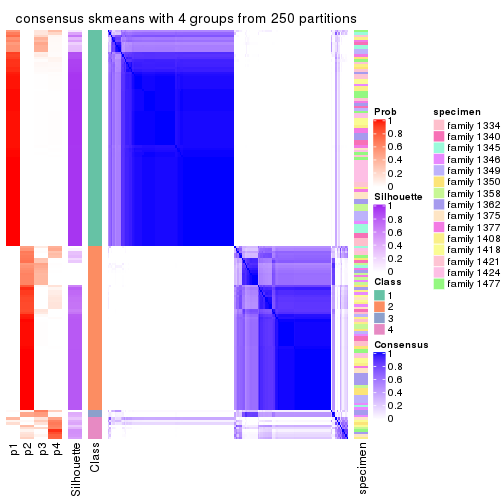</p>

</div>
<div id='tab-ATC-skmeans-consensus-heatmap-4'>
<pre><code class="r">consensus_heatmap(res, k = 5)
</code></pre>

<p></p>

</div>
<div id='tab-ATC-skmeans-consensus-heatmap-5'>
<pre><code class="r">consensus_heatmap(res, k = 6)
</code></pre>

<p></p>

</div>
</div>

Heatmaps for the membership of samples in all partitions to see how consistent they are:


<script>
$( function() {
	$( '#tabs-ATC-skmeans-membership-heatmap' ).tabs();
} );
</script>
<div id='tabs-ATC-skmeans-membership-heatmap'>
<ul>
<li><a href='#tab-ATC-skmeans-membership-heatmap-1'>k = 2</a></li>
<li><a href='#tab-ATC-skmeans-membership-heatmap-2'>k = 3</a></li>
<li><a href='#tab-ATC-skmeans-membership-heatmap-3'>k = 4</a></li>
<li><a href='#tab-ATC-skmeans-membership-heatmap-4'>k = 5</a></li>
<li><a href='#tab-ATC-skmeans-membership-heatmap-5'>k = 6</a></li>
</ul>
<div id='tab-ATC-skmeans-membership-heatmap-1'>
<pre><code class="r">membership_heatmap(res, k = 2)
</code></pre>

<p></p>

</div>
<div id='tab-ATC-skmeans-membership-heatmap-2'>
<pre><code class="r">membership_heatmap(res, k = 3)
</code></pre>

<p></p>

</div>
<div id='tab-ATC-skmeans-membership-heatmap-3'>
<pre><code class="r">membership_heatmap(res, k = 4)
</code></pre>

<p></p>

</div>
<div id='tab-ATC-skmeans-membership-heatmap-4'>
<pre><code class="r">membership_heatmap(res, k = 5)
</code></pre>

<p></p>

</div>
<div id='tab-ATC-skmeans-membership-heatmap-5'>
<pre><code class="r">membership_heatmap(res, k = 6)
</code></pre>

<p></p>

</div>
</div>

As soon as we have had the classes for columns, we can look for signatures
which are significantly different between classes which can be candidate marks
for certain classes. Following are the heatmaps for signatures.


Signature heatmaps where rows are scaled:


<script>
$( function() {
	$( '#tabs-ATC-skmeans-get-signatures' ).tabs();
} );
</script>
<div id='tabs-ATC-skmeans-get-signatures'>
<ul>
<li><a href='#tab-ATC-skmeans-get-signatures-1'>k = 2</a></li>
<li><a href='#tab-ATC-skmeans-get-signatures-2'>k = 3</a></li>
<li><a href='#tab-ATC-skmeans-get-signatures-3'>k = 4</a></li>
<li><a href='#tab-ATC-skmeans-get-signatures-4'>k = 5</a></li>
<li><a href='#tab-ATC-skmeans-get-signatures-5'>k = 6</a></li>
</ul>
<div id='tab-ATC-skmeans-get-signatures-1'>
<pre><code class="r">get_signatures(res, k = 2)
</code></pre>

<p></p>

</div>
<div id='tab-ATC-skmeans-get-signatures-2'>
<pre><code class="r">get_signatures(res, k = 3)
</code></pre>

<p></p>

</div>
<div id='tab-ATC-skmeans-get-signatures-3'>
<pre><code class="r">get_signatures(res, k = 4)
</code></pre>

<p></p>

</div>
<div id='tab-ATC-skmeans-get-signatures-4'>
<pre><code class="r">get_signatures(res, k = 5)
</code></pre>

<p></p>

</div>
<div id='tab-ATC-skmeans-get-signatures-5'>
<pre><code class="r">get_signatures(res, k = 6)
</code></pre>

<p></p>

</div>
</div>


Signature heatmaps where rows are not scaled:


<script>
$( function() {
	$( '#tabs-ATC-skmeans-get-signatures-no-scale' ).tabs();
} );
</script>
<div id='tabs-ATC-skmeans-get-signatures-no-scale'>
<ul>
<li><a href='#tab-ATC-skmeans-get-signatures-no-scale-1'>k = 2</a></li>
<li><a href='#tab-ATC-skmeans-get-signatures-no-scale-2'>k = 3</a></li>
<li><a href='#tab-ATC-skmeans-get-signatures-no-scale-3'>k = 4</a></li>
<li><a href='#tab-ATC-skmeans-get-signatures-no-scale-4'>k = 5</a></li>
<li><a href='#tab-ATC-skmeans-get-signatures-no-scale-5'>k = 6</a></li>
</ul>
<div id='tab-ATC-skmeans-get-signatures-no-scale-1'>
<pre><code class="r">get_signatures(res, k = 2, scale_rows = FALSE)
</code></pre>

<p>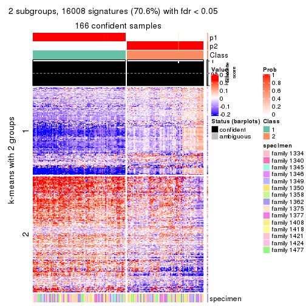</p>

</div>
<div id='tab-ATC-skmeans-get-signatures-no-scale-2'>
<pre><code class="r">get_signatures(res, k = 3, scale_rows = FALSE)
</code></pre>

<p></p>

</div>
<div id='tab-ATC-skmeans-get-signatures-no-scale-3'>
<pre><code class="r">get_signatures(res, k = 4, scale_rows = FALSE)
</code></pre>

<p></p>

</div>
<div id='tab-ATC-skmeans-get-signatures-no-scale-4'>
<pre><code class="r">get_signatures(res, k = 5, scale_rows = FALSE)
</code></pre>

<p></p>

</div>
<div id='tab-ATC-skmeans-get-signatures-no-scale-5'>
<pre><code class="r">get_signatures(res, k = 6, scale_rows = FALSE)
</code></pre>

<p></p>

</div>
</div>


Compare the overlap of signatures from different k:

```r
compare_signatures(res)
```


`get_signature()` returns a data frame invisibly. TO get the list of signatures, the function
call should be assigned to a variable explicitly. In following code, if `plot` argument is set
to `FALSE`, no heatmap is plotted while only the differential analysis is performed.

```r
# code only for demonstration
tb = get_signature(res, k = ..., plot = FALSE)
```

An example of the output of `tb` is:

```
#>   which_row         fdr    mean_1    mean_2 scaled_mean_1 scaled_mean_2 km
#> 1        38 0.042760348  8.373488  9.131774    -0.5533452     0.5164555  1
#> 2        40 0.018707592  7.106213  8.469186    -0.6173731     0.5762149  1
#> 3        55 0.019134737 10.221463 11.207825    -0.6159697     0.5749050  1
#> 4        59 0.006059896  5.921854  7.869574    -0.6899429     0.6439467  1
#> 5        60 0.018055526  8.928898 10.211722    -0.6204761     0.5791110  1
#> 6        98 0.009384629 15.714769 14.887706     0.6635654    -0.6193277  2
...
```

The columns in `tb` are:

1. `which_row`: row indices corresponding to the input matrix.
2. `fdr`: FDR for the differential test. 
3. `mean_x`: The mean value in group x.
4. `scaled_mean_x`: The mean value in group x after rows are scaled.
5. `km`: Row groups if k-means clustering is applied to rows.


UMAP plot which shows how samples are separated.


<script>
$( function() {
	$( '#tabs-ATC-skmeans-dimension-reduction' ).tabs();
} );
</script>
<div id='tabs-ATC-skmeans-dimension-reduction'>
<ul>
<li><a href='#tab-ATC-skmeans-dimension-reduction-1'>k = 2</a></li>
<li><a href='#tab-ATC-skmeans-dimension-reduction-2'>k = 3</a></li>
<li><a href='#tab-ATC-skmeans-dimension-reduction-3'>k = 4</a></li>
<li><a href='#tab-ATC-skmeans-dimension-reduction-4'>k = 5</a></li>
<li><a href='#tab-ATC-skmeans-dimension-reduction-5'>k = 6</a></li>
</ul>
<div id='tab-ATC-skmeans-dimension-reduction-1'>
<pre><code class="r">dimension_reduction(res, k = 2, method = &quot;UMAP&quot;)
</code></pre>

<p></p>

</div>
<div id='tab-ATC-skmeans-dimension-reduction-2'>
<pre><code class="r">dimension_reduction(res, k = 3, method = &quot;UMAP&quot;)
</code></pre>

<p></p>

</div>
<div id='tab-ATC-skmeans-dimension-reduction-3'>
<pre><code class="r">dimension_reduction(res, k = 4, method = &quot;UMAP&quot;)
</code></pre>

<p></p>

</div>
<div id='tab-ATC-skmeans-dimension-reduction-4'>
<pre><code class="r">dimension_reduction(res, k = 5, method = &quot;UMAP&quot;)
</code></pre>

<p></p>

</div>
<div id='tab-ATC-skmeans-dimension-reduction-5'>
<pre><code class="r">dimension_reduction(res, k = 6, method = &quot;UMAP&quot;)
</code></pre>

<p></p>

</div>
</div>


Following heatmap shows how subgroups are split when increasing `k`:

```r
collect_classes(res)
```

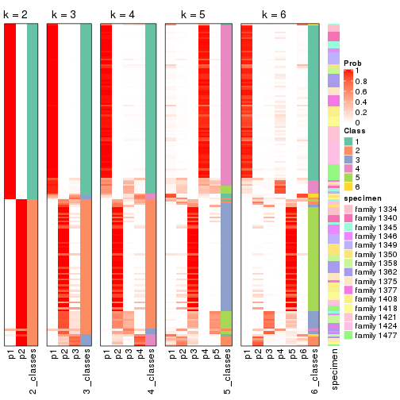


Test correlation between subgroups and known annotations. If the known
annotation is numeric, one-way ANOVA test is applied, and if the known
annotation is discrete, chi-squared contingency table test is applied.

```r
test_to_known_factors(res)
```

```
#>               n specimen(p) k
#> ATC:skmeans 166      0.0967 2
#> ATC:skmeans 159      0.0498 3
#> ATC:skmeans 134      0.2377 4
#> ATC:skmeans 133      0.1523 5
#> ATC:skmeans 149      0.0196 6
```


If matrix rows can be associated to genes, consider to use `GO_Enrichment(res,
...)` to perform function enrichment for the signature genes.


 

---------------------------------------------------


### ATC:pam**


The object with results only for a single top-value method and a single partition method 
can be extracted as:

```r
res = res_list["ATC", "pam"]
# you can also extract it by
# res = res_list["ATC:pam"]
```

A summary of `res` and all the functions that can be applied to it:

```r
res
```

```
#> A 'ConsensusPartition' object with k = 2, 3, 4, 5, 6.
#>   On a matrix with 22686 rows and 167 columns.
#>   Top rows (1000, 2000, 3000, 4000, 5000) are extracted by 'ATC' method.
#>   Subgroups are detected by 'pam' method.
#>   Performed in total 1250 partitions by row resampling.
#>   Best k for subgroups seems to be 2.
#> 
#> Following methods can be applied to this 'ConsensusPartition' object:
#>  [1] "cola_report"             "collect_classes"         "collect_plots"          
#>  [4] "collect_stats"           "colnames"                "compare_signatures"     
#>  [7] "consensus_heatmap"       "dimension_reduction"     "functional_enrichment"  
#> [10] "get_anno_col"            "get_anno"                "get_classes"            
#> [13] "get_consensus"           "get_matrix"              "get_membership"         
#> [16] "get_param"               "get_signatures"          "get_stats"              
#> [19] "is_best_k"               "is_stable_k"             "membership_heatmap"     
#> [22] "ncol"                    "nrow"                    "plot_ecdf"              
#> [25] "rownames"                "select_partition_number" "show"                   
#> [28] "suggest_best_k"          "test_to_known_factors"
```

`collect_plots()` function collects all the plots made from `res` for all `k` (number of partitions)
into one single page to provide an easy and fast comparison between different `k`.

```r
collect_plots(res)
```


The plots are:

- The first row: a plot of the ECDF (Empirical cumulative distribution
  function) curves of the consensus matrix for each `k` and the heatmap of
  predicted classes for each `k`.
- The second row: heatmaps of the consensus matrix for each `k`.
- The third row: heatmaps of the membership matrix for each `k`.
- The fouth row: heatmaps of the signatures for each `k`.

All the plots in panels can be made by individual functions and they are
plotted later in this section.

`select_partition_number()` produces several plots showing different
statistics for choosing "optimized" `k`. There are following statistics:

- ECDF curves of the consensus matrix for each `k`;
- 1-PAC. [The PAC
  score](https://en.wikipedia.org/wiki/Consensus_clustering#Over-interpretation_potential_of_consensus_clustering)
  measures the proportion of the ambiguous subgrouping.
- Mean silhouette score.
- Concordance. The mean probability of fiting the consensus class ids in all
  partitions.
- Area increased. Denote $A_k$ as the area under the ECDF curve for current
  `k`, the area increased is defined as $A_k - A_{k-1}$.
- Rand index. The percent of pairs of samples that are both in a same cluster
  or both are not in a same cluster in the partition of k and k-1.
- Jaccard index. The ratio of pairs of samples are both in a same cluster in
  the partition of k and k-1 and the pairs of samples are both in a same
  cluster in the partition k or k-1.

The detailed explanations of these statistics can be found in [the cola
vignette](http://bioconductor.org/packages/devel/bioc/vignettes/cola/inst/doc/cola.html#toc_13).

Generally speaking, lower PAC score, higher mean silhouette score or higher
concordance corresponds to better partition. Rand index and Jaccard index
measure how similar the current partition is compared to partition with `k-1`.
If they are too similar, we won't accept `k` is better than `k-1`.

```r
select_partition_number(res)
```


The numeric values for all these statistics can be obtained by `get_stats()`.

```r
get_stats(res)
```

```
#>   k 1-PAC mean_silhouette concordance area_increased  Rand Jaccard
#> 2 2 1.000           0.967       0.987         0.4963 0.502   0.502
#> 3 3 0.654           0.581       0.761         0.2720 0.646   0.406
#> 4 4 0.893           0.899       0.959         0.1518 0.805   0.513
#> 5 5 0.794           0.758       0.888         0.0472 0.973   0.900
#> 6 6 0.884           0.794       0.921         0.0627 0.902   0.638
```

`suggest_best_k()` suggests the best $k$ based on these statistics. The rules are as follows:

- All $k$ with Jaccard index larger than 0.95 are removed because the increase of
  the partition number does not provides enough extra information. If all $k$ are removed,
  the best $k$ is assigned by `NA`.
- For $k$ with 1-PAC larger than 0.9, the maximal $k$ is taken as the "best k". Other $k$ is called "optional k".
- If it does not fit the second rule. The $k$ with the highest vote of highest
  1-PAC, mean silhouette and concordance is taken as the "best k".

```r
suggest_best_k(res)
```

```
#> [1] 2
```


Following shows the table of the partitions (You need to click the **show/hide
code output** link to see it). The membership matrix (columns with name `p*`)
is inferred by
[`clue::cl_consensus()`](https://www.rdocumentation.org/link/cl_consensus?package=clue)
function with the `SE` method. Basically the value in the membership matrix
represents the probability to belong to a certain group. The finall class
label for an item is determined with the group with highest probability it
belongs to.

In `get_classes()` function, the entropy is calculated from the membership
matrix and the silhouette score is calculated from the consensus matrix.


<script>
$( function() {
	$( '#tabs-ATC-pam-get-classes' ).tabs();
} );
</script>
<div id='tabs-ATC-pam-get-classes'>
<ul>
<li><a href='#tab-ATC-pam-get-classes-1'>k = 2</a></li>
<li><a href='#tab-ATC-pam-get-classes-2'>k = 3</a></li>
<li><a href='#tab-ATC-pam-get-classes-3'>k = 4</a></li>
<li><a href='#tab-ATC-pam-get-classes-4'>k = 5</a></li>
<li><a href='#tab-ATC-pam-get-classes-5'>k = 6</a></li>
</ul>

<div id='tab-ATC-pam-get-classes-1'>
<p><a id='tab-ATC-pam-get-classes-1-a' style='color:#0366d6' href='#'>show/hide code output</a></p>
<pre><code class="r">cbind(get_classes(res, k = 2), get_membership(res, k = 2))
</code></pre>

<pre><code>#&gt;          class entropy silhouette    p1    p2
#&gt; GSM30006     2  0.0000    0.97660 0.000 1.000
#&gt; GSM30007     1  0.0000    0.99437 1.000 0.000
#&gt; GSM30008     1  0.0000    0.99437 1.000 0.000
#&gt; GSM30009     1  0.0000    0.99437 1.000 0.000
#&gt; GSM30010     2  0.0000    0.97660 0.000 1.000
#&gt; GSM30011     2  0.0000    0.97660 0.000 1.000
#&gt; GSM30012     2  0.0000    0.97660 0.000 1.000
#&gt; GSM30013     1  0.0000    0.99437 1.000 0.000
#&gt; GSM30014     2  0.0000    0.97660 0.000 1.000
#&gt; GSM30015     1  0.0000    0.99437 1.000 0.000
#&gt; GSM30016     2  0.0000    0.97660 0.000 1.000
#&gt; GSM30017     1  0.0000    0.99437 1.000 0.000
#&gt; GSM30018     1  0.0000    0.99437 1.000 0.000
#&gt; GSM30019     2  0.0000    0.97660 0.000 1.000
#&gt; GSM30020     1  0.0000    0.99437 1.000 0.000
#&gt; GSM30021     2  0.0000    0.97660 0.000 1.000
#&gt; GSM30022     1  0.0000    0.99437 1.000 0.000
#&gt; GSM30023     1  0.0000    0.99437 1.000 0.000
#&gt; GSM30024     2  0.0000    0.97660 0.000 1.000
#&gt; GSM30025     1  0.0000    0.99437 1.000 0.000
#&gt; GSM30026     1  0.0000    0.99437 1.000 0.000
#&gt; GSM30027     2  0.8144    0.67950 0.252 0.748
#&gt; GSM30028     1  0.0000    0.99437 1.000 0.000
#&gt; GSM30029     1  0.0000    0.99437 1.000 0.000
#&gt; GSM30030     1  0.0000    0.99437 1.000 0.000
#&gt; GSM30031     1  0.0000    0.99437 1.000 0.000
#&gt; GSM30032     2  0.0000    0.97660 0.000 1.000
#&gt; GSM30033     2  0.0000    0.97660 0.000 1.000
#&gt; GSM30034     1  0.0000    0.99437 1.000 0.000
#&gt; GSM30035     2  0.0000    0.97660 0.000 1.000
#&gt; GSM30036     1  0.0000    0.99437 1.000 0.000
#&gt; GSM30037     2  0.8608    0.62408 0.284 0.716
#&gt; GSM30038     2  0.0000    0.97660 0.000 1.000
#&gt; GSM30039     2  0.0000    0.97660 0.000 1.000
#&gt; GSM30040     2  0.0000    0.97660 0.000 1.000
#&gt; GSM30041     2  0.0000    0.97660 0.000 1.000
#&gt; GSM30042     2  0.0000    0.97660 0.000 1.000
#&gt; GSM30043     2  0.0000    0.97660 0.000 1.000
#&gt; GSM30044     1  0.0000    0.99437 1.000 0.000
#&gt; GSM30045     1  0.0000    0.99437 1.000 0.000
#&gt; GSM30046     1  0.0000    0.99437 1.000 0.000
#&gt; GSM30047     1  0.0000    0.99437 1.000 0.000
#&gt; GSM30048     1  0.0000    0.99437 1.000 0.000
#&gt; GSM30049     2  0.0000    0.97660 0.000 1.000
#&gt; GSM30050     1  0.0000    0.99437 1.000 0.000
#&gt; GSM30051     2  0.0000    0.97660 0.000 1.000
#&gt; GSM30052     1  0.0000    0.99437 1.000 0.000
#&gt; GSM30053     2  0.0000    0.97660 0.000 1.000
#&gt; GSM30054     2  0.0000    0.97660 0.000 1.000
#&gt; GSM30055     2  0.0000    0.97660 0.000 1.000
#&gt; GSM30056     2  0.0000    0.97660 0.000 1.000
#&gt; GSM30057     2  0.0000    0.97660 0.000 1.000
#&gt; GSM30058     2  0.0000    0.97660 0.000 1.000
#&gt; GSM30059     1  0.0000    0.99437 1.000 0.000
#&gt; GSM30060     2  0.0000    0.97660 0.000 1.000
#&gt; GSM30061     1  0.0000    0.99437 1.000 0.000
#&gt; GSM30062     1  0.0000    0.99437 1.000 0.000
#&gt; GSM30063     2  0.0000    0.97660 0.000 1.000
#&gt; GSM30064     1  0.0000    0.99437 1.000 0.000
#&gt; GSM30065     2  0.0000    0.97660 0.000 1.000
#&gt; GSM30066     2  0.0000    0.97660 0.000 1.000
#&gt; GSM30067     1  0.0000    0.99437 1.000 0.000
#&gt; GSM30068     2  0.0000    0.97660 0.000 1.000
#&gt; GSM30069     2  0.0000    0.97660 0.000 1.000
#&gt; GSM30070     2  0.0000    0.97660 0.000 1.000
#&gt; GSM30071     2  0.0376    0.97311 0.004 0.996
#&gt; GSM30072     1  0.0000    0.99437 1.000 0.000
#&gt; GSM30073     2  0.9710    0.36574 0.400 0.600
#&gt; GSM30074     2  0.0000    0.97660 0.000 1.000
#&gt; GSM30075     2  0.0000    0.97660 0.000 1.000
#&gt; GSM30076     1  0.0000    0.99437 1.000 0.000
#&gt; GSM30077     1  0.0000    0.99437 1.000 0.000
#&gt; GSM30078     1  0.0000    0.99437 1.000 0.000
#&gt; GSM30079     1  0.0000    0.99437 1.000 0.000
#&gt; GSM30080     2  0.0000    0.97660 0.000 1.000
#&gt; GSM30081     2  0.0000    0.97660 0.000 1.000
#&gt; GSM30086     1  0.9998   -0.00551 0.508 0.492
#&gt; GSM30087     1  0.0000    0.99437 1.000 0.000
#&gt; GSM30088     1  0.0000    0.99437 1.000 0.000
#&gt; GSM30089     2  0.8267    0.66628 0.260 0.740
#&gt; GSM30090     2  0.0000    0.97660 0.000 1.000
#&gt; GSM30091     2  0.0000    0.97660 0.000 1.000
#&gt; GSM30092     1  0.0000    0.99437 1.000 0.000
#&gt; GSM30093     2  0.0000    0.97660 0.000 1.000
#&gt; GSM30094     2  0.0000    0.97660 0.000 1.000
#&gt; GSM30095     2  0.0000    0.97660 0.000 1.000
#&gt; GSM30096     1  0.0000    0.99437 1.000 0.000
#&gt; GSM30097     1  0.0000    0.99437 1.000 0.000
#&gt; GSM30098     1  0.0000    0.99437 1.000 0.000
#&gt; GSM30099     2  0.0000    0.97660 0.000 1.000
#&gt; GSM30100     2  0.0000    0.97660 0.000 1.000
#&gt; GSM30101     2  0.0000    0.97660 0.000 1.000
#&gt; GSM30102     2  0.0000    0.97660 0.000 1.000
#&gt; GSM30103     2  0.8144    0.67950 0.252 0.748
#&gt; GSM30104     1  0.0000    0.99437 1.000 0.000
#&gt; GSM30105     1  0.0000    0.99437 1.000 0.000
#&gt; GSM30106     1  0.0000    0.99437 1.000 0.000
#&gt; GSM30107     1  0.0000    0.99437 1.000 0.000
#&gt; GSM30108     2  0.0000    0.97660 0.000 1.000
#&gt; GSM30109     1  0.0000    0.99437 1.000 0.000
#&gt; GSM30110     1  0.0000    0.99437 1.000 0.000
#&gt; GSM30111     1  0.0000    0.99437 1.000 0.000
#&gt; GSM30112     1  0.0000    0.99437 1.000 0.000
#&gt; GSM30113     2  0.0000    0.97660 0.000 1.000
#&gt; GSM30114     2  0.0000    0.97660 0.000 1.000
#&gt; GSM30115     1  0.0000    0.99437 1.000 0.000
#&gt; GSM30116     2  0.0000    0.97660 0.000 1.000
#&gt; GSM30117     2  0.8144    0.67950 0.252 0.748
#&gt; GSM30118     2  0.0000    0.97660 0.000 1.000
#&gt; GSM30119     2  0.0000    0.97660 0.000 1.000
#&gt; GSM30120     1  0.0000    0.99437 1.000 0.000
#&gt; GSM30121     1  0.0000    0.99437 1.000 0.000
#&gt; GSM30122     1  0.0000    0.99437 1.000 0.000
#&gt; GSM30123     2  0.0000    0.97660 0.000 1.000
#&gt; GSM30177     2  0.0000    0.97660 0.000 1.000
#&gt; GSM30178     1  0.0000    0.99437 1.000 0.000
#&gt; GSM30179     1  0.0000    0.99437 1.000 0.000
#&gt; GSM30180     1  0.0000    0.99437 1.000 0.000
#&gt; GSM30181     2  0.0000    0.97660 0.000 1.000
#&gt; GSM30182     1  0.0000    0.99437 1.000 0.000
#&gt; GSM30183     1  0.0000    0.99437 1.000 0.000
#&gt; GSM30184     2  0.0000    0.97660 0.000 1.000
#&gt; GSM30185     2  0.0000    0.97660 0.000 1.000
#&gt; GSM30186     2  0.0000    0.97660 0.000 1.000
#&gt; GSM30187     1  0.0000    0.99437 1.000 0.000
#&gt; GSM30188     1  0.0000    0.99437 1.000 0.000
#&gt; GSM30189     1  0.0000    0.99437 1.000 0.000
#&gt; GSM30190     2  0.0000    0.97660 0.000 1.000
#&gt; GSM30191     1  0.0672    0.98620 0.992 0.008
#&gt; GSM30192     2  0.0000    0.97660 0.000 1.000
#&gt; GSM30193     1  0.0000    0.99437 1.000 0.000
#&gt; GSM30194     2  0.0000    0.97660 0.000 1.000
#&gt; GSM30195     1  0.0000    0.99437 1.000 0.000
#&gt; GSM30196     1  0.0000    0.99437 1.000 0.000
#&gt; GSM30197     1  0.0000    0.99437 1.000 0.000
#&gt; GSM30198     1  0.0000    0.99437 1.000 0.000
#&gt; GSM30199     2  0.0000    0.97660 0.000 1.000
#&gt; GSM30200     1  0.0000    0.99437 1.000 0.000
#&gt; GSM30201     1  0.0000    0.99437 1.000 0.000
#&gt; GSM30202     1  0.0000    0.99437 1.000 0.000
#&gt; GSM30203     1  0.0000    0.99437 1.000 0.000
#&gt; GSM30204     1  0.0000    0.99437 1.000 0.000
#&gt; GSM30205     2  0.0000    0.97660 0.000 1.000
#&gt; GSM30206     1  0.0000    0.99437 1.000 0.000
#&gt; GSM30207     1  0.0000    0.99437 1.000 0.000
#&gt; GSM30208     1  0.0000    0.99437 1.000 0.000
#&gt; GSM30209     2  0.0000    0.97660 0.000 1.000
#&gt; GSM30210     1  0.0000    0.99437 1.000 0.000
#&gt; GSM30211     1  0.0000    0.99437 1.000 0.000
#&gt; GSM30212     1  0.0000    0.99437 1.000 0.000
#&gt; GSM30213     1  0.0000    0.99437 1.000 0.000
#&gt; GSM30214     1  0.0000    0.99437 1.000 0.000
#&gt; GSM30215     1  0.0000    0.99437 1.000 0.000
#&gt; GSM30216     1  0.0000    0.99437 1.000 0.000
#&gt; GSM30217     1  0.0000    0.99437 1.000 0.000
#&gt; GSM30218     2  0.0000    0.97660 0.000 1.000
#&gt; GSM30219     2  0.0000    0.97660 0.000 1.000
#&gt; GSM30220     1  0.0000    0.99437 1.000 0.000
#&gt; GSM30221     1  0.0000    0.99437 1.000 0.000
#&gt; GSM30222     1  0.0000    0.99437 1.000 0.000
#&gt; GSM30223     1  0.0000    0.99437 1.000 0.000
#&gt; GSM30224     1  0.0000    0.99437 1.000 0.000
#&gt; GSM30225     1  0.0000    0.99437 1.000 0.000
#&gt; GSM30226     2  0.0000    0.97660 0.000 1.000
#&gt; GSM30227     1  0.0000    0.99437 1.000 0.000
#&gt; GSM30228     2  0.0000    0.97660 0.000 1.000
#&gt; GSM30229     1  0.0000    0.99437 1.000 0.000
</code></pre>

<script>
$('#tab-ATC-pam-get-classes-1-a').parent().next().next().hide();
$('#tab-ATC-pam-get-classes-1-a').click(function(){
  $('#tab-ATC-pam-get-classes-1-a').parent().next().next().toggle();
  return(false);
});
</script>
</div>

<div id='tab-ATC-pam-get-classes-2'>
<p><a id='tab-ATC-pam-get-classes-2-a' style='color:#0366d6' href='#'>show/hide code output</a></p>
<pre><code class="r">cbind(get_classes(res, k = 3), get_membership(res, k = 3))
</code></pre>

<pre><code>#&gt;          class entropy silhouette    p1    p2    p3
#&gt; GSM30006     3  0.6235     0.7830 0.436 0.000 0.564
#&gt; GSM30007     2  0.4121     0.2985 0.168 0.832 0.000
#&gt; GSM30008     1  0.6235     0.7724 0.564 0.436 0.000
#&gt; GSM30009     1  0.6235     0.7724 0.564 0.436 0.000
#&gt; GSM30010     3  0.0000     0.7374 0.000 0.000 1.000
#&gt; GSM30011     3  0.6235     0.7830 0.436 0.000 0.564
#&gt; GSM30012     3  0.6235     0.7830 0.436 0.000 0.564
#&gt; GSM30013     2  0.0237     0.6193 0.004 0.996 0.000
#&gt; GSM30014     3  0.0000     0.7374 0.000 0.000 1.000
#&gt; GSM30015     1  0.6235     0.7724 0.564 0.436 0.000
#&gt; GSM30016     2  0.6235     0.4327 0.436 0.564 0.000
#&gt; GSM30017     1  0.6235     0.7724 0.564 0.436 0.000
#&gt; GSM30018     1  0.6235     0.7724 0.564 0.436 0.000
#&gt; GSM30019     3  0.0000     0.7374 0.000 0.000 1.000
#&gt; GSM30020     2  0.0424     0.6083 0.008 0.992 0.000
#&gt; GSM30021     3  0.6235     0.7830 0.436 0.000 0.564
#&gt; GSM30022     1  0.6235     0.7724 0.564 0.436 0.000
#&gt; GSM30023     2  0.0000     0.6189 0.000 1.000 0.000
#&gt; GSM30024     3  0.6235     0.7830 0.436 0.000 0.564
#&gt; GSM30025     2  0.0237     0.6193 0.004 0.996 0.000
#&gt; GSM30026     1  0.6235     0.7724 0.564 0.436 0.000
#&gt; GSM30027     2  0.6235     0.4327 0.436 0.564 0.000
#&gt; GSM30028     2  0.0000     0.6189 0.000 1.000 0.000
#&gt; GSM30029     1  0.6235     0.7724 0.564 0.436 0.000
#&gt; GSM30030     1  0.6235     0.7724 0.564 0.436 0.000
#&gt; GSM30031     1  0.6235     0.7724 0.564 0.436 0.000
#&gt; GSM30032     2  0.6235     0.4327 0.436 0.564 0.000
#&gt; GSM30033     1  0.9111    -0.6766 0.436 0.140 0.424
#&gt; GSM30034     1  0.6235     0.7724 0.564 0.436 0.000
#&gt; GSM30035     1  0.9527    -0.4319 0.436 0.372 0.192
#&gt; GSM30036     2  0.0000     0.6189 0.000 1.000 0.000
#&gt; GSM30037     2  0.6235     0.4327 0.436 0.564 0.000
#&gt; GSM30038     1  0.9329    -0.6546 0.436 0.164 0.400
#&gt; GSM30039     3  0.6235     0.7830 0.436 0.000 0.564
#&gt; GSM30040     3  0.0000     0.7374 0.000 0.000 1.000
#&gt; GSM30041     3  0.6235     0.7830 0.436 0.000 0.564
#&gt; GSM30042     3  0.6225     0.7831 0.432 0.000 0.568
#&gt; GSM30043     3  0.0000     0.7374 0.000 0.000 1.000
#&gt; GSM30044     1  0.6235     0.7724 0.564 0.436 0.000
#&gt; GSM30045     2  0.3686     0.3698 0.140 0.860 0.000
#&gt; GSM30046     1  0.6235     0.7724 0.564 0.436 0.000
#&gt; GSM30047     2  0.0000     0.6189 0.000 1.000 0.000
#&gt; GSM30048     1  0.6235     0.7724 0.564 0.436 0.000
#&gt; GSM30049     3  0.0000     0.7374 0.000 0.000 1.000
#&gt; GSM30050     2  0.0000     0.6189 0.000 1.000 0.000
#&gt; GSM30051     3  0.0000     0.7374 0.000 0.000 1.000
#&gt; GSM30052     1  0.6235     0.7724 0.564 0.436 0.000
#&gt; GSM30053     3  0.6235     0.7830 0.436 0.000 0.564
#&gt; GSM30054     3  0.0000     0.7374 0.000 0.000 1.000
#&gt; GSM30055     2  0.6451     0.4258 0.436 0.560 0.004
#&gt; GSM30056     3  0.6235     0.7830 0.436 0.000 0.564
#&gt; GSM30057     3  0.0000     0.7374 0.000 0.000 1.000
#&gt; GSM30058     3  0.0000     0.7374 0.000 0.000 1.000
#&gt; GSM30059     2  0.0000     0.6189 0.000 1.000 0.000
#&gt; GSM30060     3  0.6235     0.7830 0.436 0.000 0.564
#&gt; GSM30061     2  0.2066     0.6136 0.060 0.940 0.000
#&gt; GSM30062     2  0.0000     0.6189 0.000 1.000 0.000
#&gt; GSM30063     3  0.6235     0.7830 0.436 0.000 0.564
#&gt; GSM30064     1  0.6235     0.7724 0.564 0.436 0.000
#&gt; GSM30065     1  0.9111    -0.6766 0.436 0.140 0.424
#&gt; GSM30066     3  0.0000     0.7374 0.000 0.000 1.000
#&gt; GSM30067     1  0.6235     0.7724 0.564 0.436 0.000
#&gt; GSM30068     3  0.0000     0.7374 0.000 0.000 1.000
#&gt; GSM30069     3  0.6235     0.7830 0.436 0.000 0.564
#&gt; GSM30070     3  0.7453     0.7420 0.436 0.036 0.528
#&gt; GSM30071     2  0.6235     0.4327 0.436 0.564 0.000
#&gt; GSM30072     2  0.0000     0.6189 0.000 1.000 0.000
#&gt; GSM30073     2  0.6235     0.4327 0.436 0.564 0.000
#&gt; GSM30074     3  0.6235     0.7830 0.436 0.000 0.564
#&gt; GSM30075     2  0.6235     0.4327 0.436 0.564 0.000
#&gt; GSM30076     2  0.0000     0.6189 0.000 1.000 0.000
#&gt; GSM30077     2  0.6026    -0.3969 0.376 0.624 0.000
#&gt; GSM30078     2  0.5785    -0.2698 0.332 0.668 0.000
#&gt; GSM30079     1  0.6235     0.7724 0.564 0.436 0.000
#&gt; GSM30080     2  0.6235     0.4327 0.436 0.564 0.000
#&gt; GSM30081     3  0.0000     0.7374 0.000 0.000 1.000
#&gt; GSM30086     2  0.6045     0.4754 0.380 0.620 0.000
#&gt; GSM30087     1  0.6235     0.7724 0.564 0.436 0.000
#&gt; GSM30088     1  0.6235     0.7724 0.564 0.436 0.000
#&gt; GSM30089     2  0.6235     0.4327 0.436 0.564 0.000
#&gt; GSM30090     3  0.6235     0.7830 0.436 0.000 0.564
#&gt; GSM30091     3  0.0000     0.7374 0.000 0.000 1.000
#&gt; GSM30092     2  0.0000     0.6189 0.000 1.000 0.000
#&gt; GSM30093     1  0.9111    -0.6766 0.436 0.140 0.424
#&gt; GSM30094     3  0.6225     0.7831 0.432 0.000 0.568
#&gt; GSM30095     3  0.0000     0.7374 0.000 0.000 1.000
#&gt; GSM30096     1  0.6235     0.7724 0.564 0.436 0.000
#&gt; GSM30097     1  0.6235     0.7724 0.564 0.436 0.000
#&gt; GSM30098     1  0.6235     0.7724 0.564 0.436 0.000
#&gt; GSM30099     3  0.6235     0.7830 0.436 0.000 0.564
#&gt; GSM30100     3  0.0000     0.7374 0.000 0.000 1.000
#&gt; GSM30101     3  0.0000     0.7374 0.000 0.000 1.000
#&gt; GSM30102     1  0.9684    -0.4671 0.436 0.340 0.224
#&gt; GSM30103     2  0.6235     0.4327 0.436 0.564 0.000
#&gt; GSM30104     2  0.2066     0.6136 0.060 0.940 0.000
#&gt; GSM30105     1  0.6235     0.7724 0.564 0.436 0.000
#&gt; GSM30106     2  0.6286    -0.6043 0.464 0.536 0.000
#&gt; GSM30107     2  0.0000     0.6189 0.000 1.000 0.000
#&gt; GSM30108     3  0.6235     0.7830 0.436 0.000 0.564
#&gt; GSM30109     1  0.6235     0.7724 0.564 0.436 0.000
#&gt; GSM30110     1  0.6235     0.7724 0.564 0.436 0.000
#&gt; GSM30111     2  0.0000     0.6189 0.000 1.000 0.000
#&gt; GSM30112     2  0.0000     0.6189 0.000 1.000 0.000
#&gt; GSM30113     3  0.0000     0.7374 0.000 0.000 1.000
#&gt; GSM30114     2  0.6235     0.4327 0.436 0.564 0.000
#&gt; GSM30115     2  0.0237     0.6193 0.004 0.996 0.000
#&gt; GSM30116     3  0.6225     0.7831 0.432 0.000 0.568
#&gt; GSM30117     2  0.6235     0.4327 0.436 0.564 0.000
#&gt; GSM30118     3  0.6235     0.7830 0.436 0.000 0.564
#&gt; GSM30119     3  0.6225     0.7831 0.432 0.000 0.568
#&gt; GSM30120     2  0.2066     0.6136 0.060 0.940 0.000
#&gt; GSM30121     1  0.6235     0.7724 0.564 0.436 0.000
#&gt; GSM30122     2  0.3686     0.3698 0.140 0.860 0.000
#&gt; GSM30123     3  0.6235     0.7830 0.436 0.000 0.564
#&gt; GSM30177     2  0.6763     0.4114 0.436 0.552 0.012
#&gt; GSM30178     2  0.0000     0.6189 0.000 1.000 0.000
#&gt; GSM30179     2  0.3340     0.4146 0.120 0.880 0.000
#&gt; GSM30180     2  0.0000     0.6189 0.000 1.000 0.000
#&gt; GSM30181     2  0.6235     0.4327 0.436 0.564 0.000
#&gt; GSM30182     1  0.6235     0.7724 0.564 0.436 0.000
#&gt; GSM30183     1  0.6235     0.7724 0.564 0.436 0.000
#&gt; GSM30184     3  0.6235     0.7830 0.436 0.000 0.564
#&gt; GSM30185     2  0.6235     0.4327 0.436 0.564 0.000
#&gt; GSM30186     1  0.9111    -0.6766 0.436 0.140 0.424
#&gt; GSM30187     1  0.6235     0.7724 0.564 0.436 0.000
#&gt; GSM30188     1  0.6235     0.7724 0.564 0.436 0.000
#&gt; GSM30189     1  0.6235     0.7724 0.564 0.436 0.000
#&gt; GSM30190     3  0.0000     0.7374 0.000 0.000 1.000
#&gt; GSM30191     2  0.6235     0.4327 0.436 0.564 0.000
#&gt; GSM30192     2  0.6235     0.4327 0.436 0.564 0.000
#&gt; GSM30193     2  0.0000     0.6189 0.000 1.000 0.000
#&gt; GSM30194     3  0.0000     0.7374 0.000 0.000 1.000
#&gt; GSM30195     2  0.0000     0.6189 0.000 1.000 0.000
#&gt; GSM30196     1  0.6235     0.7724 0.564 0.436 0.000
#&gt; GSM30197     1  0.6235     0.7724 0.564 0.436 0.000
#&gt; GSM30198     1  0.6235     0.7724 0.564 0.436 0.000
#&gt; GSM30199     1  0.9111    -0.6766 0.436 0.140 0.424
#&gt; GSM30200     1  0.6235     0.7724 0.564 0.436 0.000
#&gt; GSM30201     1  0.6235     0.7724 0.564 0.436 0.000
#&gt; GSM30202     2  0.0000     0.6189 0.000 1.000 0.000
#&gt; GSM30203     2  0.0000     0.6189 0.000 1.000 0.000
#&gt; GSM30204     1  0.6235     0.7724 0.564 0.436 0.000
#&gt; GSM30205     1  0.9111    -0.6766 0.436 0.140 0.424
#&gt; GSM30206     1  0.6235     0.7724 0.564 0.436 0.000
#&gt; GSM30207     2  0.3619     0.3794 0.136 0.864 0.000
#&gt; GSM30208     1  0.6235     0.7724 0.564 0.436 0.000
#&gt; GSM30209     2  0.6235     0.4327 0.436 0.564 0.000
#&gt; GSM30210     1  0.6235     0.7724 0.564 0.436 0.000
#&gt; GSM30211     1  0.6235     0.7724 0.564 0.436 0.000
#&gt; GSM30212     1  0.6235     0.7724 0.564 0.436 0.000
#&gt; GSM30213     2  0.0000     0.6189 0.000 1.000 0.000
#&gt; GSM30214     2  0.0000     0.6189 0.000 1.000 0.000
#&gt; GSM30215     1  0.6244     0.7664 0.560 0.440 0.000
#&gt; GSM30216     2  0.4974     0.0802 0.236 0.764 0.000
#&gt; GSM30217     2  0.0000     0.6189 0.000 1.000 0.000
#&gt; GSM30218     2  0.6235     0.4327 0.436 0.564 0.000
#&gt; GSM30219     3  0.6235     0.7830 0.436 0.000 0.564
#&gt; GSM30220     1  0.6235     0.7724 0.564 0.436 0.000
#&gt; GSM30221     1  0.6302     0.7014 0.520 0.480 0.000
#&gt; GSM30222     2  0.3482     0.3975 0.128 0.872 0.000
#&gt; GSM30223     1  0.6235     0.7724 0.564 0.436 0.000
#&gt; GSM30224     1  0.6235     0.7724 0.564 0.436 0.000
#&gt; GSM30225     1  0.6235     0.7724 0.564 0.436 0.000
#&gt; GSM30226     2  0.6235     0.4327 0.436 0.564 0.000
#&gt; GSM30227     1  0.6235     0.7724 0.564 0.436 0.000
#&gt; GSM30228     3  0.6235     0.7830 0.436 0.000 0.564
#&gt; GSM30229     2  0.0000     0.6189 0.000 1.000 0.000
</code></pre>

<script>
$('#tab-ATC-pam-get-classes-2-a').parent().next().next().hide();
$('#tab-ATC-pam-get-classes-2-a').click(function(){
  $('#tab-ATC-pam-get-classes-2-a').parent().next().next().toggle();
  return(false);
});
</script>
</div>

<div id='tab-ATC-pam-get-classes-3'>
<p><a id='tab-ATC-pam-get-classes-3-a' style='color:#0366d6' href='#'>show/hide code output</a></p>
<pre><code class="r">cbind(get_classes(res, k = 4), get_membership(res, k = 4))
</code></pre>

<pre><code>#&gt;          class entropy silhouette    p1    p2    p3    p4
#&gt; GSM30006     2  0.0000      0.975 0.000 1.000 0.000 0.000
#&gt; GSM30007     1  0.4843      0.266 0.604 0.000 0.000 0.396
#&gt; GSM30008     1  0.0000      0.965 1.000 0.000 0.000 0.000
#&gt; GSM30009     1  0.0000      0.965 1.000 0.000 0.000 0.000
#&gt; GSM30010     3  0.0000      0.999 0.000 0.000 1.000 0.000
#&gt; GSM30011     2  0.0000      0.975 0.000 1.000 0.000 0.000
#&gt; GSM30012     2  0.0000      0.975 0.000 1.000 0.000 0.000
#&gt; GSM30013     4  0.0000      0.884 0.000 0.000 0.000 1.000
#&gt; GSM30014     3  0.0000      0.999 0.000 0.000 1.000 0.000
#&gt; GSM30015     1  0.0000      0.965 1.000 0.000 0.000 0.000
#&gt; GSM30016     2  0.0000      0.975 0.000 1.000 0.000 0.000
#&gt; GSM30017     1  0.0000      0.965 1.000 0.000 0.000 0.000
#&gt; GSM30018     1  0.0000      0.965 1.000 0.000 0.000 0.000
#&gt; GSM30019     3  0.0188      0.996 0.000 0.004 0.996 0.000
#&gt; GSM30020     4  0.4776      0.460 0.376 0.000 0.000 0.624
#&gt; GSM30021     2  0.0000      0.975 0.000 1.000 0.000 0.000
#&gt; GSM30022     1  0.0000      0.965 1.000 0.000 0.000 0.000
#&gt; GSM30023     4  0.0000      0.884 0.000 0.000 0.000 1.000
#&gt; GSM30024     2  0.0000      0.975 0.000 1.000 0.000 0.000
#&gt; GSM30025     4  0.0000      0.884 0.000 0.000 0.000 1.000
#&gt; GSM30026     1  0.0000      0.965 1.000 0.000 0.000 0.000
#&gt; GSM30027     4  0.3610      0.683 0.000 0.200 0.000 0.800
#&gt; GSM30028     4  0.0000      0.884 0.000 0.000 0.000 1.000
#&gt; GSM30029     1  0.0000      0.965 1.000 0.000 0.000 0.000
#&gt; GSM30030     1  0.0000      0.965 1.000 0.000 0.000 0.000
#&gt; GSM30031     1  0.0000      0.965 1.000 0.000 0.000 0.000
#&gt; GSM30032     2  0.0592      0.963 0.000 0.984 0.000 0.016
#&gt; GSM30033     2  0.0000      0.975 0.000 1.000 0.000 0.000
#&gt; GSM30034     1  0.0000      0.965 1.000 0.000 0.000 0.000
#&gt; GSM30035     2  0.0000      0.975 0.000 1.000 0.000 0.000
#&gt; GSM30036     4  0.0000      0.884 0.000 0.000 0.000 1.000
#&gt; GSM30037     4  0.0000      0.884 0.000 0.000 0.000 1.000
#&gt; GSM30038     2  0.0000      0.975 0.000 1.000 0.000 0.000
#&gt; GSM30039     2  0.0000      0.975 0.000 1.000 0.000 0.000
#&gt; GSM30040     3  0.0000      0.999 0.000 0.000 1.000 0.000
#&gt; GSM30041     2  0.0000      0.975 0.000 1.000 0.000 0.000
#&gt; GSM30042     2  0.1022      0.949 0.000 0.968 0.032 0.000
#&gt; GSM30043     3  0.0000      0.999 0.000 0.000 1.000 0.000
#&gt; GSM30044     1  0.0000      0.965 1.000 0.000 0.000 0.000
#&gt; GSM30045     4  0.4776      0.460 0.376 0.000 0.000 0.624
#&gt; GSM30046     1  0.0000      0.965 1.000 0.000 0.000 0.000
#&gt; GSM30047     4  0.0000      0.884 0.000 0.000 0.000 1.000
#&gt; GSM30048     1  0.0000      0.965 1.000 0.000 0.000 0.000
#&gt; GSM30049     3  0.0000      0.999 0.000 0.000 1.000 0.000
#&gt; GSM30050     4  0.0000      0.884 0.000 0.000 0.000 1.000
#&gt; GSM30051     3  0.0000      0.999 0.000 0.000 1.000 0.000
#&gt; GSM30052     1  0.0000      0.965 1.000 0.000 0.000 0.000
#&gt; GSM30053     2  0.0000      0.975 0.000 1.000 0.000 0.000
#&gt; GSM30054     3  0.0000      0.999 0.000 0.000 1.000 0.000
#&gt; GSM30055     2  0.0000      0.975 0.000 1.000 0.000 0.000
#&gt; GSM30056     2  0.0000      0.975 0.000 1.000 0.000 0.000
#&gt; GSM30057     3  0.0000      0.999 0.000 0.000 1.000 0.000
#&gt; GSM30058     3  0.0336      0.992 0.000 0.008 0.992 0.000
#&gt; GSM30059     4  0.4776      0.460 0.376 0.000 0.000 0.624
#&gt; GSM30060     2  0.0000      0.975 0.000 1.000 0.000 0.000
#&gt; GSM30061     4  0.0000      0.884 0.000 0.000 0.000 1.000
#&gt; GSM30062     4  0.0000      0.884 0.000 0.000 0.000 1.000
#&gt; GSM30063     2  0.0000      0.975 0.000 1.000 0.000 0.000
#&gt; GSM30064     1  0.0000      0.965 1.000 0.000 0.000 0.000
#&gt; GSM30065     2  0.0000      0.975 0.000 1.000 0.000 0.000
#&gt; GSM30066     3  0.0000      0.999 0.000 0.000 1.000 0.000
#&gt; GSM30067     1  0.0000      0.965 1.000 0.000 0.000 0.000
#&gt; GSM30068     3  0.0000      0.999 0.000 0.000 1.000 0.000
#&gt; GSM30069     2  0.0000      0.975 0.000 1.000 0.000 0.000
#&gt; GSM30070     2  0.0000      0.975 0.000 1.000 0.000 0.000
#&gt; GSM30071     2  0.3764      0.712 0.000 0.784 0.000 0.216
#&gt; GSM30072     4  0.0000      0.884 0.000 0.000 0.000 1.000
#&gt; GSM30073     4  0.0000      0.884 0.000 0.000 0.000 1.000
#&gt; GSM30074     2  0.0000      0.975 0.000 1.000 0.000 0.000
#&gt; GSM30075     2  0.1022      0.948 0.000 0.968 0.000 0.032
#&gt; GSM30076     4  0.3024      0.769 0.148 0.000 0.000 0.852
#&gt; GSM30077     1  0.4804      0.347 0.616 0.000 0.000 0.384
#&gt; GSM30078     1  0.4941      0.190 0.564 0.000 0.000 0.436
#&gt; GSM30079     1  0.0000      0.965 1.000 0.000 0.000 0.000
#&gt; GSM30080     4  0.4697      0.405 0.000 0.356 0.000 0.644
#&gt; GSM30081     3  0.0000      0.999 0.000 0.000 1.000 0.000
#&gt; GSM30086     4  0.0000      0.884 0.000 0.000 0.000 1.000
#&gt; GSM30087     1  0.0000      0.965 1.000 0.000 0.000 0.000
#&gt; GSM30088     1  0.0000      0.965 1.000 0.000 0.000 0.000
#&gt; GSM30089     4  0.0000      0.884 0.000 0.000 0.000 1.000
#&gt; GSM30090     2  0.0000      0.975 0.000 1.000 0.000 0.000
#&gt; GSM30091     3  0.0000      0.999 0.000 0.000 1.000 0.000
#&gt; GSM30092     4  0.0000      0.884 0.000 0.000 0.000 1.000
#&gt; GSM30093     2  0.0000      0.975 0.000 1.000 0.000 0.000
#&gt; GSM30094     2  0.0188      0.972 0.000 0.996 0.004 0.000
#&gt; GSM30095     3  0.0000      0.999 0.000 0.000 1.000 0.000
#&gt; GSM30096     1  0.0000      0.965 1.000 0.000 0.000 0.000
#&gt; GSM30097     1  0.0000      0.965 1.000 0.000 0.000 0.000
#&gt; GSM30098     1  0.0000      0.965 1.000 0.000 0.000 0.000
#&gt; GSM30099     2  0.0000      0.975 0.000 1.000 0.000 0.000
#&gt; GSM30100     3  0.0000      0.999 0.000 0.000 1.000 0.000
#&gt; GSM30101     3  0.0000      0.999 0.000 0.000 1.000 0.000
#&gt; GSM30102     2  0.0000      0.975 0.000 1.000 0.000 0.000
#&gt; GSM30103     4  0.0000      0.884 0.000 0.000 0.000 1.000
#&gt; GSM30104     4  0.0000      0.884 0.000 0.000 0.000 1.000
#&gt; GSM30105     1  0.0000      0.965 1.000 0.000 0.000 0.000
#&gt; GSM30106     1  0.2589      0.836 0.884 0.000 0.000 0.116
#&gt; GSM30107     4  0.1118      0.859 0.036 0.000 0.000 0.964
#&gt; GSM30108     2  0.0000      0.975 0.000 1.000 0.000 0.000
#&gt; GSM30109     1  0.0000      0.965 1.000 0.000 0.000 0.000
#&gt; GSM30110     1  0.0000      0.965 1.000 0.000 0.000 0.000
#&gt; GSM30111     4  0.0000      0.884 0.000 0.000 0.000 1.000
#&gt; GSM30112     4  0.0000      0.884 0.000 0.000 0.000 1.000
#&gt; GSM30113     3  0.0000      0.999 0.000 0.000 1.000 0.000
#&gt; GSM30114     2  0.3172      0.798 0.000 0.840 0.000 0.160
#&gt; GSM30115     4  0.0000      0.884 0.000 0.000 0.000 1.000
#&gt; GSM30116     2  0.0188      0.972 0.000 0.996 0.004 0.000
#&gt; GSM30117     4  0.0000      0.884 0.000 0.000 0.000 1.000
#&gt; GSM30118     2  0.0000      0.975 0.000 1.000 0.000 0.000
#&gt; GSM30119     2  0.0000      0.975 0.000 1.000 0.000 0.000
#&gt; GSM30120     4  0.0000      0.884 0.000 0.000 0.000 1.000
#&gt; GSM30121     1  0.0000      0.965 1.000 0.000 0.000 0.000
#&gt; GSM30122     4  0.4776      0.460 0.376 0.000 0.000 0.624
#&gt; GSM30123     2  0.0000      0.975 0.000 1.000 0.000 0.000
#&gt; GSM30177     2  0.0000      0.975 0.000 1.000 0.000 0.000
#&gt; GSM30178     4  0.0000      0.884 0.000 0.000 0.000 1.000
#&gt; GSM30179     4  0.4776      0.460 0.376 0.000 0.000 0.624
#&gt; GSM30180     4  0.0000      0.884 0.000 0.000 0.000 1.000
#&gt; GSM30181     2  0.2760      0.847 0.000 0.872 0.000 0.128
#&gt; GSM30182     1  0.0000      0.965 1.000 0.000 0.000 0.000
#&gt; GSM30183     1  0.0000      0.965 1.000 0.000 0.000 0.000
#&gt; GSM30184     2  0.0000      0.975 0.000 1.000 0.000 0.000
#&gt; GSM30185     2  0.3356      0.785 0.000 0.824 0.000 0.176
#&gt; GSM30186     2  0.0000      0.975 0.000 1.000 0.000 0.000
#&gt; GSM30187     1  0.0000      0.965 1.000 0.000 0.000 0.000
#&gt; GSM30188     1  0.0000      0.965 1.000 0.000 0.000 0.000
#&gt; GSM30189     1  0.0000      0.965 1.000 0.000 0.000 0.000
#&gt; GSM30190     3  0.0336      0.992 0.000 0.008 0.992 0.000
#&gt; GSM30191     4  0.0000      0.884 0.000 0.000 0.000 1.000
#&gt; GSM30192     2  0.0592      0.962 0.000 0.984 0.000 0.016
#&gt; GSM30193     4  0.0000      0.884 0.000 0.000 0.000 1.000
#&gt; GSM30194     3  0.0000      0.999 0.000 0.000 1.000 0.000
#&gt; GSM30195     4  0.0000      0.884 0.000 0.000 0.000 1.000
#&gt; GSM30196     1  0.0000      0.965 1.000 0.000 0.000 0.000
#&gt; GSM30197     1  0.0000      0.965 1.000 0.000 0.000 0.000
#&gt; GSM30198     1  0.0000      0.965 1.000 0.000 0.000 0.000
#&gt; GSM30199     2  0.0000      0.975 0.000 1.000 0.000 0.000
#&gt; GSM30200     1  0.0000      0.965 1.000 0.000 0.000 0.000
#&gt; GSM30201     1  0.0000      0.965 1.000 0.000 0.000 0.000
#&gt; GSM30202     4  0.0336      0.879 0.008 0.000 0.000 0.992
#&gt; GSM30203     4  0.0000      0.884 0.000 0.000 0.000 1.000
#&gt; GSM30204     1  0.0000      0.965 1.000 0.000 0.000 0.000
#&gt; GSM30205     2  0.0000      0.975 0.000 1.000 0.000 0.000
#&gt; GSM30206     1  0.0000      0.965 1.000 0.000 0.000 0.000
#&gt; GSM30207     4  0.4776      0.460 0.376 0.000 0.000 0.624
#&gt; GSM30208     1  0.0000      0.965 1.000 0.000 0.000 0.000
#&gt; GSM30209     2  0.3726      0.728 0.000 0.788 0.000 0.212
#&gt; GSM30210     1  0.0000      0.965 1.000 0.000 0.000 0.000
#&gt; GSM30211     1  0.0000      0.965 1.000 0.000 0.000 0.000
#&gt; GSM30212     1  0.0000      0.965 1.000 0.000 0.000 0.000
#&gt; GSM30213     4  0.4776      0.460 0.376 0.000 0.000 0.624
#&gt; GSM30214     4  0.0000      0.884 0.000 0.000 0.000 1.000
#&gt; GSM30215     1  0.0188      0.961 0.996 0.000 0.000 0.004
#&gt; GSM30216     1  0.4564      0.456 0.672 0.000 0.000 0.328
#&gt; GSM30217     4  0.4164      0.644 0.264 0.000 0.000 0.736
#&gt; GSM30218     4  0.4888      0.256 0.000 0.412 0.000 0.588
#&gt; GSM30219     2  0.0000      0.975 0.000 1.000 0.000 0.000
#&gt; GSM30220     1  0.0000      0.965 1.000 0.000 0.000 0.000
#&gt; GSM30221     1  0.1302      0.921 0.956 0.000 0.000 0.044
#&gt; GSM30222     4  0.0000      0.884 0.000 0.000 0.000 1.000
#&gt; GSM30223     1  0.0000      0.965 1.000 0.000 0.000 0.000
#&gt; GSM30224     1  0.0000      0.965 1.000 0.000 0.000 0.000
#&gt; GSM30225     1  0.0000      0.965 1.000 0.000 0.000 0.000
#&gt; GSM30226     2  0.0000      0.975 0.000 1.000 0.000 0.000
#&gt; GSM30227     1  0.0000      0.965 1.000 0.000 0.000 0.000
#&gt; GSM30228     2  0.0000      0.975 0.000 1.000 0.000 0.000
#&gt; GSM30229     4  0.0000      0.884 0.000 0.000 0.000 1.000
</code></pre>

<script>
$('#tab-ATC-pam-get-classes-3-a').parent().next().next().hide();
$('#tab-ATC-pam-get-classes-3-a').click(function(){
  $('#tab-ATC-pam-get-classes-3-a').parent().next().next().toggle();
  return(false);
});
</script>
</div>

<div id='tab-ATC-pam-get-classes-4'>
<p><a id='tab-ATC-pam-get-classes-4-a' style='color:#0366d6' href='#'>show/hide code output</a></p>
<pre><code class="r">cbind(get_classes(res, k = 5), get_membership(res, k = 5))
</code></pre>

<pre><code>#&gt;          class entropy silhouette    p1    p2    p3    p4    p5
#&gt; GSM30006     2  0.4256    0.17560 0.000 0.564 0.000 0.000 0.436
#&gt; GSM30007     1  0.4150    0.21095 0.612 0.000 0.000 0.388 0.000
#&gt; GSM30008     1  0.0000    0.88307 1.000 0.000 0.000 0.000 0.000
#&gt; GSM30009     1  0.0000    0.88307 1.000 0.000 0.000 0.000 0.000
#&gt; GSM30010     3  0.3003    0.82069 0.000 0.000 0.812 0.000 0.188
#&gt; GSM30011     2  0.0794    0.80139 0.000 0.972 0.000 0.000 0.028
#&gt; GSM30012     2  0.4256    0.17560 0.000 0.564 0.000 0.000 0.436
#&gt; GSM30013     4  0.0000    0.89211 0.000 0.000 0.000 1.000 0.000
#&gt; GSM30014     3  0.3003    0.82069 0.000 0.000 0.812 0.000 0.188
#&gt; GSM30015     1  0.0000    0.88307 1.000 0.000 0.000 0.000 0.000
#&gt; GSM30016     2  0.0000    0.80453 0.000 1.000 0.000 0.000 0.000
#&gt; GSM30017     1  0.3242    0.82110 0.784 0.000 0.000 0.000 0.216
#&gt; GSM30018     1  0.0000    0.88307 1.000 0.000 0.000 0.000 0.000
#&gt; GSM30019     5  0.3452    0.55698 0.000 0.000 0.244 0.000 0.756
#&gt; GSM30020     4  0.4138    0.50219 0.384 0.000 0.000 0.616 0.000
#&gt; GSM30021     2  0.1043    0.79578 0.000 0.960 0.000 0.000 0.040
#&gt; GSM30022     1  0.0000    0.88307 1.000 0.000 0.000 0.000 0.000
#&gt; GSM30023     4  0.0000    0.89211 0.000 0.000 0.000 1.000 0.000
#&gt; GSM30024     2  0.3366    0.59466 0.000 0.768 0.000 0.000 0.232
#&gt; GSM30025     4  0.0000    0.89211 0.000 0.000 0.000 1.000 0.000
#&gt; GSM30026     1  0.3143    0.82464 0.796 0.000 0.000 0.000 0.204
#&gt; GSM30027     4  0.3109    0.67330 0.000 0.200 0.000 0.800 0.000
#&gt; GSM30028     4  0.0000    0.89211 0.000 0.000 0.000 1.000 0.000
#&gt; GSM30029     1  0.3242    0.82110 0.784 0.000 0.000 0.000 0.216
#&gt; GSM30030     1  0.0162    0.88263 0.996 0.000 0.000 0.000 0.004
#&gt; GSM30031     1  0.0000    0.88307 1.000 0.000 0.000 0.000 0.000
#&gt; GSM30032     2  0.0290    0.80079 0.000 0.992 0.000 0.008 0.000
#&gt; GSM30033     2  0.0000    0.80453 0.000 1.000 0.000 0.000 0.000
#&gt; GSM30034     1  0.0000    0.88307 1.000 0.000 0.000 0.000 0.000
#&gt; GSM30035     2  0.0000    0.80453 0.000 1.000 0.000 0.000 0.000
#&gt; GSM30036     4  0.0000    0.89211 0.000 0.000 0.000 1.000 0.000
#&gt; GSM30037     4  0.1043    0.86508 0.000 0.040 0.000 0.960 0.000
#&gt; GSM30038     2  0.0000    0.80453 0.000 1.000 0.000 0.000 0.000
#&gt; GSM30039     2  0.4256    0.17560 0.000 0.564 0.000 0.000 0.436
#&gt; GSM30040     3  0.0000    0.93516 0.000 0.000 1.000 0.000 0.000
#&gt; GSM30041     5  0.4192    0.33254 0.000 0.404 0.000 0.000 0.596
#&gt; GSM30042     5  0.3242    0.69978 0.000 0.216 0.000 0.000 0.784
#&gt; GSM30043     3  0.1732    0.89484 0.000 0.000 0.920 0.000 0.080
#&gt; GSM30044     1  0.0404    0.88113 0.988 0.000 0.000 0.000 0.012
#&gt; GSM30045     4  0.4138    0.50219 0.384 0.000 0.000 0.616 0.000
#&gt; GSM30046     1  0.0404    0.88113 0.988 0.000 0.000 0.000 0.012
#&gt; GSM30047     4  0.0000    0.89211 0.000 0.000 0.000 1.000 0.000
#&gt; GSM30048     1  0.3242    0.82110 0.784 0.000 0.000 0.000 0.216
#&gt; GSM30049     3  0.0000    0.93516 0.000 0.000 1.000 0.000 0.000
#&gt; GSM30050     4  0.0000    0.89211 0.000 0.000 0.000 1.000 0.000
#&gt; GSM30051     3  0.0000    0.93516 0.000 0.000 1.000 0.000 0.000
#&gt; GSM30052     1  0.0000    0.88307 1.000 0.000 0.000 0.000 0.000
#&gt; GSM30053     2  0.4300    0.03398 0.000 0.524 0.000 0.000 0.476
#&gt; GSM30054     3  0.0000    0.93516 0.000 0.000 1.000 0.000 0.000
#&gt; GSM30055     2  0.0000    0.80453 0.000 1.000 0.000 0.000 0.000
#&gt; GSM30056     2  0.0794    0.80139 0.000 0.972 0.000 0.000 0.028
#&gt; GSM30057     3  0.3837    0.66605 0.000 0.000 0.692 0.000 0.308
#&gt; GSM30058     5  0.3242    0.59802 0.000 0.000 0.216 0.000 0.784
#&gt; GSM30059     4  0.4138    0.50219 0.384 0.000 0.000 0.616 0.000
#&gt; GSM30060     2  0.1043    0.79578 0.000 0.960 0.000 0.000 0.040
#&gt; GSM30061     4  0.0000    0.89211 0.000 0.000 0.000 1.000 0.000
#&gt; GSM30062     4  0.0000    0.89211 0.000 0.000 0.000 1.000 0.000
#&gt; GSM30063     2  0.0963    0.79786 0.000 0.964 0.000 0.000 0.036
#&gt; GSM30064     1  0.0000    0.88307 1.000 0.000 0.000 0.000 0.000
#&gt; GSM30065     2  0.0000    0.80453 0.000 1.000 0.000 0.000 0.000
#&gt; GSM30066     3  0.0000    0.93516 0.000 0.000 1.000 0.000 0.000
#&gt; GSM30067     1  0.0000    0.88307 1.000 0.000 0.000 0.000 0.000
#&gt; GSM30068     3  0.3003    0.82069 0.000 0.000 0.812 0.000 0.188
#&gt; GSM30069     2  0.4304    0.00181 0.000 0.516 0.000 0.000 0.484
#&gt; GSM30070     2  0.4150    0.24904 0.000 0.612 0.000 0.000 0.388
#&gt; GSM30071     2  0.4201    0.23736 0.000 0.592 0.000 0.408 0.000
#&gt; GSM30072     4  0.0000    0.89211 0.000 0.000 0.000 1.000 0.000
#&gt; GSM30073     4  0.1043    0.86508 0.000 0.040 0.000 0.960 0.000
#&gt; GSM30074     2  0.0794    0.80139 0.000 0.972 0.000 0.000 0.028
#&gt; GSM30075     2  0.0510    0.79616 0.000 0.984 0.000 0.016 0.000
#&gt; GSM30076     4  0.2690    0.77154 0.156 0.000 0.000 0.844 0.000
#&gt; GSM30077     1  0.4114    0.33242 0.624 0.000 0.000 0.376 0.000
#&gt; GSM30078     1  0.4242    0.17067 0.572 0.000 0.000 0.428 0.000
#&gt; GSM30079     1  0.0000    0.88307 1.000 0.000 0.000 0.000 0.000
#&gt; GSM30080     4  0.3305    0.64121 0.000 0.224 0.000 0.776 0.000
#&gt; GSM30081     3  0.0000    0.93516 0.000 0.000 1.000 0.000 0.000
#&gt; GSM30086     4  0.0000    0.89211 0.000 0.000 0.000 1.000 0.000
#&gt; GSM30087     1  0.0000    0.88307 1.000 0.000 0.000 0.000 0.000
#&gt; GSM30088     1  0.3242    0.82110 0.784 0.000 0.000 0.000 0.216
#&gt; GSM30089     4  0.1043    0.86508 0.000 0.040 0.000 0.960 0.000
#&gt; GSM30090     2  0.4300    0.03398 0.000 0.524 0.000 0.000 0.476
#&gt; GSM30091     3  0.0000    0.93516 0.000 0.000 1.000 0.000 0.000
#&gt; GSM30092     4  0.0000    0.89211 0.000 0.000 0.000 1.000 0.000
#&gt; GSM30093     2  0.0000    0.80453 0.000 1.000 0.000 0.000 0.000
#&gt; GSM30094     5  0.4101    0.42420 0.000 0.372 0.000 0.000 0.628
#&gt; GSM30095     3  0.0000    0.93516 0.000 0.000 1.000 0.000 0.000
#&gt; GSM30096     1  0.0000    0.88307 1.000 0.000 0.000 0.000 0.000
#&gt; GSM30097     1  0.3242    0.82110 0.784 0.000 0.000 0.000 0.216
#&gt; GSM30098     1  0.3242    0.82110 0.784 0.000 0.000 0.000 0.216
#&gt; GSM30099     2  0.0794    0.80139 0.000 0.972 0.000 0.000 0.028
#&gt; GSM30100     3  0.0000    0.93516 0.000 0.000 1.000 0.000 0.000
#&gt; GSM30101     5  0.3534    0.53507 0.000 0.000 0.256 0.000 0.744
#&gt; GSM30102     2  0.0000    0.80453 0.000 1.000 0.000 0.000 0.000
#&gt; GSM30103     4  0.0510    0.88223 0.000 0.016 0.000 0.984 0.000
#&gt; GSM30104     4  0.0000    0.89211 0.000 0.000 0.000 1.000 0.000
#&gt; GSM30105     1  0.0000    0.88307 1.000 0.000 0.000 0.000 0.000
#&gt; GSM30106     1  0.2179    0.78565 0.888 0.000 0.000 0.112 0.000
#&gt; GSM30107     4  0.0963    0.86965 0.036 0.000 0.000 0.964 0.000
#&gt; GSM30108     2  0.0794    0.80139 0.000 0.972 0.000 0.000 0.028
#&gt; GSM30109     1  0.3242    0.82110 0.784 0.000 0.000 0.000 0.216
#&gt; GSM30110     1  0.0000    0.88307 1.000 0.000 0.000 0.000 0.000
#&gt; GSM30111     4  0.0000    0.89211 0.000 0.000 0.000 1.000 0.000
#&gt; GSM30112     4  0.0000    0.89211 0.000 0.000 0.000 1.000 0.000
#&gt; GSM30113     3  0.0000    0.93516 0.000 0.000 1.000 0.000 0.000
#&gt; GSM30114     2  0.3143    0.56026 0.000 0.796 0.000 0.204 0.000
#&gt; GSM30115     4  0.0000    0.89211 0.000 0.000 0.000 1.000 0.000
#&gt; GSM30116     5  0.3305    0.69226 0.000 0.224 0.000 0.000 0.776
#&gt; GSM30117     4  0.0000    0.89211 0.000 0.000 0.000 1.000 0.000
#&gt; GSM30118     2  0.1043    0.79578 0.000 0.960 0.000 0.000 0.040
#&gt; GSM30119     5  0.3242    0.69978 0.000 0.216 0.000 0.000 0.784
#&gt; GSM30120     4  0.0000    0.89211 0.000 0.000 0.000 1.000 0.000
#&gt; GSM30121     1  0.0000    0.88307 1.000 0.000 0.000 0.000 0.000
#&gt; GSM30122     4  0.4138    0.50219 0.384 0.000 0.000 0.616 0.000
#&gt; GSM30123     2  0.0794    0.80139 0.000 0.972 0.000 0.000 0.028
#&gt; GSM30177     2  0.0000    0.80453 0.000 1.000 0.000 0.000 0.000
#&gt; GSM30178     4  0.0000    0.89211 0.000 0.000 0.000 1.000 0.000
#&gt; GSM30179     4  0.4138    0.50219 0.384 0.000 0.000 0.616 0.000
#&gt; GSM30180     4  0.0000    0.89211 0.000 0.000 0.000 1.000 0.000
#&gt; GSM30181     2  0.0963    0.77906 0.000 0.964 0.000 0.036 0.000
#&gt; GSM30182     1  0.0000    0.88307 1.000 0.000 0.000 0.000 0.000
#&gt; GSM30183     1  0.0000    0.88307 1.000 0.000 0.000 0.000 0.000
#&gt; GSM30184     2  0.4262    0.16310 0.000 0.560 0.000 0.000 0.440
#&gt; GSM30185     2  0.2516    0.64155 0.000 0.860 0.000 0.140 0.000
#&gt; GSM30186     2  0.0000    0.80453 0.000 1.000 0.000 0.000 0.000
#&gt; GSM30187     1  0.0000    0.88307 1.000 0.000 0.000 0.000 0.000
#&gt; GSM30188     1  0.3242    0.82110 0.784 0.000 0.000 0.000 0.216
#&gt; GSM30189     1  0.0000    0.88307 1.000 0.000 0.000 0.000 0.000
#&gt; GSM30190     5  0.3242    0.59802 0.000 0.000 0.216 0.000 0.784
#&gt; GSM30191     4  0.0000    0.89211 0.000 0.000 0.000 1.000 0.000
#&gt; GSM30192     2  0.0162    0.80299 0.000 0.996 0.000 0.004 0.000
#&gt; GSM30193     4  0.0000    0.89211 0.000 0.000 0.000 1.000 0.000
#&gt; GSM30194     3  0.0000    0.93516 0.000 0.000 1.000 0.000 0.000
#&gt; GSM30195     4  0.0000    0.89211 0.000 0.000 0.000 1.000 0.000
#&gt; GSM30196     1  0.0609    0.87955 0.980 0.000 0.000 0.000 0.020
#&gt; GSM30197     1  0.0000    0.88307 1.000 0.000 0.000 0.000 0.000
#&gt; GSM30198     1  0.3210    0.82266 0.788 0.000 0.000 0.000 0.212
#&gt; GSM30199     2  0.0000    0.80453 0.000 1.000 0.000 0.000 0.000
#&gt; GSM30200     1  0.3242    0.82110 0.784 0.000 0.000 0.000 0.216
#&gt; GSM30201     1  0.3242    0.82110 0.784 0.000 0.000 0.000 0.216
#&gt; GSM30202     4  0.0290    0.88780 0.008 0.000 0.000 0.992 0.000
#&gt; GSM30203     4  0.0000    0.89211 0.000 0.000 0.000 1.000 0.000
#&gt; GSM30204     1  0.0000    0.88307 1.000 0.000 0.000 0.000 0.000
#&gt; GSM30205     2  0.0162    0.80452 0.000 0.996 0.000 0.000 0.004
#&gt; GSM30206     1  0.0000    0.88307 1.000 0.000 0.000 0.000 0.000
#&gt; GSM30207     4  0.4138    0.50219 0.384 0.000 0.000 0.616 0.000
#&gt; GSM30208     1  0.0000    0.88307 1.000 0.000 0.000 0.000 0.000
#&gt; GSM30209     2  0.0963    0.77902 0.000 0.964 0.000 0.036 0.000
#&gt; GSM30210     1  0.3242    0.82110 0.784 0.000 0.000 0.000 0.216
#&gt; GSM30211     1  0.3242    0.82110 0.784 0.000 0.000 0.000 0.216
#&gt; GSM30212     1  0.0000    0.88307 1.000 0.000 0.000 0.000 0.000
#&gt; GSM30213     4  0.4138    0.50219 0.384 0.000 0.000 0.616 0.000
#&gt; GSM30214     4  0.0000    0.89211 0.000 0.000 0.000 1.000 0.000
#&gt; GSM30215     1  0.0162    0.88076 0.996 0.000 0.000 0.004 0.000
#&gt; GSM30216     1  0.3895    0.41281 0.680 0.000 0.000 0.320 0.000
#&gt; GSM30217     4  0.3612    0.65520 0.268 0.000 0.000 0.732 0.000
#&gt; GSM30218     2  0.4138    0.25642 0.000 0.616 0.000 0.384 0.000
#&gt; GSM30219     2  0.4256    0.17560 0.000 0.564 0.000 0.000 0.436
#&gt; GSM30220     1  0.3242    0.82110 0.784 0.000 0.000 0.000 0.216
#&gt; GSM30221     1  0.1121    0.85125 0.956 0.000 0.000 0.044 0.000
#&gt; GSM30222     4  0.0000    0.89211 0.000 0.000 0.000 1.000 0.000
#&gt; GSM30223     1  0.3242    0.82110 0.784 0.000 0.000 0.000 0.216
#&gt; GSM30224     1  0.3242    0.82110 0.784 0.000 0.000 0.000 0.216
#&gt; GSM30225     1  0.3242    0.82110 0.784 0.000 0.000 0.000 0.216
#&gt; GSM30226     2  0.0000    0.80453 0.000 1.000 0.000 0.000 0.000
#&gt; GSM30227     1  0.3210    0.82266 0.788 0.000 0.000 0.000 0.212
#&gt; GSM30228     2  0.1043    0.79578 0.000 0.960 0.000 0.000 0.040
#&gt; GSM30229     4  0.0000    0.89211 0.000 0.000 0.000 1.000 0.000
</code></pre>

<script>
$('#tab-ATC-pam-get-classes-4-a').parent().next().next().hide();
$('#tab-ATC-pam-get-classes-4-a').click(function(){
  $('#tab-ATC-pam-get-classes-4-a').parent().next().next().toggle();
  return(false);
});
</script>
</div>

<div id='tab-ATC-pam-get-classes-5'>
<p><a id='tab-ATC-pam-get-classes-5-a' style='color:#0366d6' href='#'>show/hide code output</a></p>
<pre><code class="r">cbind(get_classes(res, k = 6), get_membership(res, k = 6))
</code></pre>

<pre><code>#&gt;          class entropy silhouette    p1    p2    p3    p4    p5    p6
#&gt; GSM30006     3  0.3860    -0.0403 0.000 0.472 0.528 0.000 0.000 0.000
#&gt; GSM30007     1  0.0000     0.9387 1.000 0.000 0.000 0.000 0.000 0.000
#&gt; GSM30008     1  0.0000     0.9387 1.000 0.000 0.000 0.000 0.000 0.000
#&gt; GSM30009     1  0.0000     0.9387 1.000 0.000 0.000 0.000 0.000 0.000
#&gt; GSM30010     5  0.3647     0.6561 0.000 0.360 0.000 0.000 0.640 0.000
#&gt; GSM30011     3  0.0865     0.8253 0.000 0.036 0.964 0.000 0.000 0.000
#&gt; GSM30012     3  0.3860    -0.0403 0.000 0.472 0.528 0.000 0.000 0.000
#&gt; GSM30013     4  0.0000     0.9517 0.000 0.000 0.000 1.000 0.000 0.000
#&gt; GSM30014     5  0.3647     0.6561 0.000 0.360 0.000 0.000 0.640 0.000
#&gt; GSM30015     1  0.0000     0.9387 1.000 0.000 0.000 0.000 0.000 0.000
#&gt; GSM30016     3  0.0260     0.8295 0.000 0.008 0.992 0.000 0.000 0.000
#&gt; GSM30017     6  0.0000     0.9350 0.000 0.000 0.000 0.000 0.000 1.000
#&gt; GSM30018     1  0.0000     0.9387 1.000 0.000 0.000 0.000 0.000 0.000
#&gt; GSM30019     2  0.0865     0.6478 0.000 0.964 0.000 0.000 0.036 0.000
#&gt; GSM30020     1  0.0000     0.9387 1.000 0.000 0.000 0.000 0.000 0.000
#&gt; GSM30021     3  0.1075     0.8187 0.000 0.048 0.952 0.000 0.000 0.000
#&gt; GSM30022     6  0.3868    -0.0255 0.492 0.000 0.000 0.000 0.000 0.508
#&gt; GSM30023     4  0.0000     0.9517 0.000 0.000 0.000 1.000 0.000 0.000
#&gt; GSM30024     3  0.3198     0.5414 0.000 0.260 0.740 0.000 0.000 0.000
#&gt; GSM30025     4  0.0000     0.9517 0.000 0.000 0.000 1.000 0.000 0.000
#&gt; GSM30026     6  0.0363     0.9252 0.012 0.000 0.000 0.000 0.000 0.988
#&gt; GSM30027     4  0.2793     0.7258 0.000 0.000 0.200 0.800 0.000 0.000
#&gt; GSM30028     4  0.0000     0.9517 0.000 0.000 0.000 1.000 0.000 0.000
#&gt; GSM30029     6  0.0000     0.9350 0.000 0.000 0.000 0.000 0.000 1.000
#&gt; GSM30030     1  0.3817     0.2394 0.568 0.000 0.000 0.000 0.000 0.432
#&gt; GSM30031     1  0.0000     0.9387 1.000 0.000 0.000 0.000 0.000 0.000
#&gt; GSM30032     3  0.0260     0.8270 0.000 0.000 0.992 0.008 0.000 0.000
#&gt; GSM30033     3  0.0260     0.8288 0.000 0.008 0.992 0.000 0.000 0.000
#&gt; GSM30034     1  0.0000     0.9387 1.000 0.000 0.000 0.000 0.000 0.000
#&gt; GSM30035     3  0.0146     0.8298 0.000 0.004 0.996 0.000 0.000 0.000
#&gt; GSM30036     4  0.0000     0.9517 0.000 0.000 0.000 1.000 0.000 0.000
#&gt; GSM30037     4  0.0937     0.9237 0.000 0.000 0.040 0.960 0.000 0.000
#&gt; GSM30038     3  0.0260     0.8295 0.000 0.008 0.992 0.000 0.000 0.000
#&gt; GSM30039     3  0.3860    -0.0403 0.000 0.472 0.528 0.000 0.000 0.000
#&gt; GSM30040     5  0.0000     0.8951 0.000 0.000 0.000 0.000 1.000 0.000
#&gt; GSM30041     2  0.3647     0.4050 0.000 0.640 0.360 0.000 0.000 0.000
#&gt; GSM30042     2  0.0000     0.6832 0.000 1.000 0.000 0.000 0.000 0.000
#&gt; GSM30043     5  0.1957     0.8398 0.000 0.112 0.000 0.000 0.888 0.000
#&gt; GSM30044     1  0.2883     0.7154 0.788 0.000 0.000 0.000 0.000 0.212
#&gt; GSM30045     1  0.0000     0.9387 1.000 0.000 0.000 0.000 0.000 0.000
#&gt; GSM30046     1  0.3659     0.4296 0.636 0.000 0.000 0.000 0.000 0.364
#&gt; GSM30047     4  0.0000     0.9517 0.000 0.000 0.000 1.000 0.000 0.000
#&gt; GSM30048     6  0.0000     0.9350 0.000 0.000 0.000 0.000 0.000 1.000
#&gt; GSM30049     5  0.0000     0.8951 0.000 0.000 0.000 0.000 1.000 0.000
#&gt; GSM30050     4  0.0000     0.9517 0.000 0.000 0.000 1.000 0.000 0.000
#&gt; GSM30051     5  0.0000     0.8951 0.000 0.000 0.000 0.000 1.000 0.000
#&gt; GSM30052     1  0.0000     0.9387 1.000 0.000 0.000 0.000 0.000 0.000
#&gt; GSM30053     2  0.3867     0.1000 0.000 0.512 0.488 0.000 0.000 0.000
#&gt; GSM30054     5  0.0000     0.8951 0.000 0.000 0.000 0.000 1.000 0.000
#&gt; GSM30055     3  0.0000     0.8296 0.000 0.000 1.000 0.000 0.000 0.000
#&gt; GSM30056     3  0.0713     0.8261 0.000 0.028 0.972 0.000 0.000 0.000
#&gt; GSM30057     5  0.3864     0.4878 0.000 0.480 0.000 0.000 0.520 0.000
#&gt; GSM30058     2  0.0260     0.6793 0.000 0.992 0.000 0.000 0.008 0.000
#&gt; GSM30059     1  0.3351     0.6057 0.712 0.000 0.000 0.288 0.000 0.000
#&gt; GSM30060     3  0.1075     0.8161 0.000 0.048 0.952 0.000 0.000 0.000
#&gt; GSM30061     4  0.0000     0.9517 0.000 0.000 0.000 1.000 0.000 0.000
#&gt; GSM30062     4  0.0000     0.9517 0.000 0.000 0.000 1.000 0.000 0.000
#&gt; GSM30063     3  0.1007     0.8213 0.000 0.044 0.956 0.000 0.000 0.000
#&gt; GSM30064     1  0.0000     0.9387 1.000 0.000 0.000 0.000 0.000 0.000
#&gt; GSM30065     3  0.0260     0.8295 0.000 0.008 0.992 0.000 0.000 0.000
#&gt; GSM30066     5  0.0000     0.8951 0.000 0.000 0.000 0.000 1.000 0.000
#&gt; GSM30067     1  0.0000     0.9387 1.000 0.000 0.000 0.000 0.000 0.000
#&gt; GSM30068     5  0.3647     0.6561 0.000 0.360 0.000 0.000 0.640 0.000
#&gt; GSM30069     2  0.3860     0.1477 0.000 0.528 0.472 0.000 0.000 0.000
#&gt; GSM30070     3  0.3804     0.0710 0.000 0.424 0.576 0.000 0.000 0.000
#&gt; GSM30071     3  0.4057     0.2326 0.000 0.008 0.556 0.436 0.000 0.000
#&gt; GSM30072     4  0.0000     0.9517 0.000 0.000 0.000 1.000 0.000 0.000
#&gt; GSM30073     4  0.0937     0.9237 0.000 0.000 0.040 0.960 0.000 0.000
#&gt; GSM30074     3  0.0865     0.8253 0.000 0.036 0.964 0.000 0.000 0.000
#&gt; GSM30075     3  0.0458     0.8227 0.000 0.000 0.984 0.016 0.000 0.000
#&gt; GSM30076     4  0.3244     0.6171 0.268 0.000 0.000 0.732 0.000 0.000
#&gt; GSM30077     1  0.2762     0.7156 0.804 0.000 0.000 0.196 0.000 0.000
#&gt; GSM30078     1  0.2854     0.6991 0.792 0.000 0.000 0.208 0.000 0.000
#&gt; GSM30079     1  0.0000     0.9387 1.000 0.000 0.000 0.000 0.000 0.000
#&gt; GSM30080     4  0.2969     0.6944 0.000 0.000 0.224 0.776 0.000 0.000
#&gt; GSM30081     5  0.0000     0.8951 0.000 0.000 0.000 0.000 1.000 0.000
#&gt; GSM30086     4  0.0000     0.9517 0.000 0.000 0.000 1.000 0.000 0.000
#&gt; GSM30087     1  0.0146     0.9356 0.996 0.000 0.000 0.000 0.000 0.004
#&gt; GSM30088     6  0.0000     0.9350 0.000 0.000 0.000 0.000 0.000 1.000
#&gt; GSM30089     4  0.0937     0.9237 0.000 0.000 0.040 0.960 0.000 0.000
#&gt; GSM30090     2  0.3867     0.1177 0.000 0.512 0.488 0.000 0.000 0.000
#&gt; GSM30091     5  0.0000     0.8951 0.000 0.000 0.000 0.000 1.000 0.000
#&gt; GSM30092     4  0.0000     0.9517 0.000 0.000 0.000 1.000 0.000 0.000
#&gt; GSM30093     3  0.0000     0.8296 0.000 0.000 1.000 0.000 0.000 0.000
#&gt; GSM30094     2  0.2597     0.6507 0.000 0.824 0.176 0.000 0.000 0.000
#&gt; GSM30095     5  0.0000     0.8951 0.000 0.000 0.000 0.000 1.000 0.000
#&gt; GSM30096     1  0.0000     0.9387 1.000 0.000 0.000 0.000 0.000 0.000
#&gt; GSM30097     6  0.0000     0.9350 0.000 0.000 0.000 0.000 0.000 1.000
#&gt; GSM30098     6  0.0000     0.9350 0.000 0.000 0.000 0.000 0.000 1.000
#&gt; GSM30099     3  0.0713     0.8261 0.000 0.028 0.972 0.000 0.000 0.000
#&gt; GSM30100     5  0.0000     0.8951 0.000 0.000 0.000 0.000 1.000 0.000
#&gt; GSM30101     2  0.1075     0.6322 0.000 0.952 0.000 0.000 0.048 0.000
#&gt; GSM30102     3  0.0260     0.8295 0.000 0.008 0.992 0.000 0.000 0.000
#&gt; GSM30103     4  0.0458     0.9414 0.000 0.000 0.016 0.984 0.000 0.000
#&gt; GSM30104     4  0.0000     0.9517 0.000 0.000 0.000 1.000 0.000 0.000
#&gt; GSM30105     1  0.0000     0.9387 1.000 0.000 0.000 0.000 0.000 0.000
#&gt; GSM30106     1  0.0000     0.9387 1.000 0.000 0.000 0.000 0.000 0.000
#&gt; GSM30107     4  0.1444     0.8819 0.072 0.000 0.000 0.928 0.000 0.000
#&gt; GSM30108     3  0.0865     0.8253 0.000 0.036 0.964 0.000 0.000 0.000
#&gt; GSM30109     6  0.0000     0.9350 0.000 0.000 0.000 0.000 0.000 1.000
#&gt; GSM30110     1  0.0000     0.9387 1.000 0.000 0.000 0.000 0.000 0.000
#&gt; GSM30111     4  0.0000     0.9517 0.000 0.000 0.000 1.000 0.000 0.000
#&gt; GSM30112     4  0.0000     0.9517 0.000 0.000 0.000 1.000 0.000 0.000
#&gt; GSM30113     5  0.0000     0.8951 0.000 0.000 0.000 0.000 1.000 0.000
#&gt; GSM30114     3  0.3271     0.5511 0.000 0.008 0.760 0.232 0.000 0.000
#&gt; GSM30115     4  0.0000     0.9517 0.000 0.000 0.000 1.000 0.000 0.000
#&gt; GSM30116     2  0.0547     0.6840 0.000 0.980 0.020 0.000 0.000 0.000
#&gt; GSM30117     4  0.0000     0.9517 0.000 0.000 0.000 1.000 0.000 0.000
#&gt; GSM30118     3  0.1075     0.8180 0.000 0.048 0.952 0.000 0.000 0.000
#&gt; GSM30119     2  0.0000     0.6832 0.000 1.000 0.000 0.000 0.000 0.000
#&gt; GSM30120     4  0.0000     0.9517 0.000 0.000 0.000 1.000 0.000 0.000
#&gt; GSM30121     1  0.0000     0.9387 1.000 0.000 0.000 0.000 0.000 0.000
#&gt; GSM30122     1  0.0000     0.9387 1.000 0.000 0.000 0.000 0.000 0.000
#&gt; GSM30123     3  0.0713     0.8261 0.000 0.028 0.972 0.000 0.000 0.000
#&gt; GSM30177     3  0.0000     0.8296 0.000 0.000 1.000 0.000 0.000 0.000
#&gt; GSM30178     4  0.0000     0.9517 0.000 0.000 0.000 1.000 0.000 0.000
#&gt; GSM30179     1  0.0000     0.9387 1.000 0.000 0.000 0.000 0.000 0.000
#&gt; GSM30180     4  0.0000     0.9517 0.000 0.000 0.000 1.000 0.000 0.000
#&gt; GSM30181     3  0.0865     0.8061 0.000 0.000 0.964 0.036 0.000 0.000
#&gt; GSM30182     1  0.0000     0.9387 1.000 0.000 0.000 0.000 0.000 0.000
#&gt; GSM30183     1  0.0000     0.9387 1.000 0.000 0.000 0.000 0.000 0.000
#&gt; GSM30184     3  0.3866    -0.0827 0.000 0.484 0.516 0.000 0.000 0.000
#&gt; GSM30185     3  0.2513     0.6718 0.000 0.008 0.852 0.140 0.000 0.000
#&gt; GSM30186     3  0.0000     0.8296 0.000 0.000 1.000 0.000 0.000 0.000
#&gt; GSM30187     1  0.0000     0.9387 1.000 0.000 0.000 0.000 0.000 0.000
#&gt; GSM30188     6  0.0000     0.9350 0.000 0.000 0.000 0.000 0.000 1.000
#&gt; GSM30189     1  0.0000     0.9387 1.000 0.000 0.000 0.000 0.000 0.000
#&gt; GSM30190     2  0.0260     0.6793 0.000 0.992 0.000 0.000 0.008 0.000
#&gt; GSM30191     4  0.0000     0.9517 0.000 0.000 0.000 1.000 0.000 0.000
#&gt; GSM30192     3  0.0146     0.8288 0.000 0.000 0.996 0.004 0.000 0.000
#&gt; GSM30193     4  0.0000     0.9517 0.000 0.000 0.000 1.000 0.000 0.000
#&gt; GSM30194     5  0.0000     0.8951 0.000 0.000 0.000 0.000 1.000 0.000
#&gt; GSM30195     4  0.0000     0.9517 0.000 0.000 0.000 1.000 0.000 0.000
#&gt; GSM30196     6  0.3706     0.3487 0.380 0.000 0.000 0.000 0.000 0.620
#&gt; GSM30197     1  0.0000     0.9387 1.000 0.000 0.000 0.000 0.000 0.000
#&gt; GSM30198     6  0.0146     0.9322 0.004 0.000 0.000 0.000 0.000 0.996
#&gt; GSM30199     3  0.0000     0.8296 0.000 0.000 1.000 0.000 0.000 0.000
#&gt; GSM30200     6  0.0000     0.9350 0.000 0.000 0.000 0.000 0.000 1.000
#&gt; GSM30201     6  0.0000     0.9350 0.000 0.000 0.000 0.000 0.000 1.000
#&gt; GSM30202     4  0.0260     0.9454 0.008 0.000 0.000 0.992 0.000 0.000
#&gt; GSM30203     4  0.0000     0.9517 0.000 0.000 0.000 1.000 0.000 0.000
#&gt; GSM30204     1  0.0000     0.9387 1.000 0.000 0.000 0.000 0.000 0.000
#&gt; GSM30205     3  0.0146     0.8302 0.000 0.004 0.996 0.000 0.000 0.000
#&gt; GSM30206     1  0.2793     0.7306 0.800 0.000 0.000 0.000 0.000 0.200
#&gt; GSM30207     1  0.0000     0.9387 1.000 0.000 0.000 0.000 0.000 0.000
#&gt; GSM30208     1  0.0000     0.9387 1.000 0.000 0.000 0.000 0.000 0.000
#&gt; GSM30209     3  0.0865     0.8061 0.000 0.000 0.964 0.036 0.000 0.000
#&gt; GSM30210     6  0.0000     0.9350 0.000 0.000 0.000 0.000 0.000 1.000
#&gt; GSM30211     6  0.0000     0.9350 0.000 0.000 0.000 0.000 0.000 1.000
#&gt; GSM30212     1  0.3221     0.6320 0.736 0.000 0.000 0.000 0.000 0.264
#&gt; GSM30213     1  0.0000     0.9387 1.000 0.000 0.000 0.000 0.000 0.000
#&gt; GSM30214     4  0.0000     0.9517 0.000 0.000 0.000 1.000 0.000 0.000
#&gt; GSM30215     1  0.0000     0.9387 1.000 0.000 0.000 0.000 0.000 0.000
#&gt; GSM30216     1  0.0000     0.9387 1.000 0.000 0.000 0.000 0.000 0.000
#&gt; GSM30217     4  0.3499     0.5282 0.320 0.000 0.000 0.680 0.000 0.000
#&gt; GSM30218     3  0.3607     0.3395 0.000 0.000 0.652 0.348 0.000 0.000
#&gt; GSM30219     3  0.3860    -0.0603 0.000 0.472 0.528 0.000 0.000 0.000
#&gt; GSM30220     6  0.0000     0.9350 0.000 0.000 0.000 0.000 0.000 1.000
#&gt; GSM30221     1  0.0000     0.9387 1.000 0.000 0.000 0.000 0.000 0.000
#&gt; GSM30222     4  0.2793     0.7333 0.200 0.000 0.000 0.800 0.000 0.000
#&gt; GSM30223     6  0.0000     0.9350 0.000 0.000 0.000 0.000 0.000 1.000
#&gt; GSM30224     6  0.0000     0.9350 0.000 0.000 0.000 0.000 0.000 1.000
#&gt; GSM30225     6  0.0632     0.9140 0.024 0.000 0.000 0.000 0.000 0.976
#&gt; GSM30226     3  0.0000     0.8296 0.000 0.000 1.000 0.000 0.000 0.000
#&gt; GSM30227     6  0.0937     0.8965 0.040 0.000 0.000 0.000 0.000 0.960
#&gt; GSM30228     3  0.1007     0.8197 0.000 0.044 0.956 0.000 0.000 0.000
#&gt; GSM30229     4  0.0000     0.9517 0.000 0.000 0.000 1.000 0.000 0.000
</code></pre>

<script>
$('#tab-ATC-pam-get-classes-5-a').parent().next().next().hide();
$('#tab-ATC-pam-get-classes-5-a').click(function(){
  $('#tab-ATC-pam-get-classes-5-a').parent().next().next().toggle();
  return(false);
});
</script>
</div>
</div>

Heatmaps for the consensus matrix. It visualizes the probability of two
samples to be in a same group.


<script>
$( function() {
	$( '#tabs-ATC-pam-consensus-heatmap' ).tabs();
} );
</script>
<div id='tabs-ATC-pam-consensus-heatmap'>
<ul>
<li><a href='#tab-ATC-pam-consensus-heatmap-1'>k = 2</a></li>
<li><a href='#tab-ATC-pam-consensus-heatmap-2'>k = 3</a></li>
<li><a href='#tab-ATC-pam-consensus-heatmap-3'>k = 4</a></li>
<li><a href='#tab-ATC-pam-consensus-heatmap-4'>k = 5</a></li>
<li><a href='#tab-ATC-pam-consensus-heatmap-5'>k = 6</a></li>
</ul>
<div id='tab-ATC-pam-consensus-heatmap-1'>
<pre><code class="r">consensus_heatmap(res, k = 2)
</code></pre>

<p></p>

</div>
<div id='tab-ATC-pam-consensus-heatmap-2'>
<pre><code class="r">consensus_heatmap(res, k = 3)
</code></pre>

<p></p>

</div>
<div id='tab-ATC-pam-consensus-heatmap-3'>
<pre><code class="r">consensus_heatmap(res, k = 4)
</code></pre>

<p></p>

</div>
<div id='tab-ATC-pam-consensus-heatmap-4'>
<pre><code class="r">consensus_heatmap(res, k = 5)
</code></pre>

<p></p>

</div>
<div id='tab-ATC-pam-consensus-heatmap-5'>
<pre><code class="r">consensus_heatmap(res, k = 6)
</code></pre>

<p></p>

</div>
</div>

Heatmaps for the membership of samples in all partitions to see how consistent they are:


<script>
$( function() {
	$( '#tabs-ATC-pam-membership-heatmap' ).tabs();
} );
</script>
<div id='tabs-ATC-pam-membership-heatmap'>
<ul>
<li><a href='#tab-ATC-pam-membership-heatmap-1'>k = 2</a></li>
<li><a href='#tab-ATC-pam-membership-heatmap-2'>k = 3</a></li>
<li><a href='#tab-ATC-pam-membership-heatmap-3'>k = 4</a></li>
<li><a href='#tab-ATC-pam-membership-heatmap-4'>k = 5</a></li>
<li><a href='#tab-ATC-pam-membership-heatmap-5'>k = 6</a></li>
</ul>
<div id='tab-ATC-pam-membership-heatmap-1'>
<pre><code class="r">membership_heatmap(res, k = 2)
</code></pre>

<p></p>

</div>
<div id='tab-ATC-pam-membership-heatmap-2'>
<pre><code class="r">membership_heatmap(res, k = 3)
</code></pre>

<p></p>

</div>
<div id='tab-ATC-pam-membership-heatmap-3'>
<pre><code class="r">membership_heatmap(res, k = 4)
</code></pre>

<p></p>

</div>
<div id='tab-ATC-pam-membership-heatmap-4'>
<pre><code class="r">membership_heatmap(res, k = 5)
</code></pre>

<p></p>

</div>
<div id='tab-ATC-pam-membership-heatmap-5'>
<pre><code class="r">membership_heatmap(res, k = 6)
</code></pre>

<p></p>

</div>
</div>

As soon as we have had the classes for columns, we can look for signatures
which are significantly different between classes which can be candidate marks
for certain classes. Following are the heatmaps for signatures.


Signature heatmaps where rows are scaled:


<script>
$( function() {
	$( '#tabs-ATC-pam-get-signatures' ).tabs();
} );
</script>
<div id='tabs-ATC-pam-get-signatures'>
<ul>
<li><a href='#tab-ATC-pam-get-signatures-1'>k = 2</a></li>
<li><a href='#tab-ATC-pam-get-signatures-2'>k = 3</a></li>
<li><a href='#tab-ATC-pam-get-signatures-3'>k = 4</a></li>
<li><a href='#tab-ATC-pam-get-signatures-4'>k = 5</a></li>
<li><a href='#tab-ATC-pam-get-signatures-5'>k = 6</a></li>
</ul>
<div id='tab-ATC-pam-get-signatures-1'>
<pre><code class="r">get_signatures(res, k = 2)
</code></pre>

<p></p>

</div>
<div id='tab-ATC-pam-get-signatures-2'>
<pre><code class="r">get_signatures(res, k = 3)
</code></pre>

<p></p>

</div>
<div id='tab-ATC-pam-get-signatures-3'>
<pre><code class="r">get_signatures(res, k = 4)
</code></pre>

<p>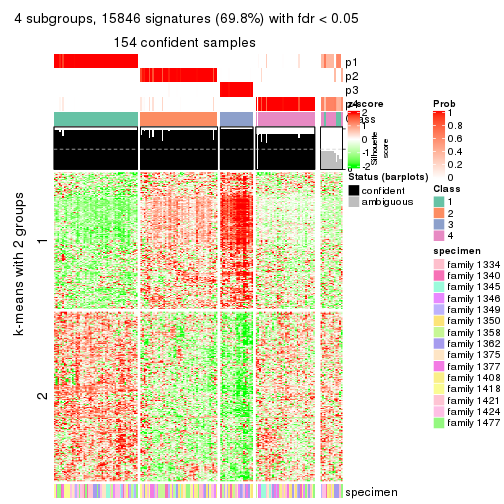</p>

</div>
<div id='tab-ATC-pam-get-signatures-4'>
<pre><code class="r">get_signatures(res, k = 5)
</code></pre>

<p></p>

</div>
<div id='tab-ATC-pam-get-signatures-5'>
<pre><code class="r">get_signatures(res, k = 6)
</code></pre>

<p>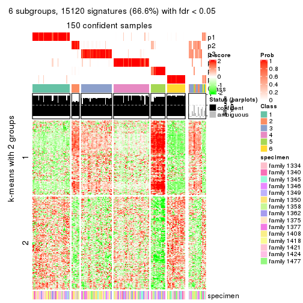</p>

</div>
</div>


Signature heatmaps where rows are not scaled:


<script>
$( function() {
	$( '#tabs-ATC-pam-get-signatures-no-scale' ).tabs();
} );
</script>
<div id='tabs-ATC-pam-get-signatures-no-scale'>
<ul>
<li><a href='#tab-ATC-pam-get-signatures-no-scale-1'>k = 2</a></li>
<li><a href='#tab-ATC-pam-get-signatures-no-scale-2'>k = 3</a></li>
<li><a href='#tab-ATC-pam-get-signatures-no-scale-3'>k = 4</a></li>
<li><a href='#tab-ATC-pam-get-signatures-no-scale-4'>k = 5</a></li>
<li><a href='#tab-ATC-pam-get-signatures-no-scale-5'>k = 6</a></li>
</ul>
<div id='tab-ATC-pam-get-signatures-no-scale-1'>
<pre><code class="r">get_signatures(res, k = 2, scale_rows = FALSE)
</code></pre>

<p></p>

</div>
<div id='tab-ATC-pam-get-signatures-no-scale-2'>
<pre><code class="r">get_signatures(res, k = 3, scale_rows = FALSE)
</code></pre>

<p></p>

</div>
<div id='tab-ATC-pam-get-signatures-no-scale-3'>
<pre><code class="r">get_signatures(res, k = 4, scale_rows = FALSE)
</code></pre>

<p>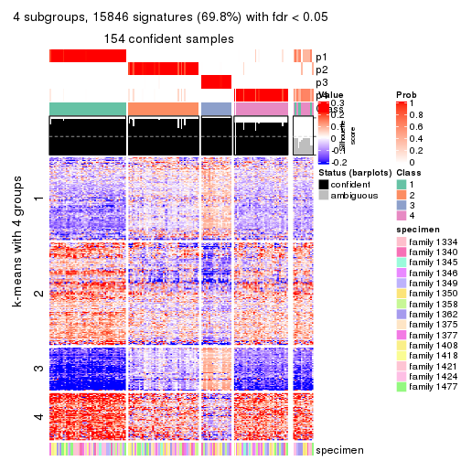</p>

</div>
<div id='tab-ATC-pam-get-signatures-no-scale-4'>
<pre><code class="r">get_signatures(res, k = 5, scale_rows = FALSE)
</code></pre>

<p></p>

</div>
<div id='tab-ATC-pam-get-signatures-no-scale-5'>
<pre><code class="r">get_signatures(res, k = 6, scale_rows = FALSE)
</code></pre>

<p></p>

</div>
</div>


Compare the overlap of signatures from different k:

```r
compare_signatures(res)
```


`get_signature()` returns a data frame invisibly. TO get the list of signatures, the function
call should be assigned to a variable explicitly. In following code, if `plot` argument is set
to `FALSE`, no heatmap is plotted while only the differential analysis is performed.

```r
# code only for demonstration
tb = get_signature(res, k = ..., plot = FALSE)
```

An example of the output of `tb` is:

```
#>   which_row         fdr    mean_1    mean_2 scaled_mean_1 scaled_mean_2 km
#> 1        38 0.042760348  8.373488  9.131774    -0.5533452     0.5164555  1
#> 2        40 0.018707592  7.106213  8.469186    -0.6173731     0.5762149  1
#> 3        55 0.019134737 10.221463 11.207825    -0.6159697     0.5749050  1
#> 4        59 0.006059896  5.921854  7.869574    -0.6899429     0.6439467  1
#> 5        60 0.018055526  8.928898 10.211722    -0.6204761     0.5791110  1
#> 6        98 0.009384629 15.714769 14.887706     0.6635654    -0.6193277  2
...
```

The columns in `tb` are:

1. `which_row`: row indices corresponding to the input matrix.
2. `fdr`: FDR for the differential test. 
3. `mean_x`: The mean value in group x.
4. `scaled_mean_x`: The mean value in group x after rows are scaled.
5. `km`: Row groups if k-means clustering is applied to rows.


UMAP plot which shows how samples are separated.


<script>
$( function() {
	$( '#tabs-ATC-pam-dimension-reduction' ).tabs();
} );
</script>
<div id='tabs-ATC-pam-dimension-reduction'>
<ul>
<li><a href='#tab-ATC-pam-dimension-reduction-1'>k = 2</a></li>
<li><a href='#tab-ATC-pam-dimension-reduction-2'>k = 3</a></li>
<li><a href='#tab-ATC-pam-dimension-reduction-3'>k = 4</a></li>
<li><a href='#tab-ATC-pam-dimension-reduction-4'>k = 5</a></li>
<li><a href='#tab-ATC-pam-dimension-reduction-5'>k = 6</a></li>
</ul>
<div id='tab-ATC-pam-dimension-reduction-1'>
<pre><code class="r">dimension_reduction(res, k = 2, method = &quot;UMAP&quot;)
</code></pre>

<p></p>

</div>
<div id='tab-ATC-pam-dimension-reduction-2'>
<pre><code class="r">dimension_reduction(res, k = 3, method = &quot;UMAP&quot;)
</code></pre>

<p></p>

</div>
<div id='tab-ATC-pam-dimension-reduction-3'>
<pre><code class="r">dimension_reduction(res, k = 4, method = &quot;UMAP&quot;)
</code></pre>

<p></p>

</div>
<div id='tab-ATC-pam-dimension-reduction-4'>
<pre><code class="r">dimension_reduction(res, k = 5, method = &quot;UMAP&quot;)
</code></pre>

<p></p>

</div>
<div id='tab-ATC-pam-dimension-reduction-5'>
<pre><code class="r">dimension_reduction(res, k = 6, method = &quot;UMAP&quot;)
</code></pre>

<p></p>

</div>
</div>


Following heatmap shows how subgroups are split when increasing `k`:

```r
collect_classes(res)
```


Test correlation between subgroups and known annotations. If the known
annotation is numeric, one-way ANOVA test is applied, and if the known
annotation is discrete, chi-squared contingency table test is applied.

```r
test_to_known_factors(res)
```

```
#>           n specimen(p) k
#> ATC:pam 165      0.1199 2
#> ATC:pam 126      0.0963 3
#> ATC:pam 154      0.4675 4
#> ATC:pam 150      0.7065 5
#> ATC:pam 150      0.4832 6
```


If matrix rows can be associated to genes, consider to use `GO_Enrichment(res,
...)` to perform function enrichment for the signature genes.


 

---------------------------------------------------


### ATC:mclust


The object with results only for a single top-value method and a single partition method 
can be extracted as:

```r
res = res_list["ATC", "mclust"]
# you can also extract it by
# res = res_list["ATC:mclust"]
```

A summary of `res` and all the functions that can be applied to it:

```r
res
```

```
#> A 'ConsensusPartition' object with k = 2, 3, 4, 5, 6.
#>   On a matrix with 22686 rows and 167 columns.
#>   Top rows (1000, 2000, 3000, 4000, 5000) are extracted by 'ATC' method.
#>   Subgroups are detected by 'mclust' method.
#>   Performed in total 1250 partitions by row resampling.
#>   Best k for subgroups seems to be 2.
#> 
#> Following methods can be applied to this 'ConsensusPartition' object:
#>  [1] "cola_report"             "collect_classes"         "collect_plots"          
#>  [4] "collect_stats"           "colnames"                "compare_signatures"     
#>  [7] "consensus_heatmap"       "dimension_reduction"     "functional_enrichment"  
#> [10] "get_anno_col"            "get_anno"                "get_classes"            
#> [13] "get_consensus"           "get_matrix"              "get_membership"         
#> [16] "get_param"               "get_signatures"          "get_stats"              
#> [19] "is_best_k"               "is_stable_k"             "membership_heatmap"     
#> [22] "ncol"                    "nrow"                    "plot_ecdf"              
#> [25] "rownames"                "select_partition_number" "show"                   
#> [28] "suggest_best_k"          "test_to_known_factors"
```

`collect_plots()` function collects all the plots made from `res` for all `k` (number of partitions)
into one single page to provide an easy and fast comparison between different `k`.

```r
collect_plots(res)
```


The plots are:

- The first row: a plot of the ECDF (Empirical cumulative distribution
  function) curves of the consensus matrix for each `k` and the heatmap of
  predicted classes for each `k`.
- The second row: heatmaps of the consensus matrix for each `k`.
- The third row: heatmaps of the membership matrix for each `k`.
- The fouth row: heatmaps of the signatures for each `k`.

All the plots in panels can be made by individual functions and they are
plotted later in this section.

`select_partition_number()` produces several plots showing different
statistics for choosing "optimized" `k`. There are following statistics:

- ECDF curves of the consensus matrix for each `k`;
- 1-PAC. [The PAC
  score](https://en.wikipedia.org/wiki/Consensus_clustering#Over-interpretation_potential_of_consensus_clustering)
  measures the proportion of the ambiguous subgrouping.
- Mean silhouette score.
- Concordance. The mean probability of fiting the consensus class ids in all
  partitions.
- Area increased. Denote $A_k$ as the area under the ECDF curve for current
  `k`, the area increased is defined as $A_k - A_{k-1}$.
- Rand index. The percent of pairs of samples that are both in a same cluster
  or both are not in a same cluster in the partition of k and k-1.
- Jaccard index. The ratio of pairs of samples are both in a same cluster in
  the partition of k and k-1 and the pairs of samples are both in a same
  cluster in the partition k or k-1.

The detailed explanations of these statistics can be found in [the cola
vignette](http://bioconductor.org/packages/devel/bioc/vignettes/cola/inst/doc/cola.html#toc_13).

Generally speaking, lower PAC score, higher mean silhouette score or higher
concordance corresponds to better partition. Rand index and Jaccard index
measure how similar the current partition is compared to partition with `k-1`.
If they are too similar, we won't accept `k` is better than `k-1`.

```r
select_partition_number(res)
```


The numeric values for all these statistics can be obtained by `get_stats()`.

```r
get_stats(res)
```

```
#>   k 1-PAC mean_silhouette concordance area_increased  Rand Jaccard
#> 2 2 0.796           0.899       0.921         0.4678 0.500   0.500
#> 3 3 0.446           0.744       0.780         0.2021 0.942   0.890
#> 4 4 0.717           0.736       0.857         0.1578 0.757   0.561
#> 5 5 0.655           0.751       0.845         0.0633 0.900   0.747
#> 6 6 0.615           0.652       0.770         0.0765 0.967   0.903
```

`suggest_best_k()` suggests the best $k$ based on these statistics. The rules are as follows:

- All $k$ with Jaccard index larger than 0.95 are removed because the increase of
  the partition number does not provides enough extra information. If all $k$ are removed,
  the best $k$ is assigned by `NA`.
- For $k$ with 1-PAC larger than 0.9, the maximal $k$ is taken as the "best k". Other $k$ is called "optional k".
- If it does not fit the second rule. The $k$ with the highest vote of highest
  1-PAC, mean silhouette and concordance is taken as the "best k".

```r
suggest_best_k(res)
```

```
#> [1] 2
```


Following shows the table of the partitions (You need to click the **show/hide
code output** link to see it). The membership matrix (columns with name `p*`)
is inferred by
[`clue::cl_consensus()`](https://www.rdocumentation.org/link/cl_consensus?package=clue)
function with the `SE` method. Basically the value in the membership matrix
represents the probability to belong to a certain group. The finall class
label for an item is determined with the group with highest probability it
belongs to.

In `get_classes()` function, the entropy is calculated from the membership
matrix and the silhouette score is calculated from the consensus matrix.


<script>
$( function() {
	$( '#tabs-ATC-mclust-get-classes' ).tabs();
} );
</script>
<div id='tabs-ATC-mclust-get-classes'>
<ul>
<li><a href='#tab-ATC-mclust-get-classes-1'>k = 2</a></li>
<li><a href='#tab-ATC-mclust-get-classes-2'>k = 3</a></li>
<li><a href='#tab-ATC-mclust-get-classes-3'>k = 4</a></li>
<li><a href='#tab-ATC-mclust-get-classes-4'>k = 5</a></li>
<li><a href='#tab-ATC-mclust-get-classes-5'>k = 6</a></li>
</ul>

<div id='tab-ATC-mclust-get-classes-1'>
<p><a id='tab-ATC-mclust-get-classes-1-a' style='color:#0366d6' href='#'>show/hide code output</a></p>
<pre><code class="r">cbind(get_classes(res, k = 2), get_membership(res, k = 2))
</code></pre>

<pre><code>#&gt;          class entropy silhouette    p1    p2
#&gt; GSM30006     2  0.3879     0.9728 0.076 0.924
#&gt; GSM30007     1  0.7528     0.7199 0.784 0.216
#&gt; GSM30008     1  0.0000     0.9205 1.000 0.000
#&gt; GSM30009     1  0.0000     0.9205 1.000 0.000
#&gt; GSM30010     2  0.0376     0.9254 0.004 0.996
#&gt; GSM30011     2  0.3879     0.9728 0.076 0.924
#&gt; GSM30012     2  0.3879     0.9728 0.076 0.924
#&gt; GSM30013     2  0.3879     0.9728 0.076 0.924
#&gt; GSM30014     2  0.0000     0.9219 0.000 1.000
#&gt; GSM30015     1  0.0000     0.9205 1.000 0.000
#&gt; GSM30016     2  0.3879     0.9728 0.076 0.924
#&gt; GSM30017     1  0.0000     0.9205 1.000 0.000
#&gt; GSM30018     1  0.0000     0.9205 1.000 0.000
#&gt; GSM30019     2  0.3879     0.9728 0.076 0.924
#&gt; GSM30020     1  0.5946     0.8194 0.856 0.144
#&gt; GSM30021     2  0.3879     0.9728 0.076 0.924
#&gt; GSM30022     1  0.0000     0.9205 1.000 0.000
#&gt; GSM30023     2  0.4562     0.9583 0.096 0.904
#&gt; GSM30024     2  0.3879     0.9728 0.076 0.924
#&gt; GSM30025     2  0.5519     0.9244 0.128 0.872
#&gt; GSM30026     1  0.0000     0.9205 1.000 0.000
#&gt; GSM30027     2  0.3879     0.9728 0.076 0.924
#&gt; GSM30028     2  0.4022     0.9708 0.080 0.920
#&gt; GSM30029     1  0.0000     0.9205 1.000 0.000
#&gt; GSM30030     1  0.4298     0.8677 0.912 0.088
#&gt; GSM30031     1  0.2236     0.9073 0.964 0.036
#&gt; GSM30032     2  0.4022     0.9711 0.080 0.920
#&gt; GSM30033     2  0.3879     0.9728 0.076 0.924
#&gt; GSM30034     1  0.7453     0.7320 0.788 0.212
#&gt; GSM30035     2  0.3879     0.9728 0.076 0.924
#&gt; GSM30036     1  0.4939     0.8565 0.892 0.108
#&gt; GSM30037     2  0.5294     0.9314 0.120 0.880
#&gt; GSM30038     2  0.3879     0.9728 0.076 0.924
#&gt; GSM30039     2  0.3879     0.9728 0.076 0.924
#&gt; GSM30040     2  0.0000     0.9219 0.000 1.000
#&gt; GSM30041     2  0.3879     0.9728 0.076 0.924
#&gt; GSM30042     2  0.3879     0.9728 0.076 0.924
#&gt; GSM30043     2  0.0376     0.9252 0.004 0.996
#&gt; GSM30044     1  0.2236     0.9073 0.964 0.036
#&gt; GSM30045     1  0.3431     0.8920 0.936 0.064
#&gt; GSM30046     1  0.1633     0.9126 0.976 0.024
#&gt; GSM30047     1  0.9983     0.0726 0.524 0.476
#&gt; GSM30048     1  0.0000     0.9205 1.000 0.000
#&gt; GSM30049     2  0.0000     0.9219 0.000 1.000
#&gt; GSM30050     2  0.4815     0.9502 0.104 0.896
#&gt; GSM30051     2  0.0000     0.9219 0.000 1.000
#&gt; GSM30052     1  0.0000     0.9205 1.000 0.000
#&gt; GSM30053     2  0.3879     0.9728 0.076 0.924
#&gt; GSM30054     2  0.0376     0.9252 0.004 0.996
#&gt; GSM30055     2  0.3879     0.9728 0.076 0.924
#&gt; GSM30056     2  0.3879     0.9728 0.076 0.924
#&gt; GSM30057     2  0.0376     0.9252 0.004 0.996
#&gt; GSM30058     2  0.3879     0.9728 0.076 0.924
#&gt; GSM30059     2  0.4022     0.9711 0.080 0.920
#&gt; GSM30060     2  0.3879     0.9728 0.076 0.924
#&gt; GSM30061     2  0.4431     0.9619 0.092 0.908
#&gt; GSM30062     1  0.3431     0.8906 0.936 0.064
#&gt; GSM30063     2  0.4022     0.9711 0.080 0.920
#&gt; GSM30064     1  0.0000     0.9205 1.000 0.000
#&gt; GSM30065     2  0.3879     0.9728 0.076 0.924
#&gt; GSM30066     2  0.0000     0.9219 0.000 1.000
#&gt; GSM30067     1  0.0000     0.9205 1.000 0.000
#&gt; GSM30068     2  0.0000     0.9219 0.000 1.000
#&gt; GSM30069     2  0.3879     0.9728 0.076 0.924
#&gt; GSM30070     2  0.3879     0.9728 0.076 0.924
#&gt; GSM30071     2  0.3879     0.9728 0.076 0.924
#&gt; GSM30072     1  0.4298     0.8740 0.912 0.088
#&gt; GSM30073     2  0.4022     0.9711 0.080 0.920
#&gt; GSM30074     2  0.3879     0.9728 0.076 0.924
#&gt; GSM30075     2  0.4022     0.9711 0.080 0.920
#&gt; GSM30076     1  0.2948     0.8988 0.948 0.052
#&gt; GSM30077     1  0.0000     0.9205 1.000 0.000
#&gt; GSM30078     1  0.0000     0.9205 1.000 0.000
#&gt; GSM30079     1  0.0000     0.9205 1.000 0.000
#&gt; GSM30080     2  0.3879     0.9728 0.076 0.924
#&gt; GSM30081     2  0.0000     0.9219 0.000 1.000
#&gt; GSM30086     2  0.3879     0.9728 0.076 0.924
#&gt; GSM30087     1  0.0000     0.9205 1.000 0.000
#&gt; GSM30088     1  0.0000     0.9205 1.000 0.000
#&gt; GSM30089     2  0.4298     0.9648 0.088 0.912
#&gt; GSM30090     2  0.3879     0.9728 0.076 0.924
#&gt; GSM30091     2  0.0000     0.9219 0.000 1.000
#&gt; GSM30092     1  0.3733     0.8854 0.928 0.072
#&gt; GSM30093     2  0.3879     0.9728 0.076 0.924
#&gt; GSM30094     2  0.0672     0.9283 0.008 0.992
#&gt; GSM30095     2  0.0000     0.9219 0.000 1.000
#&gt; GSM30096     1  0.9998     0.0431 0.508 0.492
#&gt; GSM30097     1  0.2043     0.9096 0.968 0.032
#&gt; GSM30098     1  0.0000     0.9205 1.000 0.000
#&gt; GSM30099     2  0.3879     0.9728 0.076 0.924
#&gt; GSM30100     2  0.0000     0.9219 0.000 1.000
#&gt; GSM30101     2  0.0672     0.9283 0.008 0.992
#&gt; GSM30102     2  0.3879     0.9728 0.076 0.924
#&gt; GSM30103     2  0.3879     0.9728 0.076 0.924
#&gt; GSM30104     1  0.9963     0.1491 0.536 0.464
#&gt; GSM30105     1  0.4298     0.8700 0.912 0.088
#&gt; GSM30106     1  0.9909     0.2383 0.556 0.444
#&gt; GSM30107     1  0.0000     0.9205 1.000 0.000
#&gt; GSM30108     2  0.3879     0.9728 0.076 0.924
#&gt; GSM30109     1  0.0000     0.9205 1.000 0.000
#&gt; GSM30110     1  0.2043     0.9092 0.968 0.032
#&gt; GSM30111     1  0.3114     0.8952 0.944 0.056
#&gt; GSM30112     2  0.4431     0.9623 0.092 0.908
#&gt; GSM30113     2  0.1414     0.9367 0.020 0.980
#&gt; GSM30114     2  0.3879     0.9728 0.076 0.924
#&gt; GSM30115     2  0.4431     0.9615 0.092 0.908
#&gt; GSM30116     2  0.3879     0.9728 0.076 0.924
#&gt; GSM30117     2  0.4022     0.9711 0.080 0.920
#&gt; GSM30118     2  0.4022     0.9711 0.080 0.920
#&gt; GSM30119     2  0.3584     0.9685 0.068 0.932
#&gt; GSM30120     2  0.4431     0.9615 0.092 0.908
#&gt; GSM30121     1  0.4161     0.8779 0.916 0.084
#&gt; GSM30122     1  0.0000     0.9205 1.000 0.000
#&gt; GSM30123     2  0.3879     0.9728 0.076 0.924
#&gt; GSM30177     2  0.3879     0.9728 0.076 0.924
#&gt; GSM30178     1  0.0672     0.9181 0.992 0.008
#&gt; GSM30179     1  0.0000     0.9205 1.000 0.000
#&gt; GSM30180     2  0.7674     0.7881 0.224 0.776
#&gt; GSM30181     2  0.4022     0.9711 0.080 0.920
#&gt; GSM30182     1  0.3114     0.8966 0.944 0.056
#&gt; GSM30183     1  0.3879     0.8802 0.924 0.076
#&gt; GSM30184     2  0.3879     0.9728 0.076 0.924
#&gt; GSM30185     2  0.4022     0.9711 0.080 0.920
#&gt; GSM30186     2  0.3879     0.9728 0.076 0.924
#&gt; GSM30187     1  0.0000     0.9205 1.000 0.000
#&gt; GSM30188     1  0.0000     0.9205 1.000 0.000
#&gt; GSM30189     1  0.0376     0.9193 0.996 0.004
#&gt; GSM30190     2  0.0938     0.9312 0.012 0.988
#&gt; GSM30191     2  0.4939     0.9462 0.108 0.892
#&gt; GSM30192     2  0.3879     0.9728 0.076 0.924
#&gt; GSM30193     1  0.0000     0.9205 1.000 0.000
#&gt; GSM30194     2  0.0000     0.9219 0.000 1.000
#&gt; GSM30195     2  0.7528     0.8039 0.216 0.784
#&gt; GSM30196     1  0.0000     0.9205 1.000 0.000
#&gt; GSM30197     1  0.0000     0.9205 1.000 0.000
#&gt; GSM30198     1  0.0000     0.9205 1.000 0.000
#&gt; GSM30199     2  0.4022     0.9711 0.080 0.920
#&gt; GSM30200     1  0.0000     0.9205 1.000 0.000
#&gt; GSM30201     1  0.0000     0.9205 1.000 0.000
#&gt; GSM30202     1  0.9954     0.1572 0.540 0.460
#&gt; GSM30203     1  0.9635     0.3978 0.612 0.388
#&gt; GSM30204     1  0.1843     0.9110 0.972 0.028
#&gt; GSM30205     2  0.3879     0.9728 0.076 0.924
#&gt; GSM30206     1  0.0000     0.9205 1.000 0.000
#&gt; GSM30207     1  0.0376     0.9193 0.996 0.004
#&gt; GSM30208     1  0.0000     0.9205 1.000 0.000
#&gt; GSM30209     2  0.3879     0.9728 0.076 0.924
#&gt; GSM30210     1  0.0000     0.9205 1.000 0.000
#&gt; GSM30211     1  0.0000     0.9205 1.000 0.000
#&gt; GSM30212     1  0.0000     0.9205 1.000 0.000
#&gt; GSM30213     1  0.9580     0.4049 0.620 0.380
#&gt; GSM30214     1  0.8713     0.6034 0.708 0.292
#&gt; GSM30215     1  0.0000     0.9205 1.000 0.000
#&gt; GSM30216     1  0.8016     0.6896 0.756 0.244
#&gt; GSM30217     1  0.0000     0.9205 1.000 0.000
#&gt; GSM30218     2  0.4022     0.9711 0.080 0.920
#&gt; GSM30219     2  0.3879     0.9728 0.076 0.924
#&gt; GSM30220     1  0.0000     0.9205 1.000 0.000
#&gt; GSM30221     1  0.0000     0.9205 1.000 0.000
#&gt; GSM30222     1  0.7815     0.7016 0.768 0.232
#&gt; GSM30223     1  0.0000     0.9205 1.000 0.000
#&gt; GSM30224     1  0.0000     0.9205 1.000 0.000
#&gt; GSM30225     1  0.0000     0.9205 1.000 0.000
#&gt; GSM30226     2  0.4022     0.9711 0.080 0.920
#&gt; GSM30227     1  0.0000     0.9205 1.000 0.000
#&gt; GSM30228     2  0.3879     0.9728 0.076 0.924
#&gt; GSM30229     2  0.4298     0.9654 0.088 0.912
</code></pre>

<script>
$('#tab-ATC-mclust-get-classes-1-a').parent().next().next().hide();
$('#tab-ATC-mclust-get-classes-1-a').click(function(){
  $('#tab-ATC-mclust-get-classes-1-a').parent().next().next().toggle();
  return(false);
});
</script>
</div>

<div id='tab-ATC-mclust-get-classes-2'>
<p><a id='tab-ATC-mclust-get-classes-2-a' style='color:#0366d6' href='#'>show/hide code output</a></p>
<pre><code class="r">cbind(get_classes(res, k = 3), get_membership(res, k = 3))
</code></pre>

<pre><code>#&gt;          class entropy silhouette    p1    p2 p3
#&gt; GSM30006     2  0.1411     0.7960 0.000 0.964 NA
#&gt; GSM30007     1  0.5012     0.6571 0.788 0.204 NA
#&gt; GSM30008     1  0.4974     0.8327 0.764 0.000 NA
#&gt; GSM30009     1  0.0661     0.8315 0.988 0.004 NA
#&gt; GSM30010     2  0.6274     0.6462 0.000 0.544 NA
#&gt; GSM30011     2  0.1163     0.7951 0.000 0.972 NA
#&gt; GSM30012     2  0.3686     0.7671 0.000 0.860 NA
#&gt; GSM30013     2  0.5884     0.7709 0.148 0.788 NA
#&gt; GSM30014     2  0.6291     0.6427 0.000 0.532 NA
#&gt; GSM30015     1  0.5363     0.8252 0.724 0.000 NA
#&gt; GSM30016     2  0.2703     0.7932 0.016 0.928 NA
#&gt; GSM30017     1  0.4346     0.8381 0.816 0.000 NA
#&gt; GSM30018     1  0.3267     0.8429 0.884 0.000 NA
#&gt; GSM30019     2  0.5327     0.7392 0.000 0.728 NA
#&gt; GSM30020     1  0.6033     0.8069 0.660 0.004 NA
#&gt; GSM30021     2  0.3686     0.7671 0.000 0.860 NA
#&gt; GSM30022     1  0.0000     0.8340 1.000 0.000 NA
#&gt; GSM30023     2  0.7146     0.6592 0.264 0.676 NA
#&gt; GSM30024     2  0.1163     0.7966 0.000 0.972 NA
#&gt; GSM30025     2  0.5956     0.5972 0.324 0.672 NA
#&gt; GSM30026     1  0.0592     0.8324 0.988 0.012 NA
#&gt; GSM30027     2  0.2434     0.8004 0.024 0.940 NA
#&gt; GSM30028     2  0.7146     0.6592 0.264 0.676 NA
#&gt; GSM30029     1  0.2959     0.8439 0.900 0.000 NA
#&gt; GSM30030     1  0.1453     0.8268 0.968 0.024 NA
#&gt; GSM30031     1  0.5810     0.8088 0.664 0.000 NA
#&gt; GSM30032     2  0.4458     0.7988 0.080 0.864 NA
#&gt; GSM30033     2  0.3472     0.8040 0.056 0.904 NA
#&gt; GSM30034     1  0.1950     0.8204 0.952 0.040 NA
#&gt; GSM30035     2  0.3325     0.8026 0.076 0.904 NA
#&gt; GSM30036     1  0.4099     0.7356 0.852 0.140 NA
#&gt; GSM30037     2  0.5292     0.6977 0.228 0.764 NA
#&gt; GSM30038     2  0.2173     0.7922 0.008 0.944 NA
#&gt; GSM30039     2  0.2261     0.7913 0.000 0.932 NA
#&gt; GSM30040     2  0.6267     0.6406 0.000 0.548 NA
#&gt; GSM30041     2  0.1919     0.8055 0.024 0.956 NA
#&gt; GSM30042     2  0.3879     0.7819 0.000 0.848 NA
#&gt; GSM30043     2  0.6260     0.6432 0.000 0.552 NA
#&gt; GSM30044     1  0.5621     0.8180 0.692 0.000 NA
#&gt; GSM30045     1  0.6527     0.8088 0.660 0.020 NA
#&gt; GSM30046     1  0.5835     0.8069 0.660 0.000 NA
#&gt; GSM30047     2  0.6777     0.4882 0.364 0.616 NA
#&gt; GSM30048     1  0.5138     0.8299 0.748 0.000 NA
#&gt; GSM30049     2  0.6267     0.6406 0.000 0.548 NA
#&gt; GSM30050     2  0.6322     0.6481 0.276 0.700 NA
#&gt; GSM30051     2  0.6260     0.6432 0.000 0.552 NA
#&gt; GSM30052     1  0.2339     0.8390 0.940 0.012 NA
#&gt; GSM30053     2  0.3340     0.7893 0.000 0.880 NA
#&gt; GSM30054     2  0.6274     0.6404 0.000 0.544 NA
#&gt; GSM30055     2  0.3623     0.8017 0.072 0.896 NA
#&gt; GSM30056     2  0.2947     0.8048 0.060 0.920 NA
#&gt; GSM30057     2  0.6244     0.6502 0.000 0.560 NA
#&gt; GSM30058     2  0.6402     0.7710 0.056 0.744 NA
#&gt; GSM30059     2  0.6965     0.6758 0.244 0.696 NA
#&gt; GSM30060     2  0.4902     0.8067 0.064 0.844 NA
#&gt; GSM30061     2  0.5443     0.6682 0.260 0.736 NA
#&gt; GSM30062     1  0.7671     0.2802 0.568 0.380 NA
#&gt; GSM30063     2  0.4475     0.8002 0.064 0.864 NA
#&gt; GSM30064     1  0.5216     0.8282 0.740 0.000 NA
#&gt; GSM30065     2  0.3764     0.7997 0.040 0.892 NA
#&gt; GSM30066     2  0.6267     0.6406 0.000 0.548 NA
#&gt; GSM30067     1  0.5706     0.8139 0.680 0.000 NA
#&gt; GSM30068     2  0.6274     0.6458 0.000 0.544 NA
#&gt; GSM30069     2  0.2261     0.7915 0.000 0.932 NA
#&gt; GSM30070     2  0.1643     0.7903 0.000 0.956 NA
#&gt; GSM30071     2  0.4921     0.8009 0.072 0.844 NA
#&gt; GSM30072     1  0.7528     0.7862 0.648 0.072 NA
#&gt; GSM30073     2  0.5891     0.7545 0.168 0.780 NA
#&gt; GSM30074     2  0.3551     0.7672 0.000 0.868 NA
#&gt; GSM30075     2  0.3678     0.8017 0.080 0.892 NA
#&gt; GSM30076     1  0.6449     0.8191 0.740 0.056 NA
#&gt; GSM30077     1  0.5024     0.8350 0.776 0.004 NA
#&gt; GSM30078     1  0.1031     0.8390 0.976 0.000 NA
#&gt; GSM30079     1  0.0424     0.8360 0.992 0.000 NA
#&gt; GSM30080     2  0.3045     0.7923 0.020 0.916 NA
#&gt; GSM30081     2  0.6267     0.6406 0.000 0.548 NA
#&gt; GSM30086     2  0.3499     0.8024 0.072 0.900 NA
#&gt; GSM30087     1  0.3551     0.8423 0.868 0.000 NA
#&gt; GSM30088     1  0.0237     0.8331 0.996 0.000 NA
#&gt; GSM30089     2  0.5253     0.7426 0.188 0.792 NA
#&gt; GSM30090     2  0.1753     0.7987 0.000 0.952 NA
#&gt; GSM30091     2  0.6291     0.6350 0.000 0.532 NA
#&gt; GSM30092     1  0.8399     0.6382 0.620 0.220 NA
#&gt; GSM30093     2  0.3237     0.8049 0.056 0.912 NA
#&gt; GSM30094     2  0.5431     0.7463 0.000 0.716 NA
#&gt; GSM30095     2  0.6274     0.6390 0.000 0.544 NA
#&gt; GSM30096     1  0.7353     0.2378 0.568 0.396 NA
#&gt; GSM30097     1  0.1315     0.8277 0.972 0.020 NA
#&gt; GSM30098     1  0.1315     0.8277 0.972 0.020 NA
#&gt; GSM30099     2  0.3406     0.8041 0.068 0.904 NA
#&gt; GSM30100     2  0.6267     0.6406 0.000 0.548 NA
#&gt; GSM30101     2  0.6204     0.6571 0.000 0.576 NA
#&gt; GSM30102     2  0.3406     0.8029 0.068 0.904 NA
#&gt; GSM30103     2  0.4473     0.7652 0.164 0.828 NA
#&gt; GSM30104     2  0.5678     0.5780 0.316 0.684 NA
#&gt; GSM30105     1  0.1315     0.8277 0.972 0.020 NA
#&gt; GSM30106     2  0.8342     0.0613 0.456 0.464 NA
#&gt; GSM30107     1  0.0983     0.8303 0.980 0.016 NA
#&gt; GSM30108     2  0.3340     0.7704 0.000 0.880 NA
#&gt; GSM30109     1  0.5216     0.8282 0.740 0.000 NA
#&gt; GSM30110     1  0.5835     0.8069 0.660 0.000 NA
#&gt; GSM30111     1  0.6665     0.5512 0.688 0.276 NA
#&gt; GSM30112     2  0.6967     0.6251 0.288 0.668 NA
#&gt; GSM30113     2  0.6252     0.6510 0.000 0.556 NA
#&gt; GSM30114     2  0.4658     0.8023 0.068 0.856 NA
#&gt; GSM30115     2  0.7097     0.6461 0.280 0.668 NA
#&gt; GSM30116     2  0.5891     0.7735 0.036 0.764 NA
#&gt; GSM30117     2  0.4634     0.7647 0.164 0.824 NA
#&gt; GSM30118     2  0.4290     0.8018 0.064 0.872 NA
#&gt; GSM30119     2  0.5138     0.7580 0.000 0.748 NA
#&gt; GSM30120     2  0.6375     0.6901 0.244 0.720 NA
#&gt; GSM30121     1  0.7411     0.5847 0.668 0.256 NA
#&gt; GSM30122     1  0.1315     0.8277 0.972 0.020 NA
#&gt; GSM30123     2  0.2651     0.8050 0.060 0.928 NA
#&gt; GSM30177     2  0.3461     0.8027 0.076 0.900 NA
#&gt; GSM30178     1  0.1129     0.8386 0.976 0.004 NA
#&gt; GSM30179     1  0.4291     0.8401 0.820 0.000 NA
#&gt; GSM30180     2  0.6386     0.3847 0.412 0.584 NA
#&gt; GSM30181     2  0.3832     0.8006 0.076 0.888 NA
#&gt; GSM30182     1  0.6624     0.8183 0.708 0.044 NA
#&gt; GSM30183     1  0.5810     0.8083 0.664 0.000 NA
#&gt; GSM30184     2  0.0983     0.7991 0.004 0.980 NA
#&gt; GSM30185     2  0.3670     0.7988 0.092 0.888 NA
#&gt; GSM30186     2  0.2947     0.8048 0.060 0.920 NA
#&gt; GSM30187     1  0.1753     0.8415 0.952 0.000 NA
#&gt; GSM30188     1  0.5216     0.8282 0.740 0.000 NA
#&gt; GSM30189     1  0.4291     0.7388 0.840 0.152 NA
#&gt; GSM30190     2  0.6045     0.6848 0.000 0.620 NA
#&gt; GSM30191     2  0.4862     0.7653 0.160 0.820 NA
#&gt; GSM30192     2  0.3802     0.7995 0.080 0.888 NA
#&gt; GSM30193     1  0.5678     0.8155 0.684 0.000 NA
#&gt; GSM30194     2  0.6274     0.6390 0.000 0.544 NA
#&gt; GSM30195     2  0.6416     0.6110 0.304 0.676 NA
#&gt; GSM30196     1  0.5216     0.8282 0.740 0.000 NA
#&gt; GSM30197     1  0.5810     0.8083 0.664 0.000 NA
#&gt; GSM30198     1  0.5810     0.8083 0.664 0.000 NA
#&gt; GSM30199     2  0.4475     0.8002 0.064 0.864 NA
#&gt; GSM30200     1  0.5785     0.8097 0.668 0.000 NA
#&gt; GSM30201     1  0.0747     0.8375 0.984 0.000 NA
#&gt; GSM30202     2  0.6822     0.1540 0.480 0.508 NA
#&gt; GSM30203     1  0.6282     0.4102 0.664 0.324 NA
#&gt; GSM30204     1  0.0237     0.8349 0.996 0.004 NA
#&gt; GSM30205     2  0.3456     0.8036 0.060 0.904 NA
#&gt; GSM30206     1  0.2774     0.8147 0.920 0.072 NA
#&gt; GSM30207     1  0.1315     0.8277 0.972 0.020 NA
#&gt; GSM30208     1  0.1315     0.8277 0.972 0.020 NA
#&gt; GSM30209     2  0.3713     0.8010 0.076 0.892 NA
#&gt; GSM30210     1  0.1315     0.8277 0.972 0.020 NA
#&gt; GSM30211     1  0.5216     0.8282 0.740 0.000 NA
#&gt; GSM30212     1  0.1315     0.8277 0.972 0.020 NA
#&gt; GSM30213     2  0.6823     0.1527 0.484 0.504 NA
#&gt; GSM30214     1  0.5202     0.6244 0.772 0.220 NA
#&gt; GSM30215     1  0.1711     0.8254 0.960 0.032 NA
#&gt; GSM30216     1  0.6890     0.7950 0.632 0.028 NA
#&gt; GSM30217     1  0.1774     0.8350 0.960 0.016 NA
#&gt; GSM30218     2  0.4475     0.8002 0.064 0.864 NA
#&gt; GSM30219     2  0.4709     0.8023 0.056 0.852 NA
#&gt; GSM30220     1  0.1315     0.8277 0.972 0.020 NA
#&gt; GSM30221     1  0.0592     0.8332 0.988 0.000 NA
#&gt; GSM30222     1  0.4796     0.6284 0.780 0.220 NA
#&gt; GSM30223     1  0.5810     0.8083 0.664 0.000 NA
#&gt; GSM30224     1  0.1163     0.8400 0.972 0.000 NA
#&gt; GSM30225     1  0.5810     0.8083 0.664 0.000 NA
#&gt; GSM30226     2  0.4384     0.8009 0.068 0.868 NA
#&gt; GSM30227     1  0.5810     0.8083 0.664 0.000 NA
#&gt; GSM30228     2  0.3899     0.8066 0.056 0.888 NA
#&gt; GSM30229     2  0.6108     0.6961 0.240 0.732 NA
</code></pre>

<script>
$('#tab-ATC-mclust-get-classes-2-a').parent().next().next().hide();
$('#tab-ATC-mclust-get-classes-2-a').click(function(){
  $('#tab-ATC-mclust-get-classes-2-a').parent().next().next().toggle();
  return(false);
});
</script>
</div>

<div id='tab-ATC-mclust-get-classes-3'>
<p><a id='tab-ATC-mclust-get-classes-3-a' style='color:#0366d6' href='#'>show/hide code output</a></p>
<pre><code class="r">cbind(get_classes(res, k = 4), get_membership(res, k = 4))
</code></pre>

<pre><code>#&gt;          class entropy silhouette    p1    p2    p3    p4
#&gt; GSM30006     2  0.0895    0.71669 0.000 0.976 0.020 0.004
#&gt; GSM30007     1  0.4273    0.76954 0.820 0.136 0.008 0.036
#&gt; GSM30008     1  0.0817    0.90533 0.976 0.000 0.000 0.024
#&gt; GSM30009     1  0.1452    0.90339 0.956 0.000 0.008 0.036
#&gt; GSM30010     3  0.3505    0.82938 0.000 0.088 0.864 0.048
#&gt; GSM30011     2  0.1109    0.71681 0.004 0.968 0.028 0.000
#&gt; GSM30012     2  0.3693    0.61732 0.000 0.856 0.072 0.072
#&gt; GSM30013     2  0.2635    0.69344 0.076 0.904 0.000 0.020
#&gt; GSM30014     3  0.2011    0.86928 0.000 0.080 0.920 0.000
#&gt; GSM30015     1  0.1004    0.90479 0.972 0.000 0.004 0.024
#&gt; GSM30016     2  0.0188    0.71180 0.004 0.996 0.000 0.000
#&gt; GSM30017     1  0.0817    0.90533 0.976 0.000 0.000 0.024
#&gt; GSM30018     1  0.0707    0.90596 0.980 0.000 0.000 0.020
#&gt; GSM30019     3  0.4967    0.29341 0.000 0.452 0.548 0.000
#&gt; GSM30020     1  0.1151    0.90388 0.968 0.000 0.008 0.024
#&gt; GSM30021     2  0.3805    0.61912 0.004 0.856 0.068 0.072
#&gt; GSM30022     1  0.1209    0.90473 0.964 0.000 0.004 0.032
#&gt; GSM30023     2  0.5803    0.26654 0.328 0.632 0.008 0.032
#&gt; GSM30024     2  0.2489    0.72138 0.000 0.912 0.020 0.068
#&gt; GSM30025     1  0.7937   -0.10993 0.456 0.244 0.008 0.292
#&gt; GSM30026     1  0.1356    0.90406 0.960 0.000 0.008 0.032
#&gt; GSM30027     2  0.1520    0.71971 0.000 0.956 0.020 0.024
#&gt; GSM30028     2  0.5599    0.22808 0.352 0.616 0.000 0.032
#&gt; GSM30029     1  0.0779    0.90634 0.980 0.000 0.004 0.016
#&gt; GSM30030     1  0.1452    0.90339 0.956 0.000 0.008 0.036
#&gt; GSM30031     1  0.1004    0.90480 0.972 0.000 0.004 0.024
#&gt; GSM30032     4  0.3219    0.81157 0.000 0.112 0.020 0.868
#&gt; GSM30033     2  0.4245    0.67965 0.000 0.784 0.020 0.196
#&gt; GSM30034     1  0.1878    0.89948 0.944 0.008 0.008 0.040
#&gt; GSM30035     2  0.5716    0.56734 0.016 0.644 0.020 0.320
#&gt; GSM30036     1  0.3945    0.81600 0.852 0.076 0.008 0.064
#&gt; GSM30037     2  0.3466    0.69108 0.084 0.876 0.020 0.020
#&gt; GSM30038     2  0.1284    0.70046 0.012 0.964 0.024 0.000
#&gt; GSM30039     2  0.1302    0.70010 0.000 0.956 0.044 0.000
#&gt; GSM30040     3  0.1557    0.87090 0.000 0.056 0.944 0.000
#&gt; GSM30041     2  0.2635    0.72178 0.000 0.904 0.020 0.076
#&gt; GSM30042     2  0.1211    0.71211 0.000 0.960 0.040 0.000
#&gt; GSM30043     3  0.1557    0.87090 0.000 0.056 0.944 0.000
#&gt; GSM30044     1  0.1004    0.90480 0.972 0.000 0.004 0.024
#&gt; GSM30045     1  0.1022    0.90405 0.968 0.000 0.000 0.032
#&gt; GSM30046     1  0.1151    0.90388 0.968 0.000 0.008 0.024
#&gt; GSM30047     1  0.4898    0.25208 0.584 0.416 0.000 0.000
#&gt; GSM30048     1  0.0817    0.90533 0.976 0.000 0.000 0.024
#&gt; GSM30049     3  0.1557    0.87090 0.000 0.056 0.944 0.000
#&gt; GSM30050     2  0.5020    0.49482 0.232 0.736 0.020 0.012
#&gt; GSM30051     3  0.1792    0.87158 0.000 0.068 0.932 0.000
#&gt; GSM30052     1  0.1452    0.90339 0.956 0.000 0.008 0.036
#&gt; GSM30053     2  0.2329    0.67822 0.000 0.916 0.072 0.012
#&gt; GSM30054     3  0.1557    0.87090 0.000 0.056 0.944 0.000
#&gt; GSM30055     2  0.3501    0.70948 0.000 0.848 0.020 0.132
#&gt; GSM30056     2  0.5262    0.58879 0.004 0.672 0.020 0.304
#&gt; GSM30057     3  0.2011    0.86928 0.000 0.080 0.920 0.000
#&gt; GSM30058     3  0.7254    0.20400 0.000 0.300 0.524 0.176
#&gt; GSM30059     4  0.5456    0.73171 0.100 0.112 0.020 0.768
#&gt; GSM30060     4  0.4088    0.78478 0.000 0.140 0.040 0.820
#&gt; GSM30061     4  0.7628    0.24548 0.408 0.156 0.008 0.428
#&gt; GSM30062     1  0.0592    0.90630 0.984 0.000 0.000 0.016
#&gt; GSM30063     4  0.3219    0.81157 0.000 0.112 0.020 0.868
#&gt; GSM30064     1  0.0817    0.90533 0.976 0.000 0.000 0.024
#&gt; GSM30065     2  0.0376    0.71078 0.000 0.992 0.004 0.004
#&gt; GSM30066     3  0.1557    0.87090 0.000 0.056 0.944 0.000
#&gt; GSM30067     1  0.1151    0.90388 0.968 0.000 0.008 0.024
#&gt; GSM30068     3  0.2011    0.86928 0.000 0.080 0.920 0.000
#&gt; GSM30069     2  0.0707    0.71571 0.000 0.980 0.020 0.000
#&gt; GSM30070     2  0.0817    0.69827 0.000 0.976 0.024 0.000
#&gt; GSM30071     2  0.3312    0.67046 0.028 0.892 0.044 0.036
#&gt; GSM30072     1  0.1022    0.90407 0.968 0.000 0.000 0.032
#&gt; GSM30073     4  0.5145    0.75111 0.080 0.112 0.020 0.788
#&gt; GSM30074     2  0.3927    0.62135 0.012 0.856 0.060 0.072
#&gt; GSM30075     2  0.6043    0.39508 0.016 0.552 0.020 0.412
#&gt; GSM30076     1  0.0817    0.90533 0.976 0.000 0.000 0.024
#&gt; GSM30077     1  0.0817    0.90533 0.976 0.000 0.000 0.024
#&gt; GSM30078     1  0.0779    0.90639 0.980 0.000 0.004 0.016
#&gt; GSM30079     1  0.1209    0.90473 0.964 0.000 0.004 0.032
#&gt; GSM30080     2  0.0927    0.70469 0.008 0.976 0.016 0.000
#&gt; GSM30081     3  0.1557    0.87090 0.000 0.056 0.944 0.000
#&gt; GSM30086     2  0.2843    0.72081 0.000 0.892 0.020 0.088
#&gt; GSM30087     1  0.0817    0.90533 0.976 0.000 0.000 0.024
#&gt; GSM30088     1  0.1356    0.90406 0.960 0.000 0.008 0.032
#&gt; GSM30089     2  0.2635    0.69715 0.076 0.904 0.020 0.000
#&gt; GSM30090     2  0.2489    0.72138 0.000 0.912 0.020 0.068
#&gt; GSM30091     3  0.2198    0.86804 0.000 0.072 0.920 0.008
#&gt; GSM30092     1  0.2197    0.87730 0.928 0.048 0.000 0.024
#&gt; GSM30093     2  0.3658    0.70629 0.000 0.836 0.020 0.144
#&gt; GSM30094     3  0.5944    0.59866 0.000 0.140 0.696 0.164
#&gt; GSM30095     3  0.1557    0.87090 0.000 0.056 0.944 0.000
#&gt; GSM30096     1  0.4730    0.45347 0.636 0.000 0.000 0.364
#&gt; GSM30097     1  0.1452    0.90339 0.956 0.000 0.008 0.036
#&gt; GSM30098     1  0.1452    0.90339 0.956 0.000 0.008 0.036
#&gt; GSM30099     2  0.5955    0.39260 0.004 0.552 0.032 0.412
#&gt; GSM30100     3  0.1557    0.87090 0.000 0.056 0.944 0.000
#&gt; GSM30101     3  0.2011    0.86928 0.000 0.080 0.920 0.000
#&gt; GSM30102     2  0.4770    0.67805 0.012 0.764 0.020 0.204
#&gt; GSM30103     2  0.7077    0.47347 0.096 0.580 0.020 0.304
#&gt; GSM30104     1  0.6206    0.36876 0.632 0.280 0.000 0.088
#&gt; GSM30105     1  0.1452    0.90339 0.956 0.000 0.008 0.036
#&gt; GSM30106     1  0.5392    0.59951 0.724 0.204 0.000 0.072
#&gt; GSM30107     1  0.1209    0.90473 0.964 0.000 0.004 0.032
#&gt; GSM30108     2  0.3855    0.62589 0.012 0.860 0.060 0.068
#&gt; GSM30109     1  0.0817    0.90533 0.976 0.000 0.000 0.024
#&gt; GSM30110     1  0.1151    0.90388 0.968 0.000 0.008 0.024
#&gt; GSM30111     1  0.0188    0.90704 0.996 0.000 0.000 0.004
#&gt; GSM30112     1  0.7429    0.13036 0.532 0.116 0.020 0.332
#&gt; GSM30113     3  0.3548    0.83112 0.000 0.068 0.864 0.068
#&gt; GSM30114     2  0.3576    0.66094 0.028 0.880 0.044 0.048
#&gt; GSM30115     1  0.7075    0.00289 0.476 0.440 0.040 0.044
#&gt; GSM30116     3  0.7723   -0.04338 0.000 0.348 0.420 0.232
#&gt; GSM30117     2  0.7194    0.41867 0.096 0.552 0.020 0.332
#&gt; GSM30118     4  0.5383    0.45009 0.000 0.292 0.036 0.672
#&gt; GSM30119     2  0.6316    0.37185 0.000 0.596 0.324 0.080
#&gt; GSM30120     2  0.6365    0.08997 0.436 0.516 0.024 0.024
#&gt; GSM30121     1  0.2742    0.85344 0.900 0.076 0.000 0.024
#&gt; GSM30122     1  0.1452    0.90339 0.956 0.000 0.008 0.036
#&gt; GSM30123     2  0.5628    0.56427 0.004 0.644 0.032 0.320
#&gt; GSM30177     2  0.5696    0.57274 0.016 0.648 0.020 0.316
#&gt; GSM30178     1  0.1109    0.90525 0.968 0.000 0.004 0.028
#&gt; GSM30179     1  0.1356    0.90406 0.960 0.000 0.008 0.032
#&gt; GSM30180     1  0.6490    0.52274 0.652 0.112 0.008 0.228
#&gt; GSM30181     2  0.5736    0.56128 0.016 0.640 0.020 0.324
#&gt; GSM30182     1  0.1406    0.90020 0.960 0.016 0.000 0.024
#&gt; GSM30183     1  0.1151    0.90388 0.968 0.000 0.008 0.024
#&gt; GSM30184     2  0.3149    0.71959 0.000 0.880 0.032 0.088
#&gt; GSM30185     2  0.5654    0.64196 0.032 0.700 0.020 0.248
#&gt; GSM30186     2  0.5450    0.60295 0.012 0.676 0.020 0.292
#&gt; GSM30187     1  0.1356    0.90406 0.960 0.000 0.008 0.032
#&gt; GSM30188     1  0.0817    0.90533 0.976 0.000 0.000 0.024
#&gt; GSM30189     1  0.1452    0.90339 0.956 0.000 0.008 0.036
#&gt; GSM30190     3  0.2737    0.84755 0.000 0.104 0.888 0.008
#&gt; GSM30191     2  0.6035    0.62107 0.112 0.704 0.008 0.176
#&gt; GSM30192     2  0.5130    0.57687 0.000 0.668 0.020 0.312
#&gt; GSM30193     1  0.0817    0.90533 0.976 0.000 0.000 0.024
#&gt; GSM30194     3  0.1557    0.87090 0.000 0.056 0.944 0.000
#&gt; GSM30195     2  0.5414    0.25743 0.376 0.604 0.020 0.000
#&gt; GSM30196     1  0.0817    0.90533 0.976 0.000 0.000 0.024
#&gt; GSM30197     1  0.1151    0.90388 0.968 0.000 0.008 0.024
#&gt; GSM30198     1  0.1151    0.90388 0.968 0.000 0.008 0.024
#&gt; GSM30199     4  0.3219    0.81157 0.000 0.112 0.020 0.868
#&gt; GSM30200     1  0.1151    0.90388 0.968 0.000 0.008 0.024
#&gt; GSM30201     1  0.1209    0.90473 0.964 0.000 0.004 0.032
#&gt; GSM30202     1  0.4711    0.68358 0.740 0.024 0.000 0.236
#&gt; GSM30203     1  0.5212    0.34639 0.572 0.000 0.008 0.420
#&gt; GSM30204     1  0.1722    0.89852 0.944 0.000 0.008 0.048
#&gt; GSM30205     2  0.4882    0.62051 0.000 0.708 0.020 0.272
#&gt; GSM30206     1  0.1724    0.89994 0.948 0.020 0.000 0.032
#&gt; GSM30207     1  0.1452    0.90339 0.956 0.000 0.008 0.036
#&gt; GSM30208     1  0.1452    0.90339 0.956 0.000 0.008 0.036
#&gt; GSM30209     2  0.5193    0.56343 0.000 0.656 0.020 0.324
#&gt; GSM30210     1  0.1452    0.90339 0.956 0.000 0.008 0.036
#&gt; GSM30211     1  0.0817    0.90533 0.976 0.000 0.000 0.024
#&gt; GSM30212     1  0.1452    0.90339 0.956 0.000 0.008 0.036
#&gt; GSM30213     1  0.5602    0.64931 0.720 0.040 0.020 0.220
#&gt; GSM30214     1  0.2917    0.86674 0.904 0.048 0.008 0.040
#&gt; GSM30215     1  0.1452    0.90339 0.956 0.000 0.008 0.036
#&gt; GSM30216     1  0.1004    0.90479 0.972 0.000 0.004 0.024
#&gt; GSM30217     1  0.1452    0.90339 0.956 0.000 0.008 0.036
#&gt; GSM30218     4  0.3547    0.81262 0.008 0.112 0.020 0.860
#&gt; GSM30219     2  0.5947    0.55853 0.000 0.628 0.060 0.312
#&gt; GSM30220     1  0.1452    0.90339 0.956 0.000 0.008 0.036
#&gt; GSM30221     1  0.1452    0.90339 0.956 0.000 0.008 0.036
#&gt; GSM30222     1  0.2739    0.87556 0.912 0.044 0.008 0.036
#&gt; GSM30223     1  0.1151    0.90388 0.968 0.000 0.008 0.024
#&gt; GSM30224     1  0.1209    0.90473 0.964 0.000 0.004 0.032
#&gt; GSM30225     1  0.1151    0.90388 0.968 0.000 0.008 0.024
#&gt; GSM30226     4  0.3902    0.80322 0.012 0.128 0.020 0.840
#&gt; GSM30227     1  0.1151    0.90388 0.968 0.000 0.008 0.024
#&gt; GSM30228     2  0.4037    0.71272 0.000 0.832 0.056 0.112
#&gt; GSM30229     2  0.6170    0.57035 0.044 0.648 0.020 0.288
</code></pre>

<script>
$('#tab-ATC-mclust-get-classes-3-a').parent().next().next().hide();
$('#tab-ATC-mclust-get-classes-3-a').click(function(){
  $('#tab-ATC-mclust-get-classes-3-a').parent().next().next().toggle();
  return(false);
});
</script>
</div>

<div id='tab-ATC-mclust-get-classes-4'>
<p><a id='tab-ATC-mclust-get-classes-4-a' style='color:#0366d6' href='#'>show/hide code output</a></p>
<pre><code class="r">cbind(get_classes(res, k = 5), get_membership(res, k = 5))
</code></pre>

<pre><code>#&gt;          class entropy silhouette    p1    p2    p3    p4    p5
#&gt; GSM30006     5  0.4242      0.359 0.000 0.428 0.000 0.000 0.572
#&gt; GSM30007     4  0.3531      0.842 0.016 0.152 0.000 0.820 0.012
#&gt; GSM30008     4  0.0404      0.871 0.000 0.000 0.000 0.988 0.012
#&gt; GSM30009     4  0.1588      0.873 0.016 0.028 0.000 0.948 0.008
#&gt; GSM30010     3  0.1270      0.854 0.052 0.000 0.948 0.000 0.000
#&gt; GSM30011     5  0.2813      0.806 0.000 0.168 0.000 0.000 0.832
#&gt; GSM30012     5  0.2660      0.802 0.008 0.128 0.000 0.000 0.864
#&gt; GSM30013     5  0.6655      0.392 0.020 0.176 0.000 0.268 0.536
#&gt; GSM30014     3  0.1568      0.848 0.000 0.020 0.944 0.000 0.036
#&gt; GSM30015     4  0.1278      0.871 0.016 0.004 0.000 0.960 0.020
#&gt; GSM30016     5  0.2891      0.804 0.000 0.176 0.000 0.000 0.824
#&gt; GSM30017     4  0.0771      0.871 0.004 0.000 0.000 0.976 0.020
#&gt; GSM30018     4  0.0740      0.875 0.004 0.008 0.000 0.980 0.008
#&gt; GSM30019     3  0.4737      0.574 0.000 0.068 0.708 0.000 0.224
#&gt; GSM30020     4  0.3396      0.842 0.028 0.004 0.000 0.832 0.136
#&gt; GSM30021     5  0.2723      0.800 0.012 0.124 0.000 0.000 0.864
#&gt; GSM30022     4  0.2312      0.872 0.016 0.060 0.000 0.912 0.012
#&gt; GSM30023     4  0.6873     -0.157 0.020 0.164 0.000 0.412 0.404
#&gt; GSM30024     2  0.3561      0.589 0.000 0.740 0.000 0.000 0.260
#&gt; GSM30025     4  0.5202      0.510 0.032 0.392 0.000 0.568 0.008
#&gt; GSM30026     4  0.1701      0.875 0.016 0.028 0.000 0.944 0.012
#&gt; GSM30027     5  0.4430      0.286 0.004 0.456 0.000 0.000 0.540
#&gt; GSM30028     4  0.6851     -0.156 0.020 0.160 0.000 0.412 0.408
#&gt; GSM30029     4  0.1012      0.872 0.012 0.000 0.000 0.968 0.020
#&gt; GSM30030     4  0.2444      0.870 0.016 0.068 0.000 0.904 0.012
#&gt; GSM30031     4  0.2786      0.856 0.020 0.012 0.000 0.884 0.084
#&gt; GSM30032     1  0.1697      0.913 0.932 0.060 0.008 0.000 0.000
#&gt; GSM30033     2  0.4130      0.666 0.020 0.776 0.020 0.000 0.184
#&gt; GSM30034     4  0.2967      0.860 0.016 0.104 0.000 0.868 0.012
#&gt; GSM30035     2  0.0451      0.763 0.000 0.988 0.008 0.000 0.004
#&gt; GSM30036     4  0.3216      0.860 0.012 0.116 0.000 0.852 0.020
#&gt; GSM30037     5  0.6869      0.222 0.004 0.328 0.000 0.264 0.404
#&gt; GSM30038     5  0.2773      0.808 0.000 0.164 0.000 0.000 0.836
#&gt; GSM30039     5  0.2773      0.808 0.000 0.164 0.000 0.000 0.836
#&gt; GSM30040     3  0.0609      0.875 0.000 0.000 0.980 0.000 0.020
#&gt; GSM30041     2  0.4658      0.195 0.000 0.576 0.016 0.000 0.408
#&gt; GSM30042     5  0.2852      0.804 0.000 0.172 0.000 0.000 0.828
#&gt; GSM30043     3  0.0162      0.877 0.000 0.004 0.996 0.000 0.000
#&gt; GSM30044     4  0.1739      0.868 0.024 0.004 0.000 0.940 0.032
#&gt; GSM30045     4  0.3531      0.845 0.040 0.016 0.000 0.844 0.100
#&gt; GSM30046     4  0.2813      0.848 0.032 0.004 0.000 0.880 0.084
#&gt; GSM30047     4  0.4810      0.708 0.008 0.160 0.000 0.740 0.092
#&gt; GSM30048     4  0.0865      0.871 0.004 0.000 0.000 0.972 0.024
#&gt; GSM30049     3  0.0000      0.875 0.000 0.000 1.000 0.000 0.000
#&gt; GSM30050     4  0.6561      0.191 0.004 0.292 0.000 0.496 0.208
#&gt; GSM30051     3  0.0290      0.876 0.000 0.008 0.992 0.000 0.000
#&gt; GSM30052     4  0.1525      0.874 0.012 0.036 0.000 0.948 0.004
#&gt; GSM30053     5  0.2864      0.790 0.024 0.112 0.000 0.000 0.864
#&gt; GSM30054     3  0.0290      0.876 0.000 0.000 0.992 0.000 0.008
#&gt; GSM30055     2  0.4697      0.229 0.020 0.592 0.000 0.000 0.388
#&gt; GSM30056     2  0.1186      0.766 0.008 0.964 0.020 0.000 0.008
#&gt; GSM30057     3  0.0404      0.876 0.000 0.012 0.988 0.000 0.000
#&gt; GSM30058     3  0.6164      0.295 0.152 0.328 0.520 0.000 0.000
#&gt; GSM30059     1  0.3013      0.809 0.876 0.028 0.008 0.084 0.004
#&gt; GSM30060     1  0.2660      0.859 0.864 0.128 0.008 0.000 0.000
#&gt; GSM30061     4  0.5897      0.676 0.152 0.200 0.000 0.636 0.012
#&gt; GSM30062     4  0.2623      0.860 0.016 0.096 0.000 0.884 0.004
#&gt; GSM30063     1  0.1557      0.910 0.940 0.052 0.008 0.000 0.000
#&gt; GSM30064     4  0.0703      0.871 0.000 0.000 0.000 0.976 0.024
#&gt; GSM30065     5  0.2891      0.804 0.000 0.176 0.000 0.000 0.824
#&gt; GSM30066     3  0.0162      0.877 0.000 0.004 0.996 0.000 0.000
#&gt; GSM30067     4  0.1549      0.868 0.016 0.000 0.000 0.944 0.040
#&gt; GSM30068     3  0.0404      0.876 0.000 0.012 0.988 0.000 0.000
#&gt; GSM30069     5  0.3913      0.599 0.000 0.324 0.000 0.000 0.676
#&gt; GSM30070     5  0.2773      0.808 0.000 0.164 0.000 0.000 0.836
#&gt; GSM30071     5  0.3273      0.777 0.036 0.112 0.000 0.004 0.848
#&gt; GSM30072     4  0.2853      0.861 0.036 0.044 0.000 0.892 0.028
#&gt; GSM30073     1  0.1243      0.894 0.960 0.028 0.008 0.004 0.000
#&gt; GSM30074     5  0.2723      0.800 0.012 0.124 0.000 0.000 0.864
#&gt; GSM30075     2  0.3826      0.568 0.236 0.752 0.008 0.000 0.004
#&gt; GSM30076     4  0.2577      0.859 0.016 0.008 0.000 0.892 0.084
#&gt; GSM30077     4  0.0671      0.872 0.004 0.000 0.000 0.980 0.016
#&gt; GSM30078     4  0.0324      0.873 0.004 0.000 0.000 0.992 0.004
#&gt; GSM30079     4  0.1740      0.874 0.012 0.056 0.000 0.932 0.000
#&gt; GSM30080     5  0.2891      0.804 0.000 0.176 0.000 0.000 0.824
#&gt; GSM30081     3  0.0162      0.877 0.000 0.004 0.996 0.000 0.000
#&gt; GSM30086     2  0.3662      0.586 0.004 0.744 0.000 0.000 0.252
#&gt; GSM30087     4  0.0451      0.872 0.004 0.000 0.000 0.988 0.008
#&gt; GSM30088     4  0.1018      0.872 0.016 0.000 0.000 0.968 0.016
#&gt; GSM30089     5  0.6594      0.387 0.012 0.188 0.000 0.276 0.524
#&gt; GSM30090     2  0.4451      0.411 0.000 0.644 0.016 0.000 0.340
#&gt; GSM30091     3  0.0290      0.875 0.008 0.000 0.992 0.000 0.000
#&gt; GSM30092     4  0.3869      0.805 0.012 0.080 0.000 0.824 0.084
#&gt; GSM30093     2  0.3476      0.679 0.000 0.804 0.020 0.000 0.176
#&gt; GSM30094     3  0.4359      0.685 0.188 0.052 0.756 0.000 0.004
#&gt; GSM30095     3  0.0609      0.875 0.000 0.000 0.980 0.000 0.020
#&gt; GSM30096     4  0.5018      0.645 0.284 0.052 0.000 0.660 0.004
#&gt; GSM30097     4  0.2962      0.861 0.016 0.096 0.000 0.872 0.016
#&gt; GSM30098     4  0.2962      0.861 0.016 0.096 0.000 0.872 0.016
#&gt; GSM30099     2  0.3455      0.628 0.208 0.784 0.008 0.000 0.000
#&gt; GSM30100     3  0.0609      0.875 0.000 0.000 0.980 0.000 0.020
#&gt; GSM30101     3  0.0510      0.874 0.000 0.016 0.984 0.000 0.000
#&gt; GSM30102     2  0.1981      0.757 0.000 0.920 0.016 0.000 0.064
#&gt; GSM30103     2  0.4461      0.436 0.028 0.756 0.000 0.192 0.024
#&gt; GSM30104     4  0.4661      0.787 0.036 0.208 0.000 0.736 0.020
#&gt; GSM30105     4  0.2859      0.860 0.016 0.096 0.000 0.876 0.012
#&gt; GSM30106     4  0.5686      0.658 0.036 0.104 0.000 0.688 0.172
#&gt; GSM30107     4  0.2645      0.863 0.012 0.096 0.000 0.884 0.008
#&gt; GSM30108     5  0.2660      0.802 0.008 0.128 0.000 0.000 0.864
#&gt; GSM30109     4  0.1310      0.869 0.020 0.000 0.000 0.956 0.024
#&gt; GSM30110     4  0.2813      0.848 0.032 0.004 0.000 0.880 0.084
#&gt; GSM30111     4  0.2865      0.857 0.008 0.132 0.000 0.856 0.004
#&gt; GSM30112     4  0.5679      0.607 0.300 0.052 0.008 0.624 0.016
#&gt; GSM30113     3  0.2605      0.773 0.148 0.000 0.852 0.000 0.000
#&gt; GSM30114     5  0.3051      0.788 0.028 0.120 0.000 0.000 0.852
#&gt; GSM30115     4  0.6792      0.194 0.044 0.108 0.000 0.496 0.352
#&gt; GSM30116     3  0.5988      0.192 0.100 0.388 0.508 0.000 0.004
#&gt; GSM30117     2  0.2277      0.697 0.016 0.916 0.000 0.052 0.016
#&gt; GSM30118     1  0.3980      0.653 0.708 0.284 0.008 0.000 0.000
#&gt; GSM30119     3  0.6048      0.475 0.012 0.148 0.612 0.000 0.228
#&gt; GSM30120     4  0.6632      0.144 0.032 0.108 0.000 0.492 0.368
#&gt; GSM30121     4  0.3068      0.846 0.016 0.028 0.000 0.872 0.084
#&gt; GSM30122     4  0.2689      0.865 0.016 0.084 0.000 0.888 0.012
#&gt; GSM30123     2  0.1012      0.765 0.012 0.968 0.020 0.000 0.000
#&gt; GSM30177     2  0.0404      0.760 0.000 0.988 0.000 0.000 0.012
#&gt; GSM30178     4  0.2289      0.870 0.012 0.080 0.000 0.904 0.004
#&gt; GSM30179     4  0.2082      0.877 0.016 0.024 0.000 0.928 0.032
#&gt; GSM30180     4  0.5091      0.807 0.128 0.112 0.004 0.740 0.016
#&gt; GSM30181     2  0.1869      0.763 0.036 0.936 0.016 0.000 0.012
#&gt; GSM30182     4  0.2635      0.857 0.016 0.008 0.000 0.888 0.088
#&gt; GSM30183     4  0.2522      0.854 0.024 0.004 0.000 0.896 0.076
#&gt; GSM30184     2  0.4104      0.630 0.000 0.748 0.032 0.000 0.220
#&gt; GSM30185     2  0.4443      0.688 0.116 0.796 0.004 0.028 0.056
#&gt; GSM30186     2  0.1059      0.766 0.004 0.968 0.020 0.000 0.008
#&gt; GSM30187     4  0.2116      0.871 0.008 0.076 0.000 0.912 0.004
#&gt; GSM30188     4  0.0771      0.870 0.004 0.000 0.000 0.976 0.020
#&gt; GSM30189     4  0.2748      0.865 0.016 0.096 0.000 0.880 0.008
#&gt; GSM30190     3  0.1243      0.864 0.008 0.028 0.960 0.000 0.004
#&gt; GSM30191     2  0.2522      0.699 0.004 0.896 0.000 0.076 0.024
#&gt; GSM30192     2  0.1282      0.763 0.004 0.952 0.000 0.000 0.044
#&gt; GSM30193     4  0.2270      0.868 0.020 0.012 0.000 0.916 0.052
#&gt; GSM30194     3  0.0609      0.875 0.000 0.000 0.980 0.000 0.020
#&gt; GSM30195     4  0.5365      0.675 0.020 0.152 0.000 0.708 0.120
#&gt; GSM30196     4  0.0566      0.871 0.004 0.000 0.000 0.984 0.012
#&gt; GSM30197     4  0.2110      0.859 0.016 0.000 0.000 0.912 0.072
#&gt; GSM30198     4  0.2270      0.857 0.020 0.000 0.000 0.904 0.076
#&gt; GSM30199     1  0.1894      0.913 0.920 0.072 0.008 0.000 0.000
#&gt; GSM30200     4  0.1310      0.869 0.020 0.000 0.000 0.956 0.024
#&gt; GSM30201     4  0.0798      0.872 0.016 0.000 0.000 0.976 0.008
#&gt; GSM30202     4  0.4941      0.799 0.152 0.100 0.000 0.736 0.012
#&gt; GSM30203     4  0.5598      0.633 0.268 0.092 0.000 0.632 0.008
#&gt; GSM30204     4  0.1924      0.873 0.008 0.064 0.000 0.924 0.004
#&gt; GSM30205     2  0.1894      0.755 0.008 0.920 0.000 0.000 0.072
#&gt; GSM30206     4  0.1087      0.875 0.008 0.008 0.000 0.968 0.016
#&gt; GSM30207     4  0.2859      0.860 0.016 0.096 0.000 0.876 0.012
#&gt; GSM30208     4  0.2859      0.860 0.016 0.096 0.000 0.876 0.012
#&gt; GSM30209     2  0.0898      0.763 0.008 0.972 0.020 0.000 0.000
#&gt; GSM30210     4  0.2792      0.865 0.016 0.084 0.000 0.884 0.016
#&gt; GSM30211     4  0.0865      0.871 0.004 0.000 0.000 0.972 0.024
#&gt; GSM30212     4  0.2733      0.866 0.016 0.080 0.000 0.888 0.016
#&gt; GSM30213     4  0.5108      0.795 0.132 0.108 0.008 0.740 0.012
#&gt; GSM30214     4  0.3336      0.847 0.016 0.144 0.000 0.832 0.008
#&gt; GSM30215     4  0.2645      0.862 0.012 0.096 0.000 0.884 0.008
#&gt; GSM30216     4  0.3451      0.845 0.024 0.012 0.000 0.836 0.128
#&gt; GSM30217     4  0.1836      0.874 0.016 0.040 0.000 0.936 0.008
#&gt; GSM30218     1  0.1990      0.914 0.920 0.068 0.008 0.000 0.004
#&gt; GSM30219     2  0.3400      0.702 0.136 0.828 0.036 0.000 0.000
#&gt; GSM30220     4  0.1974      0.872 0.016 0.036 0.000 0.932 0.016
#&gt; GSM30221     4  0.1764      0.874 0.012 0.036 0.000 0.940 0.012
#&gt; GSM30222     4  0.3642      0.846 0.020 0.144 0.000 0.820 0.016
#&gt; GSM30223     4  0.2110      0.859 0.016 0.000 0.000 0.912 0.072
#&gt; GSM30224     4  0.1074      0.873 0.016 0.004 0.000 0.968 0.012
#&gt; GSM30225     4  0.3410      0.865 0.016 0.052 0.000 0.856 0.076
#&gt; GSM30226     1  0.2237      0.904 0.904 0.084 0.008 0.000 0.004
#&gt; GSM30227     4  0.2331      0.856 0.020 0.000 0.000 0.900 0.080
#&gt; GSM30228     2  0.5258     -0.158 0.004 0.488 0.036 0.000 0.472
#&gt; GSM30229     2  0.2378      0.728 0.012 0.908 0.016 0.064 0.000
</code></pre>

<script>
$('#tab-ATC-mclust-get-classes-4-a').parent().next().next().hide();
$('#tab-ATC-mclust-get-classes-4-a').click(function(){
  $('#tab-ATC-mclust-get-classes-4-a').parent().next().next().toggle();
  return(false);
});
</script>
</div>

<div id='tab-ATC-mclust-get-classes-5'>
<p><a id='tab-ATC-mclust-get-classes-5-a' style='color:#0366d6' href='#'>show/hide code output</a></p>
<pre><code class="r">cbind(get_classes(res, k = 6), get_membership(res, k = 6))
</code></pre>

<pre><code>#&gt;          class entropy silhouette p1    p2    p3    p4    p5    p6
#&gt; GSM30006     3  0.5057    0.24304 NA 0.352 0.560 0.000 0.000 0.000
#&gt; GSM30007     4  0.5073    0.65640 NA 0.000 0.164 0.668 0.000 0.012
#&gt; GSM30008     4  0.1003    0.76989 NA 0.004 0.004 0.964 0.000 0.000
#&gt; GSM30009     4  0.2048    0.75374 NA 0.000 0.000 0.880 0.000 0.000
#&gt; GSM30010     5  0.2257    0.85279 NA 0.020 0.000 0.000 0.904 0.060
#&gt; GSM30011     2  0.3043    0.76207 NA 0.796 0.196 0.000 0.004 0.000
#&gt; GSM30012     2  0.1411    0.76271 NA 0.936 0.060 0.000 0.004 0.000
#&gt; GSM30013     2  0.7416    0.40283 NA 0.468 0.188 0.164 0.000 0.016
#&gt; GSM30014     5  0.0692    0.89170 NA 0.020 0.004 0.000 0.976 0.000
#&gt; GSM30015     4  0.2346    0.75856 NA 0.000 0.008 0.868 0.000 0.000
#&gt; GSM30016     2  0.4117    0.72409 NA 0.716 0.228 0.000 0.000 0.000
#&gt; GSM30017     4  0.2266    0.76161 NA 0.012 0.000 0.880 0.000 0.000
#&gt; GSM30018     4  0.1753    0.76384 NA 0.004 0.000 0.912 0.000 0.000
#&gt; GSM30019     5  0.3245    0.73075 NA 0.172 0.028 0.000 0.800 0.000
#&gt; GSM30020     4  0.4582    0.60931 NA 0.032 0.000 0.604 0.000 0.008
#&gt; GSM30021     2  0.1411    0.76271 NA 0.936 0.060 0.000 0.004 0.000
#&gt; GSM30022     4  0.2664    0.74895 NA 0.000 0.016 0.848 0.000 0.000
#&gt; GSM30023     4  0.7967   -0.28562 NA 0.268 0.236 0.304 0.000 0.016
#&gt; GSM30024     3  0.4546    0.53981 NA 0.204 0.692 0.000 0.000 0.000
#&gt; GSM30025     3  0.6399    0.00591 NA 0.000 0.432 0.368 0.000 0.036
#&gt; GSM30026     4  0.2613    0.74764 NA 0.000 0.012 0.848 0.000 0.000
#&gt; GSM30027     3  0.5081    0.21309 NA 0.360 0.560 0.000 0.000 0.004
#&gt; GSM30028     4  0.8025   -0.31821 NA 0.264 0.236 0.284 0.000 0.016
#&gt; GSM30029     4  0.2742    0.75780 NA 0.012 0.000 0.852 0.000 0.008
#&gt; GSM30030     4  0.3003    0.72948 NA 0.000 0.016 0.812 0.000 0.000
#&gt; GSM30031     4  0.3728    0.65567 NA 0.000 0.000 0.652 0.000 0.004
#&gt; GSM30032     6  0.1921    0.78875 NA 0.000 0.052 0.000 0.000 0.916
#&gt; GSM30033     3  0.4640    0.57858 NA 0.160 0.720 0.000 0.000 0.016
#&gt; GSM30034     4  0.3894    0.71731 NA 0.000 0.072 0.760 0.000 0.000
#&gt; GSM30035     3  0.1863    0.68514 NA 0.000 0.920 0.000 0.000 0.036
#&gt; GSM30036     4  0.2938    0.75411 NA 0.004 0.100 0.860 0.000 0.016
#&gt; GSM30037     3  0.7616   -0.00801 NA 0.292 0.380 0.192 0.000 0.016
#&gt; GSM30038     2  0.2902    0.76139 NA 0.800 0.196 0.000 0.000 0.000
#&gt; GSM30039     2  0.2871    0.76366 NA 0.804 0.192 0.000 0.004 0.000
#&gt; GSM30040     5  0.0458    0.89073 NA 0.016 0.000 0.000 0.984 0.000
#&gt; GSM30041     3  0.4875    0.46766 NA 0.260 0.636 0.000 0.000 0.000
#&gt; GSM30042     2  0.4182    0.71347 NA 0.712 0.244 0.000 0.032 0.000
#&gt; GSM30043     5  0.0291    0.89382 NA 0.004 0.004 0.000 0.992 0.000
#&gt; GSM30044     4  0.2624    0.76182 NA 0.000 0.004 0.844 0.000 0.004
#&gt; GSM30045     4  0.3769    0.64308 NA 0.000 0.004 0.640 0.000 0.000
#&gt; GSM30046     4  0.3881    0.61640 NA 0.000 0.000 0.600 0.000 0.004
#&gt; GSM30047     4  0.6263    0.47162 NA 0.056 0.228 0.588 0.000 0.016
#&gt; GSM30048     4  0.2169    0.77024 NA 0.008 0.000 0.900 0.000 0.012
#&gt; GSM30049     5  0.0692    0.89170 NA 0.020 0.004 0.000 0.976 0.000
#&gt; GSM30050     3  0.7017    0.24725 NA 0.196 0.504 0.204 0.000 0.016
#&gt; GSM30051     5  0.0291    0.89382 NA 0.004 0.004 0.000 0.992 0.000
#&gt; GSM30052     4  0.1807    0.77570 NA 0.000 0.020 0.920 0.000 0.000
#&gt; GSM30053     2  0.1411    0.76271 NA 0.936 0.060 0.000 0.004 0.000
#&gt; GSM30054     5  0.0291    0.89382 NA 0.004 0.004 0.000 0.992 0.000
#&gt; GSM30055     3  0.5342    0.40143 NA 0.264 0.608 0.000 0.000 0.012
#&gt; GSM30056     3  0.0146    0.70295 NA 0.000 0.996 0.000 0.000 0.000
#&gt; GSM30057     5  0.0935    0.88937 NA 0.032 0.004 0.000 0.964 0.000
#&gt; GSM30058     5  0.5286    0.19347 NA 0.012 0.388 0.000 0.528 0.072
#&gt; GSM30059     6  0.3800    0.74796 NA 0.000 0.020 0.052 0.000 0.796
#&gt; GSM30060     6  0.3782    0.69442 NA 0.000 0.224 0.000 0.000 0.740
#&gt; GSM30061     4  0.7271    0.14970 NA 0.000 0.232 0.428 0.000 0.188
#&gt; GSM30062     4  0.4456    0.71001 NA 0.000 0.072 0.720 0.000 0.012
#&gt; GSM30063     6  0.1921    0.78914 NA 0.000 0.052 0.000 0.000 0.916
#&gt; GSM30064     4  0.1555    0.76723 NA 0.004 0.004 0.932 0.000 0.000
#&gt; GSM30065     2  0.4749    0.66909 NA 0.648 0.260 0.000 0.000 0.000
#&gt; GSM30066     5  0.0405    0.89338 NA 0.008 0.004 0.000 0.988 0.000
#&gt; GSM30067     4  0.2442    0.75304 NA 0.000 0.004 0.852 0.000 0.000
#&gt; GSM30068     5  0.0692    0.89170 NA 0.020 0.004 0.000 0.976 0.000
#&gt; GSM30069     2  0.5155    0.44550 NA 0.556 0.344 0.000 0.000 0.000
#&gt; GSM30070     2  0.4328    0.73388 NA 0.716 0.192 0.000 0.000 0.000
#&gt; GSM30071     2  0.1988    0.76193 NA 0.912 0.072 0.000 0.004 0.004
#&gt; GSM30072     4  0.4153    0.64883 NA 0.000 0.008 0.640 0.000 0.012
#&gt; GSM30073     6  0.1863    0.78535 NA 0.000 0.044 0.000 0.000 0.920
#&gt; GSM30074     2  0.1411    0.76271 NA 0.936 0.060 0.000 0.004 0.000
#&gt; GSM30075     3  0.3555    0.58517 NA 0.000 0.780 0.000 0.000 0.176
#&gt; GSM30076     4  0.2940    0.76378 NA 0.036 0.008 0.872 0.000 0.016
#&gt; GSM30077     4  0.1364    0.77055 NA 0.004 0.004 0.944 0.000 0.000
#&gt; GSM30078     4  0.1082    0.77226 NA 0.000 0.004 0.956 0.000 0.000
#&gt; GSM30079     4  0.1951    0.76529 NA 0.000 0.016 0.908 0.000 0.000
#&gt; GSM30080     2  0.4556    0.71180 NA 0.696 0.228 0.004 0.000 0.004
#&gt; GSM30081     5  0.0291    0.89382 NA 0.004 0.004 0.000 0.992 0.000
#&gt; GSM30086     3  0.4856    0.55087 NA 0.172 0.696 0.008 0.000 0.004
#&gt; GSM30087     4  0.1411    0.76959 NA 0.004 0.000 0.936 0.000 0.000
#&gt; GSM30088     4  0.2784    0.75178 NA 0.012 0.000 0.848 0.000 0.008
#&gt; GSM30089     2  0.7039    0.39263 NA 0.496 0.224 0.176 0.000 0.012
#&gt; GSM30090     3  0.4834    0.48423 NA 0.252 0.644 0.000 0.000 0.000
#&gt; GSM30091     5  0.0405    0.89247 NA 0.008 0.000 0.000 0.988 0.004
#&gt; GSM30092     4  0.5138    0.68155 NA 0.048 0.116 0.724 0.000 0.016
#&gt; GSM30093     3  0.3065    0.62876 NA 0.152 0.820 0.000 0.000 0.000
#&gt; GSM30094     5  0.4028    0.75074 NA 0.020 0.028 0.000 0.784 0.152
#&gt; GSM30095     5  0.0458    0.89073 NA 0.016 0.000 0.000 0.984 0.000
#&gt; GSM30096     4  0.5515    0.25134 NA 0.000 0.016 0.496 0.000 0.404
#&gt; GSM30097     4  0.3245    0.72377 NA 0.000 0.016 0.796 0.000 0.004
#&gt; GSM30098     4  0.3104    0.72451 NA 0.000 0.016 0.800 0.000 0.000
#&gt; GSM30099     3  0.2842    0.66252 NA 0.000 0.852 0.000 0.000 0.104
#&gt; GSM30100     5  0.0458    0.89073 NA 0.016 0.000 0.000 0.984 0.000
#&gt; GSM30101     5  0.0935    0.88937 NA 0.032 0.004 0.000 0.964 0.000
#&gt; GSM30102     3  0.2744    0.67845 NA 0.072 0.864 0.000 0.000 0.000
#&gt; GSM30103     3  0.3439    0.63417 NA 0.000 0.832 0.020 0.000 0.068
#&gt; GSM30104     4  0.5343    0.51081 NA 0.000 0.280 0.604 0.000 0.016
#&gt; GSM30105     4  0.3037    0.72298 NA 0.000 0.016 0.808 0.000 0.000
#&gt; GSM30106     4  0.7538    0.14872 NA 0.164 0.172 0.428 0.000 0.012
#&gt; GSM30107     4  0.1974    0.76958 NA 0.000 0.020 0.920 0.000 0.012
#&gt; GSM30108     2  0.1411    0.76271 NA 0.936 0.060 0.000 0.004 0.000
#&gt; GSM30109     4  0.2473    0.77005 NA 0.008 0.000 0.876 0.000 0.012
#&gt; GSM30110     4  0.3915    0.58601 NA 0.000 0.000 0.584 0.000 0.004
#&gt; GSM30111     4  0.3252    0.75581 NA 0.000 0.032 0.828 0.000 0.012
#&gt; GSM30112     6  0.6489    0.02339 NA 0.000 0.016 0.320 0.000 0.340
#&gt; GSM30113     5  0.2796    0.82362 NA 0.020 0.000 0.000 0.864 0.100
#&gt; GSM30114     2  0.1845    0.76278 NA 0.916 0.072 0.000 0.004 0.000
#&gt; GSM30115     4  0.7974    0.03818 NA 0.232 0.044 0.320 0.000 0.096
#&gt; GSM30116     5  0.5252    0.04606 NA 0.012 0.436 0.000 0.488 0.064
#&gt; GSM30117     3  0.2461    0.67510 NA 0.000 0.888 0.004 0.000 0.044
#&gt; GSM30118     6  0.4076    0.49275 NA 0.000 0.364 0.000 0.000 0.620
#&gt; GSM30119     5  0.3746    0.71805 NA 0.192 0.048 0.000 0.760 0.000
#&gt; GSM30120     4  0.7756    0.10608 NA 0.196 0.084 0.348 0.000 0.040
#&gt; GSM30121     4  0.2974    0.76058 NA 0.048 0.016 0.868 0.000 0.004
#&gt; GSM30122     4  0.2704    0.75691 NA 0.000 0.020 0.868 0.000 0.012
#&gt; GSM30123     3  0.1168    0.69677 NA 0.000 0.956 0.000 0.000 0.016
#&gt; GSM30177     3  0.1863    0.68514 NA 0.000 0.920 0.000 0.000 0.036
#&gt; GSM30178     4  0.1167    0.77148 NA 0.000 0.020 0.960 0.000 0.012
#&gt; GSM30179     4  0.3014    0.74345 NA 0.000 0.000 0.804 0.000 0.012
#&gt; GSM30180     4  0.6206    0.42695 NA 0.000 0.024 0.500 0.000 0.196
#&gt; GSM30181     3  0.0717    0.70329 NA 0.000 0.976 0.000 0.000 0.016
#&gt; GSM30182     4  0.3005    0.75739 NA 0.036 0.008 0.856 0.000 0.004
#&gt; GSM30183     4  0.4088    0.61977 NA 0.016 0.000 0.616 0.000 0.000
#&gt; GSM30184     3  0.4599    0.54228 NA 0.212 0.684 0.000 0.000 0.000
#&gt; GSM30185     3  0.4967    0.61644 NA 0.064 0.724 0.004 0.000 0.140
#&gt; GSM30186     3  0.0363    0.70265 NA 0.000 0.988 0.000 0.000 0.000
#&gt; GSM30187     4  0.1812    0.77076 NA 0.000 0.008 0.912 0.000 0.000
#&gt; GSM30188     4  0.2169    0.77036 NA 0.008 0.000 0.900 0.000 0.012
#&gt; GSM30189     4  0.3031    0.76729 NA 0.000 0.016 0.852 0.000 0.032
#&gt; GSM30190     5  0.1297    0.86904 NA 0.012 0.040 0.000 0.948 0.000
#&gt; GSM30191     3  0.2909    0.61147 NA 0.008 0.852 0.120 0.000 0.012
#&gt; GSM30192     3  0.0146    0.70307 NA 0.004 0.996 0.000 0.000 0.000
#&gt; GSM30193     4  0.3740    0.70671 NA 0.000 0.008 0.728 0.000 0.012
#&gt; GSM30194     5  0.0458    0.89073 NA 0.016 0.000 0.000 0.984 0.000
#&gt; GSM30195     4  0.6697    0.40292 NA 0.064 0.236 0.536 0.000 0.016
#&gt; GSM30196     4  0.1588    0.77110 NA 0.004 0.000 0.924 0.000 0.000
#&gt; GSM30197     4  0.3409    0.67657 NA 0.000 0.000 0.700 0.000 0.000
#&gt; GSM30198     4  0.3615    0.69380 NA 0.000 0.000 0.700 0.000 0.008
#&gt; GSM30199     6  0.2135    0.78748 NA 0.000 0.128 0.000 0.000 0.872
#&gt; GSM30200     4  0.3230    0.74317 NA 0.000 0.000 0.776 0.000 0.012
#&gt; GSM30201     4  0.2656    0.75827 NA 0.012 0.000 0.860 0.000 0.008
#&gt; GSM30202     4  0.5976    0.46935 NA 0.000 0.024 0.540 0.000 0.276
#&gt; GSM30203     4  0.6948    0.06652 NA 0.000 0.132 0.412 0.000 0.344
#&gt; GSM30204     4  0.1867    0.76760 NA 0.000 0.020 0.916 0.000 0.000
#&gt; GSM30205     3  0.1398    0.69647 NA 0.008 0.940 0.000 0.000 0.000
#&gt; GSM30206     4  0.2308    0.76671 NA 0.000 0.004 0.880 0.000 0.008
#&gt; GSM30207     4  0.3101    0.74336 NA 0.000 0.020 0.832 0.000 0.012
#&gt; GSM30208     4  0.2932    0.73089 NA 0.000 0.016 0.820 0.000 0.000
#&gt; GSM30209     3  0.0291    0.70276 NA 0.000 0.992 0.004 0.000 0.004
#&gt; GSM30210     4  0.3104    0.72451 NA 0.000 0.016 0.800 0.000 0.000
#&gt; GSM30211     4  0.2225    0.76988 NA 0.008 0.000 0.892 0.000 0.008
#&gt; GSM30212     4  0.3003    0.72595 NA 0.000 0.016 0.812 0.000 0.000
#&gt; GSM30213     4  0.5264    0.55712 NA 0.000 0.024 0.620 0.000 0.276
#&gt; GSM30214     4  0.4527    0.70442 NA 0.000 0.100 0.732 0.000 0.016
#&gt; GSM30215     4  0.2809    0.74508 NA 0.000 0.020 0.848 0.000 0.004
#&gt; GSM30216     4  0.4328    0.62391 NA 0.024 0.000 0.620 0.000 0.004
#&gt; GSM30217     4  0.2631    0.77238 NA 0.000 0.004 0.856 0.000 0.012
#&gt; GSM30218     6  0.2930    0.78010 NA 0.000 0.036 0.000 0.000 0.840
#&gt; GSM30219     3  0.3116    0.67384 NA 0.012 0.856 0.000 0.008 0.088
#&gt; GSM30220     4  0.3104    0.72589 NA 0.000 0.016 0.800 0.000 0.000
#&gt; GSM30221     4  0.0692    0.77219 NA 0.000 0.004 0.976 0.000 0.000
#&gt; GSM30222     4  0.4866    0.69102 NA 0.000 0.140 0.704 0.000 0.020
#&gt; GSM30223     4  0.3583    0.71140 NA 0.000 0.004 0.728 0.000 0.008
#&gt; GSM30224     4  0.2476    0.76554 NA 0.012 0.000 0.880 0.000 0.012
#&gt; GSM30225     4  0.3835    0.68564 NA 0.000 0.016 0.684 0.000 0.000
#&gt; GSM30226     6  0.3134    0.77047 NA 0.000 0.144 0.000 0.000 0.820
#&gt; GSM30227     4  0.3653    0.69360 NA 0.000 0.008 0.692 0.000 0.000
#&gt; GSM30228     3  0.4958    0.25467 NA 0.392 0.556 0.000 0.004 0.012
#&gt; GSM30229     3  0.1434    0.69076 NA 0.000 0.940 0.048 0.000 0.012
</code></pre>

<script>
$('#tab-ATC-mclust-get-classes-5-a').parent().next().next().hide();
$('#tab-ATC-mclust-get-classes-5-a').click(function(){
  $('#tab-ATC-mclust-get-classes-5-a').parent().next().next().toggle();
  return(false);
});
</script>
</div>
</div>

Heatmaps for the consensus matrix. It visualizes the probability of two
samples to be in a same group.


<script>
$( function() {
	$( '#tabs-ATC-mclust-consensus-heatmap' ).tabs();
} );
</script>
<div id='tabs-ATC-mclust-consensus-heatmap'>
<ul>
<li><a href='#tab-ATC-mclust-consensus-heatmap-1'>k = 2</a></li>
<li><a href='#tab-ATC-mclust-consensus-heatmap-2'>k = 3</a></li>
<li><a href='#tab-ATC-mclust-consensus-heatmap-3'>k = 4</a></li>
<li><a href='#tab-ATC-mclust-consensus-heatmap-4'>k = 5</a></li>
<li><a href='#tab-ATC-mclust-consensus-heatmap-5'>k = 6</a></li>
</ul>
<div id='tab-ATC-mclust-consensus-heatmap-1'>
<pre><code class="r">consensus_heatmap(res, k = 2)
</code></pre>

<p></p>

</div>
<div id='tab-ATC-mclust-consensus-heatmap-2'>
<pre><code class="r">consensus_heatmap(res, k = 3)
</code></pre>

<p></p>

</div>
<div id='tab-ATC-mclust-consensus-heatmap-3'>
<pre><code class="r">consensus_heatmap(res, k = 4)
</code></pre>

<p></p>

</div>
<div id='tab-ATC-mclust-consensus-heatmap-4'>
<pre><code class="r">consensus_heatmap(res, k = 5)
</code></pre>

<p></p>

</div>
<div id='tab-ATC-mclust-consensus-heatmap-5'>
<pre><code class="r">consensus_heatmap(res, k = 6)
</code></pre>

<p></p>

</div>
</div>

Heatmaps for the membership of samples in all partitions to see how consistent they are:


<script>
$( function() {
	$( '#tabs-ATC-mclust-membership-heatmap' ).tabs();
} );
</script>
<div id='tabs-ATC-mclust-membership-heatmap'>
<ul>
<li><a href='#tab-ATC-mclust-membership-heatmap-1'>k = 2</a></li>
<li><a href='#tab-ATC-mclust-membership-heatmap-2'>k = 3</a></li>
<li><a href='#tab-ATC-mclust-membership-heatmap-3'>k = 4</a></li>
<li><a href='#tab-ATC-mclust-membership-heatmap-4'>k = 5</a></li>
<li><a href='#tab-ATC-mclust-membership-heatmap-5'>k = 6</a></li>
</ul>
<div id='tab-ATC-mclust-membership-heatmap-1'>
<pre><code class="r">membership_heatmap(res, k = 2)
</code></pre>

<p></p>

</div>
<div id='tab-ATC-mclust-membership-heatmap-2'>
<pre><code class="r">membership_heatmap(res, k = 3)
</code></pre>

<p></p>

</div>
<div id='tab-ATC-mclust-membership-heatmap-3'>
<pre><code class="r">membership_heatmap(res, k = 4)
</code></pre>

<p></p>

</div>
<div id='tab-ATC-mclust-membership-heatmap-4'>
<pre><code class="r">membership_heatmap(res, k = 5)
</code></pre>

<p></p>

</div>
<div id='tab-ATC-mclust-membership-heatmap-5'>
<pre><code class="r">membership_heatmap(res, k = 6)
</code></pre>

<p></p>

</div>
</div>

As soon as we have had the classes for columns, we can look for signatures
which are significantly different between classes which can be candidate marks
for certain classes. Following are the heatmaps for signatures.


Signature heatmaps where rows are scaled:


<script>
$( function() {
	$( '#tabs-ATC-mclust-get-signatures' ).tabs();
} );
</script>
<div id='tabs-ATC-mclust-get-signatures'>
<ul>
<li><a href='#tab-ATC-mclust-get-signatures-1'>k = 2</a></li>
<li><a href='#tab-ATC-mclust-get-signatures-2'>k = 3</a></li>
<li><a href='#tab-ATC-mclust-get-signatures-3'>k = 4</a></li>
<li><a href='#tab-ATC-mclust-get-signatures-4'>k = 5</a></li>
<li><a href='#tab-ATC-mclust-get-signatures-5'>k = 6</a></li>
</ul>
<div id='tab-ATC-mclust-get-signatures-1'>
<pre><code class="r">get_signatures(res, k = 2)
</code></pre>

<p></p>

</div>
<div id='tab-ATC-mclust-get-signatures-2'>
<pre><code class="r">get_signatures(res, k = 3)
</code></pre>

<p></p>

</div>
<div id='tab-ATC-mclust-get-signatures-3'>
<pre><code class="r">get_signatures(res, k = 4)
</code></pre>

<p></p>

</div>
<div id='tab-ATC-mclust-get-signatures-4'>
<pre><code class="r">get_signatures(res, k = 5)
</code></pre>

<p>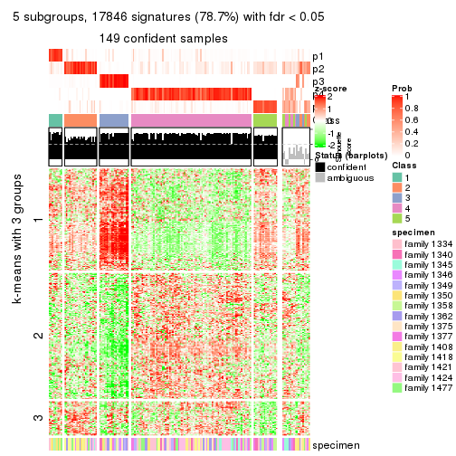</p>

</div>
<div id='tab-ATC-mclust-get-signatures-5'>
<pre><code class="r">get_signatures(res, k = 6)
</code></pre>

<p></p>

</div>
</div>


Signature heatmaps where rows are not scaled:


<script>
$( function() {
	$( '#tabs-ATC-mclust-get-signatures-no-scale' ).tabs();
} );
</script>
<div id='tabs-ATC-mclust-get-signatures-no-scale'>
<ul>
<li><a href='#tab-ATC-mclust-get-signatures-no-scale-1'>k = 2</a></li>
<li><a href='#tab-ATC-mclust-get-signatures-no-scale-2'>k = 3</a></li>
<li><a href='#tab-ATC-mclust-get-signatures-no-scale-3'>k = 4</a></li>
<li><a href='#tab-ATC-mclust-get-signatures-no-scale-4'>k = 5</a></li>
<li><a href='#tab-ATC-mclust-get-signatures-no-scale-5'>k = 6</a></li>
</ul>
<div id='tab-ATC-mclust-get-signatures-no-scale-1'>
<pre><code class="r">get_signatures(res, k = 2, scale_rows = FALSE)
</code></pre>

<p></p>

</div>
<div id='tab-ATC-mclust-get-signatures-no-scale-2'>
<pre><code class="r">get_signatures(res, k = 3, scale_rows = FALSE)
</code></pre>

<p></p>

</div>
<div id='tab-ATC-mclust-get-signatures-no-scale-3'>
<pre><code class="r">get_signatures(res, k = 4, scale_rows = FALSE)
</code></pre>

<p></p>

</div>
<div id='tab-ATC-mclust-get-signatures-no-scale-4'>
<pre><code class="r">get_signatures(res, k = 5, scale_rows = FALSE)
</code></pre>

<p></p>

</div>
<div id='tab-ATC-mclust-get-signatures-no-scale-5'>
<pre><code class="r">get_signatures(res, k = 6, scale_rows = FALSE)
</code></pre>

<p></p>

</div>
</div>


Compare the overlap of signatures from different k:

```r
compare_signatures(res)
```


`get_signature()` returns a data frame invisibly. TO get the list of signatures, the function
call should be assigned to a variable explicitly. In following code, if `plot` argument is set
to `FALSE`, no heatmap is plotted while only the differential analysis is performed.

```r
# code only for demonstration
tb = get_signature(res, k = ..., plot = FALSE)
```

An example of the output of `tb` is:

```
#>   which_row         fdr    mean_1    mean_2 scaled_mean_1 scaled_mean_2 km
#> 1        38 0.042760348  8.373488  9.131774    -0.5533452     0.5164555  1
#> 2        40 0.018707592  7.106213  8.469186    -0.6173731     0.5762149  1
#> 3        55 0.019134737 10.221463 11.207825    -0.6159697     0.5749050  1
#> 4        59 0.006059896  5.921854  7.869574    -0.6899429     0.6439467  1
#> 5        60 0.018055526  8.928898 10.211722    -0.6204761     0.5791110  1
#> 6        98 0.009384629 15.714769 14.887706     0.6635654    -0.6193277  2
...
```

The columns in `tb` are:

1. `which_row`: row indices corresponding to the input matrix.
2. `fdr`: FDR for the differential test. 
3. `mean_x`: The mean value in group x.
4. `scaled_mean_x`: The mean value in group x after rows are scaled.
5. `km`: Row groups if k-means clustering is applied to rows.


UMAP plot which shows how samples are separated.


<script>
$( function() {
	$( '#tabs-ATC-mclust-dimension-reduction' ).tabs();
} );
</script>
<div id='tabs-ATC-mclust-dimension-reduction'>
<ul>
<li><a href='#tab-ATC-mclust-dimension-reduction-1'>k = 2</a></li>
<li><a href='#tab-ATC-mclust-dimension-reduction-2'>k = 3</a></li>
<li><a href='#tab-ATC-mclust-dimension-reduction-3'>k = 4</a></li>
<li><a href='#tab-ATC-mclust-dimension-reduction-4'>k = 5</a></li>
<li><a href='#tab-ATC-mclust-dimension-reduction-5'>k = 6</a></li>
</ul>
<div id='tab-ATC-mclust-dimension-reduction-1'>
<pre><code class="r">dimension_reduction(res, k = 2, method = &quot;UMAP&quot;)
</code></pre>

<p></p>

</div>
<div id='tab-ATC-mclust-dimension-reduction-2'>
<pre><code class="r">dimension_reduction(res, k = 3, method = &quot;UMAP&quot;)
</code></pre>

<p></p>

</div>
<div id='tab-ATC-mclust-dimension-reduction-3'>
<pre><code class="r">dimension_reduction(res, k = 4, method = &quot;UMAP&quot;)
</code></pre>

<p></p>

</div>
<div id='tab-ATC-mclust-dimension-reduction-4'>
<pre><code class="r">dimension_reduction(res, k = 5, method = &quot;UMAP&quot;)
</code></pre>

<p>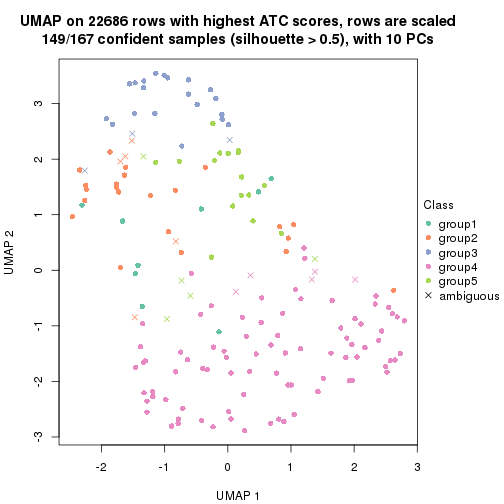</p>

</div>
<div id='tab-ATC-mclust-dimension-reduction-5'>
<pre><code class="r">dimension_reduction(res, k = 6, method = &quot;UMAP&quot;)
</code></pre>

<p></p>

</div>
</div>


Following heatmap shows how subgroups are split when increasing `k`:

```r
collect_classes(res)
```


Test correlation between subgroups and known annotations. If the known
annotation is numeric, one-way ANOVA test is applied, and if the known
annotation is discrete, chi-squared contingency table test is applied.

```r
test_to_known_factors(res)
```

```
#>              n specimen(p) k
#> ATC:mclust 160     0.14964 2
#> ATC:mclust 159     0.08272 3
#> ATC:mclust 145     0.06441 4
#> ATC:mclust 149     0.00313 5
#> ATC:mclust 139     0.00520 6
```


If matrix rows can be associated to genes, consider to use `GO_Enrichment(res,
...)` to perform function enrichment for the signature genes.


 

---------------------------------------------------


### ATC:NMF


The object with results only for a single top-value method and a single partition method 
can be extracted as:

```r
res = res_list["ATC", "NMF"]
# you can also extract it by
# res = res_list["ATC:NMF"]
```

A summary of `res` and all the functions that can be applied to it:

```r
res
```

```
#> A 'ConsensusPartition' object with k = 2, 3, 4, 5, 6.
#>   On a matrix with 22686 rows and 167 columns.
#>   Top rows (1000, 2000, 3000, 4000, 5000) are extracted by 'ATC' method.
#>   Subgroups are detected by 'NMF' method.
#>   Performed in total 1250 partitions by row resampling.
#>   Best k for subgroups seems to be 2.
#> 
#> Following methods can be applied to this 'ConsensusPartition' object:
#>  [1] "cola_report"             "collect_classes"         "collect_plots"          
#>  [4] "collect_stats"           "colnames"                "compare_signatures"     
#>  [7] "consensus_heatmap"       "dimension_reduction"     "functional_enrichment"  
#> [10] "get_anno_col"            "get_anno"                "get_classes"            
#> [13] "get_consensus"           "get_matrix"              "get_membership"         
#> [16] "get_param"               "get_signatures"          "get_stats"              
#> [19] "is_best_k"               "is_stable_k"             "membership_heatmap"     
#> [22] "ncol"                    "nrow"                    "plot_ecdf"              
#> [25] "rownames"                "select_partition_number" "show"                   
#> [28] "suggest_best_k"          "test_to_known_factors"
```

`collect_plots()` function collects all the plots made from `res` for all `k` (number of partitions)
into one single page to provide an easy and fast comparison between different `k`.

```r
collect_plots(res)
```


The plots are:

- The first row: a plot of the ECDF (Empirical cumulative distribution
  function) curves of the consensus matrix for each `k` and the heatmap of
  predicted classes for each `k`.
- The second row: heatmaps of the consensus matrix for each `k`.
- The third row: heatmaps of the membership matrix for each `k`.
- The fouth row: heatmaps of the signatures for each `k`.

All the plots in panels can be made by individual functions and they are
plotted later in this section.

`select_partition_number()` produces several plots showing different
statistics for choosing "optimized" `k`. There are following statistics:

- ECDF curves of the consensus matrix for each `k`;
- 1-PAC. [The PAC
  score](https://en.wikipedia.org/wiki/Consensus_clustering#Over-interpretation_potential_of_consensus_clustering)
  measures the proportion of the ambiguous subgrouping.
- Mean silhouette score.
- Concordance. The mean probability of fiting the consensus class ids in all
  partitions.
- Area increased. Denote $A_k$ as the area under the ECDF curve for current
  `k`, the area increased is defined as $A_k - A_{k-1}$.
- Rand index. The percent of pairs of samples that are both in a same cluster
  or both are not in a same cluster in the partition of k and k-1.
- Jaccard index. The ratio of pairs of samples are both in a same cluster in
  the partition of k and k-1 and the pairs of samples are both in a same
  cluster in the partition k or k-1.

The detailed explanations of these statistics can be found in [the cola
vignette](http://bioconductor.org/packages/devel/bioc/vignettes/cola/inst/doc/cola.html#toc_13).

Generally speaking, lower PAC score, higher mean silhouette score or higher
concordance corresponds to better partition. Rand index and Jaccard index
measure how similar the current partition is compared to partition with `k-1`.
If they are too similar, we won't accept `k` is better than `k-1`.

```r
select_partition_number(res)
```


The numeric values for all these statistics can be obtained by `get_stats()`.

```r
get_stats(res)
```

```
#>   k 1-PAC mean_silhouette concordance area_increased  Rand Jaccard
#> 2 2 0.666           0.832       0.926         0.4600 0.519   0.519
#> 3 3 0.450           0.659       0.787         0.3044 0.796   0.640
#> 4 4 0.428           0.576       0.762         0.1651 0.838   0.639
#> 5 5 0.470           0.445       0.701         0.0869 0.841   0.560
#> 6 6 0.490           0.410       0.666         0.0404 0.942   0.774
```

`suggest_best_k()` suggests the best $k$ based on these statistics. The rules are as follows:

- All $k$ with Jaccard index larger than 0.95 are removed because the increase of
  the partition number does not provides enough extra information. If all $k$ are removed,
  the best $k$ is assigned by `NA`.
- For $k$ with 1-PAC larger than 0.9, the maximal $k$ is taken as the "best k". Other $k$ is called "optional k".
- If it does not fit the second rule. The $k$ with the highest vote of highest
  1-PAC, mean silhouette and concordance is taken as the "best k".

```r
suggest_best_k(res)
```

```
#> [1] 2
```


Following shows the table of the partitions (You need to click the **show/hide
code output** link to see it). The membership matrix (columns with name `p*`)
is inferred by
[`clue::cl_consensus()`](https://www.rdocumentation.org/link/cl_consensus?package=clue)
function with the `SE` method. Basically the value in the membership matrix
represents the probability to belong to a certain group. The finall class
label for an item is determined with the group with highest probability it
belongs to.

In `get_classes()` function, the entropy is calculated from the membership
matrix and the silhouette score is calculated from the consensus matrix.


<script>
$( function() {
	$( '#tabs-ATC-NMF-get-classes' ).tabs();
} );
</script>
<div id='tabs-ATC-NMF-get-classes'>
<ul>
<li><a href='#tab-ATC-NMF-get-classes-1'>k = 2</a></li>
<li><a href='#tab-ATC-NMF-get-classes-2'>k = 3</a></li>
<li><a href='#tab-ATC-NMF-get-classes-3'>k = 4</a></li>
<li><a href='#tab-ATC-NMF-get-classes-4'>k = 5</a></li>
<li><a href='#tab-ATC-NMF-get-classes-5'>k = 6</a></li>
</ul>

<div id='tab-ATC-NMF-get-classes-1'>
<p><a id='tab-ATC-NMF-get-classes-1-a' style='color:#0366d6' href='#'>show/hide code output</a></p>
<pre><code class="r">cbind(get_classes(res, k = 2), get_membership(res, k = 2))
</code></pre>

<pre><code>#&gt;          class entropy silhouette    p1    p2
#&gt; GSM30006     2  0.0000      0.939 0.000 1.000
#&gt; GSM30007     1  0.9970      0.258 0.532 0.468
#&gt; GSM30008     1  0.7219      0.778 0.800 0.200
#&gt; GSM30009     1  0.1633      0.871 0.976 0.024
#&gt; GSM30010     2  0.0000      0.939 0.000 1.000
#&gt; GSM30011     2  0.0000      0.939 0.000 1.000
#&gt; GSM30012     2  0.0000      0.939 0.000 1.000
#&gt; GSM30013     2  0.0376      0.936 0.004 0.996
#&gt; GSM30014     2  0.0000      0.939 0.000 1.000
#&gt; GSM30015     1  0.8207      0.717 0.744 0.256
#&gt; GSM30016     2  0.0000      0.939 0.000 1.000
#&gt; GSM30017     1  0.0000      0.875 1.000 0.000
#&gt; GSM30018     1  0.0000      0.875 1.000 0.000
#&gt; GSM30019     2  0.0000      0.939 0.000 1.000
#&gt; GSM30020     1  0.8861      0.648 0.696 0.304
#&gt; GSM30021     2  0.0000      0.939 0.000 1.000
#&gt; GSM30022     1  0.0000      0.875 1.000 0.000
#&gt; GSM30023     2  0.7376      0.692 0.208 0.792
#&gt; GSM30024     2  0.0000      0.939 0.000 1.000
#&gt; GSM30025     2  0.2043      0.911 0.032 0.968
#&gt; GSM30026     1  0.0000      0.875 1.000 0.000
#&gt; GSM30027     2  0.0000      0.939 0.000 1.000
#&gt; GSM30028     2  0.9635      0.287 0.388 0.612
#&gt; GSM30029     1  0.0000      0.875 1.000 0.000
#&gt; GSM30030     1  0.0000      0.875 1.000 0.000
#&gt; GSM30031     1  0.1184      0.873 0.984 0.016
#&gt; GSM30032     2  0.0000      0.939 0.000 1.000
#&gt; GSM30033     2  0.0000      0.939 0.000 1.000
#&gt; GSM30034     1  0.0938      0.873 0.988 0.012
#&gt; GSM30035     2  0.0000      0.939 0.000 1.000
#&gt; GSM30036     2  0.9170      0.442 0.332 0.668
#&gt; GSM30037     2  0.0000      0.939 0.000 1.000
#&gt; GSM30038     2  0.0000      0.939 0.000 1.000
#&gt; GSM30039     2  0.0000      0.939 0.000 1.000
#&gt; GSM30040     2  0.0000      0.939 0.000 1.000
#&gt; GSM30041     2  0.0000      0.939 0.000 1.000
#&gt; GSM30042     2  0.0000      0.939 0.000 1.000
#&gt; GSM30043     2  0.0000      0.939 0.000 1.000
#&gt; GSM30044     1  0.0000      0.875 1.000 0.000
#&gt; GSM30045     1  0.7602      0.758 0.780 0.220
#&gt; GSM30046     1  0.0000      0.875 1.000 0.000
#&gt; GSM30047     2  0.6712      0.741 0.176 0.824
#&gt; GSM30048     1  0.0000      0.875 1.000 0.000
#&gt; GSM30049     2  0.0000      0.939 0.000 1.000
#&gt; GSM30050     2  0.2423      0.904 0.040 0.960
#&gt; GSM30051     2  0.0000      0.939 0.000 1.000
#&gt; GSM30052     1  0.1843      0.869 0.972 0.028
#&gt; GSM30053     2  0.0000      0.939 0.000 1.000
#&gt; GSM30054     2  0.0000      0.939 0.000 1.000
#&gt; GSM30055     2  0.0000      0.939 0.000 1.000
#&gt; GSM30056     2  0.0000      0.939 0.000 1.000
#&gt; GSM30057     2  0.0000      0.939 0.000 1.000
#&gt; GSM30058     2  0.0000      0.939 0.000 1.000
#&gt; GSM30059     1  0.9732      0.451 0.596 0.404
#&gt; GSM30060     2  0.0000      0.939 0.000 1.000
#&gt; GSM30061     2  0.0376      0.936 0.004 0.996
#&gt; GSM30062     2  0.7883      0.645 0.236 0.764
#&gt; GSM30063     2  0.0000      0.939 0.000 1.000
#&gt; GSM30064     1  0.3733      0.852 0.928 0.072
#&gt; GSM30065     2  0.0000      0.939 0.000 1.000
#&gt; GSM30066     2  0.0000      0.939 0.000 1.000
#&gt; GSM30067     1  0.7219      0.778 0.800 0.200
#&gt; GSM30068     2  0.0000      0.939 0.000 1.000
#&gt; GSM30069     2  0.0000      0.939 0.000 1.000
#&gt; GSM30070     2  0.0000      0.939 0.000 1.000
#&gt; GSM30071     2  0.0000      0.939 0.000 1.000
#&gt; GSM30072     2  0.9754      0.221 0.408 0.592
#&gt; GSM30073     2  0.0000      0.939 0.000 1.000
#&gt; GSM30074     2  0.0000      0.939 0.000 1.000
#&gt; GSM30075     2  0.0000      0.939 0.000 1.000
#&gt; GSM30076     1  0.9754      0.441 0.592 0.408
#&gt; GSM30077     1  0.7219      0.778 0.800 0.200
#&gt; GSM30078     1  0.8207      0.717 0.744 0.256
#&gt; GSM30079     1  0.0000      0.875 1.000 0.000
#&gt; GSM30080     2  0.0000      0.939 0.000 1.000
#&gt; GSM30081     2  0.0000      0.939 0.000 1.000
#&gt; GSM30086     2  0.0000      0.939 0.000 1.000
#&gt; GSM30087     1  0.0000      0.875 1.000 0.000
#&gt; GSM30088     1  0.0000      0.875 1.000 0.000
#&gt; GSM30089     2  0.0000      0.939 0.000 1.000
#&gt; GSM30090     2  0.0000      0.939 0.000 1.000
#&gt; GSM30091     2  0.0000      0.939 0.000 1.000
#&gt; GSM30092     2  0.8499      0.569 0.276 0.724
#&gt; GSM30093     2  0.0000      0.939 0.000 1.000
#&gt; GSM30094     2  0.0000      0.939 0.000 1.000
#&gt; GSM30095     2  0.0000      0.939 0.000 1.000
#&gt; GSM30096     1  0.7219      0.778 0.800 0.200
#&gt; GSM30097     1  0.0000      0.875 1.000 0.000
#&gt; GSM30098     1  0.0000      0.875 1.000 0.000
#&gt; GSM30099     2  0.0000      0.939 0.000 1.000
#&gt; GSM30100     2  0.0000      0.939 0.000 1.000
#&gt; GSM30101     2  0.0000      0.939 0.000 1.000
#&gt; GSM30102     2  0.0000      0.939 0.000 1.000
#&gt; GSM30103     2  0.0000      0.939 0.000 1.000
#&gt; GSM30104     2  0.0376      0.936 0.004 0.996
#&gt; GSM30105     1  0.1184      0.873 0.984 0.016
#&gt; GSM30106     1  0.7219      0.778 0.800 0.200
#&gt; GSM30107     2  0.9754      0.221 0.408 0.592
#&gt; GSM30108     2  0.0000      0.939 0.000 1.000
#&gt; GSM30109     1  0.0000      0.875 1.000 0.000
#&gt; GSM30110     1  0.0000      0.875 1.000 0.000
#&gt; GSM30111     2  0.9635      0.287 0.388 0.612
#&gt; GSM30112     2  0.3733      0.872 0.072 0.928
#&gt; GSM30113     2  0.0000      0.939 0.000 1.000
#&gt; GSM30114     2  0.0000      0.939 0.000 1.000
#&gt; GSM30115     2  0.9710      0.248 0.400 0.600
#&gt; GSM30116     2  0.0000      0.939 0.000 1.000
#&gt; GSM30117     2  0.0000      0.939 0.000 1.000
#&gt; GSM30118     2  0.0000      0.939 0.000 1.000
#&gt; GSM30119     2  0.0000      0.939 0.000 1.000
#&gt; GSM30120     2  0.3879      0.867 0.076 0.924
#&gt; GSM30121     1  0.2043      0.868 0.968 0.032
#&gt; GSM30122     1  0.9686      0.471 0.604 0.396
#&gt; GSM30123     2  0.0000      0.939 0.000 1.000
#&gt; GSM30177     2  0.0000      0.939 0.000 1.000
#&gt; GSM30178     2  0.9710      0.248 0.400 0.600
#&gt; GSM30179     1  0.8813      0.654 0.700 0.300
#&gt; GSM30180     2  0.9686      0.261 0.396 0.604
#&gt; GSM30181     2  0.0000      0.939 0.000 1.000
#&gt; GSM30182     1  0.0000      0.875 1.000 0.000
#&gt; GSM30183     1  0.0000      0.875 1.000 0.000
#&gt; GSM30184     2  0.0000      0.939 0.000 1.000
#&gt; GSM30185     2  0.0000      0.939 0.000 1.000
#&gt; GSM30186     2  0.0000      0.939 0.000 1.000
#&gt; GSM30187     1  0.7139      0.781 0.804 0.196
#&gt; GSM30188     1  0.0000      0.875 1.000 0.000
#&gt; GSM30189     1  0.6973      0.787 0.812 0.188
#&gt; GSM30190     2  0.0000      0.939 0.000 1.000
#&gt; GSM30191     2  0.0000      0.939 0.000 1.000
#&gt; GSM30192     2  0.0000      0.939 0.000 1.000
#&gt; GSM30193     1  0.9710      0.461 0.600 0.400
#&gt; GSM30194     2  0.0000      0.939 0.000 1.000
#&gt; GSM30195     2  0.0672      0.932 0.008 0.992
#&gt; GSM30196     1  0.0000      0.875 1.000 0.000
#&gt; GSM30197     1  0.4298      0.844 0.912 0.088
#&gt; GSM30198     1  0.0000      0.875 1.000 0.000
#&gt; GSM30199     2  0.0000      0.939 0.000 1.000
#&gt; GSM30200     1  0.0000      0.875 1.000 0.000
#&gt; GSM30201     1  0.0000      0.875 1.000 0.000
#&gt; GSM30202     1  0.9635      0.489 0.612 0.388
#&gt; GSM30203     2  0.9866      0.131 0.432 0.568
#&gt; GSM30204     1  0.7139      0.781 0.804 0.196
#&gt; GSM30205     2  0.0000      0.939 0.000 1.000
#&gt; GSM30206     1  0.0000      0.875 1.000 0.000
#&gt; GSM30207     1  0.9710      0.461 0.600 0.400
#&gt; GSM30208     1  0.0672      0.874 0.992 0.008
#&gt; GSM30209     2  0.0000      0.939 0.000 1.000
#&gt; GSM30210     1  0.0000      0.875 1.000 0.000
#&gt; GSM30211     1  0.0000      0.875 1.000 0.000
#&gt; GSM30212     1  0.0000      0.875 1.000 0.000
#&gt; GSM30213     1  0.7950      0.736 0.760 0.240
#&gt; GSM30214     2  0.8386      0.585 0.268 0.732
#&gt; GSM30215     1  0.7219      0.778 0.800 0.200
#&gt; GSM30216     1  0.1633      0.871 0.976 0.024
#&gt; GSM30217     1  0.9710      0.461 0.600 0.400
#&gt; GSM30218     2  0.0000      0.939 0.000 1.000
#&gt; GSM30219     2  0.0000      0.939 0.000 1.000
#&gt; GSM30220     1  0.0000      0.875 1.000 0.000
#&gt; GSM30221     1  0.8555      0.684 0.720 0.280
#&gt; GSM30222     2  0.5059      0.826 0.112 0.888
#&gt; GSM30223     1  0.0000      0.875 1.000 0.000
#&gt; GSM30224     1  0.0000      0.875 1.000 0.000
#&gt; GSM30225     1  0.0000      0.875 1.000 0.000
#&gt; GSM30226     2  0.0000      0.939 0.000 1.000
#&gt; GSM30227     1  0.0000      0.875 1.000 0.000
#&gt; GSM30228     2  0.0000      0.939 0.000 1.000
#&gt; GSM30229     2  0.0000      0.939 0.000 1.000
</code></pre>

<script>
$('#tab-ATC-NMF-get-classes-1-a').parent().next().next().hide();
$('#tab-ATC-NMF-get-classes-1-a').click(function(){
  $('#tab-ATC-NMF-get-classes-1-a').parent().next().next().toggle();
  return(false);
});
</script>
</div>

<div id='tab-ATC-NMF-get-classes-2'>
<p><a id='tab-ATC-NMF-get-classes-2-a' style='color:#0366d6' href='#'>show/hide code output</a></p>
<pre><code class="r">cbind(get_classes(res, k = 3), get_membership(res, k = 3))
</code></pre>

<pre><code>#&gt;          class entropy silhouette    p1    p2    p3
#&gt; GSM30006     2  0.4654     0.7486 0.000 0.792 0.208
#&gt; GSM30007     1  0.6895     0.6502 0.708 0.228 0.064
#&gt; GSM30008     1  0.4784     0.7033 0.796 0.200 0.004
#&gt; GSM30009     1  0.0747     0.8202 0.984 0.000 0.016
#&gt; GSM30010     2  0.4750     0.7467 0.000 0.784 0.216
#&gt; GSM30011     2  0.4654     0.7486 0.000 0.792 0.208
#&gt; GSM30012     2  0.0237     0.6875 0.000 0.996 0.004
#&gt; GSM30013     2  0.2063     0.6471 0.044 0.948 0.008
#&gt; GSM30014     2  0.4654     0.7486 0.000 0.792 0.208
#&gt; GSM30015     1  0.5958     0.6314 0.692 0.300 0.008
#&gt; GSM30016     2  0.2165     0.7167 0.000 0.936 0.064
#&gt; GSM30017     1  0.0237     0.8223 0.996 0.000 0.004
#&gt; GSM30018     1  0.0237     0.8226 0.996 0.000 0.004
#&gt; GSM30019     2  0.4654     0.7486 0.000 0.792 0.208
#&gt; GSM30020     2  0.6540    -0.0142 0.408 0.584 0.008
#&gt; GSM30021     2  0.0424     0.6899 0.000 0.992 0.008
#&gt; GSM30022     1  0.1031     0.8187 0.976 0.000 0.024
#&gt; GSM30023     2  0.3295     0.5968 0.096 0.896 0.008
#&gt; GSM30024     2  0.4654     0.7486 0.000 0.792 0.208
#&gt; GSM30025     3  0.1636     0.7524 0.020 0.016 0.964
#&gt; GSM30026     1  0.0424     0.8219 0.992 0.000 0.008
#&gt; GSM30027     2  0.1860     0.7099 0.000 0.948 0.052
#&gt; GSM30028     2  0.4473     0.5158 0.164 0.828 0.008
#&gt; GSM30029     1  0.0592     0.8212 0.988 0.000 0.012
#&gt; GSM30030     1  0.1860     0.8085 0.948 0.000 0.052
#&gt; GSM30031     1  0.0661     0.8232 0.988 0.008 0.004
#&gt; GSM30032     3  0.6008     0.2199 0.000 0.372 0.628
#&gt; GSM30033     2  0.4702     0.7481 0.000 0.788 0.212
#&gt; GSM30034     1  0.3267     0.7750 0.884 0.000 0.116
#&gt; GSM30035     2  0.6299     0.3099 0.000 0.524 0.476
#&gt; GSM30036     2  0.8066     0.2752 0.404 0.528 0.068
#&gt; GSM30037     2  0.4702     0.7481 0.000 0.788 0.212
#&gt; GSM30038     2  0.0000     0.6849 0.000 1.000 0.000
#&gt; GSM30039     2  0.3192     0.7336 0.000 0.888 0.112
#&gt; GSM30040     2  0.4842     0.7425 0.000 0.776 0.224
#&gt; GSM30041     2  0.4702     0.7481 0.000 0.788 0.212
#&gt; GSM30042     2  0.3752     0.7414 0.000 0.856 0.144
#&gt; GSM30043     2  0.5098     0.7222 0.000 0.752 0.248
#&gt; GSM30044     1  0.0237     0.8223 0.996 0.000 0.004
#&gt; GSM30045     2  0.6678    -0.2829 0.480 0.512 0.008
#&gt; GSM30046     1  0.0424     0.8222 0.992 0.000 0.008
#&gt; GSM30047     2  0.4293     0.5922 0.164 0.832 0.004
#&gt; GSM30048     1  0.0000     0.8226 1.000 0.000 0.000
#&gt; GSM30049     2  0.4750     0.7467 0.000 0.784 0.216
#&gt; GSM30050     2  0.2280     0.6410 0.052 0.940 0.008
#&gt; GSM30051     2  0.4702     0.7481 0.000 0.788 0.212
#&gt; GSM30052     1  0.1163     0.8166 0.972 0.000 0.028
#&gt; GSM30053     2  0.3267     0.7343 0.000 0.884 0.116
#&gt; GSM30054     2  0.5859     0.6134 0.000 0.656 0.344
#&gt; GSM30055     2  0.3192     0.7303 0.000 0.888 0.112
#&gt; GSM30056     2  0.5810     0.6274 0.000 0.664 0.336
#&gt; GSM30057     2  0.4750     0.7467 0.000 0.784 0.216
#&gt; GSM30058     2  0.6204     0.4210 0.000 0.576 0.424
#&gt; GSM30059     3  0.4605     0.4640 0.204 0.000 0.796
#&gt; GSM30060     3  0.5650     0.5405 0.000 0.312 0.688
#&gt; GSM30061     3  0.5216     0.6413 0.000 0.260 0.740
#&gt; GSM30062     2  0.7794     0.3599 0.368 0.572 0.060
#&gt; GSM30063     3  0.3816     0.7495 0.000 0.148 0.852
#&gt; GSM30064     1  0.5397     0.6575 0.720 0.280 0.000
#&gt; GSM30065     2  0.0000     0.6849 0.000 1.000 0.000
#&gt; GSM30066     2  0.4750     0.7467 0.000 0.784 0.216
#&gt; GSM30067     1  0.4110     0.7464 0.844 0.152 0.004
#&gt; GSM30068     2  0.4702     0.7481 0.000 0.788 0.212
#&gt; GSM30069     2  0.1289     0.7023 0.000 0.968 0.032
#&gt; GSM30070     2  0.0000     0.6849 0.000 1.000 0.000
#&gt; GSM30071     2  0.0661     0.6769 0.004 0.988 0.008
#&gt; GSM30072     2  0.6954     0.0347 0.484 0.500 0.016
#&gt; GSM30073     3  0.6276     0.6889 0.040 0.224 0.736
#&gt; GSM30074     2  0.0000     0.6849 0.000 1.000 0.000
#&gt; GSM30075     3  0.3267     0.7623 0.000 0.116 0.884
#&gt; GSM30076     2  0.6498     0.0421 0.396 0.596 0.008
#&gt; GSM30077     1  0.6617     0.4685 0.556 0.436 0.008
#&gt; GSM30078     1  0.4912     0.7044 0.796 0.196 0.008
#&gt; GSM30079     1  0.0237     0.8223 0.996 0.000 0.004
#&gt; GSM30080     2  0.0661     0.6769 0.004 0.988 0.008
#&gt; GSM30081     2  0.4750     0.7467 0.000 0.784 0.216
#&gt; GSM30086     2  0.0000     0.6849 0.000 1.000 0.000
#&gt; GSM30087     1  0.0475     0.8230 0.992 0.004 0.004
#&gt; GSM30088     1  0.0237     0.8223 0.996 0.000 0.004
#&gt; GSM30089     2  0.2796     0.7259 0.000 0.908 0.092
#&gt; GSM30090     2  0.4702     0.7481 0.000 0.788 0.212
#&gt; GSM30091     2  0.4796     0.7450 0.000 0.780 0.220
#&gt; GSM30092     2  0.5988     0.3977 0.304 0.688 0.008
#&gt; GSM30093     2  0.4702     0.7481 0.000 0.788 0.212
#&gt; GSM30094     2  0.5363     0.7002 0.000 0.724 0.276
#&gt; GSM30095     2  0.4887     0.7406 0.000 0.772 0.228
#&gt; GSM30096     1  0.5431     0.6700 0.716 0.000 0.284
#&gt; GSM30097     1  0.3482     0.7690 0.872 0.000 0.128
#&gt; GSM30098     1  0.3116     0.7806 0.892 0.000 0.108
#&gt; GSM30099     3  0.2537     0.7657 0.000 0.080 0.920
#&gt; GSM30100     2  0.4842     0.7425 0.000 0.776 0.224
#&gt; GSM30101     2  0.4842     0.7418 0.000 0.776 0.224
#&gt; GSM30102     2  0.4887     0.7422 0.000 0.772 0.228
#&gt; GSM30103     2  0.5882     0.6338 0.000 0.652 0.348
#&gt; GSM30104     2  0.7346     0.5544 0.040 0.592 0.368
#&gt; GSM30105     1  0.4062     0.7494 0.836 0.000 0.164
#&gt; GSM30106     2  0.6467     0.0375 0.388 0.604 0.008
#&gt; GSM30107     1  0.7389     0.3787 0.556 0.036 0.408
#&gt; GSM30108     2  0.0237     0.6873 0.000 0.996 0.004
#&gt; GSM30109     1  0.0237     0.8226 0.996 0.000 0.004
#&gt; GSM30110     1  0.3896     0.7537 0.864 0.128 0.008
#&gt; GSM30111     1  0.7940     0.1418 0.524 0.416 0.060
#&gt; GSM30112     2  0.6835     0.6409 0.088 0.732 0.180
#&gt; GSM30113     2  0.5591     0.6615 0.000 0.696 0.304
#&gt; GSM30114     2  0.0661     0.6769 0.004 0.988 0.008
#&gt; GSM30115     2  0.4861     0.4814 0.192 0.800 0.008
#&gt; GSM30116     2  0.5760     0.6402 0.000 0.672 0.328
#&gt; GSM30117     2  0.6192     0.4795 0.000 0.580 0.420
#&gt; GSM30118     3  0.5327     0.6299 0.000 0.272 0.728
#&gt; GSM30119     2  0.4702     0.7481 0.000 0.788 0.212
#&gt; GSM30120     2  0.2584     0.6288 0.064 0.928 0.008
#&gt; GSM30121     1  0.6553     0.5146 0.580 0.412 0.008
#&gt; GSM30122     1  0.7677     0.6661 0.676 0.120 0.204
#&gt; GSM30123     2  0.6079     0.5298 0.000 0.612 0.388
#&gt; GSM30177     2  0.5810     0.6318 0.000 0.664 0.336
#&gt; GSM30178     1  0.7164     0.1253 0.524 0.452 0.024
#&gt; GSM30179     1  0.5244     0.6752 0.756 0.240 0.004
#&gt; GSM30180     1  0.8460     0.4741 0.608 0.244 0.148
#&gt; GSM30181     3  0.5529     0.5909 0.000 0.296 0.704
#&gt; GSM30182     1  0.6553     0.5146 0.580 0.412 0.008
#&gt; GSM30183     1  0.6379     0.5645 0.624 0.368 0.008
#&gt; GSM30184     2  0.4702     0.7481 0.000 0.788 0.212
#&gt; GSM30185     2  0.4750     0.7470 0.000 0.784 0.216
#&gt; GSM30186     2  0.5785     0.6381 0.000 0.668 0.332
#&gt; GSM30187     1  0.3695     0.7773 0.880 0.108 0.012
#&gt; GSM30188     1  0.0424     0.8222 0.992 0.000 0.008
#&gt; GSM30189     1  0.4796     0.7257 0.780 0.000 0.220
#&gt; GSM30190     2  0.4796     0.7450 0.000 0.780 0.220
#&gt; GSM30191     2  0.5158     0.7407 0.004 0.764 0.232
#&gt; GSM30192     2  0.4555     0.7077 0.000 0.800 0.200
#&gt; GSM30193     2  0.6664    -0.1791 0.464 0.528 0.008
#&gt; GSM30194     2  0.4887     0.7406 0.000 0.772 0.228
#&gt; GSM30195     2  0.1950     0.6505 0.040 0.952 0.008
#&gt; GSM30196     1  0.0475     0.8226 0.992 0.004 0.004
#&gt; GSM30197     1  0.2173     0.8094 0.944 0.048 0.008
#&gt; GSM30198     1  0.0424     0.8222 0.992 0.000 0.008
#&gt; GSM30199     3  0.1031     0.7596 0.000 0.024 0.976
#&gt; GSM30200     1  0.0424     0.8222 0.992 0.000 0.008
#&gt; GSM30201     1  0.0424     0.8219 0.992 0.000 0.008
#&gt; GSM30202     1  0.4605     0.7255 0.796 0.000 0.204
#&gt; GSM30203     3  0.4452     0.5175 0.192 0.000 0.808
#&gt; GSM30204     1  0.0983     0.8227 0.980 0.004 0.016
#&gt; GSM30205     2  0.4974     0.7330 0.000 0.764 0.236
#&gt; GSM30206     1  0.3682     0.7685 0.876 0.116 0.008
#&gt; GSM30207     1  0.6777     0.5551 0.616 0.020 0.364
#&gt; GSM30208     1  0.2537     0.7968 0.920 0.000 0.080
#&gt; GSM30209     3  0.4796     0.6825 0.000 0.220 0.780
#&gt; GSM30210     1  0.3038     0.7817 0.896 0.000 0.104
#&gt; GSM30211     1  0.0237     0.8223 0.996 0.000 0.004
#&gt; GSM30212     1  0.3482     0.7666 0.872 0.000 0.128
#&gt; GSM30213     1  0.5397     0.6740 0.720 0.000 0.280
#&gt; GSM30214     3  0.3644     0.6432 0.124 0.004 0.872
#&gt; GSM30215     1  0.5968     0.5690 0.636 0.000 0.364
#&gt; GSM30216     1  0.6672     0.3847 0.520 0.472 0.008
#&gt; GSM30217     1  0.7851     0.5352 0.616 0.304 0.080
#&gt; GSM30218     3  0.0424     0.7526 0.000 0.008 0.992
#&gt; GSM30219     2  0.5733     0.6391 0.000 0.676 0.324
#&gt; GSM30220     1  0.2356     0.7984 0.928 0.000 0.072
#&gt; GSM30221     1  0.4413     0.7398 0.832 0.160 0.008
#&gt; GSM30222     3  0.7930     0.6527 0.172 0.164 0.664
#&gt; GSM30223     1  0.0237     0.8226 0.996 0.000 0.004
#&gt; GSM30224     1  0.0237     0.8226 0.996 0.000 0.004
#&gt; GSM30225     1  0.0424     0.8222 0.992 0.000 0.008
#&gt; GSM30226     3  0.1031     0.7592 0.000 0.024 0.976
#&gt; GSM30227     1  0.0237     0.8226 0.996 0.000 0.004
#&gt; GSM30228     2  0.4750     0.7467 0.000 0.784 0.216
#&gt; GSM30229     3  0.3482     0.7593 0.000 0.128 0.872
</code></pre>

<script>
$('#tab-ATC-NMF-get-classes-2-a').parent().next().next().hide();
$('#tab-ATC-NMF-get-classes-2-a').click(function(){
  $('#tab-ATC-NMF-get-classes-2-a').parent().next().next().toggle();
  return(false);
});
</script>
</div>

<div id='tab-ATC-NMF-get-classes-3'>
<p><a id='tab-ATC-NMF-get-classes-3-a' style='color:#0366d6' href='#'>show/hide code output</a></p>
<pre><code class="r">cbind(get_classes(res, k = 4), get_membership(res, k = 4))
</code></pre>

<pre><code>#&gt;          class entropy silhouette    p1    p2    p3    p4
#&gt; GSM30006     2  0.3088     0.7667 0.000 0.864 0.008 0.128
#&gt; GSM30007     1  0.5616     0.5961 0.748 0.112 0.012 0.128
#&gt; GSM30008     1  0.4482     0.6416 0.816 0.092 0.004 0.088
#&gt; GSM30009     1  0.0524     0.7410 0.988 0.000 0.008 0.004
#&gt; GSM30010     2  0.1635     0.7621 0.000 0.948 0.008 0.044
#&gt; GSM30011     2  0.1716     0.7723 0.000 0.936 0.000 0.064
#&gt; GSM30012     2  0.4633     0.7350 0.000 0.780 0.048 0.172
#&gt; GSM30013     2  0.6294     0.3504 0.004 0.512 0.048 0.436
#&gt; GSM30014     2  0.2124     0.7699 0.000 0.932 0.040 0.028
#&gt; GSM30015     1  0.7045    -0.0776 0.456 0.092 0.008 0.444
#&gt; GSM30016     2  0.2844     0.7603 0.000 0.900 0.048 0.052
#&gt; GSM30017     1  0.1256     0.7367 0.964 0.000 0.008 0.028
#&gt; GSM30018     1  0.2831     0.6932 0.876 0.000 0.004 0.120
#&gt; GSM30019     2  0.2799     0.7681 0.000 0.884 0.008 0.108
#&gt; GSM30020     4  0.5159     0.7297 0.156 0.088 0.000 0.756
#&gt; GSM30021     2  0.4589     0.7376 0.000 0.784 0.048 0.168
#&gt; GSM30022     1  0.1706     0.7360 0.948 0.000 0.016 0.036
#&gt; GSM30023     2  0.6881     0.6146 0.088 0.672 0.056 0.184
#&gt; GSM30024     2  0.2840     0.7641 0.000 0.900 0.044 0.056
#&gt; GSM30025     3  0.8197     0.4344 0.240 0.284 0.456 0.020
#&gt; GSM30026     1  0.1209     0.7423 0.964 0.000 0.004 0.032
#&gt; GSM30027     2  0.4900     0.7369 0.004 0.768 0.048 0.180
#&gt; GSM30028     4  0.6970     0.2927 0.040 0.332 0.052 0.576
#&gt; GSM30029     1  0.1488     0.7351 0.956 0.000 0.012 0.032
#&gt; GSM30030     1  0.1489     0.7382 0.952 0.000 0.004 0.044
#&gt; GSM30031     1  0.4351     0.6659 0.832 0.100 0.016 0.052
#&gt; GSM30032     2  0.5603     0.6118 0.024 0.744 0.176 0.056
#&gt; GSM30033     2  0.3196     0.7489 0.000 0.856 0.008 0.136
#&gt; GSM30034     1  0.4219     0.6973 0.844 0.056 0.020 0.080
#&gt; GSM30035     2  0.5636     0.2021 0.000 0.552 0.424 0.024
#&gt; GSM30036     2  0.9197    -0.0472 0.240 0.428 0.100 0.232
#&gt; GSM30037     2  0.4020     0.7578 0.020 0.852 0.040 0.088
#&gt; GSM30038     2  0.3716     0.7534 0.000 0.852 0.052 0.096
#&gt; GSM30039     2  0.2949     0.7709 0.000 0.888 0.024 0.088
#&gt; GSM30040     2  0.2021     0.7547 0.000 0.936 0.024 0.040
#&gt; GSM30041     2  0.2198     0.7645 0.000 0.920 0.008 0.072
#&gt; GSM30042     2  0.2300     0.7669 0.000 0.924 0.048 0.028
#&gt; GSM30043     2  0.2494     0.7458 0.000 0.916 0.036 0.048
#&gt; GSM30044     1  0.1796     0.7353 0.948 0.004 0.016 0.032
#&gt; GSM30045     1  0.7537     0.4030 0.624 0.172 0.060 0.144
#&gt; GSM30046     1  0.1256     0.7409 0.964 0.000 0.008 0.028
#&gt; GSM30047     2  0.7044     0.6029 0.164 0.664 0.052 0.120
#&gt; GSM30048     1  0.1256     0.7367 0.964 0.000 0.008 0.028
#&gt; GSM30049     2  0.2450     0.7665 0.000 0.912 0.016 0.072
#&gt; GSM30050     2  0.6374     0.2120 0.008 0.484 0.044 0.464
#&gt; GSM30051     2  0.1256     0.7683 0.000 0.964 0.008 0.028
#&gt; GSM30052     1  0.1739     0.7418 0.952 0.016 0.008 0.024
#&gt; GSM30053     2  0.2965     0.7697 0.000 0.892 0.036 0.072
#&gt; GSM30054     2  0.4174     0.6869 0.000 0.816 0.140 0.044
#&gt; GSM30055     2  0.4174     0.7464 0.000 0.816 0.044 0.140
#&gt; GSM30056     2  0.4853     0.6343 0.000 0.744 0.220 0.036
#&gt; GSM30057     2  0.1109     0.7652 0.000 0.968 0.004 0.028
#&gt; GSM30058     2  0.4964     0.3498 0.000 0.616 0.380 0.004
#&gt; GSM30059     3  0.2342     0.6034 0.080 0.000 0.912 0.008
#&gt; GSM30060     3  0.5636     0.2448 0.000 0.424 0.552 0.024
#&gt; GSM30061     3  0.4420     0.6291 0.000 0.240 0.748 0.012
#&gt; GSM30062     2  0.7084     0.2316 0.340 0.520 0.000 0.140
#&gt; GSM30063     3  0.5614     0.4770 0.000 0.336 0.628 0.036
#&gt; GSM30064     1  0.5269     0.6296 0.788 0.112 0.040 0.060
#&gt; GSM30065     2  0.4206     0.7422 0.000 0.816 0.048 0.136
#&gt; GSM30066     2  0.1388     0.7607 0.000 0.960 0.012 0.028
#&gt; GSM30067     1  0.4480     0.6713 0.820 0.100 0.008 0.072
#&gt; GSM30068     2  0.1118     0.7614 0.000 0.964 0.000 0.036
#&gt; GSM30069     2  0.3156     0.7649 0.000 0.884 0.048 0.068
#&gt; GSM30070     2  0.3958     0.7494 0.000 0.836 0.052 0.112
#&gt; GSM30071     2  0.3873     0.7601 0.000 0.844 0.060 0.096
#&gt; GSM30072     2  0.8022     0.0960 0.396 0.452 0.056 0.096
#&gt; GSM30073     2  0.7103     0.3193 0.048 0.584 0.312 0.056
#&gt; GSM30074     2  0.3312     0.7599 0.000 0.876 0.052 0.072
#&gt; GSM30075     2  0.6327    -0.0303 0.000 0.496 0.444 0.060
#&gt; GSM30076     4  0.5834     0.7045 0.172 0.124 0.000 0.704
#&gt; GSM30077     4  0.5321     0.7359 0.140 0.112 0.000 0.748
#&gt; GSM30078     1  0.7046    -0.2387 0.452 0.092 0.008 0.448
#&gt; GSM30079     1  0.0895     0.7395 0.976 0.000 0.004 0.020
#&gt; GSM30080     2  0.5971     0.5226 0.000 0.584 0.048 0.368
#&gt; GSM30081     2  0.1356     0.7617 0.000 0.960 0.008 0.032
#&gt; GSM30086     2  0.5574     0.6239 0.000 0.668 0.048 0.284
#&gt; GSM30087     1  0.5170     0.4208 0.660 0.008 0.008 0.324
#&gt; GSM30088     1  0.1398     0.7353 0.956 0.000 0.004 0.040
#&gt; GSM30089     2  0.4586     0.7552 0.016 0.816 0.052 0.116
#&gt; GSM30090     2  0.3725     0.7409 0.000 0.812 0.008 0.180
#&gt; GSM30091     2  0.1913     0.7546 0.000 0.940 0.020 0.040
#&gt; GSM30092     4  0.5459     0.6629 0.072 0.192 0.004 0.732
#&gt; GSM30093     2  0.3856     0.7504 0.000 0.832 0.032 0.136
#&gt; GSM30094     2  0.2699     0.7470 0.000 0.904 0.068 0.028
#&gt; GSM30095     2  0.2124     0.7537 0.000 0.932 0.028 0.040
#&gt; GSM30096     3  0.8099    -0.0863 0.372 0.024 0.432 0.172
#&gt; GSM30097     1  0.4964     0.5871 0.716 0.000 0.256 0.028
#&gt; GSM30098     1  0.1888     0.7397 0.940 0.000 0.044 0.016
#&gt; GSM30099     3  0.3945     0.6523 0.000 0.216 0.780 0.004
#&gt; GSM30100     2  0.1929     0.7558 0.000 0.940 0.024 0.036
#&gt; GSM30101     2  0.1520     0.7672 0.000 0.956 0.024 0.020
#&gt; GSM30102     2  0.3370     0.7515 0.000 0.872 0.048 0.080
#&gt; GSM30103     2  0.6303     0.6313 0.000 0.660 0.148 0.192
#&gt; GSM30104     2  0.7774     0.0580 0.012 0.444 0.380 0.164
#&gt; GSM30105     1  0.5713     0.4460 0.604 0.000 0.360 0.036
#&gt; GSM30106     1  0.8715     0.0514 0.452 0.288 0.060 0.200
#&gt; GSM30107     1  0.6859     0.5220 0.668 0.124 0.172 0.036
#&gt; GSM30108     2  0.4713     0.7313 0.000 0.776 0.052 0.172
#&gt; GSM30109     1  0.2831     0.6923 0.876 0.000 0.004 0.120
#&gt; GSM30110     4  0.5607     0.1470 0.484 0.020 0.000 0.496
#&gt; GSM30111     1  0.7630     0.2588 0.580 0.164 0.032 0.224
#&gt; GSM30112     2  0.5991     0.6736 0.052 0.736 0.056 0.156
#&gt; GSM30113     2  0.3383     0.7180 0.000 0.872 0.076 0.052
#&gt; GSM30114     2  0.4798     0.7211 0.000 0.768 0.052 0.180
#&gt; GSM30115     4  0.5245     0.6525 0.044 0.196 0.012 0.748
#&gt; GSM30116     2  0.4956     0.6566 0.000 0.756 0.188 0.056
#&gt; GSM30117     3  0.6142     0.5491 0.000 0.184 0.676 0.140
#&gt; GSM30118     3  0.5253     0.4251 0.000 0.360 0.624 0.016
#&gt; GSM30119     2  0.2124     0.7675 0.000 0.924 0.008 0.068
#&gt; GSM30120     4  0.4822     0.5827 0.020 0.240 0.004 0.736
#&gt; GSM30121     4  0.6591     0.6752 0.216 0.076 0.036 0.672
#&gt; GSM30122     3  0.8970    -0.1711 0.316 0.056 0.368 0.260
#&gt; GSM30123     2  0.5750     0.1554 0.000 0.532 0.440 0.028
#&gt; GSM30177     2  0.6725     0.3180 0.000 0.548 0.348 0.104
#&gt; GSM30178     4  0.4748     0.7341 0.100 0.088 0.008 0.804
#&gt; GSM30179     4  0.5238     0.7270 0.132 0.076 0.016 0.776
#&gt; GSM30180     4  0.8005     0.5982 0.208 0.076 0.136 0.580
#&gt; GSM30181     3  0.5496     0.6131 0.000 0.108 0.732 0.160
#&gt; GSM30182     4  0.5102     0.6840 0.220 0.048 0.000 0.732
#&gt; GSM30183     4  0.5508     0.6647 0.252 0.056 0.000 0.692
#&gt; GSM30184     2  0.2867     0.7676 0.000 0.884 0.012 0.104
#&gt; GSM30185     2  0.5608     0.6527 0.000 0.684 0.060 0.256
#&gt; GSM30186     2  0.6462     0.4045 0.000 0.580 0.332 0.088
#&gt; GSM30187     4  0.6597     0.6070 0.268 0.028 0.064 0.640
#&gt; GSM30188     1  0.5285    -0.1011 0.524 0.000 0.008 0.468
#&gt; GSM30189     3  0.7863    -0.2467 0.276 0.000 0.380 0.344
#&gt; GSM30190     2  0.1767     0.7689 0.000 0.944 0.012 0.044
#&gt; GSM30191     4  0.5397     0.5254 0.000 0.212 0.068 0.720
#&gt; GSM30192     2  0.7436     0.3979 0.000 0.512 0.236 0.252
#&gt; GSM30193     4  0.5165     0.7311 0.168 0.080 0.000 0.752
#&gt; GSM30194     2  0.2224     0.7534 0.000 0.928 0.032 0.040
#&gt; GSM30195     2  0.6653     0.1668 0.016 0.480 0.048 0.456
#&gt; GSM30196     1  0.3074     0.6646 0.848 0.000 0.000 0.152
#&gt; GSM30197     1  0.5700    -0.1325 0.508 0.012 0.008 0.472
#&gt; GSM30198     1  0.2216     0.7137 0.908 0.000 0.000 0.092
#&gt; GSM30199     3  0.3554     0.6754 0.000 0.136 0.844 0.020
#&gt; GSM30200     1  0.3257     0.6633 0.844 0.000 0.004 0.152
#&gt; GSM30201     1  0.0000     0.7404 1.000 0.000 0.000 0.000
#&gt; GSM30202     4  0.7632     0.3935 0.208 0.004 0.296 0.492
#&gt; GSM30203     3  0.4471     0.5640 0.052 0.016 0.824 0.108
#&gt; GSM30204     1  0.4855     0.6737 0.808 0.064 0.024 0.104
#&gt; GSM30205     2  0.3978     0.7507 0.000 0.836 0.056 0.108
#&gt; GSM30206     4  0.4911     0.6111 0.280 0.008 0.008 0.704
#&gt; GSM30207     1  0.6077     0.2218 0.496 0.000 0.460 0.044
#&gt; GSM30208     1  0.1610     0.7423 0.952 0.000 0.032 0.016
#&gt; GSM30209     3  0.2915     0.6650 0.000 0.080 0.892 0.028
#&gt; GSM30210     1  0.0188     0.7408 0.996 0.000 0.004 0.000
#&gt; GSM30211     1  0.1305     0.7365 0.960 0.000 0.004 0.036
#&gt; GSM30212     1  0.5620     0.5648 0.708 0.000 0.208 0.084
#&gt; GSM30213     1  0.7433     0.3225 0.500 0.016 0.368 0.116
#&gt; GSM30214     3  0.3989     0.5997 0.076 0.020 0.856 0.048
#&gt; GSM30215     1  0.5901     0.2982 0.532 0.000 0.432 0.036
#&gt; GSM30216     4  0.5288     0.7349 0.112 0.096 0.016 0.776
#&gt; GSM30217     1  0.7861    -0.1259 0.436 0.076 0.060 0.428
#&gt; GSM30218     3  0.2271     0.6630 0.000 0.076 0.916 0.008
#&gt; GSM30219     2  0.5200     0.5666 0.000 0.700 0.264 0.036
#&gt; GSM30220     1  0.1109     0.7408 0.968 0.000 0.004 0.028
#&gt; GSM30221     4  0.6810     0.5181 0.328 0.040 0.044 0.588
#&gt; GSM30222     2  0.8514    -0.2118 0.040 0.396 0.372 0.192
#&gt; GSM30223     1  0.0817     0.7405 0.976 0.000 0.000 0.024
#&gt; GSM30224     1  0.4313     0.5166 0.736 0.000 0.004 0.260
#&gt; GSM30225     1  0.3672     0.6435 0.824 0.000 0.012 0.164
#&gt; GSM30226     3  0.2522     0.6624 0.000 0.076 0.908 0.016
#&gt; GSM30227     1  0.0779     0.7415 0.980 0.000 0.004 0.016
#&gt; GSM30228     2  0.3217     0.7570 0.000 0.860 0.012 0.128
#&gt; GSM30229     3  0.4616     0.6559 0.004 0.216 0.760 0.020
</code></pre>

<script>
$('#tab-ATC-NMF-get-classes-3-a').parent().next().next().hide();
$('#tab-ATC-NMF-get-classes-3-a').click(function(){
  $('#tab-ATC-NMF-get-classes-3-a').parent().next().next().toggle();
  return(false);
});
</script>
</div>

<div id='tab-ATC-NMF-get-classes-4'>
<p><a id='tab-ATC-NMF-get-classes-4-a' style='color:#0366d6' href='#'>show/hide code output</a></p>
<pre><code class="r">cbind(get_classes(res, k = 5), get_membership(res, k = 5))
</code></pre>

<pre><code>#&gt;          class entropy silhouette    p1    p2    p3    p4    p5
#&gt; GSM30006     3  0.5175    -0.1923 0.000 0.000 0.496 0.040 0.464
#&gt; GSM30007     1  0.6820     0.4439 0.556 0.092 0.008 0.052 0.292
#&gt; GSM30008     1  0.4153     0.6666 0.808 0.000 0.024 0.056 0.112
#&gt; GSM30009     1  0.1153     0.7201 0.964 0.004 0.000 0.008 0.024
#&gt; GSM30010     3  0.1369     0.6185 0.000 0.008 0.956 0.008 0.028
#&gt; GSM30011     3  0.4425     0.4430 0.000 0.000 0.716 0.040 0.244
#&gt; GSM30012     3  0.5240     0.4033 0.000 0.000 0.660 0.096 0.244
#&gt; GSM30013     4  0.6700    -0.4363 0.000 0.000 0.244 0.400 0.356
#&gt; GSM30014     3  0.2824     0.5891 0.000 0.000 0.864 0.020 0.116
#&gt; GSM30015     4  0.6931     0.4539 0.260 0.000 0.016 0.476 0.248
#&gt; GSM30016     3  0.4436     0.1522 0.000 0.000 0.596 0.008 0.396
#&gt; GSM30017     1  0.0510     0.7202 0.984 0.000 0.000 0.000 0.016
#&gt; GSM30018     1  0.3750     0.5587 0.756 0.000 0.000 0.232 0.012
#&gt; GSM30019     3  0.4622     0.3999 0.000 0.000 0.684 0.040 0.276
#&gt; GSM30020     4  0.4156     0.6352 0.168 0.000 0.020 0.784 0.028
#&gt; GSM30021     3  0.4449     0.5296 0.000 0.000 0.752 0.080 0.168
#&gt; GSM30022     1  0.0740     0.7231 0.980 0.008 0.004 0.000 0.008
#&gt; GSM30023     5  0.7121     0.4739 0.060 0.000 0.352 0.120 0.468
#&gt; GSM30024     3  0.4446    -0.1395 0.000 0.000 0.520 0.004 0.476
#&gt; GSM30025     2  0.7437     0.2427 0.360 0.400 0.192 0.000 0.048
#&gt; GSM30026     1  0.2915     0.7066 0.860 0.000 0.000 0.024 0.116
#&gt; GSM30027     5  0.5819     0.5066 0.004 0.000 0.336 0.096 0.564
#&gt; GSM30028     4  0.6927    -0.1572 0.024 0.000 0.168 0.456 0.352
#&gt; GSM30029     1  0.0794     0.7192 0.972 0.000 0.000 0.000 0.028
#&gt; GSM30030     1  0.2692     0.7074 0.884 0.016 0.000 0.008 0.092
#&gt; GSM30031     1  0.4365     0.6422 0.776 0.000 0.164 0.036 0.024
#&gt; GSM30032     3  0.5346     0.4827 0.044 0.064 0.752 0.020 0.120
#&gt; GSM30033     5  0.5012     0.4557 0.000 0.004 0.364 0.032 0.600
#&gt; GSM30034     1  0.5065     0.6016 0.704 0.044 0.008 0.012 0.232
#&gt; GSM30035     3  0.6178     0.0036 0.000 0.432 0.448 0.004 0.116
#&gt; GSM30036     5  0.8488     0.1297 0.100 0.176 0.052 0.200 0.472
#&gt; GSM30037     5  0.6720     0.3020 0.152 0.000 0.400 0.016 0.432
#&gt; GSM30038     5  0.4996     0.3627 0.000 0.000 0.420 0.032 0.548
#&gt; GSM30039     3  0.4708     0.3751 0.000 0.000 0.668 0.040 0.292
#&gt; GSM30040     3  0.1299     0.6188 0.000 0.020 0.960 0.008 0.012
#&gt; GSM30041     3  0.4815    -0.1118 0.000 0.000 0.524 0.020 0.456
#&gt; GSM30042     3  0.4290     0.3769 0.000 0.000 0.680 0.016 0.304
#&gt; GSM30043     3  0.1836     0.6216 0.000 0.016 0.936 0.008 0.040
#&gt; GSM30044     1  0.2962     0.7031 0.868 0.000 0.084 0.000 0.048
#&gt; GSM30045     1  0.6655     0.4072 0.572 0.000 0.272 0.072 0.084
#&gt; GSM30046     1  0.4463     0.6741 0.792 0.000 0.112 0.060 0.036
#&gt; GSM30047     5  0.6641     0.5442 0.144 0.000 0.200 0.056 0.600
#&gt; GSM30048     1  0.0880     0.7215 0.968 0.000 0.000 0.000 0.032
#&gt; GSM30049     3  0.1996     0.6222 0.000 0.004 0.928 0.032 0.036
#&gt; GSM30050     5  0.6368     0.3788 0.000 0.000 0.172 0.356 0.472
#&gt; GSM30051     3  0.2505     0.6064 0.000 0.000 0.888 0.020 0.092
#&gt; GSM30052     1  0.4161     0.6919 0.820 0.004 0.092 0.048 0.036
#&gt; GSM30053     3  0.2813     0.6107 0.000 0.000 0.876 0.040 0.084
#&gt; GSM30054     3  0.3064     0.5901 0.000 0.108 0.856 0.000 0.036
#&gt; GSM30055     5  0.5104     0.5630 0.000 0.000 0.308 0.060 0.632
#&gt; GSM30056     3  0.6874     0.0265 0.000 0.264 0.448 0.008 0.280
#&gt; GSM30057     3  0.1628     0.6171 0.000 0.000 0.936 0.008 0.056
#&gt; GSM30058     3  0.5113     0.2462 0.000 0.380 0.576 0.000 0.044
#&gt; GSM30059     2  0.1708     0.5932 0.032 0.944 0.004 0.004 0.016
#&gt; GSM30060     3  0.4811     0.0267 0.000 0.452 0.528 0.000 0.020
#&gt; GSM30061     2  0.5357     0.4210 0.008 0.616 0.328 0.004 0.044
#&gt; GSM30062     3  0.6105     0.0882 0.376 0.000 0.532 0.060 0.032
#&gt; GSM30063     3  0.6036     0.0527 0.000 0.340 0.540 0.004 0.116
#&gt; GSM30064     1  0.4075     0.6615 0.804 0.000 0.136 0.024 0.036
#&gt; GSM30065     5  0.5066     0.5120 0.000 0.000 0.344 0.048 0.608
#&gt; GSM30066     3  0.0324     0.6223 0.000 0.004 0.992 0.000 0.004
#&gt; GSM30067     1  0.3649     0.6695 0.808 0.000 0.040 0.000 0.152
#&gt; GSM30068     3  0.0771     0.6218 0.000 0.000 0.976 0.004 0.020
#&gt; GSM30069     3  0.4770     0.2835 0.000 0.000 0.644 0.036 0.320
#&gt; GSM30070     3  0.5143    -0.1049 0.000 0.000 0.532 0.040 0.428
#&gt; GSM30071     3  0.3844     0.5705 0.004 0.000 0.788 0.028 0.180
#&gt; GSM30072     1  0.6276     0.1411 0.448 0.000 0.436 0.012 0.104
#&gt; GSM30073     3  0.6853     0.3286 0.028 0.128 0.640 0.068 0.136
#&gt; GSM30074     3  0.4029     0.4725 0.000 0.000 0.744 0.024 0.232
#&gt; GSM30075     2  0.6628     0.2745 0.000 0.456 0.196 0.004 0.344
#&gt; GSM30076     4  0.6500     0.5374 0.176 0.000 0.036 0.600 0.188
#&gt; GSM30077     4  0.3792     0.6572 0.068 0.000 0.056 0.840 0.036
#&gt; GSM30078     4  0.7065     0.3461 0.344 0.008 0.068 0.500 0.080
#&gt; GSM30079     1  0.1041     0.7186 0.964 0.004 0.000 0.032 0.000
#&gt; GSM30080     5  0.6697     0.4312 0.000 0.000 0.240 0.376 0.384
#&gt; GSM30081     3  0.1205     0.6218 0.000 0.000 0.956 0.004 0.040
#&gt; GSM30086     5  0.6431     0.5600 0.000 0.000 0.284 0.216 0.500
#&gt; GSM30087     4  0.5131     0.2068 0.420 0.000 0.000 0.540 0.040
#&gt; GSM30088     1  0.2377     0.6740 0.872 0.000 0.000 0.128 0.000
#&gt; GSM30089     3  0.6245     0.3861 0.088 0.000 0.648 0.076 0.188
#&gt; GSM30090     3  0.6064     0.2251 0.000 0.004 0.580 0.152 0.264
#&gt; GSM30091     3  0.1216     0.6190 0.000 0.020 0.960 0.000 0.020
#&gt; GSM30092     4  0.5148     0.5183 0.048 0.000 0.100 0.748 0.104
#&gt; GSM30093     3  0.5191     0.4661 0.000 0.008 0.700 0.100 0.192
#&gt; GSM30094     3  0.2875     0.6133 0.000 0.056 0.884 0.008 0.052
#&gt; GSM30095     3  0.1300     0.6179 0.000 0.028 0.956 0.000 0.016
#&gt; GSM30096     1  0.7814     0.3397 0.468 0.312 0.056 0.132 0.032
#&gt; GSM30097     1  0.6021     0.4012 0.536 0.364 0.000 0.088 0.012
#&gt; GSM30098     1  0.3011     0.6914 0.844 0.140 0.000 0.016 0.000
#&gt; GSM30099     2  0.4063     0.4955 0.000 0.708 0.280 0.000 0.012
#&gt; GSM30100     3  0.0798     0.6224 0.000 0.008 0.976 0.000 0.016
#&gt; GSM30101     3  0.3379     0.5719 0.000 0.008 0.828 0.016 0.148
#&gt; GSM30102     5  0.5907     0.1423 0.000 0.056 0.428 0.020 0.496
#&gt; GSM30103     3  0.8160     0.1136 0.020 0.196 0.476 0.108 0.200
#&gt; GSM30104     2  0.8107     0.2346 0.016 0.388 0.352 0.156 0.088
#&gt; GSM30105     2  0.5827    -0.0553 0.408 0.520 0.000 0.020 0.052
#&gt; GSM30106     5  0.6504     0.1325 0.200 0.000 0.024 0.196 0.580
#&gt; GSM30107     1  0.4831     0.5946 0.728 0.036 0.208 0.000 0.028
#&gt; GSM30108     3  0.5513     0.3493 0.000 0.000 0.632 0.116 0.252
#&gt; GSM30109     1  0.3074     0.6076 0.804 0.000 0.000 0.196 0.000
#&gt; GSM30110     4  0.5099    -0.0117 0.484 0.000 0.012 0.488 0.016
#&gt; GSM30111     1  0.6363     0.5160 0.648 0.036 0.056 0.220 0.040
#&gt; GSM30112     3  0.5461     0.4539 0.040 0.020 0.732 0.052 0.156
#&gt; GSM30113     3  0.3012     0.5875 0.000 0.060 0.876 0.008 0.056
#&gt; GSM30114     3  0.5578     0.2898 0.000 0.000 0.616 0.112 0.272
#&gt; GSM30115     4  0.3966     0.5805 0.028 0.000 0.096 0.824 0.052
#&gt; GSM30116     3  0.4548     0.5430 0.000 0.180 0.756 0.016 0.048
#&gt; GSM30117     2  0.5093     0.5578 0.000 0.732 0.100 0.148 0.020
#&gt; GSM30118     2  0.5792     0.1737 0.000 0.468 0.452 0.004 0.076
#&gt; GSM30119     3  0.2451     0.6174 0.000 0.004 0.904 0.036 0.056
#&gt; GSM30120     4  0.3946     0.5624 0.020 0.000 0.108 0.820 0.052
#&gt; GSM30121     4  0.5603     0.6386 0.132 0.000 0.020 0.684 0.164
#&gt; GSM30122     2  0.8434    -0.0650 0.236 0.420 0.040 0.236 0.068
#&gt; GSM30123     2  0.6110     0.1653 0.000 0.492 0.392 0.004 0.112
#&gt; GSM30177     3  0.5886     0.1634 0.000 0.380 0.544 0.040 0.036
#&gt; GSM30178     4  0.3361     0.6479 0.048 0.000 0.028 0.864 0.060
#&gt; GSM30179     4  0.5542     0.6046 0.092 0.036 0.024 0.740 0.108
#&gt; GSM30180     4  0.8342     0.3991 0.184 0.148 0.128 0.496 0.044
#&gt; GSM30181     2  0.5993     0.5266 0.000 0.676 0.056 0.128 0.140
#&gt; GSM30182     4  0.3631     0.6628 0.080 0.000 0.012 0.840 0.068
#&gt; GSM30183     4  0.4441     0.5619 0.252 0.000 0.008 0.716 0.024
#&gt; GSM30184     3  0.4302     0.4911 0.000 0.000 0.744 0.048 0.208
#&gt; GSM30185     3  0.5505     0.4863 0.000 0.060 0.704 0.180 0.056
#&gt; GSM30186     2  0.6506     0.1299 0.000 0.484 0.380 0.020 0.116
#&gt; GSM30187     4  0.5139     0.6378 0.140 0.076 0.008 0.748 0.028
#&gt; GSM30188     4  0.4310     0.3818 0.392 0.000 0.000 0.604 0.004
#&gt; GSM30189     2  0.6908    -0.1741 0.236 0.412 0.000 0.344 0.008
#&gt; GSM30190     3  0.3046     0.6204 0.000 0.028 0.876 0.020 0.076
#&gt; GSM30191     4  0.5764     0.4788 0.000 0.148 0.040 0.688 0.124
#&gt; GSM30192     5  0.8248     0.2545 0.000 0.224 0.144 0.248 0.384
#&gt; GSM30193     4  0.3602     0.6735 0.104 0.000 0.020 0.840 0.036
#&gt; GSM30194     3  0.1300     0.6179 0.000 0.028 0.956 0.000 0.016
#&gt; GSM30195     4  0.6569    -0.1712 0.000 0.000 0.336 0.448 0.216
#&gt; GSM30196     1  0.2763     0.6658 0.848 0.000 0.000 0.148 0.004
#&gt; GSM30197     4  0.4875     0.4733 0.336 0.000 0.008 0.632 0.024
#&gt; GSM30198     1  0.2719     0.6649 0.852 0.000 0.000 0.144 0.004
#&gt; GSM30199     2  0.5090     0.5138 0.000 0.668 0.264 0.004 0.064
#&gt; GSM30200     1  0.3305     0.5774 0.776 0.000 0.000 0.224 0.000
#&gt; GSM30201     1  0.0324     0.7182 0.992 0.000 0.000 0.004 0.004
#&gt; GSM30202     4  0.7033     0.3942 0.196 0.248 0.008 0.524 0.024
#&gt; GSM30203     2  0.3282     0.5193 0.008 0.836 0.004 0.144 0.008
#&gt; GSM30204     1  0.5168     0.5781 0.672 0.032 0.004 0.020 0.272
#&gt; GSM30205     5  0.5033     0.5589 0.000 0.032 0.292 0.016 0.660
#&gt; GSM30206     4  0.4015     0.6611 0.100 0.008 0.008 0.820 0.064
#&gt; GSM30207     2  0.5184     0.3814 0.248 0.688 0.004 0.036 0.024
#&gt; GSM30208     1  0.4205     0.6646 0.784 0.164 0.004 0.008 0.040
#&gt; GSM30209     2  0.3387     0.5831 0.000 0.852 0.028 0.020 0.100
#&gt; GSM30210     1  0.1569     0.7191 0.948 0.012 0.000 0.008 0.032
#&gt; GSM30211     1  0.2179     0.6827 0.888 0.000 0.000 0.112 0.000
#&gt; GSM30212     1  0.5822     0.4927 0.628 0.232 0.000 0.132 0.008
#&gt; GSM30213     1  0.7942     0.2245 0.416 0.316 0.008 0.180 0.080
#&gt; GSM30214     2  0.3223     0.5668 0.024 0.876 0.004 0.044 0.052
#&gt; GSM30215     1  0.6772     0.1994 0.452 0.408 0.000 0.092 0.048
#&gt; GSM30216     4  0.3480     0.6326 0.044 0.000 0.028 0.856 0.072
#&gt; GSM30217     1  0.6012     0.1179 0.492 0.016 0.012 0.436 0.044
#&gt; GSM30218     2  0.0912     0.5988 0.000 0.972 0.016 0.000 0.012
#&gt; GSM30219     3  0.5009     0.4268 0.000 0.288 0.652 0.000 0.060
#&gt; GSM30220     1  0.1911     0.7220 0.932 0.004 0.000 0.036 0.028
#&gt; GSM30221     4  0.5483     0.5749 0.236 0.012 0.028 0.684 0.040
#&gt; GSM30222     3  0.8546    -0.0717 0.028 0.196 0.440 0.196 0.140
#&gt; GSM30223     1  0.2179     0.6906 0.896 0.000 0.000 0.100 0.004
#&gt; GSM30224     1  0.4402     0.3284 0.636 0.000 0.000 0.352 0.012
#&gt; GSM30225     1  0.5482     0.4074 0.648 0.020 0.000 0.272 0.060
#&gt; GSM30226     2  0.2451     0.6095 0.004 0.904 0.072 0.008 0.012
#&gt; GSM30227     1  0.2304     0.6895 0.892 0.000 0.000 0.100 0.008
#&gt; GSM30228     3  0.2237     0.6196 0.000 0.004 0.916 0.040 0.040
#&gt; GSM30229     2  0.4377     0.5675 0.016 0.796 0.072 0.004 0.112
</code></pre>

<script>
$('#tab-ATC-NMF-get-classes-4-a').parent().next().next().hide();
$('#tab-ATC-NMF-get-classes-4-a').click(function(){
  $('#tab-ATC-NMF-get-classes-4-a').parent().next().next().toggle();
  return(false);
});
</script>
</div>

<div id='tab-ATC-NMF-get-classes-5'>
<p><a id='tab-ATC-NMF-get-classes-5-a' style='color:#0366d6' href='#'>show/hide code output</a></p>
<pre><code class="r">cbind(get_classes(res, k = 6), get_membership(res, k = 6))
</code></pre>

<pre><code>#&gt;          class entropy silhouette    p1    p2    p3    p4    p5    p6
#&gt; GSM30006     5  0.4080  -0.049243 0.000 0.008 0.456 0.000 0.536 0.000
#&gt; GSM30007     1  0.7225   0.371288 0.476 0.084 0.300 0.036 0.004 0.100
#&gt; GSM30008     1  0.4250   0.621207 0.764 0.020 0.160 0.048 0.008 0.000
#&gt; GSM30009     1  0.1989   0.661933 0.916 0.028 0.000 0.052 0.000 0.004
#&gt; GSM30010     5  0.2988   0.511511 0.000 0.152 0.024 0.000 0.824 0.000
#&gt; GSM30011     5  0.4061   0.418757 0.000 0.044 0.248 0.000 0.708 0.000
#&gt; GSM30012     5  0.3659   0.524383 0.000 0.012 0.180 0.028 0.780 0.000
#&gt; GSM30013     3  0.7180   0.477232 0.000 0.116 0.420 0.268 0.196 0.000
#&gt; GSM30014     5  0.1806   0.610419 0.000 0.004 0.088 0.000 0.908 0.000
#&gt; GSM30015     4  0.6586   0.497717 0.092 0.280 0.124 0.504 0.000 0.000
#&gt; GSM30016     5  0.4583   0.120538 0.000 0.044 0.376 0.000 0.580 0.000
#&gt; GSM30017     1  0.0260   0.660362 0.992 0.000 0.008 0.000 0.000 0.000
#&gt; GSM30018     1  0.3897   0.468318 0.696 0.000 0.024 0.280 0.000 0.000
#&gt; GSM30019     5  0.3646   0.387927 0.000 0.004 0.292 0.004 0.700 0.000
#&gt; GSM30020     4  0.5245   0.577339 0.180 0.072 0.040 0.696 0.008 0.004
#&gt; GSM30021     5  0.2666   0.598287 0.000 0.028 0.092 0.008 0.872 0.000
#&gt; GSM30022     1  0.0881   0.662083 0.972 0.008 0.012 0.008 0.000 0.000
#&gt; GSM30023     3  0.6939   0.537856 0.092 0.080 0.520 0.040 0.268 0.000
#&gt; GSM30024     3  0.4184   0.156243 0.000 0.012 0.500 0.000 0.488 0.000
#&gt; GSM30025     1  0.6474   0.027705 0.448 0.028 0.020 0.000 0.120 0.384
#&gt; GSM30026     1  0.4390   0.611866 0.740 0.068 0.172 0.020 0.000 0.000
#&gt; GSM30027     3  0.6971   0.408394 0.016 0.128 0.440 0.060 0.352 0.004
#&gt; GSM30028     3  0.7471   0.435122 0.016 0.132 0.444 0.232 0.176 0.000
#&gt; GSM30029     1  0.0993   0.658812 0.964 0.024 0.012 0.000 0.000 0.000
#&gt; GSM30030     1  0.4547   0.602118 0.740 0.088 0.152 0.008 0.000 0.012
#&gt; GSM30031     1  0.5135   0.578995 0.692 0.100 0.004 0.032 0.172 0.000
#&gt; GSM30032     5  0.5540  -0.146250 0.064 0.360 0.012 0.000 0.548 0.016
#&gt; GSM30033     3  0.4962   0.507842 0.000 0.064 0.628 0.004 0.296 0.008
#&gt; GSM30034     1  0.5034   0.546972 0.660 0.032 0.260 0.008 0.000 0.040
#&gt; GSM30035     6  0.5799   0.095843 0.000 0.020 0.108 0.004 0.328 0.540
#&gt; GSM30036     3  0.8073   0.250212 0.032 0.072 0.476 0.164 0.068 0.188
#&gt; GSM30037     3  0.6765   0.325894 0.180 0.060 0.396 0.000 0.364 0.000
#&gt; GSM30038     3  0.5051   0.393559 0.000 0.068 0.540 0.004 0.388 0.000
#&gt; GSM30039     5  0.4442   0.401237 0.000 0.032 0.260 0.020 0.688 0.000
#&gt; GSM30040     5  0.2118   0.580514 0.000 0.104 0.008 0.000 0.888 0.000
#&gt; GSM30041     3  0.3986   0.225493 0.000 0.004 0.532 0.000 0.464 0.000
#&gt; GSM30042     5  0.3695   0.461256 0.000 0.024 0.244 0.000 0.732 0.000
#&gt; GSM30043     5  0.2826   0.604242 0.000 0.092 0.052 0.000 0.856 0.000
#&gt; GSM30044     1  0.3798   0.620670 0.788 0.068 0.008 0.000 0.136 0.000
#&gt; GSM30045     1  0.5895   0.473419 0.608 0.112 0.024 0.020 0.236 0.000
#&gt; GSM30046     1  0.4246   0.618782 0.764 0.028 0.000 0.064 0.144 0.000
#&gt; GSM30047     3  0.7414   0.408672 0.236 0.088 0.472 0.036 0.168 0.000
#&gt; GSM30048     1  0.0976   0.662826 0.968 0.016 0.008 0.008 0.000 0.000
#&gt; GSM30049     5  0.1937   0.621380 0.000 0.036 0.032 0.004 0.924 0.004
#&gt; GSM30050     3  0.6193   0.531101 0.000 0.052 0.564 0.204 0.180 0.000
#&gt; GSM30051     5  0.1806   0.613175 0.000 0.004 0.088 0.000 0.908 0.000
#&gt; GSM30052     1  0.5027   0.609009 0.716 0.108 0.000 0.064 0.112 0.000
#&gt; GSM30053     5  0.1826   0.631458 0.000 0.020 0.052 0.004 0.924 0.000
#&gt; GSM30054     5  0.3998   0.516973 0.000 0.128 0.048 0.000 0.788 0.036
#&gt; GSM30055     3  0.5287   0.546896 0.000 0.084 0.608 0.020 0.288 0.000
#&gt; GSM30056     5  0.6447  -0.143756 0.000 0.016 0.284 0.000 0.384 0.316
#&gt; GSM30057     5  0.1124   0.629190 0.000 0.008 0.036 0.000 0.956 0.000
#&gt; GSM30058     5  0.5596   0.072635 0.000 0.040 0.060 0.000 0.528 0.372
#&gt; GSM30059     6  0.2402   0.477559 0.032 0.060 0.012 0.000 0.000 0.896
#&gt; GSM30060     5  0.5811  -0.219253 0.000 0.092 0.028 0.000 0.460 0.420
#&gt; GSM30061     6  0.5943   0.121205 0.020 0.140 0.012 0.000 0.244 0.584
#&gt; GSM30062     5  0.6085  -0.073092 0.404 0.064 0.040 0.016 0.476 0.000
#&gt; GSM30063     2  0.6377   0.460650 0.000 0.376 0.012 0.000 0.336 0.276
#&gt; GSM30064     1  0.4240   0.610056 0.764 0.064 0.012 0.008 0.152 0.000
#&gt; GSM30065     3  0.4286   0.552843 0.000 0.020 0.688 0.020 0.272 0.000
#&gt; GSM30066     5  0.1524   0.602902 0.000 0.060 0.008 0.000 0.932 0.000
#&gt; GSM30067     1  0.3904   0.633439 0.788 0.040 0.148 0.004 0.020 0.000
#&gt; GSM30068     5  0.2112   0.592293 0.000 0.088 0.016 0.000 0.896 0.000
#&gt; GSM30069     5  0.3746   0.428725 0.000 0.004 0.272 0.012 0.712 0.000
#&gt; GSM30070     3  0.5366   0.206503 0.000 0.060 0.460 0.020 0.460 0.000
#&gt; GSM30071     5  0.4264   0.480630 0.000 0.196 0.084 0.000 0.720 0.000
#&gt; GSM30072     1  0.6356   0.000199 0.424 0.220 0.012 0.004 0.340 0.000
#&gt; GSM30073     2  0.6303   0.608751 0.016 0.524 0.016 0.024 0.340 0.080
#&gt; GSM30074     5  0.3388   0.543072 0.000 0.036 0.172 0.000 0.792 0.000
#&gt; GSM30075     6  0.7387  -0.055628 0.000 0.360 0.144 0.024 0.092 0.380
#&gt; GSM30076     4  0.6712   0.507664 0.156 0.032 0.212 0.552 0.048 0.000
#&gt; GSM30077     4  0.4705   0.645791 0.048 0.124 0.032 0.760 0.036 0.000
#&gt; GSM30078     4  0.7015   0.497706 0.172 0.236 0.020 0.512 0.052 0.008
#&gt; GSM30079     1  0.4319   0.601454 0.764 0.052 0.008 0.152 0.000 0.024
#&gt; GSM30080     3  0.7074   0.443091 0.000 0.104 0.428 0.284 0.184 0.000
#&gt; GSM30081     5  0.1168   0.618197 0.000 0.028 0.016 0.000 0.956 0.000
#&gt; GSM30086     3  0.6512   0.533755 0.000 0.116 0.556 0.144 0.184 0.000
#&gt; GSM30087     4  0.4816   0.490135 0.264 0.036 0.028 0.668 0.000 0.004
#&gt; GSM30088     1  0.2697   0.580458 0.812 0.000 0.000 0.188 0.000 0.000
#&gt; GSM30089     5  0.5645   0.393796 0.104 0.044 0.160 0.020 0.672 0.000
#&gt; GSM30090     5  0.4608   0.452222 0.000 0.036 0.208 0.044 0.712 0.000
#&gt; GSM30091     5  0.2266   0.572614 0.000 0.108 0.012 0.000 0.880 0.000
#&gt; GSM30092     4  0.7014   0.424796 0.092 0.044 0.088 0.564 0.204 0.008
#&gt; GSM30093     5  0.5266   0.428865 0.000 0.028 0.208 0.044 0.684 0.036
#&gt; GSM30094     5  0.3749   0.526753 0.000 0.124 0.044 0.000 0.804 0.028
#&gt; GSM30095     5  0.2266   0.573403 0.000 0.108 0.012 0.000 0.880 0.000
#&gt; GSM30096     1  0.7585   0.400374 0.488 0.056 0.004 0.152 0.084 0.216
#&gt; GSM30097     1  0.5481   0.402904 0.520 0.000 0.000 0.140 0.000 0.340
#&gt; GSM30098     1  0.4008   0.602584 0.740 0.000 0.000 0.064 0.000 0.196
#&gt; GSM30099     6  0.4757   0.275535 0.000 0.076 0.016 0.000 0.220 0.688
#&gt; GSM30100     5  0.1500   0.606641 0.000 0.052 0.012 0.000 0.936 0.000
#&gt; GSM30101     5  0.2872   0.574951 0.000 0.004 0.152 0.000 0.832 0.012
#&gt; GSM30102     3  0.6988   0.264259 0.000 0.272 0.372 0.008 0.308 0.040
#&gt; GSM30103     5  0.7663  -0.057750 0.004 0.052 0.160 0.064 0.412 0.308
#&gt; GSM30104     5  0.8190  -0.281730 0.020 0.096 0.040 0.172 0.344 0.328
#&gt; GSM30105     6  0.5533   0.156193 0.324 0.016 0.028 0.048 0.000 0.584
#&gt; GSM30106     3  0.6353   0.389392 0.096 0.076 0.640 0.128 0.060 0.000
#&gt; GSM30107     1  0.4277   0.594049 0.748 0.012 0.012 0.000 0.188 0.040
#&gt; GSM30108     5  0.4704   0.473515 0.000 0.108 0.136 0.028 0.728 0.000
#&gt; GSM30109     1  0.3288   0.460466 0.724 0.000 0.000 0.276 0.000 0.000
#&gt; GSM30110     4  0.5503   0.002153 0.428 0.048 0.008 0.492 0.024 0.000
#&gt; GSM30111     1  0.5975   0.465427 0.596 0.052 0.012 0.280 0.012 0.048
#&gt; GSM30112     5  0.5192  -0.405170 0.016 0.460 0.016 0.024 0.484 0.000
#&gt; GSM30113     5  0.4469   0.255911 0.000 0.272 0.040 0.000 0.676 0.012
#&gt; GSM30114     5  0.6639   0.167190 0.000 0.192 0.160 0.112 0.536 0.000
#&gt; GSM30115     4  0.5162   0.565355 0.016 0.056 0.072 0.720 0.136 0.000
#&gt; GSM30116     5  0.3894   0.532475 0.000 0.020 0.044 0.004 0.792 0.140
#&gt; GSM30117     6  0.5357   0.375647 0.000 0.060 0.020 0.220 0.032 0.668
#&gt; GSM30118     6  0.6554  -0.355972 0.000 0.356 0.028 0.000 0.232 0.384
#&gt; GSM30119     5  0.1857   0.630342 0.000 0.028 0.044 0.004 0.924 0.000
#&gt; GSM30120     4  0.5430   0.547220 0.004 0.112 0.072 0.688 0.124 0.000
#&gt; GSM30121     4  0.4667   0.632295 0.036 0.072 0.136 0.748 0.008 0.000
#&gt; GSM30122     6  0.8282  -0.175417 0.144 0.152 0.020 0.268 0.036 0.380
#&gt; GSM30123     6  0.5903   0.000593 0.000 0.020 0.120 0.000 0.412 0.448
#&gt; GSM30177     5  0.5208   0.081891 0.000 0.044 0.016 0.008 0.564 0.368
#&gt; GSM30178     4  0.3495   0.662553 0.012 0.068 0.048 0.848 0.016 0.008
#&gt; GSM30179     4  0.7742   0.500122 0.120 0.120 0.044 0.548 0.064 0.104
#&gt; GSM30180     4  0.7488   0.437868 0.088 0.232 0.008 0.508 0.064 0.100
#&gt; GSM30181     6  0.7898   0.306366 0.000 0.132 0.196 0.176 0.056 0.440
#&gt; GSM30182     4  0.3435   0.660303 0.040 0.032 0.084 0.840 0.004 0.000
#&gt; GSM30183     4  0.5110   0.504778 0.244 0.044 0.024 0.672 0.008 0.008
#&gt; GSM30184     5  0.4375   0.446603 0.000 0.068 0.192 0.012 0.728 0.000
#&gt; GSM30185     5  0.5765   0.345430 0.000 0.104 0.068 0.144 0.668 0.016
#&gt; GSM30186     6  0.5412   0.121414 0.000 0.020 0.080 0.000 0.336 0.564
#&gt; GSM30187     4  0.4349   0.639149 0.052 0.040 0.012 0.780 0.000 0.116
#&gt; GSM30188     4  0.3163   0.601678 0.212 0.004 0.000 0.780 0.000 0.004
#&gt; GSM30189     6  0.6519  -0.203138 0.172 0.032 0.004 0.380 0.000 0.412
#&gt; GSM30190     5  0.2046   0.632754 0.000 0.032 0.060 0.000 0.908 0.000
#&gt; GSM30191     4  0.7091   0.400404 0.000 0.080 0.100 0.536 0.060 0.224
#&gt; GSM30192     3  0.8383   0.021270 0.000 0.116 0.364 0.168 0.108 0.244
#&gt; GSM30193     4  0.3467   0.664012 0.036 0.036 0.064 0.848 0.016 0.000
#&gt; GSM30194     5  0.2346   0.563097 0.000 0.124 0.008 0.000 0.868 0.000
#&gt; GSM30195     5  0.7408  -0.205086 0.008 0.104 0.196 0.332 0.360 0.000
#&gt; GSM30196     1  0.3534   0.504820 0.716 0.008 0.000 0.276 0.000 0.000
#&gt; GSM30197     4  0.5719   0.593945 0.204 0.112 0.040 0.636 0.008 0.000
#&gt; GSM30198     1  0.3586   0.558427 0.756 0.028 0.000 0.216 0.000 0.000
#&gt; GSM30199     6  0.5853   0.075605 0.000 0.304 0.004 0.016 0.132 0.544
#&gt; GSM30200     1  0.5112   0.337617 0.608 0.084 0.004 0.300 0.004 0.000
#&gt; GSM30201     1  0.0405   0.659694 0.988 0.008 0.000 0.004 0.000 0.000
#&gt; GSM30202     4  0.6032   0.512279 0.104 0.084 0.004 0.616 0.000 0.192
#&gt; GSM30203     6  0.3564   0.435961 0.000 0.024 0.004 0.204 0.000 0.768
#&gt; GSM30204     1  0.5235   0.476074 0.588 0.068 0.328 0.008 0.000 0.008
#&gt; GSM30205     3  0.4657   0.581667 0.000 0.040 0.708 0.024 0.220 0.008
#&gt; GSM30206     4  0.4931   0.621138 0.044 0.100 0.036 0.764 0.012 0.044
#&gt; GSM30207     6  0.5658   0.405099 0.180 0.056 0.020 0.076 0.000 0.668
#&gt; GSM30208     1  0.4286   0.621178 0.760 0.056 0.016 0.008 0.000 0.160
#&gt; GSM30209     6  0.3674   0.479041 0.000 0.076 0.052 0.024 0.016 0.832
#&gt; GSM30210     1  0.1768   0.657843 0.932 0.044 0.012 0.004 0.000 0.008
#&gt; GSM30211     1  0.2416   0.603047 0.844 0.000 0.000 0.156 0.000 0.000
#&gt; GSM30212     1  0.6018   0.292243 0.484 0.004 0.004 0.196 0.000 0.312
#&gt; GSM30213     1  0.7645   0.103595 0.356 0.132 0.004 0.220 0.004 0.284
#&gt; GSM30214     6  0.2165   0.489997 0.008 0.024 0.004 0.052 0.000 0.912
#&gt; GSM30215     1  0.7162   0.297342 0.448 0.080 0.012 0.188 0.000 0.272
#&gt; GSM30216     4  0.4969   0.659692 0.064 0.092 0.032 0.764 0.024 0.024
#&gt; GSM30217     4  0.7948   0.050822 0.348 0.120 0.040 0.384 0.032 0.076
#&gt; GSM30218     6  0.2320   0.462305 0.000 0.080 0.024 0.000 0.004 0.892
#&gt; GSM30219     5  0.4201   0.409375 0.000 0.008 0.036 0.000 0.704 0.252
#&gt; GSM30220     1  0.2553   0.662584 0.888 0.044 0.000 0.056 0.000 0.012
#&gt; GSM30221     4  0.5509   0.631942 0.100 0.160 0.008 0.688 0.020 0.024
#&gt; GSM30222     2  0.7743   0.435389 0.008 0.456 0.028 0.188 0.200 0.120
#&gt; GSM30223     1  0.2527   0.593499 0.832 0.000 0.000 0.168 0.000 0.000
#&gt; GSM30224     1  0.5882  -0.065454 0.452 0.120 0.012 0.412 0.004 0.000
#&gt; GSM30225     1  0.6967  -0.121016 0.404 0.228 0.008 0.320 0.004 0.036
#&gt; GSM30226     6  0.2213   0.479865 0.000 0.004 0.004 0.020 0.068 0.904
#&gt; GSM30227     1  0.1806   0.639501 0.908 0.004 0.000 0.088 0.000 0.000
#&gt; GSM30228     5  0.2150   0.621593 0.000 0.036 0.044 0.004 0.912 0.004
#&gt; GSM30229     6  0.5646   0.425695 0.016 0.064 0.200 0.004 0.052 0.664
</code></pre>

<script>
$('#tab-ATC-NMF-get-classes-5-a').parent().next().next().hide();
$('#tab-ATC-NMF-get-classes-5-a').click(function(){
  $('#tab-ATC-NMF-get-classes-5-a').parent().next().next().toggle();
  return(false);
});
</script>
</div>
</div>

Heatmaps for the consensus matrix. It visualizes the probability of two
samples to be in a same group.


<script>
$( function() {
	$( '#tabs-ATC-NMF-consensus-heatmap' ).tabs();
} );
</script>
<div id='tabs-ATC-NMF-consensus-heatmap'>
<ul>
<li><a href='#tab-ATC-NMF-consensus-heatmap-1'>k = 2</a></li>
<li><a href='#tab-ATC-NMF-consensus-heatmap-2'>k = 3</a></li>
<li><a href='#tab-ATC-NMF-consensus-heatmap-3'>k = 4</a></li>
<li><a href='#tab-ATC-NMF-consensus-heatmap-4'>k = 5</a></li>
<li><a href='#tab-ATC-NMF-consensus-heatmap-5'>k = 6</a></li>
</ul>
<div id='tab-ATC-NMF-consensus-heatmap-1'>
<pre><code class="r">consensus_heatmap(res, k = 2)
</code></pre>

<p></p>

</div>
<div id='tab-ATC-NMF-consensus-heatmap-2'>
<pre><code class="r">consensus_heatmap(res, k = 3)
</code></pre>

<p></p>

</div>
<div id='tab-ATC-NMF-consensus-heatmap-3'>
<pre><code class="r">consensus_heatmap(res, k = 4)
</code></pre>

<p></p>

</div>
<div id='tab-ATC-NMF-consensus-heatmap-4'>
<pre><code class="r">consensus_heatmap(res, k = 5)
</code></pre>

<p></p>

</div>
<div id='tab-ATC-NMF-consensus-heatmap-5'>
<pre><code class="r">consensus_heatmap(res, k = 6)
</code></pre>

<p></p>

</div>
</div>

Heatmaps for the membership of samples in all partitions to see how consistent they are:


<script>
$( function() {
	$( '#tabs-ATC-NMF-membership-heatmap' ).tabs();
} );
</script>
<div id='tabs-ATC-NMF-membership-heatmap'>
<ul>
<li><a href='#tab-ATC-NMF-membership-heatmap-1'>k = 2</a></li>
<li><a href='#tab-ATC-NMF-membership-heatmap-2'>k = 3</a></li>
<li><a href='#tab-ATC-NMF-membership-heatmap-3'>k = 4</a></li>
<li><a href='#tab-ATC-NMF-membership-heatmap-4'>k = 5</a></li>
<li><a href='#tab-ATC-NMF-membership-heatmap-5'>k = 6</a></li>
</ul>
<div id='tab-ATC-NMF-membership-heatmap-1'>
<pre><code class="r">membership_heatmap(res, k = 2)
</code></pre>

<p></p>

</div>
<div id='tab-ATC-NMF-membership-heatmap-2'>
<pre><code class="r">membership_heatmap(res, k = 3)
</code></pre>

<p></p>

</div>
<div id='tab-ATC-NMF-membership-heatmap-3'>
<pre><code class="r">membership_heatmap(res, k = 4)
</code></pre>

<p></p>

</div>
<div id='tab-ATC-NMF-membership-heatmap-4'>
<pre><code class="r">membership_heatmap(res, k = 5)
</code></pre>

<p></p>

</div>
<div id='tab-ATC-NMF-membership-heatmap-5'>
<pre><code class="r">membership_heatmap(res, k = 6)
</code></pre>

<p></p>

</div>
</div>

As soon as we have had the classes for columns, we can look for signatures
which are significantly different between classes which can be candidate marks
for certain classes. Following are the heatmaps for signatures.


Signature heatmaps where rows are scaled:


<script>
$( function() {
	$( '#tabs-ATC-NMF-get-signatures' ).tabs();
} );
</script>
<div id='tabs-ATC-NMF-get-signatures'>
<ul>
<li><a href='#tab-ATC-NMF-get-signatures-1'>k = 2</a></li>
<li><a href='#tab-ATC-NMF-get-signatures-2'>k = 3</a></li>
<li><a href='#tab-ATC-NMF-get-signatures-3'>k = 4</a></li>
<li><a href='#tab-ATC-NMF-get-signatures-4'>k = 5</a></li>
<li><a href='#tab-ATC-NMF-get-signatures-5'>k = 6</a></li>
</ul>
<div id='tab-ATC-NMF-get-signatures-1'>
<pre><code class="r">get_signatures(res, k = 2)
</code></pre>

<p></p>

</div>
<div id='tab-ATC-NMF-get-signatures-2'>
<pre><code class="r">get_signatures(res, k = 3)
</code></pre>

<p></p>

</div>
<div id='tab-ATC-NMF-get-signatures-3'>
<pre><code class="r">get_signatures(res, k = 4)
</code></pre>

<p></p>

</div>
<div id='tab-ATC-NMF-get-signatures-4'>
<pre><code class="r">get_signatures(res, k = 5)
</code></pre>

<p></p>

</div>
<div id='tab-ATC-NMF-get-signatures-5'>
<pre><code class="r">get_signatures(res, k = 6)
</code></pre>

<p></p>

</div>
</div>


Signature heatmaps where rows are not scaled:


<script>
$( function() {
	$( '#tabs-ATC-NMF-get-signatures-no-scale' ).tabs();
} );
</script>
<div id='tabs-ATC-NMF-get-signatures-no-scale'>
<ul>
<li><a href='#tab-ATC-NMF-get-signatures-no-scale-1'>k = 2</a></li>
<li><a href='#tab-ATC-NMF-get-signatures-no-scale-2'>k = 3</a></li>
<li><a href='#tab-ATC-NMF-get-signatures-no-scale-3'>k = 4</a></li>
<li><a href='#tab-ATC-NMF-get-signatures-no-scale-4'>k = 5</a></li>
<li><a href='#tab-ATC-NMF-get-signatures-no-scale-5'>k = 6</a></li>
</ul>
<div id='tab-ATC-NMF-get-signatures-no-scale-1'>
<pre><code class="r">get_signatures(res, k = 2, scale_rows = FALSE)
</code></pre>

<p></p>

</div>
<div id='tab-ATC-NMF-get-signatures-no-scale-2'>
<pre><code class="r">get_signatures(res, k = 3, scale_rows = FALSE)
</code></pre>

<p></p>

</div>
<div id='tab-ATC-NMF-get-signatures-no-scale-3'>
<pre><code class="r">get_signatures(res, k = 4, scale_rows = FALSE)
</code></pre>

<p></p>

</div>
<div id='tab-ATC-NMF-get-signatures-no-scale-4'>
<pre><code class="r">get_signatures(res, k = 5, scale_rows = FALSE)
</code></pre>

<p></p>

</div>
<div id='tab-ATC-NMF-get-signatures-no-scale-5'>
<pre><code class="r">get_signatures(res, k = 6, scale_rows = FALSE)
</code></pre>

<p></p>

</div>
</div>


Compare the overlap of signatures from different k:

```r
compare_signatures(res)
```


`get_signature()` returns a data frame invisibly. TO get the list of signatures, the function
call should be assigned to a variable explicitly. In following code, if `plot` argument is set
to `FALSE`, no heatmap is plotted while only the differential analysis is performed.

```r
# code only for demonstration
tb = get_signature(res, k = ..., plot = FALSE)
```

An example of the output of `tb` is:

```
#>   which_row         fdr    mean_1    mean_2 scaled_mean_1 scaled_mean_2 km
#> 1        38 0.042760348  8.373488  9.131774    -0.5533452     0.5164555  1
#> 2        40 0.018707592  7.106213  8.469186    -0.6173731     0.5762149  1
#> 3        55 0.019134737 10.221463 11.207825    -0.6159697     0.5749050  1
#> 4        59 0.006059896  5.921854  7.869574    -0.6899429     0.6439467  1
#> 5        60 0.018055526  8.928898 10.211722    -0.6204761     0.5791110  1
#> 6        98 0.009384629 15.714769 14.887706     0.6635654    -0.6193277  2
...
```

The columns in `tb` are:

1. `which_row`: row indices corresponding to the input matrix.
2. `fdr`: FDR for the differential test. 
3. `mean_x`: The mean value in group x.
4. `scaled_mean_x`: The mean value in group x after rows are scaled.
5. `km`: Row groups if k-means clustering is applied to rows.


UMAP plot which shows how samples are separated.


<script>
$( function() {
	$( '#tabs-ATC-NMF-dimension-reduction' ).tabs();
} );
</script>
<div id='tabs-ATC-NMF-dimension-reduction'>
<ul>
<li><a href='#tab-ATC-NMF-dimension-reduction-1'>k = 2</a></li>
<li><a href='#tab-ATC-NMF-dimension-reduction-2'>k = 3</a></li>
<li><a href='#tab-ATC-NMF-dimension-reduction-3'>k = 4</a></li>
<li><a href='#tab-ATC-NMF-dimension-reduction-4'>k = 5</a></li>
<li><a href='#tab-ATC-NMF-dimension-reduction-5'>k = 6</a></li>
</ul>
<div id='tab-ATC-NMF-dimension-reduction-1'>
<pre><code class="r">dimension_reduction(res, k = 2, method = &quot;UMAP&quot;)
</code></pre>

<p></p>

</div>
<div id='tab-ATC-NMF-dimension-reduction-2'>
<pre><code class="r">dimension_reduction(res, k = 3, method = &quot;UMAP&quot;)
</code></pre>

<p></p>

</div>
<div id='tab-ATC-NMF-dimension-reduction-3'>
<pre><code class="r">dimension_reduction(res, k = 4, method = &quot;UMAP&quot;)
</code></pre>

<p></p>

</div>
<div id='tab-ATC-NMF-dimension-reduction-4'>
<pre><code class="r">dimension_reduction(res, k = 5, method = &quot;UMAP&quot;)
</code></pre>

<p></p>

</div>
<div id='tab-ATC-NMF-dimension-reduction-5'>
<pre><code class="r">dimension_reduction(res, k = 6, method = &quot;UMAP&quot;)
</code></pre>

<p></p>

</div>
</div>


Following heatmap shows how subgroups are split when increasing `k`:

```r
collect_classes(res)
```


Test correlation between subgroups and known annotations. If the known
annotation is numeric, one-way ANOVA test is applied, and if the known
annotation is discrete, chi-squared contingency table test is applied.

```r
test_to_known_factors(res)
```

```
#>           n specimen(p) k
#> ATC:NMF 150     0.12034 2
#> ATC:NMF 146     0.05988 3
#> ATC:NMF 128     0.00129 4
#> ATC:NMF  90     0.25419 5
#> ATC:NMF  79     0.30741 6
```


If matrix rows can be associated to genes, consider to use `GO_Enrichment(res,
...)` to perform function enrichment for the signature genes.


 

## Session info


```r
sessionInfo()
```

```
#> R version 3.6.0 (2019-04-26)
#> Platform: x86_64-pc-linux-gnu (64-bit)
#> Running under: CentOS Linux 7 (Core)
#> 
#> Matrix products: default
#> BLAS:   /usr/lib64/libblas.so.3.4.2
#> LAPACK: /usr/lib64/liblapack.so.3.4.2
#> 
#> locale:
#>  [1] LC_CTYPE=en_GB.UTF-8       LC_NUMERIC=C               LC_TIME=en_GB.UTF-8       
#>  [4] LC_COLLATE=en_GB.UTF-8     LC_MONETARY=en_GB.UTF-8    LC_MESSAGES=en_GB.UTF-8   
#>  [7] LC_PAPER=en_GB.UTF-8       LC_NAME=C                  LC_ADDRESS=C              
#> [10] LC_TELEPHONE=C             LC_MEASUREMENT=en_GB.UTF-8 LC_IDENTIFICATION=C       
#> 
#> attached base packages:
#> [1] grid      parallel  stats     graphics  grDevices utils     datasets  methods   base     
#> 
#> other attached packages:
#> [1] genefilter_1.66.0    ComplexHeatmap_2.1.1 markdown_1.1         knitr_1.26          
#> [5] cola_1.3.2           GEOquery_2.52.0      Biobase_2.44.0       BiocGenerics_0.30.0 
#> [9] GetoptLong_0.1.7    
#> 
#> loaded via a namespace (and not attached):
#>  [1] bitops_1.0-6         matrixStats_0.55.0   bit64_0.9-7          doParallel_1.0.15   
#>  [5] RColorBrewer_1.1-2   httr_1.4.1           tools_3.6.0          backports_1.1.5     
#>  [9] R6_2.4.1             DBI_1.0.0            lazyeval_0.2.2       colorspace_1.4-1    
#> [13] withr_2.1.2          tidyselect_0.2.5     gridExtra_2.3        bit_1.1-14          
#> [17] compiler_3.6.0       xml2_1.2.2           microbenchmark_1.4-7 pkgmaker_0.28       
#> [21] slam_0.1-46          scales_1.1.0         readr_1.3.1          NMF_0.23.6          
#> [25] stringr_1.4.0        digest_0.6.23        pkgconfig_2.0.3      bibtex_0.4.2        
#> [29] highr_0.8            limma_3.40.6         rlang_0.4.2          GlobalOptions_0.1.1 
#> [33] RSQLite_2.1.2        impute_1.58.0        shape_1.4.4          mclust_5.4.5        
#> [37] dendextend_1.12.0    dplyr_0.8.3          RCurl_1.95-4.12      magrittr_1.5        
#> [41] Matrix_1.2-17        Rcpp_1.0.3           munsell_0.5.0        S4Vectors_0.22.1    
#> [45] viridis_0.5.1        lifecycle_0.1.0      stringi_1.4.3        plyr_1.8.4          
#> [49] blob_1.2.0           crayon_1.3.4         lattice_0.20-38      splines_3.6.0       
#> [53] annotate_1.62.0      circlize_0.4.9       hms_0.5.2            zeallot_0.1.0       
#> [57] pillar_1.4.2         rjson_0.2.20         rngtools_1.4         reshape2_1.4.3      
#> [61] codetools_0.2-16     stats4_3.6.0         XML_3.98-1.20        glue_1.3.1          
#> [65] evaluate_0.14        png_0.1-7            vctrs_0.2.0          foreach_1.4.7       
#> [69] polyclip_1.10-0      gtable_0.3.0         purrr_0.3.3          tidyr_1.0.0         
#> [73] clue_0.3-57          assertthat_0.2.1     ggplot2_3.2.1        xfun_0.11           
#> [77] gridBase_0.4-7       eulerr_6.0.0         xtable_1.8-4         skmeans_0.2-11      
#> [81] survival_2.44-1.1    viridisLite_0.3.0    tibble_2.1.3         iterators_1.0.12    
#> [85] AnnotationDbi_1.46.1 registry_0.5-1       memoise_1.1.0        IRanges_2.18.3      
#> [89] cluster_2.1.0        brew_1.0-6
```


